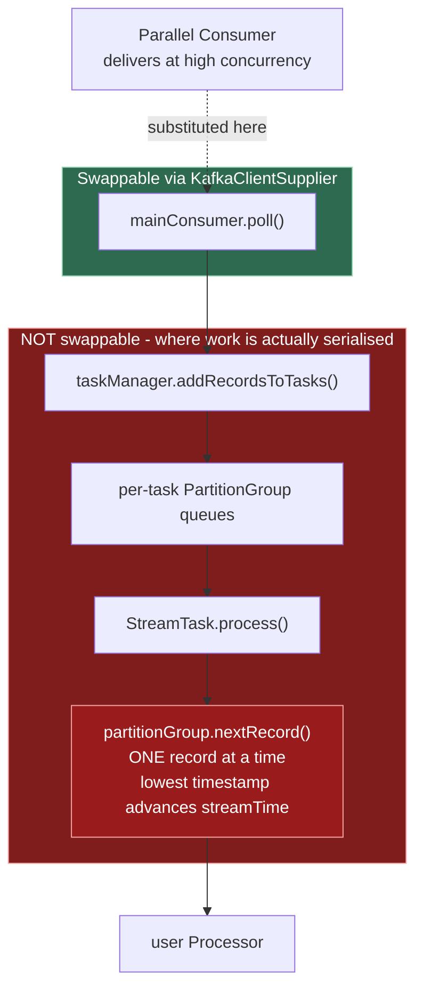

# chore(docs): assess Kafka Streams / Parallel Consumer integration and the fate of confluentinc#390

## Goal Capsule

Write one durable investigation report, `docs/plans/2026-08-07-002-investigate-kafka-streams-on-pc-report.md`,
that settles two questions the fork has never answered in writing:

1. What upstream PR `confluentinc#390` ("Features/streams") actually was, what state it is in, and whether it is revivable.
2. Whether Kafka Streams can be made to use Parallel Consumer as its Kafka client - the idea the PR is
   commonly assumed to embody - and if not, why not.

The report is the entire deliverable. No production code, no README or other documentation changes.

---

## Problem Frame

`src/docs/development/upstream-pr-analysis.adoc:180` ranks `confluentinc#390` **A7** in "Group A - Major
features (top revival candidates)" with the one-line note *"Streams integration | Expands reach to Kafka
Streams users."* That entry is the fork's only record of the PR, and it is thin enough to be misleading:
it does not say what the PR contained, what state the code was in, or what "Streams integration" would
even mean.

Two distinct ideas travel under that name, and conflating them is the actual problem:

- **KS-on-PC** - make Kafka Streams consume through Parallel Consumer, so a Streams topology inherits
  PC's parallelism. This is the idea the ranking implies and the one most people mean.
- **PC-native Streams-like DSL** - a topology-builder API over PC, used *instead of* Kafka Streams.
  This is what `confluentinc#390` actually contained.

Research for this plan establishes that the first is architecturally blocked and the second was never
more than a non-compiling sketch. Neither fact is written down anywhere in the repo, so the A7 ranking
will keep re-attracting effort. The report exists to stop that.

**Scope decision (user-directed).** The report is the only artifact. Corrections to
`src/docs/README_TEMPLATE.adoc`, a `src/docs/development/upstream-map.yaml` entry, an
`upstream-pr-analysis.adoc` verdict revision, and a `docs/inflight/parked-*.md` note were all offered
and explicitly declined for this run. They are recorded in the report as flagged follow-ups so the
finding is not lost, and are listed under Scope Boundaries below.

---

## Requirements

| ID | Requirement |
|---|---|
| R1 | The report states plainly that `confluentinc#390` is a PC-native Streams-like DSL and does **not** make Kafka Streams use PC, and distinguishes the two ideas up front. |
| R2 | The report records the PR's factual state: metadata, file list, and the specific defects that make it unrevivable as-is - each claim verifiable from a named file, line, or SHA. |
| R3 | The report explains why KS-on-PC cannot deliver parallelism, locating the serialisation point *above* the consumer rather than in it. |
| R4 | The report enumerates the concrete `Consumer` contracts a PC-backed wrapper cannot honour, and the order in which Streams' guarantees break if concurrency is forced in. |
| R5 | The report cites the collision evidence that already exists inside this repo (`OffsetEncoding`, `KafkaStreamsEncodingNotSupported`) rather than resting only on external sources. |
| R6 | The report records the Kafka 4.x hazard: `KafkaClientSupplier` is bypassed under `group.protocol=streams`, degrading such an integration to a silent no-op. |
| R7 | The report describes the one viable revival shape (a stateless ack-token DSL), its natural boundary, and what makes stateful operation a different order of undertaking. |
| R8 | The report gives a graded verdict on each of the three directions, including the status quo. |
| R9 | The report separates verified claims from unverified ones, naming what could not be confirmed and why. |
| R10 | The report records the deliberately-out-of-scope follow-ups (R-scope decision above) so they remain discoverable. |
| R11 | Every issue/PR reference below `#1000` is repo-qualified or written as a URL-target markdown link, so `.github/scripts/issue-ref-gate.js` passes. |

---

## Key Technical Decisions

**KTD1. The deliverable is a report under `docs/plans/`, not `docs/solutions/`.**
`AGENTS.md` reserves `docs/solutions/` for write-ups of problems *already solved* and `docs/plans/` for
"dated plan and investigation documents for a specific piece of work". This is an investigation whose
outcome is "do not build this", not a solved defect. Repo precedent for the shape and naming is
`docs/plans/2026-08-01-001-investigate-chaos-w4-red-report.md` and
`docs/plans/2026-08-03-001-investigate-transactional-commit-flake.md`.
*Rejected:* `docs/solutions/` - would misfile an open architectural question as a closed defect.

**KTD2. Lead with the framing correction, not the chronology.**
The single most valuable sentence in the report is that `confluentinc#390` does not do what its title
suggests. A reader who stops after the first section must still leave with that. A chronological
"here is the PR, here is the diff, here is the analysis" structure buries it.
*Rejected:* chronological narrative - defers the load-bearing correction past the point most readers stop.

**KTD3. Prefer in-repo evidence over external citation wherever both exist.**
The PC/Streams commit-metadata collision is provable from `parallel-consumer-core`'s own
`OffsetEncoding` and `KafkaStreamsEncodingNotSupported` classes. In-repo evidence cannot rot behind a
dead link and is checkable by any future reader without network access. External URLs support it;
they do not carry it.
*Rejected:* citing only the Kafka source and KIP wiki - correct but unverifiable from this checkout.

**KTD4. Grade the verdicts rather than issuing a flat "no".**
The three directions fail differently: KS-on-PC is semantically blocked, the DSL is viable-but-scoped,
the topic-hop is already correct. A single "no" would lose the distinction that matters most - that
there *is* a viable shape, just not the one that was ranked A7.
*Rejected:* a binary recommendation - discards the only actionable finding.

**KTD5. Record unverified claims as unverified, in the report body.**
Some supporting sources could not be read directly (see U3). A report that silently launders those into
confident prose is worse than one that is visibly partial, because the next reader cannot tell which
claims to re-check.
*Rejected:* omitting them - loses genuine signal; *rejected:* stating them flatly - overstates confidence.

---

## High-Level Technical Design

The report's central claim is architectural, so the report must carry the picture, not just prose. The
finding is that Kafka Streams serialises work *above* the consumer, which is why substituting the
consumer changes nothing:

The bottleneck sits entirely inside the red region. A consumer delivering at infinite parallelism is
still funnelled through `nextRecord()`, so the ceiling stays "one task per partition, processed
serially" regardless of what supplies the records.

The report should also carry the break-order as an ordered list rather than a diagram - it is a
sequence of consequences, not a topology.

---

## Implementation Units

### U1. Report scaffold and the framing correction

**Goal:** Create the report file with its metadata and the sections that establish what
`confluentinc#390` actually was, so a reader who stops early still leaves with the correction.

**Requirements:** R1, R2, R11

**Dependencies:** none

**Files:**
- `docs/plans/2026-08-07-002-investigate-kafka-streams-on-pc-report.md` (create)

**Approach:**

1. Match the frontmatter/heading convention of the existing `investigate-*` reports in `docs/plans/`
   (read one before writing - do not invent a shape).
2. Open with a short "Bottom line" block carrying the two findings in two sentences, then the
   two-ideas distinction (KS-on-PC vs PC-native DSL) before any history.
3. Write the "What `confluentinc#390` actually was" section from the evidence below. Every claim gets a
   file path, line, or SHA. Do not soften the defects - the point of the section is that the PR is not
   revivable as a code port, and a hedged version fails to make that case.

**Evidence to record (all verified during planning):**

- Metadata: opened 2022-08-17 by astubbs against base `v0.6.x-dev`, head `features/streams`;
  14 files, +754/-22; closed 2023-06-15 by `eddyv` with the entire body *"Closing - Stale."*
  `upstream-pr-analysis.adoc` characterises that date's ~40-PR sweep as administrative rather than a
  substantive rejection - say so, so the closure is not over-read as a technical verdict.
- Content: adds `PCStream`, `PCTopologyBuilder`, `PCTopolgy` (misspelled in the source), and
  `internal/PCTopologyBuilderImpl`, plus `Consumed`, `Produced`, `KeyValue`, `KeyValueMapper`.
  It does not touch Kafka Streams, and adds no `kafka-streams` dependency.
- Completeness: every `PCTopologyBuilderImpl.stream(...)` overload and `build()` return `null`;
  `PCTopolgy` is an empty class body; the example's `applyMap`, `applyFlatMap` stubs return `null`.
- **It has never compiled.** `PCTopologyBuilderImpl` declares
  `private final Optional<Serde<?>> defaultConsumeSerde = Optional.empty();` (and a `defaultProduceSerde`
  twin) at the declaration site, then reassigns both in all three constructors - a definite-assignment
  error. Independently, `Optional.of(serde)` on a `Serde<String>` yields `Optional<Serde<String>>`,
  which is not assignable to `Optional<Serde<?>>`. Two unrelated errors in one 72-line class.
- Provenance hazard: `Consumed.java` and `Produced.java` are verbatim ASF-licensed Kafka Streams
  sources, retaining the Apache header. `bin/check-copyright-headers.sh` models exactly two
  provenances - Confluent-upstream-derived and fork-original - and a fork-original file is *forbidden*
  from claiming third-party copyright. A verbatim ASF file is a third case the gate cannot classify,
  so porting these files would require extending the gate first.
- Redundancy: PC's `PollContext` already carries **deserialised** `K`/`V`, because the user supplies a
  configured `KafkaConsumer`. The `Serde` plumbing in `Consumed`/`Produced` solves a problem PC does
  not have at that layer.
- Blast radius: the example sketch sits inside the `// tag::example[]` region that
  `src/docs/README_TEMPLATE.adoc:572` includes into the published README - the `return null` stubs would
  have shipped into user-facing documentation.
- Branch state: `origin/features/streams` still exists in this clone, tip `e2f1d53e`. Against its
  merge-base with upstream master it is ~47 files, +1570/-340, and drags in an unrelated
  `io.confluent.csid.actors` cluster. It is `0.5.2.2-SNAPSHOT`-era code.
- Collateral API change: the PR introduced named `RecordProcessor.Processor` / `RecordProcessor.Transformer`
  interfaces. Master never adopted them - PC still uses raw `java.util.function.Consumer` / `Function`
  today, and `RecordProcessor` exists nowhere in the tree. Note that adopting them would be source-breaking
  for callers passing a `Consumer`/`Function` *variable* rather than a lambda.

**Patterns to follow:** `docs/plans/2026-08-01-001-investigate-chaos-w4-red-report.md` for report
structure and evidence-citation density.

**Test scenarios:** `Test expectation: none` - documentation-only artifact with no runtime behaviour.
Correctness is enforced by U4's gate checks and by every factual claim carrying a checkable reference.

**Verification:** The section names the two ideas distinctly, and each defect claim can be confirmed by
following its cited path/SHA without re-reading the PR.

---

### U2. Why KS-on-PC is architecturally blocked

**Goal:** Establish, with the serialisation point named precisely, that swapping the consumer cannot
give Kafka Streams parallelism - and that the route additionally degrades to a silent no-op on Kafka 4.1+.

**Requirements:** R3, R4, R5, R6, R11

**Dependencies:** U1

**Files:**
- `docs/plans/2026-08-07-002-investigate-kafka-streams-on-pc-report.md` (modify)

**Approach:**

1. State the mechanism first, using the HTD diagram above: `mainConsumer.poll()` feeds
   `taskManager.addRecordsToTasks()`, which fills per-task `PartitionGroup` queues;
   `StreamTask.process()` then pulls exactly one record via `partitionGroup.nextRecord()`, choosing the
   lowest timestamp across the task's partitions and monotonically advancing `streamTime`. Kafka's own
   architecture documentation says tasks "process messages one-at-a-time" and that maximum parallelism
   is bounded by the number of stream tasks, itself set by partition count.
2. Then the contracts a PC-backed `Consumer<byte[],byte[]>` cannot honour. Keep these as a list, one
   per item - they are independent blockers, not a narrative:
   - `StreamsConfig` hard-writes `partition.assignment.strategy = StreamsPartitionAssignor` and forces
     `enable.auto.commit=false`; the assignor encodes task/standby/warmup state in subscription userdata.
   - `StreamTask.addRecords` owns `pause`/`resume` for its own buffer back-pressure, while PC's design
     keeps records in flight past the poll boundary and pauses for *its* back-pressure. Two owners of
     `pause` is unresolvable.
   - `commitSync(offsets)` takes one scalar monotonic offset per partition. There is nowhere to express
     PC's sparse "5, 7, 9 done; 6, 8 in flight".
   - EOS requires a generation-correct `ConsumerGroupMetadata` from `groupMetadata()` for
     `producer.sendOffsetsToTransaction(offsets, metadata)`.
   - `enforceRebalance(reason)` must force a generation bump on demand.
   - Restore and global consumers are `assign`-based ordered replay; parallelising them is not hard,
     it is meaningless - a changelog replayed out of order yields a wrong store.
3. Then the break-order if concurrency is forced in anyway, as an ordered list: stream time (jumps
   ahead, firing `STREAM_TIME` punctuators early and closing windows over unprocessed records) ->
   state stores (Streams guarantees no shared state between threads; concurrent same-key `put`/`get`
   is a lost-update race) -> EOS (committing offset N asserts everything below N is done; with gaps it
   is not) -> restore/standby/repartition (all require ordered replay and co-partitioned arrival).
4. Then the in-repo proof, per KTD3. Streams encodes stream time into `OffsetAndMetadata.metadata`;
   PC encodes its incomplete-offset bitmap into **the same field**. PC's `OffsetEncoding` reserves
   bytes 1 and 2 as `KafkaStreams` / `KafkaStreamsV2` purely to detect the clash and throws
   `KafkaStreamsEncodingNotSupported`. Quote that class's message. Note both also compete for the same
   4096-byte budget (`OffsetMapCodecManager.DefaultMaxMetadataSize`). Read these files in
   `parallel-consumer-core/src/main/java/io/confluent/parallelconsumer/offsets/` and cite exact paths -
   do not paraphrase from this plan.
5. Then the Kafka 4.x hazard. `KafkaClientSupplier` is **not** deprecated (verified on branches 3.9,
   4.0, 4.1, 4.3 and trunk; still `@InterfaceAudience.Public`). The relevant KIP,
   [KIP-1088](https://cwiki.apache.org/confluence/display/KAFKA/KIP-1088:+Replace+KafkaClientSupplier+with+KafkaClientInterceptor),
   is Under Discussion and never landed
   ([KAFKA-17485](https://issues.apache.org/jira/browse/KAFKA-17485) open, no fix version) - and its
   direction is *away* from what this route needs, replacing supply with wrap. The change that did
   ship is worse than deprecation: under
   [KIP-1071](https://cwiki.apache.org/confluence/display/KAFKA/KIP-1071:+Streams+Rebalance+Protocol)
   (EA in 4.1), `StreamThread.setupMainConsumer` constructs an `AsyncKafkaConsumer` directly and falls
   through to the supplier only on the classic protocol, with `KafkaStreams` emitting a `log.warn` -
   not an exception. So a KS-on-PC integration would **silently stop being used** the moment anyone
   sets `group.protocol=streams`.

**Patterns to follow:** the evidence-density of the existing `investigate-*` reports - mechanism, then
citation, not assertion followed by a link dump.

**Test scenarios:** `Test expectation: none` - documentation-only. The in-repo claims in step 4 are
self-verifying because they name classes present in this checkout.

**Verification:** A reader can locate `OffsetEncoding` and `KafkaStreamsEncodingNotSupported` from the
paths given and confirm the reserved bytes and the thrown message without leaving the repo.

---

### U3. Viable revival shape, prior discussion, verdicts, and honest caveats

**Goal:** Close the report with what *could* be built, what it would cost, a graded verdict on each
direction, and an explicit separation of verified from unverified claims.

**Requirements:** R7, R8, R9, R10, R11

**Dependencies:** U2

**Files:**
- `docs/plans/2026-08-07-002-investigate-kafka-streams-on-pc-report.md` (modify)

**Approach:**

1. **Prior public discussion** - record that this has been asked before and answered informally:
   upstream discussion `confluentinc#596`, where maintainer rkolesnev writes *"it would be easier to do
   it the other way around and figure out a way to add processing parallelisation to Kafka Streams
   instead"*; and `confluentinc#350`, where astubbs suggests *"just output the state store to a topic,
   and then use pc to read from the topic"*. Note that nobody has publicly proposed the
   `KafkaClientSupplier` route - so this report is the first written answer to it.
2. **The viable shape.** Across every framework surveyed the common denominator is small and identical:
   `source -> map/filter/flatMap/branch -> sink`. The real product is not the operators but a
   **per-record acknowledgement token threaded through the chain** - Alpakka calls it
   `CommittableOffset`, Atleon `Alo<T>`, SmallRye the `Message` ack. PC already has that token. A
   stateless DSL over PC therefore compiles down to the existing `pollAndProduceMany` and needs no new
   engine, no new threading, and no state. That is the natural boundary.
3. **Why state is a different order of undertaking.** Four non-JVM projects - Faust, Quix, goka,
   Streamiz - independently converged on the same triple in four languages: an embedded KV store keyed
   by (partition, key), a compacted Kafka topic as its write-ahead log, and an internal repartition
   topic. Every JVM framework declined, with one instructive exception: SmallRye's `checkpoint` strategy,
   whose state is per topic-partition rather than per key, whose only shipped store is `file`, and which
   has no changelog. Two sharpening datapoints: Faust exposed a join API and never implemented it in
   ~8 years; Bytewax pays the alternative price - because its snapshot rather than Kafka is the unit of
   consistency it "does not use consumer groups to store offsets or assign Kafka topic partitions".
4. **Reusing Kafka Streams' own topology is not an option** - worth stating because it is the obvious
   shortcut. `Topology#describe()` returns a `TopologyDescription` whose nodes expose only names,
   predecessors, successors and store *names*; there is no accessor for the `ProcessorSupplier`. You get
   a picture of the graph, not a handle on it. `org.apache.kafka.streams.processor.internals` is absent
   from the Kafka 4.0 public javadoc index. `TopologyTestDriver` is structurally disqualified for
   production use - `MockConsumer`/`MockProducer`, synchronous commit-per-record, single-partition fused
   subtopologies instead of materialised repartition topics, and wall-clock punctuators that fire only
   via manual `advanceWallClockTime`.
5. **Licensing constraints, since this fork is Apache 2.0.** Alpakka Kafka - the closest JVM design to
   learn from - moved to BSL in September 2022;
   [Apache Pekko Connectors Kafka](https://github.com/apache/pekko-connectors-kafka) is the Apache-2.0
   fork taken before that change and is the only licence-compatible JVM reference. Responsive's async
   processor framework is likewise BSL v1.0 and therefore unusable here - though it validates the
   shape, putting a worker pool *below* `Processor#process` with per-key ordering queues and a
   sandboxed `ProcessorContext`. Tellingly, its own `AsyncStreamsKafkaClientSupplier.getConsumer`
   returns a `DelegatingConsumer` overriding only `close()`: the supplier used as a lifecycle hook,
   never as a consumption-model swap. Its documented limits - PAPI only, punctuators unsupported, KV
   stores only, one async node per topology - map the boundary of the achievable.
6. **Landscape context, briefly.** No live async KIP exists: KIP-311 is explicitly abandoned and
   KIP-408's thread has been dead since January 2019. KIP-1112 is "allow custom processor wrapping"
   (Accepted, shipped in 4.0) and has nothing to do with async. Even Streams' own new threading work
   preserves the serialisation - "each processing thread will process at most a single task", under an
   exclusive per-task lock. Kafka's actual answer to PC's value proposition is broker-side
   (KIP-932 Queues), and it makes no mention of Kafka Streams. The README already carries a
   "vs Share Groups" positioning section, so this is consistent with the fork's existing stance.
7. **Graded verdicts** - one short paragraph each, per KTD4:
   - *KS-on-PC via `KafkaClientSupplier`*: **do not pursue.** Not blocked by API surface but by
     semantics; gains nothing while breaking stream time, state, and EOS - and silently disengages on
     Kafka 4.1+ under the streams rebalance protocol.
   - *PC-native Streams-like DSL*: **viable stateless; a rewrite beyond.** A genuinely empty JVM niche.
     Would need its own plan and an explicit stateless boundary. `confluentinc#390` is a design
     reference for the API shape only, not a code port.
   - *Topic-hop (status quo)*: **correct, and already shipped** - `README_TEMPLATE.adoc` `[[streams-usage]]`
     plus the `parallel-consumer-example-streams` module. It is the recommended pattern, not a workaround.
8. **Deliberately out of scope (R10).** Record, as a short list, the follow-ups identified during this
   investigation and explicitly excluded from this run by user decision, so they stay discoverable:
   - `src/docs/README_TEMPLATE.adoc:813-814` states Kafka Streams "doesn't yet (KIP-311, KIP-408) have
     parallel processing of messages", citing one abandoned KIP and one dead since 2019. The wording
     reads as "coming soon" and no longer reflects reality. **Left unchanged.**
   - No `src/docs/development/upstream-map.yaml` entry exists for `confluentinc#390` despite AGENTS.md
     naming that file the source of truth for fork/upstream mapping. **Not added.**
   - The A7 ranking in `upstream-pr-analysis.adoc:180` still reads as a live revival candidate.
     **Not revised.**
   - No `docs/inflight/parked-*.md` note was created for the DSL idea. **Not created.**
9. **Caveats and unverified claims (R9)** - a closing section, stated plainly:
   - The Confluent SIGMOD 2021 and BIRTE 2018 PDFs could not be decoded, so anything attributed to them
     rests on companion blog posts and abstracts, not the paper bodies.
   - KIP-1156, which would formalise an internal-API compatibility contract, is still a draft - so
     "`*.internals` carries no compatibility guarantee" rests on convention plus javadoc exclusion
     rather than stated policy.
   - A Quarkus issue proposing a `quarkus-parallel-kafka` extension ("consume messages in parallel from
     single partition, with possibility to lock on a key level") was closed with no visible resolution.
   - No first-person post-mortem of the form "we built our own lightweight stream processor and here is
     what went wrong" could be found. The closest artifact is Almog Gavra's *"So You Want to Write a
     Stream Processor? Beware of the Duck Syndrome"* (June 2024), which is pre-emptive rather than
     retrospective. Its live URL now redirects to a stub; it is readable from the
     `responsivedev/kafka-streams-archive` repository.

**Test scenarios:** `Test expectation: none` - documentation-only artifact.

**Verification:** Each of the three directions carries a distinct grade and a reason; the caveats
section exists and names specific unverified items rather than a generic disclaimer.

---

### U4. Gate compliance and final read-through

**Goal:** Ensure the report passes the repo's CI gates and reads as one document rather than three
appended sections.

**Requirements:** R11

**Dependencies:** U1, U2, U3

**Files:**
- `docs/plans/2026-08-07-002-investigate-kafka-streams-on-pc-report.md` (modify)

**Approach:**

1. **Issue-reference gate.** `.github/scripts/issue-ref-gate.js` fails any PR whose *added* lines carry
   an unqualified `#NNN` below 1000. `docs/plans/` is **not** in `EXEMPT_PATHS` (only `CHANGELOG.adoc`,
   `upstream-map.yaml`, `upstream-pr-analysis.adoc` and the gate's own fixtures are). Every reference to
   `390`, `596`, `350` and similar must therefore be written `confluentinc#390` or as a markdown link
   whose target is a full URL - the gate strips those. Run the gate's unit test to confirm it is
   green: `node .github/scripts/issue-ref-gate.test.js`.
2. Grep the finished file for bare `#` followed by digits and confirm every hit is either qualified,
   inside a URL-target link, or a KIP number (`KIP-311` has no `#`, so it is unaffected).
3. Read the whole document once, top to bottom, for continuity - U1 to U3 were written as separate
   units and the seams need removing. Check specifically that the "Bottom line" block still matches the
   verdicts in U3 after all three sections exist.
4. Confirm no file outside `docs/plans/` was modified: `git status --porcelain` should show exactly one
   new file. This is the scope guard for the user's "assessment only" decision.

**Test scenarios:** `Test expectation: none` for the document itself. The gate's own test suite
(`issue-ref-gate.test.js`) is the executable check and must pass.

**Verification:**
- `node .github/scripts/issue-ref-gate.test.js` exits 0.
- `git status --porcelain` lists only `docs/plans/2026-08-07-002-investigate-kafka-streams-on-pc-report.md`.
- No bare sub-1000 `#NNN` remains in the added lines.

---

## Scope Boundaries

### In scope
- One new report file under `docs/plans/`.

### Non-goals (this run)
- Any production code. No new module, no DSL, no API change.
- Reviving, rebasing, or porting the `features/streams` branch.

### Deferred to Follow-Up Work
Identified during this investigation, offered, and explicitly declined by the user for this run.
Recorded in the report so they remain discoverable:
- Correct `src/docs/README_TEMPLATE.adoc:813-814` (cites abandoned KIP-311 and dead KIP-408 as
  "doesn't yet").
- Add a `src/docs/development/upstream-map.yaml` entry for `confluentinc#390`.
- Revise the A7 verdict in `src/docs/development/upstream-pr-analysis.adoc:180`.
- Create `docs/inflight/parked-pc-stream-dsl.md` capturing the stateless-DSL idea and its boundary.
- A separate plan for the stateless DSL itself, if it is ever pursued.

---

## Risks & Dependencies

| Risk | Mitigation |
|---|---|
| The report reads as opinion rather than finding. | Every substantive claim carries a file/line/SHA or URL. KTD3 prefers in-repo evidence, which a reader can check offline. |
| Kafka-internals claims drift as Kafka evolves. | Pin claims to the versions verified (3.9 through 4.3, trunk) and name the version in the text, so a future reader knows what was true when. |
| The declined follow-ups are lost once this PR merges. | R10 puts them in the report body as an explicit list, not in the PR description, which is not durable. |
| Issue-ref gate fails late, after review. | U4 makes it an explicit unit with an executable check rather than a final-glance concern. |

---

## Verification Contract

1. `node .github/scripts/issue-ref-gate.test.js` exits 0.
2. `git status --porcelain` shows exactly one added file, under `docs/plans/`.
3. The report contains all of: the two-ideas distinction (R1), the never-compiled evidence (R2), the
   named serialisation point (R3), the contract list and break-order (R4), the in-repo collision
   evidence with paths (R5), the KIP-1071 silent-bypass hazard (R6), the stateless-DSL boundary (R7),
   three graded verdicts (R8), a caveats section (R9), and the declined follow-ups (R10).
4. No unqualified sub-1000 issue reference on any added line (R11).

No test suite run is required: this change adds no code and touches no module. `bin/build.sh` is
unaffected.

---

## Definition of Done

- `docs/plans/2026-08-07-002-investigate-kafka-streams-on-pc-report.md` exists and satisfies R1-R11.
- The Verification Contract passes in full.
- Nothing outside `docs/plans/` is modified.
- A PR is open whose title follows `AGENTS.md`'s `type(scope) #NNN: subject` convention - e.g.
  `docs(streams): assess Kafka Streams integration and the fate of confluentinc#390` - with the
  `.github/PULL_REQUEST_TEMPLATE.md` body completed, every box either `[x]` or `N/A - <reason>`.
- Per `AGENTS.md`, the PR adds **no** `CHANGELOG.adoc` entry.
