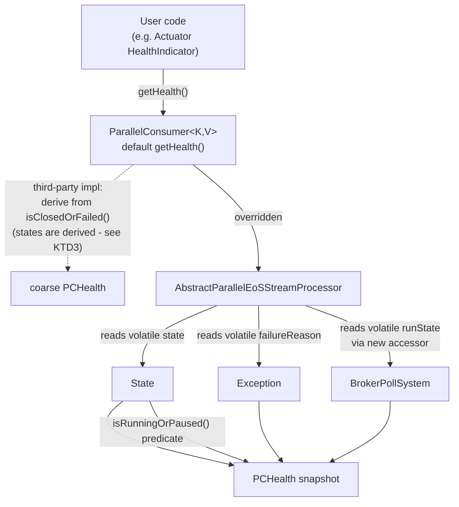
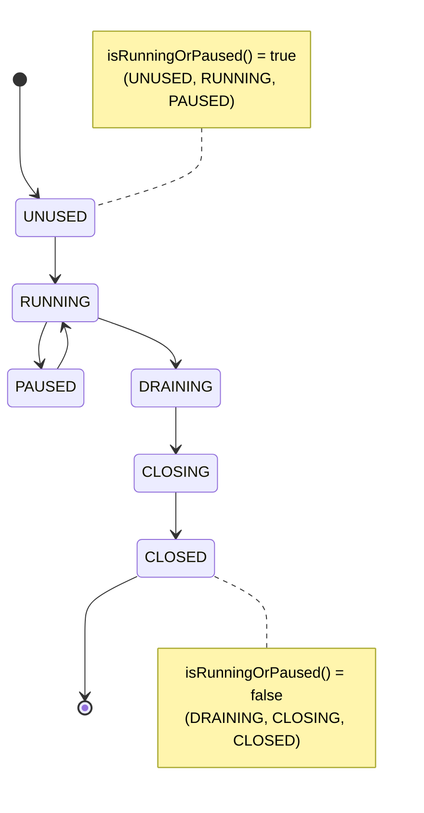

# Health-check API on the ParallelConsumer interface - Plan

## Goal Capsule

- **Objective:** Give users a health signal on the `ParallelConsumer<K,V>` interface that needs no downcast, closing astubbs#126 (mirror of confluentinc#71) and answering the interface half of astubbs#157 (confluentinc#484).
- **Authority hierarchy:** Requirements (R-IDs) win on behavior. Key Technical Decisions (KTD-IDs) win on mechanism. `AGENTS.md` wins on repo process and overrides any conflicting habit imported from global rules - in particular the changelog rule (KTD7).
- **Execution profile:** Additive public API on an unreleased line (0.6.0.0), with two deliberate, recorded exceptions: the `State` package move (KTD1) and the `setState` narrowing (KTD6). Every new interface method is a `default` method so no third-party implementor breaks.
- **Stop conditions:** Stop and report if implementing a stall/progress signal starts to look necessary to satisfy R1-R5 - it is explicitly deferred by KTD5. Stop if `./mvnw process-sources` cannot regenerate `README.adoc`. Stop if changing `BrokerPollSystem`'s existing `runState` initialiser looks necessary - that would move the published `pc.poller.status` gauge values and is out of scope (R8).
- **Tail ownership:** The caller owns commit, push, PR, and CI.

---

## Product Contract

### Summary

Add a public, cast-free health surface to `ParallelConsumer<K,V>`: a `getHealth()` method returning an immutable `PCHealth` snapshot carrying the controller run state, the broker-poller run state, the failure cause, and a derived `healthy` verdict. Promote the existing `State` enum from `io.confluent.parallelconsumer.internal` into the public package so the snapshot has one source of truth rather than a mirrored copy. Make the fields the snapshot reads safely visible from a caller thread, and stop exposing the Lombok-generated public setter on the controller's run state.

### Problem Frame

`ParallelConsumer<K,V>` exposes one health-adjacent method, `isClosedOrFailed()`. It is binary and terminal-only, and it conflates three distinct conditions: `state == CLOSED`, the control-thread future being done, and that future being cancelled. It returns `true` for a clean shutdown and for a crash alike.

The reporter's Spring Boot Actuator indicator therefore has to downcast to `ParallelEoSStreamProcessor` and read `getFailureCause()`, which is declared on the concrete class and not on the interface.

**The delta this change delivers is narrower than "a health check".** For the plain up/down decision, a running, paused, or cleanly closed consumer already gets the same answer from `!isClosedOrFailed()`. What is new is the typed run state (R2) and the cast-free failure cause (R3) - the accessor the reporter currently downcasts for - plus the clean-shutdown-versus-crash distinction that combining them makes possible (AE3). The README section and the commit message body should say that, not oversell a changed liveness verdict.

The controller already tracks everything the answer needs. `State` exists with stable metric values, `failureReason` exists with a public accessor on the concrete class, and both the controller and the broker poller already publish their state as Micrometer gauges (`pc.status`, `pc.poller.status`). None of it is reachable from the interface.

### Requirements

**Cast-free health surface**

- R1. A caller holding only `ParallelConsumer<K,V>` can obtain the current health of the instance without casting to any concrete type.
- R2. The health result exposes the controller's run state as a typed value, not a string or a boolean.
- R3. The health result exposes the failure cause when the instance failed, and reports its absence explicitly when it did not.
- R4. The health result carries a single derived liveness verdict a container orchestrator can act on without interpreting the state enum itself. Liveness only: the verdict answers "does this instance need restarting", not "is this instance consuming".
- R5. The health result reports the controller run state and the broker-poller run state as separate values, so the two subsystems can be told apart. The failure cause is a single unattributed exception sourced from the controller; attributing a failure to a subsystem is out of scope.

**Compatibility**

- R6. No existing public method changes signature. The only removal is the Lombok-generated `AbstractParallelEoSStreamProcessor#setState(State)`, which was never intended as API and is narrowed deliberately before 0.6.0.0 ships (KTD6). The `State` package move (KTD1) is the only other source-breaking change. Both are recorded in `docs/refactoring.md` and named in the commit body.
- R7. A third-party class that implements `ParallelConsumer<K,V>` today still compiles after this change.
- R8. The numeric values published by the `pc.status` and `pc.poller.status` gauges are unchanged, and neither gauge's observed value changes for any lifecycle event.

**Honesty of the signal**

- R9. The API documents that a healthy verdict means "not shut down and not failed", not "making progress", and points the reader at the metrics that show progress.

**Safe concurrent read**

- R10. Reading health from a thread other than the control thread returns the most recently written value of **every** field the snapshot carries - the controller run state, the failure cause, and the poller run state - not a stale cached value.
- R11. The controller's run state is not settable by library users.

### Acceptance Examples

- AE1. **Covers R1, R2, R4.** Given a running consumer held as `ParallelConsumer<String,String>`, when `getHealth()` is called, then it returns a snapshot whose controller state is `RUNNING` and whose `healthy` verdict is true, with no cast anywhere in the calling code.
- AE2. **Covers R3, R4.** Given a consumer whose control loop died with an exception, when `getHealth()` is called, then the verdict is false and the failure cause is present and is that exception.
- AE3. **Covers R4.** Given a consumer that has been closed cleanly, when `getHealth()` is called, then the verdict is false and no failure cause is present - a clean shutdown is distinguishable from a crash, which `isClosedOrFailed()` cannot do.
- AE4. **Covers R4.** Given a consumer paused with `pauseIfRunning()`, when `getHealth()` is called, then the verdict is true - a deliberate pause is not a reason to restart the process.
- AE5. **Covers R5.** Given a consumer paused with `pauseIfRunning()`, when `getHealth()` is called, then the controller state is `PAUSED` and the poller state is `RUNNING` - `pauseIfRunning()` moves only the controller, and the snapshot reports the divergence rather than collapsing it.
- AE6. **Covers R7.** Given a third-party class implementing `ParallelConsumer<K,V>` that does not override `getHealth()`, when it is compiled against the new version, then it compiles, and `getHealth()` returns a verdict derived from its own `isClosedOrFailed()`.

### Scope Boundaries

**In scope**

- The `getHealth()` surface, the `PCHealth` type, the `State` promotion, and the thread-visibility and encapsulation fixes that make the read honest.
- Documentation of the new API in the generated README and in Javadoc.

**Deferred to follow-up work**

- A stall / progress / "stuck" signal. See KTD5 for the evidence and U6 for where the deferral is recorded.
- Attributing a failure cause to a specific subsystem. U6 records it.
- Any new Micrometer meter. `docs/inflight/pr-blockers-and-collisions.md` records that astubbs#57 owns `PCMetrics.java` and `PCMetricsDef.java`; adding a meter here would collide. The existing gauges are untouched by this plan, but U1's enum move does force a one-line import change in `PCMetricsDef.java` - sequence this PR behind astubbs#57 or expect a trivial import-level conflict there.
- Making `getFailureCause()` on `AbstractParallelEoSStreamProcessor` return `Optional`. That is a signature change on an existing public method and is release-gated.

**Outside this change's identity**

- Broker connectivity probing. The abandoned 2022 draft on `origin/features/health-check` implemented health as an AdminClient `describeCluster()` reachability check. That answers "can I reach Kafka", not "is this consumer instance working", and it is not what either issue asks for.
- Changing when `BrokerPollSystem.runState` transitions. It initialises to `RUNNING` at field declaration and is moved only by drain/close/pause, so it reads `RUNNING` before `start()` and after a poll-thread death. Making it more truthful would move the published `pc.poller.status` gauge values, which R8 forbids. This plan reports the field as it is and documents the limitation.
- A general lifecycle state-machine refactor. `docs/refactoring.md` already catalogues that as separate work tied to confluentinc#200.

### Outstanding Questions

- Q1. **Deferred, not blocking.** Should `UNUSED` count as healthy? This plan says yes (it is the pre-`poll()` state, analogous to Kafka Streams' `CREATED`, which the reporter counts as healthy). The failure mode if wrong: a consumer constructed but never polled reads up. Revisiting is a one-line change in `State.isRunningOrPaused()` plus the tests that assert it.
- Q2. **Deferred, resolve before 0.6.0.0 ships.** Should `PCHealth`'s two state accessors return `Optional<State>` so the `default getHealth()` can leave them empty rather than deriving them? The derived default reports `CLOSED` with no failure cause for a crashed third-party implementation, which is the shape AE3 assigns to a clean shutdown. This plan takes the documentation fix (U4 step 1) because the `Optional` unwrap would be paid by every real user forever while the fabrication risk falls on a population verified to be empty in-repo. `PCHealth` is `@InterfaceStability.Evolving` and 0.6.0.0 is unreleased, so the shape can still change.
- Q3. **Deferred, not blocking.** Should there be a readiness-shaped verdict alongside the liveness one? `PAUSED` and `UNUSED` are both live-but-not-consuming, so a caller wiring `isHealthy()` into a Kubernetes readiness probe would keep a permanently-paused instance in rotation. R4 scopes the current verdict to liveness explicitly. A readiness verdict would be a new accessor on `PCHealth`, not a change to `isHealthy()`.

### Sources

- astubbs#126 (mirror of confluentinc/parallel-consumer#71) - the reporter's request and the Actuator snippet.
- astubbs#157 (mirror of confluentinc/parallel-consumer#484) - the same gap reported as a stuck-consumer incident.
- confluentinc/parallel-consumer#464 - titled "Health check and metrics" and ranked A1 in `src/docs/development/upstream-pr-analysis.adoc`, but its single WIP commit contains no health-check code. Its metrics half shipped separately as astubbs#125. It is not a starting point.
- `origin/features/health-check` @8606377f and `origin/feature/health-metrics` @38ed9ade - 2022 drafts, classed as bitrotted design references by `docs/refactoring.md`.
- `docs/solutions/test-flakiness/pc-silent-stall-under-contention-2026-07-29.md` - a PC that polled zero records for 120s with `state == RUNNING`.
- `docs/solutions/test-flakiness/unforceable-trigger-commit-lock-timeout-2026-08-07.md` - commits are only attempted when `wm.isDirty()`, and only success sets dirty.
- `parallel-consumer-core/src/test-integration/java/io/confluent/parallelconsumer/integrationTests/chaostests/ProgressProbe.java` - the project's calibrated stall-detection bounds and its own admission that RED calibration is open.
- `CONCEPTS.md` - control loop vs broker poller are different failures; "stall" is a contested term in this repo.

---

## Planning Contract

### Key Technical Decisions

KTD1. **Promote `State` into the public package rather than mirroring it.** Move `io.confluent.parallelconsumer.internal.State` to `io.confluent.parallelconsumer.State`, unchanged constants and unchanged `getValue()` ints. A mirrored public enum would be exactly the parallel-state duplication the repo's rules warn against, and would need re-syncing every time a state is added. **This is a source-breaking move, not a free one:** `State` is a `public` enum with no JPMS module descriptor, and the published `setState(State)` (see KTD6) is a real, if unintended, way for user code to name the type. An enum has no source-compatible shim - you cannot leave a deprecated forwarder behind - so the move is irreversible once published. It is taken deliberately because 0.6.0.0 has not shipped. In-repo cost is six files, not the two an import grep suggests: `metrics/PCMetricsDef.java`, `internal/AbstractParallelEoSStreamProcessor.java` and `internal/BrokerPollSystem.java` (both currently resolve via `import static ...internal.State.*` and need the new package), `ParallelEoSStreamProcessorTest.java`, `PCMetricsTest.java`, and `internal/ProducerManagerTest.java` (which resolves `State` by same-package rules today and gains a brand-new import). `BrokerPollSystem` also carries three fully-qualified `{@link io.confluent.parallelconsumer.internal.State#...}` Javadoc references that will dangle silently - Javadoc runs with `-Xdoclint:none`, so nothing catches them. The "rename the enum to the standard pattern" item queued on `origin/refactor/minor-changes` @193bbf80 has already landed on master, so nothing further is pending against this type; U6 removes that stale entry.

KTD2. **Every new interface method is a `default` method.** This repo has no binary-compatibility gate - there is no japicmp, revapi, clirr, or animal-sniffer anywhere in the build, and the `<classes>`/`<legacyClasses>` allowlist in `parallel-consumer-core/pom.xml` belongs to the `truth-generator-maven-plugin`, a test-assertion generator. Nothing mechanical would catch an abstract addition breaking a downstream implementor, and `docs/refactoring.md` release-gates breaking public-surface changes to a major bump. `internal/DrainingCloseable.java`, a direct supertype of `ParallelConsumer`, already carries five `default` methods, so the shape has precedent. Satisfies R7.

KTD3. **The `default getHealth()` derives from `isClosedOrFailed()`, and says so.** Rather than throwing `UnsupportedOperationException`, the default returns a coarse verdict built from the one health-adjacent method every implementor already provides. Its Javadoc must state that its state values are derived and that its empty failure cause carries no clean-versus-crash meaning - only a state-backed override distinguishes those. Without that sentence the default reports a crashed third-party instance as a clean shutdown, inverting AE3 for exactly the implementors KTD2 exists to protect. See Q2 for the stronger type-level fix and why it is deferred.

KTD4. **The derived verdict is a predicate on `State`, not a second enum - and the enum does not claim health.** `State.isRunningOrPaused()` returns true for `UNUSED`, `RUNNING`, and `PAUSED`, and false for `DRAINING`, `CLOSING`, and `CLOSED`. The name mirrors `KafkaStreams.State#isRunningOrRebalancing()`, which is the API the reporter named - and note that Kafka Streams deliberately describes what it tests rather than calling the answer "healthy". Naming it `isHealthy()` would put a health claim on the one value that provably cannot support it: every stall documented in this repo happened at `state == RUNNING`, and a method name travels into user code and log lines where the R9 Javadoc does not follow. `PCHealth.isHealthy()` is the composite verdict - the predicate AND the absence of a failure cause - and it is the only place the word "healthy" appears. A separate `Health`/`Status` enum would be a second thing to keep aligned with `State` for no added information. Governs R4, AE4.

KTD5. **Ship state and failure; defer the stall signal.** (session-settled: user-approved - chosen over including a progress/stall signal now: the repo's own evidence says no honest one can be built from what exists today.) Three findings decide this. First, `lastCommitTime` is not a progress marker: `AbstractParallelEoSStreamProcessor:957` only attempts a commit when `wm.isDirty()`, and only `PartitionState#onSuccess` sets dirty, so an all-failing or idle workload freezes `lastCommitTime` on a perfectly healthy consumer. Second, every stall documented in this repo happens while `state == RUNNING`, so the state field cannot carry the signal either. Third, the project's own calibrated `ProgressProbe` still has open RED calibration - it has never reproduced a true unbounded stall on master. Publishing `isStalled()` on that basis would over-promise. R9 requires the Javadoc to say this out loud instead. The residual exposure is real and named: `isHealthy()` returns true throughout the 120-second zero-poll incident in the Sources, which is the incident shape astubbs#157 reports. U6 records the deferral against astubbs#157, which stays open as its home.

KTD6. **Make every field the snapshot reads `volatile`, and narrow the accidental public setter.** `state` is written by at least three threads - the user's `poll()` caller sets `RUNNING`, any user thread sets `PAUSED`/`RUNNING` via pause/resume, the close-caller and control thread set `DRAINING`/`CLOSING`/`CLOSED` - and `grep -n volatile` on that file returns nothing. `failureReason` has the same defect: written by the control thread and by `closeOnException()`, read by the health caller. Leaving it non-volatile means a reader can see a fresh `RUNNING` and a stale null cause and report healthy for a consumer that has already recorded a fatal error - and the "failure overrides state" rule cannot fire on a value the reader cannot see. Both get `volatile`; `BrokerPollSystem.runState` already has it. Separately, Lombok's bare `@Setter` on `state` generates a **public** `setState(State)` while no getter exists, so today any user holding the concrete type can force the instance to `CLOSED`. Shipping a public read API alongside that write hole would be incoherent, so it is narrowed - a deliberate removal, carved out in R6 and recorded in `docs/refactoring.md`. Governs R10, R11.

KTD7. **No CHANGELOG edit in this PR.** `AGENTS.md` states that a PR never adds to `CHANGELOG.adoc` and never creates an `Unreleased` section - the in-flight section is regenerated wholesale at release time from the git log. This inverts the usual changelog-discipline habit. The user-visible value of this API, **and both breaking changes (KTD1, KTD6)**, must therefore be carried by the commit message body, which is the release-notes raw material.

KTD8. **`PCHealth` is a value type, not two interface getters.** It exists for two reasons beyond tidiness. It is the additive extension point for KTD5's deferred stall signal - a new field on an `@InterfaceStability.Evolving` value type is not an interface change - and it is the only shape that can carry a coherent multi-field read, which KTD6's visibility fixes make possible. Shape follows `ParallelConsumerOptions`: `@Getter @Builder @ToString @EqualsAndHashCode` with `private final` fields, plus `@InterfaceStability.Evolving`, the annotation `ParallelConsumerOptions` already uses to mark an evolving public type. (`@Value` does exist on public types here - `state.ConsumerRecordId` - but the builder shape is the better fit for a snapshot that will gain fields.) Java 8 bytecode floor via Jabel rules out records.

### High-Level Technical Design

Health is a read-only projection over state the controller already holds. Nothing new is stored.

The mapping from run state to verdict:

A present `failureCause` forces `PCHealth.isHealthy()` false regardless of state, because a crashed control thread can leave the state field untouched. The poller state is reported but does not participate in the verdict - it diverges from the controller during normal operation (see AE5).

### Assumptions

- A1. `UNUSED` counts as healthy, matching Kafka Streams' `CREATED`. See Q1.
- A2. No third-party code names `io.confluent.parallelconsumer.internal.State`. This is a bet, not a proof - the type is `public` and reachable through `setState(State)` - taken because 0.6.0.0 has not shipped. See KTD1.
- A3. `BrokerPollSystem.runState` is already `volatile`, so no synchronisation work is needed - but it is `private` with no accessor, so U4 adds one. Its initialiser and transition points are left unchanged (see Scope Boundaries).

### Sequencing

U1 comes first - it moves the enum, and both U2 and U3 depend on it. U2 and U3 are independent of each other. U4 depends on U2 and U3. U5 and U6 follow the code.

---

## Implementation Units

### U1. Promote the run-state enum to the public package

- **Goal:** `State` becomes part of the public API surface with one definition, so `PCHealth` can expose it without leaking an `internal` type.
- **Requirements:** R2, R4, R8, R9. Implements KTD1, KTD4.
- **Dependencies:** none.
- **Files:**
  - move `parallel-consumer-core/src/main/java/io/confluent/parallelconsumer/internal/State.java` to `parallel-consumer-core/src/main/java/io/confluent/parallelconsumer/State.java`
  - `bin/check-copyright-headers.sh` (register the move - see step 5)
  - `parallel-consumer-core/src/main/java/io/confluent/parallelconsumer/metrics/PCMetricsDef.java` (import)
  - `parallel-consumer-core/src/main/java/io/confluent/parallelconsumer/internal/AbstractParallelEoSStreamProcessor.java` (import)
  - `parallel-consumer-core/src/main/java/io/confluent/parallelconsumer/internal/BrokerPollSystem.java` (import, plus three fully-qualified Javadoc `{@link}` references)
  - `parallel-consumer-core/src/test/java/io/confluent/parallelconsumer/ParallelEoSStreamProcessorTest.java` (import)
  - `parallel-consumer-core/src/test/java/io/confluent/parallelconsumer/PCMetricsTest.java` (static imports)
  - `parallel-consumer-core/src/test/java/io/confluent/parallelconsumer/internal/ProducerManagerTest.java` (new import - resolves same-package today)
  - `parallel-consumer-core/src/test/java/io/confluent/parallelconsumer/StateTest.java` (new)
- **Approach:**
  1. Move the file and change its package declaration. Keep every constant name and every `getValue()` int exactly as-is - they are a published contract through the `pc.status` gauge description, which is generated from `State.values()`.
  2. Add `public boolean isRunningOrPaused()` returning true for `UNUSED`, `RUNNING`, `PAUSED`. Implement it as an explicit `switch` over the constants, not as an ordinal comparison and not as a constructor field - a field-backed variant changes the enum's constructor arity and could shift the generated `pc.status` gauge description text, which R8 forbids. An explicit switch also forces a deliberate choice when a state is added later.
  3. Javadoc `isRunningOrPaused()` to say it means "not shutting down", and that it says nothing about whether work is progressing (R9). Do not name it `isHealthy()` - see KTD4.
  4. Update every import **and** every fully-qualified `{@link io.confluent.parallelconsumer.internal.State#...}` Javadoc reference (three in `BrokerPollSystem`). Javadoc runs with `-Xdoclint:none`, so a missed link fails nothing and rots silently - grep for the fully-qualified name, do not rely on the build. Search the whole repo including all modules.
  5. Register the move in `bin/check-copyright-headers.sh`'s `RENAMED_FROM_UPSTREAM` block as `parallel-consumer-core/src/main/java/io/confluent/parallelconsumer/State.java|parallel-consumer-core/src/main/java/io/confluent/parallelconsumer/internal/State.java`. Without that entry the script classifies the new path as fork-original, and the retained Confluent header is a hard CI failure. The file stays upstream-derived: it keeps its Confluent line and gains `Modifications Copyright (C) 2026 Antony Stubbs and contributors` beneath it.
- **Patterns to follow:** the existing enum body and its comment explaining that `getValue()` is deterministic rather than ordinal - preserve that comment.
- **Test scenarios:**
  - `isRunningOrPaused()` is true for `UNUSED`, `RUNNING`, and `PAUSED`.
  - `isRunningOrPaused()` is false for `DRAINING`, `CLOSING`, and `CLOSED`.
  - Every constant's `getValue()` still returns its historical int: UNUSED 0, RUNNING 1, PAUSED 2, DRAINING 3, CLOSING 4, CLOSED 5. This is the regression guard for R8 - write it as an explicit per-constant assertion, not a loop over ordinals.
  - `isRunningOrPaused()` covers every declared constant, so a newly added state fails the test rather than silently defaulting. Assert over `State.values()` that each constant is classified by the switch.
- **Verification:** `./mvnw -pl parallel-consumer-core test -Dtest=StateTest` passes; `bin/check-copyright-headers.sh` passes; the module compiles with no remaining reference to `internal.State` in code or Javadoc.

### U2. Make the snapshot's fields safely readable and not user-settable

- **Goal:** A caller thread reading health sees the latest write of every field it reads, and library users can no longer force a state transition.
- **Requirements:** R10, R11. Implements KTD6.
- **Dependencies:** U1 (import path changes in the same file).
- **Files:**
  - `parallel-consumer-core/src/main/java/io/confluent/parallelconsumer/internal/AbstractParallelEoSStreamProcessor.java`
- **Approach:**
  1. Make both the `state` field and the `failureReason` field `volatile`. `BrokerPollSystem.runState` is already `volatile` - leave it alone.
  2. Narrow the Lombok `@Setter` on `state` to `AccessLevel.PACKAGE`. The call sites are already enumerated: main-source transitions assign the field directly (`this.state = ...` at lines 667, 776, 819, 1165, 1167, 1503, 1513), and the only `setState(` call site in the entire tree is `ProducerManagerTest.java:275`, which is in package `io.confluent.parallelconsumer.internal`. `PACKAGE` is therefore sufficient. Do not delete the setter - that test needs it.
  3. Do not attempt the broader thread-model rework. `docs/refactoring.md` records that the SpotBugs stale-thread-write findings may be absorbed by that rework and that fixing piecemeal can conflict; this unit touches only the two fields this API reads, and the commit message should say so.
- **Patterns to follow:** none new - this is a modifier change.
- **Test scenarios:**
  - Existing tests still pass unchanged - the `volatile` half is behaviour-preserving. No new test asserts `volatile` directly, since the JMM offers no portable way to assert it from a test.
  - A reflection test asserting `AbstractParallelEoSStreamProcessor#setState` is not `public`. Use reflection, not ArchUnit: `TestConventionsArchTest` is declared `@AnalyzeClasses(..., importOptions = ImportOption.OnlyIncludeTests.class)`, so a rule about a production class's modifiers would evaluate against an empty set and pass vacuously.
- **Verification:** `bin/ci-unit-test.sh` is green, and the reflection guard fails if the setter is widened back to public.

### U3. Add the public `PCHealth` snapshot type

- **Goal:** One immutable value carries everything a health check needs, so callers do not assemble it from several accessors.
- **Requirements:** R2, R3, R4, R5, R9. Implements KTD4, KTD8.
- **Dependencies:** U1.
- **Files:**
  - `parallel-consumer-core/src/main/java/io/confluent/parallelconsumer/PCHealth.java` (new)
  - `parallel-consumer-core/src/test/java/io/confluent/parallelconsumer/PCHealthTest.java` (new)
- **Approach:**
  1. Immutable value type in the root public package with `private final` fields: the controller `State`, the broker-poller `State`, and a nullable failure `Exception`.
  2. Expose the failure as `Optional<Exception> getFailureCause()` so absence is explicit (R3). Lombok's `@Getter` would generate a raw `Exception getFailureCause()`, so put `@Getter(AccessLevel.NONE)` on that field and hand-write the accessor. This is a *new* method on a *new* type - it does not touch the existing bare-`Exception` `getFailureCause()` on `AbstractParallelEoSStreamProcessor`, which stays as-is per Scope Boundaries.
  3. `isHealthy()` returns the controller state's `isRunningOrPaused()` AND the absence of a failure cause. The poller state does not participate - it diverges from the controller during normal operation (AE5). Document both facts.
  4. Class Javadoc carries the R9 warning: healthy means not shut down and not failed, never "making progress"; point at the `pc.*` Micrometer meters for progress, and mention that a consumer making zero progress can read `RUNNING`. Use the `CONCEPTS.md` vocabulary - "control loop", "broker poller" - and avoid the word "stall" as a defined term, which `CONCEPTS.md` flags as contested. State that the verdict is liveness-scoped (R4) and that the poller state is diagnostic.
  5. Note in the Javadoc that the snapshot holds a reference to the failure `Exception` and therefore to its whole cause chain - a caller retaining snapshots retains that graph.
  6. New fork-original file, so it takes the fork-only copyright header `Copyright (C) 2026 Antony Stubbs and contributors`. Never the Confluent header.
  7. Mark `@InterfaceStability.Evolving`.
- **Patterns to follow:** `parallel-consumer-core/src/main/java/io/confluent/parallelconsumer/ParallelConsumerOptions.java` for the Lombok shape and the stability annotation; `RecordContext.java` for a builder-plus-getter value type.
- **Test scenarios:**
  - A snapshot built with `RUNNING` and no failure reports healthy.
  - A snapshot built with `RUNNING` and a present failure reports **not** healthy - the failure overrides the state.
  - A snapshot built with `CLOSED` and no failure reports not healthy and an empty failure cause. This is the clean-shutdown-versus-crash distinction of AE3.
  - A snapshot built with `PAUSED` and no failure reports healthy (AE4).
  - `getFailureCause()` returns an empty `Optional`, never null, when there is no failure.
  - Controller state and poller state are independently readable and are not conflated (R5) - build a snapshot where the two differ and assert both.
  - A snapshot whose poller state is not `isRunningOrPaused()` but whose controller state is, with no failure, still reports healthy - proving the poller state is excluded from the verdict per step 3.
  - `toString()` includes both states and does not throw when the failure cause is absent. Cheap, but it is what an operator sees in a log line.
- **Verification:** `./mvnw -pl parallel-consumer-core test -Dtest=PCHealthTest` passes.

### U4. Expose `getHealth()` on the interface and implement it

- **Goal:** The cast disappears. This unit is what closes the issue.
- **Requirements:** R1, R3, R5, R6, R7. Implements KTD2, KTD3.
- **Dependencies:** U2, U3.
- **Files:**
  - `parallel-consumer-core/src/main/java/io/confluent/parallelconsumer/ParallelConsumer.java`
  - `parallel-consumer-core/src/main/java/io/confluent/parallelconsumer/internal/AbstractParallelEoSStreamProcessor.java`
  - `parallel-consumer-core/src/main/java/io/confluent/parallelconsumer/internal/BrokerPollSystem.java` (add an accessor - see step 2)
  - `parallel-consumer-core/src/test/java/io/confluent/parallelconsumer/ParallelConsumerHealthTest.java` (new)
- **Approach:**
  1. Add `default PCHealth getHealth()` to `ParallelConsumer<K,V>`. The default builds a snapshot from `isClosedOrFailed()` alone - not closed implies `RUNNING`, closed implies `CLOSED` - with no failure cause and the same value for the poller state. Its Javadoc must state that these state values are **derived, not observed**, and that an empty failure cause from the default carries no clean-versus-crash meaning - only a state-backed override distinguishes those (KTD3, Q2).
  2. Add a package-private accessor for `BrokerPollSystem#runState`. The field is `private volatile State runState = RUNNING;` with no getter, so it is unreadable from `AbstractParallelEoSStreamProcessor` even though both classes sit in `io.confluent.parallelconsumer.internal`. It is already `volatile`; only visibility is missing. Do not change its initialiser or its transition points (Scope Boundaries, R8).
  3. Override `getHealth()` in `AbstractParallelEoSStreamProcessor`. Read each field **exactly once into a local**, in the order `failureReason`, then `state`, then the poller state, and build `PCHealth` from those locals - so the snapshot cannot contradict itself by re-reading a field that changed mid-construction.
  4. There is no not-yet-constructed case to guard: `brokerPollSubsystem` is a `final` field assigned unconditionally in the constructor, so it is never null. Note that `runState` initialises to `RUNNING`, so before `poll()` the honest snapshot is controller `UNUSED` with poller `RUNNING`. Report that divergence; do not mirror one field onto the other.
  5. Do **not** change `isClosedOrFailed()` and do **not** deprecate it (R6). It is used in ~20 places across this repo's own tests and integration tests, including as the standard Awaitility `failFast` death-detector.
  6. `ParallelConsumer.java`'s class Javadoc sits inside `// tag::javadoc[]` and is included into the generated README. Adding a method does not touch that tagged region, but if the class Javadoc is edited at all, U5's regeneration step must run.
  7. All three main files are upstream-derived: add the `Modifications Copyright` line if not already present.
- **Patterns to follow:** `internal/DrainingCloseable.java` for the shape of a `default` method on a supertype of `ParallelConsumer`.
- **Test scenarios:**
  - **Covers AE1.** A running consumer, held in a variable *declared as* `ParallelConsumer<String,String>`, returns a healthy snapshot with controller state `RUNNING`. Declare the variable as the interface type deliberately - that declaration is the regression guard for R1, and a test written against the concrete type would pass while the feature is broken.
  - **Covers AE3.** After a clean `close()`, the snapshot is not healthy, its controller state is `CLOSED`, and its failure cause is empty.
  - **Covers AE2.** After the control loop fails, the snapshot is not healthy and its failure cause is present and is the recorded exception. Reuse the existing mechanism these tests already use to induce a failure rather than adding a new one - check how `ParallelEoSStreamProcessorTest` provokes `failureReason` today.
  - **Covers AE4, AE5.** After `pauseIfRunning()`, the controller state is `PAUSED`, the poller state is `RUNNING`, and the verdict is healthy. Mirror the setup in `ParallelEoSStreamProcessorPauseResumeTest`.
  - Before `poll()` is ever called, `getHealth()` returns controller state `UNUSED`, poller state `RUNNING`, a healthy verdict, and does not throw.
  - **Covers AE6.** A stub `ParallelConsumer` implementing the ten abstract methods it inherits - `isClosedOrFailed`, the four `subscribe` overloads, `pauseIfRunning`, `resumeIfPaused`, and `DrainingCloseable`'s `close(Duration, DrainingMode)`, `close(DrainingMode)`, and `workRemaining` - with trivial bodies, and overriding no health method, compiles and returns a sensible verdict from the inherited default. This is the only in-repo proof of R7, because there are currently no third-party-shaped implementors anywhere in the tree.
- **Verification:** `bin/ci-unit-test.sh` is green. Note that `ParallelEoSStreamProcessor` is in the truth-generator `<classes>` list, so the new getter generates a Truth assertion automatically - a convenient extra surface, though it is generated from method signatures and does not act as a compile-time guard against a throwing getter.

### U5. Document the health API

- **Goal:** A user finds the API without reading the source, and the README does not drift.
- **Requirements:** R9.
- **Dependencies:** U4.
- **Files:**
  - `src/docs/README_TEMPLATE.adoc`
  - `README.adoc` (generated - commit the regenerated output, never hand-edit)
  - `CONCEPTS.md`
- **Approach:**
  1. Add a short README section on health checks near the existing metrics material. Show the cast-free `getHealth()` call and a small Actuator-shaped example, since that is the reporter's stated use case.
  2. State the delta honestly (see Problem Frame): the new capability is the typed state and the cast-free failure cause, and the clean-shutdown-versus-crash distinction they enable - not a changed up/down answer for running, paused, or closed consumers.
  3. State the R9 caveat in the README too, not only in Javadoc: a healthy verdict means not shut down and not failed, it is liveness-scoped, and progress is observed through the `pc.*` meters.
  4. Regenerate with `./mvnw process-sources` at the repo root and commit the resulting `README.adoc` in the same commit. Nothing in CI verifies README freshness, so a stale README is caught by review only - this is the weakest gate in the Verification Contract and the only one protecting the user-facing half of R9.
  5. Add `health` / `health check` to `CONCEPTS.md` if the file's existing entries warrant it, using the control-loop and broker-poller vocabulary already defined there. Follow the format of existing entries.
- **Patterns to follow:** the existing README metrics section; `src/docs/README_TEMPLATE.adoc` include mechanics for tagged source regions.
- **Test scenarios:** Test expectation: none - documentation only. The regeneration is verified by the U5 verification step below.
- **Verification:** `./mvnw process-sources` runs clean, `git diff --stat README.adoc` shows the expected new section and nothing else, and the rendered section reads correctly.

### U6. Record the deferred follow-ups and the breaking changes

- **Goal:** The deferred half of the issue is discoverable rather than lost, and both breaking changes are on the release-gated list, per the repo's in-repo-ledger rule.
- **Requirements:** supports KTD1, KTD5, KTD6, R6.
- **Dependencies:** U4 (the entry records what shipped); can run in parallel with U5.
- **Files:**
  - `docs/inflight/health-check-api.md` (new)
  - `docs/refactoring.md`
- **Approach:**
  1. Create the inflight entry recording what shipped, and what did not and why: the `lastCommitTime`-is-not-progress finding, the `state == RUNNING`-during-stalls finding, and `ProgressProbe`'s open RED calibration. Name **astubbs#157** as the home of the deferred stall work - it stays open, and it is the issue whose reporter asked for exactly that half. Note astubbs#222's head-of-line-blocking offset gap as the candidate mechanism, not as the home. Also record the deferred per-subsystem failure attribution, and cross-reference that `PCHealth` is the extension point a stall signal would land on (KTD8).
  2. Add to `docs/refactoring.md`'s breaking-changes section: promoting `getHealth()` from `default` to abstract, changing `AbstractParallelEoSStreamProcessor#getFailureCause()` to return `Optional`, and - as already-taken rather than queued - the `State` package move and the `setState` narrowing, so the release-notes generator has them.
  3. Remove the now-landed `Rename the enum to the standard pattern (public enum rename)` bullet (`origin/refactor/minor-changes` @193bbf80) from that same section - KTD1 establishes it has already shipped, and leaving it makes the next major-release prep budget for done work against the very type this change relocates.
  4. Do not open a parallel list. `AGENTS.md` is explicit that `docs/refactoring.md` owns deferred work.
  5. If any `TODO(refactor):` marker is added in code, run `bin/todo-index.sh` and commit the regenerated `docs/TODO_INDEX.md` - `bin/todo-index.sh --check` fails CI when stale. If no marker is added, this unit has no automated gate and is review-only; say so in the PR body.
- **Patterns to follow:** existing entries under `docs/inflight/`, and the existing structure of the breaking-changes section in `docs/refactoring.md`.
- **Test scenarios:** Test expectation: none - documentation and ledger only.
- **Verification:** `bin/todo-index.sh --check` passes.

---

## Verification Contract

| Gate | Command | Applies to | Signal |
|---|---|---|---|
| Unit suite | `bin/ci-unit-test.sh` | U1-U4 | All modules green; no weakened assertions |
| Targeted tests | `./mvnw -pl parallel-consumer-core test -Dtest=StateTest,PCHealthTest,ParallelConsumerHealthTest` | U1, U3, U4 | New behaviour proven |
| Full build | `bin/build.sh` | all | Compiles on JDK 17 with the Java 8 `--release` floor; no Java 9+ API used |
| Copyright headers | `bin/check-copyright-headers.sh` | U1-U4 | Passes *after* the `RENAMED_FROM_UPSTREAM` entry lands; new files carry the fork-only header; modified upstream files carry the `Modifications Copyright` line |
| Dangling Javadoc links | `grep -rn "parallelconsumer.internal.State" --include='*.java' .` | U1 | No hits. `-Xdoclint:none` means the build will not catch these |
| No internal leak | manual review of `ParallelConsumer.java` and `PCHealth.java` signatures | U3, U4 | No `io.confluent.parallelconsumer.internal` type appears in a public signature - this is what KTD1 buys |
| README freshness | `./mvnw process-sources` then `git status --porcelain README.adoc` | U5 | Clean after the regenerated file is committed |
| TODO index | `bin/todo-index.sh --check` | U6 | Not stale |

Use `./mvnw`, never system Maven. JDK 17 is required (Jabel).

Cross-module check: `AbstractParallelEoSStreamProcessor` is the only implementor of `ParallelConsumer` in the tree, and vertx, reactor, and mutiny all inherit through it - so their suites should need no changes. Note that `VertxParallelStreamProcessor` and `JStreamVertxParallelStreamProcessor` are public *interfaces* extending `ParallelConsumer`, so a third-party implementor of those also inherits the KTD3 default. If any module suite needs edits, that is a signal the change is wider than intended; stop and report rather than editing them to fit.

---

## Definition of Done

**Global**

- A user holding `ParallelConsumer<K,V>` can call `getHealth()` with no cast, and the test proving it declares the variable as the interface type.
- A clean shutdown is distinguishable from a crash through the returned snapshot, on the state-backed implementation.
- No existing public method changed signature. The only removal is the Lombok-generated `setState(State)`, carved out in R6, recorded in `docs/refactoring.md`, and named in the commit body.
- Every gate in the Verification Contract passes.
- No CHANGELOG edit is present in the diff (KTD7).
- No new Micrometer meter is present in the diff, and no `pc.status` / `pc.poller.status` value changed (R8).
- The regenerated `README.adoc` is committed alongside the template change.
- No abandoned or experimental code remains in the diff - in particular, no half-built stall-detection helper.
- The commit message body explains the user-visible value **and names both breaking changes** (the `State` package move and the `setState` narrowing), because that text is the raw material for the generated release notes.

**Per unit**

| Unit | Done when |
|---|---|
| U1 | `State` lives in the public package, `isRunningOrPaused()` is an exhaustive switch, the per-constant `getValue()` assertions pass, the `RENAMED_FROM_UPSTREAM` entry is registered, and no `internal.State` reference survives in code or Javadoc |
| U2 | `state` and `failureReason` are both `volatile`, `setState` is `AccessLevel.PACKAGE` with a reflection guard, and the existing suite is unchanged and green |
| U3 | `PCHealth` exists with a hand-written `Optional` failure-cause accessor, the failure-overrides-state and poller-excluded-from-verdict rules are tested, and the class Javadoc carries the R9 caveat |
| U4 | `getHealth()` is a `default` on the interface whose Javadoc marks its states as derived, the `BrokerPollSystem` accessor exists, the override reads each field once into a local, and all six acceptance examples have a passing test |
| U5 | The README section exists in the template, states the delta honestly, and the regenerated `README.adoc` is committed |
| U6 | `docs/inflight/health-check-api.md` records the deferral against astubbs#157, `docs/refactoring.md` carries the two queued items plus both taken breaking changes, and the stale enum-rename bullet is removed |
