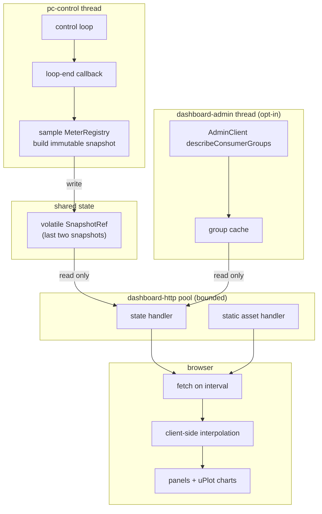

# Embedded Web Dashboard for a Running Parallel Consumer - Plan

## Goal Capsule

**Objective.** Ship a new opt-in Maven module, `parallel-consumer-dashboard`, that a running Parallel Consumer instance serves its own live state from: a single fast page with real graphics, backed by a fetchable state document. Read-only. Off unless asked for. Answers astubbs/parallel-consumer#215.

**Authority hierarchy.** Key Technical Decisions in this plan govern implementation mechanism. Requirements govern product behaviour. Where a unit's Approach appears to disagree with a cited R or KTD, the R or KTD wins. `AGENTS.md` governs build, test, commit, copyright and PR conventions and overrides any generic default assumed here.

**Execution profile.** Five phases, defined in Phased Delivery; read that before starting. Within Phase 1, U1 through U5 build the spine in dependency order and U12 follows immediately, because it is how every later unit gets verified - a panel built without a way to drive the condition it renders is a panel nobody has actually seen work. Phase 1 ends at a decision point: look at it running before building Phase 2 in its visual language. Each unit leaves the page working.

**Stop conditions.** Stop and surface rather than guess if: (a) a core change would alter behaviour rather than add a read-only accessor - adding getters is expected (KTD3), changing semantics is not; (b) the chart library's licence turns out not to permit redistribution inside this jar; (c) the `ChaosConductor` refactor in U12 cannot preserve seed stability (see KTD14).

**Tail ownership.** The calling pipeline owns commit, push, PR and CI.

---

## Product Contract

### Summary

Parallel Consumer holds a lot of state that decides its behaviour, and today the only ways to see any of it are a Micrometer registry the user has to wire up themselves, or DEBUG logs. This module adds a third way that costs the user nothing to try: add one dependency, set one flag, open a page, and see what the instance is doing right now.

The page leads with the thing PC is worst at explaining about itself - the relationship between what has been processed and what has been committed. It renders per-partition offset state as a ribbon rather than a table, so a run of completed work stranded behind a single incomplete offset is visible as a shape instead of inferred from four numbers.

### Problem Frame

Most PC support questions are state questions. "Why is it not committing?", "why is this partition stuck?", "why is memory growing?" are all answerable from state PC already tracks. The information exists; it is not reachable.

Two forces make that worse. Some behaviour cannot be fixed, only observed - the JStream result deque is unbounded by design (astubbs#122, confluentinc#912), because a pull-based `Stream` has no backpressure against a push-based producer, and its own issue was closed won't-fix on exactly that reasoning. And the metrics layer that does exist assumes an operator: ~25 meters and a `MeterRegistry` the user must supply, which is right for production and wrong for a developer trying to understand a local run or a one-off incident at 2am.

The audience for this module is the person who has a PC instance in front of them that is doing something they do not understand, and who has not set up Prometheus.

Being embedded is what makes the difference, and not merely for convenience. An external tool sees whatever the process chooses to export, at whatever interval it is scraped. This module sits inside the engine: it can sample as often as the control loop turns, observe transitions as they happen rather than inferring them from two samples, and render structures - the set of incomplete offsets, the shape of the shard queues - that no metric surface would sensibly carry. The result is that it can show both more detail and fresher detail than anything reading from outside, which is why it is worth building rather than configuring.

There is a second, sharper reason this cannot be bought off the shelf. Parallel Consumer's whole trick is processing a partition massively out of order, at high concurrency, while still preserving per-key ordering and never committing an offset it has no right to commit. Seen from the broker, the only artefact of that is a committed offset advancing in lurches. Every general Kafka dashboard - AKHQ, Kafka UI, Redpanda Console, Conduktor - sees exactly that and nothing else, because everything interesting happens inside the process and never leaves it. This module exists to show the part nobody else can see.

### Requirements

**Packaging and opt-in**

- R1. The dashboard ships as a separate Maven module, `parallel-consumer-dashboard`, published to Central alongside the other library modules.
- R2. A user of `parallel-consumer-core` acquires no HTTP server, no web assets and no new transitive dependency by depending on core.
- R3. The dashboard is inert unless the user both adds the artifact and starts it explicitly. There is no auto-start, no classpath-scanning activation, and no default-on behaviour.
- R4. Enabling the dashboard requires no change to how the user constructs their `ParallelConsumer`, beyond supplying a `MeterRegistry` they already can supply today.
- R26. The module is released as experimental. Its public types carry an experimental marker in source and javadoc, its documentation says so before it says anything else, and its API carries no compatibility guarantee across releases while the marker stands.
- R27. Starting the dashboard logs one line at startup naming it as experimental, so an operator who inherits a process running it can tell what it is without reading the source.

**What it shows**

- R5. Per partition, the dashboard shows last-committed offset, highest sequential succeeded offset, highest succeeded offset, highest seen offset, and the count of incomplete offsets, rendered as one positional graphic per partition rather than as four unrelated numbers.
- R49. The offset view supports more than one visualisation style over the same data, the reader chooses between them, and a mode showing several at once exists for comparison. Adding a further style is a self-contained addition that needs no change to the data model, the page shell, or the other styles.
- R48. At least one of those styles renders the partition as a bar in which each offset is an individually coloured cell, so the scattered, non-contiguous pattern of which offsets above the base commit are already recorded as done is directly visible. Where the offset range exceeds the available pixels, cells aggregate and the aggregate takes the most significant state it covers rather than an average.
- R6. The dashboard shows work in flight, work waiting, shard count, aggregate shard depth, and the dynamic load factor, over time.
- R7. The dashboard shows processed, failed and slow record counts, broken down by topic-partition.
- R8. The dashboard shows offset-encoding health: encoding time, which codecs have been selected, metadata space used and payload ratio used - with the metadata-size ceiling and its pressure threshold marked, so approaching the limit is visible before it bites.
- R9. The dashboard shows the instance lifecycle state and the broker poller state as two distinct indicators, never merged into one health light, because a stalled controller and a stalled poller are different failures with different symptoms.
- R51. The dashboard shows the observations a health check would be built from - the liveness of the control loop and the poller with the age of each one's last activity, partitions whose committed offset has not moved, and the derived per-partition conditions - phrased as measurements rather than as a verdict. When an official health API exists it is rendered alongside these, never instead of them, because a verdict without its evidence is what makes a failing health check hard to act on.
- R10. The dashboard shows partition assignment activity over time, including per-partition assignment epoch changes, so a rebalance is visible after the fact rather than only while it happens.
- R11. The dashboard animates flow between the stages of the pipeline - poller, shards, worker pool, completion, commit - driven by observed rates.
- R53. The dashboard estimates how much faster this instance is running than a single-threaded consumer doing the same work would, presents it as a multiplier, and celebrates a large one visually. It reports a multiplier below one when that is what the numbers say.
- R55. The speedup estimate explains itself. A reader can see the inputs, the arithmetic and the assumptions without leaving the page, and decide for themselves whether they agree with the model. A number a user cannot audit is a number they are being asked to take on faith, and this one is too easy to disbelieve for that to work. A multiplier below one is presented as useful information - it says the configuration is not benefiting from parallelism, which is worth knowing and worth fixing - not as a failure to be hidden.
- R36. The dashboard shows exact record time lag - the age of a record when processing begins, computed as wallclock minus the record's own timestamp - alongside offset lag, and charts the two together so their divergence is visible.
- R39. The dashboard distinguishes the partition conditions that all look identical on a throughput chart, and names each: **idle** (caught up, offsets still, lag zero), **stalled** (offsets frozen with lag flat or rising), **running ahead** (records completed beyond the base committed offset and recorded in the commit payload), **encoding-pressured** (the encoded offset map is approaching or has hit the commit-metadata budget), **paused**, and **failing**.
- R47. The offset view shows head-of-line blocking being *solved*, not merely present. It marks the lowest incomplete offset as the point where a single-threaded consumer would be stopped, renders the work PC has completed beyond that point as won rather than pending, and states the resulting count: records processed that a consumer without this machinery could not have processed. This is the dashboard's headline graphic and its most persuasive number.
- R44. The wording for records completed beyond the base committed offset must convey that they are **safely recorded, not at risk**. They are encoded into the commit metadata, so they survive a restart and are not replayed - which is precisely what a plain Kafka consumer cannot do. Language implying they are uncommitted, pending, lost or in danger is wrong on the facts and inverts the story: this is the library succeeding, not struggling. The panel says what a plain consumer would have had to replay.
- R45. Offset-encoding pressure is shown graphically per partition: how much of the commit-metadata budget the encoded offset map currently consumes, against both the budget and the threshold at which the partition stops accepting more work. A partition that has stopped taking records because its encoded offset map no longer fits is shown as exactly that, distinctly from every other stall cause, because the remedy is entirely different.
- R52. The dashboard shows, per partition, which offset encoding is currently in use, how many offsets that encoding covers, and how efficiently it is packing them - offsets covered against bytes consumed. The encoding is named, not shown as an opaque code, so a reader learns that PC has several and that they behave differently.
- R46. The dashboard surfaces statistics about encoding pressure over time - budget used, which codec was selected, and how often the threshold has been reached - and these are available as metrics, not only as pixels.
- R43. Pausing is shown graphically, not as a count: which partitions are paused right now, marked on the per-partition view, and pause state over time as a band on the timeline so a reader can see that a quiet period was deliberate rather than broken. Where PC's own back-pressure pausing is distinguishable from a user-initiated pause, the two are labelled differently, because one is the library working and the other is the operator intervening.
- R40. Every offset the dashboard shows is accompanied by how long it has been since that offset last changed, and a partition's condition (R39) is derived from a sliding window of recent samples rather than from a configured threshold.
- R41. A self-diagnostic page reports whether the dashboard itself is correctly wired, and remains reachable when the rest of the page cannot render. Each check reads as passed, failed, or not-run-because-an-earlier-check-failed, and a failure states what to do about it.
- R42. The dashboard states plainly that it is a sampled operational view of one instance, not a measurement platform, and points at Micrometer for anything requiring accuracy.
- R37. Derived and time-windowed values carry a confidence signal: how much of the intended sample window actually has data. A dashboard that started thirty seconds ago says so rather than presenting a thin window as a settled reading.
- R38. A derived value that is not meaningful is absent, not zero and not a placeholder. An estimate that only applies under a condition is shown only when that condition holds, and its absence is labelled.
- R12. When explicitly enabled, the dashboard shows enough consumer group context to locate this instance among its peers: the group's members, which member this instance is, and which partitions it holds. It does not attempt to be a group browser.
- R13. Every quantity the page renders is obtainable as a machine-readable document from the same server, so the same information is usable from `curl` and from a test without a browser.

**Feel and quality**

- R56. The page is covered by automated browser tests that both assert against the live DOM programmatically and capture screenshots. Every panel is verified to render what the state document says, rather than merely to compile. Screenshots cover light and dark themes and are written to a gitignored location.
- R14. The page reaches interactive state in under one second against a local instance on a cold load, with all assets served from the jar.
- R15. The page makes no network request to any host other than the instance serving it. No CDN, no fonts, no telemetry, so it works air-gapped.
- R16. Live updates mutate the existing page in place. No full-page reload, no layout shift when a value's width changes, no visible flicker.
- R17. The page renders in both light and dark according to the viewer's OS setting, using a deliberate palette rather than browser defaults.
- R18. The page distinguishes idle from broken. An instance with nothing to do reads as deliberately idle; a snapshot that has stopped arriving reads as stale, with the staleness age shown, rather than freezing or dropping to zero.
- R19. Animation and smoothing are performed client-side between snapshots. Increasing visual smoothness never increases the sampling rate against the running instance.

**Demonstration and verification**

- R28. A runnable scenario driver produces the conditions the dashboard exists to show - sustained throughput, keyed workloads across shards, deliberate failures and retries, head-of-line blocking, slow user functions, and consumer group membership changes that force rebalances.
- R29. The driver runs in two modes: `loop`, which repeats indefinitely for demonstration, and `once`, which performs a single deterministic sweep and exits with a status suitable for use as a test.
- R30. The scenario framework is generic. Scenarios are declared independently of the driver, so a new scenario can be written without modifying the framework, and the framework is usable for purposes unrelated to this dashboard.
- R31. A scenario scripts its phase structure and draws the detail within each phase from a seed. The same scenario and seed reproduce a run exactly; the same scenario with a different seed produces the same sequence of phases with different specifics. Every run logs its seed and a command to replay it.
- R33. A scenario's phases carry postconditions describing the state they intend to produce - for example, that a partition ends the phase with completed work stranded behind an incomplete offset. A phase whose postcondition does not hold is a run failure, so a scenario cannot silently stop demonstrating the thing it exists to demonstrate.
- R34. The demo can record itself. A recording mode captures the dashboard through a full scenario sweep and writes a web-embeddable video plus a poster frame, so the asset is regenerated from the current UI rather than maintained by hand.
- R35. The recording is reproducible from a documented command and a seed, and the generated files are not committed to the repository.
- R32. One command starts everything: a broker, the topic, the producer, the consumer instances and the dashboard, with no prerequisite beyond a working Docker daemon and the repo checkout. It prints the dashboard URL, and shuts the whole thing down cleanly on interrupt.

**Safe defaults - not security features**

The distinction is deliberate and load-bearing. This module ships no authentication, no TLS termination, no role model and no access control (see Scope Boundaries). What it ships is a set of defaults that cost almost nothing and keep the thing from being a liability out of the box.

- R20. The server binds the loopback interface by default.
- R21. The server validates the `Host` header of every request against an allowlist, including when loopback-bound, and rejects requests that do not match. The allowlist is user-extensible for port-forwarding workflows.
- R22. The server emits no CORS headers and rejects cross-origin requests.
- R23. Binding a non-loopback address logs a warning at startup that names the bound address, states that the endpoint is unauthenticated, and enumerates what it exposes - consumer group id, topic names, partition assignments and offsets.
- R24. Every endpoint is read-only. The dashboard exposes no operation that changes the state of the consumer, the group, or the broker. There is no write path, and any future one would be a deliberate reopening of this decision rather than an extension of it. Its practical consequence: the threat model is information disclosure - topic names, group id, partition assignments, offsets - and not integrity or availability.
- R54. The server starts on port 8080 by default. If that port is unavailable it increments and retries - 8081, 8082, and so on - until it binds, silently: no logging during the search, because a failed attempt is not news. Once bound it logs one clear line carrying the full clickable URL. The resulting port therefore identifies which instance you are looking at when several run on one machine, which is the normal case during a demonstration.
- R50. TLS is supported and optional. When enabled without a supplied certificate the server generates a self-signed one so it works with no setup; a user-supplied certificate and key are accepted. It is off by default, because a self-signed certificate makes a browser interrupt with a warning and that would spoil the zero-setup path the module exists for. Enabling it is a single option.
- R25. Reading dashboard state never blocks, delays, or introduces a data race into the control loop or the broker poller.

### Scope Boundaries

**In scope:** what only Parallel Consumer knows about itself. The test for any proposed feature is whether a general Kafka dashboard could already show it. If it could, it does not belong here.

**Deferred to follow-up work**

- Control actions - pause, resume, force commit, close with or without drain. These change the risk profile from information disclosure to availability and integrity, and are not worth coupling to the first version.
- The collector/publisher pattern - PC instances publishing state to a broker topic and a fleet view aggregating them. The snapshot model in U2 is designed to be serialisable so this remains open, but nothing here builds it.
- A dead-letter-queue browser.
- Publishing the demo recording on a landing page. The documentation site is parked and tracked in astubbs#208, with MkDocs + Material as the standing recommendation, so there is no page to embed into yet. This plan produces the recording and the command that regenerates it (R34, R35); astubbs#208 owns placing it. Note the constraint recorded in `docs/inflight/parked-docs-site.md`: do not build anything new that depends on the README embedding other documents.
- Server-sent events or WebSocket transport (see KTD6 for why polling is correct now, and what would change the answer).
- New core meters, including first-class encoding-pressure statistics (R46) and the per-encoder candidate breakdown. Per KTD19 these belong in the standard metric surface rather than as dashboard-private state, and they land as Phase 5 - a follow-on PR alongside astubbs#222's three proposed meters. Deferred by sequencing, not by preference: the dashboard reads the registry rather than named fields, so it picks them up without modification when they arrive.

**Outside this product's identity**

Permanently out of scope, not deferred. These are all reasonable things to want and all already done well elsewhere; building them would trade a dashboard that is uniquely useful for one that competes badly on a feature grid.

- Anything a general Kafka dashboard already shows: topic browsing, message inspection, producing messages, broker and cluster views, partition leadership, schema registry, ACLs, configuration management, or lag charting across a cluster or across groups this instance is not in. AKHQ, Kafka UI, Redpanda Console and Conduktor exist and are better at this than a page inside a library will ever be. The documentation names the boundary and points at them rather than implying we cover it. R12 is the one deliberate exception, held to the minimum - see KTD13.
- **Authentication, authorization, roles, SSO or data masking.** (session-settled: user-directed - chosen over shipping optional auth hooks: these are features, not defaults, and every comparable product puts them in its paid tier for good reason - Sidekiq sells read-only authorization as Enterprise; Redpanda Console and Conduktor gate RBAC, SSO and masking the same way.) If they are ever wanted they belong in a separately licensed or external component, not in the free embedded module. The documentation must be explicit that the endpoint is unauthenticated, and that anyone wanting a credential in front of it puts a reverse proxy there. **TLS is not in this exclusion** - see R50; it is cheap on this server and it is transport, not identity.
- A replacement for Micrometer, Prometheus or Grafana. This is not a general metrics platform. See KTD10.
- A health-check API. The definition of "healthy" belongs to astubbs#126 / confluentinc#71, which is being worked separately. This module renders a health signal when one exists; it does not invent a competing one. See KTD11.

### Sources

- astubbs/parallel-consumer#215 - the originating issue, its body and both author comments. The body's proposed first slice (a JSON endpoint with no UI) is superseded; see KTD1.
- astubbs/parallel-consumer#222 - the three meters that do not exist yet, and the argument for settling them before rendering.
- astubbs/parallel-consumer#216 - unbounded-buffer metrics; carries the rule that `size()` on a concurrent collection is O(n) and must not be sampled.
- astubbs/parallel-consumer#126, confluentinc/parallel-consumer#71 - health checks, the adjacent unfinished work.
- astubbs/parallel-consumer#122, confluentinc/parallel-consumer#912 - the JStream deque. Note the mirror body is stale: it says astubbs#116 addresses it, and the issue's own closing comment says the opposite.
- confluentinc/parallel-consumer#618 - a Prometheus scrape thread evaluating a PC gauge threw `ConcurrentModificationException: KafkaConsumer is not safe for multi-threaded access`. Never mirrored to this fork. This is the recorded precedent for the exact failure this design must avoid; see KTD4.
- `parallel-consumer-vertx/pom.xml` - the `vertx.version` 4.5.31 pin this module matches, and the precedent for keeping it module-local.
- `CONCEPTS.md` - canonical definitions for shard, in-flight work, control loop, broker poller, dirty. The UI uses these terms.

---

## Planning Contract

### Key Technical Decisions

- KTD1. **Ship the rendered UI in the first version, not a bare state endpoint.** (session-settled: user-directed - chosen over the issue body's "JSON endpoint alone, no UI" first slice: the charts and graphics are the point of the request, and a state document with no page does not answer "why has this stopped?" for the audience in the Problem Frame.) The machine-readable document still exists underneath (R13) and is what the page consumes, so it is proven by the page rather than by assertion.

- KTD2. **Serve on Vert.x Web 4.5.x, the version family this repo already vets.** (session-settled: user-directed - chosen over the JDK's built-in `com.sun.net.httpserver.HttpServer`: the near-zero-dependency rule protects `parallel-consumer-core`, and this module is a different beast. Somebody who wants a web server inside their Kafka client has already decided they can afford some dependencies.) `parallel-consumer-vertx` already pins `vertx.version` 4.5.31 and depends on `vertx-web-client`; this module takes `vertx-web` from the same family, so the dependency is already vetted, already version-managed and already understood here. Vert.x 4 supports Java 8, so it needs no baseline contortion today and remains fine after the move to Java 11 for Kafka 4 (astubbs#53).

  What this buys, beyond taste: the JDK server is thread-per-exchange, which is what previously forced server-sent events to pin a thread per open dashboard tab and made a connection cap necessary. Vert.x is event-loop based, so streaming costs no parked thread and KTD6 gets simpler. It also brings routing, a classpath static handler and a JSON layer instead of hand-rolled equivalents.

  Keep `vertx.version` module-local, mirroring `parallel-consumer-vertx` rather than promoting it to the parent. The repo has a recorded scar here: pinning `jackson-databind` globally broke WireMock in the vertx module, and the fix was to keep it module-local. Do not repeat the shape of that mistake with a different library.

- KTD3. **Two sources with different strengths: the `MeterRegistry` and direct in-process reads. Pick per quantity.** Micrometer is a *lossy projection* built for a scrape-interval consumer with bounded cardinality - it is the right shape for aggregates, rates, timers and histograms, and `PCMetricsDef` already publishes every per-partition offset quantity R5 needs, tagged by topic and partition. Read those through the registry: it is less coupling, and the dashboard picks up new meters as they land without tracking field names.

  But the dashboard lives *inside the process*, and that is a qualitative advantage rather than a convenience. Direct reads can sample per control-loop iteration rather than per scrape, react to a state transition rather than wait for a poll, and carry shapes no meter can hold - the full incomplete-offset set rather than its count, per-shard and per-record detail whose cardinality would be irresponsible to export. Where that produces a better answer, read the state directly and add the small read-only accessor it needs. Exact incomplete-offset positions (the scatter R48 renders), per-shard breakdown, `lastCommittedOffset`, the rebalance-in-progress flag and mailbox depth are all in this category. These are additive getters on existing classes; they change no behaviour.

  Neither source is the fallback for the other. The registry is right for what an operator would alert on; direct reads are right for the high-frequency, high-cardinality, rich-shape detail that is the whole reason an in-process dashboard can show things an external tool cannot.

  Sequencing rather than avoidance: astubbs#57 lands first and touches `PartitionState`, `PartitionStateManager`, `ShardManager`, `PCMetrics` and `PCMetricsDef`. Take its versions of those files and build on top. A merge conflict is a normal cost of parallel work, not a reason to design around a file.

- KTD4. **Build the snapshot on the control thread and serve an immutable copy from a volatile field.** `AbstractParallelEoSStreamProcessor.addLoopEndCallBack(Runnable)` is already public and already runs on the control loop. The callback samples the registry, constructs an immutable snapshot, and publishes it to a volatile reference; the HTTP handler only ever reads that reference. This is the whole answer to R25 and it is not a precaution - confluentinc#618 is a recorded instance of a scrape thread evaluating a PC gauge and hitting `ConcurrentModificationException` from `KafkaConsumer`, because gauge evaluation happens on the reading thread. Sampling on the control loop makes every gauge evaluation happen where it already legally happens. It also protects against three further hazards the research surfaced: `RetryQueue.size()` reads a plain `HashMap` without the lock every other method takes; `RetryQueue.iterator()` holds the read lock until closed, so a handler that forgets to close it deadlocks the control loop permanently; and `PartitionState.getAllIncompleteOffsets()` runs on the common ForkJoinPool.

- KTD5. **Take uPlot as a build-time Maven dependency; never commit it to version control.** (session-settled: user-directed - chosen over vendoring the minified file into `src/main/resources`: a third-party build product does not belong in git.) Mechanism is the WebJar (`org.webjars.npm:uplot`), an ordinary versioned, checksummed, cached Maven dependency whose resources sit on the classpath under `META-INF/resources/webjars/uplot/<version>/`, served directly by the static handler. The artifact is a build input, not a source file, and `git status` is clean after a build.

  **Version note:** the WebJar lags npm. The newest published WebJar is 1.6.30 (verified against Central), where npm is on 1.6.32; the module pins 1.6.30. Its jar carries `dist/uPlot.iife.min.js` (49,672 bytes), `dist/uPlot.min.css` (1,857 bytes) and `LICENSE` - everything needed, licence included. Re-check for a newer WebJar when bumping.

  uPlot itself remains the right library: ~50 KB, MIT, zero runtime dependencies, plain `<script>` global, Canvas 2D and built for live time-series - against Chart.js at 208 KB plus a separate date adapter for time axes, and ECharts at 1.1 MB. Still rejected: an npm or webpack step, which would put Node into a Java library's build and CI for one file. Note KTD16's last rule - charts are the exception here, not the default - so this dependency serves three or four panels, not every panel. Obligation: the licence ships with the artifact and `NOTICE` records it.

- KTD6. **Push updates over server-sent events, with a hard connection cap, and keep polling as the fallback.** (session-settled: user-directed - chosen over interval polling as the only transport: server-push is the better system, and the objection to it is boundable rather than fundamental.) What SSE buys is real - no round-trip per tick, no wasted transfer when nothing changed, lower latency, and a client with no interval bookkeeping or in-flight de-duplication. WebSocket remains out: it buys nothing over SSE for a one-way feed, and a bidirectional channel into a read-only dashboard is a surface with no purpose (R24).

  The objection that previously ruled SSE out has gone with KTD2. On the JDK's thread-per-exchange server each open stream pinned a pool thread for its life, which forced a connection cap. Vert.x is event-loop based, so an idle stream costs a registration rather than a thread, and streams scale with memory instead of with the pool size. Keep a generous connection cap anyway - a bound nobody reaches is cheap insurance against an accidental scrape loop - and an idle timeout that reaps streams whose client vanished without closing.

  Retain the polling endpoint. It costs almost nothing on top of the same snapshot, it is what makes the state fetchable with `curl` for R13, and it is the fallback when a proxy buffers or strips the event stream, which is the one failure mode SSE has that polling does not. The client treats a failed or capped stream as "fall back to polling" rather than as an error. `EventSource` reconnects natively, so a dropped stream must be normal rather than exceptional on both sides.

- KTD7. **Interpolate client-side between snapshots.** Animation reads from the last two snapshots and tweens; it never drives the poll interval. This is what keeps R19 true, and it is the difference between a dashboard that looks alive and a dashboard that is the load.

- KTD8. **Serialise with the JSON layer Vert.x already brings, and encode offsets as JSON strings.** Hand-rolling a writer was justified only while the module had no JSON library available; `vertx-web` brings one, so writing ~150 lines of escaping by hand would now be inventing a well-known source of subtle bugs for no gain. Keep the version module-local per KTD2 rather than pinning it in the parent.

  The correctness rules survive the change of mechanism, because they are about the data rather than the library:
  - **Exact offsets serialise as JSON strings, chart series as numbers**, consistently per field and documented. RFC 7493 states a receiver cannot be expected to treat integers outside +/-(2^53-1) exactly, and `JSON.parse` corrupts such a value *silently* - no error, no warning, and the damage is invisible until two offsets are compared. Kafka offsets are `long`. The browser reads them with `BigInt` where it needs arithmetic and renders the string otherwise.
  - **`NaN` and infinities serialise as `null`.** RFC 8259 forbids them outright, and ratio and rate calculations produce them from zero denominators readily. Confirm the chosen encoder's behaviour here rather than assuming it - encoders differ, and some emit the literal token, which is invalid JSON that strict parsers reject.
  - **UTF-8, no BOM.** Topic names, group ids and client ids can contain non-ASCII.

- KTD9. **Ship safe defaults, not security features; loopback by default and validate the `Host` header unconditionally.** The feature side is settled and out (see Scope Boundaries): no auth, no TLS, no roles. This decision covers only what is left, which is cheap and which the module would be irresponsible without. Binding loopback does not stop DNS rebinding - the attacker's page is served from their domain, DNS is rebound to `127.0.0.1`, and the browser issues requests to the loopback server from the attacker's origin. This is current, not theoretical: CVE-2024-28224 against Ollama, CVE-2025-66414 against the MCP TypeScript SDK. The cited mitigation is a `Host` allowlist, so that is what ships, extensible for port-forwarding. Bind via `InetAddress.getLoopbackAddress()`, which is correct for IPv4 and IPv6 and performs no DNS lookup - not `getLocalHost()`, which is Pekko's mistake of a default that is sometimes loopback and sometimes routable. Rejected: Kafka Connect's posture of all-interfaces and unauthenticated by default.

  **TLS is in scope and cheap here** (R50). Vert.x makes it a couple of options, and it can generate a self-signed certificate so enabling it needs no preparation. It also happens to be the strongest available answer to the rebinding problem below - certificate validation fails when the IP changes underneath, which defeats the attack outright rather than detecting it. Default it off so the zero-setup path is not interrupted by a browser certificate warning, and make turning it on one option. Accept a supplied certificate and key for anyone who has real ones.

  The `Host` check specifically is not enterprise security and must not be dropped as such. It is roughly fifteen lines, and without it the claim "loopback only" that the documentation makes is false: a page the user is browsing can rebind DNS to `127.0.0.1` and read this dashboard from its own origin. That is a current attack class with recent CVEs against exactly this shape of localhost-bound tool. Anyone wanting a credential in front of the endpoint puts a reverse proxy there; that is a deployment choice, not something this module implements.

- KTD10. **A dashboard definition would not have served this audience, so build the page.** astubbs#215 asks whether shipping a Grafana dashboard would be the better use of effort, and nothing in either tracker has ever answered it. The answer is that they address different people. Grafana requires the user to already run Prometheus, wire a registry, scrape the process and import a dashboard - reasonable for an operator with standing infrastructure, and useless for a developer debugging a local run or an engineer opening an incident on an instance that was never scraped. This module's value is that it needs none of that. It complements Micrometer and does not replace it: same underlying numbers, different audience and time horizon. Nothing here forecloses shipping a Grafana dashboard definition later; they are not competing.

- KTD11. **Show health-equivalent observations now; adopt the official verdict when it exists.** (session-settled: user-directed - chosen over waiting for astubbs#126 before showing anything health-shaped: the information is the point of the dashboard, and withholding it until another PR lands would make the first version much less useful for the incident case it is built for.) The distinction that keeps this from becoming a competing definition of healthy: the dashboard renders **observations**, not a **verdict**. Facts like "poller RUNNING, last poll 0.2s ago", "control loop RUNNING, last iteration 0.1s ago", "3 partitions with no committed-offset movement for over 5 minutes", and the derived per-partition condition from KTD17 are measurements anyone can check. "This instance is healthy" is a judgement, and that judgement belongs to astubbs#126 / confluentinc#71, which is the acknowledged missing half of the pair that delivered the metrics layer and is being built separately.

  So: surface the constituent signals now, keep them phrased as observations, and when the health API lands, render its verdict alongside them rather than replacing them - a verdict without its evidence is exactly what makes health checks frustrating to debug. The health work does not need to ship a second embedded HTTP server; this module is the surface, per KTD13's boundary with the parallel work.

- KTD12. **Ship it experimental, and make the marker structural rather than a sentence in a README.** (session-settled: user-directed - chosen over releasing it as ordinary stable API: this is a first cut at a surface that will change once people use it, and an unmarked module acquires compatibility obligations the moment someone depends on it.) Use the annotation the codebase already uses rather than inventing one: `org.apache.kafka.common.annotation.InterfaceStability.Unstable`, from `kafka-clients` which is already a dependency, and the sibling of the `@InterfaceStability.Evolving` that `ParallelConsumerOptions` already carries. Apply it to every public type in the module, plus an experimental note in the javadoc, the first line of the module README, and a startup log line (R27). The annotation is the part that matters - documentation is read once, annotations are seen at every use site and by every IDE. Off-by-default (R3) is a separate property and both are required: experimental says the shape may change, disabled-by-default says nothing happens unless you ask for it. Rejected: a new fork-local `@Experimental` annotation, which would duplicate an existing convention; and marking it experimental in prose only, which is invisible from the call site.

- KTD13. **Every panel must show something no general Kafka dashboard can.** (session-settled: user-directed - chosen over building a broadly-capable Kafka dashboard: a page inside a library cannot win a feature comparison against AKHQ or Conduktor, and does not need to, because the whole class of things it can show is invisible to them.) The differentiator is that PC processes a partition massively out of order at high concurrency while preserving per-key ordering and offset correctness, and from the broker the only visible artefact is a committed offset advancing in lurches. So the panels that earn their place are the ones rendering in-process state: the succeeded-but-not-committable span, the incomplete offsets holding the commit back, shard queues and how work spreads across them, in-flight versus waiting, the retry backlog and its schedule, the dynamic load factor adapting, and offset-encoding health - which is a genuinely PC-specific failure mode, since the encoded offset map is bounded by the broker's metadata limit and hitting it has consequences most users never see coming. Applied as a test on every future feature request, not just on the units here: if a general Kafka dashboard could already show it, it does not belong. The consequence for R12 is that consumer group state shrinks to answering "which member am I and what do I hold" - enough to locate this instance among its peers, and nothing more; it is the only item on the page that a general dashboard also covers, and it stays only because knowing whose state you are looking at is a precondition for reading everything else.

- KTD14. **Generalise `ChaosConductor` in place into a scenario driver; do not build a second framework beside it.** (session-settled: user-directed - chosen over a standalone demo harness layered on top: a parallel fleet-orchestration implementation would drift from the first, and `AGENTS.md` requires extending the existing harness rather than adding one.) The chaos suite already manages a fleet of PC instances, already applies `STOP_DRAIN`, `STOP_NO_DRAIN`, `RESTART` and `JOIN_NEW` on a tick plan, and already separates the plan (`planTicks`) from its execution. Generalising means three changes at those existing seams: make the plan source pluggable so a scripted plan and a seeded random plan are two implementations of one interface; make the action set extensible so workload actions (change publish rate, fail a proportion of records, fail one key repeatedly, slow the user function) register alongside the membership actions instead of being fixed in an enum; and separate scenario declaration from the driver so R30 holds. The chaos scenarios then become one consumer of the driver and the showcase scenario another.

  **Scripted structure, seeded detail.** A scenario is a scripted sequence of phases; the actions inside a phase are drawn from the seed against that phase's weights and bounds. Scripting alone would make every demo loop identical and give a test nothing to explore; seeding alone could not guarantee the demo actually reaches head-of-line blocking before someone stops watching. The hybrid guarantees the shape and varies the specifics, and it subsumes the existing chaos behaviour rather than replacing it: a chaos scenario is one phase with wide weights, which is what W1 and W4 already are. Phase postconditions (R33) are what keep the guarantee honest - a phase that was supposed to strand work behind a failure and did not is a failed run, not a quiet non-event.

  **Hard invariant on the refactor: seed stability.**

- KTD15. **Compute exact record time lag by decorating the user function, and make it the headline number.** Every external Kafka tool approximates time lag by interpolating between offset samples, because a tool outside the consumer cannot see record timestamps. That is not an oversight - KIP-489 proposed exposing exactly this metric from inside the consumer and has been "Under Discussion" since January 2020 without adoption, so the whole ecosystem has spent six years working around its absence, inheriting cold-start error, a NaN whenever the producer goes idle, and smoothed-away bursts. Parallel Consumer is inside the consumer and holds the `ConsumerRecord`, so `now - record.timestamp()` is exact, costs one subtraction, needs no lookup table and has no idle pathology. Charted against offset lag on a shared time axis, the divergence between the two is the single most informative thing this dashboard can show: offset lag rising with time lag flat means volume, time lag rising with offset lag flat means staleness, and no external tool can tell you which.

  Mechanism, and it keeps KTD3 intact: the dashboard offers an optional decorator the user wraps their function in, which records the measurement into the same `MeterRegistry`. That registers a meter from the dashboard's own code directly on the registry - it does not go through `PCMetrics` and therefore does not touch astubbs#57's files, and it does not interact with the duplicate-registration leak that PR fixes. It stays opt-in because wrapping the user's function is not something a dashboard should do behind their back, and the panel degrades to offset lag alone when undecorated, saying so rather than showing an empty chart. Every chaos run logs its seed and a replay command, and the probes are calibrated against the real historical drain-zombie defect with thresholds sitting in measured gaps. If the refactor perturbs the order or count of random draws, every previously recorded seed silently stops reproducing the schedule it used to, and the calibration is quietly void - a failure that looks like nothing at all. So the refactor is behaviour-preserving by construction: for a given seed, the generalised driver must produce a draw-for-draw identical plan to the current one, asserted by a test, and the existing chaos ITs must pass unchanged. If seed stability cannot be preserved, stop and surface it rather than accepting a "close enough" schedule.

- KTD16. **Rendering rules taken from what the existing tooling got right and wrong.** These bind every panel, so they are stated once here and cited rather than repeated per unit.
  - **Never average in a lag, in-flight or retry chart; bucket by maximum.** Averaging over a wide window is the specific criticism levelled at existing tools, and it erases precisely the transients that matter here - a retry storm and an in-flight burst are short by nature.
  - **An absent series beats a nonsense value** (R38). An estimate that only holds while catching up is drawn only while catching up, with the panel titled to say so. This is also how idle stays distinguishable from stalled.
  - **Carry a completeness figure on anything derived from a window** (R37), so a dashboard thirty seconds old degrades visibly instead of asserting a confident reading from three samples.
  - **Above roughly twenty partitions, plot per-partition series as points rather than lines**, with isolation controls. Lines become unreadable spaghetti at that cardinality; the pin form was the working answer in Confluent's own tooling, and the line form is what a competitor had to abandon.
  - **Plot state as a step function, not an interpolated one.** A consumer group state or a run state does not slide between values, and a state-change count beside it turns the strip into the rebalance history that is otherwise only available commercially.
  - **Plot a signed rate on an axis centred at zero**, so falling behind and catching up are distinguishable at a glance rather than by reading the number.
  - **Never derive a record count from `endOffset - startOffset`.** It is wrong under log compaction, and it is a bug that has actually shipped elsewhere. Where the dashboard cannot obtain a true count, it shows the offsets and does not invent the count.
  - **Divide a counter delta by measured elapsed time, never by the nominal poll interval.** A well-known dashboard's realtime graph reads roughly double because of exactly this, and the error is invisible without a reference.
  - **Never let a row vanish during a rebalance.** A partition that disappears from the snapshot renders as a placeholder row saying so, rather than shrinking the table under the reader - another lesson learned the hard way elsewhere.
  - **Show both a liveness pulse and a last-updated age.** The pulse answers "is this working", the age answers "how stale is this", and neither substitutes for the other.
  - **Tint the whole row for a warning condition, not just its badge.** It reads at a glance across a wide table where a badge does not.
  - **When rolling child states into a parent, take the highest-attention colour.** One red partition makes the group red.
  - **Times are relative in the cell, absolute on hover.**
  - **Reserve charts for where the shape over time is the message** - time-lag against offset lag, lag velocity, work in flight. The market-leading open-source Kafka UI ships no charting library at all and is not worse for it, so a table or a bespoke bar is the default and a chart is the exception that has to earn its place.

- KTD17. **Derive partition condition from a sliding window, using threshold-free rules.** Burrow's evaluation model is the proven prior art and its headline is literally "no thresholds": keep the last N samples of committed offset and lag per partition, then classify by *shape*. Any zero lag in the window means healthy. Offsets unchanged across the whole window with lag flat or rising means stalled. Offsets advancing but lag never decreasing between any pair means falling behind. Time since last commit exceeding the window's own span means stopped - which self-scales instead of needing a configured timeout. Add the condition Burrow has no concept of: highest-succeeded advancing while committed does not, which is *blocked* (R39). Carry a completeness figure alongside every verdict (R37) so a dashboard thirty seconds old degrades to "not enough data" instead of alarming on boot. Also carry Burrow's rewind case - offsets going backwards - flagged only until they recover past their previous high-water mark.

- KTD18. **Treat in-consumer lag as unreliable for paused partitions, and say so rather than smoothing it.** This is a recorded failure in the closest comparable product: Karafka's per-partition lag went stale on paused partitions because the underlying client stops refreshing metadata for them, and their fix was to add a second, independent lag source rather than paper over the first. Parallel Consumer pauses partitions as a matter of routine, so this is not an edge case here - it is the normal path. The dashboard marks lag for a paused partition as stale, showing the age of the reading rather than a number that looks current. Obtaining a second source from the `AdminClient` is the natural remedy and belongs with U10's opt-in network calls, not in the default path.

- KTD19. **Promote a quantity to a meter where it makes sense - not as a blanket rule.** (session-settled: user-directed - chosen over both extremes: over letting the dashboard accumulate purely private measurements, since an operator with Prometheus should be able to alert on what matters; and over requiring everything on screen to be a meter, since that would cap the dashboard at what Micrometer can sensibly carry and throw away its main advantage.) The test is the audience: **would someone want to alert on this, or chart it over days?** Then it belongs in `PCMetricsDef` and both surfaces get it. Is it high-frequency, high-cardinality, event-shaped, or a structure rather than a number? Then it lives in-process, and exporting it would be worse for everyone. Encoding-budget statistics (R46) pass the first test; the per-offset scatter of R48 obviously fails it.

  Two constraints shape how the promotions land:

  - **Sequencing.** astubbs#57 lands first and rewrites `PCMetrics.java` and `PCMetricsDef.java`; astubbs#222 already proposes three meters (head-of-line-blocking-avoided, end-to-end poll-to-completion latency, per-shard queue distribution). New meters therefore land as Phase 5, a follow-on PR built on astubbs#57's versions and aligned with astubbs#222 - kept out of the dashboard PR to keep that one reviewable, not because the files are off limits (KTD3). The dashboard renders what exists now and picks the rest up unmodified, because it reads the registry rather than named fields.
  - **Cardinality and frequency.** Per-partition and per-shard labels are a well-known cardinality hazard in Prometheus, and a meter sampled at scrape interval cannot represent something that changes every control-loop iteration. Both are reasons a quantity stays in-process rather than becoming a meter, and neither is a compromise - the page is simply the better home for it. Anything genuinely high-cardinality or high-frequency is exportable only behind an explicit opt-in, if at all. Note PC already exports per-partition offset gauges, so this governs what is *added*, not what exists.

- KTD20. **Make the offset visualisation pluggable, and ship several styles to be compared in use.** (session-settled: user-directed - chosen over committing to one rendering up front: this graphic has no prior art anywhere, so there is no established form to copy and no way to know from a drawing which reading works best under real load.) Define one renderer contract - given a partition's offset state, draw into a container - and register implementations against it. The page offers a style picker and a show-all comparison mode, and the choice persists locally.

  The styles are genuinely different readings rather than skins, and each answers a question the others answer badly:
  - **Cell bar** (R48) - one cell per offset, coloured by state. Shows the scattered texture of out-of-order completion. Answers "what does the inside of this partition actually look like".
  - **Span ribbon** - the four markers with the spans between them. Shows proportion at a glance and scales to many partitions on one screen. Answers "how far ahead is PC running".
  - **Offset-over-time chart** - x is time, y is offset, with the four boundaries as lines and the won band filled between two of them. Answers "how did this gap develop", which neither positional view can. This is the tcptrace time-sequence idiom, which is the established way to draw exactly this shape of data in a different domain.
  - **Dense table with time-since-last-change** - the least glamorous and, on the evidence, the highest diagnostic value per line of code: it is time-since-change rather than the offset itself that identifies a stall (KTD17).

  Keeping the contract narrow is what makes this cheap: renderers receive a prepared per-partition view model and own only drawing. Whichever style wins in practice can later become the default without disturbing the others.

- KTD21. **Estimate the speedup over a single-threaded consumer, and build the honesty in first.** (session-settled: user-directed - chosen over showing only absolute throughput: a raw records-per-second figure means nothing without a baseline, and the baseline is exactly what makes PC's value legible.) The model: a single-threaded consumer processes records one at a time, so its ceiling is approximately one record per mean user-function duration. PC already meters that duration, and observed throughput is a counter delta, so the multiplier is observed throughput divided by modelled single-threaded throughput. Show it prominently, with escalating visual treatment at large multiples.

  The number is only worth having if it is trustworthy, so three rules bind it. **It must be able to disappoint**: when the user function is fast and key cardinality is low, PC's coordination overhead can exceed its benefit and the honest multiplier is below one. Render that rather than clamping to a flattering floor - a meter that can only flatter is decoration, and the first person who catches it lying stops believing the rest of the page. **It must show its working**: the mean duration, the achieved concurrency and the observed throughput sit beside the multiplier, so a sceptical reader can check the arithmetic instead of trusting it. **It must be labelled a model, not a measurement**, consistent with R42 - and be explicit that it models the *processing-bound* case only.

  Note what the model deliberately leaves out, because it understates rather than overstates: a single-threaded consumer hitting a poisoned record stalls the whole partition until it gives up, where PC continues past it. That effect can be unbounded and is not something a multiplier can honestly express, so the head-of-line-blocking-avoided count (R47) carries it separately rather than being folded in to inflate this number.

- KTD22. **Automated browser testing from Phase 1, not bolted on later.** (session-settled: user-directed - chosen over relying on an agent eyeballing screenshots: "it compiles" and "it looks plausible in one screenshot" are both weak evidence that the page renders what the code intends, and the gap only widens as panels accumulate.) Two capabilities are required and they are not the same thing: **programmatic assertion** against the live DOM - this element exists, this value equals the one in the state document, this state class is applied - which is what makes a regression fail a build; and **screenshot capture**, which is what lets a human or an agent see that the result is not visually broken in a way no assertion anticipated.

  Use a browser-automation library at test scope only, driving a headless browser against a server started in-process. Test scope means no runtime dependency reaches library users. Land it in Phase 1 with the page shell so every later panel inherits a working harness rather than negotiating one; a panel is not done until an automated check asserts it renders what the state document says.

  Screenshots are written to a gitignored directory (KTD5's rule applies: build products stay out of the repository) and captured for both the light and dark themes, so a theme regression is visible rather than theoretical.

- KTD23. **The speedup estimate is auditable on the page, not just labelled.** (session-settled: user-directed - chosen over a bare number with a tooltip: the estimate is the most temptingly fakeable thing on the page, and a reader who cannot check it will reasonably discount it.) Show the model itself where the number lives - the inputs it read, the arithmetic it performed, and the assumption it rests on (a single-threaded consumer processes one record per mean user-function duration). A reader should be able to disagree with the model on its merits rather than on suspicion.

  A multiplier below one is framed as a finding, not an embarrassment: it means this configuration is not getting value from parallelism, which is worth surfacing loudly because it is actionable - too few keys, a user function too fast to be worth the coordination, concurrency set too low. Naming the likely cause alongside the number is more useful than hiding it, and a meter that can report bad news is the only kind worth believing when it reports good news.

### High-Level Technical Design

The load-bearing shape is the one-way boundary between the control thread and the HTTP threads. Nothing crosses it except an immutable snapshot published through a volatile reference.

The offset ribbon is the one graphic worth specifying, because it is the centrepiece and because getting the ordering wrong makes it meaningless. Per partition, one horizontal axis in offset space, with four markers in guaranteed non-decreasing order and two spans between them:

The span from last-committed to highest-sequential-succeeded is work whose base offset has not been advanced yet. The span from highest-sequential-succeeded to highest-succeeded is the important one, and the one whose description is easy to get backwards: work that has succeeded *beyond* the point where the base offset can advance, because at least one incomplete offset sits below it. Those completions are encoded into the commit metadata and survive a restart - they are won, not pending (R44). A single-threaded consumer would be stopped at the lowest incomplete offset and would have to reprocess this entire span; PC processed it and keeps it. Its width is therefore the head-of-line blocking *avoided*, which is the quantity astubbs#222 wants a meter for and the dashboard's hero number (R47). The span from highest-succeeded to highest-seen is fetched-but-not-finished.

### Assumptions

- The user supplies a `MeterRegistry`. When they have not, the dashboard creates a `SimpleMeterRegistry` for them and documents that it must be handed to `ParallelConsumerOptions` for values to appear - because `PCMetrics` falls back to an empty `CompositeMeterRegistry` whose meters read back as NaN, which would otherwise present as a page full of blanks with no explanation.
- Instances of this dashboard are opened by one or a few people at a time, not scraped by automation at high frequency. The polling interval and the snapshot cadence are sized for that.
- uPlot publishes no minimum-browser statement. Assume broadly-current browsers and verify by looking at the rendered page rather than by claim.
- A jlink'd runtime built without `jdk.httpserver` will fail to start the dashboard. Since the module is opt-in, this only affects users who asked for it, and the failure message must say which module is missing.

---

## Phased Delivery

Skateboard first, and nothing discarded. Every idea in this plan has a phase; where something is not in Phase 1 it is because it depends on the spine existing, not because it was cut. Each phase ends with something runnable.

| Phase | Units | What exists at the end of it |
|---|---|---|
| **1. It runs** | U1, U2, U3, U4, U5, U12, U15, plus one offset renderer (the span ribbon - cheapest to get right) | `bin/dashboard-demo.sh` brings up a broker, a workload, PC and the page. You watch live per-partition offset state move under a scripted scenario. Automated browser tests assert the page renders what the state document says, and capture screenshots in both themes. This is the skateboard: end-to-end, demonstrable, judgeable, and defended against silent visual regression. |
| **2. The differentiators** | U6 in full, U7 | The things nothing else can show: the head-of-line-blocking counterfactual with its hero count, all four offset renderers with the picker and show-all comparison, the pixel/cell bar at true per-offset fidelity, the speedup multiplier, encoding pressure and encoding identity. After this the dashboard has a reason to exist. |
| **3. Lifecycle and lag** | U8, U14 | Lifecycle and poller as separate indicators, the rebalance timeline, pause rendered graphically, health-equivalent observations, and exact record time lag charted against offset lag. |
| **4. Reach and polish** | U9, U10, U11, U13 | Pipeline flow animation, consumer group context behind its flag, documentation and a runnable example, and the self-recording demo for the landing page. |
| **5. Metric wave** (follow-on PR) | - | The meters KTD19 says should exist, landing in `PCMetricsDef` so the GUI and Micrometer get them together: head-of-line-blocking-avoided, encoding-pressure statistics, per-encoder candidate sizes, per-shard queue distribution, end-to-end poll-to-completion latency. Aligns with astubbs#222. |

**Where each idea lives, so none of it gets lost.** Offset ribbon → Phase 1 (basic) and 2 (full). Pixel/cell bar with true scatter → Phase 2. Multiple selectable visualisations and show-all → Phase 2. Head-of-line-blocking counterfactual and hero count → Phase 2. Speedup multiplier → Phase 2. Encoding identity, density and budget pressure → Phase 2. Per-encoder candidate competition → Phase 5 (needs a new meter). Rebalance and partition-reassignment timeline → Phase 3. Pause visualisation → Phase 3. Health-equivalent observations → Phase 3. Exact time lag → Phase 3. Data-flow animation → Phase 4. Consumer group state → Phase 4. Demo recording for the landing page → Phase 4, published under astubbs#208. Control actions, fleet view, DLQ browser → Scope Boundaries, deliberately future.

**Phase 1 is the decision point.** Its purpose is to make the visual language judgeable before eight more panels are built in it. Do not begin Phase 2 without looking at Phase 1 running.

---

## Implementation Units

| U-ID | Title | Key files | Depends on |
|---|---|---|---|
| U1 | Module skeleton and build wiring | `parallel-consumer-dashboard/pom.xml`, `pom.xml`, `.github/workflows/maven.yml` | - |
| U2 | Snapshot model and control-thread capture | `snapshot/*.java` | U1 |
| U3 | State document serialisation | `json/SnapshotJson.java` | U1 |
| U4 | HTTP server, routing and security | `server/*.java` | U2, U3 |
| U5 | Page shell, design system and live loop | `src/main/resources/dashboard/*` | U4 |
| U6 | Offset ribbon | `dashboard/panels/offsets.js` | U5 |
| U7 | Work-in-flight, throughput and encoding pressure | `dashboard/panels/work.js` | U5 |
| U8 | Lifecycle, poller and rebalance timeline | `dashboard/panels/lifecycle.js` | U5 |
| U9 | Pipeline flow animation | `dashboard/panels/flow.js` | U6, U7 |
| U10 | Consumer group state via AdminClient | `group/*.java`, `dashboard/panels/group.js` | U4, U5 |
| U11 | Documentation and runnable example | `README` source, `parallel-consumer-examples/` | U5 |
| U12 | Scenario framework and one-command demo | `scenario/*.java`, `bin/dashboard-demo.sh` | U4 |
| U13 | Self-recording demo | `bin/dashboard-demo.sh --record`, `.gitignore` | U9, U12 |
| U14 | Exact time lag and the divergence chart | `lag/*.java`, `dashboard/panels/lag.js` | U5, U7 |
| U15 | Browser test harness | `src/test-integration/.../ui/*.java` | U5 |

All Java paths below are under `parallel-consumer-dashboard/src/main/java/io/confluent/parallelconsumer/dashboard/` unless stated. All new files carry the fork-original header `Copyright (C) 2026 Antony Stubbs and contributors` and never the Confluent header.

### U1. Module skeleton and build wiring

**Goal:** A new module that builds, tests and publishes like the other library modules, with nothing in it yet.

**Requirements:** R1, R2

**Dependencies:** none

**Files:**
- `parallel-consumer-dashboard/pom.xml`
- `pom.xml` (add to `<modules>` only)
- `.github/workflows/maven.yml` (duplicate-detection and file-similarity directory lists)
- `parallel-consumer-dashboard/src/test/java/io/confluent/parallelconsumer/dashboard/TestConventionsArchTest.java`

**Approach:**
1. Create the module pom with the standard parent block, `artifactId` `parallel-consumer-dashboard`, a compile dependency on `parallel-consumer-core:${project.version}`, and the same GAV with `<classifier>tests</classifier><scope>test</scope>` so core's shared test utilities are reachable. Add `vertx-web` under a module-local `vertx.version` property matching `parallel-consumer-vertx`'s 4.5.31 (KTD2 - module-local deliberately, not promoted to the parent), and the chart library as a build-time dependency per KTD5. Confirm at this point that a WebJar exists at the required uPlot version; if it does not, fall back to a build-time fetch into `target/` rather than committing the file.
2. Add exactly one line to the root pom's `<modules>`. Nothing else in the root pom enumerates modules - dependency management, jacoco, spotbugs and pitest are inherited or `-pl`-driven.
3. Add the module's `src` directory to both hard-coded directory lists in `.github/workflows/maven.yml` (the duplicate-code job and the file-similarity job use different separators - one space-separated, one comma-separated). A module missing from these is silently never scanned.
4. Copy `parallel-consumer-reactor`'s `TestConventionsArchTest`, changing only the analysed package. The shared rules enforce test-class naming that surefire depends on; without it, tests can silently never run.
5. Do not override `release.target`. The module stays on the inherited Java 8 bytecode floor.

**Patterns to follow:** `parallel-consumer-reactor/pom.xml` is the minimal module pom. `parallel-consumer-mutiny/pom.xml` shows what a floor override looks like and why it needs justification - this module does not need one.

**Test scenarios:**
- `./mvnw -pl parallel-consumer-dashboard -am verify` succeeds. Without `-am` the `ReactorModuleConvergence` enforcer fails, so the module never recompiles - a build trap `AGENTS.md` calls out explicitly.
- The arch test runs and passes.
- `bin/check-copyright-headers.sh` passes against the new files.

**Verification:** The reactor builds with the new module present and the module appears in the reactor summary.

### U2. Snapshot model and control-thread capture

**Goal:** An immutable snapshot of everything the page needs, built on the control thread, published safely.

**Requirements:** R5, R6, R7, R8, R9, R10, R25

**Dependencies:** U1

**Files:**
- `snapshot/PcSnapshot.java`, `snapshot/PartitionSnapshot.java`, `snapshot/EncodingSnapshot.java`, `snapshot/WorkSnapshot.java`, `snapshot/LifecycleSnapshot.java`
- `snapshot/StateSampler.java` (composes the two sources), `snapshot/MeterSource.java`, `snapshot/DirectStateSource.java`
- `snapshot/SnapshotPublisher.java`
- `src/test/java/.../snapshot/MeterRegistrySamplerTest.java`, `.../snapshot/SnapshotPublisherTest.java`

**Approach:**
1. Model the snapshot as deeply immutable value types with no reference back to any live PC object. Include a capture timestamp - R18's staleness display depends on it, and the collector/publisher deferral depends on the snapshot being serialisable on its own.
2. Compose the snapshot from **two sources** per KTD3, behind one sampler so the rest of the module never cares which a value came from. `DirectStateSource` reads PC's own state for the high-frequency, high-cardinality and structural things - incomplete-offset positions, per-shard detail, lifecycle and rebalance flags. `MeterSource` reads named meters from the registry via `Search`, grouping the topic/partition-tagged families into per-partition rows: `pc.partition.highest.seen.offset`, `pc.partition.highest.completed.offset`, `pc.partition.highest.sequential.succeeded.offset`, `pc.partition.latest.committed.offset`, `pc.partition.incomplete.offsets`, `pc.partition.assignment.epoch`, plus the `pc.processed.records` / `pc.failed.records` / `pc.slow.records` counters. Aggregate meters supply work state (`pc.inflight.records`, `pc.waiting.records`, `pc.shards`, `pc.shards.size`, `pc.incomplete.offsets.total`, `pc.dynamic.load.factor`, `pc.partitions.paused`, `pc.partitions.number`), encoding health (`pc.offsets.encoding.time`, `pc.offsets.encoding.usage` by encoding, `pc.metadata.space.used`, `pc.payload.ratio.used`) and lifecycle (`pc.status`, `pc.poller.status`, mapped back to `State` names via `State.getValue()`).
3. `SnapshotPublisher` registers a `Runnable` through `addLoopEndCallBack`, samples, and stores into a volatile field holding the current and previous snapshot. Two are kept because U7's rate charts and U9's animation both need a delta, and computing it once on the control thread beats every reader recomputing it.
4. Guard the callback: sampling must never throw into the control loop. Catch, log once at WARN with suppression on repeat, and leave the previous snapshot in place. A dashboard bug must not be able to stop a consumer.
5. Sample no more often than the loop runs, and never on the HTTP thread. Do not call `RetryQueue.size()`, do not iterate `RetryQueue`, and do not call anything that reaches `KafkaConsumer` - per KTD4 those are the specific recorded hazards.

**Execution note:** Write the sampler against a registry populated by a real PC instance before wiring the rest, so meter-name and tag assumptions are proven early rather than at integration.

**Test scenarios:**
- A registry populated by a running PC produces a snapshot whose partition rows match the meters, one row per assigned topic-partition.
- The four offset markers in each partition row are non-decreasing: committed <= sequential-succeeded <= succeeded <= seen. This invariant is what U6 draws; if it can be violated the ribbon is meaningless, so assert it.
- A meter absent from the registry yields an absent value in the snapshot, not zero and not an exception. Zero and absent mean different things on the page.
- A sampler that throws leaves the previously published snapshot intact and does not propagate out of the callback.
- Two successive publishes make both current and previous readable, and the previous is the prior current.
- Reading the published reference from another thread never observes a partially-constructed snapshot - exercise with concurrent readers during repeated publishes.
- A registry with no meters at all (the no-registry-supplied case) produces an empty-but-valid snapshot flagged as such.

**Verification:** Snapshot contents match the meter set for a live instance under load, and the publisher survives a sampler fault.

### U3. State document serialisation

**Goal:** The snapshot as a correct JSON document, with the offset-precision trap handled.

**Requirements:** R13

**Dependencies:** U1

**Files:**
- `json/SnapshotJson.java`
- `src/test/java/.../json/SnapshotJsonTest.java`

**Approach:**
1. Serialise with the JSON layer `vertx-web` already brings (KTD8). Do not hand-roll a writer, and do not add a second JSON library.
2. Encode exact offsets as JSON strings and chart series values as numbers, consistently per field, documented at the top of the document schema. This is the one rule the library will not enforce for you and the one whose violation is silent.
3. Confirm the encoder's `NaN` and infinity behaviour explicitly rather than assuming it. Encoders differ, and some emit a bare `NaN` token, which is invalid JSON that strict parsers reject. Map both to `null`.
4. Serialise from the published snapshot only, never from live state.
5. Include the snapshot's capture timestamp and the completeness figure (R37) in the document, so every consumer - the page, `curl`, a test - sees the same staleness and confidence signals rather than the page deriving them privately.

**Test scenarios:**
- A document containing a non-ASCII topic name, `Long.MAX_VALUE` as an offset, `NaN`, `-Infinity`, an empty partition list and a partition with no incomplete offsets parses under a strict parser.
- `Long.MAX_VALUE` as an offset survives as an exact string; a browser-side `BigInt` round-trip compares equal.
- `NaN` and infinity serialise as `null`, asserted against the rendered bytes rather than a re-parse, since a re-parse can mask a bare-token bug.
- The rendered document for a fixed snapshot matches a fixture, so shape changes are visible in review.
- Capture timestamp and completeness are present on every document, including an empty one.

**Verification:** A strict parser accepts every generated document, and offsets beyond 2^53 survive a browser round-trip exactly.

### U4. HTTP server, routing and security

**Goal:** The server, its routes, and the safety posture - serving the snapshot and the static assets.

**Requirements:** R3, R4, R13, R20, R21, R22, R23, R24, R25, R26, R27, R41, R42, R50

**Dependencies:** U2, U3

**Files:**
- `DashboardServer.java`, `DashboardOptions.java`
- `server/StateRoute.java`, `server/StreamRoute.java`, `server/StatusRoute.java`, `server/HostAllowlist.java`
- `src/test/java/.../server/HostAllowlistTest.java`, `.../server/StaticAssetTest.java`, `.../server/DashboardServerTest.java`, `.../server/StatusRouteTest.java`

**Approach:**
1. `DashboardOptions` is a Lombok builder: bind address defaulting to `InetAddress.getLoopbackAddress()`, port with a documented default, extra allowed hosts, the default client poll interval the server advertises, the maximum concurrent event streams, and the opt-in flag for U10. `DashboardServer.start()` returns a handle exposing the resolved bound port and implements `AutoCloseable`; nothing starts on classpath presence alone. Every public type in the module carries `@InterfaceStability.Unstable` per KTD12, and `start()` logs one line naming the dashboard experimental and giving its URL (R27).
2. Build the routes on a Vert.x `Router`: the state document, the event stream, the self-diagnostic page, and the static assets served from the classpath - including the chart library's WebJar path (KTD5). Own the `Vertx` instance the module creates and close it on `close()`; do not adopt one the user may be using for their own work.
3. A handler runs before every route and rejects a request whose `Host` header is not in the allowlist - loopback names plus the configured bind host plus user additions - and rejects any request carrying a cross-origin `Origin`. Emit no CORS headers. This runs even when loopback-bound, per KTD9.
4. The state route reads the published snapshot, serialises it, computes a weak `ETag` and answers `304` on a match. The stream route registers the client against snapshot publication and writes an event per snapshot, subject to the connection cap and an idle timeout, answering `503` with `Retry-After` past the cap so the client falls back to polling (KTD6). Neither touches PC state.
5. The self-diagnostic route (R41) checks the things that silently produce an empty page: a registry was supplied and to the same PC instance, the loop-end callback is registered and has fired recently, at least one expected meter family is present, and the static assets resolve on the classpath. Each check reports passed, failed, or not-run-because-an-earlier-check-failed, and a failure carries what to do about it. It must render without the snapshot, the assets or the registry, since those are exactly what it exists to diagnose.
6. Serve static assets only from a fixed classpath prefix, with traversal rejected after canonicalisation.
7. On a non-loopback bind, log a WARN naming the address, stating the endpoint is unauthenticated, and listing what it exposes - group id, topic names, partition assignments, offsets. The Spring Boot Actuator record is the cautionary tale for why this warning is not boilerplate.
8. Reject anything other than `GET` and `HEAD` with `405`. There is no write path, and there must remain none - assert this rather than assume it, since it is the property that makes the threat model disclosure-only (R24).
8c. **Port selection: 8080, then walk upward silently** (R54). Try 8080; on a bind failure increment and retry until one succeeds, with a sane attempt bound. Log nothing during the search - a port being busy is not news, and a wall of failed-bind warnings buries the one line that matters. Once bound, log a single clear line with the full URL, formatted so a terminal renders it clickable. With several instances on one machine the port becomes the identifier for which consumer you are looking at, which is the normal case during a demonstration, so the URL line is the primary output of starting the dashboard.
8b. **TLS, optional and off by default** (R50). One option turns it on. With no certificate supplied, generate a self-signed one at startup so it works with no preparation; accept a supplied certificate and key otherwise. Log which mode is in force and, when self-signed, say plainly that the browser will warn and why. Keep the default off so the zero-setup demo path is not interrupted by a certificate interstitial.
9. Carry the accuracy disclaimer (R42) in the page footer and at the head of the state document's schema: a sampled operational view of one instance, not a measurement platform, with Micrometer named as the route to accuracy.

**Execution note:** The path-traversal and `Host`-allowlist tests should be written before their handlers - both are cases where a plausible-looking implementation passes casual inspection and fails a specific input.

**Test scenarios:**
- Default construction binds loopback and is not reachable on an external interface.
- `Host: localhost:PORT`, `127.0.0.1:PORT` and `[::1]:PORT` are accepted; `evil.example.com` is rejected; a user-configured extra host is accepted.
- A request bearing a foreign `Origin` is rejected, and no response ever carries `Access-Control-Allow-Origin`.
- `GET /api/state.json` returns valid JSON; a repeat with `If-None-Match` returns `304` and no body.
- An event-stream client receives one event per published snapshot, and closing the browser side releases the registration rather than leaking it.
- Opening more streams than the cap returns `503` with `Retry-After` rather than degrading service for existing streams.
- An idle stream whose client vanished without closing is reaped by the idle timeout.
- The self-diagnostic page renders and reports accurately when the registry is absent, when the loop-end callback has never fired, and when a static asset is missing - the three states it exists for. It must not itself depend on those working.
- `POST`, `PUT` and `DELETE` return `405` on every route, asserted across the full route table rather than a sample, so a future route cannot quietly acquire a write path.
- TLS off by default: the server answers plain HTTP and no certificate is generated.
- TLS on with no certificate supplied generates a self-signed one and serves HTTPS; TLS on with a supplied certificate and key uses them.
- `../../../etc/passwd`, an encoded traversal, and an absolute path are all rejected; a legitimate nested asset is served.
- A handler that throws returns `500` without leaking a stack trace to the client, and without killing the pool thread.
- Starting on a port already in use fails with a message naming the port, not an opaque bind error.
- Two dashboards in one JVM on different ports do not interfere.
- The server starting and stopping does not disturb a running consumer, and `close()` releases the port.
- Starting logs exactly one experimental line naming the reachable URL, and an arch-unit test asserts every public type in the module carries `@InterfaceStability.Unstable` - so a type added later cannot silently ship unmarked.

**Verification:** `curl` against a running instance returns a valid document; the security scenarios above all behave as asserted.

### U5. Page shell, design system and live loop

**Goal:** The page itself - layout, palette, polling, and the states that are not "everything is fine".

**Requirements:** R14, R15, R16, R17, R18, R19

**Dependencies:** U4

**Files:**
- `src/main/resources/io/confluent/parallelconsumer/dashboard/index.html`
- `.../dashboard/app.js`, `.../dashboard/style.css`
- `NOTICE` (third-party dependency line)

**Approach:**
1. Build the palette as CSS custom properties with a `prefers-color-scheme` dark variant. Both themes are first-class; neither is an afterthought applied as a filter. Use a system font stack so the page looks native rather than generic.
2. Lay out as a responsive grid of panels. Reserve space for values so a number growing a digit does not reflow its neighbours - R16 is mostly won or lost here. Use tabular numerals for anything that updates.
3. Subscribe to the event stream with `EventSource`, treating a dropped connection as normal since it reconnects natively. Fall back to `fetch` polling when the stream is refused, capped, or repeatedly fails - a proxy that buffers or strips event streams is the failure mode polling exists to cover. The polling path uses an `AbortController`, skips a tick while one is in flight, and backs off on error. Both paths stop on `visibilitychange` to hidden.
3b. The **server advertises the default update interval** and the client honours it, so an operator can throttle a busy instance without touching the browser. Expose it as a user-adjustable control with an explicit off position, floor it at a couple of seconds, and persist the choice locally. A default of around five seconds is what comparable tools settled on; one second is documented to cause problems.
4. Keep the last two payloads client-side and interpolate between them on `requestAnimationFrame`. Panels render from the interpolated view, never directly from a fetch callback - this is the seam that makes KTD7 hold for every panel including U9's.
5. Implement four page states explicitly: loading, idle (connected, nothing happening), stale (no fresh snapshot; show the age), and error (with what failed). Stale must degrade visibly rather than freeze or fall to zero, because a chart quietly flatlining to zero is indistinguishable from real zero traffic.
6. Reference the chart library as a plain `<script>` include served from its classpath location (KTD5), never from a CDN - R15 and the supply-chain argument both forbid it - and record it in `NOTICE`. No file from it is committed.

**Test scenarios:**
- Test expectation: browser-verified rather than unit-tested. The implementer loads the page against a running instance, captures the rendered result in light and dark, and iterates until it meets R14 through R18. Compiling is not evidence.
- An asset-manifest unit test asserts every file the page references exists on the classpath, so a rename cannot silently 404 at runtime.
- A unit test asserts no source file under `dashboard/` contains an absolute `http://` or `https://` URL, mechanically enforcing R15.
- With the server stopped mid-session, the page enters stale with a visible age and recovers when the server returns.
- Hiding the tab stops polling; revealing it resumes.
- The page is usable at a narrow viewport width without horizontal scrolling of the page body.

**Verification:** Page interactive in under a second cold, no console errors, both themes inspected visually, stale and idle states triggered deliberately and confirmed distinguishable.

### U6. Offset ribbon

**Goal:** The centrepiece - head-of-line blocking shown being solved, in several competing renderings.

**Requirements:** R5, R44, R47, R48, R49

**Dependencies:** U5

**Files:**
- `src/main/resources/io/confluent/parallelconsumer/dashboard/panels/offsets.js` (view model, picker, show-all mode)
- `.../panels/offsets/cellbar.js`, `.../panels/offsets/ribbon.js`, `.../panels/offsets/overtime.js`, `.../panels/offsets/table.js`

**Approach:**
1. One bar per assigned topic-partition, on a shared offset axis, drawn on a **canvas** - one cell per offset, coloured by that offset's state (R48). Not SVG: SVG degrades past a few thousand elements and a partition's window is routinely larger, whereas a canvas draws hundreds of thousands of cells without effort. The visual precedent is the BitTorrent pieces bar, which solves the identical problem - a long linear range of independently-stated units - and whose colour vocabulary maps almost one-to-one onto ours.

   The point of per-cell rendering is **texture**. PC completes work out of order, so the offsets recorded as done above the base commit form a scattered, non-contiguous pattern. That scatter is the visible signature of parallel out-of-order processing and it is the thing a solid span would erase. Cell states: committed below the base offset; succeeded and carried in the commit payload above it; still incomplete; in flight; failed or awaiting retry.

1a. **Run-length-encode on the wire, expand to cells at render time.** The true per-offset positions come from a read-only accessor on `PartitionState` added per KTD3 - the meter set carries only the count, and the count cannot produce the scatter this graphic exists to show. In Phase 1 the ribbon renderer works from the count alone; the cell bar's true fidelity arrives in Phase 2 with that accessor. The incomplete set is already a set, so send contiguous ranges - it keeps the document small - then expand client-side onto the canvas. Do not let the transport encoding dictate the rendering: RLE exists to save bytes, and rendering the runs as solid blocks would smooth away the scatter the graphic exists to show. The vocabulary for these gaps is worth borrowing from Pulsar, which calls the equivalent structure *acknowledgement holes* and has carried the same three-position model - mark-delete position, read position, and individually-deleted ranges between them - for years. It prints them; nobody draws them.

1c. **When offsets outnumber pixels, aggregate by significance, never by average.** Each cell then covers a bucket of offsets and takes the most significant state present in it - a single incomplete offset inside a bucket of completions colours that cell incomplete, because the one that holds the base offset back is the one worth seeing. This is KTD16's highest-attention rule applied at pixel scale. Show the bucket size in the legend so the reader knows the resolution they are looking at, and make a bucket's contents inspectable on hover rather than leaving the aggregate unexplained.
1b. **Label it explicitly and give it a legend.** A survey of the existing Kafka tooling found no prior art for this graphic anywhere - every tool that holds the data renders it as adjacent numeric table cells. That means the shape is unclaimed, and equally that no reader arrives with any intuition for it. Each span and marker is named on first view; do not assume the picture speaks for itself. Getting this wrong wastes the one genuinely novel thing on the page.
2. Render the spans distinctly, and get the wording right per R44 - this is where it is easiest to get backwards. The span from the base committed offset up to highest-succeeded is work PC has completed **ahead of** the plain Kafka commit point, and it is recorded in the commit metadata, so it is safe. Label it as progress, not as jeopardy: what a plain consumer would have had to replay, and PC will not. The incomplete offsets scattered through that span are what hold the *base* offset back; they are the mechanism, not a warning. Reserve alarm styling for the conditions that are genuinely wrong - encoding pressure (R45), stalling, failing.
3. Show absolute offsets as text from the string-encoded fields, and use the numeric fields only for geometry. Never do offset arithmetic in JavaScript on values that came through as numbers.
2b. **Draw the counterfactual, because it is the point** (R47). Mark the lowest incomplete offset with a distinct marker meaning "a single-threaded consumer stops here", and render everything PC completed beyond it as won work in a colour that reads as success. Put the resulting count in the panel header as the hero number - records processed that a consumer without this machinery could not have processed. That quantity is highest-succeeded minus highest-sequential-succeeded, which is exactly the meter astubbs#222 proposes, so compute it the same way and let it become a first-class meter under KTD19 rather than diverging from it.
2c. The visual weight is deliberate: the *won* span is the loudest thing on the ribbon; the incomplete offsets are drawn as the mechanism holding the base offset back, not as damage. Alarm styling stays reserved for encoding pressure, stalling and failure.
4. Sort partitions by won-span width descending, so the partition doing the most impressive work - and equally, the one whose head-of-line blocking is most severe - is at the top rather than wherever its partition number puts it.
5. Handle the degenerate cases deliberately: a partition with everything committed collapses to a single marker and must still read as healthy rather than as an error; a partition with a very large seen-to-committed distance must not squash the informative spans to invisibility - scale per partition and label the axis rather than sharing one global scale.

**Test scenarios:**
- Test expectation: browser-verified against constructed snapshots, plus unit tests on the shared view model and the bucket-aggregation function.
- View-model unit tests: all four markers equal; a single incomplete offset far below the highest succeeded (the head-of-line-blocking case); every offset committed; a partition just assigned with no data yet.
- Every registered style renders each of those cases without error, and a style added in a test fixture appears in the picker without touching the panel - proving R49's isolation rather than asserting it.
- Bucket aggregation takes the most significant state, not an average: a bucket containing one incomplete offset among many completions renders incomplete.
- Show-all mode renders every style against the same partition simultaneously without their state leaking between them.
- The rendered marker order always matches the non-decreasing invariant asserted in U2, including when values arrive equal.
- A partition whose won span is widest appears first.
- The hero count equals highest-succeeded minus highest-sequential-succeeded, asserted against the same arithmetic astubbs#222 specifies, so the graphic and the future meter cannot disagree.
- With one incomplete offset low in a partition and thousands completed above it, the panel reads as PC succeeding - the won span dominant, the stop-marker visible, no alarm styling anywhere. Assert the absence of alarm styling explicitly; this is the case R44 exists to protect and the easiest one to get backwards.
- Offsets beyond 2^53 display exactly, verified by comparing rendered text against the source string.

**Verification:** Induce head-of-line blocking on a real instance - fail one record and let others succeed past it - and confirm the ribbon shows the stranded span and the committed offset not advancing.

### U7. Work-in-flight and throughput charts

**Goal:** The time-series panels - what the instance is doing over the last few minutes.

**Requirements:** R6, R7, R8, R45, R46, R52, R53

**Dependencies:** U5

**Files:** `src/main/resources/io/confluent/parallelconsumer/dashboard/panels/work.js`

**Approach:**
1. A uPlot chart of in-flight, waiting and shard depth over a rolling window; a second of processed, failed and slow rates derived from counter deltas; a third for encoding health with the metadata ceiling and the pressure threshold drawn as reference lines, so approaching the limit is visible before it is hit.
2. Derive rates from the two-snapshot delta and the timestamp gap, not from raw counter values. Guard the zero-elapsed case rather than emitting an infinity that KTD8 will turn into a `null`.
3. Maintain the rolling window in fixed-size typed arrays and call `setData` on update. Do not rebuild charts per tick.
4. Show the dynamic load factor alongside in-flight, since the pair is what distinguishes "not being fed" from "user function is slow" - the question the panel exists to answer.
4b. **The speedup estimate** (R53, KTD21), as a headline multiplier with its inputs beside it: mean user-function duration, achieved concurrency, observed throughput. Escalating visual treatment at large multiples. It must render a sub-one multiplier plainly when that is the truth, and it must carry its "estimated, processing-bound model" label wherever the number appears - including anywhere it gets screenshotted out of context.
5b. **Show the encoding itself, not just its cost** (R52). Per partition: the selected encoding by name - the BitSet family and the RunLength family behave very differently, and naming them teaches the reader that PC has a choice here - the number of offsets that encoding currently covers, and how densely it packs them, expressed as offsets covered per byte. Sit that beside the budget gauge, because the two together answer the question that matters: whether the partition is near its budget because it genuinely has a lot of outstanding work, or because the pattern of that work encodes badly.

   Available now from the meters: which encoding won (the usage counter is tagged by encoding), bytes consumed, and the offset counts to derive density. **Not available now:** what each losing candidate would have cost. `OffsetSimultaneousEncoder` runs every candidate encoder and keeps the smallest, but that comparison lives in a throwaway object and is never metered. A per-candidate breakdown would be a striking graphic - the competition PC runs on every commit, which nothing anywhere visualises - so record it as a target for the KTD19 follow-on meter wave rather than reaching into core for it here.

5. **Give encoding pressure a per-partition budget gauge** (R45): bytes of the commit-metadata budget consumed by the encoded offset map, against the budget itself and against the threshold at which PC stops accepting more records for that partition. A partition that has stopped taking work because its offset map no longer fits is a distinct condition with a distinct remedy, and it must not be presented as a generic stall. Read the ceiling and the threshold multiplier from PC's own constants rather than hardcoding them, so the gauge cannot drift from the behaviour. Show which codec is currently selected, and how often the threshold has been reached (R46). This failure mode has no prior art anywhere and is genuinely PC-specific, which puts it squarely inside KTD13.

**Test scenarios:**
- Test expectation: browser-verified, plus unit tests on rate derivation.
- Rate derivation: normal delta; counter unchanged; zero elapsed time; a counter that resets to a lower value (instance restart) yields no negative rate and no spike.
- The window holds its bound under sustained updates and does not grow without limit.
- Charts update in place with no full redraw, verified by inspection during a live run.
- With encoding pressure approaching the threshold, the reference lines make the proximity visible.
- Speedup estimate: a slow user function with high concurrency yields a large multiplier; a fast user function with concurrency of one yields a multiplier at or below one, and the panel renders it without flattering. Assert the sub-one case explicitly - it is the one a well-meaning implementer will be tempted to clamp away.
- The speedup estimate is absent, rather than zero or infinite, when the mean duration is unknown or throughput is zero (R38).

**Verification:** Under real load, the charts track the meters and the frame rate stays smooth.

### U8. Lifecycle, poller and rebalance timeline

**Goal:** Two distinct state indicators, and rebalance activity visible after it happened.

**Requirements:** R9, R10, R43, R51

**Dependencies:** U5

**Files:** `src/main/resources/io/confluent/parallelconsumer/dashboard/panels/lifecycle.js`

**Approach:**
1. Render instance state and poller state as two separate indicators with their `State` names shown. Never combine them into one health light - `CONCEPTS.md` is explicit that a stalled controller and a stalled poller are different failures with different symptoms, and merging them destroys exactly that distinction.
2. Maintain a client-side event log from observed changes: partitions appearing and disappearing from the snapshot, assignment-epoch bumps, paused-partition count changes, and state transitions. Timestamp from the snapshot capture time, not from browser clock at receipt.
3. Draw it as a timeline so a rebalance reads as a cluster of activity rather than as scattered rows.
3b. Render pause as a band on that timeline and as a marking on each affected partition in the offset view (R43), plotted as a step function per KTD16 - a partition is paused or it is not, and interpolating between those is meaningless. Label PC's own back-pressure pausing distinctly from an operator-initiated pause where the two can be told apart. Carry the KTD18 consequence in the same place: a paused partition's lag reading is stale, so the pause marking and the staleness marking are one story and should be read as one.
4. Be honest about resolution: events are inferred from sampled snapshots, so a transition shorter than the interval can be missed. Label the panel with the sampling interval rather than implying completeness.

**Test scenarios:**
- Test expectation: browser-verified against constructed snapshot sequences, plus unit tests on the diffing function.
- Diff unit tests: partition added; partition removed; epoch bumped with no membership change; several partitions changing in one step; nothing changing.
- The two indicators show independently - poller state changing alone updates only its own indicator.
- A partition that becomes paused is marked as such in both the timeline and the per-partition view, and its lag reading is simultaneously marked stale with an age.
- A quiet period under pause reads as deliberately paused, never as idle or stalled - the three are distinguishable at a glance, which is R39's whole point applied here.
- The log stays bounded and drops oldest first.

**Verification:** Trigger a real rebalance by starting a second consumer in the group, and confirm the timeline shows the reassignment and the epoch bumps.

### U9. Pipeline flow animation

**Goal:** The pipeline as a moving picture, so the bottleneck is visible rather than deduced.

**Requirements:** R11, R19

**Dependencies:** U6, U7

**Files:** `src/main/resources/io/confluent/parallelconsumer/dashboard/panels/flow.js`

**Approach:**
1. Draw the stages - broker poller, shards, worker pool, completion, commit - as connected nodes, with each connection's animation speed and density driven by the observed rate between snapshots.
2. Animate on `requestAnimationFrame` from interpolated values. Never animate per record: at real throughput a per-record animation is both a lie and expensive.
3. Size each node by its current occupancy (in-flight, waiting, shard depth) so a backing-up stage grows and the bottleneck is where the picture bulges.
4. At zero rate the animation stops rather than idling, so idle is visually distinct from slow - this is R18's distinction expressed in motion.
5. Respect `prefers-reduced-motion` by falling back to static rate labels.

**Test scenarios:**
- Test expectation: browser-verified, plus unit tests on the rate-to-animation mapping.
- Mapping unit tests: zero rate stops; a rate spanning several orders of magnitude stays within a bounded visual range rather than saturating.
- With `prefers-reduced-motion` set, no animation runs and the numbers remain readable.
- Sustained animation does not degrade the frame rate of the other panels.

**Verification:** With a deliberately slow user function, the worker-pool node visibly backs up while the poller node keeps flowing.

### U10. Consumer group state via AdminClient

**Goal:** The group around this instance - members and who holds which partition.

**Requirements:** R12, R25

**Dependencies:** U4, U5

**Files:**
- `group/GroupStateSource.java`, `group/GroupSnapshot.java`
- `src/main/resources/io/confluent/parallelconsumer/dashboard/panels/group.js`
- `src/test/java/.../group/GroupStateSourceTest.java`

**Approach:**
1. Off by default behind its own flag. This is the only feature here that makes network calls, and that deserves a separate decision from "show me the dashboard".
2. Run `describeConsumerGroups` on a dedicated scheduled thread at a slow interval, well away from the control loop and the HTTP threads, publishing into its own cached snapshot. Never call the `AdminClient` from a request handler.
3. `kafka-clients` is already a core dependency, so `AdminClient` adds nothing new. Construct it from the user's existing consumer configuration rather than asking for a second set.
4. Degrade explicitly. Missing `Describe` ACLs, an unreachable broker or a timeout render as "group state unavailable" with the reason, and never break the rest of the page. In a locked-down cluster this is the expected path, not the exception.
5. Highlight this instance's own member id within the group view, so the local instance is locatable among its peers.

**Test scenarios:**
- Disabled by default: no `AdminClient` is constructed and no broker call is made unless the flag is set.
- A successful describe populates members and their partition assignments.
- An authorization failure renders unavailable-with-reason and leaves every other panel working.
- A timeout does the same, and the next scheduled attempt still runs.
- The cached snapshot is served without a broker call per request - assert the call count over many requests.
- Integration: two consumers in one group produce a member list of two with a partition split between them.

**Verification:** Against a real broker with two instances running, the panel shows both members and the assignment, and revoking permissions degrades it cleanly.

### U11. Documentation and runnable example

**Goal:** Someone can find this, turn it on, and understand what they are looking at.

**Requirements:** R1, R3, R4, R20, R23, R26

**Dependencies:** U5

**Files:**
- `src/docs/README_TEMPLATE.adoc` (dashboard section)
- `parallel-consumer-examples/parallel-consumer-example-dashboard/` (pom and app)
- `parallel-consumer-dashboard/README.adoc`

**Approach:**
1. Edit `src/docs/README_TEMPLATE.adoc`, never `README.adoc` - the published README is generated, and hand-edits to it are lost.
2. Lead with the experimental status and the fact that it is off until switched on - before the feature list, not after it (R26).
3. Document the minimal wiring: create a registry, pass it to `ParallelConsumerOptions`, pass the same registry and the consumer to the dashboard builder, start it. State plainly that without a registry on the options the page renders empty, since that is the one mistake the API cannot prevent.
3. Document the security posture as a first-class section, not a footnote: loopback default, what the `Host` allowlist does, what changes when the bind address changes, and what the page exposes.
4. Add a runnable example under `parallel-consumer-examples` following the existing example-module conventions, including the deploy-skip settings examples use.
5. Add no `CHANGELOG.adoc` entry. Release notes for this line are generated from the commit log at release time, and a PR never adds an entry.

**Test scenarios:**
- Test expectation: none for prose. The example module must compile and start in the reactor build, which the reactor already enforces.
- The documented snippet is copied from the example's real source rather than written by hand, so it cannot drift out of compiling.

**Verification:** A reader following the README alone reaches a working dashboard without consulting the source.

### U12. Scenario framework and one-command demo

**Goal:** `bin/dashboard-demo.sh` and you are watching the graphs dance. Land this early - it is how U6 through U9 get verified.

**Requirements:** R28, R29, R30, R31, R32

**Dependencies:** U4 (needs a servable dashboard; does not need the panels)

**Files:**
- `parallel-consumer-core/src/test-integration/java/io/confluent/parallelconsumer/integrationTests/chaostests/ChaosConductor.java` (generalised in place)
- `.../chaostests/scenario/Scenario.java`, `ScenarioPhase.java`, `PlanSource.java`, `ScenarioAction.java`, `ScenarioRunner.java`, `WorkloadPublisher.java`, `ScriptedFunction.java`
- `.../chaostests/scenario/ChaosScenarios.java` (W1 and W4 expressed as single-phase scenarios)
- `parallel-consumer-dashboard/src/test-integration/java/io/confluent/parallelconsumer/dashboard/integrationTests/ShowcaseScenario.java`, `DemoMain.java`
- `bin/dashboard-demo.sh`
- `.../chaostests/scenario/PlanSourceSeedStabilityTest.java`, `ScenarioRunnerTest.java`, `.../dashboard/integrationTests/ShowcaseScenarioIT.java`

**Approach:**
1. Generalise `ChaosConductor` at its existing seams per KTD14, rather than wrapping it. Extract the plan source behind an interface with two implementations - seeded and scripted - and widen the action set from the fixed `ChaosAction` enum to a registry so workload actions live alongside membership actions. The existing W1 and W4 weight maps become single-phase scenarios, so the chaos suite is a consumer of the generalised driver rather than a special case inside it.
2. A `Scenario` is an ordered list of `ScenarioPhase`s. Each phase carries a duration, a description, a set of weighted actions, and a postcondition (R33). The phase list is the script; the draws within a phase come from the seed. This is the hybrid in KTD14: shape guaranteed, detail varied.
3. Workload actions are the genuinely new capability - publish keyed records at a rate, change the rate, fail a proportion of records, fail one key repeatedly to force retry backoff, slow the user function. Membership actions are the ones `ChaosConductor` already has.
4. `ScenarioRunner` takes a mode: `LOOP` repeats until interrupted, `ONCE` performs one pass and exits non-zero if any phase's postcondition failed. `ONCE` is what makes this a test rather than only a demo. Both modes log the seed and a replay command, matching the chaos suite's existing convention.
5. `ShowcaseScenario` orders its phases so each makes a panel do something worth watching: ramp throughput; spread across keys to populate shards; strand a band of completed work behind one failing offset low in a partition (the offset ribbon's whole point, with a postcondition asserting the band actually formed); let it retry and recover so the committed offset lurches forward; slow the user function to back the worker pool up; join an instance to force a rebalance; stop one without draining. The runner logs each phase's description, so a watcher knows what they are being shown.
5. `DemoMain` starts a Testcontainers Kafka, creates the topic, starts the PC instances with the dashboard enabled, prints the URL prominently, runs the scenario, and shuts everything down on `SIGINT`. Use the existing `KafkaClientUtils` and `BrokerIntegrationTest` helpers rather than new client plumbing - `AGENTS.md` is explicit that duplicating topic-creation logic is how a one-second timeout drifted in and became a flaky-CI source.
6. `bin/dashboard-demo.sh` is the whole interface: build what is needed, run `DemoMain`, pass `--once` through to `ONCE` mode, and fail with a clear message if Docker is not running rather than an opaque Testcontainers stack trace. Follow the existing `bin/*.sh` conventions, and keep it clear of the `grep -q` under `pipefail` pattern that `bin/check-shell-sigpipe.sh` rejects.

**Execution note:** Build the runner and the showcase scenario against the plain JSON endpoint from U4 before any panel exists. If the scenario is right, the numbers in the document will already move in the shapes the panels later draw - and that proves the scenario, not just the code.

**Patterns to follow:** `ChaosConductor`, `ChaosScenarioBase` and `ProgressProbe` in `parallel-consumer-core/src/test-integration/java/io/confluent/parallelconsumer/integrationTests/chaostests/`. `KafkaClientUtils` and `BrokerIntegrationTest` for broker and client setup. `bin/chaos-test.sh` for the shell-script shape.

**Test scenarios:**
- Seed stability: for a fixed seed, the generalised seeded plan source produces a draw-for-draw identical plan to the pre-refactor `planTicks`. This is the invariant in KTD14 and the most important test in the unit - without it, every recorded chaos seed silently stops meaning what it meant.
- The existing chaos ITs pass unchanged against the generalised driver.
- A two-phase scenario in `ONCE` mode runs both phases in order and exits zero.
- The same scenario in `LOOP` mode repeats and stops cleanly on interrupt, releasing the broker and leaving no orphaned threads.
- A phase whose postcondition fails makes `ONCE` exit non-zero and names the failing phase.
- Same scenario, same seed produces an identical action log; same scenario, different seed produces the same phase sequence with a different action log (R31).
- A scenario declared entirely outside the framework package runs unmodified, proving R30.
- Integration: `ShowcaseScenario` in `ONCE` mode against a real broker drives the state document through the expected shapes - a partition acquires incomplete offsets below its highest succeeded offset, the committed offset later advances past them, in-flight rises under the slow-function step, and the assignment epoch changes when the second instance joins.
- Docker absent produces a one-line actionable error, not a stack trace.

**Verification:** `bin/dashboard-demo.sh` on a clean checkout with Docker running brings up a broker, a producing workload, PC instances and the dashboard, prints a URL that loads, and shows visibly changing graphs including at least one head-of-line-blocking event and one rebalance per loop. `bin/dashboard-demo.sh --once` exits zero.

### U14. Exact time lag and the divergence chart

**Goal:** The number no external tool can compute, and the chart that makes it mean something.

**Requirements:** R36, R37, R38

**Dependencies:** U5, U7

**Files:**
- `lag/TimeLagRecorder.java`, `lag/InstrumentedFunctions.java`
- `src/main/resources/io/confluent/parallelconsumer/dashboard/panels/lag.js`
- `src/test/java/.../lag/TimeLagRecorderTest.java`

**Approach:**
1. Provide a decorator the user wraps their function in - one for each of the function shapes PC accepts - which measures `now - record.timestamp()` at the moment processing begins and records it as a distribution on the `MeterRegistry` directly, not through `PCMetrics` (KTD15).
2. Tag by topic-partition so the panel can break down by partition, and keep the tag cardinality bounded to the assigned set.
3. Chart time lag against offset lag on a shared time axis, on separate scales, since their divergence is the reading (KTD15). Bucket by maximum, never by average (KTD16).
4. When the function is undecorated, the panel shows offset lag alone and states that time lag needs the decorator, with the one-line change needed. An empty chart with no explanation is the failure mode to avoid.
5. Carry a completeness figure while the window is filling (R37), and suppress any derived estimate outside the condition it holds under (R38).
6. Handle the record-timestamp caveats honestly: a record whose timestamp is producer-assigned and skewed, or `NO_TIMESTAMP`, must not produce a nonsense lag. Drop those from the distribution and count them separately rather than charting a negative or absurd age.

**Test scenarios:**
- A record with a known timestamp produces the expected lag against a fixed clock.
- `NO_TIMESTAMP` and a future-dated timestamp are excluded from the distribution and counted as excluded, not charted.
- The decorator is transparent: the wrapped function's return value, exceptions and ordering behaviour are unchanged, and an exception from the user function still propagates exactly as PC expects.
- The decorator adds no meter when never invoked, and registers exactly one meter family across many invocations.
- Tag cardinality stays bounded to assigned partitions across a rebalance.
- Undecorated, the panel renders offset lag and the explanatory message rather than an empty chart.
- Integration: under the showcase scenario's slow-function phase, time lag rises while offset lag stays comparatively flat, and the divergence is visible in the document.

**Verification:** Against the demo, the two series visibly diverge during the slow-function phase and converge again afterwards.

### U15. Browser test harness

**Goal:** Prove the page renders what the code intends, automatically, from Phase 1 onward.

**Requirements:** R56

**Dependencies:** U5

**Files:**
- `parallel-consumer-dashboard/src/test-integration/java/io/confluent/parallelconsumer/dashboard/integrationTests/ui/DashboardUiTestBase.java`
- `.../ui/PageShellUiIT.java`, `.../ui/OffsetRibbonUiIT.java`
- `.gitignore` (screenshot output directory)

**Approach:**
1. Pick a browser-automation library that runs headless from a JVM test, at **test scope only** so no runtime dependency reaches library users. It must do both halves of KTD22: query the live DOM programmatically, and capture a screenshot. Evaluate what fits this repo's Java baseline and CI before committing to one; record the choice and why.
2. `DashboardUiTestBase` starts the server in-process against a **fixture snapshot** rather than a live broker, so the UI suite runs fast and deterministically without Docker. The broker-backed path already exists in U12's demo; this harness exists to test rendering, not integration.
3. Assert against the DOM: the panels a given state document should produce are present, values on the page match the values in the document, and the state classes (idle, stale, error) apply when the fixture says they should. These are the assertions that make a regression fail a build.
4. Capture screenshots in both light and dark themes into a gitignored output directory. Emitting a build product into the repository is the same mistake KTD5 rejects, and a stale checked-in screenshot is worse than none.
5. Provide a way to point the harness at a chosen fixture so a later panel can add its own case without restructuring the base.
6. Keep it out of the default gating suite if it proves slow or environment-sensitive, but wire it so it runs somewhere - a harness nothing executes is decoration.

**Execution note:** Write one failing assertion against a panel that does not exist yet, watch it fail, then make it pass. The harness's whole value is that its failures are trustworthy, and that is worth proving once at the start.

**Test scenarios:**
- A fixture snapshot with three partitions renders three ribbon rows, asserted by DOM query and not by screenshot.
- A value rendered on the page equals the corresponding value in the state document, so a formatting bug that drops precision is caught.
- The stale state applies when no snapshot has arrived within the staleness window, and the idle state when the instance is connected but doing nothing - these must be distinguishable programmatically, not merely visually.
- Screenshots are produced for both themes and land in the gitignored directory; `git status` is clean afterwards.
- A deliberately broken renderer fails the suite. Prove this once by breaking it on purpose, so the harness is known to be capable of failing.

**Verification:** The suite passes against the fixture, screenshots exist for both themes, `git status` is clean, and a deliberate regression is demonstrated to fail it.

### U13. Self-recording demo

**Goal:** One command produces a fresh, embeddable recording of the dashboard doing its thing.

**Requirements:** R34, R35

**Dependencies:** U9 (all panels present), U12 (the scenario to record)

**Files:**
- `bin/dashboard-demo.sh` (recording mode)
- `.gitignore` (output directory)
- `parallel-consumer-dashboard/README.adoc` (how to regenerate)

**Approach:**
1. Add `--record` to the existing demo script rather than a second script. It runs the showcase scenario in `ONCE` mode with a fixed default seed, drives a headless browser against the dashboard, and captures the viewport for the duration of the sweep.
2. Emit WebM plus MP4 for web embedding, and a poster frame as PNG. Video rather than GIF: a GIF of a minute of animated charts is an order of magnitude larger and looks worse. If a GIF is later wanted for a context that cannot play video, derive it from the same capture rather than recording twice.
3. Write everything to a gitignored output directory. The recording is a build product, not a source artefact - committing it puts megabytes in every clone forever and it goes stale the first time the UI changes, which is exactly the failure R34 exists to prevent.
4. Keep the capture deterministic enough to be useful: fixed viewport size, fixed seed by default, and the scenario's phase descriptions available so a later edit can caption the video without re-running it.
5. Document the exact regeneration command in the module README so whoever builds the site under astubbs#208 does not have to reverse-engineer it.
6. Fail clearly when the recording toolchain is absent. Recording is a developer convenience with an extra prerequisite; the plain demo must not acquire that prerequisite.

**Test scenarios:**
- Test expectation: none automated for the capture itself - it needs a browser, a broker and a video encoder, and asserting on video content is disproportionate. The plain `--once` path in U12 already gates the scenario's correctness.
- A unit-level check asserts the output directory is gitignored, so a future change cannot start committing recordings silently.
- Running `--record` without the toolchain present exits with a message naming what is missing, and does not leave a broker or browser running.

**Verification:** `bin/dashboard-demo.sh --record` on a clean checkout produces a WebM, an MP4 and a poster frame; the video plays, shows the dashboard updating, and includes a visible head-of-line-blocking event and a rebalance. `git status` is clean afterwards.

---

## Promotional Potential

Two claims this work produces that are worth more than the feature they came from. Flagged here rather than buried in a KTD. Revisit when writing the landing page (astubbs#208) or release notes.

### Running safely ahead of the committed offset

The offset ribbon (U6) makes visible something PC does that a plain Kafka consumer cannot: complete a large amount of work *beyond* the base committed offset and keep it. Those completions are encoded into the commit metadata, so a restart does not replay them.

The framing that matters, and the one R44 exists to protect: this is the library succeeding, spectacularly, not straining. A plain consumer restarting at the base offset would reprocess every one of those records. PC reprocesses none of them. The number on screen - records completed ahead of the base commit - is therefore a count of work a normal consumer would have thrown away, and it is the most legible possible demonstration of what the offset-encoding machinery buys.

Wording to avoid entirely: uncommitted, pending, unconfirmed, at risk, lost, blocked. Every one of them says the opposite of what is true.

### The speedup multiplier

The most immediately legible claim on the page (R53, KTD21): how much faster this instance is running than a single-threaded consumer doing identical work. A raw throughput figure means nothing to a reader without a baseline; a multiplier needs no explanation at all.

Its persuasive power depends entirely on it being credible, which is why KTD21 requires it to be able to report a disappointing number. A meter that only ever flatters is read as marketing and discounted; one that will tell you PC is not helping in your configuration is worth believing when it says it is helping enormously. Keep the "estimated, processing-bound model" label attached to the number wherever it appears, including in screenshots, and note that it deliberately excludes the poisoned-record case - which favours PC and is therefore not ours to quietly claim.

### Exact time lag

The strongest technical claim, from KTD15.

**The claim.** Parallel Consumer runs inside the consumer and holds the `ConsumerRecord`s, so it computes exact record time lag - the age of a record when processing begins - with one subtraction. Every tool outside the consumer has to approximate the same quantity by interpolating between offset samples.

**Why the gap exists, and why it has lasted.** [KIP-489, "Kafka Consumer Record Latency Metric"](https://cwiki.apache.org/confluence/display/KAFKA/489%3A+Kafka+Consumer+Record+Latency+Metric) proposed computing exactly this inside the consumer. It has been Under Discussion since January 2020 and was never adopted, so the ecosystem has spent six years working around its absence - inheriting cold-start error, a NaN whenever the producer goes idle, and bursts smoothed away by the interpolation window. None of that applies to a measurement taken from the record itself.

**Why it is interesting rather than merely true.** Charted against offset lag on a shared time axis, the two diverge informatively: offset lag rising with time lag flat means volume; time lag rising with offset lag flat means staleness. No external tool can reliably distinguish those, because it only ever had one of the numbers directly.

**Check these before publishing it.**

- Verify KIP-489's status at publication time. It is dormant, not dead, and "never adopted" stops being true the moment it moves.
- The honest scope is "the external tooling market", not "impossible". Anything running inside the consumer process - an interceptor, a wrapper, a competing framework - could do the same. Do not write "no tool can".
- Kafka's consumer already exposes `records-lag`, which is *offset* lag. The gap is specifically *time* lag, and conflating the two is an obvious error to anyone who knows Kafka.
- Record timestamps may be producer-assigned and skewed, or absent. The measurement is exact with respect to the timestamp it is given, which is not the same as exact with respect to reality (U14 excludes and counts those cases). Do not claim more precision than the timestamp carries.
- It is opt-in, since it needs the user to wrap their function. Claim the capability exists, not that it is on by default.

---

## Risks & Dependencies

- **The chaos suite moves before this work does.** Branch `test/transactional-mode-battle-test` is adding a transactional-mode battle test and extending the chaos pain suite, and it lands first by decision. U12 therefore rebases onto whatever shape `chaostests/` has by then rather than planning against today's. The generalisation in KTD14 is additive at existing seams, so it composes with new scenarios; re-read `ChaosConductor` before starting U12 rather than trusting this plan's description of it, and expect the seed-stability baseline to be taken against the post-merge implementation, not the current one.
- **Seed stability is load-bearing and its failure is silent.** Covered as an invariant in KTD14 and as a test in U12; called out again here because a broken seed does not fail a build - it just quietly stops reproducing, and the chaos probes' calibration goes with it.
- **astubbs#57 lands first and rewrites the files this work extends.** It touches `PartitionState`, `PartitionStateManager`, `ShardManager`, `PCMetrics` and `PCMetricsDef`, and it fixes the duplicate meter-registration leak on master. Take its versions and build the accessors on top (KTD3). Read those files fresh before Phase 2 rather than trusting this plan's description of them; a merge conflict here is routine, not a blocker.
- **`MultiInstanceMetricsTest.sameRegistryCanBeReusedAfterPcInstanceClosed` is a known flapper.** U12 spins multiple PC instances against shared registries, which is the same shape. If it flakes, diagnose contention versus genuine bug per `AGENTS.md`; do not loosen an assertion to go green.
- **Docker is required** for U12, U13 and every integration test here. The plain unit suite must stay runnable without it.

---

## Verification Contract

| Gate | Command | When |
|---|---|---|
| Module builds | `./mvnw -pl parallel-consumer-dashboard -am verify` | Every unit. Never without `-am` - the enforcer fails and the module silently does not recompile |
| Unit suite | `bin/ci-unit-test.sh` | Before pushing |
| Full local build | `bin/build.sh` | Before pushing |
| Integration tests | `bin/ci-integration-test.sh` | U10 and any unit with broker-backed tests |
| Copyright headers | `bin/check-copyright-headers.sh` | Every unit that adds files |
| Issue references | `bin/check-issue-refs.sh` | Before pushing, and after editing the PR body |
| Rendered page | Load against a running instance; inspect light and dark; trigger idle, stale and error states | U5 through U9, each time the page changes |
| Demo sweep | `bin/dashboard-demo.sh --once` | U12 onward; the vehicle for every panel's verification |
| Chaos suite unchanged | `./mvnw -Pci -pl parallel-consumer-core -am verify -DskipUTs=true -Dincluded.groups=chaos -Dexcluded.groups=` | Once, after the U12 refactor of `ChaosConductor`, plus the seed-stability assertion |

Browser verification is a required gate, not a courtesy. R14 through R19 are visual and behavioural properties that no unit test asserts, and "it compiles" is not evidence for any of them.

## Definition of Done

**Global**

- Every requirement R1 through R43 is either implemented or explicitly recorded in Scope Boundaries as deferred.
- No third-party build product is committed - no chart library file, no recording, no generated asset. `git status` is clean after a full build and after `--record`.
- Idle, stalled, blocked, paused and failing are visually distinguishable from each other on the page, verified by driving each condition through the demo rather than by reading the code.
- The `ChaosConductor` refactor is behaviour-preserving: the existing chaos scenarios pass unchanged, and a test asserts that a given seed produces a draw-for-draw identical plan to the pre-refactor implementation.
- Every public type in the module carries `@InterfaceStability.Unstable`, enforced by an arch test rather than by review.
- No recording, video or other build product is committed.
- No file under `parallel-consumer-core` is modified. If a unit appears to require one, stop per the Goal Capsule rather than proceeding - astubbs#57 owns the likely candidates.
- No `CHANGELOG.adoc` entry is added.
- All new files carry the fork-original copyright header.
- The chart library's licence ships with the artifact and is recorded in `NOTICE`.
- No absolute external URL appears in any shipped asset.
- Dead ends from abandoned approaches are removed, not left in the diff.
- A `docs/inflight/` entry exists for this work while it is in flight, named per the repo convention.

**Per unit**

- Its test scenarios exist and pass, or its `Test expectation: none` annotation states why not.
- Units U5 through U9 have been looked at in a browser in both themes by the implementer, with the result described rather than assumed.
- The page still works after the unit lands. No unit leaves the dashboard in a broken intermediate state.
