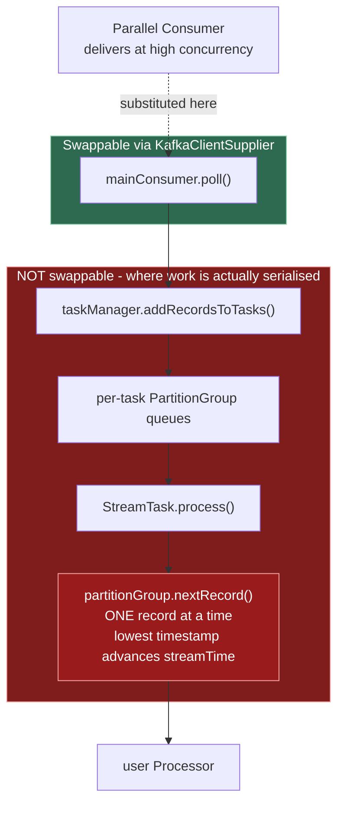

# Investigation: running Kafka Streams on Parallel Consumer - what would it actually take?

**Written:** 2026-08-07. Triggered by a request to revive
[confluentinc#390](https://github.com/confluentinc/parallel-consumer/pull/390) ("Features/streams"),
described as "having Kafka Streams use PC as its Kafka client instead of core Kafka, so KS gets the
performance of PC".

**Tracked by astubbs#255** - "Kafka Streams: give a Streams topology PC's per-key parallelism". That
issue carries the goal and the proposed first step; this document is the evidence behind it.

> ## Bottom line
>
> **1. PR confluentinc#390 is not that.** It never touches Kafka Streams. It sketches a PC-native,
> Streams-*like* DSL (`PCTopologyBuilder`, `PCStream`, `PCTopolgy`) to be used *instead of* Kafka
> Streams, and it has never compiled. It is a design reference for API shape only, never a code port.
> See §2.
>
> **2. Swapping the client does not work** - not because the API is closed, but because Kafka Streams
> serialises work *above* the consumer. See §3.
>
> **3. Cutting the seam one layer lower does work, and the diff is bounded.** Replacing
> `PartitionGroup.nextRecord()` with PC's shard manager, and executing the processor chain on PC's
> worker pool, requires a fork of `processor/internals/` - but a contained one. It does not touch the
> DSL operators, the store wrappers, or the producer. **One field pair is load-bearing**; almost
> everything else is mechanical. See §4.
>
> **Verdicts (§6):** swap the client - **no**. Fork the internals - **viable, and the diff is
> smaller than expected**. PC-native DSL - **viable stateless, a rewrite beyond**. Topic-hop - **still
> correct, and already shipped**.

**Why this document exists.** `src/docs/development/upstream-pr-analysis.adoc:180` ranks
confluentinc#390 **A7** in "Group A - Major features (top revival candidates)", with the single note
*"Streams integration | Expands reach to Kafka Streams users."* That is the fork's only record of it,
and it is thin enough to mislead: it does not say what the PR contained, nor which of several very
different ideas "Streams integration" means.

**A note on how this document changed.** Its first draft argued that Kafka Streams on Parallel
Consumer was architecturally impossible. That draft was wrong in two specific ways, both corrected
below and both flagged where they occur (§3.3, §3.4). The impossibility argument turned out to be an
argument against *one* route - swapping the client - that had been over-generalised into a verdict on
the whole idea. Once forking is admitted as an option, the question stops being "is there a blocker?"
and becomes "what is the minimal change set?" - which is a much more useful question and is what §4
answers.

> ## This document has since been tested
>
> Everything below is **analysis**. A spike has since run it, and the outcome is written up in
> [**`2026-08-08-002-ks-on-pc-spike-result.md`**](2026-08-08-002-ks-on-pc-spike-result.md).
>
> Short version: **route B works.** PC's `WorkManager` selects records and a worker pool executes the
> processor chain; output matches a provably-external stock baseline for a stateless topology *and* for
> a non-windowed aggregation over a state store; Apache Kafka's own 188 tests pass against the patched
> classes. The change set is 530 lines of patch across the 4 classes §4 predicted, and needed no new PC
> API. §4.4's "one load-bearing field pair" is now **proven** by a control arm, not merely asserted -
> reverting only that confinement mis-stamps 25 of 30 changelog records with another record's
> timestamp, exactly the silent corruption §4.4 predicts.
>
> Read the result document before acting on §4 or §6.2: it prices what a green result *commits to*
> (re-deriving the patch on every Kafka bump, the DSL emission-semantics change, and an unfunded
> distribution problem), and it quantifies the remaining semantic gap as 33 named failures in Kafka's
> own `StreamTaskTest`.

---

## 1. Four routes, not one

Several different ideas travel under "Kafka Streams integration". Separating them is most of the work.

| Route | What it means | Verdict |
|---|---|---|
| **A. Swap the client** | Give Streams a PC-backed `Consumer` via `KafkaClientSupplier` | Dead - §3 |
| **B. Fork the internals** | Replace `PartitionGroup.nextRecord()` with PC's `WorkManager`, run the processor chain on PC's worker pool | **Viable, bounded diff - §4** |
| **C. PC-native DSL** | A topology-builder API over PC, used *instead of* Streams | Viable stateless - §5 |
| **D. Topic-hop** | Preprocess in Streams, hand off via a topic, consume with PC | Correct, already shipped - §6.4 |

The A7 ranking implies A. The diff in confluentinc#390 is C. The interesting one is B, and no prior
version of this document assessed it.

---

## 2. What confluentinc#390 actually was

### 2.1 Metadata

- Opened **2022-08-17** by astubbs against base `v0.6.x-dev`, head branch `features/streams`.
- 14 files, **+754 / -22**.
- Closed **2023-06-15** by `eddyv`. The entire comment body: *"Closing - Stale."*

Not a technical rejection. `src/docs/development/upstream-pr-analysis.adoc` characterises that date's
sweep of ~40 astubbs PRs as administrative. Nobody reviewed this and found it wanting; it aged out.

### 2.2 What it contained

New classes, all in `parallel-consumer-core`:

| File | Lines | State |
|---|---|---|
| `Consumed.java` | 185 | verbatim copy of the Kafka Streams class |
| `Produced.java` | 168 | verbatim copy of the Kafka Streams class |
| `KeyValue.java` | 87 | verbatim copy |
| `KeyValueMapper.java` | 54 | copy, signature changed to take `PollContext` |
| `PCStream.java` | 25 | interface; its only javadoc is a class-level `todo docs`, its nine methods have none |
| `PCTopologyBuilder.java` | 27 | interface, six `stream(...)` overloads + `build()` |
| `PCTopolgy.java` | 9 | **empty class body**, and misspelled in the source |
| `internal/PCTopologyBuilderImpl.java` | 72 | see §2.3 |

Plus a `void start(PCTopolgy)` method added to `ParallelStreamProcessor`, a rename of the user
function interfaces (§2.6), and ~98 lines of exploratory sketch in the streams example app
(`StreamsApp.java`, +103/-2, of which five added lines are imports).

**It adds no `kafka-streams` dependency.** `Serde` ships in `kafka-clients`, which core already
depends on.

### 2.3 It has never compiled

`PCTopologyBuilderImpl` declares both fields `final` **and initialises them at the declaration site**,
then reassigns both in all three constructors:

```java
private final Optional<Serde<?>> defaultConsumeSerde = Optional.empty();
private final Optional<Serde<?>> defaultProduceSerde = Optional.empty();

public PCTopologyBuilderImpl() {
    this.defaultConsumeSerde = Optional.empty();   // definite-assignment error
    this.defaultProduceSerde = Optional.empty();
}

public PCTopologyBuilderImpl(Serde<String> serde) {
    this.defaultConsumeSerde = Optional.of(serde); // ...and a type error
```

Two unrelated compile errors in one 72-line class: six reassignments of already-assigned `final`
fields across three constructors, and `Optional.of(serde)` on a `Serde<String>` yielding
`Optional<Serde<String>>`, which is not assignable to `Optional<Serde<?>>`.

Beyond compilation it is not implemented: **every** `stream(...)` overload and `build()` returns
`null`, `PCTopolgy` has an empty body, and the example's `applyMap` / `applyFlatMap` stubs return
`null`. There is no execution path.

### 2.4 Copyright provenance hazard

`Consumed.java` and `Produced.java` are verbatim ASF-licensed Kafka Streams sources retaining the
Apache header. `bin/check-copyright-headers.sh` models exactly two provenances:
upstream-Confluent-derived, and fork-original (which must carry
`Copyright (C) <year> Antony Stubbs and contributors`). A verbatim third-party ASF file hits the
fork-original branch and fails for a missing fork header. Porting these files would require extending
the gate first.

### 2.5 The Serde plumbing solves a problem PC does not have

PC's `PollContext` carries **deserialised** `K` and `V`, because the user supplies a configured
`KafkaConsumer` - `grep -rl "Deserializer\|Serde" parallel-consumer-core/src/main/java/` returns zero
files. The `Consumed`/`Produced` machinery is redundant at this layer, and it is roughly half the
PR's line count.

### 2.6 A collateral rename that master never adopted

A `RecordProcessor` interface with two nested functional interfaces already existed on the PR's base
branch `v0.6.x-dev`, named `PollConsumer<K,V>` and `PollConsumerAndProducer<K,V>`. The PR **renamed**
them to `Processor` and `Transformer` and fixed a raw-type `apply(PollContext)`. It did not originate
them.

Master took neither. `RecordProcessor` exists nowhere in the tree today; PC uses the raw
`java.util.function` types directly. If named user-function interfaces are ever revisited it is a
fresh decision - and note that adopting them is **source-breaking for callers passing a
`Consumer`/`Function` variable** rather than a lambda.

### 2.7 Blast radius into published documentation

The example sketch sits **inside** the `// tag::example[]` region that
`src/docs/README_TEMPLATE.adoc:572` includes into the generated README. The `return null` stubs would
have shipped into user-facing documentation.

### 2.8 The branch today

`origin/features/streams` still exists in this clone, tip `e2f1d53e` (matching the PR's head SHA).
Against its merge-base with upstream master (`71f973a9`) it is exactly **47 files, +1570 / -340**, and
drags in an unrelated `io.confluent.csid.actors` cluster. Its poms read `0.6.0.0-SNAPSHOT` - but so
does master today, so the version string says nothing about age. The code is from August 2022.

**Conclusion:** there is nothing to port. What is worth keeping is the ~50 lines of API shape in
`PCStream` / `PCTopologyBuilder`, as a sketch for route C.

---

## 3. Route A - swapping the client - is dead

### 3.1 The API is open; that is not the blocker

`KafkaClientSupplier` exposes five methods and is **not deprecated** (verified on branches 3.9, 4.0,
4.1, 4.3, trunk; still `@InterfaceAudience.Public`). You can hand Streams any `Consumer` you like.

### 3.2 Streams serialises above the consumer



`StreamTask.process()` (3.9, `StreamTask.java:767-820`) selects one record via
`partitionGroup.nextRecord(recordInfo, wallClockTime)` and runs the entire reachable sub-DAG
depth-first on the calling thread. A consumer delivering at infinite parallelism is still funnelled
through that single-record loop.

**This is the whole argument against route A, and it is the argument that route B avoids** - by
cutting the seam inside the red box rather than at its input.

### 3.3 Correction: the offset argument was wrong

An earlier draft of this document claimed `commitSync(offsets)` takes one scalar watermark per
partition, leaving "nowhere to express PC's sparse map", and treated that as a blocker. It is not.

PC already commits a plain contiguous watermark, and its metadata payload is optional -
`state/PartitionState.java:413-418`:

```java
.map(encodedOffsets -> new OffsetAndMetadata(nextOffset, encodedOffsets))
.orElseGet(() -> new OffsetAndMetadata(nextOffset));   // no metadata at all
```

with `nextOffset = getOffsetHighestSequentialSucceeded() + 1` (line 428). The encoded map is an
optimisation that avoids redelivering the completed-but-non-contiguous tail after a restart; the
no-metadata path already exists in the code. Run without it and you get at-least-once, which is what
Streams ALOS gives anyway. **No regression, and no blocker.**

### 3.4 Correction: the encoding collision is a caveat, not a proof

The same draft presented PC's Kafka Streams magic-byte detection as proof that an integration was
impossible. It is not proof of that. It proves something narrower and still worth knowing.

Streams encodes stream time into `OffsetAndMetadata.metadata`; PC encodes its incomplete-offset
bitmap into the same field. `offsets/OffsetEncoding.java:45-50` reserves two magic bytes to detect
Streams' payload (the javadoc prose is one long line in source, re-wrapped here):

```java
/**
 * Checks for pre-existing Kafka Streams metadata. Although the Kafka Streams magic numbers are
 * annoyingly simple, ours are not, so should be safe to take this guess that they are indeed from
 * Kafka Streams.
 * <a href="https://github.com/apache/kafka/blob/cc77a38d280657a0e3969b255f103af4d11c7914/streams/src/main/java/org/apache/kafka/streams/processor/internals/TopicPartitionMetadata.java#L33">source from Kafka Streams code</a>
 */
KafkaStreams(v1, (byte) 1),
KafkaStreamsV2(v2, (byte) 2);
```

and `offsets/KafkaStreamsEncodingNotSupported.java` throws on them:

> "It looks like you might be reusing a Kafka Streams consumer group id, as KS magic numbers were
> found in the serialised payload, instead of our own. Using PC on top of KS commit data isn't
> supported. Please, use a fresh consumer group, unique to PC."

Both also compete for `OffsetMapCodecManager.DefaultMaxMetadataSize = 4096` (line 67), which
`state/PartitionState.java:518` already back-pressures against.

**What this actually establishes:** you cannot point PC's *encoder* at a consumer group whose commit
metadata Streams owns. In an integration, only one component writes that field - and per §3.3 PC does
not need to. The exception is a guard against group reuse, not evidence of architectural
incompatibility.

### 3.5 The route also degrades silently on Kafka 4.1+

Under [KIP-1071](https://cwiki.apache.org/confluence/display/KAFKA/KIP-1071:+Streams+Rebalance+Protocol)
(EA in 4.1), `StreamThread.setupMainConsumer` constructs an `AsyncKafkaConsumer` **directly** and
falls through to `clientSupplier.getConsumer(...)` only on the classic protocol, emitting a
`log.warn`. A warning, not an exception - so a client-swap integration would **silently stop being
used** the moment anyone sets `group.protocol=streams`, with the application apparently healthy.

Route B is unaffected: it does not go through the supplier at all.

---

## 4. Route B - the minimal diff

Assuming a fork of `streams/src/main/java/org/apache/kafka/streams/processor/internals/` is
acceptable. Line references are Apache Kafka **3.9** unless marked trunk.

### 4.1 The seam is unusually well-matched

PC's `WorkManager` is essentially four methods, and they line up with what `PartitionGroup` does:

| PC (`state/WorkManager.java`) | Role | Streams counterpart |
|---|---|---|
| `registerWork(EpochAndRecordsMap)` (:127) | records in | `PartitionGroup.addRawRecords` |
| `getWorkIfAvailable(int)` (:141) | work out | `PartitionGroup.nextRecord` |
| `onSuccessResult` / `onFailureResult` (:162, :188) | completion | *(none - Streams is synchronous)* |
| `collectCommitDataForDirtyPartitions()` (:201) | offsets to commit | `StreamTask.consumedOffsets` |

That last already returns `Map<TopicPartition, OffsetAndMetadata>` - exactly the type `commitSync`
and `sendOffsetsToTransaction` take. The offset seam is type-identical today.

The asymmetry that drives the diff: `nextRecord()` returns **one** record synchronously, so completion
is implicit at return. PC hands out **N** and is told later which succeeded. So `StreamTask.process()`
splits into "select N, dispatch" plus a separate completion path.

### 4.2 PC already provides the per-key ordering guarantee

`state/ProcessingShard.java:149-154`:

```java
if (isOrderRestricted()) {
    // can't take any more work from this shard, due to ordering restrictions
    break;
}
```

Under KEY ordering a shard is keyed `(TopicPartition, key)` and hands out **at most one in-flight
record at a time**. So at most one record per key is ever in flight. The per-key ordering queues that
comparable systems had to build from scratch are the shard manager's core invariant.

Necessary but not sufficient - see §4.5.

### 4.3 A free win: the selection side is already solved upstream

Kafka ships `processor/internals/SynchronizedPartitionGroup.java`, every method `synchronized`,
selected at `StreamTask.java:199-207` when the internal `__processing.threads.enabled__` flag is set
(`StreamsConfig.java:1310-1313`; trunk `:1440-1449`). It serialises record *selection*, not record
*execution* - exactly the split route B wants. `PartitionGroup`'s `streamTime`, `totalBuffered` and
`nonEmptyQueuesByTime` (a `PriorityQueue`, which N threads would corrupt) are all covered.

Note this flag alone parallelises across *whole tasks*, not within one, so it gives PC nothing on its
own. It is useful because it removes an item from the diff.

### 4.4 The one load-bearing change

`processor/internals/AbstractProcessorContext.java:47-48`:

```java
protected ProcessorRecordContext recordContext;
protected ProcessorNode<?, ?, ?, ?> currentNode;
```

A single mutable slot **per task**, non-final, non-volatile, unsynchronized - and read ambiently
throughout the store stack: `ChangeLoggingKeyValueBytesStore.java:79/88/97/110`,
`CachingKeyValueStore.java:288-298`, `StoreQueryUtils.java:159`, `MeteredKeyValueStore.java:461`.
`ProcessorContextImpl.forward` (`:234-296`) implements save/restore as a **stack discipline over these
two shared fields**.

Failure mode under concurrency is **silent corruption, not a crash**: changelog records stamped with
another record's timestamp, cache entries carrying another record's offset and headers, interactive-query
`Position` advanced past unwritten data.

Fix: make both thread-local (or plumb `ProcessorRecordContext` explicitly through
`ProcessorNode.process` / `forward` / store `put`, which is wider but mechanical). The constraint it
imposes is that a record must be processed end-to-end on one worker thread with no mid-DAG migration -
which is what PC does anyway.

**Without this change nothing else matters. With it, most of the rest is mechanical.**

### 4.5 Delete the caching layer; do not make it concurrent

`CachingKeyValueStore` has a per-store `ReentrantReadWriteLock` (`:66`) - whole-store exclusive, so
zero concurrency even where correct, and `get` takes the **write** lock when called on the registered
stream thread (`:360-366`). `range`, `reverseRange`, `all`, `reverseAll` and `prefixScan`
(`:396-456`) take no lock at all.

Worse, `ThreadCache`'s eviction budget is per-**thread**, spanning every store of every task
(`ThreadCache.java:41`, `:46`, `maybeEvict` `:292-311`), so a per-store lock does not cover it. And
eviction picks the LRU **tail** - an arbitrary *other* key (`NamedCache.java:248`) - then runs
downstream user topology inline via `context.forward` on whichever thread called `put`
(`CachingKeyValueStore.putAndMaybeForward:226-259` → `TimestampedCacheFlushListener:42-57`), while
holding the store's write lock.

This is also why §4.2's per-key guarantee is not sufficient on its own: **none of the contended cache
state is key-scoped.** Two threads on different keys take different per-key locks and still collide on
the LRU list, the dirty set, and the shared byte budget.

`withCachingDisabled()` (`AbstractStoreBuilder.java:56`, short-circuiting
`KeyValueStoreBuilder.java:51-56`) deletes this entire blocker class in one line. Cost is a genuine
semantic change: the DSL emits every update rather than one per cache flush.

Making that stack genuinely concurrent - per-key striping, locking the unlocked scans, a concurrent
global budget, re-entrancy-safe flush listeners - is a rewrite of the cache layer. Do not attempt it.

### 4.6 PC's WorkManager becomes the offset source of truth

`StreamTask.java:790-791` declares the offset consumed the instant `doProcess` returns:

```java
consumedOffsets.put(partition, record.offset());
commitNeeded = true;
```

With off-thread execution that commits ahead of the work. The replacement is a completion-tracked
committable offset - which is precisely what PC's `WorkManager` / `PartitionState` already implements.
It should feed `committableOffsetsAndMetadata()` (`:482-517`) instead of `consumedOffsets`.

### 4.7 Mechanical items

Roughly 50 lines, no semantic change:

- `RecordCollectorImpl.offsets` (`:79`) and `producedSensorByTopic` (`:83`) → `ConcurrentHashMap`.
  These are *already* mutated from the producer callback thread and read from the StreamThread; today
  it works only because the read follows `producer.flush()`.
- `StreamTask.consumedOffsets` and `partitionsToResume` → concurrent collections; `commitNeeded` →
  `volatile`; `processTimeMs` → `LongAdder`.
- `StreamTask.recordInfo` (`:194`) is a **single reusable object** read *after* processing at `:783`
  and `:795`. Allocate per record.
- `RocksDBStore.db` / `dbAccessor` / `cfAccessor` (`:111-113`) → `volatile`; they are nulled in
  `close()` (`:711-716`) while `putAll` (`:414`), `reverseAll` (`:594`), `prefixScan` (`:443`),
  `deleteRange` (`:508`) and `approximateNumEntries` (`:629`) run unsynchronized. That is a
  use-after-close on a native handle - JVM-crash class, and worth fixing regardless of this project.
- `StreamsProducer.transactionInFlight` (`:80`) → `volatile`, and hoist `maybeBeginTransaction()`
  out of `send` (`:265`) to an explicit owner-thread call. It is currently an unsynchronized
  check-then-act on a non-volatile boolean.

### 4.8 What must stay on the serial path

`KafkaProducer` itself is documented thread-safe, so worker sends are fine at the client level. But
the transaction is **per StreamThread** for ALOS and EOS-v2 in 3.9, and unconditionally so in 4.x
(EOS-alpha, the per-task variant, is deleted in trunk). A worker's send therefore joins a transaction
covering *every* task on that thread: you cannot commit one task's work without committing every
in-flight worker's. `beginTransaction` / `sendOffsetsToTransaction` / `commitTransaction` /
`abortTransaction` must stay exclusive to the owning thread, and all worker sends must have drained
before commit.

Operators that must stay serial:

- **Punctuators.** `StreamTask.punctuate` (`:895-897`) throws `IllegalStateException` if
  `currentNode` is non-null - a hard failure if a worker holds it. And `streamTime` advances at
  *selection* (`PartitionGroup.java:266-267`), so punctuators would fire while earlier-timestamped
  records are still executing.
- **Stream-stream joins.** `KStreamKStreamJoin.sharedTimeTracker` (`:89`) is shared across *both*
  sides of the join within a task, mutated on both paths, unsynchronized.
- **Every operator-local `observedStreamTime`** - `AbstractKStreamTimeWindowAggregateProcessor.java:60`,
  `KTableSuppressProcessorSupplier.java:133`, `KStreamKTableJoinProcessor.java:55`, and others. These
  are plain non-volatile `long`s doing `Math.max` read-modify-write. Concurrency **corrupts** them; it
  does not merely reorder.

Windowed aggregations, suppress, segment retention and versioned stores *change semantics* rather than
break: `windowCloseTime = observedStreamTime - gracePeriod` decides which records are dropped as late,
so reordering changes which. Stock Streams is already non-deterministic here across partitions;
parallel execution widens the divergence rather than introducing a new failure class.

**Cleanly safe:** non-windowed aggregations - `KStreamAggregate`, `KTableAggregate`, `count`, `reduce`
- read stream time not at all.

### 4.9 The parallel/serial boundary is per-source-DAG, not mid-subtopology

"Parallelise the stateless part, leave the stateful part serial" is coherent **only as a build-time,
whole-source-node-DAG decision.**

Within one subtopology there is no boundary construct: `ProcessorContextImpl.forwardInternal`
(`:287-296`) calls `child.process(record)` directly - no queue, no future, no handoff. To parallelise
the first half and serialise the second you must buffer at the boundary, and the only buffering
boundary Kafka Streams has is a **repartition topic**. "Split a subtopology" and "insert a repartition
topic" are the same operation, at the cost of a materialisation.

What *is* coherent: decide per source node, at build time, whether the entire transitive closure of
`ProcessorNode.children()` is parallel-safe (no operator reading or writing stream time, no
punctuator, no shared time tracker, all store access keyed by the record key). Route that source
node's records through PC; leave every other source node on the serial path. All-or-nothing per
source-rooted DAG.

**The deciding class is `InternalTopologyBuilder`** - `build(Set<String> nodeGroup)` (`:993`), reached
via `nodeGroups()` (`:903`) → `makeNodeGroups()` (`:911`) → `buildSubtopology(int)` (`:960`). It is the
only place that knows both the full node graph and each node's `stateStores` set
(`ProcessorNode.java:54`). The tag would ride on `ProcessorTopology`, and `StreamTask.doProcess`
(`:849`) would consult it.

### 4.10 KIP-1112 is not a way to avoid the fork

An earlier draft of this document suggested `processor.wrapper.class` (KIP-1112, Kafka 4.0) as a
sanctioned interposition point. **That was wrong**, and it is worth recording why so nobody retries it.

It is **build-time only**. `ProcessorWrapper` has two methods, both taking a processor name and a
supplier and returning a supplier - no `ProcessorContext`, no `TaskId`, no record, no completion
callback. It is applied in `InternalTopologyBuilder.wrapProcessorSupplier` (trunk `:2317-2323`) during
topology construction; nothing in the runtime path ever touches it.

A wrapped processor **cannot legally run its work on another thread and return**. The moment
`process()` returns, `StreamTask` commits the offset (`:801-802` trunk), releases back-pressure
(`:812`), nulls `currentNode` (`:836`) and reuses the single `recordInfo`. An off-thread continuation
would commit offsets for unfinished records - silent data loss on rebalance - and its later `forward()`
would throw on a thread where nothing catches it. Trunk makes it worse: `ProcessorContextImpl` is now
`final`, and `RecordCollectorImpl.freeRawInputRecordFromContext` (`:326-330`) mutates the live record
context in place on every send.

The only thing a wrapper can safely off-thread is a fire-and-forget side effect that never forwards,
never touches the context or a store, and whose failure cannot affect offsets. That is logging, not
stream processing.

Also confirmed while checking: **there is no async-processing framework in Kafka trunk**, and no live
async KIP. KIP-311 is explicitly abandoned; KIP-408's thread has been dead since January 2019. Even
Kafka's own new-threading work keeps the serialisation - "each processing thread will process at most a
single task", under an exclusive per-task lock.

### 4.11 The diff, ranked

| Tier | Work | Size |
|---|---|---|
| 0 | Set `__processing.threads.enabled__` - gets `SynchronizedPartitionGroup` free | config |
| 1 | Concurrent collections, `volatile` fields, per-record `recordInfo`, hoist `maybeBeginTransaction` | ~50 lines, mechanical |
| 2 | Thread-confine `recordContext`/`currentNode`; PC owns committable offsets; `withCachingDisabled()` on the parallel path; build-time reachability pass in `InternalTopologyBuilder` | the real work |
| 3 | Make `CachingKeyValueStore` + `ThreadCache` concurrent | **do not attempt** |

Smallest coherent version that actually yields parallel throughput: Tier 1 + Tier 2, applied only to
source-node DAGs tagged parallel-safe. In shape that is one field-type change in
`AbstractProcessorContext`, a build-time reachability pass in `InternalTopologyBuilder`, a fork in
`StreamTask.doProcess`, and the Tier-1 swaps. It does not require touching the DSL operators, the store
wrappers beyond disabling caching, or the producer.

---

## 5. Route C - a PC-native DSL

### 5.1 What it would be

Across every framework surveyed the common denominator is small and identical:
`source -> map / filter / flatMap / branch -> sink`. But the operators are not the product. **The
product is a per-record acknowledgement token threaded through the chain** - Alpakka calls it
`CommittableOffset`, Atleon `Alo<T>`, SmallRye the `Message` ack.

PC already has the token, which is why a stateless DSL is cheap: it composes a
`Function<PollContext, List<ProducerRecord>>` and hands it to the existing `pollAndProduceMany`. No new
engine, no new threading, no state. confluentinc#390's `PCStream` interface is a reasonable sketch.

### 5.2 Why state is a different order of undertaking

Four non-JVM projects - Faust, Quix, goka, Streamiz - independently converged on the same triple in
four languages: an embedded KV store keyed by (partition, key), a compacted Kafka topic as its
write-ahead log, and an internal repartition topic. Every JVM framework declined, except SmallRye's
`checkpoint` strategy - whose state is per topic-partition rather than per key, whose only shipped
store is `file`, and which has no changelog.

Two sharpening datapoints: **Faust exposed a join API and never implemented it in ~8 years** (still in
its `TODO.rst`); and **Bytewax pays the alternative price** - because its snapshot rather than Kafka is
the unit of consistency, it "does not use consumer groups to store offsets or assign Kafka topic
partitions", and dataflows must restart when partition count changes.

### 5.3 Reusing Kafka Streams' topology is not available

`Topology#describe()` returns a `TopologyDescription` whose nodes expose only names, predecessors,
successors and store *names* - there is **no accessor for the `ProcessorSupplier`**. You get a picture
of the graph, not a handle on it. `org.apache.kafka.streams.processor.internals` is absent from the
Kafka 4.0 public javadoc index.

`TopologyTestDriver` is structurally disqualified for production: `MockConsumer`/`MockProducer`,
synchronous commit-per-record, single-partition fused subtopologies instead of materialised
repartition topics, and wall-clock punctuators that fire only via manual `advanceWallClockTime`.

### 5.4 Licensing, since this fork is Apache 2.0

**Alpakka Kafka** - the closest JVM design to learn from - moved to **BSL** in September 2022.
[Apache Pekko Connectors Kafka](https://github.com/apache/pekko-connectors-kafka) is the Apache-2.0
fork taken before that change, and is the only licence-compatible JVM reference.

**Responsive's async processor framework is BSL v1.0** and unusable here, though it validates route
B's shape: a worker pool *below* `Processor#process`, per-key ordering queues, a sandboxed
`ProcessorContext` whose `put`/`forward` are buffered and replayed on the StreamThread. Its own
`AsyncStreamsKafkaClientSupplier.getConsumer` returns a `DelegatingConsumer` overriding **only
`close()`** - the supplier used as a lifecycle hook, never a consumption-model swap, which is
independent confirmation that route A is not the way. Its documented limits map the achievable
boundary: PAPI only, punctuators unsupported, KV stores only, one async node per topology.

**Streamiz (.NET)** is the mirror image of the original question: a full KStream/KTable DSL rebuilt on
a plain `Confluent.Kafka` client, whose feature matrix lists "External Async Processing" as something
*it* has and Kafka Streams lacks.

---

## 6. Verdicts

### 6.1 Route A - swap the client - no

Not blocked by API surface but by semantics. Streams serialises above the consumer (§3.2), so the
swap gains nothing. It also degrades to a silent no-op on Kafka 4.1+ (§3.5). The A7 entry in
`upstream-pr-analysis.adoc` should not be read as endorsing this.

The two arguments this document previously made *in addition* - about sparse offsets and the encoding
collision - were wrong and are corrected in §3.3 and §3.4. Route A fails on §3.2 alone.

### 6.2 Route B - fork the internals - viable, and the diff is bounded

The strongest version of the original idea. It requires forking
`streams/src/main/java/org/apache/kafka/streams/processor/internals/`, but the change set is
contained: one load-bearing field pair (§4.4), a build-time reachability pass (§4.9), an offset-source
swap (§4.6), caching disabled on the parallel path (§4.5), and ~50 lines of mechanical concurrency
hygiene (§4.7).

The structural fit is better than expected: PC's `WorkManager` already exposes the right four methods
with the right types (§4.1), already guarantees one in-flight record per key (§4.2), and Kafka already
ships a synchronized `PartitionGroup` (§4.3).

Real costs, not hidden: punctuators, stream-stream joins and windowed operators stay serial (§4.8);
caching is off on the parallel path, changing DSL emission semantics (§4.5); and it is a fork to
maintain against upstream.

Tracked by **astubbs#255**, which proposed a spike - Tier 1 plus the thread-local change - to establish
whether it runs at all before anything larger is committed to. That issue also carries a stretch goal:
extend the Web GUI (astubbs#215) to show which source-node DAGs were tagged parallel-safe versus left
serial, once both have landed.

**The spike has since run, and this verdict held.** See
[`2026-08-08-002-ks-on-pc-spike-result.md`](2026-08-08-002-ks-on-pc-spike-result.md) for the evidence,
the measured change-set size, the proof that §4.4's field pair is load-bearing, and - importantly - what
a green result commits to. The bounded-diff claim survived contact; the distribution problem it creates
was not in scope here and is not solved.

### 6.3 Route C - PC-native DSL - viable stateless, a rewrite beyond

A genuinely empty niche on the JVM, and cheap while stateless because PC already owns the ack token
(§5.1). Needs its own plan and an explicit stateless boundary written into its scope.
confluentinc#390 is a design reference for API shape only - §2.3 rules out a code port.

**Ranked below route B on demand evidence.** The two upstream requests that exist ask for *state
stores* (§7), and state is exactly what a stateless DSL cannot offer - reaching parity means building
the embedded-store-plus-changelog-plus-repartition subsystem that §5.2 shows takes years. Route B
inherits all of it by staying inside Kafka Streams. Route C is the better answer only for users who do
not want Kafka Streams in the picture at all.

### 6.4 Route D - topic-hop - still correct, and already shipped

Preprocess in Streams, write to an intermediate topic, consume with PC. Already documented and shipped:
`src/docs/README_TEMPLATE.adoc` `[[streams-usage]]` and `[[streams-usage-code]]`, plus the working
`parallel-consumer-example-streams` module and its integration test.

It remains the right default: it is the only arrangement where both systems keep their own consumer
group, their own commit metadata, and their own ordering guarantees, with no fork to maintain. Route B
is what you reach for when the topic hop's latency or operational cost is the thing you are trying to
remove.

---

## 7. Prior discussion, and what users actually asked for

**There is no upstream issue for any of this.** Upstream has 249 issues; a full-text sweep over
title, body and comments for "kafka streams", "streams integration", "topology", "DSL", "async
processing", "KIP-311", "KIP-408" and "stream processor" returns nothing on point. PR
confluentinc#390 linked none either - `closingIssuesReferences` is empty and its body is the
untouched template, which is why `upstream-pr-analysis.adoc:180` records `Closes: --`. The PR was the
only artifact.

**The demand signal is in Discussions, not Issues** - so an issue-only mirror will not surface it:

| Discussion | Title |
|---|---|
| `confluentinc#596` | **Support State Store with Parallel consumer** |
| `confluentinc#350` | Parallel Consumer with KStream StateStore |
| `confluentinc#609` | How to correctly close a StreamsApp with a parallel-consumer? |
| `confluentinc#477` | Using PC with Spring Cloud Stream / Kafka Binder |

**Read the titles: nobody asked for route A.** What users asked for, twice and by name, is **state
stores with Parallel Consumer**. That matters for route selection, because state is precisely what
§5.2 identifies as route C's multi-year subsystem - the thing four projects in four languages each had
to build from scratch. **Route B gets it for free**, by staying inside Kafka Streams and never
reimplementing state at all. On the evidence of what people actually requested, route B serves the
demand better than route C does, at a fraction of route C's cost to reach parity.

In `confluentinc#596` maintainer rkolesnev reaches the same conclusion from the other direction:
*"it would be easier to do it the other way around and figure out a way to add processing
parallelisation to Kafka Streams instead."* That is route B, proposed and never pursued. In
`confluentinc#350` astubbs suggests *"just output the state store to a topic, and then use pc to read
from the topic"* - route D, the workaround that exists because route B did not.

Kafka's own answer to PC's value proposition is broker-side (KIP-932 Queues) and makes no mention of
Kafka Streams; `src/docs/README_TEMPLATE.adoc:78` already carries a "vs Share Groups" positioning
section.

---

## 8. Follow-ups identified but deliberately not done here

Scope was limited to this report. Identified, offered, and declined for this run:

- **`src/docs/README_TEMPLATE.adoc:847-848`** (inside `[[streams-usage]]`) states Kafka Streams
  "doesn't yet (KIP-311, KIP-408) have parallel processing of messages". KIP-311 is abandoned and
  KIP-408 dead since January 2019, so the wording reads as "coming soon". **Left unchanged.**
- **No `src/docs/development/upstream-map.yaml` entry for confluentinc#390**, despite `AGENTS.md`
  naming it the source of truth for fork/upstream mapping. **Not added.**
- **The A7 ranking at `upstream-pr-analysis.adoc:180`** still presents confluentinc#390 as a live
  revival candidate without saying which route. **Not revised.**
- **No `docs/inflight/parked-*.md` note** for routes B or C. **Not created.**
- **A spike for route B** - Tier 1 plus the thread-local change, to find out whether it runs.
  **Not attempted**; filed as astubbs#255.

---

## 9. Confidence and unverified claims

Verified from this checkout, with paths and line numbers: all of §2, §3.3, §3.4, §4.1, §4.2.

Verified against Apache Kafka source (branch `3.9`, and `trunk` at 4.4.0-SNAPSHOT) with file and line
citations: §3.2, §3.5, §4.3 through §4.10.

Carried forward as **unverified**:

- **RocksDB's own JNI guarantee** for concurrent `Get`/`Put`/`NewIterator` on one handle. Kafka
  asserts it nowhere - a thread-safety string search over `RocksDBStore.java` returns zero hits. §4.5's
  conclusion does not depend on it, but any route-B implementation does; source it from RocksDB
  upstream before relying on it.
- **Thread safety of user-supplied `Serde`/`Serializer`/`Deserializer`** instances, shared through the
  single `StateSerdes` per store.
- **The intent behind `CachingKeyValueStore.lock`** - the class has no javadoc; its single-writer
  contract is inferred from inline comments at `:105-106`, `:116-117` and `:385-386`.
- KIP-1156, which would formalise an internal-API compatibility contract, is still a draft, so
  "`*.internals` carries no compatibility guarantee" rests on convention plus javadoc exclusion.
- A Quarkus issue proposing a `quarkus-parallel-kafka` extension was closed with no visible
  resolution.
- **No first-person post-mortem** could be found of the form "we built our own lightweight stream
  processor and here is what went wrong". §5.2's cost estimate rests on convergent design evidence
  across projects, not a documented failure.
- Kafka line numbers move between versions; they are pinned to the branches named above.
