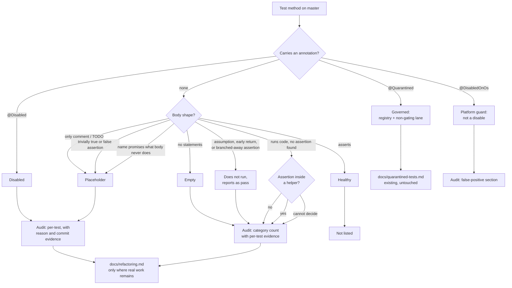

# Inactive Test Audit - Plan

## Goal Capsule

**Objective.** Answer four questions about this repo's tests with defensible numbers and
per-test evidence: how many are disabled and why, how many are empty, how many are
placeholders, and how many were intended but never written. Absorb the 2026-04-22 audit that
already covers adjacent ground, and land the result where it is discoverable.

**Authority hierarchy.** `AGENTS.md` > this plan > implementer judgement. Where this plan and
`AGENTS.md` disagree, `AGENTS.md` wins and the conflict is reported.

**Stop conditions.** Stop and report rather than guess when a test's reason cannot be
established from evidence - record "no reason recorded" and move on. Do not infer a plausible
reason. Do not fix, re-enable or delete any test.

**Execution profile.** Documentation only. No product code, no test code, no CI changes.

**Tail ownership.** The caller owns commit, push, PR and CI.

---

## Product Contract

### Summary

Produce a single audit of every test on master that does not run, does not assert, or was never
written, with each finding's reason traced to evidence. Absorb the 2026-04-22 audit's full
contents so its branch copy becomes redundant, and correct the two ledger entries that hid it.

### Problem Frame

`grep @Disabled` returns 7 hits. That number is wrong in both directions, and no artifact on
master says so.

Two hits are not disabled tests. One is a javadoc mention inside the repo's own `@Quarantined`
annotation; one is `@DisabledOnOs(OS.WINDOWS)`, a class-level platform guard on an abstract
harness that skips nothing on any machine this project builds on. That leaves 5 real `@Disabled`
test methods, and 4 of the 5 carry no reason at all - no annotation message, no comment, and a
disabling commit that never names the test.

The repo has since replaced the mechanism. `AGENTS.md` and the `@Quarantined` javadoc both state
that `@Disabled` "loses the signal entirely" and that a known flake can be a real product bug.
Every `@Disabled` on master predates a policy that would not permit it today.

An audit of adjacent scope already exists - 455 lines, dated 2026-04-22 - and nobody has ever
read it. It lives only on `refactor/test-hardening`, has no PR on the fork or upstream, and is
referenced in exactly two places, neither of which mentions it: the `origin/refactor/test-hardening`
entry in `docs/refactoring.md` describes that branch by its *other* commit ("OOM diagnostics for
`LargeVolumeInMemoryTests` at 1M"), and `docs/inflight/branch-stale-and-diagnostic.md` files the
branch under **Superseded**, on the safe-to-delete list. Its own commit message says "Not yet
triaged."

That is the failure mode this plan fixes. The predecessor did not rot because its numbers drifted;
it rotted because it was filed under a description that did not mention it, on a branch queued for
deletion. The remedy is to absorb its contents into a document on master and correct both ledger
entries - not to build machinery around a document nobody could find.

### Requirements

**Answering the questions**

R1. State how many test methods on master are annotation-disabled, counting test *methods*
rather than grep hits, and name the false positives the raw count includes.

R2. For each disabled test, record the reason established from evidence: the annotation message,
surrounding comment or javadoc, and the commit that introduced the annotation (SHA, author, date,
subject). Where no reason exists, record "no reason recorded" explicitly.

R3. State how many test methods have empty bodies.

R4. State how many test methods run code but assert nothing, so they can fail only by throwing.
Resolve assertion helpers one level deep before classifying, and say which rule cleared each test
that was checked and dismissed.

R5. State how many tests are placeholders or aspirational - stubs, trivially-true or
trivially-false assertions, bodies that are only a comment or a TODO, or tests whose name promises
behaviour the body never touches.

R6. State how many tests were intended but never written, including tests deleted rather than
implemented, and cite where that intent is recorded.

R7. Report an honest denominator: total test methods per module, noting that a
`@ParameterizedTest` method is one method but many executions, and that `@ArchTest` fields are
enforced tests an annotation grep does not see.

**Keeping the categories honest**

R8. Hold `@Quarantined` separate from `@Disabled`. Report the current quarantine count from the
registry rather than from a grep, since every `@Quarantined` occurrence in the tree today is a
string fixture or javadoc, not a live quarantine.

R9. Report tests that do not run despite carrying no disabling annotation: JUnit assumption
aborts, early-return guards, and assertions branched around by a condition. An annotation grep
cannot see these, and they report as passes rather than skips.

R10. Classify conservatively. Anything the evidence cannot decide is recorded as undecided, never
silently placed in a category.

**Absorbing the predecessor**

R17. Carry the 2026-04-22 audit's full contents into the new document - its kneecapped volumes,
weakened and commented assertions, commented-out test methods, and tag-based exclusions - not only
its disabled-tests section. Record them; do not fix them.

R18. Correct the predecessor's findings where its own history refutes them, citing the commit
evidence, and refresh its stale references so no carried-forward finding is keyed by a line number.

**Not going stale**

R11. State next to every number the command that reproduces it, so a future reader re-derives the
count instead of rebuilding the analysis.

R12. Reference findings by test identity (class plus method), never by line number. The
predecessor's line numbers had drifted by roughly 22 lines within four months, which is what made
its findings look stale.

R13. Supersede the 2026-04-22 audit rather than adding a third parallel list, so that after this
work the branch copy carries nothing the master copy lacks.

R14. Record real deferred work in `docs/refactoring.md`, per the rule that raw inventories stay
unprioritised while triage lives in the backlog.

R15. Correct both ledger entries that hid the predecessor: the `origin/refactor/test-hardening`
entry in `docs/refactoring.md`, which describes the branch by the wrong commit, and the
`docs/inflight/branch-stale-and-diagnostic.md` entry that files it as superseded and safe to delete.

R16. Correct the stale `origin/refactor/empty-tests` entry in `docs/refactoring.md`, which
describes work whose removal half has already landed on master via upstream `confluentinc#493`.

R19. Add an `AGENTS.md` Testing pointer to the audit, in the style of the existing `todo-index.md`
and quarantine pointers, so the next agent finds it without knowing it exists.

### Scope Boundaries

**In scope.** Counting, classifying, explaining, absorbing the predecessor, and filing the result
where it will be found. The predecessor's kneecapped-volume and weakened-assertion findings are
carried across as records.

**Deferred to follow-up work.** Each is real, and none belongs in an audit PR:

- A generated `docs/INACTIVE_TESTS.md` with a `--check` staleness gate, modelled on
  `bin/todo-index.sh`. Attractive and consistent with repo convention, but it does not address why
  the predecessor was lost, and its gate would fail the PR Checklist job on any open PR that
  touches a test annotation - `astubbs#29` is live and touches `MultiInstanceRebalanceTest`.
  Revisit once the audit has landed and its false-positive rate is known.
- Re-enabling `offsetsAreNeverCommittedForMessagesStillInFlightLong` or `processInKeyOrder`.
- Deleting the `VertxTest.handleHttpResponseCodes` stub.
- Moving `largeNumberOfInstances` to `@Tag("performance")`. `astubbs#29` is open and already
  carries that change.
- The three `@Timeout(60000L)` annotations, which mean 60,000 seconds rather than 60.
- Renaming `assumeWorkingCodec`, which is a boolean predicate rather than an assumption and so
  branches assertions away while reporting green.
- The `30_000_00` underscore typo and the other kneecapped volumes carried in from the predecessor.
- Implementing the tests deleted by `confluentinc#493`.
<!-- file-refs: N/A - names a generated file this plan decided against building -->

**Outside this work.** Any change to test behaviour, timeouts, assertions or volumes. The
`AGENTS.md` rule against modifying tests applies with full force: this work does not touch a
single assertion. No CHANGELOG entry is added - `AGENTS.md` states a PR never contributes one.

### Sources

- `docs/quarantined-tests.md` and `parallel-consumer-core/src/test/java/bz/stub/parallelconsumer/Quarantined.java` - the governed alternative to `@Disabled`, and the policy statement that motivates this audit.
- `docs/test-hardening/disabled-and-weakened-tests-audit-2026-04-22.md` on branch `refactor/test-hardening` (commit `c44edbf0`) - the predecessor audit being absorbed.
- The `origin/refactor/test-hardening` and `origin/refactor/empty-tests` entries in `docs/refactoring.md`, and the Superseded list in `docs/inflight/branch-stale-and-diagnostic.md` - the ledger entries that hid it.
- `docs/solutions/test-flakiness/vacuous-await-condition-brokerpoller-backpressure-2026-07-31.md` - evidence that a test passing vacuously is a live failure mode here.
- Upstream `confluentinc#493` (merged, removed the empty tests) and draft `confluentinc#496` / branch `origin/refactor/empty-tests` (never merged, would have implemented them).
- `AGENTS.md` Testing section - the `@Disabled` prohibition; Changelog section - the no-entries-in-a-PR rule.
- `bin/todo-index.sh` - the inventory-versus-triage split this audit respects, and the deferred generator's eventual model.
<!-- file-refs: N/A - the bullet names the branch the audit lives on, not master -->

---

## Planning Contract

### Key Technical Decisions

KTD1. **The deliverable is a document on master, made discoverable through the ledgers - not a
tool.** The predecessor audit was thorough and still died, because `docs/refactoring.md` described
its branch by a different commit and `docs/inflight/` marked that branch safe to delete. Machinery
would not have saved it. Landing on master plus correcting both entries addresses the observed
cause directly. The generated-index-with-gate idea is recorded in Scope Boundaries as follow-up,
where its cost - failing an open PR's checklist job - can be weighed on its own.

KTD2. **Absorb the predecessor's full contents rather than cite it**
(session-settled: user-directed - chosen over referencing it as an external artifact: the branch is
on the safe-to-delete list, so a citation would point at something about to vanish). The new
document carries all five of its sections, so after this work the branch copy holds nothing the
master copy lacks and can be deleted without loss.

KTD3. **Uncertain classifications are recorded as undecided, not guessed.** Most importantly, a
test whose only assertion sits inside a helper such as `assertCommits(...)` must have that helper
resolved before it is called assertion-free. A wrong count in either direction discredits the whole
artifact, and the vacuous-await write-up shows misreading an unassertive test here has already cost
a real investigation.

KTD4. **Count test methods, not annotation occurrences.** Two corrections apply to the raw grep on
master: a javadoc mention is not code, and `@DisabledOnOs` is a platform guard rather than a
disable. Separately, when expanding an annotation to methods, a class-level annotation covers every
method beneath it rather than one - a counting rule the audit applies, with no instance to report
today. The audit states the correction rather than quietly publishing the corrected figure, because
"7 disabled tests" is the number a reader would otherwise reach for.

KTD5. **Reference findings by class and method, never by line.** The predecessor's line numbers
drifted ~22 lines in four months, which made accurate findings look stale. `bin/todo-index.sh`
records the same reasoning for the marker index: an entry keyed by line churns on every unrelated
edit above it. This applies to the plan's and the audit's own references to ledger entries too -
identify them by entry name, not by line.

### High-Level Technical Design

The classification path, and where each outcome is recorded:

Helper-cleared tests reach the audit too, per R4: the rule that cleared each one is stated, so the
assertion-free count is auditable rather than asserted. Only a test that asserts directly goes
unlisted. The backlog receives only items that are actual deferred work, per the repo's
inventory-versus-triage rule.

### Assumptions

- The audit is `docs/test-hardening/inactive-tests-audit-2026-08-08.md`. That directory does not
  yet exist on master - the predecessor lives only on its branch - so this creates it.
- Detection covers `@Test`, `@ParameterizedTest`, `@RepeatedTest`, `@TestFactory` and `@ArchTest`.
- Findings that need triage go to `docs/refactoring.md`; the audit carries no priority list of its
  own.

---

## Implementation Units

### U1. Write the audit that answers the four questions and absorbs the predecessor

**Goal.** A dated document that states each number, supports it with per-test evidence, and carries
the 2026-04-22 audit's full contents. This is the deliverable the request asked for.

**Requirements.** R1, R2, R3, R4, R5, R6, R7, R8, R9, R10, R11, R12, R13, R17, R18.

**Dependencies.** None.

**Files.**
- `docs/test-hardening/inactive-tests-audit-2026-08-08.md` (create)

**Approach.**

1. Open with the four answers as hard numbers, before any per-test detail. A reader who stops
   after the first screen should have the answers.
2. State the raw-grep correction per KTD4: what `grep @Disabled` returns, what it over-counts, why.
3. Per disabled test, record location, annotation message, disabling commit (SHA, author, date,
   subject), the reason from evidence or "no reason recorded", whether the coverage exists
   elsewhere, and a confidence level.
4. Absorb the predecessor per R17. Carry across all five of its sections - disabled tests,
   kneecapped volumes, weak and commented assertions, commented-out test methods, and tag-based
   exclusions - merging its disabled-tests findings with the deeper evidence gathered here rather
   than listing them twice.
5. Correct the predecessor per R18. Both core tests were disabled by `c1fefbc64` ("Create and
   commit offset map", 2020-08-27), not by CI flakiness as it suspected. `largeNumberOfInstances`
   and `handleHttpResponseCodes` were born disabled and never ran green. Re-key its line-numbered
   references to class and method.
6. Answer R6 from the `confluentinc#493` / `#496` history: tests deleted rather than written, with
   the intent recorded only in history and an unmerged branch.
7. For the assertion-free count, list both the tests that qualify and the rule that cleared each
   test checked and dismissed, so the number is auditable rather than asserted.
8. Report the denominator per module, distinguishing test methods from test executions, and note
   the `@ArchTest` fields an annotation grep misses.
9. Record the R9 category prominently. Tests that report green while their assertions are branched
   away are the least visible form of not-running, and no annotation grep surfaces them.
10. Note that the current quarantine lane is empty and that the registry and code agree.

**Patterns to follow.** The predecessor's per-finding shape - location, current state, intent
signal, suspected reason, recommended action, verification - worked and reviewers know it. Keep it,
and add the fields it lacked: disabling commit, confidence, and the reproducing command.

**Test scenarios.** `Test expectation: none -- documentation only. R11 requires each number to
carry its reproducing command, which is the executable check on this document's claims.`

**Verification.** Every number is reproducible from the command stated beside it. Every disabled
test has an evidence-backed reason or an explicit "no reason recorded". No finding is keyed by line
number. Diffing the new document against the predecessor shows no finding present only on the
branch. No file path in the document is absolute.

---

### U5. Correct the ledgers that hid the predecessor

**Goal.** The audit is discoverable from the three places a maintainer looks, and no ledger entry
still makes a claim master contradicts.

**Requirements.** R14, R15, R16, R19.

**Dependencies.** U1.

**Files.**
- `docs/refactoring.md` (modify)
- `docs/inflight/branch-stale-and-diagnostic.md` (modify)
- `AGENTS.md` (modify)

**Approach.** Identify each entry below by its name, not by line - steps 1, 3 and 4 all edit
`docs/refactoring.md`, so any line number cited here shifts mid-unit.

1. Fix the `origin/refactor/test-hardening` entry in `docs/refactoring.md`. It describes only the
   OOM diagnostics commit; record that the branch also carried the 2026-04-22 audit, now absorbed
   into the master document.
2. Fix the Superseded list in `docs/inflight/branch-stale-and-diagnostic.md`. The branch was filed
   as safe to delete, which was true of its other commits and not of the audit. Record that the
   audit has now been carried onto master, which makes the entry correct rather than merely
   removing the risk.
3. Correct the `origin/refactor/empty-tests` entry per R16: the removal half landed via
   `confluentinc#493`; what remains open is that the deleted tests were never implemented. Name them.
4. Add backlog entries for the deferred items in Scope Boundaries, each linking to the audit rather
   than restating it. Include the `@Timeout(60000L)` unit bug and the `assumeWorkingCodec` naming,
   since both are concrete defects rather than inventory.
5. Add the `AGENTS.md` Testing pointer per R19.

**Do not** add a `CHANGELOG.adoc` entry. `AGENTS.md` states a PR never contributes one; release
notes are produced by the generator from the commit log, so the commit subject carries the
operator-visible fact instead.

**Patterns to follow.** `docs/todo-index.md`'s "Prioritised? See the refactoring backlog" section
states the inventory-versus-triage split; keep the new document consistent with it.

**Test scenarios.** `Test expectation: none -- documentation. The issue-reference gate in
pr-checklist.yml validates the shape of any issue reference added.`

**Verification.** Neither ledger contains a claim contradicted by master. The `AGENTS.md` pointer
resolves to a file that exists. No CHANGELOG entry was added.

---

## Verification Contract

This change adds and edits markdown only, so the repo's compiled gates do not apply.
`bin/check-copyright-headers.sh` scans `*.java` exclusively and will pass without inspecting
anything this plan produces - do not cite it as evidence of compliance.

- `bin/todo-index.sh --check` - passes, confirming no stray marker was introduced.
- `bin/check-quarantine-registry.sh` - passes, confirming the audit's quarantine claims match the
  registry.
- Run every command quoted in the audit and compare its output to the number stated beside it.
- Diff the new audit against `docs/test-hardening/disabled-and-weakened-tests-audit-2026-04-22.md`
  on `refactor/test-hardening` and confirm no finding exists only on the branch.
<!-- file-refs: N/A - the audit being diffed against lives on refactor/test-hardening, named above -->

---

## Definition of Done

**Global.**

- The audit answers all four questions with hard numbers on its first screen.
- Every disabled test has an evidence-backed reason or an explicit "no reason recorded".
- The raw-grep over-count is stated and explained, not silently corrected.
- The assertion-free count names the rule that cleared each dismissed test.
- The denominator is reported per module, distinguishing test methods from test executions.
- Anything the evidence could not decide is recorded as undecided, never placed in a category.
- All five sections of the 2026-04-22 audit are carried across, and its two history-refuted
  attributions are corrected with commit evidence.
- `@Quarantined` and `@Disabled` are reported as separate categories.
- Tests that do not run without carrying an annotation are reported.
- No finding is keyed by a line number.
- No test's behaviour, assertion, timeout or volume is changed.
- No CHANGELOG entry is added.
- No parallel priority list is created; triage lives in `docs/refactoring.md`.
- Both ledger entries that hid the predecessor are corrected, and the `AGENTS.md` pointer is added.

**Per unit.** U1: the document exists, every cited number states its reproducing command, and the
diff against the predecessor shows nothing left behind. U5: no stale claim remains in either
ledger, and the `AGENTS.md` pointer resolves.
