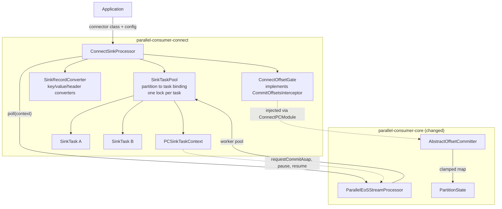
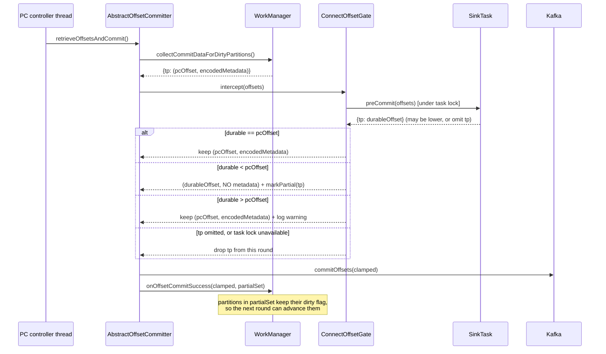
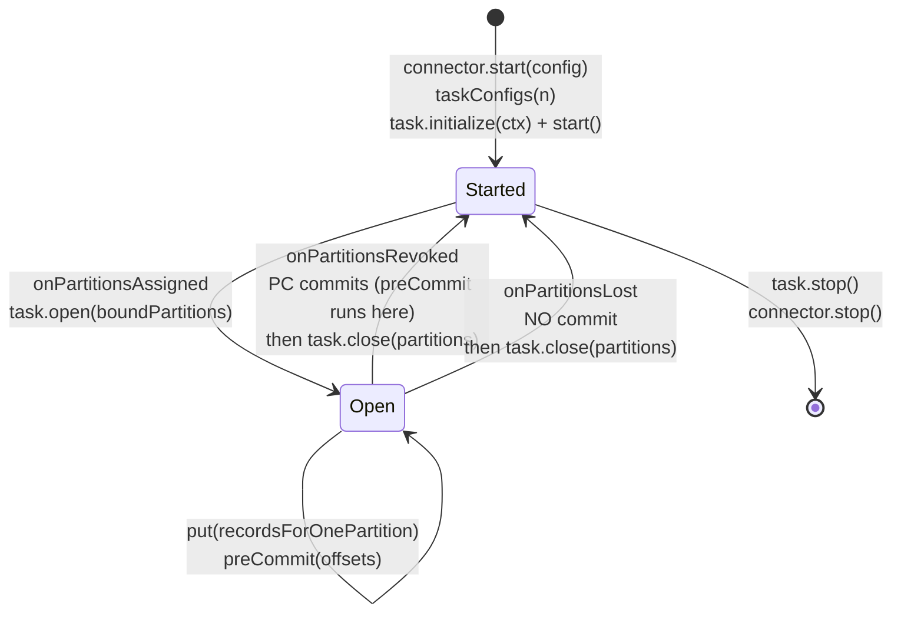

# Kafka Connect Sink Tasks Inside Parallel Consumer - Plan

> **Superseded direction - do not implement as written.** This plan embeds a reduced reimplementation of
> `WorkerSinkTask` in a new module built on `connect-api`. Review established that the approach caps
> concurrency at the partition count (KTD5) and forces a long Deferred list - SMTs, DLQ/`errors.tolerance`,
> `ConfigProvider`, plugin isolation - because each is a Connect runtime feature the module would have to
> rebuild. The direction under development instead **patches Connect** so `WorkerSinkTask` sources records
> from Parallel Consumer, following the build-time patch strategy proven in `feats/ks-on-pc-spike`, which
> inherits those features rather than deferring them.
>
> Kept because the offset analysis transfers unchanged and is the expensive part: the metadata-anchoring
> invariant (KTD4), the clamp-and-stay-dirty stall, the broker-poll threading correction (KTD7), and the
> `preCommit()` semantics in U2's and U6's test scenarios.

## Goal Capsule

**Objective.** Ship `parallel-consumer-connect`: a new first-class module that runs real Kafka Connect
`SinkTask` instances inside Parallel Consumer, with correct offset semantics and correct rebalance
handling. Resolves astubbs/parallel-consumer#240 (mirror of confluentinc/parallel-consumer#119).

**Authority hierarchy.** Requirements (R-IDs) win on behaviour. Key Technical Decisions (KTD-IDs) win on
mechanism within their cited requirements. `AGENTS.md` wins on repo convention and overrides any habit
carried in from elsewhere. The Connect contract as implemented by `WorkerSinkTask` wins on what a
`SinkTask` may observe.

**Stop conditions.** Stop and surface a blocker if: the offset-interception seam (U2) cannot be built
without changing public API beyond what KTD3 sanctions; a `SinkTask` callback must be invoked from more
than one thread without a happens-before edge; or the integration test cannot demonstrate that a
buffered sink's unflushed records are not committed.

**Execution profile.** Core changes (U2) land test-first: the clamp-and-stay-dirty invariant is a
characterization test before it is a behaviour. Everything else is normal build-then-test.

**Tail ownership.** The caller owns commit, push, PR, and CI.

---

## Product Contract

### Summary

Add a module that lets a Parallel Consumer application host Kafka Connect sink connectors **in-process**,
with no Connect worker, no REST API, and no config/offset/status topics. The application supplies a
`SinkConnector` class and its config; the module instantiates the connector, derives task configs, starts
one `SinkTask` per share of the assigned partitions, converts each `ConsumerRecord` to a `SinkRecord`, and
drives `put()` from PC's worker pool. PC's committed offsets are gated by what each task's `preCommit()`
declares durable, so a sink that buffers never has its unflushed records committed.

**What this does not do: raise the concurrency ceiling.** Because a `SinkTask` is not thread-safe and owns
partitions, concurrency here is bounded by the assigned partition count — the same ceiling a Connect
worker reaches with `tasks.max` set to the partition count. See KTD5. The gain is deployment shape and
PC's per-record machinery, not throughput.

### Problem Frame

Running a Kafka Connect sink connector today requires a Connect worker: a separate deployable, a REST API,
and three internal topics for config, offsets, and status. An application that already consumes with
Parallel Consumer and wants to reuse an existing sink connector — a JDBC writer, an S3 writer, a
first-party connector it already trusts — has no way to do that in-process. It either stands up Connect
alongside its own consumer, or reimplements the connector's logic against PC's API.

Upstream discussed joining the two across four comments from 2021 to 2022. The maintainer built working
hacks in both directions, judged "connect sinks inside PC" the publishable one, then asked "would that be
useful?" and got no answer. The issue was closed in 2023 by an administrative sweep, not by a decision.

The 2022 hack survives as the unmerged branch `origin/features/connect-in-pc`. It proved the shape and
left the hard parts undone: no rebalance handling, a Mockito mock in place of `SinkTaskContext`, a
record-conversion bug that put the key's schema in the value's schema slot, and an offset hook wired by
editing a core constructor.

### Requirements

#### Connector and task lifecycle

- R1. The module instantiates a `SinkConnector` from a class name and a config map supplied by the
  application, and derives task configs through `SinkConnector.taskConfigs(n)`.
- R17. Construction fails, naming the unsupported capability, when the supplied connector config contains
  a key the module does not honour: `transforms*`, `predicates*`, `errors.*`, or a `${provider:...}`
  reference. Accepting a config the module silently ignores is worse than rejecting it — an operator who
  set `errors.tolerance=all` would believe poison records are being diverted when they are stalling a
  partition.
- R2. The module starts a pool of `SinkTask` instances, binds every assigned `TopicPartition` to exactly
  one task, and calls `SinkTask.open()` with that task's newly bound partitions on assignment, never
  re-opening partitions it already holds.
- R3. The module calls `SinkTask.close()` with the affected partitions on revocation and on loss, and
  `SinkTask.stop()` on shutdown.
- R4. On revocation, offsets are committed before `close()`. On loss, `close()` runs and no offsets are
  committed for the lost partitions.
- R5. No `SinkTask` instance is ever entered concurrently by two threads, for any callback.

#### Record delivery

- R6. Each `ConsumerRecord` is converted to a `SinkRecord` carrying the key schema and value from separate
  key and value converters, the record's headers, its timestamp, and its timestamp type.
- R7. Records delivered in one `put()` call all belong to one `TopicPartition`.
- R8. A `RetriableException` from `put()` causes those records to be retried without their offsets
  advancing.
- R16. Any other exception from `put()` fails the processor rather than being retried, matching Connect's
  task-failure contract. PC has no retry cap, so the alternative is an unbounded retry loop that blocks
  the partition and silently stalls the group.
- R18. Each `put()` call carries exactly one record in this release. The module states this in its javadoc
  and a test asserts it, so the limitation is enforced rather than assumed.

#### Offset correctness

- R9. Parallel Consumer never commits an offset for a partition beyond the offset that the owning
  `SinkTask.preCommit()` returned for it.
- R10. When a task's `preCommit()` omits a partition, no offset is committed for that partition in that
  round.
- R11. When a committed offset is lowered below what PC computed, the commit carries no PC offset-encoding
  metadata, and the partition remains eligible for a later commit round.
- R12. Offsets passed into and returned from `preCommit()` use Connect's convention: last consumed offset
  plus one.
- R15. When `preCommit()` returns an offset above what PC computed for a partition, PC's own offset is
  committed instead and the discrepancy is logged. Connect's own runtime rejects this case; a driver that
  trusts the task blindly would commit offsets it never consumed.
- R19. A graceful shutdown commits the offsets a final `preCommit()` declares after each task has flushed,
  so a clean stop of a buffering sink leaves nothing to replay.

#### Packaging

- R13. The module's compiled bytecode level matches the true floor of its Connect dependencies, and the
  build fails if the two diverge.
- R14. The module depends on `connect-api` for its main sources. `connect-runtime` is not a main-scope
  dependency.

### Success Criteria

- A real `FileStreamSinkTask` running under PC writes every produced record exactly once per delivery
  attempt, and the consumer group's committed offset never exceeds what the task flushed.
- A deliberately buffering sink task that returns a stale offset from `preCommit()` holds the group's
  committed offset back, and the group advances once the task flushes.
- Abandoning the application mid-run without a graceful close, then restarting on the same group, replays
  from the last `preCommit()`-declared offset, not from PC's higher internal position.
- Concurrency is measured, not assumed: with P partitions and `maxConcurrency > P`, the observed maximum
  of simultaneously-executing `put()` calls is P. This criterion exists to keep the honest ceiling in
  KTD5 true over time rather than letting a later change quietly claim more.

### Scope Boundaries

#### In scope

Sink connectors driven by PC; one connector per processor instance; correct conversion, lifecycle, and
offset gating; a real `SinkTaskContext` for the subset connectors actually use.

#### Deferred to Follow-Up Work

Record each of these in `docs/refactoring.md` as part of U8.

- `SinkTaskContext.offset(...)` rewind. PC has no seek capability at all (confirmed: no `seek` anywhere in
  `parallel-consumer-core/src/main/java`), and a rewind must coherently invalidate `incompleteOffsets`,
  `offsetHighestSeen`, `offsetHighestSucceeded`, and the shard queues. It is the largest single piece of
  new core work in the whole area and is not needed for a correct at-least-once sink.
- Kafka 4.x support. `SinkTaskContext.pluginMetrics()` became abstract in Kafka 4.1 and returns a type
  absent from kafka-clients 3.9.2, so one hand-written context source file cannot compile against both.
  The escape is a `java.lang.reflect.Proxy`-based context; defer it with the rest of the Kafka 4 work
  already tracked in `docs/inflight/pr-53-java-baseline-kafka4.md`.
- Single Message Transforms, dead-letter queues and `errors.tolerance`, and `ConfigProvider` secret
  resolution. All six comparable projects surveyed omit all three.
- Multiple connectors per processor instance.
- Per-partition batching, so a `SinkTask` receives more than one record per `put()`. KTD11 names the core
  change this needs.
- Per-partition `pause`/`resume`. PC exposes only an instance-wide pause; the per-partition
  `ConsumerManager.pause(Set)` is internal throttling. U4 throws rather than faking it.

#### Outside this product's identity

- Source connectors. A source task produces rather than consumes; PC's whole machinery is consumer-side.
- "PC inside Connect" - patching `WorkerSinkTask.pollConsumer`. That is a fork of Kafka, not a library.
- The Connect REST API, distributed mode, and the config/offset/status topics. Those are the worker's
  identity, not the task's.
- Connect's plugin classloader isolation. A library consumer owns their own classpath.

### Sources

- Upstream discussion: confluentinc/parallel-consumer#119, four comments 2021-06 to 2022-07.
- Prior art in this repo: `origin/features/connect-in-pc` (`a69e8fd7`, `129f3f93`, `e2cc920f`).
- The Connect contract as implemented: `connect/runtime/.../WorkerSinkTask.java` at the Kafka 3.9 tag -
  `convertMessages`, `convertAndTransformRecord`, `deliverMessages`, `commitOffsets`, `HandleRebalance`.
- Closest external analogue: Apache Pulsar's `kafka-connect-adaptor` (`KafkaConnectSink`,
  `PulsarKafkaSinkTaskContext`), Apache-2.0, actively maintained. LangStream's
  `KafkaConnectSinkAgent` is a derivative and is dormant.
- KIP-89 (decoupled flush and offset commit), KIP-793 (topic-mutating SMTs and the `original*` accessors).
- Repo learnings that constrain this work: `docs/solutions/test-flakiness/pc-silent-stall-under-contention-2026-07-29.md`,
  `docs/solutions/test-flakiness/unforceable-trigger-commit-lock-timeout-2026-08-07.md`,
  `docs/solutions/test-flakiness/parallel-integration-tests-flaky-under-concurrency-2026-07-28.md`,
  `docs/solutions/workflow-issues/copyright-header-rules-for-fork-2026-04-21.md`,
  `docs/inflight/bug-857-family.md`.

---

## Planning Contract

### Key Technical Decisions

- KTD1. **Ship as a first-class module, `parallel-consumer-connect`, not an example.** The 2022 POC put
  everything in `parallel-consumer-examples`, which is why none of it was reusable. Governs R14.
  Rejected: an example module - it cannot be depended on, and the offset gating is library behaviour, not
  demonstration code.

- KTD2. **Depend on `connect-api` only; exclude its `javax.ws.rs-api` runtime dependency.** Measured:
  `connect-api` plus `connect-json` resolves to 13 jars, of which 8 are new to PC. `connect-runtime`
  resolves to 58, adding Jetty 9.4, Jersey 2.47, HK2, and `ch.qos.reload4j` - a second logging backend on
  every downstream classpath, which a library must not choose for its users. `javax.ws.rs-api` is
  referenced by exactly one class in `connect-api` (`ConnectRestExtensionContext`), never loaded on a sink
  path, so excluding it is safe and sidesteps the `javax`-to-`jakarta` swap coming in Kafka 4. Governs R14.

- KTD3. **Add one narrow interception seam to core: `CommitOffsetsInterceptor`, invoked from
  `AbstractOffsetCommitter.retrieveOffsetsAndCommit()`, supplied through `PCModule`.** There is no such
  seam on master - confirmed by reading `AbstractOffsetCommitter`, which has only `preAcquireOffsetsToCommit()`
  and `postCommit()` and never hands the offset map to an overridable method. Placing the seam in the
  abstract base covers both committers (`ConsumerOffsetCommitter` and `ProducerManager`) with one change.
  Governs R9, R10, R11.
  Rejected: subclassing `WorkManager.collectCommitDataForDirtyPartitions()` through `PCModule#workManager()`.
  It needs no core change, which is why it is tempting, but it couples the Connect module to `WorkManager`
  internals and hides a correctness-critical contract inside an override with no name.
  Also rejected: the POC's approach of widening `AbstractParallelEoSStreamProcessor`'s constructor to take
  an `OffsetCommitter`. It changes a public constructor for a private need.
  Also rejected: deferring work completion the way `ExternalEngine` does, so a record is not marked
  succeeded until a later `preCommit()` covers its offset. This is the closest in-repo analogue and it
  would need no core change at all, so it deserved the evaluation. It fails on granularity: `ExternalEngine`
  completes one `WorkContainer` when one future resolves, but `preCommit()` reports a per-partition
  watermark, not a per-record result, so every record below the watermark would have to be located and
  completed out of band — reconstructing the offset bookkeeping the seam exists to avoid. It also inverts
  the retry semantics: an uncompleted `WorkContainer` is retried, but a record a buffering sink has
  accepted must not be re-delivered.
  **Sanctioned public surface:** the `CommitOffsetsInterceptor` interface and the
  `PCModule#commitOffsetsInterceptor()` factory. Anything wider is a stop condition. The interface ships
  in `io.confluent.parallelconsumer.internal` and its javadoc says it is not a stability-guaranteed
  extension point for third parties.

- KTD4. **A lowered offset is committed without PC's encoding metadata, and leaves the partition dirty.**
  This is the correctness heart and the reason the seam cannot be a naive map transform.
  `PartitionState.createOffsetAndMetadata()` builds `new OffsetAndMetadata(getOffsetToCommit(), encoded)`
  where both terms are anchored to `getOffsetHighestSequentialSucceeded() + 1`, and the read side decodes
  the payload using `OffsetAndMetadata.offset()` as its base. Substituting a lower offset while keeping the
  payload shifts the entire decoded incomplete set by the delta, silently marking succeeded records
  incomplete and vice versa. Separately, `PartitionState.onOffsetCommitSuccess()` calls `setClean()`, and
  the commit gate is `isTimeToCommitNow() && wm.isDirty() && !isRebalanceInProgress` - so a clamped
  partition that goes clean stops being committed at all, and a sink that later flushes never advances the
  group. Both halves are required. Governs R11.
  Rejected: re-encoding the incomplete map against the lowered base. Correct in principle, but it puts
  offset-codec logic in the Connect module and buys only reduced replay.

- KTD5. **Require `ProcessingOrder.PARTITION`; reject `KEY` and `UNORDERED` at construction. Concurrency
  is therefore bounded by the assigned partition count.** `ShardKey.of` shards by `TopicPartition` for
  `PARTITION` and `UNORDERED`, and by (partition, key) for `KEY`;
  `ProcessingShard.getWorkIfAvailable` breaks after one record per shard when `ordering != UNORDERED`. So
  `PARTITION` is the only value that yields at most one in-flight record per partition, which is what makes
  a per-partition task safe. `KEY` is PC's default, so silence here would hand every user the one wrong
  setting. `ExternalEngine`'s constructor-time `IllegalStateException` for transactional commit mode is the
  in-repo precedent for rejecting an unsupportable option. Governs R5, R7.

  **State the ceiling plainly, because it is the same one Connect has.** Composed with KTD6's pool sizing
  and KTD7's per-task lock, the maximum number of concurrent `put()` calls equals the assigned partition
  count — identical to a Connect worker running `tasks.max = <partitions>`. This module does not decouple
  concurrency from partition count and must not be described as if it does.
  Rejected: `UNORDERED` with several tasks sharing a partition. It is the only shape that would beat
  Connect's ceiling, and it is unsound: a task's `preCommit()` reports a durable offset meaning
  "everything below this is written", which no task can truthfully claim when a partition's records are
  interleaved across tasks. The offsets would over-report and the sink would lose data on restart.

- KTD6. **One `SinkTask` per share of the assignment, sized `min(maxConcurrency, assignedPartitions)`,
  each partition bound to exactly one task.** This is Connect's own model - `tasks.max` with partitions
  distributed across tasks - and it is what makes PC's concurrency worth anything here. Governs R2, R5.
  Rejected: a single task owning all partitions, which every surveyed prior-art project does. It is
  trivially correct and delivers zero parallelism, which defeats the feature.

- KTD7. **Guard every `SinkTask` callback with that task's own lock, and acquire it from the commit path
  with a bounded `tryLock`.** `put()` runs on PC's worker pool (`pc-pool-*`); `preCommit()`, `open()`, and
  `close()` all run on the **broker-poll thread** (`pc-broker-poll`). Two threads, one non-thread-safe
  object. A per-task `ReentrantLock` gives both mutual exclusion and the happens-before edge between
  `put()` and `preCommit()`. Governs R5.

  **The bounded acquisition is not defensive polish; it is required.** In the default
  `PERIODIC_CONSUMER_ASYNCHRONOUS` commit mode the committer is the `BrokerPollSystem`
  (`AbstractParallelEoSStreamProcessor:311-316`), and `retrieveOffsetsAndCommit()` — where KTD3 puts the
  seam — executes from `BrokerPollSystem`'s own loop via `maybeDoCommit()`. Blocking there stops
  `consumer.poll()`, which is what holds group membership: an unbounded wait on a slow sink risks
  `max.poll.interval.ms` eviction and a rebalance loop. Worse, on the revoke path
  `commitOffsetsThatAreReady()` runs inside `synchronized (commitCommand)` — the exact monitor of the
  still-open astubbs#29 deadlock. So the gate uses `tryLock(timeout)` and, on failure, withholds that
  task's partitions from the round, which is the behaviour R10 already defines and U2 already tests.

- KTD8. **Drive `open()`/`close()` through the existing public
  `ParallelConsumer.subscribe(Collection<String>, ConsumerRebalanceListener)` overload.** No new core hook
  is needed - this is already public API and PC already invokes the user listener from all three callbacks.
  The existing ordering is exactly Connect's: on revoke PC commits first and calls the user listener after,
  and because KTD3 puts `preCommit()` inside the commit path, the observed order is `preCommit()` then
  `close()`, matching `WorkerSinkTask.commitOffsets()`'s `finally` block. On loss PC commits nothing and
  then calls the listener, matching Connect's close-without-commit. Governs R3, R4.

- KTD9. **`release.target` stays 8, with a build-time assertion on the resolved `connect-api` bytecode
  level.** Measured: every class in `connect-api` 3.9.2 is class-file major 52. So Java 8 is honest today.
  But `--release` constrains only the platform API, not classpath bytecode: compiling against `connect-api`
  4.3.1 (major 61) at `--release 8` exits 0 and emits major 52, shipping an artefact that lies about the
  JVM it needs. This repo already shipped that exact defect once - `parallel-consumer-mutiny/pom.xml` carries
  a 17-line comment about it - so a human-maintained number is not sufficient. Governs R13.
  Rejected: setting `release.target=17` pre-emptively. It would drop Java 8 support for no present reason.

- KTD10. **Write a pass-through byte-array `Converter` rather than importing `ByteArrayConverter`.**
  `ByteArrayConverter` lives in `connect-runtime`, not `connect-api`. Reaching for it would cost 45 extra
  jars to save roughly fifteen lines. Governs R14.

- KTD11. **Accept one record per `put()` in this release; defer per-partition batching with its core
  change named.** Under `PARTITION` ordering `ProcessingShard` yields at most one record per shard per
  selection, so a PC batch spanning N partitions carries one record each; grouping by partition (R7) then
  produces singleton groups. `batchSize` has no effect on this module. Every batching sink — JDBC, S3,
  Elasticsearch — therefore performs one round-trip per record, where a Connect worker would amortize
  across up to `max.poll.records`. Governs R18.
  The fix is a real core change, not a module change: allow up to `batchSize` records from the *same*
  shard into one work batch under order-restricted processing. That preserves ordering (one thread, one
  `put()`, records in offset order) while giving the sink a batch. It is deferred because it alters shard
  selection for every PC user, which is a larger and independently reviewable change than this module.
  Rejected: accumulating records inside the module and flushing on a timer. It would put a second,
  invisible buffering layer under a connector that already buffers, and PC's offset state would no longer
  describe what the sink has seen.

### High-Level Technical Design

#### Component topology

#### The commit reconciliation - the load-bearing sequence

#### Task lifecycle against the rebalance

### Assumptions

Recorded because this plan was scoped without a blocking confirmation.

- A1. The application supplies the connector class name and config map programmatically. There is no
  properties-file or config-topic loading path in this module.
- A2. `K` and `V` are fixed to `byte[]`. Connect's converters operate on raw bytes, so a generic
  processor would only force callers to deserialize twice.
- A3. One connector per `ConnectSinkProcessor` instance. Multiple connectors means multiple instances.
- A4. At-least-once is the delivery guarantee. Connect sinks are at-least-once unless the connector
  manages its own offsets, which is exactly what the deferred `offset()` rewind would enable.
- A5. `ConnectSinkProcessor` owns and closes the `ParallelEoSStreamProcessor` it constructs. Callers do not
  get a handle to the underlying processor.

### Risks & Dependencies

- **The revoke path contains a live deadlock.** `docs/inflight/bug-857-family.md` records an open
  `synchronized(commitCommand)` deadlock between `onPartitionsRevoked` on the poll thread and
  `commitOffsetsThatAreReady` on the control thread, with the fix waiting in an unmerged astubbs#29.
  `close()` hangs off exactly this path. Mitigation: `close()` must do no blocking work and must not
  acquire any PC lock. This is a constraint on U5, not a dependency on astubbs#29.
- **`preCommit()` runs on the broker-poll thread, and on the revoke path it runs while
  `synchronized (commitCommand)` is held.** A connector doing slow I/O inside `preCommit()` therefore
  delays `consumer.poll()` — risking `max.poll.interval.ms` eviction and a rebalance loop — and widens the
  window of the open astubbs#29 deadlock. KTD7's bounded `tryLock` is the mitigation, and it is mandatory,
  not advisory. This corrects an earlier reading of this plan that attributed `preCommit()` to the
  controller thread; the committer is the `BrokerPollSystem` in every non-transactional commit mode.
- **A clamped partition that goes clean stalls forever.** Covered by KTD4, and it is the single most
  likely way to ship a silently broken feature. U2's test scenarios exist to catch exactly this.
- **`AGENTS.md` is stale on integration-test selection.** It says `**/*IT.java` is included in failsafe;
  the root pom's failsafe `<includes>` lists only `**/integrationTest*/**/*.java`. A `*IT.java` outside an
  `integrationTest` package runs in neither suite and reports nothing. U7 must place tests by package;
  U8 corrects the doc.
- **The ambient probe cannot vouch for small tests.** It needs sustained lag past 150s or a 15s rebalance
  dwell. A clean probe verdict on this module's integration tests means nothing.

---

## Implementation Units

### U1. Scaffold the `parallel-consumer-connect` module

**Goal.** A buildable, convention-compliant empty module wired into the reactor.

**Requirements.** R13, R14. Implements KTD1, KTD2, KTD9.

**Dependencies.** None.

**Files.**
- `parallel-consumer-connect/pom.xml` (create)
- `pom.xml` (modify - add to `<modules>`)
- `parallel-consumer-connect/src/test/java/io/confluent/parallelconsumer/connect/TestConventionsArchTest.java` (create)

**Approach.**
1. New pom with `<parent>parallel-consumer-parent</parent>`, groupId `bz.stub.parallelconsumer`,
   artifactId `parallel-consumer-connect`.
2. Main-scope dependencies: `parallel-consumer-core`, and `org.apache.kafka:connect-api` at
   `${kafka.version}` with an `<exclusion>` for `javax.ws.rs:javax.ws.rs-api`.
3. Test-scope: `parallel-consumer-core` with `<classifier>tests</classifier>`, `connect-json`,
   `connect-file`, and — mirroring `parallel-consumer-vertx/pom.xml` — `org.testcontainers:kafka` and
   `org.testcontainers:junit-jupiter`. Without the last two, U7's broker IT does not compile, and the
   failure would land six units after the decision that caused it.
4. Add a `release.target` assertion. Prefer `maven-enforcer-plugin`'s `enforceBytecodeVersion` rule
   against the resolved `connect-api` artifact; if that rule is not available without a new plugin
   dependency, a small `exec-maven-plugin` step in `validate` that reads the class-file major version out
   of the jar is acceptable. Either way it must fail the build, not warn. Mirror the comment style of
   `parallel-consumer-mutiny/pom.xml` lines 18-36 and say why the check exists.
5. Copy the `TestConventionsArchTest` shim from `parallel-consumer-vertx`, retargeted to
   `io.confluent.parallelconsumer.connect`. Without it the module silently gets zero architecture
   enforcement.
6. Every new source file carries the fork header, package line first:
   `/*-\n * Copyright (C) 2026 Antony Stubbs and contributors\n */`. Never the Confluent header.

**Patterns to follow.** `parallel-consumer-reactor/pom.xml` for a minimal module pom;
`parallel-consumer-mutiny/pom.xml` for how a release-level decision is documented;
`parallel-consumer-vertx/src/test/java/.../TestConventionsArchTest.java` for the ArchUnit shim.

**Test scenarios.**
- `./mvnw -pl parallel-consumer-connect -am clean install` succeeds from a clean local repo. Note the
  `-am` is required: without it `reactorModuleConvergence` fails and the module is never recompiled.
- `bin/check-copyright-headers.sh` passes with the new files present.
- Deliberately raising `connect-api` to a 4.x version fails the build with a message naming the bytecode
  mismatch. Revert after confirming. This proves KTD9's assertion is live rather than decorative.

**Verification.** The module appears in the reactor build output and produces an empty jar; the enforcer
step is visible in the `validate` phase log.

---

### U2. Core: the offset-commit interception seam

**Goal.** Core gains one narrow, documented way for an external component to lower or withhold committed
offsets without corrupting PC's offset encoding or stalling the partition.

**Requirements.** R9, R10, R11, R15. Implements KTD3, KTD4.

**Dependencies.** None. Independent of U1.

**Execution note.** Test-first. Write the clamp-and-stay-dirty test against `PartitionState` and
`AbstractOffsetCommitter` before the production change; a green-on-first-run test here is a test that is
not measuring what it claims.

**Files.**
- `parallel-consumer-core/src/main/java/io/confluent/parallelconsumer/internal/CommitOffsetsInterceptor.java` (create)
- `parallel-consumer-core/src/main/java/io/confluent/parallelconsumer/internal/AbstractOffsetCommitter.java` (modify)
- `parallel-consumer-core/src/main/java/io/confluent/parallelconsumer/internal/PCModule.java` (modify)
- `parallel-consumer-core/src/main/java/io/confluent/parallelconsumer/state/PartitionState.java` (modify)
- `parallel-consumer-core/src/main/java/io/confluent/parallelconsumer/state/WorkManager.java` (modify)
- `parallel-consumer-core/src/main/java/io/confluent/parallelconsumer/internal/BrokerPollSystem.java` (modify, to thread the interceptor into `ConsumerOffsetCommitter`)
- `parallel-consumer-core/src/main/java/io/confluent/parallelconsumer/internal/ConsumerOffsetCommitter.java` (modify, accept the interceptor and pass it to `super`)
- `parallel-consumer-core/src/main/java/io/confluent/parallelconsumer/internal/ProducerManager.java` (modify, same)
- `parallel-consumer-core/src/main/java/io/confluent/parallelconsumer/state/PartitionStateManager.java` (modify, thread `partialPartitions` from `WorkManager` down to `PartitionState`)
- `parallel-consumer-core/src/test/java/io/confluent/parallelconsumer/internal/CommitOffsetsInterceptorTest.java` (create)
- `parallel-consumer-core/src/test/java/io/confluent/parallelconsumer/state/PartitionStatePartialCommitTest.java` (create)

**Approach.**
1. `CommitOffsetsInterceptor` returns both the map to commit and the set of partitions that were lowered.
   A bare `UnaryOperator<Map<...>>` cannot express "this was partial", and that signal is what R11 needs.
   Keep it a small named result type, not a pair.
2. Invoke it in `AbstractOffsetCommitter.retrieveOffsetsAndCommit()` between
   `wm.collectCommitDataForDirtyPartitions()` and the emptiness check, so a fully-withheld round costs no
   broker call.
3. `PCModule` gains `protected Optional<CommitOffsetsInterceptor> commitOffsetsInterceptor()` returning
   empty by default, memoized like every other member. Thread it to `ConsumerOffsetCommitter` via
   `BrokerPollSystem`, and to `ProducerManager` via its existing `PCModule` construction.
4. Add `PartitionState.onPartialOffsetCommitSuccess(OffsetAndMetadata)`: set `lastCommittedOffset` but do
   not call `setClean()`. Expose it through `WorkManager.onOffsetCommitSuccess(committed, partialPartitions)`.
   Keep the existing single-argument `onOffsetCommitSuccess` behaviour unchanged for every current caller.
5. Javadoc the interceptor with the invariant in plain terms: an implementation that lowers an offset must
   return an `OffsetAndMetadata` with no metadata, because the payload is decoded against the offset it
   ships with. Say in the same javadoc that this is an internal seam, not a stability-guaranteed
   extension point (KTD3).
6. Every modified core file keeps its Confluent header and gains
   `Modifications Copyright (C) 2026 Antony Stubbs and contributors` beneath it.
   `AbstractOffsetCommitter.java` and `PCModule.java` do not carry that line yet, so
   `bin/check-copyright-headers.sh` fires the first time they are touched.

**Patterns to follow.** `PCModule`'s memoized-factory shape; `PCModuleTestEnv` for how an override is
tested; `ProducerManager`'s existing use of `preAcquireOffsetsToCommit`/`postCommit` for how a subclass
participates in the commit path.

**Test scenarios.**
- No interceptor configured: `retrieveOffsetsAndCommit` commits exactly the map `WorkManager` produced,
  byte for byte, including metadata. This is the regression guard for every existing user.
- Interceptor returns the input unchanged: identical result, and the partition goes clean as before.
- Interceptor lowers one partition from offset 100 to 60: the committed `OffsetAndMetadata` has offset 60
  and `metadata() == null`; the other partitions are untouched.
- Same case: after `onOffsetCommitSuccess`, `PartitionState.isDirty()` is still true for the lowered
  partition and false for the untouched ones. This is the anti-stall test.
- Interceptor omits a partition entirely: no offset is committed for it, and it stays dirty.
- Interceptor withholds every partition: `commitOffsets` is never called and no broker round-trip occurs.
- Interceptor returns an offset *higher* than PC computed: rejected, PC's own value is committed, and a
  warning is logged. Connect's runtime does exactly this; a driver that trusts the task blindly would
  commit un-consumed offsets.
- Interceptor throws: the exception propagates, `postCommit()` still runs (it is in a `finally`), and no
  partition is marked committed.
- A lowered partition followed by a second round where the interceptor returns the full offset: the second
  round commits 100 with metadata intact and the partition then goes clean.

**Verification.** `bin/ci-unit-test.sh` green, including the full existing offset and commit test suites -
this unit changes shared machinery, so a passing new test proves nothing on its own.

---

### U3. Record conversion

**Goal.** A `ConsumerRecord<byte[], byte[]>` becomes a `SinkRecord` indistinguishable from one
`WorkerSinkTask` would have produced.

**Requirements.** R6. Implements KTD10.

**Dependencies.** U1.

**Files.**
- `parallel-consumer-connect/src/main/java/io/confluent/parallelconsumer/connect/SinkRecordConverter.java` (create)
- `parallel-consumer-connect/src/main/java/io/confluent/parallelconsumer/connect/PassthroughByteArrayConverter.java` (create)
- `parallel-consumer-connect/src/test/java/io/confluent/parallelconsumer/connect/SinkRecordConverterTest.java` (create)

**Approach.**
1. Mirror `WorkerSinkTask.convertAndTransformRecord`. Use the headers-aware three-argument
   `Converter.toConnectData(topic, headers, value)` overload - the two-argument form silently breaks
   header-aware converters. Build headers with `ConnectHeaders` via
   `HeaderConverter.toConnectHeader(topic, key, value)` per Kafka header, never `null`.
2. Use the ten-argument `SinkRecord` constructor: topic, partition, keySchema, key, **valueSchema**, value,
   offset, timestamp, timestampType, headers. The thirteen-argument constructor is javadoc-restricted to
   the Connect runtime.
3. Normalize the timestamp the way `ConnectUtils.checkAndConvertTimestamp` does: `NO_TIMESTAMP` (-1)
   becomes `null`; other negatives are rejected. Do not pass `record.timestamp()` raw.
4. Instantiate two separate `Converter` objects, one configured `isKey=true` and one `isKey=false`. The
   flag is not cosmetic - `JsonConverterConfig` and `StringConverter` both branch on it. `HeaderConverter.configure`
   takes a map only, with no `isKey`. Default the header converter to `SimpleHeaderConverter`, matching
   `WorkerConfig.HEADER_CONVERTER_CLASS_DEFAULT`.
5. `PassthroughByteArrayConverter` exists so the module never needs `connect-runtime`'s `ByteArrayConverter`.

**Patterns to follow.** `WorkerSinkTask.convertAndTransformRecord` and `convertHeadersFor` at the Kafka 3.9
tag are the specification. Read them; do not reconstruct from javadoc.

**Test scenarios.**
- A record with a `StringConverter` key and value produces a `SinkRecord` whose `keySchema()` is
  `Schema.OPTIONAL_STRING_SCHEMA` and whose `valueSchema()` is the *value* converter's schema. This is the
  direct regression guard for the POC's schema-slot bug, and it must fail if the two are swapped.
- A record with three Kafka headers produces a `SinkRecord` with three matching Connect headers in order.
- A record with no headers produces an empty `ConnectHeaders`, not `null`.
- A record with `timestampType == CREATE_TIME` and a positive timestamp carries both through.
- A record with `timestamp == RecordBatch.NO_TIMESTAMP` produces `timestamp() == null` and
  `timestampType() == NO_TIMESTAMP_TYPE`.
- A null key produces a `SinkRecord` with null key and null key schema, and does not throw.
- Key and value converters configured differently (String key, JSON value) each apply to their own side.
- `PassthroughByteArrayConverter` round-trips arbitrary bytes including empty and null.
- `offset()` on the `SinkRecord` is the record's own offset, not offset+1. The plus-one convention applies
  only to the commit maps, and conflating the two is the classic error.

**Verification.** Unit tests only; no broker needed.

---

### U4. `PCSinkTaskContext`

**Goal.** A real `SinkTaskContext` backed by PC, replacing the POC's Mockito mock.

**Requirements.** R1.

**Dependencies.** U1.

**Files.**
- `parallel-consumer-connect/src/main/java/io/confluent/parallelconsumer/connect/PCSinkTaskContext.java` (create)
- `parallel-consumer-connect/src/test/java/io/confluent/parallelconsumer/connect/PCSinkTaskContextTest.java` (create)

**Approach.**
Implement per method, with the observable behaviour of `WorkerSinkTaskContext` as the target:
- `configs()` returns the task's config map.
- `assignment()` returns the partitions currently bound to this task.
- `requestCommit()` calls PC's `requestCommitAsap()`. **Log a warning when no partition is dirty**, because
  the commit gate is `isTimeToCommitNow() && wm.isDirty() && !isRebalanceInProgress` and
  `requestCommitAsap()` short-circuits only the interval term. A commit request in a non-dirty state is
  silently inert, and a connector flushing on a timer will hit exactly that. Do not pretend it worked.
- `pause(...)` / `resume(...)` throw `UnsupportedOperationException` naming the partitions and the deferred
  work, exactly as `offset(...)` does. PC exposes no per-partition pause. Emulating one by escalating to
  PC's instance-wide pause is worse than not having it: under KTD6 most tasks own a single partition, so
  one connector asking for back-pressure on one partition would silently halt every other task.
- `offset(...)` both overloads throw `UnsupportedOperationException` with a message naming the deferred
  work. A silent no-op here loses data for any connector that manages its own offsets - throwing is the
  honest failure.
- `timeout(long)` records the value and is otherwise unused. Note in javadoc that Connect's `timeout()`
  *shortens* the next poll and is one-shot; it never delays a retry, despite what its javadoc suggests.
- `errantRecordReporter()` is inherited. It is a `default` method returning `null` since Kafka 2.6, and
  null is a documented legal value meaning "no reporter configured" - this is not a stub.

**Test scenarios.**
- `assignment()` reflects the bound partitions and changes after a simulated `open`/`close`.
- `requestCommit()` invokes the supplied commit-request callback exactly once.
- `requestCommit()` with no dirty partitions logs a warning and still invokes the callback.
- `pause(tp)` throws `UnsupportedOperationException` whose message names the partition, and does not touch
  the processor's run state.
- `resume(tp)` throws likewise.
- `offset(tp, 0)` throws `UnsupportedOperationException` whose message names the partition.
- `configs()` returns the exact map the task was started with.

**Verification.** Unit tests with a mocked PC-facing callback interface. No broker.

---

### U5. `SinkTaskPool` - lifecycle, binding, and locking

**Goal.** Tasks are created, bound to partitions, driven, and torn down correctly, and never entered
concurrently.

**Requirements.** R1, R2, R3, R5, R7, R8, R16. Implements KTD6, KTD7.

**Dependencies.** U1, U4.

**Files.**
- `parallel-consumer-connect/src/main/java/io/confluent/parallelconsumer/connect/SinkTaskPool.java` (create)
- `parallel-consumer-connect/src/main/java/io/confluent/parallelconsumer/connect/BoundSinkTask.java` (create)
- `parallel-consumer-connect/src/test/java/io/confluent/parallelconsumer/connect/SinkTaskPoolTest.java` (create)

**Approach.**
1. Instantiate the connector reflectively: `Class.forName(name).getConstructor().newInstance()`, then
   `initialize(...)`, `start(config)`, `taskConfigs(n)`. Defensively copy each returned config into a
   `new HashMap<>` - `taskConfigs` may return immutable maps, and `WorkerSinkTask` copies for the same
   reason. Going through `taskConfigs` rather than handing the raw user config to the task matters:
   connectors legitimately rewrite and split config there.
2. Instantiate each task via `connector.taskClass()` and reflection, then `initialize(context)`,
   `start(config)`. **Do all of this eagerly in the constructor, not during a rebalance.** `SinkTask.start()`
   is where connectors open JDBC connections and S3 clients, and PC invokes `onPartitionsAssigned` on the
   `pc-broker-poll` thread from inside `consumer.poll()` — connection setup there delays rebalance
   completion for the whole group. Connect itself calls `start()` from `initializeAndStart()`, outside the
   listener, and only `open()` from it. Start `maxConcurrency` tasks; ones that end up bound to no
   partitions cost one `start()`/`stop()` pair.
3. `BoundSinkTask` wraps one `SinkTask` with its `ReentrantLock` and its context. Every callback -
   `open`, `put`, `preCommit`, `close`, `stop` - goes through the lock; the commit path uses
   `tryLock(timeout)` per KTD7, all other paths block.
4. Binding on assignment: distribute newly assigned partitions across tasks round-robin, capped at
   `min(maxConcurrency, totalAssignedPartitions)` distinct tasks. Call `open()` once per task with only
   that task's newly bound partitions. **The binding lives in exactly one place** — a
   `Map<TopicPartition, BoundSinkTask>` on the pool. `BoundSinkTask.boundPartitions()` and
   `PCSinkTaskContext.assignment()` are derived reads of that map, never stored copies; incremental
   assignment and subset revocation are precisely where two copies of one relation drift apart.
5. `close()` on revocation and loss: call it with the affected partitions per owning task, then unbind.
   **It must do no blocking work and acquire no PC lock** - it runs on the broker-poll thread inside the
   rebalance callback, where `docs/inflight/bug-857-family.md` records an open deadlock.
6. Exceptions from `open()`/`close()` are stashed and rethrown from the next `put()`, not thrown from the
   listener. The consumer swallows rebalance-listener exceptions; `WorkerSinkTask` stashes into
   `rebalanceException` for exactly this reason, and without it an `open()` failure disappears.
7. `stop()` on every task, then `connector.stop()`, on shutdown - once, idempotently.

**Test scenarios.**
- Eight partitions with `maxConcurrency=3` creates 3 tasks; every partition is bound to exactly one; no
  task is bound to a partition it was not opened with.
- Two partitions with `maxConcurrency=8` creates 2 tasks, not 8.
- Incremental assignment: a second `onPartitionsAssigned` for new partitions calls `open()` only with the
  new ones, never re-opening already-open partitions.
- Revocation of a subset calls `close()` with exactly that subset on exactly the owning task.
- Revocation of everything followed by shutdown calls `stop()` once per task and `connector.stop()` once.
- A task that throws from `open()`: the exception is not thrown from the assignment callback, and the next
  `put()` throws it.
- Concurrency: N threads calling `put()` for distinct partitions bound to the same task never overlap
  inside the task. Assert with a re-entrancy detector in the fake task (a counter that fails if it exceeds
  one), not with a timing heuristic.
- `preCommit()` invoked from a different thread than `put()` still serializes against it.
- A `RetriableException` from `put()` propagates out of the pool unchanged, so PC can retry it.
- A non-`RetriableException` from `put()` fails the processor rather than being retried (R16), and the
  partition's offset does not advance. Without this, PC's uncapped retry turns one poison record into a
  permanent partition stall.
- Connector and task `start()` happen during construction, not during `onPartitionsAssigned`: a fake task
  that records the calling thread name shows `start()` off the `pc-broker-poll` thread and `open()` on it.
- `stop()` called twice is a no-op the second time.

**Verification.** Unit tests with an in-tree fake `SinkTask` recording call order and detecting
re-entrancy. No broker.

---

### U6. `ConnectSinkProcessor` - wire it together

**Goal.** One public entry point that an application constructs, subscribes, and closes.

**Requirements.** R2, R3, R4, R5, R7, R10, R12, R15, R17, R18, R19. Implements KTD5, KTD8, KTD11.

**Dependencies.** U2, U3, U4, U5.

**Files.**
- `parallel-consumer-connect/src/main/java/io/confluent/parallelconsumer/connect/ConnectSinkProcessor.java` (create)
- `parallel-consumer-connect/src/main/java/io/confluent/parallelconsumer/connect/ConnectSinkOptions.java` (create)
- `parallel-consumer-connect/src/main/java/io/confluent/parallelconsumer/connect/ConnectPCModule.java` (create)
- `parallel-consumer-connect/src/main/java/io/confluent/parallelconsumer/connect/ConnectOffsetGate.java` (create)
- `parallel-consumer-connect/src/test/java/io/confluent/parallelconsumer/connect/ConnectOffsetGateTest.java` (create)
- `parallel-consumer-connect/src/test/java/io/confluent/parallelconsumer/connect/ConnectSinkProcessorTest.java` (create)

**Approach.**
1. `ConnectSinkOptions`: connector class name, connector config map, key/value/header converter class names
   and their configs. Lombok `@Builder`, matching how `ReactorProcessor` takes module-specific config as
   constructor arguments rather than extending `ParallelConsumerOptions`.
2. Validate at construction: reject `ProcessingOrder.KEY` and `UNORDERED` with an
   `IllegalArgumentException` naming `PARTITION` (KTD5). Follow `ExternalEngine`'s constructor-time
   rejection precedent.
3. `ConnectPCModule extends PCModule<byte[], byte[]>` overriding `commitOffsetsInterceptor()` to return the
   `ConnectOffsetGate`. Construct the processor with `new ParallelEoSStreamProcessor<>(options, module)` —
   that two-argument constructor is **already public**, so no core visibility change is required. Hold the
   concrete `ParallelEoSStreamProcessor` type: `PCModule.pc()` returns
   `AbstractParallelEoSStreamProcessor`, which does not declare `poll(...)`.
4. `ConnectOffsetGate.intercept(offsets)`: group by owning task, call `preCommit()` under each task's
   `tryLock(timeout)` (KTD7), then reconcile per partition - equal keeps PC's metadata; lower strips
   metadata and marks partial; higher is rejected with a warning and PC's value kept; omitted, or the
   task's lock unavailable, is dropped from the round. Remember the last clamped offset emitted per
   partition and drop a partition whose newly clamped value is unchanged, so a stalled buffering sink
   stops re-issuing byte-identical broker commits every interval while staying dirty and eligible.
   Ignore partitions the task returns that were not in the input map — committing an offset PC never
   computed would bypass its own bookkeeping entirely.
5. Subscribe with the listener overload: `pc.subscribe(topics, poolRebalanceListener)` (KTD8). Do not add a
   core hook.
6. The poll function groups the `PollContext`'s records by `TopicPartition` and issues one `put()` per
   group to that partition's owning task (R7). Under `PARTITION` ordering with `batchSize > 1`, PC's
   batches are chopped across shards and can span partitions, so this grouping is required, not defensive.
7. `close()` closes the processor first (draining), **then takes a final `preCommit()` after each task has
   flushed and commits what it declares** (R19), then stops tasks and the connector. Without that final
   round a buffering sink flushes inside `stop()` with no commit left to record it, so every clean
   shutdown would replay the last buffer. Draining keeps the
   partition assignment on purpose - finish, commit, then leave - and the alternative was formally rejected
   in `docs/solutions/test-flakiness/pc-silent-stall-under-contention-2026-07-29.md` on duplicate-delivery
   grounds. Do not invent an early release.

**Test scenarios (gate).**
- Task returns the same offsets PC computed: metadata preserved, nothing marked partial.
- Task returns a lower offset for one partition: that entry has null metadata and is marked partial; the
  others are untouched.
- Task returns a higher offset than consumed: PC's value is committed and a warning is logged.
- Task omits a partition present in the input: that partition is absent from the output.
- Task returns an empty map: the whole round is withheld.
- Task throws from `preCommit()`: the exception propagates and nothing is committed.
- Two tasks, four partitions: each task's `preCommit()` receives only its own partitions.

**Test scenarios (processor).**
- Constructing with `ProcessingOrder.KEY` throws, and the message names `PARTITION`.
- Constructing with `UNORDERED` throws.
- Constructing with a connector config containing `transforms=`, `errors.tolerance=`, or a
  `${vault:...}` reference throws, and the message names the unsupported capability (R17).
- A `PollContext` batch spanning two partitions produces two `put()` calls, each partition-homogeneous.
- Every `put()` call receives exactly one record (R18). This asserts KTD11's limitation rather than
  leaving an implementer to assume batching works.
- `close()` calls processor close, then `stop()` on tasks, then `connector.stop()`, in that order.
- `close()` twice is idempotent.

**Verification.** `bin/ci-unit-test.sh` green.

---

### U7. End-to-end integration test against a real broker

**Goal.** Prove the two claims that unit tests cannot: a real connector receives real records, and a
buffering sink holds the committed offset back.

**Requirements.** R4, R9, R11, R18, R19. Validates the Success Criteria.

**Dependencies.** U6.

**Files.**
- `parallel-consumer-connect/src/test-integration/java/io/confluent/parallelconsumer/connect/integrationTests/ConnectSinkIT.java` (create)
- `parallel-consumer-connect/src/test-integration/java/io/confluent/parallelconsumer/connect/integrationTests/RecordingSinkTask.java` (create)
- `parallel-consumer-connect/pom.xml` (modify - `build-helper` test-integration source root if not inherited)

**Approach.**
1. Extend `BrokerIntegrationTest<byte[], byte[]>`. It brings the reused Kafka container, `getKcu()`, and
   `AmbientProbeExtension` automatically.
2. The package **must** be `...connect.integrationTests` - failsafe selects by package
   (`**/integrationTest*/**/*.java`), not by the `*IT` class-name suffix, and a class outside that package
   runs in neither suite. `parallel-consumer-vertx`'s `VertxConcurrencyIT` is the model.
3. Use `kcu.createTopic(...)` and `kcu.produceMessages(...)`. Write no new topic, producer, or consumer
   helper - a drifted duplicate of topic creation is a documented past flake source. **Build the consumer
   with `kcu.createNewConsumer(groupId, props)` passing `ByteArrayDeserializer` for key and value.**
   `KafkaClientUtils.setupConsumerProps` hard-codes `StringDeserializer`, and `createNewConsumer` is
   unbounded in `<K,V>`, so a `KafkaConsumer<byte[], byte[]>` compiles cleanly and then hands `String`
   payloads to a converter that casts to `byte[]`. Do not use `BrokerIntegrationTest#startPcOnNewTopic`,
   whose consumer is String-deserialized.
4. Give every test its own topic and consumer group. Use `awaitWithTopicNudge` where a `latest` reset could
   race; never an absolute wall-clock deadline.
5. `RecordingSinkTask` collects `SinkRecord`s and exposes a switch that makes `preCommit()` return a
   deliberately stale offset, so the gate can be exercised without a real buffering connector.

**Test scenarios.**
- `FileStreamSinkTask` over 500 records across 4 partitions: the output file contains all 500 lines. This
  exercises the default `preCommit` path (`FileStreamSinkTask` does not override it), which is the path
  most likely to carry an off-by-one.
- Same run: the group's committed offset for each partition equals the produced end offset once the sink
  has flushed. Await the committed offset itself, not a proxy that leads it.
- `RecordingSinkTask` in stale-`preCommit` mode: the group's committed offset stops at the stale value and
  does not advance, while records keep being delivered to `put()`. This is the R9 proof.
- Same test, then flip the task to truthful mode: the group's committed offset advances to the true end
  within the await window. This is the R11 anti-stall proof, and it is the scenario most likely to fail
  if U2's dirty-flag handling is wrong.
- Restart without a graceful close: after the stale-mode run, abandon the processor (close the underlying
  consumer directly, or drop the reference and let the session time out) and start a new one on the same
  group; `put()` receives the records above the stale offset again. A graceful `close()` drains and
  commits per R19, so it would measure a different code path and could not show crash replay.
- Clean shutdown of a buffering sink: `close()` leaves the committed offset at the flushed position, and a
  restart replays nothing (R19).
- Concurrency ceiling: with 4 partitions and `maxConcurrency = 16`, a recording task that tracks
  simultaneous `put()` entries observes a maximum of 4. This is the criterion that keeps KTD5's honest
  ceiling from silently drifting.
- Rebalance: with two processors on one group, stopping one causes `close()` on the departing side and
  `open()` on the surviving side for the moved partitions, and no records are lost.
- `RecordingSinkTask` asserts on a delivered record's headers, timestamp, timestamp type, and both schemas
  - the fields the POC dropped and a file-based fixture cannot check.

**Verification.** `bin/ci-integration-test.sh` green with Docker running. On any failure, read the
`=== AMBIENT PROBE AUTOPSY ===` block first - but note it cannot fire on tests this small, so a "probe
clean" verdict here carries no information and must not be cited as evidence the code is correct.

---

### U8. Documentation and bookkeeping

**Goal.** The repo's own contracts stay true, and deferred work is discoverable.

**Requirements.** None directly; required by `AGENTS.md`.

**Dependencies.** U7.

**Files.**
- `src/docs/README_TEMPLATE.adoc` (modify)
- `README.adoc` (regenerated, committed)
- `AGENTS.md` (modify)
- `docs/refactoring.md` (modify)
- `docs/inflight/next-connect-sink.md` (create)
- `docs/TODO_INDEX.md` (regenerate if any marker was added)

**Approach.**
1. Add the module to `AGENTS.md`'s Module Structure table.
2. Correct `AGENTS.md`'s integration-test line: failsafe selects by package
   (`**/integrationTest*/**/*.java`), not by the `*IT` suffix. `TestConventionRules` already states this
   correctly; the prose is what is stale. This is a factual correction discovered by this work, not scope
   creep - leaving it would let the next module put its tests where they never run.
3. Add a Connect section to `src/docs/README_TEMPLATE.adoc`, including a `tag=`-delimited region of real
   module source so the example cannot rot. State the concurrency ceiling (KTD5) and the one-record-per-
   `put()` limitation (KTD11) there — a reader who discovers either after adopting has been misled.
   **Never hand-edit `README.adoc`** - regenerate with `./mvnw process-sources -N`, which runs the
   root-only non-inherited asciidoc-template execution, and commit the result. There is no CI check for
   this, so the discipline is the only guard.
4. Record every Deferred item from Scope Boundaries in `docs/refactoring.md`, each naming why it was
   deferred rather than just what it is.
5. Add `docs/inflight/next-connect-sink.md` for the transient state of this work.
6. **Do not add a CHANGELOG.adoc entry.** `AGENTS.md`: "In a PR the changelog is never added to. No new
   entries, and no `== Unreleased` section." The per-PR changelog gate passing is not compliance with this
   rule.
7. Re-run `bin/todo-index.sh` and commit `docs/TODO_INDEX.md` if any `TODO`/`FIXME`/`XXX` marker was added;
   `bin/todo-index.sh --check` is a required PR check.

**Test expectation: none** - documentation and bookkeeping only. The gates below are the proof.

**Verification.** `bin/todo-index.sh --check` passes; `bin/check-copyright-headers.sh` passes;
`bin/check-issue-refs.sh` passes; the regenerated `README.adoc` diff contains the new section and nothing
spurious.

---

## Verification Contract

| Gate | Command | Covers |
|---|---|---|
| Compile and unit tests | `bin/build.sh` | U1-U6 |
| Unit lane as CI runs it | `bin/ci-unit-test.sh` | U2-U6, plus every existing core test |
| Integration lane | `bin/ci-integration-test.sh` | U7 |
| Full gate | `bin/ci-build.sh` | everything |
| Copyright headers | `bin/check-copyright-headers.sh` | U1-U8, all new and modified `.java` files |
| TODO index freshness | `bin/todo-index.sh --check` | U8 |
| Issue reference form | `bin/check-issue-refs.sh` | PR body and diff |

Notes that change the outcome:
- Always pass `-am` when building a single module. Without it `reactorModuleConvergence` fails and the
  module is never recompiled, producing a silent false negative.
- Cap forks with `-Dsurefire.forkCount=<n>`; a bare `-DforkCount` is ignored.
- `-Dlicense.skip` no longer exists. The live header-check property is `-Dcopyright.skip=true`.
- Integration parallelism is one broker per fork and memory scales with fork count. This module adds load
  to a suite that is already contended.

**Standing rule for any red test this work surfaces.** Do not loosen a timeout, weaken an assertion, add a
retry, or serialize a test to get green. First establish whether it is a test-infra contention artifact or
a genuine concurrency bug - this module touches the commit path and the revoke path, both of which have
open bugs on master. Say which of the two you established, and how, in the commit message.

---

## Definition of Done

**Global.**
- Every requirement R1-R19 is implemented or explicitly deferred in Scope Boundaries with a reason.
- `bin/ci-build.sh` is green.
- No `@Quarantined` annotation was added. Quarantine requires a diagnosis and is master-state, not
  PR-state; a test red only on this branch is this branch's problem.
- No existing test was weakened. Any test changed carries a commit-message note saying which of contention
  or genuine bug was established.
- Dead ends and experimental code from approaches that did not pan out are removed from the diff, not left
  behind.
- `docs/plans/` is not edited to record progress; progress lives in git.

**Per unit.**
- U1: the module builds in the reactor; the bytecode assertion demonstrably fails on a 4.x `connect-api`.
- U2: with no interceptor configured, every existing core commit test passes unchanged.
- U3: the key-schema-in-value-slot test fails when the two arguments are swapped.
- U4: `offset(...)` throws rather than silently doing nothing.
- U5: the re-entrancy detector never fires under concurrent `put()`.
- U6: `ProcessingOrder.KEY` is rejected at construction.
- U7: the stale-`preCommit` test holds the committed offset back, and the follow-up flush advances it.
- U8: `README.adoc` is regenerated rather than hand-edited, and no CHANGELOG entry was added.
