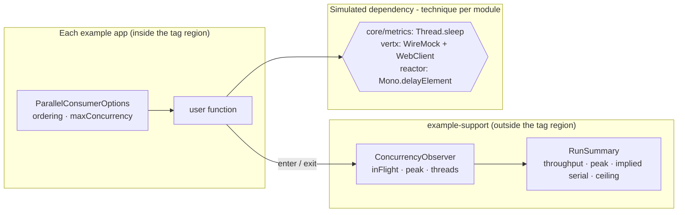
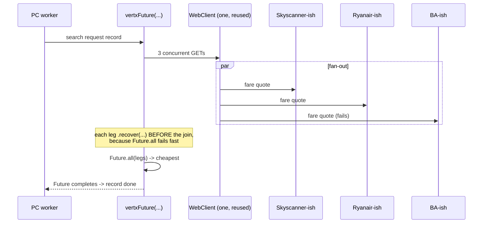

# feat: Industry-grounded examples for the core, metrics, vertx and reactor modules

## Goal Capsule

Each example module today proves the API compiles. None shows a reader a problem they recognise.
`CoreApp` increments a counter; `ReactorApp` returns `Mono.just("something todo")`. This adds a
**second** example beside each minimal one, grounded in a real use case from a different industry.

**The new examples take on a different role from the existing ones: they demonstrate the library's
capabilities, rather than demonstrating how to call its API.** That distinction is the plan's
organising idea, and it decides several things below that would otherwise go the other way.

| | Existing minimal example | New example |
|---|---|---|
| Reader | Has already adopted | Is still deciding |
| Question answered | "How do I call this?" | "Does it actually do what it claims?" |
| Genre | Reference | Evidence |
| Fails when | The snippet is wrong | The reader is not convinced |

**These examples carry that role in code, and only in code.** They stay simple: a readable file, a
tagged region, a simulated dependency, logging, one basic test (R11). The *live* demonstration — a UI
showing PC's performance in domain stakeholder terms — is a **single separate demonstration module**
with its own plan, not a feature of any example module. Keeping them apart is what lets each stay good
at its own job: an example you read, a demonstration you run.

Evidence is not one of Diátaxis's four modes, and the earlier framing of these as how-to guides was
wrong: a how-to serves someone who has already decided, which is precisely not this reader.

A completion criterion that only checks mechanics can be fully satisfied while the goal is unmet, so
the Definition of Done carries an outcome check (DoD 10).

The streams module already has its version of this (card-payment fraud screening, on branch
`feats/streams-state-store-enrichment-example`). This plan brings the other four up to the same bar.

---

## Product Contract

### Requirements

- **R1** — `parallel-consumer-example-core` gains a **logistics** example: parcel scan events, where the
  slow per-record work is an address/geocode lookup and ordering is by consignment because a
  consignment's scans must be applied in sequence.
- **R2** — `parallel-consumer-example-metrics` gains an **e-commerce** example: order fulfilment, where
  the point is the signals a dashboard shows under load, not the processing.
- **R3** — `parallel-consumer-example-vertx` gains a **travel** example: flight search, fanning out
  several concurrent non-blocking HTTP calls to different fare providers per record.
- **R4** — `parallel-consumer-example-reactor` gains an **energy** example: smart-meter telemetry into a
  reactive downstream, with backpressure demand signals visible in the logs.
- **R5** — Each new example logs per-record activity carrying the worker thread and the in-flight count
  at that moment, and ends with a summary of what the concurrency bought.
- **R6** — Each new example has exactly one test that drives it and fails if the interesting behaviour
  silently stops — not merely if records stop arriving.
- **R7** — Each new example's core loop is inside a `tag::` region included from
  `src/docs/README_TEMPLATE.adoc`, with `README.adoc` regenerated.
- **R8** — The existing minimal example in each module is unchanged, apart from its *test* being
  repointed at the shared mock-consumer helper in U2 — a behaviour-preserving extraction that changes
  no example application code.
- **R9** — Every summary figure a reader could mistake for a benchmark states what was simulated, what
  the partition count was, and what the ordering ceiling was, so the claim is falsifiable by arithmetic
  rather than trusted. No single speed-up multiplier is printed.
- **R10** — Each module's two examples state their relationship: which one is the API reference and
  which is the worked industry use case, in class-level javadoc on both and in the README section.
- **R11** — **The module examples stay simple.** Each is a readable source file, a tagged region, a
  simulated dependency, logging, and one basic test. No UI, no embedded HTTP server, no run harness, no
  second execution mode. Anything that would make an example a program to *operate* rather than a file
  to *read* belongs in the separate demonstration module (see Scope Boundaries), not here.

### Key Decisions

- **KD1** — Add a *second* example per module; leave the existing minimal one untouched.
  *(session-settled: user-directed — chosen over rewriting the minimal examples: the minimal example
  is the API reference and is the right size for that job.)* Governs R1, R2, R3, R4, R8.
- **KD2** — One industry per module, no repeats.
  *(session-settled: user-directed — chosen over one shared domain across modules: a reader skimming
  the examples directory should see a spread of domains rather than variants of one.)* Governs R1, R2,
  R3, R4.
- **KD3** — Each example is grounded in a use case where PC's value proposition is the actual reason,
  and may be fun. *(session-settled: user-directed — chosen over abstract demos such as incrementing a
  counter: those show the API compiles, not why anyone would reach for it.)* Governs R1, R2, R3, R4.
- **KD4** — Logging must show the work happening and end with a summary of what concurrency bought.
  *(session-settled: user-directed — chosen over silent processing verified only by assertions: the
  interleaved per-record lines are the evidence a reader actually believes.)* Governs R5.
- **KD5** — One basic test per example that drives it, kept separate from any load test.
  *(session-settled: user-directed — chosen over a single combined correctness-and-volume test:
  different questions, different runtimes.)* Governs R6.
- **KD6** — Documentation goes in `src/docs/README_TEMPLATE.adoc` plus tagged source regions, then
  `README.adoc` is regenerated. *(session-settled: user-approved — chosen over editing `README.adoc`
  directly: it is generated, so hand edits are lost. astubbs#196/astubbs#197 is the recorded
  mis-step.)* Governs R7.

---

## Key Technical Decisions

### KTD1. No new broker integration tests — use each module's existing mock-consumer harness

Every example test except `StreamsAppTest` avoids a broker: `CoreAppTest`, `VertxAppTest`,
`ReactorAppTest` and even the metrics `CoreAppMetricsIntegrationTest` drive
`io.confluent.csid.utils.LongPollingMockConsumer` + `MockProducer`. The gating lanes are 2-core
GitHub-hosted runners; the integration lane already runs one Testcontainers broker per JVM fork.
Adding four more brokers is the one avoidable risk in this plan, and it buys nothing — the behaviour
being demonstrated is PC's concurrency over a user function, which a mock consumer exercises exactly
as well.

Consequence: new tests live in each module's existing plain test package (surefire), not an
`integrationTests` package. The metrics example is the one exception — it extends the module's
existing Prometheus-container test, which is already there.

### KTD2. Prove concurrency with a starting gate, never with a wall-clock or peak-threshold assertion

A `peak >= N` assertion is an assertion about the scheduler's mood on a loaded 2-core box. Instead
each test uses a `CyclicBarrier` sized to N: N record handlers arrive and await. If the test
completes, **N records were provably inside the user function simultaneously**, with no timing
assumption beyond a generous upper-bound timeout.

Wall-clock figures are **printed, never asserted** — on a loaded runner a concurrent example can be
slower than its own serial baseline.

**Placement is module-specific, and the naive placement deadlocks.** PC forces the external engines'
dispatch pool to a single thread — `ExternalEngine.setupWorkerPool` returns `super.setupWorkerPool(1)`,
and `VertxParallelEoSStreamProcessor` does the same. A barrier in the *user function body* of the vertx
or reactor example therefore hangs on every machine, not just under load, because only one thread ever
arrives.

| Module | Where the barrier goes | Why |
|---|---|---|
| core, metrics | The simulated service, inside the user function | PC's own worker pool is sized to `maxConcurrency`, so N handlers really do run at once |
| vertx | The WireMock stub handler, gated to one arrival per record (below) | The user function returns a `Future` without blocking; only the HTTP legs are concurrent |
| reactor | Inside the returned publisher on a `boundedElastic` step — **never** downstream of `delayElement` | `delayElement` continues on `Schedulers.parallel()`, sized to `availableProcessors()`; a barrier of 4 deadlocks there on the 2-core gating runner |

**In the vertx example the barrier must be gated per record.** All three fan-out legs of one record hit
the stub handler, so an ungated barrier sized N trips when N *legs* overlap — which three legs of a
single record satisfy. The test would then pass on a build that dispatched one record at a time, which
is the exact regression it exists to catch. Gate arrival on `ConcurrentHashMap#putIfAbsent` keyed by the
record so only the first leg of each distinct record awaits.

**Specify the failure mode, or a shortfall hangs instead of failing.** A bare `await()` parks PC workers
indefinitely. A bare `await(timeout)` permanently *breaks* the barrier, so every later arrival throws
`BrokenBarrierException`, which PC treats as user-function failure and retries on the 1s default delay
forever — the developer sees "offsets never commit", not "only N-1 were concurrent". Every handler must
therefore call `await(timeout, unit)` inside a try/catch that records the shortfall to a shared
`AtomicInteger` and lets the record complete normally; the test body asserts on that recorded value
afterwards.

This resolves the tension between KD4 (prove it) and the repo's flakiness record
(`docs/solutions/test-flakiness/vacuous-await-condition-brokerpoller-backpressure-2026-07-31.md`,
`.../unforceable-trigger-commit-lock-timeout-2026-08-07.md`). Every await must also be non-vacuous:
await a positive precondition (work started) before awaiting the terminal one.

### KTD3. The slow-call technique differs per module, because getting it wrong teaches the opposite

| Module | Technique | Why |
|---|---|---|
| core, metrics | `Thread.sleep` inside a domain-named service | PC core's value *is* giving you a pool to park blocked threads on; a blocking geocode is a faithful model of JDBC or a blocking HTTP client |
| vertx | WireMock stub with `withFixedDelay`, called through `WebClient` | Sleeping blocks the event loop and would trip Vert.x's own `BlockedThreadChecker` |
| reactor | `Mono.delayElement(Duration)` | Non-blocking and timer-driven; `Thread.sleep` inside a `Mono` occupies a `parallel()` thread and is precisely the mistake BlockHound exists to catch |

`Thread.sleep` is acceptable as the *simulated dependency* in core/metrics; it is never acceptable as
a test's synchronisation mechanism anywhere.

### KTD4. Vert.x example uses `VertxParallelStreamProcessor.vertxFuture`, never the JStream API

`VertxApp` uses `JStreamVertxParallelStreamProcessor`. The JStream deque is never cleared on close —
an open memory leak (confluentinc#912, fix on branch `bugs/912-vertx-stream-memory-leak`, no PR yet) —
and `docs/refactoring.md` records the standing intent to deprecate and remove the JStream API. A new
example must not be built on a leaking, doomed API.

Use `VertxParallelStreamProcessor#vertxFuture(Function<PollContext<K,V>, Future<?>>)`, composing the
fan-out inside the user function.

**Connection-pool sizing is the trap.** `VertxParallelEoSStreamProcessor` sets
`WebClientOptions.setMaxPoolSize(maxConcurrency)` — sized for *one* request per record. A k-way
fan-out with `maxConcurrency` records in flight needs about `k × maxConcurrency` connections or
requests silently queue. Construct
`new VertxParallelEoSStreamProcessor<>(vertx, preConfiguredWebClient, options)` with the pool sized
accordingly, and say why in a comment.

### KTD5. Vert.x 4.5 fan-out uses `Future.all`, not the deprecated `CompositeFuture.all`

Verified by compiling both against vertx-core 4.5.31: the naive form produces four deprecation
warnings, the current form zero.

| Deprecated | Current |
|---|---|
| `CompositeFuture.all(List<Future>)` (raw list) | `Future.all(List<? extends Future<?>>)` |
| `HttpRequest.expect(ResponsePredicate.SC_OK)` | `send().expecting(HttpResponseExpectation.SC_OK)` |
| `ResponsePredicate` | `io.vertx.core.http.HttpResponseExpectation` |

**The receiver changes, and that is easy to miss.** `expecting(Expectation)` is declared on
`io.vertx.core.Future`, **not** on `HttpRequest` — vertx-web-client 4.5.31's `HttpRequest` exposes only
the deprecated `expect(...)` overloads and no `expecting` at all. So the check moves from the request
builder to the future `send()` returns; writing `client.get(...).expecting(...).send()` is a compile
error.

`Future.all` **fails fast on the first failure**, so each provider leg gets `.recover(...)` *before*
the join — which is also the domain-correct behaviour: one unreachable fare provider must not fail the
whole search. The `WebClient` is created once per app and reused, per Vert.x's own guidance.

### KTD6. Reactor backpressure is only visible if `doOnRequest` sits UPSTREAM of the throttling operator

**`limitRate` is a `Flux`-only operator, and PC hands the user function one publisher per record.**
`javap` against reactor-core 3.8.6 confirms `Flux.limitRate(int)` exists and `Mono` has no equivalent,
and `ReactorProcessor.react(Function<PollContext, Publisher<?>>)` subscribes each record's publisher with
unbounded demand. So a single-reading `Mono.delayElement` chain cannot carry `limitRate` — it does not
compile — and wrapping the reading in a one-element `Flux` compiles but makes `request(n)` a prefetch
constant of `limitRate` itself rather than evidence of demand throttling. The real outer bound there is
PC's `maxConcurrency`, so that version teaches the reader the wrong mechanism.

This was the plan's own failure mode reproduced one level up: the original probe ran against a
standalone multi-element `Flux`, and the result was generalised to a per-record context where it does
not hold.

**Therefore each record must expand into a genuinely multi-element stream**, so `limitRate` has
something real to throttle: a half-hourly meter reading expands into its interval samples, and the
returned publisher is a `Flux` over those samples. Demand signalling then exists *inside* one record's
stream, which is the honest scope of the claim. Say so in the example: `maxConcurrency` is the outer
bound across records, `limitRate` the inner bound within a record.

Within that `Flux`, the placement result still holds and still matters: the same pipeline reports
`request=unbounded` downstream of `limitRate` and `request=2` upstream of it, so `doOnRequest` must sit
**upstream** or it logs `unbounded` forever. `Schedulers.elastic()` was removed in Reactor 3.x — do not
copy 3.4-era snippets.

Do **not** add `reactor-core-micrometer` to bridge the reactor and metrics examples: it requires
Micrometer 1.16 and this repo is pinned at 1.13.15.

### KTD7. The metrics example stays on the pre-1.13 `io.micrometer.prometheus` package

Micrometer 1.13 rewrote the Prometheus registry against Prometheus Java client 1.x and moved the
class to `io.micrometer.prometheusmetrics.PrometheusMeterRegistry`. **This repo deliberately pins
`micrometer-registry-prometheus` to 1.12.13 in the module pom** precisely to keep the old package,
while `micrometer-core` sits at 1.13.15. The existing `CoreApp` imports `io.micrometer.prometheus.*`.

The new example must use the same import and must **not** bump the pin. Every current tutorial shows
the 1.13 package; following one breaks the build.

Meter choices (verified against real scrape output):
- **latency distribution** → `Timer` with `publishPercentileHistogram()` and
  `serviceLevelObjectives(...)`, not `publishPercentiles`. **Corrected during implementation:** this
  originally claimed that configuring *both* silently discards the quantiles. That was measured and
  **refuted** — on this module's pinned 1.12.13 registry both families are published. (The discard
  behaviour was researched against Micrometer 1.13.15, a different code path; the pin means it does not
  apply here.) The reason that survives measurement is the one to give: client-side quantiles are
  per-process and cannot be aggregated into a fleet percentile at all, so adding them doubles the series
  count in exchange for an answer nobody can combine.
- **in-flight concurrency** → `LongTaskTimer.activeTasks()`. A plain `Timer` cannot answer "how many
  right now" because it only records on completion. Omit its histogram: default LTT buckets start at
  **120 seconds**, useless for sub-second order processing.
- **throughput** → the Timer's own `_count` (`rate(..._seconds_count[1m])`); a separate Counter is
  redundant.
- **failure rate** → a `Counter` tagged by bounded `outcome`, never by order id. Tagging by order id
  is the cardinality mistake this example must visibly avoid, with a comment saying why.

### KTD8. Shared support module for what the reader does not copy; duplication inside the tag region is deliberate

Sample-code practice inverts the usual DRY rule at the boundary of the copied region: the reader
copies the tagged block, so anything they must chase into a helper is a failure of the example.

- **Inline and duplicated across all four**: the `ParallelConsumerOptions` builder, the ordering
  choice, the concurrency setting, the poll/react/vertxFuture call. These are the point.
- **Shared, outside the tag**: `ConcurrencyObserver` (in-flight and peak tracking), `RunSummary`, the
  simulated services' shared shape, and the record generator.

**The tag boundary must not cross into the support module.** The rule above is broken the moment the
tagged user function calls `ConcurrencyObserver` directly: the reader copies a block that references a
type from `parallel-consumer-example-support`, which inherits the aggregator's publishing skips and so
**never reaches Maven Central** — there is no coordinate they can depend on, and the template's
`exampleDep` include cannot carry one. Each example therefore wraps its instrumentation in a small
local method that lives *outside* the tag, and the tagged user function calls that wrapper by name.
Each README section adds one line saying the wrapper is example scaffolding, not a library type.

New module `parallel-consumer-examples/parallel-consumer-example-support`, listed **first** in the
examples aggregator's `<modules>` for readability. It inherits the aggregator's `maven.deploy.skip` /
`maven.install.skip` / `gpg.skip` / `skipPublishing`.

Two corrections to the reasoning that first justified this, both of which would have misled a later
reader. Reactor order is derived **topologically from declared dependencies**, so the support module
builds first because U3-U6 depend on it, not because of its position in `<modules>` — listing it first
is cosmetic. And the `central-publishing-maven-plugin` whole-bundle-skip landmine is **fixed**: the
aggregator pom records it as a 0.8.0 bug, and the root pom pins a version that evaluates
`skipPublishing` per module and artifact. Do not present either as a live risk control.

Without the shared module, four copies of the observer would be flagged by the duplicate-code check.

### KTD9. No load tests for these four examples

Only the streams module has one. `AGENTS.md` is explicit that the performance lane exists and that new
lanes must not be added for suites the gate already covers, and four more `@Tag("performance")` tests
on a 2-core runner is cost without signal. Each app prints its own summary whenever it runs —
including under its basic test — which delivers R5 without a second test per module.

### KTD10. Add the missing ArchUnit convention stubs, and stop duplicating the mock-consumer stub

`parallel-consumer-example-core`, `-vertx` and `-reactor` have **no** `TestConventionsArchTest`, so no
convention is enforced there — including the rule that a test class must be named so surefire
collects it. A mis-named new test would silently never run and the suite would stay green without it.
Add the 20-line stub to all three.

Separately, `CoreAppTest`, `VertxAppTest`, `ReactorAppTest` and `CoreAppMetricsIntegrationTest` each
copy-paste the same `when(mockConsumer.groupMetadata()).thenReturn(...)` stub
(`docs/refactoring.md` records this as one Kafka defect duplicated four times). This plan would make
it eight. Fold it into one helper in the core test-jar instead.

---

## High-Level Technical Design

The four examples share one shape and differ only in the industry and the async model.

The Vert.x example is the only one whose user function fans out more than one call per record:

---

## Implementation Units

### U1. Shared example-support module

**Goal** — one home for what the reader does not copy, so the four examples stay readable and the
duplicate-code check stays quiet.

**Requirements** — enables R5, R9; realises KTD8.

**Dependencies** — none.

**Files**
- `parallel-consumer-examples/parallel-consumer-example-support/pom.xml` (create)
- `parallel-consumer-examples/pom.xml` (modify — add the module first in `<modules>`)
- `.../support/src/main/java/io/confluent/parallelconsumer/examples/support/ConcurrencyObserver.java` (create)
- `.../support/src/main/java/io/confluent/parallelconsumer/examples/support/RunSummary.java` (create)
- `.../support/src/main/java/io/confluent/parallelconsumer/examples/support/SimulatedService.java` (create — the shared shape KTD8 names)
- `.../support/src/main/java/io/confluent/parallelconsumer/examples/support/DemoRecords.java` (create — the record generator KTD8 names)
- `.../support/src/test/java/io/confluent/parallelconsumer/examples/support/ExampleMockConsumers.java` (create — relocated here, see below)
- `.../support/src/test/java/io/confluent/parallelconsumer/examples/support/ConcurrencyObserverTest.java` (create)
- `.../support/src/test/java/io/confluent/parallelconsumer/examples/support/RunSummaryTest.java` (create)
- `.github/workflows/publish.yml` (modify — add `!:parallel-consumer-example-support` to the `-pl` exclusion list)
- `.github/workflows/release.yml` (modify — same)

**The two workflow edits are not optional.** Both workflows exclude examples from Maven Central with a
hand-maintained module list (`-pl '!:parallel-consumer-examples,!:parallel-consumer-example-core,...'`),
not a pattern. A sixth module leaves those lists silently incomplete, so it enters the deploy reactor
and its exclusion rests only on inherited properties rather than the explicit list the workflows are
built around.

`ExampleMockConsumers` lives in **this module's test sources**, produced as a test-jar the four example
modules consume — not in `parallel-consumer-core/src/test`, whose test-jar is signed and published to
Maven Central. An examples-only scaffolding class does not belong in a published artifact's surface,
where removing it later becomes a compatibility question.

**Approach**
1. `ConcurrencyObserver`: `enter()`/`exit()` (or an `AutoCloseable` scope), tracking current in-flight,
   peak via `accumulateAndGet(..., Math::max)`, distinct thread names, and total completed. Thread-safe.
2. `RunSummary`: render one multi-line block containing records, **partition count**, throughput, peak
   in-flight, **peak in-flight per partition**, distinct threads, implied serial time, and the
   **ordering ceiling** (distinct keys under `ProcessingOrder.KEY`). The partition figure is not
   optional decoration — "peak in-flight 4" is meaningless without it, and concurrency beyond the
   partition count is the library's whole differentiating claim.
3. **Time the run from the observer's first `enter()` to its last `exit()`**, not from app start. At
   this scale PC's subscribe/assign/first-poll/commit overhead is comparable to the processing window,
   so an app-start clock reports mostly startup cost wearing a benchmark's clothes.
4. The serial baseline is reported as *implied* (`records × latency`) and labelled as such. **No single
   speed-up multiplier is printed** — the ratio is arithmetically determined by
   `min(maxConcurrency, distinct keys)`, so a bare multiple invites a benchmark reading the numbers
   cannot support. The block carries an explicit "demonstration, not a benchmark" line (R9).
4. Depends only on `parallel-consumer-core` and slf4j; no framework-specific types, since all four
   modules use it.

**Patterns to follow** — the aggregator's existing skip properties; module poms in
`parallel-consumer-examples/*/pom.xml` for shape.

**Test scenarios**
- `ConcurrencyObserver` under a `CyclicBarrier` of 4 concurrent entrants reports peak 4 and 4 distinct
  threads, deterministically.
- `ConcurrencyObserver` after all scopes close reports in-flight 0 and completed equal to the number of
  scopes entered.
- `ConcurrencyObserver` peak never decreases when a later burst is smaller than an earlier one.
- `exit()` runs even when the user function throws, so a failing record does not leak in-flight count.
- `RunSummary` with 100 records, 200ms simulated latency and 10 distinct keys states an ordering
  ceiling of 10 (not `maxConcurrency`).
- `RunSummary` labels the serial figure as implied-from-simulated-latency, not measured — assert on
  the rendered text.

**Verification** — `./mvnw -pl parallel-consumer-examples/parallel-consumer-example-support -am verify`
is green and the module appears in the reactor before the other example modules.

---

### U2. ArchUnit convention stubs, and one shared mock-consumer helper

**Goal** — make sure the new tests are actually collected and run, and avoid doubling a known
duplication.

**Requirements** — enables R6; realises KTD10.

**Dependencies** — none (do before U3-U6 so new tests are guarded as they land).

**Files**
- `parallel-consumer-examples/parallel-consumer-example-core/src/test/java/io/confluent/parallelconsumer/examples/core/TestConventionsArchTest.java` (create)
- `parallel-consumer-examples/parallel-consumer-example-vertx/src/test/java/io/confluent/parallelconsumer/examples/vertx/TestConventionsArchTest.java` (create)
- `parallel-consumer-examples/parallel-consumer-example-reactor/src/test/java/io/confluent/parallelconsumer/examples/reactor/TestConventionsArchTest.java` (create)
- `parallel-consumer-core/src/test/java/io/confluent/csid/utils/ExampleMockConsumers.java` (create)
- `parallel-consumer-examples/parallel-consumer-example-core/src/test/java/io/confluent/parallelconsumer/examples/core/CoreAppTest.java` (modify — use the helper)
- `parallel-consumer-examples/parallel-consumer-example-vertx/src/test/java/io/confluent/parallelconsumer/examples/vertx/VertxAppTest.java` (modify)
- `parallel-consumer-examples/parallel-consumer-example-reactor/src/test/java/io/confluent/parallelconsumer/examples/reactor/ReactorAppTest.java` (modify)
- `parallel-consumer-examples/parallel-consumer-example-metrics/src/test/java/io/confluent/parallelconsumer/examples/metrics/integrationTests/CoreAppMetricsIntegrationTest.java` (modify)

**Approach**
1. Copy the metrics module's `TestConventionsArchTest` verbatim, changing only the `@AnalyzeClasses`
   package string. ArchUnit is already on every module's test classpath via the root pom.
2. `ExampleMockConsumers`: one factory returning a `Mockito.spy(new LongPollingMockConsumer<>(EARLIEST))`
   with `groupMetadata()` already stubbed, carrying the `// todo fix AK mock consumer` note once
   instead of four times. It ships in the core test-jar, which all example modules already depend on.
3. Repoint the four existing tests at it. **Behaviour must not change** — this is a pure extraction.

**Execution note** — run each touched module's existing test before and after the extraction and
confirm the same result; this unit must be provably behaviour-preserving before the new examples land
on top of it.

**Test scenarios**
- `ArchUnit` stub in each of the three modules evaluates and passes against the module's current tests.
- Deliberately mis-name a scratch test class to `FooChecker` in one module and confirm the naming rule
  fails; revert. (Negative control — an assertion nobody has seen fail is decoration.)
- Each of the four existing example tests still passes unchanged after repointing to the helper.

**Verification** — all four modules' existing tests green; the three new ArchUnit stubs run and pass.

---

### U3. Logistics example — `parallel-consumer-example-core`

**Goal** — parcel scan events where the slow work is a geocode lookup and per-consignment ordering is a
stated business requirement.

**Requirements** — R1, R5, R6, R8, R9; KTD1, KTD2, KTD3, KTD8.

**Dependencies** — U1, U2.

**Files**
- `parallel-consumer-examples/parallel-consumer-example-core/pom.xml` (modify — add the support module dep)
- `.../examples/core/ParcelTrackingApp.java` (create)
- `.../examples/core/GeocodeService.java` (create — simulated dependency, domain-named)
- `parallel-consumer-examples/parallel-consumer-example-core/src/test/java/io/confluent/parallelconsumer/examples/core/ParcelTrackingAppTest.java` (create)

**Approach**
1. Records are parcel scans keyed by consignment id: `PICKED_UP`, `AT_DEPOT`, `OUT_FOR_DELIVERY`,
   `DELIVERED` at named UK depots. Ordering is `KEY` **because** a consignment's status must not go
   backwards — state that in a comment, since it is what teaches `ProcessingOrder.KEY`.
2. `GeocodeService.lookup(address)` sleeps a fixed ~120ms and returns a lat/long. Blocking is correct
   here (KTD3). A small deterministic fraction of lookups fail so PC's retry behaviour is visible; the
   failure is a specific exception type, never swallowed.
3. The user function enters the `ConcurrencyObserver` scope, logs thread + consignment + in-flight,
   geocodes, logs the outcome, and exits the scope.
4. Constructor-inject the consumer/producer (the newer seam used by metrics and streams), not the
   package-private getter-override seam — it survives a test moving package.
5. Tag the PC options builder and the poll call as `tag::parcelTracking[]`. The observer scope and
   in-flight logging live in a local wrapper method **outside** the tag, which the tagged user function
   calls by name (KTD8) — otherwise the copied block references a type from an unpublished module.
   The distinct tag name is for template readability, not necessity: each `include::` names a file path
   as well as a tag, and `tag=example` already appears in five separate example files without conflict.

**Patterns to follow** — `CoreApp` for module conventions; the metrics `CoreApp` constructor-injection
seam and its javadoc explaining why; the metrics `CoreApp.setupPrometheusEndpoint()` for the embedded
HTTP server, but **stop the server on close** — the existing one never does, which is why port 7001
stays bound for the life of the failsafe JVM.

**Test scenarios**
- Four consignments' scans are processed and all offsets commit (`KafkaTestUtils.assertLastCommitIs`).
- A `CyclicBarrier` sized **3** in the geocode step completes, proving three scans were in the user
  function simultaneously on a single partition. **Sized strictly below the distinct-key count (4
  consignments) on purpose**: a barrier equal to the key count requires every key to have work
  available at the same instant, but the injected geocode failure parks one key's shard on the retry
  backoff while the others are already blocked and cannot release — starving the cohort and
  reintroducing the timing dependence the barrier exists to remove. Handlers arrive at the barrier
  *before* any simulated failure can throw.
- Scans for the **same** consignment are never concurrent — the observer records at most one in-flight
  for that key at any time (this is the ordering guarantee, and it is the assertion that would fail if
  someone changed the example to `UNORDERED`).
- A geocode failure is retried rather than dropped, and the record eventually commits.
- The run summary block is emitted and names the simulated latency and the ordering ceiling.
- The precondition (first record entered the user function) is awaited before the terminal assertion,
  so no await is vacuous.

**Verification** — `./mvnw -pl parallel-consumer-examples/parallel-consumer-example-core -am verify`
green; the logs show interleaved thread names across consignments and a closing summary.

---

### U4. E-commerce example — `parallel-consumer-example-metrics`

**Goal** — order fulfilment where the deliverable is the signals a dashboard shows under load.

**Requirements** — R2, R5, R6, R8, R9; KTD7.

**Dependencies** — U1, U2.

**Files**
- `.../examples/metrics/OrderFulfilmentApp.java` (create)
- `.../examples/metrics/FulfilmentService.java` (create)
- `.../metrics/integrationTests/OrderFulfilmentAppMetricsTest.java` (create)
- `parallel-consumer-examples/parallel-consumer-example-metrics/src/test/resources/prometheus.yml` (modify — add the second scrape target)
- `parallel-consumer-examples/parallel-consumer-example-metrics/pom.xml` (modify — support module dep)

**Approach**
1. Orders keyed by customer, moving through pick/pack/dispatch; the slow step is a warehouse
   allocation call (`Thread.sleep`, KTD3) with a small failure rate.
2. Register on the **existing pinned** registry (KTD7 — `io.micrometer.prometheus`, do not bump):
   `Timer` with `publishPercentileHistogram()` + `serviceLevelObjectives(...)` for allocation latency;
   `LongTaskTimer` for in-flight orders; `Counter` tagged `outcome` for failures.
3. Tag by bounded dimensions (`warehouse`, `outcome`) and **not** by order id — with a comment saying
   why, since that is the cardinality mistake this example exists to not make.
4. **Use a port other than 7001.** The existing app hardcodes 7001 in three places (app,
   `exposeHostPorts`, `prometheus.yml`); two apps on one port collide under forked execution.
5. Print the `pc_*` families from `meterRegistry.scrape()` in the closing summary, so a reader sees
   real exposition text without running Grafana. Put the three or four useful PromQL queries in the
   README section rather than shipping a dashboard JSON that will rot.
6. Do **not** touch `PCMetrics.java` / `PCMetricsDef.java` / `PartitionState*.java` — owned by open PR
   astubbs#57 (confluentinc#859, the metrics leak). Do not depend on assign/revoke cycles or on
   registry-reuse-after-close, both of which sit in known-unstable territory.

**Test scenarios**
- The app's own meters appear in the Prometheus scrape (`allocation` timer buckets, the LTT, the
  failure counter).
- A `CyclicBarrier` inside `FulfilmentService` holds N allocations simultaneously; while it is held,
  assert both `pc_inflight_records` and the `LongTaskTimer`'s `activeTasks()` report N. **Barrier-forced,
  not observed** — an unforced "`pc_inflight_records` rises above 1 under load" is exactly the
  scheduler-mood assertion KTD2 rejects, and it would be the only test in this plan not meeting DoD 3.
- The failure counter increments with an `outcome` tag and no order-id-valued tag exists in the scrape
  (cardinality guard).
- The Timer emits `_bucket` series and **no** `quantile=` series, proving the
  histogram-not-percentiles choice held.
- Both apps' endpoints are scrapeable simultaneously — no port collision with the existing example.

**Verification** — the module's tests green with both Prometheus targets scraping.

---

### U5. Travel example — `parallel-consumer-example-vertx`

**Goal** — flight search fanning out concurrent non-blocking fare-provider calls per record.

**Requirements** — R3, R5, R6, R8; KTD3, KTD4, KTD5.

**Dependencies** — U1, U2.

**Files**
- `.../examples/vertx/FlightSearchApp.java` (create)
- `parallel-consumer-examples/parallel-consumer-example-vertx/src/test/java/io/confluent/parallelconsumer/examples/vertx/FlightSearchAppTest.java` (create)
- `parallel-consumer-examples/parallel-consumer-example-vertx/pom.xml` (modify — support module dep)

**Approach**
1. Each record is a search request (route + date), keyed by route. The user function issues **three**
   concurrent `WebClient` GETs to different fare-provider paths, recovers each leg individually, joins
   with `Future.all`, and picks the cheapest.
2. `VertxParallelStreamProcessor#vertxFuture`, **never** `JStream*` (KTD4).
3. One `WebClient` created at startup and reused, with `setMaxPoolSize` sized to
   `providers × maxConcurrency` — with a comment explaining that PC's default sizing assumes one
   request per record (KTD4).
4. Per-leg `.recover(...)` **before** `Future.all`, because `all` fails fast and one dead provider must
   not fail the search (KTD5).
5. Stub the providers with WireMock using per-provider `withFixedDelay` so the fan-out's wall time is
   the max leg, not the sum — that is the observable proof the calls were concurrent. Note
   `WireMockUtils` only stubs `GET /` and `/api` with no delay, so this example needs its own stubs.
6. Logging must reflect that Vert.x dispatches on a **single-thread** worker pool
   (`setupWorkerPool(1)`), so thread names tell a different story here than in the core example — say
   so rather than implying a worker-per-record.

**Test scenarios**
- All search records commit their offsets.
- A search whose three provider stubs have delays 30/30/300ms completes in materially closer to 300ms
  than 900ms — asserted as *leg concurrency* via WireMock request timestamps, not as a wall-clock
  threshold.
- One provider stub returning 500 still yields a result from the other two (the `recover`-before-join
  behaviour) — remove the `recover` and this test must fail.
- A `CyclicBarrier` in the stub handler, **gated to one arrival per record** via
  `ConcurrentHashMap#putIfAbsent` keyed by the search record, proves multiple *records* were in flight
  concurrently. Ungated, all three legs of a single record arrive, so a barrier of 3 trips on one
  record and the test passes on a build that dispatches records one at a time — the exact regression it
  exists to catch (KTD2).
- No deprecation warnings: compile with `-Xlint:deprecation` and assert the example contributes none.

**Verification** — module tests green; logs show fan-out per record and the closing summary.

---

### U6. Energy example — `parallel-consumer-example-reactor`

**Goal** — smart-meter telemetry into a reactive downstream with demand signals visible in the logs.

**Requirements** — R4, R5, R6, R8; KTD3, KTD6.

**Dependencies** — U1, U2.

**Files**
- `.../examples/reactor/MeterTelemetryApp.java` (create)
- `parallel-consumer-examples/parallel-consumer-example-reactor/src/test/java/io/confluent/parallelconsumer/examples/reactor/MeterTelemetryAppTest.java` (create)
- `parallel-consumer-examples/parallel-consumer-example-reactor/pom.xml` (modify — support module dep)

**Approach**
1. Records are half-hourly meter readings keyed by meter id. **Each reading expands into its interval
   samples**, so `react(...)` returns a multi-element `Flux` rather than a `Mono` — without that,
   `limitRate` does not compile (it is `Flux`-only) and there is no demand to throttle (KTD6). Shape:
   `Flux.fromIterable(reading.samples()).doOnRequest(...).limitRate(n).concatMap(s -> ingest(s).delayElement(...))`.
   Sample count per reading is OQ2.
2. `doOnRequest` sits **upstream** of `limitRate` (KTD6), plus `.log()`, so the log shows `request(n)`
   replenishing rather than `request(unbounded)`. State in the example that `maxConcurrency` is the
   outer bound across records and `limitRate` the inner bound within one record — the honest scope of
   the claim.
2b. **The barrier goes inside the returned publisher on a `boundedElastic` step, never in the user
   function body and never downstream of `delayElement`.** PC forces this engine's dispatch pool to one
   thread (`ExternalEngine.setupWorkerPool` → `super.setupWorkerPool(1)`), so a barrier in the user
   function deadlocks on every machine; `delayElement` continues on `Schedulers.parallel()`, sized to
   `availableProcessors()`, where a barrier of 4 deadlocks on the 2-core gating runner (KTD2).
3. `react(...)` is the only entry point on `ReactorProcessor`. Do not call core `poll*` methods from
   the reactor processor — a documented footgun (astubbs#140 / confluentinc#99).
4. The example's narrative is *demand*, not thread count: `delayElement` continues on
   `Schedulers.parallel()`, so name that in the logging rather than implying a worker pool.
5. This module is unmapped territory — no prior art, no known defects. Expect to discover something and
   record it (see Definition of Done).

**Test scenarios**
- All readings commit.
- The captured log contains a bounded `request(n)` matching `limitRate`, and **not**
  `request(unbounded)` — this is the assertion that fails if `doOnRequest` drifts downstream, which is
  the whole failure mode KTD6 describes.
- Moving `doOnRequest` downstream of `limitRate` makes that assertion fail (negative control).
- No `Thread.sleep` executes on a Reactor `parallel-*` thread during the run.
- A `CyclicBarrier` proves multiple readings were in flight concurrently.
- Readings for one meter id stay ordered.

**Verification** — module tests green; the log excerpt in the README section is real output from this
test.

---

### U7. README sections and regeneration

**Goal** — each new example is documented from tagged source, and `README.adoc` is regenerated.

**Requirements** — R7; KD6.

**Dependencies** — U3, U4, U5, U6.

**Files**
- `src/docs/README_TEMPLATE.adoc` (modify — one new `===` subsection per example)
- `README.adoc` (regenerate, commit)

**Approach**
0. **Tag each new app's core loop first** — U4, U5 and U6 do not tag their own (only U3 did), so without
   this step U7's `include::` directives resolve to nothing: `tag::orderFulfilment[]`,
   `tag::flightSearch[]`, `tag::meterTelemetry[]`, each wrapping the options builder and the
   processing call, with instrumentation outside the tag per KTD8.
1. Add each new section beside its module's existing subsection under `== Usage` (`=== Core` at ~476,
   `=== HTTP with the Vert.x Module` at ~534, `=== Project Reactor` at ~547) and near `== Metrics`
   for the e-commerce one.
1b. **Point at them from the front door.** The `[[intro]]` block (~line 102) includes
   `CoreApp[tag=example]` — the counter demo — under "Consume many messages concurrently with a single
   consumer instance". That is where an evaluating reader forms their impression, ~400 lines above
   `== Usage`. Keep the minimal snippet, and follow it with two sentences and cross-references to the
   four demonstrations. Without this the sceptical reader this plan targets meets the counter demo and
   may never reach the new work.
1c. **Cross-link to the existing `=== Scenarios` catalogue** (~line 205), which already makes the
   argument in prose (slow GPS tracking across 100,000 devices, spikey retail settlement). Link each new
   section to its closest bullet and back, so the prose becomes a promise and the code its proof
   instead of two disconnected answers 400 lines apart.
2. Each section: the industry framing in two sentences, the `include::` of the example's **own** tag
   name (not `example` — already used per module), numbered callouts, and a link to the example and its
   test.
3. Regenerate with `./mvnw -N process-sources` and commit both files. **There is no CI check that the
   generated README matches the template** — drift here is silent, so verify by inspection.
4. Add the PromQL queries to the metrics section (KTD7 step 5).

**Test scenarios** — `Test expectation: none — documentation only.` Verified by inspecting the
regenerated `README.adoc` for resolved includes rather than literal `include::` lines.

**Verification** — `git diff README.adoc` shows the four new sections with code inlined, and no
unresolved `include::` directives.

---

## Verification Contract

- `./mvnw -pl <module> -am verify` per touched module. **Never `-pl` without `-am`** — it fails the
  `ReactorModuleConvergence` enforcer, so nothing recompiles and a stale class is measured.
- `bin/ci-unit-test.sh` covers **three** of the four new tests (core, vertx, reactor), which sit in
  plain packages and run under surefire.
- `bin/ci-integration-test.sh` covers the **metrics** example test, which extends the module's existing
  Prometheus-container test in an `integrationTests` package. Surefire excludes
  `**/integrationTest*/**/*.java` and `bin/ci-unit-test.sh` runs `clean test`, so that test never
  executes in the unit lane — running only the unit lane would report green without it.
- `bin/check-copyright-headers.sh` — new fork-original files carry
  `Copyright (C) 2026 Antony Stubbs and contributors`, never the Confluent header. It also runs in the
  `validate` phase, so a plain build catches it.
- `bin/check-issue-refs.sh` — every added line referencing an issue below the threshold names its repo.
- Pass `-Dsurefire.forkCount=<n>`, never bare `-DforkCount`, which surefire ignores here.
- New tests must be safe under **process-level** parallelism (`forkCount=1C`): no fixed ports shared
  between forks, no shared temp files.

---

## Definition of Done

1. Four new example apps, each with its own driving test: the core, vertx and reactor tests green under
   `bin/ci-unit-test.sh`, and the metrics test green under `bin/ci-integration-test.sh`. Both lanes must
   be run — the unit lane alone reports green without ever executing the metrics test.
2. No new Testcontainers broker anywhere (KTD1).
3. Every new test's concurrency claim is barrier-forced; no wall-clock assertion exists in any of them
   (KTD2).
4. Each example emits per-record logs with thread and in-flight count, and a closing summary naming the
   simulated latency and the ordering ceiling (R5, R9).
5. `README.adoc` regenerated from the template with four new sections, includes resolved.
6. The three missing `TestConventionsArchTest` stubs exist and pass; the mock-consumer stub is
   extracted once rather than duplicated eight times.
7. The existing minimal example in each module is byte-identical apart from the U2 test extraction
   (R8).
8. `CHANGELOG.adoc` is **not** touched — a PR never adds entries here; release notes are generated from
   the commit log.
9. If this work surfaces anything not already in the learnings corpus about the example modules, the
   README pipeline, or the reactor module, a `docs/solutions/` entry records it. If nothing surfaced,
   the PR description says so. (Written conditionally on purpose: a completion gate gated on a
   discovery that may not happen is either left permanently unchecked or closed by padding a write-up
   nobody needed.)
10. **Outcome check, not a mechanic.** A reviewer who has not used Parallel Consumer reads each new
    README section cold and can state in one sentence the problem the example solves and why the
    partition model made it hard. If they cannot, the section is rewritten before merge. Items 1-9 can
    all pass while the goal in the Goal Capsule is unmet; this is the item that notices.
11. Each module's two examples state which is the API reference and which is the worked use case (R10),
    and no example gained a UI, an embedded server, a run harness or a second execution mode (R11) —
    those belong to the separate demonstration module.

---

## Assumptions

Recorded because the scoping confirmation was skipped in pipeline mode.

- **A1** — The metrics example extends the module's existing Prometheus-container test rather than
  adding a broker, so it stays consistent with KTD1 while still asserting on real scrape output.
- **A2** — Three fare providers is the right fan-out width for U5: enough to make `Future.all`
  meaningful, few enough to keep the pool sizing comment honest.
- **A3** — *Superseded; see OQ1.* Per-example test scale is small (tens of records, 4-8 distinct keys)
  because the barrier-forced design needs determinism and KTD9 rules out load tests here.
- **A4** — The support module is the chosen structural change, weighed against two real alternatives
  rather than one strawman: (a) host the support classes in `parallel-consumer-example-core`'s
  `src/main` and have the other three depend on it — no new module and none of the reactor/publishing
  exposure, but it makes one example module a library for the others and inverts the reader's mental
  model of which module is the example; (b) duplicate per module and accept the duplicate-code
  findings. (a) is the genuine runner-up; the new module wins because the support classes serve four
  peers equally and hiding them inside one peer misleads the reader about what that module is.

---

## Open Questions

- **OQ1 — RESOLVED by splitting the demonstration into its own module.** The scale tension (a
  barrier-forced test wants tens of records; a persuasive demonstration wants a number not dominated by
  startup cost) only existed while both roles lived in one artefact. They no longer do: the module
  examples stay small and deterministic, and scale becomes the demonstration module's problem, where it
  is unconstrained by a per-module unit test. KD5 is untouched — no load test is added to any example
  module.
- **OQ2 — RESOLVED (user-approved, 2026-08-08): 48 samples per reading.** A day of half-hourly
  settlement periods, which is what UK energy settlement actually uses — so the number is domain-true
  rather than invented. With `limitRate(8)` that yields six visible `request(8)` replenishments per
  reading, which is the demand trace the example exists to show. At ~10ms simulated ingest per sample
  under `concatMap`, ~480ms per record, comfortably inside the unit lane at these record counts.
- **OQ3 — RESOLVED (user-approved, 2026-08-08): leave `wiremock-jre8` on its default thread count.**
  The concern assumed roughly 3N blocked handler threads for N records. Once the barrier is gated to
  one arrival per record (the `putIfAbsent` fix in KTD2 that stops it proving leg-concurrency instead
  of record-concurrency), only N threads park. A barrier of 3 against Jetty's default 10 container
  threads has real headroom. Add a comment tying the two numbers together so the margin is deliberate
  rather than accidental.

---

## Scope Boundaries

### Deferred to Follow-Up Work

**One single demonstration module — its own plan, its own PR.** This is the showcase: a domain UI that
renders PC's real performance in the units a *stakeholder in that domain* measures in, so the reaction
is "that is much faster at the thing I care about" rather than "peak in-flight 128". It is not in this
plan, and that separation is deliberate — this plan is docs-shaped with no dependencies and should
ship on its own, while the demonstration has a UI, a run harness and open design questions that
deserve their own planning pass.

Design seeds worth not losing:

- **A race is the honest form of "wow".** Two lanes over identical input — one vanilla consumer, one
  PC — running side by side, in domain units ("parcels tracked", "orders dispatched"). This kills the
  credibility problem the adversarial reviewer raised about implied speed-up figures: the serial arm is
  *measured in the same run under the same conditions*, not computed as `records × latency` and
  labelled "implied". You do not claim a multiple; you show both arms and let the viewer read it.
- **One engine, one domain, deep.** Use the core engine. Which async framework PC composes with is
  academic for this purpose — a stakeholder does not care that it works with Vert.x, and engine variety
  is what the four module examples are already for.
- **It has a natural predecessor to replace.** `README_TEMPLATE.adoc`'s `=== Illustrative Performance
  Example` is a *static Google Sheets chart* backed by `VeryLargeMessageVolumeTest`. A live, runnable
  demonstration is the same argument a reader can actually execute.
- **Distinct from the PC dashboard** (`feats/web-gui`, astubbs#215): the dashboard shows the engine —
  in-flight, shards, offsets. This shows the outcome, in domain terms. They pair. Mind
  `DashboardOptions.DEFAULT_PORT` (8080), which the vertx example's stub target also uses.
- Scale, record counts and the run-length question (former OQ1) belong to that plan, not this one.

Settled for that plan already (user-directed, 2026-08-08): **real broker via Testcontainers**, not a
mock — a race that convinces has to be against the real thing. **Its tests gate CI** like any other
module; it is a demo, but an unguarded demo rots. **Basic UI tests only** — that the page serves,
renders the snapshot and reflects both lanes; no screenshot diffing, no browser-matrix work. **Domain
reuses parcel logistics** from the core example, so the demo deepens a story the reader has already
met rather than teaching a fifth one.

**Do not build a run harness — one already exists.** The `feats/web-gui` branch generalised the chaos
conductor into a scenario framework (`Scenario`, `ScenarioPhase`, `ScenarioRunner` with `LOOP`/`ONCE`
modes, `ScenarioActions` registry, `ScriptedPlanSource`), and `ShowcaseScenario` in the dashboard module
is already a consumer of it declared entirely outside the framework's package and module. `bin/dashboard-demo.sh`
is the one-command front door.

Two of its design decisions answer questions this plan had to leave open, and the demonstration module
should inherit both rather than re-deriving them:

- **The same scenario is the demo and the gating test.** `LOOP` runs it for someone to watch; `--once`
  runs it as a test where a phase that quietly stopped demonstrating its thing is a run *failure*. That
  is what makes an unguarded demo not rot, and it is the shape "its tests gate CI" should take.
- **Scripted structure, seeded detail, postconditions per phase.** The phase order is guaranteed so the
  interesting moment always arrives; the seed varies only the texture. Their own note is the rule worth
  copying verbatim: *a postcondition that only holds when the RNG cooperates is a flaky test dressed up
  as a demo.*

So the demonstration module declares a parcel-logistics race `Scenario` as a framework consumer, and
inherits the runner, the `--once` gate and the front-door script shape.

**Test-scope execution is settled (user-directed, 2026-08-08): the reader runs it from the test package,
as `ShowcaseScenario` already is.** No part of the scenario framework is promoted to main scope for
this. A front-door script in the `bin/dashboard-demo.sh` shape is what a reader actually invokes, so the
test-scope classpath is an implementation detail they never see. Revisit only if the demo is ever
wanted as a published, standalone artifact — which it is not.
- **Wiring the `parallel-consumer-dashboard` in anywhere.** Out of scope for this plan on its own
  merits: it would stack this branch on an unmerged PR (`feats/web-gui`, astubbs#215). Its natural home
  is the demonstration module above, not an example module.
- **BlockHound** in the reactor/vertx tests to make non-blocking a CI-enforced property rather than a
  claim. Attractive, but it needs `-XX:+AllowRedefinitionToAddDeleteMethods` on modern JDKs and is a
  new test dependency; worth its own change.
- A load test per example with a "how long it would have taken otherwise" report (KTD9).

### Non-Goals
- Changing any existing example's behaviour, beyond the U2 test extraction.
- Touching `PCMetrics*`, `PartitionState*` (owned by open PR astubbs#57).
- Fixing the JStream leak (confluentinc#912) — the new example simply avoids that API.
- Adding a CI check for README template/generated drift, real though that gap is.

---

## System-Wide Impact

Adding a Maven module and four test classes touches more machinery than the diff suggests. Each row is
a surface that will react to this change whether or not the plan mentions it.

| Surface | Effect | What the implementer must do |
|---|---|---|
| Examples reactor order | A new module changes build order and `-am` closure for every example module | Place it first in `<modules>`; run a full `./mvnw verify` (not just per-module) before opening the PR |
| Publishing | Examples are deliberately unpublished; the aggregator sets `maven.deploy.skip` / `maven.install.skip` / `gpg.skip` and `skipPublishing` | The new module must inherit these, not redeclare them. Do not change reactor order of existing modules — a skipped module *last* in order once skipped the entire bundle upload |
| Unit lane runtime | Four new tests land in `bin/ci-unit-test.sh` (15-minute budget) | Keep record counts in the tens; the barrier timeouts are generous but the work must not be |
| Fork-level parallelism | The `ci` profile runs `surefire.forkCount=1C`, one JVM per core | No fixed ports or shared temp files between forks. The metrics example's HTTP port is the live instance of this — it must differ from the existing 7001 |
| Mutation testing | The PR-scoped PIT job covers classes changed against the base | Four new example classes enter its scope; example code is demo-shaped and may score poorly. Expect noise, do not chase coverage into the examples |
| Coverage | Jacoco writes one `jacoco.exec` in append mode under `forkCount=1C` | If the new modules' coverage looks wrong, this is the first suspect, not the tests |
| Duplicate-code / file-similarity checks | The four examples deliberately duplicate the PC options builder inside their tag regions (KTD8) | Expect a flag; respond on the PR explaining the sample-code rule rather than refactoring the teaching content into a helper |
| SpotBugs | Runs on PRs across the reactor | Simulated-failure paths and `Thread.sleep` in example services are the likely flags; classify rather than suppress blindly |
| README generation | `asciidoc-template-maven-plugin` is bound to `process-sources` on the root pom only (`inherited=false`), and resolves from a GitHub Packages repository behind the `github` profile | Regenerate with `./mvnw -N process-sources`; if the plugin cannot resolve, that is the pipeline's known single point of failure, not a plan error |
| Copyright gate | Runs in the `validate` phase, so it fails a plain build, not just a workflow | Write headers by hand — there is no applying tool |
| ArchUnit coverage | Three modules gain convention enforcement they never had (U2) | Their **existing** tests are evaluated for the first time; a pre-existing violation surfacing there is this PR's to fix or explicitly defer |

The last row is the one most likely to produce a surprise: turning on a guard for the first time
routinely reveals something that was already wrong.

*Evidence note: this section was composed from the four research reports already gathered in this run
rather than a fresh independent pass, so it carries their coverage and not more.*

---

## Risks & Dependencies

| Risk | Mitigation |
|---|---|
| New Maven module destabilises the examples reactor or publishing skips | Place it first in `<modules>`; it inherits the aggregator's skip properties; verify a full `./mvnw verify` before opening the PR |
| A new example test is flaky on a loaded 2-core runner | Barrier-forced assertions only; no wall-clock assertions; non-vacuous awaits (KTD2). Note CI passes `-Dsurefire.rerunFailingTestsCount=2`, so a green CI run is **not** proof of soundness |
| Vert.x fan-out queues silently on an undersized connection pool, making tests timing-dependent | Explicit `setMaxPoolSize(providers × maxConcurrency)` with a comment (KTD4) |
| Following a current Micrometer tutorial breaks the build | KTD7 — the module pins 1.12.13 and the old package on purpose |
| `README.adoc` drifts from the template unnoticed | No CI check exists; regenerate and inspect the diff as part of U7 |
| The duplicate-code check flags the four examples' inline PC setup | That duplication is deliberate (KTD8) and inside the tag region; respond on the PR rather than refactoring the examples' teaching content away |

---

## Sources & Research

- Repo: `AGENTS.md` (testing discipline, CI lanes, copyright, issue refs); `docs/refactoring.md`
  (duplicated mock-consumer stub; JStream removal intent); `docs/inflight/branch-912-vertx-leak.md`;
  `docs/inflight/pr-57-metrics-leak.md`; `docs/QUARANTINED_TESTS.md` (empty — a new flaky test has no
  legal parking spot).
- Flakiness prior art: `docs/solutions/test-flakiness/vacuous-await-condition-brokerpoller-backpressure-2026-07-31.md`,
  `.../unforceable-trigger-commit-lock-timeout-2026-08-07.md`,
  `.../parallel-integration-tests-flaky-under-concurrency-2026-07-28.md`,
  `.../unit-tests-parallelise-by-forking-not-threading-2026-07-29.md`.
- Prior art search: merged PRs touching `parallel-consumer-examples/` are astubbs#213, astubbs#196,
  astubbs#69 plus dependency/rebrand sweeps — **no prior attempt at a second example per module**.
- Vert.x 4.5.31, Reactor 3.8.6 and Micrometer 1.13.15 findings were verified by compiling and running
  probes against the exact jars, not from documentation alone: the `Future.all` deprecation set, the
  `doOnRequest`-placement result (`unbounded` vs `request(2)`), and the Micrometer scrape output
  including the `publishPercentiles` + `publishPercentileHistogram` conflict.
- Example-code practice: Google Cloud Samples Style Guide (region tags, self-containment); Diátaxis
  (these are how-to guides); Instaclustr's PC benchmark series as the model for an honest speed-up
  claim and its caveats.
