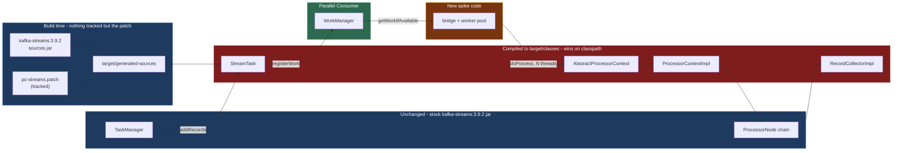
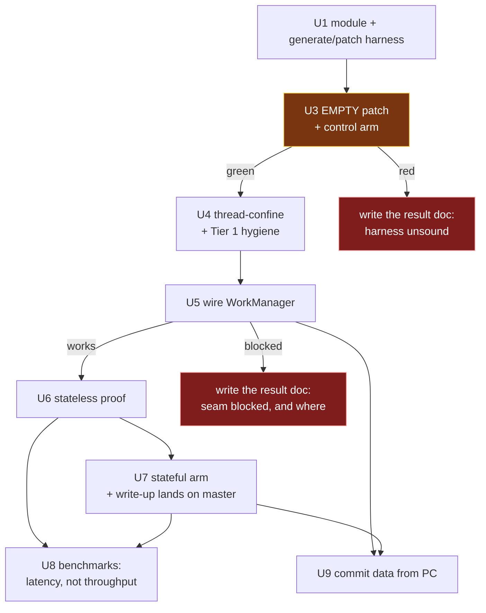

# feat: spike - can PC's work-shard manager drive a Kafka Streams processor chain?

## Product Contract

### Summary

Answer one question with running code: can Parallel Consumer's `WorkManager` feed and execute a Kafka
Streams processor chain, instead of the serial `PartitionGroup.nextRecord()` -> `StreamTask.process()`
loop? Report what it cost, as a patch. The spike proves or disproves the seam; it is not a feature.

**No Apache Kafka source enters this repository.** The patched classes are generated at build time from
the published sources jar and a tracked patch file - see KTD1.

### Problem Frame

`docs/plans/2026-08-07-002-investigate-kafka-streams-on-pc-report.md` **argues**, on evidence cited in
its §3.2 and §4, that swapping Kafka Streams' client for a PC-backed one gains nothing (Streams
serialises *above* the consumer) and that cutting the seam one layer lower is viable with a bounded
diff. It identifies **one load-bearing change**: `AbstractProcessorContext.recordContext` /
`currentNode` are a single mutable slot per task, read ambiently by every store wrapper.

That is analysis, not evidence. Nothing has been run. This spike converts the claim into "does work" or
"does not work, and here is where it broke" - and into a measured cost - before anyone invests in the
build-time tagging pass, offset ownership, or a maintained fork.

**The route itself remains an open decision.** See KTD0: cutting the seam inside `processor/internals`
is a selection from the report's own taxonomy made during planning, not a decision the user made. The
spike is designed so a red or ambiguous result sends the question back to the alternatives.

### Requirements

| ID | Requirement |
|---|---|
| R1 | A Kafka Streams topology runs with its records selected by PC's `WorkManager` rather than `PartitionGroup.nextRecord()`. |
| R2 | The processor chain executes concurrently: with a worker pool of at least 4 and a deliberately slow processor, at least 3 records are demonstrably in flight at once. |
| R3 | Output is correct against a stock Kafka Streams baseline: multiset equality across the whole run, and sequence equality within each key. |
| R4 | A control arm exists proving the generate-and-patch harness is behaviour-neutral before any patch content is applied. |
| R5 | The outcome - including a failure or an early stop - is recorded durably **on master**, with enough detail that the next person does not repeat it. |
| R6 | The spike module publishes to Maven Central as an **alpha/experimental artifact**, clearly labelled as such, with its seam **on by default** and a documented way to turn it off - and changes the behaviour of no **other** module. *(Reversed twice in revision; see KTD-S5 and KTD-S6. It previously read "nothing in the spike is published", and then "with its seam off by default".)* |
| R7 | No Apache Kafka source is committed to this repository. The CI gates pass without being bypassed or weakened. |
| R8 | The spike reports the size and shape of the change set. The patch file is that report: its line count, the classes it touches, and whether any new PC API was required. |
| R9 | The spike exercises at least one code path where the thread-confinement fix is actually load-bearing, so a green result distinguishes "confinement works" from "confinement was never needed here". |
| R10 | A commit that lands while records are in flight never covers an unfinished record: after a crash mid-run, every input record's effect is eventually present (at-least-once). Demonstrated by a kill-restart test, not asserted from the design. *(Added when U9 was planned - the alpha shipped with optimistic commit as a recorded shortcoming, and this is the requirement that retires it. No existing R changed.)* |

### Scope Boundaries

**In scope:** the report's Tier 1 mechanical concurrency hygiene *minus* its `StreamsProducer` items
(excluded by KTD7) and its `RocksDBStore` items (excluded by KTD3); thread-confining the per-task
record context; enough wiring to get records from `WorkManager` into the processor chain; and one
minimal stateful arm (U7) so the result can discriminate.

**Non-goals (this spike):**
- The build-time parallel-safe reachability pass in `InternalTopologyBuilder` (report §4.9).
- ~~Moving committable-offset ownership to PC (report §4.6).~~ *(Reversed when U9 was planned:
  KTD-S7 takes input-partition commit data from PC on the PC path, and R10 demands it. The
  exclusion held through the alpha; the stock path is untouched.)*
- Windowed operators, joins, suppression, punctuators, EOS, standby/restore.
- Caching-enabled state, and therefore the cache-layer concurrency problems entirely.
- Throughput measurement. "Faster" is not the question. *(Narrowed when U8 was planned:
  per-record latency distribution is the measured question, and wall-clock sweeps serve only as
  controls on the premise - throughput as a goal remains out.)*
- The Web GUI stretch goal on astubbs#255 - it needs the parallel-safe tagging pass.

**Ships as alpha.** The module lands on master and publishes as an alpha/experimental artifact alongside
release 0.6.0.0, with its seam **on by default** (KTD-S6 - depending on the artifact is the opt-in) and
its known gaps tracked in [Current Shortcomings](#current-shortcomings), which
`parallel-consumer-streams/README.md` points at rather than duplicating. Maturity is per-module,
not global. This reverses an earlier
non-goal ("merging the spike code into the product; the spike branch is kept, not landed") - see KTD-S5.
The result documents land in the same PR as the code (R5).

#### Deferred to Follow-Up Work
- Everything the report ranks Tier 2 beyond the thread-confinement, and all of Tier 3.
- Whatever U6/U7 name as the next experiment.

---

## Planning Contract

### Key Technical Decisions

The decisions below carrying a `session-settled:` annotation were closed by the user in conversation and
are not to be re-opened. **Everything else here, including KTD0, was chosen during planning.** A
later reviewer should challenge the unannotated ones freely.

**KTD-S1. The question is "how little must change to make it work".**
*(session-settled: user-directed - chosen over "is it possible at all": the user rejected the
impossibility framing directly, so feasibility is no longer the open question; cost is.)*
This is why R8 exists, and why KTD1's patch file is the natural unit of measurement.

**KTD-S2. Changing or forking Kafka itself is permissible.**
*(session-settled: user-directed - chosen over treating `processor.internals` being package-private and
unsupported as a blocker.)*
This licenses the approach; it does not mandate a literal fork, and it does **not** license copying
Kafka into this repository - see KTD-S4.

**KTD-S3. Spike posture: find out whether it runs.**
*(session-settled: user-directed - chosen over building toward something shippable.)*

**KTD-S4. No Apache Kafka source is committed to this repository.**
*(session-settled: user-directed - chosen over vendoring the four target classes into a spike module,
which an earlier draft of this plan proposed: the user rejected it outright.)*
This is what makes KTD1 the only remaining question, and it deletes an entire unit of licensing
machinery the vendoring approach required.

**KTD-S5. The module ships, as a published alpha/experimental artifact.**
*(session-settled: user-directed - chosen over keeping it an unmerged throwaway, which is what KTD-S3,
R6 and the Scope Boundaries originally said. The user reversed that decision after the result was in:
maturity is per-module, not global, so an experimental module can publish alongside a stable release
provided it is labelled honestly and is inert unless switched on.)*
Consequences, recorded so nothing silently keeps the old posture: KTD6 is rewritten (it publishes);
R6 is rewritten (it publishes, and must not change any **other** module's behaviour); the "not for merge"
non-goal is deleted; the docs land in the same PR as the code rather than a separate docs-only one; and
Apache Kafka's own 188-test suite moves from an opt-in profile into the module's normal test run, because
a shipped artifact's behaviour-preservation gate should run on every build.
**One obligation the throwaway posture did not have:** the published jar contains *compiled, modified*
Apache Kafka classes, so Apache 2.0 s4(b)/s4(c) now apply to the distribution - `NOTICE` names the four
classes, attributes the ASF, and states that they were changed. KTD-S4 is untouched: still no Apache
source in the repository, only the patch.
This does **not** reverse KTD-S3's *posture* - the code is still an experiment and says so on the tin. It
reverses only what happens to the artifact.

**KTD0. Cut the seam inside `processor/internals`.** Drive the processor chain from PC's `WorkManager`
rather than supplying a PC-backed client or building a PC-native API.
*This is an agent selection from the origin report's taxonomy, not a user decision.*
*Rejected:* **swapping the client via `KafkaClientSupplier`** - report §3.2 argues Streams serialises
above the consumer, so the swap gains nothing; evidence grade: source-cited analysis, not run.
*Rejected:* **a PC-native Streams-like DSL** - report §5 ranks it below this route *solely* because
this route inherits state stores for free; a stateless-only spike would not test that ranking, which is
why U7 exists.
*Rejected:* **the shipped topic-hop** - report §6.4; it already works, so the only reason to move is to
remove the hop's latency and operational cost.
*Return path:* if U3, U5 or U6 goes red, U6's write-up must state which alternative the result sends
the question back to.

**KTD1. Generate the patched classes at build time; track only the patch.** In `generate-sources`,
unpack the four target classes from `org.apache.kafka:kafka-streams:3.9.2` with classifier `sources`,
apply a tracked patch file, and add the output to the compile source roots. The compiled result lands
in `target/classes`, which precedes the jar on the classpath, so the patched classes win while their
siblings load from the jar - same runtime package, same classloader, package-private access intact.

*Verified end to end during planning:* the sources jar is on Central (HTTP 200) and contains all four
classes; `diff -ru` produces a patch and `patch -p1 --dry-run` re-applies it cleanly to a fresh extract.
The three plugins needed - `maven-dependency-plugin:unpack`, `exec-maven-plugin`,
`build-helper-maven-plugin:add-source` - are all already in this build.

*Rejected:* **vendoring the classes into the repo** (KTD-S4). It would have required a new copyright-gate
provenance class and a `NOTICE` change - a whole unit of machinery to make committing ~110KB of ASF
source legal and CI-clean. (Under KTD-S5 the `NOTICE` change became necessary anyway, because the
published jar distributes the *compiled* modified classes. The copyright-gate machinery did not: the gate
only scans tracked `.java` files, and there still are none.)
*Rejected:* **forking and publishing Kafka locally.** It works, but a locally-published version is
**unresolvable on a CI runner**, so the branch could never go green; it also costs a clone, a ~3 minute
cold build, and a `dependencyManagement` pin to stop the forked POM dragging in an unpublished
`kafka-clients`.
*Rejected:* **a git submodule of apache/kafka** - a very large repo to carry, still puts AK content in
the working tree, and submodules are a persistent friction tax for a throwaway experiment.

*Why this is better than vendoring, beyond the licensing:* the patch file **is** R8's answer - "how
little did we change" becomes `wc -l`. And drift fails loudly: a vendored copy drifts silently into
`NoSuchMethodError` at runtime, whereas a patch that no longer applies breaks the build the moment
`kafka.version` moves.

*Cost, stated honestly:* iteration is worse than editing files directly. U3 must provide a regeneration
path (edit the generated sources in `target/`, re-derive the patch) or the spike will be painful to work
on.

**KTD2. Target Kafka 3.9.2.** Matches the repo's `kafka.version`, so the sources jar and the binary jar
are the same version by construction. `docs/inflight/pr-53-java-baseline-kafka4.md` records Kafka 4 as
unstarted, and its compat job is `if: false` at `.github/workflows/maven.yml:170` because the 4.x build
currently fails.
*Rejected:* trunk/4.x. Trunk differs materially - `ProcessorContextImpl` is `final` there and the record
context is mutated in place - so a green spike on 3.9 does not transfer unexamined. Recorded as a risk.

**KTD3. Stateless first, then one non-windowed aggregation.** U6 proves the seam on
`stream -> mapValues -> to`. U7 adds a `count`/`reduce` over a KV store built `withCachingDisabled()`.
*Why both:* a stateless topology instantiates none of the store wrappers
(`ChangeLoggingKeyValueBytesStore`, `CachingKeyValueStore`, `StoreQueryUtils`, `MeteredKeyValueStore`)
that make the record context load-bearing - so a stateless-only green result cannot distinguish
"confinement works" from "confinement was never needed here" (R9), nor test the property on which KTD0
ranks this route above a PC-native DSL.
*Correction:* an earlier draft rejected a stateful arm because `withCachingDisabled()` was "outside the
scoped tier". Wrong - it is public DSL API the **topology author** calls, needing no additional patched
class.
*Still rejected:* windowed operators, joins and suppression - they change semantics under out-of-order
processing, which would make a failure ambiguous.

**KTD6. A top-level module that publishes, as an alpha/experimental artifact.** New module
`parallel-consumer-streams`, publishing like any other module - no publish-skip properties, no
`central-publishing-maven-plugin` `<skipPublishing>` block - with its alpha status carried in the pom
`<name>`/`<description>` and in `parallel-consumer-streams/README.md`.
*(This decision originally continued "and its seam off by default so the artifact is inert unless a user
opts in" - reversed by KTD-S6: taking the dependency **is** the opt-in.)*
*Reversal, recorded rather than quietly edited (KTD-S5):* this decision originally read "a top-level
module that explicitly skips publishing", carrying the three publish-skip **properties**
(`maven.deploy.skip`, `maven.install.skip`, `gpg.skip`) **plus** a `<build><plugins>` block setting
`<skipPublishing>true</skipPublishing>` - because there is no
`central-publishing-maven-plugin.skipPublishing` property (the plugin exposes only an unqualified
`${skipPublishing}` expression), so a properties-only copy would have protected nothing. That machinery
is now removed. The note about `skipPublishing` being plugin *configuration* rather than a property is
kept here because it is still true and still a trap for the modules that **do** skip.
*Still relevant:* the module stays ordered **before** `parallel-consumer-examples` in `<modules>`.
That ordering was originally about the spike's own skip; it still matters because `examples` is the
skipPublishing module and the recorded plugin bug is about a skipPublishing module being **last**.
*Rejected:* placing it under `parallel-consumer-examples`. It is not an example, and being there would
now actively suppress its publication.

**KTD-S6. The dispatch seam defaults ON. Depending on the artifact is the opt-in.**
*(session-settled: user-directed - reverses KTD8's "defaulting to stock" and the off-by-default posture
in KTD6, R6 and the Risks table.)*
Nobody puts a separate, loudly-labelled alpha artifact called `parallel-consumer-streams` on their
classpath by accident. Having done so deliberately, they wanted the PC seam; requiring them to *also*
set `-Dpc.streams.dispatch.enabled=true` is a second opt-in that buys nothing and costs every user
a support question. The property survives as the way to turn the seam **off**
(`-Dpc.streams.dispatch.enabled=false`), which is what an A/B comparison needs anyway.
*What the old default was actually paying for:* keeping U3's control arm stock without it having to say
so. That is a **test** concern, and tests can state their requirement explicitly - so they now do, at
each site, with a comment saying why. The Kafka upstream-test surefire execution sets the property to
`false` on the execution itself rather than inheriting any default, because its 188/188 is a
behaviour-preservation claim that is only true with the seam off.
*Consequence, accepted:* a control arm that forgets to disable the seam is now wrong rather than right by
accident. `PcDispatchSwitch.resetToDefault()` exists so test teardown hands the JVM back at the
artifact's default instead of parking it wherever the last test left it, and a bad value for the
property fails loudly rather than being read as "off" - a typo in the one property whose job is to
disable the seam would otherwise produce a run that looks like a control and is not.

**KTD7. At-least-once, not EOS.** Keeps `StreamsProducer` out of the patch entirely.

**KTD8. Single record path, switched - never both at once.** `addRecords` feeds `WorkManager`
*instead of* `partitionGroup.addRawRecords`, with a bridge flag selecting stock or PC dispatch.
*(Originally "defaulting to stock"; reversed by KTD-S6 - the flag now defaults to PC dispatch. The
single-path property is unaffected: it is a switch either way, never a fan-out.)*
*Rejected:* registering into both paths "so they can be compared". Nothing would drain the partition
group, `StreamTask.addRecords` pauses a partition once its buffer fills, and the run would stall with
the consumer paused and no error. `streamTime` would also never advance, since it advances at selection.

**KTD-S7. On the PC path, commit data comes from PC - and PC owns the commit metadata field.**
*(session-settled: user-approved - chosen over repairing `consumedOffsets` with synchronisation: a
single `Long` per partition cannot represent "12 done, 10 and 11 still in flight" under any locking,
so the structure is the defect, not the access to it.)*
`committableOffsetsAndMetadata()` on the PC path returns
`WorkManager.collectCommitDataForDirtyPartitions()` wholesale: offset = the frontier (lowest
incomplete), metadata = PC's encoded map of completed-but-non-contiguous offsets beyond it, with
PC's own graceful no-metadata fallback when the encoding is too large. Consequences accepted with
eyes open:

- **Streams' `TopicPartitionMetadata` (partition time + processor metadata) is not written for input
  partitions on the PC path.** Partition time already does not advance there (see
  [Current Shortcomings](#current-shortcomings): stream time), and processor metadata is a Processor
  API nicety. Verified safe on restart: PC's payload is valid base64 whose leading magic byte is a
  printable letter, never version 1 or 2, so `TopicPartitionMetadata.decode` takes its
  version-switch default branch, warns "Unsupported offset metadata version found. Supported
  version <= 2. Found version {n}.", and returns UNKNOWN - a stock (seam-off) restart on a
  PC-committed group degrades gracefully rather than crashing. When PC's too-large fallback
  committed a bare offset, decode returns early on the empty string with no warning at all.
- The two `StreamTaskTest` cases that assert Streams' metadata *encoding* in the commit are therefore
  expected to stay red by design, and U9 says so up front rather than discovering it.

*Rejected:* merging both encodings into one metadata field - two decoders would each see the other's
bytes as corruption, and the field would carry two owners forever.

**Future coexistence, when something of Streams' genuinely needs to persist across restarts**
*(session-settled: user-directed - chosen over re-admitting Streams as a second writer of the field)*:
extend **PC's own codec** with a generalised opaque rider - the embedder hands PC a byte blob, PC
carries it inside its versioned payload and hands it back on read. Not Streams-specific by design:
PC's encoding grows one extension slot, and the Streams bridge is merely its first customer. One
owner, one decoder, and the rider's contents are the embedder's problem. Notably both of the field's
displaced tenants are time watermarks - partition time, and emit-final's per-processor
last-emitted-window-close timestamps - so the natural moment to build the rider is the stream-time
work (see [Current Shortcomings](#current-shortcomings)), which will need somewhere to persist its
low-water mark anyway. One budget caveat when that day comes: the broker caps commit metadata
(offsets.metadata.max.bytes, default 4096), and every rider byte competes with PC's own hole
encoding - the too-large fallback must account for both.

### Assumptions

- **Corrected from an earlier draft:** `kafka-streams:3.9.2` ships class-file **major 52 (Java 8)** -
  verified against the jar in `~/.m2`. The spike module inherits the project-wide
  `<release.target>8</release.target>` with **no module-local override**.
- `slf4j-api` and `jackson-databind` are `runtime` scope in the `kafka-streams` POM, so the generated
  sources will not compile until both are added at compile scope.
- `ParallelConsumerOptions.validate()` requires a `Consumer` instance, but `PCModule`/`WorkManager`
  construction never invokes `validate()`. Whether the bridge passes a mock or the Streams consumer is
  resolved at U5. *(Resolved: the bridge passes a mock, and U9 keeps it - see U9 approach step 6
  for why that stays sound once PC's commit data becomes real.)*

---

## High-Level Technical Design

Sequencing, and the two points where a negative result is itself the deliverable:

*(U2 was deleted in revision - it existed only to teach the copyright gate about vendored ASF source,
which KTD-S4 makes unnecessary. The gap in unit numbering is intentional.)*

---

## Implementation Units

### U1. Spike module and the generate-and-patch harness

**Goal:** A module that unpacks four Kafka source files, applies a patch, compiles the result ahead of
the jar, and publishes as an alpha artifact (KTD-S5) - with no Kafka source tracked.

**Requirements:** R6, R7

**Dependencies:** none

**Files:**
- `pom.xml` (modify - add to `<modules>`, **before** `parallel-consumer-examples`)
- `parallel-consumer-streams/pom.xml` (create)
- `parallel-consumer-streams/src/main/patch/pc-streams.patch` (create - **empty at this unit**)
- `parallel-consumer-streams/bin/regen-patch.sh` (create)
- `parallel-consumer-streams/.gitignore` (create - exclude the generated tree)
- `parallel-consumer-streams/src/test/java/io/confluent/parallelconsumer/streams/TestConventionsArchTest.java` (create)
- `parallel-consumer-streams/src/test/resources/logback-test.xml` (create)

**Approach:**

1. Add to the root `<modules>` list (`pom.xml:35-41`), before `parallel-consumer-examples` - that pom
   records a central-publishing bug where a skipPublishing module last in reactor order suppressed the
   whole bundle upload.
2. Apply KTD6: **no** publish-skip properties and **no** `central-publishing-maven-plugin`
   `<skipPublishing>` block - the module publishes like any other. Carry the alpha framing in the pom
   `<name>`/`<description>` and in the module README instead. **No `release.target` override** - see
   Assumptions.
3. Wire the harness, all three plugins already used elsewhere in this build:
   - `maven-dependency-plugin:unpack` in `generate-sources`, artifact
     `org.apache.kafka:kafka-streams:${kafka.version}` classifier `sources`, `includes` limited to the
     four target files, output to `target/generated-sources/kafka-patched`.
   - `exec-maven-plugin` applying `src/main/patch/pc-streams.patch` with `patch -p1`. Run
     `patch --dry-run` first and fail the build on a rejected hunk - a silently half-applied patch is
     the worst possible failure here.
   - `build-helper-maven-plugin:add-source` adding the generated directory as a compile source root.
4. `regen-patch.sh`: re-derive `pc-streams.patch` by diffing a pristine extract against the edited
   generated tree. Without this the spike is painful to iterate on (KTD1's stated cost).
5. Dependencies: `parallel-consumer-core` (compile), `kafka-streams` at `${kafka.version}` (compile),
   `slf4j-api` and `jackson-databind` at **compile** scope. Test scope: `parallel-consumer-core` with
   `<classifier>tests</classifier>`, plus `testcontainers`, `testcontainers:junit-jupiter`,
   `testcontainers:kafka`, `awaitility` re-declared.
6. Add the conventions test, matching the shape used by every other module.

**Test scenarios:** `Test expectation: none` - harness only; U3's control arm is the first real test.

**Verification:** `./mvnw -pl parallel-consumer-streams -am install` succeeds and the
`parallel-consumer-streams` artifact **does** appear under
`~/.m2/repository/bz/stub/parallelconsumer/`; `git status` shows no `.java` file under
`org/apache/kafka/` tracked anywhere; `bin/ci-unit-test.sh` passes.

---

### U3. Empty patch, and prove the harness changes nothing

**Goal:** The control arm. Generating and compiling the four classes with an **empty** patch must be
behaviour-neutral, or nothing later can be attributed.

**Requirements:** R4, R7, R8

**Dependencies:** U1

**Files:**
- `parallel-consumer-streams/src/test/java/io/confluent/parallelconsumer/streams/integrationTests/ShadowedStreamsControlTest.java` (create)

**Approach:**

1. Leave `pc-streams.patch` empty. The generated classes are then byte-for-byte the 3.9.2 sources, so any
   behaviour difference is the harness's fault and nothing else's - a cleaner control than vendoring
   could give.
2. **The class set is named, not discovered:** `StreamTask` and `AbstractProcessorContext` are the
   targets; `ProcessorContextImpl` is required because it accesses the confined fields directly (U4);
   `RecordCollectorImpl` is required because its non-concurrent `offsets` and `producedSensorByTopic`
   are mutated from every worker thread through the `to()` sink - and **the compiler will not demand
   it**, since it is constructed outside `StreamTask`.
3. **Stop-threshold:** if compilation demands more than roughly a dozen classes, stop and report the
   sprawl as the answer (R8). Growth past that is evidence the seam is not bounded.
4. Write the control-arm test: a stateless topology through stock `KafkaStreams`, asserting output
   correctness **and** asserting each generated class is the one loaded - the technique is silent when
   it fails, and a test passing because the jar's copy won proves nothing.

**Execution note:** If the empty-patch run does not behave identically, **stop and write
`docs/plans/2026-08-08-002-ks-on-pc-spike-result.md` with the verdict reached** (R5), then re-plan. Do
not proceed to U4.

**Patterns to follow:**
`parallel-consumer-examples/parallel-consumer-example-streams/src/test/java/io/confluent/parallelconsumer/examples/streams/integrationTests/StreamsAppTest.java`.

**Test scenarios:**
- Each generated class (not the jar's) is the one loaded - assert on code source, per class.
- A generated class and a jar-resident sibling report the same runtime package.
- A stateless topology over N records produces exactly N output records, in per-key order.
- Records with distinct keys all appear; no drops, no duplicates.
- The test fails loudly if classpath ordering lets the jar's copy win.
- The build fails if the patch does not apply cleanly - verify by temporarily corrupting a hunk.

**Verification:** The control arm is green and its class-source assertions prove the generated copies
are live.

---

### U4. Thread-confine the record context, and the Tier 1 hygiene

**Goal:** Make the per-task mutable state safe for concurrent execution - the report's single
load-bearing change - including the caller that would otherwise defeat it.

**Requirements:** R2 (prerequisite), R8

**Dependencies:** U3 (control arm green)

**Files:**
- `parallel-consumer-streams/src/main/patch/pc-streams.patch` (modify - this is now the only place
  Kafka changes are expressed)
- `parallel-consumer-streams/src/test/java/io/confluent/parallelconsumer/streams/ProcessorContextConfinementTest.java` (create)

**Approach:**

1. **First, route `ProcessorContextImpl`'s direct field access through accessors.** `recordContext` and
   `currentNode` are `protected` fields, and `ProcessorContextImpl` reads and writes `recordContext`
   directly - those `getfield`/`putfield` pairs *are* the save/restore stack in `forward`. An earlier
   draft claimed thread-locals preserve that discipline; that is inverted. Convert those sites to
   `recordContext()` / `setRecordContext()` **before** confining the field.
2. Thread-confine `recordContext` and `currentNode` in `AbstractProcessorContext`.
3. `StreamTask`: allocate `recordInfo` per record rather than reusing the single instance (it is read
   *after* processing); `consumedOffsets` and `partitionsToResume` concurrent; `commitNeeded` volatile;
   `processTimeMs` a `LongAdder`.
4. `RecordCollectorImpl`: `offsets` and `producedSensorByTopic` to concurrent maps.
5. Regenerate the patch via `regen-patch.sh` and commit it. Record its line count - this is R8's running
   total.
6. Leave `StreamsProducer` alone (KTD7) and `RocksDBStore` alone (KTD3).

**Execution note:** Re-run U3's control arm after this unit and before U5 - these changes are meant to
be behaviour-preserving under single-threaded execution, and a regression is far cheaper to find now.

**Test scenarios:**
- The generated `ProcessorContextImpl` is the class actually loaded - assert on code source.
- Two threads setting different record contexts on the same context instance each read back their own.
- A thread that sets a context, forwards through a nested node, and returns sees its original context
  restored - the save/restore stack still works per thread, through the accessors.
- A thread reading the context before setting one gets a null/absent value, not another thread's
  leftover.
- Two concurrent `recordInfo` consumers do not observe each other's partition or node.
- U3's control-arm topology still produces identical output.

**Verification:** The confinement test passes; `ProcessorContextImpl` is proven live; U3's control arm
is still green; `pc-streams.patch` applies cleanly from a clean checkout.

---

### U5. Wire PC's WorkManager into StreamTask

**Goal:** Records reach the processor chain via `WorkManager.getWorkIfAvailable()` and execute on a
worker pool, not via `partitionGroup.nextRecord()` on the StreamThread.

**Requirements:** R1, R2, R8

**Dependencies:** U4

**Files:**
- `parallel-consumer-streams/src/main/patch/pc-streams.patch` (modify)
- `parallel-consumer-streams/src/main/java/io/confluent/parallelconsumer/streams/` (create - the bridge and its worker pool; **this is fork-original code and lives in the repo normally**)

**Approach:**

1. **Bootstrap PC's partition lifecycle first.** `WorkManager` is a `ConsumerRebalanceListener`, and
   Streams owns the consumer here - so nothing drives PC's assignment lifecycle unless the bridge does.
   Construct the `WorkManager` through `PCModule`, and call `onPartitionsAssigned` for the task's input
   partitions at initialisation (`onPartitionsRevoked` on close). Without this,
   `PartitionStateManager.getPartitionState` returns null and `maybeRegisterNewRecordAsWork`
   dereferences it; separately, `EpochAndRecordsMap` skips any partition whose epoch is null with only
   a `log.warn`, so records are dropped **silently**. Resolve the `Consumer`-instance question from
   Assumptions here.
2. Adapt records via `EpochAndRecordsMap` - `registerWork` takes that, not a record collection.
3. **Single path, switched** (KTD8): `addRecords` feeds `WorkManager` *instead of* the partition group,
   with a bridge flag selecting stock or PC dispatch, defaulting to stock *(as built at U5;
   reversed by KTD-S6 - the shipped flag defaults to PC dispatch, and U3's control arm and U6's
   stock path now disable the seam explicitly at each site rather than inheriting a default. The
   superseded rationale was that the stock default kept those arms runnable after this unit
   landed.)*
4. Replace the selection step in `process()` with a pull from `getWorkIfAvailable(int)`, dispatching
   each `WorkContainer` to the worker pool running the existing `doProcess` path.
5. Report completion through `onSuccessResult` / `onFailureResult` so PC's shard invariant holds - under
   KEY ordering a shard hands out at most one in-flight record at a time
   (`parallel-consumer-core/src/main/java/io/confluent/parallelconsumer/state/ProcessingShard.java:149-154`).
   Configure KEY ordering explicitly.
6. **Disable retries, and record why.** PC's response to `onFailureResult` is to re-dispatch, which
   re-runs the whole chain including `forward` calls that already emitted downstream - duplicates stock
   Streams never produces (it surfaces the exception to the uncaught-exception handler). Record the
   divergence in U6's caveats.
7. Decide explicitly whether `__processing.threads.enabled__` is set - a patched `StreamTask` carries
   the branch selecting `SynchronizedPartitionGroup`, so the flag silently determines which
   implementation runs.
8. Leave offset commit on the stock path - deferred. Accept optimistic commit; record it.

**Execution note:** The interesting failures here are silent. Expect to need instrumentation proving
records actually travelled the new path. If the seam cannot be made to work, **write the result document
with the verdict and where it blocked** (R5).

**Test scenarios:**
- `registerWork` accepted every record - assert none were skipped for want of an epoch.
- Records demonstrably travel the WorkManager path - assert on a dispatch marker, not on output alone.
- With the flag off, the dispatch marker reads zero and output is still correct.
- With a pool of at least 4 and a slow processor, at least 3 records are in flight at once.
- Two records sharing a key are never in flight concurrently, under KEY ordering.
- Records with distinct keys do run concurrently.
- A processor that throws surfaces the failure without wedging the task, and without re-emitting
  already-forwarded downstream records.

**Verification:** Dispatch is proven by assertion, not inferred from output; concurrency is observed;
the flag-off path is green.

---

### U6. The stateless proof

**Goal:** Prove the seam end to end against an uncontaminated stock baseline.

**Requirements:** R1, R2, R3, R8

**Dependencies:** U5

**Files:**
- `parallel-consumer-examples/parallel-consumer-example-streams/src/test/java/io/confluent/parallelconsumer/examples/streams/integrationTests/StockBaselineFixtureTest.java` (create)
- `parallel-consumer-streams/src/test/java/io/confluent/parallelconsumer/streams/integrationTests/PcDrivenStreamsProofTest.java` (create)
- `parallel-consumer-streams/src/test/resources/stock-baseline-fixture.tsv` (create - the fixture
  itself, tracked so the spike-side test has a baseline without re-running the stock arm, and re-verified
  against a live stock run on every execution of `StockBaselineFixtureTest`. It carries the *inputs* as
  well as the outputs, and the spike-side test replays those, so the two arms cannot drift in what they
  were fed - the two modules cannot share code in this reactor order.)

**Approach:**

1. **The stock baseline must come from outside the spike module.** Any `KafkaStreams` instance in the
   spike module's JVM loads the patched classes, because `target/classes` precedes the jar - so a
   "stock" arm run there is not stock, and both arms would share every defect the patch introduced.
   Generate the expected output as a fixture from `parallel-consumer-example-streams`, which does not
   depend on the spike module, and assert the PC-driven run against that fixture.
2. Assert **multiset equality across the run, and sequence equality within each key** - global ordering
   necessarily differs under parallel dispatch, and an ordered assertion would go red for the very
   concurrency being demonstrated.
3. Add a probe processor reading `context.recordContext()`, `context.timestamp()` and
   `context.headers()` for every record under N-thread dispatch, asserting each matches the record being
   processed. In a stateless topology this is the only surviving ambient reader; R9 is fully met by U7.

**Test scenarios:**
- PC-driven output matches the stock fixture as a multiset across the run.
- Per-key sequence equality holds end to end.
- The probe processor observes its own record's context, timestamp and headers on every record under
  concurrent dispatch.
- No records lost, none duplicated.
- The proof holds across repeated executions, not once.

**Verification:** The baseline is provably external to the spike module; equality uses the right
vocabulary; the run is repeated.

---

### U7. The stateful arm, and the write-up

**Goal:** Exercise the path where thread-confinement is actually load-bearing, discriminate the route
choice, and land the verdict where the next person will find it.

**Requirements:** R5, R8, R9

**Dependencies:** U6

**Files:**
- `parallel-consumer-streams/src/test/java/io/confluent/parallelconsumer/streams/integrationTests/PcDrivenStatefulProofTest.java` (create)
- `docs/plans/2026-08-08-002-ks-on-pc-spike-result.md` (create - **lands on master**)
- `parallel-consumer-streams/README.md` (create - the alpha module's front door; **lands on master**)
- `docs/plans/2026-08-07-002-investigate-kafka-streams-on-pc-report.md` (modify - link the result)

**Approach:**

1. Add a non-windowed `count`/`reduce` over a KV store built `withCachingDisabled()`, run under
   concurrent dispatch, asserting output equality against a stock fixture generated as in U6. This
   exercises `ChangeLoggingKeyValueBytesStore` and `MeteredKeyValueStore` - the ambient `recordContext`
   readers that make U4's change load-bearing.
2. Write the result document: the verdict; what was run; what broke and how it was diagnosed; which of
   the report's §4 claims held; **the change-set size and shape (R8) - quote `pc-streams.patch`'s line
   count and the classes it touches**; which KTD0 alternative a red or ambiguous result sends the
   question back to; and the next experiment.
3. **Add a "What a green result commits to" section**, pricing at least: re-deriving the patch on every
   Kafka version bump against classes carrying no compatibility guarantee; the DSL emission-semantics
   change that disabling caching forces on the parallel path; and the distribution shape a shipped
   version would need, since build-time patching is a spike technique, not a product one.
4. **Land the documents in the same PR as the code** (KTD-S5 - the module ships, so there is no longer a
   separate docs-only PR, and no `branch-`-prefixed inflight note, since that prefix is for work on a
   branch with **no** PR). Add `parallel-consumer-streams/README.md` as the module's own front
   door: what it is, that it is alpha and wants field testers, how to switch the seam **off** (KTD-S6 -
   it is on by default), a signpost to [Current Shortcomings](#current-shortcomings) rather than a copy
   of it, and how to report findings.
5. Record the caveats: 3.9-only; caching-disabled only; optimistic commit; retries disabled; the patch
   is pinned to 3.9.2 and will need re-deriving on any bump.

**Execution note:** Report the reproduction rate and conditions, not just a verdict. A negative result
is a successful spike and gets the same care.

**Test scenarios:**
- A non-windowed aggregation under concurrent dispatch produces output equal to the stock fixture.
- Per-key aggregate values are correct - no lost updates.
- Changelog records carry the timestamp of the record that produced them, not another record's.
- The stateful run is repeatable across executions.

**Verification:** The verdict is stated plainly with evidence and reproduction rate; the result document
and the module README are on master.

---

### U8. The benchmarks: prove the point is latency, not throughput

**Goal:** Measure the thing the spike exists for. Stock Kafka Streams parallelises across *partitions*;
PC parallelises across *keys*. Where a record's cost is dominated by blocking IO - a call to a web
service, the motivating case - a single partition serialises work that has no reason to be serial, and
one slow record delays every record queued behind it regardless of key.

**The primary metric is the latency distribution, not throughput.** Throughput improvement is a
consequence and is easy to mistake for a faster harness; head-of-line blocking is the property PC
actually removes, and it is visible only per record.

**Requirements:** R2, R8

**Dependencies:** U6, U7

**Files:**
- `.../integrationTests/HeadOfLineBlockingBenchmarkTest.java` (create)
- `.../integrationTests/KeyCardinalityScalingBenchmarkTest.java` (create)
- `docs/plans/2026-08-08-002-ks-on-pc-spike-result.md` (modify - record measurements against predictions)

**The control arm.** Both experiments run stock against PC **in the same JVM, on the same patched
classes**, switching only `PcDispatchSwitch`. One term changes. A separate stock build would differ in
JVM, broker state and warm-up as well, and could not attribute a difference to the seam.

**Predictions, stated before running.** Each is falsifiable, and a refuted one is reported as
prominently as one that holds.

*Experiment A - head-of-line blocking.* One partition. One record on key `slow` costing `S`, produced
first; many subsequent records on other keys costing `F`, where `S >> F`. Measure per-record latency
from produce to output for the **fast** records only.

- **A1 (stock):** fast-record p99 latency `>= S`. Every record behind the blocker waits for it, because
  `PartitionGroup.nextRecord()` hands them over one at a time.
- **A2 (PC):** fast-record p99 latency `<< S`, bounded by pool availability rather than by the blocker.
- **A3 (negative control, single key):** re-run with **every** record on the same key. PC's KEY
  ordering permits at most one in-flight record per key, so PC must show **no meaningful advantage**
  here. If it still wins, the gain is not key concurrency and both measurements are void.

*Experiment B - key-cardinality sweep.* Fixed record count `N`, fixed per-record cost `C`, one
partition, cardinality `K` swept over `{1, 2, 4, 8}`.

- **B1 (stock):** wall-clock `~ N x C`, **flat in K**. Stock has no intra-partition concurrency, so
  cardinality changes nothing. This doubles as the control on the claim itself: if stock speeds up with
  K, the premise is wrong.
- **B2 (PC):** wall-clock `~ N x C / min(K, poolSize)` - speedup rising with K and plateauing at the
  pool size.
- **B3 (negative control, `K = 1`):** PC and stock within noise of each other. Same falsifier as A3, at
  the other experiment.

**Approach:**

1. Reuse `PcDrivenProofSupport` for the broker, topology and drain. Add a per-record cost that is a
   *block*, not a spin, so the pool can genuinely overlap work - a spin would compete for cores and
   measure the scheduler instead.
2. Timestamp each output at emission and pair it with its produce time to get per-record latency.
   Report p50 and p99 per arm, and log the full distribution - a mean would hide exactly the tail
   head-of-line blocking creates.
3. Assert on **ratios with wide margins**, never on absolute wall-clock. The predicted A-effect is
   roughly `S/F`; asserting a factor of two where ten is expected leaves room for a loaded CI machine
   without letting a null result pass.
4. Record measured numbers against each prediction in the result document, including any that were
   refuted.

**Execution note:** These are measurements, so treat contention as a first-class hazard. Run each arm
more than once, report the spread rather than a single figure, and state the machine and its load.
A benchmark that cannot be reproduced is an anecdote.

**Test scenarios:**
- Under a blocker, fast-key p99 latency is dramatically lower with the seam on than off.
- With every record on one key, the seam confers no meaningful advantage (A3).
- Stock wall-clock is flat across key cardinality; PC's falls with it, plateauing at pool size.
- At `K = 1` the two arms are within noise (B3).

**Verification:** Each prediction has a measured outcome recorded against it, with the reproduction
count and the spread. Both negative controls behave as predicted, or the positive results are withdrawn.

**Experiment A result - all three predictions held.** One partition, a 1500ms blocker at the head, 24
records at 25ms behind it, pool of 4, both arms in one JVM on the patched classes:

| Statistic | Stock | PC | Ratio |
|---|---|---|---|
| min | 1541ms | 27ms | **57.1x** |
| p50 | 1858ms | 232ms | 8.0x |
| p99 | 2205ms | 637ms | 3.5x |

- **A1 held.** Stock's *minimum* is 1541ms - even the luckiest fast record waited for the blocker.
- **A2 held.** PC's minimum is 27ms, its own cost and nothing else.
- **A3 held**, and informatively: with every record on one key PC measures **0.99x on min and 0.69x
  on p50** - slower, as it must be when KEY ordering forbids concurrency and the pool handoff still
  costs. A negative control that merely tied would be weaker evidence than one that goes the wrong way
  for the right reason.

**Two corrections made during the run, both recorded because they change what the numbers mean.**

1. *The control changed two terms.* Processing cost was originally selected by key, so putting every
   record on the blocker's key made every record a 1500ms record - the control differed from the
   experiment in workload as well as cardinality, and its p50 was 19568ms against the experiment's
   1865ms. Cost is now selected by value, leaving cardinality as the only difference.
2. *The p99 was the wrong statistic to assert on.* At n=24 the p99 is the single worst sample, and
   the worst sample is the last record queued through the pool - it measures queueing depth, not
   blocking, and it moved with pool size rather than with the seam. The claim "a fast record does not
   wait for the slow one" is stated by the **minimum**, which is what A1 and A2 now assert. The p99 is
   still reported; it is simply not the evidence.

---

### U9. Commit data from PC, not from `consumedOffsets` (pile A)

**Goal:** Retire the only shortcoming that can lose data. On the PC path, the offsets and metadata
handed to the consumer-group commit come from `WorkManager.collectCommitDataForDirtyPartitions()` -
the frontier plus encoded holes - instead of Streams' one-`Long`-per-partition high-water map, which
cannot represent out-of-order completion at all (see KTD-S7 for why this is a deletion, not a repair).

**Requirements:** R3, R8, R10. Also the measured pile-A delta: 14 of the 33 seam-on `StreamTaskTest`
failures are offset/commit accounting (see [the classification](#the-33-failing-streamtasktest-cases-classified)),
and this unit measures how many it resolves.

**Dependencies:** U5 (the dispatcher and seam), U7 (the stateful arm, whose changelog checkpoint this
unit must not disturb)

**Files:**
- `parallel-consumer-streams/src/main/patch/pc-streams.patch` (modify - `StreamTask` hunks only;
  the other three patched classes are untouched, and the patch surface stays at four)
- `parallel-consumer-streams/src/main/java/io/confluent/parallelconsumer/streams/PcTaskDispatcher.java`
  (modify - expose commit-data collection, a commit-outstanding signal, the commit-success
  acknowledgement pass-through, and an abort-style close - no drain, no completion feed-back,
  immediate `shutdownNow` - for the crash test; module class, free to grow)
- `parallel-consumer-streams/src/test/java/io/confluent/parallelconsumer/streams/integrationTests/CommitFrontierCrashRestartTest.java`
  (create)
- `docs/plans/2026-08-08-002-ks-on-pc-spike-result.md` (modify - record the measured pile-A delta
  against the predictions)

**Approach:**

1. In patched `StreamTask`, when the dispatcher is active, `committableOffsetsAndMetadata()` returns
   the dispatcher's commit data - `collectCommitDataForDirtyPartitions()` delegated through
   `PcTaskDispatcher` - for input partitions. The stock path is untouched, per KTD8's
   single-path-switched rule.
2. Per KTD-S7, PC's `OffsetAndMetadata` is taken wholesale: frontier offset, PC-encoded metadata,
   PC's existing too-large fallback. No Streams `TopicPartitionMetadata` is written on this path.
3. Delete the `consumedOffsets.put` in `pcRunChain` - the worker-side chain-completion callback in
   patched `StreamTask` - then find every remaining `consumedOffsets` reader on the PC path and
   re-point it. The direct readers in the 3.9.2 sources are exactly three:
   `committableOffsetsAndMetadata()` (step 1), `commitNeeded()`, and `checkpointableOffsets()`.
   The repartition-purge derivation reads the separate `committedOffsets` map, fed after a
   successful commit - step 8's territory, not a re-point site.
4. `commitNeeded()` on the PC path derives from the dispatcher - completions not yet covered by a
   **successful** commit, not by a collection - rather than from the volatile flag the drain sets
   today. Two gates must both be satisfied: the `commitNeeded()` *method*, and the private
   `commitNeeded` **field** that `prepareCommit()` checks before ever calling
   `committableOffsetsAndMetadata()` and that additionally gates the pre-commit `flush()` -
   re-point that field check to the dispatcher in the same hunk that re-points
   `committableOffsetsAndMetadata()`, or nothing on the PC path ever commits at all.
5. Close the loop on success: patched `postCommit()` - reached only after the commit has
   succeeded - reports the committed input-partition offsets back through `PcTaskDispatcher` to
   `WorkManager.onOffsetCommitSuccess(...)`. That is the only caller of PC's `setClean`, so
   without it every partition stays dirty forever, `commitNeeded()` never goes false, and a
   commit that fails after collection would strand its data - the dirty partition re-collects on
   the next cycle instead.
6. The dispatcher's `MockConsumer` stays, and its javadoc must be updated - its current rationale
   ("offset commit stays on the stock Streams path... never committed from") is the premise this
   unit deletes. Why it remains sound once commits are real: PC's bootstrap truncation
   (`PartitionState.maybeTruncateBelowOrAbove`) aligns the frontier to the first record Streams
   polls after resume, and collection only returns dirty partitions, so a first PC commit cannot
   regress the group's committed offset. Do NOT "fix" the javadoc contradiction by handing PC the
   real Streams consumer: PC's bootstrap would then decode the group's older stock-format commit
   metadata and fail under the default `invalidOffsetMetadataPolicy` (FAIL) - exactly the
   seam-off-then-seam-on flow KTD-S6 makes normal.
7. `checkpointableOffsets()` is the recorded trap: it merges `recordCollector.offsets()` (changelog,
   producer-side, already correct) with `consumedOffsets`. Only the input-partition half moves to PC;
   the changelog merge must not change.
8. The repartition-purge derivation flows from committed offsets, so once commit data is PC's frontier
   it becomes frontier-safe with no further change - verify rather than modify.
9. **Non-goal: metadata read-back on assignment.** Loading PC's encoded metadata into the `WorkManager`
   at partition assignment would let a restart skip already-completed records. At-least-once does not
   require it - the frontier alone prevents loss; replaying completed-beyond-frontier records is a
   permitted duplicate. Record it as the follow-up that turns "no loss" into "no loss and minimal
   replay", and note that when it lands, `invalidOffsetMetadataPolicy` must be set to IGNORE for the
   spike's module so a group's older Streams-format metadata is dropped gracefully instead of read as
   PC's.

**Execution note:** Prediction-first, both at the test level and the suite level. Before implementing,
run seam-on `StreamTaskTest` **N times, stating N** - single runs are noise in exactly the cases
being measured, since these tests assert immediately after `process()` while workers complete
asynchronously - and write a per-test prediction for all 14 pile-A cases - including the
two metadata-encoding assertions predicted to stay red under KTD-S7. Start from the failing
commit-frontier test below, red against the current mechanism, so the defect is demonstrated before it
is removed. After implementing, record the per-test outcome against each prediction, refuted ones most
prominently.

**Test scenarios:**
- **Commit-frontier (the defect, directly):** single partition; the record at frontier offset F parked
  on a latch inside the chain; later records on other keys complete behind it; a commit lands (short
  commit interval - not via `suspend()`, which drains and would mask the defect). Assert via
  `consumer.committed()` that the committed offset is exactly F. Red today: the current mechanism
  commits the high-water mark past F while F is still in flight.
- **Kill-restart, no loss (R10):** same shape; await a commit, then kill without ceremony - the
  dispatcher's abort-style close, not a clean `close()`, because the patched `suspend()` drains
  via `pumpUntilQuiescent` and the close path commits on the way down, which would hand the
  "crash" an orderly shutdown's repair pass and stall each repetition on the pool-termination
  timeout. Restart with the seam on. The parked record's output appears after restart. Every input's
  effect is present at least once; duplicates are permitted only for records at or beyond the frontier.
- **Stock restart on PC metadata:** after a PC-path commit, start the same application id seam-off.
  It runs: partition time UNKNOWN, no crash, and - only when the commit carried a metadata
  payload - one "Unsupported offset metadata version found. Supported version <= 2. Found
  version {n}." warning; a bare-offset commit (PC's too-large fallback) decodes silently.
  Prefer asserting the behaviour (no crash, UNKNOWN time) over pinning the log line.
- **Changelog half untouched:** the U7 stateful fixture still checkpoints changelog offsets from the
  record collector after this change.
- **Steady-state duplicates unchanged:** the existing proof-test drain discipline (surplus polls)
  stays green - taking commit data from PC must not introduce re-dispatch.
- **Pile-A delta:** seam-on `StreamTaskTest` before and after, per-test, against the predictions.

**Verification:** The commit-frontier test is documented red-then-green. The kill-restart test is
green over repeated runs, with the reproduction count stated. Kafka's 188 stay green seam-off,
untouched. The pile-A delta is recorded in the result document with refuted predictions called out; both the
baseline and the after-measurement are N-run, and a test that flips across runs is recorded as
UNRESOLVED, not resolved.
`pc-streams.patch` still applies cleanly and its new hunk count is reported (R8).

---

### U10. Pile B and rebalance: the close/suspend/recycle lifecycle

**Goal:** Make the task lifecycle a tested path rather than an assumed one - **pile B and rebalance are
one piece of work**, not two. Pile B's five failing `StreamTaskTest` cases are all close, suspend and
recycle; rebalance is what drives those transitions in production. Every integration proof this module
has is **one partition, one task, one instance**, so multi-task and multi-instance behaviour is
*unexercised*, and six known issues sit in that territory with no coverage at all.

Doing them together means pile B's tests become the fast inner loop (they run in seconds, without a
broker) and the multi-instance IT becomes the outer proof.

**Requirements:** R3, R10

**Dependencies:** U9

**Priority depends on what is shipping, and an earlier draft of this plan got that wrong** - it ranked
U10 "MVP-blocking" by applying a production bar to a technical preview.

- **Not blocking the v6 technical preview.** The preview's contract is at-least-once inside a stated
  envelope, and rebalance duplicates sit *inside* that contract. What the preview owes is
  **disclosure** - U11 must say rebalance is unexercised, in those words.
- **Blocking production.** None of the six can ship to someone running this for real.
- **One exception already pulled forward:** the revived-task stall was a *silent* hang - no progress,
  no error, nothing logged. Patched `StreamTask.revive()` now throws instead, naming the cause and the
  way out. Recreating the dispatcher is the real fix and stays in this unit; failing loudly is the
  floor, and it cost no new patched class.

**Files:**
- `.../integrationTests/RebalanceUnderPcDispatchTest.java` (create - multi-partition, multi-instance)
- `parallel-consumer-streams/src/main/patch/pc-streams.patch` (modify)
- `.../PcTaskDispatcher.java` (modify)

**The six known issues, all currently uncovered:**

1. **The suspend-drain pump runs after every flow's final commit.** In 3.9.2 revocation and clean close
   commit *before* `suspend()`, so drained outputs post-date the final commit: **duplicates on every
   routine rebalance**. The design call: commit the post-drain frontier from the PC path, or move the
   drain ahead of the commit.
2. **A revived task keeps its closed dispatcher.** `closeDirtyAndRevive` resurrects the same
   `StreamTask`; its dispatcher is closed, so records register forever and dispatch never runs.
   **Now fails loudly** rather than hanging (see the priority note); recreating the dispatcher so
   revival actually works is still this unit's job.
3. **`prepareRecycle()` never closes the dispatcher** (found by U9's simplify pass). Active/standby
   recycling leaks the dispatcher into the static `ACTIVE` registry, leaks its worker pool, and never
   revokes its WorkManager partitions. Dormant only because no test configures standby replicas.
4. **A timed-out drain falls through to `closeTopology()`** with workers still inside the chain.
5. **`updateInputPartitions()` never propagates to the dispatcher** - stale partition set under
   cooperative rebalancing.
6. **`onOffsetCommitSuccess` has no epoch guard** - a stale ack could clear a reassigned partition's
   dirty flag. Not reachable through today's 1:1 dispatcher-per-task wiring; becomes reachable if that
   changes.

**Execution note:** Start from a failing multi-instance test, not from the fix list. The list above is
what code reading found; the test is what says which of them actually bite, and in what order.

**Test scenarios:**
- Two instances, multi-partition topic, one joins mid-run: no input's effect is lost, and duplicates are
  bounded to the frontier-and-beyond window.
- Revocation while records are in flight: the drained outputs are covered by a commit (issue 1).
- Standby recycling: the dispatcher is closed and deregistered (issue 3).
- A worker held past `PC_DRAIN_TIMEOUT` across `suspend()`: the task closes dirty rather than proceeding.

**Verification:** The multi-instance test is green over repeated runs with the count stated. Each of the
six issues is either fixed with a test, or explicitly re-recorded with evidence that it does not bite.

---

### U14. Piles C, D and H: buffering, error surfacing, and the metric

**Goal:** Close the plumbing piles - the divergences that are wiring rather than design. Eight failures
across three piles, none of which needs a decision, all of which need someone to do them.

**Requirements:** R3

**Dependencies:** U10

**Pile C - buffering and pause/resume (4).** `StreamTask.addRecords`'s `maxBufferedSize` backpressure
never fires, because PC holds the records rather than the partition group. PC has its own inflow
control; it is simply not wired to Streams' pause/resume. Wire it, or record why PC's limits are the
only ones that should apply.

**Pile D - error surfacing and timeouts (3).** Failures reach the StreamThread a pump cycle late rather
than synchronously, and the `TimeoutException` paths are unwired. The lateness is inherent to
asynchronous dispatch; what is fixable is that the exception types and wrapping should match stock so
existing error handling still recognises them.

**Pile H - the metric (1).** `shouldRecordE2ELatencyOnSourceNodeAndTerminalNodes`. Triage first: it may
be a genuine gap in the seam's instrumentation or another synchronous-assert artefact.

**Execution note:** These are the piles where a fix is cheap and the test is already written - Kafka's
own suite is the acceptance criteria. Work them with the seam on and let the failing cases drive.

---

### U11. The v6 supported envelope: refuse what is not proven, and say so

**Goal:** Give v6 a named, enforced boundary instead of a shortcomings list. Two halves, and the second
is what makes shipping honest: **enforce** the envelope in code, and **state** it in the documentation.

**Requirements:** R6, R8

**Dependencies:** U10

**The envelope, as it stands:** stateless and non-windowed-stateful topologies, at-least-once,
caching disabled, single Kafka version. Everything else refuses.

**Approach:**

1. **Enforce progressively, throw when reached.** Per the annotate-and-throw design: `@DoNotCall` plus
   `@Deprecated` for compile-time refusal, `UnsupportedOperationException` from the body guarded on the
   seam being enabled, and the `ProcessorTopology` check at task construction as the backstop.
2. **Caching is the worked example.** A topology that enables caching on a store must fail loudly at
   construction rather than producing quietly wrong results. This is the pattern for every other
   unproven construct.
3. **Reinstatement is evidence-gated**, not judgement-gated: an API comes back when Kafka's own suite
   exercises it with the seam **on** and passes.

**What the documentation must say, in these words or better:**

- **"Stateful works" is true and shippable. "Stateful works at the same cost" is not.** Caching is
  disabled, so every update emits rather than being conflated by the cache: RocksDB write amplification
  and downstream volume both rise. A reader who takes "stateful works" at face value and hits that in
  production will feel misled, and will be right. State the cost in the same breath as the capability.
- **What we have proven is single-partition, single-task.** Until U10 lands, say so plainly rather than
  letting "key concurrency for Kafka Streams" imply a normal multi-instance deployment.
- **What is out of scope for v6, what is next, and why we expect it to work.** Not a bare exclusion
  list - each item gets its reason and its expected route:
  - *Stream time and windowing*: deferred because they are a semantic design question, not a work item.
    The expected route is the frontier low-water mark (see [Current Shortcomings](#current-shortcomings)),
    and the reason to expect it to work is that it is the mechanism already built and proven for offsets
    applied to a second quantity.
  - *Caching re-enabled*: deferred behind the per-thread `ThreadCache` budget and put-thread eviction
    forwarding. Tracked as U12.
  - *EOS*: far out. The transactional producer's thread affinity is a real boundary, not a backlog item.

**Verification:** A topology using any unproven construct fails at construction with a message naming
the construct and how to turn the seam off. The README states the envelope, the stateful cost, and the
proven-scope limit.

---

### U12. Re-enable caching on stateful stores

**Goal:** Remove the "stateful works, but not at the same cost" asterisk U11 has to publish. Promoted
from a shortcoming to a unit because it is the difference between a usable stateful story and a
caveated one.

**Requirements:** R3

**Dependencies:** U11

**The three blockers, any one of which is currently sufficient to forbid it:** `CachingKeyValueStore`
takes a whole-store exclusive lock; `ThreadCache`'s eviction budget is per-**thread** and shared across
every task on that thread; and eviction runs downstream `forward()` calls on whichever thread called
`put`. The third is the hardest: it puts an arbitrary worker inside another record's forward path.

**Execution note:** Measure the cost first. If write amplification and downstream volume with caching
off are small for realistic workloads, this unit is worth less than it looks and should be re-ranked.

---

### U13. Stream time under concurrency, and what it does to punctuation timing

**Goal:** Answer the semantic question the whole windowing surface depends on, and characterise the
timing divergence *before* anyone relies on it.

**Requirements:** R3

**Dependencies:** U10

**The approach to test:** advance stream time to the **frontier** - the low-water mark over in-flight
work - rather than to the highest timestamp dispatched. Reason to expect it to work: this is the
mechanism already built and proven for offsets, applied to a second quantity. Completion tracking and
watermarking are the same problem.

**The risk that must be characterised early, not discovered late:** a low-water-mark stream time
advances in **jumps tied to completion timing**, so punctuation firing times become non-deterministic
relative to stock. The results should be *correct* but *differently timed*, and "differently timed"
is a semantic change a windowed application can notice. Characterise the divergence - how far
punctuation can lag stock, whether it is bounded by the slowest in-flight record, and whether two runs
over identical input can fire punctuators at different points - before any windowed operator is
reinstated.

**Execution note:** This is the unit most likely to produce a genuinely novel result, and the one most
likely to be talked about. Hold it to the evidence standard the benchmarks were held to: state the
prediction first, and report refutations most prominently.

---

## The 33 failing StreamTaskTest cases, classified

Run with the seam **on**: 101 run, 33 failures. Read and grouped rather than fixed, because the point
was to find out how much of the gap is work and how much is design.

| Pile | Count | What it is |
|---|---|---|
| **A. Offset and commit accounting** | 14 | `shouldUpdateOffsetIf*` (6), `shouldCommit*` (3), `shouldCheckpoint*` (2), `shouldMaybeReturnOffsetsForRepartitionTopicsForPurging` (2), `shouldRespectCommitNeeded` |
| **B. Close / suspend / recycle lifecycle** | 5 | `shouldThrowOnCloseClean*`, `shouldThrowIf*ingDirtyTask`, `shouldThrowExceptionOnCloseCleanError` |
| **C. Buffering and pause/resume** | 4 | `shouldBeProcessableIfAllPartitionsBuffered`, `shouldPauseAndResumeBasedOnBufferedRecords`, `shouldRecordBufferedRecords`, `shouldResumePartitionWhenSkippingOverRecordsWithInvalidTs` |
| **D. Error surfacing and timeouts** | 3 | `shouldWrapKafkaExceptionWithStreamsExceptionWhenProcess`, and the two `TimeoutException` cases |
| **E. EOS gating around `prepareCommit`** | 3 | `should(Not)ProcessRecordsAfterPrepareCommitWhenEos*` |
| **F. Stream-time punctuation** | 2 | `shouldPunctuateOnceStreamTimeAfterGap`, `shouldRespectPunctuateCancellationStreamTime` |
| **G. Ordering** | 1 | `shouldProcessInOrder` |
| **H. Metrics** | 1 | `shouldRecordE2ELatencyOnSourceNodeAndTerminalNodes` |

**The piles are the roadmap.** Each one is owned by a unit, deferred with a reason, or recorded as
by-design - no pile is unassigned, because an unassigned pile is how a divergence survives to a release:

| Pile | Count | Owner | State |
|---|---|---|---|
| A. Offset and commit accounting | 14 | **U9** | Done. Crash-safety proven in the integration arm; the unit tests stay red on metadata bytes by design (KTD-S7) |
| B. Close / suspend / recycle lifecycle | 5 | **U10** | Next. Same territory as rebalance, so taken together - B's five tests are the ready-made check on whether the lifecycle fixes landed |
| C. Buffering and pause/resume | 4 | **U14** | Planned. `maxBufferedSize` backpressure never fires because PC holds the records |
| D. Error surfacing and timeouts | 3 | **U14** | Planned. Failures arrive a pump cycle late; the timeout paths are unwired |
| E. EOS gating | 3 | - | Out of scope for v6 (KTD7). The transactional producer's thread affinity is a boundary, not a backlog item |
| F. Stream-time punctuation | 2 | **U13** | Deferred with a route: the frontier low-water mark |
| G. Ordering | 1 | - | By design: PC preserves order **per key**, not per partition. That is the trade the seam exists to make; the test asserts stock's partition ordering |
| H. Metrics | 1 | **U14** | Planned. `shouldRecordE2ELatencyOnSourceNodeAndTerminalNodes` - triage with the plumbing pile |

**Piles A to D are 26 of 33 - work, not design, except two of A's 14: the metadata-encoding
assertions KTD-S7 leaves red by design.** A alone is 14, and A is exactly the item already
identified as PC's own competency: stop maintaining Streams' `consumedOffsets` on the PC path and take
commit data from `WorkManager.collectCommitDataForDirtyPartitions()`. If that lands, close to half the
failures are addressed by deleting a mechanism rather than adding one.

**E, F and G are semantic** - six failures - and all three are already on the shortcomings list as
deliberate divergences rather than defects; with KTD-S7's two by-design pile-A cases that makes
eight deliberate divergences in all, every one recorded as such.

**Root cause: asynchrony, not a broken harness. Settled by probe, not assumed.**

Most failures read `expected: <true> but was: <false>`, which is `assertTrue(task.process(...))`, and
`shouldProcessInOrder` is starker still - `expected: <5> but was: <0>` is not an ordering violation,
nothing was processed at all. Two causes would produce that, and they imply very different amounts of
work: either the work *was* dispatched and the assertion ran before the worker finished, or the work
never became dispatchable because these tests drive `StreamTask` with a mock consumer and PC's
`WorkManager` needs assignment and epoch bookkeeping a real consumer provides.

Instrumenting `dispatchAvailable` settles it: `dispatched=2 available=2 inFlight=2`. Records reach the
`WorkManager`, are handed back, and go to the pool. The mock-consumer harness works.

So these are synchronous assertions against an asynchronous dispatcher - the tests call `process()` and
check immediately, which stock's inline execution satisfies and a worker pool cannot. **Pile A is
genuine offset-accounting work, not blocked behind harness repair**, which is the answer the triage was
run to get.

One incidental observation, worth knowing before pile A: PC logs *"Truncating state - removing records
lower than 10 ... Bootstrap polled 10 but expected 0 from loaded commit data"* against the mock
consumer. Harmless here, but it means PC's bootstrap reconciliation is running against synthetic offsets
and should not be mistaken for a defect when it reappears.

### Cutting the unsupported API surface - feasible, and no new patched class

Verified against `ProcessorTopology` in the 3.9.2 sources. It exposes `stateStores()` returning the
constructed `StateStore` instances and `processors()` returning the node list, which is enough to
detect every unsupported construct at task construction:

| Unsupported | Detected by |
|---|---|
| Windowed and session operators | a `stateStores()` entry that is a `WindowStore` or `SessionStore` |
| Joins | the join processor nodes in `processors()` |
| Suppression | the suppress processor node in `processors()` |
| EOS | `processing.guarantee` in config, not the topology |

`StreamTask` is **already patched**, and its constructor holds both the topology and the config, so the
check costs no new class in the patch surface - the R8 objection that applies to the `poll.ms` fix does
not apply here.

**Fail at construction, with a message that names the construct and how to turn the seam off.** A user
who cannot express the broken thing cannot be silently wrong at 3am, and refusing a topology is far
cheaper than a README nobody reads. This is the one shortcoming whose fix *removes* risk rather than
adding capability.

**Annotate and throw - do not delete the methods.** Three layers, each catching what the one above it
cannot:

| Layer | Mechanism | Refuses at |
|---|---|---|
| 1 | `@DoNotCall` on the unsupported DSL methods, plus `@Deprecated` | **compile time** |
| 2 | The method body throws `UnsupportedOperationException`, **guarded on the seam being enabled** | the call |
| 3 | `ProcessorTopology` check at task construction | startup - and covers the Processor API |

**Keeping the signatures is the whole point, and an earlier draft of this plan got that wrong by
proposing deletion.** Kafka's own test suite calls `join`, `windowedBy` and `suppress` extensively.
Delete those methods and that suite stops *compiling* - forfeiting the 188-test result that is
currently this module's strongest behaviour-preservation evidence, and foreclosing ever running more of
it. The evidence base is worth far more than the tidiness of a removed method.

**Layer 2 must be conditional on the seam**, for the same reason. Guarded by
`PcDispatchSwitch.isEnabled()`, a seam-off run stays behaviourally identical to stock and Kafka's tests
keep passing exactly as they do today; a seam-on run refuses the construct at the call, with a message
naming it and saying how to turn the seam off.

**Layer 1 uses the standard mechanism rather than a bespoke one.** ErrorProne's
`com.google.errorprone.annotations.DoNotCall` exists for exactly this - "this method must never be
called" - and ErrorProne reports a call as an **error**, not a warning. It is already on this module's
dependency tree at 2.41.0, and it is an annotations-only artifact, so it imposes nothing on a user who
does not run ErrorProne. `@Deprecated` alongside it gives everyone else an ordinary compiler warning,
which `-Werror` escalates for those who want it.

Together that yields compile-time refusal for users while the sources still compile for Kafka's own
tests - which deletion cannot do. The earlier draft's argument against the DSL layer was separately
wrong on its own terms: it priced the work as "you would have to patch six types", which is a count of
edits rather than a technical cost.

A restricted builder of our own remains a possible fourth layer, but it is additive and bypassable, so
it does not need deciding now.

## Current Shortcomings

**This is a worklist, not a list of permanent limitations.** Each item below is something the PC path
does not do, or does differently from stock Kafka Streams, as of the alpha. Some are cheap to close, some
are not, and a few are genuinely hard; **the next working session's first job is to judge which is
which** and pick off the cheap ones. Nothing here is a defect discovered late - every item is a
consequence of a decision recorded in this plan or in the result document's §8.

They live here rather than in `parallel-consumer-streams/README.md` on purpose: implementation has
not stopped, so this list will move, and a README that enumerates it goes stale the week it is written.
The README points here.

**The size of the gap is measured, not estimated.** With the seam **off**, Apache Kafka's own
`StreamTaskTest` is 101/101 against the patched classes; with it **on**, it is **68/101**. Those 33
failures - clustered in the result document's §9 - are what this list looks like when written by Kafka's
own authors, and working this section top-down is the same thing as working that table top-down. Offset
and commit accounting is the largest cluster (14 - see
[the classification](#the-33-failing-streamtasktest-cases-classified), which supersedes the result
document's §9 grouping) and the one blocking crash-safety.

### Stream time never advances

`streamTime` moves only inside `PartitionGroup.nextRecord()`, which advances it by picking the
lowest-timestamp record across the task's partitions. The PC path never calls it - selection is
`WorkManager`'s job now - so stream time stays where it started and `PunctuationType.STREAM_TIME`
punctuators never fire. Wall-clock punctuators are unaffected and work normally.

This is a **silent** behavioural absence: nothing throws, nothing logs, the punctuator simply never runs.
It is also the root of the four items below it, which is what makes it the most valuable one to fix.

When this is addressed, the persistence half has a settled direction: KTD-S7's generalised rider -
Streams-side watermarks ride inside PC's versioned payload as an opaque blob, never as a second
writer of the metadata field.

### Consumer pausing - Kafka Streams', not PC's

`StreamTask.addRecords` pauses a partition once its buffer passes `maxBufferedSize`, and resumes it as
the buffer drains. That is Streams' backpressure onto the consumer. The PC path never fills that buffer,
so the pause never fires, and PC's own limits (max concurrency, per-shard in-flight) are the only inflow
control there is - and they do not reach back to the consumer.

### Failures surface a pump cycle late

PC's retries are deliberately disabled: a retry re-runs a processor chain that has already called
`forward()` downstream, producing duplicates that stock Streams never produces. The consequence is that a
failure surfaces when the dispatcher next pumps and observes the failed work container, not synchronously
at the moment of the throw - and records dispatched into the worker pool in that window will have run.
Stock Streams throws straight to the uncaught-exception handler.

### Offset commit is optimistic - a crash can lose records

`consumedOffsets.put(...)` fires when `doProcess` returns. Workers finish out of order, so Streams can
commit offset N for a partition while a *lower* offset from that same partition is still in flight; crash
at that moment and those records are gone. Parallel Consumer's own `WorkManager` already does this
correctly - it is the problem PC exists to solve - but offset ownership was deliberately left on the
stock Streams path as deferred work. **The largest `StreamTaskTest` cluster (14 tests) is this item.**

**Worklist: planned as [U9](#u9-commit-data-from-pc-not-from-consumedoffsets-pile-a), governed by
KTD-S7 and R10.** This entry retires when U9 lands.

### Caching must be disabled on stateful stores

**Promoted to [U12](#u12-re-enable-caching-on-stateful-stores).** Three separate reasons, any one of
which is sufficient: `CachingKeyValueStore` takes a whole-store exclusive lock; `ThreadCache`'s eviction
budget is per-**thread** and shared across every task on that thread; and eviction runs downstream
`forward()` calls on whichever thread happened to call `put`. None of that survives concurrent dispatch.

Until U12 lands this is a **published cost, not a hidden one**: "stateful works" is true, "stateful
works at the same cost" is not, and U11 requires both halves to be stated together.

Disabling it is not free, and the cost is user-visible rather than internal: with caching on, the DSL
emits roughly one record per key per commit interval; with it off, it emits **every** update. Downstream
volume and output-topic retention change accordingly.

### Windowed operators

Window close and emission are driven by each operator's `observedStreamTime`, and
`windowCloseTime = observedStreamTime - gracePeriod` decides what is dropped as late - so out-of-order
processing changes the *results*, not merely their timing. Worse, those fields are plain non-volatile
`long`s doing read-modify-write: under concurrency they are corrupted, not just reordered.

### Joins

`KStreamKStreamJoin.sharedTimeTracker` is shared across both sides of the join within a task and mutated
from both paths with no synchronisation. Join emission is stream-time gated as well, so it inherits the
first item too.

### Suppression

`.suppress(...)` buffers updates and decides when to emit from `observedStreamTime` - "only the final
result per window" is a stream-time statement. It therefore inherits both the stream-time problem and the
non-volatile-`long` problem.

### Exactly-once (EOS)

**Not a Parallel Consumer limitation** - PC supports EOS. The obstacle is on the Streams side: the
transaction is per-**`StreamThread`** (unconditionally so in 4.x), so a worker's send joins a transaction
that covers every task on that thread. You cannot commit one task's work without committing every
in-flight worker's. `StreamsProducer.transactionInFlight` is also a non-volatile check-then-act.

This is composable with more work; it was scoped out (KTD7 chose at-least-once) to keep the spike
bounded, which is also what kept `StreamsProducer` out of the patch entirely.

### The StreamThread's poll wait throttles dispatch - confirmed, and the largest single win available

Found by U8's negative control, which was not looking for it, and then confirmed by a one-term
experiment.

**The observation.** Stock Kafka Streams serialises per partition **without regard to key** -
`PartitionGroup.nextRecord()` does not know what key a record carries. So in the single-key arm both
paths are serial, and PC still came out at 0.69x. Against an ideal serial time of
`1500 + 24 x 25 = 2100ms`, stock overshot by ~91ms and PC by ~1786ms: roughly 74ms per record of cost
that bought nothing. The absence of concurrency explains a missing gain, never a penalty.

**The mechanism.** `StreamThread` is a single thread that both polls and processes, so blocking up to
`poll.ms` - **100ms by default** - costs stock nothing: while it waits, there is no work it could be
doing instead. Under the seam that assumption is false. Workers are processing in the background, and
a blocked poll stalls *dispatch*. With one key, PC's KEY ordering releases at most one record at a
time, so `process()` dispatches one record, returns, and the StreamThread goes back to a poll that
blocks while PC holds records it could already have handed out.

**Confirmed by controlled experiment**, changing only `poll.ms`:

| | PC overhead vs stock, single key | Experiment A p50 | Experiment A p99 |
|---|---|---|---|
| `poll.ms` = 100 (default) | ~1695ms | 8.0x | 3.5x |
| `poll.ms` = 1 | ~24ms | **19.1x** | **11.8x** |

The penalty is ~98% poll wait. It is also **charged on every workload**, not just the single-key case:
it was merely masked while concurrency was paying for it. With it removed, experiment A's PC p99 is
186ms against a theoretical floor of `24 records / 3 free workers x 25ms = 200ms` - PC becomes limited
by pool size, which is the only thing that should limit it.

**The fix is a dynamic poll timeout, not a lower constant.** Poll briefly while the dispatcher has work
buffered or in flight; keep the configured `poll.ms` once it is quiescent. A flat low value would
busy-spin an idle consumer, which is exactly what the 100ms default exists to prevent. Kafka Streams'
one-thread model and this spike's two-thread model want opposite things from one setting.

**What the thread is actually waiting for.** Two different events can make work available, and only one
of them arrives through the consumer:

- **Records from the broker** - delivered by the poll itself. Blocking is the right thing.
- **A worker completion**, freeing a pool slot or unblocking a key - never seen by the consumer.
- **A timer**, once retries return: a record sitting out its backoff becomes dispatchable with no poll
  involved. This is why wake-on-work is a correctness requirement rather than a tuning nicety. It does
  not bite today only because retries are disabled, which is itself on this list.

**Target design: wake on work.** Block for the full budget, and be woken the moment PC has something
dispatchable.

The obvious mechanism is the wrong one. `KafkaConsumer` offers no notify, so waking a blocked `poll()`
means `wakeup()` - which throws `WakeupException` and which **Kafka Streams already uses for
shutdown**. A wake delivered while the thread is not polling arms the *next* poll instead, so a stray
signal can swallow the shutdown one. That is a failure that shows up once in a thousand shutdowns.

**`poll()` is only forced on us as the blocking primitive if we accept it as one, and we have patch
access.** So split the wait: poll with a short timeout to collect any broker records, then block on
**our own** condition for the remainder of the configured budget, signalled by a worker completion or
a retry timer. The consumer is never blocked long enough to need interrupting, the wake is exact, and
`wakeup()` keeps its single existing meaning. This is the design to build.

**Interim: adaptive timeout.** While anything is in flight, poll with a short timeout. Bounded spin,
paid only while workers are genuinely busy, no new signalling, cannot deadlock. Worth having early
because it is a few lines and recovers most of the measured gap - but it is a stopgap, not the
destination, and it cannot see the retry timer at all.

**Cost to weigh (R8).** `poll.ms` is consumed by `StreamThread`, which this patch does not currently
touch, so the proper fix likely adds a **fifth patched class** and enlarges the surface that must be
re-derived on every Kafka bump. Worth pricing against the alternative of having the module set a low
`poll.ms` when the seam is enabled - cheaper, no new patched class, but it trades an idle-consumer spin
for the dispatch latency and cannot adapt.

**Meanwhile the alpha understates itself**, and users can recover most of the gap today by setting
`poll.ms` low themselves. Worth documenting as a known workaround rather than leaving the default to
speak for the design.

### Found by U9's code review - suspend, revive, and the drain timeout

Three related divergences on the shutdown/rebalance paths, surfaced by the U9 review (one in-scope
design call, two pre-existing relatives it validated as predating U9). All three live in the same
territory: what happens to in-flight PC work when Kafka Streams tears a task down.

- **The suspend-drain pump runs after every flow's final commit.** In 3.9.2, revocation and clean
  close commit BEFORE `suspend()` runs, so the records the patched `suspend()` drains produce outputs
  that post-date the final commit: duplicates on routine rebalances, and recycled tasks are
  force-dirtied when a backlog exists. Design call, not a bug fix: either the PC path commits the
  post-drain frontier itself after the pump (at-least-once only), or the drain moves ahead of the
  commit in the teardown order. Decide in the next working session.
- **A revived task keeps its closed dispatcher** (pre-existing): `closeDirtyAndRevive` resurrects the
  same `StreamTask`, whose final `pcDispatcher` is closed - records register forever, dispatch never
  runs, no error. Fail fast on revive, or recreate the dispatcher.
- **`suspend()` ignores a timed-out drain** (pre-existing): after the warn, `closeTopology()` runs
  while workers may still be inside the chain. Route to the dirty-close path instead of proceeding.

### Carried over from the result document and the branch's own commits

- **`StreamTask.record` has the same reuse defect as `recordInfo`, and is untouched.** `recordInfo` was
  made per-record; `record` was not, because the PC path passes the record as a parameter and never reads
  the field. It is left standing, and it is a latent trap for anyone extending the PC path.
- **`commitNeeded` and `partitionsToResume` still have read-modify-write races.** Making them
  `volatile`/concurrent fixed *corruption*, not *atomicity*. Benign for a spike; not benign for a
  product.
- **One `StreamThread`, one partition, one task.** Multi-task and rebalance behaviour under PC dispatch
  is untested rather than known-broken.
- **Kafka 3.9.2 only**, and the patch needs re-deriving on any bump - see U1 and the result document's
  §7.1. On trunk/4.x the four classes have already diverged materially.
- **No distribution shape.** The patched classes only win where `target/classes` precedes the
  `kafka-streams` jar, which is true inside this module's build and is not something a user's application
  can rely on. Result document §7.3; this is the single biggest reason the module is alpha.

---

## Verification Contract

1. `bin/ci-unit-test.sh` passes.
2. `bin/ci-integration-test.sh` passes (requires Docker).
3. **No Apache Kafka source is tracked**: `git ls-files | grep 'org/apache/kafka/.*\.java'` returns
   nothing (R7).
4. `.github/scripts/issue-ref-gate.test.js` exits 0, and no added line carries an unqualified sub-1000
   issue reference.
5. `parallel-consumer-streams` installs and is publishable, and no **other** module's behaviour
   changed (R6). Apache Kafka's own 188 tests run in the module's normal `test` phase - no profile flag -
   and are green with nothing skipped.
6. U3's control arm is green before U4, after U4, and after U5 with the dispatch flag off - which, under
   KTD-S6, it turns off itself rather than inheriting from a default.
7. `pc-streams.patch` applies cleanly from a clean checkout, and the build fails loudly if it does not.
8. The result document and inflight note exist **on master**, whatever the verdict.
9. U9's commit-frontier test is documented red-then-green; the kill-restart test (R10) is green
   over repeated runs with the reproduction count stated; Kafka's 188 remain green seam-off,
   untouched.

---

## Risks & Dependencies

| Risk | Mitigation |
|---|---|
| A green spike on 3.9 does not transfer to trunk, where `ProcessorContextImpl` is `final` and the record context is mutated in place. | KTD2 records it; U7 must state the limitation. |
| The classpath-precedence evidence came from a low-fan-out leaf class; these classes have jar-resident subclasses and callers. Classloading generalises, binary compatibility does not. | U3's empty-patch control arm is the gate, and KTD1 names the gap. |
| A false positive from the stock path being taken quietly. | U5 asserts on a dispatch marker; U3 asserts generated classes are loaded. |
| A false positive from the fix never being exercised. | U7 exists for this (R9); U6's probe processor is the partial substitute. |
| The patched class set grows until it is effectively a fork. | U3 names the set up front and sets a stop-threshold, with sprawl reported as a verdict (R8). |
| Patch iteration friction makes the spike unpleasant enough to abandon. | U1 ships `regen-patch.sh`; KTD1 states the cost openly rather than pretending it away. |
| A half-applied patch produces an incoherent build. | U1 runs `patch --dry-run` first and fails on any rejected hunk. |
| Optimistic commit means the spike is not crash-safe. | Being retired by U9 (KTD-S7, R10); tracked in Current Shortcomings until U9 lands. |
| The result never reaches anyone because the branch does not land. | Resolved by KTD-S5: the module and its documents land together in one PR. |
| A published alpha artifact is mistaken for a supported one. | The artifact's own name says `-spike`; the pom `<name>`/`<description>` lead with ALPHA/EXPERIMENTAL; the README leads with it and points at [Current Shortcomings](#current-shortcomings), which names the optimistic offsets and the absent distribution shape. *(Under KTD-S6 the off-by-default seam is no longer part of this mitigation - taking the dependency is the opt-in, so labelling carries the whole load.)* |

---

## Definition of Done

- The question in the Summary has an answer, positive or negative, backed by a test that runs - or an
  explicit stop at U3 or U5 with its verdict written down.
- `docs/plans/2026-08-08-002-ks-on-pc-spike-result.md` and `parallel-consumer-streams/README.md`
  are **on master**, recording the verdict, the evidence, `pc-streams.patch`'s size and the classes it
  touches (R8), what a green result would commit to, which KTD0 alternative the result points back to,
  and the reproduction rate.
- The Verification Contract passes in full - including item 3, no tracked Kafka source.
- No **other** module's behaviour changed. `parallel-consumer-streams` publishes as an alpha
  artifact, labelled as such (KTD-S5), with the seam on by default and a documented way to turn it off
  (KTD-S6).
