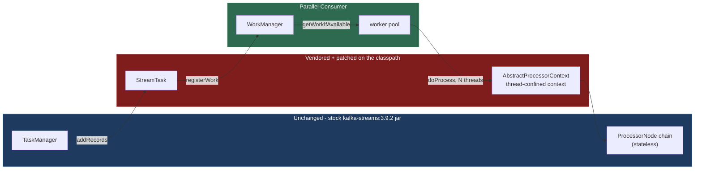
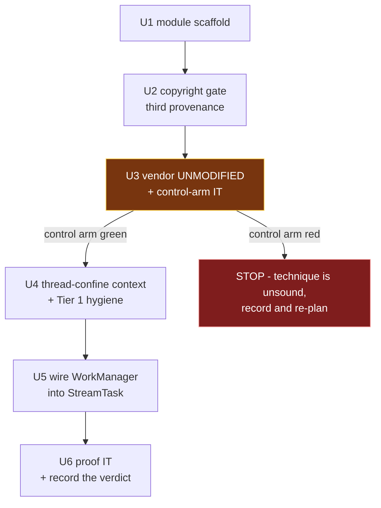

# feat: spike - can PC's work-shard manager drive a Kafka Streams processor chain?

## Product Contract

### Summary

Answer one question with running code: can Parallel Consumer's `WorkManager` feed and execute a Kafka
Streams processor chain, instead of the serial `PartitionGroup.nextRecord()` -> `StreamTask.process()`
loop? The spike proves or disproves the seam. It is not a feature, and it is not merged into the
product.

### Problem Frame

`docs/plans/2026-08-07-002-investigate-kafka-streams-on-pc-report.md` established that swapping
Kafka Streams' client for a PC-backed one gains nothing (Streams serialises *above* the consumer), and
that cutting the seam one layer lower is viable with a bounded diff. It ranked that diff into tiers and
identified **one load-bearing change**: `AbstractProcessorContext.recordContext` / `currentNode` are a
single mutable slot per task, read ambiently by every store wrapper.

That is analysis, not evidence. Nothing has been run. The purpose here is to convert the report's
central claim from "should work" into "does work" or "does not work, and here is where it broke" -
before anyone invests in the build-time tagging pass, offset ownership, or a maintained fork.

### Requirements

| ID | Requirement |
|---|---|
| R1 | A Kafka Streams topology runs with its records selected by PC's `WorkManager` rather than `PartitionGroup.nextRecord()`. |
| R2 | The processor chain executes on more than one thread, with more than one record demonstrably in flight at once. |
| R3 | Output is correct: for the same input, the PC-driven topology produces the same records as stock Kafka Streams. |
| R4 | A control arm exists proving the vendoring technique itself is behaviour-neutral before any patch is applied. |
| R5 | The run's outcome - including failure - is recorded durably with enough detail that the next person does not repeat it. |
| R6 | Nothing in the spike is published to Maven Central or changes the behaviour of any shipped module. |
| R7 | The repo's CI gates pass without being bypassed or weakened. |

### Scope Boundaries

**In scope:** the mechanical concurrency hygiene the report calls Tier 1, thread-confining the per-task
record context, and enough wiring to get records from `WorkManager` into the processor chain.

**Non-goals (this spike):**
- The build-time parallel-safe reachability pass in `InternalTopologyBuilder` (report §4.9).
- Moving committable-offset ownership to PC (report §4.6).
- Stateful topologies, state stores, and therefore the caching layer and RocksDB entirely.
- Punctuators, windowed operators, joins, EOS.
- Throughput measurement. "Faster" is not the question; "runs at all" is.
- Merging any of this into the product. The spike branch is kept, not landed.

#### Deferred to Follow-Up Work
- Everything the report ranks Tier 2 beyond the thread-confinement, and all of Tier 3.
- Upstreaming the copyright-gate provenance change as its own PR if the spike is abandoned (U2 is
  independently useful - see KTD4).

---

## Planning Contract

### Key Technical Decisions

**KTD1. Classpath shadowing, not a Kafka fork.** Copy the target classes from the `3.9.2` tag into the
spike module at `org.apache.kafka.streams.processor.internals`, and depend on **stock**
`kafka-streams:3.9.2`. The copied class wins on classpath precedence; its siblings load from the jar;
same runtime package and classloader, so package-private access works.
*Verified empirically during planning*, not inferred: a real 3.9 `StateDirectory.java` copy loaded from
`target/classes` while `StreamThread` loaded from the jar, `same runtime package: true`. Neither
`kafka-streams` nor `kafka-clients` 3.9.2 ships a `module-info.class` or `Automatic-Module-Name`, so
nothing blocks it.
*Rejected:* forking and publishing Kafka. It works (`-PskipSigning=true -Pversion=3.9.2-pcspike
:streams:publishToMavenLocal`), but costs a clone, a ~3 minute cold build, a `build.gradle` edit to get
iteration under 20s, and a `dependencyManagement` pin to stop the forked POM dragging in a
`kafka-clients:3.9.2-pcspike` that was never published. All of that plumbing evaporates under KTD1.
*Reversal noted:* an earlier default in this session chose the fork on the reasoning that vendoring
"wouldn't prove integration". That reasoning was wrong - the vendored class integrates with the real
runtime.

**KTD2. Target Kafka 3.9.2.** It matches the repo's `kafka.version`, so the spike composes with the
existing build and test harness unchanged.
*Rejected:* trunk/4.x. `docs/inflight/pr-53-java-baseline-kafka4.md` records Kafka 4 as unstarted, and
its compat job is `if: false` at `.github/workflows/maven.yml:170` because the 4.x build currently
fails. 3.9 also already ships `SynchronizedPartitionGroup` (report §4.3), which is a head start. The
cost is that trunk differs materially - `ProcessorContextImpl` is `final` there and the record context
is mutated in place - so a green spike on 3.9 does not transfer unexamined. Recorded as a risk.

**KTD3. Stateless proof topology.** `stream -> mapValues -> to`. This removes state stores, the caching
layer, and RocksDB from the spike entirely - and with them the unverified RocksDB JNI concurrency
question the report flags in §9.
*Rejected:* a stateful topology. It would need `withCachingDisabled()`, which is outside the scoped
tier, and would make a failure ambiguous between the seam and the store stack.

**KTD4. Extend the copyright gate; do not skip it.** `bin/check-copyright-headers.sh` models two
provenances - upstream-Confluent-derived and fork-original - and a fork-original file is *required* to
carry the fork header and *forbidden* from naming another copyright holder. A vendored ASF file fits
neither. Add a third class for third-party Apache-licensed sources that retains the ASF header and is
registered by path.
*Rejected:* `-Dcopyright.skip=true`. That bypasses a CI gate rather than teaching it a real case. The
gap is pre-existing and independently worth closing - the investigation hit exactly this with
confluentinc#390's `Consumed.java`/`Produced.java` (report §2.4), so U2 has value even if the spike is
abandoned.

**KTD5. Control arm before any patch.** Vendor the classes *unmodified* first and prove the topology
still behaves identically. Only then patch.
*Rejected:* vendoring and patching in one step. If the first run fails you cannot tell whether the
technique or the change broke it, and the spike's whole output is a trustworthy verdict.

**KTD6. A top-level module that explicitly skips publishing.** New module
`parallel-consumer-streams-spike`, with `maven.deploy.skip`, `maven.install.skip`, `gpg.skip` and
`central-publishing-maven-plugin.skipPublishing` set true, copied from
`parallel-consumer-examples/pom.xml:29-49`.
*Rejected:* putting it under `parallel-consumer-examples`, which would inherit those skips for free.
A spike is not an example, and inheriting the skip by accident of location is less legible than four
explicit lines. Satisfies R6.

**KTD7. At-least-once, not EOS.** Keeps `StreamsProducer` out of the diff entirely - its
`transactionInFlight` check-then-act and the thread-scoped transaction are real problems (report §4.8)
but not this spike's question.

### Assumptions

- Kafka Streams 3.9 ships Java 11 bytecode, so the spike module needs `<release.target>11</release.target>`
  or higher to compile against it. The Jabel `--release 8` default is inherited by every module;
  `parallel-consumer-mutiny/pom.xml:18-38` is the in-repo precedent for a one-line module-local override.
  Confirm the exact class-file version at U1 rather than assuming 11.
- `slf4j-api` and `jackson-databind` are `runtime` scope in the `kafka-streams` POM, so vendored
  internals will not compile until both are added at compile scope in the spike module.

---

## High-Level Technical Design

The spike replaces one edge in Kafka Streams' record path and leaves the rest intact:

The two red boxes are the entire surface area. `TaskManager` above and the processor chain below are
the stock jar's classes, unmodified — which is what makes a green result meaningful.

Sequencing of the units, and why the control arm gates everything:

---

## Implementation Units

### U1. Spike module scaffold

**Goal:** A new module that compiles, depends on stock Kafka Streams, never publishes, and can host
classes in Kafka's own package.

**Requirements:** R6, R7

**Dependencies:** none

**Files:**
- `pom.xml` (modify - add to `<modules>`)
- `parallel-consumer-streams-spike/pom.xml` (create)
- `parallel-consumer-streams-spike/src/test/java/io/confluent/parallelconsumer/streamsspike/TestConventionsArchTest.java` (create)
- `parallel-consumer-streams-spike/src/test/resources/logback-test.xml` (create)

**Approach:**

1. Add the module to the root `<modules>` list (`pom.xml:35-41`).
2. Parent is `bz.stub.parallelconsumer:parallel-consumer-parent`. Set the four publish-skip properties
   per KTD6, copying the shape from `parallel-consumer-examples/pom.xml:29-49`.
3. Determine the class-file version of `kafka-streams:3.9.2` and set `<release.target>` accordingly -
   see Assumptions. Follow the module-local override precedent in `parallel-consumer-mutiny/pom.xml:18-38`,
   including a comment saying why, since that file's comment explicitly warns that `release` constrains
   the platform API but not classpath bytecode.
4. Dependencies: `parallel-consumer-core` (compile), `org.apache.kafka:kafka-streams` at
   `${kafka.version}` (compile), and **`slf4j-api` plus `jackson-databind` at compile scope** - they are
   `runtime` scope in the Streams POM and vendored internals will not compile without them. Test scope:
   `parallel-consumer-core` with `<classifier>tests</classifier>`, plus `testcontainers`,
   `testcontainers:junit-jupiter`, `testcontainers:kafka`, and `awaitility` re-declared, because
   test-scope dependencies are not transitive. Mirror
   `parallel-consumer-examples/parallel-consumer-example-streams/pom.xml:41-63`.
5. Add the conventions test, matching the four-line shape of
   `parallel-consumer-examples/parallel-consumer-example-streams/src/test/java/io/confluent/parallelconsumer/examples/streams/TestConventionsArchTest.java`.

**Patterns to follow:** `parallel-consumer-examples/parallel-consumer-example-streams/pom.xml` for the
Streams + core-test-jar + testcontainers dependency set; `parallel-consumer-mutiny/pom.xml` for the
`release.target` override.

**Test scenarios:** `Test expectation: none` - scaffolding with no behaviour. U3's control arm is the
first real test.

**Verification:** `./mvnw -pl parallel-consumer-streams-spike -am install` succeeds; the module produces
no artifact in `~/.m2` beyond the reactor's own build output; `bin/ci-unit-test.sh` still passes.

---

### U2. Teach the copyright gate about vendored Apache sources

**Goal:** A third provenance class so ASF-licensed third-party files can live in the tree with their
own header, without weakening the rules for the other two classes.

**Requirements:** R7

**Dependencies:** U1

**Files:**
- `bin/check-copyright-headers.sh` (modify)
- `bin/test-check-copyright-headers.sh` (modify)
- `AGENTS.md` (modify - the Code Style section documents the header rules)

**Approach:**

1. Add a registry list alongside the existing `RENAMED_FROM_UPSTREAM` / `EXTRACTED_FROM_UPSTREAM` -
   name it for what it holds (third-party Apache-licensed sources vendored verbatim), keyed by path.
2. A registered file must retain the ASF header and must **not** be required to carry the fork
   copyright line. An unregistered file keeps today's behaviour exactly - this is additive.
3. A registered path that does *not* carry an Apache header should fail, so the list cannot be used as
   a blanket escape hatch.
4. Extend the script's own test file with cases for: registered + ASF header (pass), registered +
   missing ASF header (fail), unregistered + ASF header (fail, as today), and confirm the existing
   fork-original and upstream-derived cases still behave.
5. Update the header-rules description in `AGENTS.md` so the third case is documented where the other
   two are.

**Execution note:** Extend `bin/test-check-copyright-headers.sh` first and watch the new cases fail
before changing the script - the gate is CI-enforced and a false pass here is invisible.

**Patterns to follow:** the existing `RENAMED_FROM_UPSTREAM` / `EXTRACTED_FROM_UPSTREAM` handling in
`bin/check-copyright-headers.sh` (the branch structure around lines 125-152).

**Test scenarios:**
- A path in the new registry carrying the full ASF header passes.
- A path in the new registry with no ASF header fails, naming the file.
- A file carrying an ASF header that is *not* registered still fails, exactly as today.
- An unregistered fork-original file missing the fork header still fails (no regression).
- An unregistered fork-original file claiming Confluent copyright still fails (no regression).
- An upstream-derived file that has diverged still requires its `Modifications Copyright` line.

**Verification:** `bin/test-check-copyright-headers.sh` passes with the new cases; running
`bin/check-copyright-headers.sh` over the tree is green with U3's vendored files registered.

---

### U3. Vendor the Kafka classes unmodified, and prove it changes nothing

**Goal:** Establish the control arm. The vendoring technique must be behaviour-neutral before any patch
is applied, or a later failure cannot be attributed.

**Requirements:** R4, R7

**Dependencies:** U1, U2

**Files:**
- `parallel-consumer-streams-spike/src/main/java/org/apache/kafka/streams/processor/internals/` (create - vendored classes)
- `parallel-consumer-streams-spike/src/test/java/io/confluent/parallelconsumer/streamsspike/integrationTests/ShadowedStreamsControlTest.java` (create)
- `bin/check-copyright-headers.sh` (modify - register the vendored paths)

**Approach:**

1. Identify the minimal class set. Start from `StreamTask` and `AbstractProcessorContext`; add only what
   the compiler demands. Resist vendoring transitively - each added class widens the surface that must
   stay in sync with the jar.
2. Copy each **verbatim from the `3.9.2` tag**, not from trunk or a branch tip. Binary drift between a
   copied class and its jar siblings surfaces as `NoSuchMethodError` at runtime with nothing warning you
   at compile time. Record the exact tag in a comment.
3. Register each vendored path in U2's registry.
4. Write the control-arm integration test: run a stateless topology through **stock** `KafkaStreams`
   with the vendored-but-unmodified classes on the classpath, and assert output correctness. Assert
   explicitly that the vendored class is the one loaded - the technique is silent when it fails, and a
   test that passes because the jar's copy won proves nothing.

**Execution note:** This unit's value is entirely in the control arm. If the vendored-unmodified run
does not behave identically to stock, stop and re-plan rather than proceeding to U4 - the technique is
unsound and every later result would be uninterpretable.

**Patterns to follow:**
`parallel-consumer-examples/parallel-consumer-example-streams/src/test/java/io/confluent/parallelconsumer/examples/streams/integrationTests/StreamsAppTest.java`
for the broker-backed Streams test shape.

**Test scenarios:**
- The vendored `StreamTask` (not the jar's) is the class actually loaded at runtime - assert on its
  code source.
- A vendored class and a jar-resident sibling report the same runtime package.
- A stateless topology over N records produces exactly the expected N output records, in per-key order.
- Records with distinct keys all appear in the output; no drops, no duplicates.
- The test fails loudly if the classpath ordering is such that the jar's copy wins - not silently passes.

**Verification:** The control-arm test is green, and its class-source assertion proves the vendored copy
is live. `bin/check-copyright-headers.sh` passes with the vendored files present.

---

### U4. Thread-confine the record context, and the Tier 1 hygiene

**Goal:** Make the per-task mutable state safe for concurrent execution - the report's single
load-bearing change, plus the mechanical fixes that accompany it.

**Requirements:** R2 (prerequisite), R7

**Dependencies:** U3 (control arm green)

**Files:**
- `parallel-consumer-streams-spike/src/main/java/org/apache/kafka/streams/processor/internals/AbstractProcessorContext.java` (modify)
- `parallel-consumer-streams-spike/src/main/java/org/apache/kafka/streams/processor/internals/StreamTask.java` (modify)
- `parallel-consumer-streams-spike/src/main/java/org/apache/kafka/streams/processor/internals/RecordCollectorImpl.java` (modify, if vendored)
- `parallel-consumer-streams-spike/src/test/java/io/confluent/parallelconsumer/streamsspike/ProcessorContextConfinementTest.java` (create)

**Approach:**

1. Thread-confine `recordContext` and `currentNode` in `AbstractProcessorContext`. The save/restore
   stack discipline in `ProcessorContextImpl.forward` must still work per thread - it relies on reading
   back what it wrote, which thread-locals preserve.
2. `StreamTask`: allocate `recordInfo` per record rather than reusing the single instance (it is read
   *after* processing, so reuse is a live hazard once dispatch is concurrent); make `consumedOffsets` and
   `partitionsToResume` concurrent; `commitNeeded` volatile.
3. `RecordCollectorImpl`, if the class set includes it: `offsets` and `producedSensorByTopic` to
   concurrent maps. Note these are already mutated from the producer callback thread today and read from
   the StreamThread - the existing code is safe only because the read follows a flush.
4. Leave `StreamsProducer` alone per KTD7, and RocksDB alone per KTD3.

**Execution note:** Re-run U3's control-arm test after this unit and before U5. It should still be green
- these changes are meant to be behaviour-preserving under single-threaded execution, and a regression
here is much cheaper to find now than after the dispatch change lands.

**Test scenarios:**
- Two threads setting different record contexts on the same context instance each read back their own.
- A thread that sets a context, forwards through a nested node, and returns sees its original context
  restored (the save/restore stack still works per thread).
- A thread reading the context before ever setting one gets a null/absent value rather than another
  thread's leftover.
- The control-arm topology from U3 still produces identical output after these changes.
- Two concurrent `recordInfo` consumers do not observe each other's partition or node.

**Verification:** The confinement unit test passes, and U3's control arm is still green.

---

### U5. Wire PC's WorkManager into StreamTask

**Goal:** Records reach the processor chain via `WorkManager.getWorkIfAvailable()` and execute on a
worker pool, not via `partitionGroup.nextRecord()` on the StreamThread.

**Requirements:** R1, R2

**Dependencies:** U4

**Files:**
- `parallel-consumer-streams-spike/src/main/java/org/apache/kafka/streams/processor/internals/StreamTask.java` (modify)
- `parallel-consumer-streams-spike/src/main/java/io/confluent/parallelconsumer/streamsspike/` (create - the bridge and its worker pool)

**Approach:**

1. On `addRecords`, register the records with a `WorkManager` in addition to (initially, not instead of)
   the existing partition-group path, so the two can be compared.
2. Replace the selection step in `process()` with a pull from `getWorkIfAvailable(int)`, and dispatch
   each `WorkContainer` to a worker pool that runs the existing `doProcess` path.
3. Report completion back through `onSuccessResult` / `onFailureResult` so PC's shard invariant holds -
   under KEY ordering a shard hands out at most one in-flight record at a time
   (`parallel-consumer-core/src/main/java/io/confluent/parallelconsumer/state/ProcessingShard.java:149-154`),
   which is what keeps per-key execution serial without any additional machinery.
4. Leave offset commit on the stock path for now - moving committable-offset ownership to PC is
   explicitly deferred (Scope Boundaries). Accept that the spike commits optimistically; note it in U6's
   write-up rather than fixing it.

**Execution note:** The interesting failures here are silent, not loud. Expect to need logging or
instrumentation that proves records actually travelled the new path - a topology that still works
because it quietly fell back to `nextRecord()` is the most likely false positive.

**Technical design (directional, not specification):** the seam is the two-call shape already sketched
in the High-Level Technical Design - `registerWork` on the way in, `getWorkIfAvailable` plus a
completion callback on the way out. `WorkManager`'s existing surface
(`parallel-consumer-core/src/main/java/io/confluent/parallelconsumer/state/WorkManager.java`) is the
integration point; no new PC API should be needed, and needing one is itself a finding worth recording.

**Test scenarios:**
- Records demonstrably travel the WorkManager path - assert on a counter or marker incremented only by
  the new dispatch, not merely on output correctness.
- With a pool of N > 1 and a deliberately slow processor, more than one record is in flight
  simultaneously.
- Two records sharing a key are never in flight concurrently, under KEY ordering.
- Records with distinct keys do run concurrently.
- A processor that throws routes through `onFailureResult` and does not wedge the task.

**Verification:** The proof that dispatch happened is an assertion, not an inference from output; and
concurrency is observed, not assumed.

---

### U6. The proof, and the write-up

**Goal:** Answer the question, and record the answer where the next person will find it.

**Requirements:** R2, R3, R5

**Dependencies:** U5

**Files:**
- `parallel-consumer-streams-spike/src/test/java/io/confluent/parallelconsumer/streamsspike/integrationTests/PcDrivenStreamsProofTest.java` (create)
- `docs/plans/2026-08-08-002-ks-on-pc-spike-result.md` (create)
- `docs/plans/2026-08-07-002-investigate-kafka-streams-on-pc-report.md` (modify - link the result)

**Approach:**

1. The proof test runs the same stateless topology twice against a real broker: once stock, once
   PC-driven. Assert output equality, and assert observed concurrency.
2. Write the result document covering: the verdict, what was actually run, what broke and how it was
   diagnosed, which of the report's §4 claims held and which did not, and what the next increment would
   be. **A negative result is a successful spike** and must be written up with the same care as a
   positive one.
3. Add a line to the investigation report pointing at the result, so the analysis and its outcome are
   linked in both directions.
4. Record the honest caveats: 3.9-only (KTD2 notes trunk differs materially), stateless-only, commits
   optimistically because offset ownership was deferred, and vendored classes are pinned to a tag and
   will drift.

**Execution note:** Report the reproduction rate and conditions, not just a verdict - "passed once" and
"passed 50 times under load" are different findings, and the difference matters for whether anyone
should build on this.

**Test scenarios:**
- Stock and PC-driven runs over identical input produce identical output records.
- Per-key ordering is preserved end to end in the PC-driven run.
- Concurrency is observed - at least two records in flight at once with a slow processor.
- The run is repeatable: the proof holds across repeated executions, not just once.
- No records lost and none duplicated across the run.

**Verification:** The verdict is stated plainly in the result document with its evidence, and the
reproduction rate is recorded.

---

## Verification Contract

1. `bin/ci-unit-test.sh` passes.
2. `bin/ci-integration-test.sh` passes (requires Docker).
3. `bin/check-copyright-headers.sh` passes with the vendored files present, and
   `bin/test-check-copyright-headers.sh` covers the new provenance class.
4. `.github/scripts/issue-ref-gate.test.js` exits 0, and no added line carries an unqualified sub-1000
   issue reference.
5. No artifact from `parallel-consumer-streams-spike` is installed or deployed (R6).
6. U3's control arm is green before U4 begins, and still green after it.

---

## Risks & Dependencies

| Risk | Mitigation |
|---|---|
| A green spike on 3.9 does not transfer to trunk, where `ProcessorContextImpl` is `final` and the record context is mutated in place on every send. | KTD2 records it; U6 must state the limitation rather than let a green result imply more than it shows. |
| Vendored classes drift from the jar silently, surfacing as `NoSuchMethodError` at runtime. | Copy from the exact `3.9.2` tag and record it in-file (U3). The version is pinned by `${kafka.version}`, so drift requires a deliberate bump. |
| A false positive: the topology works because it quietly used the stock path. | U5's test scenarios assert on a dispatch marker, not on output alone. U3 asserts the vendored class is the one loaded. |
| The minimal vendored class set grows until it is effectively a fork. | U3 adds classes only as the compiler demands, and treats growth as a finding. If it sprawls, that is itself an answer about the seam's cost. |
| The copyright-gate change is mistaken for a way to vendor anything. | U2 makes a registered file *fail* if it lacks an ASF header, so the list cannot act as a blanket escape hatch. |
| Optimistic commit means the spike is not crash-safe. | Deliberate and in Scope Boundaries; U6 records it. The spike is not a product. |

---

## Definition of Done

- The question in the Summary has an answer, positive or negative, backed by a test that runs.
- `docs/plans/2026-08-08-002-ks-on-pc-spike-result.md` records the verdict, the evidence, the
  reproduction rate, and the caveats.
- The Verification Contract passes in full.
- No shipped module's behaviour changed, and nothing new publishes.
- The branch is pushed for the record. Whether it merges is a separate decision - the spike's output is
  the answer, not the code.
