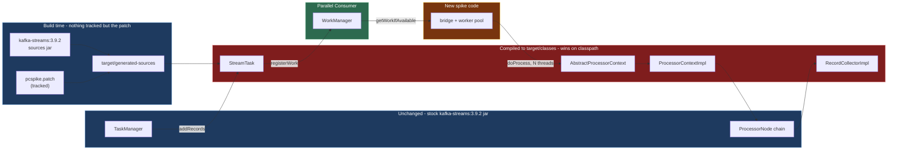
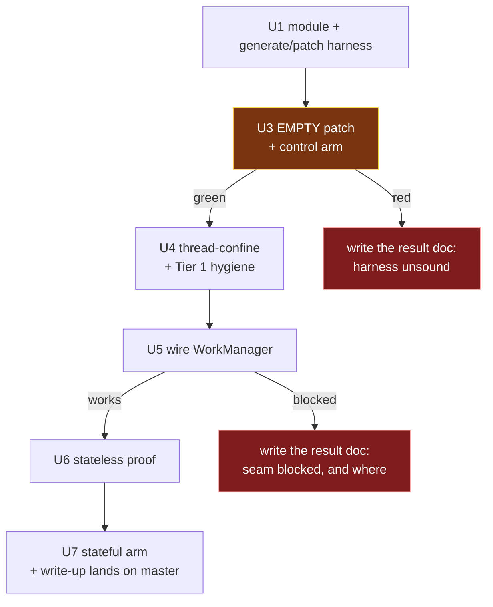

# feat: spike - can PC's work-shard manager drive a Kafka Streams processor chain?

## Product Contract

### Summary

Answer one question with running code: can Parallel Consumer's `WorkManager` feed and execute a Kafka
Streams processor chain, instead of the serial `PartitionGroup.nextRecord()` -> `StreamTask.process()`
loop? Report what it cost, as a patch. The spike proves or disproves the seam; it is not a feature.

**No Apache Kafka source enters this repository.** The patched classes are generated at build time from
the published sources jar and a tracked patch file - see KTD1.

### Problem Frame

`docs/plans/2026-08-07-002-investigate-kafka-streams-on-pc-report.md` **argues**, on evidence cited in
its §3.2 and §4, that swapping Kafka Streams' client for a PC-backed one gains nothing (Streams
serialises *above* the consumer) and that cutting the seam one layer lower is viable with a bounded
diff. It identifies **one load-bearing change**: `AbstractProcessorContext.recordContext` /
`currentNode` are a single mutable slot per task, read ambiently by every store wrapper.

That is analysis, not evidence. Nothing has been run. This spike converts the claim into "does work" or
"does not work, and here is where it broke" - and into a measured cost - before anyone invests in the
build-time tagging pass, offset ownership, or a maintained fork.

**The route itself remains an open decision.** See KTD0: cutting the seam inside `processor/internals`
is a selection from the report's own taxonomy made during planning, not a decision the user made. The
spike is designed so a red or ambiguous result sends the question back to the alternatives.

### Requirements

| ID | Requirement |
|---|---|
| R1 | A Kafka Streams topology runs with its records selected by PC's `WorkManager` rather than `PartitionGroup.nextRecord()`. |
| R2 | The processor chain executes concurrently: with a worker pool of at least 4 and a deliberately slow processor, at least 3 records are demonstrably in flight at once. |
| R3 | Output is correct against a stock Kafka Streams baseline: multiset equality across the whole run, and sequence equality within each key. |
| R4 | A control arm exists proving the generate-and-patch harness is behaviour-neutral before any patch content is applied. |
| R5 | The outcome - including a failure or an early stop - is recorded durably **on master**, with enough detail that the next person does not repeat it. |
| R6 | The spike module publishes to Maven Central as an **alpha/experimental artifact**, clearly labelled as such, with its seam **on by default** and a documented way to turn it off - and changes the behaviour of no **other** module. *(Reversed twice in revision; see KTD-S5 and KTD-S6. It previously read "nothing in the spike is published", and then "with its seam off by default".)* |
| R7 | No Apache Kafka source is committed to this repository. The CI gates pass without being bypassed or weakened. |
| R8 | The spike reports the size and shape of the change set. The patch file is that report: its line count, the classes it touches, and whether any new PC API was required. |
| R9 | The spike exercises at least one code path where the thread-confinement fix is actually load-bearing, so a green result distinguishes "confinement works" from "confinement was never needed here". |

### Scope Boundaries

**In scope:** the report's Tier 1 mechanical concurrency hygiene *minus* its `StreamsProducer` items
(excluded by KTD7) and its `RocksDBStore` items (excluded by KTD3); thread-confining the per-task
record context; enough wiring to get records from `WorkManager` into the processor chain; and one
minimal stateful arm (U7) so the result can discriminate.

**Non-goals (this spike):**
- The build-time parallel-safe reachability pass in `InternalTopologyBuilder` (report §4.9).
- Moving committable-offset ownership to PC (report §4.6).
- Windowed operators, joins, suppression, punctuators, EOS, standby/restore.
- Caching-enabled state, and therefore the cache-layer concurrency problems entirely.
- Throughput measurement. "Faster" is not the question.
- The Web GUI stretch goal on astubbs#255 - it needs the parallel-safe tagging pass.

**Ships as alpha.** The module lands on master and publishes as an alpha/experimental artifact alongside
release 0.6.0.0, with its seam **on by default** (KTD-S6 - depending on the artifact is the opt-in) and
its known gaps tracked in [Current Shortcomings](#current-shortcomings), which
`parallel-consumer-streams-spike/README.md` points at rather than duplicating. Maturity is per-module,
not global. This reverses an earlier
non-goal ("merging the spike code into the product; the spike branch is kept, not landed") - see KTD-S5.
The result documents land in the same PR as the code (R5).

#### Deferred to Follow-Up Work
- Everything the report ranks Tier 2 beyond the thread-confinement, and all of Tier 3.
- Whatever U6/U7 name as the next experiment.

---

## Planning Contract

### Key Technical Decisions

The decisions below carrying a `session-settled:` annotation were closed by the user in conversation and
are not to be re-opened. **Everything else here, including KTD0, was chosen during planning.** A
later reviewer should challenge the unannotated ones freely.

**KTD-S1. The question is "how little must change to make it work".**
*(session-settled: user-directed - chosen over "is it possible at all": the user rejected the
impossibility framing directly, so feasibility is no longer the open question; cost is.)*
This is why R8 exists, and why KTD1's patch file is the natural unit of measurement.

**KTD-S2. Changing or forking Kafka itself is permissible.**
*(session-settled: user-directed - chosen over treating `processor.internals` being package-private and
unsupported as a blocker.)*
This licenses the approach; it does not mandate a literal fork, and it does **not** license copying
Kafka into this repository - see KTD-S4.

**KTD-S3. Spike posture: find out whether it runs.**
*(session-settled: user-directed - chosen over building toward something shippable.)*

**KTD-S4. No Apache Kafka source is committed to this repository.**
*(session-settled: user-directed - chosen over vendoring the four target classes into a spike module,
which an earlier draft of this plan proposed: the user rejected it outright.)*
This is what makes KTD1 the only remaining question, and it deletes an entire unit of licensing
machinery the vendoring approach required.

**KTD-S5. The module ships, as a published alpha/experimental artifact.**
*(session-settled: user-directed - chosen over keeping it an unmerged throwaway, which is what KTD-S3,
R6 and the Scope Boundaries originally said. The user reversed that decision after the result was in:
maturity is per-module, not global, so an experimental module can publish alongside a stable release
provided it is labelled honestly and is inert unless switched on.)*
Consequences, recorded so nothing silently keeps the old posture: KTD6 is rewritten (it publishes);
R6 is rewritten (it publishes, and must not change any **other** module's behaviour); the "not for merge"
non-goal is deleted; the docs land in the same PR as the code rather than a separate docs-only one; and
Apache Kafka's own 188-test suite moves from an opt-in profile into the module's normal test run, because
a shipped artifact's behaviour-preservation gate should run on every build.
**One obligation the throwaway posture did not have:** the published jar contains *compiled, modified*
Apache Kafka classes, so Apache 2.0 s4(b)/s4(c) now apply to the distribution - `NOTICE` names the four
classes, attributes the ASF, and states that they were changed. KTD-S4 is untouched: still no Apache
source in the repository, only the patch.
This does **not** reverse KTD-S3's *posture* - the code is still an experiment and says so on the tin. It
reverses only what happens to the artifact.

**KTD0. Cut the seam inside `processor/internals`.** Drive the processor chain from PC's `WorkManager`
rather than supplying a PC-backed client or building a PC-native API.
*This is an agent selection from the origin report's taxonomy, not a user decision.*
*Rejected:* **swapping the client via `KafkaClientSupplier`** - report §3.2 argues Streams serialises
above the consumer, so the swap gains nothing; evidence grade: source-cited analysis, not run.
*Rejected:* **a PC-native Streams-like DSL** - report §5 ranks it below this route *solely* because
this route inherits state stores for free; a stateless-only spike would not test that ranking, which is
why U7 exists.
*Rejected:* **the shipped topic-hop** - report §6.4; it already works, so the only reason to move is to
remove the hop's latency and operational cost.
*Return path:* if U3, U5 or U6 goes red, U6's write-up must state which alternative the result sends
the question back to.

**KTD1. Generate the patched classes at build time; track only the patch.** In `generate-sources`,
unpack the four target classes from `org.apache.kafka:kafka-streams:3.9.2` with classifier `sources`,
apply a tracked patch file, and add the output to the compile source roots. The compiled result lands
in `target/classes`, which precedes the jar on the classpath, so the patched classes win while their
siblings load from the jar - same runtime package, same classloader, package-private access intact.

*Verified end to end during planning:* the sources jar is on Central (HTTP 200) and contains all four
classes; `diff -ru` produces a patch and `patch -p1 --dry-run` re-applies it cleanly to a fresh extract.
The three plugins needed - `maven-dependency-plugin:unpack`, `exec-maven-plugin`,
`build-helper-maven-plugin:add-source` - are all already in this build.

*Rejected:* **vendoring the classes into the repo** (KTD-S4). It would have required a new copyright-gate
provenance class and a `NOTICE` change - a whole unit of machinery to make committing ~110KB of ASF
source legal and CI-clean. (Under KTD-S5 the `NOTICE` change became necessary anyway, because the
published jar distributes the *compiled* modified classes. The copyright-gate machinery did not: the gate
only scans tracked `.java` files, and there still are none.)
*Rejected:* **forking and publishing Kafka locally.** It works, but a locally-published version is
**unresolvable on a CI runner**, so the branch could never go green; it also costs a clone, a ~3 minute
cold build, and a `dependencyManagement` pin to stop the forked POM dragging in an unpublished
`kafka-clients`.
*Rejected:* **a git submodule of apache/kafka** - a very large repo to carry, still puts AK content in
the working tree, and submodules are a persistent friction tax for a throwaway experiment.

*Why this is better than vendoring, beyond the licensing:* the patch file **is** R8's answer - "how
little did we change" becomes `wc -l`. And drift fails loudly: a vendored copy drifts silently into
`NoSuchMethodError` at runtime, whereas a patch that no longer applies breaks the build the moment
`kafka.version` moves.

*Cost, stated honestly:* iteration is worse than editing files directly. U3 must provide a regeneration
path (edit the generated sources in `target/`, re-derive the patch) or the spike will be painful to work
on.

**KTD2. Target Kafka 3.9.2.** Matches the repo's `kafka.version`, so the sources jar and the binary jar
are the same version by construction. `docs/inflight/pr-53-java-baseline-kafka4.md` records Kafka 4 as
unstarted, and its compat job is `if: false` at `.github/workflows/maven.yml:170` because the 4.x build
currently fails.
*Rejected:* trunk/4.x. Trunk differs materially - `ProcessorContextImpl` is `final` there and the record
context is mutated in place - so a green spike on 3.9 does not transfer unexamined. Recorded as a risk.

**KTD3. Stateless first, then one non-windowed aggregation.** U6 proves the seam on
`stream -> mapValues -> to`. U7 adds a `count`/`reduce` over a KV store built `withCachingDisabled()`.
*Why both:* a stateless topology instantiates none of the store wrappers
(`ChangeLoggingKeyValueBytesStore`, `CachingKeyValueStore`, `StoreQueryUtils`, `MeteredKeyValueStore`)
that make the record context load-bearing - so a stateless-only green result cannot distinguish
"confinement works" from "confinement was never needed here" (R9), nor test the property on which KTD0
ranks this route above a PC-native DSL.
*Correction:* an earlier draft rejected a stateful arm because `withCachingDisabled()` was "outside the
scoped tier". Wrong - it is public DSL API the **topology author** calls, needing no additional patched
class.
*Still rejected:* windowed operators, joins and suppression - they change semantics under out-of-order
processing, which would make a failure ambiguous.

**KTD6. A top-level module that publishes, as an alpha/experimental artifact.** New module
`parallel-consumer-streams-spike`, publishing like any other module - no publish-skip properties, no
`central-publishing-maven-plugin` `<skipPublishing>` block - with its alpha status carried in the pom
`<name>`/`<description>` and in `parallel-consumer-streams-spike/README.md`.
*(This decision originally continued "and its seam off by default so the artifact is inert unless a user
opts in" - reversed by KTD-S6: taking the dependency **is** the opt-in.)*
*Reversal, recorded rather than quietly edited (KTD-S5):* this decision originally read "a top-level
module that explicitly skips publishing", carrying the three publish-skip **properties**
(`maven.deploy.skip`, `maven.install.skip`, `gpg.skip`) **plus** a `<build><plugins>` block setting
`<skipPublishing>true</skipPublishing>` - because there is no
`central-publishing-maven-plugin.skipPublishing` property (the plugin exposes only an unqualified
`${skipPublishing}` expression), so a properties-only copy would have protected nothing. That machinery
is now removed. The note about `skipPublishing` being plugin *configuration* rather than a property is
kept here because it is still true and still a trap for the modules that **do** skip.
*Still relevant:* the module stays ordered **before** `parallel-consumer-examples` in `<modules>`.
That ordering was originally about the spike's own skip; it still matters because `examples` is the
skipPublishing module and the recorded plugin bug is about a skipPublishing module being **last**.
*Rejected:* placing it under `parallel-consumer-examples`. It is not an example, and being there would
now actively suppress its publication.

**KTD-S6. The dispatch seam defaults ON. Depending on the artifact is the opt-in.**
*(session-settled: user-directed - reverses KTD8's "defaulting to stock" and the off-by-default posture
in KTD6, R6 and the Risks table.)*
Nobody puts a separate, loudly-labelled alpha artifact called `parallel-consumer-streams-spike` on their
classpath by accident. Having done so deliberately, they wanted the PC seam; requiring them to *also*
set `-Dpc.streams.spike.dispatch.enabled=true` is a second opt-in that buys nothing and costs every user
a support question. The property survives as the way to turn the seam **off**
(`-Dpc.streams.spike.dispatch.enabled=false`), which is what an A/B comparison needs anyway.
*What the old default was actually paying for:* keeping U3's control arm stock without it having to say
so. That is a **test** concern, and tests can state their requirement explicitly - so they now do, at
each site, with a comment saying why. The Kafka upstream-test surefire execution sets the property to
`false` on the execution itself rather than inheriting any default, because its 188/188 is a
behaviour-preservation claim that is only true with the seam off.
*Consequence, accepted:* a control arm that forgets to disable the seam is now wrong rather than right by
accident. `PcDispatchSwitch.resetToDefault()` exists so test teardown hands the JVM back at the
artifact's default instead of parking it wherever the last test left it, and a bad value for the
property fails loudly rather than being read as "off" - a typo in the one property whose job is to
disable the seam would otherwise produce a run that looks like a control and is not.

**KTD7. At-least-once, not EOS.** Keeps `StreamsProducer` out of the patch entirely.

**KTD8. Single record path, switched - never both at once.** `addRecords` feeds `WorkManager`
*instead of* `partitionGroup.addRawRecords`, with a bridge flag selecting stock or PC dispatch.
*(Originally "defaulting to stock"; reversed by KTD-S6 - the flag now defaults to PC dispatch. The
single-path property is unaffected: it is a switch either way, never a fan-out.)*
*Rejected:* registering into both paths "so they can be compared". Nothing would drain the partition
group, `StreamTask.addRecords` pauses a partition once its buffer fills, and the run would stall with
the consumer paused and no error. `streamTime` would also never advance, since it advances at selection.

### Assumptions

- **Corrected from an earlier draft:** `kafka-streams:3.9.2` ships class-file **major 52 (Java 8)** -
  verified against the jar in `~/.m2`. The spike module inherits the project-wide
  `<release.target>8</release.target>` with **no module-local override**.
- `slf4j-api` and `jackson-databind` are `runtime` scope in the `kafka-streams` POM, so the generated
  sources will not compile until both are added at compile scope.
- `ParallelConsumerOptions.validate()` requires a `Consumer` instance, but `PCModule`/`WorkManager`
  construction never invokes `validate()`. Whether the bridge passes a mock or the Streams consumer is
  resolved at U5.

---

## High-Level Technical Design

Sequencing, and the two points where a negative result is itself the deliverable:

*(U2 was deleted in revision - it existed only to teach the copyright gate about vendored ASF source,
which KTD-S4 makes unnecessary. The gap in unit numbering is intentional.)*

---

## Implementation Units

### U1. Spike module and the generate-and-patch harness

**Goal:** A module that unpacks four Kafka source files, applies a patch, compiles the result ahead of
the jar, and publishes as an alpha artifact (KTD-S5) - with no Kafka source tracked.

**Requirements:** R6, R7

**Dependencies:** none

**Files:**
- `pom.xml` (modify - add to `<modules>`, **before** `parallel-consumer-examples`)
- `parallel-consumer-streams-spike/pom.xml` (create)
- `parallel-consumer-streams-spike/src/main/patch/pcspike.patch` (create - **empty at this unit**)
- `parallel-consumer-streams-spike/bin/regen-patch.sh` (create)
- `parallel-consumer-streams-spike/.gitignore` (create - exclude the generated tree)
- `parallel-consumer-streams-spike/src/test/java/io/confluent/parallelconsumer/streamsspike/TestConventionsArchTest.java` (create)
- `parallel-consumer-streams-spike/src/test/resources/logback-test.xml` (create)

**Approach:**

1. Add to the root `<modules>` list (`pom.xml:35-41`), before `parallel-consumer-examples` - that pom
   records a central-publishing bug where a skipPublishing module last in reactor order suppressed the
   whole bundle upload.
2. Apply KTD6: **no** publish-skip properties and **no** `central-publishing-maven-plugin`
   `<skipPublishing>` block - the module publishes like any other. Carry the alpha framing in the pom
   `<name>`/`<description>` and in the module README instead. **No `release.target` override** - see
   Assumptions.
3. Wire the harness, all three plugins already used elsewhere in this build:
   - `maven-dependency-plugin:unpack` in `generate-sources`, artifact
     `org.apache.kafka:kafka-streams:${kafka.version}` classifier `sources`, `includes` limited to the
     four target files, output to `target/generated-sources/kafka-patched`.
   - `exec-maven-plugin` applying `src/main/patch/pcspike.patch` with `patch -p1`. Run
     `patch --dry-run` first and fail the build on a rejected hunk - a silently half-applied patch is
     the worst possible failure here.
   - `build-helper-maven-plugin:add-source` adding the generated directory as a compile source root.
4. `regen-patch.sh`: re-derive `pcspike.patch` by diffing a pristine extract against the edited
   generated tree. Without this the spike is painful to iterate on (KTD1's stated cost).
5. Dependencies: `parallel-consumer-core` (compile), `kafka-streams` at `${kafka.version}` (compile),
   `slf4j-api` and `jackson-databind` at **compile** scope. Test scope: `parallel-consumer-core` with
   `<classifier>tests</classifier>`, plus `testcontainers`, `testcontainers:junit-jupiter`,
   `testcontainers:kafka`, `awaitility` re-declared.
6. Add the conventions test, matching the shape used by every other module.

**Test scenarios:** `Test expectation: none` - harness only; U3's control arm is the first real test.

**Verification:** `./mvnw -pl parallel-consumer-streams-spike -am install` succeeds and the
`parallel-consumer-streams-spike` artifact **does** appear under
`~/.m2/repository/bz/stub/parallelconsumer/`; `git status` shows no `.java` file under
`org/apache/kafka/` tracked anywhere; `bin/ci-unit-test.sh` passes.

---

### U3. Empty patch, and prove the harness changes nothing

**Goal:** The control arm. Generating and compiling the four classes with an **empty** patch must be
behaviour-neutral, or nothing later can be attributed.

**Requirements:** R4, R7, R8

**Dependencies:** U1

**Files:**
- `parallel-consumer-streams-spike/src/test/java/io/confluent/parallelconsumer/streamsspike/integrationTests/ShadowedStreamsControlTest.java` (create)

**Approach:**

1. Leave `pcspike.patch` empty. The generated classes are then byte-for-byte the 3.9.2 sources, so any
   behaviour difference is the harness's fault and nothing else's - a cleaner control than vendoring
   could give.
2. **The class set is named, not discovered:** `StreamTask` and `AbstractProcessorContext` are the
   targets; `ProcessorContextImpl` is required because it accesses the confined fields directly (U4);
   `RecordCollectorImpl` is required because its non-concurrent `offsets` and `producedSensorByTopic`
   are mutated from every worker thread through the `to()` sink - and **the compiler will not demand
   it**, since it is constructed outside `StreamTask`.
3. **Stop-threshold:** if compilation demands more than roughly a dozen classes, stop and report the
   sprawl as the answer (R8). Growth past that is evidence the seam is not bounded.
4. Write the control-arm test: a stateless topology through stock `KafkaStreams`, asserting output
   correctness **and** asserting each generated class is the one loaded - the technique is silent when
   it fails, and a test passing because the jar's copy won proves nothing.

**Execution note:** If the empty-patch run does not behave identically, **stop and write
`docs/plans/2026-08-08-002-ks-on-pc-spike-result.md` with the verdict reached** (R5), then re-plan. Do
not proceed to U4.

**Patterns to follow:**
`parallel-consumer-examples/parallel-consumer-example-streams/src/test/java/io/confluent/parallelconsumer/examples/streams/integrationTests/StreamsAppTest.java`.

**Test scenarios:**
- Each generated class (not the jar's) is the one loaded - assert on code source, per class.
- A generated class and a jar-resident sibling report the same runtime package.
- A stateless topology over N records produces exactly N output records, in per-key order.
- Records with distinct keys all appear; no drops, no duplicates.
- The test fails loudly if classpath ordering lets the jar's copy win.
- The build fails if the patch does not apply cleanly - verify by temporarily corrupting a hunk.

**Verification:** The control arm is green and its class-source assertions prove the generated copies
are live.

---

### U4. Thread-confine the record context, and the Tier 1 hygiene

**Goal:** Make the per-task mutable state safe for concurrent execution - the report's single
load-bearing change - including the caller that would otherwise defeat it.

**Requirements:** R2 (prerequisite), R8

**Dependencies:** U3 (control arm green)

**Files:**
- `parallel-consumer-streams-spike/src/main/patch/pcspike.patch` (modify - this is now the only place
  Kafka changes are expressed)
- `parallel-consumer-streams-spike/src/test/java/io/confluent/parallelconsumer/streamsspike/ProcessorContextConfinementTest.java` (create)

**Approach:**

1. **First, route `ProcessorContextImpl`'s direct field access through accessors.** `recordContext` and
   `currentNode` are `protected` fields, and `ProcessorContextImpl` reads and writes `recordContext`
   directly - those `getfield`/`putfield` pairs *are* the save/restore stack in `forward`. An earlier
   draft claimed thread-locals preserve that discipline; that is inverted. Convert those sites to
   `recordContext()` / `setRecordContext()` **before** confining the field.
2. Thread-confine `recordContext` and `currentNode` in `AbstractProcessorContext`.
3. `StreamTask`: allocate `recordInfo` per record rather than reusing the single instance (it is read
   *after* processing); `consumedOffsets` and `partitionsToResume` concurrent; `commitNeeded` volatile;
   `processTimeMs` a `LongAdder`.
4. `RecordCollectorImpl`: `offsets` and `producedSensorByTopic` to concurrent maps.
5. Regenerate the patch via `regen-patch.sh` and commit it. Record its line count - this is R8's running
   total.
6. Leave `StreamsProducer` alone (KTD7) and `RocksDBStore` alone (KTD3).

**Execution note:** Re-run U3's control arm after this unit and before U5 - these changes are meant to
be behaviour-preserving under single-threaded execution, and a regression is far cheaper to find now.

**Test scenarios:**
- The generated `ProcessorContextImpl` is the class actually loaded - assert on code source.
- Two threads setting different record contexts on the same context instance each read back their own.
- A thread that sets a context, forwards through a nested node, and returns sees its original context
  restored - the save/restore stack still works per thread, through the accessors.
- A thread reading the context before setting one gets a null/absent value, not another thread's
  leftover.
- Two concurrent `recordInfo` consumers do not observe each other's partition or node.
- U3's control-arm topology still produces identical output.

**Verification:** The confinement test passes; `ProcessorContextImpl` is proven live; U3's control arm
is still green; `pcspike.patch` applies cleanly from a clean checkout.

---

### U5. Wire PC's WorkManager into StreamTask

**Goal:** Records reach the processor chain via `WorkManager.getWorkIfAvailable()` and execute on a
worker pool, not via `partitionGroup.nextRecord()` on the StreamThread.

**Requirements:** R1, R2, R8

**Dependencies:** U4

**Files:**
- `parallel-consumer-streams-spike/src/main/patch/pcspike.patch` (modify)
- `parallel-consumer-streams-spike/src/main/java/io/confluent/parallelconsumer/streamsspike/` (create - the bridge and its worker pool; **this is fork-original code and lives in the repo normally**)

**Approach:**

1. **Bootstrap PC's partition lifecycle first.** `WorkManager` is a `ConsumerRebalanceListener`, and
   Streams owns the consumer here - so nothing drives PC's assignment lifecycle unless the bridge does.
   Construct the `WorkManager` through `PCModule`, and call `onPartitionsAssigned` for the task's input
   partitions at initialisation (`onPartitionsRevoked` on close). Without this,
   `PartitionStateManager.getPartitionState` returns null and `maybeRegisterNewRecordAsWork`
   dereferences it; separately, `EpochAndRecordsMap` skips any partition whose epoch is null with only
   a `log.warn`, so records are dropped **silently**. Resolve the `Consumer`-instance question from
   Assumptions here.
2. Adapt records via `EpochAndRecordsMap` - `registerWork` takes that, not a record collection.
3. **Single path, switched** (KTD8): `addRecords` feeds `WorkManager` *instead of* the partition group,
   with a bridge flag selecting stock or PC dispatch, **defaulting to stock**. That default is what
   keeps U3's control arm and U6's stock path runnable after this unit lands.
4. Replace the selection step in `process()` with a pull from `getWorkIfAvailable(int)`, dispatching
   each `WorkContainer` to the worker pool running the existing `doProcess` path.
5. Report completion through `onSuccessResult` / `onFailureResult` so PC's shard invariant holds - under
   KEY ordering a shard hands out at most one in-flight record at a time
   (`parallel-consumer-core/src/main/java/io/confluent/parallelconsumer/state/ProcessingShard.java:149-154`).
   Configure KEY ordering explicitly.
6. **Disable retries, and record why.** PC's response to `onFailureResult` is to re-dispatch, which
   re-runs the whole chain including `forward` calls that already emitted downstream - duplicates stock
   Streams never produces (it surfaces the exception to the uncaught-exception handler). Record the
   divergence in U6's caveats.
7. Decide explicitly whether `__processing.threads.enabled__` is set - a patched `StreamTask` carries
   the branch selecting `SynchronizedPartitionGroup`, so the flag silently determines which
   implementation runs.
8. Leave offset commit on the stock path - deferred. Accept optimistic commit; record it.

**Execution note:** The interesting failures here are silent. Expect to need instrumentation proving
records actually travelled the new path. If the seam cannot be made to work, **write the result document
with the verdict and where it blocked** (R5).

**Test scenarios:**
- `registerWork` accepted every record - assert none were skipped for want of an epoch.
- Records demonstrably travel the WorkManager path - assert on a dispatch marker, not on output alone.
- With the flag off, the dispatch marker reads zero and output is still correct.
- With a pool of at least 4 and a slow processor, at least 3 records are in flight at once.
- Two records sharing a key are never in flight concurrently, under KEY ordering.
- Records with distinct keys do run concurrently.
- A processor that throws surfaces the failure without wedging the task, and without re-emitting
  already-forwarded downstream records.

**Verification:** Dispatch is proven by assertion, not inferred from output; concurrency is observed;
the flag-off path is green.

---

### U6. The stateless proof

**Goal:** Prove the seam end to end against an uncontaminated stock baseline.

**Requirements:** R1, R2, R3, R8

**Dependencies:** U5

**Files:**
- `parallel-consumer-examples/parallel-consumer-example-streams/src/test/java/io/confluent/parallelconsumer/examples/streams/integrationTests/StockBaselineFixtureTest.java` (create)
- `parallel-consumer-streams-spike/src/test/java/io/confluent/parallelconsumer/streamsspike/integrationTests/PcDrivenStreamsProofTest.java` (create)
- `parallel-consumer-streams-spike/src/test/resources/stock-baseline-fixture.tsv` (create - the fixture
  itself, tracked so the spike-side test has a baseline without re-running the stock arm, and re-verified
  against a live stock run on every execution of `StockBaselineFixtureTest`. It carries the *inputs* as
  well as the outputs, and the spike-side test replays those, so the two arms cannot drift in what they
  were fed - the two modules cannot share code in this reactor order.)

**Approach:**

1. **The stock baseline must come from outside the spike module.** Any `KafkaStreams` instance in the
   spike module's JVM loads the patched classes, because `target/classes` precedes the jar - so a
   "stock" arm run there is not stock, and both arms would share every defect the patch introduced.
   Generate the expected output as a fixture from `parallel-consumer-example-streams`, which does not
   depend on the spike module, and assert the PC-driven run against that fixture.
2. Assert **multiset equality across the run, and sequence equality within each key** - global ordering
   necessarily differs under parallel dispatch, and an ordered assertion would go red for the very
   concurrency being demonstrated.
3. Add a probe processor reading `context.recordContext()`, `context.timestamp()` and
   `context.headers()` for every record under N-thread dispatch, asserting each matches the record being
   processed. In a stateless topology this is the only surviving ambient reader; R9 is fully met by U7.

**Test scenarios:**
- PC-driven output matches the stock fixture as a multiset across the run.
- Per-key sequence equality holds end to end.
- The probe processor observes its own record's context, timestamp and headers on every record under
  concurrent dispatch.
- No records lost, none duplicated.
- The proof holds across repeated executions, not once.

**Verification:** The baseline is provably external to the spike module; equality uses the right
vocabulary; the run is repeated.

---

### U7. The stateful arm, and the write-up

**Goal:** Exercise the path where thread-confinement is actually load-bearing, discriminate the route
choice, and land the verdict where the next person will find it.

**Requirements:** R5, R8, R9

**Dependencies:** U6

**Files:**
- `parallel-consumer-streams-spike/src/test/java/io/confluent/parallelconsumer/streamsspike/integrationTests/PcDrivenStatefulProofTest.java` (create)
- `docs/plans/2026-08-08-002-ks-on-pc-spike-result.md` (create - **lands on master**)
- `parallel-consumer-streams-spike/README.md` (create - the alpha module's front door; **lands on master**)
- `docs/plans/2026-08-07-002-investigate-kafka-streams-on-pc-report.md` (modify - link the result)

**Approach:**

1. Add a non-windowed `count`/`reduce` over a KV store built `withCachingDisabled()`, run under
   concurrent dispatch, asserting output equality against a stock fixture generated as in U6. This
   exercises `ChangeLoggingKeyValueBytesStore` and `MeteredKeyValueStore` - the ambient `recordContext`
   readers that make U4's change load-bearing.
2. Write the result document: the verdict; what was run; what broke and how it was diagnosed; which of
   the report's §4 claims held; **the change-set size and shape (R8) - quote `pcspike.patch`'s line
   count and the classes it touches**; which KTD0 alternative a red or ambiguous result sends the
   question back to; and the next experiment.
3. **Add a "What a green result commits to" section**, pricing at least: re-deriving the patch on every
   Kafka version bump against classes carrying no compatibility guarantee; the DSL emission-semantics
   change that disabling caching forces on the parallel path; and the distribution shape a shipped
   version would need, since build-time patching is a spike technique, not a product one.
4. **Land the documents in the same PR as the code** (KTD-S5 - the module ships, so there is no longer a
   separate docs-only PR, and no `branch-`-prefixed inflight note, since that prefix is for work on a
   branch with **no** PR). Add `parallel-consumer-streams-spike/README.md` as the module's own front
   door: what it is, that it is alpha and wants field testers, how to switch the seam **off** (KTD-S6 -
   it is on by default), a signpost to [Current Shortcomings](#current-shortcomings) rather than a copy
   of it, and how to report findings.
5. Record the caveats: 3.9-only; caching-disabled only; optimistic commit; retries disabled; the patch
   is pinned to 3.9.2 and will need re-deriving on any bump.

**Execution note:** Report the reproduction rate and conditions, not just a verdict. A negative result
is a successful spike and gets the same care.

**Test scenarios:**
- A non-windowed aggregation under concurrent dispatch produces output equal to the stock fixture.
- Per-key aggregate values are correct - no lost updates.
- Changelog records carry the timestamp of the record that produced them, not another record's.
- The stateful run is repeatable across executions.

**Verification:** The verdict is stated plainly with evidence and reproduction rate; the result document
and the module README are on master.

---

## Current Shortcomings

**This is a worklist, not a list of permanent limitations.** Each item below is something the PC path
does not do, or does differently from stock Kafka Streams, as of the alpha. Some are cheap to close, some
are not, and a few are genuinely hard; **the next working session's first job is to judge which is
which** and pick off the cheap ones. Nothing here is a defect discovered late - every item is a
consequence of a decision recorded in this plan or in the result document's §8.

They live here rather than in `parallel-consumer-streams-spike/README.md` on purpose: implementation has
not stopped, so this list will move, and a README that enumerates it goes stale the week it is written.
The README points here.

**The size of the gap is measured, not estimated.** With the seam **off**, Apache Kafka's own
`StreamTaskTest` is 101/101 against the patched classes; with it **on**, it is **68/101**. Those 33
failures - clustered in the result document's §9 - are what this list looks like when written by Kafka's
own authors, and working this section top-down is the same thing as working that table top-down. Offset
and commit accounting is the largest cluster (11) and the one blocking crash-safety.

### Stream time never advances

`streamTime` moves only inside `PartitionGroup.nextRecord()`, which advances it by picking the
lowest-timestamp record across the task's partitions. The PC path never calls it - selection is
`WorkManager`'s job now - so stream time stays where it started and `PunctuationType.STREAM_TIME`
punctuators never fire. Wall-clock punctuators are unaffected and work normally.

This is a **silent** behavioural absence: nothing throws, nothing logs, the punctuator simply never runs.
It is also the root of the four items below it, which is what makes it the most valuable one to fix.

### Consumer pausing - Kafka Streams', not PC's

`StreamTask.addRecords` pauses a partition once its buffer passes `maxBufferedSize`, and resumes it as
the buffer drains. That is Streams' backpressure onto the consumer. The PC path never fills that buffer,
so the pause never fires, and PC's own limits (max concurrency, per-shard in-flight) are the only inflow
control there is - and they do not reach back to the consumer.

### Failures surface a pump cycle late

PC's retries are deliberately disabled: a retry re-runs a processor chain that has already called
`forward()` downstream, producing duplicates that stock Streams never produces. The consequence is that a
failure surfaces when the dispatcher next pumps and observes the failed work container, not synchronously
at the moment of the throw - and records dispatched into the worker pool in that window will have run.
Stock Streams throws straight to the uncaught-exception handler.

### Offset commit is optimistic - a crash can lose records

`consumedOffsets.put(...)` fires when `doProcess` returns. Workers finish out of order, so Streams can
commit offset N for a partition while a *lower* offset from that same partition is still in flight; crash
at that moment and those records are gone. Parallel Consumer's own `WorkManager` already does this
correctly - it is the problem PC exists to solve - but offset ownership was deliberately left on the
stock Streams path as deferred work. **The largest `StreamTaskTest` cluster (11 tests) is this item.**

### Caching must be disabled on stateful stores

Three separate reasons, any one of which is sufficient: `CachingKeyValueStore` takes a whole-store
exclusive lock; `ThreadCache`'s eviction budget is per-**thread** and shared across every task on that
thread; and eviction runs downstream `forward()` calls on whichever thread happened to call `put`. None
of that survives concurrent dispatch.

Disabling it is not free, and the cost is user-visible rather than internal: with caching on, the DSL
emits roughly one record per key per commit interval; with it off, it emits **every** update. Downstream
volume and output-topic retention change accordingly.

### Windowed operators

Window close and emission are driven by each operator's `observedStreamTime`, and
`windowCloseTime = observedStreamTime - gracePeriod` decides what is dropped as late - so out-of-order
processing changes the *results*, not merely their timing. Worse, those fields are plain non-volatile
`long`s doing read-modify-write: under concurrency they are corrupted, not just reordered.

### Joins

`KStreamKStreamJoin.sharedTimeTracker` is shared across both sides of the join within a task and mutated
from both paths with no synchronisation. Join emission is stream-time gated as well, so it inherits the
first item too.

### Suppression

`.suppress(...)` buffers updates and decides when to emit from `observedStreamTime` - "only the final
result per window" is a stream-time statement. It therefore inherits both the stream-time problem and the
non-volatile-`long` problem.

### Exactly-once (EOS)

**Not a Parallel Consumer limitation** - PC supports EOS. The obstacle is on the Streams side: the
transaction is per-**`StreamThread`** (unconditionally so in 4.x), so a worker's send joins a transaction
that covers every task on that thread. You cannot commit one task's work without committing every
in-flight worker's. `StreamsProducer.transactionInFlight` is also a non-volatile check-then-act.

This is composable with more work; it was scoped out (KTD7 chose at-least-once) to keep the spike
bounded, which is also what kept `StreamsProducer` out of the patch entirely.

### Carried over from the result document and the branch's own commits

- **`StreamTask.record` has the same reuse defect as `recordInfo`, and is untouched.** `recordInfo` was
  made per-record; `record` was not, because the PC path passes the record as a parameter and never reads
  the field. It is left standing, and it is a latent trap for anyone extending the PC path.
- **`commitNeeded` and `partitionsToResume` still have read-modify-write races.** Making them
  `volatile`/concurrent fixed *corruption*, not *atomicity*. Benign for a spike; not benign for a
  product.
- **One `StreamThread`, one partition, one task.** Multi-task and rebalance behaviour under PC dispatch
  is untested rather than known-broken.
- **Kafka 3.9.2 only**, and the patch needs re-deriving on any bump - see U1 and the result document's
  §7.1. On trunk/4.x the four classes have already diverged materially.
- **No distribution shape.** The patched classes only win where `target/classes` precedes the
  `kafka-streams` jar, which is true inside this module's build and is not something a user's application
  can rely on. Result document §7.3; this is the single biggest reason the module is alpha.

---

## Verification Contract

1. `bin/ci-unit-test.sh` passes.
2. `bin/ci-integration-test.sh` passes (requires Docker).
3. **No Apache Kafka source is tracked**: `git ls-files | grep 'org/apache/kafka/.*\.java'` returns
   nothing (R7).
4. `.github/scripts/issue-ref-gate.test.js` exits 0, and no added line carries an unqualified sub-1000
   issue reference.
5. `parallel-consumer-streams-spike` installs and is publishable, and no **other** module's behaviour
   changed (R6). Apache Kafka's own 188 tests run in the module's normal `test` phase - no profile flag -
   and are green with nothing skipped.
6. U3's control arm is green before U4, after U4, and after U5 with the dispatch flag off - which, under
   KTD-S6, it turns off itself rather than inheriting from a default.
7. `pcspike.patch` applies cleanly from a clean checkout, and the build fails loudly if it does not.
8. The result document and inflight note exist **on master**, whatever the verdict.

---

## Risks & Dependencies

| Risk | Mitigation |
|---|---|
| A green spike on 3.9 does not transfer to trunk, where `ProcessorContextImpl` is `final` and the record context is mutated in place. | KTD2 records it; U7 must state the limitation. |
| The classpath-precedence evidence came from a low-fan-out leaf class; these classes have jar-resident subclasses and callers. Classloading generalises, binary compatibility does not. | U3's empty-patch control arm is the gate, and KTD1 names the gap. |
| A false positive from the stock path being taken quietly. | U5 asserts on a dispatch marker; U3 asserts generated classes are loaded. |
| A false positive from the fix never being exercised. | U7 exists for this (R9); U6's probe processor is the partial substitute. |
| The patched class set grows until it is effectively a fork. | U3 names the set up front and sets a stop-threshold, with sprawl reported as a verdict (R8). |
| Patch iteration friction makes the spike unpleasant enough to abandon. | U1 ships `regen-patch.sh`; KTD1 states the cost openly rather than pretending it away. |
| A half-applied patch produces an incoherent build. | U1 runs `patch --dry-run` first and fails on any rejected hunk. |
| Optimistic commit means the spike is not crash-safe. | Deliberate and in Scope Boundaries; U7 records it. |
| The result never reaches anyone because the branch does not land. | Resolved by KTD-S5: the module and its documents land together in one PR. |
| A published alpha artifact is mistaken for a supported one. | The artifact's own name says `-spike`; the pom `<name>`/`<description>` lead with ALPHA/EXPERIMENTAL; the README leads with it and points at [Current Shortcomings](#current-shortcomings), which names the optimistic offsets and the absent distribution shape. *(Under KTD-S6 the off-by-default seam is no longer part of this mitigation - taking the dependency is the opt-in, so labelling carries the whole load.)* |

---

## Definition of Done

- The question in the Summary has an answer, positive or negative, backed by a test that runs - or an
  explicit stop at U3 or U5 with its verdict written down.
- `docs/plans/2026-08-08-002-ks-on-pc-spike-result.md` and `parallel-consumer-streams-spike/README.md`
  are **on master**, recording the verdict, the evidence, `pcspike.patch`'s size and the classes it
  touches (R8), what a green result would commit to, which KTD0 alternative the result points back to,
  and the reproduction rate.
- The Verification Contract passes in full - including item 3, no tracked Kafka source.
- No **other** module's behaviour changed. `parallel-consumer-streams-spike` publishes as an alpha
  artifact, labelled as such (KTD-S5), with the seam on by default and a documented way to turn it off
  (KTD-S6).
