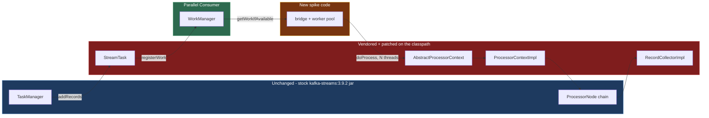
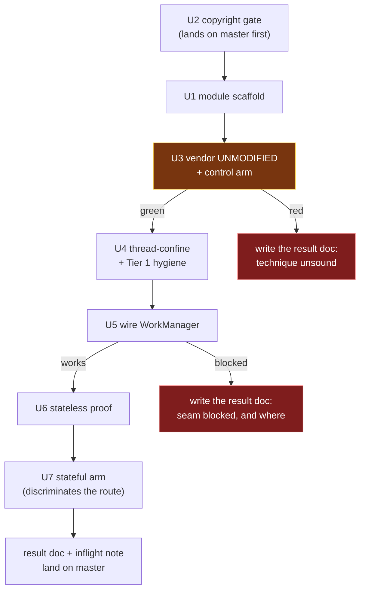

# feat: spike - can PC's work-shard manager drive a Kafka Streams processor chain?

## Product Contract

### Summary

Answer one question with running code: can Parallel Consumer's `WorkManager` feed and execute a Kafka
Streams processor chain, instead of the serial `PartitionGroup.nextRecord()` -> `StreamTask.process()`
loop? Report what it cost to find out. The spike proves or disproves the seam; it is not a feature.

### Problem Frame

`docs/plans/2026-08-07-002-investigate-kafka-streams-on-pc-report.md` **argues**, on evidence cited in
its §3.2 and §4, that swapping Kafka Streams' client for a PC-backed one gains nothing (Streams
serialises *above* the consumer) and that cutting the seam one layer lower is viable with a bounded
diff. It ranks that diff into tiers and identifies **one load-bearing change**:
`AbstractProcessorContext.recordContext` / `currentNode` are a single mutable slot per task, read
ambiently by every store wrapper.

That is analysis, not evidence. Nothing has been run. This spike converts the central claim into "does
work" or "does not work, and here is where it broke" - and, equally important, into a measured cost -
before anyone invests in the build-time tagging pass, offset ownership, or a maintained fork.

**The route itself remains an open decision.** See KTD0: choosing to cut the seam inside
`processor/internals` is a selection from the report's own taxonomy made during planning, not a
decision the user made. The spike is designed so a red or ambiguous result sends the question back to
the alternatives rather than merely stalling.

### Requirements

| ID | Requirement |
|---|---|
| R1 | A Kafka Streams topology runs with its records selected by PC's `WorkManager` rather than `PartitionGroup.nextRecord()`. |
| R2 | The processor chain executes concurrently: with a worker pool of at least 4 and a deliberately slow processor, at least 3 records are demonstrably in flight at once. |
| R3 | Output is correct against a stock Kafka Streams baseline: multiset equality across the whole run, and sequence equality within each key. |
| R4 | A control arm exists proving the vendoring technique itself is behaviour-neutral before any patch is applied. |
| R5 | The outcome - including a failure or an early stop - is recorded durably **on master**, with enough detail that the next person does not repeat it. |
| R6 | Nothing in the spike is published to Maven Central or changes the behaviour of any shipped module. |
| R7 | The repo's CI gates pass without being bypassed or weakened, and third-party licence obligations are met. |
| R8 | The spike reports the size and shape of the change set: which classes had to be vendored, roughly how many lines were patched, and whether any new PC API was required. |
| R9 | The spike exercises at least one code path where the thread-confinement fix is actually load-bearing, so a green result distinguishes "confinement works" from "confinement was never needed here". |

### Scope Boundaries

**In scope:** the report's Tier 1 mechanical concurrency hygiene *minus* its `StreamsProducer` items
(excluded by KTD7) and its `RocksDBStore` items (excluded by KTD3); thread-confining the per-task
record context; enough wiring to get records from `WorkManager` into the processor chain; and one
minimal stateful arm (U7) so the result can discriminate.

**Non-goals (this spike):**
- The build-time parallel-safe reachability pass in `InternalTopologyBuilder` (report §4.9).
- Moving committable-offset ownership to PC (report §4.6).
- Windowed operators, joins, suppression, punctuators, EOS, standby/restore.
- Caching-enabled state, and therefore the cache-layer concurrency problems entirely.
- Throughput measurement. "Faster" is not the question.
- The Web GUI stretch goal on astubbs#255 - it needs the parallel-safe tagging pass, which is out of
  scope here.
- Merging the spike *code* into the product. The result *documents* do land on master (R5).

#### Deferred to Follow-Up Work
- Everything the report ranks Tier 2 beyond the thread-confinement, and all of Tier 3.
- Whatever U6/U7 name as the next experiment.

---

## Planning Contract

### Key Technical Decisions

Three decisions below carry a `session-settled:` annotation - the user closed them in conversation and
they are not to be re-opened. **Everything else here, including KTD0, was chosen during planning on
research evidence.** The distinction matters: a later reviewer should challenge the unannotated ones
freely and leave the annotated ones alone.

**KTD-S1. The question is "how little must change to make it work".**
*(session-settled: user-directed - chosen over "is it possible at all": the user rejected the
impossibility framing directly, so feasibility is no longer the open question; cost is.)*
This is why R8 exists: a verdict with no measured change-set size does not answer the question actually
asked.

**KTD-S2. Changing or forking Kafka itself is permissible.**
*(session-settled: user-directed - chosen over treating `processor.internals` being package-private and
unsupported as a blocker: the user's position is that this project can change anything it needs to.)*
Note this licenses the approach; it does not mandate a literal fork. KTD1 selects the cheapest technique
that satisfies it.

**KTD-S3. Spike posture: find out whether it runs.**
*(session-settled: user-directed - chosen over building toward something shippable: the point is to
retire a risk, not to deliver a feature.)*
This is what keeps the Scope Boundaries narrow and makes a negative result a success.

**KTD0. Cut the seam inside `processor/internals`.** Drive the processor chain from PC's `WorkManager`
rather than supplying a PC-backed client or building a PC-native API.
*This is an agent selection from the origin report's taxonomy, not a user decision* - recorded here so
it gets the same scrutiny as every smaller choice below.
*Rejected:* **swapping the client via `KafkaClientSupplier`** - report §3.2 argues Streams serialises
above the consumer, so the swap gains nothing; evidence grade: source-cited analysis, not run.
*Rejected:* **a PC-native Streams-like DSL** - report §5 ranks it below this route *solely* because
this route inherits state stores for free; evidence grade: comparative reasoning, and note that a
stateless-only spike would not test that ranking at all (which is why U7 exists).
*Rejected:* **the shipped topic-hop** - report §6.4; it already works and is the right default, so the
only reason to move is to remove the hop's latency and operational cost.
*Return path:* if U3, U5 or U6 goes red, U6's write-up must state which of these alternatives the
result sends the question back to, and why.

**KTD1. Classpath shadowing, not a Kafka fork.** Copy the target classes from the `3.9.2` tag into the
spike module at `org.apache.kafka.streams.processor.internals`, and depend on **stock**
`kafka-streams:3.9.2`. The copied class wins on classpath precedence; siblings load from the jar; same
runtime package and classloader, so package-private access works. Verified empirically during planning
against a real 3.9 class, and neither `kafka-streams` nor `kafka-clients` 3.9.2 ships a
`module-info.class` or `Automatic-Module-Name`.
*Rejected:* forking and publishing Kafka. It works, but costs a clone, a ~3 minute cold build, a
`build.gradle` edit for tolerable iteration, and a `dependencyManagement` pin to stop the forked POM
dragging in an unpublished `kafka-clients:3.9.2-pcspike` - **and a locally-published version is
unresolvable on a CI runner**, so the branch could never go green.
*Evidence gap, closed by U3:* the verification used a low-fan-out leaf class. This spike shadows
classes whose subclasses and callers stay in the jar. Classloading generalises; **binary compatibility
does not**, and U3's control arm is the only thing standing between that gap and an uninterpretable U5.

**KTD2. Target Kafka 3.9.2.** Matches the repo's `kafka.version`, so the spike composes with the
existing build and harness unchanged. `docs/inflight/pr-53-java-baseline-kafka4.md` records Kafka 4 as
unstarted, and its compat job is `if: false` at `.github/workflows/maven.yml:170` because the 4.x build
currently fails.
*Rejected:* trunk/4.x. The cost is that trunk differs materially - `ProcessorContextImpl` is `final`
there and the record context is mutated in place - so a green spike on 3.9 does not transfer
unexamined. Recorded as a risk.

**KTD3. Stateless first, then one non-windowed aggregation.** U6 proves the seam on
`stream -> mapValues -> to`. U7 then adds a `count`/`reduce` over a KV store built
`withCachingDisabled()`.
*Why both:* a stateless topology instantiates none of the store wrappers
(`ChangeLoggingKeyValueBytesStore`, `CachingKeyValueStore`, `StoreQueryUtils`, `MeteredKeyValueStore`)
that make the record context load-bearing - so a stateless-only green result cannot distinguish
"confinement works" from "confinement was never needed here" (R9). It also cannot test the one property
on which KTD0 ranks this route above a PC-native DSL.
*Correction:* an earlier draft rejected a stateful arm on the grounds that `withCachingDisabled()` was
"outside the scoped tier". That was wrong - it is public DSL API the **topology author** calls, needing
no additional vendored class and no additional patch.
*Still rejected:* windowed operators, joins and suppression - the report shows those change semantics
under out-of-order processing, which would make a failure ambiguous.

**KTD4. Extend the copyright gate; do not skip it.** `bin/check-copyright-headers.sh` models two
provenances - upstream-Confluent-derived, and fork-original (which requires the fork holder line and
rejects the literal string `Confluent`). A vendored ASF file fits neither: it fails the
missing-fork-holder test. Add a third class for third-party Apache-licensed sources, **carrying a
`verbatim` / `modified` state**, because U4 and U5 patch exactly the files U3 registers and Apache-2.0
§4(b) requires modified files to carry a change notice - which is also how the repo already treats its
own `EXTRACTED_FROM_UPSTREAM` class.
*Rejected:* `-Dcopyright.skip=true`. That bypasses a CI gate rather than teaching it a real case.
*Justification corrected:* an earlier draft claimed independent value via porting confluentinc#390's
`Consumed.java`/`Produced.java`. The origin report rules that port out (§2.3 - the branch never
compiled), so that beneficiary does not exist. U2 stands on the spike's own need: the gate walks every
tracked `.java` file, so vendored ASF sources cannot sit in the tree without it, and R7 forbids
skipping.

**KTD5. Control arm before any patch.** Vendor unmodified first, prove behaviour is unchanged, then
patch.
*Rejected:* vendoring and patching in one step - a failure could not be attributed, and the spike's
whole output is a trustworthy verdict.

**KTD6. A top-level module that explicitly skips publishing.** New module
`parallel-consumer-streams-spike` carrying the three publish-skip **properties** (`maven.deploy.skip`,
`maven.install.skip`, `gpg.skip`) **plus a `<build><plugins>` block** setting
`central-publishing-maven-plugin`'s `<skipPublishing>true</skipPublishing>`. There is no
`central-publishing-maven-plugin.skipPublishing` property - the plugin exposes only an unqualified
`${skipPublishing}` expression - so a properties-only copy would silently fail to protect R6.
*Rejected:* placing it under `parallel-consumer-examples` to inherit the skips. A spike is not an
example, and inheriting protection by accident of location is less legible than copying it.

**KTD7. At-least-once, not EOS.** Keeps `StreamsProducer` out of the diff entirely.

**KTD8. Single record path, switched - never both at once.** `addRecords` feeds `WorkManager`
*instead of* `partitionGroup.addRawRecords`, with a bridge flag selecting stock or PC dispatch.
*Rejected:* registering into both paths "so they can be compared". Nothing would drain the partition
group, `StreamTask.addRecords` pauses a partition once its buffer fills, and the run would stall with
the consumer paused and no error. `streamTime` would also never advance, since it advances at selection.
The stock-vs-PC comparison is supplied by U6's fixture, not by running both paths simultaneously.

### Assumptions

- **Corrected from an earlier draft:** `kafka-streams:3.9.2` ships class-file **major 52 (Java 8)** -
  verified against the jar in `~/.m2`, as does `kafka-clients:3.9.2`. Kafka dropped Java 8 for clients
  and Streams only in 4.0. The spike module therefore inherits the project-wide
  `<release.target>8</release.target>` with **no module-local override**, and the
  `parallel-consumer-mutiny` precedent does not apply.
- `slf4j-api` and `jackson-databind` are `runtime` scope in the `kafka-streams` POM, so vendored
  internals will not compile until both are added at compile scope.
- `ParallelConsumerOptions.validate()` requires a `Consumer` instance, but `PCModule`/`WorkManager`
  construction never invokes `validate()`. Whether the bridge passes a mock or the Streams consumer is
  resolved at U5.

---

## High-Level Technical Design

The spike replaces one edge in Kafka Streams' record path:

Sequencing, and the two points where a negative result is itself the deliverable:

---

## Implementation Units

### U1. Spike module scaffold

**Goal:** A module that compiles, depends on stock Kafka Streams, never publishes, and can host classes
in Kafka's own package.

**Requirements:** R6, R7

**Dependencies:** U2 (landed on master)

**Files:**
- `pom.xml` (modify - add to `<modules>`, **before** `parallel-consumer-examples`)
- `parallel-consumer-streams-spike/pom.xml` (create)
- `parallel-consumer-streams-spike/src/test/java/io/confluent/parallelconsumer/streamsspike/TestConventionsArchTest.java` (create)
- `parallel-consumer-streams-spike/src/test/resources/logback-test.xml` (create)

**Approach:**

1. Add to the root `<modules>` list (`pom.xml:35-41`), positioned before `parallel-consumer-examples` -
   the examples pom records a central-publishing-maven-plugin bug where a skipPublishing module last in
   reactor order suppressed the whole bundle upload. Ordering it earlier costs nothing and avoids
   re-testing that.
2. Parent is `bz.stub.parallelconsumer:parallel-consumer-parent`. Apply KTD6 exactly: copy both the
   `<properties>` block (`parallel-consumer-examples/pom.xml:33-37`) **and** the
   `central-publishing-maven-plugin` `<build>` block (lines 39-49).
3. **No `release.target` override** - see Assumptions; the jar is Java 8 bytecode.
4. Dependencies: `parallel-consumer-core` (compile), `org.apache.kafka:kafka-streams` at
   `${kafka.version}` (compile), and `slf4j-api` plus `jackson-databind` at **compile** scope. Test
   scope: `parallel-consumer-core` with `<classifier>tests</classifier>`, plus `testcontainers`,
   `testcontainers:junit-jupiter`, `testcontainers:kafka`, `awaitility` re-declared (test-scope
   dependencies are not transitive). Mirror
   `parallel-consumer-examples/parallel-consumer-example-streams/pom.xml:41-63`.
5. Add the conventions test, matching the four-line shape used by every other module.

**Patterns to follow:** `parallel-consumer-examples/parallel-consumer-example-streams/pom.xml`.

**Test scenarios:** `Test expectation: none` - scaffolding with no behaviour.

**Verification:** `./mvnw -pl parallel-consumer-streams-spike -am install` succeeds; no
`parallel-consumer-streams-spike` artifact appears anywhere under `~/.m2`; `bin/ci-unit-test.sh` passes.

---

### U2. Teach the copyright gate about vendored Apache sources

**Goal:** A third provenance class so ASF-licensed sources can live in the tree with their own header
and a change notice when modified - without weakening the other two classes.

**Requirements:** R7

**Dependencies:** none. **This unit lands on master as its own PR, before U1.** It is the only unit
with standalone value, and leaving it on an unmergeable spike branch is how it gets lost.

**Files:**
- `bin/check-copyright-headers.sh` (modify)
- `bin/test-check-copyright-headers.sh` (modify)
- `AGENTS.md` (modify - the Code Style section documents the header rules)

**Approach:**

1. Add a registry alongside `RENAMED_FROM_UPSTREAM` / `EXTRACTED_FROM_UPSTREAM`, with a
   `path|tag|state` shape where `state` is `verbatim` or `modified`.
2. A registered file must retain the ASF header in both states. When `state` is `modified`, it must
   **also** carry a `Modifications Copyright (C) <year> Antony Stubbs and contributors` line - matching
   how `EXTRACTED_FROM_UPSTREAM` is already handled via `require_modifications_line`, and what
   Apache-2.0 §4(b) requires.
3. A registered path lacking the ASF header fails, so the list cannot become a blanket escape hatch.
4. **Expose a matching `COPYRIGHT_CHECK_EXTRA_*` env override** for the new registry and document it in
   the script's test-harness-overrides header block (lines 33-36). Both existing registries have one
   precisely so `bin/test-check-copyright-headers.sh` can inject fixture paths; without it the new
   cases cannot be tested without committing real vendored files first.
5. Update the header-rules description in `AGENTS.md` where the other two classes are documented.

**Execution note:** Extend `bin/test-check-copyright-headers.sh` first and watch the new cases fail
before changing the script. The gate is CI-enforced and a false pass here is invisible.

**Patterns to follow:** the existing registry handling in `bin/check-copyright-headers.sh` around lines
125-152, and its `require_modifications_line` helper.

**Test scenarios:**
- Registered `verbatim` + full ASF header passes.
- Registered `modified` + ASF header + `Modifications Copyright` line passes.
- Registered `modified` + ASF header but **no** modification line fails, naming the file.
- Registered path with no ASF header fails, naming the file.
- An unregistered file carrying an ASF header still fails, exactly as today.
- An unregistered fork-original file missing the fork header still fails (no regression).
- An unregistered fork-original file containing the string `Confluent` still fails (no regression).
- An upstream-derived file that has diverged still requires its `Modifications Copyright` line.
- The `COPYRIGHT_CHECK_EXTRA_*` override injects a fixture path and the fixture is evaluated.

**Verification:** `bin/test-check-copyright-headers.sh` passes with the new cases;
`bin/check-copyright-headers.sh` is still green over the tree as it stands.

---

### U3. Vendor the Kafka classes unmodified, and prove it changes nothing

**Goal:** Establish the control arm. The technique must be behaviour-neutral before any patch, or a
later failure cannot be attributed.

**Requirements:** R4, R7, R8

**Dependencies:** U1, U2

**Files:**
- `parallel-consumer-streams-spike/src/main/java/org/apache/kafka/streams/processor/internals/StreamTask.java` (create - vendored)
- `.../AbstractProcessorContext.java` (create - vendored)
- `.../ProcessorContextImpl.java` (create - vendored; required by U4, see below)
- `.../RecordCollectorImpl.java` (create - vendored; required by U4, see below)
- `bin/check-copyright-headers.sh` (modify - register the vendored paths as `verbatim`)
- `NOTICE` (modify)
- `parallel-consumer-streams-spike/src/test/java/io/confluent/parallelconsumer/streamsspike/integrationTests/ShadowedStreamsControlTest.java` (create)

**Approach:**

1. **The vendored set is named, not discovered.** `StreamTask` and `AbstractProcessorContext` are the
   targets; `ProcessorContextImpl` is required because it accesses the confined fields directly (U4),
   and `RecordCollectorImpl` is required because its non-concurrent `offsets` and
   `producedSensorByTopic` are mutated from every worker thread through the `to()` sink - and **the
   compiler will not demand it**, since it is constructed outside `StreamTask`. Add anything further
   only as the compiler demands.
2. **Stop-threshold:** if the compiler-demanded closure exceeds roughly a dozen classes, stop and
   report the sprawl as the answer (R8) rather than continuing. Growth past that point is evidence the
   seam is not bounded, which is a legitimate verdict.
3. Copy each **verbatim from the `3.9.2` tag** - not trunk, not a branch tip. Binary drift surfaces as
   `NoSuchMethodError` at runtime with nothing warning you at compile time. Record the tag in-file.
4. Register each path in U2's registry as `verbatim`.
5. **Update `NOTICE`.** The root `NOTICE` names only Confluent and the fork; `AGENTS.md` designates it
   as the fork's legal attribution structure, and Apache-2.0 §4(d) requires reproducing a redistributed
   work's attribution notices. Append an Apache Kafka paragraph naming the vendored classes and the tag,
   mirroring the existing Confluent paragraph's shape.
6. Write the control-arm test: a stateless topology through **stock** `KafkaStreams` with the
   vendored-but-unmodified classes on the classpath. Assert output correctness **and** assert that the
   vendored class is the one loaded - the technique is silent when it fails, and a test passing because
   the jar's copy won proves nothing.

**Execution note:** This unit's value is entirely in the control arm. If the vendored-unmodified run
does not behave identically, **stop and write `docs/plans/2026-08-08-002-ks-on-pc-spike-result.md` with
the verdict reached** (R5), then re-plan. Do not proceed to U4.

**Patterns to follow:**
`parallel-consumer-examples/parallel-consumer-example-streams/src/test/java/io/confluent/parallelconsumer/examples/streams/integrationTests/StreamsAppTest.java`.

**Test scenarios:**
- Each vendored class (not the jar's) is the one loaded - assert on code source, per class.
- A vendored class and a jar-resident sibling report the same runtime package.
- A stateless topology over N records produces exactly N output records, in per-key order.
- Records with distinct keys all appear; no drops, no duplicates.
- The test fails loudly if classpath ordering lets the jar's copy win - it must not silently pass.

**Verification:** The control arm is green and its class-source assertions prove the vendored copies
are live; `bin/check-copyright-headers.sh` passes with the vendored files registered.

---

### U4. Thread-confine the record context, and the Tier 1 hygiene

**Goal:** Make the per-task mutable state safe for concurrent execution - the report's single
load-bearing change - including the jar-resident caller that would otherwise defeat it.

**Requirements:** R2 (prerequisite), R7

**Dependencies:** U3 (control arm green)

**Files:**
- `.../AbstractProcessorContext.java` (modify)
- `.../ProcessorContextImpl.java` (modify)
- `.../StreamTask.java` (modify)
- `.../RecordCollectorImpl.java` (modify)
- `bin/check-copyright-headers.sh` (modify - flip these entries to `modified`)
- `parallel-consumer-streams-spike/src/test/java/io/confluent/parallelconsumer/streamsspike/ProcessorContextConfinementTest.java` (create)

**Approach:**

1. **First, route `ProcessorContextImpl`'s direct field access through accessors.** `recordContext` and
   `currentNode` are `protected` fields, and `ProcessorContextImpl` reads and writes `recordContext`
   directly - those `getfield`/`putfield` pairs *are* the save/restore stack in `forward`. An earlier
   draft claimed thread-locals preserve that discipline; that is inverted - the jar's bytecode would
   never see the ThreadLocal. Convert those sites to `recordContext()` / `setRecordContext()` **before**
   confining the field.
2. Thread-confine `recordContext` and `currentNode` in `AbstractProcessorContext`.
3. `StreamTask`: allocate `recordInfo` per record rather than reusing the single instance (it is read
   *after* processing); make `consumedOffsets` and `partitionsToResume` concurrent; `commitNeeded`
   volatile; `processTimeMs` a `LongAdder`.
4. `RecordCollectorImpl`: `offsets` and `producedSensorByTopic` to concurrent maps.
5. Flip the U2 registry entries for every file touched here from `verbatim` to `modified`, and add the
   `Modifications Copyright` line each now requires.
6. Leave `StreamsProducer` alone (KTD7) and `RocksDBStore` alone (KTD3).

**Execution note:** Re-run U3's control arm after this unit and before U5 - these changes are meant to
be behaviour-preserving under single-threaded execution, and a regression is far cheaper to find now.

**Test scenarios:**
- The vendored `ProcessorContextImpl` is the class actually loaded - assert on code source.
- Two threads setting different record contexts on the same context instance each read back their own.
- A thread that sets a context, forwards through a nested node, and returns sees its original context
  restored - the save/restore stack still works per thread, through the accessors.
- A thread reading the context before setting one gets a null/absent value, not another thread's
  leftover.
- Two concurrent `recordInfo` consumers do not observe each other's partition or node.
- U3's control-arm topology still produces identical output after these changes.

**Verification:** The confinement test passes, `ProcessorContextImpl` is proven live, and U3's control
arm is still green.

---

### U5. Wire PC's WorkManager into StreamTask

**Goal:** Records reach the processor chain via `WorkManager.getWorkIfAvailable()` and execute on a
worker pool, not via `partitionGroup.nextRecord()` on the StreamThread.

**Requirements:** R1, R2, R8

**Dependencies:** U4

**Files:**
- `.../StreamTask.java` (modify)
- `parallel-consumer-streams-spike/src/main/java/io/confluent/parallelconsumer/streamsspike/` (create - the bridge and its worker pool)

**Approach:**

1. **Bootstrap PC's partition lifecycle first.** `WorkManager` is a `ConsumerRebalanceListener`, and in
   this spike Streams owns the consumer - so nothing drives PC's assignment lifecycle unless the bridge
   does. Construct the `WorkManager` through `PCModule`, and call `onPartitionsAssigned` for the task's
   input partitions when the task initialises (and `onPartitionsRevoked` on close). Without this,
   `PartitionStateManager.getPartitionState` returns null and `maybeRegisterNewRecordAsWork`
   dereferences it; separately, `EpochAndRecordsMap` skips any partition whose epoch is null with only
   a `log.warn`, so records are dropped **silently**. Resolve the `Consumer`-instance question from
   Assumptions here.
2. Adapt records via `EpochAndRecordsMap` - `registerWork` takes that, not a record collection.
3. **Single path, switched** (KTD8): `addRecords` feeds `WorkManager` *instead of* the partition group,
   with a bridge flag selecting stock or PC dispatch, **defaulting to stock/off**. The default-off flag
   is what makes U6's stock arm and U3's control arm runnable after this unit lands.
4. Replace the selection step in `process()` with a pull from `getWorkIfAvailable(int)`, dispatching
   each `WorkContainer` to the worker pool that runs the existing `doProcess` path.
5. Report completion through `onSuccessResult` / `onFailureResult` so PC's shard invariant holds - under
   KEY ordering a shard hands out at most one in-flight record at a time
   (`parallel-consumer-core/src/main/java/io/confluent/parallelconsumer/state/ProcessingShard.java:149-154`).
   Configure KEY ordering explicitly.
6. **Decide the retry semantics and record it.** PC's response to `onFailureResult` is to make the
   record retryable and hand it out again, which re-runs the whole chain including `forward` calls that
   already emitted downstream - producing duplicates that stock Streams never produces (it surfaces the
   exception to the uncaught-exception handler). Disable retries so failures surface like stock, and
   record the divergence in U6's caveats.
7. Decide explicitly whether `__processing.threads.enabled__` is set - a vendored `StreamTask` carries
   the branch that selects `SynchronizedPartitionGroup`, so the flag silently determines which
   implementation runs. KTD2 cites it as a head start; say yes or no rather than leaving it ambient.
8. Leave offset commit on the stock path - deferred. Accept optimistic commit; record it in U6.

**Execution note:** The interesting failures here are silent. Expect to need instrumentation proving
records actually travelled the new path. If the seam cannot be made to work, **write the result document
with the verdict and where it blocked** (R5) rather than leaving the branch undocumented.

**Test scenarios:**
- `registerWork` accepted every record - assert none were skipped for want of an epoch.
- Records demonstrably travel the WorkManager path - assert on a dispatch marker incremented only by
  the new path, not on output alone.
- With the flag off, the dispatch marker reads zero and the topology still produces correct output.
- With a pool of at least 4 and a deliberately slow processor, at least 3 records are in flight at once.
- Two records sharing a key are never in flight concurrently, under KEY ordering.
- Records with distinct keys do run concurrently.
- A processor that throws surfaces the failure without wedging the task, and without re-emitting
  already-forwarded downstream records.

**Verification:** Dispatch is proven by assertion, not inferred from output; concurrency is observed;
the flag-off path is green.

---

### U6. The stateless proof

**Goal:** Prove the seam end to end against an uncontaminated stock baseline.

**Requirements:** R1, R2, R3, R8

**Dependencies:** U5

**Files:**
- `parallel-consumer-examples/parallel-consumer-example-streams/src/test/java/io/confluent/parallelconsumer/examples/streams/integrationTests/StockBaselineFixtureTest.java` (create)
- `parallel-consumer-streams-spike/src/test/java/io/confluent/parallelconsumer/streamsspike/integrationTests/PcDrivenStreamsProofTest.java` (create)

**Approach:**

1. **The stock baseline must come from outside the spike module.** Any `KafkaStreams` instance in the
   spike module's JVM loads the patched vendored classes, because `target/classes` precedes the jar -
   so a "stock" arm run there is not stock at all, and both arms would share every defect the vendoring
   introduced. Generate the expected output as a fixture from
   `parallel-consumer-example-streams`, which does not depend on the spike module, and assert the
   PC-driven run against that fixture.
2. Assert **multiset equality across the run, and sequence equality within each key** - global ordering
   necessarily differs under parallel dispatch, and an ordered assertion would go red for the very
   concurrency the spike is demonstrating.
3. Add a probe processor that reads `context.recordContext()`, `context.timestamp()` and
   `context.headers()` for every record under N-thread dispatch and asserts each matches the record
   being processed. In a stateless topology this is the only surviving ambient reader (R9 is only fully
   met by U7).

**Test scenarios:**
- PC-driven output matches the stock fixture as a multiset across the run.
- Per-key sequence equality holds end to end.
- The probe processor observes its own record's context, timestamp and headers on every record under
  concurrent dispatch.
- No records lost, none duplicated.
- The proof holds across repeated executions, not once.

**Verification:** The baseline is provably external to the spike module; equality is asserted with the
right vocabulary; the run is repeated.

---

### U7. The stateful arm, and the write-up

**Goal:** Exercise the code path where thread-confinement is actually load-bearing, discriminate the
route choice, and land the verdict where the next person will find it.

**Requirements:** R5, R8, R9

**Dependencies:** U6

**Files:**
- `parallel-consumer-streams-spike/src/test/java/io/confluent/parallelconsumer/streamsspike/integrationTests/PcDrivenStatefulProofTest.java` (create)
- `docs/plans/2026-08-08-002-ks-on-pc-spike-result.md` (create - **lands on master**)
- `docs/inflight/branch-ks-on-pc-spike.md` (create - **lands on master**)
- `docs/plans/2026-08-07-002-investigate-kafka-streams-on-pc-report.md` (modify - link the result)

**Approach:**

1. Add a non-windowed `count`/`reduce` over a KV store built `withCachingDisabled()`, run under
   concurrent dispatch, asserting output equality against a stock fixture generated the same way as U6's.
   This exercises `ChangeLoggingKeyValueBytesStore` and `MeteredKeyValueStore` - the ambient
   `recordContext` readers that make U4's change load-bearing.
2. Write the result document. It must cover: the verdict; what was run; what broke and how it was
   diagnosed; which of the report's §4 claims held; **the change-set size and shape** (R8: classes
   vendored, lines patched, whether new PC API was needed); **which alternative from KTD0 a red or
   ambiguous result sends the question back to**; and the next experiment.
3. **Add a "What a green result commits to" section**, pricing at least: the recurring cost of
   re-vendoring and re-patching `processor/internals` on every Kafka version bump, against classes
   carrying no compatibility guarantee, on a fork that has not shipped its first release; the DSL
   emission-semantics change that disabling caching forces on the parallel path; and the distribution
   shape a shipped version would need beyond classpath shadowing, which was chosen for spike
   convenience.
4. **Land the documents on master via a docs-only PR**, separate from the spike code branch, plus a
   `docs/inflight/branch-ks-on-pc-spike.md` note per that directory's conventions (`branch-` prefix is
   reserved for work sitting on a branch with no PR). Without this the back-link points at nothing from
   master and R5 is unmet.
5. Record the honest caveats: 3.9-only; caching-disabled only; optimistic commit; retries disabled;
   vendored classes pinned to a tag and subject to drift.

**Execution note:** Report the reproduction rate and conditions, not just a verdict - "passed once" and
"passed 50 times under load" are different findings. A negative result is a successful spike and gets
the same care.

**Test scenarios:**
- A non-windowed aggregation under concurrent dispatch produces output equal to the stock fixture.
- Per-key aggregate values are correct - no lost updates.
- Changelog records carry the timestamp of the record that produced them, not another record's.
- The stateful run is repeatable across executions.

**Verification:** The verdict is stated plainly with its evidence and reproduction rate; the result
document and inflight note are on master.

---

## Verification Contract

1. `bin/ci-unit-test.sh` passes.
2. `bin/ci-integration-test.sh` passes (requires Docker).
3. `bin/check-copyright-headers.sh` passes with the vendored files registered at the correct
   `verbatim`/`modified` state, and `bin/test-check-copyright-headers.sh` covers the new class.
4. `.github/scripts/issue-ref-gate.test.js` exits 0, and no added line carries an unqualified sub-1000
   issue reference.
5. No artifact from `parallel-consumer-streams-spike` is installed or deployed (R6).
6. U3's control arm is green before U4, after U4, and after U5 with the dispatch flag off.
7. `NOTICE` names Apache Kafka as a vendored source.
8. The result document and inflight note exist **on master**, whatever the verdict.

---

## Risks & Dependencies

| Risk | Mitigation |
|---|---|
| A green spike on 3.9 does not transfer to trunk, where `ProcessorContextImpl` is `final` and the record context is mutated in place on every send. | KTD2 records it; U7 must state the limitation rather than let green imply more than it shows. |
| The shadowing evidence came from a low-fan-out leaf class; these classes have jar-resident subclasses and callers. Classloading generalises, binary compatibility does not. | U3's control arm is the gate, and KTD1 names the gap explicitly. |
| A false positive from the stock path being taken quietly. | U5 asserts on a dispatch marker; U3 asserts vendored classes are loaded. |
| A false positive from the fix never being exercised. | U7 exists for exactly this (R9); U6's probe processor is the partial substitute. |
| The vendored set grows until it is effectively a fork. | U3 names the set up front and sets a stop-threshold, with sprawl reported as a verdict (R8). |
| The copyright registry becomes a way to vendor anything. | A registered file without an ASF header fails, and a modified one without a change notice fails. |
| Optimistic commit means the spike is not crash-safe. | Deliberate and in Scope Boundaries; U7 records it. |
| The result never reaches anyone because the branch does not land. | U7 lands the documents on master via a separate docs-only PR. |

---

## Definition of Done

- The question in the Summary has an answer, positive or negative, backed by a test that runs - or an
  explicit stop at U3 or U5 with its verdict written down.
- `docs/plans/2026-08-08-002-ks-on-pc-spike-result.md` and `docs/inflight/branch-ks-on-pc-spike.md` are
  **on master**, recording the verdict, the evidence, the change-set size and shape (R8), what a green
  result would commit to, which KTD0 alternative the result points back to, and the reproduction rate.
- The Verification Contract passes in full.
- No shipped module's behaviour changed, and nothing new publishes.
- U2 has landed on master independently of the spike branch.
