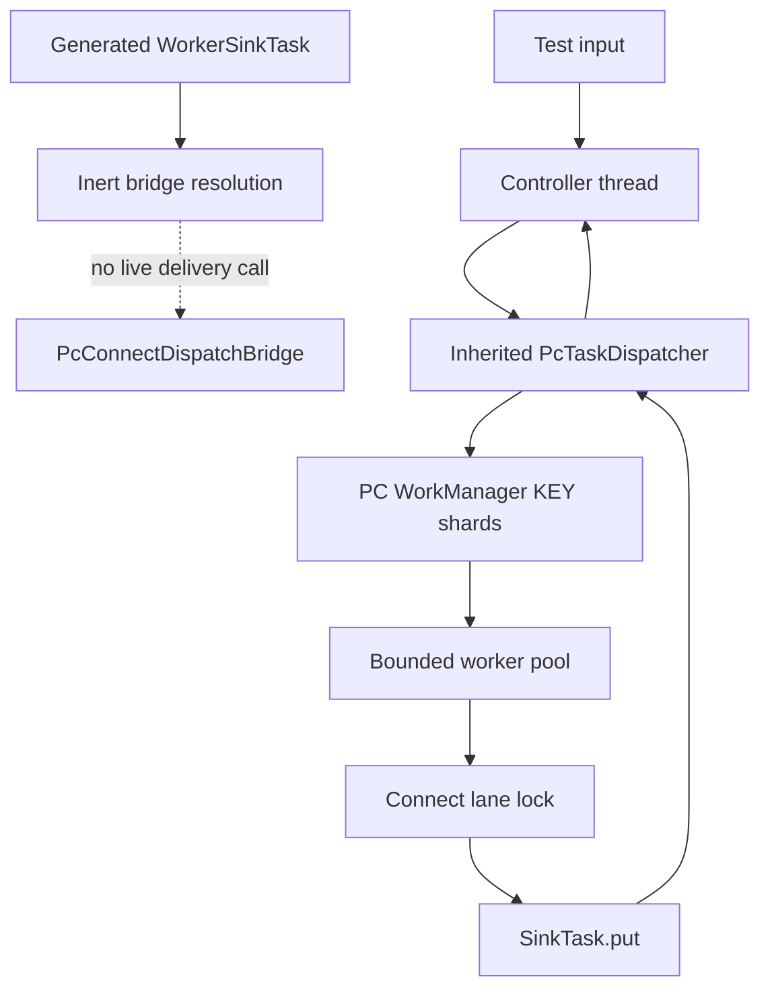
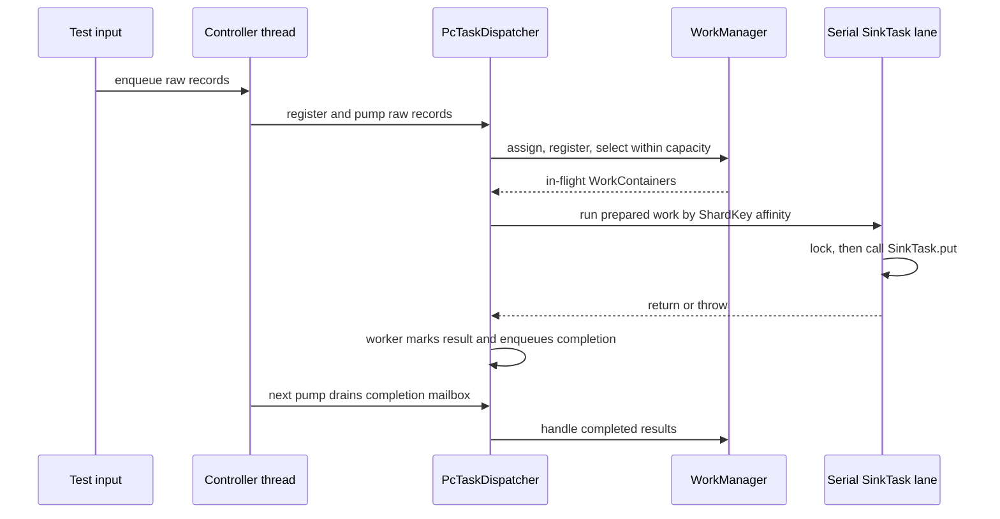

# Connect-on-Parallel-Consumer Feasibility Spike - Plan

## Goal Capsule

**Objective.** Build a guarded, non-publishable feasibility module that proves two prerequisites for
running Kafka Connect sink work through Parallel Consumer: a locally generated, patched
WorkerSinkTask wins class loading over Kafka's stock class; and a controller-owned PC WorkManager can
route raw-input `(topic-partition, key)` shards to several independently serial SinkTask lanes without
concurrent entry to any lane. This resolves the first empirical slice of astubbs/parallel-consumer#240 (mirror of
confluentinc/parallel-consumer#119); it is not a production Connect distribution.

**Authority hierarchy.** The requirements below define the outcome. Key Technical Decisions govern
the mechanism for their cited requirements. AGENTS.md governs repository conventions. The current
Connect 3.9.2 WorkerSinkTask and SinkTask contracts govern what a real connector may observe. The
newer direction in docs/inflight/parked-connect-on-pc.md overrides the superseded
docs/plans/2026-08-08-001-feat-connect-sink-in-pc-plan.md.

**Stop conditions.** Stop and surface a blocker instead of widening the spike if a generated-source
build requires committing Apache Kafka source; if the dispatcher needs more than one thread to mutate
WorkManager; if the proof cannot show that a SinkTask lane is never entered concurrently; or if wiring
the dispatcher into live WorkerSinkTask delivery would permit Connect to commit a record before the
corresponding task's durability boundary is established.

**Execution profile.** This is a test-first feasibility spike. It intentionally ends before a
user-accessible dispatch switch, a published patched artifact, or a general connector compatibility
claim. This branch is stacked directly on `feats/ks-on-pc-spike`; its PR targets that parent branch and
reuses the parent's patch harness and `PcTaskDispatcher`. Publication remains blocked by
docs/inflight/next-patched-kafka-packaging.md.

---

## Product Contract

### Summary

The rejected design embedded a partial Connect runtime in Parallel Consumer. The adopted design keeps
Connect's runtime intact and patches the source-distribution copy of WorkerSinkTask at build time. Because
this branch is stacked on the Kafka Streams spike, it reuses that branch's generated-source harness and
controller-owned `PcTaskDispatcher` rather than recreating either. The first implementation must validate
the hardest Connect-specific premise without pretending it has solved offset commit composition: PC can
own raw-input sharding while distinct SinkTask instances remain serial and key-affine.

The artifact is development-only. It generates a replacement class on a developer's machine, carries no
Kafka source in git, and does not publish or ask an application to depend on a patched Connect runtime.

### Problem Frame

Connect normally assigns complete topic partitions to a SinkTask. That protects task-local buffers and
partition-named output, but it caps useful task concurrency at the partition count. Parallel Consumer can
track sparse completion for records sharing a partition; if it can safely dispatch distinct keys to
distinct task instances, keyed upsert sinks may gain concurrency above that ceiling. The same idea is
unsafe for connectors that retain whole-partition state, and Connect's preCommit watermark is not
automatically meaningful once one partition is split across tasks.

The spike therefore asks a narrower, falsifiable question: can the execution side preserve per-key order
and per-task seriality while routing a single partition to multiple task lanes? It does not claim that
the resulting work is yet safe to commit through a real Connect worker.

### Requirements

#### Generated patch harness

- R1. A new Maven reactor module named parallel-consumer-connect-spike builds local generated copies of
  the named Kafka Connect source classes it patches, from `connect-runtime` or `connect-api` as needed,
  without committing generated Apache Kafka source or classes.
- R2. The generated WorkerSinkTask class is demonstrably the class that loads when the spike module is
  first on the test classpath, while an untouched Connect sibling still resolves from the upstream jar.
- R3. With its seam disabled, the generated WorkerSinkTask adds no active dispatch behavior and produces
  no observed delivery or commit regression within Kafka's WorkerSinkTask test oracle. A stock-jar control
  arm and a patched-disabled arm run the same published suite, the patched arm matches the stock baseline's
  test identities and outcomes, and a source-delta guard admits only the named inert bridge additions.

#### Controller-owned dispatch proof

- R4. The dispatcher accepts raw ConsumerRecord work and maps PC's stable raw-input
  `(topic-partition, key)` shard identity to one task lane. Null keys remain affinity-bound to their
  topic-partition. This does not establish affinity for a SinkRecord identity changed by conversion or an
  SMT; a live Connect seam must resolve that identity boundary before dispatch.
- R5. A task lane is entered by at most one worker at a time. Records in the same PC KEY shard execute in
  source order; shards assigned to different lanes can execute concurrently.
- R6. Every WorkManager call made by this standalone dispatcher, including assignment, registration,
  selection, and completed-work handling, happens on one controller thread. Workers mark their result and
  communicate the WorkContainer through a mailbox only.
- R7. This spike performs no Connect consumer offset commit and does not call SinkTask.preCommit as proof
  of durability. Any live delivery seam remains inaccessible to users until commit composition is designed
  and verified.
- R8. The proof suite uses controlled synchronization to establish both parallelism and exclusion; it
  guards every required antecedent and includes negative controls that fail when lane exclusion or
  controller-only completion handling is broken. A callback failure reaches the inherited dispatcher's
  bounded, controller-visible failure outcome instead of retrying forever or reporting a successful drain.

#### Branch state

- R9. Repository state describes the branch as active work and points readers to the implemented spike
  plan, its non-production boundary, and the independent packaging and licensing blocker.

### Success Criteria

- The module compiles from a clean reactor build, regenerates its patched sources from the released
  Connect 3.9.2 source jar, and leaves generated material ignored.
- A class-loading test proves the patched WorkerSinkTask shadows only its intended class.
- Separate stock-jar and patched-disabled executions of Kafka's 30 published WorkerSinkTask tests exercise
  the same test identities with the same passing outcomes; a negative control that introduces a deliberately
  observable bridge deviation leaves the stock arm green and makes the patched arm fail its named guard.
- A deterministic dispatcher test uses one source partition, more task lanes than partitions, and keys
  chosen to map to distinct lanes. It proves both callbacks entered before release, observes same-shard
  source order, observes overlap for distinct lanes, and records a maximum concurrent entry of one per lane.
- Negative controls confirm that bypassing lane seriality and handling completion from a worker fail on
  the intended assertions rather than on a timeout.
- The test seam never invokes preCommit or a real consumer commit. The test report names this as an
  intentional unresolved correctness boundary, not as a delivery guarantee.
- A failed callback is not retried, other ready raw-key shards can settle, and the controller receives the
  original cause after the shared dispatcher reaches quiescence with no record in flight; the failed offset
  remains incomplete and the run is not reported as drained successfully.

### Scope Boundaries

#### In scope

- A local generated-source patch harness for the Kafka Connect modules needed by the proof.
- A stock-jar control arm, a patched-disabled arm, and Kafka's published WorkerSinkTask tests as the
  bounded behavior-regression characterization for shadowing the one patched class.
- A Connect-specific serial SinkTask-lane router around the inherited, already-tested PC dispatcher.
- Classpath, source-regeneration, ordering, task-seriality, and no-commit characterization tests.
- Updating the current in-flight record and a developer-facing module README.

#### Explicitly deferred

- Connecting the dispatcher to WorkerSinkTask.poll, convertMessages, deliverMessages, rebalance, or
  commit paths.
- Constructing or pooling real Connector-created SinkTask instances in the Connect worker.
- preCommit watermark composition, PC incomplete-offset metadata encoding, production retries, rebalances, error
  handling, SMTs, DLQ behavior, plugin isolation, or connector compatibility selection.
- End-user documentation, examples, Maven Central publication, a forked artifact coordinate, dependency
  exclusion enforcement, and legal/trademark review.
- Kafka 4.x compatibility and extracting the shared spike machinery into a supported public module. This
  stacked branch directly reuses the parent Streams spike artifact and scripts for the experiment.

#### Outside this spike

- Source connectors, distributed Connect orchestration, the Connect REST API, and a replacement Connect
  runtime.
- A claim that all sinks tolerate key sharding. Partition-affine behavior remains the safe default for
  unknown connectors in follow-up design.

### Context & Research

- docs/inflight/parked-connect-on-pc.md records the rejected embedded-runtime direction, the adopted
  patched-runtime direction, and the specific key-sharding question this spike isolates.
- docs/inflight/next-patched-kafka-packaging.md establishes that local development is allowed while
  publication is blocked by separate licensing, trademark, and dependency-hygiene work.
- `feats/ks-on-pc-spike` is the direct parent of this branch. Its `parallel-consumer-streams-spike` module
  supplies the source-jar unpacking and patch scripts, shadowed-class proof pattern, and public
  `PcTaskDispatcher`. That dispatcher already owns PC assignment, registration, bounded selection, worker
  result marking, completion-mailbox drain, retry suppression, failure surfacing, and quiescence.
- parallel-consumer-core/src/main/java/io/confluent/parallelconsumer/state/ShardKey.java defines KEY
  identity as `(topic-partition, key)` with deep array equality and null-safe hashing. astubbs#150 is prior
  art for the same-key/different-partition distinction.
- docs/solutions/test-flakiness/unforceable-trigger-commit-lock-timeout-2026-08-07.md and
  docs/solutions/test-flakiness/vacuous-await-condition-brokerpoller-backpressure-2026-07-31.md require
  proof antecedents and negative controls instead of timing-only overlap assertions.
- Kafka Connect 3.9 SinkTask documentation establishes that one task owns its assigned partitions and
  that put, flush, and preCommit form the task's delivery/commit contract. WorkerSinkTask is the runtime
  implementation that currently polls, converts, calls `put`, advances its current offsets, calls
  `preCommit`, and commits through its consumer. The inert seam may resolve fork code but may not enter any
  of those methods' live paths.
- Kafka 3.9.2 publishes compiled `connect-runtime` tests and test fixtures. WorkerSinkTask itself is
  package-private, so a spike-package class-loading proof must resolve it reflectively, while a Surefire
  execution can scan the published WorkerSinkTaskTest from the test classifier and run it first against
  the stock jar and then against this module's generated class.
- The old Connect plan retains useful offset analysis, but its implementation units and scope are
  superseded because they reimplement Connect instead of patching it.
- No Connect/generated-patch-specific solution document or merged PR exists. Open PR astubbs#259 overlaps
  the root pom, and open core work can change the internal WorkManager seam before this spike lands.

---

## Planning Contract

### Key Technical Decisions

- KTD1. **Create a development-only parallel-consumer-connect-spike module on top of, and dependent on,
  the parent Streams spike module.** It reuses `PcTaskDispatcher` and the patch scripts directly, then adds
  only Connect's serial SinkTask-lane boundary. The name cannot be mistaken for a supported connector
  integration, and explicit publication opt-outs keep packaging decisions separate. (session-settled:
  user-directed — chosen over copying or reimplementing the Streams machinery: this branch is stacked on
  that work specifically so the Connect proof reuses it.) Governs R1, R4, R6, R7, R9. Rejected: extending
  the old connect-api module plan, which would revive the rejected partial runtime design; and a second
  WorkManager dispatcher or copied patch scripts, which would fail the purpose of the stack.

- KTD2. **Generate only named patched Connect sources from the released source jars and track only
  unified patches.** Start with a narrow list led by WorkerSinkTask and invoke the parent's existing
  unpack-pristine/unpack-working/apply/regen machinery. Expand the list across `connect-runtime` or
  `connect-api` when the proof requires a Connect seam; public API visibility is not a blocker. The source
  trees remain generated and ignored. (session-settled: user-directed — chosen over treating Connect's
  public API as immutable: this spike owns a generated Connect fork and may change the seam it needs.)
  Governs R1, R2, R3. Rejected: copying upstream files into this repository, which creates an attribution,
  drift, and distribution problem before the experiment has proved value.

- KTD3. **Use a disabled-by-default, observably inert WorkerSinkTask bridge as the patch seam.** The
  patch may prove that WorkerSinkTask can resolve the fork-original bridge, but it must not divert a live
  poll batch or expose a property that a user could enable. The same published WorkerSinkTaskTest class
  runs in two isolated forks: a stock control whose project classes directory is empty, and a patched arm
  whose classpath begins with this module's generated output. A checked baseline manifest records the
  exact test identities expected in both reports so zero-discovery cannot pass. This makes the
  class-loading and source-patch experiment real without inventing offset semantics. The patch harness
  also rejects files or hunks outside the named disabled bridge field/call sites, bounding R3 to the exact
  reviewed delta instead of treating passing tests as proof of absolute behavioral identity. Governs R2,
  R3, R7.
  Rejected: a live opt-in switch whose behavior would look supported while it can advance Connect offsets
  ahead of preCommit; and a same-classloader "stock" comparison that would unknowingly load the patch in
  both arms.

- KTD4. **Keep inherited `PcTaskDispatcher` WorkManager calls controller-owned and wrap its work in
  per-task serial lanes.** The existing dispatcher drives partition assignment, registration, bounded
  selection, worker result marking, and completion handling. This branch adds an owner-thread assertion to
  that shared seam, then maps each prepared record's public PC ShardKey hash to a lane whose lock encloses
  the full `SinkTask.put` call. Different keys that collide on one lane may occupy worker capacity while
  waiting, but they never enter the task concurrently; throughput fairness is not claimed by this spike.
  Governs R4, R5, R6, R8. Rejected: a second Connect-owned WorkManager dispatcher, which duplicates the
  stacked parent; and a shared unlocked SinkTask executor, which cannot prove non-concurrent task entry.

- KTD5. **Do not compose offset commits in this spike.** Completion means only that the proof callback
  returned. It is deliberately not a claim of connector durability, does not invoke preCommit, and does
  not produce consumer commits. A later design must reconcile task-local watermarks with PC's sparse
  completion state before live WorkerSinkTask routing is enabled. Governs R7, R8. Rejected: treating
  successful put as durable for buffering sinks, which is exactly the unsafe assumption the parked
  investigation calls out.

- KTD6. **Reuse the parent dispatcher's bounded failure semantics.** Retries remain delayed beyond the
  experiment's lifetime, the failed KEY shard stays incomplete, other ready shards drain, and the controller
  surfaces the first cause after the dispatcher reaches quiescence. Connect's wrapper reports a failed run;
  it never turns that state into a successful drain or offset commit. Governs R7, R8. Rejected: normal PC
  retry, which could call `SinkTask.put` again after a connector already produced a partial side effect; and
  waiting for WorkManager to become clean, which never occurs without commits.

- KTD7. **Make the proof deterministic and falsifiable.** Tests choose shards known to map to different
  lanes, establish registration and both lane entries before releasing either callback, record thread
  identity plus each lane's maximum occupancy and sequence, and observe controller-side mailbox handling.
  Negative controls temporarily bypass lane serialization and controller-only completion handling, and
  must fail on the intended guard. A third control temporarily makes the bridge observably non-inert and
  must make the stock/patched behavior comparison diverge, proving that the regression arms are not two
  names for the same classpath. Time limits only protect a deadlocked test. Governs R3, R5, R8. Rejected:
  timing-only sleeps or initially true absence assertions, which can report green without proving the
  required interleaving.

### High-Level Technical Design

This is a constrained execution proof, not a live Connect data path.

The bridge proves the patched Kafka class can resolve fork-original code. The dispatch proof follows a
separate path whose controller/worker handoff is explicit:

Neither path calls WorkerSinkTask polling, conversion, delivery, `preCommit`, or consumer commit in this
PR.

### System-Wide Impact

- Build: root reactor wiring gains one experimental module after `parallel-consumer-streams-spike`. Its
  generated source directories must not be picked up as generic integration-test roots or committed.
- Classpath: the module intentionally shadows a Kafka class only in its own test/runtime environment.
  The class-loading test must prove the expected winner and an untouched sibling's origin.
- Concurrency: WorkManager is shared by multiple PC framework threads in the existing processor. This
  inherited standalone dispatcher deliberately imposes a stronger rule on its own calls: one controller
  thread owns assignment, registration, selection, and result handling; workers only mark and enqueue
  outcomes. Connect adds lane locks around whole task calls, not a second selection/completion loop.
- Connect semantics: no stock production behavior changes while the bridge is inert. A future live seam
  must account for put retries, rebalance callbacks, preCommit, and consumer offset commit ordering.
- Distribution: no artifact is published. The separate packaging file remains the authority for licensing,
  artifact naming, and coexistence decisions.

### Risks & Dependencies

| Risk or dependency | Why it matters | Mitigation in this spike |
| --- | --- | --- |
| Kafka source patch drift | A Kafka upgrade can make a patch apply incorrectly or alter internals. | Fail patch application and retain a pristine source copy for regeneration; pin to the root Kafka version. |
| Split-package class loading | A patched class that silently loses to Kafka's jar makes the experiment a no-op. | Assert the source location of WorkerSinkTask and of an untouched sibling. |
| Behavior-neutral false positive | Class location and a disabled flag alone do not prove delivery and commit behavior stayed stock. | Run the same published WorkerSinkTask tests in stock and patched-disabled forks, compare exact discovered tests/outcomes to a non-empty manifest, and exercise an observable negative control. |
| Parent-spike coupling | Connect now relies on a public class from an experimental Streams artifact. | Keep the branch and PR stacked, depend on the parent reactor module, and defer extraction until a supported distribution is designed. |
| Selected-before-lane scheduling | The parent dispatcher marks a container in flight before Connect's lane lock is available. | Reuse its bounded pool; accept lock wait as a measured throughput limitation while asserting correctness and distinct-lane overlap. |
| Task concurrency violation | Many SinkTask implementations are not thread-safe. | One serial lane per task plus an instrumented maximum-in-flight assertion. |
| False durability claim | A successful put can still be buffered until flush/preCommit. | No live seam, preCommit, or consumer commit; write the boundary in code and docs. |
| WorkManager misuse | Parallel access can create silent loss or corrupt offset state. | Enforce controller/mailbox ownership in implementation and test it through a recording owner. |
| Publication confusion | A locally generated class should not leak as a supported redistribution. | Experimental module naming, explicit install/deploy/GPG/Central publishing opt-outs, no release workflow work, and a README boundary. |
| Moving branch dependencies | Open PRs touch the root pom and internal WorkManager construction paths. | Re-check astubbs#259 and the open core PRs before landing; adapt to merged APIs rather than copying core test helpers. |

### Open Questions

#### Resolved during planning

- **Should this branch revive the old embedded Connect runtime?** No. The parked decision explicitly
  rejects it; KTD1 and KTD2 preserve the patched-runtime direction.
- **Can this PR advertise a usable Connect feature?** No. KTD5 makes lack of offset composition an
  explicit stop boundary.

#### Deferred to follow-up design

- **How can a Connect worker allocate multiple actual SinkTask instances to key shards of one input
  partition?** WorkerSinkTask currently owns one SinkTask; the needed worker-level lifecycle seam is not
  established by this proof.
- **How are per-task preCommit watermarks translated into PC's incomplete-offset encoding?** The old
  plan's anchoring and dirty-state analysis applies, but a design must show the composition before code.
- **Which connector declares key sharding safe, and how does a user override that choice?** Start with
  partition affinity for unknown connectors; registry, capability, and explicit override remain product
  work.
- **Which identity governs sharding after Connect conversion and SMTs?** This spike proves raw-input
  identity only. A live seam must either shard the connector-observed SinkRecord after transformation or
  constrain transformations so two raw shards cannot collapse into one connector-visible key.
- **How are modified connect-runtime classes legally and safely published?** This is owned by
  docs/inflight/next-patched-kafka-packaging.md and requires human/legal review.

---

## Implementation Units

### U1. Establish the generated Connect patch module

**Goal.** Add a stacked experimental module that reuses the parent spike's patch machinery, regenerates a
narrow patched WorkerSinkTask source tree, and bounds the disabled seam's observed behavior.

**Requirements.** R1, R2, R3. Implements KTD1, KTD2, KTD3.

**Dependencies.** None.

**Files.**

- pom.xml (modify)
- parallel-consumer-streams-spike/bin/regen-patch.sh (modify)
- parallel-consumer-connect-spike/pom.xml (create)
- parallel-consumer-connect-spike/.gitignore (create)
- parallel-consumer-connect-spike/src/main/patch/pcconnect.patch (create)
- parallel-consumer-connect-spike/src/main/java/io/confluent/parallelconsumer/connectspike/PcConnectDispatchBridge.java (create)
- parallel-consumer-connect-spike/src/test/java/io/confluent/parallelconsumer/connectspike/ShadowedClassLoadingTest.java (create)
- parallel-consumer-connect-spike/src/test/java/io/confluent/parallelconsumer/connectspike/PatchHarnessTest.java (create)
- parallel-consumer-connect-spike/src/test/java/io/confluent/parallelconsumer/connectspike/WorkerSinkTaskRegressionReportsVerifier.java (create)
- parallel-consumer-connect-spike/src/test/resources/worker-sink-task-stock-baseline-tests.txt (create)
- parallel-consumer-connect-spike/src/test/java/io/confluent/parallelconsumer/connectspike/TestConventionsArchTest.java (create)

**Approach.**

1. Put the Connect module immediately after the inherited Streams spike in the root reactor and depend on
   that module. Reuse its `apply-patch.sh` directly. Generalize its `regen-patch.sh` with an optional module
   directory argument so both spikes use the same implementation and keep their existing module-local
   generated trees and tracked patch destinations.
2. Reuse the parent's Maven lifecycle ordering: unpack pristine and patched Connect runtime source trees
   under `target`, apply during `process-sources`, and register the patched tree with build-helper. Keep the
   trees outside `target/generated-sources`, whose inherited integration-test registration would compile a
   second copy. Add a `connect-api` source harness only if the patch actually changes a class there.
3. Add the published `connect-runtime` test classifier, the Kafka client test fixtures, and the test-library
   dependencies needed by WorkerSinkTaskTest. Explicitly disable Maven install/deploy, GPG signing, and
   Central publishing in this module, following `parallel-consumer-examples`; do not add a publishing
   profile, published coordinate, or dependency substitution rule.
4. Patch WorkerSinkTask only enough to link a hard-disabled `PcConnectDispatchBridge`. No public property or
   method can enable it, and no method that polls, converts, delivers, rebalances, or commits records changes
   control flow. Make `PatchHarnessTest` parse the tracked patch and admit only the declared WorkerSinkTask
   file plus the exact bridge field/call-site shapes.
5. Configure isolated Surefire executions of Kafka's published WorkerSinkTaskTest. The stock execution
   uses an intentionally empty project-classes directory so `connect-runtime-3.9.2.jar` supplies
   WorkerSinkTask; the patched-disabled execution uses the normal module classes directory. Put reports in
   separate directories and run a final explicitly included verifier after both arms. The verifier rejects
   empty discovery and requires the stock manifest, stock report, and patched report to name the same tests
   with the same passing outcomes. Do not recompile or commit Kafka test source.
6. Resolve package-private WorkerSinkTask reflectively in the spike-package shadowing test. Assert its code
   source is this module's classes directory, an untouched public Connect runtime sibling comes from the
   upstream jar, and both share one runtime package/classloader.
7. Add the fork copyright header to every fork-original file. The generated Kafka source is never tracked.

**Test scenarios.**

- Building the module produces the patched class from the current root Kafka version and applies the patch
  cleanly to a fresh source extraction.
- WorkerSinkTask loads from the generated output, but an unpatched connect-runtime sibling class loads
  from the upstream jar.
- The generated WorkerSinkTask and jar-resident sibling share one runtime package and classloader, so
  package-private Connect access does not become a split-runtime-package false positive.
- The bridge is hard-disabled with no user-facing enablement path; targeted assertions cover every patched
  field and call site, and the patch-surface test rejects any unlisted source delta.
- Stock and patched-disabled WorkerSinkTask regression arms discover the manifest's same non-zero set of
  upstream tests and pass with identical outcomes. A stock execution that accidentally sees module output,
  or a patched execution that accidentally sees only the jar, fails the code-source/report guards.
- A malformed patch fails before compilation with an actionable message rather than compiling stock source.

**Verification.** The module's focused Maven test suite, both upstream regression arms, their report
verifier, and the copyright scanner pass; repository status contains the patch and fork-original sources,
never generated Kafka sources or classes.

---

### U2. Implement controller-owned key-to-task-lane dispatch

**Goal.** Reuse the parent branch's PC dispatcher and add only the Connect-specific mapping from raw KEY
shards to serial SinkTask lanes.

**Requirements.** R4, R5, R6, R7, R8. Implements KTD1, KTD4, KTD5, KTD6, KTD7.

**Dependencies.** U1.

**Files.**

- parallel-consumer-streams-spike/src/main/java/io/confluent/parallelconsumer/streamsspike/PcTaskDispatcher.java (modify)
- parallel-consumer-streams-spike/src/test/java/io/confluent/parallelconsumer/streamsspike/PcTaskDispatcherTest.java (modify)
- parallel-consumer-connect-spike/src/main/java/io/confluent/parallelconsumer/connectspike/PcSinkTaskLaneRouter.java (create)
- parallel-consumer-connect-spike/src/main/java/io/confluent/parallelconsumer/connectspike/PcSinkTaskLane.java (create)
- parallel-consumer-connect-spike/src/test/java/io/confluent/parallelconsumer/connectspike/PcSinkTaskLaneRouterTest.java (create)

**Approach.**

1. Depend on and construct the inherited public `PcTaskDispatcher`; do not instantiate PCModule,
   WorkManager, EpochAndRecordsMap, a worker pool, or completion mailboxes in the Connect module. The parent
   already owns those mechanisms and tests assignment, same-key order, independent-key overlap, bounded
   selection, retry suppression, and worker-to-controller completion.
2. Strengthen the shared dispatcher with an owner-thread guard captured at construction. Assert that
   assignment, registration, selection, completion drain, quiescence pumping, and close stay on that owner;
   workers retain their existing mark-result-then-enqueue behavior. Add the negative guard to the parent's
   own focused test so both spikes inherit it.
3. Make `PcSinkTaskLaneRouter` implement the parent's `WorkPreparer`. On the controller thread it derives the
   public KEY ShardKey from the raw ConsumerRecord, floor-mods its hash across the supplied lanes, and returns
   the Runnable the inherited worker pool executes. Topic-partition participation, deep array equality, and
   null behavior therefore match WorkManager rather than a second key implementation.
4. Give every lane one already-created SinkTask. Its worker Runnable projects the raw ConsumerRecord into a
   minimal SinkRecord for this proof, acquires that lane's lock, and keeps the lock across the complete
   `SinkTask.put(singleton(record))` call. The router neither constructs nor starts connector tasks and does
   not model conversion or SMTs.
5. Reuse the parent's capacity and failure behavior. A same-lane collision may block one inherited worker,
   but cannot enter the SinkTask concurrently. On failure, retries stay delayed beyond the experiment,
   unrelated shards may finish, the controller reaches the parent's quiescence definition, and then surfaces
   the recorded cause. The failed shard remains incomplete; neither `WorkManager.isDirty()` nor zero
   incomplete records is a termination condition for the failed run.
6. Keep offset collection out of the router. The inherited dispatcher uses its synthetic MockConsumer only
   to bootstrap assignment, and this branch makes that consumer reject any commit call. Neither the router
   nor a lane calls SinkTask.preCommit, flush, or a PC offset committer.

**Test scenarios.**

- The parent's existing tests continue to prove assignment epochs, same-key source order, independent-key
  overlap, bounded dispatch, and non-retrying failure; no Connect test duplicates those fixtures.
- Two records with distinct byte-array instances containing the same raw key bytes and topic-partition visit
  the same lane, while the same bytes in different partitions follow distinct PC shard identities.
- Records with different keys from one partition, selected to hash to distinct lanes, enter both callbacks
  before either release latch opens.
- Records from different PC shards deliberately chosen to hash to the same lane never overlap, proving
  lane seriality independently of WorkManager's same-shard exclusion.
- The instrumented SinkTask callback never reports more than one simultaneous entry on a lane, even while
  other lanes overlap.
- Null-key records from one topic-partition stay in one lane and preserve source order.
- Calling a shared dispatcher controller method from a worker thread fails on the owner guard. A temporary
  control that drains completion on a worker fails on that same guard before WorkManager mutation.
- A SinkTask.put failure is marked by the inherited worker path, crosses its completion mailbox, is handled
  by the controller, reaches bounded quiescence without retry, and is surfaced once with zero records still
  in flight while the failed shard remains incomplete.
- The fake SinkTasks record zero calls to preCommit or flush, and the synthetic consumer rejects every commit
  overload if any code reaches one.
- Negative controls that bypass lane serialization and invoke result handling from a worker fail on the
  seriality and thread-identity guards respectively.

**Verification.** The inherited and Connect-focused unit tests together show antecedent-backed overlap for
independent lanes, exclusion/order for every affinity group, a bounded controller-visible failure, and the
owner-thread guard around the shared WorkManager seam. The two dispatcher controls fail on their intended
assertions. No test makes progress by increasing a timeout, and all concurrency-fixture state remains
instance-local.

---

### U3. Make the feasibility boundary visible and keep the in-flight record current

**Goal.** Leave a future implementer with an accurate statement of what this PR proved, what it
intentionally did not enable, and where the next design work belongs.

**Requirements.** R7, R8, R9. Implements KTD5, KTD6, KTD7.

**Dependencies.** U1, U2.

**Files.**

- parallel-consumer-connect-spike/README.md (create)
- docs/inflight/parked-connect-on-pc.md (rename to docs/inflight/branch-connect-on-pc-spike.md and modify)
- docs/plans/2026-08-09-001-feat-connect-on-pc-spike-plan.md (this plan; already created)

**Approach.**

1. Write the module README for maintainers, not adopters: state that it is a local feasibility module,
   how generated sources are handled, which invariant the tests prove, and why it must not be published or
   enabled for live connector traffic.
2. Replace the parked status with current branch state. Link the fresh plan, record the new proof
   boundary, retain the adopted patched-runtime decision, and preserve the separate packaging blocker.
3. Do not edit CHANGELOG.adoc. Do not create user-facing README copy or imply a guarantee beyond the
   controlled dispatcher proof.

**Test scenarios.**

- Documentation describes both the key-sharding opportunity and the unresolved preCommit/offset
  composition boundary.
- The in-flight entry names the active branch and does not leave a stale claim that the work is parked.

**Verification.** A reviewer can identify in one reading what the module proves, how to rerun that proof,
and why it is not a supported Kafka Connect integration.

---

## Verification Contract

- `./mvnw -pl parallel-consumer-connect-spike -am test` passes without Docker, including the stock and
  patched-disabled upstream WorkerSinkTask regression arms, the non-empty exact-report comparison, and the
  inherited Streams dispatcher tests selected by `-am`.
- Regenerate the patch from freshly unpacked pristine and working trees. The tracked patch must remain
  unchanged, apply cleanly in a new `generate-sources` run, and leave no generated Kafka source in git.
- `bin/ci-unit-test.sh`, `bin/check-copyright-headers.sh`, and `bin/check-shell-sigpipe.sh` pass after the
  focused module tests.
- Run the three falsification controls during implementation and retain their failing assertion output in
  the implementation evidence: make the generated bridge observably change one WorkerSinkTask behavior,
  bypass the Connect lane lock, then drain the inherited completion mailbox from a worker. The stock arm
  must remain green during the first control while the patched/report guard fails. Revert all control
  changes before the final suite.
- Inspect the final diff for generated Apache source or classes, CHANGELOG edits, a live WorkerSinkTask
  delivery switch, `SinkTask.preCommit`, or any consumer/PC offset-commit call. Each must be absent. The
  required tracked unified patch under `src/main/patch` is explicitly allowed.
- Inspect ignored repository state and confirm generated source and class trees appear only at the module's
  documented ignored paths.
- Confirm `feats/ks-on-pc-spike` remains an ancestor of this branch and target the Connect PR at that parent
  branch so the shared dispatcher and patch machinery are reviewed once in the stack.

## Definition of Done

- U1 through U3 are complete and their stated verification outcomes hold.
- The new module is named and documented as an experimental local spike, not a publishable Connect
  integration.
- Tests prove the intended classpath winner, exact stock-versus-patched-disabled WorkerSinkTask regression
  parity, task-lane seriality, per-key order, and independent-key overlap using deterministic synchronization.
- No code path turns a task callback returning successfully into a Connect or PC offset-commit guarantee.
- Generated Kafka source/classes are absent from the diff, all fork-original sources have compliant
  headers, and CHANGELOG.adoc is untouched.
- The inherited dispatcher's owner-thread guard covers every controller-facing WorkManager path, and workers
  mark outcomes before mailbox enqueue. The Connect module contains no second WorkManager dispatcher, worker
  pool, assignment bootstrap, or completion mailbox. The committed tests have no static shared concurrency
  state.
- The implementation evidence includes all three named falsification controls failing on their intended
  guards while the unaffected arm remains valid.
- The PR targets the Streams spike branch and its description names that stack relationship, the inherited
  machinery, the Connect-specific proof achieved, the raw-versus-transformed identity boundary, the
  explicitly deferred offset/task-lifecycle work, and the separate publishing/legal blocker.
