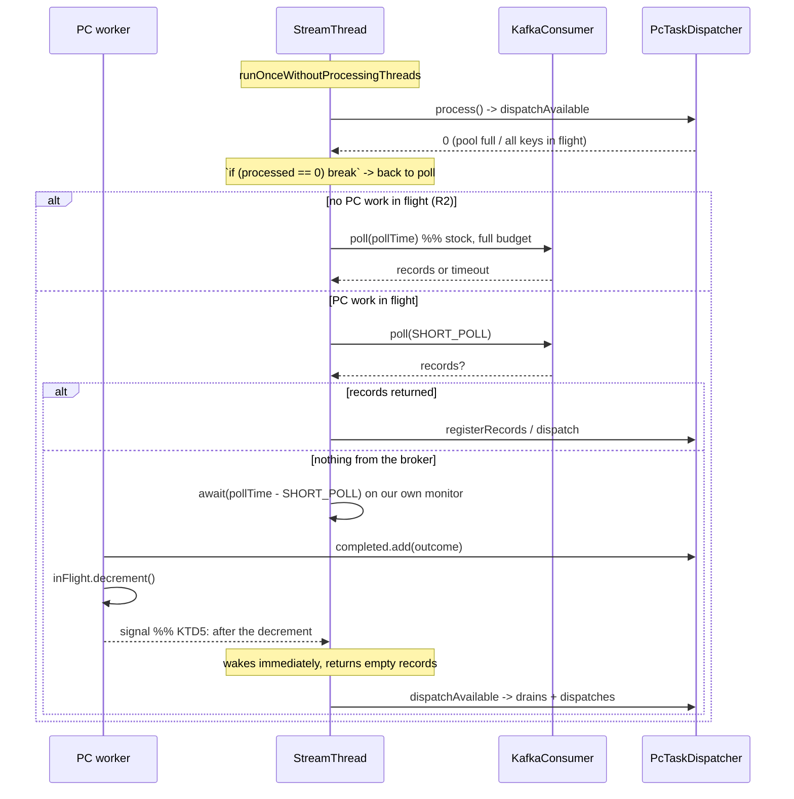
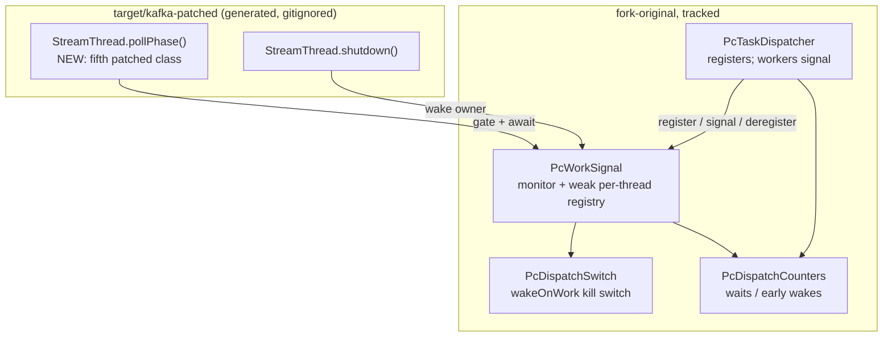

# feat(streams): wake on work, so there is no penalty when PC cannot parallelise

## Goal Capsule

Kafka Streams' `StreamThread` polls the consumer and runs the topology on one thread. Under stock that
coupling is free - while the thread is parked in `Consumer#poll()` there is by definition no processing it
could be doing instead. With `parallel-consumer-streams` dispatching to a background pool the arithmetic
inverts: records complete *during* the poll wait, and their completions cannot be drained nor the next
records dispatched until the thread returns from poll. Throughput becomes bounded by poll cadence rather
than by the work.

Make the poll wait interruptible by our own completions: poll briefly, then block on **our own** condition
for the remainder of the configured `poll.ms` budget, waking the instant a worker completion arrives.

**The success criterion is a measurement, not a green test.** The single-key negative control of
`HeadOfLineBlockingBenchmarkTest` currently measures **0.69x** - PC *slower* than stock, because KEY
ordering permits at most one in-flight record per key and the seam still pays the poll wait on every one.
Getting that arm to approximately **1.0x** is what this unit is for, and it gates the published claim
*"no penalty when you fall back to traditional Kafka Streams usage"* (`pr-ks-spike-next-work.md` item 3).

---

## Problem Frame

Already measured, already confirmed by a one-term control (`docs/plans/2026-08-08-001-feat-ks-on-pc-spike-plan.md:1315-1386`):

| | Async-path overhead vs stock, single key | Experiment A p50 | Experiment A p99 |
|---|---|---|---|
| `poll.ms` = 100 (the default) | ~1695ms | 8.0x | 3.5x |
| `poll.ms` = 1 | ~24ms | **19.1x** | **11.8x** |

About 98% of the measured penalty is poll wait. Lowering `poll.ms` is a **mitigation with its own bill** -
a flat low value busy-spins an idle consumer, which is exactly what the 100ms default exists to prevent -
so the benchmark must keep the default and the fix must be event-driven.

Three things can make work dispatchable, and only one of them arrives through the consumer:

1. **Records from the broker** - delivered by the poll itself. Blocking is correct.
2. **A worker completion** - frees a pool slot or unblocks a KEY shard. The consumer never sees it.
3. **A retry timer** - a record sitting out its backoff. Not live today (retries are disabled in
   `PcTaskDispatcher`), but the signal must be shaped so a timer can raise it without redesign.

**The exit condition makes it worse, not better.** `StreamThread`'s inner work loop breaks back to poll
whenever `processed == 0` (`StreamThread.java:1049-1051`). Under stock that means "the buffers are empty
and blocking is correct". Under an asynchronous dispatcher it *also* means "the pool is full" or "every
available key is already in flight" - states that resolve on a worker completion, never on a broker fetch.
So the loop reliably chooses to block at the precise moments a completion is imminent. Any fix that only
handles the empty-queue case addresses the minority of the cost.

---

## Requirements

- **R1** With PC dispatch active and work in flight, a worker completion must return the `StreamThread`
  from its wait immediately, rather than after the remainder of `poll.ms`.
- **R2** With PC dispatch active and **nothing** in flight, the thread must block in `Consumer#poll()` for
  the full configured budget exactly as stock does - no busy-spin, no reduced broker-record pickup latency.
- **R3** With the seam **off** (`-Dpc.streams.dispatch.enabled=false`), behaviour must be byte-for-byte
  stock: same call, same argument, same code path.
- **R4** `KafkaConsumer#wakeup()` must not be used as the signal, for any reason. (KTD1.)
- **R5** Shutdown must remain correct, and must not regress in latency. A topology closed mid-dispatch must
  close cleanly.
- **R6** The single-key negative control (`HeadOfLineBlockingBenchmarkTest#singleKeyRemovesTheAdvantage`)
  must measure approximately 1.0x at the **default** `poll.ms`, and the positive arm must not regress.
- **R7** Kafka's own suites must still pass with the seam off, unchanged and unweakened: `StreamTaskTest`
  101, `RecordCollectorTest` 59, `ProcessorContextImplTest` 28.
- **R8** The before/after measurement must be a one-term control run on one build - not a comparison
  against a different commit, a different JVM, or a different broker state.

---

## Key Technical Decisions

### KTD1. Build our own condition. Never repurpose `Consumer#wakeup()`.

Settled upstream in the plan (`:1362-1371`) and restated in
`docs/solutions/integration-issues/kafka-streams-couples-polling-and-processing-on-one-thread.md` guidance 6.
`wakeup()` throws `WakeupException` and is the framework's shutdown vocabulary; a wake delivered while the
thread is *not* polling arms the **next** poll instead, so a stray completion signal can swallow a shutdown
one - a failure that shows up once in a thousand shutdowns and never reproduces on demand. Not relitigated.

**Finding that strengthens, not weakens, this decision:** `grep -rn "wakeup" ` over the Kafka Streams 3.9.2
sources returns *no* `Consumer#wakeup()` call at all - `TopologyMetadata.wakeupThreads()` is a `Condition`
signal for the empty-topology park, and `StreamThread.shutdown()` merely sets `PENDING_SHUTDOWN`. So in
3.9.2 the collision is latent rather than live. It is still the wrong mechanism (it is Kafka's to define,
not ours) and the design does not change. Recorded here so a future reader does not "discover" the absence
and conclude the trap was imaginary.

### KTD2. Split the wait inside `pollPhase()`, adding `StreamThread` as the fifth patched class.

`poll()` is only forced on us as the blocking primitive if we accept it as one, and we have patch access.
Patch the `RUNNING`/`STARTING` branch of `StreamThread.pollPhase()` to poll with a **short** timeout to
collect any broker records, then block on our own condition for the remainder of the configured budget.
The consumer is never blocked long enough to need interrupting, the wake is exact, and `wakeup()` keeps its
single existing meaning.

The cost is R8 from the plan: a fifth patched class enlarges the surface re-derived on every Kafka bump, and
carries a licensing obligation (`NOTICE` names the modified classes) and a shadowing-proof obligation
(`ShadowedClassLoadingTest` enumerates them). Accepted: the alternative - having the module set a low
`poll.ms` when the seam is enabled - trades an idle-consumer spin for dispatch latency, cannot see a retry
timer, and is explicitly labelled a mitigation in the written-up analysis.

### KTD3. The wait predicate reads real dispatcher state. No shadow flag.

`docs/solutions/test-flakiness/pc-silent-stall-under-contention-2026-07-29.md` is this repo's own scar:
a duplicated shutdown flag shadowing the real run state made a 2s long-poll silently stop happening, and
the loop busy-spun at ~10kHz while the consumer went zombie. The fix there was state collapse.

So the signal owns **no** "is there work" boolean of its own. It asks the live dispatchers two questions:

- *Should the wait be split at all?* - `inFlight > 0 || completions pending` on any dispatcher owned by
  this thread. False (idle) means take the stock full-budget poll, per R2.
- *Should the wait end?* - completions pending on any dispatcher owned by this thread.

Both are level-triggered reads of state that already exists, which is what makes a lost wakeup impossible:
the completions queue is drained **only** by the StreamThread, inside `dispatchAvailable`, and a waiting
StreamThread is by definition not draining. A worker enqueues its outcome *before* it signals, so a signal
that races the waiter either finds the predicate already true or is delivered under the monitor.

An edge-triggered flag ("a completion happened") would have to be armed and cleared, and the arming point
sits after the previous dispatch pass - so a completion landing in that gap is silently discarded and the
thread waits out the full budget. That bug is the exact shape of the one the scar above records.

### KTD4. Scope the signal per owning thread, and fail safe to stock when scoping is uncertain.

A JVM-global monitor would let one StreamThread's wait be woken by an unrelated task's completion: correct,
but a spin under many threads. The signal is therefore keyed by the `Thread` that constructed the
dispatcher - which is the StreamThread, since `StreamTask` is constructed by `TaskManager` on it.

If that assumption is ever false, the lookup from the poll phase returns **nothing**, the gate reads "no
work in flight", and the thread takes the stock full-budget poll. The failure mode of mis-scoping is
"exactly today's behaviour", not a stall. The registry holds threads and dispatchers **weakly**, so it can
never become the new leak on `prepareRecycle()` - a live dispatcher is always strongly reachable from its
`StreamTask` and from `PcTaskDispatcher.ACTIVE`.

### KTD5. Signal *after* the in-flight decrement, not before.

`runOnWorker` currently enqueues the outcome and then decrements `inFlight` in its `finally`. Signalling
between those two would wake a StreamThread that drains the completion, computes
`capacity = poolSize - inFlight` against a not-yet-decremented counter, dispatches nothing, and parks again
with an empty queue and no further signal coming - a full-budget stall, microseconds wide and impossible to
reproduce on demand. The signal goes last.

### KTD6. Ship a kill switch, and use it as the control arm.

`pc.streams.wakeOnWork.enabled` (default **on** whenever the seam is on) turns the split wait off and
restores the stock call verbatim. Two payoffs: users get an escape hatch on a fifth patched class, and the
before/after measurement becomes a genuine one-term control - same build, same JVM, same broker, same
warm-up, one term - which is what `docs/solutions/best-practices/control-arms-vary-exactly-one-term.md`
requires and what a comparison against the parent commit cannot give.

### KTD7. Add `StreamThreadTest` to the Kafka upstream execution - if, and only if, a control arm says it is honest to.

The module's own rule is "include only the tests of classes you actually patch"
(`docs/solutions/architecture-patterns/patch-a-dependency-at-build-time-without-vendoring-it.md`), and the
hostile-review brief's standing instruction is "do not accept the module's own test suite as evidence". A
fifth patched class with no upstream suite behind it is the weakest link in the 188-test claim.

**Gated on measurement, not on intent.** Run `StreamThreadTest` against the *unpatched* class first
(control arm), then against the patched one. Add it to the pom only if the patched run is no worse than the
control. If the control is already red - Kafka's own environmental flakiness - record the numbers and do not
add it, because a suite that is red before we touch it proves nothing about the patch and would poison a
citable claim. Either outcome is reported with counts.

---

## High-Level Technical Design

### The wait, split

### Where the pieces live

The patch stays thin on purpose: every decision that can live in tracked fork-original code does, so the
number that answers *"how little had to change"* grows as little as possible.

---

## Implementation Units

### U1. `PcWorkSignal` - the condition the StreamThread waits on

**Goal:** A fork-original class holding the monitor, the weak per-owner registry, the two state-derived
predicates, and the bounded wait.

**Requirements:** R1, R2, R4; realises KTD3, KTD4.

**Dependencies:** none.

**Files:**
- `parallel-consumer-streams/src/main/java/io/confluent/parallelconsumer/streams/PcWorkSignal.java` (new)
- `parallel-consumer-streams/src/test/java/io/confluent/parallelconsumer/streams/PcWorkSignalTest.java` (new)

**Approach:**
1. Static registry: owner `Thread` -> signal, held weakly, so a dead StreamThread's entry disappears and
   nothing pins a dispatcher.
2. `registerForCurrentThread(PcTaskDispatcher)` / `deregister(PcTaskDispatcher)`, the latter called from
   both close paths.
3. `hasActiveWorkOnCurrentThread()` - the gate. `inFlight > 0 || pending completions` across this thread's
   dispatchers. Nothing else; see KTD3.
4. `awaitWorkForRemainderOf(Duration fullBudget)` - waits `fullBudget - SHORT_POLL` on the monitor, looping
   on the pending-completions predicate against a nanoTime deadline so a spurious wakeup cannot end it
   early and a real one cannot be missed.
5. `signalWorkAvailable()` - `notifyAll` under the monitor. Named for *what raised it*, not for
   *completion*, because the retry timer is the second raiser (problem frame item 3) and must not need a
   second method.
6. `wakeOwner(Thread)` - lets the patched `shutdown()` end the wait immediately from another thread.
7. `SHORT_POLL` constant lives here, with the reasoning, so the patch reads as intent rather than as a
   magic number.

**Patterns to follow:** `PcDispatchSwitch` for the "static because there is no seam through `KafkaStreams`"
javadoc discipline; `PcTaskDispatcher`'s threading-contract javadoc for stating who may call what.

**Test scenarios** (no broker; plain JUnit):
- A wait with no dispatcher registered returns immediately and reports the stock path (gate false).
- A wait with an idle dispatcher registered (nothing in flight, no completions) reports the gate false.
- A wait with a dispatcher reporting in-flight work reports the gate true.
- A completion enqueued **before** the wait begins makes the wait return without blocking - the lost-wakeup
  case that an edge-triggered flag would fail (KTD3). Assert on elapsed time being far below the budget.
- A completion enqueued from another thread **during** the wait returns it early. Force the coincidence
  with a latch at the enqueue point rather than sleep arithmetic
  (`docs/solutions/test-flakiness/unforceable-trigger-commit-lock-timeout-2026-08-07.md`); assert the
  observed elapsed time, not a proxy counter that leads it
  (`.../vacuous-await-condition-brokerpoller-backpressure-2026-07-31.md`).
- With nothing ever signalling, the wait returns after approximately the requested budget and no longer.
- `wakeOwner` from another thread ends the wait immediately (the shutdown path, R5).
- A spurious `notifyAll` with the predicate still false does not end the wait early.
- A deregistered dispatcher no longer contributes to the gate.

**Verification:** the suite above is green, and the timing assertions are wide enough to survive a loaded
machine while remaining far too tight for a null result (the budget is 100ms; an early wake is single-digit
milliseconds).

### U2. Wire the dispatcher to the signal

**Goal:** `PcTaskDispatcher` registers itself with its owning thread's signal, exposes the two state reads
the predicates need, and signals after every worker outcome.

**Requirements:** R1; realises KTD3, KTD5.

**Dependencies:** U1.

**Files:**
- `parallel-consumer-streams/src/main/java/io/confluent/parallelconsumer/streams/PcTaskDispatcher.java`
- `parallel-consumer-streams/src/test/java/io/confluent/parallelconsumer/streams/PcTaskDispatcherTest.java`

**Approach:**
1. Register with `PcWorkSignal` in the constructor; deregister in `close()` **and** `abortClose()`.
2. Expose `hasPendingCompletions()` alongside the existing `getInFlightCount()`.
3. `runOnWorker`: raise the signal in the `finally`, **after** `inFlight.decrementAndGet()` - KTD5, with the
   reasoning in a comment, because the ordering looks arbitrary and is not.
4. Do **not** signal from the synchronous-completion path inside `dispatchAvailable`: that runs on the
   StreamThread itself, which is not waiting.

**Test scenarios:**
- A worker completion raises the signal, and the raise is observed only after the in-flight count has
  already dropped (KTD5 ordering, asserted rather than assumed).
- A worker **failure** raises the signal too - the failure path is the one that a later refactor forgets.
- A record dropped during preparation (synchronous completion) does not raise the signal.
- `close()` deregisters: the closed dispatcher no longer contributes to the gate.
- `abortClose()` deregisters as well - the crash-injection path must not leave a phantom contributor
  keeping a StreamThread on the split-wait branch forever.

**Verification:** existing `PcTaskDispatcherTest` cases still pass unchanged, plus the above.

### U3. The kill switch

**Goal:** `pc.streams.wakeOnWork.enabled`, default on when the seam is on, so the split wait can be turned
off in one term.

**Requirements:** R3, R8; realises KTD6.

**Dependencies:** none.

**Files:**
- `parallel-consumer-streams/src/main/java/io/confluent/parallelconsumer/streams/PcDispatchSwitch.java`
- `parallel-consumer-streams/src/test/java/io/confluent/parallelconsumer/streams/PcTaskDispatcherTest.java`
  (or the existing switch coverage, wherever `resetToDefault` is exercised)

**Approach:** mirror the existing `ENABLED_PROPERTY` treatment exactly - same parse-or-throw discipline
(a typo must fail loudly rather than silently reading as "off"), same `enable`/`disable`/`resetToDefault`
lifecycle so tests can restore it. Wake-on-work is meaningless with the seam off, so the accessor reports
false whenever the seam is off, and the patch needs only one condition.

**Test scenarios:**
- Default is on when the seam is on.
- Off when the seam is off, regardless of the property.
- An invalid property value throws, naming the property.
- `resetToDefault()` restores it.

**Verification:** unit suite green.

### U4. Counters for the mechanism

**Goal:** two independent diagnostics proving the mechanism fired, so a benchmark result cannot be read as
success while the code path never ran.

**Requirements:** supports R1, R8.

**Dependencies:** U1.

**Files:**
- `parallel-consumer-streams/src/main/java/io/confluent/parallelconsumer/streams/PcDispatchCounters.java`

**Approach:** `getSplitPollWaits()` (the thread took the split-wait branch) and `getWakesOnWork()` (a wait
ended on a signal rather than on the timeout). Two fields, two javadocs, two meanings - per
`docs/solutions/architecture-patterns/a-progress-signal-must-count-work-consumed-not-work-accepted.md`, one
field cannot serve both contracts. Increment structurally, above the branch, so a later-added exit cannot
forget. Extend `reset()`.

**Test scenarios:** covered through U1 and U6 rather than directly - a counter with its own test and no
consumer proves nothing.

**Verification:** the U6 shutdown test and the benchmark both read non-zero values; a zero reading in the
benchmark run means the instrumentation never reached the run, and the number is void
(`docs/solutions/best-practices/chase-refuted-predictions.md` step 3).

### U5. The patch - `StreamThread` as the fifth patched class

**Goal:** the ~10 lines inside Kafka's own source that make the split wait happen, plus the build,
licensing and shadowing-proof obligations that a fifth class carries.

**Requirements:** R1, R2, R3, R4, R5; realises KTD2.

**Dependencies:** U1, U3, U4.

**Files:**
- `parallel-consumer-streams/pom.xml` (`patched.classes`)
- `parallel-consumer-streams/src/main/patch/pc-streams.patch` (regenerated, never hand-edited)
- `parallel-consumer-streams/src/test/java/io/confluent/parallelconsumer/streams/ShadowedClassLoadingTest.java`
- `NOTICE` (repo root - four modified Apache Kafka classes becomes five; a licensing must, not a nicety)
- `parallel-consumer-streams/README.md` (the "four classes" statement)

**Approach:**
1. `patched.classes` gains `StreamThread.java`, with a comment saying why - matching the one-comment-per-file
   convention already there.
2. In `pollPhase()`, the `RUNNING`/`STARTING`/`PARTITIONS_ASSIGNED+stateUpdater` branch becomes: if the gate
   is false, `pollRequests(pollTime)` **verbatim**; otherwise `pollRequests(SHORT_POLL)` and, when that
   returns nothing, `awaitWorkForRemainderOf(pollTime)`. The other three branches (`Duration.ZERO`) are
   untouched - they are already non-blocking and are the shutdown/rebalance paths.
3. In `shutdown()`, wake this thread's signal so a close does not wait out the remaining budget (R5).
4. `ShadowedClassLoadingTest`: `StreamThread` moves from `JAR_RESIDENT` into `GENERATED`. It is currently
   the *control* for "un-generated siblings still come from the jar", so that control needs a replacement -
   `TaskManager` is the honest pick: public, in the same package, and already reached into by the patch
   (`TaskManager.executeAndMaybeSwallow`) without being generated.
5. Regenerate with `bin/regen-patch.sh` **before** any further maven run, and check the hunk count went up.

**Execution note:** the unpack step runs `overWriteReleases=true`, so any maven invocation between editing
`target/kafka-patched/` and running `regen-patch.sh` silently discards the edits. Run the regen first,
every time. And `dependency:unpack` restores archive timestamps, so a build without `clean` can skip
recompiling the generated sources entirely - confirm the new method is actually in the compiled class with
`javap -p -classpath parallel-consumer-streams/target/classes org.apache.kafka.streams.processor.internals.StreamThread`
before believing any measurement.

**Test scenarios:**
- `ShadowedClassLoadingTest` proves `StreamThread` now loads from `/classes/`, not the jar, and that the new
  `JAR_RESIDENT` control still loads from the jar. Without this the whole change could be inert and every
  downstream result a false positive.
- Seam **off**: `StreamTaskTest` 101, `RecordCollectorTest` 59, `ProcessorContextImplTest` 28 - unchanged
  and unweakened (R7).

**Verification:** patch hunk/line count reported before and after; the three Kafka suites at their exact
counts; `javap` confirms the patched method is in `target/classes`.

### U6. Shutdown proof

**Goal:** demonstrate R5 rather than assert it - close a running topology mid-dispatch, with the split wait
demonstrably active, and show it shuts down cleanly.

**Requirements:** R5.

**Dependencies:** U1-U5.

**Files:**
- `parallel-consumer-streams/src/test/java/io/confluent/parallelconsumer/streams/integrationTests/WakeOnWorkShutdownTest.java` (new)

**Approach:** a broker-backed topology whose processor blocks long enough that records are genuinely
in flight and the StreamThread is genuinely parked on our condition; close it while that is true; assert the
close completes well inside its timeout and the thread reaches `DEAD`. Must live in the `integrationTests`
package - `TestConventionRules` (ArchUnit) forces any Testcontainers-backed test there so the plain surefire
forks stay Docker-free.

**Execution note:** prove the precondition before asserting the consequence. A shutdown test that closes
while the thread happens to be somewhere else passes vacuously and says nothing about the hazard - read the
split-poll-wait counter from U4 and assert it is non-zero *before* closing.

**Test scenarios:**
- Close mid-dispatch with work in flight: `KafkaStreams.close(timeout)` returns true well within the
  timeout, no exception surfaces to the uncaught handler, and the split-wait counter was non-zero
  beforehand.
- The same with the kill switch off, as the control - if it also passes, that is expected; the point is that
  the split wait does not *change* the outcome.

**Verification:** green, repeatably. Report the number of repetitions run, not just a verdict
(`docs/solutions/best-practices/` - "cannot reproduce" is not "did not happen").

### U7. The measurement - both arms, before and after, one term

**Goal:** the number this whole unit exists for.

**Requirements:** R6, R8.

**Dependencies:** U1-U5.

**Files:**
- `parallel-consumer-streams/src/test/java/io/confluent/parallelconsumer/streams/integrationTests/HeadOfLineBlockingBenchmarkTest.java`
  (read, and its threshold re-examined - **not** relaxed)

**Approach:**
1. `clean` build first; verify with `javap` that the patched `pollPhase` is in `target/classes`.
2. Run `singleKeyRemovesTheAdvantage` (A3, the control arm) and `fastRecordsDoNotWaitForASlowOne` (A1/A2)
   with the kill switch **off** - the "before" - then with it **on** - the "after". Same build, same JVM
   generation, same broker, one term (KTD6, R8).
3. Do **not** set `poll.ms` in the benchmark. The default-config figure is the honest one; `poll.ms` tuning
   is the mitigation this work exists to replace.
4. Read the counters from U4 in the "after" run. Zero means the mechanism never fired and the number is
   void, however good it looks.
5. Write the predictions down before running: A3 moves from 0.69x to approximately 1.0x; A1/A2 improve or
   hold; nothing regresses. Report refuted predictions as prominently as confirmed ones.

**Execution note:** run on an uncontended machine with test forking at 1. Every flake family in
`docs/inflight/test-load-tightness-flakes.md` is load-dependent and will corrupt timings. The existing
assertions stay as they are: `MAX_SINGLE_KEY_IMPROVEMENT` is an upper bound on the control and this change
pushes the control *up* toward 1.0x from below, so it is not at risk; if any threshold does fail, ask
whether the metric is wrong before touching the number.

**Test scenarios:** the two existing benchmark tests, unmodified. No assertion is weakened or deleted.

**Verification:** four numbers reported (A3 before/after, A1-A2 before/after) with the counters that prove
the path ran.

### U8. Upstream suite for the fifth class - gated

**Goal:** decide, on evidence, whether `StreamThreadTest` joins the Kafka upstream execution.

**Requirements:** supports R7; realises KTD7.

**Dependencies:** U5.

**Files:**
- `parallel-consumer-streams/pom.xml` (surefire `kafka-upstream-tests` includes) - **only if the gate passes**
- `parallel-consumer-streams/README.md` and the pom comment (the 188 count, if it moves)

**Approach:** control arm first - run `StreamThreadTest` against the **unpatched** class, then against the
patched one, and compare. Add the include only if the patched run is no worse. A new include inherits four
non-obvious settings from the existing execution or it fails for reasons unrelated to the patch: the
explicit `pc.streams.dispatch.enabled=false`, the `<groups>`/`<excludedGroups>` overrides, JUnit parallelism
off, and the per-execution SLF4J binding swap.

**Test scenarios:** not applicable - this unit *is* a measurement.

**Verification:** both counts reported, and the decision stated with its reason either way. If the count
moves, it moves in all three places that carry it: the pom comment, the module README, and
`docs/plans/2026-08-08-002-ks-on-pc-spike-result.md` §9.

### U9. Documentation and ledger

**Goal:** leave the written record consistent with the code.

**Dependencies:** U1-U8.

**Files:**
- `docs/inflight/pr-ks-spike-next-work.md` (item 3 - landed, with numbers)
- `docs/solutions/integration-issues/kafka-streams-couples-polling-and-processing-on-one-thread.md`
  (guidance 5 currently says the fix "is open here"; it is not any more)
- `docs/plans/2026-08-08-001-feat-ks-on-pc-spike-plan.md` (the poll-wait section's "this is the design to
  build" becomes "built")
- `parallel-consumer-streams/README.md` (the mechanism, and the kill switch)
- `CHANGELOG.adoc` (`[Unreleased]`) - operator-visible: a new system property and a fifth patched class
- `NOTICE` - see U5

**Approach:** state the measured numbers, not adjectives. The promotional line *"no penalty when you fall
back to traditional Kafka Streams usage"* becomes quotable only if the measurement supports it; if the
control lands at, say, 0.9x rather than 1.0x, say 0.9x.

**Test expectation:** none - documentation.

---

## Scope Boundaries

**In scope:** the split wait, its signal, the kill switch, the counters, the fifth patched class and its
licensing/shadowing obligations, the shutdown proof, the measurement, and the documentation those change.

**Out of scope (true non-goals):**
- Retries. The retry timer is designed *for* (the signal is raised by "work available", not by "a worker
  finished") but retries stay disabled; enabling them is its own change.
- `runOnceWithProcessingThreads` / `__processing.threads.enabled__`. It benefits for free because it calls
  the same `pollPhase()`, but it is internal-config-gated and off by default, and is not being tested.
- Multi-task, multi-thread, and rebalance behaviour. `NUM_STREAM_THREADS_CONFIG` is pinned to 1 in the
  benchmark precisely so the only concurrency is the one under test, and one-partition-one-task-one-instance
  is the limit of what this module has evidence for.

### Deferred to Follow-Up Work
- The four lifecycle divergences in `docs/inflight/pr-streams-task-lifecycle-and-rebalance.md` (suspend-drain
  ordering, `prepareRecycle` not closing the dispatcher, the timed-out drain falling through). U2's
  deregistration keeps the signal from becoming a *new* leak on those paths; it does not fix them.
- Item 4 of the worklist (refusing unsupported DSL APIs) is being done concurrently in another worktree, and
  will conflict in the regenerated patch. That conflict is expected and is resolved at merge, not avoided
  here.

---

## Risks

- **The unpack foot-gun.** Any maven run between editing `target/kafka-patched/` and `regen-patch.sh`
  silently discards the edits, and the hunk-count tripwire only fires when the count goes *down*.
  Mitigation: regen first, every time; check the count went up; `git diff` the patch before committing.
- **The stale-class foot-gun.** `dependency:unpack` restores archive timestamps, so a build without `clean`
  can skip recompiling and a benchmark arm can silently measure the previous build. Mitigation: `clean`
  before any measurement, and `javap` the compiled class.
- **A green result from a path that never ran.** Mitigation: U4's counters, read in U6 and U7; zero is a void
  result.
- **A fifth patched class is permanent maintenance.** Accepted under KTD2, priced in the plan as R8, and
  bounded by the kill switch (KTD6) and by keeping the patch itself thin (the logic is in tracked fork code).
- **Timing tests on a loaded machine.** Mitigation: forking at 1, uncontended box, and assertions on the
  statistic that states the claim rather than on the tail.

---

## Verification Contract

1. `bin/regen-patch.sh` reports a hunk count **higher** than before, and the diff shows only the intended
   `StreamThread` hunks plus the pre-existing four files.
2. `javap -p -classpath parallel-consumer-streams/target/classes org.apache.kafka.streams.processor.internals.StreamThread`
   shows the new method - the instrumentation reached the run.
3. `./mvnw -q -pl .,parallel-consumer-streams test -Dcopyright.skip=true` green, including
   `ShadowedClassLoadingTest` with `StreamThread` in `GENERATED`.
4. Seam off, Kafka's own suites at exactly `StreamTaskTest` 101, `RecordCollectorTest` 59,
   `ProcessorContextImplTest` 28 - no exclusions, no relaxed assertions.
5. `WakeOnWorkShutdownTest` green, with the split-wait counter proven non-zero before the close.
6. Benchmark, both arms, kill switch off then on, on a `clean` build with the default `poll.ms`: A3 moves
   from ~0.69x to ~1.0x and A1/A2 do not regress. Counters non-zero in the "after" run.
7. No existing assertion weakened or deleted anywhere.

## Definition of Done

Every item of the Verification Contract holds; the numbers - patch size before/after, both benchmark arms
before/after, per-suite counts, and the `StreamThreadTest` gate decision - are reported rather than
summarised as "passing"; the documentation in U9 matches the measured reality; and the work is committed
locally on `feats/ks-streams-wake-on-work` with nothing pushed.

## Sources & Research

- `docs/inflight/pr-ks-spike-next-work.md:49-61` - the ranked item and the claim it gates.
- `docs/plans/2026-08-08-001-feat-ks-on-pc-spike-plan.md:1315-1386` - the measurement, the design, the trap,
  and R8's pricing of a fifth patched class.
- `docs/solutions/integration-issues/kafka-streams-couples-polling-and-processing-on-one-thread.md` - the
  written-up analysis, with Kafka source line numbers.
- `docs/solutions/architecture-patterns/patch-a-dependency-at-build-time-without-vendoring-it.md` - the
  patch workflow's foot-guns, the named-not-discovered class list, the `NOTICE` obligation, and the
  "only the tests of classes you patch" rule.
- `docs/solutions/test-flakiness/pc-silent-stall-under-contention-2026-07-29.md` - the shadow-flag scar
  behind KTD3.
- `docs/solutions/architecture-patterns/a-progress-signal-must-count-work-consumed-not-work-accepted.md` -
  two fields, two javadocs, two meanings (U4), and the false-`false` amplification chain this fix interrupts.
- `docs/solutions/best-practices/control-arms-vary-exactly-one-term.md` - why KTD6's kill switch is the
  control arm rather than the parent commit.
- `docs/solutions/best-practices/choose-the-statistic-that-states-the-claim.md` - why the benchmark asserts
  on min and p50 and not on p99.
- `docs/solutions/test-flakiness/unforceable-trigger-commit-lock-timeout-2026-08-07.md` and
  `.../vacuous-await-condition-brokerpoller-backpressure-2026-07-31.md` - how to write U1's wake test so it
  cannot pass vacuously.
- `docs/inflight/pr-streams-task-lifecycle-and-rebalance.md` - the teardown paths U2's deregistration must
  not make worse.
