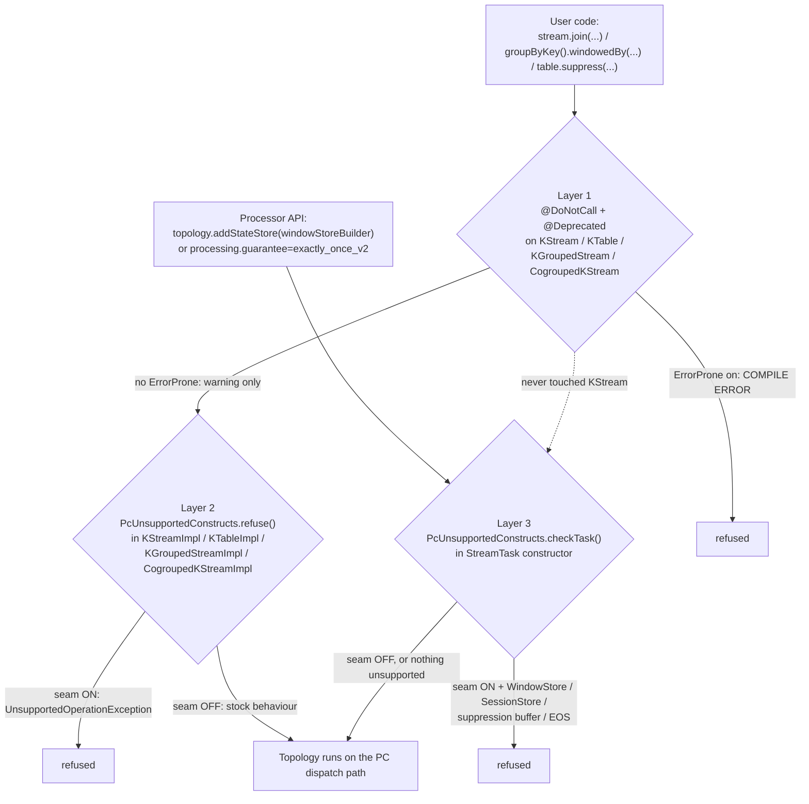

# feat(streams) astubbs#255: refuse the unsupported Kafka Streams surface

## Goal Capsule

Windowed operators, joins, suppression and EOS are broken on the Parallel Consumer dispatch path, and
today nothing stops a user reaching for them - they get silently wrong results. Make that surface refuse
to be used, in three layers, without deleting a single signature.

This is the plan for **U11** of `docs/plans/2026-08-08-001-feat-ks-on-pc-spike-plan.md`, scoped to the
enforcement half. Item 4 of `docs/inflight/pr-ks-spike-next-work.md` is the ranked-worklist entry it
answers.

---

## Problem Frame

The seam defaults **on** (KTD-S6: depending on the artifact is the opt-in). So the moment someone adds
`parallel-consumer-streams` to a classpath, every windowed operator, join and suppression in their
topology starts producing results that are wrong rather than absent:

- **Stream time never advances** on the PC path - `PartitionGroup.nextRecord()` is bypassed - and window
  close, join emission and suppression emission are all stream-time-gated.
- Those operators' `observedStreamTime` fields are non-volatile `long`s doing read-modify-write, so under
  concurrent dispatch they are *corrupted*, not merely reordered.
- `KStreamKStreamJoin.sharedTimeTracker` is mutated from both join sides with no synchronisation.
- EOS is out of scope by KTD7: the Streams transaction is per-`StreamThread`, covering every task on that
  thread, so one task's work cannot be committed without committing every in-flight worker's.

None of this throws. Nothing logs. The topology runs and the numbers are wrong. That is the defect this
plan removes - not by fixing the semantics (that is U13 and beyond) but by making the construct
unreachable while it is unproven.

**The rule this establishes, per item 4:** an API comes back when Kafka's own suite exercises it with the
seam **on** and passes - evidence-gated, not judgement-gated.

---

## Requirements

| ID | Requirement |
|----|-------------|
| R1 | Calling a windowed operator, join or suppression on the PC path fails, with a message that names the construct and says how to turn the seam off. |
| R2 | A seam-**off** run is behaviourally identical to stock Kafka Streams. Kafka's own 419 tests keep passing unmodified, zero failures, zero assertions relaxed. |
| R3 | Every affected method signature survives. Kafka's own test suite calls `join`, `windowedBy` and `suppress` heavily; deleting them stops that suite compiling and forfeits the 419-test evidence. |
| R4 | A call site gets a **compile-time** error under ErrorProne, and a plain deprecation warning without it. |
| R5 | The Processor API route is covered. A user can build a `WindowStore` through `Topology.addStateStore` without ever touching `KStream`. |
| R6 | EOS is refused at the same boundary, from configuration rather than from topology shape. |
| R7 | The licence obligation tracks the change: `NOTICE` names every Apache Kafka class this fork modifies. |
| R8 | The change stays inside `parallel-consumer-streams`, except where a repo-root file is legally or structurally required (`NOTICE`). |

---

## Key Technical Decisions

**KTD1. Three layers, each covering what the one before it cannot.**

| Layer | Mechanism | Fires at |
|-------|-----------|----------|
| 1 | `@DoNotCall` + `@Deprecated` on the DSL **interface** methods | compile time |
| 2 | `UnsupportedOperationException` from the DSL **impl** bodies, guarded on `PcDispatchSwitch.isEnabled()` | topology construction |
| 3 | `ProcessorTopology` + `eosEnabled` check in the `StreamTask` constructor | task construction - and the only layer that covers the Processor API |

Layer 3 alone would refuse everything layers 1 and 2 refuse, just later. Layers 1 and 2 exist because
"later" means after a broker connection and a rebalance, and because a compile error costs nothing to
receive.

**KTD2. Layer 1 goes on the interfaces, layer 2 on the impls - both are required, and neither substitutes
for the other.** ErrorProne resolves a call site to the symbol its receiver's static type declares. A user
writing `stream.join(...)` against a `KStream` variable resolves to `KStream#join`, so an annotation on
`KStreamImpl` is invisible there. Conversely an interface method has no body to throw from. This is why
the patched-class count grows by eight and not four.

**KTD3. Layer 2 goes in the private funnels, not on all 59 public overloads.** Kafka's DSL impls already
delegate every overload into a small number of private methods - `KStreamImpl.doJoin`,
`doStreamTableJoin`, `globalTableJoin`; `KTableImpl.doJoin` and the foreign-key join entry;
`KGroupedStreamImpl.windowedBy` (3); `CogroupedKStreamImpl.windowedBy` (3). Guarding the funnels refuses
every overload with a fraction of the patch. Layer 1 still has to be per-overload, because the compiler
resolves per-overload.

**KTD4. The guard logic lives in our own module, not in the patch.** A new
`io.confluent.parallelconsumer.streams.PcUnsupportedConstructs` owns the seam check, the message text and
the topology inspection. Each patched site becomes a single call. This keeps the patch small (KTD-S1 -
the patch's line count is the spike's answer to "how little had to change"), keeps the messages DRY across
thirteen call sites, and makes the whole thing testable as ordinary Java rather than only through a
topology.

**KTD5. Every layer is guarded on `PcDispatchSwitch.isEnabled()`, including the EOS backstop.** This is
the load-bearing constraint. `StreamTaskTest` pile E is
`should(Not)ProcessRecordsAfterPrepareCommitWhenEos*` - three cases that construct an EOS-enabled
`StreamTask`. An unguarded backstop turns those into constructor errors, and the 419-test seam-off claim
is void. The seam-off arm must stay byte-for-byte stock behaviour.

**KTD6. `error_prone_annotations` is promoted to compile scope in this module's pom.** It is currently on
the tree at 2.41.0 at **test** scope only (verified with `dependency:tree`), and the annotation type must
resolve when compiling the patched *main* sources. It is an annotations-only, dependency-free, Apache-2.0
artifact, so compile scope costs consumers nothing and lets their ErrorProne resolve the annotation.

**KTD7. Refuse the named-broken set, not the whole surface.** Item 4 also floats a stronger rule - invert
the default, refuse every public API until Kafka's suite proves it. That is a much larger change with a
much larger blast radius on the 419, and it is not what this plan implements. See Open Questions.

---

## High-Level Technical Design

Where each layer sits relative to a user's program:

What layer 3 inspects, and from where:

| Unsupported construct | Detected by |
|---|---|
| Windowed operators | a `ProcessorTopology.stateStores()` entry that is a `WindowStore` |
| Session operators | a `stateStores()` entry that is a `SessionStore` |
| Suppression | a `stateStores()` entry that is a `TimeOrderedKeyValueBuffer` |
| EOS | `config.eosEnabled` on the `TaskConfig` - configuration, not topology |

Verified against the Kafka 3.9.2 sources: `ProcessorTopology` exposes `stateStores()` returning the
constructed `StateStore` instances, and `StreamTask`'s constructor already holds both the topology and the
config - so layer 3 costs **no new patched class**.

---

## Scope Boundaries

### In scope

- Windowed and session operators (`windowedBy` on `KGroupedStream` and `CogroupedKStream`)
- All joins: KStream-KStream, KStream-KTable, KStream-GlobalKTable, KTable-KTable, KTable-KTable
  foreign-key
- Suppression (`KTable.suppress`)
- EOS (`processing.guarantee`)

### Non-goals

- **Fixing** any of these constructs. Stream time under concurrency is item 5 / U13; EOS is out of scope
  for v6 by KTD7. This plan refuses, it does not repair.
- Reinstating anything. The gate for reinstatement is Kafka's own suite passing with the seam on
  (item 6), and nothing in this plan opens it.
- A restricted builder of our own. Additive and bypassable; the plan document already parks it.

### Deferred to follow-up work

- **Inverting the default** for the whole public surface (KTD7 above, and Open Questions below).
- Annotating the impl overrides with `@DoNotCall` for ErrorProne's override-consistency check. Nothing in
  this repo compiles those sources under ErrorProne, so it buys nothing today and costs ~50 hunks.
- Widening `ShadowedClassLoadingTest`'s negative control. It currently pins `StreamThread` as
  jar-resident; that stays valid.

---

## Assumptions

Recorded rather than confirmed, because this plan was produced without an interactive user:

- **A1.** The eight new shadowed classes are an acceptable cost. This takes `patched.classes` from 4 to
  12, and `docs/solutions/architecture-patterns/patch-a-dependency-at-build-time-without-vendoring-it.md`
  names "roughly a dozen" as the point where the sprawl is itself the answer and you are maintaining a
  fork by instalments. Twelve is *at* that line. The alternative that stays at five - drop layer 2 and put
  everything in a single `InternalStreamsBuilder` graph-node check - is recorded in Open Questions.
- **A2.** `NOTICE` may be edited. It is a repo-root file, outside `parallel-consumer-streams`, but Apache
  2.0 §4(b) requires it to name every modified Apache Kafka class, and it currently names exactly four.
- **A3.** The `parallel-consumer-streams/README.md` "Known gaps" paragraph should be updated in this pass.
  It currently says these constructs "do not work"; after this change they refuse, which is a different
  and better claim.

---

## Implementation Units

### U1. `PcUnsupportedConstructs` - the refusal logic, in our own module

**Goal:** One place that owns the seam guard, the message text, and the topology inspection, so the patch
carries call sites rather than logic.

**Requirements:** R1, R5, R6, R8

**Dependencies:** none

**Files:**
- `parallel-consumer-streams/src/main/java/io/confluent/parallelconsumer/streams/PcUnsupportedConstructs.java` (new)
- `parallel-consumer-streams/src/test/java/io/confluent/parallelconsumer/streams/PcUnsupportedConstructsTest.java` (new)

**Approach:**
1. A `refuse(String construct)` entry point: no-op when `PcDispatchSwitch.isEnabled()` is false, throws
   `UnsupportedOperationException` when true. This is the layer-2 call site shape - one line in the patch.
2. A task-construction entry point taking the topology's state stores and the `eosEnabled` flag, so the
   patched `StreamTask` passes data rather than importing inspection logic. Same seam guard.
3. One shared message builder so all thirteen call sites and the backstop produce the same shape: what was
   refused, why it is refused (named, with the issue reference), and the exact system property that turns
   the seam off.
4. Store classification by interface, not by class name: `WindowStore`, `SessionStore`,
   `TimeOrderedKeyValueBuffer`. The stores reaching `ProcessorTopology.stateStores()` are wrapped
   (`MeteredWindowStore`, `ChangeLoggingWindowBytesStore`, ...) and every wrapper implements the interface
   it wraps, so `instanceof` is the durable test and a name match is not.
5. Report **all** unsupported constructs found in one topology, not just the first, so a user fixing a
   windowed aggregation does not then discover a join.

**Patterns to follow:** `PcDispatchSwitch` for the final-class-with-static-members shape, the javadoc
voice, and the "state the requirement at the site" discipline. Copyright header: `package` line, blank
line, then `/*- Copyright (C) 2026 Antony Stubbs and contributors */`.

**Test scenarios:**
- Seam off: `refuse` returns normally for every construct name.
- Seam on: `refuse` throws `UnsupportedOperationException`, and the message contains the construct name.
- Seam on: the message names `pc.streams.dispatch.enabled=false` and the issue reference, for every
  construct.
- Seam off: the task check passes a topology carrying a `WindowStore`, a `SessionStore`, a suppression
  buffer, and `eosEnabled=true` - all four at once, none of them refused.
- Seam on, one store of each unsupported kind in isolation: refused, message names that kind.
- Seam on, `eosEnabled=true` with an otherwise-empty store list: refused, message names exactly-once.
- Seam on, several unsupported constructs in one topology: the single message names every one of them.
- Seam on, a plain `KeyValueStore` and `eosEnabled=false`: passes. This is the non-windowed stateful case
  KTD3 explicitly supports, and refusing it would break `PcDrivenStatefulProofTest`.
- Seam on, an empty store list: passes.

**Verification:** The class is exercisable without a topology, a broker, or a `StreamTask`.

---

### U2. Layer 1 - annotate the DSL interfaces

**Goal:** Make a call site a compile error under ErrorProne and a deprecation warning without it, while
every signature survives.

**Requirements:** R3, R4

**Dependencies:** U1 (for the message vocabulary; not a build dependency)

**Files:**
- `parallel-consumer-streams/pom.xml` - add the four interfaces to `patched.classes`; add
  `error_prone_annotations` at compile scope
- generated: `org/apache/kafka/streams/kstream/KStream.java` (28 join overloads)
- generated: `org/apache/kafka/streams/kstream/KTable.java` (24 join overloads + `suppress`)
- generated: `org/apache/kafka/streams/kstream/KGroupedStream.java` (3 `windowedBy`)
- generated: `org/apache/kafka/streams/kstream/CogroupedKStream.java` (3 `windowedBy`)
- `parallel-consumer-streams/src/main/patch/pc-streams.patch` - regenerated

**Approach:**
1. Two lines per method, no more: `@Deprecated` and `@DoNotCall("<reason>")`. `@DoNotCall`'s optional
   `value` carries the reason, so no javadoc edit is needed and the patch stays proportional to the method
   count rather than to the file size.
2. Group the reason strings by construct so the compile error a user sees matches the runtime message
   layer 2 produces for the same call.
3. Do **not** annotate the impl overrides. See Scope Boundaries.
4. `error_prone_annotations` needs a module-local, explicitly-versioned declaration following the
   `jackson-databind` precedent in the same pom, with a comment saying why the transitive test-scope copy
   is not enough.

**Execution note:** This is the unit most likely to surface a compile surprise, because it is the first
time this module shadows a *public API* class rather than a `processor.internals` one. Compile the module
before writing any test, and read the compiler output for deprecation noise coming from the impls that
override these now-deprecated methods.

**Test scenarios:**
- Reflectively enumerate every `join`, `leftJoin`, `outerJoin` on `KStream` and `KTable`, every
  `windowedBy` on `KGroupedStream` and `CogroupedKStream`, and `KTable.suppress`; assert each carries
  `@Deprecated`. `java.lang.Deprecated` is runtime-retained, so this is exhaustive by construction and
  catches a missed overload - which a hand-written list would not.
- Assert the count of methods found is non-zero for each interface, so a rename upstream fails the test
  rather than silently making it vacuous.
- Assert the `com.google.errorprone.annotations.DoNotCall` descriptor is present in each of the four
  compiled interfaces' class files. `@DoNotCall` is `CLASS`-retained so reflection cannot see it; read the
  class file resource and look for the descriptor in the constant pool. Document in the test why the
  weaker per-class assertion is what is available.
- Assert a control: a supported method on the same interface (e.g. `KStream.mapValues`) is **not**
  deprecated, so the test would fail if the annotation were applied indiscriminately.

**Verification:** `KStream`, `KTable`, `KGroupedStream` and `CogroupedKStream` compile into
`target/classes` and win over the jar.

---

### U3. Layer 2 - throw from the DSL impl funnels

**Goal:** A seam-on topology refuses at construction, with a message naming the construct. A seam-off
topology is untouched.

**Requirements:** R1, R2

**Dependencies:** U1, U2

**Files:**
- `parallel-consumer-streams/pom.xml` - add the four impls to `patched.classes`
- generated: `org/apache/kafka/streams/kstream/internals/KStreamImpl.java` - `doJoin`,
  `doStreamTableJoin`, `globalTableJoin`
- generated: `org/apache/kafka/streams/kstream/internals/KTableImpl.java` - `doJoin`, the foreign-key join
  entry, `suppress`
- generated: `org/apache/kafka/streams/kstream/internals/KGroupedStreamImpl.java` - 3 `windowedBy`
- generated: `org/apache/kafka/streams/kstream/internals/CogroupedKStreamImpl.java` - 3 `windowedBy`
- `parallel-consumer-streams/src/main/patch/pc-streams.patch` - regenerated
- `parallel-consumer-streams/src/test/java/io/confluent/parallelconsumer/streams/UnsupportedDslConstructsTest.java` (new)

**Approach:**
1. One line at the top of each funnel: the `PcUnsupportedConstructs` call, plus a short comment naming
   astubbs#255 in the style the existing patch uses.
2. Place the guard as the **first** statement, before any argument validation, so the refusal is what the
   user sees rather than an NPE from a null joiner.
3. Confirm the funnel set by reading the generated sources - do not assume the delegation shape from the
   method list. If any public overload does not reach a funnel, guard that overload directly and say so.

**Patterns to follow:** the existing `StreamTask` patch hunks - a `// PC dispatch (astubbs#255): ...`
comment above each inserted line, explaining why rather than what.

**Test scenarios:** each built against a `StreamsBuilder`, with the switch state stated explicitly at the
site.
- Seam on, `stream.join(otherStream, joiner, JoinWindows)`: throws, message names the KStream-KStream
  join.
- Seam on, `stream.leftJoin` and `stream.outerJoin` against another stream: throws.
- Seam on, `stream.join(table, joiner)`: throws, message names the KStream-KTable join.
- Seam on, `stream.join(globalTable, keyMapper, joiner)`: throws, message names the GlobalKTable join.
- Seam on, `table.join(otherTable, joiner)`: throws, message names the KTable-KTable join.
- Seam on, `table.join(otherTable, foreignKeyExtractor, joiner, Materialized)`: throws, message names the
  foreign-key join.
- Seam on, `groupByKey().windowedBy(TimeWindows)`, `windowedBy(SlidingWindows)`,
  `windowedBy(SessionWindows)`: each throws, message names windowing.
- Seam on, `cogroup(...).windowedBy(TimeWindows)`: throws.
- Seam on, `table.suppress(Suppressed.untilWindowCloses(...))`: throws, message names suppression.
- Seam on, every message contains the property that turns the seam off.
- **Control arm, seam off:** every one of the above builds a topology without throwing. This is the R2
  claim at unit scale, and without it the guard could be unconditional and nothing here would notice.
- Seam on, a supported topology (`stream -> mapValues -> to`) builds normally - so the guard is proven to
  discriminate rather than to refuse everything.

**Verification:** Kafka's 419 stay green (they run seam-off), and every blocked construct refuses
seam-on with a construct-naming message.

---

### U4. Layer 3 - the `StreamTask` backstop

**Goal:** Cover the Processor API, which reaches a `WindowStore` without ever touching `KStream`, and
cover EOS, which is configuration rather than topology shape.

**Requirements:** R1, R5, R6

**Dependencies:** U1

**Files:**
- generated: `org/apache/kafka/streams/processor/internals/StreamTask.java` - one call in the constructor
- `parallel-consumer-streams/src/main/patch/pc-streams.patch` - regenerated
- `parallel-consumer-streams/src/test/java/io/confluent/parallelconsumer/streams/ProcessorApiBackstopTest.java` (new)

**Approach:**
1. Call the U1 task check from the constructor, immediately **before** `pcDispatcher` is created, so a
   refused task never allocates a worker pool it will not shut down.
2. Pass `topology.stateStores()` and `config.eosEnabled`; the patched file stays a call site.
3. The guard is inside `PcUnsupportedConstructs`, on `PcDispatchSwitch.isEnabled()` - KTD5. Do not add a
   second guard at the call site; one authority for the seam state.

**Execution note:** Run Kafka's `StreamTaskTest` seam-off immediately after this unit and before writing
its tests. Pile E constructs EOS-enabled tasks, and a guard mistake here shows up there first and most
cheaply.

**Test scenarios:** `TopologyTestDriver` is the vehicle - it constructs a real `StreamTask` (confirmed
against the 3.9.2 bytecode), so it exercises the patched constructor without a broker.
- Seam on, a Processor-API topology with `Stores.windowStoreBuilder` added via `Topology.addStateStore`
  and connected to a processor: construction fails, message names the window store. **This is the case
  the DSL route cannot reach and the whole reason layer 3 exists.**
- Seam on, the same with `Stores.sessionStoreBuilder`: construction fails, message names the session
  store.
- Seam on, `processing.guarantee=exactly_once_v2` on an otherwise-supported topology: construction fails,
  message names exactly-once. If `TopologyTestDriver` does not propagate the guarantee into
  `TaskConfig.eosEnabled`, say so and cover EOS through the U1 unit test alone rather than asserting
  something the vehicle cannot express.
- **Control arm, seam off:** each of the three above constructs successfully.
- Seam on, a Processor-API topology with a plain `Stores.keyValueStoreBuilder`: constructs successfully -
  the non-windowed stateful case stays supported.
- Seam on, a stateless Processor-API topology: constructs successfully.

**Verification:** A topology that never mentions `KStream` still refuses, and a seam-off run of the same
topology does not.

---

### U5. Keep the shadowing proof, the licence and the docs in step

**Goal:** The three things that go stale silently when `patched.classes` grows.

**Requirements:** R2, R7, R8

**Dependencies:** U2, U3

**Files:**
- `parallel-consumer-streams/src/test/java/io/confluent/parallelconsumer/streams/ShadowedClassLoadingTest.java`
- `NOTICE` (repo root - see A2)
- `parallel-consumer-streams/README.md`
- `parallel-consumer-streams/pom.xml` - the `patched.classes` comment explaining the grown list

**Approach:**
1. `ShadowedClassLoadingTest.GENERATED` carries a binding comment requiring it to match `patched.classes`.
   Add all eight new classes. A class that is generated but missing there is unguarded; one listed but not
   generated fails loudly - both are the behaviour we want.
2. `NOTICE` names exactly four modified Apache Kafka classes today. Apache 2.0 §4(b) makes this an
   obligation, not bookkeeping. Add the eight.
3. The README's "Known gaps" paragraph says windows, joins and suppression "do not work". After this
   change they *refuse*. Rewrite that sentence, and the field-report template bullet that asks reporters
   for "windowed, joins" topology shapes - a topology that refuses cannot produce that report.
4. The **419 must not change** - it is a seam-off number and this change is seam-guarded. If it does
   change, that is a defect in the guard, not a number to update. The README's three-places rule stays
   untouched.

**Test scenarios:**
- `ShadowedClassLoadingTest.generatedClassesWinOverTheJar` covers all thirteen classes and passes.
- `unGeneratedSiblingsStillComeFromTheJar` still passes - one jar-resident sibling per generated package
  (`TaskManager`, `Materialized`, `ConsumedInternal`), so this is still shadowing rather than a fork.
- `generatedAndJarClassesShareOneRuntimePackage` passes for the new `kstream` and `kstream.internals`
  classes, which are in *different* packages from the existing four - so this assertion is doing new work.

**Verification:** `NOTICE` lists every shadowed class; the README describes refusal rather than silent
breakage; the shadowing proof covers the full generated set.

---

## Verification Contract

Run in this order. Each gate answers a different question.

| Gate | Command | What it proves |
|---|---|---|
| G1 | `./mvnw -q -pl .,parallel-consumer-streams test -Dcopyright.skip=true` | Module unit tests green, and Kafka's 419 with them (they run in the module's normal `test` phase, no profile). |
| G2 | Kafka's `StreamTaskTest` = **101**, `RecordCollectorTest` = **59**, `ProcessorContextImplTest` = **28**, `StreamThreadTest` = **231** (with its own 21 Kafka-annotated skips), zero failures, seam **off** | R2. The behaviour-preservation claim. Read the per-suite numbers from `target/surefire-reports-kafka-upstream/`, not from the aggregate line. |
| G3 | The new seam-**on** unit tests | R1, R5, R6. Each blocked construct refuses and the message names it. |
| G4 | The seam-**off** control arms inside those same tests | That the guard is conditional. Without this, an unconditional guard passes G3 and silently fails G2's intent. |
| G5 | `parallel-consumer-streams/bin/regen-patch.sh` hunk count | That no edit was lost to the unpack foot-gun. The count must go **up**; a drop means a Maven run landed between editing and regenerating. |

**Non-negotiable:** no existing assertion is weakened, relaxed or deleted to make any of this pass. If an
existing test genuinely must change, that is a finding to report, not a change to make quietly.

---

## Risks

| Risk | Mitigation |
|---|---|
| **The EOS backstop breaks `StreamTaskTest` pile E seam-off.** Three cases construct EOS-enabled tasks. | KTD5 - the guard is on `PcDispatchSwitch.isEnabled()`, and G2 is run immediately after U4 rather than at the end. |
| **A stray Maven run discards the generated-tree edits.** The unpack step overwrites without saying so. | Run `regen-patch.sh` before any Maven invocation. G5 is the tripwire; a falling hunk count means work was lost. |
| **Shadowing a public API class behaves differently from shadowing an internal one.** `KStream` is on every user's compile classpath. | U2's execution note compiles before testing. `ShadowedClassLoadingTest` is extended in U5 to prove the new classes still win. |
| **`patched.classes` reaches thirteen** - past the stated point at which "you are maintaining a fork by instalments". | Recorded as A1 and surfaced in Open Questions with a concrete cheaper alternative, rather than absorbed silently. |
| **Deprecation warnings from the impls overriding now-deprecated interface methods.** | Read at U2. If javac is noisy, a class-level suppression on the four impls is one line each; do not add `@Deprecated` to 50 overrides. |
| **The refusal catches a construct that actually works.** A plain `KeyValueStore` must stay supported (KTD3) or `PcDrivenStatefulProofTest` breaks. | Explicit positive-control scenarios in U1 and U4. |

---

## Open Questions

- **OQ1. Should the default be inverted for the whole public surface?** Item 4 argues the stronger rule:
  every public Kafka Streams API starts refused until Kafka's own suite proves it with the seam on. This
  plan implements the narrower, named set. The stronger rule needs item 6 (run the whole suite) to have
  landed first, or the refused surface is defined by what nobody has looked at. Deferred, not rejected.
- **OQ2. Is thirteen shadowed classes the right trade for layer 2?** The cheaper shape is to drop the four
  DSL impls and put a single check in `InternalStreamsBuilder`, keyed on the graph-node types the DSL
  builds (`StreamStreamJoinNode`, `StreamTableJoinNode`, and the windowed store builders) - five shadowed
  classes instead of thirteen, at the cost of a slightly less direct message and a check that is one step
  removed from the method the user called. Recorded here because the settled approach names the method
  bodies explicitly, so this plan follows it; the alternative is real and cheap to switch to.
- **OQ3. Does `TopologyTestDriver` propagate `processing.guarantee` into `TaskConfig.eosEnabled`?** If not,
  the EOS backstop is provable only at U1's unit level plus a broker-backed integration test. Resolve by
  running, not by reading - and report which it was.

---

## Definition of Done

- Every windowed operator, join, suppression entry point and EOS configuration refuses on the PC path,
  with a message naming the construct and the property that turns the seam off.
- The Processor API route is refused by its own test, not only by the DSL's.
- Every signature survives. Kafka's suite still compiles and still runs.
- `StreamTaskTest` 101, `RecordCollectorTest` 59, `ProcessorContextImplTest` 28, zero skipped, seam off.
- Seam-off control arms exist for every seam-on refusal test.
- No existing assertion weakened or deleted.
- `NOTICE`, `ShadowedClassLoadingTest` and `parallel-consumer-streams/README.md` are consistent with the
  grown patched-class set.
- The regenerated patch's hunk count is recorded, before and after.

---

## Sources

- `docs/inflight/pr-ks-spike-next-work.md` - item 4, the origin worklist entry
- `docs/plans/2026-08-08-001-feat-ks-on-pc-spike-plan.md` - U11, the KTDs, the triage table (piles A-H),
  the "Cutting the unsupported API surface" design section, and Current Shortcomings
- `docs/solutions/architecture-patterns/patch-a-dependency-at-build-time-without-vendoring-it.md` - the
  patch workflow, the stop-threshold, and the `NOTICE` obligation
- `docs/solutions/workflow-issues/copyright-header-rules-for-fork-2026-04-21.md` - header format
- `parallel-consumer-streams/bin/regen-patch.sh` - the workflow and its foot-gun
- Apache Kafka 3.9.2 sources, read directly from the published sources jar
