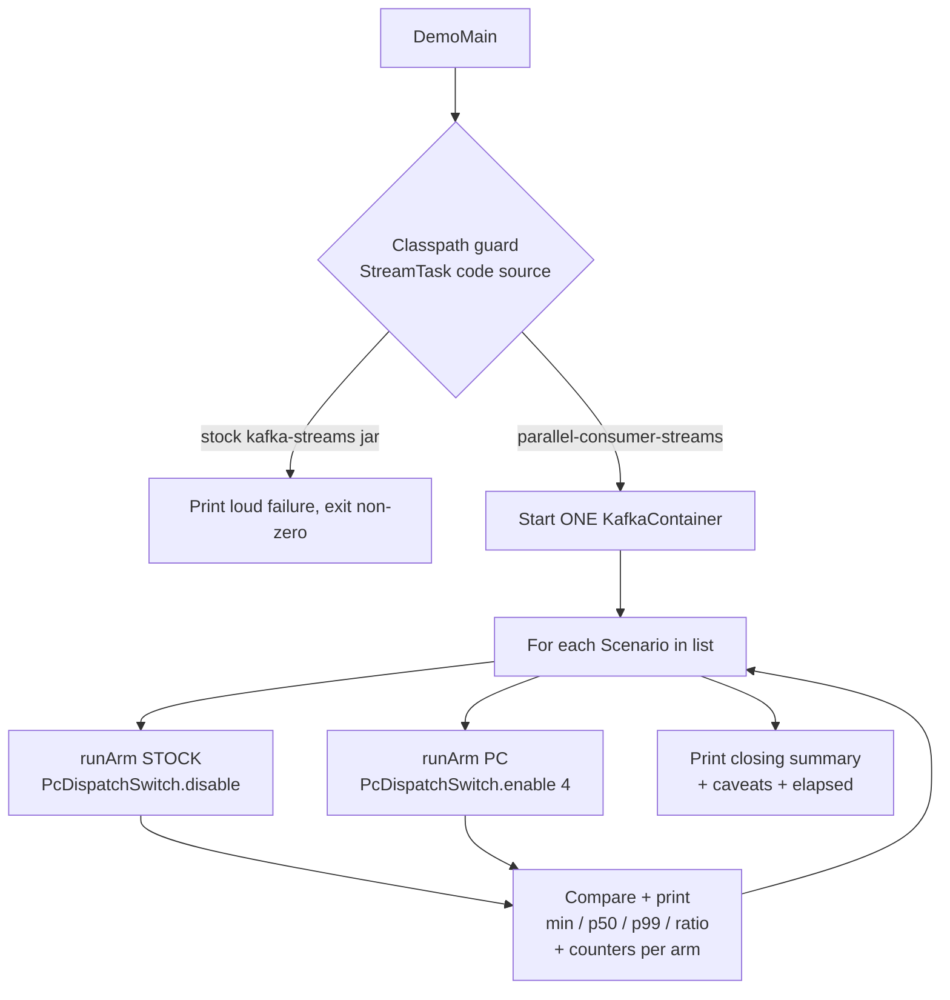
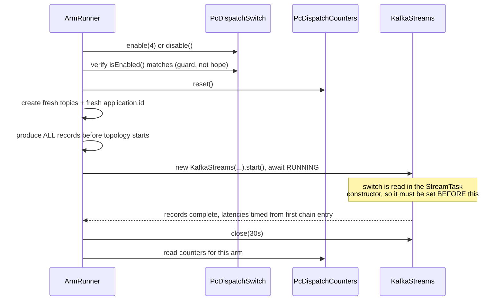

# feat: A runnable example that shows Parallel Consumer driving Kafka Streams

## Goal Capsule

Build a new example module under `parallel-consumer-examples/` whose `main()` a human runs with one
command, watches, and comes away believing three things: Parallel Consumer really is driving a Kafka
Streams topology, head-of-line blocking really does disappear, and the evidence for both is on screen
rather than asserted by a test they did not run.

The reader is a person reading console output. That is the whole design constraint, and it is what
separates this from `HeadOfLineBlockingBenchmarkTest`, which proves the same effect to a CI machine.

---

## Problem Frame

`parallel-consumer-streams` (astubbs#255) is currently provable only by running its test suite. The
existing streams example, `parallel-consumer-examples/parallel-consumer-example-streams`, shows the
*old* answer to slow processing in Kafka Streams: preprocess in a topology, write to a topic, and let a
separate Parallel Consumer instance do the slow work downstream. Nothing in the examples tree shows that
the hop is no longer needed.

`docs/inflight/next-streams-module-graduation.md` names this gap as the first item blocking the module's
graduation out of "spike", and records an unresolved ambiguity about what shape the demonstration takes.
That ambiguity is settled here (KTD1).

Two failure modes make this harder than "write a main()":

- **The interesting failure is silent.** If the patched `StreamTask` loses the classpath race, the demo
  runs pure stock Kafka Streams, produces beautiful output, and proves nothing. Recorded as practice 7
  in `docs/solutions/architecture-patterns/patch-a-dependency-at-build-time-without-vendoring-it.md`.
- **The flattering number is a lie on its own.** The measured effect is 57x on the minimum, but the
  single-key control is 0.69x - PC is *slower* there. `docs/inflight/next-fork-packaging-docs-and-licensing.md`
  section 1 records a house rule: never print the 57x without the control and its two caveats.

---

## Requirements

| ID | Requirement |
|----|-------------|
| R1 | A new module `parallel-consumer-examples/parallel-consumer-example-streams-pc` with a `main()` runnable by one documented command, needing no pre-existing Kafka broker. |
| R2 | The head-of-line blocking effect is demonstrated with BOTH arms in one JVM run, varying only `PcDispatchSwitch`. Output states that exactly one term varies. |
| R3 | Output reports, per arm, at minimum the quickest and median fast-record latency, plus the ratio between arms. |
| R4 | Output prints `PcDispatchCounters` readings per arm, so PC's involvement is evidenced rather than asserted. Stock arm must read 0 dispatched-to-pool; PC arm must read the full record count. |
| R5 | Output prints the code source location of the patched `StreamTask`. If it resolves to the stock `kafka-streams` jar, the run fails loudly and immediately, before any measurement. |
| R6 | The unflattering single-key result is shown, not hidden, and is not spun. No claim of "no penalty" anywhere. |
| R7 | A short module `README.md`: what it demonstrates, the one command, expected output, caveats. |
| R8 | The demonstration shape is reusable, so a later branch adds a scenario without restructuring existing code. |
| R9 | Repo copyright headers on every new `.java` file; `bin/check-copyright-headers.sh` passes. |
| R10 | No em-dash or double-dash characters anywhere. Issue references fully qualified (`astubbs#255`). |
| R11 | Cold-run wall-clock is a design constraint, measured and reported, not an emergent outcome. |
| R12 | `parallel-consumer-example-streams` is not modified. `parallel-consumer-streams/src/main/patch/pc-streams.patch` is not touched. |

---

## Key Technical Decisions

**KTD1. A new sibling module, and the example itself is the inversion.**
*(session-settled: user-directed - chosen over demoting the existing streams example: the existing module is the provably-external stock baseline generator for the whole streams module.)*
Governs R1, R12. `docs/inflight/next-streams-module-graduation.md` left two readings of "or invert it"
open. The coordinator's brief settles it: a **new sibling module**, running the same workload both ways,
making the inversion the demonstrated thing. This is also forced technically -
`parallel-consumer-example-streams/src/test/java/.../StockBaselineFixtureSupport.java` asserts that
`PcDispatchSwitch` is `ClassNotFoundException` in that module's JVM. Adding the dependency there would
red-build the streams module's entire evidence chain.

**KTD2. Version 1 demonstrates only what `feats/ks-on-pc-spike` carries.**
*(session-settled: user-directed - chosen over building the full stack demo up front: the example should layer like the branches do, so it lands with the first thing that merges instead of waiting behind the whole stack.)*
No refused-construct blocks, no `-Ddemo.showRefusal` flag, no wake-on-work claims. Those APIs are not
refused on this branch, so the blocks would either not compile or silently do nothing. Later branches
extend this example as part of their own change, which is what R8 exists to make cheap.

**KTD3. The classpath check is fatal and first.**
Governs R5. Assert before any measurement, using
`StreamTask.class.getProtectionDomain().getCodeSource().getLocation()`. The assertion must be **inverted**
relative to `ShadowedClassLoadingTest`: inside the streams module the patched classes are compiled output
(`contains("/classes/")`), but from a downstream module they arrive inside the
`parallel-consumer-streams` jar. The portable predicate is `contains("parallel-consumer-streams")` and
`doesNotContain("kafka-streams")`. Also confirm a non-patched sibling (`StreamThread`) still resolves to
the stock jar, which proves the two coexist rather than the whole of Streams having been replaced.

**KTD4. Declare `parallel-consumer-streams` first; never declare `kafka-streams` directly.**
Governs R1, R5. The mechanism is classpath order, not shading. Maven orders direct dependencies by pom
declaration order. `kafka-streams` arrives transitively at compile scope from `parallel-consumer-streams`,
so the topology compiles for free. No `<exclusions>` - the mechanism *requires* both jars, since the
patched module ships ~6 classes and the other ~1000 come from stock.

**KTD5. Testcontainers at compile scope, one broker for all arms.**
Governs R1, R11. The root pom pins testcontainers artifacts to `<scope>test</scope>` in
`dependencyManagement`, so a `src/main/java` `main()` will not compile unless the new module states
`<scope>compile</scope>` explicitly. Same trap applies to `logback-classic`, which is test-scope at root -
without promoting it the demo logs nothing. Start one `KafkaContainer` and reuse it across every arm,
varying only topics and `application.id`; broker startup is the dominant cold cost.

**KTD6. Keep Kafka's default `poll.ms`.**
Governs R6, R11. Setting `poll.ms=1` would take the p50 ratio from about 8x to about 19x, but
`docs/solutions/integration-issues/kafka-streams-couples-polling-and-processing-on-one-thread.md`
classifies that as a MITIGATION, not a fix. Defaults are what a user actually gets today, and the honest
number is the one worth printing. The output names the tuning knob and points at wake-on-work as the
real fix without claiming it.

**KTD7. Report min, p50 and p99; lead with min.**
Governs R3. Per `docs/solutions/best-practices/choose-the-statistic-that-states-the-claim.md`: "a fast
record does not have to wait for the slow one" is falsified if even the luckiest record waited, so the
minimum is the statistic that states the claim. At n=24 the p99 *is* the single worst sample and measures
pool queueing depth, not blocking - report it, do not lead with it.

**KTD8. Cost is selected by record VALUE, not by key.**
Governs R6. Lifted deliberately from `HeadOfLineBlockingBenchmarkTest`. Keying the slow cost on
`SLOW_KEY` made the single-key control vary two terms at once - every record became a 1500ms record, and
the control's p50 measured 19568ms against the experiment's 1865ms. A control arm may differ in exactly
one term, and here that term is cardinality.

---

## High-Level Technical Design

The reusable shape R8 asks for is a `Scenario` plus a shared arm runner. A later branch adds a scenario
by writing one class and adding one line to the scenario list, touching nothing else.



One arm, in sequence:



The two seams a later branch uses:

- **Add a scenario**: implement `Scenario` (name, description, workload shape) and register it. The
  refusal branch's section, and the parked key-cardinality sweep, both fit this.
- **Add an arm dimension**: `runArm` already takes the arm's name and switch state. Wake-on-work adds a
  third arm by passing a different switch configuration, not by rewriting the runner.

---

## Output Structure

```
parallel-consumer-examples/parallel-consumer-example-streams-pc/
├── pom.xml
├── README.md
└── src/main/
    ├── java/io/confluent/parallelconsumer/examples/streams/pc/
    │   ├── StreamsOnPcDemo.java        # main(): guard, broker, scenario loop, summary
    │   ├── ClasspathGuard.java         # KTD3 - fatal-and-first code source check
    │   ├── DemoBroker.java             # KTD5 - one container, topic creation, producer
    │   ├── ArmRunner.java              # runs one arm end to end, returns Latencies
    │   ├── Scenario.java               # the extension seam (R8)
    │   ├── HeadOfLineScenario.java     # distinct keys - the headline effect
    │   ├── SingleKeyControlScenario.java # same workload, one key - the honest 0.69x
    │   ├── Latencies.java              # min/p50/p99 distribution
    │   └── CompletionTimer.java        # per-record timing from first chain entry
    └── resources/logback.xml           # KTD5 - demo needs a binding at compile scope
```

Per-unit `**Files:**` remain authoritative; the tree is the expected shape, not a constraint.

---

## Implementation Units

### U1. Module skeleton, pom, and registration

**Goal:** A new module that builds, gets the patched classes, and can run a `main()`.
**Requirements:** R1, R9, R12. Governed by KTD4, KTD5.
**Dependencies:** none.
**Files:**
- create `parallel-consumer-examples/parallel-consumer-example-streams-pc/pom.xml`
- modify `parallel-consumer-examples/pom.xml` (one `<module>` line only)

**Approach:**
1. Child pom shaped exactly like `parallel-consumer-example-core/pom.xml`: parent
   `bz.stub.parallelconsumer:parallel-consumer-examples:0.6.0.0-SNAPSHOT`, then `<artifactId>` and
   `<name>` (`Kafka Parallel Consumer Example - Streams on PC`). No java-version, surefire, or shade
   config - all inherited from root.
2. `<dependencies>` with `parallel-consumer-streams` **first** (KTD4). Do not declare `kafka-streams`.
3. `org.testcontainers:testcontainers` and `org.testcontainers:kafka` with explicit
   `<scope>compile</scope>`; omit versions so `${testcontainers.version}` resolves from root management.
4. `logback-core` and `logback-classic` re-declared with no scope, promoting them to compile - copy the
   precedent in `parallel-consumer-example-metrics/pom.xml`.
5. Pin `exec-maven-plugin` `<version>3.5.0</version>` explicitly with a `<mainClass>` configuration. The
   root declares it `inherited=false` and it is absent from `<pluginManagement>`, so an unpinned
   declaration resolves to latest.
6. Add the module to `parallel-consumer-examples/pom.xml`'s `<modules>`. Keep `parallel-consumer-examples`
   last in the ROOT reactor - a recorded `central-publishing-maven-plugin` bug depends on it.
7. Copyright header comment block in the pom, matching `parallel-consumer-streams/pom.xml` lines 2-6.

**Patterns to follow:** `parallel-consumer-example-core/pom.xml`, `parallel-consumer-example-metrics/pom.xml`.
**Execution note:** Prove the classpath before writing any demo logic. A throwaway `main()` that prints
the `StreamTask` code source and exits is the right first proof - if that line reads `kafka-streams`, the
pom is wrong and everything downstream is wasted.
**Test scenarios:** `Test expectation: none - packaging unit; proof is the runtime classpath guard in U2
and the smoke run in U7.`
**Verification:** `./mvnw -pl parallel-consumer-examples/parallel-consumer-example-streams-pc -am clean compile`
succeeds, and the throwaway main prints a `parallel-consumer-streams` location.

---

### U2. Classpath guard: fatal and first

**Goal:** Make the silent failure mode impossible.
**Requirements:** R5. Governed by KTD3.
**Dependencies:** U1.
**Files:** create `.../streams/pc/ClasspathGuard.java`

**Approach:**
1. Resolve the code source of `StreamTask` via
   `Class.forName("org.apache.kafka.streams.processor.internals.StreamTask")` and
   `getProtectionDomain().getCodeSource().getLocation()`.
2. Pass when the location contains `parallel-consumer-streams` and does not contain `kafka-streams`.
3. Also check a non-patched sibling (`StreamThread`) still resolves to `kafka-streams`, and that both
   share a classloader - different loaders split the runtime package and break package-private access
   despite matching names.
4. On failure, print a loud multi-line banner saying the demo is meaningless and why, then exit
   non-zero. Do not degrade to a warning.
5. Print the resolved locations on success too - R5 asks for the evidence to be visible, not merely
   checked.

**Patterns to follow:** `parallel-consumer-streams/src/test/java/.../ShadowedClassLoadingTest.java` for
the idiom; invert the predicate per KTD3.
**Test scenarios:**
- Guard passes and prints both locations when run in the correctly-ordered module.
- Guard's failure branch produces the loud banner and a non-zero exit (exercise by pointing the predicate
  at a class known to come from the stock jar, or by direct unit call with a synthetic location).
- `StreamThread` is confirmed to still load from `kafka-streams`, proving coexistence rather than wholesale
  replacement.
**Verification:** Running `main()` prints the two locations; deliberately reordering the pom dependencies
makes the run fail loudly rather than silently produce numbers.

---

### U3. Self-contained broker and record production

**Goal:** The demo starts its own Kafka and needs no setup.
**Requirements:** R1, R11. Governed by KTD5.
**Dependencies:** U1.
**Files:** create `.../streams/pc/DemoBroker.java`

**Approach:**
1. One `org.testcontainers.containers.KafkaContainer`, image derived the way
   `BrokerIntegrationTest` derives it (CP major = AK major + 4, so AK 3.9.2 gives
   `confluentinc/cp-kafka:7.9.0`), with a fallback constant.
2. Copy the recorded env tuning: transaction-state-log replication / ISR / partitions all 1, and
   `KAFKA_GROUP_INITIAL_REBALANCE_DELAY_MS=500` (default is 3000, and this is per-arm cost paid twice or
   more).
3. `.withReuse(true)` so a repeat run skips startup for readers who have opted into container reuse.
4. Blocking topic creation, mirroring `KafkaClientUtils#createTopic`'s shape - a recorded flake came from
   a duplicated short timeout on fire-and-forget creation
   (`docs/solutions/test-issues/flaky-topic-creation-timeout-2026-07-28.md`).
5. A plain `KafkaProducer<String,String>` helper. Do **not** pull `parallel-consumer-core`'s tests-jar for
   `BrokerIntegrationTest` / `KafkaClientUtils` - that jar ships a `junit-platform.properties` with
   `parallel.enabled=true` which is a known contamination source
   (`docs/inflight/bug-core-tests-jar-junit-parallelism-leak.md`).
6. Print progress while the container starts. Startup is the dominant cold cost and a silent wait reads
   as a hang.

**Patterns to follow:** `parallel-consumer-core/src/test-integration/java/.../BrokerIntegrationTest.java`
lines 71-126 for container config; do not extend it.
**Test scenarios:**
- Container starts and reports bootstrap servers; demo proceeds.
- Topic creation blocks until the topic exists, so a subsequent produce cannot race it.
- One container is shared by every arm; each arm gets distinct topic names.
**Verification:** `main()` reaches the first arm with a live broker and no external Kafka running.

---

### U4. The arm runner and the scenario seam

**Goal:** One reusable way to run an arm, so R8's later extension is a new class plus one list entry.
**Requirements:** R2, R4, R8. Governed by KTD3, KTD8.
**Dependencies:** U2, U3.
**Files:** create `.../streams/pc/Scenario.java`, `.../streams/pc/ArmRunner.java`,
`.../streams/pc/CompletionTimer.java`, `.../streams/pc/Latencies.java`

**Approach:**
1. `Scenario` exposes a name, a one-line description a reader can judge, and the workload shape (whether
   fast records share the blocker's key). Keep it small - this is a seam, not a framework.
2. `ArmRunner.runArm(scenario, armName, pcDispatch)`:
   - set `PcDispatchSwitch.enable(POOL_SIZE)` or `.disable()` **explicitly** in both arms. The switch
     defaults to ON, so an arm that merely omits the call is not a stock arm.
   - verify `isEnabled()` matches the request before proceeding, and abort if not.
   - `PcDispatchCounters.reset()` - counters are process-wide and never auto-reset.
   - fresh input and output topics, and a fresh `application.id` (`name + "-" + System.nanoTime()`).
     Reusing topics replays the previous arm's records; reusing the application id resumes at committed
     offsets and the second arm processes nothing.
   - produce ALL records before starting the topology, so the blocker is genuinely at the head of a full
     queue rather than racing the producer.
   - `NUM_STREAM_THREADS_CONFIG=1` and ONE partition, so the only concurrency available is the one this
     module introduces.
   - build a fresh `KafkaStreams` per arm - the dispatch decision is taken once in the `StreamTask`
     constructor, so an instance created while the switch was off keeps the stock path forever.
   - `close(Duration.ofSeconds(30))` in a `finally`, and `PcDispatchSwitch.resetToDefault()` at the very
     end of the run.
3. Constants lifted unchanged from `HeadOfLineBlockingBenchmarkTest`, which chose them deliberately:
   `POOL_SIZE=4`, `SLOW_COST=1500ms`, `FAST_COST=25ms`, `FAST_RECORDS=24`.
4. Cost selected by record VALUE (KTD8), and the blocker excluded from the distribution by value, so the
   single-key control does not discard its entire sample.
5. `CompletionTimer` times from first entry into the chain, not from produce time - excludes producer
   batching and rebalance, which have nothing to do with the seam.
6. Latency cost is a `Thread.sleep`, a BLOCK not a spin. The motivating workload is blocking IO, and a
   spin would compete for cores with the workers and measure the scheduler.

**Patterns to follow:** `HeadOfLineBlockingBenchmarkTest.runArm` / `CompletionTimer` / `Latencies` -
lift the structure, drop the JUnit assertions in favour of printed output.
**Test scenarios:**
- Stock arm reports `getRecordsDispatchedToPool() == 0`; PC arm reports it equal to total records.
- `offered` equals `accepted` in the PC arm; a gap is the `EpochAndRecordsMap` silent-drop bug and must
  be called out in the output rather than averaged away.
- Every fast record is timed - a short sample means the distribution is of something else.
- Arm aborts if `isEnabled()` disagrees with the requested arm.
- Two arms in sequence do not contaminate each other: second arm's counters start at zero, and its topic
  and application id differ.
**Verification:** Both arms complete, counters read as predicted per arm, and each arm's sample size is
exactly `FAST_RECORDS`.

---

### U5. The two scenarios

**Goal:** The headline effect, and the control that keeps it honest.
**Requirements:** R2, R6. Governed by KTD7, KTD8.
**Dependencies:** U4.
**Files:** create `.../streams/pc/HeadOfLineScenario.java`, `.../streams/pc/SingleKeyControlScenario.java`

**Approach:**
1. `HeadOfLineScenario`: one 1500ms blocker at the head, 24 fast 25ms records on distinct keys. This is
   the claim.
2. `SingleKeyControlScenario`: identical workload, every record on the blocker's key. PC's key ordering
   permits at most one in-flight record per key, so the seam must confer no advantage. Expect roughly
   0.69x on p50 - PC slower.
3. The control is not optional decoration. It is what licenses reading the first result as key
   concurrency rather than as a generally faster path, and the repo's recorded house rule forbids
   publishing the headline without it.
4. Each scenario carries its own reader-facing framing text, including what a null result would look
   like, so the output explains itself rather than needing the README open alongside.

**Patterns to follow:** `HeadOfLineBlockingBenchmarkTest.fastRecordsDoNotWaitForASlowOne` and
`singleKeyRemovesTheAdvantage`.
**Test scenarios:**
- Head-of-line: stock min is at least ~80% of the blocker cost (every fast record queued behind it); PC
  min is well under half the blocker cost.
- Single-key control: PC shows no material advantage, and the printed ratio is reported verbatim even
  when below 1.0.
- Both scenarios run in one JVM without contaminating each other.
**Verification:** The run prints two clearly separated scenario sections with judgeable numbers.

---

### U6. `main()`, the comparison report, and the honest framing

**Goal:** The thing the human actually reads.
**Requirements:** R2, R3, R4, R5, R6, R10, R11.
**Dependencies:** U2, U3, U4, U5.
**Files:** create `.../streams/pc/StreamsOnPcDemo.java`, `src/main/resources/logback.xml`

**Approach:**
1. Order: classpath guard (fatal) → broker start → each scenario, both arms → closing summary.
2. Per scenario print a comparison block: per-arm `n`, min, p50, p99, then the ratios. Lead with min
   (KTD7). State explicitly that exactly one term varies between the arms and name it.
3. Print `PcDispatchCounters` per arm next to the latencies, with a one-line reading of what a stock-arm
   zero and a PC-arm full count mean, so the counters are evidence to the reader rather than trivia.
4. Print the caveats the house rule requires, adjacent to the headline number and not in a footer: the
   comparison is *within one partition*, and the workload is *blocking IO*. Quoted without those, the
   number reads as "PC is 57x faster than Kafka Streams", which is false.
5. Print the single-key result plainly, including when PC is slower, with the recorded explanation
   (Kafka Streams couples polling and processing on one thread; about 98% of the penalty is poll wait)
   and a pointer to wake-on-work as the real fix. Claim nothing about it.
6. Print total elapsed wall-clock at the end (R11), and note whether the broker was reused.
7. `logback.xml` at INFO with a terse pattern - the demo's own output is the product, and Kafka's
   default logging would bury it. Quieten `org.apache.kafka` to WARN.
8. Sweep for em-dash and double-dash characters (R10). Any issue reference is written `astubbs#255`.

**Execution note:** This unit is the deliverable's whole purpose, and it is verified by reading the
output, not by a test passing. Run it, read it as a sceptic would, and fix what does not land.
**Test scenarios:**
- Full run prints: guard evidence, two scenario blocks, per-arm counters, caveats, elapsed time.
- The guard's failure path is reachable and loud.
- Output contains no em-dash or double-dash characters.
- A reader who has not seen the code can state what varied between arms from the output alone.
**Verification:** A cold run and a warm run both complete; the output is pasted into the final report
verbatim.

---

### U7. README, header check, and full-build confirmation

**Goal:** Someone can find, run, and trust it; nothing else in the build broke.
**Requirements:** R7, R9, R10, R11, R12.
**Dependencies:** U6.
**Files:** create `parallel-consumer-examples/parallel-consumer-example-streams-pc/README.md`

**Approach:**
1. README covers only: what it demonstrates, the ONE command, what output to expect (including the
   unflattering control), the caveats, and the known limitation with a pointer to wake-on-work. Readable,
   not exhaustive.
2. State the measured cold and warm run times so a reader knows what they are committing to (R11).
3. Run `bin/check-copyright-headers.sh` and fix anything it flags. It scans `git ls-files '*.java'`, so
   new files must be `git add`ed before the check means anything - an unstaged file passes vacuously.
4. Confirm the wider build: `./mvnw -q -pl .,parallel-consumer-streams test -Dcopyright.skip=true`.
   Kafka's suites must stay at 419 run, 0 failures.
5. Confirm `parallel-consumer-example-streams` and `pc-streams.patch` are untouched (`git status` and
   `git diff --stat` against the base).
6. Note in the README that this module sidesteps the distribution problem by living inside the reactor,
   and point at the recorded packaging analysis rather than implying a distribution shape exists.

**Test scenarios:**
- `bin/check-copyright-headers.sh` exits 0 with the new files staged.
- `./mvnw -q -pl .,parallel-consumer-streams test -Dcopyright.skip=true` passes at 419 run, 0 failures.
- `git diff --stat` shows only new files plus the one-line examples pom change.
**Verification:** All three commands pass and their real output goes in the final report.

---

## Assumptions

Recorded because no blocking question tool exists in this subagent harness, so the scoping confirmation
was skipped per the skill's headless routing. Each is a bet a reviewer may overturn cheaply.

1. **The single-key control ships in version 1.** The brief said "if you show that arm, report it
   honestly"; the repo's own house rule says the headline may not be published without it. Both point the
   same way, so it is included. Cost is roughly a doubling of run time, which is the main argument
   against.
2. **Default `poll.ms` is kept** (KTD6), so the printed p50 ratio will be around 8x rather than the ~19x
   a tuned run would show. Honest-today over flattering.
3. **Run-time target is a few minutes warm**, dominated by broker start plus four topology startups. If
   it lands materially worse, the control scenario is the first thing to make opt-in via a flag rather
   than deleting it.
4. **No asciidoc `tag::example[]` markers and no `src/docs/README_TEMPLATE.adoc` change.** The root
   `README.adoc` is generated, and surfacing this module there is a separate editorial decision. Deferred.
5. **Numbers will differ from the recorded 57x / 8.0x / 0.69x** because hardware and Docker differ. The
   plan commits to reporting what is measured, not to reproducing those figures.

---

## Scope Boundaries

**In scope:** the new module, its `main()`, the two scenarios, the classpath guard, the README, and one
line in `parallel-consumer-examples/pom.xml`.

**Out of scope (this branch):**
- Refused-construct blocks and `-Ddemo.showRefusal` - those APIs do not exist on
  `feats/ks-on-pc-spike`. The refusal branch extends this example as part of its own change (KTD2).
- Any wake-on-work or "no penalty" claim - that is the wake-on-work branch's result to claim.
- Modifying `parallel-consumer-example-streams` (KTD1) or `pc-streams.patch` (concurrent agent).

**Deferred to Follow-Up Work:**
- The key-cardinality sweep (Experiment B). `HeadOfLineBlockingBenchmarkTest:54` carries a dangling
  `@see KeyCardinalityScalingBenchmarkTest` and the predictions B1/B2/B3 are already written in
  `docs/plans/2026-08-08-001-feat-ks-on-pc-spike-plan.md:699`. It is the obvious second scenario and the
  first real test of R8.
- The realistic-domain workload from `docs/inflight/next-fork-packaging-docs-and-licensing.md` section 1,
  specified as devil's-advocate cover against "the synthetic benchmark is rigged".
- Surfacing the module in the generated `README.adoc`.

---

## Risks

| Risk | Mitigation |
|------|------------|
| Classpath order loses and the demo silently measures stock against stock. | U2's guard is fatal and first, and prints its evidence on success too (KTD3). |
| Cold run is too slow to be a demo. | One shared container with `withReuse(true)`, rebalance delay cut 3000ms to 500ms, and run time measured and reported (R11). If it lands badly, make the control scenario opt-in. |
| The two arms contaminate each other via process-wide static state. | Explicit switch set plus verification per arm, `PcDispatchCounters.reset()` per arm, fresh topics, fresh application id, fresh `KafkaStreams` (U4). |
| The headline number gets quoted without its caveats. | Caveats printed adjacent to the number, not in a footer, and the control runs in the same output (U6). |
| Incremental build silently runs the previous build's patched classes. | `maven-dependency-plugin:unpack` preserves archive timestamps; the documented command includes `clean` and `-am`. |
| Testcontainers deps silently resolve to test scope and the module will not compile. | Explicit `<scope>compile</scope>` on testcontainers and logback (KTD5). |

---

## Verification Contract

1. `./mvnw -pl parallel-consumer-examples/parallel-consumer-example-streams-pc -am clean compile` succeeds.
2. The demo runs end to end and prints: guard evidence, both scenarios with both arms, per-arm counters,
   caveats, and elapsed time. Real output captured verbatim.
3. `bin/check-copyright-headers.sh` exits 0 with new files staged.
4. `./mvnw -q -pl .,parallel-consumer-streams test -Dcopyright.skip=true` passes; Kafka's suites at
   419 run, 0 failures.
5. `git diff --stat` against `feats/ks-on-pc-spike` shows only new files plus one line in
   `parallel-consumer-examples/pom.xml`.
6. Cold and warm run durations recorded.

## Definition of Done

Every unit U1-U7 landed, the Verification Contract passes, the work is committed locally on
`feats/ks-streams-pc-example` with nothing pushed and no PR opened, and the final report carries the real
console output for both arms of both scenarios including the unflattering control.
