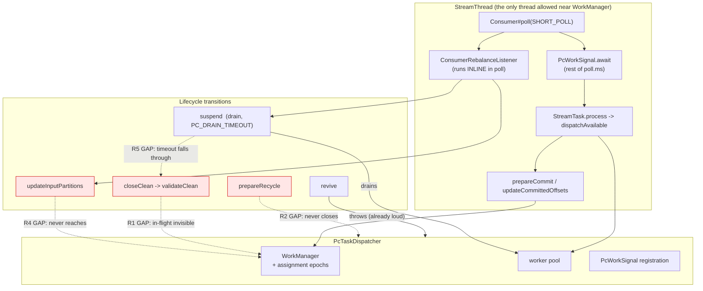

# feat: Kafka Streams task lifecycle and rebalance under PC dispatch (U10)

**Status: executed.** This is the plan as written *before* implementation, kept as the decision record.
Where the work refuted it, the outcome is in the commit and in
`docs/inflight/pr-streams-task-lifecycle-and-rebalance.md`; the two divergences worth knowing before
reading on are noted under [What execution refuted](#what-execution-refuted).

**Headless disclosure.** Composed without the scoping-confirmation gate: this run has no interactive
user, and the invoking brief already fixed scope, base branch, success metric and constraints.

---

## Summary

Make the `StreamTask` lifecycle under PC dispatch a tested path rather than an assumed one, and give
rebalance its first coverage. The defect list is settled upstream (seven items in the inflight file);
this plan resolves only what was genuinely open: what "correct" means when a partition is revoked with
work in flight, how the wake-on-work park interacts with revocation, whether the epoch hazard becomes
reachable, and what a multi-instance test must assert to be worth building.

**The headline correction this plan is built on.** Pile B was measured before any code was written, and
the premise in the brief is wrong in two ways:

- Pile B is **4 failing, not 5**. `shouldThrowIfRecyclingDirtyTask` already passes.
- The four are **not close/suspend bugs**. Every one fails at an assertion that runs *before* any close
  or suspend code, on the line `assertTrue(task.commitNeeded())` (or the `prepareCommit` that gates on
  the same predicate) immediately after `task.process(...)`. They are the asynchronous-dispatch artefact
  the plan already diagnosed for pile A, not lifecycle divergences.

That is not a reason to abandon the metric. It relocates the defect. The reason `commitNeeded()` answers
false with a record in flight is that the PC path answers **"is a commit worth doing"** where Kafka's
callers sometimes ask **"is there uncommitted work"**. Those are the same question on the stock path and
different questions under asynchronous dispatch, and conflating them makes `validateClean()` wrong: a
clean close with records still in flight currently succeeds silently, where stock's contract is to throw
so the TaskManager closes dirty instead. Splitting the predicate is a genuine lifecycle fix that pile B
then measures.

---

## Problem Frame

Every integration proof this module has runs **one partition, one task, one instance**. Multi-task,
multi-instance and rebalance behaviour are unexercised - not imperfect, untested. Seven divergences sit
in that territory with no coverage at all, and rebalance is what drives every one of them in production.

The lifecycle transitions (`suspend`, `closeClean`, `closeDirty`, `prepareRecycle`, `revive`,
`updateInputPartitions`) were written against a single-task, single-thread, never-reassigned shape. Each
holds an assumption that stops being true the moment a task outlives one thread assignment or one
partition set.

---

## Requirements

| ID | Requirement | Source |
|---|---|---|
| R1 | A clean close must not silently discard work PC still holds. Kafka's contract is `TaskMigratedException` so the TaskManager closes dirty. | Kafka `validateClean` contract; inflight item 1 |
| R2 | `prepareRecycle()` must release the dispatcher: registry entry, worker pool, WorkManager partition state, wake-signal registration. | Inflight item 3 |
| R3 | The dispatcher's owner-thread guard must bind where the task is handed to a thread, not at construction, so a recycled or reassigned task cannot throw on a legitimate call. | Inflight item 7 |
| R4 | `updateInputPartitions()` must reach the dispatcher, so the partition set and PC's assignment epochs track cooperative rebalancing. | Inflight item 5 |
| R5 | A drain that times out must not fall through to `closeTopology()` with workers still inside the chain. | Inflight item 4 |
| R6 | A multi-instance, multi-partition rebalance test must exist and must prove no record is lost and duplicates are bounded by capacity, not by a fraction of throughput. | Inflight "delete when"; plan U10 verification |
| R7 | Every remaining divergence is either fixed with a test or re-recorded with evidence that it does not bite. | Inflight "delete when" |
| R8 | Behaviour preservation with the seam OFF is unchanged: 419 of Kafka's own tests, zero failures. | `parallel-consumer-streams/pom.xml` upstream execution |
| R9 | Pile B's seam-ON count is measured before and after, and the upstream execution is shown to have actually run. | Brief; plan U10 verification |

---

## Key Technical Decisions

### KTD1. Revocation abandons in-flight work behind an epoch fence. It does not drain, and it does not block.

This is the open question the brief asked me to answer rather than invent, and **PC core has already
answered it** - `parallel-consumer-core` is the prior art, not a blank page.

`AbstractParallelEoSStreamProcessor.onPartitionsRevoked` commits first, then truncates:

1. `commitOffsetsThatAreReady()` - everything **completed** is committed before anything is torn down.
2. `wm.onPartitionsRevoked(partitions)` → `PartitionStateManager.onPartitionsRemoved` →
   `incrementPartitionAssignmentEpoch`, `resetOffsetMapAndRemoveWork`, `sm.removeStaleContainers()`.

Work still in flight is **abandoned, not awaited**. Its outcome arrives after the epoch bump, and
`WorkManager.handleFutureResult` drops it: `if (checkIfWorkIsStale(wc)) { /* no op, partition has been
revoked */ }`. The new owner re-reads from the last commit and re-processes. That is at-least-once, and
it is the correct trade: draining means the revocation waits on arbitrary user code, and blocking the
revocation risks the member being evicted from the group.

**So the streams path should adopt the same shape, not invent a third one.** Concretely, that means
routing `updateInputPartitions` through `workManager.onPartitionsRevoked/onPartitionsAssigned` (R4) buys
the epoch fence for free - the mechanism is already built and already tested in core.

**What this decides about inflight item 1** (the suspend-drain running after the final commit): the
drain stays, because `suspend()` is *not* the revocation path in the abandon sense - it is the orderly
teardown, on the StreamThread, where waiting is legitimate and bounded. The divergence item 1 names is
that drained output post-dates the final commit. That is bounded by `PC_DRAIN_TIMEOUT` and produces
at-least-once duplicates, which sit inside the preview's stated contract. It is re-recorded with the
duplicate-bound evidence the new test produces (R7), not redesigned here - moving the drain ahead of the
commit is a teardown-ordering change in Kafka's own `TaskManager`, well outside this patch surface.

### KTD2. "Is a commit worth doing" and "is there uncommitted work" are two questions. Split them.

The single `pcAwareCommitNeeded()` helper answers three call sites that want different things:

| Call site | Question it is really asking | Correct PC answer |
|---|---|---|
| `prepareCommit()` | is a commit worth doing | PC has *uncommitted* work (see below) |
| `maybeCheckpoint()` | should changelog offsets be refreshed | same as `prepareCommit` |
| `validateClean()` | is it safe to close clean | PC has *any* uncommitted work, in flight included |

Today all three read `hasCommitDataOutstanding()` = "completed but not yet committed". Under synchronous
stock dispatch there is no third state; under asynchronous dispatch there is, and it is exactly where
`validateClean` goes wrong.

**The fix is one new dispatcher predicate, `hasUncommittedWork()`**, defined as: dirty (completed,
uncommitted) **or** anything in flight **or** any completion not yet fed back **or** any record PC still
holds undispatched. `validateClean()` uses it; so does the public `commitNeeded()` override, because a
task holding in-flight records genuinely will need a commit and telling the TaskExecutor otherwise is
what lets a clean close slip through.

`prepareCommit()` and `maybeCheckpoint()` also move to it. Committing while work is in flight is not
wasteful in the way it first looks: `collectCommitData()` returns the frontier, which correctly sits
*below* the in-flight records, so the commit is safe by construction - that is the U9 crash-safety
design, unchanged. The cost is at most one extra commit per interval while work is in flight, which is
what stock does anyway.

**This is what moves pile B**, and the causal chain is worth stating so the metric is not mistaken for
coincidence: `assertTrue(task.commitNeeded())` after `process()` becomes true because the record is in
flight and uncommitted; `assertThrows(..., task::prepareCommit)` reaches the `flush()` that throws
because the gate now opens.

### KTD3. Bind the owner thread at hand-off, not at construction.

`PcTaskDispatcher` captures `Thread.currentThread()` in its constructor. Correct today, wrong the moment
a task object outlives its thread assignment. Replace with an explicit `bindToCurrentThread()` called
where the task is handed to a thread, with the constructor performing the same bind so nothing regresses
for the common case. `PcWorkSignal.registerForCurrentThread` has the identical assumption and must move
with it - they are one seam, and leaving the signal keyed to the construction thread while the guard
moves would produce a dispatcher whose guard passes and whose wake never fires.

### KTD4. `prepareRecycle` routes through the same dispatcher close as `close(boolean)`.

`prepareRecycle()` today calls `partitionGroup.close()` and `recordCollector.closeClean()` directly,
never reaching `close(boolean)` where the dispatcher shutdown lives. One line, at the top of the
`SUSPENDED` branch, closing the dispatcher through the same `TaskManager.executeAndMaybeSwallow` wrapper.
Not a new mechanism - the same call the close path already makes.

### KTD5. The epoch hazard stays unreachable, and this plan states why rather than assuming it.

Inflight item 6: `onOffsetCommitSuccess` has no epoch guard, so a stale ack could clear a reassigned
partition's dirty flag. It is currently unreachable through 1:1 dispatcher-per-task wiring.

R4 changes the partition set of a live dispatcher, which is exactly the change that could make it
reachable - so this must be *shown*, not asserted. The argument: both `updateCommittedOffsets` (which
acks) and `updateInputPartitions` (which revokes) run on the StreamThread, which is the only thread
allowed near the WorkManager, and the guard from KTD3 enforces that. Two calls on one thread cannot
interleave, so no ack can arrive across a revocation boundary. **U10.5 encodes that as a test**, so if a
later change moves either call off the StreamThread the argument fails loudly rather than silently.

### KTD6. Revocation cannot arrive while the StreamThread is parked on the wake condition. Verify, do not patch.

The coordinator's question, and the answer is in the existing design: `ConsumerRebalanceListener`
callbacks run **inline inside `Consumer#poll()`**, on the StreamThread. `PcWorkSignal.await` is entered
*after* the `SHORT_POLL` returns, so the thread is by definition not inside poll while parked. A
rebalance therefore cannot be delivered during the park; it is delivered on the next poll, at most
`poll.ms` minus 1ms later (default 99ms), which is three orders of magnitude inside
`max.poll.interval.ms`.

`PcWorkSignal.awaitWorkForRemainderOf` already documents and handles the adjacent case - the short poll
itself running a revocation that deregisters this thread's dispatchers - by re-checking `hasActiveWork()`
after the poll.

So **no new wake path, and specifically not `Consumer#wakeup()`**, which the plan rejects for a recorded
reason: it throws `WakeupException`, Kafka Streams reserves it for shutdown, and a wake delivered while
not polling arms the *next* poll, letting a stray completion signal swallow a shutdown one.

The residual worth naming is different and real: `suspend()`'s `PC_DRAIN_TIMEOUT` is **30 seconds**, and
`suspend()` runs *inside* the revocation callback. A stuck worker therefore blocks the rebalance for 30s,
which is inside `max.poll.interval.ms` (300s default) but far outside the 15s dwell bound core's
`ProgressProbe` treats as healthy. Recorded, with the drain-timeout path made safe by R5.

### KTD7. Reuse core's rebalance harness. Do not build a new one.

`BrokerStreamsIntegrationTest` already extends core's `BrokerIntegrationTest`, so the container, topic
creation, `KafkaClientUtils` and admin client are all in hand. From core's rebalance tests, reuse:

- `KafkaClientUtils.GroupOption.REUSE_GROUP` - the mechanism for a second instance in one group.
- `DrainingMemberRebalanceIT`'s two-set ledger shape (union covers produced; intersection bounded).
- The recorded lesson that a duplicate bound must be **flat / capacity-shaped** (in-flight batch plus
  commit lag), never a fraction of throughput. `MultiInstanceRebalanceTest`'s 20%-of-volume bound is the
  anti-pattern, called out as such in `ProgressProbe.ledger`'s javadoc.

What core cannot supply is a `KafkaStreams`-shaped instance manager - `ManagedPCInstance` constructs
`ParallelEoSStreamProcessor` directly. That much is new, and it is small.

---

## High-Level Technical Design

Where each divergence sits, and which single seam closes it:



The revocation ordering this plan adopts, matching core:

```mermaid
sequenceDiagram
    participant B as Broker
    participant ST as StreamThread
    participant T as StreamTask
    participant D as PcTaskDispatcher
    participant W as WorkManager

    B->>ST: rebalance -> callback inline in poll()
    ST->>T: suspend()
    T->>D: pumpUntilQuiescent(PC_DRAIN_TIMEOUT)
    Note over D: completed work folded in;<br/>timeout -> close dirty (R5)
    ST->>T: prepareCommit() / commit
    T->>D: collectCommitData() -> frontier
    Note over T,W: COMMIT FIRST (core's order)
    ST->>T: updateInputPartitions(newSet)
    T->>D: updatePartitions(added, removed)   %% R4
    D->>W: onPartitionsRevoked(removed)
    Note over W: epoch++ -> late outcomes<br/>dropped as stale
    D->>W: onPartitionsAssigned(added)
```

---

## Implementation Units

### U10.1. Split the commit-needed predicate, and make a clean close honest

**Goal:** `closeClean()` on a task with work still in flight throws `TaskMigratedException`, as stock
does with unflushed data, instead of closing silently and dropping it.

**Requirements:** R1, R9

**Dependencies:** none

**Files:**
- `parallel-consumer-streams/src/main/java/io/confluent/parallelconsumer/streams/PcTaskDispatcher.java`
- `parallel-consumer-streams/src/main/patch/pc-streams.patch` (via `target/kafka-patched/.../StreamTask.java`)
- `parallel-consumer-streams/src/test/java/io/confluent/parallelconsumer/streams/PcTaskDispatcherTest.java`

**Approach:**

1. Add `PcTaskDispatcher.hasUncommittedWork()`: dirty **or** in-flight **or** pending completions **or**
   PC still holding undispatched records. Owner-thread guarded like its siblings, and it must drain
   completions first for the same reason `hasCommitDataOutstanding` does.
2. Rename the patched helper to say which question it answers, and give `validateClean()` and the public
   `commitNeeded()` override the new predicate.
3. Point `prepareCommit()` and `maybeCheckpoint()` at it too, per KTD2 - the frontier below in-flight
   records keeps the commit safe.

**Patterns to follow:** the existing `pcAwareCommitNeeded()` javadoc's own argument for one helper over
three copies - keep that property, just make it two well-named helpers rather than one overloaded one.

**Test scenarios:**
- A dispatcher with a record dispatched and no completion reports `hasUncommittedWork() == true` and
  `hasCommitDataOutstanding() == false`. This is the whole distinction; if it does not hold, nothing
  below is real.
- A dispatcher with nothing registered reports both false.
- After the record completes and is fed back, both report true.
- After `onCommitSuccess` covering that offset, both report false.
- `hasUncommittedWork()` from a non-owner thread throws `IllegalStateException` naming both threads.

**Verification:** pile B's four failing cases flip to passing, and the seam-OFF 419 is unchanged.

---

### U10.2. Bind the owner thread at hand-off, and close the recycle leak

**Goal:** a recycled or reassigned task neither leaks a dispatcher nor throws on a legitimate call from
its new thread. One seam, both defects, per the inflight file's own instruction.

**Requirements:** R2, R3

**Dependencies:** none (independent of U10.1)

**Files:**
- `parallel-consumer-streams/src/main/java/io/confluent/parallelconsumer/streams/PcTaskDispatcher.java`
- `parallel-consumer-streams/src/main/java/io/confluent/parallelconsumer/streams/PcWorkSignal.java`
- `parallel-consumer-streams/src/main/patch/pc-streams.patch`
- `parallel-consumer-streams/src/test/java/io/confluent/parallelconsumer/streams/PcTaskDispatcherTest.java`

**Approach:**

1. Replace the constructor's `ownerThread = Thread.currentThread()` with an explicit
   `bindToCurrentThread()`, called from the constructor (preserving today's behaviour) and callable again
   when the task is handed to a different thread. Re-binding must move the `PcWorkSignal` registration
   with it - one seam, two registries, and splitting them yields a dispatcher whose guard passes and
   whose wake never fires.
2. `prepareRecycle()` closes the dispatcher through the same
   `TaskManager.executeAndMaybeSwallow(true, pcDispatcher::close, ...)` call `close(boolean)` uses.

**Execution note:** write the leak test first. It is the one defect the brief calls "real, reproducible
and recorded", and a test that fails before the one-line fix is the cheapest available proof that the
leak was real rather than inferred from reading.

**Test scenarios:**
- Rebinding to a second thread: calls from the new owner succeed, calls from the old owner now throw.
- After rebinding, a worker completion still wakes the new owner's `PcWorkSignal` - the registration
  moved, not just the guard.
- A dispatcher closed via the recycle path is removed from `ACTIVE`, its pool is terminated, its
  `PcWorkSignal` registration is gone, and its partitions are revoked in the WorkManager.
- Double-close through recycle-then-close is idempotent and does not double-revoke.

**Verification:** `shouldPrepareRecycleSuspendedTask` and `shouldThrowIfRecyclingDirtyTask` stay green;
the leak test fails with the `prepareRecycle` line reverted (control arm).

---

### U10.3. Propagate `updateInputPartitions` to the dispatcher

**Goal:** a cooperative rebalance that adds or removes partitions from a live task is reflected in PC's
assignment and epoch state, instead of leaving the dispatcher on its construction-time partition set.

**Requirements:** R4

**Dependencies:** U10.2 (both touch the dispatcher's partition-set fields)

**Files:**
- `parallel-consumer-streams/src/main/java/io/confluent/parallelconsumer/streams/PcTaskDispatcher.java`
- `parallel-consumer-streams/src/main/patch/pc-streams.patch`
- `parallel-consumer-streams/src/test/java/io/confluent/parallelconsumer/streams/PcTaskDispatcherTest.java`

**Approach:** add `PcTaskDispatcher.updatePartitions(Set<TopicPartition>)` computing added and removed
against the held set, calling `workManager.onPartitionsRevoked(removed)` then
`onPartitionsAssigned(added)` - core's order and core's mechanism, which is where the epoch fence comes
from (KTD1). The patched `updateInputPartitions` calls it when the dispatcher is non-null.

**Test scenarios:**
- Adding a partition: records for the new partition are accepted (`recordsAccepted == recordsOffered`),
  where before the change they are dropped for want of an epoch.
- Removing a partition: records for it are no longer accepted, and the drop is logged at ERROR as the
  existing epoch-shortfall branch does.
- An outcome that arrives for a partition removed while it was in flight is dropped as stale and does
  **not** advance the frontier - the epoch fence doing its job.
- No-op update with an identical set revokes nothing (guard against a spurious epoch bump clearing live
  work).

---

### U10.4. A timed-out drain closes dirty instead of proceeding

**Goal:** when `suspend()`'s drain does not quiesce, the task does not continue into `closeTopology()`
with workers still inside the processor chain.

**Requirements:** R5

**Dependencies:** U10.1 (the honest clean-close predicate is what makes "close dirty" reachable)

**Files:**
- `parallel-consumer-streams/src/main/patch/pc-streams.patch`
- `parallel-consumer-streams/src/test/java/io/confluent/parallelconsumer/streams/PcTaskDispatcherTest.java`

**Approach:** the drain already logs a warning on timeout and falls through. With U10.1 in place, a
non-quiescent dispatcher reports `hasUncommittedWork() == true`, so `validateClean()` throws and Kafka's
own `TaskManager` closes the task dirty - which is the desired outcome reached through Kafka's existing
machinery rather than through a new code path. Confirm this by reading, then decide whether an explicit
refusal in `suspend()` adds anything; prefer not adding one if the predicate already covers it.

**Execution note:** this unit may reduce to "verify the U10.1 predicate already covers it, and record
that". Report it that way if so - an unnecessary guard is worse than none.

**Test scenarios:**
- A worker held past a shortened drain timeout leaves the dispatcher non-quiescent and
  `hasUncommittedWork()` true.
- The warning names the in-flight count.

---

### U10.5. The epoch-reachability control test

**Goal:** encode KTD5's argument so that a future change moving the ack or the partition update off the
StreamThread fails loudly instead of silently re-opening the stale-ack hazard.

**Requirements:** R7, and the guard on R4

**Dependencies:** U10.2, U10.3

**Files:**
- `parallel-consumer-streams/src/test/java/io/confluent/parallelconsumer/streams/PcTaskDispatcherTest.java`

**Approach:** assert the property the safety argument rests on - that `onCommitSuccess` and
`updatePartitions` are both owner-thread-only - rather than trying to construct the interleaving, which
is unreachable by that very property.

**Test scenarios:**
- `updatePartitions` from a non-owner thread throws, naming both threads.
- `onCommitSuccess` from a non-owner thread throws (already true; pin it, because it is half the
  argument).
- A comment on the test states what it is protecting, in one line: two owner-thread-only calls cannot
  interleave, so no ack can cross a revocation boundary.

---

### U10.6. The multi-instance rebalance integration test

**Goal:** the first coverage of rebalance this module has. Two `KafkaStreams` instances in one
application id over a multi-partition topic, second joining mid-run, proving no record is lost and
duplicates are bounded by capacity.

**Requirements:** R6

**Dependencies:** U10.1, U10.2, U10.3

**Files:**
- `parallel-consumer-streams/src/test/java/io/confluent/parallelconsumer/streams/integrationTests/RebalanceUnderPcDispatchTest.java` (create)

**Approach:**

1. Extend `BrokerStreamsIntegrationTest`. Mark `@Isolated` - `PcDispatchSwitch` is process-wide and
   `PcTaskDispatcher.ACTIVE` is JVM-wide, and the existing `CommitFrontierCrashRestartTest` sets that
   precedent.
2. Topic with 4 partitions. Produce a keyed range, start instance A, wait for real progress, start
   instance B in the same application id, keep producing across the handover.
3. Ledger over the **output** topic, keyed, with per-instance attribution carried in the record value so
   the "B actually took work" assertion is not inferred from timing.

**The assertions, decided before the harness** - this is the part the brief called hardest, and a test
that only asserts "nothing threw" would be worth building only as a smoke test:

- **No loss.** The union of what both instances produced covers every produced key.
  `containsAtLeastElementsIn(producedKeys)`.
- **Duplicates bounded by capacity, not throughput.** At most `poolSize * partitions` plus one commit
  interval's worth - a flat number derived from in-flight capacity and commit lag. Explicitly **not** a
  percentage of volume, per the recorded lesson and `ProgressProbe.ledger`'s javadoc.
- **The handover actually happened.** B processed at least one record. Without this the first two
  assertions are satisfiable by A alone and the test is vacuous.
- **No partition is processed by both instances concurrently.** The property rebalance exists to
  preserve, and the one that a stale partition set (R4) would break.

**Execution note:** the recorded vacuous-assertion defect on this exact module applies directly. The
reader must be structurally incapable of satisfying a post-rebalance assertion with pre-rebalance data:
capture the output topic's end offset at the moment B joins, and scope the "B took over" reader with
`assign` + `seek` past it rather than subscribing from earliest and filtering.

**Test scenarios:**
- Two instances, 4 partitions, B joins mid-run: all four assertions above.
- Control arm: the same scenario with the seam **off** (stock dispatch), proving the harness detects the
  properties rather than the properties being trivially true. If stock also shows duplicates at the
  bound, the bound is measuring the broker, not the seam.
- Repeat count stated in the report, not left implicit.

**Verification:** green over a stated number of repeats; the duplicate bound is a flat number with its
derivation written next to it.

---

### U10.7. Re-record the divergences that remain, with evidence

**Goal:** satisfy the inflight file's own deletion criterion - each divergence fixed with a test, or
re-recorded with evidence that it does not bite.

**Requirements:** R7

**Dependencies:** U10.1-U10.6

**Files:**
- `docs/inflight/pr-streams-task-lifecycle-and-rebalance.md`
- `parallel-consumer-streams/README.md` (proven-scope claim, if it changes)
- `CHANGELOG.adoc` (only if operator-visible)

**Approach:** rewrite the inflight file against measured outcomes. Item 2 (revival) stays open and loud -
recreating the dispatcher is not in this unit's scope and the loud failure is the right floor. Item 1
(drain after final commit) is re-recorded with the duplicate bound U10.6 measured. Item 6 is re-recorded
as unreachable **with U10.5 as the guard**, not as an assertion.

**Test expectation: none** - documentation unit. Its correctness is that every claim cites the test or
measurement that established it.

---

## Verification Contract

| Gate | Command | Bar |
|---|---|---|
| Pile B, seam ON | module `test` with `-Dpc.streams.dispatch.enabled=true`, read `target/surefire-reports-kafka-upstream/` | 4 failing → 0 |
| Behaviour preservation, seam OFF | module `test` (pom pins the seam off for that execution) | StreamTaskTest 101, RecordCollectorTest 59, ProcessorContextImplTest 28, StreamThreadTest 231 (21 skipped by Kafka's own annotations), **zero failures** |
| Module unit suite | `./mvnw -pl .,parallel-consumer-streams test -Dcopyright.skip=true` | green |
| Module integration suite | `verify` - streams ITs run under **failsafe**, not surefire | green |
| Patch integrity | `bin/regen-patch.sh`, then compare added/removed line **bodies** old vs new | every line the old patch added is still added; hunk count is a hint only |

**Proving the upstream suite actually ran** is part of the gate, not a courtesy. `-Dtest=...` silently
overrides the execution's `<includes>`, so it must never be used for this measurement. Isolate instead
with `-Dincluded.groups=<nonexistent>`, which empties the *default* execution's group filter while the
upstream execution's `<groups combine.self="override"/>` leaves it unaffected. Evidence that it ran is
the per-class `tests=` counts in the surefire XML, quoted in the report.

---

## Risks and Open Questions

| Risk | Treatment |
|---|---|
| KTD2 changes `commitNeeded()` for every PC-path caller, including `TaskExecutor`'s commit cadence. Could cause commits every interval while work is in flight. | Bounded and stock-like. The seam-OFF 419 cannot catch it (seam off), so the seam-ON pile A cases and the integration suite are the detectors. Watch for pile A *regressions*, not just pile B improvements. |
| Making `prepareCommit` fire more often could surface `shouldRespectCommitNeeded` or the pile A offset cases differently. | Compare the **full** seam-ON failing set before and after, not just pile B. A pile B win bought with a pile A regression is not a win. |
| The multi-instance test is the module's first; it may be flaky before it is useful. | State the repeat count and the reproduction rate. A test that flips across runs is recorded UNRESOLVED, not green. |
| Rebinding the owner thread widens who may call the commit surface. | The guard still throws for any thread that is not the *current* bind; the change is which thread that is, not whether there is one. |
| `PC_DRAIN_TIMEOUT` is 30s inside a revocation callback. | Out of scope to change here; recorded in U10.7 with the dwell-bound comparison, since lowering it trades duplicate-freedom for rebalance latency and that is a product call. |

**Open, deferred to implementation:** whether U10.4 needs any code at all (see its execution note), and
whether the `PcWorkSignal` re-registration in U10.2 needs to deregister from the old owner eagerly or can
rely on the existing weak-map expiry.

---

## Definition of Done

1. Pile B seam-ON: 4 → 0, measured the same way before and after, with the surefire counts quoted as
   proof the suite ran.
2. Seam-OFF 419 unchanged, zero failures.
3. The full seam-ON failing set is compared before and after; any case that got *worse* is reported as
   prominently as the wins.
4. A test exists for every defect fixed; every defect not fixed is re-recorded with evidence.
5. `RebalanceUnderPcDispatchTest` exists, asserts all four properties, and its duplicate bound is flat.
6. The patch regenerates with content parity; hunk and line counts reported.
7. Refuted predictions reported at least as prominently as confirmed ones.

---

## What execution refuted

Kept rather than edited away, because the plan's value as a record is mostly in where it was wrong.

**KTD3 was built on a premise that is false, and the correction is bigger than the decision.** The plan
says the owner-thread bind is wrong "the moment a task object outlives its thread assignment" - implying
one owner thread at a time. That is not Kafka's model at all: `DefaultStateUpdater` calls
`StreamTask.maybeCheckpoint` **from its own thread**, concurrently, for restoring and standby tasks. So
routing the commit-needed gate through a guarded, draining call turned a plain field read into
cross-thread mutation of PC's shard state. The rebind in KTD3 still landed and is still right, but the
substantive fix was splitting the dispatcher into a **mutating** surface (owner-thread-only) and a
**read-only** surface (any thread), under the rule that *a question may not mutate*. That is now in
`PcTaskDispatcher`'s class javadoc.

**KTD2's `hasUncommittedWork()` definition was wrong in its first term.** The plan defines it as
including "any record PC still holds undispatched". That would have made one poison pill enough to keep
`validateClean()` throwing forever - with retries disabled, a failed record blocks its KEY shard and the
records behind it stay *available* in PC's counters permanently. Implemented instead as dirty, in-flight,
or pending-completion, which has no such trap. `aFailedRecordDoesNotLeaveTheTaskPermanentlyUncloseable`
pins it.

**U10.4 needed no code, as its execution note allowed for.** The predicate fix made a non-quiescent
dispatcher report uncommitted work, so `validateClean()` throws and Kafka's own `TaskManager` closes the
task dirty. No new guard was added.

**Predictions that were refuted by measurement:** pile B was 4 failing, not the 5 the plan and the brief
both assumed; the seam-ON baseline was 35 failures, not 36; and the plan's headline risk - that widening
`commitNeeded()` would regress pile A cases - did not occur (0 regressions, measured twice). One
regression *was* introduced later by the publication design and caught by Kafka's suite
(`shouldClearCommitStatusesInCloseDirty`): `close()` revokes partitions after the drain that published
the dirty flag, so the flag needed republishing after the revoke. That is the cost of the design and it
is recorded on the field.
