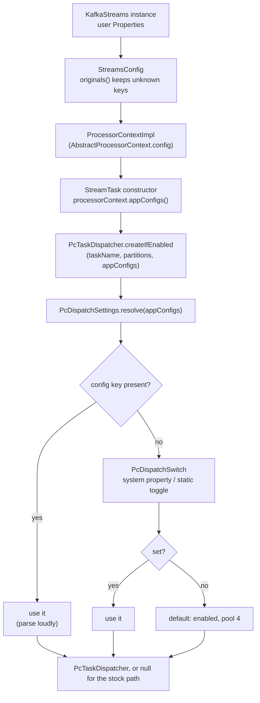

# feat(streams): make PC dispatch a per-instance StreamsConfig property

## Goal Capsule

`PcDispatchSwitch` is a process-global static backed by a system property. That is enough to run a whole
test suite twice with a different flag, and not enough for the two things an adopter actually wants to do:
measure PC dispatch against their own topology, and run their own Kafka Streams test suite with the seam on
to see whether it still passes. Both want the switch to be a property of a `KafkaStreams` instance, because
both want two arms alive at once.

This makes the switch a `StreamsConfig` property read at `StreamTask` construction, which is where a Kafka
Streams user expects configuration to live and is naturally per-instance. The process-global static stays
underneath as the JVM-wide fallback and the internal mechanism, so nothing that exists today changes
behaviour.

**Why this is the module's most important feature, not a config convenience.** The hardest question this
module faces is "why should I believe your benchmark?", and the only good answer is "don't, run your own".
An adopter cannot do that while turning the seam on is a JVM-wide act: their two arms cannot coexist, their
parallel test suite toggles itself, and the flakes that follow read as "this module is broken" rather than
"this configuration is wrong". Per-instance configuration converts "trust our alpha" into "verify it
yourself".

---

## Problem Frame

`PcDispatchSwitch` is deliberately global. Its javadoc states the reason and the reason is sound: a
`StreamTask` is constructed several layers inside `KafkaStreams`, with no seam through which a caller can
hand it a collaborator. That reasoning is being extended here, not overturned. What changes is that a seam
*does* exist and had not been noticed: `StreamTask`'s constructor is handed an `InternalProcessorContext`,
and `AbstractProcessorContext` (already in the patched set) holds the `StreamsConfig` and exposes
`appConfigs()`.

Three concrete failures of the global-only design:

1. **Parallel test suites toggle each other.** A user writing the natural thing (one test with dispatch on,
   one with it off, both in a suite that runs classes concurrently) gets tests reading each other's switch
   and each other's counters. This module's own tests carry `@Isolated` and `SAME_THREAD` for exactly this
   reason. A user will not know to do that, will hit flakes, and will reasonably blame the module.
2. **Both arms of a comparison cannot coexist.** Measuring PC dispatch against stock on the same topology
   currently means two JVM runs, which reintroduces every between-run confound the module's own benchmark
   discipline exists to remove.
3. **A system property is the wrong shelf.** A Kafka Streams user configures Kafka Streams through
   `StreamsConfig`. Making them reach for `-D` to configure a Kafka Streams behaviour is friction that also
   makes the setting invisible to anything that inspects the application's configuration.

---

## Requirements

- **R1.** A user can turn PC dispatch on or off for a single `KafkaStreams` instance by setting a property
  in the `StreamsConfig`/`Properties` they already build, with no `-D` flag and no static call.
- **R2.** The worker pool size is configurable through the same mechanism.
- **R3.** Two `KafkaStreams` instances in one JVM, configured differently, each get their own dispatch
  behaviour. Neither can change the other's.
- **R4.** Precedence is: explicit `StreamsConfig` property, then the system property, then the default. The
  default stays **on** (KTD-S6: taking the dependency is the opt-in).
- **R5.** Everything that exists today keeps working unchanged: the `PcDispatchSwitch` static API
  (`isEnabled`, `getPoolSize`, `enable(int)`, `disable`, `resetToDefault`, `ENABLED_PROPERTY`,
  `POOL_SIZE_PROPERTY`), the system property `pc.streams.dispatch.enabled`, and the documented system
  property `pc.streams.dispatch.poolSize`.
- **R6.** A value that cannot be understood fails loudly at task construction rather than being read as
  "off". A typo in the property whose job is to turn the seam off would otherwise leave the seam on and
  produce a run that looks like a control arm and is not.
- **R7.** Behaviour preservation is unchanged: Kafka's own `StreamTaskTest` (101), `RecordCollectorTest`
  (59) and `ProcessorContextImplTest` (28) stay green with the seam off, zero failures, zero skips, no
  assertion weakened.
- **R8.** The feature is recorded durably in-repo, and the module README's requirements are handed to the
  agent that owns that file rather than written here.

---

## Key Technical Decisions

### KTD1. Read the config through `InternalProcessorContext.appConfigs()`, not `TaskConfig`

`StreamTask`'s constructor takes a `TaskConfig`, which is a nested class of `TopologyConfig` carrying seven
derived fields (`maxTaskIdleMs`, `taskTimeoutMs`, `maxBufferedSize`, `timestampExtractor`,
`deserializationExceptionHandler`, `processingExceptionHandler`, `eosEnabled`). It holds no `StreamsConfig`
and no raw originals, so it cannot carry a user property. `docs/inflight/pr-ks-spike-next-work.md` (item 4,
step 3) assumes otherwise and should be read with that correction.

The constructor's `InternalProcessorContext` parameter does carry it. `AbstractProcessorContext` holds
`private final StreamsConfig config` and `appConfigs()` returns `config.originals()` merged over
`config.values()`, so every key the user passed is present verbatim. `AbstractProcessorContext` is already
one of the four patched classes, so this adds no class to `patched.classes` and costs one argument at one
call site.

### KTD2. One name per setting, usable in both places; the canonical pool-size key is dotted

| Setting | Canonical name (StreamsConfig **and** system property) | Also honoured |
| --- | --- | --- |
| Enable the seam | `pc.streams.dispatch.enabled` | (none needed) |
| Worker pool size | `pc.streams.dispatch.pool.size` | system property `pc.streams.dispatch.poolSize` |

`pc.streams.dispatch.enabled` is already lowercase and dot-separated, which is the Kafka Streams
convention, so the existing string is reused verbatim as the config key. There is then one name to
document, one name to grep for, and R5 is satisfied for free.

`pc.streams.dispatch.poolSize` is camelCase, which is not the convention, so the config key is
`pc.streams.dispatch.pool.size`. The camelCase form is documented in the module README today and is
therefore a published contract; it stays honoured as a system property alias rather than being broken.

Both canonical names work in either location. Asymmetry ("this name works in your config but not on the
command line") is the kind of papercut that generates support questions, and the extra lookup is three
lines.

The names carry no status word, per
`docs/solutions/conventions/status-words-belong-in-status-artefacts.md`.

### KTD3. Precedence: explicit `StreamsConfig` key, then system property, then default (on)

The ordering is not a matter of taste here: `parallel-consumer-streams/pom.xml` sets
`-Dpc.streams.dispatch.enabled=false` on the surefire execution that runs Kafka's own 188 tests, and those
tests construct `StreamTask`s from a `StreamsConfig` that says nothing about PC dispatch. If a silent
config meant "use the default (on)" rather than "fall through to the system property", that execution would
silently run with the seam **on**, and the module's central behaviour-preservation claim would become
vacuous without a single test turning red.

So: the config key wins when present; when absent, the system property (and therefore any programmatic
`PcDispatchSwitch.disable()`) decides; when neither says anything, the seam is on.

### KTD4. Resolution lives in an immutable `PcDispatchSettings`; `PcDispatchSwitch` becomes the fallback layer

The static is kept as the internal mechanism, exactly as the existing design intends. A new immutable
value type resolves one task's settings once:

- `PcDispatchSettings.resolve(Map<String, Object> streamsConfigs)` returns `enabled` and `poolSize` for one
  task.
- When the map is silent it delegates to `PcDispatchSwitch.isEnabled()` / `getPoolSize()`, which is where
  the system property and the programmatic toggles already live.

This keeps a single source of truth for the JVM-wide layer, keeps all eight existing test classes working
unchanged, and makes "per-instance" a property of the value object rather than of a second mutable static.
It is the collapse-parallel-state discipline: one store, two readers, not two stores to keep in sync.

### KTD5. Live with the INFO-level unknown-config log rather than registering in `StreamsConfig`'s `ConfigDef`

Measured, not assumed, against Kafka 3.9.2:

- `StreamsConfig` extends `AbstractConfig`, which keeps unknown keys in `originals()` and never rejects
  them. There is no `ConfigException`.
- `StreamsConfig.getClientCustomProps()` **deliberately** forwards every unknown top-level key to the
  embedded consumer, producer and admin client. The javadoc calls this out as a feature: it is how a user
  configures a custom `TimestampExtractor` or `RocksDBConfigSetter`, read back through
  `ProcessorContext#appConfigs()`. So this design is the idiomatic one, not a workaround.
- Each of those clients then reports the key through `AbstractConfig.logUnused()`. Disassembling
  `kafka-clients-3.9.2.jar` shows that call site is `log.info("These configurations '{}' were supplied but
  are not used yet.", unusedKeys)` - **INFO, not WARN**, and one line per client rather than one per key.

The cost is therefore a handful of INFO lines at startup on a logger most applications already run at INFO.
The alternative is patching `StreamsConfig` to register the keys in its static `ConfigDef`, which adds a
fifth patched class, puts us in the way of `StreamsConfigTest`, and buys the removal of an INFO line. Not a
trade worth making. Documented instead, so a user who sees the line knows it is expected.

### KTD6. An unparseable value fails loudly, at task construction

`PcDispatchSwitch` already refuses a system property that is neither `true` nor `false`, for the stated
reason that a typo would silently produce a fake control arm. The config path inherits that rule and
extends it to the pool size. Values arrive as whatever the user put in their `Properties` or `Map`, so
`Boolean` and `String` are both accepted for the flag and `Number` and numeric `String` for the pool size;
anything else throws an `IllegalArgumentException` naming the key and the offending value.

The exception surfaces from the `StreamTask` constructor, which is loud, immediate, and attributable.

### KTD7. The `TopologyTestDriver` gap is reported and recorded here, not fixed here

`TopologyTestDriver.completeAllProcessableWork()` gates its processing loop on
`task.hasRecordsQueued()`, which is `partitionGroup.numBuffered() > 0`. On the PC path the partition group
is never filled, so that is always `0` and TTD never calls `process()`. Records reach PC's `WorkManager`
via `addRecords` and stay there: **a `TopologyTestDriver`-based test suite run with dispatch on currently
processes nothing and produces no output.**

That matters directly to this feature's second use case, because most Kafka Streams test suites are TTD
suites. Fixing it looks small (make `hasRecordsQueued()` and `isProcessable()` dispatcher-aware, both
null-guarded and therefore inert with the seam off) but the blast radius is not: TTD's model is
synchronous, its wall clock is mocked, and its output capture assumes processing finished when the loop
exits. That is a feature in its own right with its own proof obligations.

It is out of scope here, verified rather than assumed, recorded in `docs/inflight/`, and stated plainly in
the README requirements so no adopter discovers it the hard way.

---

## High-Level Technical Design

Where the decision is taken, and what it consults:

The per-instance property falls out of the shape rather than being engineered: a `StreamTask` is
constructed with its instance's config, and the decision is already taken once in that constructor and
never revisited, so a task cannot change record paths mid-run.

---

## Scope Boundaries

**In scope**

- The two config keys, their precedence, their parsing, and their failure behaviour.
- The one-line patch change that passes `appConfigs()` to the dispatcher factory, plus the stale
  "Off by default" comment sitting on that exact line.
- A test proving two tasks in one JVM, configured differently, take different dispatch paths.
- A durable in-repo record of the feature and of the TTD gap.

**Non-goals**

- Changing the default. It stays on.
- Removing or deprecating the system properties or the static API.
- Registering the keys in `StreamsConfig`'s `ConfigDef` (KTD5).
- Editing `parallel-consumer-streams/README.md`. Another agent owns that file on a higher branch; this plan
  produces the requirements for it instead.
- Tagging the module's public surface `@InterfaceStability.Evolving`
  (`docs/inflight/next-streams-module-graduation.md`); pre-existing and separate.

### Deferred to Follow-Up Work

- **`TopologyTestDriver` support** (KTD7). Recorded as an inflight entry in U5.
- **Multi-instance and multi-task lifecycle coverage.**
  `docs/inflight/pr-streams-task-lifecycle-and-rebalance.md` records that only one partition, one task and
  one instance are exercised anywhere. This change makes genuine multi-instance testing possible for the
  first time; using it broadly is follow-up work.

---

## Assumptions

Recorded rather than confirmed, because this plan ran headless with no interactive user available.

- **A1.** Reusing the existing string `pc.streams.dispatch.enabled` as the config key is preferable to
  minting a second name (for example a `parallel.consumer.` prefixed one). One vocabulary is worth more
  than prefix tidiness for an alpha whose published `pom.xml` description already names this string.
- **A2.** Accepting the canonical names as *both* config keys and system properties is worth three extra
  lines over config-only.
- **A3.** Kafka's own 188 tests must keep passing with the seam off, so the system property must remain
  effective when a `StreamsConfig` is silent (KTD3). Treated as settled, since the alternative silently
  voids the module's central claim.

---

## Implementation Units

### U1. `PcDispatchSettings`: resolve one task's settings from a config map

**Goal.** A per-instance, immutable answer to "is the seam on for this task, and with what pool size",
resolved once from a `StreamsConfig` map with the process-global static as the fallback layer.

**Requirements.** R1, R2, R4, R5, R6.

**Dependencies.** None.

**Files.**
- create `parallel-consumer-streams/src/main/java/io/confluent/parallelconsumer/streams/PcDispatchSettings.java`
- modify `parallel-consumer-streams/src/main/java/io/confluent/parallelconsumer/streams/PcDispatchSwitch.java`
- test `parallel-consumer-streams/src/test/java/io/confluent/parallelconsumer/streams/PcDispatchSettingsTest.java`

**Approach.**

1. New final class `PcDispatchSettings` with `isEnabled()` / `getPoolSize()` and a static
   `resolve(Map<String, Object> streamsConfigs)`. Null and empty maps are legal and mean "silent".
2. Resolution per KTD3: config key present wins; otherwise `PcDispatchSwitch.isEnabled()` /
   `getPoolSize()`.
3. Pool-size key resolution order: config `pc.streams.dispatch.pool.size`, then
   `PcDispatchSwitch.getPoolSize()` (which itself covers system property `pc.streams.dispatch.pool.size`,
   then legacy `pc.streams.dispatch.poolSize`, then 4).
4. Value coercion per KTD6: `Boolean` or `String` for the flag, `Number` or numeric `String` for the size;
   reject anything else and any size below 1 with an `IllegalArgumentException` naming key and value.
5. Add the canonical constants. `PcDispatchSwitch.ENABLED_PROPERTY` keeps its current value and is reused
   as the config key. Add `POOL_SIZE_CONFIG = "pc.streams.dispatch.pool.size"` and keep
   `POOL_SIZE_PROPERTY = "pc.streams.dispatch.poolSize"` as the legacy alias.
6. Extend `PcDispatchSwitch`'s pool-size read (in the field initialiser and `resetToDefault()`) to prefer
   the dotted system property over the legacy camelCase one. Do not change any other behaviour of that
   class, and keep its javadoc's reasoning intact while adding a pointer to the config-first path.
7. Do not put a second mutable static anywhere. The value object is the per-instance state.

**Patterns to follow.** `PcDispatchSwitch.readEnabledProperty()` for the fail-loudly parse and its
explanatory message. The existing javadoc register: state the decision, then the cost of the alternative.

**Test scenarios.**
- A map setting `pc.streams.dispatch.enabled=false` resolves to disabled, while `PcDispatchSwitch` is left
  at its default (on) throughout: the config wins over the fallback.
- A map setting `pc.streams.dispatch.enabled=true` resolves to enabled while `PcDispatchSwitch.disable()`
  is in force: the config wins in both directions, not just the off direction.
- An empty map, and a null map, resolve to whatever `PcDispatchSwitch` says: proves the fall-through that
  keeps `pom.xml`'s `-Dpc.streams.dispatch.enabled=false` effective for Kafka's 188 tests.
- Boolean `true`/`false` objects and the strings `"true"`/`"TRUE"`/`"false"` all parse; case does not
  matter.
- `pc.streams.dispatch.enabled=flase` throws `IllegalArgumentException` naming the key and the value.
- `pc.streams.dispatch.pool.size=7` as an `Integer` and as the string `"7"` both resolve to 7.
- `pc.streams.dispatch.pool.size=0` and `=-1` throw; `="abc"` throws.
- The system property `pc.streams.dispatch.pool.size` is honoured, and the legacy
  `pc.streams.dispatch.poolSize` is still honoured when the dotted one is absent.
- Two settings objects resolved from two different maps hold different values simultaneously: the value
  object carries no shared state.

**Verification.** `PcDispatchSettingsTest` green; no change in behaviour for any caller that passes an
empty map.

---

### U2. Wire the settings through `PcTaskDispatcher.createIfEnabled`

**Goal.** The factory that decides whether a task gets a dispatcher takes the instance's config, without
breaking the existing two-argument entry point.

**Requirements.** R1, R2, R3, R5.

**Dependencies.** U1.

**Files.**
- modify `parallel-consumer-streams/src/main/java/io/confluent/parallelconsumer/streams/PcTaskDispatcher.java`
- test `parallel-consumer-streams/src/test/java/io/confluent/parallelconsumer/streams/PcTaskDispatcherTest.java`

**Approach.**

1. Add `createIfEnabled(String taskName, Set<TopicPartition> inputPartitions, Map<String, Object>
   streamsConfigs)`, which resolves through `PcDispatchSettings` and returns null when disabled.
2. Keep the existing two-argument overload, delegating with an empty map. It is called by
   `PcTaskDispatcherTest` and is the honest "no config available" entry point.
3. Update the class javadoc's `@see PcDispatchSwitch` neighbourhood to name `PcDispatchSettings` as the
   per-instance resolution and `PcDispatchSwitch` as the JVM-wide fallback, so the next reader is not
   left inferring the relationship.

**Patterns to follow.** The existing `createIfEnabled` contract: returning null *is* the signal to
`StreamTask` that it should keep its own `PartitionGroup`. Do not change that.

**Test scenarios.**
- Added to `PcTaskDispatcherTest`: two `createIfEnabled` calls in one method, one with a map saying
  enabled and one with a map saying disabled, produce a dispatcher and a null respectively, with the
  process-global switch untouched between them.
- The two-argument overload still behaves exactly as its existing tests assert (no assertion in those
  tests is modified).
- A dispatcher created from a map with `pool.size=2` reports `getPoolSize() == 2` while the JVM default is
  4.

**Verification.** Every pre-existing assertion in `PcTaskDispatcherTest` unchanged and green.

---

### U3. Patch `StreamTask` to pass its instance's config

**Goal.** The one line in the patched Kafka source that turns a global decision into a per-instance one.

**Requirements.** R1, R3, R7.

**Dependencies.** U2.

**Files.**
- modify `parallel-consumer-streams/src/main/patch/pc-streams.patch` (regenerated, never hand-edited)
- working tree only, not committed: `parallel-consumer-streams/target/kafka-patched/org/apache/kafka/streams/processor/internals/StreamTask.java`

**Approach.**

1. `./mvnw -pl .,parallel-consumer-streams process-sources -Dcopyright.skip=true`. The `.` is required or
   `enforcer:enforce` fails on `ReactorModuleConvergence`; `process-sources` and not `generate-sources`,
   which only unpacks.
2. In `target/kafka-patched/.../StreamTask.java`, change the `createIfEnabled` call to pass
   `processorContext.appConfigs()`. `processorContext` is assigned earlier in the same constructor
   (`processorContext.transitionToActive(...)` runs well before this line), so it is non-null and its
   `StreamsConfig` is set.
3. Replace the stale comment on that line. It currently says "Off by default", which KTD-S6 reversed; it
   should say the decision is per-instance, taken once, from this instance's config, falling back to the
   JVM-wide switch.
4. `parallel-consumer-streams/bin/regen-patch.sh` with **no Maven run in between**. The unpack step runs
   with `overWriteReleases=true` and silently restores the tree.
5. Check the hunk count against the tripwire. A change of one line inside an existing hunk should leave
   the count at 30; if it moves, verify by content (every line the old patch added is still added, removed
   lines identical) rather than trusting the count, per the script's header.

**Execution note.** Run `process-sources`, edit, regen, and only then run Maven again. Confirm the
regenerated patch actually contains `appConfigs` before building.

**Patterns to follow.** `docs/solutions/architecture-patterns/patch-a-dependency-at-build-time-without-vendoring-it.md`.

**Test scenarios.** No test is added by this unit; it is proved by U4 (which cannot pass without it) and by
the Kafka suites in the Verification Contract (which prove it changed nothing with the seam off).

**Verification.** `git diff` on the patch shows the `appConfigs` argument and the corrected comment and
nothing else. The four-file, 30-hunk shape is unchanged or explained.

---

### U4. The deliverable: two tasks in one JVM, configured differently, take different paths

**Goal.** Prove the capability that the current design cannot have, with both arms alive at once and both
arms showing a *positive* behaviour rather than one showing an absence.

**Requirements.** R1, R2, R3, R6.

**Dependencies.** U1, U2, U3.

**Files.**
- create `parallel-consumer-streams/src/test/java/io/confluent/parallelconsumer/streams/PerInstanceDispatchConfigTest.java`

**Approach.**

1. Build two real `StreamTask`s in one test method, following the scaffolding Kafka's own `StreamTaskTest`
   uses (`ProcessorTopologyFactories.with(...)`, a `ProcessorContextImpl` over a real `StreamsConfig`, a
   mocked `ProcessorStateManager`, `MockConsumer`, a `StateDirectory` under a temp dir). Both fixtures are
   on this module's test classpath already, since Kafka's own tests run here.
2. The two tasks differ in exactly one term: task A's `StreamsConfig` sets
   `pc.streams.dispatch.enabled=true`, task B's sets `false`. Distinct `TaskId`s and distinct topics so
   neither can be mistaken for the other.
3. Leave `PcDispatchSwitch` at its default for the whole test and assert that at the end. If the test
   passes only because something toggled the global, it is not testing what it claims.
4. Put a processor in each topology that records `Thread.currentThread().getName()`, so each arm's
   assertion is about observed execution, not about an internal flag.
5. Assert per arm:
   - **A (dispatch on).** After `addRecords`, `hasRecordsQueued()` is false: the records went to PC, not
     the partition group. `process(...)` returns true and the record runs on a thread named
     `pc-streams-*`.
   - **B (dispatch off).** After `addRecords`, `hasRecordsQueued()` is true. `process(...)` returns true
     and the record runs on the *calling* thread.
6. Close both tasks in teardown so the worker pool does not leak into sibling classes.
7. `@Isolated` and `SAME_THREAD` are still required for this class, because it reads
   `PcDispatchCounters` and because `PcTaskDispatcher.ACTIVE` is JVM-wide. State that in a comment: the
   per-instance property removes the need for isolation between *user* instances, not between tests that
   still read process-wide counters.

**Execution note.** Write arm B first. It is the stock path and it proves the scaffolding is sound before
the PC path is introduced; a scaffolding bug would otherwise look like a dispatch bug.

**Patterns to follow.** `ProcessorContextConfinementTest` for building a real `ProcessorContextImpl` with a
mocked state manager; `PcDrivenStreamsDispatchTest`'s probe for recording per-record execution facts.

**Test scenarios.**
- The headline: both tasks constructed and alive simultaneously, arm A routes to PC and executes on a
  `pc-streams-*` worker, arm B routes to the partition group and executes on the caller.
- `PcDispatchSwitch.isEnabled()` is still at its default at the end of the test: neither arm mutated the
  global.
- A third task constructed from a `StreamsConfig` that sets neither key follows `PcDispatchSwitch`,
  proving the fall-through that keeps `pom.xml`'s seam-off execution honest.
- A task constructed from a `StreamsConfig` with `pc.streams.dispatch.enabled=flase` fails construction
  with an `IllegalArgumentException` naming the key.
- A task constructed with `pc.streams.dispatch.pool.size=2` gets a two-thread pool while the JVM default
  is 4.

**Verification.** Green in the surefire (unit) run, which is what `./mvnw -pl .,parallel-consumer-streams
test` executes; the broker integration tests are failsafe-only and are not part of that command.

---

### U5. Record the feature and the `TopologyTestDriver` gap durably

**Goal.** The feature and its one sharp edge are discoverable by the next person without reading this plan.

**Requirements.** R8, and KTD7.

**Dependencies.** U1 through U4.

**Files.**
- create `docs/inflight/streams-topology-test-driver-support.md`
- modify `docs/inflight/pr-ks-spike-next-work.md`
- modify `CHANGELOG.md`

**Approach.**

1. New inflight entry for TTD support: the mechanism (`completeAllProcessableWork` gates on
   `hasRecordsQueued()`, which is partition-group-only), why it matters (most Kafka Streams test suites are
   TTD suites, and "run your own suite with it on" is this feature's second and better use case), the
   shape of a fix, and why it was not taken here.
2. Correct `docs/inflight/pr-ks-spike-next-work.md` item 4 step 3, which asserts that `StreamTask`'s
   constructor "holds both topology and config". It holds `TaskConfig`, which is not the `StreamsConfig`;
   the reachable seam is `processorContext.appConfigs()`. Leaving that wrong sends the next agent down the
   `TaskConfig` path.
3. One CHANGELOG entry under `[Unreleased]`, user-visible and compact: PC dispatch is configurable per
   `KafkaStreams` instance through `StreamsConfig`, with the system properties still honoured.
4. `docs/features/` does not exist on this branch, so this plan is the feature record. Do not create the
   directory for a single document.

**Test scenarios.** `Test expectation: none -- documentation only.`

**Verification.** The TTD claim in the inflight entry cites the method and the gating expression, so it can
be checked rather than believed.

---

## Verification Contract

| Gate | Command | Expected |
| --- | --- | --- |
| Kafka's own suites, seam off | `./mvnw -pl .,parallel-consumer-streams test -Dcopyright.skip=true` (the `kafka-upstream-tests` execution) | `StreamTaskTest` 101, `RecordCollectorTest` 59, `ProcessorContextImplTest` 28. 188 run, 0 failures, 0 errors, 0 skipped |
| Module suite | same command (the `default-test` execution) | green, including the new `PcDispatchSettingsTest` and `PerInstanceDispatchConfigTest` |
| Patch integrity | `git diff` on `src/main/patch/pc-streams.patch` | contains `appConfigs`, four files, hunk count 30 or an explained change |
| No weakening | review of the diff | no existing assertion deleted, skipped, or relaxed; no test tagged out |

The `.` in `-pl .,parallel-consumer-streams` is required: selecting the leaf module alone fails at
`enforcer:enforce`.

---

## Definition of Done

- Both config keys work, in a `StreamsConfig` and as system properties, with the precedence of KTD3.
- Two tasks in one JVM with different config genuinely behave differently, proved by
  `PerInstanceDispatchConfigTest`.
- Every pre-existing test passes unmodified; the 188 stay 188 with zero failures.
- An unparseable value fails at task construction with a message naming the key.
- The patch is regenerated (not hand-edited) and its stale "Off by default" comment is corrected.
- The TTD gap is recorded in `docs/inflight/` and stated in the README requirements handed back in the
  final report.
- Local commits only. No push, no PR, no comment.

---

## Risks

- **Regenerating the patch loses hunks.** The unpack step silently reverts `target/kafka-patched`. Mitigated
  by running no Maven between edit and regen and by checking the hunk count, with the caveat that the count
  is a proxy: a drop can also mean two hunks merged. Verify by content when it moves.
- **The 188 silently run with the seam on.** This is the failure mode KTD3 exists to prevent, and it
  produces no red test on its own. Mitigated by the explicit fall-through test in U1 and U4, and by
  reading the surefire report's counts rather than trusting the build's exit code.
- **`StreamTask` scaffolding in U4 proves harder than Kafka's own tests suggest.** Mitigated by writing the
  stock arm first. If it becomes disproportionate, the fallback is a `TopologyTestDriver`-based per-instance
  test asserting on `addRecords` routing, which is much less code but gives arm A a non-behaviour rather
  than a behaviour. Prefer the `StreamTask` version.
- **Unknown-config log noise is worse in practice than at INFO.** Measured at INFO on 3.9.2 and forwarded
  once per embedded client. If a user reports it as noisy, KTD5 is the decision to revisit.

---

## Open Questions

- Should the canonical config keys eventually carry a `parallel.consumer.` prefix instead of `pc.`? Deferred:
  `pc.streams.dispatch.enabled` is already published in the module's `pom.xml` description and README, and
  renaming is cheap only before publication.
- Should `pc.streams.dispatch.poolSize` be deprecated with a warning once the dotted name is documented?
  Deferred until the README lands, so the two do not disagree in flight.

---

## Sources & Research

- `parallel-consumer-streams/src/main/java/io/confluent/parallelconsumer/streams/PcDispatchSwitch.java` -
  the existing design and its reasoning.
- `parallel-consumer-streams/pom.xml` (surefire `kafka-upstream-tests` execution) - the seam-off system
  property whose continued effectiveness pins KTD3.
- `parallel-consumer-streams/bin/regen-patch.sh` header - the patch workflow, its foot-gun, and why the
  hunk count is a proxy.
- Kafka 3.9.2 `StreamsConfig.getClientCustomProps()` (sources jar) - unknown keys are forwarded to the
  embedded clients by design.
- Kafka 3.9.2 `AbstractConfig.logUnused()` (disassembled from `kafka-clients-3.9.2.jar`) - the unknown-key
  message is INFO.
- Kafka 3.9.2 `TopologyTestDriver.completeAllProcessableWork()` (disassembled) - the
  `hasRecordsQueued()` gate behind KTD7.
- `docs/solutions/architecture-patterns/patch-a-dependency-at-build-time-without-vendoring-it.md`
- `docs/solutions/best-practices/control-arms-vary-exactly-one-term.md`
- `docs/solutions/conventions/status-words-belong-in-status-artefacts.md`
- `docs/inflight/pr-ks-spike-next-work.md`, `docs/inflight/pr-streams-task-lifecycle-and-rebalance.md`
- `parallel-consumer-examples/parallel-consumer-example-streams/src/test/java/io/confluent/parallelconsumer/examples/streams/integrationTests/StockBaselineFixtureSupport.java`
  - depends on the fully-qualified name `io.confluent.parallelconsumer.streams.PcDispatchSwitch` as a
  marker string, so the class must not be renamed or removed.
