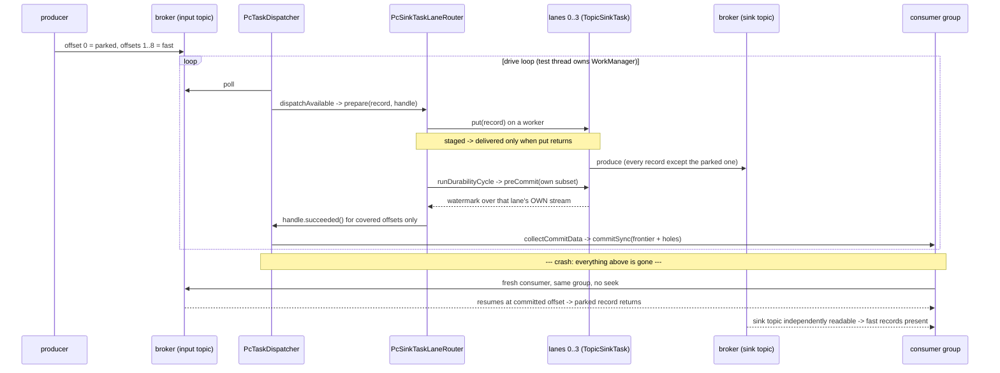

# Run and Settle the Broker-Backed Crash-Restart Arm - U3/U4 Completion Plan

## Goal Capsule

**Objective.** Finish U3 and U4 of `docs/plans/2026-08-10-001-investigate-connect-offset-composition.md`
by running the one piece of evidence that plan says is not optional - the broker-backed crash-restart arm -
and then writing the verdict it earns.

`OffsetCompositionCrashRestartTest` exists, compiles, and **has never been executed against a broker**. The
in-memory probe is green across 8 arms including an exhaustive enumeration, but the origin plan's own
residual-risk section states why that is not enough: *"U1's reading of `WorkerSinkTask` and U3's probe share
one model of the runtime. A misreading would be invisible to both arms at once... The crash-restart arm is
the only check that runs against a real broker rather than against the model."*

**What this plan is not.** It is not an implementation of the C3 mechanism, and it does not enable
`PcConnectDispatchBridge`. The scope stays inside the origin plan's Goal Capsule carve-out: the
`DeferringWorkPreparer`/`CompletionHandle` seam and the barrier already exist on this branch; this plan runs
the experiment over them and records the answer.

**What a green run does and does not license, stated up front so the verdict cannot outgrow it.** The arm
runs against a real broker but against **no Connect runtime** - no worker, no converter, no connector
lifecycle, no rebalance, and `PcConnectDispatchBridge.enabled()` still returns a hard-coded `false`. The
poll/dispatch/durability/commit loop is written by the test, which its own javadoc states plainly
(`OffsetCompositionCrashRestartTest.java:49-56`). So the arm evidences **the committed frontier** - that a
consumer-group commit never covers a record no lane durably wrote - and it does *not* evidence U1's reading
of `WorkerSinkTask`. That residual risk survives this run and the verdict must say so.

**Stop conditions.** Two, and both are results rather than blockers.

- If the arm fails and diagnosis shows a real defect in `PcSinkTaskDurabilityBarrier` or the seam, that is
  the arm doing its job. Fix the defect, never the assertion, and report the refutation at least as
  prominently as a confirmation.
- If the arm proves unrunnable here for an environmental reason, say so plainly with the evidence. Do not
  delete it and do not record a sound verdict without it - the origin plan's Definition of Done requires it.

---

## Problem Frame

The origin investigation reached U2's answer on paper: candidate C3 survives. Do not compose the lanes'
watermarks at all. Read each lane's `preCommit` return against *that lane's own record stream*, convert it
into per-record durability facts, and let Parallel Consumer's existing frontier machinery compose those.
`PcSinkTaskDurabilityBarrier` is that mechanism; `PcSinkTaskLaneRouter` wires it to lanes;
`PcTaskDispatcher.DeferringWorkPreparer` is the seam that stops "put returned" from meaning "durable".

Three things are already done and are **not** re-done here:

- The mechanism and its wiring (`PcSinkTaskDurabilityBarrier`, `PcSinkTaskLaneRouter`, the deferring seam in
  `PcTaskDispatcher`).
- `OffsetCompositionProbeTest` - 8 arms, in-memory, surefire, including a negative control that
  demonstrably fires and an exhaustive enumeration over every completion order across two lanes and four
  offsets.
- Both Kafka regression arms at `WorkerSinkTaskTest` 30/30.

What remains is the risky part. The broker-backed arm is written from the Streams module's
`CommitFrontierCrashRestartTest` **without ever having been executed**, so every runtime assumption in it -
consumer positioning, PC bootstrap behaviour, commit shape, lane routing under real keys, timing - is
untested prose. Expect it to need debugging.

### What the arm claims, and how

`OffsetCompositionCrashRestartTest.aCommitNeverCoversARecordNoLaneDurablyWrote` produces one parked record
at offset 0 plus 8 fast records into a single partition, hand-drives a poll/dispatch/durability/commit loop
over four `PcSinkTaskLane`s whose sink is a Kafka topic, and asserts:

1. the group's committed offset is exactly 0 - the parked record's own offset, the frontier;
2. a fresh consumer in that same group is handed the parked record back;
3. the sink topic really holds the fast records, so the frontier is held down by the parked record and not
   by the sink having written nothing.

The sink is a Kafka topic on purpose: it is durable and independently readable after the "crash", so the
test can ask what the sink *wrote* rather than asking the sink, which would not have survived.

---

## Requirements

- **R1. The arm runs against a real broker and its actual output is recorded.** Not "it passes" - the run
  output, the committed offset it observed, and what was redelivered. A summary is not evidence.
- **R2. No assertion is weakened to reach green.** If the arm fails, the defect is diagnosed and fixed in
  the mechanism or in the harness's *setup*, never by relaxing what is asserted. This is `AGENTS.md`'s
  standing rule and the origin plan's Definition of Done.
- **R3. The broker-backed arm can demonstrably fail - in two independent ways.** This is a requirement
  *this* plan introduces; the origin plan's KTD3 asks for a negative control on the **probe**, which
  `OffsetCompositionProbeTest` already carries. It is claimed here because without it the broker arm's
  assertions are satisfiable by the failure state:
  - **Non-vacuity against over-commit** - an inverted-rule arm, so an over-commit reaches broker state and
    is caught.
  - **Non-vacuity against under-commit** - a trigger-removed arm, so "the frontier stopped where it should"
    is distinguishable from "the frontier never moved". A barrier that confirmed *nothing at all* produces
    exactly the state the sound arm asserts: a commit at offset 0, the parked record redelivered, and eight
    records in the sink. Without this second arm, green is a tautology.

  Neither control detects a **modelling** error, and the plan must not claim otherwise. Inverting the
  confirmation rule varies the same term inside the same barrier the probe's control already varies. What
  the real broker adds is that PC's commit encoding, the consumer-group commit and the restart resume point
  are real rather than modelled - which is a narrower claim than the origin plan's residual-risk note
  implies, and the verdict must state the narrower one.
- **R4. Both existing regression arms still run `WorkerSinkTaskTest` 30/30, unchanged**, and the module's
  surefire probe stays green. The mandated gate is
  `./mvnw -pl parallel-consumer-connect -am -Dcopyright.skip=true verify`.
- **R5. U4's verdict is written into the origin plan's `Verdict` section** in the shape R1 of that plan
  demands - sound, sound-conditional (with each precondition and whether PC can detect it at runtime), or
  unsound (in principle vs given A1's lane primitive). `docs/inflight/pr-connect-on-pc.md` points at it.
  - **R5a.** If the verdict is **unsound**, it also states what partition-affine costs, as the origin plan's
    R5 defines it: an **analytic claim, not a measurement** - the fan-out ceiling equals the partition count
    and per-partition head-of-line blocking is unaddressed. The Streams module's figures are not quoted as
    Connect numbers. Without this the reader gets a bare "no" and needs a second investigation to price the
    fallback, which is exactly what the origin plan's KTD4 exists to prevent.
  - **R5b.** Whatever its shape, the verdict closes by saying **what it licenses for the concurrency
    claim** - key-level concurrency beyond the partition count available now, gated behind U1.3's
    whole-partition ownership gates, or unavailable and therefore capped at the partition count that
    `tasks.max` already reaches - and names the next plan. That is the question the whole investigation
    exists to decide, and a soundness verdict alone does not answer it.
- **R6. The origin plan's Definition of Done is satisfied item by item**, including a deliberate
  keep-or-revert decision on **every** piece of surface this investigation leaves behind. An orphan test or
  an unused production seam left behind fails the DoD even with a green run, and the enumeration must be
  complete or the rule does nothing:
  - `OffsetCompositionProbeTest` and `OffsetCompositionCrashRestartTest` (tests);
  - `PcTaskDispatcher.CompletionHandle` / `DeferringWorkPreparer` (the origin's single carve-out);
  - **`PcSinkTaskDurabilityBarrier` and `PcSinkTaskLaneRouter.runDurabilityCycle()`** - neither has any
    caller in `src/main` today, only in tests, because `PcConnectDispatchBridge` still returns `false`.
    These are exactly what the rule forbids and the first draft of this plan omitted them.

  One decision covers the lot: the crash-restart arm constructs the dispatcher and the deferring router
  directly, so reverting the seam would stop the arm that produced the evidence from compiling.

---

## Planning Contract

### Key Technical Decisions

- **KTD1. Add a broker-backed negative control, varying exactly one term.** The existing arm proves the
  sound rule holds against a real broker. A sibling arm identical in every respect except
  `ConfirmationRule.HIGHEST_ACROSS_LANES` proves the *arm* can see the failure - the committed offset runs
  past the parked record and the parked record is never handed back, which is silent data loss expressed in
  broker state rather than in the model.
  Rejected: relying on the probe's negative control. It varies the rule *inside the same model* the probe
  is built from, so it is blind to exactly the class of error the broker arm exists to catch
  (`docs/solutions/best-practices/control-arms-vary-exactly-one-term.md`,
  `docs/solutions/test-issues/a-restart-assertion-satisfiable-by-pre-crash-data-proves-nothing.md` -
  "red-then-green during development is necessary and not sufficient").

- **KTD2. Debug the harness before suspecting the mechanism, but record which one it was.** The arm was
  written from a sibling in another module and never run, so the prior probability sits with the harness -
  consumer positioning, PC bootstrap, `KafkaClientUtils` defaults, lane routing under real key hashes,
  timing. That is a prior, not a conclusion: every fix is classified as *harness* or *mechanism* and the
  classification is reported. A mechanism defect found here is the single most valuable outcome available
  and must not be quietly filed as a test fix.

- **KTD3. `-am` on every Maven invocation; never `-Dtest=`.** Without `-am`, `reactorModuleConvergence`
  fails, the module never recompiles, and the result is a silent false negative. `-Dtest=` applies globally
  and the stock regression arm runs with an intentionally empty classes directory, so selecting tests
  breaks the regression design. Carried verbatim from the origin plan's Verification Contract.

- **KTD4. Do not touch `PcConnectDispatchBridge`.** It returns a hard-coded `false` deliberately and must
  stay a method call. A `static final boolean` would be inlined at compile time and the runtime linkage the
  shadowing proof depends on would silently not exist.

- **KTD5. Java 8 API surface only.** `--release 8` via Jabel despite Java 17 source level, so `List.of`,
  `List.copyOf` and `Map.of` are unavailable. `PcSinkTaskLaneRouter` already records this at its
  `Collections.unmodifiableList(new ArrayList<>(...))` call.

---

## Assumptions

Recorded rather than confirmed with the user - this plan runs inside an agent pipeline with no interactive
turn available, so scoping bets are written down instead of asked.

- **A1.** Docker is available and usable on this machine (verified: Docker Desktop 27.4.0), and
  `BrokerIntegrationTest`'s Testcontainers `cp-kafka` image can start. If it cannot, that is the
  environmental blocker R1's stop condition covers.
- **A2.** Adding the broker-backed negative control (KTD1) is in scope. It is a test-only addition in the
  same file, directly serving the origin plan's KTD3 and its residual-risk note, and it does not extend the
  production carve-out.
- **A3.** The full mandated gate (`-am ... verify`) also builds and tests `parallel-consumer-core` and
  `parallel-consumer-streams`. Their failures are triaged against
  `docs/inflight/test-local-core-failures-2026-08-10.md` rather than treated as this plan's regressions -
  in particular `JStreamParallelEoSStreamProcessorTest`, a known unexplained local flake on this machine.
  Note, re-run, do not "fix".
- **A4. Prediction, recorded before the run and scored in U5: the arm passes with no change to
  `PcSinkTaskDurabilityBarrier` or `PcSinkTaskLaneRouter`, and every fix classifies as harness.** This is
  deliberately a prediction *this run can refute* - the earlier draft predicted a sound-conditional verdict
  gated on U1.3's ownership gates, which the arm never touches (`SinkTaskContext` is not in its path), so
  scoring it HELD would have recorded an unrisked prediction in the calibration record. The ownership gates
  are a U1.3 **conclusion**, not a prediction, and enter U5 as verdict input rather than as something to
  score.

---

## Scope Boundaries

### In scope

Running the broker-backed arm, diagnosing and fixing what it reveals, adding its negative control,
confirming the regression arms, and writing the U3 evidence and U4 verdict into the origin plan and the
inflight entry.

### Explicitly out of scope

Implementing the C3 mechanism beyond what already exists on the branch. Real `Converter` wiring, connector
instantiation, SMTs, DLQ, `ConfigProvider`. Enabling `PcConnectDispatchBridge`. Re-enabling publication of
`parallel-consumer-connect` or `parallel-consumer-streams` (licensing, tracked in
`docs/inflight/release-experimental-modules-publication-disabled.md`).

### Deferred to follow-up work

- The whole-partition ownership gates U1.3 classified as **separate gate** - `context.offset()` rewind,
  `assignment()`, `onPartitionsAssigned` seeding. The verdict names them; implementing detection or an
  opt-in for them belongs to the next plan.
- The `AGENTS.md` failsafe-includes defect recorded at the end of `docs/inflight/pr-connect-on-pc.md`
  (`**/*IT.java` is documented as included but is not). Unrelated to this arm; leave it in the inflight
  entry.

---

## High-Level Technical Design

What the crash-restart arm exercises, and where each assertion reads its evidence:

The load-bearing detail is that the parked record's lane returns a watermark pinned at 0 forever, so under
`OWNING_LANE` no other lane's progress can confirm it. The negative control flips exactly that: under
`HIGHEST_ACROSS_LANES` the ceiling built from the fastest lane confirms offset 0, the frontier passes it,
and the restart never sees it again.

---

## Implementation Units

### U1. Run the arm against a real broker and capture what it actually does

**Goal.** Turn "never executed" into a recorded observation. Nothing is diagnosed or changed in this unit.

**Requirements.** R1.

**Dependencies.** None.

**Files.**
- `parallel-consumer-connect/src/test/java/io/confluent/parallelconsumer/connect/integrationTests/OffsetCompositionCrashRestartTest.java` (modify - **observation logging only**)
- `parallel-consumer-connect/pom.xml` (modify - the surefire exclusion, if the run shows the arm running
  twice; see step 4)

**Approach.**
1. Confirm Docker is reachable and record the daemon version, so an environmental failure is
   distinguishable from a product failure before any run happens.
2. Run the mandated gate: `./mvnw -pl parallel-consumer-connect -am -Dcopyright.skip=true verify`, with the
   full output captured to a file rather than filtered - filtering the output you are then using as
   evidence is its own recorded defect
   (`docs/solutions/test-issues/do-not-filter-the-output-you-are-using-as-evidence.md`).
3. Record verbatim: the failsafe summary for the arm, the committed offset it observed, what
   `redeliveredFrom` returned, and the sink contents count. On failure, record the assertion message and
   the surrounding log lines, not a paraphrase.
   **The arm as written emits none of that.** It declares `@Slf4j` and never logs; the committed offset and
   the redelivered values exist only inside AssertJ `.as()` descriptions, which print on failure and never
   on green - so a passing run yields `Tests run: 1, Failures: 0` and nothing else, and R1 explicitly
   rejects that. Add INFO logging of the committed offset, its metadata length, the redelivered values and
   the sink count. That is instrumentation, not a fix, and is the one change this unit sanctions.
4. Check **where** the arm ran, not only whether it passed. The module's surefire `<excludes>` replaces
   rather than extends the root pom's, so `**/integrationTest*/**/*.java` may not be excluded here and the
   broker arm may be collected by the unit lane as well as by failsafe. Look for two report files and two
   container starts. If present, this is a real build defect: it makes the `test` phase require Docker, and
   on a red run it fails the build before failsafe is ever reached - which would silently destroy the
   evidence U3's deliberate red proof depends on.

**Execution note.** Observation first. Beyond the logging in step 3, resist fixing anything in this unit -
the first run's output is the baseline every later claim is measured against.

**Test expectation: none** - this unit runs an existing test rather than adding one.

**Verification.** A captured log exists containing the arm's own result line, and the run is classified as
one of: green, failed-with-assertion, failed-with-error, or blocked-environmentally.

### U2. Diagnose and fix what U1 revealed, classifying each fix as harness or mechanism

**Goal.** Reach an honest green - or an honest, evidenced "this is a real defect" - without touching a
single assertion.

**Requirements.** R1, R2.

**Dependencies.** U1.

**Files.**
- `parallel-consumer-connect/src/test/java/io/confluent/parallelconsumer/connect/integrationTests/OffsetCompositionCrashRestartTest.java` (modify - harness only)
- `parallel-consumer-connect/src/main/java/io/confluent/parallelconsumer/connect/PcSinkTaskDurabilityBarrier.java` (modify - only if the defect is genuinely here)
- `parallel-consumer-connect/src/main/java/io/confluent/parallelconsumer/connect/PcSinkTaskLaneRouter.java` (modify - only if the defect is genuinely here)
- `parallel-consumer-connect/pom.xml` (modify - only if a test-scope dependency is missing)

**Approach.**
1. Classify the failure before changing anything: harness (setup, positioning, timing, client defaults) or
   mechanism (the barrier, the router, the seam). State the classification and the reason for it.
2. Work the harness suspects in order of prior likelihood, each confirmed by evidence rather than by the
   fix working - a fix that works is not evidence of the cause:
   - **Consumer positioning - and the hazard the first draft of this plan had backwards.** The driver
     assigns and seeks to 0; the restart reader assigns with *no* seek, relying on the group's committed
     offset, which is right because that offset is the mechanism under test. But `KafkaClientUtils` defaults
     consumers to `OffsetResetStrategy.EARLIEST`, and that is the **hazard, not the legitimiser**: a no-seek
     consumer with *no committed offset at all* resets to 0 and hands back the parked record anyway, so
     `contains(PARKED_VALUE)` is satisfiable by the failure state. Fix it in the reader, not the assertion -
     override `auto.offset.reset=none` on the restart consumer so a missing commit throws instead of
     silently passing
     (`docs/solutions/test-issues/a-restart-assertion-satisfiable-by-pre-crash-data-proves-nothing.md`:
     make the wrong answer unreachable, do not assert harder).
   - **PC bootstrap.** `PcTaskDispatcher` builds a `MockConsumer` with no committed offsets and drives
     `onPartitionsAssigned` itself. Confirm `collectCommitData` actually returns an entry for the partition
     while offset 0 is incomplete; if it does not, the loop never commits and `lastCommitted` stays null.
   - **Lane routing under real keys.** Lanes are chosen by `ShardKey` hash over the real record key, so the
     parked record's lane may also hold fast records - whose watermark is then pinned behind the parked
     offset too. Confirm the durability accounting the loop's exit condition uses still reaches
     `FAST_RECORDS`, because that count is over what was *written to the sink*, not over what completed.
   - **Timing.** The loop's exit needs both a landed commit and the sink write count; a durability cycle
     can poll a lane between `put` returning and the barrier's `delivered` promotion, which is conservative
     by design and simply resolves on the next cycle.
3. If the defect is in the mechanism, fix the mechanism and add a probe arm in
   `OffsetCompositionProbeTest` that pins it - a broker-only reproduction is slow feedback for a rule that
   can be expressed in memory.
4. Re-run the mandated gate after each fix.

**Patterns to follow.** `CommitFrontierCrashRestartTest` in `parallel-consumer-streams` for the
phase-boundary discipline, and `PcSinkTaskDurabilityBarrier`'s existing staged-then-promoted shape - which
already carries one over-commit the probe caught (a failed `put` swept up by a later watermark), so the
same class of bug is the thing to look for first.

**Test scenarios.** No new scenarios are authored in this unit; the existing arm's assertions are the
scenarios. If a mechanism defect is found, add to `OffsetCompositionProbeTest`:
- The precise interleaving that produced the defect, expressed against the barrier directly, asserting the
  frontier does not exceed the lowest incomplete offset.
- The same interleaving with the defect's trigger removed, asserting the frontier does advance - so the new
  arm is not satisfied by a barrier that simply never completes anything.

**Verification.** The arm passes with every assertion textually unchanged from U1's baseline, and each fix
is recorded with its classification (harness or mechanism) and the evidence that identified it.

### U3. Give the broker-backed arm the two controls that make green mean something

**Shape.** Three arms in one class, sharing one driver, each differing from the first in exactly one term:

| Arm | Rule | Sink refuses parked? | Asserts |
|---|---|---|---|
| sound | `OWNING_LANE` | yes | committed offset is 0; parked redelivered; fast records in sink |
| trigger-removed | `OWNING_LANE` | **no** | committed offset is 9; nothing redelivered; parked in sink |
| negative control | **`HIGHEST_ACROSS_LANES`** | yes | committed offset > 0; parked *not* redelivered; parked *not* in sink |

The trigger-removed arm is not decoration. A barrier that confirmed nothing at all produces exactly the
state the sound arm asserts, so without it green means "the frontier never moved" rather than "the frontier
stopped where it should".

### U3 (detail). Give the broker-backed arm a negative control that demonstrably fires

**Goal.** Make green mean something. A broker arm that cannot fail carries the same weakness the origin
plan's U2 step 3 was written to close, one level up from the probe.

**Requirements.** R3.

**Dependencies.** U2.

**Files.**
- `parallel-consumer-connect/src/test/java/io/confluent/parallelconsumer/connect/integrationTests/OffsetCompositionCrashRestartTest.java` (modify - add the control arm)

**Approach.**
1. Extract the driver loop so the confirmation rule is its only varying input - identical topics-per-run,
   identical records, identical lane count, identical loop. Exactly one term differs
   (`docs/solutions/best-practices/control-arms-vary-exactly-one-term.md`).
2. The control arm constructs the router with `ConfirmationRule.HIGHEST_ACROSS_LANES` and asserts the
   over-commit in *broker state*: the committed offset runs past the parked record's offset, and a fresh
   consumer in that group is never handed the parked record back.
3. Assert the loss positively as well as negatively - the parked value is absent from the sink topic *and*
   absent from what the restart is handed. Absence alone could be a reader that saw nothing; pairing it
   with the advanced committed offset names the mechanism.
4. Keep the control's redelivery wait short. It is asserting on an expected empty result, so a long
   deadline only slows the suite.

**Execution note.** Prove the control fires before trusting it: run it once against the sound rule and
confirm it fails there. A control arm that passes under both rules is not a control.

**Test scenarios.**
- With `HIGHEST_ACROSS_LANES`, the group's committed offset is strictly greater than the parked record's
  offset - the over-commit itself.
- With `HIGHEST_ACROSS_LANES`, a fresh consumer in the same group is not handed the parked record: it was
  recorded as done while no lane had written it, which is the silent data loss.
- The parked value never appears in the sink topic under either rule - so the loss is real, not a record
  that was written and merely re-read.
- Sanity: the sound arm and the control arm differ in the confirmation rule alone. Any other divergence in
  setup makes the comparison meaningless.

**Verification.** The control arm is green as written (it asserts the *broken* behaviour), and swapping its
rule to `OWNING_LANE` turns it red - demonstrated once, and recorded.

### U4. Confirm the regression arms and the full module gate

**Goal.** Show the harness added nothing and broke nothing: Kafka's own `WorkerSinkTaskTest` is the
regression oracle, and it must still run 30/30 in both the stock and patched arms.

**Requirements.** R4.

**Dependencies.** U3.

**Files.**
- `parallel-consumer-connect/pom.xml` (read-only - the three surefire executions that constitute the
  regression design)
- `parallel-consumer-connect/src/test/java/io/confluent/parallelconsumer/connect/WorkerSinkTaskRegressionTest.java` (read-only)

**Approach.**
1. Run the mandated gate once more, clean, and read the counts out of both report directories rather than
   trusting the aggregate summary - the stock arm runs against an intentionally empty classes directory, so
   a mis-scoped run reports success having tested nothing.
2. Confirm the verifier execution (`worker-sink-task-report-verifier`) ran and compared both report sets
   against the checked manifest.
3. Triage any `parallel-consumer-core` or `parallel-consumer-streams` failures against
   `docs/inflight/test-local-core-failures-2026-08-10.md` before attributing them here. Re-run rather than
   "fix"; report the reproduction rate and the conditions, not a verdict.

**Test expectation: none** - this unit runs existing gates rather than adding coverage.

**Verification.** Both regression arms report 30/30, the verifier passes, and any dependency-module failure
is named with its prior-art classification and its re-run outcome.

### U5. Write U3's evidence and U4's verdict into the origin plan, and point the inflight entry at it

**Goal.** A reader who was not here can act on the answer.

**Requirements.** R5, R6.

**Dependencies.** U1, U2, U3, U4.

**Files.**
- `docs/plans/2026-08-10-001-investigate-connect-offset-composition.md` (modify - Findings gains a U3
  section; `Verdict` is populated)
- `docs/inflight/pr-connect-on-pc.md` (modify - point at the verdict)
- `parallel-consumer-connect/connector-compatibility.md` (modify - **mandatory** if the verdict is
  sound-conditional; see step 6)
`CHANGELOG.adoc` is deliberately **not** in that list. `AGENTS.md` states a PR never *adds* an entry - the
`== 0.6.0.0` section is regenerated from the commit log at release time - so U5's obligation is a commit
message that states the verdict, not a changelog edit.

**Approach.**
1. Add a `U3` subsection under the origin plan's Findings recording what the arms actually did - the
   committed offset observed, what the restart was handed, what the negative control demonstrated, and
   every fix classified as harness or mechanism. Refutations get the same prominence as confirmations
   (`docs/solutions/best-practices/chase-refuted-predictions.md`).
2. Write the `Verdict` section: one sentence, then the evidence. Use one of the three shapes the origin
   plan's R1 defines, and satisfy R1a (each precondition PC cannot verify at runtime carries a note that
   the next plan must add detection or an explicit connector opt-in) or R1b (unsound *in principle* vs
   unsound *given A1's lane primitive*, naming the responsible property). If unsound, R5a's analytic cost
   statement lands here too.
3. State the evidence boundary in the verdict itself, in the arm's own terms: a real broker, no Connect
   runtime, so U1's reading of `WorkerSinkTask` remains argued rather than executed. A reader who takes the
   verdict as broker-backed proof of the *runtime* reading has been misled by omission.
4. Close the verdict with R5b - what it licenses for the concurrency claim - and name the next plan:
   implement the mechanism, or implement partition-affine and close the concurrency claim.
5. Record, for each of the origin plan's "Reviewer questions worth answering in U4", either an answer or an
   explicit deferral with its reason. Two decide whether the verdict holds in a real deployment:
   - **Does lane membership survive conversion and SMTs?** A key-rewriting SMT breaks the assumption that a
     record's lane is stable, beneath *any* sound mechanism. If unanswered, R1a must carry it as a named
     precondition rather than leave it implicit.
   - **What is the do-nothing baseline** - repartition the topic and raise `tasks.max` - and for which
     workloads does the key-affine path still beat it? The comparison arm is partition-affine, which is not
     the option a user actually has today.
6. If the verdict is sound-conditional, update `parallel-consumer-connect/connector-compatibility.md` so the
   whole-partition ownership gates appear as a **second exclusion axis** alongside key-affine versus
   partition-affine output identity. Today the catalogue sorts on output identity alone, so a connector the
   verdict has just excluded for calling `SinkTaskContext.offset()` would keep a green key-affine row.
7. Score A4's prediction - held or refuted - and leave the refutation in place if it was wrong.
8. Pin the verdict to its Kafka version. It rests on package-private `WorkerSinkTask` internals read from a
   build-time-generated copy of 3.9.2, which are not public contract.
9. Walk the origin plan's Definition of Done item by item and make the keep-or-revert calls explicit: the
   probe is deleted or promoted deliberately, and the `PcTaskDispatcher` seam is likewise kept deliberately
   or reverted rather than left as unused production surface. Note the interaction: the crash-restart arm
   constructs `PcTaskDispatcher` and the deferring router directly, so reverting the seam would stop the arm
   that produced the evidence from compiling. Keep-or-revert is therefore one decision covering both.
10. Update `docs/inflight/pr-connect-on-pc.md` so its "step after U2" section points at the verdict instead
    of describing the design as still open.

**Test expectation: none** - documentation. U1-U4's evidence is the proof.

**Verification.** The origin plan's `Verdict` is no longer a placeholder; every Definition of Done bullet
in that plan has a corresponding statement in this branch's work; the inflight entry links to the verdict.

---

## Verification Contract

| Gate | Command | Covers |
|---|---|---|
| Full module gate, including the failsafe arm | `./mvnw -pl parallel-consumer-connect -am -Dcopyright.skip=true verify` | U1, U2, U3, U4 |
| Negative-control proof | Same gate, with the control arm's rule temporarily set to `OWNING_LANE`; it must go red | U3 |
| Full repository gate before merge | `bin/ci-build.sh` | all |

`-am` is mandatory: without it `reactorModuleConvergence` fails, the module never recompiles, and the run
is a silent false negative. `-Dtest=` cannot be used on this module - it applies globally, and the stock
regression arm runs with an empty classes directory by design. The crash-restart arm lives in an
`integrationTests` package, which surefire excludes and failsafe includes, so a `test`-phase gate reports
green having skipped it entirely.

---

## Risks

- **The arm is slow and Docker-bound.** `BrokerIntegrationTest` starts a Testcontainers `cp-kafka`
  instance per JVM, and the mandated gate also builds and tests core and streams. Budget for long runs and
  capture output to files rather than re-running to re-read it.
- **A dependency-module flake reads as this plan's failure.** `JStreamParallelEoSStreamProcessorTest` in
  core is a known unexplained local flake on this machine. Triage against
  `docs/inflight/test-local-core-failures-2026-08-10.md`, note it, re-run, and do not touch it.
- **The temptation to relax the arm.** The parked-record assertion is exact (`isEqualTo(0L)`) and the
  redelivery assertion is a `contains`. Both are the property under test. If either is inconvenient, that
  is a finding, not a reason to soften it.
- **A green run over a modelling error.** The whole reason the broker arm exists is that the probe cannot
  see one. U3's control is the mitigation; without it a green run here proves less than it appears to.

---

## Definition of Done

- The broker-backed arm has been executed against a real broker and its actual output is recorded verbatim,
  or an environmental blocker is documented with its evidence.
- Every fix is classified as harness or mechanism, with the evidence that identified it. No assertion was
  weakened.
- The broker-backed negative control exists, is green under the inverted rule, and has been shown to go red
  under the sound rule.
- Both `WorkerSinkTaskTest` regression arms report 30/30 and the report verifier passes.
- The origin plan's Findings carries a U3 section and its `Verdict` section is populated in one of the three
  shapes R1 defines, pinned to Kafka 3.9.2, stating its own evidence boundary (real broker, no Connect
  runtime) and closing with what it licenses for the concurrency claim plus the next plan.
- If the verdict is unsound, it carries R5a's analytic cost statement for partition-affine. If it is
  sound-conditional, `parallel-consumer-connect/connector-compatibility.md` carries the whole-partition
  ownership gates as a second exclusion axis.
- Each of the origin plan's "Reviewer questions worth answering in U4" has either an answer or an explicit
  deferral with its reason - SMT lane stability in particular.
- The origin plan's own Definition of Done is walked item by item, including the deliberate keep-or-revert
  decisions on the probe and the dispatcher seam.
- `docs/inflight/pr-connect-on-pc.md` points at the verdict.
- `PcConnectDispatchBridge` still returns a hard-coded `false` from a method, and publication of both
  experimental modules is still disabled.

---

## Sources

- `docs/plans/2026-08-10-001-investigate-connect-offset-composition.md` - the origin investigation; U1 and
  U2 findings, the Verification Contract, and the Definition of Done this plan completes.
- `docs/inflight/pr-connect-on-pc.md` - PR state, the C3 design statement, and the compounding note about a
  review severity calibrated on an unchecked premise.
- `docs/solutions/test-issues/a-restart-assertion-satisfiable-by-pre-crash-data-proves-nothing.md` - why the
  restart reader must be structurally incapable of returning pre-crash state, and why red-then-green is
  necessary but not sufficient.
- `docs/solutions/best-practices/control-arms-vary-exactly-one-term.md` - the discipline behind U3.
- `docs/solutions/best-practices/chase-refuted-predictions.md` - refutations get the same prominence as
  confirmations.
- `docs/solutions/architecture-patterns/a-high-water-mark-cannot-express-out-of-order-completion.md` - the
  property the whole investigation turns on.
- `docs/inflight/test-local-core-failures-2026-08-10.md` - prior art for triaging local core failures.
- `docs/inflight/release-experimental-modules-publication-disabled.md` - why publication stays off.

---

## Review Findings - from the 2026-08-11 doc review, and where each landed

Four reviewer contexts ran on this plan: product-lens, adversarial, feasibility, and a merged
coherence + scope-guardian pass. **The merge is disclosed rather than hidden**: coherence and scope ran in
one dispatched context for capacity reasons, so their agreement is not independent corroboration. No
cross-model peer pass ran - the detached-runner invocation it needs is not available under this session's
shell restrictions. Both gaps are named here rather than in a footnote.

| Finding | Reviewer | Landed in |
|---|---|---|
| Unsound-verdict cost obligation (origin R5) dropped | product-lens, P1 | R5a; U5 step 2 |
| Verdict never says what it licenses for concurrency | product-lens, P1 | R5b; U5 step 4; verdict's "What this licenses" |
| Plan omits that the arm runs no Connect runtime | product-lens, P1 | Goal Capsule; U5 step 3; the verdict's evidence-boundary section |
| Compatibility catalogue update optional despite the predicted conditions | product-lens, P2 | U5 step 6; `connector-compatibility.md` second exclusion axis |
| Origin's U4 reviewer questions dropped, incl. SMT lane stability | product-lens, P2 | U5 step 5; SMT is now a named precondition in the verdict |
| Broker control varies the same term as the probe's | adversarial, P1 | R3 rewritten; the verdict states neither control detects a modelling error |
| Sound arm never shows the frontier *advancing* | adversarial, P1 | **The trigger-removed arm.** The single most valuable finding of the review |
| `preCommit`-throws path unexercised and unclassified | adversarial, P1 | Recorded in the verdict as a liveness gap; **not** fixed, and not covered by any arm |
| A4 could not be refuted by the run it is scored against | adversarial, P2 | A4 replaced with a refutable prediction |
| EARLIEST reset makes the restart reader vacuous | adversarial P2 + coherence P1 | U2 reasoning corrected; reader now `auto.offset.reset=none` |
| The "crash" is a graceful close, not an abort | adversarial, P2 (FYI) | `abortClose()`, matching the streams sibling |
| Sink marks durable on an un-acked send | adversarial, residual risk | The sink now blocks on the producer's acknowledgement |
| Lane-collision could silently degenerate the control | adversarial + feasibility, residual risk | The control asserts `lanesUsed > 1` |
| Keep-or-revert omits the connect module's own production surface | scope, P1 (confidence 100) | R6 enumerates five surfaces; the origin plan's DoD walk decides all five |
| U2's production-modify permission exceeds the origin's carve-out | scope, P2 | Stated as a separate, bounded, defect-fix-only allowance |
| `CHANGELOG.adoc` listed as a conditional edit, which `AGENTS.md` forbids | scope, P2 (confidence 100) | Removed; replaced with the commit-message note |
| A2 records a new requirement as an inherited one | scope, P3 | R3 relabelled as introduced by this plan |
| Surefire also runs the broker arm | feasibility, P1 (confidence 100) | **Confirmed by running it**, then fixed in the pom. See the origin plan's U3.3 |
| The arm emits no observations, so R1 cannot be satisfied | feasibility, P1 (confidence 100) | U1 step 3; the arm now logs its observations |
| Control's exit condition can snapshot before the over-commit | feasibility, P2 | The driver now settles rather than snapshots |

Two findings were confirmed independently by a reviewer reading the code and by the run itself - the
surefire/failsafe exclusion defect, and the missing observations. Both are recorded in the origin plan's U3
findings, because they are results rather than review notes.

**Not applied, deliberately:** the `preCommit`-throws probe arm. Fixing the underlying gap would be
implementing the mechanism, which KTD1 puts out of scope; pinning today's abort-the-whole-cycle behaviour in
a test would enshrine behaviour the verdict says should change. It is recorded in the verdict as the next
plan's work and named as uncovered.
