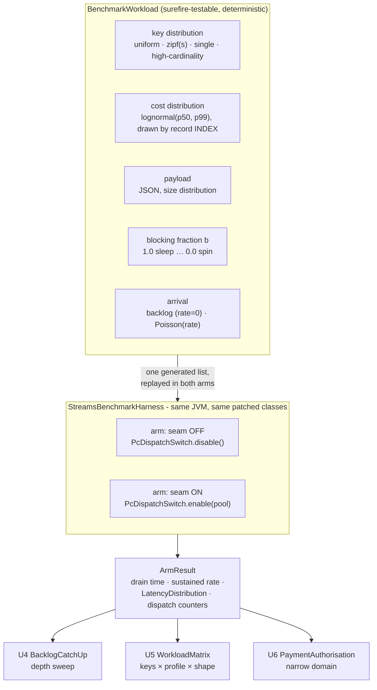

# test(streams) astubbs#255: a realistic-domain benchmark and a synthetic matrix, beside the synthetic one

**Target module:** `parallel-consumer-streams`
**Base branch:** `feats/ks-streams-refuse-unsupported-surface`

---

> **Executed.** The measurements, and the four predictions this plan got wrong, are in
> [2026-08-11-001-realistic-benchmark-result.md](2026-08-11-001-realistic-benchmark-result.md). Read the
> refutations first - two of them changed what the benchmark measures, and one indicted the benchmark's own
> CPU fixture rather than the code under test.

## Summary

`HeadOfLineBlockingBenchmarkTest` measures one property under conditions chosen to isolate it: a
single 1500ms blocker at the head of one partition, twentyfour 25ms records behind it on other keys,
blocking IO. That is correct experiment design and it produced an honest result - 57x on the minimum,
with a 0.69x single-key control printed beside it. It is also, unavoidably, the shape a sceptic
dismisses without engaging: attack the design and the number never has to be argued with.

This plan builds the second benchmark the repo already asked for, in three parts:

1. A **cold-start backlog catch-up** experiment, which is the headline. The topology starts against a
   topic that already holds a backlog, and drains it. Arrival rate is not a variable at all.
2. A **synthetic matrix** that sweeps key distribution, processing profile and data shape, openly
   synthetic, where coverage lives.
3. One **narrow domain workload** - card-payment authorisation screening - whose job is
   approachability, not coverage.

Its purpose is not to beat 57x. Its purpose is to leave "synthetic, unfair, false advertising"
nowhere to land, and to publish the cells where PC does nothing or loses.

---

## Problem frame

The mandate is already written down, in `docs/inflight/next-fork-packaging-docs-and-licensing.md`:

> Also build a realistic-domain benchmark, as devil's-advocate cover for the synthetic one. [...] Its
> job is not to beat the synthetic figure. Its job is to leave "synthetic, unfair, false advertising"
> nowhere to land [...] Pick the domain as though the hostile reviewer picked it.

Four things about the existing benchmark are what a hostile reviewer attacks, and each has an answer
this plan must actually deliver rather than assert:

| Attack | What answers it |
|---|---|
| "You picked a 1500ms blocker and 25ms victims - a 60:1 ratio nobody has." | No blocker class at all. Every record draws its cost from one distribution, so no record is privileged. |
| "You gave every record its own key. Real keyspaces have hot keys." | A Zipf-skewed key distribution as a first-class axis, plus a single-key floor case. Skew *hurts* PC, by construction. |
| "One partition. Stock parallelises across partitions - just add some." | State the constraint plainly, sweep it, and report the arithmetic: matching PC's in-task concurrency by partition count costs a partition and a consumer per unit of concurrency. |
| "n=24. Your p99 is your maximum." | Sample sizes in the hundreds-to-thousands, and a statistic chosen and justified before the run. |

There is a fifth attack, and it is the one the repo's own learnings warn about most sharply: a
realistic domain naturally derives processing cost from the record (premium cards get a deeper check,
big merchants get a heavier lookup). That would make key skew and cost co-vary, and the control arm
would be measuring two terms. `docs/solutions/best-practices/control-arms-vary-exactly-one-term.md`
records exactly this defect being found in the existing benchmark, where it put the control's p50 at
19568ms against the experiment's 1865ms.

---

## Requirements

| ID | Requirement |
|---|---|
| R1 | A cold-start backlog catch-up experiment: pre-load the topic, start the topology, drain. Report time-to-drain and sustained catch-up rate for both arms, sweeping backlog depth. |
| R2 | A synthetic matrix over key distribution (uniform, Zipf-skewed, high-cardinality, single-key), processing profile (blocking, CPU-bound, mixed) and data shape (small, large payloads). Every cell reports both arms. |
| R3 | One narrow, plausible domain workload a sceptical reader recognises, on the Kafka Streams surface this module actually supports. |
| R4 | A parameterisable load generator: key distribution and skew, payload size, a per-record **cost distribution** rather than a constant, blocking fraction, backlog or paced arrival, seeded and deterministic. |
| R5 | Both arms in the same JVM on the same patched classes, varying only `PcDispatchSwitch`. Identical input records in both arms, by replaying one generated list. |
| R6 | Per-record processing cost must be statistically independent of the record's key, so the key-distribution axis varies exactly one term. |
| R7 | The statistic each claim rests on is chosen and justified before the run, separately from what is merely logged. |
| R8 | Predictions stated before running; refuted predictions reported at least as prominently as confirmed ones. |
| R9 | A runnable entry point a human can invoke with parameters, so results can be re-derived under a different configuration. |
| R10 | Runtime is a design constraint. A default invocation must finish in minutes, and the measured duration is reported. |
| R11 | The mechanism marker must be read in every arm: a PC arm reporting zero records dispatched to the pool voids its own result. |
| R12 | No existing assertion weakened or deleted. Kafka's own 419 stay green with the seam off. |

---

## Key technical decisions

### KTD1. The backlog runner is the primary harness, and paced arrival is a mode of it, not a second harness

A cold-start backlog is a better experiment than a rate-driven one for this claim, for reasons that
are worth stating because they are counter-intuitive:

- **It removes arrival rate as a variable.** Work is always available, so nothing is ever waiting on
  the broker and the measurement is pure processing concurrency.
- **It is the operationally common case.** Restart after downtime, a new consumer group, a replay,
  recovery after an incident, a rebalance handing a partition to an instance that is behind.
- **It neutralises this repo's own recent optimisation.** Wake-on-work (astubbs#255) exists to stop a
  worker completion waiting out a poll budget. With a full backlog the poll almost never has to wait,
  so a good result here cannot be attributed to that fix. A result that survives the removal of your
  own optimisation is stronger evidence than one that depends on it. The split-poll-wait counter is
  reported to demonstrate that it barely fired.

Paced (Poisson) arrival is still built, because R4 asks for a controlled rate and because the domain
workload reads better as a steady stream than as a dump. It is one parameter on one generator, not a
second code path: `rate = 0` means "produce everything before start", any positive rate paces sends
on exponential inter-arrival times.

### KTD2. Per-record cost is drawn from a lognormal distribution, keyed on the record's *index*, never its key

Two decisions in one, and the second is the load-bearing one.

**Lognormal**, because a constant cost is the least realistic thing a benchmark can do and because
service-call latency is the textbook lognormal: a tight body with a long right tail. A constant cost
also silently favours PC, since with equal costs a pool of N drains exactly N-fold; a tail means some
workers are stuck on slow records while others turn over, which is what real pools look like.

**Keyed on index, not key**, because `control-arms-vary-exactly-one-term.md` records that exact defect
in this repo. If cost were drawn from the key, then changing the key distribution would change the
cost distribution too, and the skew axis would vary two terms. `BenchmarkWorkloadTest` asserts the
independence directly rather than trusting the comment.

### KTD3. The claim on the backlog experiment rests on the sustained catch-up rate, not on time-to-drain

`docs/solutions/best-practices/choose-the-statistic-that-states-the-claim.md` is the governing
learning: choose the statistic that states the claim, deliberately, separately from what gets logged.

- **Time-to-drain** is what an operator feels, so it is reported. It is the wrong thing to *assert* on
  because it includes a fixed startup cost (topology start, partition assignment, first poll) that is
  not the property under test and whose share shrinks as backlog depth grows. A claim asserted on it
  would move with backlog depth rather than with the seam.
- **Sustained catch-up rate** - completions per second over the middle of the drain, discarding the
  first and last decile - is the property. It is invariant to backlog depth, which makes it checkable
  across the depth sweep: if the ratio holds at three depths it is not an artefact of one.
- **In-chain latency distribution** is reported at min/p50/p99/max because the tail is real
  information, but it carries no assertion here: with a saturated backlog, per-record latency is
  dominated by how deep in the queue a record sat, which is a restatement of the drain rate.

For the paced-arrival domain run the statistic is different and is stated there: **end-to-end p99**,
because that is what an SLO is written against, and because with n in the thousands p99 is a genuine
tail statistic rather than the maximum in disguise. n is asserted large enough that p99 is not the
single worst sample.

### KTD4. The CPU-bound arm is a real spin, and the "no gain" prediction is expected to be refuted

The existing benchmark's fixture is deliberately a `sleep` and its comment says a spin "would compete
for cores with the other workers - measuring the scheduler instead of the seam". For the CPU-bound
control that competition is precisely the measurement, so its fixture is a deadline-bounded loop doing
real work (repeated hashing over the record's payload), not a sleep.

The received wisdom - and the framing this task arrived with - is that a CPU-bound workload should
show little or no gain because PC's advantage is for work that blocks. **That is predicted here to be
wrong on an unsaturated machine, and the prediction is written down so the refutation counts.** Stock
Streams runs one record at a time per StreamThread whether the thread is blocked or computing; a
worker pool spreads CPU work across cores just as it spreads blocked calls across waits. On a 12-core
box with 1 StreamThread, PC should gain roughly `min(poolSize, spareCores)` even at zero blocking.

The honest negative control is therefore CPU-bound work **on a saturated machine**, where the stock
arm already occupies every core and extra threads buy only context switches. Both are run, and the
distinction is the finding.

### KTD5. The synthetic matrix and the domain workload both live in the streams module's test tree; the runnable entry point is a script

Placement was suggested as "matrix in the test tree, domain workload as a runnable example". This plan
puts both in the test tree and makes `bin/streams-benchmark.sh` the thing a human runs, for three
reasons:

1. A second module under `parallel-consumer-examples/` collides with concurrent work: another agent is
   building a demonstration example module, and `parallel-consumer-example-streams` is the independent
   stock arm of a controlled comparison that must not gain a PC dependency.
2. Both arms must run in one JVM on the patched classes (R5). Only the `parallel-consumer-streams`
   test tree has that.
3. `bin/performance-test.sh` already establishes the convention that a benchmark's human-facing entry
   point in this repo is a script wrapping Maven. A script that takes `--scenario payments --skew 1.0
   --backlog 4000` is as runnable as a `main()` and does not need a module.

### KTD6. Tagged `@Tag("performance")`, out of the default gating lane

The default failsafe lane excludes `performance`. A benchmark that adds minutes to every PR is a
benchmark that gets deleted. `bin/streams-benchmark.sh` runs with `-Dincluded.groups=performance`, the
same route `bin/performance-test.sh` uses.

### KTD6b. "Drained" is defined twice, and the second definition is the one that cannot be faked

A drain that stops when records stop arriving is measuring silence, not completion. This benchmark
uses two independent definitions and requires both:

1. **Timing** comes from in-process completions: the drain is complete the moment the topology has
   completed processing every record of the backlog. This is the property under test and it is what the
   clock is stopped on.
2. **Correctness** comes from the broker: the output topic's end offset, captured with the admin client
   *before* the topology starts and again after, must have advanced by exactly the backlog depth.

The second exists because of a defect already found and fixed in this module.
`CommitFrontierCrashRestartTest` records it: a fresh consumer group reading from `earliest` re-reads
output produced *before* the phase under test, so the count assertion is satisfied by records the phase
never produced. Its `outputEndOffset()` / `drainFrom()` pair is the fix, and this plan reuses the
pattern rather than re-deriving it. Because the benchmark needs only a count, the admin-client
end-offset half is enough and no output consumer is needed at all - which removes the failure mode by
construction rather than by remembering to seek.

### KTD6c. Warm-up is handled by a discarded pass, an order swap, and a trimmed measurement window

A cold JVM draining a backlog shows JIT effects in the first seconds, and whichever arm runs second
inherits the other's warm-up. Three defences, because any one alone is arguable:

1. **A discarded warm-up pass** before any measured arm, in the same JVM, on the same topology shape.
2. **The measurement window is trimmed** - the sustained-rate statistic already discards the first and
   last decile of the drain, which is where the remaining JIT and the ragged tail live.
3. **The arms are run in both orders** and both results reported. If stock-then-PC and PC-then-stock
   disagree, the number is warm-up, not the seam. This is cheap and it is the only one of the three
   that can actually falsify the others.

### KTD7. The percentile helper is extracted from the existing benchmark, not copied

`HeadOfLineBlockingBenchmarkTest.Latencies` is the only percentile machinery in the repo. It becomes a
shared `LatencyDistribution` in a new `io.confluent.parallelconsumer.streams.benchmark` package, with
its behaviour unchanged and its first unit test. The existing benchmark's assertions are untouched -
only the class it calls moves.

The new package is deliberately *not* an `integrationTests` package, so the generator and the
statistics get fast surefire unit tests. The benchmarks themselves stay in `integrationTests`, where
failsafe and Docker belong.

### KTD8. Experiment B is folded in rather than left dangling

`HeadOfLineBlockingBenchmarkTest` carries `@see KeyCardinalityScalingBenchmarkTest`, a javadoc
reference to a class that was planned as Experiment B (a cardinality sweep over `K ∈ {1,2,4,8}`) and
never written. The matrix's key-distribution axis is that experiment plus skew, so the reference is
re-pointed at the class that now does the job rather than left pointing at nothing.

---

## High-level technical design

The single-term discipline in one line: **one `BenchmarkWorkload` instance is generated once per
scenario and replayed into both arms**, so the two arms differ in `PcDispatchSwitch` and in nothing
else - not in keys, not in payloads, not in per-record cost, not in arrival times.

---

## Predictions, stated before running

Falsifiable, and each names what would refute it. Refutations get reported first.

**P1 - backlog catch-up, blocking profile, skew-free keys.** PC's sustained catch-up rate exceeds
stock's by a factor approaching, but below, the worker pool size. *Refuted if* the ratio is at or
below 1.0, or if it exceeds the pool size (which would mean something other than concurrency is
responsible).

**P2 - the ratio is invariant to backlog depth, and this partially contradicts the expectation the
task arrived with.** The brief expects the advantage to compound with depth, "because under stock a
partition is drained one record at a time no matter how deep the queue is". The first half of that is
right and the conclusion needs splitting, so it is worth predicting precisely:

- The **absolute time saved** compounds with depth without limit. Deeper backlog, more seconds saved.
- The **time-to-drain ratio** rises with depth, because the fixed startup cost is amortised.
- The **sustained-rate ratio is flat in depth.** Both arms are throughput-limited from the first
  second: stock at roughly one record per mean cost, PC at roughly `poolSize` records per mean cost.
  Nothing about that ratio has anything left to compound.

*Refuted if* the sustained-rate ratio moves systematically with depth - which would mean either that
the statistic chosen in KTD3 is not measuring what it claims, or that something depth-dependent
(buffering, commit interval, memory pressure) is in play that this model does not contain. Either
would be a more interesting finding than the confirmation.

**P2b - the effect saturates at the pool, and the saturation point is the useful number.** The
sustained-rate ratio plateaus at or below `poolSize`, because once the pool is the bottleneck the
partition handover is no longer what is limiting anything. Sweeping depth locates nothing here;
sweeping *pool size* would, and that is named as follow-up work rather than smuggled in. What this
plan reports is where the measured ratio sits relative to the pool, which tells anyone sizing this
whether they are handover-limited or pool-limited. *Refuted if* the ratio exceeds the pool size, which
would mean the gain is not concurrency.

**P3 - single key is the floor, and PC loses there.** With every record on one key, PC's KEY ordering
permits one in flight, so PC must be at or slightly below stock. *Refuted if* PC wins - in which case
every other cell is measuring a faster harness and must be withdrawn. This is the falsifier for the
whole matrix.

**P4 - skew degrades PC monotonically.** As the Zipf exponent rises, PC's advantage falls, because the
hot key serialises. At high skew PC approaches the single-key floor. *Refuted if* skew has no effect,
which would mean the skew is not reaching the key assignment.

**P5 - CPU-bound on an unsaturated machine still gains, contradicting the received wisdom.** At
blocking fraction 0 on a 12-core box with one StreamThread, PC gains roughly `min(poolSize,
spareCores)`. *Refuted if* the gain is ~1.0, which would mean thread-level parallelism is not reaching
the CPU work.

**P6 - CPU-bound on a saturated machine is the real negative control.** With the stock arm already
occupying every core, PC's gain is ~1.0 or below. *Refuted if* PC still gains materially, which would
mean the saturation is not real.

**P7 - the mixed profile follows Amdahl.** Gain at blocking fraction `b` tracks
`1 / ((1-b) + b/C)` for effective concurrency `C`. *Refuted if* the mixed cell falls outside the
bracket set by the two pure cells.

**P8 - larger payloads shrink the ratio.** Serialisation and JSON parse are CPU work on the same
thread, so a larger payload raises the non-blocking share and moves the cell towards P7's CPU end.
*Refuted if* payload size has no effect.

**P9 - wake-on-work is not doing the work here.** Split-poll-wait counts in the backlog arms are a
small fraction of records dispatched, because a saturated backlog means the poll rarely has to wait.
*Refuted if* the counts are comparable to the record count, in which case the backlog is not actually
saturated and KTD1's independence claim fails.

**P10 - arm order does not change the answer.** Running stock-then-PC and PC-then-stock gives
sustained-rate ratios that agree within noise. *Refuted if* they disagree, in which case the measured
difference is JVM warm-up and the headline must be withdrawn until the warm-up pass is fixed.

**P11 - backlog catch-up is the strongest cell.** The sustained-rate ratio under a backlog exceeds the
equivalent ratio under paced arrival at the same profile, because a backlog keeps every worker busy
whereas a paced arrival below saturation leaves them idle. *Refuted if* backlog is not the strongest
case - which the brief explicitly wants stated plainly rather than buried, so it is written here as a
prediction that can fail rather than as an assumption.

---

## Implementation units

### U1. Extract the percentile machinery, and give it its first test

**Goal:** One shared `LatencyDistribution`, used by the existing benchmark and by everything this plan
adds.

**Requirements:** R7, R12

**Dependencies:** none

**Files:**
- `parallel-consumer-streams/src/test/java/io/confluent/parallelconsumer/streams/benchmark/LatencyDistribution.java` (create)
- `parallel-consumer-streams/src/test/java/io/confluent/parallelconsumer/streams/benchmark/LatencyDistributionTest.java` (create)
- `parallel-consumer-streams/src/test/java/io/confluent/parallelconsumer/streams/integrationTests/HeadOfLineBlockingBenchmarkTest.java` (modify - use the extracted class; assertions untouched)

**Approach:**

1. Move the private `Latencies` class out verbatim - same `ceil(p/100*n)-1` percentile index, same
   `toString()` shape - into a public `LatencyDistribution` in a new `benchmark` package.
2. Add `p90()` and `count()`; the matrix wants a mid-tail figure and every report prints n.
3. Point `HeadOfLineBlockingBenchmarkTest` at it. Change nothing else in that file except the dangling
   `@see` (KTD8).

**Patterns to follow:** the existing `Latencies` is the reference implementation; do not re-derive the
percentile index, because `choose-the-statistic-that-states-the-claim.md` reasons about that exact
formula.

**Test scenarios:**
- A single-element distribution reports that element for min, p50, p99 and max.
- For 1..100, p50 is 50, p99 is 99, min is 1, max is 100 - the documented index formula, pinned.
- For n=24, p99 equals the maximum. This is the degeneracy the learnings doc names; pinning it stops a
  future "improvement" from silently changing what the existing benchmark's logged p99 means.
- Percentiles are order-independent: a shuffled input yields the same figures.
- An empty distribution fails loudly rather than returning zero.

**Verification:** `HeadOfLineBlockingBenchmarkTest` still passes with its assertions unchanged.

---

### U2. The load generator

**Goal:** One deterministic, parameterisable generator producing the record list both arms replay.

**Requirements:** R4, R5, R6

**Dependencies:** U1

**Files:**
- `parallel-consumer-streams/src/test/java/io/confluent/parallelconsumer/streams/benchmark/BenchmarkWorkload.java` (create)
- `parallel-consumer-streams/src/test/java/io/confluent/parallelconsumer/streams/benchmark/KeyDistribution.java` (create)
- `parallel-consumer-streams/src/test/java/io/confluent/parallelconsumer/streams/benchmark/BenchmarkWorkloadTest.java` (create)

**Approach:**

1. `KeyDistribution` is an enum with a sampler: `UNIFORM`, `ZIPF` (exponent parameter), `SINGLE`,
   `HIGH_CARDINALITY` (one key per record). Zipf by inverse-CDF over a precomputed cumulative table -
   no dependency, and exact for the cardinalities in play.
2. `BenchmarkWorkload` holds every parameter with a documented default and a system-property override,
   and generates `List<GeneratedRecord>` where each record carries key, JSON value, a **service cost
   in nanos**, and the record's index.
3. Cost is drawn lognormally from `(p50, p99)` and indexed by record position - never by key (KTD2).
4. Payload is a JSON authorisation-shaped object padded to a drawn size, so parsing it is real CPU
   work rather than a stand-in.
5. `blockingFraction` splits each record's cost into a sleep part and a spin part.
6. Arrival: `rate == 0` yields all-at-once (backlog); positive rate yields exponential inter-arrival
   offsets from the same seed.
7. `fromSystemProperties()` builds one from `-Dpc.bench.*`, so the script can drive it.

**Patterns to follow:** `DemoRecords` on `feats/industry-grounded-examples` for the fixed-seed,
every-key-present, deterministic-generation shape (it is uniform-only, which is the gap this closes).
`SimulatedService` on the same branch for deterministic rather than random failure injection.

**Test scenarios:**
- Same seed, same parameters, twice: byte-identical record lists. This is what makes both arms
  comparable at all.
- `SINGLE` yields exactly one distinct key; `HIGH_CARDINALITY` yields as many distinct keys as
  records; `UNIFORM` over K keys yields K distinct keys with per-key counts within a tolerance of
  `n/K`.
- `ZIPF` at exponent 1.0 over K keys puts the head key's share within tolerance of `1/H(K)`, and
  raising the exponent raises the head share monotonically.
- **Cost is independent of key**: partition the generated records by key and assert the mean cost of
  the hottest key is within tolerance of the mean cost overall, under a strongly skewed distribution.
  This is R6, and it is the assertion that stops the skew axis varying two terms.
- The drawn cost distribution's own p50 and p99 land within tolerance of the requested ones.
- `blockingFraction` 1.0 puts all cost in the sleep part, 0.0 all in the spin part, 0.5 splits within
  rounding.
- Poisson arrival offsets are non-decreasing, and the mean inter-arrival is within tolerance of
  `1/rate`.
- `rate == 0` yields all-zero arrival offsets.
- Invalid parameters (negative rate, exponent below zero, zero records, p99 below p50) throw with a
  message naming the parameter.

**Verification:** all of the above green in the surefire lane, in seconds.

---

### U3. The arm runner

**Goal:** Run one arm end to end and hand back a result, so every experiment differs only in its
parameters.

**Requirements:** R5, R10, R11

**Dependencies:** U1, U2

**Files:**
- `parallel-consumer-streams/src/test/java/io/confluent/parallelconsumer/streams/integrationTests/StreamsBenchmarkHarness.java` (create)
- `parallel-consumer-streams/src/test/java/io/confluent/parallelconsumer/streams/integrationTests/ArmResult.java` (create)

**Approach:**

1. Extend `BrokerStreamsIntegrationTest`; reuse `baseStreamsProps`, `startAndAwaitRunning`,
   `setupTopic`/`ensureTopic`.
2. `runArm(name, workload, seamOn)`: set the switch **explicitly in both arms** (the default is on, so
   an arm that merely omitted it would not be a stock arm), assert `isEnabled()` matches, reset
   `PcDispatchCounters`, produce, start, await drain, close, collect.
3. The topology is one `mapValues` doing the workload's work: parse the JSON, sleep the blocking part,
   spin the CPU part over real bytes, emit. One StreamThread by default so the only concurrency is the
   one this module introduced; partitions and threads are parameters so the "just add partitions"
   counter-proposal can be run.
4. Completion is timestamped per record and bucketed per 100ms so the sustained-rate window can be
   computed without keeping a second data structure.
5. Log the mechanism markers every arm (R11) and fail the arm if a seam-on run dispatched zero records
   to the pool, or a seam-off run dispatched any.
6. Restore `PcDispatchSwitch.resetToDefault()` in teardown, as the existing benchmark does.
7. **Reuse the end-offset boundary pattern, do not re-derive it** (KTD6b). `CommitFrontierCrashRestartTest`
   already solved this and records why: capture the output topic's end offset with the shared
   `getKcu().getAdmin()` before the arm starts and again after it drains, and require the delta to
   equal the record count. The benchmark needs a count rather than the records themselves, so it stops
   at the admin call and never opens an output consumer - which removes the earliest-re-read failure
   mode by construction instead of by remembering to `assign`+`seek`.
8. **A discarded warm-up arm** runs before any measured arm (KTD6c), on a small backlog of the same
   shape, so neither measured arm pays for JIT the other avoided.

**Execution note:** build this against the existing single-partition single-thread shape first and get
one scenario green end to end before adding the multi-partition parameter - multi-task PC dispatch is
explicitly listed as untested in the spike's caveats, and finding that out early is cheaper than
finding it out inside the matrix.

**Test scenarios:**
- A seam-off arm reports zero records dispatched to the pool, and a seam-on arm reports every record
  dispatched. A run failing either is void, not slow.
- Every produced record is accounted for at drain, and none twice.
- The sustained-rate window discards the first and last decile, and equals total/duration for a
  perfectly uniform completion sequence.
- Arm teardown leaves `PcDispatchSwitch` at its default whichever arm ran last.

**Verification:** one smoke scenario runs both arms and produces an `ArmResult` with non-zero rates
and matching record counts.

---

### U4. Cold-start backlog catch-up, with a depth sweep - the headline, and it gets more care than the rest

**Goal:** The headline experiment. Pre-loaded topic, cold start, drain. Deliberately given more care
than any single matrix cell, because it is both the most defensible measurement available and the
scenario an operator recognises immediately: how long until we are caught up.

**Requirements:** R1, R7, R8, R10

**Dependencies:** U3

**Files:**
- `parallel-consumer-streams/src/test/java/io/confluent/parallelconsumer/streams/integrationTests/BacklogCatchUpBenchmarkTest.java` (create)

**Approach:**

1. `@Isolated` and `@Tag("performance")`. `PcDispatchSwitch` is process-wide; a concurrently running
   class that flipped it would silently rewrite which arm was measured.
2. Produce the whole backlog and flush before the topology is constructed, so the partition is
   genuinely full at start rather than racing the producer. Confirm it with the input topic's end
   offset before start, not with the producer's own belief.
3. **Drain completion is defined twice** (KTD6b): the clock stops on in-process completions reaching
   the backlog depth, and the output topic's end-offset delta must independently equal it.
4. **Sweep backlog depth** over three values as a `@ParameterizedTest`, both arms per depth. A single
   depth would hide whichever of the three shapes in P2 is actually true.
5. **Report both statistics and say which carries the claim** (KTD3): sustained catch-up rate carries
   it; time-to-drain is reported because it is what an operator feels; absolute seconds saved is
   reported because that is the quantity that compounds with depth.
6. **Report where the effect saturates** relative to pool size (P2b), so a reader sizing this knows
   whether they are handover-limited or pool-limited.
7. **Warm-up** per KTD6c: a discarded warm-up arm first, the trimmed measurement window, and one
   order-swapped repeat (P10) whose ratio is reported next to the primary one.
8. Report the split-poll counters (P9) to show the result does not lean on wake-on-work.
9. Assert on the sustained-rate ratio with a wide margin justified by the measured value, never on
   absolute wall-clock.

**Execution note:** run this first, before the matrix. If backlog catch-up turns out not to be the
strong case, that is the most important result this plan can produce and it changes what the rest is
for - so it must not be discovered last.

**Test scenarios:**
- P1: at the default depth and blocking profile, PC's sustained catch-up rate exceeds stock's, and the
  ratio does not exceed the pool size.
- P2: across the depth sweep the sustained-rate ratio is flat within tolerance, while the time-to-drain
  ratio rises and the absolute seconds saved rises - all three reported together, because the
  disagreement between them is the evidence for the statistic choice.
- P2b: the measured ratio is reported against the pool size, and the run states whether it saturated.
- P9: split-poll waits in both backlog arms are a small fraction of records dispatched.
- P10: the order-swapped repeat's ratio agrees with the primary run's within tolerance.
- Both arms complete exactly the backlog depth, and the output topic's end offset advanced by exactly
  that many in each arm - the count assertion and the broker's own bookkeeping have to agree.

**Verification:** three depths, both arms, numbers recorded against P1, P2, P2b, P9 and P10, and the
wall-clock duration of the whole test reported.

---

### U5. The synthetic matrix

**Goal:** Coverage, openly synthetic. Every cell reports both arms; cells where PC loses are results.

**Requirements:** R2, R8

**Dependencies:** U3, U4

**Files:**
- `parallel-consumer-streams/src/test/java/io/confluent/parallelconsumer/streams/integrationTests/WorkloadMatrixBenchmarkTest.java` (create)

**Approach:**

1. Three axes, run as three `@ParameterizedTest` methods rather than a full cross product - a full
   cross is 24 cells at two arms each and nobody would run it. Each axis varies while the others hold
   at a stated centre point, and the centre point is named in the javadoc so a reader knows what the
   other axes were pinned to.
2. **Key distribution:** single, uniform-low-cardinality, Zipf-skewed, high-cardinality. This axis
   subsumes the never-written Experiment B (KTD8), and its single-key cell is P3, the falsifier for
   everything else.
3. **Processing profile:** blocking fraction 1.0, 0.5, 0.0, plus the saturated-machine repeat of 0.0
   (KTD4, P5/P6).
4. **Data shape:** small and large payloads (P8).
5. Assert only what the predictions state: a floor on the blocking cell, a ceiling on the single-key
   cell and on the saturated CPU cell. The other cells are reported, not asserted - a benchmark that
   asserts a number it has no theory for is a flake generator.

**Test scenarios:**
- P3: single-key PC does not beat stock by more than a small margin. This is the assertion that
  licenses reading every other cell as key concurrency.
- P4: the Zipf cell's ratio sits between the single-key cell's and the uniform cell's.
- P5 and P6: the unsaturated CPU cell and the saturated CPU cell are both measured and reported, and
  the saturated one carries the ceiling assertion.
- P7: the mixed-profile cell falls between the pure blocking and pure CPU cells.
- P8: the large-payload cell's ratio is at or below the small-payload cell's.
- Every cell logs its dispatch counters, and a cell whose PC arm dispatched nothing fails.

**Verification:** every cell has a recorded pair of numbers, including the ones where PC loses.

---

### U6. The narrow domain workload

**Goal:** One plausible thing a sceptical reader recognises. Approachability, not coverage.

**Requirements:** R3, R7

**Dependencies:** U3

**Files:**
- `parallel-consumer-streams/src/test/java/io/confluent/parallelconsumer/streams/integrationTests/PaymentAuthorisationBenchmarkTest.java` (create)

**Approach:**

1. **Domain: card-payment authorisation screening.** Chosen because a hostile reviewer picked the
   criteria, not because it flatters: it is the canonical Kafka Streams enrichment shape, this repo
   already models it (`PaymentScreeningApp` on `feats/streams-state-store-enrichment-example`, with a
   200ms fraud-scoring call), `STRATEGY.md`'s second persona is literally "teams already on Kafka
   Streams with one slow stage - an enrichment call, a lookup, an external write", and it sits inside
   the surface this module supports. What is *not* favourable about it: the keyspace is the card or
   merchant, which is skewed, and skew is what costs PC most; and a real screening step has genuine
   CPU work either side of the call, which dilutes the gain.
2. Topology: `authorisations` -> `mapValues` (parse the authorisation JSON, call the fraud scorer,
   decide approve/decline/review, serialise) -> `decisions`. Stateless, non-windowed, no joins - the
   supported surface. Deliberately not a windowed velocity rule, which is the thing a reviewer might
   reach for and which this module refuses outright.
3. Run it twice: once as a backlog catch-up (the operational case), once paced at a controlled rate
   (the steady-state case), both arms each.
4. On the paced run the statistic is **end-to-end p99** and n is asserted large enough that p99 is not
   the maximum.

**Test scenarios:**
- The backlog run reports sustained catch-up rate for both arms with the domain's own parameters.
- The paced run reports the end-to-end latency distribution for both arms, and asserts n is large
  enough for p99 to be a tail statistic rather than the maximum.
- Decisions are emitted one per authorisation, with no duplicates, in both arms.
- Per-key decision order is preserved in the PC arm - the domain's own ordering requirement, and the
  thing key ordering exists to protect.

**Verification:** both runs green, numbers recorded, and the topology readable by someone who has
never seen this module.

---

### U7. The runnable entry point

**Goal:** Someone can re-run this differently rather than trusting one configuration.

**Requirements:** R9, R10

**Dependencies:** U4, U5, U6

**Files:**
- `bin/streams-benchmark.sh` (create)
- `bin/AGENTS.md` (modify only if the directory's own conventions require a registration entry)

**Approach:**

1. Wrap Maven the way `bin/performance-test.sh` does: `-Pci`-free, `-Dincluded.groups=performance`,
   `-Dexcluded.groups=`, module `-pl .,parallel-consumer-streams`.
2. Flags mapping onto `-Dpc.bench.*`: `--scenario {backlog|matrix|payments|all}`, `--backlog`,
   `--keys`, `--skew`, `--blocking-fraction`, `--payload-bytes`, `--rate`, `--pool`, `--partitions`,
   `--threads`, `--seed`, `--repeat`.
3. `--help` prints every flag with its default and a one-line meaning.
4. `--repeat N` runs the whole thing N times, because the plan's own execution note says a benchmark
   run once is an anecdote.
5. Print the resolved configuration and the total elapsed time at the end (the repo's completion
   summary rule).

**Test scenarios:**
- `--help` exits 0 and names every flag.
- An unknown flag exits non-zero with a message naming it, rather than silently running a default
  configuration - a benchmark that ignores a typo'd parameter reports the wrong experiment.
- The script passes `shellcheck` and `bin/check-shell-sigpipe.sh`.

**Verification:** `bin/streams-benchmark.sh --scenario backlog` reproduces U4's numbers.

---

### U8. Record the results, honestly

**Goal:** The measurements land where the next person looks, with the refutations first.

**Requirements:** R8, R10

**Dependencies:** U4, U5, U6

**Files:**
- `docs/plans/2026-08-08-002-ks-on-pc-spike-result.md` (modify - a new section for this benchmark)
- `docs/inflight/next-fork-packaging-docs-and-licensing.md` (modify - mark the realistic-benchmark ask
  as done and point at the result)
- `CHANGELOG.md` (modify - one entry, only if this is operator-visible)

**Approach:**

1. Refuted predictions first, with what each refutation taught - the shape
   `docs/plans/2026-08-08-002-ks-on-pc-spike-result.md` §9b already uses.
2. Every cell's numbers, including the losses, in one table.
3. The machine, its core count, the run duration, and the repeat count.
4. The caveats that must travel with any quoted figure, per the origin inflight note: the comparison
   is within a partition, and the profile axis is what decides whether the gain exists at all.

**Test expectation: none** - documentation unit.

**Verification:** a reader who distrusts the 57x figure can find, in one document, the cells where PC
did nothing.

---

## Scope boundaries

**In scope:** the three experiments, the generator, the statistics, the script, and recording the
results.

**Explicitly not in scope:**
- Changing `parallel-consumer-streams/src/main/patch/pc-streams.patch` or any production behaviour.
  This plan measures; it does not tune.
- `parallel-consumer-streams/README.md` - owned by concurrent work.
- `parallel-consumer-examples/parallel-consumer-example-streams` - it is the independent stock arm of
  a controlled comparison, and giving it a PC dependency would destroy that experiment.
- A new example module. See KTD5.
- A CI lane for the benchmark. `pr-highcpu-fast-feedback.yml` already records that accurate
  benchmarking needs an isolated runner and that no such lane exists; creating one is separate work.

### Deferred to follow-up work
- An isolated benchmarking CI lane.
- Sweeping pool size as a parameter of interest rather than a fixture constant.
- The "just add partitions" counter-proposal as a full experiment rather than a parameter. The
  parameters exist; the experiment is not run here unless runtime allows.

---

## Risks

| Risk | Mitigation |
|---|---|
| **Multi-partition or multi-thread PC dispatch is untested and may not work.** The spike's caveats list "one StreamThread, one partition, one task" as the shape everything was run in, and wake-on-work's signal is scoped to the constructing thread. | Default every experiment to the proven single-thread shape. Make partitions and threads parameters, probe them once early (U3's execution note), and report the outcome as a finding rather than depending on it. |
| **A benchmark nobody waits for.** | `@Tag("performance")`, out of the gating lane; default parameters sized for a few minutes; the measured duration reported (R10). |
| **A cell asserts a number it has no theory for and becomes a flake.** | Assert only where a prediction states a direction: a floor on the blocking cell, ceilings on the single-key and saturated-CPU cells. Everything else is reported. |
| **The generator silently fails to produce skew**, and P4 reads as "skew has no effect". | `BenchmarkWorkloadTest` asserts the head-key share against the analytic Zipf value before any benchmark runs. This is the instrumentation-reached-the-run rule applied to a fixture. |
| **Cost co-varies with key** and the skew axis measures two terms. | KTD2, plus the explicit independence assertion in U2's test scenarios. |
| **Concurrent agents on this branch.** | This plan touches no file another agent owns: not the patch, not `RefusedDslAnnotationsTest`, not the streams README, not the examples module. Its only edit to an existing test file is U1's extraction. |

---

## Open questions, deferred to execution

- **Does the multi-partition shape work at all under PC dispatch?** Probed in U3, reported either way.
- **What margin should the asserted cells carry?** Set from the measured value with generous room, and
  the plan says so rather than pretending a threshold was derivable in advance. This is what the
  existing benchmark did (`MIN_LATENCY_IMPROVEMENT = 3.0` against an expected ~60).
- **Does the Zipf head key starve the pool enough to change the drain shape?** Visible in the per-cell
  numbers; not predicted here because there is no defensible prior.

---

## Sources and research

- `docs/inflight/next-fork-packaging-docs-and-licensing.md` - the mandate, and the caveats that must
  travel with any quoted figure.
- `docs/solutions/best-practices/choose-the-statistic-that-states-the-claim.md` - governs KTD3.
- `docs/solutions/best-practices/control-arms-vary-exactly-one-term.md` - governs KTD2 and R6.
- `docs/solutions/best-practices/chase-refuted-predictions.md` - governs the reporting order.
- `docs/plans/2026-08-08-001-feat-ks-on-pc-spike-plan.md` §U8 - the original benchmark methodology,
  including the never-written Experiment B this plan folds in.
- `docs/plans/2026-08-08-002-ks-on-pc-spike-result.md` - the caveats list, and the §9b reporting shape.
- `STRATEGY.md` - the second persona, which is this benchmark's domain brief.
- astubbs#222 - names key skew as the thing aggregate metrics hide.
- astubbs#255 - the supported-surface constraint that rules out windowed and join topologies.
- `feats/streams-state-store-enrichment-example` - `PaymentScreeningApp`, the domain precedent.
- `feats/industry-grounded-examples` - `DemoRecords` and `SimulatedService`, the generator shape (both
  uniform-cost and uniform-key, which is the gap U2 closes).
