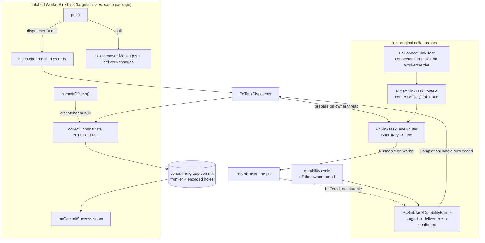

# Connect on PC - the live delivery path

## Goal Capsule

**Objective.** Make one unmodified Kafka Connect sink connector receive real records through Parallel
Consumer, with PC committing its durable frontier - and demonstrate that key-affine lanes deliver
concurrency above the partition count.

**Why now.** `docs/plans/2026-08-10-001-investigate-connect-offset-composition.md` returned a
**sound-conditional** verdict: the composition mechanism holds and survives a crash-restart against a real
broker. What it could not do is drive the patched `WorkerSinkTask` itself - so PC's half of the model is
executed and Connect's half is still argued from source. This plan closes that gap, which is the entry
criterion the verdict names.

**The falsifiable claim.** With P input partitions and N lanes, the observed maximum simultaneous `put()`
calls is N, and N > P, with per-key delivery order preserved. A number and an observer - not "it feels
faster".

**Stop condition.** If Kafka's own `WorkerSinkTaskTest` manifest (30 tests, stock vs patched, exact
identity) cannot stay green through U1's spike, stop and report. That manifest is the module's strongest
evidence and this plan must not spend it.

---

## Product Contract

### Summary

Enable the currently hard-disabled dispatch bridge behind a user-facing switch, stand up a connector and N
sink tasks without a Connect worker, wire Connect's real converters, and route records through the existing
lane router so records are delivered and PC commits the frontier. Key-affine ordering is in scope; the two
open mechanism defects are fixed here rather than deferred.

### Problem Frame

The module today proves two things and delivers nothing. It proves a build-time patched `WorkerSinkTask`
wins class loading over the released jar, verified by Kafka's own tests run twice. And it proves several
`SinkTask` instances can share a partition without ever running concurrently for one key. Between those
sits an empty space: `PcConnectDispatchBridge.enabled()` returns a hard-coded `false`, nothing polls,
converts, delivers or commits, and the poll/dispatch/commit loop in the existing broker arm is written by
the test rather than by the runtime.

Research settled the largest unknown. **A worker-less host is viable**: every type on the `SinkTask` path is
public and constructible, there is no hidden static, registry or init hook. But four framework paths are
closed, and each redirects the design:

- `WorkerSinkTask` and `WorkerTask` are **package-private**, so our collaborators must live in
  `org.apache.kafka.connect.runtime` - which `target/classes/` already does.
- `WorkerSinkTaskContext`'s only constructor takes the package-private `WorkerSinkTask`, so **we write our
  own `SinkTaskContext`** - nine methods, all trivial. This is also where the verdict's `context.offset()`
  fail-fast naturally lives.
- `Worker.startSinkTask` NPEs without a herder (`Worker.herder` is assigned only by `AbstractHerder`), and
  constructing a `Worker` at all **blocks on a live broker** via `describeCluster()`. So we do not reuse
  `Worker`.
- `WorkerSinkTask` holds exactly **one** `SinkTask`. The router needs N or there is no concurrency at all -
  with one lane, key-affine routing buys ordering and zero parallelism, because the lane's lock serialises
  everything.

### Requirements

- R1. An unmodified third-party sink connector receives real records through the patched runtime, converted
  by Connect's own `Converter`/`HeaderConverter`, with no Connect worker, herder, REST API or internal
  topics.
- R2. PC's frontier - highest contiguously-complete offset plus encoded holes - is what reaches the broker.
  No path may answer progress with a single number once PC owns the commit.
- R3. The claim in the Goal Capsule is measured: observed maximum simultaneous `put()` is N > P, per-key
  order preserved, by an instrument proven able to move.
- R4. Enabling the feature is a user-facing switch mirroring the Streams module's, not a code change.
- R5. Every unsupported Connect surface fails **loudly and at startup**, never silently degrading. Detectable
  today: `SinkTaskContext.offset()` rewind; a `SinkTask` overriding neither `flush` nor `preCommit`; and a
  connector declaring `transforms` or `predicates`.
  The last is not a courtesy. KTD7's seam is over `convertAndTransformRecord`, which **applies the
  transformation chain** (`WorkerSinkTask.java:567`) - so the moment that seam is live, any connector
  configured with `transforms` runs its SMT chain on the delivery path. Lane assignment is taken from the
  **raw** record before the projection runs, so a key-rewriting SMT decouples the connector's notion of key
  identity from the lane that owns the record. That is exactly the question this plan defers, made reachable
  by configuration alone. SMTs stay out of scope by being **refused**, not by being untested.
- R6. Both open mechanism defects are fixed here: the staging-order over-claim, and one lane's throwing
  `preCommit` aborting the durability cycle for every lane.
- R7. Kafka's own `WorkerSinkTaskTest` manifest stays green, stock and patched, byte-identical outcomes.
- R8. *(Landing separately - see Scope Boundaries.)* A test class that would run in neither suite is
  impossible to write without a build failure. This plan's own new integration arms must satisfy it
  regardless of when the guard lands.

### Success Criteria

- A green arm shows records produced to Kafka arriving in a real connector's output, with the group's
  committed offset carrying encoded holes.
- A green arm shows N concurrent `put()` calls with N > P and no per-key reordering.
- A crash-restart arm through the **live** path shows no durable record lost and no committed offset ahead
  of what the sink wrote.
- The regression arms still run 30/30 both sides, with the switch explicitly pinned off.

### Scope Boundaries

#### In scope

Connector and task instantiation, converters, the lane-owned contexts, the patch hunks that source records
from PC and commit its frontier, the switch, the two mechanism defects, and the proof arms.

#### Explicitly out of scope

Rebalance beyond initial assignment; SMTs, DLQ / `errors.tolerance`, and `ConfigProvider` (Connect's own
features - inherited but untested through this path); plugin isolation; distributed mode and the REST API;
Kafka 4.x; source connectors. Publication stays disabled.

#### Landing separately, not deferred

- **The `*IT.java` unrunnable-test guard, and the `AGENTS.md` correction that goes with it.** An ArchUnit
  rule in `parallel-consumer-core/src/test/java/io/confluent/parallelconsumer/TestConventionRules.java`
  failing any `*IT` class outside an `integrationTest*` package, because the root pom excludes that name
  from surefire and includes only `**/integrationTest*/**/*.java` in failsafe - so such a class runs in
  neither suite and reports nothing. `AGENTS.md` currently claims the opposite.
  **Its own PR** (session-settled: user-directed - chosen over carrying it as a unit in this plan): it
  touches no Connect file, fixes a defect every branch in the repo is exposed to today, and is one of the
  few genuinely parallel-safe pieces of work here. Carrying it would delay a repo-wide fix behind a large
  feature review by people with no stake in it. Nothing in this plan depends on it; this plan's new
  integration arms simply must satisfy the rule whether or not it has landed.

#### Deferred to Follow-Up Work

- **Per-connector dynamic mode selection** (partition-affine for an S3 sink, key-affine for a JDBC upsert,
  in one process). Recorded in `docs/inflight/pr-connect-on-pc.md`. This plan ships one mode per process;
  the static `PC_CONNECT_DISPATCH_ENABLED` cannot express per-connector selection and the design should not
  grow around it.
- **Which identity governs sharding after an SMT rewrites a key.** Named as deferred in
  `docs/solutions/architecture-patterns/patch-the-seam-rather-than-reimplement-the-subset.md`. Live delivery
  makes it concrete but SMTs are out of scope here.
- **`NOTICE` paragraph naming `org.apache.kafka.connect.runtime.WorkerSinkTask`.** No obligation attaches
  while publication is disabled, but it is cheap now and expensive late.

---

## Planning Contract

### Key Technical Decisions

- **KTD1. Spine only: one connector, real records, frontier-committed.**
  (session-settled: user-approved - chosen over planning the whole integration up front: lifecycle,
  converters and rebalance are elaborations of a working delivery path, not siblings of it.) Governs R1.

- **KTD2. Key-affine ordering is in scope, not deferred behind a partition-affine first release.**
  (session-settled: user-directed - chosen over shipping partition-affine first: a spine that proves the
  plumbing and none of the value proposition is not worth releasing.) Governs R3.

- **KTD3. Unsupported surfaces fail loudly and early.**
  (session-settled: user-directed - chosen over detect-and-downgrade: downgrade needs mode-switching
  machinery that does not exist, and silent cross-lane corruption is the one outcome that must not ship.)
  Governs R5.

- **KTD4. Two proof arms, because neither can do the other's job.**
  (session-settled: user-directed - chosen over either alone.) An unmodified third-party connector proves
  live delivery through a real converter; a purpose-built latency-controlled sink proves the concurrency and
  ordering claim. Governs R1, R3.
  **Conflict found in research, recorded rather than silently resolved:** `FileStreamSinkConnector` lives in
  `org.apache.kafka:connect-file`, which is **not** on our classpath and not in the local repository - it is a
  new dependency. It also overrides `flush` but not `preCommit`, so it always returns the framework's own
  offsets and cannot distinguish "the task confirmed durability" from "the framework assumed it". Proceeding
  as settled, and U11 adds a third, free arm: `MonitorableSinkConnector` in `connect-runtime:3.9.2:test` -
  already a declared test dependency of this module - overrides `preCommit` and tracks `committedOffsets`, so
  it reports durability rather than merely performing it.

- **KTD5. The switch mirrors `PcDispatchSwitch` exactly: default ON, `-Dpc.connect.dispatch.enabled`,
  and a value that is neither `true` nor `false` throws.**
  (session-settled: user-directed - chosen over keeping the bridge hard-disabled and flipping it in code:
  this is a user-facing feature toggle like the Streams one, not an internal flag.) Governs R4.
  "Depending on the artifact is the opt-in" is the Streams convention and it carries. **Consequence:** both
  regression surefire executions must then pin the property off explicitly, exactly as
  `parallel-consumer-streams/pom.xml`'s `kafka-upstream-tests` execution does with the comment *"Nothing
  about this execution may depend on what the default happens to be."* They rely on the hard-coded `false`
  today; that reliance becomes a trap the moment a default exists.

- **KTD6. `PatchHarnessTest`'s delta guard is replaced by a designed successor, not deleted or loosened.**
  Its deny-regex forbids patch additions touching `poll|convertMessages|deliverMessages|commitOffsets|
  preCommit|rebalance` - an exact enumeration of the seams a live path must open, so every one fails on the
  first line. That guard was correct for an inert patch: it made "no regression" mean "bounded to a reviewed
  two-line delta" rather than "the suite happened to pass". The successor keeps that property in a form
  appropriate to a live phase - an **allowlist of touched methods plus a hunk budget** - and the manifest
  verifier, which refuses a zero-discovery arm, is untouched. Governs R7.

- **KTD7. Reuse Connect's own conversion path rather than reimplementing it.** The patch exposes a
  per-record conversion seam over `convertAndTransformRecord` and supplies it as the router's existing
  `RecordProjection`. This mirrors the Streams patch reusing `RecordQueue` as a one-record converter, and
  honours `patch-the-seam-rather-than-reimplement-the-subset`. Governs R1.

- **KTD8. One dispatch path, switched - never both.** The Streams patch records that fanning records out to
  both the stock and PC paths hangs the run, silently. Each patched seam is an early-return branch on the
  dispatcher being non-null.

- **KTD10. The patched runtime reads the switch into a `private final` INSTANCE field in the
  `WorkerSinkTask` constructor - never a `static final` constant.** The tracked patch's current
  `private static final boolean PC_CONNECT_DISPATCH_ENABLED` is evaluated once per classloader, so flipping
  the property after the class loads is a no-op against the runtime. Every switch-off control arm in this
  plan would then silently run the PC path and pass: whichever integration class touches `WorkerSinkTask`
  first fixes the value for the whole shared failsafe JVM, and `@Isolated` does not give a fresh one. A green
  control that cannot fail is worse than no control. Streams takes this decision per `StreamTask`
  construction for the same reason.
  This does **not** weaken the linkage proof: the constructor still *calls* `PcConnectDispatchBridge.enabled()`,
  so the method-not-constant property that makes the linkage real is preserved - only the caching moves.
  U2 must update `ShadowedClassLoadingTest` and `WorkerSinkTaskRegressionTest`, which assert the static by
  reflection today.

- **KTD9. PC's frontier is collected BEFORE the sink flushes.** Workers complete during a flush, so
  collecting after admits work that finished mid-flush. This was the P0 in the Streams review, found in code
  written by someone actively reasoning about that hazard. Governs R2.

### Assumptions

- A1. The existing lane primitive stands: one `SinkTask` per lane, a lock across `put()`, keys routed by
  `ShardKey` under `KEY` ordering.
- A2. Kafka 3.9.2 internals, read from a build-time generated copy. Package-private, not public contract,
  and changeable without deprecation.
- A3. One operating mode per process. Per-connector selection is deferred (see Scope Boundaries).

---

## High-Level Technical Design

The load-bearing shape: **records enter PC at `poll`, leave through the router to N lanes, and are completed
only when their own lane's `preCommit` covers them.** Nothing on the delivery path answers progress with a
single number.

---

## Implementation Units

### Phase A - de-risk and re-arm the guards

### U1. Prove the manifest gate survives a live-path construction branch

**Goal.** Establish, before anything is built on it, that Kafka's own 30 tests still pass identically when
`WorkerSinkTask` gains a switched-off construction branch.

**Requirements.** R7.

**Dependencies.** U3 - and this ordering is the point. `PatchHarnessTest` asserts the tracked patch is
**exactly two additive hunks** and that `apply-patch.sh` prints `applied 2 hunk(s)`. A third hunk fails those
assertions in the module's *default* surefire execution, which runs **before** the three regression
executions - so the build dies and the implementer sees a red run that says nothing about whether Kafka's 30
tests survived. The spike's answer would be indistinguishable from its harness failing. U3 lands first.

**Files.**
- `parallel-consumer-connect/src/main/patch/pcconnect.patch` (modify - add a no-op switched-off branch)

**Approach.** Add the smallest possible branch that constructs nothing when the switch is off, regenerate
the patch, and run both regression arms. The open question this answers: whether `WorkerSinkTaskTest`'s 30
tests construct `WorkerSinkTask` in ways that reach new construction code even with the switch off - via
mock consumers, or `initialize()` without a real connector. If they do, `stock.equals(patched)` breaks and
the module's strongest evidence becomes the blocker rather than the proof.

**Execution note.** This is a spike whose only output is a yes/no. If it is "no", stop and report per the
Goal Capsule's stop condition - do not design around it silently.

**Verification.** Both arms report `WorkerSinkTaskTest` 30/30 and `WorkerSinkTaskRegressionReportsVerifier`
is green. Run `./mvnw -pl parallel-consumer-connect -am clean -Dcopyright.skip=true test` - **`clean` is
mandatory**: `maven-dependency-plugin:unpack` preserves archive timestamps, so re-unpacked sources go
backwards in time and the compiler skips recompiling. A control arm run without `clean` tests the previous
build's classes.

**Test scenarios.** No new tests. This unit's evidence is the existing arms' output.

### U2. The user-facing dispatch switch

**Goal.** Enabling "PC inside Connect" is a property a user sets, matching how the Streams module works.

**Requirements.** R4.

**Dependencies.** U1.

**Files.**
- `parallel-consumer-connect/src/main/java/io/confluent/parallelconsumer/connect/PcConnectDispatchSwitch.java` (create)
- `parallel-consumer-connect/src/main/java/io/confluent/parallelconsumer/connect/PcConnectDispatchBridge.java` (modify - read the switch; rewrite the javadoc)
- `parallel-consumer-connect/pom.xml` (modify - pin the property off in both regression executions)
- `parallel-consumer-connect/src/test/java/io/confluent/parallelconsumer/connect/PatchHarnessTest.java` (modify - `bridgeHasOneHardDisabledReadOnlyEntryPoint`)
- `parallel-consumer-connect/src/test/java/io/confluent/parallelconsumer/connect/ShadowedClassLoadingTest.java` (modify - it asserts the linkage value is `false`, and runs in the **default** surefire execution, which pins no property; it goes red the moment the default is ON)
- `parallel-consumer-connect/src/test/java/io/confluent/parallelconsumer/connect/WorkerSinkTaskRegressionTest.java` (modify - same reflection assertion)

**Approach.**
1. `PcConnectDispatchSwitch` mirroring `PcDispatchSwitch`: `pc.connect.dispatch.enabled`, default **ON**, a
   value that is neither `true` nor `false` **throws** rather than reading as off, and a `resetToDefault()`
   for test teardown.
2. The bridge keeps its single static method reading the switch - it stays a method call, never a constant,
   because a `static final boolean` would be compile-time inlined and the runtime linkage would silently not
   exist.
3. **Rewrite the bridge's javadoc in the same commit.** It currently asserts outright that no property, env
   var, setter or alternate implementation can enable it. A stale javadoc is precisely where this defect
   class regenerates.
4. Pin `pc.connect.dispatch.enabled=false` in the `worker-sink-task-stock` and
   `worker-sink-task-patched-disabled` surefire executions, with the Streams module's comment carried over.

**Patterns to follow.** `parallel-consumer-streams/src/main/java/io/confluent/parallelconsumer/streams/PcDispatchSwitch.java`;
the property-pinning execution in `parallel-consumer-streams/pom.xml`.

**Test scenarios.**
- Default with no property set is enabled.
- `-Dpc.connect.dispatch.enabled=false` disables.
- A non-boolean value throws, naming the property and the offending value - it does not read as off.
- The bridge still exposes exactly one static zero-arg boolean method and declares no fields.
- With the property off, the generated `WorkerSinkTask` still reports its linkage constant false by
  reflection (`ShadowedClassLoadingTest`, `WorkerSinkTaskRegressionTest`).

**Verification.** Both regression arms green with the property explicitly pinned, proving they no longer
depend on what the default happens to be.

### U3. Replace the patch-shape guard with its live-phase successor

**Goal.** Keep "no regression is bounded to a reviewed delta" true once the patch touches real methods.

**Requirements.** R7.

**Dependencies.** None - **this unit lands first in the plan.** Every other unit that edits the tracked patch
(U1, U9, U10) is blocked behind it, because the guard it replaces fails on their first added line.

**Files.**
- `parallel-consumer-connect/src/test/java/io/confluent/parallelconsumer/connect/PatchHarnessTest.java` (modify)

**Approach.** Replace the exactly-two-additive-hunks assertion and the deny-regex with an allowlist, and
**name the allowlist explicitly rather than leaving it to be discovered**: `poll`, `convertMessages`,
`deliverMessages`, `commitOffsets`, the per-record conversion seam, and the commit-success seam. The
rebalance path stays **denied** - `onPartitionsAssigned`, `onPartitionsRevoked`, `openPartitions`,
`closePartitions`, `rewind` - because "rebalance beyond initial assignment" is a Scope Boundary and this
guard is the only thing enforcing it mechanically. A successor cannot refuse a hunk it was never told to
refuse, and an unnamed allowlist gets fixed at implementation time by whoever needs the next hunk to
compile.

Keep a hunk budget, keep removals enumerated rather than merely permitted, and write the reasoning into the
test - a future reader must be able to tell the old guard was retired deliberately at a phase boundary, not
weakened to make a build pass. Leave `WorkerSinkTaskRegressionReportsVerifier` untouched; it carries the
real evidence.

**Test scenarios.**
- A patch touching only allowlisted methods passes.
- A patch touching a method outside the allowlist fails, naming the method.
- A patch touching a **rebalance-path** method fails, naming the method - the Scope Boundary stays enforced.
- A patch exceeding the hunk budget fails, naming the count.
- A patch with an unenumerated removal fails.
- The tracked patch itself passes.

*(U4 was the `*IT.java` unrunnable-test guard. It now lands as its own PR - see Scope Boundaries,
"Landing separately". Its U-ID is retired rather than reused, so unit numbering stays stable.)*

### Phase B - fix the mechanism defects before making them live

### U5. A lane may only claim offsets it has been given

**Goal.** Close the staging-order over-claim, reproduced twice against compiled classes.

**Requirements.** R6.

**Dependencies.** U1.

**Files.**
- `parallel-consumer-connect/src/main/java/io/confluent/parallelconsumer/connect/PcSinkTaskDurabilityBarrier.java` (modify)
- `parallel-consumer-connect/src/main/java/io/confluent/parallelconsumer/connect/PcSinkTaskLaneRouter.java` (modify)
- `parallel-consumer-connect/src/test/java/io/confluent/parallelconsumer/connect/OffsetCompositionProbeTest.java` (modify)

**Approach.** The barrier stops its claim at the lowest offset still in `staged`, which correctly blocks a
gap the lane knows about but says nothing about an offset routed to this lane and **not yet staged** - and PC
hands work out per shard, so records reach one lane in any order. In the reproduction the first record
handed over was offset 20 of 40 and the barrier claimed through 21.

Two candidate shapes, both changing the router's concurrency: (a) the router declares a lane's owed offsets
at registration time, before `prepare` runs; or (b) a lane stages its own records in strict offset order,
buffering higher offsets until lower ones arrive. Choose on evidence during implementation and record which,
with the reason.

**Execution note.** Red first. Every existing probe arm stages every offset up front and varies only
*delivery* order, which is why this whole defect class is invisible by construction. The new arm must drive
**staging** order through a real `PcTaskDispatcher` with several keys on one lane, and must fail before the
fix.

**Test scenarios.**
- Several keys on one lane, dispatched out of offset order through a real dispatcher: the map handed to
  `preCommit` never names an offset the lane has not received. Fails before the fix.
- The map is still able to advance when records arrive in order - the fix must not pin the claim at zero.
- A lane owed offsets that never arrive does not stall other lanes' claims.
- The existing delivery-order arms still pass unchanged.

### U6. One lane's failure does not stall every lane

**Goal.** A throwing `preCommit` isolates to its own lane.

**Requirements.** R6.

**Dependencies.** U1.

**Files.**
- `parallel-consumer-connect/src/main/java/io/confluent/parallelconsumer/connect/PcSinkTaskLaneRouter.java` (modify)
- `parallel-consumer-connect/src/test/java/io/confluent/parallelconsumer/connect/OffsetCompositionProbeTest.java` (modify)

**Approach.** `runDurabilityCycle()` polls lanes in a bare loop and `PcSinkTaskLane.preCommit` rethrows, so
one connector throwing aborts the cycle and no lane's completions are applied. Isolate per lane, record the
failure against that lane, and let the cycle complete for the others. Decide and document whether a lane
that has thrown is retried on the next cycle or quarantined - and make that visible rather than implicit.

**Test scenarios.**
- Lane A's `preCommit` throws; lanes B and C still confirm their records in the same cycle.
- The throwing lane's records stay incomplete - a throw is not silently treated as durable.
- The failure surfaces to the caller rather than being swallowed.
- A lane throwing on every cycle does not spin or leak.

### Phase C - the live path

### U7. Lane-owned sink task contexts

**Goal.** N `SinkTaskContext` implementations, one per lane, since `WorkerSinkTaskContext` cannot be
constructed outside its package.

**Requirements.** R1, R5.

**Dependencies.** U2.

**Files.**
- `parallel-consumer-connect/src/main/java/io/confluent/parallelconsumer/connect/PcSinkTaskContext.java` (create)
- `parallel-consumer-connect/src/test/java/io/confluent/parallelconsumer/connect/PcSinkTaskContextTest.java` (create)

**Approach.** Nine methods, all trivial: `assignment`, `pause`, `resume`, `requestCommit`, `offset` (x2),
`timeout`, `configs`, `errantRecordReporter`. Two carry real decisions:

- **`offset(...)` is the `context.offset()` rewind condition from the verdict.** A partition-level seek would
  re-read every lane's records and destroy the others' tracked progress. Per KTD3 it **throws at the point of
  call**, naming the connector and the unsupported operation.
- **`pause`/`resume` throw for the same reason, and this is a correction.** They are whole-partition in
  exactly the way `offset()` is - one lane pausing a `TopicPartition` pauses it for every lane sharing that
  partition. An earlier draft gave them a real implementation routed through the dispatcher, which would have
  meant new public API in `parallel-consumer-streams` that no unit lists and no arm exercises, and would have
  answered the sibling hazard more expensively and less safely than `offset()`'s. Add the pair to the
  whole-partition exclusion axis in `connector-compatibility.md`.
- `configs()` returns this lane's task props. Stock returns `null` silently when the cluster config state is
  empty, which NPEs inside the connector's own code - do not reproduce that.

`errantRecordReporter()` returns `null`, which is the interface default.

**Test scenarios.**
- `assignment()` returns this lane's partitions.
- `pause(tp)` and `resume(tp)` throw with the same shape as `offset(...)`, naming the connector and the
  operation.
- `requestCommit()` causes the next durability cycle to run.
- `offset(tp, n)` throws, naming the connector class and the operation.
- `offset(Map)` throws identically.
- `configs()` returns the task props, never null.
- `timeout()` is accepted and has no effect.

### U8. Stand up a connector and N tasks without a worker

**Goal.** Instantiate an unmodified sink connector and N `SinkTask`s with no `Worker`, herder, REST API or
internal topics.

**Requirements.** R1, R5.

**Dependencies.** U7.

**Files.**
- `parallel-consumer-connect/src/main/java/io/confluent/parallelconsumer/connect/PcConnectSinkHost.java` (create)
- `parallel-consumer-connect/src/test/java/io/confluent/parallelconsumer/connect/PcConnectSinkHostTest.java` (create)

**Approach.** The required sequence, taken from call sites rather than documented intent:
1. Instantiate the connector class directly - `Plugins` is optional when the connector is on the application
   classpath, at the cost of short aliases no longer resolving (use fully-qualified names). Constructing
   `Plugins` would trigger a full reflective classpath scan for nothing.
2. `Connector.initialize(ctx)` then `Connector.start(props)` - strictly in that order, both required. The
   context needs only `requestTaskReconfiguration()` and `raiseError(Exception)`.
3. `taskClass()`, then `taskConfigs(N)`.
4. **Merge `topics`/`topics.regex` from the connector props into each task map.** A connector's
   `taskConfigs()` is not obliged to propagate them and validation runs again against the *task* props.
5. Instantiate N tasks; `SinkTask.initialize(context)` then `SinkTask.start(taskProps)` on each.
6. **Fail loudly** if the task overrides neither `flush` nor `preCommit` (R5) - such a connector asserts that
   `put()` returning is durability, which is Connect's own contract but must be an explicit, visible
   acceptance here rather than an assumption.
7. **Fail loudly** if the connector props declare a non-empty `transforms` or `predicates` (R5), naming the
   connector, the property, and the deferred sharding-identity question. This is what keeps SMTs genuinely
   out of scope rather than merely untested.

Do not construct a `Worker`: it NPEs without a herder and blocks on a live broker via `describeCluster()`.

**Test scenarios.**
- A connector with a fully-qualified class name starts and yields N tasks.
- A connector configured with `transforms` fails at startup, naming the property.
- `initialize` strictly precedes `start`, for both connector and tasks - asserted by call ordering, not by
  timing.
- `topics` reaches the task props even when `taskConfigs()` drops it.
- Neither-`flush`-nor-`preCommit` fails at startup, naming the connector.
- A connector whose `start()` throws surfaces the failure rather than yielding a half-built host.
- Nothing constructs a `Worker`, a herder, or an `Admin` client.

### U9. Wire Connect's real converters

**Goal.** The router's `RecordProjection` is satisfied by Connect's own conversion path.

**Requirements.** R1.

**Dependencies.** U8.

**Files.**
- `parallel-consumer-connect/src/main/patch/pcconnect.patch` (modify - expose a per-record conversion seam)
- `parallel-consumer-connect/src/main/java/io/confluent/parallelconsumer/connect/PcConnectSinkHost.java` (modify - build and configure converters)

**Approach.** `RecordProjection` is already the converter seam; today the tests supply a fake. Supply a
projection that calls the generated `convertAndTransformRecord`, which is private and whose caller
`convertMessages` carries the `origOffsets` side effect - so the patch exposes the per-record path and leaves
the batching on the stock path. That mirrors the Streams patch reusing `RecordQueue`.

Converter construction has two traps worth stating: key/value converters take the `isKey` boolean and their
`<name>.` prefixed originals, while the header converter takes a single map with `converter.type=header`
injected; and the prefix map must come from whichever config object named the converter. There is **no
framework default key/value converter** - only `header.converter` defaults, to `SimpleHeaderConverter`.

**Test scenarios.**
- A `StringConverter` key/value pair produces the same `SinkRecord` shape as stock conversion for the same
  input.
- The header converter receives `converter.type=header`; key/value converters do not.
- Converter properties come from the config object that named the converter.
- A record the converter drops does not reach `put()` and does not complete as durable.
- Missing key/value converter config fails at startup with a message naming the key.

### U10. Source records from PC and commit its frontier

**Goal.** The patched runtime hands records to PC and commits PC's frontier.

**Requirements.** R1, R2.

**Dependencies.** U5, U6, U9.

**Files.**
- `parallel-consumer-connect/src/main/patch/pcconnect.patch` (modify - the delivery and commit hunks)
- `parallel-consumer-connect/src/main/java/io/confluent/parallelconsumer/connect/PcConnectDispatchCounters.java` (create)

**Approach.** Early-return branches on the dispatcher being non-null, one path only - never both (KTD8):
- `poll` / `convertMessages` / `deliverMessages`: register with PC instead of batching and delivering.
- `commitOffsets`: **collect PC's frontier before the sink flushes** (KTD9), and return PC's map.
- The commit-success acknowledgement goes on a seam that is reached **only** on success. Enumerate the
  callers of every candidate before choosing - the Streams work put an ack on `postCommit` behind a confident
  comment, and Kafka reaches `postCommit` after a swallowed commit failure and with no commit attempted at
  all.
- **Delete the single-number paths from the PC branch, do not guard them.** `currentOffsets`,
  `lastCommittedOffsets` and `consumer.position()` can each still answer progress with one number, and the
  dispatcher-non-null branch must reach none of them. **The stock branch keeps them untouched** - R7 requires
  byte-identical stock outcomes, and KTD8's early-return shape is what preserves that. In the Streams work
  the crash test's red run was tripped by a *second, unnamed* fallback nobody had listed. Grep for every one.
- Expect thread-safety edits to the runtime itself: `messageBatch`, `origOffsets`, `currentOffsets` and
  `lastCommittedOffsets` are plain collections written on the assumption of a single loop.

`PcConnectDispatchCounters` increments at exactly one place - pool submission - so a green output test
cannot pass on the stock path. The Streams module needed this for the same reason.

**Execution note.** Regenerate the patch with `parallel-consumer-streams/bin/regen-patch.sh` (the shared
script this module already points at via `pc.connect.regen.patch.script`) and heed its dropped-hunk warning: any
Maven invocation between editing `target/connect-patched/` and regenerating silently restores the tree from
the tracked patch.

**Test scenarios.**
- With the switch on, records reach PC's dispatcher and the counter moves; with it off, the counter stays
  zero and the stock path runs.
- The committed offset carries encoded holes, not a bare high-water mark.
- A record still in flight is never covered by a commit.
- The frontier is collected before the sink flushes - asserted by ordering, not timing.
- The commit-success ack does not fire when the commit failed.
- Kafka's own 30 tests remain identical, stock and patched.

### Phase D - proof

### U11. Live delivery through an unmodified third-party connector

**Goal.** Records produced to Kafka appear in a real connector's output, committed at PC's frontier.

**Requirements.** R1, R2.

**Dependencies.** U10.

**Files.**
- `parallel-consumer-connect/src/test/java/io/confluent/parallelconsumer/connect/integrationTests/LiveConnectDeliveryTest.java` (create)
- `parallel-consumer-connect/pom.xml` (modify - `org.apache.kafka:connect-file` test scope)
- `.github/workflows/maven.yml` (modify - add the new artifact to the dependency warm-up step)

**Approach.** Two connectors, for the reason in KTD4. `FileStreamSinkConnector` proves live delivery through
a real converter and a real connector. `MonitorableSinkConnector`, already on the test classpath, overrides
`preCommit` and tracks `committedOffsets`, so it proves the durability report reaches the task - which
FileStream structurally cannot, since it always returns the framework's own offsets.

Note FileStream is **partition-affine**: N lanes means N append streams. Say so in the test, so a green
FileStream arm is never later quoted as key-affinity evidence.

**Test scenarios.**
- Records produced to the input topic appear in the connector's output.
- The group's committed offset is PC's frontier, and carries metadata when holes exist.
- The dispatch counter is non-zero - the records went through PC, not the stock path.
- With the switch off, the same test still passes on the stock path (the control arm).
- `MonitorableSinkTask.committedOffsets` reflects what PC committed.

### U12. The concurrency claim, measured

**Goal.** Prove N > P concurrent `put()` calls with per-key order preserved.

**Requirements.** R3.

**Dependencies.** U10.

**Files.**
- `parallel-consumer-connect/src/test/java/io/confluent/parallelconsumer/connect/integrationTests/KeyAffineConcurrencyTest.java` (create)

**Approach.** A latency-controlled `SinkTask` in test sources with injectable per-record delay, recording
maximum simultaneous entries and per-key delivery order. One partition, N lanes, many keys. The instrument
must be proven able to move: an arm with lanes collapsed to one must show maximum concurrency of exactly 1.

**Execution note.** The negative control is not optional. `PcSinkTaskLaneRouterTest`'s
`negativeControlWithoutTheLockDetectsConcurrentEntry` is the shape - an instrument nobody has seen move is
decoration.

**Test scenarios.**
- With P=1 and N=4, observed maximum simultaneous `put()` is 4.
- Records sharing a key are never reordered, and never concurrent with each other.
- A slow record on one key does not delay other keys - measured as completion order, not wall clock.
- Control: lanes collapsed to 1 gives maximum concurrency 1, proving the counter can distinguish.
- Control: with the switch off, maximum concurrency is 1 - stock Connect's ceiling.

### U13. Crash-restart through the live path

**Goal.** The existing crash-restart proof, re-run with the real runtime rather than a hand-written driver.

**Requirements.** R2.

**Dependencies.** U11.

**Files.**
- `parallel-consumer-connect/src/test/java/io/confluent/parallelconsumer/connect/integrationTests/LiveConnectCrashRestartTest.java` (create)

**Approach.** Mirror `OffsetCompositionCrashRestartTest`, with the driver replaced by the patched runtime.
This is what retires the residual risk the verdict narrows but cannot close: currently PC's half of the
model is executed and Connect's half is argued from source.

**Execution note.** Two traps this repo has already paid for. **The crash must be a crash** - abort, no
drain, no final commit; a clean `close()` hands the simulated crash a repair pass a real one never gets.
And **the restart assertion must read past a boundary captured at the crash instant** - a fresh reader from
earliest re-reads phase 1's output and passes whether or not the restart did anything.

**Test scenarios.**
- After an abort, no record the sink durably wrote is lost.
- The committed offset never exceeds what the sink wrote.
- Redelivery resumes at or below the committed frontier.
- Control: break only the restart (never start phase 2) and confirm the arm goes red.

---

## Verification Contract

| Gate | Command | Covers |
|---|---|---|
| Unit and regression arms | `./mvnw -pl parallel-consumer-connect -am clean -Dcopyright.skip=true test` | U1-U3, U5-U10 |
| Broker-backed arms | `./mvnw -pl parallel-consumer-connect -am clean -Dcopyright.skip=true verify` | U11-U13 |
| Full gate before merge | `bin/ci-build.sh` | all |

`-am` is mandatory - without it `reactorModuleConvergence` fails, the module never recompiles, and the
result is a silent false negative. `-Dtest=` cannot be used on this module: it applies globally and the
stock regression arm runs with an empty classes directory by design; narrow failsafe with `-Dit.test`
instead. `clean` is mandatory before any control arm, per U1.

Java 8 API surface only (`--release 8` via Jabel), so `List.of` / `List.copyOf` / `Map.of` are unavailable
despite the Java 17 source level.

Any class touching the process-wide switch, the counters, or `PcTaskDispatcher.abortAllActive()` must carry
`@Isolated` - CI's integration lane shares a JVM across IT classes.

---

## Risks

- **The manifest gate is the plan's single point of failure.** U1 exists to find that out in an hour rather
  than after Phase C. If Kafka's own tests reach the new construction path, the module's strongest evidence
  becomes the blocker.
- **Patch size is the honest measure of whether this is still patching or has become a fork by
  instalments.** The tracked patch is two hunks today; the Streams equivalent is ~28 across 4 files. Quote
  the number when the live seam lands, and treat roughly a dozen patched classes as the stop threshold.
- **`WorkerSinkTask` polls and delivers on one thread, and its collections assume it.** Anything deferred to
  "the next time the loop runs" is priced at that loop's blocking wait. Do **not** reach for
  `Consumer#wakeup()` as a completion signal - Connect already uses it for shutdown, and a wake delivered
  while not polling arms the *next* poll, so a stray signal can swallow the shutdown one.
- **The durability cycle has never run concurrently with the barrier in any arm.** `pollWatermarks()` is
  deliberately unsynchronized between two `synchronized` halves. Running the cycle on the Connect task
  thread is safe but reintroduces the head-of-line stall this module exists to remove, since a real
  connector flushes inside `preCommit`.
- **A green FileStream arm proves delivery, not concurrency.** Stated in U11 so it cannot be quoted for the
  other claim later.

---

## Open Review Findings - unapplied, from the 2026-08-11 doc review

Five reviewers ran in separately dispatched contexts: coherence, feasibility, adversarial, scope-guardian,
product-lens. **The cross-model peer pass did not run** - no CE config exists in this repo, so no route could
be resolved. Where reviewers agree below, that is five contexts from one model family, not different-model
corroboration.

**Applied already:** the switch-latching P0 (KTD10), U3 moved to the head with a named allowlist, the SMT
fail-loud gate, `pause`/`resume` throwing like `offset()`, the single-number-path qualifier, the
`regen-patch.sh` path, `ShadowedClassLoadingTest`/`WorkerSinkTaskRegressionTest` added to U2, KTD4's stale
unit pointer, and the Verification Contract's `clean` and retired-U4 range.

The rest need a decision before implementation starts. Three carry multi-reviewer agreement.

### P1 - resolve before Phase C

- **No unit constructs or drives the patched `WorkerSinkTask`** (adversarial + feasibility, 75/75). The type
  is package-private, so it is not nameable from `io.confluent.parallelconsumer.connect` - yet every file the
  plan creates lives there, and Phase D's three arms all assume it is running. Its constructor takes ~19
  collaborators (`ConnectMetrics`, `ClusterConfigState`, `TransformationChain`, `RetryWithToleranceOperator`,
  `StatusBackingStore`, a `TaskStatus.Listener`, an error-reporter supplier) that the plan names nowhere.
  *Fix:* a unit between U8 and U10 creating an in-package driver (e.g.
  `src/test/java/org/apache/kafka/connect/runtime/PcWorkerSinkTaskDriver.java`), stating which collaborators
  are real and which are minimal stand-ins, and whether it lives in main or test sources.
  **Also unresolved:** what `WorkerSinkTask.task` binds to when the host owns N tasks.

- **Nothing owns the durability cycle's driver thread** (adversarial, 75). `runDurabilityCycle()` has no
  production caller - the probe drives it by hand. Without an owner no record is ever confirmed, so no
  `CompletionHandle.succeeded()` fires, so `inFlight` never falls, so `dispatchAvailable`'s
  `poolSize - inFlight` reaches zero and **dispatch stops permanently after `poolSize` records**. Every unit
  in Phases B and C stays green with a hand-driven cycle, so this surfaces first at U11 as a hang.
  *Fix:* a unit (or U10 extension) owning the driver: which thread, what cadence, how `requestCommit()`
  accelerates it, how it stops, and the lock-order rule that the barrier monitor is never held across a
  lane-lock acquisition. First scenario: "dispatch does not stall after poolSize records".

- **Default-ON is never measured against Kafka's own 30 tests** (adversarial, 75). U1 measures the
  switch-**off** state; KTD5 ships **on**. The Streams module ran this exact experiment and recorded the
  answer in its pom: with the seam on, `StreamTaskTest` is **68/101**. *Fix:* add a third regression
  execution `worker-sink-task-patched-enabled` pinned **on**, and record the number as a measured gap in a
  pom comment. It need not be 30/30 to ship, but it must not be unknown while the default is ON.

- **U1's spike cannot fire the stop condition it arms** (feasibility, 50). The branch is guarded by a value
  hard-coded `false` at U1 time and pinned `false` thereafter, so the 30 tests cannot reach it by
  construction - the spike returns green whether or not the hazard exists. *Fix:* narrow U1's stated question
  to what it can answer, and add one run with `pc.connect.dispatch.enabled=true` - that is the run that can
  actually fire the stop condition, and it is still cheap at Phase A.

- **Per-key ordering is guaranteed upstream, so U12's arm cannot fail** (adversarial, 75). `PcTaskDispatcher`
  runs PC with KEY ordering and the router derives its lane from the same `ShardKey`, so two same-key records
  are never in flight together **regardless of what the router does** - delete the lane lock and the
  assertion still passes. The arm measures `WorkManager`, not this plan. *Fix:* either say plainly that
  per-key ordering is inherited and this is a regression guard on that inheritance, and give the router its
  own falsifiable claim (same key always reaches the same lane, with a mis-sharding control that goes red);
  or drive the router directly with two same-key records handed over concurrently, bypassing `WorkManager`.

- **`RetriableException` from `put()` silently pins a lane forever** (adversarial, 75). It is Connect's
  standard transient-failure mechanism, used by every production sink. PC's dispatcher sets
  `RETRIES_DISABLED_DELAY` (ten years), so the record is never re-handed; `barrier.failed()` keeps the offset
  in `staged`; the lane's watermark is pinned and both maps grow by one entry per subsequent record. One
  network blip turns a working connector into a permanently stalled, leaking lane with nothing saying so -
  which is the silent degradation KTD3 forbids. *Fix:* catch at the lane boundary and fail loudly, naming
  connector, partition and offset. Record retry support as deferred.

- **`SinkTask.open()` is missing from U8's lifecycle** (adversarial, 75). `WorkerSinkTask` calls it before any
  `put()`; connectors allocate per-partition state there (JDBC buffers, S3 writers). A task that never gets
  `open()` NPEs on first `put()` or mis-accounts silently. `open()` on *initial* assignment is not rebalance -
  it is the precondition for `put()`. *Fix:* add `open(assignedPartitions)` after `start`, under the lane
  lock, before any dispatch; and `close`/`stop` on shutdown.

- **`MonitorableSinkConnector` is not free, and refutes the "no hidden static" premise** (adversarial, 100).
  Its task calls `RuntimeHandles.get().connectorHandle(name).taskHandle(id)` in `start()` - a process-wide
  singleton built for `EmbeddedConnectCluster`, so state leaks across arms in the shared failsafe JVM. The
  host must supply `connector.name` and a distinct `task.id` per lane (U8's sequence mentions neither), and
  `committedOffsets` is package-private in `org.apache.kafka.connect.integration`. *Fix:* amend the Problem
  Frame's premise to "no hidden static on the *framework* path; connectors may have their own", and price the
  arm honestly.

- **Partition-identity connectors corrupt silently, and the only mitigation is deferred** (adversarial +
  product-lens, 75/75). Key-affine lanes give N tasks the same partition set, so a connector whose output
  identity is the partition gets N writers for one partition. Undetectable at startup, so KTD3's fail-loud
  does not reach it; the named mitigation is per-connector mode selection, which this plan defers. *Fix
  (product-lens):* a second, orthogonal affinity declaration that **fails loudly rather than defaulting** -
  no explicit `key|partition`, no start. That keeps KTD5 intact while refusing to guess the one property PC
  cannot detect. *Alternative (adversarial):* an explicit documented acceptance plus a startup log naming the
  lane count.

- **The README will state the opposite of what ships** (product-lens, 100). It says "Nothing here delivers
  records yet" and "no property, no setter, no alternate implementation can enable it", and it appears in no
  unit's Files list. The plan caught this defect class in the javadoc and missed the identical sentence one
  file away. *Fix:* add `parallel-consumer-connect/README.md` to U2, U3 and U10, plus a DoD line. The
  module pom's `<description>` carries the same stale claim.

- **No connector from the target population is exercised** (product-lens, 75). All three sinks are Kafka's
  demo connector, Kafka's internal test fixture, and a `SinkTask` we write ourselves. The catalogue's
  key-affine rows - JDBC upsert, Elasticsearch by doc id, Mongo, Debezium - stay untouched predictions, so
  the honest post-plan claim is "N>P measured on a synthetic sink": a mechanism proof, not a value proof.
  *Fix:* swap the FileStream arm for one Apache-2.0 key-affine sink against a Testcontainers store, at
  roughly the cost of the `connect-file` dependency already accepted.

### P2 - worth settling

- **Nothing configures the lane count N** (adversarial, 75). N is in the falsifiable claim and in
  `taskConfigs(N)`, and no unit introduces a way to set it. `PcDispatchSwitch` also carries a pool-size
  property that `PcTaskDispatcher` uses for `maxConcurrency`; without a Connect equivalent, either the value
  proposition is unconfigurable or it silently inherits the Streams-named property. If pool size < N, U12's
  maximum can never reach N and the arm fails for a non-defect.
- **Max concurrency of exactly N is not implied by hash-based lane assignment** (adversarial, 75). Distinct
  keys can share a lane, so the arm is flaky-or-relaxed unless it asserts the key-to-lane surjection first
  and forces overlap with a barrier of width N.
- **No arm runs the durability cycle concurrently with in-flight dispatch** (adversarial, 75). Both mechanism
  fixes are validated only in a quiesced state - the same "invisible by construction" property U5 diagnoses
  about the existing probes. Needs a stated invariant: no offset may enter `staged` below a watermark already
  returned for that partition.
- **U5 candidate (a) needs a cross-module API change U5 does not list** (adversarial, 75). A registration
  hook on `DeferringWorkPreparer` plus a call from `registerRecords` in `parallel-consumer-streams`, touching
  the Streams module's own proof arms. Makes (b) the lower-blast-radius default.
- **U9 and U10 should depend on U3** (coherence, 75) - both edit the patch the guard constrains.
- **"Carries metadata when holes exist" is vacuously satisfiable** (adversarial, 75). No unit says how a hole
  is manufactured; it needs a fixture that withholds durability for a chosen offset.
- **Encoded holes are written but never read back** (adversarial, 75). `PcTaskDispatcher` bootstraps from a
  `MockConsumer`, so PC starts blank and the encoding is write-only on this path. Safe (at-least-once) but
  the Success Criterion asserts a payload, not a behaviour.
- **The DoD's IT-placement check is the wrong check** (adversarial, 75). This module's own incident was a
  `combine.children` merge-semantics defect with the class in the *right* package. Assert collection
  instead: each new IT appears in the failsafe reports and in no surefire report.
- **U11's CI warm-up edit is probably unnecessary** (feasibility, 50) - `connect-file` is a plain declared
  test dependency and `dependency:go-offline -DincludeScope=test` already covers it; the extra step exists
  only for classifier artifacts.
- **`PatchHarnessTest:88` has a second hard-coded `applied 2 hunk(s)` string** (feasibility, 100) that U3's
  approach does not mention.
- **No catalogue row moves** (product-lens, 75). `connector-compatibility.md` says "revisit before merge" and
  the prior plan's MVP requires at least one Verified row; neither appears in any unit.
- **Per-connector mode selection has no named seam** (product-lens, 75). `PcConnectSinkHost` is already
  per-connector and is the free answer; one sentence decides whether the follow-up is config or refactor.
- **U6 is exercised by no arm** (scope-guardian, residual). No connector in U11-U13 throws from `preCommit`,
  so the Summary's claim that both mechanism defects "go live the moment records flow" is precise for U5 and
  not for U6.

### Reviewer questions worth answering before implementation

- Which thread runs `runDurabilityCycle()`, at what cadence, and how does it stop without losing in-flight
  confirmations?
- When N lanes share one partition set, what does `assignment()` mean?
- Does `pc.connect.dispatch.enabled` gate dispatcher construction, branch selection, or both - and how does
  that interact with KTD8's `dispatcher != null`?
- Is a lane whose `preCommit` threw retried next cycle or quarantined, and what surfaces that to an operator?
- KTD9 orders frontier collection before the flush, but `commitOffsets` runs on the Connect task thread while
  lanes flush on the cycle thread. Across two threads "before" is a happens-before claim needing a lock or a
  sequence number, not call ordering.

---

## Definition of Done

- An unmodified sink connector receives records produced to Kafka, through the patched runtime, with the
  dispatch counter non-zero.
- The committed offset is PC's frontier with encoded holes, and no path answers progress with a single
  number.
- Observed maximum simultaneous `put()` is N with N > P, per-key order preserved, with a control arm proving
  the instrument moves.
- A crash-restart through the live path loses no durable record, asserted past a boundary captured at the
  crash.
- Both regression arms run `WorkerSinkTaskTest` 30/30 with the switch explicitly pinned off.
- The patch-shape guard has a designed successor and the patch's hunk count is stated.
- Every integration arm this plan adds lives in an `integrationTest*` package, so it is collected by
  failsafe rather than falling between the suites. (The build-level guard against that mistake lands in its
  own PR.)
- The bridge's javadoc describes the switch that now exists.
- Publication remains disabled, both halves, both modules.
- No test assertion was weakened to reach green.
