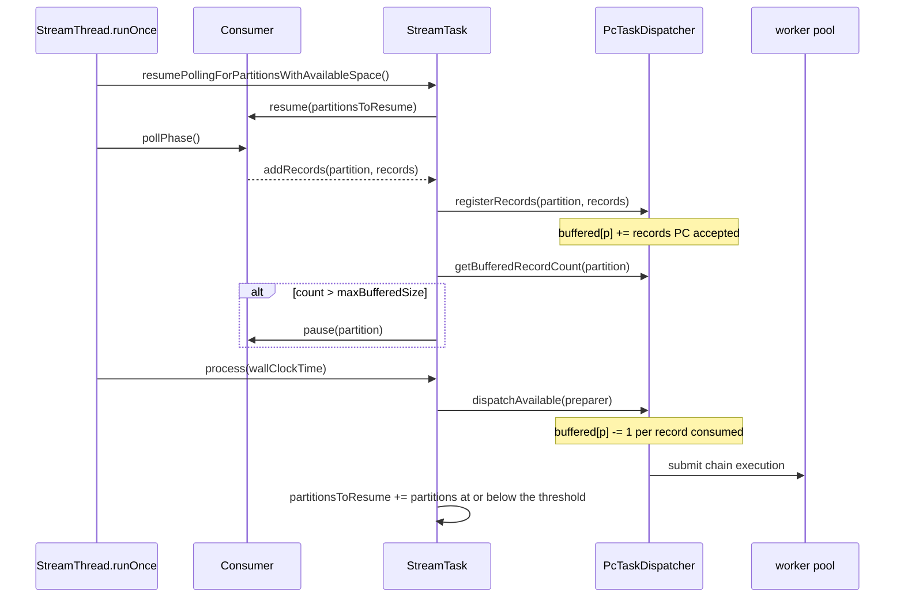
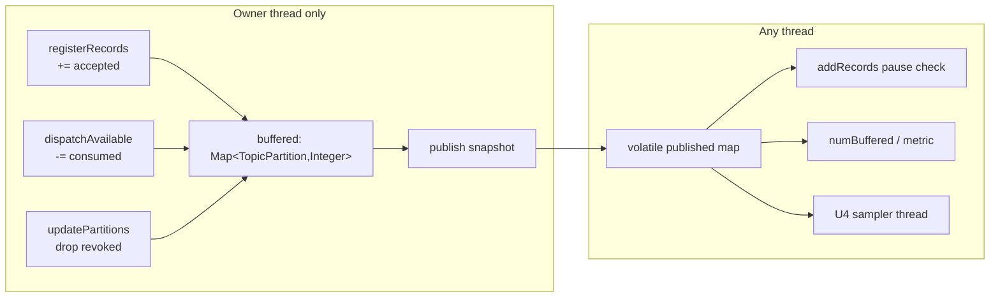

# feat: Kafka Streams backpressure and error surfacing under PC dispatch (U14)

**Headless disclosure.** Composed without the scoping-confirmation gate: this run has no interactive
user and no blocking-question tool, and the invoking brief already fixed scope, base branch,
constraints and success metric. Inferred bets are in [Assumptions](#assumptions).

---

## Goal Capsule

**Objective.** Make Kafka Streams' own `buffered.records.per.partition` backpressure work when Parallel
Consumer holds the records, so the consumer is paused and memory is bounded. Then make a PC-dispatched
failure arrive as the exception stock would have thrown, and stop the dispatcher handing out more work
once it knows a record has failed.

**Authority hierarchy.** R-IDs win on behaviour. KTD-IDs win on mechanism within their cited Rs. Units
override neither. Where this plan and Kafka's `StreamTaskTest` disagree, the memory bound wins and the
test is recorded as a divergence with its reason - pile C's tests are the check on the fix, not the
goal.

**Stop conditions.** Stop and report rather than guess if: the seam-OFF 419 moves at all; the patch
regeneration loses a hunk body; or the per-partition count needs a mechanism the existing publication
pattern cannot carry (see KTD3 - that is a report-back, not a licence to redesign).

**Tail ownership.** The caller owns commit-beyond-local, push, and PR. This plan's units commit locally
and nothing else.

---

## Summary

Give the PC path a per-partition count of the records it is holding but has not yet handed to a worker,
publish it the way U10 publishes PC's dirty flag, and feed it to the three places Kafka Streams already
implements backpressure: the pause in `addRecords`, the resume list `process()` builds, and the
`active-buffer-count` metric. Kafka's `resumePollingForPartitionsWithAvailableSpace()` already runs at
the top of every `runOnce`, so nothing new is needed to close the loop.

Then repair the failure path. `pcProcess` currently wraps every worker failure in a generic
`StreamsException`, which buries a `TimeoutException` that stock rethrows unchanged. Mirror stock's
classification, and refuse to dispatch more work while a failure is pending so the set of records that
run after a known failure is bounded by the pool rather than by the poll budget.

---

## Problem Frame

`StreamTask.addRecords` pauses a partition when its `RecordQueue` passes `maxBufferedSize`. On the PC
path there is no `RecordQueue`: records go to the `WorkManager`, `partitionGroup.numBuffered()` is
always zero, and the pause never fires. Kafka Streams therefore never stops fetching, and records
accumulate in a queue the framework cannot see.

That is a production hazard, not a test-fidelity gap. Under a processor slower than the broker feed
there is no bound on the accumulation and no backpressure signal anywhere - the only limit is heap.
Stock's bound is `buffered.records.per.partition` per partition; the PC path currently has none.

The failure path has a smaller but real gap. A worker's exception is stored and rethrown on the next
pump, wrapped in `StreamsException` regardless of what it was. Stock's `process()` classifies:
`TimeoutException` rethrown unchanged without EOS, `StreamsException` rethrown unchanged, everything
else wrapped with a message naming topic, partition and offset. The PC path loses all of that, and
keeps dispatching until the next pump notices.

---

## Product Contract

### Requirements

**Backpressure and memory bounding**

| ID | Requirement | Source |
|---|---|---|
| R1 | The dispatcher must expose, per partition, how many records it holds that no worker has yet started. | Brief; the pause needs a number |
| R2 | That count must be readable from a thread that is not the owner, without touching `WorkManager`. | `PcTaskDispatcher` thread model: a question may not mutate |
| R3 | `addRecords` on the PC path must pause the partition when the count passes `maxBufferedSize`, exactly as stock does with `RecordQueue.size()`. | Kafka `StreamTask.addRecords` |
| R4 | A partition must be resumed once its count falls back to `maxBufferedSize` or below. | Kafka `resumePollingForPartitionsWithAvailableSpace` |
| R5 | Memory must be shown to be bounded under a processor slower than the feed, with a control arm showing it is unbounded without the fix. | Brief: "prove the memory bound, not just the tests" |
| R6 | `numBuffered()` and the `active-buffer-count` metric must report PC's occupancy on the PC path. | Kafka `recordProcessTimeRatioAndBufferSize` |

**Error surfacing**

| ID | Requirement | Source |
|---|---|---|
| R7 | A failure surfaced from the PC path must arrive as the exception type stock's `process()` would have thrown for the same cause. | Kafka `StreamTask.process` catch ladder |
| R8 | The surfaced exception must name the record that failed - topic, partition, offset - as stock's message does. | Kafka `handleException` |
| R9 | Once a failure is pending, the dispatcher must not hand out further work, so the records that run after a known failure are bounded by the pool rather than the poll budget. | Brief: "records dispatched in that window will have run" |
| R10 | Retries stay disabled. Nothing here may re-dispatch a failed record. | Brief; `PcTaskDispatcher` class javadoc |

**Evidence and preservation**

| ID | Requirement | Source |
|---|---|---|
| R11 | Seam-OFF behaviour preservation is unchanged: Kafka's own 419 at zero failures (StreamTaskTest 101, RecordCollectorTest 59, ProcessorContextImplTest 28, StreamThreadTest 231 with its own 21 skips). | `parallel-consumer-streams/pom.xml` upstream execution |
| R12 | The seam-ON `StreamTaskTest` failing set is measured before and after with the same method, and every case that moved or got worse is reported. | Brief |
| R13 | Each pile C, D and H case that does not move is re-recorded as a named divergence with the reason, not left unexplained. | The spike plan's pile table |
| R14 | No assertion is weakened, skipped or deleted anywhere. | AGENTS.md test discipline |

**User-facing surface**

| ID | Requirement | Source |
|---|---|---|
| R15 | The user-facing surface moves in the same unit as the behaviour. The new control-arm property is named and documented in the module README's settings block beside `pc.streams.wakeOnWork.enabled`, and every `Current Shortcomings` entry this work falsifies is rewritten. | Field testers are the module's whole current audience, and the README points them at that list |
| R16 | Enabling the pause must not regress head-of-line-blocking throughput, measured with the control-arm property as the single varied term. | R17 makes `buffered.records.per.partition` a concurrency knob as well as a memory knob; an unmeasured throughput loss would hit the module's headline value |
| R17 | If `max.task.idle.ms` is honoured on the PC path at all, it is honoured with stated semantics and any divergence from stock is recorded in the divergence list. Honouring a Kafka setting with different meaning and saying nothing is the failure mode the unsupported-surface refusal exists to prevent. | The module's promise is that unsupported semantics refuse loudly rather than differ silently |

### Scope Boundaries

**In scope.** Per-partition occupancy publication; pause and resume on the PC path; the buffered-records
metric; exception classification and the record identity in its message; refusing dispatch while a
failure is pending; a simplified PC-aware idling gate; a memory-bound proof with a control arm.

**Deferred to follow-up work.**

- Collapsing `pcDirty` and the new occupancy publication into one coherent snapshot object. It is the
  right end state, but U13 is editing the same class in parallel and two independent redesigns is the
  one outcome that makes parallel work more expensive than serial. Recorded for whoever consolidates
  the two branches (KTD3).
- A `maxBufferedSize` analogue expressed in bytes rather than records. Kafka does not have one either.

**Outside this unit.** Pile A (offset and commit accounting), pile B's remaining case, pile E (EOS),
pile F (stream-time punctuation, U13), pile G (partition ordering, by design).

---

## Planning Contract

### The measured baseline, and where the brief is wrong

Measured on the base commit, seam ON, before any code was written. Method in the
[Verification Contract](#verification-contract).

`StreamTaskTest`: **101 run, 24 failures + 6 errors = 30 failing.** Not 33. The refusal work and U10
moved the number, and the brief's pile counts are stale in three places that change what this unit can
deliver.

**Refutation 1 - pile D is 2, not 3.** `shouldThrowTaskCorruptedExceptionOnTimeoutExceptionIfEosEnabled`
no longer fails as a timeout case. It *errors* at task construction with
`PC dispatch (astubbs#255): exactly-once processing (processing.guarantee) is not supported`. The
unsupported-surface refusal reclassified it into pile E, which is out of scope by design. Five other
EOS cases error the same way. Pile D's addressable content is two cases.

**Refutation 2 - pile H's metric is already wired.** The brief describes it as "the metric", implying
it is not recorded. `doProcess` calls `maybeRecordE2ELatency` and `doProcess` is exactly what a PC
worker runs, so the sensor does record - late. The test reads `NaN` because it asserts immediately
after `process()` returns. Worse for the test's prospects: it builds its four records with
`getConsumerRecordWithOffsetAsTimestamp(key, 0L)`, giving four different keys **all at offset 0 on one
partition**. PC rejects a re-offered completed offset (`PartitionState.isRecordPreviouslyCompleted`), so
records two, three and four never register at all. The case is unreachable for two independent reasons,
neither of which is a missing metric.

**Refutation 3 - one of pile C's four asserts the ordering pile G exists to trade away.**
`shouldPauseAndResumeBasedOnBufferedRecords` asserts `source1.numReceived == 1` and
`source2.numReceived == 0` after a single `process(0L)`, then walks a fixed interleaving of the two
partitions by ascending timestamp. That is `PartitionGroup.nextRecord()`'s cross-partition,
lowest-timestamp, one-record-at-a-time selection. PC's `ShardKey.KeyOrderedKey` shards on
`(topic-partition, key)`, so two partitions are two shards and a single pump hands out one from each.
Making this case pass means making dispatch serial, which deletes the module's reason to exist. The
pause and resume behaviour it checks is still implementable and still worth implementing - it just
cannot be scored by this test.

**What survives is the part that mattered anyway.** The brief said pile C is the one that matters
because unbounded memory growth is a production hazard. That is correct and untouched by any of the
above. The tests are a weak scorecard for it, so this plan carries its own proof (U4).

### The 30 failing cases, and who owns each

| Pile | Cases still failing | Owner |
|---|---|---|
| A. Offset and commit accounting | 12 (`shouldUpdateOffsetIf*` x6, three `shouldCommit*`, `shouldMaybeReturnOffsetsForRepartitionTopicsForPurging` x2, `shouldRespectCommitNeeded`) | U9, partly red by design (KTD-S7) |
| B. Close lifecycle | 1 (`shouldThrowExceptionOnCloseCleanError`) | U10 residue |
| C. Buffering and pause/resume | 4 | **This unit** |
| D. Error surfacing and timeouts | 2 addressable, 1 reclassified to E | **This unit** |
| E. EOS | 6 errors at construction, plus `shouldProcessRecordsAfterPrepareCommitWhenEosDisabled` | Out of scope (KTD7) |
| F. Stream-time punctuation | 2 | U13 |
| G. Ordering | 1 (`shouldProcessInOrder`) | By design |
| H. Metrics | 1 | **This unit**, unreachable - see Refutation 2 |

### Key Technical Decisions

#### KTD1. PC's held records count toward Streams' `maxBufferedSize`. The dispatcher does not invent its own backpressure.

This is the design question the brief asked to be settled here.

Counting toward Kafka's own limit means `addRecords` keeps being the place that pauses,
`resumePollingForPartitionsWithAvailableSpace` keeps being the place that resumes, and the
`active-buffer-count` metric keeps meaning occupancy. Kafka already implements the whole loop; the only
thing missing is the number. Feeding it the right number leaves one limit rather than two.

**It does not leave `buffered.records.per.partition` meaning exactly what it did, and saying so would be
false.** On the stock path it is purely a memory knob, because a serial engine draws no parallelism from
a deeper buffer. Under PC dispatch the buffer is also the pool of distinct keys concurrency is drawn
from, so a low setting now caps concurrency as well as memory. A user who tuned it down for a serial
engine gets less parallelism in the parallel one, which is the module's headline value. That is a real
trade, it must be documented rather than discovered, and R16 measures it.

**Three options were weighed, not two.** The third is the one an implementer would find first and is
recorded here so it is not re-proposed:

| Option | Why it loses |
|---|---|
| **Count toward `maxBufferedSize` (chosen)** | - |
| Dispatcher applies its own limit and reports Streams' buffer as full | "Full" is not an occupancy, so nothing can decide when to resume. It needs a second threshold, and two thresholds that can disagree is how a partition ends up paused forever with no error to explain it. It also makes Kafka's own tests meaningless about a limit Kafka no longer owns. |
| **PC's own inflow throttle** - `WorkManager.shouldThrottle()` / `isSufficientlyLoaded()`, which core PC's `BrokerPollSystem` already consumes to pause a consumer, and which `BrokerPollerBackpressureTest` already asserts against a real broker | Genuinely attractive: PC's own accounting, no new counter, proven against a broker, and reachable from the StreamThread, which is already the owner thread. It is unconsumed here only because `BrokerPollSystem` does not run on this path. It loses on **granularity and units**. The signal is one boolean for the whole WorkManager, but Kafka Streams pauses and resumes per partition, so it can stop the world and cannot selectively restart it. And it is keyed on a multiple of PC's `maxConcurrency` - a concurrency target - not on a memory budget, so `buffered.records.per.partition` would become dead config and `active-buffer-count` would keep reporting zero. The metric would still be a lie. |

So "a smaller change than the alternatives" is not the argument, and an earlier draft of this KTD
claimed it without having checked. The argument is per-partition granularity and keeping the user's
configured limit live.

It also keeps the seam out of `inFlight`. That counter carries a documented KNOWN RESIDUAL - a stale
read between a worker's completion enqueue and its decrement - whose stated fix is to split it in two
and re-key every reader. Backpressure derived from `inFlight` would add readers to exactly the counter
that comment warns about. The occupancy count is a separate quantity with a separate owner, so it does
not.

The rejected alternative - the dispatcher applying its own limit and reporting Streams' buffer as full -
fits the seam more neatly and is worse in the way that matters. "Full" is not an occupancy, so nothing
can decide when to resume; it would need a second threshold, and two thresholds that can disagree is how
a partition ends up paused forever with no error to explain it. It would also make Kafka's own tests
meaningless about a limit Kafka no longer owns.

Governs R1, R3, R4, R6.

#### KTD2. Buffered means "accepted by PC and not yet handed to a worker", counted by the dispatcher rather than derived from PC's incomplete-offset map.

Stock's `RecordQueue.size()` counts records `nextRecord()` has not yet returned. Because stock processes
synchronously, that is the same as "not yet started". The faithful analogue is records PC has accepted
and not yet handed out - not records PC has not yet *completed*.

The two differ by the in-flight set, which is bounded by `poolSize`, and choosing "not yet handed out"
is right on both counts: it is what stock means, and it is the unbounded quantity. Total memory then
bounds at `maxBufferedSize + poolSize + one fetch batch` per partition, against stock's
`maxBufferedSize + 1 + one fetch batch`.

`PartitionState.getNumberOfIncompleteOffsets()` was the tempting DRY source - PC's own per-partition
number, no new state. It is rejected because it counts a *failed* record forever. With retries disabled
a failed record never leaves `incompleteOffsets`, so that definition pauses its partition permanently.
That is the same trap `hasUncommittedWork()` documents avoiding, and repeating it would be repeating a
recorded defect.

So the dispatcher keeps one integer per partition, mutated at exactly two owner-thread points:

- `registerRecords` adds **the number PC actually took on**, read as the delta in that partition's
  incomplete-offset count across `registerWork`. Not `epochTagged.count()`: PC can refuse a record
  after the epoch filter - bootstrap truncation does exactly that, and the spike plan records seeing it
  against the mock consumer - and a refused record would never be handed out, so counting it would
  overcount forever and pause the partition permanently.
- `dispatchAvailable` subtracts one per `WorkContainer` consumed, whether it went to the pool, was
  dropped during preparation, or failed at preparation. All three are already counted as consumed by
  the return value.

Records queued behind a *failed* record on the same key stay counted, and that is correct rather than a
trap: they genuinely are in memory and will never be handed out. Their partition stays paused, and the
task is already dying, because the failure surfaces through `pollFailure()`.

Governs R1, R2.

#### KTD3. Extend the U10 publication pattern with a second published field. Do not replace it with a snapshot object.

U10's rule is that the owner thread republishes at every mutation point, and that a question may not
mutate. `pcDirty` is the existing instance. The occupancy count is exactly the kind of question a second
thread may ask - the memory-bound proof in U4 samples it from a watcher thread - so it needs the same
treatment: a `volatile` immutable snapshot map, written only by the owner immediately after it changes
the counter it mirrors, never consulted to decide whether to dispatch.

One coherent snapshot object carrying dirty, occupancy and U13's stream-time low-water mark would be
better than three independent volatiles. It is not done here: U13 is editing this class in parallel for
the low-water mark, and the brief is explicit that redesigning the mechanism is not this unit's to do.
Recorded as deferred follow-up for whoever merges the two branches.

**Is this publication shaped to carry U13's second field?** Yes, in the sense that matters: the occupancy
map is written through a single owner-thread choke point, `publishBufferedCounts()`, called immediately
after every mutation. A second published value slots in beside it under the same rule, and merging the
three volatiles into one record at consolidation is a mechanical change to that one method plus its
readers - not a redesign anyone has to negotiate.

**But "one traversal serving both" is not available, and that is a technical finding rather than a
preference.** The two questions are about **different sets**:

| | Set | Maintained by |
|---|---|---|
| U14 occupancy | registered **minus handed out** - records no worker has started | an O(1) incremental counter, no traversal |
| U13 low-water | the minimum timestamp over records registered and **not yet completed** - which *includes* the in-flight ones | needs an ordered structure or a scan |

Occupancy deliberately excludes in-flight records, because that is what Kafka's `RecordQueue.size()` means
and it is the unbounded quantity. A low-water mark that excluded in-flight records would advance stream
time past records still running, which is exactly the unsafety it exists to prevent. So one snapshot is
right and one traversal is wrong, and a consolidation that merges the two fields must not also merge the
sets behind them.

Governs R2.

#### KTD4. The surfaced failure is classified the way stock's `process()` classifies it, at the point it is rethrown.

`pcProcess` today does `throw new StreamsException("Exception caught in PC-dispatched processing...", failure)`
for everything. Stock's ladder is: `TimeoutException` rethrown unchanged when EOS is off;
`FailedProcessingException` unwrapped to its cause; `StreamsException` rethrown unchanged; any other
`RuntimeException` wrapped in `StreamsException` with a message naming taskId, processor, topic,
partition and offset.

Mirror that ladder. It is the difference between a caller seeing a retriable broker timeout and seeing
an opaque wrapper, and it costs one method. The EOS arm of the ladder is unreachable here - EOS is
refused at construction - so it is written as the refusal rather than as dead code.

Carrying the record identity (R8) means the dispatcher must hand back *which* record failed, not only
the throwable. `firstFailure` becomes a small value holding both.

Governs R7, R8.

#### KTD5. A pending failure stops dispatch; it does not cancel in-flight work.

`dispatchAvailable` returns without taking new work while `firstFailure` is set. Records already on
workers run to completion - interrupting them mid-chain would leave a half-forwarded record, which is
worse than letting it finish, and PC's own revocation policy is to abandon rather than interrupt.

This bounds the "records dispatched in the window" the brief names: from "everything that fits in a poll
budget" to "what was already running". It does not close it, and cannot - the failure genuinely happens
after those records were handed out.

Governs R9, R10.

#### KTD6. Task idling is stream-time machinery, so U13 decides whether U7 is built at all.

**This is a shared design point with U13, not a U14 decision.** In stock Kafka Streams, `max.task.idle.ms`
exists to stop stream time advancing from one partition while another has data not yet fetched. U13's
frontier low-water mark answers the same question - when is it safe to advance - from the other end: stream
time may advance only to the lowest timestamp still outstanding, because nothing older can arrive. Designed
independently, the two produce two answers to one question.

**The low-water mark looks like the more fundamental mechanism, and U7 should be scoped against what U13
says it subsumes rather than assumed to stand alone.** If stream time cannot advance past the lowest
outstanding timestamp, most of what idling protects is already covered, and a partition with no data
buffered cannot drag stream time forward regardless of whether this gate exists.

**U7 is not cut here, and the cost of cutting it is the point of this entry.** What would be lost:

| Lost by dropping U7 | Weight |
|---|---|
| `shouldBeProcessableIfAllPartitionsBuffered` stays red | Low. One case, and P8 was only medium confidence anyway. |
| `timeCurrentIdlingStarted` stays empty, so the `task-idle-ratio` metric reads zero on the PC path | Low, but it is a metric that silently lies rather than being absent. |
| `max.task.idle.ms` stays a setting the PC path reads and ignores | **This is the real cost, and R17 is why.** The module's promise is that unsupported semantics refuse loudly rather than differ silently. |

That last row does not require U7. **R17 is satisfiable without it**, by recording `max.task.idle.ms` in
the divergence list beside stream time and partition ordering, and refusing or warning when it is set to a
non-default value on the PC path. That is cheaper than U7, keeps the promise, and is the option to take if
U13 subsumes the mechanism. What is not acceptable is dropping U7 and saying nothing.

**Do not resolve this inside U14.** The coordinator reconciles it once U13 has stated what its low-water
mark does and does not subsume.

#### KTD6a. If U7 is built, it takes a simplified, stall-safe form.

Stock's `PartitionGroup.readyToProcess` consults `fetchedLags` and returns false indefinitely when a
partition's lag is unknown or positive. Reimplementing that against PC's occupancy carries a real stall
risk: a wrong lag read parks the task forever, which is precisely the silent-stall failure shape this
repository has already paid for once.

The simplified form drops the lag branches and keeps the idle deadline: ready when every input partition
has occupancy, otherwise start the deadline and become ready once `maxTaskIdleMs` has elapsed. It can
never wait longer than `maxTaskIdleMs`, so it cannot stall. It is *less* patient than stock, which is
consistent with a path that has already traded cross-partition ordering away (pile G).

This unit is sequenced last and is the first thing to cut. Idling exists to protect cross-partition time
alignment for joins and windows - every one of which this module refuses - so its production value here
is close to zero, and it earns its place mainly by restoring a configured behaviour rather than silently
ignoring it.

**Cutting it is not the same as ignoring it, and R17 is what makes that distinction binding.** This
module's whole promise about unsupported behaviour is that it refuses loudly rather than differing
silently, and `max.task.idle.ms` is currently the second kind: the PC path reads a user's setting and
does nothing with it. Whichever way U7 goes, the outcome is written down - honoured with the simplified
semantics named, or left unimplemented and recorded in the divergence list beside stream time and
partition ordering. There is no branch of this decision where the setting stays quietly ignored.

Governs R6 partially, R17; owns U7.

#### KTD7. The backpressure switch is permanent, documented, user-facing surface - not measurement scaffolding.

`pc.streams.backpressure.enabled`, following the `pc.streams.*` convention already set by
`pc.streams.dispatch.enabled`, `pc.streams.dispatch.poolSize` and `pc.streams.wakeOnWork.enabled`, and
sharing their loud-failure rule: a value that is neither `true` nor `false` throws rather than being read
as off.

Permanent for the same two reasons `pc.streams.wakeOnWork.enabled` is. It is the control arm, so it has
to survive the run that used it or the experiment cannot be repeated. And it is an escape hatch on a
change that can pause a user's consumer - the one failure shape in this plan that presents as a silent
stall rather than an exception - so an operator needs a way to take it out of the picture without
rebuilding.

Permanence is what makes documenting it obligatory rather than optional, which is why R15 puts it in the
README's settings block in this unit rather than leaving it to a later documentation pass.

Governs R15.

### High-Level Technical Design

The backpressure loop, and where the new number enters it. Everything except the two shaded steps is
Kafka's own code, already present and already called.

The occupancy state, and who may touch it:

---

## Implementation Units

### U1. Publish a per-partition buffered-record count from the dispatcher

**Goal:** the dispatcher knows, and can be asked from any thread, how many records it holds for a
partition that no worker has started.

**Requirements:** R1, R2. Mechanism per KTD2, KTD3.

**Dependencies:** none.

**Files:**
- `parallel-consumer-streams/src/main/java/io/confluent/parallelconsumer/streams/PcTaskDispatcher.java`
- `parallel-consumer-streams/src/test/java/io/confluent/parallelconsumer/streams/PcTaskDispatcherTest.java`

**Approach:**

1. Add an owner-thread-only `Map<TopicPartition, Integer>` of buffered counts, and a `volatile`
   immutable snapshot of it for cross-thread readers.
2. In `registerRecords`, read the partition's incomplete-offset count from
   `workManager.getPm().getPartitionState(partition)` before and after `registerWork`, and add the
   delta. Keep the existing offered/accepted counters and the loud epoch-drop log unchanged - they
   answer a different question.
3. In `dispatchAvailable`, decrement by one for each `WorkContainer` taken from `getWorkIfAvailable`,
   at the same place `consumed` is incremented, so the two can never disagree.
4. In `updatePartitions`, drop revoked partitions' entries alongside the existing revoke. In `close`
   and `abortClose`, clear.
5. Republish after each of those mutations, following `publishDirtyState`'s shape and its javadoc's
   reasoning. Add the accessors as read-only surface, and extend the class javadoc's "Who may call
   what" table with them - the table is the contract, and a method missing from it is the defect the
   table exists to prevent.

**Patterns to follow:** `pcDirty` and `publishDirtyState` in the same class - the publication rule, the
volatile, and the "not a parallel copy of the run state" javadoc. `hasUncommittedWork()`'s javadoc for
how to state what is deliberately *not* counted.

**Test scenarios:**
- Registering a batch for a partition raises that partition's count by the batch size.
- A record PC refuses at registration is not counted: register a batch, then register a batch whose
  offsets were already completed, and assert the count rises only by the genuinely new records.
- One pump lowers the count by exactly the number of records the pump reports as consumed.
- A record dropped during preparation (bad timestamp) lowers the count, because it was consumed.
- A record that fails during preparation lowers the count.
- A record still running on a worker is not counted as buffered, and does not re-appear when it
  completes.
- A record queued behind a failed record on the same key stays counted - the documented, correct
  behaviour, pinned so a later change cannot silently turn it into a permanent pause nobody expected.
- Counts are per partition and do not leak across partitions.
- Revoking a partition drops its count to zero and leaves the other partition's count untouched.
- The published snapshot is readable from a non-owner thread and matches the owner's view after a
  pump, and reading it does not throw the owner-thread guard.
- Closing the dispatcher clears the counts.

**Verification:** the module unit suite is green and the new cases fail against a dispatcher without
the counter.

---

### U2. Pause and resume the consumer from PC's buffer occupancy

**Goal:** the consumer is actually paused when PC is holding too much, and actually resumed when it is
not.

**Requirements:** R3, R4. Mechanism per KTD1.

**Dependencies:** U1.

**Files:**
- `parallel-consumer-streams/src/main/patch/pc-streams.patch` (via `target/kafka-patched/org/apache/kafka/streams/processor/internals/StreamTask.java`)

**Approach:**

1. In `addRecords`' PC branch, after `registerRecords`, pause the partition when its buffered count
   exceeds `maxBufferedSize`. Mirror the stock branch immediately below it, including its trace log, so
   the two read as one mechanism with two sources for the number.
2. In `pcProcess`, after the pump, add to `partitionsToResume` every input partition whose count is at
   or below `maxBufferedSize`. Stock adds only the partition it just processed from; the PC path
   processes from several at once and has no single current partition, so the whole set is the honest
   equivalent.
3. Leave `resumePollingForPartitionsWithAvailableSpace()` untouched. It already resumes the set at the
   top of every `runOnce`, unconditionally, before `pollPhase()`. It is a no-op while the set is empty,
   which is exactly why step 2 is load-bearing: `partitionsToResume` is written in one place today, the
   stock branch of `process()`, so on the PC path the set stays empty forever and a pause set in
   `addRecords` would never be undone by this route.
4. Gate the pause on a new control-arm property so U4 can vary exactly one term. Follow
   `PcDispatchSwitch.WAKE_ON_WORK_PROPERTY` - same shape, same "this exists to be the control arm"
   reasoning, same loud failure on a value that is neither `true` nor `false`.

**Execution note:** this is patched-Kafka work. Run `./mvnw -pl .,parallel-consumer-streams process-sources`
(not `generate-sources`), edit under `target/kafka-patched/`, then `bin/regen-patch.sh` with no maven
run in between. Verify the regenerated patch by content, not by hunk count.

**Patterns to follow:** the existing `addRecords` PC branch and the KTD8 comment on it; the
`pc.streams.wakeOnWork.enabled` control-arm property in `PcDispatchSwitch`.

**Test scenarios:**
- A partition whose registered records exceed `maxBufferedSize` is paused on the consumer.
- A partition at or below the threshold is not paused.
- Pumping until the count falls to the threshold puts the partition in the resume set, and
  `resumePollingForPartitionsWithAvailableSpace()` resumes it on the consumer.
- A partition still above the threshold after a pump is not resumed.
- Two partitions are paused and resumed independently.
- With the control-arm property off, no pause is issued - the property genuinely varies the term.
- Seam off, the stock `RecordQueue` branch still pauses and resumes exactly as before.

**Verification:** Kafka's `shouldResumePartitionWhenSkippingOverRecordsWithInvalidTs` is the upstream
check; the module's own tests are the ones that must be deterministic.

---

### U3. Report PC's occupancy as the task's buffered-records metric

**Goal:** `active-buffer-count` and `hasRecordsQueued()` tell the truth on the PC path.

**Requirements:** R6.

**Dependencies:** U1.

**Files:**
- `parallel-consumer-streams/src/main/patch/pc-streams.patch` (via `target/kafka-patched/.../StreamTask.java`)

**Approach:** make `numBuffered()` dispatcher-aware, and point
`recordProcessTimeRatioAndBufferSize` at it rather than at `partitionGroup.numBuffered()` directly.
`hasRecordsQueued()` already derives from `numBuffered()` and needs no change - it has no production
callers at all in Kafka 3.9.2, so it is test-only surface that comes right for free rather than a
second thing to wire. Keep the change to the smallest edit that makes the existing derivation correct:
a second PC-specific accessor beside `numBuffered()` would be a parallel answer to one question.

**Test scenarios:**
- The metric reads zero on a fresh task.
- After registering two records it reads two.
- After a pump that consumes one it reads one.
- `hasRecordsQueued()` is false once every record has been consumed, including when the last records
  were dropped for a bad timestamp rather than processed.
- Seam off, the metric still reports `partitionGroup.numBuffered()`.

**Verification:** Kafka's `shouldRecordBufferedRecords` should move from failing to passing - it is a
single-partition, single-key case, so PC hands out one record per pump and the arithmetic is
deterministic. If it does not move, report why rather than adjusting the definition to suit it.

---

### U4. Prove the memory bound, with a control arm

**Goal:** evidence that records stop accumulating under a slow processor, not just that a test asserting
a pause is green.

This unit answers a falsification aim already on the record. `docs/inflight/pr-ks-spike-hostile-streams-review.md`
asks for exactly this: *"Consumer pausing is gone. `StreamTask.addRecords`'s buffer-based pause never
fires, so PC's own limits are the only inflow control. Show unbounded growth, or show the consumer
starving."* The control arm is that demonstration.

**Requirements:** R5.

**Dependencies:** U1, U2.

**Files:**
- `parallel-consumer-streams/src/test/java/io/confluent/parallelconsumer/streams/integrationTests/BackpressureBoundIntegrationTest.java` (new)

**Approach:**

Two arms of one run, differing only in the U2 control-arm property. A real broker and a real
`KafkaStreams`, reusing `BrokerStreamsIntegrationTest`, with a processor slow enough that the broker
feed outruns it and `buffered.records.per.partition` set well below the record count so the bound is
observable within a short run.

A watcher thread samples the dispatcher's published occupancy throughout and keeps the maximum. This is
the second thread that asks the question - the reason KTD3's publication is not optional.

- **Fixed arm:** maximum observed occupancy stays within `maxBufferedSize` plus one fetch batch.
- **Control arm:** maximum observed occupancy passes that bound by a wide margin, on the same data and
  the same processing cost.

State the prediction before running and report it whichever way it lands. If the control arm does *not*
grow unbounded, the diagnosis in the Problem Frame is wrong and that is the finding, not an
inconvenience to be tuned away.

**Execution note:** the two arms must differ in exactly one term. Vary the property inside one test
class rather than comparing against a parent commit, for the same reason the wake-on-work benchmark
does. `@Isolated`, because the dispatch switch is process-wide.

Three recorded test traps apply directly here, and the design must clear all three before the test is
written:

1. **Do the arithmetic first.** `docs/solutions/test-flakiness/vacuous-await-condition-brokerpoller-backpressure-2026-07-31.md`
   is about a backpressure test whose named scenario was unreachable by construction. Before asserting a
   bound, show from the record count, `buffered.records.per.partition`, the fetch size and the
   processing cost that the control arm *can* exceed it and the fixed arm *can* approach it.
2. **Approach the bound.** `docs/inflight/pr-streams-rebalance-coverage-gaps.md` records the rule
   that a test which never approaches its own bound is not exercising the thing it bounds. Report the
   fixed arm's maximum as a number, not as a pass.
3. **Await the value being asserted, never a proxy that leads it.** The maximum-observed reading is the
   assertion subject, so it is what the wait must converge on.

**Patterns to follow:** `PcDrivenStreamsDispatchTest` for the two-arm shape, the `@Isolated`
requirement and the broker harness; `HeadOfLineBlockingBenchmarkTest` for the slow-processor shape;
`parallel-consumer-core/src/test-integration/java/io/confluent/parallelconsumer/integrationTests/BrokerPollerBackpressureTest.java`
for how this repository already asserts a backpressure bound against a broker.

**Test scenarios:**
- Fixed arm: maximum observed occupancy stays within the bound, and all records are still processed -
  a bound achieved by dropping records is not a bound.
- Fixed arm: maximum observed occupancy actually approaches the bound, so the assertion is not
  satisfied by a run that never filled the buffer at all.
- Control arm: maximum observed occupancy exceeds the bound.
- The two arms differ only in the property, asserted by reading it back rather than assumed.
- The run completes rather than deadlocking: pausing must not be able to stop the task making progress.

**Verification:** both arms run in the module's integration suite. Report the two maxima as numbers.

---

### U5. Classify a PC-surfaced failure the way stock's `process()` does

**Goal:** a `TimeoutException` from a PC-dispatched record arrives as a `TimeoutException`, and every
surfaced failure names the record that caused it.

**Requirements:** R7, R8. Mechanism per KTD4.

**Dependencies:** none.

**Files:**
- `parallel-consumer-streams/src/main/java/io/confluent/parallelconsumer/streams/PcTaskDispatcher.java`
- `parallel-consumer-streams/src/main/patch/pc-streams.patch` (via `target/kafka-patched/.../StreamTask.java`)
- `parallel-consumer-streams/src/test/java/io/confluent/parallelconsumer/streams/PcTaskDispatcherTest.java`

**Approach:**

1. `pollFailure()` returns the throwable together with the record it came from, so the rethrow can name
   topic, partition and offset the way `handleException` does. Keep the get-and-clear semantics.
2. In `pcProcess`, replace the blanket wrap with stock's ladder: rethrow `TimeoutException` unchanged,
   unwrap `FailedProcessingException` to its cause, rethrow `StreamsException` unchanged, wrap anything
   else in `StreamsException` with the record-naming message. State in the javadoc that the EOS arm of
   stock's ladder is unreachable because EOS is refused at construction, rather than writing an arm
   that cannot run.
3. Keep the existing "arrives one or more pump cycles late" caveat in the javadoc. U6 narrows it; it
   does not remove it, and the javadoc must not start claiming otherwise.

**Patterns to follow:** the catch ladder in the stock half of `StreamTask.process`, and
`handleException`'s message format. Reuse the message wording rather than inventing a second one.

**Test scenarios:**
- A processor throwing `TimeoutException` surfaces a `TimeoutException`, not a `StreamsException`.
- A processor throwing `StreamsException` surfaces that same instance, not a wrapper around it.
- A processor throwing a plain `RuntimeException` surfaces a `StreamsException` whose message names the
  task, topic, partition and offset of the record that failed, and whose cause is the original.
- A `FailedProcessingException` surfaces its cause rather than itself.
- A failure raised during preparation on the StreamThread is classified the same way as one raised on a
  worker.
- The failure is cleared once surfaced, so a second pump with no new failure does not throw again.
- Only the first failure is surfaced when several workers fail, and the others do not resurrect later.

**Verification:** module unit suite green.

---

### U6. Stop handing out work once a failure is pending

**Goal:** bound the set of records that run after a failure the dispatcher already knows about.

**Requirements:** R9, R10. Mechanism per KTD5.

**Dependencies:** U5.

**Files:**
- `parallel-consumer-streams/src/main/java/io/confluent/parallelconsumer/streams/PcTaskDispatcher.java`
- `parallel-consumer-streams/src/test/java/io/confluent/parallelconsumer/streams/PcTaskDispatcherTest.java`

**Approach:** `dispatchAvailable` drains completions as it does now, then returns zero without taking
new work while a failure is pending. In-flight records are left to finish. Say in the javadoc why the
drain still happens first - the outcomes have to reach PC's accounting or the frontier is wrong on the
way down - and why in-flight work is not interrupted.

Check `isQuiescent()` and `pumpUntilQuiescent` against the new early return before writing it: a pump
that returns zero sets `lastDispatchCount` to zero, which is how quiescence is defined, so a failed
task must still be able to reach quiescence for `suspend()` to drain rather than time out. That
interaction is the risk in this unit, not the early return itself.

**Test scenarios:**
- After a worker fails, a subsequent pump dispatches nothing even though records are available.
- Records already in flight when the failure occurred still complete, and their outcomes still reach
  PC's accounting.
- Once the failure is polled and cleared, dispatch resumes.
- A dispatcher holding a failed record still reaches quiescence, so `suspend()` does not sit out its
  full drain timeout.
- No failed record is ever handed out a second time - retries stay disabled.

**Verification:** module unit suite green, and the streams integration suite still completes rather
than parking on a drain timeout.

---

### U7. Simplified PC-aware task idling

**Goal:** `isProcessable` means something on the PC path, without any path to a stall.

**BLOCKED on U13, deliberately.** Idling is stream-time machinery and U13's low-water mark answers the
same question - see KTD6. Do not build this unit until U13 has stated what its mechanism subsumes. If it
subsumes idling, take KTD6's cheaper alternative instead: record `max.task.idle.ms` in the divergence
list and refuse or warn on a non-default value, which satisfies R17 without the patch-surface growth.

**Requirements:** R6 partially, R17. Mechanism per KTD6 and KTD6a.

**Dependencies:** U1, and U13's statement of scope.

**Files:**
- `parallel-consumer-streams/src/main/patch/pc-streams.patch` (via `target/kafka-patched/.../StreamTask.java`)

**Approach:** `pcProcess` consults a PC-aware readiness check before pumping. Ready when every input
partition has occupancy. Otherwise record `timeCurrentIdlingStarted` and stay unready until
`maxTaskIdleMs` has elapsed, then proceed. No `fetchedLags` branches - KTD6 says why, and the javadoc
must say so at the call site too, because "we left this out" is only safe if the next reader knows it
was a decision.

Behaviour at the default `max.task.idle.ms` of 0 must be identical to **today's PC path**: the deadline
equals the wall-clock time, which is not less than it, so the task proceeds on the same pump, exactly as
it does now with no readiness check at all.

It is not identical to *stock* at that setting, and the difference must be written down rather than
discovered. `MAX_TASK_IDLE_MS_DISABLED` is `-1`, so the default of 0 is **not** the disabled path:
stock still walks its `fetchedLags` loop and returns false when a partition's lag is unknown. The
simplified form proceeds instead. That makes the PC path less patient than stock at every setting, which
is the same trade pile G already records.

**Execution note:** cut this unit rather than let it destabilise the others. It is the lowest-value item
in the plan by a wide margin - every construct idling protects is refused by this module - and it is
the only one that can introduce a dwell.

**Test scenarios:**
- With two input partitions and only one holding records, and `max.task.idle.ms` above zero, the task
  reports not processable and records that it started idling.
- Once both partitions hold records, the task reports processable and clears the idling mark.
- With only one partition holding records and `maxTaskIdleMs` elapsed, the task proceeds anyway.
- With `max.task.idle.ms` at its default of 0, the task proceeds on the same pump regardless of how
  many partitions hold records - no dwell is introduced for the default configuration.
- A task whose partition never receives data cannot be parked indefinitely.

**Verification:** Kafka's `shouldBeProcessableIfAllPartitionsBuffered` should move to passing. The
default-configuration case is the one that matters more.

---

### U8. Re-measure, and re-record what stays divergent

**Goal:** the pile table and the divergence list match what is now true, and a field tester reading the
user-facing surface is not told two things that stopped being true.

**Requirements:** R11, R12, R13, R15.

**Dependencies:** U1-U7.

**Files:**
- `parallel-consumer-streams/README.md` - **unconditional, not gated on a proven-scope claim moving.**
  Document `pc.streams.backpressure.enabled` in the settings block beside `pc.streams.wakeOnWork.enabled`,
  and say that `buffered.records.per.partition` now bounds memory *and* caps the key pool concurrency is
  drawn from.
- `docs/plans/2026-08-08-001-feat-ks-on-pc-spike-plan.md` - the pile classification table **and
  `Current Shortcomings`**. Two entries there stop being true when this lands: *"Consumer pausing -
  Kafka Streams, not PC's"* and *"Failures surface a pump cycle late"*. The first is closed; the second
  is **narrowed, not closed** - U6 bounds the window, it does not remove it - and must be rewritten to
  say so rather than struck.
- `docs/inflight/pr-ks-spike-next-work.md`
- `docs/inflight/pr-ks-spike-hostile-streams-review.md` (the two aims this unit answers)

**The `Current Shortcomings` list is a three-way collision.** U10, U13 and U14 all falsify entries in it
from parallel branches. This unit edits only the two entries it can cite a measurement for, and leaves a
note in the inflight entry saying the list must be re-checked as a whole at consolidation rather than
trusted from any single branch's edit. Editing entries this unit did not measure would be the same
mistake as inheriting a pile count.

**No CHANGELOG.adoc edit.** AGENTS.md is explicit that a PR never adds a changelog entry and that
there is no window in which a PR contributes one. The only sanctioned edit is correcting an existing
factual error, which this unit does not do.

**Approach:** re-run the seam-ON measurement with the same method as the baseline, diff the failing
sets, and rewrite the pile table against the result. Record the three refutations in the Planning
Contract as findings rather than quietly correcting the counts - a stale pile count sent this unit
looking for work that no longer existed, and the next reader deserves to know the table was measured
rather than inherited.

Shrink the inflight files to what remains open rather than rewriting them into a done narrative, per
`docs/inflight/AGENTS.md`. The hostile-review file's *"Consumer pausing is gone"* and *"Failures surface
a pump cycle late"* aims are the two this unit touches; the second is narrowed rather than closed, and
must be re-recorded that way.

If the citable Kafka test count moves, it moves in three places - the `pom.xml` surefire comment, the
module README, and `docs/plans/2026-08-08-002-ks-on-pc-spike-result.md`. It should not move here: this
unit adds no patched class.

Each pile C, D and H case that did not move gets a named reason: the ordering trade for
`shouldPauseAndResumeBasedOnBufferedRecords`, the duplicate-offset and synchronous-assertion pair for
`shouldRecordE2ELatencyOnSourceNodeAndTerminalNodes`, the asynchronous arrival for
`shouldWrapKafkaExceptionWithStreamsExceptionWhenProcess`, and the retries-disabled conflict for
`shouldThrowOnTimeoutExceptionAndBufferRecordForRetryIfEosDisabled`.

**Test expectation: none** - documentation unit. Its correctness is that every claim cites the run that
established it.

---

## Verification Contract

| Gate | Command | Bar |
|---|---|---|
| Seam-OFF behaviour preservation | `./mvnw -pl .,parallel-consumer-streams test -Dcopyright.skip=true` | StreamTaskTest 101, RecordCollectorTest 59, ProcessorContextImplTest 28, StreamThreadTest 231 with 21 Kafka-annotated skips, **zero failures**. Non-negotiable. |
| Seam-ON pile movement | `./mvnw -pl .,parallel-consumer-streams test -Dpc.streams.dispatch.enabled=true -Dincluded.groups=<nonexistent> -Dcopyright.skip=true -Dmaven.test.failure.ignore=true` | Baseline 30 failing. Report the new set, pile by pile, and every case that got worse. |
| Module unit suite | `./mvnw -pl .,parallel-consumer-streams test -Dcopyright.skip=true` | green |
| Module integration suite | `./mvnw -pl .,parallel-consumer-streams verify -Dcopyright.skip=true` | green, including both arms of U4 |
| Memory bound | U4's two arms | fixed arm within bound, control arm outside it, both numbers reported |
| Concurrency not regressed | `HeadOfLineBlockingBenchmarkTest`, varying only `pc.streams.backpressure.enabled` | throughput with the pause on is not materially worse than with it off, at a `buffered.records.per.partition` large enough not to cap the key pool. Report both numbers - "no regression" without them is not a result. |
| Patch integrity | `bin/regen-patch.sh`, then diff added/removed line **bodies** against the previous patch | every line the old patch added is still added. Hunk count is a hint - adding lines can merge hunks and lower it legitimately. |

**Proving the upstream suite actually ran is part of the gate.** `-Dtest=...` silently overrides the
upstream execution's `<includes>`, so that suite does not run at all and the build goes green having
computed nothing. Never use it for this measurement. Isolate with `-Dincluded.groups=<nonexistent>`,
which empties the *default* execution's group filter while the upstream execution's
`<groups combine.self="override"/>` leaves it unaffected. Evidence that it ran is the per-class `tests=`
counts read from `parallel-consumer-streams/target/surefire-reports-kafka-upstream/`, quoted in the
report.

**The seam-ON override works despite the pom pinning the seam off for that execution** - verified while
taking the baseline, which produced 30 failures rather than zero. Re-confirm it on the "after" run
rather than assuming: a run that silently reverted to seam-off would report a clean sweep and mean
nothing.

---

## Definition of Done

1. The consumer is provably paused when PC holds more than `maxBufferedSize` for a partition, and
   provably resumed when it does not.
2. U4's two arms are run and both maxima reported. A fixed arm that bounds memory only because the
   control arm also did is not a result - say so if that is what happens.
3. Seam-OFF 419 unchanged, zero failures, with the per-class counts quoted as proof the suite ran.
4. The seam-ON failing set is compared before and after; every case that got worse is reported as
   prominently as every case that improved.
5. Every pile C, D and H case still failing has a named reason recorded in the pile table.
6. Every defect fixed has a test; every divergence kept has a written reason.
7. The patch regenerates with content parity.
8. Predictions stated in this plan are reported as confirmed or refuted, refuted ones first.
9. No assertion anywhere is weakened, skipped or deleted.
10. No dead-end or experimental code is left in the diff.

---

## Measured outcome, as at the U1-U6 commits

Same method both times, and the isolation is shown to have worked rather than asserted: the default
surefire report directory is **empty** while `surefire-reports-kafka-upstream/` holds all four classes, so
`-Dincluded.groups=nonexistent-isolation-group` suppressed only the module's own tests.

| Gate | Result |
|---|---|
| Seam OFF, Kafka's own suites | **419 run, 0 failures, 21 skips** - StreamTaskTest 101, StreamThreadTest 231, RecordCollectorTest 59, ProcessorContextImplTest 28. Unchanged. |
| Seam ON, `StreamTaskTest` | **30 failing → 29 failing**, and **zero regressions** |
| Module unit suite | green, including 39 `PcTaskDispatcherTest` cases |

**Pile by pile:**

| Case | Pile | Outcome |
|---|---|---|
| `shouldRecordBufferedRecords` | C | **FIXED** |
| `shouldResumePartitionWhenSkippingOverRecordsWithInvalidTs` | C | Still failing, but **it now fails later** - see the open finding below |
| `shouldPauseAndResumeBasedOnBufferedRecords` | C | Still failing, as predicted |
| `shouldBeProcessableIfAllPartitionsBuffered` | C | Still failing - U7 is blocked on U13 and was not built |
| `shouldWrapKafkaExceptionWithStreamsExceptionWhenProcess` | D | Still failing, as predicted |
| `shouldThrowOnTimeoutExceptionAndBufferRecordForRetryIfEosDisabled` | D | Still failing, as predicted |
| `shouldRecordE2ELatencyOnSourceNodeAndTerminalNodes` | H | Still failing, as predicted |

### OPEN: the resume fires one record too early

**Not a prediction, and not diagnosed - found by measurement and recorded rather than guessed at.**

`shouldResumePartitionWhenSkippingOverRecordsWithInvalidTs` used to fail at its **first** assertion. It now
gets past it, which is direct evidence that **the pause works**: five records against a
`buffered.records.per.partition` of 3 pauses the partition, exactly as intended.

It now fails at `StreamTaskTest.java:1141`, the second `assertTrue(consumer.paused().contains(partition1))`,
which runs after one `process(0L)` and one `resumePollingForPartitionsWithAvailableSpace()`. The partition
should still be paused there: one record consumed leaves four held against a threshold of three. Something
put it in the resume set anyway, so either more than one record was consumed by that pump or the occupancy
read at resume time is lower than four.

Two candidates were raised. **The second is now refuted, by a test written for the purpose.**

1. **Still open.** The resume loop offers **every** input partition at or below the threshold, where stock
   offers only the partition it just processed from. A real difference from stock, and now the only
   surviving candidate - though it does not obviously explain this case on its own, because partition1 *was*
   the partition processed from and its occupancy was above the threshold.
2. **REFUTED.** The theory was that the pump consumed two records rather than one, putting occupancy at
   exactly the threshold and making the resume correct by its own rule.
   `onePumpOverOneKeyConsumesExactlyOneRecord` drives the same shape - five same-key records, one pump - and
   shows the pump consumes exactly **one**, leaving **four** held. `buffered.records.per.partition` is `3`
   in that config, read from Kafka's own `createConfig`. So four against three is genuinely above the
   threshold and the dispatcher's arithmetic is right.

**What that refutation buys is a much smaller search area.** The occupancy count and its publication are
correct in isolation, so the defect is on the `StreamTask` side of the seam - in how `pcProcess` decides
what to put in `partitionsToResume` - and not in the counter, the publication, or PC's shard behaviour.

**Resolve this before U4**, because the memory bound depends on the resume being no more eager than the
pause: a resume that fires early un-pauses a partition that is still full, and the bound degrades quietly
rather than failing loudly. The instrument to use is the occupancy count itself, which is already published
and already readable from a test.

---

## Predictions

Stated before implementation, so the report can be honest about which held.

| # | Prediction | Confidence |
|---|---|---|
| P1 | The control arm of U4 shows unbounded growth and the fixed arm does not. This is the whole diagnosis; if it fails, the Problem Frame is wrong. | High |
| P2 | `shouldRecordBufferedRecords` moves to passing. Single partition, single key, so one record per pump and deterministic arithmetic. | High |
| P3 | `shouldPauseAndResumeBasedOnBufferedRecords` does **not** move. It asserts cross-partition, timestamp-ordered, one-at-a-time selection. | High |
| P4 | `shouldRecordE2ELatencyOnSourceNodeAndTerminalNodes` does **not** move, and would not even with synchronous dispatch, because three of its four records reuse offset 0. | High |
| P5 | `shouldWrapKafkaExceptionWithStreamsExceptionWhenProcess` does **not** move. One `process()` call cannot observe a failure that has not happened yet. | High |
| P6 | `shouldThrowOnTimeoutExceptionAndBufferRecordForRetryIfEosDisabled` does **not** move. Its second half requires re-processing the failed record, which retries-disabled forbids by design. | High |
| P7 | `shouldResumePartitionWhenSkippingOverRecordsWithInvalidTs` moves, but is a **race**: its second `process()` needs the first record's worker to have completed so its key-mate becomes available. If it flips across runs it is recorded UNRESOLVED, not green. | Low |
| P8 | `shouldBeProcessableIfAllPartitionsBuffered` moves once U7 lands. | Medium |
| P9 | Pile A does not regress. The occupancy counter touches no commit state. | Medium |

Net expectation for the three piles: **two to three of eight cases move.** The value of this unit is the
memory bound, not the scoreboard, and the plan says so in advance so that a thin scoreboard cannot be
retro-fitted into a claim of success.

---

## Risks and Dependencies

| Risk | Treatment |
|---|---|
| A pause that is never undone stalls the run silently - the exact failure KTD8's comment warns about. | U2's resume path is exercised by its own tests, and U4's fixed arm cannot complete if the resume never fires. Completion of that arm is the detector. |
| `TaskManager` blanket-resumes the whole assignment when restoration completes, and one task's input partitions when a restored task transitions to running. Either wipes a backpressure pause. | Not a new defect - stock carries it too, and it is self-healing because `addRecords` re-checks occupancy on the very next poll batch for that partition. Recorded rather than defended against: a fix would have to teach `TaskManager` about per-partition backpressure, which is a Kafka bug, not this seam's. Say so in the pause's comment so the next reader does not treat a post-rebalance unpaused partition as this unit's failure. |
| `shouldThrowExceptionOnCloseCleanError` is a deliberate regression guard that fails on purpose. | Do not "fix" it. If it goes green, find out why before recording it as a win. |
| The occupancy counter drifts from reality and pauses a partition forever. | KTD2 takes the increment from PC's own accepted count rather than the offered count, which is the only known drift source. U1 has a dedicated test for a record PC refuses. |
| U6's early return interacts with `isQuiescent()` and could make `suspend()` sit out its 30s drain. | Named in U6's approach as the unit's real risk, with a dedicated test. |
| U7 introduces a dwell that slows every run. | Default `max.task.idle.ms` is 0 and must be shown to change nothing; U7 is cut rather than debugged if it misbehaves. |
| The base branch moves under this work. | Merge it in. Never rebase - the base is under active review and a rebase would rewrite work others are reviewing. |
| U13 edits `PcTaskDispatcher` in parallel for the stream-time low-water mark. | KTD3 keeps this unit additive: a new field and new accessors beside `pcDirty`, no change to the existing publication. Conflicts are resolved at merge, never dodged by relocating the change. |
| The patch workflow silently discards edits if maven runs between editing and regenerating. | U2's execution note carries the rule. Verify the regenerated patch by content, not by hunk count. |

---

## Assumptions

Recorded because the scoping-confirmation gate did not run.

1. Pile C's memory bound outranks pile C's test count. The brief says so explicitly; this plan is built
   on it and would look like an under-delivery if that ranking were reversed.
2. Reimplementing `PartitionGroup.readyToProcess` faithfully, including its `fetchedLags` branches, is
   not wanted at the price of a possible stall. U7 takes the simplified form instead, and is cuttable.
3. Making `shouldPauseAndResumeBasedOnBufferedRecords` pass by serialising dispatch is not on the table.
4. The `Current Shortcomings` entries this unit falsifies are this unit's to edit, because it is the one
   that can cite the measurement. The other two branches falsifying entries in the same list re-check it
   at consolidation rather than each trusting the others - see U8.

---

## Sources and Research

- `docs/plans/2026-08-08-001-feat-ks-on-pc-spike-plan.md` - the pile classification this unit works
  from, and the KTD8 single-path rule that forbids registering into both record paths.
- `docs/plans/2026-08-11-001-feat-ks-streams-task-lifecycle-and-rebalance-plan.md` - U10's plan, and
  its "What execution refuted" section, which is where the publication pattern and the
  question-may-not-mutate rule were established.
- `parallel-consumer-streams/src/main/java/io/confluent/parallelconsumer/streams/PcTaskDispatcher.java`
  class javadoc - the thread model, the retries-disabled decision, and `hasUncommittedWork()`'s
  statement of what is deliberately not counted.
- Kafka 3.9.2 `StreamThread.runOnceWithoutProcessingThreads` and `runOnceWithProcessingThreads` - both
  call `taskManager.resumePollingForPartitionsWithAvailableSpace()` immediately before `pollPhase()`,
  which is what makes KTD1's loop close without new plumbing.
- Kafka 3.9.2 `PartitionGroup.readyToProcess` - the idling semantics KTD6 simplifies, and the
  `fetchedLags` branches that make a faithful reimplementation a stall risk.
- `parallel-consumer-core` `WorkManager.shouldThrottle()` / `isSufficientlyLoaded()`, and
  `BrokerPollerBackpressureTest` - the third backpressure option KTD1 weighs and rejects, already proven
  against a real broker on core's own path.
- `docs/inflight/test-streamthreadtest-invalid-timestamps-flake.md` - `StreamThreadTest`'s
  `shouldLogAndRecordSkippedRecordsForInvalidTimestamps[3]` is a pre-existing flake at roughly 2 runs in
  5. If that specific case fails the 419 gate, re-run it; any other failure is real.
- `parallel-consumer-core` `ShardKey.KeyOrderedKey` - shards on `(topic-partition, key)`, which is why
  two partitions dispatch concurrently and why `shouldPauseAndResumeBasedOnBufferedRecords` is
  unreachable.
- `parallel-consumer-core` `PartitionState.isRecordPreviouslyCompleted` - why the E2E latency test's
  reuse of offset 0 makes it unreachable independently of timing.
- Kafka 3.9.2 `TaskManager.tryToCompleteRestoration` and `transitRestoredTaskToRunning` - the two
  blanket `mainConsumer.resume(...)` calls that can wipe a per-partition pause at a restore boundary.
- `docs/inflight/pr-ks-spike-hostile-streams-review.md` - the two falsification aims this unit answers,
  and the standing rule that the module's own suite is not accepted as evidence on its own.
- `docs/solutions/integration-issues/kafka-streams-couples-polling-and-processing-on-one-thread.md` -
  the run-loop reading discipline, and the rule that anything deferred to "the next time the loop runs"
  is priced at the framework's blocking wait. The resume is exactly such a deferral, which is why U2
  checks where it actually runs rather than assuming.
- `docs/solutions/architecture-patterns/a-progress-signal-must-count-work-consumed-not-work-accepted.md` -
  the contract-versus-statistic split. The occupancy count is a contract, because code branches on it to
  pause; the E2E latency sensor is a statistic. One field cannot serve both.
- `docs/solutions/architecture-patterns/patch-a-dependency-at-build-time-without-vendoring-it.md` -
  the regeneration foot-gun and the rule that excluding a Kafka test voids the preservation claim.
- `docs/solutions/best-practices/control-arms-vary-exactly-one-term.md` - U4's method, including the
  instruction to state the single varied term before writing the control.
- `docs/solutions/best-practices/chase-refuted-predictions.md` - why the Predictions table is written
  before implementation and reported verbatim afterwards.
