# feat: stream time under PC dispatch, and what it does to punctuation timing (U13)

Implements master-plan unit **U13**, defined in
[the spike plan](2026-08-08-001-feat-ks-on-pc-spike-plan.md#u13-stream-time-under-concurrency-and-what-it-does-to-punctuation-timing).
Sub-units are numbered U13.1-U13.6, following the U10 plan's convention.

**Headless disclosure.** Composed without the scoping-confirmation gate: this run has no interactive
user and no blocking-question tool, and the invoking brief already fixed scope, base branch, success
metric and constraints. Inferred bets are in [Assumptions](#assumptions) rather than confirmed in chat.

---

## Summary

Stream time is the one quantity Kafka Streams derives from *which record it chose next*, and PC dispatch
removed the choosing. `PartitionGroup.nextRecord()` sets `streamTime = max(streamTime, record.timestamp)`
at selection; the PC path never calls it, so `partitionGroup.streamTime()` stays at
`RecordQueue.UNKNOWN` (-1) for the life of the task. `STREAM_TIME` punctuators never fire, and
`ProcessorContext.currentStreamTimeMs()` - a **public API** - returns -1 forever, silently.

This plan advances stream time from Parallel Consumer's own completion tracking instead: **the lowest
timestamp still in flight, or the highest timestamp dispatched when nothing is in flight**, clamped
monotonically. Under sequential processing that is bit-for-bit stock behaviour. Under concurrency it is
the conservative generalisation - never ahead of stock, equal to stock whenever the pool drains.

**Two corrections to the brief, measured before any code was written**, both of which change what
"pile F moving" can mean:

- **`shouldPunctuateOnceStreamTimeAfterGap` is not a stream-time failure and U13 cannot fix it.** It
  fails at `StreamTaskTest:1209`, `assertEquals(7, task.numBuffered())`, which is **pile C** - U14's
  territory - and it fails there *before reaching any punctuation assertion*. Even with `numBuffered()`
  wired, the test then demands one record consumed per `process()` call and cross-partition selection in
  timestamp order, neither of which batched PC dispatch does. It belongs with pile G, by design.
- **The seam-ON `StreamTaskTest` baseline is 30 failures, not 33.** Measured on this base branch after
  U9 and U10 (101 run, 24 failures, 6 errors). The 33 in the master plan predates both.

So the honest pile F prediction is **2 failing to 1 at best**, not 2 to 0, and even that one may only
have its failure *relocated* to a later assertion - see
[Predictions](#predictions-stated-before-execution).

**Read that as a statement about the metric, not about the unit.** Both pile F cases are written for a
dispatcher that consumes exactly one record per `process()` call and selects across partitions in
timestamp order. That is stock's shape, and PC deliberately has neither property, so the pile F count
cannot measure whether stream time works. The gate is module-owned instead: **a punctuator that fires,
a divergence that is measured, and a stock control arm.** Pile F is reported because R11 requires the
comparison, not because it is the success criterion.

**Nothing is reinstated here.** U13 makes the refusal *messages* factually wrong - **eight** of the
thirteen constructs argue from "stream time never advances on the PC path" or a paraphrase of it (five
carry that literal phrase; three state the same premise in other words) - so correcting those strings
is in scope. Deciding that a windowed operator now works is not, and
[U13.5](#u135-the-reinstatement-ledger) says exactly why for each construct.

**There is no upstream design to copy.** KIP-311 and KIP-408 both propose worker-pool processing for
Kafka Streams and neither mentions stream time, punctuation or timers anywhere. The shape being built
here is the standard one from outside Kafka - MillWheel's low watermark, Beam's watermark hold, Flink's
async order boundary - and the trap being avoided is one Kafka itself already fell into and backed out
of in KAFKA-3514. See [Sources and prior art](#sources-and-prior-art).

---

## Problem Frame

Kafka Streams keeps two different things called stream time, and only one of them is this plan's:

| | Where it lives | Who advances it | Fixed by U13? |
|---|---|---|---|
| **Task stream time** | `PartitionGroup.streamTime`, read through `StreamTask.streamTime()`, `maybePunctuateStreamTime()`, `canPunctuateStreamTime()`, and `ProcessorContext.currentStreamTimeMs()` | `PartitionGroup.nextRecord()`, at selection | **Yes** |
| **Operator `observedStreamTime`** | A non-volatile `long` field per processor instance - `AbstractKStreamTimeWindowAggregateProcessor`, `KStreamWindowAggregate`, `KStreamSlidingWindowAggregate`, `KStreamSessionWindowAggregate`, `KStreamKTableJoinProcessor`, **`KTableSuppressProcessorSupplier`**, and ten state-store classes under `state.internals` | The processor's own `process()`, `Math.max(observedStreamTime, timestamp)` | **No - separate defect** |

The PC path breaks the first by bypassing selection. It breaks the second by running `process()`
concurrently on a plain `long` doing read-modify-write. Those are different defects with different
fixes, and the current refusal messages state both reasons in one breath, which is why "U13 unlocks
windowing" is not a claim this plan will make.

**What is silently wrong today, in order of how likely a user is to hit it:**

1. `ProcessorContext.currentStreamTimeMs()` returns -1 for the life of the application. It is a
   documented public API on `ProcessingContext`, reachable from any `Processor` with no refused DSL call
   in sight.
2. `PunctuationType.STREAM_TIME` punctuators never fire. Nothing throws, nothing logs.
3. Stream time is not restored across a restart, and cannot be: `initializeTaskTimeAndProcessorMetadata`
   reads the seed out of the commit metadata, and U9 gave that field to PC. This one U13 records rather
   than fixes.

---

## Requirements

| ID | Requirement | Source |
|---|---|---|
| R1 | Task stream time advances on the PC path, from PC's own completion tracking rather than from `partitionGroup`. | Master plan U13; inflight `pr-ks-spike-next-work.md` item 5 |
| R2 | Over the same set of consumed records, the advertised value is never **ahead** of what stock would report, and is **equal** to it whenever nothing is in flight. The exception is named rather than hidden: on a multi-partition task PC's per-shard dispatch order can put the mark ahead of stock's *at the same record count*, because stock selects in timestamp order and PC does not (U13.6 item 3). | This plan; the conservative-direction argument |
| R3 | The value is monotonically non-decreasing, and starts at `RecordQueue.UNKNOWN` until the first record is prepared - so `maybePunctuateStreamTime()`'s existing UNKNOWN guard keeps working unchanged. | `StreamTask.maybePunctuateStreamTime`; `PartitionGroup` semantics |
| R4 | An empty pool must neither stall punctuation forever nor advance the mark past a record **currently in flight**. Records PC holds but has not dispatched are deliberately outside the mark's scope - see KTD1 - and the lateness that creates is recorded in U13.6 item 3 rather than forbidden here. | Brief; master plan U13 |
| R5 | `ProcessorContext.currentStreamTimeMs()` returns the same advancing value, not -1. | `ProcessorContextImpl:342`; `ProcessingContext:211` |
| R6 | The dispatcher-to-`StreamTask` publication reuses the mechanism U10 established. No second mechanism, no shadow state, and **a question may not mutate**. | `PcTaskDispatcher` class javadoc; shared constraint with U14 |
| R7 | The divergence from stock is **characterised with data**: how far punctuation lags, whether the lag is bounded by the slowest in-flight record, and whether two runs over identical input punctuate at the same points. | Master plan U13's "risk that must be characterised early" |
| R8 | Every refusal message that asserts "stream time never advances on the PC path" is corrected, because after U13 it is false. No construct is reinstated. | `PcUnsupportedConstruct`; brief |
| R9 | What U13 does **not** fix is recorded with evidence: operator-local `observedStreamTime`, restart persistence, and PC's dispatch order versus stock's timestamp-ordered selection. | Brief; master plan Current Shortcomings |
| R10 | Behaviour preservation with the seam OFF is unchanged: 419 of Kafka's own tests run, zero failures other than the pre-existing `StreamThreadTest.shouldLogAndRecordSkippedRecordsForInvalidTimestamps[3]` flake, which must be confirmed as that exact case and parameterisation before any re-run. | `parallel-consumer-streams/pom.xml` upstream execution; `docs/inflight/test-streamthreadtest-invalid-timestamps-flake.md` |
| R11 | The full seam-ON `StreamTaskTest` failing set is compared before and after; any case that got worse is reported as prominently as any win. | U10 plan's Definition of Done, item 3 |

---

## Key Technical Decisions

### KTD1. Stream time is `min` over in-flight, `max` over dispatched when idle, clamped monotone

The published value is recomputed at every dispatching-thread mutation point as:

```
candidate = inFlight.isEmpty() ? maxDispatchedTimestamp : min(timestamp of each in-flight record)
published = max(published, candidate)
```

`maxDispatchedTimestamp` is the highest extracted timestamp ever handed to the pool. It is used **only**
when nothing is in flight, and at that instant it equals "the highest timestamp completed", because
everything dispatched has finished. One variable instead of two, and the same answer.

**The representation test comes before the mechanism**, per
`docs/solutions/architecture-patterns/a-high-water-mark-cannot-express-out-of-order-completion.md`:
can the state express "timestamp 200 is done while 100 and 150 are still running"? A single `long`
cannot, and no `volatile`, lock or concurrent map repairs that - which is why the state here is the
**in-flight set**, and the single `long` is only its published summary. Advancing to "max over
completed" would be the high-water shape that entry exists to reject.

**The empty-pool arm is a high-water read, and it is admissible for two specific reasons.** That
entry's rule is "degrade to frontier-only, never to high-water". This design takes the max only when
the in-flight set is *empty*, which is exactly the shape of PC's own
`getOffsetHighestSequentialSucceeded()` - lowest incomplete, or highest seen when the incomplete set is
empty. The condition that makes it safe is that **the emptiness test and the max are one observation**:
both are read inside a single dispatching-thread method over dispatching-thread-only state (KTD3), never as an
"is it empty? then take the max" sequence that a concurrent dispatch could interleave.

The second reason is the one that settles the design question the brief raised. **When the pool is
empty, this value is exactly what stock would report.** Stock's stream time is `max` over records
*selected*; `maxDispatchedTimestamp` is `max` over records *dispatched*; with nothing in flight those
are the same set.

**Equal value, not equal safety** - and the difference is the sentence an earlier draft of this plan got
wrong.
[KIP-695](https://cwiki.apache.org/confluence/display/KAFKA/KIP-695%3A+Further+Improve+Kafka+Streams+Timestamp+Synchronization)
spends an entire KIP on the point that **an empty buffer is not the same as no data**, and that the
correct predicate for "may I advance" is *lag*, not emptiness - which is why it added
`Consumer#currentLag()`. Stock's answer is `max.task.idle.ms` and `isProcessable()`. **The PC path does
not consult `isProcessable()` at all**, so that mitigation is inert here. Stock and PC therefore publish
the same number from different positions: stock's exposure is bounded by a config an operator can turn
up, PC's is not bounded at all. Recorded in [U13.6](#u136-record-what-u13-does-not-fix) as a divergence
rather than fixed, because wiring task idling into PC dispatch is a unit of its own.

**Corollary the same entry demands: there must be no second path that answers stream time with a stale
number.** Its recorded near-miss was an unnamed single-number fallback (`consumer.position()`) that
survived the fix. On the PC path the equivalents are `partitionGroup.streamTime()` (three readers, all
short-circuited in U13.3) and `extractPartitionTimes()` -> `partitionGroup.partitionTimestamp()`, which
is unreachable because `prepareCommit` returns PC's map before `committableOffsetsAndMetadata()` is
called. U13.3 asserts that unreachability rather than assuming it.

**The min is over records IN FLIGHT, not over records PC is merely holding - and the honest reason is
cost, not KAFKA-3514.** The obvious extension is to take
`min(in-flight, lowest head timestamp among PC's buffered records)`.
[KAFKA-3514](https://issues.apache.org/jira/browse/KAFKA-3514) looks like the argument against it - it
records that Kafka Streams' original design took a min-based task time through a `MinTimestampTracker`
and abandoned it, because "an empty buffered partition will cause its timestamp to be not advanced, and
hence the task timestamp as well since it is the smallest among all partitions". **That citation does
not actually cover this alternative**, and saying it does would be borrowing authority: Kafka's own
`PartitionGroup.nonEmptyQueuesByTime` is a priority queue containing only *non-empty* queues, so an
empty partition is structurally excluded from that min and 3514's pin cannot recur.

The real reasons to defer it, stated as cost:

- **The timestamps live on the wrong side of the seam.** Those head timestamps are
  `RecordQueue.headRecordTimestamp()` inside the patched `StreamTask`; the dispatcher holds raw
  `ConsumerRecord`s and, per KTD2, cannot extract a stream timestamp itself. Reaching them means either
  a second seam crossing or moving the mark's computation into `StreamTask`, which is a materially
  larger patch than this unit.
- **PC's buffer is not Kafka's buffer.** With retries disabled a failed record's KEY shard blocks
  permanently while records queue behind it, staying *available* in PC's accounting forever. A min over
  what PC holds would pin the mark on those - the same trap `isQuiescent()` already exists to dodge, and
  a real recurrence of 3514's shape by a different route.

**And the cost of deferring it must be stated without flattering the design.** The plan says elsewhere
that the empty-pool arm "introduces no exposure that stock does not already have". That is true of the
*value* and false of the *situation*: Kafka's resolution of 3514 was max-over-polled **plus**
`isProcessable()` and `max.task.idle.ms` as the compensating mitigation, and this path adopts the max
half while [recording the mitigation as inert](#u136-record-what-u13-does-not-fix). **Stock's exposure
is bounded by a config an operator can turn up; PC's is unbounded and unconfigurable.** U13.4 measures
how much that costs, and U13.6 records it.

**The exact safety property - and it is weaker than the obvious statement of it.** At the moment the
mark is computed, no record *then* in flight is below it. **It is not an order boundary.** The monotone
clamp means a record dispatched *later* can carry a lower timestamp and be in flight below the mark:
the very example that justifies clamping (100 and 200 in flight, 100 finishes, the mark rises to 200,
a record at 150 is then dispatched) leaves a 150 running below a mark of 200.
`dispatchesBehindStreamTime` in U13.4 counts exactly those.

So this is a **conservative summary of progress**, not Flink's guarantee that no earlier element follows
a watermark. That distinction is load-bearing rather than pedantic: a reader who believes it is an order
boundary concludes a windowed operator is safe behind it, which is precisely the condition under which a
versioned store silently drops puts. The plan does not claim the "order boundary half for free" - it
does not get it.

It also says nothing about records PC has not yet handed out, and nothing about records not yet fetched.
Stock makes an even weaker claim - it can be at the timestamp of the record it just selected while
lower-timestamped records sit buffered in another partition.

**Why `max(published, candidate)` rather than the raw candidate:** the candidate is not monotone. Two
records in flight at 100 and 200; the 100 finishes; the candidate jumps to 200; a *new* record at 150
is then dispatched and the candidate drops to 150. Kafka's own `streamTime` only ever increases, and
`PunctuationQueue` reschedules off the timestamp it fired at, so a decreasing stream time would
re-fire punctuators. Clamping is not a nicety.

**The property this buys, which is the plan's headline claim:** at every point, PC's stream time is less
than or equal to the value stock would hold, and equal to it whenever the pool is empty. Punctuation can
therefore be *late* relative to stock, never *early*. Lateness is a timing divergence a user can measure;
earliness would be a correctness bug that closes windows over records still running.

### KTD2. The timestamp crosses the seam through `WorkPreparer`, not through `ConsumerRecord.timestamp()`

The dispatcher holds `ConsumerRecord<byte[], byte[]>`, whose `timestamp()` is the broker's. Kafka
Streams' stream time is the **extracted** timestamp - whatever the configured `TimestampExtractor`
returns, which for a payload-time topology is a different number entirely. Only
`StreamTask.pcPrepare` knows it, because only it runs `RecordQueue.poll()`.

So `WorkPreparer.prepare` stops returning a bare `Runnable` and returns the work plus its extracted
timestamp (null still means "dropped during preparation, nothing to run"). Using the broker timestamp
would be a silent correctness bug on exactly the topologies most likely to care about stream time.

**The clause that must survive the signature change** is the one
`docs/solutions/architecture-patterns/a-progress-signal-must-count-work-consumed-not-work-accepted.md`
records: the contract lives on the collaborator interface, and a dropped record *still counts as
consumed*. `dispatchAvailable`'s return value is flow control, not a statistic - one `false` ends
`TaskExecutor`'s batch loop and parks the only dispatching thread for up to `poll.ms`. A new return type
that made "dropped" indistinguishable from "nothing available" would re-create that stall.

### KTD3. The in-flight timestamp bookkeeping is confined to the dispatching thread, and needs no concurrent structure

Records are added in `dispatchAvailable`; they are removed in `drainCompletions`, which is reached from
**four** places, not one - that same `dispatchAvailable`, `collectCommitData()`, `close()` and
`pumpUntilQuiescent`. Workers never touch it: they report through the `completed` mailbox, and the drain
is what folds an outcome back into PC. So a plain `IdentityHashMap<WorkContainer, Long>` is sufficient,
and `min` is a linear scan over at most `poolSize` entries (4 by default).

**The map straddles two of the three surfaces**, which is worth saying rather than glossing: the first
and last of those call sites are on the unguarded StreamThread surface, the middle two on the guarded
owner-thread commit surface. By default they are the same thread, which is what makes the plain map
sufficient - so the field comment should read "owner thread only", matching `successesDrained`'s wording,
rather than claiming a single-surface confinement it does not have.

**Use the class javadoc's current vocabulary, which is not "owner thread".** Since the cross-thread
fix, `PcTaskDispatcher` has three surfaces, not two: a guarded owner-thread commit surface
(`collectCommitData`, `onCommitSuccess`, `updatePartitions`), a genuine any-thread query surface
(`hasCommitDataOutstanding`, `hasUncommittedWork`), and a third - `registerRecords`,
`dispatchAvailable`, `pumpUntilQuiescent`, `close`, `abortClose` - which is **StreamThread-only and
deliberately unguarded** because it is hot-path. This bookkeeping belongs to that third surface, exactly
like `successesDrained` and `lastDispatchCount`, and the field comment should say so in those words.

**Inherit the exception the javadoc already names, and price it honestly.** With Streams' private
`__processing.threads.enabled__` config on, `DefaultTaskExecutor` calls `task.process` from its own
thread, which would drive `dispatchAvailable` - and therefore this bookkeeping - off the owner thread.
The hazard is pre-existing and unreachable by default, but this unit **does** raise its stakes: where it
previously made a plain `long` go stale, it now makes a resizable hash table race. Accepted rather than
overlooked, and recorded on the field so the next reader inherits the cost instead of rediscovering it.

Rejected: a `TreeMap` multiset keyed by timestamp. It is the "right" data structure for `min` and it is
the wrong choice here - it adds add/remove/decrement bookkeeping that can drift out of step with the
in-flight set, to save a scan of four entries. Correctness by construction beats an asymptotic argument
at this size.

**The ordering requirement, which is the classic race in this family.** There must be no instant at
which a record is neither counted as in-flight nor accounted for as completed. So the timestamp is
added **before** `workerPool.execute`, and removed **after** `workManager.handleFutureResult` has
folded the outcome back in - and the existing worker contract already supplies the other half, because
a worker enqueues its outcome only after `chainExecution.run()` returns, so the record's forwards and
store writes happen-before the drain that releases its hold. This is Beam's **watermark hold** with the
same invariant: the hold is registered before the element is released and cleared after its effects are
visible. Get it backwards and the mark occasionally runs ahead of live work - silently, intermittently,
and visible only as spuriously late records under load.

### KTD4. Publication is one more field on the existing path, not a second path

`volatile long streamTimeLowWaterMark`, written only by the dispatching thread, only immediately after
that thread changed the state it summarises, and never consulted to decide whether to dispatch. It joins
`getInFlightCount()` and `hasPendingCompletions()` on the **query surface**, because
`TaskExecutor.punctuate()` can run on a task-executor thread rather than the StreamThread, and
`StreamTaskTest` calls `maybePunctuateStreamTime()` from the test thread.

**Republish at every point that can change the in-flight set** - the tail of `dispatchAvailable`, the
tail of `drainCompletions`, `close` and `abortClose`. U10 lost `shouldClearCommitStatusesInCloseDirty`
by publishing before the last mutation rather than after it; that is the trap, and it is already sprung
once in this file.

**Timing note, and it is the opposite of the one next to it in the same class.** `successesPublished` is
counted *at publication into the mailbox*, deliberately, with the comment that "a count taken at drain
would be thread-safe and wrong" - because for "is a commit outstanding" the unsafe direction is a false
*no*, and a worker finishing must make the answer true immediately. **This mark releases its hold at the
drain instead, and that is right for the same reason inverted:** for stream time the unsafe direction is
a mark that is too *high*, so holding a completed record's timestamp for the extra moment until the
drain errs toward a lower mark and later punctuation. Two fields in one class, released at different
points, for opposite-facing safety arguments - say this at the site or someone will helpfully align
them.

**One publication path, two fields, two memberships - and the memberships are not the same set.** The
sibling U14 work publishes the dispatcher's *occupancy*: records accepted by PC and not yet handed out,
which is what Kafka's `RecordQueue.size()` means and what backpressure has to bound. This mark is over
records **handed to the pool and not yet drained** - the executing set. Computing the mark over U14's
set would advance stream time past records that are still running, which is silent and produces wrong
output rather than a stall. So the two quantities may share a publication point and must **not** share a
traversal. State that at the site; it is exactly the kind of thing a later simplification pass would
merge.

### KTD5. The mark moves only when the dispatching thread pumps, and the latency bound is stated rather than hidden

A worker finishing does **not** republish. It drops its outcome in the mailbox and signals; the mark
changes when the StreamThread next drains. That is deliberate: a worker republishing would mean a worker
mutating the in-flight bookkeeping, which is the cross-thread write U9 removed from commit state and
which KTD3 exists to keep out.

The consequence is a latency bound, and
`docs/solutions/integration-issues/kafka-streams-couples-polling-and-processing-on-one-thread.md`
is the entry that says to price it: *anything deferred to the next loop run is charged at the
framework's blocking wait.* With wake-on-work enabled (the default) the signal already wakes the parked
poll, so the delay is the wake latency and the run loop's own order does the rest -
`runOnceWithoutProcessingThreads` runs `process()` (which drains and republishes) at
`StreamThread:1003` before `punctuate()` at `:1025`, in the same pass. With
`-Dpc.streams.wakeOnWork.enabled=false` the republish is quantised to `poll.ms`.

**Deferring the republish is safe in the only direction that matters.** A completion can only *raise*
the candidate, so a stale mark is a *low* mark, and a low mark punctuates late rather than early - the
same conservative direction KTD1 buys. State the bound; do not add a second signalling scheme for it.

### KTD6. A punctuation does not make the task commit-needed on the PC path, and this is now reachable

`maybePunctuateStreamTime()` sets `commitNeeded = true` on success. On the PC path that field is a
**dead write**: `pcAwareCommitNeeded()` returns `pcDispatcher.hasUncommittedWork()` and never reads it
(U9/U10). Before U13, stream-time punctuators never fired, so the dead write never happened and the
question could not arise. After U13 it can.

The decision for U13 is to **leave it dead and record it**, because PC's frontier is the commit source
and a punctuation does not move the frontier - there is no new input progress to commit. The cost is
Kafka's `shouldCommitAllTasksIfRevokedTaskTriggerPunctuation` (upstream `RebalanceIntegrationTest`),
which asserts stock's contrary contract and is not in this module's upstream execution today. Recorded
as an open item rather than resolved here: making punctuation commit-needed changes commit cadence for
every PC-path caller, which is U10's KTD2 territory and deserves its own evidence.

### KTD7. Persistence across restart is out of scope, and the reason is structural

`initializeTaskTimeAndProcessorMetadata` seeds partition time by decoding `TopicPartitionMetadata` out
of the committed offset metadata. U9 gave that field to PC's frontier-plus-holes payload, so there is
nothing to decode and, on the PC path, the seed would be written into a `partitionGroup` nothing reads.
Stream time therefore restarts at `UNKNOWN` after a restart or a rebalance. The settled direction is
KTD-S7's generalised opaque rider (master plan lines 275-286); building it is a separate unit, and
`docs/solutions/architecture-patterns/one-owner-per-metadata-field-with-an-opaque-rider.md` already
names the stream-time work as the rider's natural first customer, with the budget constraint that every
rider byte competes with PC's hole encoding inside the broker's 4096-byte metadata cap.

**That entry contains a premise U13 falsifies, and then makes true.** It justifies taking the metadata
field partly on the grounds that Streams without its partition time "re-derives from incoming records -
degraded, and self-healing". That is true on the stock path only: under PC dispatch nothing re-derives
it, because nothing advances stream time at all. U13 is what turns the justification from wrong into
right. Correct the entry rather than inheriting it.

### KTD8. STREAM_TIME punctuators are not refused, and U13 is why they do not need to be

Independently found on the API-refusal branch and routed here: a punctuator registered with
`PunctuationType.STREAM_TIME` passes every one of the three refusal layers. It is not a DSL method, so
`@DoNotCall` and the `KStreamImpl` refusals never see it; it is not a state store or an EOS config, so
`PcSupportedEnvelope`'s task-construction backstop never sees it. Today it therefore silently never
fires - precisely the silent-wrong-answer class the refusal work exists to eliminate.

**The decision is to fix it rather than refuse it, and U13 is the fix.** Adding a fourth refusal layer
for `schedule(..., STREAM_TIME, ...)` would be correct only for as long as this unit takes to land, and
would then have to be removed - and a refusal that has to be withdrawn teaches users to distrust the
rest of the list.

**But what survives is bigger than "differently timed", and calling it a timing divergence would be the
comfortable answer rather than the true one.** Three of this plan's decisions compose:

1. KTD8 turns punctuators on.
2. KTD6 leaves `commitNeeded` a dead write, so a punctuator's `forward()` calls and store writes never
   make the task commit-needed.
3. KTD7 resets stream time to `UNKNOWN` on a restart **or a rebalance**, so the punctuation schedule
   re-climbs from -1.

Together those mean **a STREAM_TIME punctuator's output is re-emitted over ranges it has already
punctuated, on every rebalance**, and the effects are not covered by PC's commit frontier. Stock does
not have this shape: `initializeTaskTimeAndProcessorMetadata` restores the seed from commit metadata,
and `commitNeeded = true` on punctuation exists precisely to close the window.

That is an at-least-once-with-re-fire contract, and it is only honest if it reaches the user. So the
decision is to ship it **with the exposure stated where the punctuator is registered** - a one-time WARN
at `schedule(..., STREAM_TIME, ...)` on the PC path naming both halves - and in the README's known gaps,
not only in this plan. A silent divergence here would be the exact shape the refusal layers exist to
prevent, and "we documented it in a plan" is not a substitute for telling the person writing the code.

**The exposure while U13 is in flight is real and is recorded, not papered over.** Until this lands,
`STREAM_TIME` punctuators are silently dead on the PC path with no refusal to say so - which is a defect
of exactly the kind the refusal layers exist to prevent, and it is named here so it is not rediscovered
as a surprise.

---

## What this subsumes, and what it does not

Written for the sibling U14 unit, whose task-idling gate is blocked on this answer, and stated flatly so
it can be scoped against rather than guessed at.

**`max.task.idle.ms` and this low-water mark are orthogonal. Neither subsumes the other.**

| | Protects against | Set it reasons over |
|---|---|---|
| Task idling (`isProcessable`, `max.task.idle.ms`) | advancing stream time from partition A while partition B has older records **not yet fetched** | data outside the process |
| This low-water mark | advancing stream time past a record **currently executing** in the worker pool | data inside the pool |

Stock needs the first and not the second, because stock is sequential - there is never a record
executing that selection could run past. PC needs the second and inherits the need for the first
unchanged. So a plan that builds only one of them closes only one of two lateness terms.

**Idling would genuinely tighten this mark, and an earlier draft of this section said otherwise.** The
mistake was evaluating idling by *stock's* mechanism - selection order - when on the PC path what
protects the mark is **membership in the in-flight set**. If idling holds the task until both partitions
have buffered data, the older record gets registered, dispatched, and enters the min, and the mark
cannot advance past it. So idling is not merely orthogonal; it closes one of the two lateness terms.

**The recommendation to U14 is therefore about sequencing and sizing, not about value: do not build it
until U13.4 has decomposed the number.** A single count of "records dispatched behind the mark" mixes
the two terms - the record was already registered with PC when the mark passed it (the **dispatch-order
term**, which idling cannot touch), versus it had not been fetched yet (the **idling term**, which
idling closes). U13.4 attributes each event to its cause and hands U14 the pair, because the obvious
decision rule - small means drop the gate, large means the dispatch-order term is the real work -
requires telling them apart. Building the gate against the undecomposed total is guessing at which
problem it solves.

**On the shared publication:** one path, two fields, two memberships - see KTD4. U14's occupancy
excludes executing records; this mark must include them. They may be published from the same points and
must not be computed in the same walk.

---

## High-Level Technical Design

### Where stream time comes from, before and after

```mermaid
flowchart TB
    subgraph stock["Stock path (seam OFF) - unchanged"]
        SA["addRecords()"] --> SB["partitionGroup<br/>(priority queue by head timestamp)"]
        SB --> SC["nextRecord()<br/>streamTime = max(streamTime, record.ts)"]
        SC --> SD["doProcess()"]
        SC -.reads.-> SE["maybePunctuateStreamTime()<br/>currentStreamTimeMs()"]
    end

    subgraph pcpath["PC path (seam ON) - what U13 adds"]
        PA["addRecords()"] --> PB["PcTaskDispatcher.registerRecords<br/>PC WorkManager, KEY-ordered shards"]
        PB --> PCD["dispatchAvailable()<br/>StreamThread"]
        PCD --> PD["pcPrepare()<br/>RecordQueue.poll -> extracted timestamp"]
        PD --> PE["worker pool<br/>up to poolSize chains in parallel"]
        PE --> PF["completed mailbox"]
        PF --> PG["drainCompletions()<br/>StreamThread"]
        PD -.add ts.-> PH[["in-flight timestamps<br/>StreamThread only"]]
        PG -.remove ts.-> PH
        PH --> PI["publishStreamTime()<br/>volatile long"]
        PI -.any thread reads.-> PJ["maybePunctuateStreamTime()<br/>currentStreamTimeMs()"]
    end
```



### How the mark moves, against what stock would say

Four records on distinct keys, timestamps 100, 200, 50, 300, pool size 4. Stock selects one at a time in
timestamp order; PC dispatches all four.

| Event | In flight | Candidate | PC published | Stock would be | Ahead of stock? |
|---|---|---|---|---|---|
| nothing yet | - | - | UNKNOWN | UNKNOWN | - |
| dispatch 100, 200, 50, 300 | 50,100,200,300 | 50 | **50** | 300 | no, 250 behind |
| 50 completes | 100,200,300 | 100 | **100** | 300 | no |
| 300 completes | 100,200 | 100 | **100** | 300 | no |
| 100 completes | 200 | 200 | **200** | 300 | no |
| 200 completes | - | maxDispatched = 300 | **300** | 300 | **equal** |

The degenerate case is the one that matters for behaviour preservation: with a pool of one, exactly one
record is in flight at a time, `min` over a singleton is that record's timestamp, and the published value
is the timestamp of the record currently being processed - which is precisely what stock holds, because
stock advances at selection, before processing.

---

## Implementation Units

### U13.1. Carry the extracted timestamp across the seam

**Goal:** `PcTaskDispatcher` learns each dispatched record's Kafka Streams timestamp, without learning
anything about Kafka Streams.

**Requirements:** R1, and KTD2

**Dependencies:** none

**Files:**
- `parallel-consumer-streams/src/main/java/io/confluent/parallelconsumer/streams/PcTaskDispatcher.java` - the `WorkPreparer` contract
- `parallel-consumer-streams/src/main/patch/pc-streams.patch` - `StreamTask.pcPrepare`, `StreamTask.pcProcess`
- `parallel-consumer-streams/src/test/java/io/confluent/parallelconsumer/streams/PcTaskDispatcherTest.java`

**Approach:**

1. `WorkPreparer.prepare` returns a small value type carrying the `Runnable` and the extracted
   timestamp, instead of a bare `Runnable`. Null keeps its current meaning exactly - dropped during
   preparation, nothing to run, still counted as consumed.
2. `pcPrepare` builds it from the `StampedRecord` it already polls out of the per-partition
   `RecordQueue`, so the timestamp is whatever the configured `TimestampExtractor` produced. Do not
   reach for `rawRecord.timestamp()`; that is the broker's, and KTD2 says why it is wrong.
3. Nothing consumes the timestamp yet. This unit exists on its own so that the seam-change and the
   arithmetic can be reviewed separately, and so the patch hunk that touches `pcPrepare` lands before
   the one that touches punctuation.

**Patterns to follow:** the existing `WorkPreparer` javadoc already documents which half runs on which
thread; extend that statement rather than writing a new one. The null-return contract is documented on
`prepare` and restated on `dispatchAvailable`'s return value - keep both in step.

**Test scenarios** (`PcTaskDispatcherTest`):
- A preparer returning work plus a timestamp: the record is dispatched and the pool runs it, exactly as
  before the change.
- A preparer returning null: the record is still counted as consumed by `dispatchAvailable`, still
  completed synchronously, and contributes no timestamp.
- A preparer that throws: still routed through `recordFailure`, still counted as consumed, and
  contributes no timestamp - the failure path is the one a refactor forgets.

**Verification:** the module unit suite is green and the seam-ON `StreamTaskTest` failing set is
unchanged from the baseline. This unit is a pure conduit; a count that moves here is a defect, not a win.

---

### U13.2. The dispatcher computes and publishes the stream-time low-water mark

**Goal:** the arithmetic of KTD1, on the read-only surface, proven without Kafka Streams in the picture.

**Requirements:** R1, R2, R3, R4, R6

**Dependencies:** U13.1

**Files:**
- `parallel-consumer-streams/src/main/java/io/confluent/parallelconsumer/streams/PcTaskDispatcher.java`
- `parallel-consumer-streams/src/test/java/io/confluent/parallelconsumer/streams/PcTaskDispatcherTest.java`

**Approach:**

1. Owner-thread-only state: an identity map from in-flight `WorkContainer` to its extracted timestamp,
   and a `maxDispatchedTimestamp`. Added in `dispatchAvailable` at the point the work goes to the pool;
   removed in `drainCompletions` as each outcome is folded back into PC.
2. One private `publishStreamTime()` computing KTD1's candidate and writing the monotone-clamped result
   to a `volatile long`, initialised to `RecordQueue.UNKNOWN`'s value (-1). Call it from every
   dispatching-thread path that can change the in-flight set: the tail of `dispatchAvailable` and the
   tail of `drainCompletions`. **Publish after the last mutation, never before it** - the anchor is the
   `successesCommitted = successesPublished.get()` assignment at the tail of `close()`, which U10 had to
   move to *after* `workManager.onPartitionsRevoked` when Kafka's own
   `shouldClearCommitStatusesInCloseDirty` caught the earlier ordering.
3. A public reader on the query surface, documented in the class javadoc's **three-surface list** - the
   any-thread query bullet, alongside `hasCommitDataOutstanding()` and `hasUncommittedWork()`. There is
   no "Who may call what" table any more; the surfaces are a prose list. It must not drain and must not
   touch `WorkManager`.
4. Both close paths clear the bookkeeping so a closed dispatcher holds no `WorkContainer` references -
   **and deliberately do not republish afterwards**. Recomputing over a now-empty map would advance the
   mark to `maxDispatchedTimestamp`, over records that never completed, which is the one unsafe
   direction. This matters most on `abortClose()`, which does not drain at all: it is the crash-injection
   surface, and the empty-pool arm would otherwise read high over work the abort killed mid-flight.

**Execution note:** write the arithmetic tests first and red. The whole unit is one formula, and a test
written after the fact tends to encode whatever the formula does rather than what it should do.

**Test scenarios** (`PcTaskDispatcherTest`, all with a controllable preparer and latched workers):
- Nothing dispatched: the mark reads UNKNOWN, so `maybePunctuateStreamTime`'s existing guard still
  short-circuits.
- Pool size 1, three records in sequence: after each dispatch the mark equals that record's timestamp -
  the degenerate case that must be bit-for-bit stock.
- Four records in flight with timestamps 100, 200, 50, 300: the mark is 50; releasing 50 moves it to
  100; releasing 300 leaves it at 100; releasing all moves it to 300.
- Monotonicity: after the pool drains at 300, dispatching a record with timestamp 150 leaves the mark at
  300 and does not move it backwards.
- A record that **fails** releases the mark: with retries disabled its KEY shard blocks forever, and a
  failed record that kept holding the mark would stall punctuation for the life of the task.
- A record dropped during preparation (null from the preparer) contributes no timestamp and does not
  move the mark.
- The mark is readable from a foreign thread while the StreamThread is dispatching, and the reader
  causes no mutation - the same assertion shape as
  `theOutstandingWorkQueryIsAnswerableFromAForeignThread`.
- After `close()`, and separately after `abortClose()`, the mark does not regress and the bookkeeping is
  empty.
- A partition revoked through `updatePartitions` while its record is in flight: the outcome is dropped
  by PC, and the drain still removes the timestamp so the mark is not held by a record nobody owns.

**Verification:** the arithmetic tests are green, and the seam-ON `StreamTaskTest` failing set is still
unchanged - nothing reads the mark yet.

---

### U13.3. The patched `StreamTask` reads the mark

**Goal:** punctuation fires, and `currentStreamTimeMs()` stops lying.

**Requirements:** R1, R5, R11

**Dependencies:** U13.2

**Files:**
- `parallel-consumer-streams/src/main/patch/pc-streams.patch` - `StreamTask.maybePunctuateStreamTime`,
  `canPunctuateStreamTime`, `streamTime()`, the one-time `STREAM_TIME` punctuator warning in
  `schedule(...)`, **and the `pcProcess` javadoc**, whose sentence "Stream-time punctuation goes with
  them, since stream time advances at partition-group selection" becomes false with this unit and would
  otherwise sit contradicting the code in the adjacent hunk. The U13.5 detector will not find it - it is
  not a refusal message.
- `parallel-consumer-streams/src/test/java/io/confluent/parallelconsumer/streams/integrationTests/StreamTimePunctuationTest.java` (new)

**Approach:**

1. The three readers of `partitionGroup.streamTime()` take the dispatcher's published mark when
   `pcDispatcher != null`, and are otherwise untouched. `streamTime()` is the one
   `ProcessorContextImpl.currentStreamTimeMs()` delegates to, so fixing it fixes the public API for
   free - state that in the hunk comment so a later reader does not "simplify" it away.
2. Leave `maybePunctuateStreamTime`'s `commitNeeded = true` exactly as it is. Per KTD6 it is a dead
   write on the PC path; deleting it would change the stock path, and making it live is a separate
   decision.
3. Leave the UNKNOWN guard alone. R3 exists so that this guard keeps working without modification.

**Patterns to follow:** every other PC branch in this patch is a `if (pcDispatcher != null)` short-circuit
at the top of an otherwise-untouched method (`process`, `addRecords`, `commitNeeded`). Do the same, so
the seam-off path is textually identical to stock.

**Test scenarios:**
- New integration test, seam ON, real broker, real topology: a `STREAM_TIME` punctuator on a stateless
  topology fires, and the timestamps it is called with are non-decreasing and bounded above by the
  highest record timestamp fed in.
- The same topology with the seam OFF as the control arm, asserting the punctuator fires there too - a
  green seam-ON arm proves nothing if the punctuator would not have fired either way.
- A `Processor` reading `context.currentStreamTimeMs()`: seam ON it advances; the pre-U13 behaviour was
  a constant -1, so assert it is not -1 *and* that it moves, since either alone is a weak assertion.
- **The inversion, asserted in both arms.** A Processor records
  `currentStreamTimeMs() - context.timestamp()` for every record. **Seam OFF it is never negative** -
  stock advances stream time at selection, before `doProcess`, so inside `process()` the value is always
  at least the current record's own timestamp. **Seam ON it is routinely negative**, because a worker
  reads a min over an in-flight set that includes its own record. A user computing lateness as that
  subtraction gets a number that cannot occur on stock, and neither "not -1" nor "it moves" would catch
  it.
- Kafka's own `shouldRespectPunctuateCancellationStreamTime`, seam ON. See
  [Predictions](#predictions-stated-before-execution) - this may move to green, may move to failing at a
  *later* line, or may become flaky. Whichever it does is a reportable result; run it repeatedly and
  state N.

**Verification:** seam-OFF 419 with zero failures (R10). Seam-ON `StreamTaskTest` failing set diffed
against the baseline recorded in this plan, with every case that got worse named.

---

### U13.4. Characterise the divergence, with numbers

**Goal:** answer U13's "risk that must be characterised early, not discovered late" with measurements
rather than with reasoning.

**Requirements:** R2, R7

**Dependencies:** U13.3

**Files:**
- `parallel-consumer-streams/src/test/java/io/confluent/parallelconsumer/streams/integrationTests/StreamTimeDivergenceTest.java` (new)
- `docs/plans/2026-08-08-002-ks-on-pc-spike-result.md` - the measurements, written up

**Approach:**

Four questions, each with a measurement and a stated expected shape:

1. **How far behind stock does the mark run?** Feed a known timestamp sequence with a controllable
   blocker at the head, and record, at each pump, the published mark against `maxDispatchedTimestamp`
   (which is what stock would hold). Report the maximum gap and the shape of it, not just a pass.
2. **Is the lag bounded by the slowest in-flight record?** The prediction is that the gap is exactly
   `maxDispatched - timestamp(slowest in-flight record)`, by construction. This is the control arm:
   vary only the blocker's timestamp and show the gap follows it.
3. **Is punctuation deterministic across runs?** Run the same input twice through the same topology and
   compare the punctuator's argument sequence. The prediction is **no** - the mark advances in jumps tied
   to completion timing - and a refutation here would be more interesting than a confirmation.
4. **How often does PC dispatch a record behind its own mark, and why?** Count the times a dispatched
   timestamp is below the published mark. Every one is a record PC handed out after stream time had
   already passed it - a late record, under any windowed operator. **Attribute each event to its cause**,
   because one number cannot answer the question it is being asked: the record was already registered
   with PC when the mark passed it (the **dispatch-order term**, inherent to per-shard offset-order
   dispatch) versus it had not been fetched yet (the **idling term**, which `max.task.idle.ms` would
   close on the stock path). U14's gate decision turns on the split, not the total.

**The bar, stated before measuring**, so the number arrives with an interpretation rather than as raw
data: if the **dispatch-order term** exceeds 1% of records dispatched on the two-partition fixture, the
dispatch-ordering divergence - not documentation - is the work standing between this module and any
windowed operator, and U13.6 records it as such. Below that, lateness is a documentation matter and the
next constraint is operator-local `observedStreamTime`. The threshold is a judgement made in advance and
is allowed to be wrong; what is not allowed is choosing it after seeing the number.

**Execution note:** this unit reports data. Assert only the properties that must hold (monotone, and the
point-by-point stock comparison below) and *log* the rest, so a machine-dependent timing figure cannot
make the suite red. `HeadOfLineBlockingBenchmarkTest` is the precedent for a test that measures and
reports rather than gates.

**Test scenarios:**
- **The R2 gate, and it needs a real stock arm.** Run the identical multi-partition, out-of-order input
  through the same topology **seam OFF and seam ON**, capturing stock's own value at each record from a
  probe processor calling `context.currentStreamTimeMs()`, and diff it point-by-point against the
  seam-ON mark. Assert PC's value is less than or equal to stock's over the same consumed set, and equal
  when the pool is empty. **Without this arm R2 is unverified**: "the mark never exceeds
  `maxDispatchedTimestamp`" is arithmetic, not a test - the candidate is either a min over dispatched
  records or `maxDispatchedTimestamp` itself, so it holds for every implementation of KTD1 including a
  wrong one.
- Monotonicity across a full run with concurrency and out-of-order timestamps.
- With the pool blocked on one slow record, the mark equals that record's timestamp; when it completes,
  the mark jumps to the highest dispatched.
- Determinism probe: two runs over identical input, punctuator argument sequences compared and the
  result reported. Recorded as a finding either way; not asserted equal.
- **Lateness meter:** with out-of-order timestamps across at least two KEY shards, count every dispatch
  whose timestamp falls below the mark, split by cause per question 4, and report both counts and the
  maximum shortfall. Logged, not asserted - it is the number U13.6 item 3 makes a precondition on
  reinstatement, and U14's gate decision reads it.

---

### U13.5. The reinstatement ledger

**Goal:** say plainly, per refused construct, which stated reason U13 removed and which survive - and
correct the refusal messages that are now false. **Reinstate nothing.**

**Requirements:** R8

**Dependencies:** U13.3

**Files:**
- `parallel-consumer-streams/src/main/java/io/confluent/parallelconsumer/streams/PcUnsupportedConstruct.java`
- `parallel-consumer-streams/src/main/patch/pc-streams.patch` - the `@DoNotCall` and `@deprecated` text
  on the four `kstream` interfaces
- `parallel-consumer-streams/README.md` - the "What refuses, and why that is the good news" section
- `parallel-consumer-streams/src/test/java/io/confluent/parallelconsumer/streams/RefusedDslAnnotationsTest.java`

**Approach:**

**The counts, measured rather than assumed - an earlier draft of this plan said "twelve" and that was
the number of `refuse()` call sites, a different quantity.** Of thirteen constructs, **eight** argue
from a claim U13 falsifies:

- **Five carry the literal phrase** "never advances on the PC path": `KSTREAM_KSTREAM_JOIN`,
  `KSTREAM_KTABLE_JOIN`, `KSTREAM_GLOBALKTABLE_JOIN`, `WINDOWED_AGGREGATION`, `SUPPRESSION_BUFFER`.
- **Three state the same premise in other words**: `WINDOWED_COGROUPED_AGGREGATION` ("does not advance
  on the PC path"), `SUPPRESSION` ("...the PC path, so suppressed updates would never be emitted"),
  `SESSION_STORE` ("neither of which the PC path preserves").
- Plus the enum's own class javadoc ("so it never moves"), and **42 occurrences in `pc-streams.patch`**
  of "stream time ... does not advance there" across the `@DoNotCall` and `@deprecated` strings - the
  text a user actually sees as a compile error.

Rewrite each to state the surviving cause, from this analysis:

| Construct | Stated reason | After U13 |
|---|---|---|
| KStream-GlobalKTable join | stream time only | **Only reason removed.** No `observedStreamTime` field exists on this path. A *new* question opens that the refusal never stated: concurrent reads of the global store. Refusal stays, reason replaced. |
| KStream-KTable join | stream time only | Partly removed. `KStreamKTableJoinProcessor` keeps its own `observedStreamTime` and uses it to gate the grace buffer, so the read-modify-write survives whenever a grace period is configured. |
| Suppression | stream time **and** the processor's own non-volatile `observedStreamTime` | **Second reason survives - same class as windowed aggregation.** `KTableSuppressProcessorSupplier` keeps its own `observedStreamTime` (3.9.2 lines 133/163/175) and emits off it, so U13 does *not* make suppression's emission driveable. An earlier draft of this table said "partly removed" and was wrong. |
| Suppression buffer | stream time only | Reason removed, but the buffer's own concurrency under multi-worker `put` is unexamined - a new question, not the old one. |
| Windowed aggregation, windowed cogrouped aggregation | stream time **and** non-volatile `observedStreamTime` | Second reason survives, unchanged. This is the load-bearing one. |
| Window store, versioned key-value store | stream time **and** per-store non-volatile `observedStreamTime` | Second reason survives. The versioned store silently *drops* puts, which is the worst failure mode on the list. |
| Session store | **arrival order** and stream time - and the stated reason names arrival order, not `observedStreamTime` | Largely untouched. Its refusal says "session merging is driven by stream time and by record arrival order, neither of which the PC path preserves"; U13 fixes the first clause only, and arrival order is the one no stream-time work can ever remove. The row above previously mis-stated this construct's reason. |
| KStream-KStream join | stream time **and** unsynchronised `sharedTimeTracker` | Second reason survives. |
| KTable-KTable join, foreign-key join | arrival order | Untouched by U13. |
| Exactly-once | producer thread affinity | Untouched by U13. |

**Execution note:** the table above is this plan's reading of the source and must be re-derived against
the actual classes during implementation, not copied. Where it is wrong, the correction is the finding -
and it already has been once, on the suppression row.

**Test scenarios:**
- `RefusedDslAnnotationsTest` still passes: every refused method carries `@Deprecated` and `@DoNotCall`,
  and the annotation text matches the enum's reason so the two cannot drift.
- Every construct still refuses, seam ON, and is still completely inert seam OFF. Message text changed;
  behaviour did not.
- **A detector that matches the CLAIM, not one wording, and that reads the patch as well as the enum.**
  A grep for the literal "never advances on the PC path" is not that: it returns **zero** hits in
  `pc-streams.patch`, where all 42 user-facing strings say "does not advance there" instead, and it
  misses three of the eight enum reasons. Assert instead over
  `stream time[^.]*(never advances|does not advance|does not .* preserve)` case-insensitively across
  **both** `PcUnsupportedConstruct.java` and `pc-streams.patch`, excluding matches whose subject is
  `observedStreamTime` - those stay true, and that exclusion is what stops the detector demanding a
  wrong correction.
- **`RefusedDslAnnotationsTest` is not the drift guard and must not be mistaken for one.** Its own
  javadoc says it "says nothing about wording, so rephrasing a tag does not fail it" - it counts
  annotations, it does not compare their text to the enum's reason. The 42 patch strings have to be
  edited by hand alongside the enum, and the detector above is what catches it if they are not.

---

### U13.6. Record what U13 does not fix

**Goal:** the seven divergences the key technical decisions delegate here become documented findings
with evidence, rather than silence. Three come from R9; the rest are delegated by KTD1, KTD6, KTD7 and
KTD8, and would otherwise fall between units - which is how a divergence survives to a release.

**Requirements:** R9, and KTD6, KTD7

**Dependencies:** U13.4, U13.5

**Files:**
- `docs/plans/2026-08-08-001-feat-ks-on-pc-spike-plan.md` - Current Shortcomings, and the pile table's
  F row
- `docs/inflight/pr-ks-spike-next-work.md` - item 5 rewritten to what is still open
- `parallel-consumer-streams/README.md` - lines asserting stream time does not advance
- `CONCEPTS.md` - the stream-time low-water mark, alongside Frontier
- `docs/solutions/architecture-patterns/one-owner-per-metadata-field-with-an-opaque-rider.md` - the
  premise KTD7 falsifies, corrected in place rather than left for the next reader of that entry

**Approach:** record, with the mechanism and the route, each of:

1. **Operator-local `observedStreamTime` is a separate defect.** It is a non-volatile `long` doing
   read-modify-write from every worker, in classes this module does not patch at all. The route worth
   recording is not "make it volatile" but **delete it**: every one of those fields is a per-operator
   copy of a quantity the task now publishes, and `ProcessorContext.currentStreamTimeMs()` already
   exposes it. That is this repository's "collapse parallel state" learning applied to Kafka's own code,
   and it is what would make reinstatement a deletion rather than a repair.
2. **Stream time does not survive a restart** (KTD7), with the KTD-S7 rider as the settled direction.
3. **PC's dispatch order can make a record later than stock would have.** Stock selects across a task's
   partitions from a priority queue ordered by head timestamp; PC dispatches per KEY shard in offset
   order. On a multi-partition task, PC can therefore advance stream time past a record another
   partition still holds, where stock would have selected that record first. This is *lateness*, the
   same class stock already has, but PC produces more of it - and no windowed operator should be
   reinstated without the number U13.4 measures.
4. **Punctuation does not make the task commit-needed** (KTD6), and
   `shouldCommitAllTasksIfRevokedTaskTriggerPunctuation` is the upstream case that would catch it.
5. **`max.task.idle.ms` is inert on the PC path.** Stock's answer to "a partition is empty but data may
   still be coming" is `isProcessable()` plus the idling budget, refined across KIP-353 and KIP-695
   until the predicate became *lag* rather than *emptiness*. `pcProcess` does not consult
   `isProcessable()` - by design, since it answers a question about a buffer the PC path does not fill -
   so a user who sets `max.task.idle.ms` gets no effect. Silent, and worth a line in the README's known
   gaps rather than a surprise.
6. **The vocabulary changed, and users should be told - with its concrete form, not just its name.**
   KIP-622's javadoc for `currentStreamTimeMs()` calls stream time "a high-watermark" - max over
   everything seen. What the PC path now publishes is a **low-water mark** in the Flink/Beam/MillWheel
   sense: min over pending work. They coincide whenever the pool drains, which is what makes the
   substitution safe. The form a user actually meets: **on stock, `currentStreamTimeMs()` inside
   `process()` is never below the current record's own timestamp; under PC dispatch it usually is**,
   because the mark is a min over an in-flight set this record belongs to. Anyone computing lateness as
   `currentStreamTimeMs() - timestamp()` gets a negative number that cannot occur on stock.
7. **Retries are off, so a failed record releases its hold** - and if retries are ever enabled here that
   decision becomes live. A record in backoff either keeps its hold (correct, but stream time stops for
   the length of any poison-pill backoff) or drops it (live, but the record is late against the mark
   when it eventually succeeds). Recorded now, while the answer is free.

Also update the pile F row: it is no longer "2, deferred with a route". State the measured outcome and
re-home `shouldPunctuateOnceStreamTimeAfterGap` with its evidence.

**Test expectation: none** - documentation unit. Its correctness gate is that every claim cites the code
or the measurement it came from.

---

## Predictions, stated before execution

Recorded here so refutations are reportable rather than quietly absorbed, per U13's execution note.

| # | Prediction | How it gets falsified |
|---|---|---|
| P1 | `shouldPunctuateOnceStreamTimeAfterGap` will **not** pass after U13. It fails at `numBuffered()` (pile C), and behind that it demands one record per `process()` call and cross-partition timestamp ordering. | It passes. Then the batching analysis is wrong and pile C is less coupled than measured. |
| P2 | `shouldRespectPunctuateCancellationStreamTime` will get **past** its current failure at `StreamTaskTest:1303`. | It still fails at 1303, meaning the mark is not reaching `canPunctuateStreamTime` at all. |
| P3 | P2 is not the same as passing, and the more likely outcome is that the failure **moves to the next `assertTrue(task.process(0L))`** rather than disappearing. With two records in flight and nothing waiting for them, the next pump computes `capacity = poolSize - inFlight`, finds both KEY shards blocked, consumes nothing, and correctly returns false. Expect *failure relocated*, or green-but-racy. | It is stably green over N repeats. Report N and the reproduction rate; a test that flips is recorded UNRESOLVED, not green. |
| P4 | Pile F therefore goes **2 to 1 at best, and possibly 2 to 2 with the second case failing for a different and better-understood reason.** The count is a weak metric for this unit; the module-owned punctuation proof is the gate. | Pile F reaching 0. That would mean the batching analysis in P1 and P3 is wrong twice. |
| P5 | Total seam-ON `StreamTaskTest` failures go 30 to 29, or stay at 30 with one case failing later. No **other** case changes. | Any other case moves. A pile A or pile B regression bought with a pile F win is not a win, and gets reported first. |
| P6 | The published mark is never greater than `maxDispatchedTimestamp`. **This is a construction note, not the safety gate** - the candidate is either a min over dispatched records or `maxDispatchedTimestamp` itself, so it is arithmetic and holds for every implementation of KTD1 including a wrong one. R2's real gate is U13.4's point-by-point seam-OFF comparison. | Only the close-path reset could break it, which has nothing to do with safety. If it fires, read it as a reset artefact. |
| P7 | Punctuation firing points are **not** reproducible across two runs over identical input under concurrency. | They are identical over repeated runs, which would mean completion timing is more deterministic than assumed - and would make the divergence far easier to live with. |
| P8 | Correcting the refusal messages will change **no** test outcome, because refusal behaviour is unchanged. | A refusal test moves. |

---

## Assumptions

Inferred rather than confirmed, because this run had no interactive user.

- **A1.** Pile F is worth pursuing through Kafka's own tests at all. The alternative reading - that both
  cases are stock-shaped like pile G and U13 should be proven only by module-owned tests - is close
  enough that P1-P4 are written to settle it with evidence rather than argument.
- **A2.** Reinstating no refused construct is correct for U13, per the brief. U13.5 therefore corrects
  message text only.
- **A3.** The `WorkPreparer` signature change is acceptable. It is module-internal and published in no
  artifact anyone depends on. It has one *production* implementer (`StreamTask.pcPrepare`) and two in
  tests - a lambda and the `ConcurrencyProbe` class - threaded through some nineteen dispatch call
  sites, so the test fixture is the bulk of the change rather than an afterthought.
- **A4.** The base branch will move underneath this work and is merged in, never rebased.

---

## Verification Contract

| Gate | Command | Bar |
|---|---|---|
| Behaviour preservation, seam OFF | module `test` (the pom pins the seam off for that execution) | `StreamTaskTest` 101, `StreamThreadTest` 231 (21 skipped by Kafka's own annotations), `RecordCollectorTest` 59, `ProcessorContextImplTest` 28 - **419 run, zero failures other than the named flake below** |
| Punctuation actually works | new module integration test, seam ON, with the seam-OFF control arm | **the real gate.** A `STREAM_TIME` punctuator fires, arguments non-decreasing, never above the highest timestamp fed in |
| Pile F, seam ON | module `test` with `-Dpc.streams.dispatch.enabled=true -Dincluded.groups=<nonexistent>`, read `target/surefire-reports-kafka-upstream/` | reported with P1-P4, and with the *failing line* for each case - not a bare count |
| Full seam-ON set | same run, full failing list diffed against this plan's baseline | no case gets worse; **any that does is reported first** |
| Module unit suite | `./mvnw -pl .,parallel-consumer-streams test -Dcopyright.skip=true` | green |
| Module integration suite | `verify` - streams ITs run under failsafe, not surefire | green |
| Patch integrity | `bin/regen-patch.sh`, then compare added/removed line **bodies** old against new | every line the old patch added is still added; hunk count is a hint only |

**The seam-ON baseline this plan is measured against**, captured on `feats/ks-streams-task-lifecycle-and-rebalance`:

- `StreamTaskTest`: 101 run, 24 failures, 6 errors - **30 distinct failing cases**
- `StreamThreadTest`: 231 run, 16 failures, 25 errors, 21 skipped - 41 distinct failing cases
- `RecordCollectorTest`: 59 run, 0 failing. `ProcessorContextImplTest`: 28 run, 0 failing.

**Measured three times, and the failing sets are identical case-for-case** - twice before merging the
base branch forward and once after, on a `clean` build, so neither the 19 commits of base movement nor
stale compiled classes are in the number. A single case moving after the change is therefore signal
rather than noise. Anyone re-measuring should do the same before reading a delta: this suite runs a real
worker pool, one run is not a baseline, and **the counts in this stack are branch-dependent and have
drifted repeatedly** - the 33 in the master plan, and the 33 and 36 in two briefs, were all wrong for
this branch. Measure, do not inherit. The sibling U14 unit measured 30 independently, which is the only
reason this number is quoted with confidence rather than as a single observation.

Note that `StreamThreadTest.shouldLogAndRecordSkippedRecordsForInvalidTimestamps[3]` is inside the
seam-ON failing set in all three runs. It is also the seam-OFF flake named below; do not read a change
in that one case, in either direction, as a result.

**The 419-zero-failures gate is not deterministic, and repeating it as an absolute is how a real
regression gets re-run away.** `StreamThreadTest.shouldLogAndRecordSkippedRecordsForInvalidTimestamps[3]`
is a pre-existing flake, measured at 2 failures in 5 runs at HEAD with no changes at all: it embeds
`Thread.currentThread().getName()` in an expected log line while the logging happens on Kafka's own
processing thread. Diagnosis and options in
`docs/inflight/test-streamthreadtest-invalid-timestamps-flake.md`. **When that specific case and
parameterisation fails, confirm it is that one and re-run. Anything else that fails is real**, and no
other case may be treated this way.

**Proving the seam was actually ON is a second, separate gate, and it nearly was not.** The
`kafka-upstream-tests` execution pins `<pc.streams.dispatch.enabled>false</pc.streams.dispatch.enabled>`
in its own `<systemPropertyVariables>`, so "flip it on with `-D`" is a claim that needs evidence rather
than confidence. **Measured: the CLI wins** - Surefire copies command-line user properties into the fork
last - and the proof is `PcTaskDispatcher`'s startup line, which only exists when a dispatcher is
constructed: the baseline run logged `PC dispatch active for task ...` 122 times. Quote that count in
the report alongside the per-class `tests=` counts. A re-measurement that sets the property through
`<systemPropertyVariables>` or `MAVEN_OPTS` instead would silently measure the seam-OFF arm and look
like a clean result.

**Proving the upstream suite actually ran is part of the gate.** `-Dtest=...` silently overrides the
execution's `<includes>`, so the suite does not run and the build goes green having computed nothing.
Isolate with `-Dincluded.groups=<nonexistent>` instead, which empties the *default* execution's group
filter while the upstream execution's `<groups combine.self="override"/>` leaves it untouched. The
evidence is the per-class `tests=` counts in the surefire XML, quoted in the report.

**The patch workflow, which has cost two agents a run.** `./mvnw -pl .,parallel-consumer-streams
process-sources` (not `generate-sources`, which only unpacks), edit under `target/kafka-patched/`, then
`bin/regen-patch.sh` with **no maven invocation in between** - the unpack runs with
`overWriteReleases=true` and silently discards edits. Two further rules from
`docs/solutions/architecture-patterns/patch-a-dependency-at-build-time-without-vendoring-it.md`:
**`clean` before any measured run**, because the unpack preserves archive timestamps and the compiler
will skip re-unpacked sources - a control arm then measures the previous build; and confirm the change
actually reached the classes (`javap -p -classpath target/classes`) before believing any instrumented
result.

### Test discipline this plan is held to

- **Write the punctuation assertions red first.** An assertion that passes on the pre-U13 build proves
  nothing about U13. Quote the pre-change and post-change values, in the shape U9 used ("committed 11
  before, 0 after").
- **No vacuously-satisfiable awaits.** Stream time starts at -1, so "await stream time greater than X"
  is a condition that can be satisfied, or unsatisfiable, for reasons unrelated to the mechanism. Await
  the punctuator's own invocation, and scope every reader past the transition it is meant to observe.
- **Read the assertion, not the test name, before concluding a red case is unwinnable.** The precedent
  is pile A: 0 of 14 flipped, because Kafka asserts on the commit metadata *bytes* this module
  deliberately owns, so those cases could never observe the property. `shouldPunctuateOnceStreamTimeAfterGap`
  gets the same treatment - the classification in [Predictions](#predictions-stated-before-execution) is
  built on the failing line, and it is re-checked against the assertion during execution.
- **Control arms vary exactly one term.** For the divergence measurements, vary only the blocker's
  timestamp, or only the seam, and check no fixture property is derived from the term being varied.
- **State the statistic that states the claim.** If the claim is "punctuation lags by at most the slowest
  in-flight record", assert the maximum, not a percentile that is numerically the maximum at small n.

---

## Risks and Open Questions

| Risk | Treatment |
|---|---|
| The mark stalls: one slow in-flight record holds punctuation for as long as it runs. | By construction, and no worse than stock - a slow record blocks stock's single processing thread entirely. U13.4 measures the bound so it is a known quantity rather than a surprise. |
| The mark advances past a record PC holds but has not dispatched, making it late. | Same class as stock's existing lateness, but PC produces more of it on multi-partition tasks (U13.6 item 3). Recorded, measured, and named as a precondition on any future reinstatement. |
| Publication is written before the last mutation, as it was in U10. | Every dispatching-thread path that changes the in-flight set republishes, including both close paths. U13.2's close-path scenarios are the detector. |
| Punctuation now fires, and a punctuator that forwards or writes to a store produces effects the PC path never commits (KTD6). | Recorded as an open item with the upstream test that would catch it. Not resolved here: making punctuation commit-needed changes commit cadence for every PC-path caller. |
| Merging with the sibling U14 branch conflicts inside `pc-streams.patch`. | The patch is a **generated artifact**; hand-merging a diff of a diff is how hunks get silently lost. Resolve by regenerating from a merged `target/kafka-patched` tree and verifying by content that every line each side added is still added. |
| The `WorkPreparer` signature change touches the file U14 is also editing. | Both extend the same surface in the same style. Conflict is textual, not architectural; per repo convention the change goes where it belongs and the conflict is resolved at merge. |

**Open, deferred to implementation:**

- Whether `shouldRespectPunctuateCancellationStreamTime` is stably green (P3). If it flips across runs it
  is recorded UNRESOLVED with its reproduction rate, not claimed.
- Whether the in-flight bookkeeping should key on the `WorkContainer` identity or ride on the container
  itself. Identity map is the plan's choice (KTD3); if implementation finds a cleaner home, take it and
  say so.

---

## Definition of Done

1. Task stream time advances on the PC path, proven by a punctuator that fires against a seam-OFF
   control arm, and `ProcessorContext.currentStreamTimeMs()` returns it.
2. Seam-OFF 419 run, zero failures other than the pre-existing
   `StreamThreadTest.shouldLogAndRecordSkippedRecordsForInvalidTimestamps[3]` flake - confirmed as that
   exact case and parameterisation before any re-run, per R10.
3. Seam-ON `StreamTaskTest` measured the same way before and after, both counts quoted **with the
   failing line for each pile F case**, and with proof the upstream execution ran; every case that got
   worse reported before any that got better.
4. The divergence from stock is characterised with numbers, including the determinism probe, and written
   up in the result document.
5. Every refusal message that asserted "stream time never advances" is corrected; no construct is
   reinstated; the reinstatement ledger says why for each.
6. All seven items U13.6 enumerates are recorded with their mechanism and route, and the rider learnings
   entry's falsified premise is corrected.
7. The patch regenerates with content parity.
8. Refuted predictions from the table above are reported at least as prominently as confirmed ones.

---

## Sources and prior art

**Upstream Kafka has no design for this, and that is checkable rather than assumed.** KIP-311 ("Async
processing with dynamic scheduling", abandoned) and KIP-408 ("Add Asynchronous Processing To Kafka
Streams", under discussion since 2019, incomplete) both propose worker-pool processing and both discuss
ordering and offset commit; **neither mentions stream time, punctuation or timers at all**. KAFKA-6989
is the same. This unit is filling a hole upstream left open, not re-treading a settled path.

| Source | What it settles for this plan |
|---|---|
| [KAFKA-3514](https://issues.apache.org/jira/browse/KAFKA-3514) | Kafka Streams tried a min-based task time (`MinTimestampTracker`) over *buffered* partitions and abandoned it, because an empty partition pinned the whole task and punctuators stopped firing. The reason this plan's min is over **in-flight only**. |
| [KIP-353](https://cwiki.apache.org/confluence/display/KAFKA/KIP-353%3A+Improve+Kafka+Streams+Timestamp+Synchronization), [KIP-695](https://cwiki.apache.org/confluence/display/KAFKA/KIP-695%3A+Further+Improve+Kafka+Streams+Timestamp+Synchronization) | The empty-versus-idle distinction, and that the sound predicate is *lag*, not emptiness. Stock's mitigation is `isProcessable()`, which the PC path does not consult - recorded as a divergence, not fixed here. |
| [KIP-622](https://cwiki.apache.org/confluence/display/KAFKA/KIP-622%3A+Add+currentSystemTimeMs+and+currentStreamTimeMs+to+ProcessorContext) | Kafka calls its stream time "a high-watermark". What this plan publishes is a low-water mark. Same value when the pool drains; different quantity under load, and the docs must say so. |
| [MillWheel (VLDB 2013), section 4.5](https://www.vldb.org/pvldb/vol6/p1033-akidau.pdf) | The canonical definition this design is an instance of: the low watermark is the min over the oldest unfinished work. Also the source of two rules taken here - clamp monotonic even in the face of late data, and never let "unknown" mean "complete". |
| [Beam `WatermarkHold`](https://github.com/apache/beam/blob/master/runners/core-java/src/main/java/org/apache/beam/runners/core/WatermarkHold.java) | The hold-ordering invariant in KTD3: register before the element is released, clear after its effects are visible. |
| [Flink Async I/O](https://nightlies.apache.org/flink/flink-docs-stable/docs/dev/datastream/operators/asyncio/) | The accepted design for concurrency under event time - watermarks are order boundaries emitted only after every result from before them. Also the source of the cost this plan must report: punctuation latency becomes the slowest in-flight record, not the average. |
| [Flink `withIdleness`](https://nightlies.apache.org/flink/flink-docs-stable/api/java/org/apache/flink/api/common/eventtime/WatermarkStrategy.html) and [Confluent's write-up](https://www.confluent.io/blog/why-is-flink-not-producing-results/) | The three recognised answers to an empty input - hold, fall back to max-seen, or declare idle - and that the third trades completeness for liveness rather than being free. |
