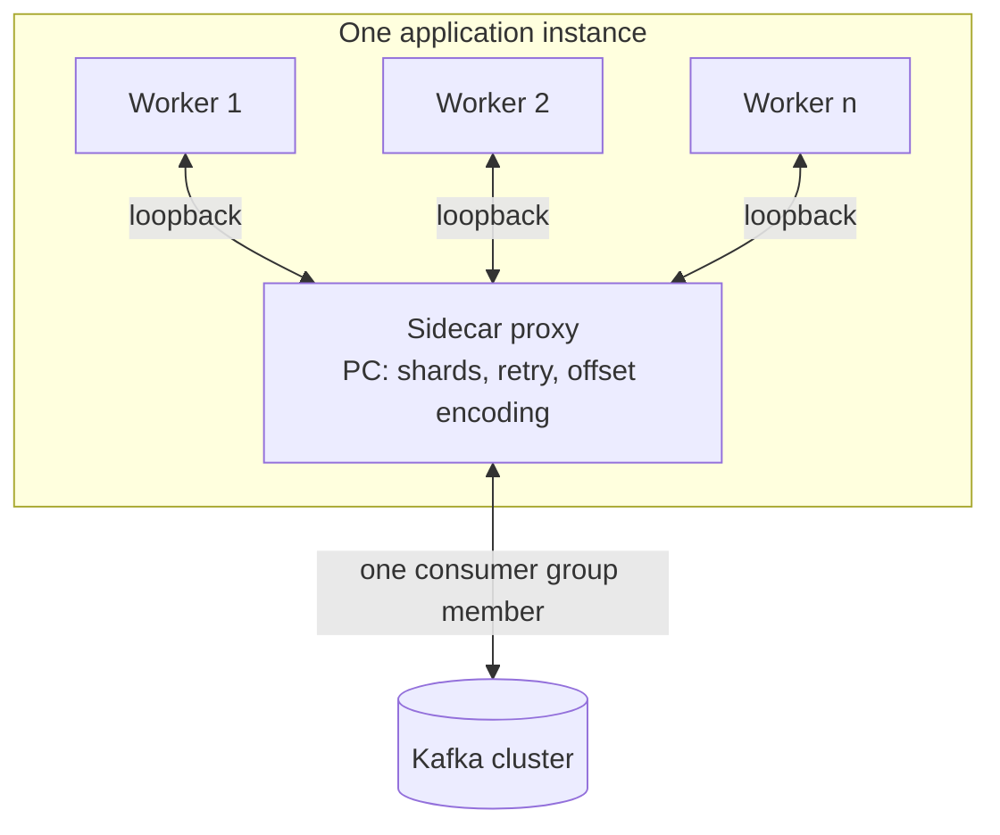
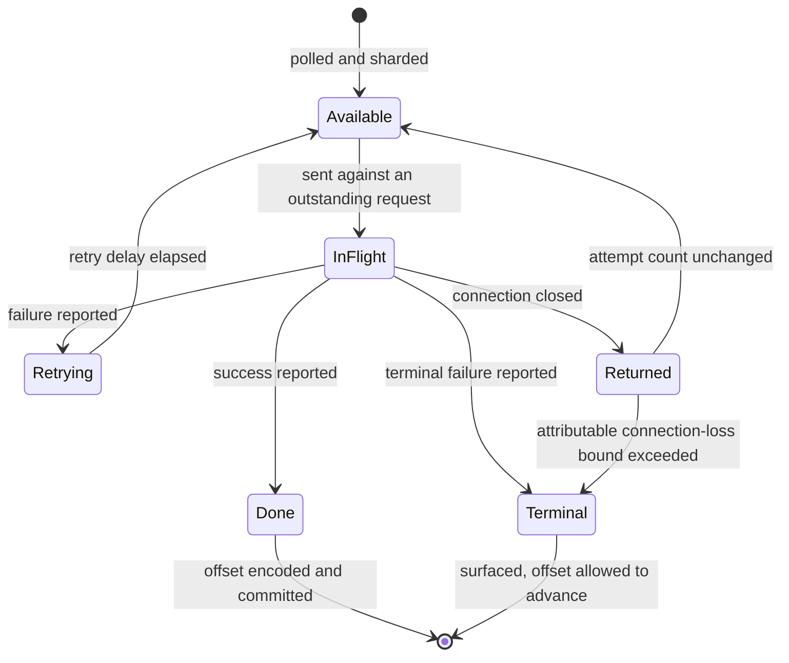

# Language Proxy - Plan

## Goal Capsule

- **Objective:** Give applications written in languages other than Java the parallel consumption Parallel Consumer provides today, by running PC in a sidecar the application's worker processes talk to over loopback, and shipping two client libraries — Python and Go.
- **Product authority:** This plan owns the sidecar proxy, its wire protocol, and its first two client libraries. It does not own the shared multi-tenant server, transactional exactly-once over the wire, or any in-process language binding; those are named non-goals below.
- **Open blockers:** Two. The Go client library's effort budget under R16 has no value, and the latency multiple the first Success Criterion is judged against has no value. Both must be set before the work they gate begins. Eleven further questions are deferred to planning.

---

## Product Contract

### Summary

A sidecar process runs Parallel Consumer and hands records to a non-Java application's worker processes over loopback connections, taking back per-record success and failure. PC keeps ordering, retry and offset committing on its side of the boundary, so the application never encodes offsets, and spreading work across workers gives runtimes with a global interpreter lock real parallelism from one consumer group member. Python ships as the flagship client library and Go as the second, written from the protocol specification alone to prove the specification is complete.

### Problem Frame

Parallel Consumer's value is that a single consumer-group member can process far more records at once than it has partitions, while preserving per-key ordering — and that it handles the machinery this requires: encoding completed work beyond the base commit offset so a restart does not redo it, scheduling per-record retries without stalling the shard, tracking in-flight work across a rebalance, and bounding buffered records against commit progress. All of it is available only to the JVM today.

Broker-native Share Groups (KIP-932, GA on Apache Kafka 4.2) now give any runtime per-message acknowledgement, broker-side delivery counts with poison-message protection, and scaling decoupled from partition count. `README.adoc`'s "When to use this library (vs KIP-932 Share Groups)" section states the territory that remains: key-level ordering with concurrency beyond partition count, and no processing clock. That pair, not the machinery list above, is what a non-Java runtime cannot get today.

The demand is real rather than hypothetical: users have asked for a Python client, and one attempt exists upstream. That attempt, `confluentinc/parallel-consumer#443`, took the in-process route — a JPype/JNI bridge that starts a JVM inside the Python interpreter and ships a Parallel Consumer jar inside the wheel. It was closed unmerged in the 2023-06-15 administrative sweep. The approach gives full API fidelity because the boundary is PC's own Java API, but it requires a JDK in the client's runtime, serialises CPU-bound callbacks behind the GIL, and generalises only to languages with a mature JVM foreign-function bridge — which in practice means Python and nothing else worth shipping.

That demand predates Share Groups reaching GA, and it evidences appetite for parallel consumption in Python rather than for key-ordered concurrency specifically. Whether the people who asked need the narrower claim is an open blocker, not an assumption.

The cost shape of the two routes differs in kind, not degree. An in-process binding pays at runtime, per deployment, forever, and must be written again for every language. A proxy pays once at design time, in protocol fidelity: whatever the protocol does not express is unavailable to every client, and every later PC capability needs a protocol revision.

### Key Decisions

- KD1. **The proxy is a sidecar, not a shared server.** One proxy per application instance, on loopback, with its lifecycle bound to the application's. `STRATEGY.md` states the approach as "a library you add to a pom, invisible to the cluster, needing no broker version, no feature flag, and nobody's permission to deploy"; a shared multi-tenant server forfeits that property, and a sidecar keeps it. A sidecar is still a process rather than a pom entry, which is a partial departure and the closest available one. (session-settled: user-approved — chosen over a shared multi-tenant server: the shared shape competes directly with Kafka REST Proxy and drags in authn, credential brokering, tenant fairness and per-client lease timeouts.) Governs R11, R17, R18.

- KD2. **One PC surface, not two.** No in-process language binding is built or revived, including `confluentinc/parallel-consumer#443`. Two implementations of the same promise would diverge in behaviour, bugs, docs and test coverage, and would hand the users with proven demand the artifact carrying the JDK and GIL costs. (session-settled: user-directed — chosen over a hybrid of a JNI Python binding plus a proxy for other languages: the proxy's own thin client libraries already are the language-support deliverable.) Governs R13, R14, R15.

- KD3. **Latency is a design constraint on the protocol, not a tuning concern.** `STRATEGY.md` makes latency the justification for the whole client-side bet — "a sub-broker that adds latency has no reason to exist" — and names end-to-end record latency as a key metric. A protocol that costs a network round trip per record would undo in the transport what PC wins in the scheduler. Governs R1, R23, R31.

- KD4. **Transactional exactly-once is deferred, and the protocol affordance for it is reserved now.** Offsets are enlisted into the transaction by `sendOffsetsToTransaction` on the same `Producer` instance the user's records went through (`parallel-consumer-core/src/main/java/io/confluent/parallelconsumer/internal/ProducerManager.java`, grep `sendOffsetsToTransaction`), so a worker in another process cannot join that transaction. PC already treats the two as exclusive: `ExternalEngine`'s constructor rejects `PERIODIC_TRANSACTIONAL_PRODUCER` outright. It can only ever work by the proxy producing on the worker's behalf. (session-settled: user-directed — chosen over shipping exactly-once in v1: reserving the acknowledgement payload costs nothing now and avoids a breaking protocol revision later.) Governs R6, R9.

- KD5. **The second client library is a falsification test, not extra coverage.** Go is written from the protocol specification alone, by an author that did not write the proxy, under an effort budget agreed before it starts. A client written alongside the server encodes shared assumptions invisibly; only an independently written one shows whether the specification is complete, and only a budgeted one tests the premise that per-language cost is near zero. (session-settled: user-approved — chosen over Rust and over Node/TypeScript: Go is the maximum contrast to Python on the axis that matters, having real parallelism against Python's GIL-bound threads, and is the language the Kafka operations world already writes.) Governs R15, R16.

- KD6. **The proxy owns terminal failure. It adopts core's destination semantics and defines its own triggers.** PC retries every failed record indefinitely: `PCRetriableException` (`parallel-consumer-core/src/main/java/io/confluent/parallelconsumer/PCRetriableException.java`) only lowers the log level, and there is no maximum-retries option or dead-letter hook. `maxFailureHistory` in `ParallelConsumerOptions` is declared but read nowhere and bounds nothing today (see `docs/inflight/bug-max-failure-history-is-inert.md`). Core has a dead-letter queue scheduled (`docs/data/roadmap.yaml`, entry `dead-letter-queue`, astubbs#149), whose trigger is retry exhaustion. Both of this proxy's triggers — a worker declaring a record terminally failed, and R28's connection-loss bound — have no counterpart there, so the split is deliberate: the proxy adopts core's destination and offset-advance semantics, and defines the triggers itself. Governs R7, R8, R28.

- KD7. **The sidecar targets a native binary, and v1 ships as a JVM process.** A sidecar that is an ordinary JVM process requires a Java runtime wherever the application runs — the same demand that counts against the in-process binding in KD2, so v1's advantage over that binding is not the absent JDK. What v1 does deliver is real parallelism across worker processes per KD8, and one protocol serving every language rather than one bridge per language; the JDK-in-the-runtime advantage arrives only with the native image. (session-settled: user-directed — chosen over shipping the native image in v1 and over accepting a JVM sidecar permanently: the protocol is the risk worth retiring first, and deferring the image keeps its build work off that path.) Governs R24, R25.

- KD8. **One sidecar serves many worker processes of one application.** A single worker process gets whatever concurrency its own runtime allows, which for CPU-bound Python is one core — the same ceiling that counts against the in-process binding in KD2. Distributing work across worker processes lifts it. PC needs no shard-to-worker affinity to make this safe: `ProcessingShard.getWorkIfAvailable` (grep `isOrderRestricted`) already keeps at most one record per shard in flight under KEY and PARTITION ordering, and `ShardManager` pools all shards into one result set, so any record it releases can go to any worker with capacity without breaking R2. This stays single-tenant — one application, one consumer group, one configuration, loopback only — so it does not become the shared server ruled out in KD1. (session-settled: user-approved — chosen over one sidecar per worker process: a protocol where a single connection implicitly owns all the work does not extend to several, so retrofitting this later is a breaking revision rather than an addition.) Governs R11, R26, R27.

- KD9. **Flow control is demand-driven, and credit rides on the acknowledgement.** A worker asks for records as it frees capacity; the sidecar sends at most what has been asked for and never more. The count of outstanding requests is the credit, so there is no advertised capacity figure for the sidecar to trust, no aggregate target to recompute as workers join and leave, and no rule obliging a worker to advertise more than it can process. Because a request travels on the same message as a result report, steady-state processing adds no round trip and KD3's constraint holds structurally rather than by convention. This is the shape HTTP/2 window updates and Reactive Streams demand signalling already use. (session-settled: user-approved — chosen over push with per-worker advertised capacity: the push model needed a trusted capacity number on an unauthenticated surface, an aggregate in-flight target recomputed on every join and leave, and an unenforceable rule that advertised capacity exceed real concurrency — all of which this model removes rather than fixes.) Governs R1, R23, R37.

### Actors

- A1. **Worker** — a non-Java process that holds one connection to the sidecar, requests records, and reports each one succeeded, failed, or terminally failed. An application runs one or more; the single-worker case is just the smallest one.
- A2. **Sidecar proxy** — the process hosting Parallel Consumer, owning shard assignment, retry scheduling and offset committing.
- A3. **Kafka cluster** — unchanged and unaware of the proxy; sees an ordinary consumer group member.
- A4. **Operator** — whoever deploys the application and its sidecar together and configures the consumer.

### Requirements

**Protocol and delivery**

- R1. The proxy hands records to a worker without a network round trip per record.
- R2. Records are delivered under PC's configured ordering, preserving the shard as the unit of ordering.
- R3. A worker reports each record's outcome independently of every other record's, and out of order.
- R4. A failure report returns the record to PC's existing retry scheduling, with the same effect as a user function throwing in-process.
- R5. Each delivered record carries the PC-derived state an in-process user function receives, not only the Kafka record: at minimum the attempt count and the time and reason of the last failure. The failure reason is worker-supplied text that may embed record payload, so it is treated as untrusted input per R8.
- R6. The success report carries an optional payload of records for the proxy to produce. The payload is defined but unused in v1, reserved for exactly-once per KD4.
- R23. A worker requests records as it frees capacity, and the proxy sends at most the number outstanding. A request may travel on the same message as a result report, so a worker that keeps at least one request outstanding while processing receives its next record without an extra exchange.
- R38. A protocol revision keeps client libraries built against earlier revisions working: capabilities are added, never removed or redefined.

**Terminal failure**

- R7. A worker can declare a record terminally failed, and the proxy resolves it rather than retrying it forever, using the destination and offset-advance semantics of core's scheduled dead-letter queue per KD6.
- R8. A terminally failed record is surfaced somewhere durable and reportable rather than silently dropped. That destination preserves the source topic's confidentiality and retention expectations: readable only by the audience already entitled to the source topic, bounded retention, and no record payload written to ordinary application logs. The same constraint applies to the worker-supplied failure reason of R5 wherever it is logged or reported, on the retry path as well as the terminal one, and the proxy bounds its length and strips control characters before it reaches any log.
- R28. The proxy resolves a record through R7 and R8 when connection loss is attributable to that record. The count increments only when the lost worker held the record and no other worker was lost in the same window, and resets whenever any worker subsequently reports that record with an outcome. Application shutdown per F5, fleet-wide worker replacement, and simultaneous losses across workers never increment it. Without an attributable bound, a record that reliably kills its worker is redelivered forever and the partition never advances; without the attribution test, ordinary fleet churn discards healthy records.

**Configuration**

- R9. An enumerated set of `ParallelConsumerOptions` values configures the sidecar in v1: ordering, maximum concurrency, batch size, message buffer size, commit interval, default message retry delay, shutdown timeout and drain timeout, plus commit mode restricted to its two non-transactional values per KD4. All of them are startup configuration on the same channel as R10 and R36, fixed for the process lifetime; no worker sets sidecar-wide options over the protocol.
- R10. The five object-valued options — `consumer`, `producer`, `meterRegistry`, `metricsTags` and `retryDelayProvider` — are not exposed over the protocol; Kafka client settings reach the sidecar as configuration instead.
- R35. The sidecar's Kafka credentials are supplied as configuration rather than command-line arguments, are redacted in any output the sidecar produces — logs at any level, exception messages, stack traces, crash output and operator-facing reports — and are neither readable nor settable over the protocol.
- R36. The sidecar's topic or pattern subscription is supplied as startup configuration alongside R10's Kafka client settings, and is fixed for the process lifetime.
- R37. The sidecar bounds buffered records against commit progress. PC's buffered ceiling is its in-flight target multiplied by a load factor that grows unless pinned, so the sidecar pins it through message buffer size rather than letting it climb, keeping records fetched beyond the committable offset proportional to work actually outstanding.

**Lifecycle**

- R11. The sidecar's lifetime is bound to the application's, not to any single worker: when the application goes, the sidecar exits and its group membership ends, so a vanished application resolves as an ordinary rebalance.
- R12. Shutdown drains or returns in-flight work rather than abandoning it.
- R26. One sidecar serves several worker connections belonging to the same application, and distributes work across them without breaking the ordering R2 governs.
- R27. When a worker connection closes, that worker's unreported records return to PC's scheduling for redelivery. A closed connection is not a failure report and must not consume a retry attempt.
- R33. Zero connected workers is not by itself an end-of-life signal. The sidecar keeps unreported records in PC's scheduling per R27 and exits only on the application-lifetime signal R11 names.

**Packaging**

- R24. The client library starts and supervises one sidecar for the application, so an application author installs one package and never deploys a second thing themselves. Starting several workers must not start several sidecars. The sidecar artifact and its runtime resolve from a location the installed package ships or the operator configures explicitly — never an unqualified path search or a download performed at first run — and a shipped artifact's integrity is verified before it is executed.
- R25. v1 ships the sidecar as a JVM process. No v1 choice may preclude building it as a GraalVM native image later; where the two conflict, the native-image path wins.

**Clients and specification**

- R13. The protocol has a machine-readable specification sufficient to generate a working client library.
- R14. A Python client library ships, idiomatic enough to be the flagship, with generated transport and a hand-finished surface.
- R15. A Go client library ships, written from the specification alone by an author that did not write the proxy, using the same split as R14 — generated transport, hand-finished surface.
- R16. The effort spent on the Go client library is recorded, against a budget agreed before it starts. The budget covers reading the specification, finishing the generated surface, the runnable example of R19, and language-native packaging.

**Security**

- R17. The proxy binds loopback only by default and has no authentication in v1. The protocol carries only record delivery, requests for records, and per-record outcomes — never sidecar configuration.
- R18. Binding to a non-loopback address takes effect only when a separate opt-in setting is also present, whose name states that it exposes an unauthenticated surface capable of advancing the application's offsets, and the proxy warns on startup naming the absence of authentication.
- R29. The proxy rejects any connection whose declared target authority is not in an operator-configurable allowlist, enforced on every connection including loopback binds. The allowlist defaults to the loopback host forms and the configured bind address; a connection declaring no origin is accepted while one declaring an unlisted origin is rejected. The threat is a browser page the operator visits reaching the loopback listener cross-origin, which the trusted-host assumption does not cover because it concerns local processes rather than pages a user visits. Any transport carrying no declarable authority is disqualified as a candidate rather than shipped without the control.

**Documentation and demonstration**

- R19. Each client library ships a runnable example against a real broker.
- R20. One command brings up a broker, the proxy, a workload and a worker using a client library, and shows records being processed concurrently.
- R21. End-user documentation covers installing a client library, running the sidecar, and the ordering and retry semantics. `README.adoc` is generated, so edits belong in `src/docs/README_TEMPLATE.adoc`.

**Proof of the differentiator**

- R22. A test demonstrates a non-Java application processing more records concurrently than the topic has partitions, across several worker processes, under key ordering, with the resulting out-of-order commits surviving a restart without reprocessing completed work.
- R31. v1 measures median and p99 poll-to-completion latency through the proxy and for in-process PC on the same workload, and reports both, so KD3's constraint has evidence.

### Key Flows

- F1. Steady-state processing
  - **Trigger:** One or more workers connect and request records.
  - **Actors:** A1, A2, A3
  - **Steps:** The proxy polls Kafka and assigns records to shards; it sends each worker at most the number of records that worker has outstanding requests for; workers process them concurrently and report each outcome as it completes, carrying a fresh request on the same message; the proxy commits encoded offsets on its own schedule.
  - **Covered by:** R1, R2, R3, R5, R23, R37

- F2. A record fails and is retried
  - **Trigger:** A worker reports a record failed.
  - **Actors:** A1, A2
  - **Steps:** The proxy returns the record to PC's retry scheduling; the record becomes eligible again after the configured delay; it is redelivered with an incremented attempt count.
  - **Covered by:** R4, R5

- F3. A record cannot be processed at all
  - **Trigger:** A worker reports a record terminally failed, or R28's attributable connection-loss bound is exceeded.
  - **Actors:** A1, A2, A4
  - **Steps:** The proxy stops retrying the record, resolves it so the offset can advance, and records it where an operator can find it, distinguishing a worker-declared terminal failure from an attributed connection-loss discard.
  - **Covered by:** R7, R8, R28

- F4. A worker disappears mid-record
  - **Trigger:** One worker process exits or its connection drops while it holds records, while the application keeps running.
  - **Actors:** A1, A2
  - **Steps:** The socket closes; the sidecar returns that worker's unreported records to PC's scheduling per R27; they are redelivered to another worker with their attempt count unchanged, and R28's count increments only if the loss is attributable to a record.
  - **Covered by:** R26, R27, R28

- F5. The application shuts down
  - **Trigger:** The application exits, taking its workers with it.
  - **Actors:** A1, A2, A3
  - **Steps:** The sidecar stops sending records and waits up to a bounded drain timeout for outstanding reports from still-connected workers; it commits what resolves in that window and leaves the rest uncommitted; the sidecar exits per R11; group membership ends; Kafka rebalances the partitions to another member, which resumes from the last committed offset.
  - **Covered by:** R11, R12

- F6. The operator runs the application and its sidecar
  - **Trigger:** An operator deploys the application.
  - **Actors:** A2, A4
  - **Steps:** The operator provisions the runtime the sidecar needs and the configuration R35 and R36 require; the application starts and its client library brings up one sidecar per R24.
  - **Covered by:** R21, R24, R35, R36

### Acceptance Examples

- AE1. **Covers R2.** Given key ordering and two records sharing a key, when both are eligible, then the second is not delivered until the first is reported.
- AE2. **Covers R3.** Given three records in flight, when a worker reports the third successfully and the first two are still running, then the report is accepted, the committed base offset stays behind the unresolved first record, and the third record's completion is carried in the encoded offset metadata so a restart does not reprocess it.
- AE3. **Covers R4, R5.** Given a record reported failed once, when it is redelivered, then it carries an attempt count of one — the number of prior failure reports — and the reason from that failure.
- AE4. **Covers R7.** Given a record reported terminally failed, when the proxy continues running, then that record is never delivered again.
- AE5. **Covers R11.** Given an application holding records, when the application is killed, then the sidecar exits and no further offsets are committed for work no worker reported.
- AE6. **Covers R18.** Given a non-loopback bind address without the separate opt-in, when the proxy starts, then it refuses to start and names the missing opt-in, rather than silently falling back to a loopback bind; with the opt-in present it binds and logs a warning naming the absence of authentication.
- AE7. **Covers R23.** Given a worker with two outstanding requests, when a third record becomes eligible, then it is not sent until the worker requests again.
- AE8. **Covers R2, R26.** Given key ordering and four workers, when two records share a key, then they are never in flight at two workers at once.
- AE9. **Covers R27.** Given a worker holding a record on its second attempt — attempt count one — when that worker is killed, then the record is redelivered still reporting an attempt count of one rather than two.
- AE10. **Covers R24.** Given an application that starts four workers, when it comes up, then exactly one sidecar process exists and one consumer joins the group.
- AE11. **Covers R28.** Given a record whose delivery reliably kills its worker while other workers stay connected, when the attributable bound is reached, then the record resolves through the terminal path with a reason naming worker death and the partition's offset advances.
- AE12. **Covers R29.** Given a connection declaring an origin that is not in the allowlist, when it arrives on a loopback bind, then the proxy rejects it before any record is delivered; given a loopback worker declaring no origin, it connects successfully under the default allowlist.
- AE14. **Covers R12.** Given workers holding records at shutdown, when the drain timeout elapses, then offsets that resolved within the window are committed and the rest are left for redelivery after the rebalance.
- AE15. **Covers R33.** Given every worker disconnecting while the application keeps running, when no worker is connected, then the sidecar keeps its group membership and holds the returned records.
- AE17. **Covers R1, R23.** Given a single-threaded worker that keeps one request outstanding, when it reports a record and requests another on the same message, then its next record arrives without a further exchange.
- AE18. **Covers R28.** Given a record held across a rolling restart of every worker, when the workers reconnect, then the record is redelivered with its connection-loss count unchanged.

### Success Criteria

- End-to-end record latency through the proxy stays within the agreed multiple of the in-process baseline R31 measures. The multiple is an open blocker; `STRATEGY.md` names median and p99 poll-to-completion as the metric.
- The Go client library lands inside its recorded budget without changes to the proxy. Overrunning it, or needing proxy changes to finish, falsifies the premise that per-language client libraries are cheap; no third language client is started until the specification or a generator closes the gap the overrun exposed.
- A reader of the protocol specification alone can implement a client library without reading the proxy's source.
- A developer outside this project completes R22's demonstration in a non-Java runtime using only the shipped client package and R21's documentation, without reading the proxy's source.

### Scope Boundaries

**Deferred for later**

- Transactional exactly-once across the boundary, per KD4.
- Dynamic subscription changes at runtime. v1 takes its subscription from configuration at startup, per R36.
- A GraalVM native image of the sidecar — the target packaging per R25, not v1 content.
- Authentication on the sidecar's own listener, which R17 leaves out of v1 and R18's warning presumes.
- A worker liveness heartbeat. It is an additive protocol revision under R38 rather than a breaking one, and a per-connection liveness timeout is the shape KD1 excluded. The consequence is explicit: v1 detects a worker that dies but not one that hangs, so a hung worker holds its records and its shard's commit progress until its connection closes.
- A protocol conformance suite for third-party client libraries — the route later languages take, not v1 content. Until it exists, community client libraries are unsupported and carry no compatibility promise, and R13's specification is validated by R15's independently written Go client alone.
- Client libraries beyond Python and Go, per the assessment below.

**Later language client libraries**

The baseline a non-Java runtime already has is Share Groups, not hand-rolled threads. Measured against that baseline, the two claims that survive are the ones the Problem Frame names: key-ordered concurrency beyond partition count, and no processing clock. Every candidate below gains those. Runtimes that cannot run application code on more than one core within a single process — a global interpreter lock, no threading, or a single-threaded event loop — additionally gain parallelism they cannot get in-process at all, per KD8.

| Candidate | Needs key ordering? | Additional parallelism gain | Notes |
|---|---|---|---|
| Ruby | Assess before building | Yes — MRI has a global interpreter lock | Multi-process is already how Ruby scales, so KD8's shape matches existing deployment habits. `rdkafka-ruby` is the live client. |
| PHP | Assess before building | Yes — no threading at all | Pure process model; `rdkafka-php` exists. Larger Kafka footprint than usually assumed. |
| TypeScript / Node | Assess before building | Yes for CPU-bound work | Single-threaded event loop handles I/O concurrency well, so the parallelism gain is narrower than Ruby's or PHP's. |
| C# / .NET | Required — nothing else justifies it | No | Real threads, mature async, and a first-class Confluent client. Share Groups already supply unordered concurrency, so only an ordering requirement makes a client worth building. |
| Rust | Required — nothing else justifies it | No | Same position as C#. Smallest Kafka population of the set; best treated as a community contribution once the protocol is stable. |

Excluded rather than deferred: Kotlin and Scala run on the JVM and should use the library directly, where a proxy is strictly worse. Elixir and Erlang already have strong answers on the BEAM.

**Outside this product's identity**

- The shared multi-tenant proxy, per KD1, together with credential brokering, per-client lease timeouts and tenant fairness. Authentication is excluded here only as part of that bundle; the sidecar's own listener auth is deferred above rather than ruled out.
- In-process foreign-function bindings in any language, per KD2.
- Anything Kafka REST Proxy already does: topic browsing, broker administration, cluster views, producing unrelated to a consumed record.

### Dependencies and Assumptions

- `ExternalEngine` (`parallel-consumer-core/src/main/java/io/confluent/parallelconsumer/internal/ExternalEngine.java`) is PC's existing extension point for engines that complete work off the worker thread — the base the vertx, reactor and mutiny modules extend. It already declines to mark a record succeeded until the external system reports back, declines to pipeline into the worker pool, and rejects transactional commit mode, matching KD4. One gap: core has no verdict-free return path. `WorkManager.handleFutureResult` throws on a work container with no success flag, and the only re-queue entry point records the return as a record failure, so R27 and R33 require a core-side return that leaves the failed-attempt count untouched.
- R7, R8 and R28 rest on core's dead-letter queue (astubbs#149, `docs/data/roadmap.yaml`, horizon `next-0x`, `blocks_1_0: false`), which today specifies only a one-line done-condition and carries no design. If it has not landed when the proxy is built, the proxy defines its own terminal resolution against R8's constraints and accepts a later alignment revision under R38.
- R31 has no existing instrument. PC registers only `pc.user.function.processing.time`, and `STRATEGY.md` records end-to-end record latency as not measured today, so R31 includes building poll-to-completion measurement for in-process PC before the proxy's number has a baseline.
- The sidecar reuses the serving work on `feats/web-gui` — Vert.x setup, loopback binding and the host allowlist. Those live in `parallel-consumer-dashboard`, where the port-walking and router assembly are private to `DashboardServer` and only the route handlers and allowlist are public, so extraction is implied rather than a plain import. Lifting code from that branch is sanctioned; this plan is cut from `master` and takes no branch dependency.
- The sidecar does not inherit the dashboard's upward port walking. A bind failure on the configured port is the signal that a sidecar already exists, and the client library attaches to it rather than starting another.
- The dashboard's security posture does not carry over unexamined. It is read-only and rejects write methods; this surface accepts results, so R17, R18 and R29 are its own decisions.
- R15 depends on a second author who did not write the proxy being available once the Python client library and the specification are complete, and on the protocol being frozen from that point — the Success Criterion counts any proxy change made during the Go work as a falsification.
- Assumed: the sidecar's host is trusted, meaning every local process is as privileged as the application itself. Any accepted connection inherits the sidecar's Kafka authority, so it can be handed record payloads and can advance the application's committed offsets, including through R28's discard path.
- Assumed: the operator absorbs a Java runtime per KD7, credentials and subscription configured outside the application per R35 and R36, and a second process to size and observe per F6. v1 produces no artifact addressed to that audience, since R20 and R22 both address the application developer.
- Assumed: shard-level concurrency, not raw throughput, is what makes the proxy worth a process.

### Outstanding Questions

**Resolve Before Planning**

- The Go client library's effort budget under R16 — a concrete figure, its unit, and who agrees and records it before work starts.
- The latency multiple the first Success Criterion is judged against — a concrete multiple of the in-process baseline for median and p99, agreed and recorded before protocol design starts, since KD3 makes it a design constraint rather than a measurement taken afterwards.
- Whether the users who asked for a Python client need key-ordered concurrency, or the parallel consumption Share Groups now supply. One conversation with a requesting user settles it; discovering it after the build does not.

**Deferred to Planning**

- Whether the client library manages the sidecar's lifecycle in v1 at all. R24 puts cross-process single-instance election, runtime discovery and supervision in v1, whose stated payoff waits on the deferred native image; the alternative is an operator-started sidecar the library connects to by configuration. The two questions below fall away under that alternative.
- Which process owns the sidecar's lifetime, given R11 binds it to the application while R24 puts supervision in a library instance running inside each worker, and F4 requires the sidecar to survive any single worker exiting.
- How a worker discovers the sidecar's endpoint without being configured with a port.
- How a Python wheel or Go module obtains the Java runtime R25 requires in v1.
- Which transport and specification format carries the protocol. It must supply a declarable connection authority for R29 and full-duplex framing for R23. WebSockets are the leading candidate: the connection opens as an ordinary HTTP upgrade, so it reuses the existing serving surface, and a client is small enough to hand-write, which is what R16 measures. The reasoning against a streaming RPC framework rests on an unverified claim — that it is materially harder to build under GraalVM native image than plain Vert.x, which R25 makes load-bearing. **Verify that claim before settling the transport.** Whatever is chosen must carry a machine-readable schema to satisfy R13.
- Where terminally failed records go under R8, within its confidentiality and retention constraints, and whether resolution and durable recording must be atomic.
- What value R28's attributable bound takes, and whether it is expressed as a count or a rate over a window.
- How work is distributed across workers with outstanding requests when supply is scarce, so one worker cannot absorb everything its peers asked for.
- The maturity and support posture of the Python and Go client libraries, in the vocabulary `docs/data/module-maturity.yaml` uses.
- The roadmap horizon this takes in `docs/data/roadmap.yaml` and which entries it sequences after.
- How much of `PollContext` is worth projecting under R5 beyond the named minimum.

### Sources and Research

- `STRATEGY.md` — the client-side approach, the latency constraint, and the Flexibility track that already names an HTTP endpoint server as a candidate.
- `CONCEPTS.md` — shard, in-flight work, control loop, produce lock and commit lock as the canonical vocabulary.
- `README.adoc` — grep `Share Groups` for the comparison that bounds this proxy's claim against KIP-932.
- `docs/data/roadmap.yaml` — grep `dead-letter-queue` for the core terminal-failure work KD6 adopts a destination from.
- `parallel-consumer-core/src/main/java/io/confluent/parallelconsumer/ParallelConsumerOptions.java` — grep `enum ProcessingOrder` for the ordering modes, `DEFAULT_MAX_CONCURRENCY` for the in-flight ceiling, and `retryDelayProvider` for the one function-valued option a wire protocol cannot carry.
- `parallel-consumer-core/src/main/java/io/confluent/parallelconsumer/PCRetriableException.java` — the only user-throwable signalling type, and the evidence for KD6.
- `parallel-consumer-core/src/main/java/io/confluent/parallelconsumer/internal/ExternalEngine.java` — the existing extension point for out-of-thread completion, and its refusal of transactional commit mode.
- `parallel-consumer-core/src/main/java/io/confluent/parallelconsumer/internal/ProducerManager.java` — grep `sendOffsetsToTransaction` for why exactly-once cannot cross a process boundary.
- `parallel-consumer-core/src/main/java/io/confluent/parallelconsumer/state/ProcessingShard.java` — grep `isOrderRestricted` for the one-record-per-shard rule KD8 rests on.
- `parallel-consumer-core/src/main/java/io/confluent/parallelconsumer/internal/DynamicLoadFactor.java` — why R37 pins the buffered ceiling rather than letting it climb.
- `docs/inflight/bug-max-failure-history-is-inert.md` — why `maxFailureHistory` bounds nothing today.
- `docs/plans/2026-08-07-002-feat-embedded-web-dashboard-plan.md` on `feats/web-gui` — the precedent for a new opt-in module, its one-command demonstration, and the bar that each capability must be something existing tools cannot provide.
- `confluentinc/parallel-consumer#154` (mirrored as `astubbs/parallel-consumer#242`) — the original proxy proposal.
- `confluentinc/parallel-consumer#443` — the JPype in-process binding, closed unmerged in the 2023-06-15 sweep.
