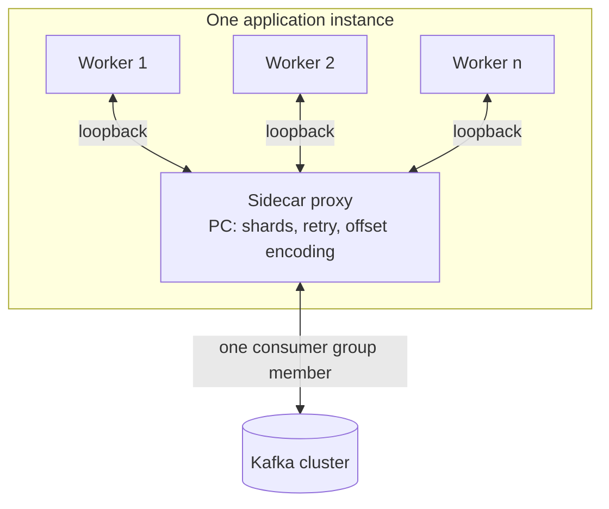
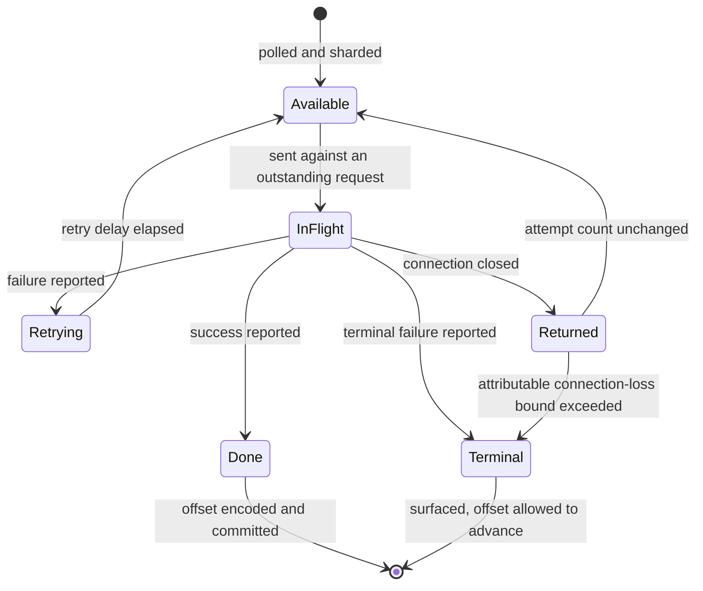
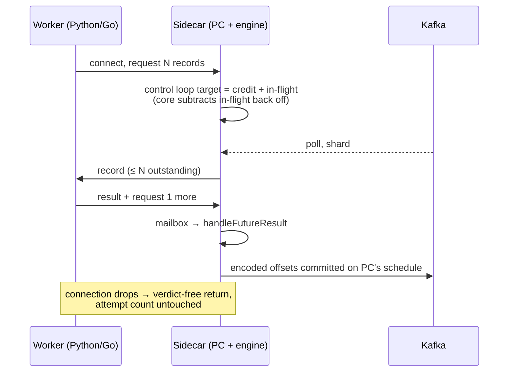

# Language Proxy - Plan

## Goal Capsule

- **Objective:** Give applications written in languages other than Java the key-ordered concurrency beyond partition count that Parallel Consumer provides today, by running PC in a sidecar the application's worker processes talk to over loopback, and shipping two client libraries — Python and Go.
- **Product authority:** This plan owns the sidecar proxy, its wire protocol, and its first two client libraries. It does not own the shared multi-tenant server, transactional exactly-once over the wire, or any in-process language binding; those are named non-goals below.
- **Open blockers:** None blocking a start. Two values had no owner and are recorded as explicit assumptions in the Planning Contract (ASM1, ASM2); each names what would falsify it. ASM3, the demand question, is settled — see ASM3.
- **Product Contract preservation:** no R-, A-, F- or AE-ID has been added, removed or renumbered. The 2026-08-12 review round changed the following, and nothing else. **Two requirements reworded:** R9 drops its exposed `batch size` option, which contradicts R3 outright because core gives one completion verdict per batch while R3 requires per-record outcomes (KTD8 records why); and R37 corrects a false premise about PC's load factor, which does not climb for this engine. **Four prose passages corrected** where they had gone stale against later decisions: the Objective, narrowed from "parallel consumption" to the key-ordered concurrency the Problem Frame actually claims; the Problem Frame's ASM3 sentence, now that the demand question is settled; the Success Criteria latency multiple; and the sanctioned code-lifting sentence KTD5 supersedes. **One scope bullet gained content:** the deferred native image now records that U1 builds one per candidate as a feasibility gate. **Outstanding Questions was restructured** into answered-and-still-open, with no question dropped.

---

## Product Contract

### Summary

A sidecar process runs Parallel Consumer and hands records to a non-Java application's worker processes over loopback connections, taking back per-record success and failure. PC keeps ordering, retry and offset committing on its side of the boundary, so the application never encodes offsets, and spreading work across workers gives runtimes with a global interpreter lock real parallelism from one consumer group member. Python ships as the flagship client library and Go as the second, written from the protocol specification alone to prove the specification is complete.

### Problem Frame

Parallel Consumer's value is that a single consumer-group member can process far more records at once than it has partitions, while preserving per-key ordering — and that it handles the machinery this requires: encoding completed work beyond the base commit offset so a restart does not redo it, scheduling per-record retries without stalling the shard, tracking in-flight work across a rebalance, and bounding buffered records against commit progress. All of it is available only to the JVM today.

Broker-native Share Groups (KIP-932, GA on Apache Kafka 4.2) now give any runtime per-message acknowledgement, broker-side delivery counts with poison-message protection, and scaling decoupled from partition count. `README.adoc`'s "When to use this library (vs KIP-932 Share Groups)" section states the territory that remains: key-level ordering with concurrency beyond partition count, and no processing clock. That pair, not the machinery list above, is what a non-Java runtime cannot get today.

The demand is real rather than hypothetical: users have asked for a Python client, and one attempt exists upstream. That attempt, `confluentinc/parallel-consumer#443`, took the in-process route — a JPype/JNI bridge that starts a JVM inside the Python interpreter and ships a Parallel Consumer jar inside the wheel. It was closed unmerged in the 2023-06-15 administrative sweep. The approach gives full API fidelity because the boundary is PC's own Java API, but it requires a JDK in the client's runtime, serialises CPU-bound callbacks behind the GIL, and generalises only to languages with a mature JVM foreign-function bridge — which in practice means Python and nothing else worth shipping.

That demand predates Share Groups reaching GA, so it could have evidenced appetite for parallel consumption in Python rather than for key-ordered concurrency specifically. It does not: conversations with requesting users confirm the narrower claim is what they need. ASM3 records the settlement.

The cost shape of the two routes differs in kind, not degree. An in-process binding pays at runtime, per deployment, forever, and must be written again for every language. A proxy pays once at design time, in protocol fidelity: whatever the protocol does not express is unavailable to every client, and every later PC capability needs a protocol revision.

### Key Decisions

- KD1. **The proxy is a sidecar, not a shared server.** One proxy per application instance, on loopback, with its lifecycle bound to the application's. `STRATEGY.md` states the approach as "a library you add to a pom, invisible to the cluster, needing no broker version, no feature flag, and nobody's permission to deploy"; a shared multi-tenant server forfeits that property, and a sidecar keeps it. A sidecar is still a process rather than a pom entry, which is a partial departure and the closest available one. (session-settled: user-approved — chosen over a shared multi-tenant server: the shared shape competes directly with Kafka REST Proxy and drags in authn, credential brokering, tenant fairness and per-client lease timeouts.) Governs R11, R17, R18.

- KD2. **One PC surface, not two.** No in-process language binding is built or revived, including `confluentinc/parallel-consumer#443`. Two implementations of the same promise would diverge in behaviour, bugs, docs and test coverage, and would hand the users with proven demand the artifact carrying the JDK and GIL costs. (session-settled: user-directed — chosen over a hybrid of a JNI Python binding plus a proxy for other languages: the proxy's own thin client libraries already are the language-support deliverable.) Governs R13, R14, R15.

- KD3. **Latency is a design constraint on the protocol, not a tuning concern.** `STRATEGY.md` makes latency the justification for the whole client-side bet — "a sub-broker that adds latency has no reason to exist" — and names end-to-end record latency as a key metric. A protocol that costs a network round trip per record would undo in the transport what PC wins in the scheduler. Governs R1, R23, R31.

- KD4. **Transactional exactly-once is deferred, and the protocol affordance for it is reserved now.** Offsets are enlisted into the transaction by `sendOffsetsToTransaction` on the same `Producer` instance the user's records went through (`parallel-consumer-core/src/main/java/io/confluent/parallelconsumer/internal/ProducerManager.java`, grep `sendOffsetsToTransaction`), so a worker in another process cannot join that transaction. PC already treats the two as exclusive: `ExternalEngine`'s constructor rejects `PERIODIC_TRANSACTIONAL_PRODUCER` outright. It can only ever work by the proxy producing on the worker's behalf. (session-settled: user-directed — chosen over shipping exactly-once in v1: reserving the acknowledgement payload costs nothing now and avoids a breaking protocol revision later.) Governs R6, R9.

- KD5. **The second client library is a falsification test, not extra coverage.** Go is written from the protocol specification alone, by an author that did not write the proxy, under an effort budget agreed before it starts. A client written alongside the server encodes shared assumptions invisibly; only an independently written one shows whether the specification is complete, and only a budgeted one tests the premise that per-language cost is near zero. (session-settled: user-approved — chosen over Rust and over Node/TypeScript: Go is the maximum contrast to Python on the axis that matters, having real parallelism against Python's GIL-bound threads, and is the language the Kafka operations world already writes.) Governs R15, R16.

- KD6. **The proxy owns terminal failure. It adopts core's destination semantics and defines its own triggers.** PC retries every failed record indefinitely: `PCRetriableException` (`parallel-consumer-core/src/main/java/io/confluent/parallelconsumer/PCRetriableException.java`) only lowers the log level, and there is no maximum-retries option or dead-letter hook. `maxFailureHistory` in `ParallelConsumerOptions` is declared but read nowhere and bounds nothing today (see `docs/inflight/bug-max-failure-history-is-inert.md`). Core has a dead-letter queue scheduled (`docs/data/roadmap.yaml`, entry `dead-letter-queue`, astubbs#149), whose trigger is retry exhaustion. Both of this proxy's triggers — a worker declaring a record terminally failed, and R28's connection-loss bound — have no counterpart there, so the split is deliberate: the proxy adopts core's destination and offset-advance semantics, and defines the triggers itself. Governs R7, R8, R28.

- KD7. **The sidecar targets a native binary, and v1 ships as a JVM process.** A sidecar that is an ordinary JVM process requires a Java runtime wherever the application runs — the same demand that counts against the in-process binding in KD2, so v1's advantage over that binding is not the absent JDK. What v1 does deliver is real parallelism across worker processes per KD8, and one protocol serving every language rather than one bridge per language; the JDK-in-the-runtime advantage arrives only with the native image. (session-settled: user-directed — chosen over shipping the native image in v1 and over accepting a JVM sidecar permanently: the protocol is the risk worth retiring first, and deferring the image keeps its build work off that path.) Governs R24, R25.

- KD8. **One sidecar serves many worker processes of one application.** A single worker process gets whatever concurrency its own runtime allows, which for CPU-bound Python is one core — the same ceiling that counts against the in-process binding in KD2. Distributing work across worker processes lifts it. PC needs no shard-to-worker affinity to make this safe: `ProcessingShard.getWorkIfAvailable` (grep `isOrderRestricted`) already keeps at most one record per shard in flight under KEY and PARTITION ordering, and `ShardManager` pools all shards into one result set, so any record it releases can go to any worker with capacity without breaking R2. This stays single-tenant — one application, one consumer group, one configuration, loopback only — so it does not become the shared server ruled out in KD1. (session-settled: user-approved — chosen over one sidecar per worker process: a protocol where a single connection implicitly owns all the work does not extend to several, so retrofitting this later is a breaking revision rather than an addition.) Governs R11, R26, R27.

- KD9. **Flow control is demand-driven, and credit rides on the acknowledgement.** A worker asks for records as it frees capacity; the sidecar sends at most what has been asked for and never more. The count of outstanding requests is the credit, so there is no advertised capacity figure for the sidecar to trust, no aggregate target to recompute as workers join and leave, and no rule obliging a worker to advertise more than it can process. Because a request travels on the same message as a result report, steady-state processing adds no round trip and KD3's constraint holds structurally rather than by convention. This is the shape HTTP/2 window updates and Reactive Streams demand signalling already use. (session-settled: user-approved — chosen over push with per-worker advertised capacity: the push model needed a trusted capacity number on an unauthenticated surface, an aggregate in-flight target recomputed on every join and leave, and an unenforceable rule that advertised capacity exceed real concurrency — all of which this model removes rather than fixes.) Governs R1, R23, R37.

### Actors

- A1. **Worker** — a non-Java process that holds one connection to the sidecar, requests records, and reports each one succeeded, failed, or terminally failed. An application runs one or more; the single-worker case is just the smallest one.
- A2. **Sidecar proxy** — the process hosting Parallel Consumer, owning shard assignment, retry scheduling and offset committing.
- A3. **Kafka cluster** — unchanged and unaware of the proxy; sees an ordinary consumer group member.
- A4. **Operator** — whoever deploys the application and its sidecar together and configures the consumer.

### Requirements

**Protocol and delivery**

- R1. The proxy hands records to a worker without a network round trip per record.
- R2. Records are delivered under PC's configured ordering, preserving the shard as the unit of ordering.
- R3. A worker reports each record's outcome independently of every other record's, and out of order.
- R4. A failure report returns the record to PC's existing retry scheduling, with the same effect as a user function throwing in-process.
- R5. Each delivered record carries the PC-derived state an in-process user function receives, not only the Kafka record: at minimum the attempt count and the time and reason of the last failure. The failure reason is worker-supplied text that may embed record payload, so it is treated as untrusted input per R8.
- R6. The success report carries an optional payload of records for the proxy to produce. The payload is defined but unused in v1, reserved for exactly-once per KD4.
- R23. A worker requests records as it frees capacity, and the proxy sends at most the number outstanding. A request may travel on the same message as a result report, so a worker that keeps at least one request outstanding while processing receives its next record without an extra exchange.
- R38. A protocol revision keeps client libraries built against earlier revisions working: capabilities are added, never removed or redefined.

**Terminal failure**

- R7. A worker can declare a record terminally failed, and the proxy resolves it rather than retrying it forever, using the destination and offset-advance semantics of core's scheduled dead-letter queue per KD6.
- R8. A terminally failed record is surfaced somewhere durable and reportable rather than silently dropped. That destination preserves the source topic's confidentiality and retention expectations: readable only by the audience already entitled to the source topic, bounded retention, and no record payload written to ordinary application logs. The same constraint applies to the worker-supplied failure reason of R5 wherever it is logged or reported, on the retry path as well as the terminal one, and the proxy bounds its length and strips control characters before it reaches any log.
- R28. The proxy resolves a record through R7 and R8 when connection loss is attributable to that record. The count increments only when the lost worker held the record and no other worker was lost in the same window, and resets whenever any worker subsequently reports that record with an outcome. Application shutdown per F5, fleet-wide worker replacement, and simultaneous losses across workers never increment it. Without an attributable bound, a record that reliably kills its worker is redelivered forever and the partition never advances; without the attribution test, ordinary fleet churn discards healthy records.

**Configuration**

- R9. An enumerated set of `ParallelConsumerOptions` values configures the sidecar in v1: ordering, maximum concurrency, message buffer size, commit interval, default message retry delay, shutdown timeout and drain timeout, plus commit mode restricted to its two non-transactional values per KD4. All of them are startup configuration on the same channel as R10 and R36, fixed for the process lifetime; no worker sets sidecar-wide options over the protocol. Batch size is deliberately absent and is pinned internally to one per KTD8, because a batch shares a single completion verdict and R3 requires per-record outcomes. Maximum concurrency is retained but, under the credit model, bounds neither concurrency nor buffering; R37 explains what actually sets the buffered ceiling, and whether the option should be withdrawn is recorded as still open.
- R10. The five object-valued options — `consumer`, `producer`, `meterRegistry`, `metricsTags` and `retryDelayProvider` — are not exposed over the protocol; Kafka client settings reach the sidecar as configuration instead.
- R35. The sidecar's Kafka credentials are supplied as configuration rather than command-line arguments, are redacted in any output the sidecar produces — logs at any level, exception messages, stack traces, crash output and operator-facing reports — and are neither readable nor settable over the protocol.
- R36. The sidecar's topic or pattern subscription is supplied as startup configuration alongside R10's Kafka client settings, and is fixed for the process lifetime.
- R37. The sidecar bounds buffered records against commit progress by setting message buffer size. PC's buffered ceiling is its in-flight target multiplied by a load factor, and setting message buffer size makes `PCModule.initDynamicLoadFactor` construct that factor with its minimum equal to its maximum at `ceil(bufferSize / target)`, so the ceiling tracks the buffer figure rather than the concurrency setting. Two corrections to an earlier reading: the factor does not climb for this engine in any case, because `ExternalEngine` overrides `checkPipelinePressure` to a no-op and that method is the only caller of the step-up; and maximum concurrency therefore never becomes the buffer ceiling, so no reconciliation between the two is needed.

**Lifecycle**

- R11. The sidecar's lifetime is bound to the application's, not to any single worker: when the application goes, the sidecar exits and its group membership ends, so a vanished application resolves as an ordinary rebalance.
- R12. Shutdown drains or returns in-flight work rather than abandoning it.
- R26. One sidecar serves several worker connections belonging to the same application, and distributes work across them without breaking the ordering R2 governs.
- R27. When a worker connection closes, that worker's unreported records return to PC's scheduling for redelivery. A closed connection is not a failure report and must not consume a retry attempt.
- R33. Zero connected workers is not by itself an end-of-life signal. The sidecar keeps unreported records in PC's scheduling per R27 and exits only on the application-lifetime signal R11 names.

**Packaging**

- R24. The client library starts and supervises one sidecar for the application, so an application author installs one package and never deploys a second thing themselves. Starting several workers must not start several sidecars. The sidecar artifact and its runtime resolve from a location the installed package ships or the operator configures explicitly — never an unqualified path search or a download performed at first run — and a shipped artifact's integrity is verified before it is executed.
- R25. v1 ships the sidecar as a JVM process. No v1 choice may preclude building it as a GraalVM native image later; where the two conflict, the native-image path wins.

**Clients and specification**

- R13. The protocol has a machine-readable specification sufficient to generate a working client library.
- R14. A Python client library ships, idiomatic enough to be the flagship, with generated transport and a hand-finished surface.
- R15. A Go client library ships, written from the specification alone by an author that did not write the proxy, using the same split as R14 — generated transport, hand-finished surface.
- R16. The effort spent on the Go client library is recorded, against a budget agreed before it starts. The budget covers reading the specification, finishing the generated surface, the runnable example of R19, and language-native packaging.

**Security**

- R17. The proxy binds loopback only by default and has no authentication in v1. The protocol carries only record delivery, requests for records, and per-record outcomes — never sidecar configuration.
- R18. Binding to a non-loopback address takes effect only when a separate opt-in setting is also present, whose name states that it exposes an unauthenticated surface capable of advancing the application's offsets, and the proxy warns on startup naming the absence of authentication.
- R29. The proxy rejects any connection whose declared target authority is not in an operator-configurable allowlist, enforced on every connection including loopback binds. The allowlist defaults to the loopback host forms and the configured bind address; a connection declaring no origin is accepted while one declaring an unlisted origin is rejected. The threat is a browser page the operator visits reaching the loopback listener cross-origin, which the trusted-host assumption does not cover because it concerns local processes rather than pages a user visits. Any transport carrying no declarable authority is disqualified as a candidate rather than shipped without the control.

**Documentation and demonstration**

- R19. Each client library ships a runnable example against a real broker.
- R20. One command brings up a broker, the proxy, a workload and a worker using a client library, and shows records being processed concurrently.
- R21. End-user documentation covers installing a client library, running the sidecar, and the ordering and retry semantics. `README.adoc` is generated, so edits belong in `src/docs/README_TEMPLATE.adoc`.

**Proof of the differentiator**

- R22. A test demonstrates a non-Java application processing more records concurrently than the topic has partitions, across several worker processes, under key ordering, with the resulting out-of-order commits surviving a restart without reprocessing completed work.
- R31. v1 measures median and p99 poll-to-completion latency through the proxy and for in-process PC on the same workload, and reports both, so KD3's constraint has evidence.

### Key Flows

- F1. Steady-state processing
  - **Trigger:** One or more workers connect and request records.
  - **Actors:** A1, A2, A3
  - **Steps:** The proxy polls Kafka and assigns records to shards; it sends each worker at most the number of records that worker has outstanding requests for; workers process them concurrently and report each outcome as it completes, carrying a fresh request on the same message; the proxy commits encoded offsets on its own schedule.
  - **Covered by:** R1, R2, R3, R5, R23, R37

- F2. A record fails and is retried
  - **Trigger:** A worker reports a record failed.
  - **Actors:** A1, A2
  - **Steps:** The proxy returns the record to PC's retry scheduling; the record becomes eligible again after the configured delay; it is redelivered with an incremented attempt count.
  - **Covered by:** R4, R5

- F3. A record cannot be processed at all
  - **Trigger:** A worker reports a record terminally failed, or R28's attributable connection-loss bound is exceeded.
  - **Actors:** A1, A2, A4
  - **Steps:** The proxy stops retrying the record, resolves it so the offset can advance, and records it where an operator can find it, distinguishing a worker-declared terminal failure from an attributed connection-loss discard.
  - **Covered by:** R7, R8, R28

- F4. A worker disappears mid-record
  - **Trigger:** One worker process exits or its connection drops while it holds records, while the application keeps running.
  - **Actors:** A1, A2
  - **Steps:** The socket closes; the sidecar returns that worker's unreported records to PC's scheduling per R27; they are redelivered to another worker with their attempt count unchanged, and R28's count increments only if the loss is attributable to a record.
  - **Covered by:** R26, R27, R28

- F5. The application shuts down
  - **Trigger:** The application exits, taking its workers with it.
  - **Actors:** A1, A2, A3
  - **Steps:** The sidecar stops sending records and waits up to a bounded drain timeout for outstanding reports from still-connected workers; it commits what resolves in that window and leaves the rest uncommitted; the sidecar exits per R11; group membership ends; Kafka rebalances the partitions to another member, which resumes from the last committed offset.
  - **Covered by:** R11, R12

- F6. The operator runs the application and its sidecar
  - **Trigger:** An operator deploys the application.
  - **Actors:** A2, A4
  - **Steps:** The operator provisions the runtime the sidecar needs and the configuration R35 and R36 require; the application starts and its client library brings up one sidecar per R24.
  - **Covered by:** R21, R24, R35, R36

### Acceptance Examples

- AE1. **Covers R2.** Given key ordering and two records sharing a key, when both are eligible, then the second is not delivered until the first is reported.
- AE2. **Covers R3.** Given three records in flight, when a worker reports the third successfully and the first two are still running, then the report is accepted, the committed base offset stays behind the unresolved first record, and the third record's completion is carried in the encoded offset metadata so a restart does not reprocess it.
- AE3. **Covers R4, R5.** Given a record reported failed once, when it is redelivered, then it carries an attempt count of one — the number of prior failure reports — and the reason from that failure.
- AE4. **Covers R7.** Given a record reported terminally failed, when the proxy continues running, then that record is never delivered again.
- AE5. **Covers R11.** Given an application holding records, when the application is killed, then the sidecar exits and no further offsets are committed for work no worker reported.
- AE6. **Covers R18.** Given a non-loopback bind address without the separate opt-in, when the proxy starts, then it refuses to start and names the missing opt-in, rather than silently falling back to a loopback bind; with the opt-in present it binds and logs a warning naming the absence of authentication.
- AE7. **Covers R23.** Given a worker with two outstanding requests, when a third record becomes eligible, then it is not sent until the worker requests again.
- AE8. **Covers R2, R26.** Given key ordering and four workers, when two records share a key, then they are never in flight at two workers at once.
- AE9. **Covers R27.** Given a worker holding a record on its second attempt — attempt count one — when that worker is killed, then the record is redelivered still reporting an attempt count of one rather than two.
- AE10. **Covers R24.** Given an application that starts four workers, when it comes up, then exactly one sidecar process exists and one consumer joins the group.
- AE11. **Covers R28.** Given a record whose delivery reliably kills its worker while other workers stay connected, when the attributable bound is reached, then the record resolves through the terminal path with a reason naming worker death and the partition's offset advances.
- AE12. **Covers R29.** Given a connection declaring an origin that is not in the allowlist, when it arrives on a loopback bind, then the proxy rejects it before any record is delivered; given a loopback worker declaring no origin, it connects successfully under the default allowlist.
- AE14. **Covers R12.** Given workers holding records at shutdown, when the drain timeout elapses, then offsets that resolved within the window are committed and the rest are left for redelivery after the rebalance.
- AE15. **Covers R33.** Given every worker disconnecting while the application keeps running, when no worker is connected, then the sidecar keeps its group membership and holds the returned records.
- AE17. **Covers R1, R23.** Given a single-threaded worker that keeps one request outstanding, when it reports a record and requests another on the same message, then its next record arrives without a further exchange.
- AE18. **Covers R28.** Given a record held across a rolling restart of every worker, when the workers reconnect, then the record is redelivered with its connection-loss count unchanged.

### Success Criteria

- End-to-end record latency through the proxy stays within the multiple of the in-process baseline R31 measures. ASM2 sets that multiple at p99 within 1.5× and median within 1.25×; `STRATEGY.md` names median and p99 poll-to-completion as the metric.
- The Go client library lands inside its recorded budget without changes to the proxy. Overrunning it, or needing proxy changes to finish, falsifies the premise that per-language client libraries are cheap; no third language client is started until the specification or a generator closes the gap the overrun exposed.
- A reader of the protocol specification alone can implement a client library without reading the proxy's source.
- A developer outside this project completes R22's demonstration in a non-Java runtime using only the shipped client package and R21's documentation, without reading the proxy's source.

### Scope Boundaries

**Deferred for later**

- Transactional exactly-once across the boundary, per KD4.
- Dynamic subscription changes at runtime. v1 takes its subscription from configuration at startup, per R36.
- A GraalVM native image of the sidecar — the target packaging per R25, not v1 content. U1 builds a native image of a minimal hand-out loop as a feasibility gate, because R25 makes the image win any conflict and discovering the conflict after clients ship is unrecoverable under R38. That gate is a throwaway check, not a shipped artifact.
- Authentication on the sidecar's own listener, which R17 leaves out of v1 and R18's warning presumes.
- A worker liveness heartbeat. It is an additive protocol revision under R38 rather than a breaking one, and a per-connection liveness timeout is the shape KD1 excluded. The consequence is explicit: v1 detects a worker that dies but not one that hangs, so a hung worker holds its records and its shard's commit progress until its connection closes.
- Client libraries beyond Python and Go, per the assessment below.

**Later language client libraries**

The baseline a non-Java runtime already has is Share Groups, not hand-rolled threads. Measured against that baseline, the two claims that survive are the ones the Problem Frame names: key-ordered concurrency beyond partition count, and no processing clock. Every candidate below gains those. Runtimes that cannot run application code on more than one core within a single process — a global interpreter lock, no threading, or a single-threaded event loop — additionally gain parallelism they cannot get in-process at all, per KD8.

| Candidate | Needs key ordering? | Additional parallelism gain | Notes |
|---|---|---|---|
| Ruby | Assess before building | Yes — MRI has a global interpreter lock | Multi-process is already how Ruby scales, so KD8's shape matches existing deployment habits. `rdkafka-ruby` is the live client. |
| PHP | Assess before building | Yes — no threading at all | Pure process model; `rdkafka-php` exists. Larger Kafka footprint than usually assumed. |
| TypeScript / Node | Assess before building | Yes for CPU-bound work | Single-threaded event loop handles I/O concurrency well, so the parallelism gain is narrower than Ruby's or PHP's. |
| C# / .NET | Required — nothing else justifies it | No | Real threads, mature async, and a first-class Confluent client. Share Groups already supply unordered concurrency, so only an ordering requirement makes a client worth building. |
| Rust | Required — nothing else justifies it | No | Same position as C#. Smallest Kafka population of the set, so it sequences last. |

Excluded rather than deferred: Kotlin and Scala run on the JVM and should use the library directly, where a proxy is strictly worse. Elixir and Erlang already have strong answers on the BEAM.

Client libraries live in this repository and are generated from the protocol specification, not maintained as separate downstream projects. A new language arrives as a pull request here, so the repository's build owns the code-generation toolchain and its CI covers every client. No conformance suite for third-party implementations is scoped, because there are no third-party implementations to police. The bar R13's specification must clear is therefore generation quality for the languages above, not implementability by a stranger working from prose.

**Outside this product's identity**

- The shared multi-tenant proxy, per KD1, together with credential brokering, per-client lease timeouts and tenant fairness. Authentication is excluded here only as part of that bundle; the sidecar's own listener auth is deferred above rather than ruled out.
- In-process foreign-function bindings in any language, per KD2.
- Anything Kafka REST Proxy already does: topic browsing, broker administration, cluster views, producing unrelated to a consumed record.

### Dependencies and Assumptions

- `ExternalEngine` (`parallel-consumer-core/src/main/java/io/confluent/parallelconsumer/internal/ExternalEngine.java`) is PC's existing extension point for engines that complete work off the worker thread — the base the vertx, reactor and mutiny modules extend. It already declines to mark a record succeeded until the external system reports back, declines to pipeline into the worker pool, and rejects transactional commit mode, matching KD4. One gap: core has no verdict-free return path. `WorkManager.handleFutureResult` throws on a work container with no success flag, and the only re-queue entry point records the return as a record failure, so R27 and R33 require a core-side return that leaves the failed-attempt count untouched.
- R7, R8 and R28 rest on core's dead-letter queue (astubbs#149, `docs/data/roadmap.yaml`, horizon `next-0x`, `blocks_1_0: false`), which today specifies only a one-line done-condition and carries no design. If it has not landed when the proxy is built, the proxy defines its own terminal resolution against R8's constraints and accepts a later alignment revision under R38.
- R31 has no existing instrument. PC registers only `pc.user.function.processing.time`, and `STRATEGY.md` records end-to-end record latency as not measured today, so R31 includes building poll-to-completion measurement for in-process PC before the proxy's number has a baseline.
- The serving work on `feats/web-gui` — Vert.x setup, loopback binding and the host allowlist — solves the same shape of problem. Those live in `parallel-consumer-dashboard`, where the port-walking and router assembly are private to `DashboardServer` and only the route handlers and allowlist are public, so extraction is implied rather than a plain import. **KTD5 supersedes any lifting**: the guards are written fresh in this module rather than copied, because copying that branch's serving code into a sibling module is the shape of change that breaks the duplicate-code cap. A shared serving module is extracted as follow-up once both branches are on trunk. This plan is cut from `master` and takes no branch dependency.
- The sidecar does not inherit the dashboard's upward port walking. A bind failure on the configured port is the signal that a sidecar already exists, and the client library attaches to it rather than starting another.
- The dashboard's security posture does not carry over unexamined. It is read-only and rejects write methods; this surface accepts results, so R17, R18 and R29 are its own decisions.
- R15 depends on a second author who did not write the proxy being available once the Python client library and the specification are complete, and on the protocol being frozen from that point — the Success Criterion counts any proxy change made during the Go work as a falsification.
- Assumed: the sidecar's host is trusted, meaning every local process is as privileged as the application itself. Any accepted connection inherits the sidecar's Kafka authority, so it can be handed record payloads and can advance the application's committed offsets, including through R28's discard path.
- Assumed: the operator absorbs a Java runtime per KD7, credentials and subscription configured outside the application per R35 and R36, and a second process to size and observe per F6. v1 produces no artifact addressed to that audience, since R20 and R22 both address the application developer.
- Assumed: shard-level concurrency, not raw throughput, is what makes the proxy worth a process.

### Outstanding Questions

**Resolved During Planning**

- The Go client library's effort budget under R16 — a concrete figure, its unit, and who agrees and records it before work starts. *(settled by ASM1)*
- The latency multiple the first Success Criterion is judged against — a concrete multiple of the in-process baseline for median and p99, agreed and recorded before protocol design starts, since KD3 makes it a design constraint rather than a measurement taken afterwards. *(settled by ASM2)*
- Whether the users who asked for a Python client need key-ordered concurrency, or the parallel consumption Share Groups now supply. *(settled by ASM3 — conversations with requesting users confirm key-ordered concurrency)*

**Answered During Planning**

Each bullet names the Planning Contract entry or unit that settles it.

- Whether the client library manages the sidecar's lifecycle in v1 at all, which process owns the sidecar's lifetime, and how a worker discovers the endpoint without being configured with a port. *(settled by KTD7 — library-supervised, bind-failure as election, fixed default port; owned by U7)*
- How a Python wheel or Go module obtains the Java runtime R25 requires in v1. *(settled by KTD7 — resolved from the packaged location or an explicit configuration key, never a path search or a first-run download; owned by U7)*
- Which transport and specification format carries the protocol. *(settled by KTD1 — gRPC bidirectional streaming, with a `.proto` as the machine-readable schema; U1 clears its two gates and U2 owns the schema and generator)*
- How work is distributed across workers with outstanding requests when supply is scarce, so one worker cannot absorb everything its peers asked for. *(settled by KTD9 — round-robin across connections holding credit, resuming from the last served; owned by U5)*
- The roadmap horizon this takes in `docs/data/roadmap.yaml` and which entries it sequences after. *(owned by U14, which now edits that file; horizon `next-0x`, sequenced after the core dead-letter queue it adopts destination semantics from)*

**Still Open**

- Where terminally failed records go under R8, within its confidentiality and retention constraints, and whether resolution and durable recording must be atomic. Phase 2 (U11) cannot start until this is answered; the leading answer is a Kafka topic on the same cluster and credentials as the source, so it inherits that cluster's ACL model and a broker-side retention setting.
- What value R28's attributable bound takes, and whether it is expressed as a count or a rate over a window. Phase 2 (U11).
- Whether `maximum concurrency` should stay in R9's operator-facing option set at all. Under the credit model it no longer bounds concurrency, and leaving a setting whose name promises something it no longer does is a documented way to mislead an operator. Under the credit model it bounds neither concurrency (credit does) nor buffering (message buffer size does, per R37), so it currently promises something it no longer delivers. Removing it and leaving message buffer size as the only buffered-records control is the alternative.
- The maturity and support posture of the Python and Go client libraries, in the vocabulary `docs/data/module-maturity.yaml` uses — and how a non-Maven artifact is identified in a file whose per-module fields are keyed on Maven coordinates. Needed before U14, not before U8.
- How much of `PollContext` is worth projecting under R5 beyond the named minimum.

### Sources and Research

- `STRATEGY.md` — the client-side approach, the latency constraint, and the Flexibility track that already names an HTTP endpoint server as a candidate.
- `CONCEPTS.md` — shard, in-flight work, control loop, produce lock and commit lock as the canonical vocabulary.
- `README.adoc` — grep `Share Groups` for the comparison that bounds this proxy's claim against KIP-932.
- `docs/data/roadmap.yaml` — grep `dead-letter-queue` for the core terminal-failure work KD6 adopts a destination from.
- `parallel-consumer-core/src/main/java/io/confluent/parallelconsumer/ParallelConsumerOptions.java` — grep `enum ProcessingOrder` for the ordering modes, `DEFAULT_MAX_CONCURRENCY` for the in-flight ceiling, and `retryDelayProvider` for the one function-valued option a wire protocol cannot carry.
- `parallel-consumer-core/src/main/java/io/confluent/parallelconsumer/PCRetriableException.java` — the only user-throwable signalling type, and the evidence for KD6.
- `parallel-consumer-core/src/main/java/io/confluent/parallelconsumer/internal/ExternalEngine.java` — the existing extension point for out-of-thread completion, and its refusal of transactional commit mode.
- `parallel-consumer-core/src/main/java/io/confluent/parallelconsumer/internal/ProducerManager.java` — grep `sendOffsetsToTransaction` for why exactly-once cannot cross a process boundary.
- `parallel-consumer-core/src/main/java/io/confluent/parallelconsumer/state/ProcessingShard.java` — grep `isOrderRestricted` for the one-record-per-shard rule KD8 rests on.
- `parallel-consumer-core/src/main/java/io/confluent/parallelconsumer/internal/DynamicLoadFactor.java` — why R37 pins the buffered ceiling rather than letting it climb.
- `docs/inflight/bug-max-failure-history-is-inert.md` — why `maxFailureHistory` bounds nothing today.
- `docs/plans/2026-08-07-002-feat-embedded-web-dashboard-plan.md` on `feats/web-gui` — the precedent for a new opt-in module, its one-command demonstration, and the bar that each capability must be something existing tools cannot provide.
- `confluentinc/parallel-consumer#154` (mirrored as `astubbs/parallel-consumer#242`) — the original proxy proposal.
- `confluentinc/parallel-consumer#443` — the JPype in-process binding, closed unmerged in the 2023-06-15 sweep.
- Conversations with users who requested a Python client, 2026-08 — the evidence discharging ASM3. Not a repository artifact; recorded here because it is the only claim in this plan resting on evidence held outside the repo.

---

## Planning Contract

### Key Technical Decisions

- KTD1. **The transport is gRPC bidirectional streaming.** Chosen over protobuf-defined messages carried over framed connections without the gRPC stack. The reasoning previously recorded against a streaming RPC framework — that it is materially harder under GraalVM native image — was verified false: gRPC's reachability metadata tracks its current release and covers bidirectional streaming in a CI-verified native test, while Vert.x removed its own metadata in 2026 and the shared repository's coverage lags its release and never exercises an HTTP or WebSocket server. With that objection gone the remaining comparison favours gRPC on every axis this protocol cares about: HTTP/2 gives per-stream flow control for free, which is R23's credit mechanism in the transport rather than in our code; `:authority` is a declarable connection authority, so R29's allowlist has something to reject on, where raw framing would need a connect frame invented for the purpose; and a `.proto` is a machine-readable schema with mature generators for both Python and Go, which is what R13 asks for and what KTD2's in-repo generated clients ride on. The cost is protobuf's reflective codegen under native image, which is bounded and solved by an off-the-shelf hints library. (session-settled: user-directed — chosen over settling it by spike with recorded effort as the tiebreaker: the deciding evidence is qualitative and already in hand, and the effort figure a spike would produce could not be measured meaningfully by the party running it.) Governs R1, R13, R23, R25, R29.

  Two things the discarded spike would have proven are still owed, and U1 owes them: that gRPC exposes an authority the server can reject on per R29, and that the hand-out loop builds as a GraalVM native image per R25. Both are cheap empirical checks on our own code rather than desk research, and R25 makes the second unrecoverable if discovered after clients ship, because R38 forbids fixing it by removal.
- KTD2. **Client libraries are generated and live in this repository.** A new language arrives as a pull request here, so the build owns the code-generation toolchain and CI covers every client. This is why no conformance suite is scoped and why R13's bar is generation quality rather than implementability from prose. (session-settled: user-directed — chosen over independent downstream client projects proving themselves against a conformance suite: there are no third-party implementations to police.) Governs R13, R14, R15.

- KTD3. **The module overrides `release.target` to 17.** The build compiles Java 17 source to Java 8 bytecode via Jabel, so modern networking APIs are invisible to a wire-protocol module. `parallel-consumer-mutiny/pom.xml` already models the override and records why it must be deliberate — at the wrong target that module compiled happily and failed at runtime, because nothing in the build detects the mistake. Governs R1, R23 — the wire-protocol requirements the modern networking APIs actually serve. It does not govern R37, which is a buffering bound and is owned by U5.

- KTD4. **The verdict-free return is a core change that extends the existing stale-work branch.** `WorkManager.handleFutureResult` throws on a work container with no success flag; the only re-queue entry point records the return as a record failure and increments the failed-attempt count. The new branch reuses what the stale branch does — `endFlight()` and exactly one decrement of the in-flight counter — and **additionally** restores re-selectability by incrementing the shard's available count without a retry-queue insert, so the awaiting-selection arithmetic nets correctly. The distinction matters: the stale branch deliberately discards work from a revoked partition and restores neither re-selectability nor any shard counter, so an implementer who copies it literally gets a drop path and no redelivery. Governs R27, R33.

- KTD5. **The module lands depending on nothing from `feats/web-gui`.** The duplicate-code gate is a 5% absolute cap against a baseline near 4.2%, so copying that branch's serving code into a sibling module is the shape of change that exceeds it. Extracting a shared serving module once both branches are on trunk deletes duplication instead of creating it, and is scheduled as follow-up work rather than a dependency. Governs R29.

- KTD6. **The sidecar extends `ExternalEngine` and expresses demand through its existing hooks.** That base already declines to stamp a verdict at dispatch, declines to pipeline into the worker pool, and rejects transactional commit mode outright — which independently enforces KD4. Demand is expressed by overriding the per-pass target hook, and a credit arriving on a worker connection wakes the control loop rather than waiting for the next commit tick. Worker connections hand work back only through the controller's mailbox; they never touch work-manager state directly, because the in-flight counter that gates the broker poller is not thread-safe and drift in it stalls the consumer silently. Governs R23, R26.

  **The hook is an absolute target, not a delta — return credit *plus* in-flight.** `AbstractParallelEoSStreamProcessor.calculateQuantityToRequest` computes `delta = getTargetOutForProcessing() - wm.getNumberRecordsOutForProcessing()`, and `ExternalEngine`'s own override returns an absolute figure (`getTargetAmountOfRecordsInFlight()`). Outstanding credit is already net of the records a worker holds, because AE7 establishes that sending a record consumes a request. So returning bare credit subtracts the in-flight count a second time: a worker of concurrency four holding four records that reports one back leaves credit 1 and in-flight 3, giving `delta = -2`, and no further record is ever handed out. The override must return `wm.getNumberRecordsOutForProcessing() + outstandingCredit` so core's subtraction resolves to exactly the credit. This is not a further patch on the flow-control seam — the pull design is unchanged and correct; only the arithmetic that maps it onto core's existing hook was wrong.

- KTD7. **The client library supervises the sidecar, and a bind failure is the election.** R24 already commits to one package that starts and supervises one sidecar, and the Dependencies section already rules out the dashboard's upward port walking on the grounds that a bind failure on the configured port is the signal that a sidecar already exists. Those two together settle the question the Product Contract deferred: every worker process attempts the bind on a fixed default port, exactly one wins and owns the sidecar, and the losers attach to the winner rather than starting a second. Endpoint discovery is therefore the same fixed port, not a registry. The sidecar's lifetime is bound to the application rather than to the winning worker. The mechanism is that the winner does not parent the sidecar: it starts it detached, in its own process group, so the sidecar outlives the worker that happened to win the bind. What ends it is the application, not a parent-child link - the sidecar exits when its listener has had no connection for a bounded grace period, which distinguishes 'the winning worker died and its peers are still attached' from 'the application is gone'. R33 already forbids treating zero connected workers as an instant end-of-life signal, so the grace period is what reconciles R33 with R11. The sidecar artifact and the Java runtime resolve only from the location the installed package ships or an explicit operator configuration key — never an unqualified path search and never a first-run download — and a shipped artifact's checksum, recorded at package build time, is verified before it is executed. Credentials reach the sidecar as configuration rather than argv, because argv is world-readable in `/proc`. Governs R11, R12, R24, R25.

- KTD8. **Batch size is pinned to one and is not an operator-facing option.** `submitWorkToPoolInner` gives one future per batch and records that every message in a batch shares the same result, which R3 forbids outright — R3 requires each record's outcome to be reported independently and out of order. Batching also breaks credit accounting: `calculateQuantityToRequest` rounds the delta up to fill a batch, so the sidecar retrieves records no worker has credit for, counts them in flight, and removes them from shard availability, blocking their shards under KEY ordering. The two are incompatible in kind, not in degree, so the option is removed from R9 rather than reconciled. Governs R3, R9, R23.

- KTD9. **Scarce supply is allocated round-robin across connections holding credit.** `ShardManager` pools all shards into one flat result set with no worker attribution, so the engine splits that pool itself and an unstated policy means the first connection drained absorbs everything its peers asked for — which is exactly what U5's no-starvation verification claims to prevent. The credit ledger allocates the returned pool round-robin across connections with outstanding credit, resuming from the last served connection so the rotation does not restart and re-favour the same worker each pass. Governs R23, R26.

### Assumptions

- ASM1. The Go client library's budget under R16 is **three working days of one engineer**, covering reading the specification, finishing the generated surface, the runnable example of R19, and language-native packaging. Falsified by an overrun, which per the Success Criteria pauses any third language.
- ASM2. The latency bar under R31 is **p99 within 1.5× and median within 1.25×** of the in-process baseline, measured on a named benchmark: a fixed per-record user-function duration and a fixed record rate, both recorded with the result. Naming the workload is not a formality — the multiple is a ratio, so a user function heavy enough to dominate per-record cost passes any bound regardless of what the transport costs, and an empty one fails a bound the product would meet in practice. The added cost is more than the loopback hop: in-process PC pre-loads its worker pool ahead of demand, so a pool thread starts its next record without touching the control loop, whereas a credit-gated sidecar dispatches on a control-loop pass through the single thread `ExternalEngine.setupWorkerPool` pins to size one. The 1ms yield ending each pass is *not* a per-record floor — `notifySomethingToDo()` wakes the loop by interrupting it — but the pass itself and the single dispatch thread are real, and the harness reports them separately from transport cost so the multiple is judged against a cost model that includes them.
- ASM3. **Settled: the users who asked for a Python client need key-ordered concurrency, not the parallel consumption Share Groups now supply.** Confirmed in conversation with multiple requesting users. This was the highest-risk assumption in the document and it is now discharged in favour of building; it is no longer an open risk and no user-validation gate remains. (session-settled: user-directed — chosen over rescoping the product toward Share Groups parity: the demand the users described is for key-level ordering with concurrency beyond partition count, which is precisely the territory Share Groups do not cover.)

### High-Level Technical Design

---

## Implementation Units

Fourteen units in three phases. Two of them — U2 and U7 — were added after review found that the protocol specification, the code generator, and the whole sidecar lifecycle and packaging surface were consumed by later units but produced by none.

### Phase 1 — settle the transport and prove the crux

### U1. Adopt gRPC and clear its two gates

**Goal:** Prove gRPC clears the two gates KTD1 makes load-bearing, before anything is built on it.
**Requirements:** R25, R29. **Dependencies:** none.
**Files:** `docs/inflight/branch-language-proxy.md` (record the outcomes), plus a throwaway probe not merged.
**Approach:** Two empirical checks on our own code, not desk research:
1. **Declarable authority (R29).** Stand up a minimal gRPC service and confirm the server can read the connection's declared `:authority` and reject on it before any application message is handled. R29 disqualifies a transport that carries none, and the allowlist in U6 has nothing to enforce against if this does not hold.
2. **Native image (R25).** Build a minimal bidirectional-streaming hand-out loop as a GraalVM native image. R25 says the native-image path wins any conflict, and R38 forbids fixing a transport mistake by removal once clients ship — so this is unrecoverable if left until later.
Record both outcomes, and the protobuf native-image hints needed for the second, in the inflight note.
**Execution note:** A gate check, not a deliverable — do not harden it. If either gate fails, stop and reopen KTD1 rather than working around it; that is the whole reason the checks run before U2 authors a schema against the choice.
**Test scenarios:** Test expectation: none — the probe is discarded. The gate outcomes are the output.
**Verification:** Both gates recorded as cleared in the inflight note, with the native-image hints the build will need.

### U2. Protocol specification and code generation

**Goal:** A durable, machine-readable protocol specification the build generates clients from.
**Requirements:** R13, R38. **Dependencies:** U1, U3 — the module must exist before its pom can carry a codegen plugin.
**Files:** `parallel-consumer-proxy/src/main/proto/proxy.proto`, `parallel-consumer-proxy/pom.xml`, `.github/workflows/maven.yml`.
**Approach:** Author the `.proto`, add the transport dependency and the code-generation plugin to the module pom, and make `bin/build.sh -pl parallel-consumer-proxy -am` regenerate and compile the generated sources. Define the message set the schema must carry: record delivery, credit request, per-record outcome including the R5 state projection, the R6 reserved produce payload, and a connect exchange carrying the R29 authority and an R38 revision declaration. Exclude the generated sources from the duplicate-code detector, since generated framing is duplication the gate should not count. Freeze the schema at the end of this unit; U10's independence test measures an author working from it alone.
**Execution note:** This unit exists because a specification consumed by U6, U8 and U10 was owned by no unit — U1 only clears gates and its probe is discarded.
**Test scenarios:**
- The generator emits a compiling client transport for Python from the schema alone.
- An unknown optional field on an inbound message is ignored rather than rejected, so an older client keeps working. Covers R38.
- The success message carries the reserved produce payload field, unused. Covers R6's affordance at the schema layer.
**Verification:** A clean build regenerates the sources; the schema file is under version control and no hand-edited generated source is committed.

### U3. Module scaffolding

**Goal:** A new module that builds, tests and satisfies every gate.
**Requirements:** none directly — this unit enables U2, U5 and U6. **Dependencies:** U1.
**Files:** `pom.xml`, `parallel-consumer-proxy/pom.xml`, `parallel-consumer-proxy/src/test/java/io/confluent/parallelconsumer/proxy/TestConventionsArchTest.java`, `.github/workflows/maven.yml`.
**Approach:**
1. Register in root `pom.xml` before `parallel-consumer-examples`, which stays last.
2. Add the module to **both** duplicate-detector lists in `.github/workflows/maven.yml` — one is space-separated, one comma-separated.
3. Override `release.target` to 17 per KTD3, with a comment saying why.
4. Depend on `parallel-consumer-core`, and on the same coordinate with the `tests` classifier at test scope; add `commons-lang3` at test scope explicitly, since core's test-jar reaches for it and test scope is not transitive.
**Patterns to follow:** `parallel-consumer-reactor/pom.xml` is the smallest module pom; `parallel-consumer-mutiny/pom.xml` models the `release.target` override.
**Test scenarios:** The arch test runs and enforces the integration-test package rule.
**Verification:** `bin/build.sh -pl parallel-consumer-proxy -am` passes, including the copyright check.

### U4. Verdict-free work return in core

**Goal:** A record can return to scheduling with no verdict and no retry consumed.
**Requirements:** R27, R33. **Dependencies:** none.
**Files:** `parallel-consumer-core/src/main/java/io/confluent/parallelconsumer/state/WorkContainer.java`, `.../state/WorkManager.java`, `.../state/ShardManager.java`, `parallel-consumer-core/src/test/java/io/confluent/parallelconsumer/state/WorkManagerTest.java`.
**Approach:** Add an abandoned marker distinct from the success optional; branch `handleFutureResult` on it before the existing throw; restore shard availability without a retry-queue insert. Per KTD4 — reuse what the stale branch does and add re-selectability, rather than copying the stale branch, which is a drop path.
**Execution note:** This unit depends on nothing. It is transport-independent and module-independent, so it runs in parallel with U1 and gets core-owner review while the transport question is still open. Write the counter assertion first and watch it fail — the in-flight counter is the thing most likely to drift silently.
**Test scenarios:**
- A record returned without a verdict is re-selectable on the next pass.
- Its failed-attempt count is unchanged. Covers AE9.
- The in-flight counter returns to its pre-return value; assert the exact number, not merely that work flows.
- A work container with neither verdict nor abandoned marker still throws.
- Returning twice does not double-decrement.
- With every worker disconnected, returned records stay in scheduling and group membership is retained. Covers AE15.
**Verification:** The counter assertion passes and the existing stale-work path is untouched.

### U5. The sidecar engine

**Goal:** PC hands out only what workers have asked for, and no more than it can buffer.
**Requirements:** R1, R2, R23, R26, R37. **Dependencies:** U3, U4.
**Files:** `parallel-consumer-proxy/src/main/java/io/confluent/parallelconsumer/proxy/ProxyProcessor.java`, `.../proxy/CreditLedger.java`, `parallel-consumer-proxy/src/test/java/io/confluent/parallelconsumer/proxy/CreditLedgerTest.java`.
**Approach:** Extend `ExternalEngine`; override the per-pass target to **outstanding credit plus the current in-flight count**, per KTD6 — core subtracts the in-flight count from whatever the hook returns, so returning bare credit stops hand-out after the first fill. Wake the control loop when credit arrives rather than waiting for the next tick. Allocate scarce supply round-robin across connections holding credit, resuming from the last served connection, per KTD9. Set message buffer size per R37, which pins the load factor and makes the buffered ceiling track that figure rather than the concurrency setting.
**Patterns to follow:** `parallel-consumer-vertx`'s processor for the engine shape; its unit-test base for exercising an engine without a broker.
**Test scenarios:**
- A worker with two outstanding requests receives at most two records. Covers AE7.
- A worker with zero credit receives nothing while another with credit is served.
- A worker holding one record with one outstanding request is handed a second — the steady-state case the target arithmetic breaks if the in-flight term is dropped.
- A single-threaded worker keeping one request outstanding receives its next record without a further exchange. Covers AE17.
- Credit arriving wakes the loop rather than waiting for the commit interval.
- Under key ordering with four workers, two records sharing a key are never in flight at once. Covers AE8.
- Under key ordering with one worker, the second record sharing a key is not delivered until the first is reported. Covers AE1.
- With one record available and two workers each holding credit, the record does not always go to the same worker across repeated passes.
- Aggregate credit far above the buffering bound does not make the sidecar fetch past it, and the broker poller is not pinned.
**Verification:** Ordering holds across workers, no worker starves while credit is outstanding, and steady-state hand-out continues past the first fill.

### U6. Protocol surface and its guards

**Goal:** Workers connect, are authorised, and exchange the protocol safely.
**Requirements:** R3, R4, R5, R6, R9, R10, R17, R18, R29, R35, R36, R38. **Dependencies:** U2, U5.
**Files:** `parallel-consumer-proxy/src/main/java/io/confluent/parallelconsumer/proxy/ProxyServer.java`, `.../proxy/ProxyOptions.java`, `.../proxy/AuthorityAllowlist.java`, `.../proxy/ReasonSanitiser.java`, `parallel-consumer-proxy/src/test/java/io/confluent/parallelconsumer/proxy/AuthorityAllowlistTest.java`, `.../proxy/ProxyOptionsRedactionTest.java`.
**Approach:** Bind loopback by default; require a separate named opt-in for a non-loopback bind; reject a connection whose declared authority is not allowlisted; take configuration at startup only. Per KTD5 the guards are written here rather than lifted from `feats/web-gui`. Three controls the Product Contract requires and no unit previously mechanized land here:
1. **Credential redaction (R35).** `ProxyOptions` holds credential-bearing keys behind a type whose `toString` renders a mask, so a config dump or a failed-connection exception cannot echo `sasl.jaas.config`.
2. **Reason sanitisation (R5, R8).** One ingress point truncates the worker-supplied failure reason to a configured maximum and strips control characters including CR and LF, before it reaches any log or any redelivery. This is on the retry path, which is Phase 1 — not only the terminal path in U11.
3. **Result-report validation.** The credit ledger is the authority on which records each connection holds; a duplicate result, or a result for a record the connection was never sent, is dropped before it reaches the mailbox. Each spurious report would otherwise drive one in-flight decrement, and drift in that counter is the documented silent-stall signature.
**Test scenarios:**
- A connection declaring an unlisted origin is rejected before any record is delivered. Covers AE12.
- A loopback worker declaring no origin connects under the default allowlist. Covers AE12.
- A duplicate authority header is rejected rather than resolved to the first value.
- A non-loopback bind without the opt-in refuses to start and names the missing setting. Covers AE6.
- A non-loopback bind with the opt-in present starts and logs a warning naming both the absence of authentication and the offset-advancing capability. Covers the second half of AE6.
- No configuration is settable over the protocol.
- A config dump, a startup log line, and the message and stack trace of a deliberately failed Kafka connection contain no credential value.
- An over-length failure reason containing CR and LF is truncated and stripped before it is logged or redelivered.
- A duplicate result for the same record, and a result for a record never sent to that connection, are both dropped with the in-flight counter asserted unchanged.
- A record reported failed once is redelivered with an attempt count of one and the reason from that failure. Covers AE3, R4.
- A client declaring an older protocol revision still connects and receives records. Covers R38.
**Verification:** The allowlist rejects a rebinding-shaped request on a loopback bind, and no credential or unsanitised worker text reaches any log.

### U7. Sidecar lifecycle and packaging

**Goal:** One package, one sidecar, started and stopped with the application.
**Requirements:** R11, R12, R24, R25. **Dependencies:** U6.
**Files:** `parallel-consumer-proxy/src/main/java/io/confluent/parallelconsumer/proxy/SidecarLauncher.java`, `parallel-consumer-proxy/src/test-integration/java/io/confluent/parallelconsumer/proxy/integrationTests/SidecarLifecycleIT.java`. The client-side launcher binding lands with the Python package in U8, which is the unit that creates that tree.
**Approach:** Per KTD7. Every worker process attempts the bind on the fixed default port; exactly one wins and owns the sidecar, and the losers attach to the winner rather than starting a second — no upward port walking, because a bind failure is the election result rather than a problem to route around. Resolve the sidecar artifact and the Java runtime only from the packaged location or an explicit operator configuration key, refusing to start rather than falling back to a path search or a first-run download, and verify the artifact against a checksum recorded at package build time before executing it. Pass credentials as configuration rather than argv, since argv is world-readable. Bind the sidecar's lifetime to the application per R11 and drain in-flight work within the bounded timeout on shutdown per R12.
**Execution note:** This unit exists because R11, R12, R24 and R25 were carried by no unit, while U8 and U9 both need a running sidecar — so without it the launcher gets invented inside the Python client, unreviewed.
**Test scenarios:**
- An application that starts four workers ends with exactly one sidecar process and one consumer in the group. Covers AE10.
- The winning worker exiting does not take the sidecar down while the application keeps running.
- The launcher refuses to start when neither the packaged path nor an explicit configuration key resolves, rather than searching the path.
- An artifact failing checksum verification is not executed.
- No credential appears in the launched process's argv.
- Killing the application stops the sidecar and commits no offsets for work no worker reported. Covers AE5.
- Workers holding records at shutdown: offsets resolving inside the drain window are committed and the rest are left for redelivery. Covers AE14.
**Verification:** Four workers, one sidecar, one group member; and no unverified artifact is ever executed.

### U8. Python client library

**Goal:** The flagship client.
**Requirements:** R14, R19. **Dependencies:** U2, U7.
**Files:** `parallel-consumer-proxy-python/`, including its example and tests; `bin/proxy-client-tests.sh`; `.github/workflows/maven.yml`.
**Approach:** Generate the transport from U2's frozen specification; hand-finish the surface so it reads idiomatically. Create `bin/proxy-client-tests.sh` and the CI lane that runs it — a `setup-python` step plus a build step producing the wheel U9's integration test spawns. U10 extends the same lane for Go rather than creating one.
**Execution note:** The client CI lane is created here because KTD2's whole justification for keeping clients in this repository is that CI covers every client, and no gate covered them.
**Test scenarios:**
- A record is received, processed and reported, and the offset advances.
- Several worker processes of one application process concurrently under key ordering.
- A killed worker's records are redelivered with the attempt count unchanged.
**Verification:** The example runs against a real broker, and `bin/proxy-client-tests.sh` runs green in CI.

### U9. The differentiator proof

**Goal:** Prove what the product claims.
**Requirements:** R22. **Dependencies:** U8.
**Files:** `parallel-consumer-proxy/src/test-integration/java/io/confluent/parallelconsumer/proxy/integrationTests/ProxyDifferentiatorIT.java`.
**Approach:** Several Python worker processes, key ordering, more concurrent records than partitions, then restart and assert completed work is not reprocessed. The test locates the wheel U8's CI step builds.
**Execution note:** The package must be named `integrationTests` or failsafe silently never runs it. Assert a non-zero record count so a suite whose workers never connect cannot pass vacuously.
**Test scenarios:**
- Concurrency exceeds partition count under key ordering.
- Out-of-order completions survive a restart without reprocessing. Covers AE2.
- Unique topic and consumer group per run; no absolute per-operation deadlines.
**Verification:** The test fails if run with a single worker, proving it measures the multi-worker claim.

### Phase 2 — falsification, terminal failure, latency

### U10. Go client library and the budget record

**Goal:** Test the cheap-clients premise.
**Requirements:** R15, R16. **Dependencies:** U9.
**Files:** `parallel-consumer-proxy-go/`, `bin/proxy-client-tests.sh`, `docs/inflight/branch-language-proxy.md`.
**Approach:** Generated from U2's frozen specification by an author who did not write the proxy; effort recorded against ASM1's budget. Any proxy or specification change needed to finish counts as falsification. Extends U8's client CI lane rather than creating one.
**Test scenarios:** Mirrors U8's scenarios in Go.
**Verification:** Effort is recorded whether or not it lands inside budget.

### U11. Terminal failure

**Goal:** A record that cannot be processed stops blocking its partition.
**Requirements:** R7, R8, R28. **Dependencies:** U9.
**Files:** `parallel-consumer-proxy/src/main/java/io/confluent/parallelconsumer/proxy/TerminalFailureSink.java`, plus its tests.
**Approach:** Count connection-loss returns only when attributable to a record; reset on any later outcome; route past the bound to the sink. Adopt core's destination semantics where they exist and define the triggers here, per KD6.
**Blocked on:** the two Still Open questions — where terminally failed records go under R8's confidentiality and retention constraints, and what value R28's bound takes. Do not start this unit against a placeholder threshold.
**Test scenarios:**
- A record whose delivery reliably kills its worker resolves terminally and the offset advances. Covers AE11.
- A record held across a rolling restart of every worker keeps its count. Covers AE18.
- A record reported terminally failed is never delivered again. Covers AE4.
- The sink does not write payloads to ordinary logs, and writes them only to the destination R8's constraints allow.
**Verification:** Fleet churn does not discard healthy records.

### U12. Latency measurement

**Goal:** Give ASM2 something to judge.
**Requirements:** R31. **Dependencies:** U9.
**Files:** `parallel-consumer-core/src/main/java/io/confluent/parallelconsumer/metrics/PCMetricsDef.java`, plus the proxy's benchmark harness.
**Approach:** Add a poll-to-completion timer — the metric does not exist today; only user-function processing time is registered. Measure in-process PC and the proxy on ASM2's named benchmark: a fixed per-record user-function duration and record rate, both reported with the result. Report the sidecar's control-loop dispatch cost separately from transport cost.
**Test scenarios:** The timer records a value for a completed record; the benchmark reports both arms and names its workload.
**Verification:** Both numbers exist, are comparable, and the workload that produced them is recorded.

### Phase 3 — demonstration and documentation

### U13. One-command demonstration

**Goal:** One command shows it working.
**Requirements:** R20. **Dependencies:** U8.
**Files:** `bin/proxy-demo.sh`, and its once-mode integration test.
**Approach:** Bring up a broker, the sidecar, a workload and Python workers. Exit 3 with one actionable line when Docker is absent. A Go arm is added opportunistically after U10 rather than gating this unit — R20 needs only a worker using a client library, and depending on the Go falsification test would let an ASM1 overrun take the demonstration and the documentation down with it.
**Test scenarios:** Once-mode runs in CI and fails on any unmet postcondition.
**Verification:** The demo runs from a clean checkout.

### U14. Documentation and the data records

**Goal:** The module is discoverable and correctly described.
**Requirements:** R21. **Dependencies:** U13.
**Files:** `src/docs/README_TEMPLATE.adoc`, `docs/data/module-maturity.yaml`, `docs/data/testing-evidence.yaml`, `docs/data/roadmap.yaml`, `docs/features/proxy-integration.yaml`, `AGENTS.md`.
**Approach:** Edit the README template and re-render; add the maturity row, its matching evidence entry, the roadmap entry with its horizon and what it sequences after, and the feature record. These land here and not earlier — a record naming a Maven coordinate that does not resolve is the documented failure. Add a **Security model** subsection to the README template stating the host-trust assumption in the operator's own reading path: any process that can open the listener inherits the sidecar's Kafka authority, can be handed record payloads, and can advance the application's committed offsets. In the default loopback deployment R18's warning never fires, so this documentation is the only place that assumption reaches the operator.
**Blocked on:** the Still Open question naming the maturity and support posture for both clients, and how a non-Maven artifact is keyed in an artifact-keyed maturity file.
**Test scenarios:** Test expectation: none — `bin/check-docs-data.sh` validates the schema.
**Verification:** `bin/check-docs-data.sh` passes and `README.adoc` regenerates without manual edits.

---

## Verification Contract

| Gate | Command | Applies to |
|---|---|---|
| Module build and unit tests | `bin/build.sh -pl parallel-consumer-proxy -am` | U3, U5, U6, U7, U11, U12 |
| Core change | `bin/build.sh -pl parallel-consumer-core -am` | U4, U12 |
| Schema regenerates | `bin/build.sh -pl parallel-consumer-proxy -am` | U2 |
| Client libraries | `bin/proxy-client-tests.sh` | U8, U10 |
| Integration lane | `bin/ci-integration-test.sh` | U7, U9, U11, U13 |
| Full gating build | `bin/ci-build.sh` | before opening the PR |
| Docs data | `bin/check-docs-data.sh` | U14 |
| Issue references | `bin/check-issue-refs.sh` | every commit |

Always pass `-am`; `-pl` alone fails the reactor-convergence enforcer and the module silently does not recompile. There is no test retry in this repository and quarantine is not available to a branch's own new tests — a flake here is fixed here. Note that `bin/build.sh` runs `clean package`, so it never runs failsafe: the integration lane is the only place U7, U9, U11 and U13 are exercised, and it is the lane carrying the Docker dependency.

## Definition of Done

- Every unit's test scenarios pass, and U9 fails when run single-worker.
- The in-flight counter returns to baseline across every return path in U4, and steady-state hand-out in U5 continues past the first fill.
- Every requirement in the Product Contract is named by at least one unit's Requirements line, and every acceptance example by at least one test scenario.
- U1's two gate outcomes are recorded in the inflight note before U2 authors a schema against gRPC.
- ASM1's budget outcome is recorded whether or not it was met.
- ASM2's benchmark workload is named alongside its measured multiple.
- `bin/ci-build.sh` is green, and `docs/inflight/branch-language-proxy.md` is deleted by the PR that lands the last unit — after its transport figures are copied into KTD1 and its budget outcome into ASM1 in this plan, so nothing the Definition of Done depends on lives only in a deleted file.
