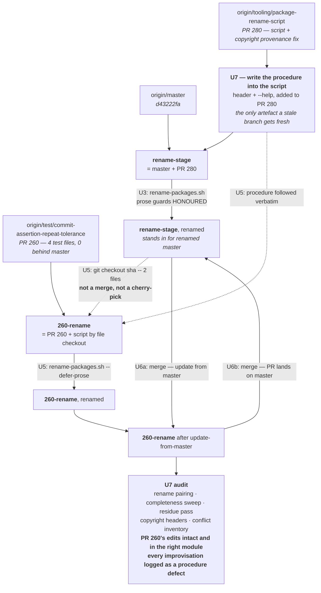

# Package-rename dry run: rehearse the sequence, and make the procedure self-carrying

**Status:** plan only, nothing performed.
**Origin decision doc:** [`docs/plans/2026-08-11-001-refactor-package-rename-plan.md`](2026-08-11-001-refactor-package-rename-plan.md)
(on `refactor/package-rename`, astubbs#277) — the go/no-go and its evidence. **Read §4.5, §4.6 and §6
before executing this.**
**Tooling:** `bin/rename-packages.sh` on `tooling/package-rename-script` (astubbs#280).
**Ledger:** [`docs/inflight/branch-package-rename.md`](../inflight/branch-package-rename.md)

---

## Goal Capsule

Two outputs, and the second is the one that scales.

1. **Rehearse the real landing sequence** on throwaway branches — astubbs#280 lands, the rename runs,
   an open PR brings itself across and merges both ways — and audit what actually happened.
2. **Write the per-branch procedure into `bin/rename-packages.sh` itself**, so the 40 remaining PRs
   get executable instructions from the file they check out rather than from a person repeating
   themselves 40 times.

The origin doc's numbers came from a throwaway clone that was discarded, which is why it has to say
*"re-measure rather than trusting this figure"*. This is that re-measurement — on this tree, against a
real open PR, in the real order.

The rehearsal exists to prove the procedure. **If the operator has to improvise at any step, the
procedure is wrong, and fixing it is the finding** — not a footnote to a successful run.

---

## Problem Frame

The rename moves 233+ Java files and rewrites ~970 lines. There are 41 open PRs. The origin doc
establishes three things that make this dangerous in a way an ordinary refactor is not:

1. **A branch that has not been renamed merges renamed-master with zero conflicts and silently puts
   one module's edit into another module's file** (§4.6). Nothing catches it. Every mitigation that
   could be committed to the repo was tried and refuted.
2. **Squashing the rename into one commit invents four cross-module renames and fabricates a
   deletion** (§4.5). Merge method is chosen per PR here and squash is the common choice, so the
   habitual method is the one the measurement rejects.
3. **Three separate mechanisms fail green** (§6): the mutation lane exits 0 while scoring nothing,
   ArchUnit rules pass vacuously against an empty class set, and the habitual
   `grep -rn "io\.confluent"` cannot see the escaped-regex form it is supposed to be verifying.

**And there is a fourth problem, found while writing this plan.** The script's header says running it
on every open PR branch is *mandatory, not a convenience* (`bin/rename-packages.sh:125`) — but neither
the script nor the ledger says **how a branch is supposed to obtain the script in the first place**.
That is not a documentation gap; it is a chicken-and-egg:

> Once the rename is on master, a stale branch needs the script before it can merge master —
> **and merging master is exactly the operation the script exists to prevent.**

So the acquisition step cannot be a merge, and nothing currently written down says what it is instead.
Forty branch authors would each have to work that out, or be told, one at a time.

None of this has been exercised on a real branch of this repo. A procedure nobody has executed is a
hypothesis.

**Non-problem:** whether to rename. Settled `Go`, origin §10. This plan does not revisit it.

---

## Requirements

| ID | Requirement |
|---|---|
| **R1** | The experiment reproduces the real landing sequence in the real order, on clean branches from the correct base, with no shortcut reality will not take. |
| **R2** | The rename is performed as two commits and its rename detection is verified: detected equals moved, zero mis-paired, no stray add/delete pairs. |
| **R3** | `bin/rename-packages.sh` carries the complete per-branch procedure in its own header and `--help`, sufficient for a branch author who was not part of this work. |
| **R4** | The rehearsal follows that written procedure **verbatim**. Every improvisation is recorded as a defect in the procedure and fixed there. |
| **R5** | astubbs#260 brings itself across, then exercises **both** merge directions: update-from-master, then merge-to-master. |
| **R6** | astubbs#260's four test-file edits are proven present, intact, and in the correct module after the merges — the direct check against §4.6's silent cross-module corruption. |
| **R7** | Completeness is established by the permissive sweep (§6a) plus an occurrence-by-occurrence residue pass (§7) — never by an exit code or a habitual grep. |
| **R8** | Every verification this machine cannot perform is named as an open gap, not skipped silently. |
| **R9** | The audit produces a go/no-go for the remaining 40 PRs, with the per-branch cost stated as a number. |

---

## Key Technical Decisions

**KTD1 — Rename the branch first, then merge. Never the reverse.**
*(session-settled: user-directed — confirmed against origin §4.6.)* Both sides must agree on where
files live before they meet, so the merge has a rename on each side to pair, rather than a rename on
one side and an edit-in-place on the other. Governs R5.

**KTD2 — The procedure lives in the script, not in a doc and not in a person.** *(session-settled:
user-directed — "I don't want to be repeating myself 40 times".)*

A stale branch has a stale copy of every doc in the tree. `docs/inflight/branch-package-rename.md`,
this plan, and the origin plan are all **invisible** to a branch cut before they existed. The
**script is the only artefact guaranteed to be current on any branch**, because checking it out is
step one of the procedure it describes. So the procedure goes in the file that carries itself.

This also matches how astubbs#280 is already written: its header is the primary source for the
commit-shape measurements, the no-fallback rule and the merge hazard. The acquisition step is the one
piece missing. Governs R3.

**KTD3 — Branches acquire the script by file checkout from `origin/master`, not by merge and not by
cherry-pick.**

```sh
git fetch origin
git checkout origin/master -- bin/rename-packages.sh bin/check-copyright-headers.sh
```

**Checking files out of a ref is not merging it.** `git checkout <ref> -- <paths>` copies those paths
into the index and working tree and records nothing about `<ref>` in history — no merge base moves, no
other file is touched, and the §4.6 hazard never comes into play, because that hazard is about how a
*merge* resolves renames across the whole tree. This is the operation the chicken-and-egg needs.

**No sha, deliberately.** An earlier draft of this decision said `git checkout <sha> -- …`. That is
worse in three ways: somebody has to publish the sha, the instruction rots the moment the tooling is
touched again, and a branch author who mistypes it gets a silently older script. `origin/master`
always names the current tooling, needs no lookup, and stays correct after astubbs#280 lands. It is
also the sha-free form, so the instruction block can be written once and never revised for drift.

- **Not a merge** — that is the forbidden operation (Problem Frame), and it is what the branch is
  trying to become safe enough to do.
- **Not a cherry-pick** — astubbs#280 has eleven non-merge commits touching these files, so no single
  commit is sufficient. `336e1191` creates the script (1005 lines) and eight later commits modify it,
  including `be56321f` (+445, deleting the catch-all and adding the refusal rule) and `dc87cff0` (the
  dead-pattern control fix). Recutting astubbs#280 so the script arrives in one clean commit is worth
  doing anyway (see Scope Boundaries), but a file checkout needs no recut and no history games — the
  script is re-runnable by design and does not care how it arrived.
- **Both files, not one.** `bin/rename-packages.sh` runs standalone; it never invokes the copyright
  checker, only edits it (`retarget_copyright_manifest`, `:944`, guarded by `[ -f "$f" ] || return 0`).
  But without `f92df275`'s `bz/stub/… → io/confluent/…` provenance normalisation in
  `bin/check-copyright-headers.sh`, every moved upstream file misses the fork-point lookup and its
  retained Confluent header becomes a violation — **origin §3 measured 197**. It heals the moment
  master merges in, so it is transient; it is also an hour of someone's life, and exactly the kind of
  scary-looking transient that gets "fixed" wrongly.
- **Checking out of a *post-rename* master is safe — verified, not assumed.** By the time a stale
  branch runs this, master carries the rename, so the question is whether the tooling survived
  rewriting the tree it lives in. It does: `SELF_BASENAMES` (`bin/rename-packages.sh:352`) excludes
  `rename-packages.sh` and `test-rename-packages.sh` from both the bulk rewrite and the completeness
  check, **matched on basename** so moving the script cannot silently switch the exclusion off. The
  script keeps its `io.confluent` `PKG_MAP` as data. `bin/check-copyright-headers.sh` is frozen from
  the bulk rewrite and gets only a targeted edit to the newpath half of its manifest
  (`retarget_copyright_manifest`, `:944`) — which is exactly the state a branch about to rename itself
  wants. Recorded so nobody re-derives it.
- **A branch that already updated from master after astubbs#280 landed needs none of this** — it has
  both files. The procedure must say how to tell, because roughly half the open PRs are long stale
  (astubbs#1, astubbs#8, astubbs#29, astubbs#31, astubbs#38, astubbs#51, astubbs#53, astubbs#57).

**KTD4 — The *rename PR specifically* must not be squash-merged.** §4.5 measured that squashing pairs
the five near-identical `TestConventionsArchTest.java` files into a cross-module cycle
(`streams→metrics`, `vertx→mutiny`, `mutiny→reactor`, `reactor→vertx`), with `metrics` reported
deleted and `streams` reported new. Four renames that never happened.

The scope is deliberately narrow: **merge method is a per-PR choice here** and this plan does not
propose changing that. The constraint binds one PR — the one whose two-commit shape *is* the artefact.
That narrowness is also the danger: a one-off exception to a habitual default, with nothing enforcing
it, on something irreversible once merged. Agree the method with whoever merges **before** the PR is
opened.

**KTD5 — `rename-stage` stands in for post-astubbs#280 master, and the rename runs directly on it.**
astubbs#280 has not landed, and the rename cannot run without it. Merging
`tooling/package-rename-script` into a branch off `origin/master` is the faithful stand-in, and
running the rename there means `rename-stage` simply *is* renamed master — no extra branch, no
merge-back. What this trades away is exercising whether detection survives the rename's own landing
merge; KTD4 handles that as a real-world constraint instead.

**KTD6 — `--skip-readme-regen`, and README.adoc becomes a named gap.** No JDK on the executing
machine, so `./mvnw -N process-sources` cannot run. The script is honest about this: the flag
**excuses README.adoc from the completeness check** and lists it under MANUAL FOLLOW-UPS. That excusal
is a real hole in the evidence, and R8 requires it written up as one rather than absorbed as a caveat.

**KTD7 — Prose guards honoured on `rename-stage`, deferred on `260-rename`.** Three sentences become
false the instant the rename lands (the README's drop-in claim, two changelog claims). The script
refuses rather than rewriting them into confident falsehoods in the new spelling. Per the script
header: fix them once on master (U3), pass `--defer-prose` on branches (U5), where the corrected
sentence arrives from master at merge. This deliberately manufactures a conflict on those lines in U6
— predicted, wanted, and one of the things the audit checks.

**KTD8 — No control arms.** *(session-settled: user-directed — this is a rehearsal of the intended
procedure, not a study of deviations.)* The corruption failure mode is still covered, by **R6's
content audit** rather than by a control. What stays unmeasured is whether re-running the script can
**recover** a branch merged in the wrong order; that is in Open Questions, because it will be asked.

**KTD10 — The reference is `origin/master:bin/rename-packages.sh`, with no sha anywhere, and one rule
makes that always correct.** *(session-settled: user-directed — chosen over pinning a fan-out sha.)*

The script is not a fixed point. Its own design premise — *each branch gets the SAME transformation, so
both sides of every merge agree on where the files live* — is an invariant across the whole fan-out,
and this plan **guarantees the script changes**, because U4's deviation log feeds straight back into
it (R4). So "it will not move" was never available as an assumption.

Pinning a fan-out sha was the wrong fix. It freezes the instructions, which are the part that must
evolve, while doing nothing about the rules, which are the part that must not drift — and it needs
someone to publish and re-publish a sha that then rots. The right fix is a guaranteed path plus a
guaranteed ref:

```sh
git fetch origin && git show origin/master:bin/rename-packages.sh
```

**`bin/rename-packages.sh` is guaranteed not to move or be renamed** for the life of the migration. It
sits in `bin/`, so the rename does not touch its path, and `SELF_BASENAMES` (`:352`) already keeps its
contents out of its own rewrite. Nothing to publish, nothing to re-publish, correct forever.

**The one rule that makes "newest from master" always right:**

> **The script on master must always be the script that produced master's current layout.** A change
> to `PKG_MAP` or any exclusion list re-runs the rename on master **in the same commit**. Instruction
> and prose edits are exempt — they change no layout.

With that rule, a branch taking the newest script gets rules that agree with the tree it is about to
merge, by construction. Without it, the two can silently diverge — which is the §4.6 failure arriving
*through* the tool built to prevent it.

**Drift then becomes self-healing rather than fatal.** A branch renamed under older rules is not
corrupt, just behind: the script is re-runnable on an arbitrary branch by design, and works per file
rather than per directory precisely so a partly-moved tree is handled. Re-running brings it current.
That is a far cheaper failure mode than a freeze, which would have made any rule fix a 40-branch
recall.

**Still worth stamping.** "Behind" and "current" are only distinguishable if a branch records which
rules it ran. A fingerprint over the transformation-relevant config alone — `PKG_MAP` plus the
exclusion lists, not the prose — written into the commit the script already generates would make
`is this branch behind?` a two-message diff rather than a memory exercise. Whether the script should
go further and **refuse** on a mismatch is a design question for astubbs#280. Open Question 6.

**KTD9 — Local worktrees, findings only.** *(session-settled: user-directed.)* The branches are
throwaway; the **write-up is not**. The origin doc's evidence died with its throwaway clone, which is
why it carries a re-measure warning. U7 records raw numbers and exact commands, not conclusions.

---

## High-Level Technical Design

Each arrow is a real git operation, in this order.



The load-bearing property, and why KTD1's order is not negotiable: at the U6a merge the files under
`bz/stub/…` exist on **both** sides, so git has a rename to pair against a rename. In the forbidden
order it would have a rename on one side and an edit at the old path on the other — the shape that
resolves silently and wrongly.

---

## Implementation Units

**Sequencing note.** U7 is numbered last but runs **second**, because U5 must follow instructions that
already exist. U-IDs are stable identifiers, not an execution order; the order is U1 → U7 → U2 → U3 →
U4 → U5 → U6 → U8.

---

### U1. Prove the tooling before trusting a single thing it says

**Goal:** establish that the script and the copyright checker behave correctly *in this environment*
before any output of theirs is treated as evidence.

**Requirements:** R7, R8
**Dependencies:** none
**Files:** `bin/test-rename-packages.sh`, `bin/test-check-copyright-headers.sh`, `bin/check-copyright-headers.sh`

**Approach:**

1. Confirm the existing `tooling/package-rename-script` worktree is at the branch tip and clean.
2. Run both self-test suites. Pure bash, so the absent JDK does not block them.
3. Record the **baseline**: `bash bin/check-copyright-headers.sh` on unmodified master. Measured while
   writing this plan (master `d43222fa`): **234 java files, 0 violations**, fork point `7f290122`.
   Origin §3 recorded 233 on 2026-08-11 — master has gained a file since, which is precisely why the
   instruction is re-measure, not quote.

**Patterns to follow:** the repo's own standard, from the script header — *a check nobody has watched
fail is decoration*. `bin/test-rename-packages.sh` ships a negative control where a planted stale
reference should turn the completeness check red.

**Test scenarios:**
- Both self-test suites exit 0 in this environment.
- The planted-stale-reference negative control is **observed firing**, not merely reported as passing.
- Baseline recorded as two numbers. A later *drop* in the checked count means files stopped being
  found — which passes, and is the failure this baseline exists to make visible.

**Verification:** three numbers written down before any branch is created.

---

### U7. Write the per-branch procedure into the script

*(Runs second. Numbered U7 because it was added after U1–U6 were assigned; U-IDs never renumber.)*

**Goal:** a branch author who has read none of this can bring their branch across correctly, from the
file they check out.

**Requirements:** R3
**Dependencies:** U1
**Files:** `bin/rename-packages.sh` (header + `--help`), `bin/test-rename-packages.sh`

**Where this lands:** on `tooling/package-rename-script` — it becomes part of **astubbs#280**, not an
experiment branch. That ordering is load-bearing: U2 merges astubbs#280 into `rename-stage`, so the
tooling arrives everywhere already carrying its own instructions. A procedure added later, on a
different branch, would be invisible to exactly the stale branches that need it.

**Approach:**

Add a `BRINGING AN OPEN BRANCH ACROSS` section to the header, and a condensed form to `--help`. It has
to answer, in order:

1. **Do I need to do anything?** How to tell whether the branch already has the script (it updated
   from master after astubbs#280 landed) or is stale and needs the checkout. Give the command that
   answers it, not a description of the state.
2. **How do I get the script?** The KTD3 checkout from `origin/master`, both files — with the one-line
   reason it is not a merge, and the one-line reason it names a ref rather than a sha. Both are steps
   somebody will "improve", and the reasons are what stop them.
3. **What do I run?** `--dry-run`, read the work set, then `--defer-prose --skip-readme-regen`.
4. **What do I do next?** Merge master — **after** the rename, never before.
5. **What will I see?** The expected conflict shape (`rename/delete` + `add/add` on the correct path,
   edit intact), and the prose-line conflicts KTD7 manufactures, with master's wording winning.
6. **What does wrong look like?** A merge with zero conflicts on a branch that skipped the rename is
   the §4.6 silent corruption, not good luck.
7. **Where do I stop?** Explicitly: rename the branch, merge master in, resolve, commit, push the
   **PR branch**. **Do not merge the PR. Do not open a PR. Do not touch master.** That is a human
   decision behind review and CI. Written as a hard stop, not a preference — see the audience below.
8. **When do I stop and ask?** Any refusal (dirty tree, unmapped package), any `mis-paired` above
   zero, any conflict whose correct resolution is not obvious. Say *report and stop*, never *use
   judgement*.

**Audience: an agent given one pasted line.** The block is not primarily read by a human browsing the
repo. The expected invocation is a fresh checkout of a PR branch and a single pasted instruction:

```
git fetch origin && git show origin/master:bin/rename-packages.sh
```
> Read the `BRINGING AN OPEN BRANCH ACROSS` section and follow it exactly.

`git show <ref>:<path>` is chosen because it works on a **stale branch where the file does not exist**
— `cat` and any editor-open do not. **No sha**, per KTD10: the path is guaranteed stable and
`origin/master` is guaranteed to hold the script that produced master's layout, so this one line stays
correct for the life of the migration with nothing to publish or re-publish. It is also the same
command the block's own step 2 gives for acquisition, so a reader sees one form, not two.

Writing for that audience changes the prose: every step is a runnable command rather than a
description, every failure mode says *stop and report* rather than inviting judgement, and the scope
boundary in step 7 is stated as a prohibition. An agent that reads "then the PR can be merged" will
merge it.

Write it as the existing header is written: the instruction, then the reason it is that and not the
obvious alternative. The header's value is that it forecloses the plausible-but-wrong variant, and an
instruction block without reasons will be optimised into one.

**Execution note:** this is documentation whose *correctness is tested by U5 executing it*. Write it
before U5, revise it from what U5 finds, and treat a revision as the unit's real output.

**Test scenarios:**
- `bin/rename-packages.sh --help` shows the condensed procedure.
- The staleness test in step 1 is a runnable command, and it gives the right answer on both a stale
  branch and a current one.
- Every command in the block is copy-pasteable — no placeholders a reader must resolve from context
  they do not have.
- `git show origin/master:bin/rename-packages.sh` renders the block readably on a branch where the file does
  not exist. This is the actual delivery mechanism, so it is tested, not assumed.
- The scope boundary is stated as a prohibition (*do not merge the PR, do not open a PR, do not touch
  master*), not as an omission. **A step that is merely absent will be supplied by a helpful agent.**
- Every failure mode says *stop and report*. No step says *use judgement* or *as appropriate*.
- The script is excluded from its own rewrite, so the block survives a run — already true via
  `SELF_BASENAMES` (`:352`), matched on basename; confirm it still holds after the header grows.

**Verification:** a branch author with no context can execute the block start to finish. U4 is that
test. The paste line itself is a deliverable, recorded in the ledger alongside the sha it pins.

---

### U2. Stand up `rename-stage`

**Goal:** a branch that is what master will be the moment astubbs#280 lands.

**Requirements:** R1
**Dependencies:** U7
**Files:** none — branch topology only

**Approach:**

1. Worktree `rename-stage` from `origin/master`.
2. Merge `tooling/package-rename-script` (carrying U7's procedure) into it. astubbs#280 already
   carries a merge of master (`9a6ddad0`), so expect this clean; record it if not, because a conflict
   here is a fact astubbs#280's own PR should know.
3. **Record the one sanctioned substitution.** U7's block tells branch authors to check the tooling
   out of `origin/master`, which is correct for the real run — astubbs#280 will have landed there. In
   this rehearsal it has not, so the rehearsal substitutes `rename-stage` for `origin/master` in that
   one command, and **nothing else**. Declare it here, before U4 runs, so it is a known stand-in
   rather than an improvisation R4 would count against the procedure.

**Test scenarios:**
- Merge completes; any conflicts recorded by path and kind.
- `bin/rename-packages.sh --help` runs from this branch and shows the procedure.
- `bash bin/check-copyright-headers.sh` still reports the U1 baseline — **astubbs#280's copyright
  rework must not move the numbers before the rename has even happened.**

**Verification:** a branch where the script exists and the pre-rename baseline is unchanged.

---

### U3. Run the rename on `rename-stage`

**Goal:** renamed master, verified.

**Requirements:** R1, R2, R7
**Dependencies:** U2
**Files:** ~234 Java files moved; ~31 non-Java rewritten; `docs/todo-index.md` regenerated;
`src/docs/README_TEMPLATE.adoc` and `CHANGELOG.adoc` prose (KTD7)

**Execution note:** `--dry-run` first, and read the work set before applying. The script refuses on a
dirty tree or an unmapped legacy package — a refusal is information, and its message names what has
no rule.

**Approach:**

1. `bin/rename-packages.sh --dry-run`; read the work set.
2. `bin/rename-packages.sh --skip-readme-regen` (KTD6). **No `--defer-prose`** — this arm is master,
   so the three prose claims get corrected here with origin §8's pre-drafted wording (KTD7). Expect
   the guards to stop the run; that is the design.
3. Record every number the verification block prints: files moved, renames detected, **mis-paired**,
   lowest similarity, add/delete counts, and the `diff.renameLimit` / `merge.renameLimit` values it
   reports for the merges to come.

**Patterns to follow:** origin §4.5's expected two-commit figures — 233 moved, 233 renames, all
`R100`, 0 add/delete on the move commit; 0 renames and ~253 modifications on the content commit.
Divergence from those *is* the finding. Expect 234 now (U1).

**Test scenarios:**
- Move commit: renames detected **equals** files moved; `mis-paired` is **0**; no add/delete pairs;
  lowest similarity recorded.
- Content commit: 0 renames, 0 add/delete, modification count recorded.
- Completeness check passes on the permissive `io[\\./]*conflu` pattern, and the write-up **states
  which pattern was run** (§6a — the habitual `grep -rn "io\.confluent"` cannot see
  `bin/lib/quarantine-common.sh` at all).
- `bash bin/check-copyright-headers.sh` → 0 violations **and** the same checked-file count as U1.
- All three prose guards fire, and each sentence is rewritten to origin §8's wording rather than
  mechanically renamed.
- README.adoc appears under MANUAL FOLLOW-UPS and is explicitly excused from the completeness check
  (KTD6). Recorded as a gap; the pass does not cover it.

**Verification:** `rename-stage` is renamed master, with every number recorded.

---

### U4. Cut `260-rename` and bring it across — following U7's text, verbatim

**Goal:** the branch-author side of the procedure, executed as written.

**Requirements:** R1, R3, R4
**Dependencies:** U3
**Files:** `bin/rename-packages.sh`, `bin/check-copyright-headers.sh` (acquired, not authored)

**Execution note:** **follow U7's block literally, and keep a log of every deviation.** If a command
does not work as written, if a step is ambiguous, if the operator reaches for knowledge the block does
not contain — that is a defect in U7, and fixing U7 is the output. Do not silently do the right thing;
the whole point is that 40 people who cannot ask will do exactly what it says.

**Approach:**

1. Worktree `260-rename` from `origin/test/commit-assertion-repeat-tolerance` (astubbs#260's tip,
   rebased onto master this session, 0 behind).
2. Run U7's staleness test. astubbs#260 is current with master but master does not yet have
   astubbs#280, so the expected answer is *stale — needs the checkout*. Confirm the test says so.
3. `git checkout rename-stage -- bin/rename-packages.sh bin/check-copyright-headers.sh`; commit.
   (`rename-stage` substituting for `origin/master` per U2 step 3 — the only permitted deviation.)
   **Note what this is not:** no merge, no cherry-pick, no `git merge --no-commit`. Two files land in
   the index; nothing about `rename-stage`'s history does.

**Test scenarios:**
- The staleness test returns the right answer for this branch.
- The checkout brings exactly two files; the branch's own commits are untouched.
- Every deviation from U7's text is logged with what was ambiguous and what was done instead.

**Verification:** `260-rename` has the tooling, by the documented route, with a deviation log.

---

### U5. Run the rename on `260-rename`

**Goal:** the PR side renamed, before it goes anywhere near master.

**Requirements:** R1, R2
**Dependencies:** U4
**Files:** astubbs#260's four test files, plus the tree-wide rewrite

**Approach:**

1. `bin/rename-packages.sh --dry-run` — **the interesting read.** The script globs the tree rather
   than working from a manifest, precisely so a PR's newly added files under the old path are picked
   up. astubbs#260 adds `KafkaTestUtilsTest.java`, which did not exist when the script was written.
   Confirm it is in the work set.
2. `bin/rename-packages.sh --defer-prose --skip-readme-regen` (KTD6, KTD7).
3. Record the verification numbers and the MANUAL FOLLOW-UPS list.

**Test scenarios:**
- `KafkaTestUtilsTest.java` — added by astubbs#260, unknown to the script — appears in the work set
  and moves. **This is the re-runnability property the whole fan-out rests on**; if it fails, the
  approach fails with it.
- Renames detected equals files moved; `mis-paired` is 0; no add/delete pairs.
- The moved-file count differs from U3's by exactly astubbs#260's added files. An unexplained
  difference is a finding.
- `--defer-prose` lists the guarded sentences under MANUAL FOLLOW-UPS rather than rewriting them.
- `bash bin/check-copyright-headers.sh` → 0 violations, checked count = baseline + astubbs#260's
  added files. **A red here means the KTD3 two-file checkout was actually one file** — worth
  confirming deliberately, since it is the mistake the procedure is written to prevent.

**Verification:** astubbs#260, renamed, self-consistent, not yet merged with anything.

---

### U6. Both merge directions

**Goal:** the moment the whole plan is about — two independently renamed sides meeting — in both of
the directions that happen for real.

**Requirements:** R1, R5
**Dependencies:** U5
**Files:** merge results across the tree

**Approach:**

**U6a — update from master.** Merge `rename-stage` into `260-rename`. This is the operation all 40
open PRs must perform, and the one origin §4.6 calls mandatory. Record the full conflict inventory:
every path, every kind, and for each whether resolution was mechanical or needed judgement — that
number gets multiplied by 40.

**U6b — land on master.** Merge `260-rename` into `rename-stage`. The PR merging home. Record the
same.

**Patterns to follow:** origin §4.6 — with both sides renamed, the expected shape of any collision is
a loud `CONFLICT (rename/delete)` plus `CONFLICT (add/add)` **on the correct path with the edit
intact**. Loud and correct is the trade being bought.

**Test scenarios:**
- Both merges complete; every conflict recorded by path and kind.
- The KTD7 prose-line conflicts appear as predicted in U6a, and **master's corrected §8 wording wins**
  — the deferred rewrite from the astubbs#260 side must not survive.
- No resolution requires guessing which module a file belongs to. If one does, that is §4.6 surfacing
  *loudly*, which is the good outcome — record it prominently.
- U6a's conflict count and judgement-call count recorded as the per-branch cost estimate.

**Verification:** two merged branches and a written conflict inventory for each.

---

### U8. Audit, and decide

**Goal:** the deliverable. Evidence, then a go/no-go for the other 40 PRs.

**Requirements:** R4, R6, R7, R8, R9
**Dependencies:** U6
**Files:** `docs/inflight/branch-package-rename.md`, `bin/rename-packages.sh` (U7 revisions)

**Approach:**

1. **The corruption check (R6), first and most important.** Read astubbs#260's four files at their new
   `bz/stub/…` paths and confirm each edit is present, complete, and in the module it belongs to:
   - `…/csid/utils/KafkaTestUtils.java` → `…/internal/utils/KafkaTestUtils.java` (+95)
   - `…/csid/utils/KafkaTestUtilsTest.java` → `…/internal/utils/KafkaTestUtilsTest.java` (new, +98)
   - `…/parallelconsumer/AbstractParallelEoSStreamProcessorTestBase.java` (+37)
   - `…/parallelconsumer/ParallelEoSStreamProcessorTest.java` (+64)

   Diff merged content against astubbs#260's pre-rename diff, transformed. **Equality here is the
   claim §4.6 says cannot be assumed**, and reading it is what replaces the control arm KTD8 dropped.
2. **Fold U4's deviation log back into U7.** Every improvisation is a procedure defect. This is the
   unit's highest-leverage output: it is what stops the same question being answered 40 times.
3. **The residue pass (§7).** Walk `grep -rni confluent` occurrence by occurrence. Every survivor is a
   retained copyright notice (§4b, required), a `NOTICE` entry (§4d, required), a reference to
   upstream's repo or issues (history stays true), `confluentinc/cp-kafka` (a container image),
   `.semaphore/` (inactive legacy CI), or **a miss**. Name the sweep that should have caught each miss.
4. `git log --follow` and `git blame -C` on two or three moved files — the accurate history the
   two-commit shape was bought for. If it is absent, KTD4's cost bought nothing.
5. **State the gaps (R8) plainly**, not as caveats: no compile, no test run, no ArchUnit
   deliberate-red, no mutation-lane scoring, README.adoc unregenerated and excused. Each becomes a
   post-migration task carrying its origin §6 acceptance condition.
6. Write findings into `docs/inflight/branch-package-rename.md`, following that entry's own convention
   — it expects branches to keep their own account at that path and to be combined on convergence.
7. **Decide**, and state the fan-out cost: conflicts per PR, script runtime, and which branches look
   materially harder (the four touching `TestConventionsArchTest.java` — astubbs#266, astubbs#268,
   astubbs#269, astubbs#271 — are the known-dangerous set, untested here).

**Test scenarios:**
- All four astubbs#260 edits present, complete, in the correct module. Any relocation is a
  **stop-everything** finding.
- U7's block updated from the deviation log, or the log explicitly confirmed empty.
- Residue pass complete, every survivor classified, every miss attributed to a sweep.
- `git log --follow` traverses the rename on the sampled files.
- Gap list written, each with its origin §6 acceptance condition.
- A written go/no-go with a per-PR cost number behind it.

**Verification:** the ledger answers R9 with numbers, and `bin/rename-packages.sh` carries a procedure
that has been executed by someone following it rather than writing it.

---

## Verification Contract

| Gate | Satisfied by | Blocking? |
|---|---|---|
| Tooling self-tests pass, negative control observed firing | U1 | yes |
| Copyright: 0 violations **and** unchanged checked-file count | U1 baseline vs U3, U5 | yes |
| Rename pairing: detected = moved, mis-paired = 0, no add/delete | U3, U5 | yes |
| Completeness sweep run with the permissive pattern, pattern stated | U3, U5 | yes |
| The written procedure was followed verbatim, deviations logged and folded back | U4, U8 | yes |
| astubbs#260's four edits intact and in the correct module | U8 | yes |
| Residue pass, occurrence by occurrence, misses attributed | U8 | yes |
| `git log --follow` traverses the rename | U8 | no — records whether the two-commit shape paid off |
| Compile, tests, ArchUnit deliberate-red, mutation-lane scoring | **deferred** — needs a JDK | not here; blocking for the real landing |

Two things are **not** evidence, per origin §6, and no gate above may be satisfied by either: a green
exit from `bin/ci-mutation-test.sh` (it exits 0 while matching nothing), and a clean
`grep -rn "io\.confluent"` (it cannot see the escaped-regex form).

---

## Definition of Done

- `bin/rename-packages.sh` carries a per-branch procedure that a stranger can execute, and it has been
  executed by following it rather than by knowing it.
- The **fan-out paste line** exists and is recorded in the ledger — a single
  instruction that can be handed to an agent in a fresh checkout of any of the remaining branches,
  with the scope boundary (rename and update the branch; do **not** land the PR) inside the block it
  points at rather than in the paste line.
- The full sequence ran in order: procedure written → `rename-stage` built and renamed →
  `260-rename` brought across and renamed → both merges performed.
- Every number the script printed is recorded.
- astubbs#260's four edits are proven intact and correctly located.
- The residue pass is complete and every miss is attributed to the sweep that should have caught it.
- `docs/inflight/branch-package-rename.md` carries the findings, the gaps, and a go/no-go with a
  per-PR cost.
- The unmeasured recovery question (KTD8) is written down, not left implicit.
- Worktrees and branches are either **promoted** (see Scope Boundaries) or **removed** —
  `git worktree remove`, `git branch -D`. Four half-renamed branches left lying around is how a future
  session mistakes a rehearsal for the real thing.

---

## Scope Boundaries

**In scope:** the branch sequence above, astubbs#260 as the single counterparty, the procedure block
in `bin/rename-packages.sh`, and audit by git mechanics plus the repo's bash checkers.

**Deferred to follow-up work:**
- **Post-migration verification** (origin §6): mutation lane observed scoring mutants; an ArchUnit rule
  deliberately broken and observed going red; a real compile and test run; README.adoc regenerated by
  `./mvnw -N process-sources`.
- **Recutting astubbs#280** so the tooling arrives in one clean commit. Not required — KTD3's file
  checkout needs no recut — but it makes the fan-out instruction shorter, and shorter instructions get
  followed. If done, it must fold in the eight commits that modify the script after `336e1191`.
- **The remaining 40 PRs**, and a `--dry-run` sweep across all open branches for the true fan-out cost.
- **The four known-dangerous branches** — astubbs#266 (touches four of the five mis-pairing
  `TestConventionsArchTest.java` files), astubbs#268, astubbs#269, astubbs#271. astubbs#260 touches
  none, so **this run does not exercise the mis-pairing case at all.** Stated here so a clean result is
  not over-read.
- **Promotion.** If the run is clean the branches may become real PRs. That needs: `rename-stage`
  rebuilt on a genuinely merged astubbs#280 (KTD5), the KTD4 non-squash landing agreed in advance, and
  origin §6's verification done first — it is the release gate, not a nicety.

**Not in scope:** whether to rename (settled `Go`, origin §10); the copyright-provenance redesign
(already in astubbs#280); the Apache/Kafka branding work (origin §2 — a different mark, a different
question, explicitly not to be merged into this one).

---

## Open Questions

1. **Can a branch merged in the wrong order be recovered by re-running the script, or must it be
   rebuilt?** Unmeasured by decision (KTD8). It will be the first question asked the first time
   somebody merges before renaming, and across 40 branches that is close to certain. The procedure
   block (U7) currently answers "don't do that", which is not an answer once someone has.
2. **Does the landing method survive contact with habit?** KTD4 requires a non-squash merge for the
   rename PR alone. Merge method is per-PR here and squash is common; nothing enforces a one-off
   exception, and a squash is irreversible once merged.
3. **Is recutting a branch onto renamed master a viable alternative to rename-then-merge?** Some PRs
   get recut rather than merged, so this is not hypothetical. A rebase replays commits touching paths
   that no longer exist, which *should* fail loudly — but git applies rename detection during rebase
   too, and the shape of that failure is unmeasured. If recutting is safe it may be cheaper for the
   branches that get recut anyway. **This run does not test it.**
4. **Does anything learned here transfer if astubbs#280 changes materially before it lands?** (KTD5.)
5. **Is `diff.renameLimit` (git default 1000) comfortable at 234–265 moved files?** Under the default
   today; the question is headroom, since the limit is exceeded **silently**.
6. **What enforces KTD10's rule — that a rule change re-runs the rename on master in the same commit?**
   Today, nothing but this sentence. The stamp proposed in KTD10 makes divergence *detectable* after
   the fact; it does not prevent someone editing `PKG_MAP` on its own. Options for astubbs#280: the
   script refuses when its own fingerprint disagrees with the one recorded in the tree it is running
   against, or a `bin/check-*.sh` compares them. Both are more than this plan needs and less than the
   real fan-out probably wants.
7. **Is the script genuinely re-runnable on an already-renamed branch?** KTD10's self-healing property
   depends on it. The header claims re-runnability as the central design constraint and the move phase
   works per file rather than per directory to support exactly this — but the case *measured* is a
   branch with new files at old paths, not a fully-renamed branch catching up to changed rules. Cheap
   to test during the rehearsal; not currently a unit.

---

## Risks

| Risk | Effect | Mitigation |
|---|---|---|
| A transformation rule changes without the rename being re-run on master | Branches taking the newest script get rules that disagree with master's actual layout — the §4.6 failure delivered by the tool built to prevent it, silently | KTD10's rule: a `PKG_MAP` or exclusion-list change re-runs the rename on master in the same commit. Enforced by nothing today — Open Question 6. Drift is recoverable by re-running the script on the branch, which is why this is a risk and not a freeze |
| The procedure is written by someone who already knows the answer | It reads fine and is unexecutable by anyone else — the exact failure it exists to prevent | R4: U4 follows it verbatim and logs every deviation; U8 folds them back. An empty log must be *confirmed*, not assumed |
| The rename PR gets squash-merged out of habit | Four invented cross-module renames land on master permanently; history corrupted, unfixable in place | KTD4. The exception covers one PR and nothing enforces it — agree the method with whoever merges **before** the PR is opened |
| Only `bin/rename-packages.sh` is checked out, not the copyright checker | 197 spurious copyright violations on the branch until master merges in; looks like the rename broke something | KTD3 names both files and says why; U5 tests for it deliberately |
| astubbs#260 exercises no mis-pairing-prone file | A clean run reads as "the rename is safe" when the dangerous case was never touched | Stated in Scope Boundaries; the four dangerous branches are named |
| No JDK: README.adoc excused from the completeness check | The completeness pass looks total and is not | KTD6; R8 requires it written up as a gap, not a caveat |
| The script rewrites its own instruction block during a run | The procedure decays silently across branches | U7 test scenario: confirm the header is in the prose-guard freeze list; add a self-test case if not |
| Worktree-derived identity misleads tooling | Silent false-clean results | `docs/solutions/workflow-issues/compound-tooling-breaks-in-worktrees-and-forks-2026-08-07.md` — derive identity from `--git-common-dir`, distrust any "nothing found" |
| Findings written to the ledger from an experiment branch | Conflicts with other branches writing the same file | Deliberate, per the ledger's own note — whoever resolves reads both and combines |
| The experiment is believed rather than re-derived | The exact failure the origin doc warns about, one level up | KTD9: record raw numbers and exact commands, not conclusions |

---

## Sources & Research

- `docs/plans/2026-08-11-001-refactor-package-rename-plan.md` (astubbs#277) — the decision, the Apache
  2.0 analysis, and §4.5 / §4.6 / §6, which this plan re-measures.
- `bin/rename-packages.sh` (astubbs#280) — the header is a primary source: commit-shape measurements,
  the no-fallback rule, the residue-report reasoning, the merge hazard. `:125` states the per-branch
  mandate; **nothing states how a branch obtains the script**, which is the gap U7 closes.
  `retarget_copyright_manifest` at `:944` is why the copyright checker is the second file.
- `docs/inflight/branch-package-rename.md` (master) — the canonical ledger; carries no acquisition
  instructions either.
- `docs/solutions/workflow-issues/compound-tooling-breaks-in-worktrees-and-forks-2026-08-07.md` —
  worktree false-negatives.
- Measured this session: master `d43222fa`; copyright baseline 234 files / 0 violations / fork point
  `7f290122`; 41 open PRs; astubbs#260 is 0 behind master and touches no mis-pairing file;
  astubbs#266/268/269/271 touch `TestConventionsArchTest.java` (astubbs#266 four of the five);
  astubbs#280 has 11 non-merge commits across the four tooling files, so no single commit is
  cherry-pickable; the repo allows squash, merge and rebase, method chosen per PR.
