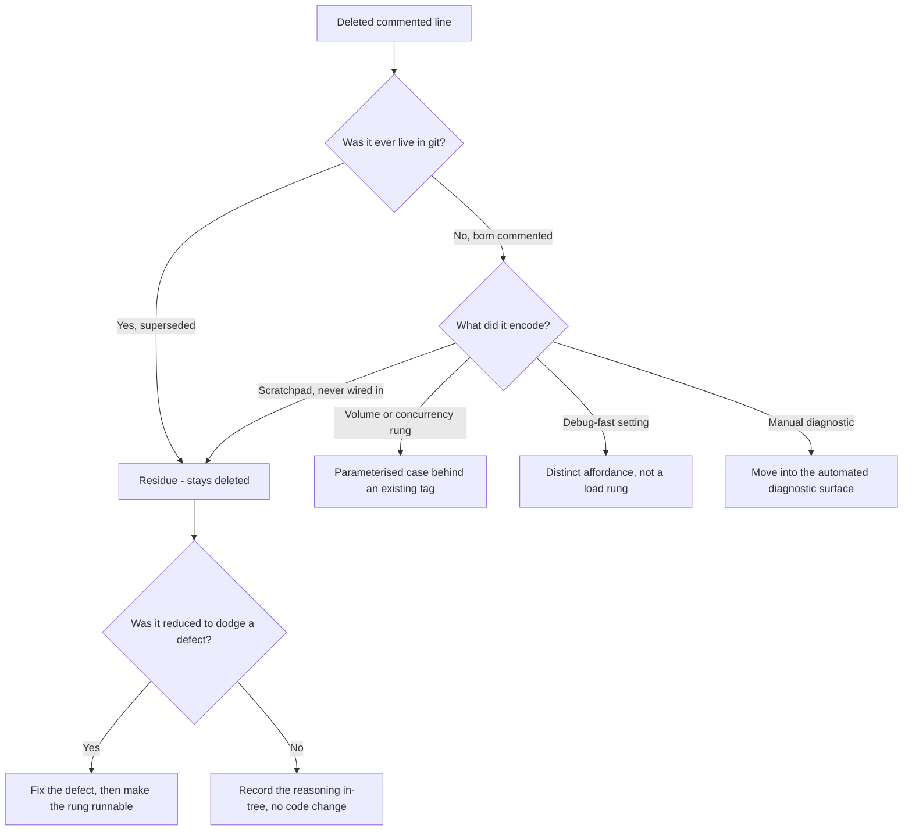

# Recover the Manual Test Procedures the Deletions Removed - Plan

## Goal Capsule

**Objective.** Recover what the commented-out lines deleted on `test/inactive-test-remediation` encoded - manual test procedures someone ran locally and never automated - and make each one runnable on demand. Correct the audit and PR body where they present the commented-out analysis as complete. Assert the one contract a deleted stub was named for.

**Authority hierarchy.** `AGENTS.md` > this plan > implementer judgement. Where the audit (`docs/test-hardening/inactive-tests-audit-2026-08-08.md`) and this plan disagree on a commented-out-code finding, this plan wins - it is the later record, and U1 rewrites the audit to match.

**Execution profile.** Two landings. U1-U2 are corrections that go on `test/inactive-test-remediation` so astubbs#264 can merge. U3-U8 are a follow-up PR off `master` once astubbs#264 lands.

**Stop conditions.** Stop and ask if: the Vert.x characterization in U8 shows a non-2xx response is treated as a processing failure (the plan assumes the opposite, and the opposite is what makes U8 worth doing); or if raising any rung in U3-U6 reds a test in the gating lane, which would mean the lane's values were load-bearing in a way the provenance did not show.

---

## Product Contract

### Summary

Each commented-out line deleted from the five volume and concurrency sites is treated as the record of a manual run. The ones that were **born commented** - written as an alternative and never live in git - become runnable cases behind the repo's existing tag and system-property mechanisms, with the gating lane's values unchanged. `JavaEnvTest`'s environment dump moves into the automated CI diagnostic surface it was manually substituting for. The Vert.x module's response-code behaviour, which a deleted stub was named for and which nothing asserts today, gets characterized.

### Problem Frame

Commit `e67d8b89` deleted commented-out alternatives from four test classes under the title *"delete dead commented-out alternatives, changing no live value"*. Nine review threads on astubbs#264 object, each saying the same thing: the commented-out code was there for a reason.

The provenance shows the objection is right on three of the five sites, and shows why. Where a comment was a **superseded live value**, the deletion analysis traced it and got it right. Where a line was **born commented**, it was labelled a "dead alternative" and dropped with nothing traced - and a line that was never live is *more* likely to be a record of intent, not less, because nothing else in the tree holds it. A developer uncomments a rung, runs it, and comments it back; git only ever sees the parked state. The ladder is the procedure.

| Site | The commented line | Ever live? | Deletion analysis |
|---|---|---|---|
| `MultiInstanceHighVolumeTest` `//10_000_000` | superseded live value | Live at `04cd4d81` (2020-12-14), commented at `ad3636a5` (2021-07-02) | correct |
| `StreamTest` `//@Test` | scratchpad, never wired in | Born commented at `61f4c0e4` (2020-05-27) | correct |
| `VeryLargeMessageVolumeTest` `//2_000_000` | upward aspiration | Never live; added at `2b0ab66b` in the same edit that *lowered* the live value | called "stale"; character misread |
| `LoadTest` `8_000_0 / 4_000_00 / 4_000_0 / 8` | authored range, 8 to 400,000 | Never live; all four born commented in one commit, `af1fa5de` (2020-06-17) | nothing traced |
| `TransactionAndCommitModeTest` `2 / 100 / 1000` | concurrency ladder bracketing the live value | Never live; born commented at `2b0ab66b` (2020-11-27) beside live `numThreads = 16` | nothing traced |

`JavaEnvTest` is the same failure in a different shape. Its javadoc said it was *"used to manually inspect the java environment at runtime - particularly useful for CI environments"*. It was deleted for asserting nothing, which is true and beside the point: it was a manual diagnostic, and deleting it removed the tool without automating what the tool was for.

`VertxTest.handleHttpResponseCodes` is the fifth shape. The audit called it *"a deletion candidate, not a re-enablement candidate - there is nothing here to restore"*. That is true of the stub body and wrong about the gap the stub named. In `VertxParallelEoSStreamProcessor`, `send.onSuccess(...)` calls `wc.onUserFunctionSuccess()`, and a Vert.x `WebClient` future succeeds on any HTTP response - it fails only on transport errors. A 500 therefore marks the work succeeded and the offset is committed. The audit records that non-2xx handling is untested and that `testHttp` asserts 200 on the happy path only.

### Requirements

**Record correction**

- R1. Each commented-out-code finding in the audit states whether that line was ever live, and cites the commit that introduced it and (where applicable) the commit that commented it out.
- R2. astubbs#264's description no longer presents the commented-out analysis as complete.
- R3. Each of the nine review threads receives a reply carrying that site's own provenance and disposition, not a shared link to the audit.

**Manual-procedure recovery**

- R4. Every born-commented rung is runnable without editing source.
- R5. The volume and concurrency values the gating integration lane runs at are unchanged by this work. U6 changes that lane's completion wait by design; no other timing changes.
- R6. `LoadTest`'s debug-low setting is runnable as an affordance distinct from the volume rungs.
- R7. `MultiInstanceHighVolumeTest`'s completion wait scales with the configured volume, so the higher rung is reachable rather than guaranteed to time out.

**Diagnostics**

- R8. The JVM and environment dump `JavaEnvTest` performed is emitted automatically as part of CI diagnostics.

**Coverage**

- R9. The vertx module's behaviour when the HTTP response carries a non-2xx status is asserted, and the asserted behaviour is named in javadoc as a contract.

### Scope Boundaries

- Deletions whose comments were superseded live values stay deleted: `StreamTest.test`, and the `//10_000_000` comment in `MultiInstanceHighVolumeTest`. R7 restores the *capability* to run at that volume; it does not restore the comment.
- `SampleTestingFailsafePluginInclusionCore` stays deleted. Its body was empty - there is no procedure to recover.

#### Deferred to Follow-Up Work

- U6, U7 and U8 of `docs/plans/2026-08-08-002-test-inactive-test-remediation-plan.md` - the two dark core tests and `userSucceedsButProduceToBrokerFails`. Blocked on astubbs#260, which rewrites both files they touch.
- The six review findings on `OffsetEncodingTests` in astubbs#264 (wrong `@link` target for the v1 overflow cause, a static write under a READ-mode resource lock, three duplicate assertions). They block that PR's merge and need their own pass; they are not commented-out-code findings.
- Whether the ten never-written stubs' dispositions in audit §4 hold up. They were re-derived against current `src/main` and are out of scope here.

### Sources

- `e67d8b89` - the deletion commit, and the four claims this plan tests.
- `af1fa5de`, `2b0ab66b`, `ad3636a5`, `04cd4d81`, `61f4c0e4` - provenance for each commented line in the Problem Frame table.
- `docs/test-hardening/inactive-tests-audit-2026-08-08.md` §1.3, §8.1, §8.2, §8.3 - the findings U1 corrects.
- `docs/inflight/test-load-tightness-flakes.md` - `LoadTest` is a listed member at 1/20; the reason its gating value must not move casually.
- `pom.xml` lines 93-102, 886-917 - `included.groups` / `excluded.groups` and the default exclusion of `performance,chaos,quarantined`.
- `parallel-consumer-core/src/test-integration/java/io/confluent/parallelconsumer/integrationTests/chaostests/ChaosScenarioBase.java` - the `chaos.seed` system-property precedent.
- `parallel-consumer-core/src/test-integration/java/io/confluent/parallelconsumer/integrationTests/AmbientProbeExtension.java` - the CI diagnostic surface U7 extends.

---

## Planning Contract

### Key Technical Decisions

- KTD1. **Provenance decides disposition.** A born-commented line is intent-of-record and is recovered; a superseded live value is residue and stays deleted. (session-settled: user-directed - chosen over treating all commented-out code as dead: a line that was never live is more likely to be a record of a manual run, because nothing else in the tree holds it.) Governs R1, R4.
- KTD2. **Recovered rungs become parameterised cases behind the existing tag mechanism, not restored comments.** The repo already has `@Tag("performance")` with `-Dincluded.groups` / `-Dexcluded.groups` and a default exclusion of `performance,chaos,quarantined`, plus the `chaos.seed` system-property precedent. Nothing new is invented. Governs R4, R5.
- KTD3. **The high rung on `MultiInstanceHighVolumeTest` is a defect to fix, not a rung to park.** The volume was reduced because a hard-coded 60s wait cannot be met at higher volume on a CI runner, so the wait is the thing that has to change. (session-settled: user-approved - chosen over tagging the rung and leaving the wait fixed: a tagged rung that always times out is not a runnable procedure.) Governs R7.
- KTD4. **The debug-low setting stays distinct from the volume rungs.** `LoadTest`'s `8` is a fast-iteration affordance, not a load level; the deletion swept it in with the volume alternatives undifferentiated. Governs R6.
- KTD5. **`JavaEnvTest`'s dump moves into `AmbientProbeExtension` rather than returning as a test.** It was a manual diagnostic and the probe is the automated diagnostic surface; restoring it as a non-asserting test would re-create the defect the audit correctly flagged. Governs R8.
- KTD6. **U8 characterizes before it asserts.** The plan's reading of `send.onSuccess` implies a 5xx commits the offset, but that is inferred from the call path, not observed. The unit measures the behaviour first and pins whatever it finds. Governs R9.
- KTD7. **Corrections land on astubbs#264; automation lands in a follow-up PR.** (session-settled: user-directed - chosen over growing astubbs#264: it already carries sixteen open review threads and roughly 2,400 lines of added markdown.)

### High-Level Technical Design

The disposition gate applied to each deleted commented line:

### Assumptions

- Tagging a higher rung `performance` keeps it out of the gating lane. This follows from the pom's default `excluded.groups`, and U3 proves it before U4-U6 rely on it.
- Nobody depends on `StringTestUtils.pretty` outside the deleted `JavaEnvTest`. The deletion commit asserts this; U7 re-checks it, since the utility comes back if the probe needs the same formatting.

---

## Implementation Units

### U1. Correct the audit's commented-out-code findings

- **Goal.** The audit states, per site, whether each commented line was ever live, and cites the commits.
- **Requirements.** R1.
- **Dependencies.** None.
- **Files.** `docs/test-hardening/inactive-tests-audit-2026-08-08.md`.
- **Approach.**
  1. Rewrite §8.2 and §8.3 so each commented-out finding carries its provenance and the ever-live answer.
  2. Correct §1.3's *"nothing here to restore"* verdict on `VertxTest.handleHttpResponseCodes`: the stub has nothing to restore, the coverage gap it names is real and is now tracked by U8.
  3. Follow `docs/citations.md` - the audit is a dated record, so add the finding rather than rewriting the 2026-08-08 claims as if they had always said this.
- **Patterns to follow.** §4's disposition-table shape, which already does this well for the ten never-written stubs.
- **Test scenarios.** `Test expectation: none - documentation only.`
- **Verification.** `bin/check-docs-data.sh` and `bin/todo-index.sh --check` pass. Every commit hash cited resolves with `git cat-file -e`.

### U2. Answer the nine review threads per site

- **Goal.** Each thread gets that site's own provenance and disposition.
- **Requirements.** R2, R3.
- **Dependencies.** U1.
- **Files.** None - GitHub review threads on astubbs#264, plus the PR description.
- **Approach.**
  1. Reply per thread with: was it ever live, which commit introduced it, and what happens to it. The nine split five ways - three born-commented rungs recovered by U3, U4 and U5; two traced correctly where the deletion stands (`StreamTest`, and the `//10_000_000` comment, whose capability U6 restores separately); the `roundsAllowed` thread, where the mechanism was structurally off and the deletion stands for a reason unrelated to the commented ladder; `JavaEnvTest` and `StringTestUtils`, recovered as automated diagnostics by U7; and `VertxTest`, where the gap is real and U8 covers it.
  2. Amend the PR description's *"Dead commented-out alternatives removed"* paragraph so it no longer reads as a completed analysis, and point at this plan for the recovery work.
  3. Resolve only the threads whose disposition is "stays deleted". Leave the recovery threads open and linked to their unit here.
- **Test scenarios.** `Test expectation: none - no code change.`
- **Verification.** astubbs#264 has no unresolved thread whose disposition is "stays deleted". `PR Checklist` stays green after the description edit - the issue-ref gate reads the PR body.

### U3. Make `LoadTest`'s volume range runnable, and prove the tag keeps it out of the gating lane

- **Goal.** The 8 to 400,000 range someone authored in 2020 is runnable without editing source, and the gating lane still runs at 4,000.
- **Requirements.** R4, R5, R6.
- **Dependencies.** U1.
- **Files.** `parallel-consumer-core/src/test-integration/java/io/confluent/parallelconsumer/integrationTests/LoadTest.java`.
- **Approach.**
  1. Replace the `static int total` constant with a resolved value: a system property override falling back to the current 4,000.
  2. Add the recovered rungs as a tagged case so the higher volumes are selectable by `-Dincluded.groups=performance`, leaving the untagged default at 4,000.
  3. Keep the debug-low setting as its own named affordance per KTD4 - it is for iterating on the harness, not for measuring load.
  4. Keep the existing comment about why the gating value must not be raised casually, and add the recovered range beside it so the next reader sees both.
- **Patterns to follow.** `ChaosScenarioBase`'s `chaos.seed` property resolution; `@Tag("performance")` as used by the three existing performance tests.
- **Execution note.** Prove the tag exclusion first - run the gating integration lane and confirm the higher rungs do not execute - before U4-U6 build on the same mechanism.
- **Test scenarios.**
  - Default invocation (no property, no `included.groups`) runs at 4,000, as it does today.
  - `-Dload.total=40000` runs at 40,000 and the test passes.
  - The default gating lane does not execute the tagged high-volume case.
  - `-Dincluded.groups=performance` does execute it.
  - The debug-low affordance completes in seconds and is not selected by the performance tag.
- **Verification.** `bin/ci-integration-test.sh` is green and its `LoadTest` execution count is unchanged from before this unit.

### U4. Make `TransactionAndCommitModeTest`'s concurrency ladder runnable

- **Goal.** The 2 / 16 / 64 / 100 / 1000 thread ladder is runnable; the gating lane stays at 64.
- **Requirements.** R4, R5.
- **Dependencies.** U3.
- **Files.** `parallel-consumer-core/src/test-integration/java/io/confluent/parallelconsumer/integrationTests/TransactionAndCommitModeTest.java`.
- **Approach.**
  1. Apply U3's mechanism to `numThreads`, keeping 64 as the default.
  2. Do not restore `roundsAllowed`. `ProgressTracker` rejects being given both a round count and a timeout, so that mechanism was structurally off - a separate finding from the commented ladder, and the deletion commit got it right.
  3. The test is already `@Tag("transactions")`; check how that composes with the performance tag before adding a second tag, since `excluded.groups` overrides replace the whole list.
- **Test scenarios.**
  - Default runs at 64 threads across every existing commit-mode and ordering parameter.
  - The ladder's low rung (2 threads) passes - it is the one most likely to expose an ordering assumption that concurrency was hiding.
  - A high rung is selectable and not run by default.
  - Tag composition: the transactions tag still excludes this class when `-Dexcluded.groups=transactions` is given.
- **Verification.** `bin/ci-integration-test.sh` green; the class's parameter count in the surefire/failsafe report is unchanged for a default run.

### U5. Make `VeryLargeMessageVolumeTest`'s 2M aspiration runnable

- **Goal.** The volume someone wanted to reach, and recorded by writing it as a comment, is reachable.
- **Requirements.** R4, R5.
- **Dependencies.** U3.
- **Files.** `parallel-consumer-core/src/test-integration/java/io/confluent/parallelconsumer/integrationTests/VeryLargeMessageVolumeTest.java`.
- **Approach.** Apply U3's mechanism with the live 1,000,000 as the default. If 2,000,000 does not pass, record why in `docs/inflight/` rather than lowering the rung - that failure is the finding the aspiration was pointing at.
- **Test scenarios.**
  - Default runs at 1,000,000 and passes.
  - The 2,000,000 rung either passes, or fails with a diagnosis recorded.
- **Verification.** `bin/ci-integration-test.sh` green at the default.

### U6. Scale `MultiInstanceHighVolumeTest`'s wait with volume, then restore the high rung

- **Goal.** The wait stops being the reason the volume cannot be raised.
- **Requirements.** R4, R5, R7.
- **Dependencies.** U3.
- **Files.** `parallel-consumer-core/src/test-integration/java/io/confluent/parallelconsumer/integrationTests/MultiInstanceHighVolumeTest.java`.
- **Approach.**
  1. Derive the completion wait from the configured message count instead of the hard-coded 60 seconds. The current pairing of 3,000,000 messages and 60s is the empirical anchor for the ratio.
  2. Then apply U3's mechanism, defaulting to 3,000,000 and making 10,000,000 selectable.
  3. Leave `//10_000_000` deleted. It was a superseded live value; this unit restores the capability, not the comment.
- **Execution note.** Land the wait change on its own and confirm the default run is unaffected before adding the rung - if the derived wait shifts the default's timing, that is a finding about the test, not about the rung.
- **Test scenarios.**
  - Default 3,000,000 run passes with a derived wait at least as generous as today's 60s.
  - The derived wait scales: a smaller configured volume yields a proportionally smaller wait and still passes.
  - The 10,000,000 rung is selectable and is not run by default.
- **Verification.** `bin/ci-integration-test.sh` green; the default run's wall time is not materially longer than before.

### U7. Emit the environment dump from the ambient probe

- **Goal.** The JVM and environment inspection `JavaEnvTest` did by hand happens automatically in CI diagnostics.
- **Requirements.** R8.
- **Dependencies.** None.
- **Files.** `parallel-consumer-core/src/test-integration/java/io/confluent/parallelconsumer/integrationTests/AmbientProbeExtension.java`, `parallel-consumer-core/src/test/java/io/confluent/parallelconsumer/AmbientProbeExtensionTest.java`.
- **Approach.**
  1. Add the environment dump to the probe's autopsy output. `AGENTS.md` already directs readers to the `=== AMBIENT PROBE AUTOPSY ===` block when a broker integration test fails, so this is where the information is looked for.
  2. The autopsy fires per failed test, so the full dump must not repeat in every block - emit it once per run and have subsequent autopsies reference it, or carry only the fields that can change between tests.
  3. Re-check whether the probe wants `StringTestUtils.pretty`'s formatting. Restore that utility only if it does.
  4. Respect the probe's existing disable property, `ambient.probe` - the dump must not fire when the probe is switched off.
- **Patterns to follow.** The probe's existing autopsy sections and its `DISABLE_PROPERTY` handling.
- **Test scenarios.**
  - The autopsy block contains the environment dump when the probe is enabled.
  - No dump is emitted when `ambient.probe` disables the probe.
  - Two failing tests in one run do not each carry a full duplicate dump.
  - Existing `AmbientProbeExtensionTest` assertions still hold.
- **Verification.** `bin/ci-unit-test.sh` green. A deliberately failed broker integration test shows the dump inside the autopsy block.

### U8. Characterize the vertx module's non-2xx response behaviour

- **Goal.** What the vertx module does when the HTTP call returns 4xx or 5xx is asserted and named, rather than inferred from the call path.
- **Requirements.** R9.
- **Dependencies.** None.
- **Files.** `parallel-consumer-vertx/src/test/java/io/confluent/parallelconsumer/vertx/VertxTest.java`, `parallel-consumer-vertx/src/main/java/io/confluent/parallelconsumer/vertx/VertxParallelEoSStreamProcessor.java` (javadoc).
- **Approach.**
  1. Drive a request that returns 500 and observe whether the work is marked succeeded and the offset committed. `send.onSuccess` calling `wc.onUserFunctionSuccess()` implies it is, because a Vert.x `WebClient` future fails only on transport errors - but measure before asserting, per KTD6.
  2. Assert the observed behaviour, and state it in javadoc on the vertx processor as a contract: whether a non-2xx status is the user's concern (via a response predicate or by throwing) or the library's.
  3. If the measurement shows a non-2xx is treated as a failure, stop and report - the plan's premise is wrong and the unit's shape changes.
- **Patterns to follow.** `VertxTest.testHttp`, which asserts `statusCode()` on the happy path and already has the request scaffolding.
- **Execution note.** Characterization-first. The point is to find out what happens, not to make a chosen answer pass.
- **Test scenarios.**
  - A 500 response: the work's disposition (committed or retried) is asserted explicitly.
  - A 404 response behaves the same way as the 500 case, or the difference is asserted.
  - A transport failure (connection refused) is distinguished from a non-2xx response - this is the boundary that makes the contract legible.
  - The happy-path 200 case still passes, unchanged.
- **Verification.** `./mvnw test -pl parallel-consumer-vertx` green. The javadoc names the contract in terms a user configuring a `WebClient` can act on.

---

## Verification Contract

| Gate | Command | Applies to |
|---|---|---|
| Core unit suite | `bin/ci-unit-test.sh` | U7, and as a regression check on all units |
| Integration suite | `bin/ci-integration-test.sh` | U3, U4, U5, U6 |
| Tagged rungs | `./mvnw verify -Pci -Dincluded.groups=performance` | U3, U4, U5, U6 |
| Vertx module | `./mvnw test -pl parallel-consumer-vertx` | U8 |
| Marker index | `bin/todo-index.sh --check` | U1, and any unit touching a TODO |
| Copyright headers | `bin/check-copyright-headers.sh` | every unit touching a source file |
| Docs data | `bin/check-docs-data.sh` | U1 |
| Quarantine registry | `bin/check-quarantine-registry.sh` | every unit |

**Local execution constraints.** This repo builds on JDK 17 in CI. On a JDK 21 box neither suite runs: `lombok-maven-plugin:1.18.20.0` fails delombok with `JCTree$JCImport.qualid`, and with delombok skipped the compiler rejects `source`/`target` 8 outright. Verify on JDK 17, or accept CI as the only execution evidence and say so. The integration suite additionally needs Docker for Testcontainers, so U3-U6 cannot be verified at all on a box without it - and those are the four units whose value is in actually running at volume.

**Anti-vacuity control for U3-U6.** A rung that is selectable but never actually exercises a larger volume is the same defect this plan exists to fix. For each rung, confirm the produced message count in the log matches the configured value - selectability is not evidence of execution.

---

## Definition of Done

**Global.**

- Every born-commented rung in the Problem Frame table is runnable without editing source, and the gating lane's effective values are unchanged.
- The audit no longer contains a commented-out-code finding that omits whether the line was ever live.
- No unresolved thread remains on astubbs#264 whose disposition is "stays deleted".
- No experimental or dead-end code from this work is left in the diff - including any parameterisation scaffolding for a rung that turned out not to be worth keeping.

**Per unit.**

| Unit | Done when |
|---|---|
| U1 | Every commented-out finding cites its provenance commit and states the ever-live answer |
| U2 | Nine threads answered per site; PR description no longer claims a complete analysis |
| U3 | Range runnable, gating default unchanged at 4,000, tag exclusion proven by a lane run |
| U4 | Ladder runnable, gating default unchanged at 64, tag composition checked |
| U5 | 2,000,000 rung runnable, or its failure diagnosed and recorded |
| U6 | Wait derives from volume; 10,000,000 selectable; default run unaffected |
| U7 | Environment dump in the autopsy block, once per run, honouring the disable property |
| U8 | Non-2xx disposition asserted and named in javadoc, transport failure distinguished |

---

## Open Questions

- **Deferred.** Is committing the offset on a non-2xx response the intended vertx contract? U8 characterizes and names the current behaviour either way. If the answer is that it is not intended, the finding becomes a bug report against the vertx module rather than a change inside this plan.
- **Deferred.** `VeryLargeMessageVolumeTest`'s 2,000,000 rung may not pass. If it does not, the diagnosis is the deliverable, not a lowered rung.
