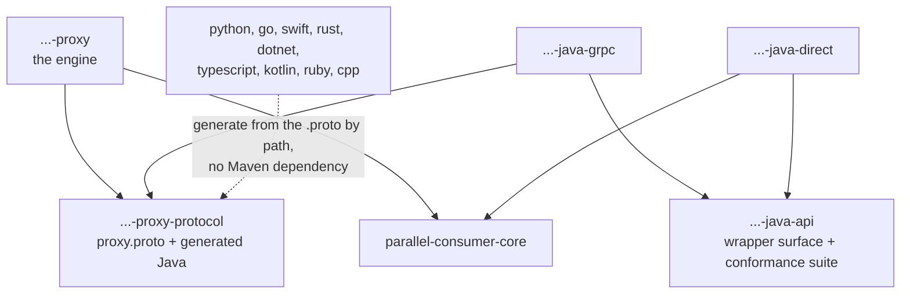
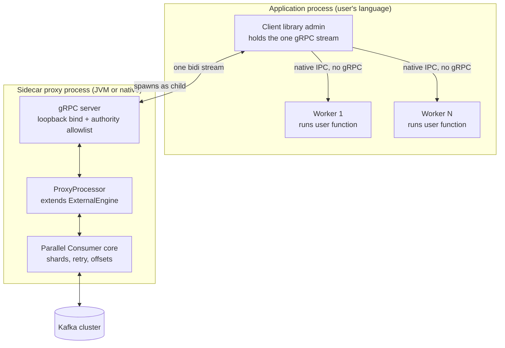
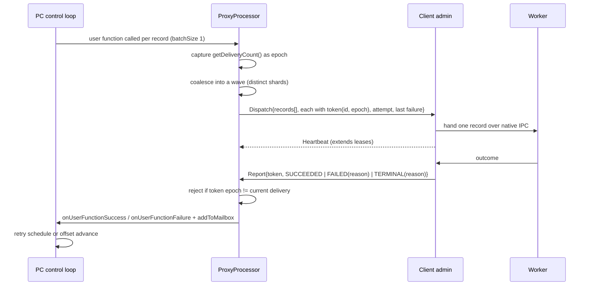
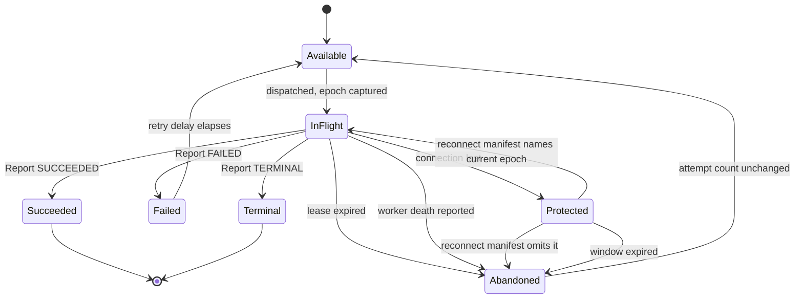
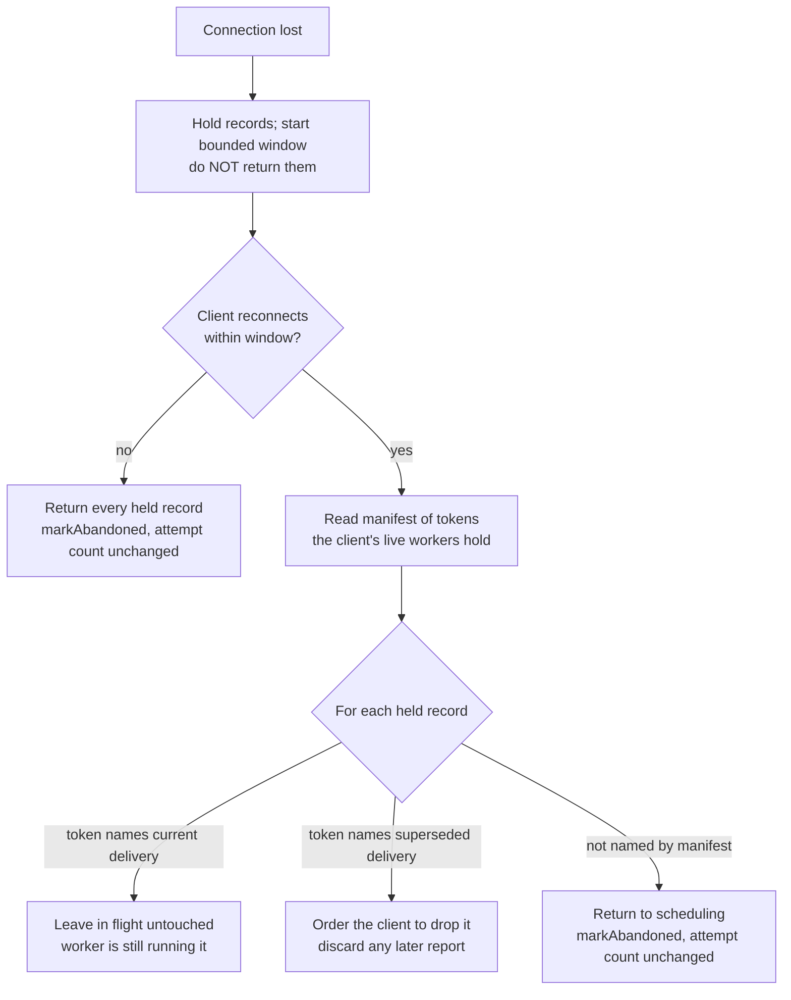
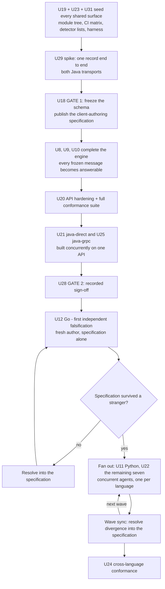
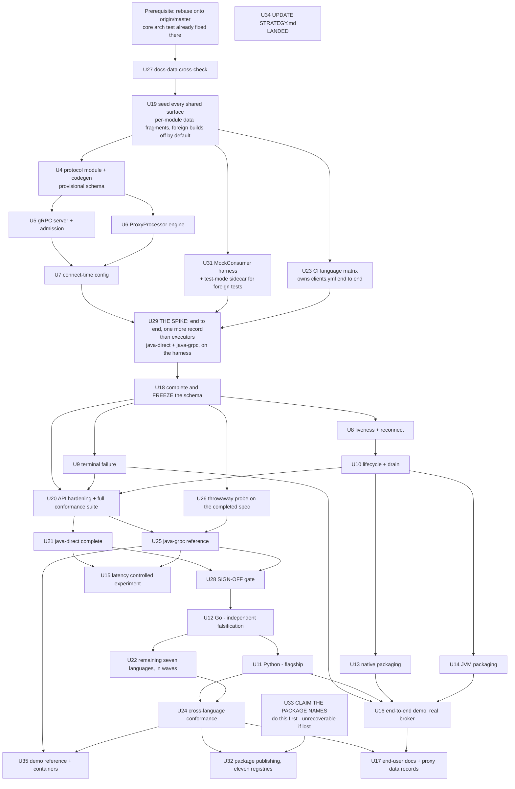

# Language Proxy - Plan

Tracking issue: astubbs#242. Branch `feats/proxy-requirements`. Module `parallel-consumer-proxy`.

Product Contract preservation: restructured, no scope change. Surviving requirement IDs (R1-R8, R10-R22, R29, R31, R36, R38) keep their text and numbers verbatim because landed work cites them. Nine requirements written against the deleted credit model and the superseded supervision model are **retired, not rewritten in place**: R9, R23, R24, R25, R26, R27, R28, R33, R37. Their subject matter is re-derived under new IDs from R39 so that no ID ever means two things across documents. Retired IDs and the gaps at R30, R32, R34 are never reused. R35 was previously listed among them and is not one of them; it is **reversed**, and its own paragraph below says on what argument.

Acceptance Examples carry the same rule: AE1-AE6, AE8, AE12 and AE14 survive with their numbers; AE7, AE9, AE10, AE11, AE13 and AE15-AE18 are retired with the credit model and the old connection-loss semantics, and new examples start at AE19.

R6 is also **changed, not preserved**. It said the success report's produce payload was "defined but unused in v1, reserved for exactly-once", and the spike now produces a response record, so that sentence would be false. Rather than let the spike quietly contradict a requirement, R6 is amended: **the payload is used in v1.** Producing back to Kafka is a very common Parallel Consumer pattern, and KTD7 already forbids workers producing directly, so the payload is the only sanctioned route for worker output - which makes it load-bearing rather than reserved. The alternative was to keep R6 untouched and make the spike's response an outcome report rather than a record, which is a smaller spike that leaves the return path unproven. Exactly-once across the boundary stays deferred; the payload works at-least-once in v1.

R7 is **amended, not preserved**. It said terminal failures are resolved "using the destination and offset-advance semantics of core's scheduled dead-letter queue". That feature does not exist in `parallel-consumer-core` - zero matches in the main sources, tracked open as astubbs#149 - so R7 cited a mechanism it could not inherit, and KTD9 was already honest about it while R7 was not. R7 now says: **the proxy defines the destination and offset-advance semantics itself**, behind the one interface KTD9 confines, and does not claim to borrow them. The DLQ question is **revisited before v6** rather than settled now - if astubbs#149 lands first, the proxy adopts it and the interface is the seam; if it does not, the proxy's own resolution ships and stays.

R35 is **reversed, not retired**, and it is worth separating from the nine above because those went out with the credit model while this one was a security posture reversed on unrelated grounds. R35 forbade the Kafka credentials travelling the protocol, because the loopback surface is unauthenticated, and rejected argv because `/proc` is world-readable. R48 now says the opposite, on the argument that the sidecar accepts exactly one connection, from the process that spawned it, and does nothing until configured - so nothing sits on disk or in `/proc`. **That argument does not fully hold, and the reversal is being kept anyway with the gap recorded rather than papered over.** KTD11 states what is and is not enforceable, what escalation follows from it, and the mitigation the plan declines. The falsifier is explicit: if any local process can take the admission slot before the spawning application does, the "from the process that spawned it" half of the argument is false and R35's original posture was right.

R47 is **amended, not preserved**. It said the proxy decides how many executors the client should run "and when", which reads as a run-time decision the proxy revises. It now says: **the executor count is a pure function of connect-time configuration, computed once and sent once in `Configured`.** The reason is in KTD38 - deriving it from anything the proxy observes about the client is a closed feedback loop between the proxy and the client's capacity, which is the deleted credit ledger with a different noun. `SetExecutorCount` stays in the schema as a declared-but-unused capability, reserved the way R6's payload once was, so a later revision can add a dynamic count additively.

R66 is **amended, not preserved**. It said every seeded module "builds and tests green from the moment it is seeded". That is not true and does not need to be: a module nobody has started yet has nothing to be green about. It now says: **every seeded module is green at each decided checkpoint, and between checkpoints a module whose wave has not begun is skipped rather than red.** The property R66 actually protects is interpretability - a red job during the fan-out must mean a real failure - and skipping delivers it without demanding vacuous greenness from ten empty modules. KTD35 names the checkpoints.

R74 is **retired, not rewritten** (user decision, 2026-08-14). It required the project website to host a running demo per language; that hosted gallery is cut from this plan's scope, because no hosting substrate exists - the docs site it would ride on is itself parked (astubbs#208) - and hosting is not this plan's to deliver. The per-language demo containers stay (R72, R73). The idea was liked, not rejected: it is parked in `docs/inflight/parked-demo-gallery.md` for whenever the docs-site question reopens. The ID is never reused. The same 2026-08-14 amendment added the demo-UX requirements R75-R77, continuing the numbering, and widened R73 to the three-mode contract.

Two requirements are **changed, not preserved**: R15 and R16. They were written to test specification completeness with one independent Go author and one effort number. The strategy is now many client languages built concurrently by separate authors, which turns a single anecdote into a distribution - where every author trips is a specification defect, where one author trips is a language quirk. The IDs keep their subject and their numbers; their text is rewritten around the larger sample.

U-IDs follow the same never-renumber rule. `U30` is a deliberate gap: it briefly held a second, record-level spike before the spike converged to a single `MockConsumer`-driven vertical slice at U29, and the number is not reused.

`KTD<N>` numbering is plan-local. It does not correspond to the retired plan's KTDs, and neither does the KTD numbering used in `docs/inflight/branch-language-proxy.md`, which U17 repairs. `ASM3` is likewise already taken in that document for a settled demand question, so this plan's assumptions skip it.

---

## Goal Capsule

**Objective.** Ship a sidecar process that runs Parallel Consumer and hands Kafka records to an application's workers over loopback gRPC, taking back per-record outcomes, so a runtime with a global interpreter lock gets real key-ordered parallelism from one consumer-group member. Then ship client libraries for many languages, each written from the frozen protocol specification alone, built concurrently. Java ships twice - over the hop and directly on the engine - as the control.

**Authority hierarchy.** Requirements (`R<N>`) win on product behavior. Key Technical Decisions (`KTD<N>`) win on implementation mechanism inside their cited requirements. Acceptance Examples illustrate; they never amend. Where this plan and a repo convention in `AGENTS.md` disagree, the repo convention wins.

**Execution profile.** Deep. Twenty-eight active units; six already landed. The two packaging units, U13 and U14, are deliberately independent so they can run in parallel, as are U21 and U25, which are built concurrently against U20's shared API. Correctness units U8, U9 and U10 precede every client unit, because a client written against a leaky lifecycle bakes the leak into ten languages and because U20's conformance suite tests messages only those units teach the engine to answer.

**Stop conditions.** Stop and surface rather than guess when: a unit needs any change to `parallel-consumer-core`'s public behavior beyond U3's, which has already landed - KTD16 and KTD17 both decline further core change; the duplicate-code gate moves within 0.3% of its 5% cap; or the protocol would need a field removed or redefined rather than added. The one sanctioned exception to the core-change stop is post-v6 exactly-once, per KTD7, and it is not in this plan's scope.

**Tail ownership.** This plan does not own commit, push, or PR. Land work on `feats/proxy-requirements`.

---

## Product Contract

### Summary

A sidecar process hosts Parallel Consumer and exchanges records and outcomes with one client library over a loopback gRPC bidirectional stream. The client library fans out to workers inside itself. Parallel Consumer keeps shard ordering, retry scheduling and offset committing on the JVM side, so the application never encodes offsets and never speaks to a broker. The proxy module produces two artifacts: a JVM jar and a GraalVM native executable.

Client libraries ship for many languages, built concurrently by separate authors against a frozen protocol specification. Java ships **twice** - once over the RPC hop and once sitting directly on the engine - because that pair is the experimental control that isolates the hop from the language.

### Problem Frame

Parallel Consumer gives Kafka consumers key-ordered concurrency beyond partition count, and it is a Java library. Teams running Python or Go get the ordering guarantee from neither. Python additionally gets no concurrency, because its global interpreter lock caps one process at one core. Share Groups, which now supply parallel consumption, deliver out of order. Users asking for a Python client have confirmed they need the key-ordered concurrency specifically, not the parallel consumption they can already get.

Reimplementing the engine per language multiplies the delivery-semantics surface that this project's own reliability track exists to protect. The engine has to stay in one place, and the languages have to reach it.

### Actors

- A1. **Worker** - an execution context that runs the user's function against records it receives from its client library, and reports each record succeeded, failed, or terminally failed. It is a process where the language needs one and a thread or goroutine where it does not. Workers do not hold the connection to the proxy; their client library's admin does. An application runs one or more; the single-worker case is just the smallest one.
- A5. **Client author** - whoever writes one language's client library from the protocol specification alone. Distinct from A4 and from whoever wrote the proxy; the separation is what makes the specification testable.
- A2. **Sidecar proxy** - the process hosting Parallel Consumer, owning shard assignment, retry scheduling and offset committing.
- A3. **Kafka cluster** - unchanged and unaware of the proxy; sees an ordinary consumer group member.
- A4. **Operator** - whoever deploys the application and its sidecar together and configures the consumer.

### Requirements

**Delivery and outcomes**

- R1. The proxy hands records to a worker without a network round trip per record.
- R2. Records are delivered under PC's configured ordering, preserving the shard as the unit of ordering.
- R3. A worker reports each record's outcome independently of every other record's, and out of order.
- R4. A failure report returns the record to PC's existing retry scheduling, with the same effect as a user function throwing in-process.
- R5. Each delivered record carries the PC-derived state an in-process user function receives, not only the Kafka record: at minimum the attempt count and the time and reason of the last failure. The failure reason is worker-supplied text that may embed record payload, so it is treated as untrusted input per R8.
- R6. The success report carries an optional payload of records for the proxy to produce, and the proxy produces them with its own producer. This is the only sanctioned route for worker output, and it is used in v1 rather than reserved. Exactly-once across the boundary remains deferred, so the produce is at-least-once.
- R50. The proxy dispatches several records in a single protocol message, and each record in that message is reported independently. Under restricted ordering those records are drawn from distinct shards; under unordered processing there is no shard constraint to honour.

**Terminal failure**

- R7. A worker can declare a record terminally failed, and the proxy resolves it rather than retrying it forever, with destination and offset-advance semantics the proxy defines itself. Core has no scheduled dead-letter queue to borrow them from (astubbs#149, open), and whether to adopt one is revisited before v6.
- R8. A terminally failed record is surfaced somewhere durable and reportable rather than silently dropped. That destination preserves the source topic's confidentiality and retention expectations: readable only by the audience already entitled to the source topic, bounded retention, and no record payload written to ordinary application logs. The same constraint applies to the worker-supplied failure reason of R5 wherever it is logged, on the retry path as well as the terminal one, and the proxy bounds its length and strips control characters before it reaches any log.

**Configuration**

- R10. The five object-valued options - `consumer`, `producer`, `meterRegistry`, `metricsTags` and `retryDelayProvider` - are not exposed over the protocol.
- R36. The sidecar's topic or pattern subscription is supplied at startup and fixed for the process lifetime.
- R39. Configuration reaches the proxy connect-time over the protocol, expressed in the application's own language. The proxy reads no configuration file, no environment variable, and no shell.
- R40. Max concurrency is supplied by the application at connect time and bounds the number of records the proxy holds in flight.

**Connection model**

- R41. The proxy serves exactly one client connection at a time, and rejects a second concurrent one. Fan-out to workers happens inside the client library, and the proxy does not learn whether the far end is threads or processes. A client reconnecting under R42 re-uses the same admission slot rather than opening a second connection.
- R47. The proxy decides how many executors the client should run and says so over the protocol, once, in `Configured`. The count is a pure function of the configuration the application supplied at connect time and of nothing the proxy observes about the client. The client library creates the executors using its own language's mechanism. The proxy never learns what the user's function is.
- R70. The client library holds records the proxy has dispatched but no executor has taken, in a queue whose depth, hand-out order, lease treatment and shutdown behaviour are specified once for every language rather than invented per client.

**Connection loss and liveness**

- R42. Losing the connection does not immediately return that connection's records to scheduling. The proxy protects them for a bounded window.
- R43. A client reconnecting within that window opens with a manifest of the delivery tokens its live workers still hold. The proxy reconciles: tokens naming the current delivery stay in flight untouched, tokens naming a superseded delivery are ordered dropped, and records the manifest does not name are returned to scheduling.
- R44. Records still unaccounted for when the window expires are returned to scheduling with their attempt count unchanged.
- R45. The client library reports the death of one of its workers, naming the tokens that worker held, so those records return to scheduling without waiting for the window.
- R46. Each delivery carries a liveness lease, extended by connection-level heartbeats. Expiry returns the record to scheduling with its attempt count unchanged. The lease bounds nothing about how long a worker's function may run. During a connection loss no heartbeat can arrive, so leases are suspended and R42's window alone governs the held records; leases resume on reconnect for the records the manifest keeps in flight - otherwise every lease would expire inside the window and R43's manifest would have nothing left to reconcile.
- R49. The proxy bounds the records it holds so that buffering cannot outrun commit progress.

**Lifecycle**

- R11. The sidecar's lifetime is bound to the application's, not to any single worker: when the application goes, the sidecar exits and its group membership ends, so a vanished application resolves as an ordinary rebalance.
- R12. Shutdown drains or returns in-flight work rather than abandoning it.
- R52. The application starts the proxy as a child process, and the proxy exits when its parent does, including when the parent is killed without running any code.

**Protocol and clients**

- R13. The protocol has a machine-readable specification sufficient to generate a working client library.
- R14. A Python client library ships, idiomatic enough to be the flagship, with generated transport and a hand-finished surface.
- R15. Every client library other than the first Java one is written from the protocol specification alone, by an author that did not write the proxy and did not write another client, using the same split as R14. Go is the first such client and gates the fan-out to the rest.
- R16. The effort spent on each client library is recorded against a budget agreed before that client starts. The record is read as a distribution, not a single number: a point where every author trips is a specification defect, and a point where one author trips is a language quirk.
- R38. A protocol revision keeps client libraries built against earlier revisions working: capabilities are added, never removed or redefined.
- R53. The Java client ships as one API with two transports: one that reaches the engine over the RPC hop, and one that binds directly to the engine with no protocol underneath. One test suite runs against both and asserts identical behaviour, so the hop is the only variable between them.
- R59. The direct-transport Java client is the reference definition of the wrapper surface that every other language mirrors.
- R54. The protocol schema is frozen and published as a client-authoring specification before any client implementation begins.
- R55. Every shared surface is created by the seeding step before any fan-out agent starts. A fan-out agent adds files only inside its own module directory and edits no shared file.
- R66. Every seeded module is green at each checkpoint KTD35 names, and a module whose wave has not begun is skipped rather than red, so that a red job during the fan-out always means a real failure.
- R71. Each client library's public surface passes an idiomatic-API review in its own wave, confirming it reads native to that language rather than as a transliteration of the Java reference.
- R58. The client-authoring specification accumulates each wave's resolved divergences, and ships as the client-authoring documentation.
- R60. No client language beyond the reference implementation begins until that reference has passed code review and the shared conformance suite, recorded as an explicit dated sign-off.
- R61. Each client library lands its own module maturity row, testing-evidence entry, feature record and a brief orientation document within its own wave, not batched into a later documentation change.
- R62. The documentation-data gate fails a module that has no maturity row, rather than passing it silently.
- R63. Every client is a Maven module. Non-JVM clients are thin Maven wrappers that invoke their language's own build and test tooling, so one build entry point drives all of them while each language keeps its idiomatic build underneath.
- R64. The protocol schema lives in a module of its own that the engine depends on. No client depends on the engine in order to obtain the schema.
- R65. The direct-transport Java client builds and passes its tests with no protobuf and no gRPC on its classpath, and the build fails if either appears.

**Security**

- R17. The proxy binds loopback only by default and has no authentication in v1.
- R18. Binding to a non-loopback address takes effect only when a separate opt-in setting is also present, whose name states that it exposes an unauthenticated surface, and the proxy warns on startup naming the absence of authentication and the surface's full recorded capability: it can advance the application's offsets and - since R48 reversed R35 - it receives the Kafka credentials and a property map KTD11 records as escalating to arbitrary class instantiation in the sidecar JVM. A warning that names only offsets understates what the opt-in exposes.
- R29. The proxy rejects any connection whose declared target authority is not in an operator-configurable allowlist, enforced on every connection including loopback binds. The allowlist defaults to the loopback host forms and the configured bind address; a connection declaring no origin is accepted while one declaring an unlisted origin is rejected. The threat is a browser page the operator visits reaching the loopback listener cross-origin.
- R48. The Kafka client credentials and connection settings the proxy needs travel the protocol from the application that spawned it. This reverses R35 and sits here, beside the other security requirements, because it is a credential-handling posture rather than a configuration convenience - KTD11 records what the reversal's argument does and does not establish.

**Packaging, proof and documentation**

- R19. Each client library ships a runnable example against a real broker.
- R20. One command brings up a broker, the proxy, a workload and a worker using a client library, and shows records being processed concurrently.
- R72. Every client library ships a demo, a runnable example and its applicable tests, and the demo ships as a container so anyone can run any language's demo without knowing how to build that language. Java is included, not exempted.
- R73. Every demo offers the same three modes: the user's **own cluster** (bootstrap servers and topic supplied by the user), a real Testcontainers **broker** (the default), and a **mock**. The flag names, the environment variables, the interactive prompt wording and the non-interactive fallback are identical in all eleven, so a visitor moving between two languages' demos sees the same behaviour.
- R75. Every demo can be pointed at the user's own Kafka cluster: bootstrap servers and topic travel the same UX path as the mode selection - a prompt on a TTY, flags and environment variables otherwise - so a user watches any language's demo consume their real data. Anything the user supplies to reach their cluster is subject to the existing credential-hygiene rules: never logged and never echoed, in a demo exactly as in the proxy.
- R76. Every demo's code carries a clearly marked serde extension point - a comment block reading `PLACE SERDE SETUP IN YOUR LANGUAGE HERE`, rendered idiomatically per language - where the user drops their own deserializer so their own data renders. The demo defaults to a bytes/string fallback that works without touching it. This is a designed modification surface, not an afterthought: the demo doubles as the user's starting template.
- R77. Every demo prints reading statistics - records consumed, processing rate, and per-key or per-partition spread as fits the language - and shows a sample of message content, dynamically rate-limited: on a replay or backlog it samples rather than spamming the screen. The sampling shape is decided once in the reference demo and mirrored per language.
- R21. End-user documentation covers installing a client library, running the sidecar, and the ordering and retry semantics. `README.adoc` is generated, so edits belong in `src/docs/README_TEMPLATE.adoc`.
- R22. A test demonstrates a non-Java application processing more records concurrently than the topic has partitions, across several worker processes, under key ordering, with the resulting out-of-order commits surviving a restart without reprocessing completed work.
- R31. v1 measures median and p99 poll-to-completion latency through the proxy and for in-process PC on the same workload, and reports both.
- R51. The proxy module produces both a JVM artifact and a GraalVM native executable, from the first release, and the operator chooses.
- R67. Each client library is published to its language's native package manager, installable by that language's ordinary means.
- R68. The sidecar and every client share one version number and release in lockstep - one release with eleven publish steps, not eleven release processes.
- R69. The package name is claimed on every registry that permits squatting, before any of them is needed.
- R56. Non-Java client modules are excluded from the duplicate-code detectors. The Java client modules stay in scope and satisfy the gate by sharing one API module rather than by exemption.
- R57. CI builds and tests every client library as a matrix entry, not as an appended step.

### Acceptance Examples

- AE1. **Ordering holds within a shard**
  - **Covers:** R2
  - **Given:** two records share a key and both are available.
  - **When:** the first is dispatched to a worker.
  - **Then:** the second is not dispatched until the first is reported.
- AE2. **Out-of-order completion commits correctly**
  - **Covers:** R3
  - **Given:** records at offsets 10, 11 and 12 are all in flight.
  - **When:** 12 and 10 are reported succeeded and 11 is still running.
  - **Then:** the committed offset is **11** - `PartitionState.getOffsetToCommit()` is `getOffsetHighestSequentialSucceeded() + 1`, and the highest sequentially succeeded offset is 10 - and the encoded offset metadata records 12 as complete.
- AE3. **Redelivery carries attempt count and failure reason**
  - **Covers:** R4, R5
  - **Given:** a record was reported failed with reason text.
  - **When:** the proxy redelivers it after its retry delay.
  - **Then:** the delivery carries attempt count 2 and the previous reason and failure time.
- AE4. **Terminal failure is never redelivered**
  - **Covers:** R7, R8
  - **Given:** a worker reports a record terminally failed.
  - **When:** the proxy resolves it.
  - **Then:** the record appears at the terminal destination, the offset advances, and the record is never dispatched again.
- AE5. **Application killed, no offsets invented**
  - **Covers:** R11, R12, R52
  - **Given:** the application is killed with SIGKILL while records are in flight.
  - **When:** the proxy notices its parent is gone.
  - **Then:** the proxy exits and leaves the group, and no offset is committed for a record no worker reported.
- AE6. **Non-loopback bind refuses without the opt-in**
  - **Covers:** R17, R18
  - **Given:** configuration asks for a non-loopback bind address.
  - **When:** the opt-in setting is absent.
  - **Then:** the proxy refuses to start and names the missing setting.
- AE8. **One key is never at two workers**
  - **Covers:** R2, R42
  - **Given:** key ordering and a busy shard.
  - **When:** any sequence of dispatches, disconnects and reconnects occurs.
  - **Then:** no two records sharing a key are ever in flight at two workers at once.
- AE12. **Unlisted origin is rejected before any record moves**
  - **Covers:** R29
  - **Given:** the allowlist holds only the loopback forms.
  - **When:** a connection declares an unlisted authority.
  - **Then:** it is rejected before the service method runs, proven by an unchanged application-message counter.
- AE14. **Drain timeout commits what resolved**
  - **Covers:** R12
  - **Given:** shutdown begins with records in flight and the drain timeout elapses.
  - **When:** some records were reported and some were not.
  - **Then:** offsets for the resolved records are committed and the rest are left for redelivery.
- AE19. **Reconnect manifest reconciles three ways**
  - **Covers:** R42, R43
  - **Given:** the connection dropped while records A, B and C were in flight, and the proxy has redelivered nothing.
  - **When:** the client reconnects within the window with a manifest naming A at its current delivery and B at a superseded delivery.
  - **Then:** A stays in flight untouched, B is ordered dropped, and C returns to scheduling with its attempt count unchanged.
- AE20. **A reported worker death returns records immediately**
  - **Covers:** R45
  - **Given:** a worker process holding two records exits.
  - **When:** the client library reports its death with those tokens.
  - **Then:** both records return to scheduling before the window elapses, with attempt counts unchanged.
- AE21. **A slow worker keeps its record; a silent connection does not**
  - **Covers:** R46
  - **Given:** a worker's function runs for longer than the lease period.
  - **When:** its client keeps heartbeating.
  - **Then:** the record stays in flight indefinitely; and when heartbeats stop instead, the record returns with its attempt count unchanged.
- AE22. **A wave never contains one key twice**
  - **Covers:** R50
  - **Given:** key ordering and many available records across few keys.
  - **When:** the proxy assembles a dispatch message.
  - **Then:** no two records in that message share a shard.
- AE23. **The native binary exercises every message type**
  - **Covers:** R51
  - **Given:** the native executable built with `--no-fallback`.
  - **When:** a smoke run round-trips every message the protocol defines.
  - **Then:** no reflection registration error occurs on any path.
- AE24. **The two Java transports are interchangeable**
  - **Covers:** R53, R59
  - **Given:** the Java client's transport-parameterised test suite.
  - **When:** it runs against the direct transport and then against the gRPC transport.
  - **Then:** both pass the same assertions with no transport-specific case, and the only difference in the results is latency.
- AE25. **Concurrent client work does not collide**
  - **Covers:** R55
  - **Given:** the shared surfaces have all landed and the schema is frozen.
  - **When:** two client authors work in separate workspaces on the same branch.
  - **Then:** their changes touch no file in common, and merge without conflict.
- AE26. **The wrapper frame is enforced, not asserted**
  - **Covers:** R65, R59
  - **Given:** the direct-transport Java client module.
  - **When:** a protobuf or gRPC dependency is added to it.
  - **Then:** the build fails, naming the banned dependency, rather than compiling and shipping a leaked abstraction to nine other languages.
- AE27. **Fan-out is gated on the sign-off, not on the code existing**
  - **Covers:** R60
  - **Given:** the reference implementation compiles and its own tests pass, but the sign-off has not been recorded.
  - **When:** a fan-out unit is started.
  - **Then:** it is blocked, and the missing sign-off is the stated reason.
- AE29. **A not-yet-started module is skipped, never red**
  - **Covers:** R66
  - **Given:** every module seeded and only the canary implemented.
  - **When:** the full build and the CI matrix run at a KTD35 checkpoint.
  - **Then:** every job for a started module is green and every not-yet-started module's row reports skipped with its reason, so a red job later in the fan-out is a real failure rather than expected noise.
- AE30. **The client queue hands out in order and releases what it never ran**
  - **Covers:** R70
  - **Given:** a client with one executor and two records dispatched in one message.
  - **When:** the second record is still queued and `Shutdown` arrives.
  - **Then:** the first record was handed out before the second, the queued record is reported `RELEASED` rather than dropped or invented an outcome for, and it returns to scheduling with its attempt count unchanged.
- AE31. **Two languages' demos behave identically**
  - **Covers:** R73, R75
  - **Given:** the Rust demo and the Python demo.
  - **When:** each is run with no arguments on a TTY, with the mock flag, with the own-cluster flags naming a bootstrap server and topic, with the mock environment variable, and with no TTY and no flag.
  - **Then:** all five behaviours match between the two, including the prompt wording and the non-interactive fallback.
- AE32. **A demo runs without its language's toolchain**
  - **Covers:** R72
  - **Given:** a machine with Docker and nothing else installed.
  - **When:** any language's demo container is run.
  - **Then:** it starts, processes records concurrently, and needs no compiler, interpreter or package manager on the host.
- AE28. **A module without a maturity row fails the build**
  - **Covers:** R62
  - **Given:** a module listed in the root `pom.xml` `<modules>`.
  - **When:** its `docs/data/module-maturity.d/` fragment is missing, and no deferral is recorded for it.
  - **Then:** `bin/check-docs-data.sh` fails and names the module.

### Success Criteria

- Latency through the proxy stays within a stated multiple of the in-process baseline on a named workload: p99 within 1.5x, median within 1.25x. Measured Java-over-the-hop against Java-direct, so that language and runtime are held constant and the hop is the only variable.
- Each client lands inside its recorded budget without changes to the proxy. A proxy change needed to finish any client falsifies the premise that per-language clients are cheap. A specification change needed by every client falsifies the specification rather than the premise, and is the outcome the fan-out exists to detect.
- A reader of the protocol specification alone can implement a client without reading the proxy's source.
- The Java-over-hop client and the Java-direct client pass the same conformance suite unmodified. If they diverge, the wrapper frame is wrong, and that is a louder signal than any single client's difficulty.

### Scope Boundaries

**Deferred for later**

- **Transactional exactly-once across the boundary - post-v6, and a core change is sanctioned to reach it.** Not "the shape keeps the door open": the door is shut today, because `ExternalEngine`'s constructor rejects `PERIODIC_TRANSACTIONAL_PRODUCER` outright, so EoS through the proxy is impossible rather than merely unbuilt. R6's payload is at-least-once in v1 and says so. What changed is the price we are willing to pay: modifying core to lift that restriction is now on the table post-v6, where before it was ruled out. KTD7 records the rest.
- **The sidecar's admission and credential posture - post-v6.** R17 states the v1 no-authentication posture and R48 sends credentials over that unauthenticated surface. KTD11 records, unmitigated and in full, what the reversal's argument fails to establish, what a captured admission slot escalates to, and the one mitigation already available and declined. Nothing here is actioned in this plan; it is recorded so a reader in six months can see the trade rather than infer it.
- **A dynamic executor count.** R47 and KTD38 make the count a pure function of connect-time configuration, and `SetExecutorCount` ships declared and unused. A dynamic count needs its own KTD first, stating the observation window, the damping, what happens to already-dispatched records when the count falls, and how the value is proven not to drift - because without those four it is the credit ledger again.
- Dynamic subscription changes at run time. R36 fixes the subscription for the process lifetime.
- Worker affinity for a shard, which would give worker-local per-key state without a state store. Interesting, and a scheduler-fairness question that should not be decided alongside the interaction model.
- Conformance transcripts as an executable specification. Worth revisiting when a third language is real.
- **Wrapping the core Kafka client APIs - admin, then producer, then possibly never the plain consumer.** Not in this plan and not a commitment anywhere. The sidecar already embeds a full Java Kafka client, so exposing those over the same protocol is *available*, which is not the same as being a good idea. U34 records it in `STRATEGY.md` as a staged possibility with its phasing and its reasons, in the register it belongs in: something to try, starting with the smallest subset, extended on evidence. The identity question it raises - whether this is Parallel Consumer for other languages or the Kafka client for other languages - is earmarked for investigation, not answered.

**Deferred to follow-up work**

- A shared serving module extracted from this module and `feats/web-gui`. KTD12 explains why the extraction has to come after both land.
- **The hosted demo gallery - parked, not this plan's to deliver.** R74 (retired, 2026-08-14) asked the website to host a running mock-backed demo per language with a prettified snippet of the client code beneath each visual. It was liked; it has no substrate - the docs site is itself parked (astubbs#208) - and it would be this plan's only internet-facing deployment, with a security posture nobody has recorded. Parked in `docs/inflight/parked-demo-gallery.md` with the reasoning needed to restart it.
- Whether terminal-failure resolution moves to a core dead-letter queue. **Reassessed before v6, not settled now.** astubbs#149 is open and the feature does not exist; R7 no longer claims to borrow its semantics. KTD9 sizes the seam either way, so the reassessment is a choice rather than a rewrite.

**Outside this product's identity**

- Reimplementing the engine per language. The whole premise is one engine reached by many languages.
- Any language-specific capability in the protocol. The protocol must not assume a process-pool fan-out, nor a thread-pool one - Python needs processes for the GIL and Go needs neither, and a protocol that encodes either forecloses the other.

### Dead ends - recorded so they are not re-proposed

**Compiling PC to a native shared library** (C-ABI via `native-image --shared`) so non-JVM languages run the engine in-process with no protocol. Rejected on direction, and on three further grounds. The cleared native-image gate produced an *executable*, not a `--shared` export, which differs materially in entry-point surface, isolate and thread-attach semantics, two garbage collectors sharing a process, and callbacks re-entering from foreign threads - none of which was tested. The Temporal precedent usually cited is narrower than it looks: Temporal's Go and Java SDKs are independent implementations, not bindings over its shared core. Decisively, it is the worst available shape for agentic development, because its failures are segfaults and memory corruption with no useful stack trace, where gRPC and protobuf produce legible, fast feedback. This project is built agentically, so debuggability is a first-class selection criterion.

**Any credit, demand, or advertised-capacity mechanism** under any name: a per-worker credit ledger, an outstanding-request count, "a worker requests N and the proxy sends at most N", or a roster-times-depth capacity number. Four consecutive review rounds on this seam each produced the next round's defect. Backpressure is KTD6 and nothing else.

**Any proxy-side quantity derived from observed client behaviour and then sent back to the client.** This is the same dead end reached by a route the names above do not block, and it was reached once already in this plan: an executor count recomputed from observed report concurrency and re-sent whenever the observation moved. That is a closed feedback loop between the proxy and the client's capacity - structurally the deleted ledger with "observed report concurrency" substituted for "advertised capacity" - and it arrives carrying every question the ledger died of: no observation window, no damping, no stated behaviour for in-flight records when the number falls, no drift check. **The rule is the property, not the vocabulary:** every capacity or count instruction the proxy sends the client is computed from configuration the client supplied, never from what it watched the client do. Per-record delivery state and manifest reconciliation are client-reported state given back, not capacity instructions - the Definition of Done states the scope precisely.

---

## Planning Contract

### Key Technical Decisions

KTD27 is the tie-breaker. When a fork below is finely balanced, or a new one appears during implementation, resolve it there rather than re-deriving the argument.

**The frame**

- KTD1. **The wrapper is the layer, and Java is the degenerate case of it.** (session-settled: user-directed - chosen over two architectures, one native-Java and one proxied: "PC in every language" only holds if every language gets the same client wrapper and it looks native to the user.) Java's wrapper is that same layer with one fewer hop, sitting directly on the engine with no protobuf underneath. One client model with a missing layer in the Java case. Governs R13, R14, R15.

- KTD2. **Transport is gRPC bidirectional streaming, with a `.proto` as the machine-readable specification.** (session-settled: user-directed - chosen over a native shared library and over hand-rolled framing: gRPC produces legible failures in an agentically-built project, and both feasibility gates cleared on it.) Verified on gRPC 1.73.0, protobuf-java 3.25.5, GraalVM CE 25.0.2. Do not reopen. Governs R1, R13, R38.

- KTD3. **One connection per application; fan-out happens inside the client.** (session-settled: user-directed - chosen over many direct worker connections: several connections is what produced round-robin allocation, no-starvation guarantees, and the attribution clause; one connection deletes that seam instead of patching it.) An admin holds the stream and relays to its workers - a goroutine talking to worker goroutines in Go, a process talking to worker processes in Python. Apache Beam's SDK harness has the same shape, fanning out internally with threads for Java and Go and one subprocess per core for Python. The honest cost: fan-out bugs move inside the client and get written twice, in each language's native idiom. Governs R41, R47.

- KTD4. **The engine puppeteers; the client spawns.** (session-settled: user-directed - chosen over the client supervising the sidecar, and over the sidecar spawning workers: the first keeps a bind-race election and a detached process group in every client language, and the second forces the user's function to be an importable command rather than a closure.) Policy in the proxy, mechanism in the client. One app process starts one sidecar, so there is nothing to elect. The proxy never learns what the function is. Governs R47, R52.

**Behavior**

- KTD5. **Configuration is code, delivered connect-time over the protocol.** (session-settled: user-directed - chosen over config files and environment variables: the client library already holds the user's settings in the user's own language, so generated stubs carry them without a translation layer.) No config files, no environment variables, no shell. **Two named exceptions, both deliberate and both outside the shipped client library.** The test-mode sidecar of U31 selects its `MockConsumer` fixture with a `--mock` flag rather than over the protocol, because routing fixture selection through the wire would put a test-only field in a frozen schema that ten clients must implement and none may use in production - a worse outcome than an exception on a binary that is not the shipped artifact. And a **demo is an application, not a client library**: R39 governs how configuration reaches the proxy, and a demo's own `--mock` flag or `PC_DEMO_MODE` variable is ordinary application input, not proxy configuration. State both, because someone will otherwise read KTD40's flag as a violation. Governs R39, R48.

- KTD6. **Backpressure is the engine's in-flight target, and nothing else.** `ExternalEngine.getTargetOutForProcessing()` returns `getMaxConcurrency() * getBatchSize()`, and `calculateQuantityToRequest()` recomputes `target - numberRecordsOutForProcessing` on every control-loop pass. The proxy therefore fetches exactly what it has room for, every pass, with no counter of its own. This is what replaces the deleted credit ledger: not a substitute mechanism, an absence of one. `WorkManager.numberRecordsOutForProcessing` is an accumulator whose drift stalls the consumer silently with no exception (`docs/solutions/test-flakiness/pc-silent-stall-under-contention-2026-07-29.md`), so the proxy adds no second accumulator and derives every quantity from state that already exists. Governs R40, R49.

- KTD38. **The executor count is a pure function of connect-time configuration, sent once.** The proxy computes it from max concurrency and nothing else, puts it in `Configured`, and never revises it. **This decision exists because the plan had already reconstructed the credit ledger here under another name:** an `ExecutorCountPolicy` deriving the count from *observed report concurrency* and re-sending `SetExecutorCount` whenever the observation moved. Rename "advertised capacity" to "observed report concurrency" and the structure is identical - a closed feedback loop between the proxy and the client's capacity - and so are the unanswered questions: over what window is concurrency observed, what damps it, what happens to records already dispatched when the number falls, and how is the value proven not to drift. Four consecutive review rounds died on that seam once already. `SetExecutorCount` stays **in the schema, declared and unused**, the way R6's payload was once reserved, so a dynamic count remains an additive change under R38 rather than a breaking one - but adding it needs its own KTD answering those four questions first. **The general form, which is what a reviewer should check:** no capacity or count instruction the proxy sends the client is derived from anything the proxy observed the client do - the Definition of Done states the scope, and the exemptions for per-record delivery state, precisely. Governs R47, R40.

- KTD39. **The client's queue between dispatch and executor is specified once, for all ten languages.** KTD6 deletes host-side flow control and KTD3 puts fan-out inside the client, and the consequence neither of them states is that the gap between the engine's in-flight target and the client's executor count **becomes a queue inside the client library**. Leaving it unspecified exports an ordering-and-liveness problem to ten independent authors, which is the failure this plan exists to avoid, relocated one boundary outward. So it is decided here, written into the client-authoring guide by U18, and exercised as a named conformance scenario by U20:

  1. **The admin always reads the stream; it never applies backpressure by not reading.** The stream also carries heartbeats, `Drop`, `Shutdown` and reconnect traffic, so an admin that stops reading to slow the proxy down head-of-line-blocks its own control plane. It reads continuously and buffers.
  2. **The buffer's depth is max concurrency**, which is the engine's own in-flight ceiling under KTD6 and KTD10, so it can never overflow in a correct system. Overflow is therefore a **protocol violation**, not a load condition: the client fails the stream with a protocol error naming the count, rather than dropping records or growing without bound.
  3. **Hand-out is FIFO** by arrival, and within one `Dispatch` message by the order records appear in it. FIFO is not an ordering guarantee - shard ordering is the engine's, per R2 - it is chosen because it is the one order every language expresses identically, which is what makes ten clients' behaviour comparable instead of ten-way arbitrary.
  4. **A queued record is already leased, and that is fine.** The lease starts at dispatch and is extended by *connection-level* heartbeats (R46), not by the record being worked on, so queue time cannot expire a record. The client must not withhold heartbeats because its queue is full.
  5. **On `Shutdown`, the queue is released, not run and not abandoned.** The admin stops taking records off the queue and reports every queued record with a `RELEASED` outcome, which the engine treats exactly as `markAbandoned(capturedEpoch)` plus a mailbox add: back to scheduling, attempt count unchanged. This is one added outcome value on the existing report message rather than a new message type, and it is the reason the client never has to invent a verdict for work it did not do.
  6. **A count reduction with records queued does not arise**, because KTD38 makes the count fixed for the connection's life. Recorded rather than omitted: it is the first question a dynamic count would have to answer.

  Governs R70, R47, R46.

- KTD7. **Workers never produce to Kafka directly.** (session-settled: user-directed - chosen over letting workers produce, for simplicity: output travelling back through the engine keeps one producer, one transactional id and one epoch check on the JVM side.) **Conflict call-out:** `ExternalEngine`'s constructor rejects `PERIODIC_TRANSACTIONAL_PRODUCER` outright, so exactly-once through the proxy is **impossible today**, not merely unbuilt, and the proxy is at-least-once in v1. The framing has changed since this decision was first written: it is no longer "the shape keeps the door open" but **"the door opens post-v6, with a core change we are now willing to make"** - lifting that constructor restriction is sanctioned as post-v6 work rather than ruled out. Nothing in this plan reads as exactly-once achieved, and any text that does is a defect. Governs R6, R7.

- KTD8. **Fencing is Kafka's own exactly-once model, borrowed.** (session-settled: user-directed - chosen over a client-side request map or dedupe cache: a stateless client cannot have a state bug, and the mechanism already exists in core.) Each delivery carries an epoch, which is `WorkContainer.getDeliveryCount()` captured at dispatch. `markAbandoned(delivery)` records which delivery a return was raised for, and `isReturnForSupersededDelivery()` discards a return naming an ended delivery. The protocol makes that epoch explicit on the wire, echoed verbatim by the worker, which stores nothing. **The discipline is structural: capture the delivery count at dispatch, never read it at return time** - reading it late relabels a stale return as live. **Boundary, stated plainly:** this fences reports and Kafka-side effects. It cannot fence a worker's external side effects, such as a database write or an HTTP call, which is true of any at-least-once system. Governs R3, R42, R43.

- KTD9. **The proxy resolves terminal failures itself, because core has no dead-letter queue.** R7 originally cited core's scheduled dead-letter queue; that feature does not exist in `parallel-consumer-core` - zero matches in the main sources - and is tracked open as astubbs#149. R7 has been amended to stop citing it, so this KTD and the requirement now agree. Whether to adopt a core DLQ is reassessed before v6; this seam is what makes that a choice rather than a rewrite. The proxy therefore produces the record to a configured terminal topic with its own producer and then marks the work container succeeded so the offset advances. Confine the mechanism behind one interface so astubbs#149 can replace it without touching the protocol. **Boundary:** the produce and the commit are not atomic, so a crash between them redelivers the record and can duplicate the terminal entry. Governs R7, R8.

- KTD10. **Dispatch a wave in one message, and keep `batchSize` at 1.** Wire efficiency comes from coalescing several records into one protocol message, not from raising core's batch size. Raising `batchSize` would multiply the in-flight ceiling, because `getTargetAmountOfRecordsInFlight()` is `maxConcurrency * batchSize`. With `batchSize` at 1 the ceiling is exactly max concurrency, and each record arrives at the proxy as its own work container with its own hooks. Under restricted ordering `ProcessingShard` permits at most one in-flight record per shard, so a wave cannot then contain two records of the same key and there is nothing to serialize; under `UNORDERED` a shard is a partition and many of its records are legitimately in flight at once, so the assembler must apply the distinct-shard check only when ordering is restricted. Test that as `options.getOrdering() != UNORDERED`, which is exactly what `ProcessingShard.isOrderRestricted()` computes - that method is **private** and unreachable from the proxy module, so cite the condition rather than the method. Apache Beam dispatches bundles and retries the whole bundle if any element fails, having deliberately rejected per-item outcomes as not worth the complexity. We already have per-item outcome machinery from KTD8, so the trade lands the other way here. Governs R50.

**Security**

- KTD11. **Loopback bind, authority allowlist, and no listener authentication in v1.** The proxy binds `InetAddress.getLoopbackAddress()` explicitly rather than the wildcard address, and a `ServerInterceptor` reads `ServerCall.getAuthority()` and closes an unlisted authority with `PERMISSION_DENIED` before the service method runs. This is the cleared gate's mechanism, proven by unchanged service-invocation and application-message counters. Unix domain sockets would close the peer-identity gap and are not adopted in v1 - but not for the reason previously recorded here. `grpc-netty-shaded` 1.73.0 **does** bundle the Linux epoll transport - `EpollServerDomainSocketChannel` and the x86_64/aarch64 native libraries are in the shaded jar - so UDS is reachable on the cleared stack on Linux with no switch to unshaded `grpc-netty`. What the jar does not bundle is a kqueue transport, so macOS would lose parity; that and the v1 no-authentication scope boundary are the grounds the decision actually stands on, not transport unavailability.

  **Residual risk, recorded in full and deferred to post-v6.** Security work on this seam is deliberately not scoped into this plan. It is written out here rather than summarised, because R35's reversal (see the preamble) rests on an argument that does not hold, and a reader in six months must be able to see that rather than infer it.

  - **The argument is two claims and only the weaker one is enforceable.** "Exactly one connection, from the process that spawned it" enforces *first*, never *parent*. Over loopback TCP there is no peer-credential mechanism at all: `SO_PEERCRED` is Unix-domain-socket only, and this KTD declines UDS. The proxy can therefore admit the first connection it sees and nothing more. Any local process that connects before the spawning application does is indistinguishable from it.
  - **The window is the process lifetime, not milliseconds.** R41 hands the admission slot back on every reconnect, and nothing re-authenticates the peer when it does. The "there is no window for a second local process to connect" half of the original argument is false for any process that outlives one connection drop.
  - **Unactioned, and the more serious of the two:** the Kafka client property map arrives over the same socket with **no key allowlist**, and Kafka instantiates class-valued properties reflectively - `interceptor.classes`, `metric.reporters`, and the `LoginModule` named inside `sasl.jaas.config`. So capturing the admission slot is not merely credential theft; it escalates to arbitrary class instantiation inside the sidecar JVM. An allowlist of permitted property keys is the obvious control and is not in v1. The R18 opt-in raises the stakes further: bound beyond loopback, this recorded local escalation becomes a remote, cleartext one - which is why R18's warning states it.
  - **Also unactioned:** nothing in this plan specifies **how a client locates the sidecar binary** it then hands credentials to. That is an easier attack than any socket race - a path or `PATH` lookup that an attacker can influence - and under KTD4 it gets implemented ten times independently, so ten authors each decide it. It belongs in the client-authoring guide whenever the security work is picked up.
  - **The mitigation the plan already contains and declines:** KTD19 establishes an inherited pipe from parent to child for parent-death detection. A per-launch nonce written down that pipe at spawn, and required on `Configure`, would make the admission slot unclaimable by any process that did not inherit it - closing the *parent* claim, not just the *first* claim, with no new transport and no new dependency. It is not adopted because R17 states no authentication in v1 and listener authentication is a named scope boundary. That is a scheduling decision, not an argument that the risk is absent.

  Governs R17, R18, R29, R48.

**Repo and packaging**

- KTD12. **The module depends on nothing from `feats/web-gui`.** The duplicate-code gate is a 5% absolute cap against a roughly 4.2% baseline, and `parallel-consumer-proxy/src` is already in both detector lists, so the cap binds from the first line of Java. Copying that branch's serving code into a sibling module is the shape of change that exceeds it. Extract a shared serving module once both are on trunk, where the extraction deletes duplication instead of creating it. Governs no requirement; this is a repo constraint on sequencing.

- KTD13. **Dual ship, and the native image is the default.** (session-settled: user-directed - chosen over shipping JVM first and adding native later: native wins on startup and memory and needs no JDK in the user's runtime, which is what makes `pip install` self-contained.) JVM is the opt-in for long-running deployments wanting peak steady-state throughput, since a JIT that re-optimises hot loops can exceed AOT there. Both artifacts ship from the start, from one module, with the native path in a Maven profile so an ordinary `package` stays JVM-only. **The cost is named:** this doubles the verification surface, and the native artifact carries a reflection trap that fails only at run time. U13 and U14 are structured to be built and exercised independently and in parallel, because that parallelism is what makes the extra work acceptable. Governs R51.

- KTD14. **Use `io.github.ascopes:protobuf-maven-plugin`, and put generated sources outside `target/generated-sources`.** Governs R13's build path; governs no product requirement directly. The long-standard `org.xolstice.maven.plugins:protobuf-maven-plugin` was archived read-only in April 2025 and last released in 2018; the ascopes plugin is current, resolves platform-correct `protoc` and plugin binaries itself, and therefore needs no `kr.motd.maven:os-maven-plugin` classifier dance. Set the codegen output directory to something other than `${project.build.directory}/generated-sources`, because the root pom's `build-helper-maven-plugin` adds that exact path as a **test** source root while the codegen plugin registers its output as a **main** root - the stubs would land in both and `testCompile` would see duplicate classes. Provide a property that flips `protoc` to a `PATH` binary for offline builds.

- KTD15. **Make missing native reflection metadata loud.** Register each generated message class *and its `$Builder`* with `allDeclaredMethods` and `allDeclaredFields`, because protobuf's `FieldAccessorTable` reflects on both types and `protobuf-java` ships no native-image metadata of its own. Nor does anything else supply it: U1 measured the shared GraalVM reachability repository on this stack and it contributes **exactly one entry** - `java.time.Instant` with `allDeclaredMethods`, conditional on `io.grpc.internal.InstantTimeProvider`. It carries no entry for gRPC 1.73.0 at all and silently resolves to the `1.69.0` directory. So the repository is close to a no-op here and our own registration is the whole of the coverage. Unregistered, the build stays green, the binary runs, and the call fails only when the descriptor path is first exercised. Add `--exact-reachability-metadata` scoped to the generated package so an unregistered access throws instead of silently returning empty, and pair it with U13's smoke run over every message type. Register through a `Feature` that enumerates the schema's types rather than a hand-maintained JSON list, so a renamed message fails the build rather than drifting. Governs R51.

**Core interaction**

- KTD16. **Max concurrency keeps the meaning it already has, and core does not change for it.** (session-settled: user-directed - chosen over withdrawing the option, which was proposed twice and was wrong both times.) It is set by the app, sent to the engine, and used as the in-flight ceiling, which is already exactly what `maxConcurrency * batchSize` means to an `ExternalEngine`. KTD10 pins the second factor. Governs R40.

- KTD17. **The proxy supplies its own drain wait; core's does not cover foreign in-flight work.** `AbstractParallelEoSStreamProcessor.drain()` transitions to closing based on `isRecordsAwaitingProcessing()`, which resolves to the shard queue plus whether the control thread is done, and `innerDoClose` then awaits only the worker thread pool - which `ExternalEngine` forces to one thread that returns the moment it has dispatched. `WorkManager.hasWorkInFlight()` exists and is not consulted on that path. So a record sitting in a Python process is neither counted by the drain guard nor awaited by close. The proxy waits on its own in-flight set before allowing the transition, bounded by the configured drain timeout, and then lets the ordinary path commit what resolved. Governs R12.

- KTD18. **Measure latency as a controlled experiment: Java over the hop against Java direct.** R31 asks for proxy latency against an in-process baseline. Comparing a Python client to in-process Java would confound three variables - language, runtime and the hop - and attribute all of it to the hop. The two Java clients of KTD20 hold language and runtime constant, so the difference is the hop and nothing else. Register the poll-to-completion timers on a `SimpleMeterRegistry` inside the comparison test rather than extending core's `PCMetricsDef`, which is a closed enum whose constants are the only thing `PCMetrics` accepts - a measurement requirement should not force a core edit. Governs R31.

**Multi-language execution**

- KTD19. **Detect parent death by EOF on an inherited pipe.** (session-settled: user-approved - chosen over `PR_SET_PDEATHSIG`, which cannot be reached here and is wrong on the merits.) The parent holds the write end and never writes; when it dies for any reason including SIGKILL, the kernel closes the last write end and the read returns -1. This is pure Java, identical on Linux and macOS, and unchanged between the JVM jar and the native image. `PR_SET_PDEATHSIG` needs `java.lang.foreign`, which is unavailable at this module's Java 17 release level; it also fires on parent *thread* death, is cleared across fork and setuid, and races a parent that died before the call. A `ProcessHandle` parent-pid poll is the second signal, covering an intermediate wrapper process holding the write end. Governs R52.

- KTD20. **One Java client API, two transports, one transport-parameterised test suite.** (session-settled: user-directed - chosen over two independently written Java clients: two implementations that happen to agree prove much less than one implementation exercised through two transports, and two near-identical Java modules would fail the duplicate-code gate.) A shared API module holds the wrapper surface and the whole test suite; a direct transport binds it straight to the engine with no protobuf underneath; a gRPC transport binds it over the hop. Four things follow. The control experiment becomes airtight, because the API and the tests are literally the same objects and the transport is the only variable. R31 becomes a controlled comparison rather than a confounded one, per KTD18. Any behavioural difference another language shows is that client's bug rather than the protocol's, because the control already ruled the protocol out. And the direct transport is **the reference definition of the wrapper surface**, not merely a control - it is what makes KTD1 checkable rather than aspirational, because every other language mirrors something that exists and compiles. Governs R53, R59.

- KTD21. **Spike first, then freeze, then fan out.** The freeze must happen before fan-out: R15's "written from the specification alone" premise is void if the specification moves while clients are being written, and ten clients built against a moving specification diverge ten ways rather than converging. But **a schema that has never been exercised cannot be frozen** - freezing on paper only defers the discovery that it is wrong to language six, where it is ten times more expensive. So U4 authors a deliberately provisional minimal schema, U29 exercises it end to end, and U18 completes and freezes it knowing what the spike learned. After U18, a protocol change is an event with a cost - a capability entry in the handshake, a `buf breaking` pass, and a note naming which clients must be revisited - not an edit. Governs R54, R38.

- KTD29. **The reference implementation is signed off before any fan-out, and "short spike" means short in scope, not short on rigour.** (session-settled: user-directed - chosen over treating the canary as a throwaway spike whose existence is sufficient.) Whatever the reference does becomes the pattern nine more languages mirror, so a defect in it is not one defect but ten - and ten defects that are *consistent with each other*, which is exactly what makes them read as correct and makes them expensive to unpick. Split the work accordingly: U26 is a genuinely throwaway probe whose only output is a defect list, and U25 is the durable reference held to a full review standard. U28 records the sign-off, and every fan-out unit depends on that sign-off rather than on the reference merely existing. Governs R60.

- KTD30. **Each client's documentation and data records land in its own wave.** (session-settled: user-directed - chosen over a final documentation unit covering every client.) A user-visible module owes a maturity row, a matching testing-evidence entry and a feature record; each client also gets a brief orientation document early - a short honest overview with forward pointers, not a stub apologising for itself. Batching eleven modules' records into one late change means writing them all at once, by someone reconstructing from the outside what each client does. Written in-wave, they are written by the author while the decisions are fresh. Governs R61.

- KTD31. **Enforce the module-record invariant rather than documenting it.** `bin/check-docs-data.sh` validates that each YAML parses and carries its required fields, and does not cross-check the root `pom.xml` module list against the maturity data - so a module with no maturity row passes clean. The repo already carries the scar: two feature records were removed rather than shipped because their modules were not in `pom.xml` and their Maven coordinates could not resolve. With one module that is a manageable oversight; with eleven landing across parallel waves it is near-certain and invisible. A rule that holds only while someone remembers it needs a check that fails the build, and the check must land **before** the fan-out so it protects the waves rather than being retrofitted after them. Governs R62.

- KTD32. **Clients live in an aggregator module group, with the Java variants nested one level deeper.** (session-settled: user-directed - chosen over eleven flat modules in the root pom, and over keeping non-JVM clients outside Maven.) The shape follows the convention `parallel-consumer-examples` already sets, singular inside plural. Three consequences. The root `pom.xml` gains **one** module line rather than eleven - but this **moves** the conflict rather than removing it, because the clients aggregator pom becomes the file every language agent would otherwise edit, so KTD22's pre-landing still applies one level down. The aggregator carries the shared build configuration once - the codegen plugin, the property and dependency versions, and the `exec` wiring that links each non-JVM native build into Maven - which is the same DRY argument as the Java trio applied one level up. And **every client is a Maven module**, with non-JVM clients as thin wrappers invoking their own language's build and test tooling, so `./mvnw` drives everything while each language keeps its idiomatic build underneath.

  **The `exec` wiring is off by default, and that is not a compromise on the DRY argument - it is what stops the reactor becoming unbuildable.** `bin/build.sh` is `./mvnw clean package` and is the gate for nearly every unit in this plan. If nine non-JVM modules bind `exec` executions to build phases unconditionally, then any machine without `go`, `cargo`, `swift`, `dotnet`, `node`, `ruby` or `cmake` fails the **whole reactor** on an unrelated change to core - and that is the default state of every machine that is not a CI matrix runner. Each non-JVM module's `exec` executions therefore live in a profile that is inactive unless `-Dpc.foreignClients` is passed, so an ordinary `bin/build.sh -am` builds the Maven skeletons and skips the foreign toolchains. **The CI matrix row is the authoritative gate for each language**, and a developer working on one language opts that language in locally. Governs R63, R55.

- KTD34. **The protocol is its own module, and the engine depends on it.** (session-settled: user-directed - chosen over holding the `.proto` inside the engine module: that points the dependency arrow backwards, forcing every client to depend on the engine merely to obtain the schema. The engine is a consumer of the protocol, not its owner.) `parallel-consumer-proxy-protocol` holds `proxy.proto` and its generated Java. The engine depends on it; the gRPC transport depends on it and on the API module; the **direct transport depends on the API module only, never on the protocol**; non-JVM clients generate from the same `.proto` by path with no Maven dependency at all. That last arrow is the load-bearing one, and it yields an invariant worth enforcing in the build rather than documenting: if the direct transport cannot compile and pass its tests with no protobuf and no gRPC anywhere on its classpath, transport detail has leaked upward into the shared API - which would silently falsify KTD1 and then propagate the leak to nine languages that mirror that API. Enforce it with `bannedDependencies` in that module's pom, which the enforcer already runs everywhere, plus an ArchUnit rule keeping transport types off the API surface. Governs R64, R65, R59.

- KTD33. **The first implementation unit is a vertical slice, not a layer.** (session-settled: user-directed - chosen over building the protocol, the engine and the clients as separate horizontal layers.) U29 takes one record all the way through - polled, dispatched, transported, invoked, reported with the epoch echoed, committed - and asserts the function ran exactly once and the offset advanced. It runs the same test against both Java transports from the first unit, so the control experiment is structural rather than retrofitted. Everything else is deliberately excluded and additive: multiple executors, failure and retry, worker death, fencing, waves, native image, terminal failure, drain. **The forcing function is the direct transport:** it has no IPC, no serialization and no executor spawning, so running one API against both transports is what exposes which parts of the surface are essential and which were transport detail leaking upward. The API is therefore designed *through* the spike, not ahead of it. A vertical slice is the only kind of spike that can tell you the architecture is real. Governs R53, R59, R54.

- KTD22. **The seed owns every shared surface; an agent owns only its own module.** This is the governing rule of the fan-out, and it is not a coordination protocol between agents - it is simply what the seeding step does, so the conflict never arises. U19 writes both aggregator poms with every entry already present, every module's skeleton build file, and the detector lists. Three further units complete the seed, each before any fan-out agent starts: U23's CI language matrix, U31's engine-side harness and test-mode sidecar, and U18's frozen `.proto` in its own module. The seed is therefore four units wide, and its property is "complete before U28 releases anyone", not "all in one commit".

  **Three shared surfaces would otherwise be edited by every agent, and the seed makes each of them per-module instead.** This is not a refinement; without it R55 is false by construction. `docs/data/module-maturity.yaml` and `docs/data/testing-evidence.yaml` are single files, KTD30 requires each client to land its records in its own wave, and U19's deferral list needs one removal per client - so ten agents would append to the same two files and delete from a third. YAML list appends are the shape git auto-merges *wrongly* about as often as it conflicts loudly, which is worse than a conflict. U27 therefore makes both data sets read `docs/data/module-maturity.d/<module>.yaml` and `docs/data/testing-evidence.d/<module>.yaml` fragments, merged at check time, with the deferral expressed as a field inside a module's own fragment rather than as an entry on a shared list. Effort figures and divergence notes go to `docs/inflight/clients/<lang>.md`, one file per language, instead of appending to `docs/inflight/branch-language-proxy.md`. Each agent then creates and edits exactly the files nobody else touches. **Parallel merges are then clean by construction rather than by discipline** - which matters because discipline across ten concurrent agents is not something to rely on. Governs R55.

- KTD36. **One version, eleven publish steps.** Bundle versioning is already settled: the sidecar and its clients ship together, and the wire is private with no third-party implementations to stay compatible with. So every artifact carries the same version number and releases in lockstep. Plan it as one release process with eleven publish steps rather than eleven independent release processes - the second shape would need a compatibility matrix between versions of things that are never used apart. Governs R68, R38.

- KTD37. **Claim the package names now, in the prerequisites.** `parallel-consumer` and any chosen variant is squattable on PyPI, npm, crates.io, NuGet and RubyGems. Discovering at launch that someone else holds the name is unrecoverable, and the task is small, has no dependency on any implementation work, and has an enormous downside. It therefore belongs in the prerequisites, not inside U32's publishing work, which lands much later. Governs R69.

- KTD35. **Green at decided checkpoints; skipped, never red, in between.** (session-settled: user-directed - chosen over the stronger form this decision first took, "green the moment it is seeded", which asked ten empty modules to prove something about nothing.) The property worth protecting is **interpretability**: a red job during the fan-out must mean a real failure, never expected noise. Continuous greenness is one way to get that and not the cheapest one. A module whose wave has not begun is instead **skipped, with its reason stated in the job summary**, which delivers the same interpretability without inventing vacuous tests - and a skipped row is honest about the module's state where a green one is not. The checkpoints where greenness is actually required: **(1)** U19's seeding commit, for the JVM reactor; **(2)** U23's matrix, once it lands, for every row whose module has started; **(3)** each KTD23 wave boundary, for every language that has entered a wave; **(4)** U28's sign-off; **(5)** the Definition of Done. Between them, a started module going red is a real failure and a not-started module has no row running at all. Most greenness is free anyway - an empty Maven module builds and `go build ./...` on an empty module succeeds - but some tools fail on finding nothing rather than passing vacuously, `pytest` exiting non-zero on an empty collection and surefire's `failIfNoTests` being the two to expect; a started module handles those with a trivial passing test, and a not-started one does not run. Governs R66.

- KTD23. **Run the fan-out in short waves with a resolving sync between them.** Each wave produces the same artifact shape in every language - scaffold and codegen, then connect and configure, then receive-invoke-report, then executor spawning and the dispatch queue of KTD39, then failure paths and epoch fencing, then the **idiomatic-API review**, then example, demo container, tests and CI - so results across languages are directly comparable rather than each language arriving whole and incomparable. **The sync must resolve divergence, not report it:** pick one approach, write it into the shared specification, and let the next wave inherit it. A sync that merely records that four languages did four different things has produced nothing the fifth language can use. And the sync is a serialized step with one designated resolver: language agents pause, having recorded their divergences in their own `docs/inflight/clients/<lang>.md` files, and only the resolver edits the shared specification between waves - otherwise the guide becomes the many-agent shared file KTD22 exists to prevent.

  **The idiomatic review is a wave step, not a final sweep**, and that placement is the decision. A generated transport with a hand-finished surface is only worth the hand-finishing if the surface is genuinely native - *pythonic* in Python, errors-as-values in Go, `async`/`await` where the language expects it, `Result` in Rust, nullability where Kotlin and Swift express it. Left to the end it becomes eleven simultaneous rewrites of surfaces nine other languages have already mirrored; run in-wave, each finding is one language's, and a finding that recurs is a fact about the reference surface that goes to the sync. Governs R58, R71.

- KTD24. **The detectors are opt-in include lists: the non-Java clients stay out by not being added, and the three Java client modules must be added.** Both jobs take a `directories` list and **neither has an exclusion parameter**, so "exclude the non-Java clients" would be an instruction with nothing to do - the real work is the opposite one. Ten clients implementing one architecture in one shape is the intended outcome, not an accident, and adding those directories would fail the build for doing exactly what was asked; so they are never listed, and a comment beside the lists says why, because a future reader will otherwise assume the omission was laziness. **The Java clients are different, and leaving them off would be the lazy answer.** They are three new `directories` entries - `...-client-java-api/src`, `...-client-java-direct/src` and `...-client-java-grpc/src` - added to both the space-separated list in `duplicate-detection` and the comma-separated list in `file-similarity`. They are Java, in the reactor, and both detectors are Java-aware, so two near-identical Java wrapper implementations would fail the gate - and rightly, because there is a real structural fix. KTD20's shared API module is that fix: the surface and the tests exist once, and only the transports differ. DRY here is gate compliance, not taste. Governs R56.

- KTD27. **The client wrapper drives decisions - the tie-breaker.** When a design decision is finely balanced, resolve it in favour of the thinner, simpler client. With ten client languages, per-language cost is the dominant term in the whole project: anything that thickens the client is written ten times, debugged ten times, and maintained ten times forever, while anything that thickens the engine is paid once. Three decisions already on this page are instances of it rather than independent findings - killing the credit ledger (KTD6), echoing an opaque epoch instead of correlating client-side (KTD8), and putting executor policy in the engine (KTD4). State it as the general rule so a future fork can be resolved by citing it instead of re-deriving the argument, and so a reviewer can hold a proposal against it. Governs no requirement; it is how the others get chosen.

- KTD28. **The language set is decided, and the protocol's simplicity is why it can be this wide.** In: Java in both variants, Python, Go, Swift, Rust, C#/.NET, TypeScript/Node, Kotlin, Ruby, C++. Out: Dart, PHP, Objective-C. Rust is in deliberately even though its gRPC support is community rather than official, because `tonic` is strong and **our usage is deliberately narrow** - one bidirectional stream, the authority check, and nothing else: no interceptors beyond that one, no load balancing, no xDS, no deadlines negotiated per call. That narrowness is the reason a set this wide is affordable at all, and it is a constraint on the protocol as much as an observation about it: a feature that only the official implementations support would silently cut the set down. Governs R15, R55.

- KTD25. **Build CI as a language matrix from the start.** Each language needs its own toolchain setup, build, test and a language-native static-analysis scanner. Appending N sets of steps to existing jobs is what pushes a repo already close to its job timeouts over them. A matrix keyed on language, with the toolchain as a matrix dimension, adds a language by adding a row. Governs R57.

- KTD40. **Every language ships a demo in a container, and the demo contract is one shape across all eleven.** (session-settled: user-directed; widened 2026-08-14 by user decision with the own-cluster mode, the serde extension point and the sampled output.) A demo per language is what makes ten languages visible; a demo you must first learn to build that language to run is not, so each ships as a Docker container and Java is included rather than assumed obvious. Seven rules, and they are rules precisely because eleven authors would otherwise each pick reasonably and differently:

  - **Three modes: own-cluster, broker, mock.** A real Testcontainers broker is the honest default because it is what a user will actually run; mock mode exists for fast boot and automation; own-cluster takes the user's bootstrap servers and topic so they watch their own data consumed (R75).
  - **Interactive default is to ask.** On a TTY the demo prompts across the three modes, in identical wording everywhere, and the own-cluster inputs arrive through the same prompt-or-flags shape as the mode selection itself.
  - **Non-TTY takes one documented default, and the default is mock.** A demo container that blocks on stdin in CI or on a hosted runner is the classic failure of this shape, so the fallback is decided here rather than per language. Mock is chosen over broker because the no-TTY case is overwhelmingly automation, where a demo that silently pulls a broker image and then fails on an unavailable Docker socket is worse than one that runs immediately and says it is mocked. It announces the mode it chose and why on the first line of output.
  - **Same flags, same variables, same prompt, same fallback**, in the client-authoring guide beside the API conventions. A visitor switching between the Rust demo and the Python demo must not have to re-learn the interface.
  - **A marked serde extension point.** Each demo's code carries a comment block reading `PLACE SERDE SETUP IN YOUR LANGUAGE HERE`, rendered idiomatically per language, where the user drops their own deserializer; the bytes/string default works untouched (R76). The demo doubles as the user's starting template, so this modification surface is designed, not discovered.
  - **Stats plus a sampled view, replay-safe.** The demo prints reading statistics and shows a dynamically rate-limited sample of message content, so a backlog or replay renders as a sample rather than a scrolling wall (R77). One sampling shape, decided in the reference demo, mirrored per language.
  - **Credential hygiene applies to demos.** Own-cluster mode takes user credentials into a demo; the proxy's rules - nothing logged, nothing echoed - bind here too.

  The hosted website gallery this decision once covered is cut: R74 is retired, and the idea - mock-backed demos per language, each with a prettified snippet of the client code beneath the visual - is parked in `docs/inflight/parked-demo-gallery.md` beside the parked docs site (astubbs#208). Governs R72, R73, R75, R76, R77, R20.

- KTD26. **The accumulated specification is a deliverable.** What the waves iterate into - architecture, conventions, resolved divergences, the shared test scenarios - is exactly the client-authoring guide R21 asks for, and it is what makes language eleven cheap rather than as expensive as language two. Treat it as planned output with an owner, not as scaffolding that happens to survive. Governs R58, R21.

### Output Structure

```
parallel-consumer-proxy-protocol              proxy.proto + generated Java - owns the protocol
parallel-consumer-proxy                       the sidecar/engine (scaffolded, landed)
parallel-consumer-proxy-clients               aggregator, packaging pom, shared build config
  parallel-consumer-proxy-client-java         nested aggregator, packaging pom
    ...-java-api                              shared wrapper surface, no transport
    ...-java-direct                           binds the engine; no protobuf, no gRPC
    ...-java-grpc                             over the RPC hop
  parallel-consumer-proxy-client-python
  parallel-consumer-proxy-client-go
  parallel-consumer-proxy-client-swift
  parallel-consumer-proxy-client-rust
  parallel-consumer-proxy-client-dotnet
  parallel-consumer-proxy-client-typescript
  parallel-consumer-proxy-client-kotlin
  parallel-consumer-proxy-client-ruby
  parallel-consumer-proxy-client-cpp
parallel-consumer-examples                    stays last in the root <modules>
```

The root `pom.xml` `<modules>` gains two lines - the protocol module and the clients aggregator - not eleven. Each non-JVM client module is a thin Maven wrapper invoking its language's own build through `exec`.

**Dependency directions**, which are the point of the split:



No client depends on the engine. `...-java-direct` has no path to protobuf or gRPC, and the build fails if one is added - that absence is what makes KTD1 checkable rather than aspirational.

### High-Level Technical Design

**Component topology.** Four processes, two of which the user writes.



The proxy never addresses a worker. It addresses the admin, and the admin's fan-out is the client library's business (KTD3).

**Dispatch and report sequence.** One control-loop pass, one wave, independent reports.



**Delivery lifecycle.** Every terminal edge must reach a mailbox add, or the in-flight counter drifts and the consumer stalls silently.



**Reconnect reconciliation.** The one decision surface that fixes the correctness gap.



Returning a lost connection's records immediately is the wrong move. The books balance, but nothing stops two physical workers running the same key's user code while the original worker is still alive and finishing - every host-side invariant reads green while the guarantee the product is sold on is violated in fact. The window is what closes that.

**Fan-out gating.** Two gates stand between the proxy and concurrent multi-language work, and both exist to stop N agents diverging N ways.



U21 does **not** start in parallel with the reference; an earlier draft of this document said it did, and the Unit Index and the sequencing diagram both said otherwise. U20 owns the API and the whole conformance suite, and U21 is an implementation of that API, so it cannot precede it. What U21 and U25 do share is a start line: both depend on U20 and neither depends on the other.

### Assumptions

These were resolved without a synchronous user and are recorded as bets, each naming what would falsify it.

- ASM1. **Each client's effort budget is unset.** Record a budget before that client's unit starts, beginning with Go. Falsified if any client begins without a number, because R16 then has nothing to measure against.
- ASM2. **The latency multiples in Success Criteria (p99 within 1.5x, median within 1.25x) stand until measured.** Falsified by U15 producing a Java-direct baseline that makes them unreachable for reasons intrinsic to a loopback hop rather than to this implementation.
- ASM4. **A thin Maven wrapper can drive each non-JVM toolchain through `exec`, on a machine that has that toolchain.** KTD32 makes every client a Maven module; this is the bet that the wrapper stays thin enough to be worth it. Falsified per language on either of two grounds, and the second is the commoner one: if the build cannot be invoked non-interactively or cannot report failure as a non-zero exit; **or if the default-skip profile of KTD32 turns out not to hold the reactor together** - because the far more likely state of any machine is that the toolchain is simply absent, which is true of every developer box that is not a CI matrix runner, and an unconditional `exec` binding would fail the whole reactor on an unrelated change to core. Either way that language's module becomes a no-op in Maven and its real build lives only in its CI matrix row.
- ASM5. **The proxy publishes to Maven Central like other modules.** Falsified if the native artifact's size or platform matrix makes Central the wrong channel, in which case add it to the `-pl '!:parallel-consumer-examples,...'` exclusions in `.github/workflows/publish.yml` and `release.yml`.
- ASM6. **The reconnect window default is 30 seconds**, an order of magnitude above a transient loopback blip and well inside a Kafka session timeout. Falsified if U16 shows ordinary client restarts routinely exceed it, which would mean records sit unavailable on the common path. (Numbered ASM6 because `ASM3` already names a different, settled question in `docs/inflight/branch-language-proxy.md`.)
- ASM7. **The proxy jar launches with its dependencies rather than shaded.** Shading would collide `grpc-netty-shaded` with `protobuf-java` under `banDuplicateClasses` if unshaded `grpc-netty` ever reached the path, and the native artifact already serves the self-contained case. Falsified if `demo/run.sh` or a user cannot reasonably assemble the classpath, which would argue for a shaded artifact alongside the two existing ones.
- ASM8. **Every language in KTD28's set has a CI-pinnable toolchain and a maintained gRPC implementation.** U19 pre-lands scaffolding for all of them at once, because adding a row later is what KTD22 exists to avoid. Falsified per language if its toolchain cannot be pinned or its gRPC support cannot carry one bidirectional stream, in which case drop that language at U19 rather than after a client has been written.

### Implementation Constraints

- **The branch already contains `origin/master`** (merged at `3c66084cc`), so the known `TestConventionsArchTest` failure in core - `integration_tests_must_live_in_an_integrationTest_package`, six violation events from `bz.stub.parallelconsumer.internal.testcontainers.FilteredTestContainerSlf4jLogConsumer` - is **already fixed on this branch** by `71a306c93`, which exempts `..internal.testcontainers..` from the rule. Do not write a fix. Because `-am` builds core first, core currency is the precondition for every unit whose verification is a full build: before the first such unit, confirm `git rev-list --count HEAD..origin/master` is 0, and merge `origin/master` in when it is not - do not rebase across the existing merge commit.
- **Core has genuine flakes.** Three identical runs have produced three different failure sets. Record a baseline run on the rebased commit before the first proxy unit, and judge later core failures against that baseline rather than treating any red core test as caused by this work.
- **Package prefix is `bz.stub.parallelconsumer`.** Any path reading `io.confluent` is stale.
- **`release.target` is 8 project-wide** via Jabel; this module overrides to 17, already done and commented in `parallel-consumer-proxy/pom.xml`. `Optional.isEmpty()` does not compile in core - use `!opt.isPresent()`. In this module, Java 17 platform APIs are available but `java.lang.foreign` is not, which is the constraint KTD19 turns on.
- **Verification always passes `-am`.** `bin/build.sh -pl :parallel-consumer-proxy` alone fails the reactor-convergence enforcer. `bin/build.sh` runs `clean package`, so it never runs failsafe.
- **Integration tests are picked up by package, not filename.** They must live under `parallel-consumer-proxy/src/test-integration/java/bz/stub/parallelconsumer/proxy/integrationTests/`. The root pom wires that source root for every module.
- **Every new Maven plugin needs an explicit `<version>`**, enforced by `requirePluginVersions`.
- **Generated sources must be excluded** from jacoco (`<excludes>` on class patterns; the `@Generated` annotation filter does not fire for protobuf gencode) and from javadoc (`excludePackageNames`). The copyright header scanner reads `git ls-files '*.java'`, so untracked generated output is invisible to it and needs no action.
- **`gh` resolves to confluentinc** unless `gh repo set-default astubbs/parallel-consumer` has run in the clone; the config is local and uncommitted.
- **`feats/web-gui` (astubbs#268) collides** on the root `pom.xml` module line, both workflow lists, `AGENTS.md` and `NOTICE`. Whichever lands second resolves. Nothing here depends on that branch by construction.

### Sequencing

One spike, then a freeze, then a signed-off reference, then the fan-out. Each gate exists because the thing after it is multiplied by ten.



**Do U33 today.** Claiming `parallel-consumer` on PyPI, npm, crates.io, NuGet and RubyGems has no dependency on anything in this plan, takes very little time, and is unrecoverable if someone else takes the name first. It sits in the prerequisites rather than inside U32's publishing work, which lands near the end.

**The harness is the load-bearing early unit.** U31 builds the engine side of the spike as a reusable shared fixture rather than as setup inside one Java test. It drives PC from a `MockConsumer`, so there is no broker, no Docker and no Testcontainers, and the whole vertical slice runs at unit-test speed. The consequence that matters for ten languages: **the harness lives entirely on the engine side, on the JVM, and is completely indifferent to which language the client is written in.** One harness therefore drives all ten clients, and each language's first test reduces to "connect, process a record, report" against a fixture that already exists and already runs fast. That is most of a conformance suite falling out for free, and it is the difference between ten languages each inventing their own scaffolding and ten sharing one. It is also what makes each wave's results directly comparable, which is what KTD23's wave-sync depends on.

**A foreign test reaches that harness by spawning a test-mode sidecar, not by a bridge.** The gap is narrower than it first reads: a Go test already talks to the proxy exactly as the Java canary does, over gRPC, and needs nothing new to do it. What is missing is only how it gets a proxy with a `MockConsumer` behind it. So U31 also produces a **test-mode sidecar artifact** that boots with `MockConsumer` and `MockProducer` in place of real Kafka clients, and a foreign test spawns *that binary* over the ordinary child-process path KTD4 already defines and then speaks the same protocol. This is higher fidelity than a harness-specific bridge would be, because the foreign client exercises the real transport rather than a test-only one. Two constraints hold it in place: **it never ships inside a client package** - no wheel, crate or gem contains it, though a demo container may - and its fixture selection is a **named, deliberate exception to R39**, recorded in KTD5, because putting a test-only field in a frozen production schema that ten clients must implement is the worse trade.

**Why one spike and not a hello/world ping first.** A pure ping proves nothing the record path does not also prove, so building both is waste. The reason to want a ping was speed and isolation from broker flakiness - and `MockConsumer` delivers both without giving up the semantics. The spike is therefore the full vertical slice from the start: one record, polled, dispatched, transported, invoked, reported with the epoch echoed, committed, asserting the function ran exactly once and the offset advanced. In `...-java-direct` there is no RPC at all, so the same test exercises a plain method call - which is the point, because it shows the API can be satisfied with no transport whatsoever.

**Why the freeze depends on the spike.** Freezing a schema nobody has exercised only defers the discovery that it is wrong to language six, where it costs ten times more. U4's schema is explicitly provisional; U29 exercises it end to end; U18 completes and freezes it knowing what the spike learned.

**The real broker stays off the fan-out's critical path.** Broker-backed verification runs in the integration lane - `bin/ci-integration-test.sh`, which carries the Docker dependency and is the only place failsafe runs, since `bin/build.sh` runs `clean package`. U16 and U24 need it. The spike, the harness and every language's first wave do not.

**What runs in parallel.** U13 and U14 share no files. U21 and U25 are built concurrently against U20's shared API - the intended shape, not two sequential implementations. U33 depends on nothing and can be done today; U34 is already landed. After U28, every remaining client language is an independent agent in its own workspace, synchronising only at wave boundaries.

**What is deliberately serial, and why.** U27 before U19, so the gate protects the eleven modules rather than being retrofitted after them. U19 before any client work, per KTD22. U29 before U18 before fan-out, per KTD21. U28 before every fan-out unit, per KTD29 - fan-out depends on the recorded sign-off, not on the reference merely existing. U12 before the wider fan-out, because R15 wants one genuinely independent falsification before nine agents commit to the same specification.

**And the engine before the reference, which was the missing edge.** U8, U9 and U10 are dependencies of both U20 and U28, and neither of those originally named them. Without that edge, U20's conformance suite covers AE19 (reconnect manifest), AE20 (worker death), AE21 (lease) and AE5 (parent death) while sitting on a branch that reaches back only as far as U18 - so the suite can be written, and U28's sign-off reached, against an engine that cannot answer the messages being tested. That destroys the one thing the sign-off is for: **a red job in the fan-out must be unambiguous**, and if the engine is incomplete, red means either "this client is wrong" or "the engine hasn't built that yet", which is exactly the noise KTD35 exists to remove - multiplied by nine agents who inherit the sign-off. So the rule is: the engine answers **every message in the frozen schema** before the reference is signed off. U20's dependency makes the suite runnable rather than merely writable; U28's is the load-bearing one, because U28 is what nine agents inherit.

---
## Implementation Units

### Unit Index

| U-ID | Title | Key files | Depends on |
|---|---|---|---|
| U33 | **Claim the package names** - do this first | registry accounts | - |
| U34 | **Update `STRATEGY.md`** - the strategy changed, not only the plan | *(landed)* | - |
| U1 | Feasibility gates: authority rejection and native image | *(landed)* | - |
| U2 | Proxy module scaffolding and registration | *(landed)* | - |
| U3 | Verdict-free work return in core | *(landed)* | - |
| U27 | Docs-data cross-check, and per-module data fragments | *(landed)* | - |
| U19 | Seed every shared surface | *(landed)* | U27 |
| U23 | CI language matrix - owns the file end to end | `.github/workflows/clients.yml` | U19 |
| U4 | Protocol module, codegen, provisional schema | `parallel-consumer-proxy-protocol/` | U19 |
| U31 | Shared MockConsumer harness and the test-mode sidecar | `parallel-consumer-proxy/src/test/.../harness/`, `.../testmode/` | U19 |
| U5 | gRPC server, loopback bind, connection admission | `parallel-consumer-proxy/.../transport/` | U4 |
| U6 | ProxyProcessor: the ExternalEngine | `parallel-consumer-proxy/.../engine/` | U4 |
| U7 | Connect-time configuration | `parallel-consumer-proxy/.../config/` | U5, U6 |
| U29 | **The spike**: one record end to end, both Java transports | `...-client-java-api/`, `...-java-direct/`, `...-java-grpc/` | U7, U31, U23 |
| U18 | Complete and freeze the schema; publish the specification | `parallel-consumer-proxy/docs/`, `...-protocol/` | U29 |
| U26 | Throwaway probe against the completed specification | *(discarded)* | U18 |
| U20 | API hardening and the full conformance suite | `...-client-java-api/` | U18, U8, U9, U10 |
| U21 | java-direct complete | `...-client-java-direct/` | U20 |
| U25 | java-grpc: the reference implementation | `...-client-java-grpc/` | U20, U26 |
| U28 | Reference sign-off - the gate on fan-out | `docs/inflight/branch-language-proxy.md` | U21, U25, U8, U9, U10 |
| U8 | Liveness lease, reconnect reconciliation, worker death | `parallel-consumer-proxy/.../engine/` | U18 |
| U9 | Terminal failure resolution and reason hygiene | `parallel-consumer-proxy/.../terminal/` | U18 |
| U10 | Sidecar lifecycle, parent-death watchdog, drain | `parallel-consumer-proxy/.../lifecycle/` | U8 |
| U13 | Native image packaging and reachability gate | `parallel-consumer-proxy/pom.xml` native profile | U10 |
| U14 | JVM packaging and distribution | `parallel-consumer-proxy/pom.xml` | U10 |
| U12 | Go client - the independent falsification | `...-client-go/` | U28 |
| U11 | Python client - the flagship | `...-client-python/` | U12 |
| U22 | Remaining seven languages, in waves | `...-client-{swift,rust,dotnet,typescript,kotlin,ruby,cpp}/` | U12 |
| U24 | Cross-language conformance | `parallel-consumer-proxy/src/test-integration/` | U11, U22 |
| U15 | Latency: the controlled experiment | `parallel-consumer-proxy/src/test-integration/` | U21, U25 |
| U16 | End-to-end demo and the concurrency proof | `parallel-consumer-proxy/demo/` | U9, U11, U13, U14 |
| U32 | Package publishing per language | `.github/workflows/publish.yml`, per-module release config | U24, U33 |
| U17 | End-user documentation and the proxy's data records | `src/docs/README_TEMPLATE.adoc`, `docs/data/` | U24, U16 |
| U35 | Demo reference and per-language containers | `parallel-consumer-proxy/demo/`, each client's `demo/` | U25, U24 |

### U33. Claim the package names - do this first

- **Goal:** Own `parallel-consumer` on every registry that permits squatting, before anyone needs it.
- **Requirements:** R69. Governed by KTD37.
- **Dependencies:** none. Do this before anything else in the plan.
- **Files:** none in the repo. The output is registry accounts and a record of them.
- **Approach:**
  1. Decide the name and any variant now, because the registries must agree with each other and renaming later costs more on each one.
  2. Claim it on **PyPI, npm, crates.io, NuGet and RubyGems** - the five registries where a name is first-come and squattable. Publish a placeholder version where the registry requires one to hold a name.
  3. Nothing is needed for **Go** or **Swift**: both resolve by module path and git tag, so the repository URL is the name and it is already ours.
  4. **Maven Central is already solved.** This repo publishes there - `.github/workflows/publish.yml` and the central publishing plugin in the root pom - so the JVM artifacts inherit a working pipeline and an owned group id.
  5. Record where each account lives and who holds it, so U32 is not blocked on recovering a credential nobody wrote down.
- **Execution note:** Small task, unrecoverable downside, no dependencies. Its only real risk is being deferred because it is not interesting.
- **Test scenarios:** Test expectation: none - this is administrative. Verified by the name resolving to us on each registry.
- **Verification:** each of the five registries shows the name held by this project, and the credential location is recorded.

### U34. Update `STRATEGY.md` - the strategy changed, not only the plan - LANDED

Landed at `5ac6b6dc5`, which added the other-runtimes track to `STRATEGY.md` with every element this unit's verification names: the experiment register, the wrapper-as-layer claim, the currency asymmetry with its qualifier attached, the segment as a possibility, the narrow Share Groups comparison, and the core-client wraps and identity question labelled as experiments. Do not re-run. The section below stays as the record of what the unit demanded and why.

- **Goal:** `STRATEGY.md` reflects what this work actually commits the product to, in the register it deserves: one proven architectural claim, and several things we are trying.
- **Requirements:** none - this unit records strategy, not product behaviour. It exists because this conversation changed the strategy and a plan is the wrong place to keep that.
- **Dependencies:** none. Land it early; it is a document, and leaving it until the end means writing it from memory.
- **Files:**
  - `STRATEGY.md`
- **Approach:**
  1. **Get the register right first, because it governs every sentence below.** The whole language-proxy direction is an **experiment**, and `STRATEGY.md` must read that way. Nothing in it may read as a prediction that this works, as a commitment to become a general Kafka client, or as a claim on a market. The v1 framing is exactly this: **Parallel Consumer in other languages, plus some things we are trying.**
  2. **The wrapper is the layer, and Java is the degenerate case of it.** This is the architectural statement, and it is the one thing here that is proven rather than hoped: one client model, one wrapper surface, with the Java case having one fewer hop underneath.
  3. **State the architectural claim as the currency asymmetry, in one line: our currency costs a version bump; librdkafka's costs a reimplementation.** That is structural and permanent, because the boundary sits at the process edge rather than the language edge - every language reaches one Java client rather than each reimplementing a protocol. It is the whole argument, and it is worth exactly one line.
  4. **Then the qualifier, immediately and in the same breath: Parallel Consumer is not current with Kafka today.** The architecture *can* be current; the product *is not yet*. Only the first of those is proven. Catching up is close to a dependency bump for us, which is precisely the asymmetry the line above claims - but it has not been done, and writing the claim without the qualifier would be claiming the outcome of the experiment as its premise.
  5. **The addressable segment, stated narrowly and as a possibility.** Not a good chance, not a likely market: a possibility, for users who need to be more current than librdkafka is - the people who wanted KIP-848 early, or transactions when the C client was years behind, or who will want Share Groups first. That segment skews sophisticated, and sophisticated users are the ones most willing to run a sidecar, so the segment that needs the advantage is also the one that tolerates its cost. Write that as an observation about fit, not as a sizing.
  6. **The Share Groups comparison, in its narrow and defensible form only.** Acknowledgement here is local to the sidecar and commits are batched, where Share Groups acknowledge per message to the broker - so per-record overhead *should* be lower. The cost is symmetrical and goes in the same sentence: this needs a sidecar process where Share Groups need none, and Share Groups keep poison-record handling broker-side. Nothing resembling "who needs Share Groups" belongs in this document.
  7. **Record the core-client-wrapper idea as a staged possibility, not a plan, and say why it is not the wedge.** The sidecar already embeds a full Java Kafka client, so exposing consume, produce and admin over the same protocol would give every language the reference client rather than a reimplementation. It is not where to start: for a base client the per-record hop is proportionally large and C wins for embedded and edge, whereas for higher-level functionality the hop is noise against processing time. Start where the tradeoff already favours us. If it is ever picked up, the phasing is decided and the subset is deliberately minimal:
     - **Admin first.** Pure request/response, low frequency, no streaming state, no latency sensitivity - and it is where librdkafka wrappers are thinnest and where currency with Apache Kafka bites hardest, since new admin operations arrive with most releases.
     - **Producer second.** Batching amortises per-record RPC overhead well. Exactly-once is the hard part and is already deferred post-v6.
     - **Plain consumer last, and possibly never.** Poll semantics, rebalance callbacks, assignment and seek are stateful and chatty, and it is the API Parallel Consumer exists to replace - so it may be the least necessary of the three.
     - **Do not commit to implementing all of them.** Start with the simplest subset that works without much thinking, and extend on evidence.
  8. **Record the identity question as earmarked for investigation, not adopted.** Whether this product is "Parallel Consumer for other languages" or "the Kafka client for other languages" is a question worth returning to down the road, and the admin wrapper is the cheapest probe of whether the one-stop-shop framing actually pulls users. Write it as a question with a probe attached. Do not write it as a direction.
  9. Keep the existing document's shape - target problem, approach, who it's for, key metrics, tracks, marketing - and add to it rather than replacing it. The client-side sub-broker framing is unchanged and still correct; this is a track and a claim inside it, not a new document.
- **Execution note:** The failure mode here is enthusiasm. Every claim in this unit either has evidence behind it or is labelled as a thing being tried, and there is no third category.
- **Test scenarios:** Test expectation: none - this is a strategy document.
- **Verification:** `STRATEGY.md` carries the wrapper-as-layer claim, the currency asymmetry in one line, the not-current-today qualifier beside it, the segment as a possibility, the narrow Share Groups comparison with its cost, and the core-client wraps and the identity question both labelled as experiments. `bin/check-issue-refs.sh` green.

### U1. Feasibility gates: authority rejection and native image - LANDED

Do not re-run or re-plan. gRPC cleared both gates on a throwaway probe, measured rather than desk-researched. A `ServerInterceptor` reading `ServerCall.getAuthority()` rejects an unlisted authority before any application message is handled, proven by unchanged service-invocation and application-message counters. A bidirectional-streaming hand-out loop builds with `--no-fallback` and runs as a GraalVM native image. Outcomes and the protobuf reflection hints are recorded in `docs/inflight/branch-language-proxy.md`. KTD15 carries the load-bearing hint forward.

### U2. Proxy module scaffolding and registration - LANDED

Do not re-plan. `parallel-consumer-proxy` exists, is registered in the root `pom.xml` `<modules>` before `parallel-consumer-examples`, and appears in **both** duplicate-code detector lists in `.github/workflows/maven.yml` - the space-separated one and the comma-separated one. `release.target` is overridden to 17 with the rationale recorded in the pom. The client and protocol modules are U19's work, not this unit's.

### U3. Verdict-free work return in core - LANDED

Do not re-plan. A record can return to scheduling with no verdict and no retry consumed. `WorkContainer.deliveryCount` increments on queueing and is exposed by `getDeliveryCount()`; `markAbandoned(long delivery)` records which delivery a return was raised for; `isReturnForSupersededDelivery()` causes a return naming an ended delivery to be ignored. `markAbandoned` has no production caller yet - U8 is its first. The discipline in KTD8 applies to every caller.

### U27. Close the docs-data gate's silent gap, and make the data per-module, before either has to survive eleven agents - LANDED

Landed at `424bcb857`. Do not re-run. Both directions of the reactor cross-check are enforced, descending into nested aggregators' `<modules>`; both corpora read `docs/data/module-maturity.d/<artifact>.yaml` and `docs/data/testing-evidence.d/<artifact>.yaml` fragments merged at check time, with deferral a `deferred: {reason, lifted_by}` field inside a module's own fragment and every current deferral named in the output on green runs too; `evidence_id` resolution is now actually enforced (the plan believed it already was); and the packaging decision of step 6 landed as optional `package_ecosystem`/`package_coordinate` fields on the maturity row, with `artifact` keeping its Maven meaning. The section below stays as the record of what the unit demanded and why.

- **Goal:** A module with no maturity row fails the build instead of passing clean - and no two agents ever write the same data file.
- **Requirements:** R62, R55. Governed by KTD31, KTD22.
- **Dependencies:** none. Must land before U19.
- **Files:**
  - `bin/check-docs-data.sh`
  - `bin/test-check-docs-data.sh`
  - `docs/data/module-maturity.yaml`, `docs/data/module-maturity.d/`
  - `docs/data/testing-evidence.yaml`, `docs/data/testing-evidence.d/`
  - `docs/data/schema.yaml`
- **Approach:**
  1. Add a cross-check: every module in the root `pom.xml` `<modules>`, and in any nested aggregator's `<modules>`, must have either a maturity row or a recorded deferral. Omission becomes an error; deliberate deferral stays possible and stays visible. A silent pass is what is being removed, not the ability to scaffold.
  2. **Make both data sets fragment-readable, because R55 is otherwise false by construction.** `docs/data/module-maturity.yaml` and `docs/data/testing-evidence.yaml` are single files; KTD30 makes each client land its records in its own wave; so ten concurrent agents would append to the same two files, and a YAML list append is the shape git auto-merges *wrongly* about as often as it conflicts loudly. Have the checker merge `docs/data/module-maturity.d/<module>.yaml` and `docs/data/testing-evidence.d/<module>.yaml` fragments into the same in-memory corpus as the existing files, so a module's record is one file only that module's agent ever touches. The two root files keep the shared preamble - schema version, reader contract, axes, release claim - which is repo-level and belongs to nobody's wave.

     **Shape chosen: one fragment file per module per corpus, schema unchanged.** A per-client *directory* was the alternative and is equally acceptable in principle, but this shape costs less surgery in the checker that exists. `bin/check-docs-data.sh` today globs `docs/features/*.yaml` plus `docs/data/*.yaml` and dispatches each file on its declared `kind`; a fragment carrying `kind: module-maturity` is validated by that same dispatch with **one glob line added** and no change to the field rules, the closed-set checks or the path resolver. A per-client directory would instead need the checker to learn a directory convention, and would split one module's two records across a tree rather than keeping each corpus's records shaped like the corpus. The schema a fragment must satisfy is byte-for-byte the one the root file's rows satisfy today - that is the constraint that makes the merge safe, and it is the thing not to trade away.
  3. **Express deferral inside the fragment, not on a shared list.** A module's fragment carries either its row or `deferred:` with a reason and the unit expected to lift it. A shared deferral list is one more file eleven agents delete a line from each; a field is a file each agent edits once, alone. The failure message still names every current deferral so none is quietly forgotten.
  4. Check the reverse direction too: a record naming a module that is in no `<modules>` list is the exact shape of the scar this repo already carries, where two feature records published Maven coordinates that could not resolve.
  5. Keep validating that `evidence_id` resolves, and extend it to fail when a maturity row's `feature` path does not resolve. Fail on a duplicate module key across fragments and root file, which is the new failure mode the merge introduces.
  6. Decide and record how a client's user-facing package is represented. KTD32 makes every client a Maven module, so `artifact` is always populated - but a Python user installs from PyPI and a Rust user from crates.io, so the row needs a way to name the published package alongside the Maven coordinate. Either widen the schema with an optional ecosystem field or carry it in the feature record. Pick one here, because U22's per-wave records depend on the answer.
  7. Extend `bin/test-check-docs-data.sh` so the new checks have their own fixtures. A gate with no test of its failure path is the same silent pass in a new costume.
- **Execution note:** Land this before U19. Retrofitting it after eleven modules exist means discovering eleven omissions at once, which is when the temptation to weaken the check is strongest - and retrofitting the fragment split afterwards means doing it during the conflicts it exists to prevent.
- **Test scenarios:**
  - Covers AE28. A module added to `<modules>` with no record anywhere fails the gate, naming the module.
  - A module whose fragment declares `deferred:` passes, and every current deferral appears in the output.
  - A record naming a module absent from every `<modules>` list fails the gate.
  - A record whose `evidence_id` resolves to nothing fails; one whose `feature` path does not exist fails.
  - The same module keyed in both a fragment and the root file fails, rather than one silently winning.
  - A nested aggregator's modules are checked, not just the root's - the negative control is a module added only to `parallel-consumer-proxy-clients`.
  - Two fragments added independently in separate workspaces merge with no conflict and both are read - the mechanical proof of AE25's premise.
  - The existing corpus passes unchanged after the new checks land. A gate that immediately reds the repo gets disabled rather than fixed.
- **Verification:** `bin/check-docs-data.sh` green on the current tree; `bin/test-check-docs-data.sh` green with fixtures covering each new failure path.

### U19. Seed every shared surface, green - LANDED

Landed at `f3274c9e2`, one commit deliberately. Do not re-run. Fifteen new modules seeded: the protocol skeleton, the clients aggregator, the Java sub-aggregator, the three Java client modules and the nine non-JVM wrappers, each with its language-native build skeleton beside its pom. Foreign toolchains sit behind `-Dpc.foreignClients`, with a `pc.foreign.skip` guard closing the inherited-plugin-declaration trap the commit body records; `bannedDependencies` is live on `...-java-direct` (verified red); the three Java client `src` directories are in both detector lists and none of the nine non-JVM ones, with the deliberateness commented; and every new module carries its own deferral fragments plus one `docs/inflight/clients/<lang>.md` per language. The section below stays as the record of what the unit demanded and why.

- **Goal:** Create everything shared, so a fan-out agent only ever adds files inside its own module - and leave the branch green while doing it.
- **Requirements:** R55, R56, R63, R64, R66. Governed by KTD22, KTD24, KTD32, KTD35. R57's matrix is U23's, one unit later.
- **Dependencies:** U27.
- **Files:**
  - `pom.xml` (two new module lines: the protocol module and the clients aggregator)
  - `parallel-consumer-proxy-protocol/pom.xml`
  - `parallel-consumer-proxy-clients/pom.xml` (aggregator; shared build configuration)
  - `parallel-consumer-proxy-clients/parallel-consumer-proxy-client-java/pom.xml` (nested aggregator)
  - the three Java client module poms, and the nine non-JVM client module poms
  - `.github/workflows/maven.yml` (both detector lists)
  - `docs/data/module-maturity.d/`, `docs/data/testing-evidence.d/` - one fragment per new module
  - `docs/inflight/clients/` - one file per language
- **Approach:**
  1. **Seed every shared surface here, per KTD22.** The complete list, and nothing on it is an agent's to create later:
     - the root `pom.xml` `<modules>` entries for the protocol module and the clients aggregator
     - the clients aggregator pom, listing all eleven client modules
     - the Java sub-aggregator pom, listing api, direct and grpc
     - each individual module's skeleton build file: `pom.xml`, and the language-native one it wraps - `go.mod`, `Package.swift`, `Cargo.toml`, `pyproject.toml`, `.csproj`, `package.json`, `Gemfile`, `CMakeLists.txt`
     - the duplicate-code detector directory lists
     - one `docs/data/module-maturity.d/<module>.yaml` and one `docs/data/testing-evidence.d/<module>.yaml` per new module, and one `docs/inflight/clients/<lang>.md` per language
     Three units complete the seed before fan-out begins: U23's CI matrix, U31's harness and test-mode sidecar, and U18's frozen `.proto`. They are separate units only because each needs something this one does not have yet, and all three land long before U28 releases any agent.
  2. Create the module tree of the Output Structure section. The root `pom.xml` gains **two** lines, before `parallel-consumer-examples` which stays last. The aggregator poms carry every entry from the outset, so no language agent ever edits one.
  3. Put the shared build configuration in the aggregator, not in each client: the codegen plugin, the property and dependency versions, and the `exec` wiring that links each non-JVM native build into Maven. Eleven modules inheriting it beats eleven copies, which is KTD20's DRY argument applied one level up.
  4. Each non-JVM client module is a thin Maven wrapper that invokes its language's own build and test tooling through `exec`, **inside a profile that is inactive unless `-Dpc.foreignClients` is passed**, per KTD32. Nine `exec` bindings that always fire would make `go`, `cargo`, `swift`, `dotnet`, `node`, `ruby` and `cmake` mandatory for anyone building core, and absence - not un-scriptability - is the normal state of a machine that is not a CI matrix runner. An ordinary `bin/build.sh -am` therefore builds the eleven Maven skeletons and runs no foreign toolchain; the CI matrix row is the authoritative gate per language, and a developer opts one in locally. Per ASM4, a language whose build additionally cannot be invoked non-interactively or cannot report failure as a non-zero exit becomes a no-op in Maven, and its pom says so.
  5. **Add three directories to both detector lists, and add none of the others**, per KTD24. Neither job has an exclusion parameter - they take include lists - so the nine non-JVM clients stay out of scope by never being named, which needs no action but does need a comment saying it was deliberate. The three Java client module `src` directories go into both the space-separated list in `duplicate-detection` and the comma-separated one in `file-similarity`, because they are Java, in the reactor, and structurally compliant through KTD20's shared API rather than through exemption.
  6. Wire `...-java-direct`'s `bannedDependencies` now, per KTD34, so the invariant exists before there is any code to violate it. Ban `com.google.protobuf:*`, `io.grpc:*` and the protocol module itself.
  7. Satisfy U27's cross-check for every new module by writing its **own fragment file**, carrying `deferred:` with a reason and the unit expected to lift it. Empty scaffolding is legitimately not user-visible yet, so deferral is the honest answer here - but it must be a recorded deferral, not an omission, and it must be one file per module so the agent that lifts it edits nothing anyone else owns.
  8. **Make every seeded module green or skipped, per KTD35.** This unit is checkpoint one, and what it owes is a green JVM reactor: `bin/build.sh -am` passes with eleven skeletons in it. It does not owe eleven green language jobs, because ten of those modules have no wave yet - those rows are configured to **skip with a stated reason** until their module starts, which keeps a red row unambiguous without inventing vacuous tests. The tools that fail on an empty collection - `pytest` exiting non-zero, surefire's `failIfNoTests` - are then a problem for the wave that starts the module, not for this one.
  9. Write no client code in this unit. Its value is entirely in being complete.
- **Execution note:** Land this as one commit, and start no client unit until it is on the branch. A partially-landed U19 is worse than none, because it creates the conflicts it exists to prevent while looking done.
- **Test scenarios:**
  - Covers AE25. Two agents each add a file under their own client module in separate workspaces, and each fills in its own data fragment; the changes merge with no conflict and touch no file in common.
  - Covers AE29 in part. `bin/build.sh -am` is green with all modules seeded and none implemented. The CI matrix half of AE29 is U23's, because U23 creates `.github/workflows/clients.yml` and this unit cannot assert on a file that does not exist yet.
  - `bin/build.sh -am` invokes no foreign toolchain - the negative control is that it still passes on a machine with none of them installed.
  - Passing `-Dpc.foreignClients` does invoke them, and a deliberately failing native build propagates a non-zero exit as a Maven build failure.
  - Covers AE26. Adding a protobuf dependency to `...-java-direct` fails the build, naming the banned dependency.
  - Both duplicate-code jobs run green with the three Java client directories added, and a deliberate duplicate planted in a non-JVM client is not reported - the proof that the include lists do what KTD24 says.
  - U27's cross-check passes with the new modules present, and fails if one module's fragment is deleted.
- **Verification:** `bin/build.sh -am` green from the repo root with no foreign toolchain installed; `bin/check-docs-data.sh` green; both detector jobs green.

### U23. CI language matrix - and it owns the file end to end

- **Goal:** Adding a language is a matrix row, not a new job, and the pipeline stays inside its timeouts.
- **Requirements:** R57, R66. Governed by KTD25, KTD22, KTD35.
- **Dependencies:** U19.
- **Files:**
  - `.github/workflows/clients.yml`
- **Approach:**
  1. **This unit creates `.github/workflows/clients.yml` and is the only unit that writes it.** U19 seeds the rest of the shared surface but not this file, because splitting one workflow across two units is worse than deferring one assertion: the seed's property is "complete before U28 releases any agent", and this unit lands immediately after U19 and long before U29. Correspondingly, the "every matrix row green" half of AE29 is asserted **here**, not in U19, which cannot assert on a file it does not create.
  2. One job keyed on language, with toolchain setup, build, test and a language-native static-analysis scanner as steps parameterised by the matrix entry.
  3. Keep the client matrix in its own workflow rather than appending to `maven.yml`. The repo already runs close to its job timeouts and this adds eleven rows.
  4. **A row for a module whose wave has not begun skips, with the reason in the job summary**, per KTD35. It does not run vacuous tests and it does not go red. The row starts running for real when its language's first wave starts, and from then on it is a real gate. The flip is derived, never edited in: each row reads its module's own `docs/data/module-maturity.d/<module>.yaml` fragment and skips while the `deferred:` field U27 defines is present - so starting a wave flips the row by editing a file that module's agent already owns, and nobody touches `clients.yml` after this unit, keeping this unit's sole-writer claim true through the fan-out.
  5. Each row passes `-Dpc.foreignClients` for its own language, which is what makes KTD32's default-skip profile safe: the toolchain is guaranteed present exactly where the row is.
  6. Cache per language rather than globally. Do not use `setup-java`'s `cache: maven`; the existing workflow header explains why.
  7. Pin every action to a commit SHA, and never pair `pull_request_target` with a mutable ref.
  8. Fail the row, not the matrix, so one language's breakage does not hide another's.
  9. Verify per-language toolchain pinnability here, per ASM8. Dropping a language now is cheap; dropping it after a client has been written is not.
- **Test scenarios:**
  - Covers AE29. With every module seeded and none implemented, every row either passes or reports skipped-not-started, and none is red.
  - Each row runs its own toolchain at the pinned version and no other.
  - A deliberately broken client fails only its own row.
  - A row flips from skipped to running when its module's wave starts, and a failure in that module then reds that row - the negative control that proves skipping is not hiding anything.
  - Total wall time stays inside the job timeout with all rows populated.
  - A row whose toolchain cannot be pinned fails loudly at setup rather than silently skipping.
- **Verification:** the matrix runs one row per KTD28 language with each toolchain resolved to its pin, and no row is red.

### U4. Protocol module, codegen, and the provisional schema

- **Goal:** A module that owns the protocol, generates Java from it, and carries a deliberately provisional message set for the spike to exercise.
- **Requirements:** R13, R64, R5, R6. Governed by KTD2, KTD14, KTD21, KTD34.
- **Dependencies:** U19.
- **Files:**
  - `parallel-consumer-proxy-protocol/src/main/proto/parallelconsumer/proxy/v1/proxy.proto`
  - `parallel-consumer-proxy-protocol/pom.xml`
  - `parallel-consumer-proxy-protocol/buf.yaml`, `buf.gen.yaml`
  - `parallel-consumer-proxy/pom.xml` (depends on the protocol module)
- **Approach:**
  1. **This schema is provisional and must say so in a comment at the top of the file.** KTD21 freezes it at U18, after the spike has exercised it. Designing the full message set here would be designing on paper.
  2. Carry only what the spike needs: `Configure`/`Configured`, a dispatch message carrying one record with its attempt count and last failure, and a report message carrying a token and a success or failure outcome. Model the token as `(record_id, epoch)` per KTD8.
  3. Wire `io.github.ascopes:protobuf-maven-plugin` with an explicit version, `protoc` pinned to 3.25.5 to match `protobuf-java`, and `protoc-gen-grpc-java` at 1.73.0. The archived `org.xolstice` plugin needs `os-maven-plugin` and is not maintained; the ascopes plugin resolves platform binaries itself.
  4. Set the codegen output directory away from `${project.build.directory}/generated-sources`. The root pom's `build-helper-maven-plugin` adds that exact path as a **test** source root while the codegen plugin registers its output as a **main** root, so the stubs would land in both and `testCompile` would see duplicate classes.
  5. Add a property that switches `protoc` to a `PATH` binary for offline builds.
  6. Add jacoco class-pattern excludes and javadoc `excludePackageNames` for the generated package. The `@Generated` annotation filter does not fire for protobuf gencode, so the exclusion must be explicit.
  7. Point the engine module's dependency at this module, per KTD34. The arrow runs engine to protocol, never the reverse.
- **Execution note:** Resist completeness here. Every message added before the spike is a message designed without evidence.
- **Test scenarios:**
  - A generated Java stub compiles and a round-trip of every provisional message preserves all fields.
  - A report with an unknown future field parses and preserves the unknown field on re-serialization.
  - Building with the offline `protoc` property set produces identical generated output to the default path.
  - Generated sources appear exactly once on the compile path - the negative control is that removing the output-directory override reproduces the duplicate-class failure.
- **Verification:** `bin/build.sh -pl :parallel-consumer-proxy-protocol -am` green, and `mvn dependency:tree` shows no duplicate protobuf runtime.

### U31. Shared MockConsumer harness, and the test-mode sidecar that lets a foreign test reach it

- **Goal:** One engine-side fixture that drives PC from a `MockConsumer`, runs at unit-test speed, and is indifferent to the client's language - plus the artifact that lets a Go or Python test get one running.
- **Requirements:** R22's mechanism, R13. Governed by KTD23, KTD33, KTD4, KTD5.
- **Dependencies:** U19.
- **Files:**
  - `parallel-consumer-proxy/src/test/java/bz/stub/parallelconsumer/proxy/harness/ProxyHarness.java`
  - `.../harness/HarnessScenario.java`
  - `parallel-consumer-proxy/src/test/java/bz/stub/parallelconsumer/proxy/harness/ProxyHarnessTest.java`
  - `parallel-consumer-proxy/src/test/java/bz/stub/parallelconsumer/proxy/testmode/TestModeMain.java`
- **Approach:**
  1. Build this as a **reusable shared fixture, not inline setup inside a Java test.** That is the whole point: the harness lives on the JVM engine side and knows nothing about the client's language, so one harness drives ten clients and each language's first test reduces to "connect, process a record, report".
  2. Reuse core's existing setup rather than inventing one. Core's `MockConsumerTest` documents that plain `MockConsumer` "is not a correct implementation of the Consumer contract - must manually rebalance", and points at `bz.stub.parallelconsumer.internal.utils.LongPollingMockConsumer` as the wrapper to prefer. Read `MockConsumerCommitTimeoutTest`, `MockConsumerEarlyCloseTest` and `MockConsumerSaslAuthenticationTest` and follow whichever pattern they settled on.
  3. Expose a small scenario API: seed N records with given keys, start the proxy, wait for a convergent state, and assert on committed offsets, per-record outcomes, and records produced. Pair the `MockConsumer` with a `MockProducer` so R6's produce payload can be asserted without a broker. Named scenarios here become U24's cross-language conformance set, so name them as product behaviours rather than as Java test methods.
  4. No broker, no Docker, no Testcontainers. This fixture must stay in the surefire lane - it is what keeps the fan-out off the integration lane's critical path.
  5. Publish it in the module's test-jar so the client modules can depend on it, the way core already publishes its test utilities with `<classifier>tests</classifier>`.
  6. Assert convergent states derived from named constants, never wall-clock deadlines. An await on "no in-flight work" is true before anything connects, so arrival-sync on the non-zero state first.
  7. **Ship a test-mode sidecar artifact, and route every foreign test through it.** The route for a foreign client is already gRPC - a Go test talks to the proxy exactly as the Java canary does and needs no bridge - so the only thing missing is how it gets a proxy with `MockConsumer` and `MockProducer` behind it. `TestModeMain` is an entry point that boots the sidecar with those in place of real Kafka clients. A foreign test spawns *that binary* over the ordinary child-process path KTD4 already defines, then speaks the same protocol as production. That is higher fidelity than a harness-specific bridge, because the foreign client exercises the real transport rather than a test-only one.
  8. **Two constraints on it, both load-bearing.** It **never ships inside a client package** - no wheel, crate or gem contains it - because a test-only entry point inside a published client library is an attack surface and a support burden in one; it may ship inside a demo container, where the demo's mock mode is exactly what it is for. And its fixture selection is a **named, deliberate exception to R39**, recorded in KTD5: it takes a `--mock` flag rather than a protocol field, because a test-only field in a frozen schema is one that ten client authors must implement and none may use.
- **Execution note:** Write the harness against a stub client first and prove it can fail. A fixture that goes green when the thing it drives is broken is worse than no fixture, and it would go green for ten languages at once.
- **Test scenarios:**
  - The harness drives a trivial in-JVM client through one record and reports the offset advanced.
  - A client that reports nothing leaves the harness failing on its convergence condition rather than passing - the negative control.
  - A client that reports a failure produces a redelivery with the attempt count incremented.
  - Seeded records with distinct keys land on distinct shards; records sharing a key land on one.
  - The harness completes in the surefire lane with no Docker available.
  - The test-mode sidecar starts from a spawned process, serves one record over the real gRPC path and exits on parent death - proven by driving it from a non-JVM process, not only from Java.
  - The test-mode entry point is absent from every published client artifact - assert on the packaged contents, because this is the constraint most likely to erode quietly.
- **Verification:** `bin/build.sh -pl :parallel-consumer-proxy -am` green with the harness's own tests passing, and the harness runs with Docker stopped.

### U5. gRPC server, loopback bind and connection admission

- **Goal:** A server that binds loopback only, admits exactly one connection, and rejects an unlisted authority before any record moves.
- **Requirements:** R17, R18, R29, R41. Governed by KTD3, KTD11.
- **Dependencies:** U4.
- **Files:**
  - `parallel-consumer-proxy/src/main/java/bz/stub/parallelconsumer/proxy/transport/ProxyServer.java`
  - `.../transport/AuthorityAllowlistInterceptor.java`
  - `.../transport/SingleConnectionGuard.java`
  - `parallel-consumer-proxy/src/test/java/bz/stub/parallelconsumer/proxy/transport/AuthorityAllowlistInterceptorTest.java`
  - `.../transport/SingleConnectionGuardTest.java`
- **Approach:**
  1. Bind with `NettyServerBuilder.forAddress(new InetSocketAddress(InetAddress.getLoopbackAddress(), port))`. `ServerBuilder.forPort` binds the wildcard address and must not be used.
  2. Bind an ephemeral port by default and report the chosen port to the parent over the lifecycle channel U10 owns, so no well-known port is guessable.
  3. Implement the allowlist interceptor as U1's cleared gate did: close the call in `interceptCall` with `PERMISSION_DENIED` and return a no-op listener, so the service method never runs. Default the allowlist to the loopback host forms plus the configured bind address; accept a connection declaring no authority; reject one declaring an unlisted authority.
  4. Refuse a non-loopback bind address unless the separate opt-in setting is present, and name the missing setting in the refusal. When it is present, warn at startup with R18's full statement: the surface is unauthenticated, can advance the application's offsets, and receives credentials and a class-instantiating property map, per KTD11.
  5. Admit the first stream and reject subsequent ones for the process lifetime. Rejecting rather than replacing is what makes R41 an invariant the engine can rely on; reconnection after loss is U8's concern and re-uses the same admission slot.
- **Execution note:** Prove the rejection with counters rather than by inspection, as U1 did. A test that asserts only on the returned status can pass while the service method has already run.
- **Test scenarios:**
  - A connection declaring `localhost` is admitted; one declaring `evil.example.com` is rejected with `PERMISSION_DENIED`.
  - Covers AE12. Across a rejected connection, both the service-invocation counter and the application-message counter are unchanged.
  - A connection declaring no authority is admitted.
  - The server socket is not reachable from a non-loopback local address.
  - Covers AE6. A non-loopback bind without the opt-in refuses to start and the message names the setting; with the opt-in it starts and logs the unauthenticated warning.
  - A second concurrent stream is rejected while the first is live.
- **Verification:** `bin/build.sh -pl :parallel-consumer-proxy -am` green, and the counter-based rejection assertions pass.

### U6. ProxyProcessor: the ExternalEngine

- **Goal:** The engine itself - records out to the stream with their epoch, per-record outcomes back into PC's mailbox, ordering and retry untouched.
- **Requirements:** R1, R2, R3, R4, R5, R40, R49, R50. Governed by KTD6, KTD8, KTD10, KTD16.
- **Dependencies:** U4.
- **Files:**
  - `parallel-consumer-proxy/src/main/java/bz/stub/parallelconsumer/proxy/engine/ProxyProcessor.java`
  - `.../engine/DispatchWaveAssembler.java`
  - `.../engine/InFlightRegistry.java`
  - `.../engine/RecordCodec.java`
  - `parallel-consumer-proxy/src/test/java/bz/stub/parallelconsumer/proxy/engine/ProxyProcessorTest.java`
  - `.../engine/DispatchWaveAssemblerTest.java`
- **Approach:**
  1. Extend `ExternalEngine<K, V>`. Implement `isAsyncFutureWork` to recognise the proxy's sentinel result, following `ReactorProcessor` as the smallest complete precedent. Tag every container with a work type, as reactor and vertx do.
  2. Drive it with `supervisorLoop(wrappedUserFunc, noOpCallback)`. Inside the wrapper, per record: set the work type, **capture `wc.getDeliveryCount()` immediately**, register the record in the in-flight registry keyed by its token, hand it to the wave assembler, and return the sentinel list so `ExternalEngine` withholds the mailbox entry.
  3. On a `Report`, resolve the token, compare its epoch against the container's current delivery count, and discard a mismatch. Otherwise call `wc.onUserFunctionSuccess()` or `wc.onUserFunctionFailure(cause)` and then `addToMailbox(context, wc)` - the vertx hook pattern, applied per record rather than per batch.
  4. Serialize from `RecordContext`, which already exposes `getRecordId()`, `getNumberOfFailedAttempts()`, `getLastFailureAt()` and `getLastFailureReason()`. Do not re-derive that state. Two conversions are genuinely open and must be decided here: `getLastFailureReason()` returns `Optional<Throwable>` while R5's reason is worker-supplied *text*, so the proxy wraps the reported text into a throwable on the failure path and unwraps it on redelivery - choose the exception type, preserve the message verbatim, and decide whether U9's sanitiser runs on the way in or the way out. `getLastFailureAt()` returns `Optional<Instant>`, so absent-on-first-delivery needs a wire representation rather than a zero.
  5. The wave assembler coalesces records offered within a short window or up to a size cap and emits one `Dispatch`. It holds no count of its own - the number of records it can ever hold is bounded by KTD6's in-flight target, which the control loop already enforces, which is also how R49 is satisfied without a second accumulator. Apply the distinct-shard assertion only when `options.getOrdering() != UNORDERED`, per KTD10; under `UNORDERED` many records of one partition are legitimately in flight and the assertion would reject a supported configuration. Do not try to call `ProcessingShard.isOrderRestricted()` - it is private and unreachable from this module; that expression is its body.
  6. The in-flight registry is a map from token to `(WorkContainer, capturedEpoch, leaseDeadline)`. It is not a counter, and nothing derives a quantity from its size that `WorkManager` already tracks.
- **Execution note:** Every path out of the registry must end in a mailbox add. A path that removes an entry without one drifts `numberRecordsOutForProcessing`, and drift stalls the consumer with no exception. Write the leak test before the happy path.
- **Test scenarios:**
  - Covers AE1. Two records sharing a key: the second is not dispatched until the first is reported.
  - Covers AE2. Records at offsets 10, 11, 12 in flight; reporting 12 then 10 leaves the committed offset at **11** - `getOffsetHighestSequentialSucceeded()` is 10 and `PartitionState.getOffsetToCommit()` adds one - and marks 12 complete in the encoded metadata. Assert 11 and not 13; asserting 10 would be asserting the offset of a record already succeeded.
  - Covers AE3. A failed record redelivered after its delay carries attempt count 2 and the earlier reason and failure time.
  - Covers AE22. Under key ordering, no assembled wave contains two records of one shard; under `UNORDERED`, a wave containing several records of one partition is accepted rather than rejected.
  - The wave emits when the size cap is reached, and separately when the coalescing window elapses below the cap.
  - A single record offered with nothing behind it is not held for the full window - assert the latency bound, because holding it would silently inflate U15's numbers.
  - A report whose token names a superseded epoch is discarded, and the live delivery continues unaffected. Force the abandon-then-redeliver overlap with a latch at the production hook, injected through `PCModule`; do not approximate it with sleeps.
  - A malformed or unknown token is rejected without disturbing any in-flight record.
  - Records in flight never exceed max concurrency, across a run with varying report latency.
  - Leak check: after a run mixing successes, failures and superseded reports, `getNumberRecordsOutForProcessing()` returns to zero.
- **Verification:** `bin/build.sh -pl :parallel-consumer-proxy -am` green, and the in-flight counter returns to zero in every scenario.

### U7. Connect-time configuration

- **Goal:** The first message on the stream configures the proxy, and nothing before it does.
- **Requirements:** R10, R36, R39, R40, R48. Governed by KTD5, KTD11, KTD16.
- **Dependencies:** U5, U6.
- **Files:**
  - `parallel-consumer-proxy/src/main/java/bz/stub/parallelconsumer/proxy/config/ConfigureHandler.java`
  - `.../config/OptionsMapper.java`
  - `parallel-consumer-proxy/src/test/java/bz/stub/parallelconsumer/proxy/config/OptionsMapperTest.java`
- **Approach:**
  1. The proxy starts with a listener and no consumer. It builds `ParallelConsumerOptions` and constructs the Kafka clients only on receiving `Configure`. Nothing is read from a file, an environment variable, or the command line beyond what U10's lifecycle needs.
  2. Map only the scalar, enum and `Duration` options. `Duration` maps to `google.protobuf.Duration`. Reject `PERIODIC_TRANSACTIONAL_PRODUCER` explicitly with a message pointing at KTD7's boundary, rather than letting `ExternalEngine`'s constructor throw an opaque `IllegalStateException`.
  3. Do not expose `consumer`, `producer`, `meterRegistry`, `metricsTags` or `retryDelayProvider`. The proxy constructs the consumer and producer from the credentials and settings in `Configure` (R48) and constructs the meter registry itself. Metrics **tag key-value pairs** are expressible and may travel; the `Tag` objects are not, and neither is `retryDelayProvider`, which is a user callback and would cost an RPC round trip on the retry path.
  4. Take the topic or pattern subscription from `Configure` and fix it for the process lifetime.
  5. Reply `Configured` with the negotiated capability list and the effective option values, so a client can assert what it got rather than what it asked for.
- **Test scenarios:**
  - Every scalar option round-trips and lands on the built `ParallelConsumerOptions`.
  - Omitted options take core's defaults, and `Configured` reports the defaulted values.
  - A `Configure` requesting transactional commit mode is refused with a message naming the restriction, before any client is constructed.
  - Any message other than `Configure` arriving first is refused and the stream closed.
  - A second `Configure` on a configured stream is refused.
  - A `Configure` naming a topic pattern fixes the subscription for the process lifetime; a later attempt to change it is refused and the original subscription is unchanged.
  - A client declaring an older capability set receives a `Configured` naming only the intersection, and the proxy afterwards sends no message type outside that intersection.
  - Credentials from `Configure` reach the constructed consumer, and appear in no log line at any level.
- **Verification:** `bin/build.sh -pl :parallel-consumer-proxy -am` green; a grep of captured logs for the test credential returns nothing.

### U29. The spike: one record end to end, through both Java transports

- **Goal:** Prove the whole vertical path at unit-test speed, and discover the real wrapper API and the real message set by building them rather than designing them.
- **Requirements:** R53, R59, R54, R1. Governed by KTD1, KTD20, KTD33, KTD34.
- **Dependencies:** U7, U31, U23.
- **Files:**
  - `parallel-consumer-proxy-clients/parallel-consumer-proxy-client-java/parallel-consumer-proxy-client-java-api/src/main/java/...`
  - `.../parallel-consumer-proxy-client-java-direct/src/main/java/...`
  - `.../parallel-consumer-proxy-client-java-grpc/src/main/java/...`
  - `.../parallel-consumer-proxy-client-java-api/src/test/java/.../SpikeConformanceTest.java`
  - `parallel-consumer-proxy-protocol/src/main/proto/parallelconsumer/proxy/v1/proxy.proto`
- **Approach:**
  1. **Scope: two records in, one executor, no broker.** A "hello" record is seeded through U31's harness, dispatched by the engine, carried by the transport, handed to the client wrapper and passed to a trivial user function. The function returns a "world" record in the success report's produce payload; the proxy produces it. Assert the function ran exactly once, the response record was produced, and the offset advanced. **Seed one more record than the transport has executors** - two records, one executor - so KTD39's client-side queue is exercised here rather than discovered ten ways at wave one. That is the entire reason the spike is not one record: the queue between dispatch and executor is the seam KTD6 and KTD3 create without either of them naming it, and a spike that never fills it proves the architecture with its riskiest client-side rule untested.
  2. **The round trip is conceptual, and only the produce half is real.** Subscribing to and consuming the response topic is explicitly out of scope. Assert the produce against a `MockProducer` in the harness rather than reading it back - the broker-backed version of this is U16.
  3. **This is why R6 changed.** The produce payload is exercised in v1 rather than reserved, which makes the spike prove the return path as well as the delivery path. Producing back to Kafka is a very common Parallel Consumer pattern and KTD7 forbids workers doing it directly, so this payload is the only sanctioned route and deserves proving early.
  4. **Deliberately excluded, all additive later:** more than one executor, failure and retry paths, worker death and fencing behaviour, waves and batching, the native image build, terminal failure, and drain. Adding any of them here defeats the point. The second record is not an exception to this - it adds no semantics, only queue depth.
  5. **Run the same test against both transports** from the first unit, so the control experiment is structural rather than retrofitted. In `...-java-direct` there is no RPC at all and the call is a plain method call - which is exactly the evidence KTD1 needs at the smallest possible scale.
  6. **Design the API through the spike, not ahead of it.** The direct transport has no IPC, no serialization and no executor spawning, so running one API against both transports is the forcing function that exposes which parts of the surface are essential and which were transport detail leaking upward. Anything the direct transport has to stub out is a leak.
  7. Feed what the spike learns back into the provisional schema. This is the evidence U18 freezes on.
  8. Keep the whole thing in the surefire lane. No Docker, no Testcontainers, no broker.
- **Execution note:** This is a vertical slice, so build it thinnest-possible at every layer and resist widening any one of them. The spike's value is that it proves the architecture is real, and a spike that grows a good retry implementation has stopped doing that.
- **Test scenarios:**
  - One record travels the full path under the direct transport: the user function runs exactly once, a response record reaches the `MockProducer`, and the committed offset advances by one.
  - With one executor and two records dispatched, the second is queued, handed out after the first completes, and reported - so both offsets commit and `getNumberRecordsOutForProcessing()` still returns to zero. The hand-out order is the dispatch order, per KTD39.
  - The identical test passes under the gRPC transport, with no transport-specific branch.
  - A success report carrying no produce payload commits the offset and produces nothing - the payload is optional per R6.
  - The epoch dispatched is echoed back byte-identically, and the client stores nothing about the record.
  - A report naming the wrong epoch is rejected, and the record is not double-completed.
  - `getNumberRecordsOutForProcessing()` returns to zero after the run, under both transports.
  - Covers AE26. `...-java-direct` compiles and passes with no protobuf or gRPC anywhere on its classpath, verified by dependency analysis rather than by inspection.
  - The whole suite runs with Docker stopped.
- **Verification:** `bin/build.sh -pl :parallel-consumer-proxy-client-java-api,:parallel-consumer-proxy-client-java-direct,:parallel-consumer-proxy-client-java-grpc -am` green with the shared test passing against both transports, Docker not running. **Name the three modules, never the aggregator.** `-pl :parallel-consumer-proxy-clients -am` builds the aggregator pom and its parents and nothing beneath it - reproduced against `parallel-consumer-examples`, a two-project reactor with no children - so the gate on the unit that proves the architecture would pass green without compiling or running either transport.

### U18. Complete the schema, freeze it, and publish the specification

- **Goal:** The document ten client authors work from, and the moment after which the protocol stops moving.
- **Requirements:** R13, R54, R38, R58. Governed by KTD21, KTD26, KTD28.
- **Dependencies:** U29.
- **Files:**
  - `parallel-consumer-proxy-protocol/src/main/proto/parallelconsumer/proxy/v1/proxy.proto` (completed, then frozen)
  - `parallel-consumer-proxy/docs/protocol-specification.md`
  - `parallel-consumer-proxy/docs/client-authoring-guide.md`
  - `parallel-consumer-proxy-protocol/buf.yaml`
- **Approach:**
  1. Complete the message set on the evidence the spike produced: the wave form of dispatch, the reconnect manifest, heartbeats and the lease, worker-death reports, terminal outcomes, the `RELEASED` report outcome of KTD39, the executor count in `Configured`, and shutdown. Each one is now being added to a message set that has actually carried a record end to end. `SetExecutorCount` is defined here and **declared unused** - it exists so a dynamic count stays an additive change under R38, and KTD38 says why it is not sent.
  2. Mark every scalar `optional`. Retrofitting explicit presence later is a source break in Python and Go even though the wire is compatible.
  3. Put a capability list in `Configure`/`Configured`, so R38's "capabilities added" is negotiated in the handshake rather than inferred from field presence. An older client silently ignores a new field on a stream message, which is a semantic break the wire cannot catch.
  4. Write the protocol specification: every message, every field's meaning, the connect handshake, the dispatch and report cycle, the epoch echo rule, the reconnect manifest, the lease, and every error the proxy can return. A client author must never need to read Java. Include a full session transcript from connect to shutdown, because that is what a stranger reads first.
  5. Write the client-authoring guide alongside it: the architecture every client follows, the conventions, and the shared scenario set from U31's harness that each client must satisfy. This is KTD26's deliverable and what U22's wave syncs write into.
  6. **Specify the client-side dispatch queue in full, per KTD39**, as its own numbered section of the guide. It is the one piece of flow control that lives inside the client, and everything about it is an ordering-or-liveness decision that ten authors would otherwise each invent: that the admin always reads the stream and never backpressures by not reading; that the buffer's depth is max concurrency and an overflow is a protocol violation rather than a load condition; that hand-out is FIFO by arrival and by position within a `Dispatch`; that a queued record is already leased and heartbeats must not be withheld; that `Shutdown` releases the queue with `RELEASED` rather than running or abandoning it. Give it a worked example and name it as a conformance scenario so U20 can test it and every client must pass it.
  7. **Specify the demo contract, per KTD40**, beside the API conventions: the flag names and environment variables for all three modes - own-cluster, broker, mock - the own-cluster bootstrap-and-topic inputs and their credential hygiene, the interactive prompt wording, the non-TTY fallback to mock, the serde extension point marker (`PLACE SERDE SETUP IN YOUR LANGUAGE HERE`) with its bytes/string default, and the stats-and-sampling output shape. It sits in this guide rather than in each demo's README because its whole value is being identical in eleven places.
  8. State the narrowness KTD28 depends on - one bidirectional stream, one authority check, no other interceptors, no load balancing, no xDS, no per-call deadline negotiation - so an author can confirm their language's gRPC library suffices by reading a list.
  9. **Declare the freeze.** After this unit a protocol change is an event: a capability entry, a `buf breaking` pass in the `FILE` category, and a note naming which clients must be revisited. Add `buf breaking --against '.git#branch=master'` to CI here. `FILE` is the category that actually forbids field deletion and type change; `WIRE` is weaker than R38 requires.
- **Execution note:** The specification is the product of this unit. Write it so U12's author can be handed only this and succeed - that is its acceptance test, and U12 measures it.
- **Test scenarios:**
  - `buf breaking` passes against master on an additive change and fails on a field renumber - verify the failure case so the gate is proven able to say no.
  - Every message and field in the frozen `.proto` appears in the specification, checked by listing both and diffing the sets.
  - The spike's test still passes unchanged against the completed schema.
  - A round-trip of every completed message type preserves all fields.
- **Verification:** `bin/build.sh -pl :parallel-consumer-proxy-protocol -am` green, `buf breaking` wired in CI, and the specification-to-schema diff is empty.

### U26. Throwaway probe against the completed specification

- **Goal:** Find the ambiguities in the parts the spike never exercised, cheaply, before anything durable is built on them.
- **Requirements:** R54, R13. Governed by KTD21, KTD29.
- **Dependencies:** U18.
- **Files:** none that survive. Work in a scratch directory outside the repo; the only commit this unit produces edits `parallel-consumer-proxy/docs/protocol-specification.md` and `client-authoring-guide.md`.
- **Approach:**
  1. Exercise what U29 deliberately excluded: waves, failure and retry, worker death, the reconnect manifest, the lease, terminal outcomes, the dispatch queue at depth, and shutdown including the `RELEASED` path. Those are the parts the specification describes but nothing has yet read back. There is no executor-count change to probe - the count is fixed at connect time per KTD38 - but do probe whether the specification says so clearly enough that a stranger does not build a listener for one.
  2. **Do not read the proxy's source.** The probe's whole value is failing where the specification is unclear, and reading the source destroys that instrument.
  3. Log every question, ambiguity and guess, and resolve each into the specification or the guide.
  4. Throw the code away, as U1's feasibility probe was discarded with its recorded outcomes as the real deliverable.
- **Execution note:** Timebox this and keep it ugly. If it starts becoming a real client it has stopped doing its job, and U25 is where that work belongs.
- **Test scenarios:** Test expectation: none - the probe is discarded. Its output is the resolved defect list, which U25 and U12 inherit.
- **Verification:** every question the probe raised is answered in the specification or the guide, and the probe's tree is not committed.

### U20. API hardening and the full conformance suite

- **Goal:** Promote the spike's API to the reference definition, and grow its test suite to cover the whole protocol.
- **Requirements:** R53, R59, R70. Governed by KTD1, KTD20, KTD27, KTD34, KTD39.
- **Dependencies:** U18, U8, U9, U10. The engine units are dependencies, not neighbours: this suite covers AE19, AE20, AE21 and AE5, and until U8, U9 and U10 land the engine cannot answer the messages those scenarios send. A suite written against an engine that cannot reply is a suite whose red means two different things.
- **Files:**
  - `...-client-java-api/src/main/java/bz/stub/parallelconsumer/client/*.java`
  - `...-client-java-api/src/test/java/bz/stub/parallelconsumer/client/conformance/*.java`
- **Approach:**
  1. Grow the transport-parameterised suite from the spike's scenarios to the full set: ordering, per-record out-of-order reporting, failure and retry, terminal failure, worker death, reconnect reconciliation, lease behaviour, and the client dispatch queue. There is no executor-count-change scenario, because KTD38 fixes the count at connect time; there **is** a scenario asserting the count arrives once in `Configured` and that no `SetExecutorCount` is ever sent. Drive it all from U31's harness scenarios so the same names appear in every language's tests.
  2. Keep **no transport-specific branches**. A test that needs to know which transport it runs against is evidence the abstraction leaked and should fail review rather than be special-cased.
  3. Add the ArchUnit rule keeping `io.grpc` and `com.google.protobuf` types off the API surface, per KTD34. The pom-level `bannedDependencies` from U19 covers the classpath; this covers the surface.
  4. Keep the surface small enough to mirror in a language with no generics, no exceptions, or no closures. C++ and Go both constrain this, and discovering the constraint at U22 would mean changing the reference after nine languages copied it. Apply KTD27 on every fork here - the thinner client wins.
  5. Treat this module as R59's reference definition. When another author asks what the surface should look like, the answer is this module, and it is checkable because it compiles and its tests pass.
- **Execution note:** Extend the suite before extending either transport. It is the specification of both, and writing it first is what stops it being shaped by whichever transport was built first.
- **Test scenarios:**
  - The suite runs against a stub transport and fails every assertion for the right reason - the negative control that proves it can say no.
  - The arch test rejects a transport type added to the API surface.
  - A user function supplied as a lambda is accepted and invoked.
  - Configuration set through the API reaches the transport unmodified.
  - Covers AE30. The client queue: with fewer executors than dispatched records, hand-out is FIFO, a queued record's lease survives on connection heartbeats alone, `Shutdown` reports every queued record `RELEASED`, and a released record returns to scheduling with its attempt count unchanged.
  - A dispatch exceeding max concurrency is refused by the client as a protocol violation naming the count, rather than being buffered - the negative control on KTD39's depth rule.
  - The executor count arrives once, in `Configured`, and no `SetExecutorCount` message is sent for the connection's lifetime.
  - Every scenario named in `client-authoring-guide.md` has a corresponding test here, checked by diffing the two name sets.
- **Verification:** `bin/build.sh -pl :parallel-consumer-proxy-client-java-api -am` green, with the arch test passing.

### U21. java-direct complete

- **Goal:** The API bound straight to the engine, satisfying the full conformance suite with no protocol underneath.
- **Requirements:** R53, R59, R65. Governed by KTD1, KTD20, KTD34.
- **Dependencies:** U20.
- **Files:**
  - `...-client-java-direct/src/main/java/bz/stub/parallelconsumer/client/direct/*.java`
  - `...-client-java-direct/src/test/java/.../DirectConformanceTest.java`
  - `...-client-java-direct/pom.xml`
- **Approach:**
  1. Implement the transport interface against `parallel-consumer-core` directly. No protobuf, no gRPC, no serialization - the user's function runs on the engine's own thread of control.
  2. Run U20's conformance suite unmodified. Any assertion needing a change here is a defect in the API abstraction, not in this module.
  3. This is the latency baseline U15 measures against, so keep it free of anything that exists only to make it comparable. A baseline with an artificial hop measures nothing.
  4. Land this module's own data-record fragments and a brief orientation `README.md`, per KTD30 - `docs/data/module-maturity.d/parallel-consumer-proxy-client-java-direct.yaml` and its testing-evidence twin, files nobody else writes.
  5. Build concurrently with U25. Both depend only on U20.
- **Test scenarios:**
  - The full U20 conformance suite passes unmodified.
  - Covers AE26. No protobuf or gRPC class is reachable from this module, and adding one fails the build via `bannedDependencies`.
  - Ordering, retry and terminal-failure behaviour match the suite's expectations with no transport-specific case.
  - A user function throwing is reported as a failure and retried, with the same attempt-count semantics the suite asserts for the other transport.
- **Verification:** `bin/build.sh -pl :parallel-consumer-proxy-client-java-direct -am` green with the shared suite passing; `bin/check-docs-data.sh` green with this module's records present.

### U25. java-grpc: the reference implementation

- **Goal:** The implementation nine other languages will mirror, held to that standard.
- **Requirements:** R53, R13, R60, R71. Governed by KTD20, KTD21, KTD29.
- **Dependencies:** U20, U26.
- **Files:**
  - `...-client-java-grpc/src/main/java/bz/stub/parallelconsumer/client/grpc/*.java`
  - `...-client-java-grpc/src/test/java/.../GrpcConformanceTest.java`
  - `...-client-java-grpc/README.md`
  - `docs/data/module-maturity.d/parallel-consumer-proxy-client-java-grpc.yaml`, `docs/data/testing-evidence.d/parallel-consumer-proxy-client-java-grpc.yaml`, `docs/features/`
  - `parallel-consumer-proxy/docs/client-authoring-guide.md`
- **Approach:**
  1. Implement the transport interface over the frozen protocol: spawn the proxy, hold the one stream, fan out to workers, echo the epoch verbatim, report per record.
  2. Work from U18's specification as repaired by U26, not from the proxy's source. The team knows Java best, so a residual ambiguity surfaces here without language unfamiliarity as a confound.
  3. **Hold this to a full review standard, not a spike standard.** Short scope, not short rigour: this becomes the pattern for nine more languages, so one defect here becomes ten defects that are *consistent with each other* - which is exactly what makes them read as correct and makes them expensive to unpick. That standard includes the idiomatic-API review of the public surface in Java's own terms, per R71 - builders, lambdas and exceptions where Java expects them - run in this unit, because U28's sign-off checks that it happened and nothing else performs it.
  4. Write the shape decisions into `client-authoring-guide.md` as they are made. Nine authors will copy this whether or not it is written down; writing it down is how it gets reviewed.
  5. Land this module's own data-record fragments and a brief orientation `README.md`, per KTD30. This module is also the reference demo's client, so U35 builds on what ships here.
  6. Build concurrently with U21.
- **Execution note:** The sign-off is U28 and is a distinct step, not a formality attached to this unit's completion.
- **Test scenarios:**
  - Covers AE24. The full U20 conformance suite passes unmodified, with the same assertions as U21 and no transport-specific case.
  - The epoch is echoed byte-identically and the transport holds no request map, callback table or dedupe cache.
  - Covers AE19. A dropped connection followed by a reconnect within the window presents a manifest and resumes without duplicate processing.
  - Covers AE20. Killing a worker produces a `WorkerDied` naming that worker's tokens.
  - Covers AE5. The proxy exits when this client's process is killed.
  - Covers AE21. A worker running past the lease period keeps its record while the client heartbeats.
- **Verification:** `bin/build.sh -pl :parallel-consumer-proxy-client-java-grpc -am` green with the shared suite passing against both transports, and `bin/check-docs-data.sh` green with this module's records present.

### U28. Reference sign-off - the gate on fan-out

- **Goal:** One explicit, checkable decision that the reference is correct enough to be copied nine times.
- **Requirements:** R60, R71. Governed by KTD29.
- **Dependencies:** U21, U25, U8, U9, U10. The engine units are named explicitly rather than left to reach here through U20, because this is the gate nine agents inherit: signing off a reference against an engine that cannot answer every frozen message makes each of those nine agents' red jobs ambiguous between "my client is wrong" and "the engine has not built that yet".
- **Files:**
  - `docs/inflight/branch-language-proxy.md`
  - `parallel-consumer-proxy/docs/client-authoring-guide.md`
- **Approach:**
  1. Confirm each condition and record it: **the engine answers every message in the frozen schema, with U8, U9 and U10 landed**; the conformance suite passes identically against both transports; `ce-code-review` over all three Java client modules is clean; the reference's public surface has passed an idiomatic-API review in Java's own terms, per R71, so the shape nine languages mirror was reviewed as a surface and not only as an implementation; every question U26 and U25 raised is resolved into the specification or the guide; and the guide describes the reference shape well enough that an author who has not seen the Java can follow it.
  2. If any condition fails, fix it and re-run rather than proceeding with a caveat. A caveat here is copied nine times along with everything else.
  3. Record the sign-off as a dated entry naming the commit it covers. Fan-out units cite it.
- **Execution note:** A gate, not a document-writing exercise. Its only output is a yes the next nine units depend on, or a list of what must change first.
- **Test scenarios:** Test expectation: none - this unit verifies other units' outputs and records a decision.
- **Verification:** Covers AE27. The sign-off entry exists, names a commit, and no fan-out unit has started before it.

### U12. Go client - the independent falsification

- **Goal:** Prove the specification survives a stranger. This gates the fan-out to seven more languages.
- **Requirements:** R15, R16, R19, R61, R71. Governed by KTD1, KTD3, KTD21, KTD28, KTD30.
- **Dependencies:** U28.
- **Files:**
  - `parallel-consumer-proxy-clients/parallel-consumer-proxy-client-go/` - `pom.xml`, `go.mod`, `parallelconsumer/`, `gen/`, `examples/basic/`, `README.md`
  - `docs/data/module-maturity.d/parallel-consumer-proxy-client-go.yaml`, `docs/data/testing-evidence.d/parallel-consumer-proxy-client-go.yaml`, `docs/features/`
  - `docs/inflight/clients/go.md`
- **Approach:**
  1. **Record the effort budget before this unit starts** (ASM1). R16 cannot falsify anything against a number decided afterwards.
  2. The author must not have written the proxy or another client, and must work from `protocol-specification.md` and `client-authoring-guide.md` without reading Java. Record every question answerable only by reading source - that list, not the working client, is this unit's most valuable output.
  3. First wave is the one-record test against U31's shared harness, exactly as the Java spike did. That is the cheapest way to shake out Go's codegen, its Maven `exec` link and its CI row before any semantics exist.
  4. One goroutine holds the stream; worker goroutines run the user's function. Go has no GIL, so there are no separate processes and no fork hazard - which is KTD3's claim that the shape is identical while the mechanism is native.
  5. Mirror U20's surface. Where Go cannot express it, that is a finding about the reference surface and goes to the wave sync, not into a Go-specific deviation.
  6. Generate with `protoc-gen-go` and `protoc-gen-go-grpc` pinned in `go.mod` tooling rather than `@latest`, or via `buf` with local plugins. Commit the generated code under `gen/` - Go has no codegen step at `go get` time, so committing is mandatory for consumers.
  7. **Run the idiomatic-API review before this unit closes, per R71.** The question is whether the surface reads as Go - errors returned rather than thrown, a `context.Context` first parameter, a struct-with-options constructor rather than a builder - and not whether it mirrors the Java reference field for field. A finding that is only about Go stays local; a finding that says the reference surface itself is un-mirrorable goes to the sync, because nine more languages are about to copy it.
  8. Ship the demo and its container alongside the example, per KTD40: broker by default, mock and own-cluster selectable, the same prompt and the same non-TTY fallback as every other language, the serde extension point marked `PLACE SERDE SETUP IN YOUR LANGUAGE HERE` as an idiomatic Go comment with the bytes/string default underneath, and the reference demo's stats-and-sampling output mirrored. The demo is an application, so R39 does not govern it, and its flags are not a violation.
  9. Land this module's data records, its orientation README and its `docs/inflight/clients/go.md` in this unit, per KTD30. Write no file outside this module and those three, per KTD22.
  10. **Do not change the proxy.** If a change is genuinely needed, that is the success criterion failing and must be surfaced rather than absorbed.
- **Execution note:** This unit is a gate. Do not start U11 or U22 until its findings are resolved into the specification - handing nine agents a document a stranger has already tripped on multiplies the defect ninefold.
- **Test scenarios:**
  - The one-record harness test passes, the same scenario the Java spike ran.
  - Out-of-order per-record reporting works with concurrent worker goroutines.
  - The epoch is echoed verbatim and no client-side state is kept about a dispatched record.
  - A panicking worker goroutine produces a failure report rather than tearing down the stream.
  - Cancelling the context closes the stream cleanly and the proxy sees a connection loss, not a protocol error.
  - Every scenario named in `client-authoring-guide.md` passes.
  - The example runs against a real broker, in the integration lane.
  - Covers AE30. With fewer goroutine executors than dispatched records, hand-out is FIFO, and `Shutdown` reports the queued records `RELEASED`.
  - Covers AE31, AE32. The demo container runs on a host with no Go toolchain, and its five mode behaviours match the reference demo's exactly.
  - Regenerating from the `.proto` produces no diff.
- **Verification:** `./mvnw -pl :parallel-consumer-proxy-client-go -am test` drives `go test ./...` through the wrapper; `bin/check-docs-data.sh` green; the recorded effort and the specification-defect list land in `docs/inflight/clients/go.md` against the ASM1 budget - this language's own file, not the shared branch document, per KTD22.

### U11. Python client - the flagship

- **Goal:** The client most users meet first, and the language whose GIL makes the product worth building.
- **Requirements:** R14, R15, R16, R19, R41, R45, R47, R61, R71. Governed by KTD3, KTD4, KTD27, KTD30.
- **Dependencies:** U12.
- **Files:**
  - `parallel-consumer-proxy-clients/parallel-consumer-proxy-client-python/` - `pom.xml`, `pyproject.toml`, `src/parallel_consumer/`, `tests/`, `examples/`, `Makefile`, `README.md`
  - `docs/data/module-maturity.d/parallel-consumer-proxy-client-python.yaml`, `docs/data/testing-evidence.d/parallel-consumer-proxy-client-python.yaml`, `docs/features/`
  - `docs/inflight/clients/python.md`
- **Approach:**
  1. Admin plus worker processes per KTD3. The admin process holds the only gRPC channel; **worker processes never speak gRPC**, exchanging records and outcomes with the admin over ordinary `multiprocessing` primitives.
  2. **Create the worker pool before opening the gRPC channel.** gRPC Core does not support forking a process that holds an active channel, and forking after a channel has issued RPCs gives deadlocks or corrupted wire data. Creating the pool first means no gRPC state exists at fork time, which is the always-safe case - and it preserves KTD4's benefit that the user's function can be a closure rather than an importable name. Create the pool at the count `Configured` supplied, before opening the channel. KTD38 makes that count fixed for the connection's life, so there is never a later count change to fork over - the hazard this step used to guard against by parking spare workers does not arise at all. Where `spawn` is the platform default the closure will not pickle; document the importable-callable requirement there rather than silently changing semantics.
  3. Expose no API that opens a channel at import time. A module-level channel is exactly the shape a later fork inherits.
  4. Commit generated code rather than generating at install time, so a wheel needs no `protoc` and an sdist install needs no toolchain. Add `make proto` and a CI check that regenerates and fails on a non-empty `git diff`.
  5. Rewrite the generated absolute imports to relative ones as part of `make proto`. `grpc_tools` emits a top-level `import x_pb2`, which fails inside a package; retrofitting that after the package layout is fixed is painful.
  6. Generate with `grpcio-tools`' bundled `protoc` and its own protobuf runtime. Do not drive Java and Python codegen from one protoc version - the `.proto` is the contract and each language's gencode need only match its own runtime.
  7. Report worker death per R45, naming the tokens that worker held. This is the primary liveness path U8 relies on.
  8. **Run the idiomatic-API review before this unit closes, per R71.** Pythonic is the bar and it is a real one for the flagship: context managers where a resource is held, type hints that a checker accepts, exceptions rather than error returns, and `async` only where it genuinely helps rather than because the protocol is streaming underneath.
  9. Ship the demo and its container per KTD40, with the same flags, variables, prompt and non-TTY fallback as every other language, own-cluster mode included, the serde extension point marked `PLACE SERDE SETUP IN YOUR LANGUAGE HERE` rendered idiomatically with the bytes/string default underneath, and the reference demo's stats-and-sampling output mirrored.
  10. Land this module's data records, its orientation README and its `docs/inflight/clients/python.md` in this unit, per KTD30.
- **Execution note:** Record the effort budget before this unit starts, per ASM1 - R16 cannot falsify anything against a number decided afterwards, and the flagship's data point is the one U17's distribution can least afford to backfill. Then write the fork-safety test first. It is the failure this design exists to prevent, and it is silent when wrong.
- **Test scenarios:**
  - The one-record harness test passes, the same scenario every other client runs.
  - A user function passed as a closure runs in a worker under the default start method on Linux.
  - No gRPC channel exists in the process at the moment the pool is created - assert on the absence directly, not on the absence of a crash.
  - The executor count arrives once in `Configured` and the pool is created at that size before any channel exists. No `SetExecutorCount` is ever received, so no code path exists that would fork or park a worker after the channel opened - which is what makes the fork-safety property static rather than something the client must maintain at run time.
  - Covers AE20. A worker killed mid-record produces a `WorkerDied` naming that record's token.
  - Each record's outcome is reported independently and out of order relative to dispatch order.
  - The epoch is echoed byte-identically; the client holds no request map, callback table or dedupe cache.
  - Every scenario named in `client-authoring-guide.md` passes.
  - Regenerating from the `.proto` produces no diff.
  - The example runs against a real broker, in the integration lane.
  - Covers AE30. With fewer worker processes than dispatched records, hand-out is FIFO and `Shutdown` reports the queued records `RELEASED`.
  - Covers AE31, AE32. The demo container runs on a host with no Python installed, and its five mode behaviours match the Go demo's exactly.
- **Verification:** `./mvnw -pl :parallel-consumer-proxy-client-python -am test` drives the Python suite through the wrapper; `make proto` leaves a clean tree; `bin/check-docs-data.sh` green.

### U22. Remaining seven languages, in waves

- **Goal:** Seven more clients, built concurrently by independent agents, converging rather than diverging.
- **Requirements:** R15, R16, R19, R58, R61, R71. Governed by KTD23, KTD26, KTD27, KTD28, KTD30.
- **Dependencies:** U12.
- **Files:** `parallel-consumer-proxy-clients/parallel-consumer-proxy-client-{swift,rust,dotnet,typescript,kotlin,ruby,cpp}/` - each agent touches only its own module; the shared specification is edited only by the wave-sync resolver, per KTD23.
- **Approach:**
  1. **This unit is a template instantiated per language.** Track each as `U22-<lang>`. Every instance has the same scope, the same wave checklist and the same acceptance, which is what makes results comparable. Each runs as its own agent in its own workspace on the same branch.
  2. Run the waves of KTD23 in lockstep: (a) the one-record test against U31's shared harness - the same trivial task every language does first, which shakes out that language's codegen, Maven `exec` link and CI row before any semantics; (b) connect and configure; (c) receive, invoke, report; (d) executor spawning and the KTD39 dispatch queue; (e) failure paths and epoch fencing; (f) the idiomatic-API review; (g) example, demo container, tests, CI and this module's data records.
  3. **Sync between waves, and resolve.** Compare what every language did at that wave. Where they diverge, pick one approach, write it into `client-authoring-guide.md`, and let the next wave inherit it. A sync that records seven languages doing seven different things and moves on has produced nothing the eighth can use. One designated resolver performs the sync while the language agents are paused; agents record divergences in their own `docs/inflight/clients/<lang>.md` files and never edit the guide themselves, per KTD23 and KTD22.
  4. Read the results as a distribution per R16: a point where every author trips is a specification defect and goes into the guide; a point where one author trips is a language quirk and stays local.
  5. Rust uses `tonic`. Our usage is one bidirectional stream and the authority check, with no interceptors beyond it, no load balancing and no xDS - the narrowness KTD28 relies on. If a wave introduces a requirement `tonic` cannot meet, that is a signal about the protocol, not about Rust.
  6. Mirror U20's reference surface. Where a language cannot express it - C++ without exceptions, or a language without closures - the finding goes to the wave sync.
  7. **Review the surface in this language's own terms, per R71**, in wave (f) and not as a final sweep. `Result` in Rust, `async`/`await` in TypeScript and C#, nullability in Kotlin and Swift, RAII and no-exceptions viability in C++, blocks in Ruby. A recurring finding is a fact about the reference surface and goes to the sync; a one-off is a language quirk and stays local.
  8. Ship each language's demo and container in wave (g), per KTD40, with the same flags, environment variables, prompt wording and non-TTY fallback as every other language, own-cluster mode included, the serde extension point marked `PLACE SERDE SETUP IN YOUR LANGUAGE HERE` rendered idiomatically with the bytes/string default underneath, and the reference demo's stats-and-sampling output mirrored. A visitor moving between two demos must see identical behaviour, so this is the least negotiable part of the wave.
  9. Record each language's effort against its budget before it starts, and land its data records, orientation README and `docs/inflight/clients/<lang>.md` in its own final wave, per KTD30. Each of those is a file only this language's agent touches, per KTD22.
- **Execution note:** Waves, not completions. A language that runs to completion in isolation cannot be compared with one that did, and comparison is the point.
- **Test scenarios (per language instance):**
  - Wave one: the one-record harness test passes, with no broker.
  - Every scenario named in `client-authoring-guide.md` passes - the same set every other language runs.
  - The epoch is echoed verbatim and no client-side correlation state is kept.
  - Records are reported independently and out of order.
  - Covers AE30. Worker death is reported with the tokens held; with fewer executors than dispatched records, hand-out is FIFO and `Shutdown` reports the queued records `RELEASED`.
  - Covers AE31, AE32. The demo container runs on a host without this language's toolchain, and its five mode behaviours match every other language's.
  - The proxy exits when the client's process is killed.
  - The example runs against a real broker, in the integration lane.
  - Regenerating from the `.proto` produces no diff.
- **Verification:** each language's Maven wrapper drives its native test command green in its CI matrix row, with `-Dpc.foreignClients` set by that row; `bin/check-docs-data.sh` green with every module's fragment present; effort and divergences recorded in that language's own `docs/inflight/clients/<lang>.md` against ASM1.

### U24. Cross-language conformance

- **Goal:** One scenario set, every client, results compared - which turns eleven clients into evidence rather than eleven anecdotes.
- **Requirements:** R13, R15, R38, R58. Governed by KTD20, KTD26.
- **Dependencies:** U11, U22.
- **Files:**
  - `parallel-consumer-proxy/src/test-integration/java/bz/stub/parallelconsumer/proxy/integrationTests/CrossLanguageConformanceIT.java`
  - `parallel-consumer-proxy/docs/client-authoring-guide.md`
- **Approach:**
  1. Drive every client through U31's harness scenarios from one place and compare. The scenario set already exists - it is the harness's, named as product behaviours - so this unit is comparison rather than authoring.
  2. A scenario passing in ten languages and failing in one is that client's bug; failing everywhere is a protocol or specification defect.
  3. Include the Java pair explicitly. U21 and U25 differing is the highest-value signal available, because they share an API and a suite.
  4. Assert R38 here: run a client built against an earlier protocol revision against the current proxy, and require it to keep working.
- **Test scenarios:**
  - Covers AE24. Every client passes every scenario, and the two Java transports agree on all of them.
  - A client built against the previous protocol revision still works against the current proxy.
  - A deliberately broken client fails the harness rather than being silently skipped - the negative control.
- **Verification:** `bin/ci-integration-test.sh -pl :parallel-consumer-proxy -am` runs the harness across every available client.

### U8. Liveness lease, reconnect reconciliation, worker death

- **Goal:** Close the correctness gap where a transient disconnect lets two workers run one key's code, and give every other way a worker can vanish a path back to scheduling.
- **Requirements:** R42, R43, R44, R45, R46. Governed by KTD8.
- **Dependencies:** U18.
- **Files:**
  - `parallel-consumer-proxy/src/main/java/bz/stub/parallelconsumer/proxy/engine/ReconnectWindow.java`
  - `.../engine/ManifestReconciler.java`
  - `.../engine/LivenessLease.java`
  - `parallel-consumer-proxy/src/test/java/bz/stub/parallelconsumer/proxy/engine/ManifestReconcilerTest.java`
  - `.../engine/LivenessLeaseTest.java`
- **Approach:**
  1. On connection loss, hold the in-flight records rather than returning them, and start the bounded window (ASM6: default 30s). Returning them immediately is what produces the two-workers-one-key gap: the proxy's books balance while the original worker is still alive and finishing.
  2. On reconnect within the window, read the `Manifest` of tokens the client's live workers still hold and reconcile three ways per R43: token naming the current delivery stays in flight untouched; token naming a superseded delivery gets a `Drop` and any later report for it is discarded; a held record the manifest does not name is returned via `markAbandoned(capturedEpoch)` followed by a mailbox add.
  3. On window expiry, return everything still held the same way.
  4. `WorkerDied` names the tokens a dead worker held; return those immediately without waiting for the window. This is the primary path - the window is a backstop for abrupt connection loss, not the normal case, because the client library can observe its own worker exiting.
  5. The lease is attached at dispatch and extended by connection-level `Heartbeat`. It proves the client is alive. **It is not a processing deadline.** A worker whose function runs for hours keeps its record as long as its admin heartbeats. Never introduce a per-record clock: "a record stays in flight until your function returns; there is no clock" is what distinguishes this from Share Groups' acquisition-lock timeout, and building the wrong one forfeits the differentiator. Precedence on connection loss is R46's suspension rule: leases pause while the R42 window governs, and resume for records the manifest keeps - the lease and the window are alternatives in time, never concurrent clocks over one record.
  6. Every return path calls `markAbandoned` with the epoch **captured at dispatch**, never a value read at return time, per KTD8.
- **Execution note:** Write the negative controls first. An await on "no in-flight work" passes before the worker ever connects, because the condition is true at zero. Arrival-sync on the non-zero state before asserting the return to zero.
- **Test scenarios:**
  - Covers AE19. Connection dropped with A, B, C in flight; reconnect with a manifest naming A current and B superseded leaves A in flight, drops B, and returns C with attempt count unchanged.
  - Covers AE8. Across a scripted sequence of dispatch, disconnect, reconnect and report, no two records sharing a key are ever in flight at two workers at once.
  - Covers AE20. A `WorkerDied` naming two tokens returns both before the window elapses, attempt counts unchanged.
  - Covers AE21. A worker running past the lease period keeps its record while heartbeats continue; when heartbeats stop, the record returns with attempt count unchanged.
  - Window expiry with no reconnect returns every held record, attempt counts unchanged.
  - A report arriving from the original connection for a record already returned and redelivered is discarded.
  - A manifest naming a token the proxy never issued is rejected without disturbing anything held.
  - Leak check: after every scenario above, `getNumberRecordsOutForProcessing()` returns to zero.
- **Verification:** `bin/build.sh -pl :parallel-consumer-proxy -am` green. Each determinism guard is proven by a negative control - the test must be shown able to fail.

### U9. Terminal failure resolution and reason hygiene

- **Goal:** A terminally failed record lands somewhere durable, its offset advances, and neither its payload nor its worker-supplied reason leaks into ordinary logs.
- **Requirements:** R7, R8, R5. Governed by KTD9.
- **Dependencies:** U18.
- **Files:**
  - `parallel-consumer-proxy/src/main/java/bz/stub/parallelconsumer/proxy/terminal/TerminalResolver.java`
  - `.../terminal/TopicTerminalResolver.java`
  - `.../terminal/FailureReasonSanitiser.java`
  - `parallel-consumer-proxy/src/test/java/bz/stub/parallelconsumer/proxy/terminal/TopicTerminalResolverTest.java`
  - `.../terminal/FailureReasonSanitiserTest.java`
- **Approach:**
  1. Define `TerminalResolver` as the seam. The v1 implementation produces the record to a configured terminal topic with the sidecar's producer, then marks the container succeeded so the offset advances. Nothing else in the proxy knows how terminal resolution happens, so astubbs#149's dead-letter queue can replace the implementation without touching the protocol.
  2. Refuse to start when a `Configure` enables terminal reports without naming a destination. Silently dropping is what R8 forbids.
  3. The sanitiser bounds the reason's length and strips control characters before it reaches any log, on the **retry path as well as the terminal path** - R5's reason is worker-supplied and may embed record payload.
  4. Never log the record payload. The terminal topic carries it; logs carry the topic-partition-offset and the sanitised reason only.
  5. Document that the destination inherits the source topic's confidentiality expectations: it must be readable only by the audience already entitled to the source topic, and configured with bounded retention. The proxy cannot enforce broker-side ACLs; it must not imply that it does.
- **Approach boundary:** KTD9's non-atomicity applies, and U17 documents it.
- **Test scenarios:**
  - Covers AE4. A terminal report produces the record to the destination, advances the offset, and the record is never dispatched again.
  - Starting with terminal reports enabled and no destination configured fails at startup with a message naming the missing setting.
  - A reason containing newlines, ANSI escapes and a NUL byte is stripped and truncated before logging; the original still reaches the terminal topic record's headers unmodified.
  - A reason longer than the bound is truncated and the truncation is visible in the logged form.
  - No log line at any level contains the record's value, on either the retry path or the terminal path.
  - A failed produce to the destination leaves the record in flight and retryable rather than silently advancing the offset.
- **Verification:** `bin/build.sh -pl :parallel-consumer-proxy -am` green; the log-scraping assertions find no payload.

### U10. Sidecar lifecycle, parent-death watchdog, drain

- **Goal:** The proxy starts as the application's child, tells the client how many executors to run, dies when its parent dies, and drains real in-flight work on shutdown.
- **Requirements:** R11, R12, R47, R52. Governed by KTD4, KTD17, KTD19.
- **Dependencies:** U8.
- **Files:**
  - `parallel-consumer-proxy/src/main/java/bz/stub/parallelconsumer/proxy/Main.java`
  - `.../lifecycle/ParentDeathWatchdog.java`
  - `.../lifecycle/ExecutorCount.java` (a function on the configuration, not a policy object)
  - `.../lifecycle/DrainCoordinator.java`
  - `parallel-consumer-proxy/src/test/java/bz/stub/parallelconsumer/proxy/lifecycle/ParentDeathWatchdogTest.java`
  - `.../lifecycle/DrainCoordinatorTest.java`
  - `parallel-consumer-proxy/src/test-integration/java/bz/stub/parallelconsumer/proxy/integrationTests/SidecarLifecycleIT.java`
- **Approach:**
  1. `Main` starts the listener, reports its chosen port on the lifecycle channel, and waits. It parses no configuration - U7 owns that.
  2. Implement KTD19's watchdog: block on EOF from inherited stdin as the primary signal, with a `ProcessHandle` parent-pid poll as the second. Document that the client must launch the proxy directly, not through a shell, because a wrapper process holding the write end defeats the primary signal.
  3. On the death signal or an explicit shutdown, run the drain per KTD17: stop accepting new work, wait for the proxy's own in-flight registry to empty, bounded by the configured drain timeout, then let PC commit and leave the group. Send `Shutdown` to the client so it stops handing new records to workers and reports what it has.
  4. On drain timeout, commit what resolved and leave the rest for redelivery. Do not invent an outcome for an unreported record.
  5. **The executor count is computed once, from connect-time configuration, and travels in `Configured`.** Per KTD38 it is a pure function of max concurrency and nothing else. Policy still lives here and the mechanism is still the client's, and the proxy still never learns what the user's function is - what has gone is the feedback loop. An earlier draft of this step derived the count from *observed report concurrency* and re-sent `SetExecutorCount` whenever the observation moved; that is the deleted credit ledger with one noun swapped, and it arrived with none of the four things such a loop needs: an observation window, damping, a rule for records already dispatched when the count falls, and a drift check. There is no `ExecutorCountPolicy` class, because there is no policy object to hold - a function on the configuration is the whole of it. `SetExecutorCount` exists in the schema and is never sent.
- **Test scenarios:**
  - Covers AE5. The parent is killed with SIGKILL while records are in flight; the proxy exits, group membership ends, and no offset is committed for an unreported record.
  - Closing the parent's write end causes exit within the expected bound, with no reliance on wall-clock sleeps.
  - The `ProcessHandle` poll catches parent death when a wrapper process holds the pipe open.
  - Covers AE14. Shutdown with some records reported and some not commits offsets for the resolved ones and leaves the rest.
  - Drain waits for a record held by a simulated slow client and does not close early - the negative control is that the same test fails when the proxy's own wait is removed.
  - The executor count appears in `Configured`, equals the pure function of the configured max concurrency, and no `SetExecutorCount` message is sent at any point in a connection's life - including across a reconnect, and including under a workload whose report concurrency varies widely. That last clause is the regression test for the defect this step used to contain, so write it as a negative control rather than an absence.
  - Two proxies started concurrently bind different ephemeral ports, and each reports its own port on its own lifecycle channel before accepting a connection.
  - The proxy exits non-zero and logs a distinguishable reason when drain times out with work still held.
- **Verification:** `bin/build.sh -pl :parallel-consumer-proxy -am` for units; `bin/ci-integration-test.sh -pl :parallel-consumer-proxy -am` for `SidecarLifecycleIT`. The IT must live under `src/test-integration/java/.../integrationTests/` or failsafe will not run it.

### U13. Native image packaging and reachability gate

- **Goal:** A native executable that builds with `--no-fallback` and fails loudly rather than silently when reflection metadata is missing. Independent of U14.
- **Requirements:** R51. Governed by KTD13, KTD15.
- **Dependencies:** U10.
- **Files:**
  - `parallel-consumer-proxy/pom.xml` (a `native` profile)
  - `parallel-consumer-proxy/src/main/java/bz/stub/parallelconsumer/proxy/nativeimage/ProtobufReflectionFeature.java`
  - `parallel-consumer-proxy/src/test-integration/java/bz/stub/parallelconsumer/proxy/integrationTests/NativeImageSmokeIT.java`
- **Approach:**
  1. Put `org.graalvm.buildtools:native-maven-plugin` in a profile activated only by `-Pnative`, with `<extensions>true</extensions>` and an explicit version. Bind `compile-no-fork` to `package`; `native:compile` forks a second lifecycle and is a command-line goal, not an execution binding. Set `mainClass` explicitly, since the module also ships an ordinary jar.
  2. Build args: `--no-fallback`, `-H:+ReportExceptionStackTraces`, and `--exact-reachability-metadata` scoped to the generated protobuf package. Do **not** use `--link-at-build-time`, which is known incompatible with grpc-java. Do **not** use `--allow-incomplete-classpath`, which is removed.
  3. Enable `metadataRepository`, but do not budget any coverage from it. U1 measured what it actually contributes on this stack: **exactly one entry** - `java.time.Instant` with `allDeclaredMethods`, conditional on `io.grpc.internal.InstantTimeProvider`. It carries no entry for gRPC 1.73.0 and silently resolves to the `1.69.0` directory, so it is close to a no-op here rather than a source of real gRPC coverage. Enable it because one entry is better than none and it costs nothing; treat KTD15's own registration as the whole of the coverage.
  4. Register the schema's message classes and their `$Builder` types through `ProtobufReflectionFeature`, per KTD15. No hand-maintained JSON list - the `Feature` is the single mechanism, so a renamed message breaks the build.
  5. **Do not use `native:test`.** It is a second full native build and drags the whole test tree - Mockito, Testcontainers, byte-buddy - into the closed world. Prove the binary with `NativeImageSmokeIT` instead: start the executable, drive one bidi stream over loopback, round-trip every message type the protocol defines, assert, and kill it.
  6. Add a CI job with GraalVM **and a C toolchain**. `native-image` never links anything itself; it shells out to `gcc`, so a missing compiler surfaces at the link step and reads like a fault in the code being built. `gcc-14-base` alone is runtime support files, so `command -v gcc` is precisely the check that misleads. `build-essential` and `zlib1g-dev` are in the Ansible workstation role; the CI image needs the equivalent.
  7. Pin gRPC, protobuf and GraalVM versions. The ecosystem's native breakages cluster around grpc-java minor bumps, so the risk this unit guards is regression, not feasibility.
- **Execution note:** This is packaging work. Prefer build-and-run smoke verification over unit coverage.
- **Test scenarios:**
  - Covers AE23. The native binary round-trips every protocol message type with no reflection registration error.
  - Removing one message type from the reflection feature makes the smoke run fail rather than pass - the gate is proven able to say no.
  - The default `bin/build.sh` run does **not** trigger a native build.
  - The binary starts, binds loopback, rejects an unlisted authority, and exits on parent death - the same assertions as the JVM path, against the executable.
- **Verification:** `./mvnw -Pnative -pl :parallel-consumer-proxy -am package` produces the executable, then `bin/ci-integration-test.sh -Pnative -pl :parallel-consumer-proxy -am` runs `NativeImageSmokeIT` against it. Both need `-Pnative` in the same invocation chain, because `ci-integration-test.sh` runs `clean verify` and would otherwise delete the executable and not rebuild it.

### U14. JVM packaging and distribution

- **Goal:** The ordinary jar is runnable as the sidecar and resolves its dependencies correctly. Independent of U13.
- **Requirements:** R51. Governed by KTD13.
- **Dependencies:** U10.
- **Files:**
  - `parallel-consumer-proxy/pom.xml`
  - `parallel-consumer-proxy/src/test/java/bz/stub/parallelconsumer/proxy/packaging/MainEntryPointTest.java`
- **Approach:**
  1. Declare the main class in the jar manifest and launch with dependencies rather than shading, per ASM7. If ASM7 is falsified and shading becomes necessary, check `banDuplicateClasses` against `grpc-netty-shaded` plus `protobuf-java` first.
  2. Publish to Central per ASM5. If the native artifact's size or platform matrix falsifies it, add the module to the `-pl '!:parallel-consumer-examples,...'` exclusion lists in `.github/workflows/publish.yml` and `release.yml`.
  3. Confirm the module's Java 17 bytecode target is what actually ships. The release level constrains the platform API, not what javac reads off the classpath, so a wrong target compiles happily and fails as an `UnsupportedClassVersionError` in the consumer's runtime.
- **Execution note:** Packaging work. Prefer a runtime smoke check over unit coverage.
- **Test scenarios:**
  - The built jar's manifest names the entry point and the process starts from it.
  - Class-file major version of the module's own classes is 61.
  - `mvn dependency:tree` shows exactly one protobuf runtime and one Netty.
- **Verification:** `bin/build.sh -pl :parallel-consumer-proxy -am` green, and running the jar starts a listener that accepts a `Configure`.

### U15. Latency: the controlled experiment

- **Goal:** R31's numbers, with the hop as the only variable.
- **Requirements:** R31. Governed by KTD18, KTD20.
- **Dependencies:** U21, U25.
- **Files:**
  - `parallel-consumer-proxy/src/test-integration/java/bz/stub/parallelconsumer/proxy/integrationTests/ProxyLatencyComparisonIT.java`
- **Approach:**
  1. Run the same workload through the Java direct transport and the Java gRPC transport, on one fixture and one broker. Same language, same runtime, same API, same user function - the hop is the only difference. Do not compare against a non-Java client; that would confound three variables and attribute all of it to the hop.
  2. Measure **poll to completion**, not user-function time. `pc.user.function.processing.time` covers only part of it.
  3. Register the timers on a `SimpleMeterRegistry` inside the test and read percentiles from it. Do not extend core's `PCMetricsDef`.
  4. Tag `@Tag("performance")` so it runs under `bin/performance-test.sh` and not in the ordinary lane.
  5. Report median and p99 for both, compare against the ASM2 multiples, and record the result including a failure in `docs/inflight/proxy-latency-results.md` - this unit's own file, not the shared branch document, because U28 unblocks at the same moment (both wait on exactly U21 and U25) and owns `docs/inflight/branch-language-proxy.md` for the sign-off entry. Two units appending to one inflight file concurrently is the merge shape KTD22 routes the client agents around; the same rule applies here. U17 folds this record into the branch document when it reconciles it.
  6. Optionally report the same figures for other clients as information. They are not the criterion, because they do not hold language constant.
- **Test scenarios:**
  - Both transports process the same record set to completion with no lost or duplicated record.
  - Median and p99 are reported for both on the same run.
  - Repeated runs agree within a stated tolerance, or the test says so rather than reporting a single noisy number.
- **Verification:** `bin/performance-test.sh -pl :parallel-consumer-proxy -am` produces both figures with the comparison recorded.

### U16. End-to-end demo and the concurrency proof

- **Goal:** The claim, demonstrated against a real broker: more concurrency than partitions, under key ordering, surviving a restart.
- **Requirements:** R20, R22, R19, R7. Governed by KTD3, KTD9.
- **Dependencies:** U9, U11, U13, U14.
- **Files:**
  - `parallel-consumer-proxy/src/test-integration/java/bz/stub/parallelconsumer/proxy/integrationTests/CrossLanguageConcurrencyIT.java`
  - `parallel-consumer-proxy/demo/docker-compose.yml`
  - `parallel-consumer-proxy/demo/run.sh`
- **Approach:**
  1. `CrossLanguageConcurrencyIT` extends `BrokerIntegrationTest` and drives a real Python application with several worker processes against a topic with fewer partitions than workers, under key ordering. Assert concurrency exceeding partition count, per-key ordering, and out-of-order commits surviving a restart without reprocessing completed work. This is the unit that genuinely needs a broker; U31's harness covers everything that does not.
  2. Exercise terminal failure end to end here, since U9 is otherwise proven only in isolation.
  3. Use unique topics and consumer groups per test, and extend `KafkaClientUtils` rather than writing a second topic-creation helper - duplicating that helper previously caused a required-gate flake.
  4. No absolute wall-clock deadlines. Await convergent states derived from named constants, and arrival-sync before asserting a return to zero.
  5. Choose fork count and worker count together. CI forks a JVM with a broker per fork, and this test multiplies real processes inside each fork.
  6. `demo/run.sh` is R20's one command: broker up, proxy up, workload produced, worker running, concurrent processing visible. Make it work against both artifacts, selected by a flag, and consume KTD40's mode contract exactly as U35's reference demo already implements it - broker by default, mock and own-cluster selectable, prompt on a TTY, mock on no TTY. The wording and flag names were fixed by U35's first part, which lands with U25 and long precedes this unit; do not re-decide them here. Ownership split under `parallel-consumer-proxy/demo/`: U35 owns the reference demo, its `Dockerfile` and the mode-contract implementation; this unit owns `run.sh` and `docker-compose.yml`, the broker-backed one-command path.
- **Test scenarios:**
  - Covers AE8, AE22. Concurrency exceeds partition count while no key is ever processed at two workers at once.
  - Covers AE2. After a restart mid-run, no completed record is reprocessed and no incomplete record is skipped.
  - Covers AE4. A record reported terminally failed reaches the terminal topic, its offset advances, and it is never redelivered.
  - A worker process killed mid-run has its records redelivered with attempt counts unchanged, and the run still completes.
  - `demo/run.sh` completes with the JVM artifact and with the native artifact.
  - `demo/run.sh` prompts on a TTY, takes `--mock`, the own-cluster flags and the environment variable without prompting, and on no TTY and no flag runs mocked while saying so on its first line of output - never blocking on stdin.
- **Verification:** `bin/ci-integration-test.sh -pl :parallel-consumer-proxy -am` green, and `demo/run.sh` completes on a clean machine.

### U32. Package publishing per language

- **Goal:** Every client installable by its language's ordinary means, released in lockstep with the sidecar.
- **Requirements:** R67, R68, R19. Governed by KTD36, KTD37.
- **Dependencies:** U24, U33.
- **Files:**
  - `.github/workflows/publish.yml`, `.github/workflows/release.yml`
  - per-client release configuration inside each client module
- **Approach:**
  1. **The work is unevenly distributed, so budget it that way rather than as eleven equal tasks.**
     - **No registry needed:** Go and Swift both resolve by module path plus a git tag. A release is a tag.
     - **Already solved:** Maven Central. This repo publishes there today, so the three Java client modules and the protocol module inherit an existing, working pipeline.
     - **Account, 2FA, CI token and publish workflow each:** PyPI, npm, crates.io, NuGet, RubyGems. This is the bulk of the unit and it is routinely underestimated - five separate account and credential flows, five token scopes to get right, five publish steps to make idempotent.
     - **Genuinely unsettled:** C++. vcpkg and Conan are both plausible and neither is obviously correct. **Decide it in this unit rather than assuming one**, and record the reasoning; if neither is defensible, ship C++ as source with build instructions and say so.
  2. Build it as **one release with eleven publish steps**, per KTD36. Every artifact carries the same version and goes out together, so there is no compatibility matrix between versions of things that are never used apart.
  3. Make each publish step idempotent and re-runnable. A release that half-published across eleven registries must be resumable, because it will happen.
  4. Use the credentials U33 recorded. Do not discover at release time that a registry account exists but nobody knows where.
  5. Verify each published artifact by installing it from the registry in a clean environment and running that language's example against a broker - publishing something that does not install is the failure this unit exists to prevent.
- **Execution note:** Mostly packaging and administration. Prefer install-from-registry smoke verification over unit coverage.
- **Test scenarios:**
  - Each client installs from its registry in a clean container and its example runs.
  - A dry-run release publishes nothing and reports what it would publish, for all eleven.
  - Re-running a partially-completed release completes it rather than failing on the already-published steps.
  - Every published artifact reports the same version.
- **Verification:** a dry-run release succeeds for all eleven targets, and a real release of one pre-release version installs cleanly in each language.

### U35. Demo reference and per-language containers

- **Goal:** Any visitor can run any language's demo without knowing how to build that language - against a broker, a mock, or their own cluster and their own data.
- **Requirements:** R72, R73, R75, R76, R77, R20. Governed by KTD40.
- **Dependencies:** U25 for the reference demo and the container pattern; U24 for the full per-language set to verify the contract across.
- **Files:**
  - `parallel-consumer-proxy/demo/` - the reference demo, its `Dockerfile` and the demo-contract implementation
  - each client module's `demo/` - built in that language's own wave, mirroring the reference
- **Approach:**
  1. **This unit lands in two parts, deliberately.** The reference demo and the container pattern land with U25, so the ten languages that mirror them have something that exists rather than a description. The per-language demos then land in their own waves, and this unit's second half - complete after U24 - is verifying the contract holds identically across all eleven. (It used to be a hosted gallery; R74 is retired and that idea is parked in `docs/inflight/parked-demo-gallery.md`.) The split is KTD30's in-wave principle applied to demos: batching eleven demos into one late unit means writing them all at once, from the outside, by someone reconstructing what each client does.
  2. **Implement KTD40's demo contract once, in the reference, and specify it in the client-authoring guide** so the other ten copy a written rule rather than a Java file. Three modes: broker by default with a real Testcontainers broker; `--mock` and its environment variable selectable; own-cluster taking the user's bootstrap servers and topic through the same prompt-or-flags shape; a prompt on a TTY; **mock on no TTY and no flag**, announced on the first line of output. A demo container that blocks on stdin in CI or on a hosted runner is the classic failure of this shape, which is why the fallback is decided rather than left per language. One further container rule, decided here because ten authors would otherwise each resolve it reasonably and differently: **a demo container is never granted the host Docker socket.** Broker mode inside the container reaches a broker started as a compose sibling on the demo's network, never one the container starts itself - a documented socket mount is root-equivalent host access taught as the normal way to run the product.
  3. **The reference demo decides the serde extension point and the output shape, once.** The marker - a comment block reading `PLACE SERDE SETUP IN YOUR LANGUAGE HERE`, rendered idiomatically per language - sits where the user's deserializer goes, with the bytes/string fallback working untouched, per R76: the demo doubles as the user's starting template, so this surface gets designed rather than discovered. Output is reading statistics plus a dynamically rate-limited sample of message content, per R77, so a replay or backlog samples rather than spams; the sampling shape decided here is what ten languages mirror. And own-cluster mode takes user credentials into a demo, so the credential-hygiene rules - nothing logged, nothing echoed - are implemented and asserted here first.
  4. **A container per demo, Java included.** Java is not exempted because it is the language we build in - a visitor evaluating "does this work in my language" reads an exempted Java as an admission that the other ten are the hard case.
  5. **R39 does not govern a demo, and say so where the flags are defined.** R39 is about how configuration reaches the proxy, and a demo is an application. Without that sentence in the demo's own README someone reads `--mock` as a violation of the plan's own rule and removes it.
  6. **The hosted gallery is out of scope, deliberately.** R74 is retired; the idea - mock-backed hosted demos per language, a prettified snippet of the client code beneath each visual - is parked in `docs/inflight/parked-demo-gallery.md`, tied to the parked docs site (astubbs#208), so it is not lost. Nothing in this unit builds hosting.
- **Execution note:** The mode logic is the part that will drift, because eleven authors each have a reasonable opinion about it. It is specified centrally for exactly that reason, and a divergence found at a wave sync is resolved into the guide rather than tolerated.
- **Test scenarios:**
  - Covers AE32. Each language's demo container runs on a host with Docker and no other toolchain, and processes records concurrently.
  - Covers AE31. Two languages' demos are driven through all five mode paths - TTY prompt, mock flag, own-cluster flags, environment variable, no TTY and no flag - and behave identically, prompt wording included.
  - No demo blocks on stdin in a non-interactive environment. The negative control is running every container with stdin closed.
  - Own-cluster mode pointed at a compose-sibling broker standing in for the user's cluster consumes from the named topic, and the supplied bootstrap and credential values appear in no log line and are never echoed.
  - The serde marker is present in the reference demo's source, the demo runs untouched on bytes/string payloads, and dropping a deserializer in at the marker renders the demo's structured fixtures - the proof the extension point is real rather than decorative.
  - Against a seeded backlog, the output is a rate-limited sample plus running statistics rather than one line per record - and the record count in the statistics still matches the records consumed, so sampling the display never means sampling the processing.
- **Verification:** every language's demo container runs from a clean machine with only Docker; the five mode paths agree across all eleven; the serde marker and the sampled-output shape are mirrored from the reference in each language.

### U17. End-user documentation and the proxy's data records

- **Goal:** The proxy and protocol modules become user-visible, and the repo-level documentation catches up. Each client's own records already landed in its own wave.
- **Requirements:** R21, R8, R16, R58. Governed by KTD8, KTD9, KTD26, KTD30.
- **Dependencies:** U24, U16.
- **Files:**
  - `src/docs/README_TEMPLATE.adoc`
  - `AGENTS.md`
  - `docs/data/module-maturity.d/`, `docs/data/testing-evidence.d/`, `docs/features/`
  - `docs/inflight/branch-language-proxy.md`
- **Approach:**
  1. Write the end-user documentation: installing a client library, running the sidecar, and the ordering and retry semantics. The client-authoring specification already exists from U18; this is the other audience.
  2. State three boundaries plainly rather than implying them away: KTD9's terminal resolution is not atomic with the commit, so a crash between them can duplicate the terminal entry; KTD8's fence covers reports and Kafka-side effects but not a worker's external side effects; and R8's terminal destination inherits the source topic's confidentiality and retention expectations, which the proxy cannot enforce broker-side and must not imply it does.
  3. Edit `src/docs/README_TEMPLATE.adoc`, never the generated `README.adoc`. Add every new module to both the per-module Java version table and the module maturity table.
  4. Add the module rows to `AGENTS.md`'s `## Module Structure` table - one of the two registration sites the origin document flags as easy to miss.
  5. Land the proxy and protocol modules' own data-record fragments, and confirm every client module's fragment has had its `deferred:` field replaced by a real row now that each is user-visible. Per KTD30 the client records were written in their own waves; this unit confirms none is missing rather than authoring eleven at once - and U27's gate now fails the build if one is. Fold each `docs/inflight/clients/<lang>.md` into the effort distribution rather than leaving eleven files as the record.
  6. Two validator traps: an empty value counts as a missing required field, and every path-shaped token anywhere in the document, including inside prose, must resolve on disk.
  7. Repair `docs/inflight/branch-language-proxy.md` fully, not just its "no module exists yet" line. It currently points at the retired plan path, uses the retired plan's unit numbering throughout ("U2 may author a schema", "U6's allowlist", "discovering it in U7"), and cites retired requirement IDs as gate outcomes ("R25 - native image: CLEARED"). Repoint the plan path, renumber against this plan, and re-cite the gate outcomes against live IDs.
  8. Record the effort distribution across all clients against ASM1, and U15's latency figures against ASM2 - folding `docs/inflight/proxy-latency-results.md` into the branch document as part of its repair.
- **Test scenarios:** Test expectation: none - documentation and data records, verified by the gates below.
- **Verification:** `bin/check-docs-data.sh` green with no module fragment still carrying `deferred:`, `bin/check-issue-refs.sh` green, and the generated `README.adoc` matches the template.

---

## Verification Contract

| Gate | Command | Applies to |
|---|---|---|
| Unit build | `bin/build.sh -pl :<artifactId> -am` | every JVM module |
| Whole tree | `bin/build.sh -am` | U19, and any change to a shared pom |
| Integration | `bin/ci-integration-test.sh -pl :parallel-consumer-proxy -am` | U10, U16, U24, and each client's example |
| Performance | `bin/performance-test.sh -pl :parallel-consumer-proxy -am` | U15 |
| Native build and smoke | `./mvnw -Pnative -pl :parallel-consumer-proxy -am package` then `bin/ci-integration-test.sh -Pnative -pl :parallel-consumer-proxy -am` | U13 |
| Protocol compatibility | `buf breaking --against '.git#branch=master'` | U18, and every protocol edit after the freeze |
| Docs data | `bin/check-docs-data.sh` | U19, U27, every client wave, U17 |
| Docs data gate's own tests | `bin/test-check-docs-data.sh` | U27 |
| Issue references | `bin/check-issue-refs.sh` | every commit |
| Copyright headers | `bin/check-copyright-headers.sh` | every Java-touching commit |
| Per-language | that language's native test command, driven through its Maven wrapper | U11, U12, U22 |

**Always pass `-am`.** `-pl` alone fails the reactor-convergence enforcer.

**Always write `-pl :artifactId`, never a bare token.** Maven's `-pl` takes either a path or `[groupId]:artifactId`, and a bare token is read as a **path relative to the reactor root**. Every module this plan adds is nested, so `-pl parallel-consumer-proxy-client-java-api` fails with "Could not find the selected project in the reactor" - reproduced in this repo against the equally-nested `parallel-consumer-example-core`. The `:` form is what `.github/workflows/publish.yml` already uses in its `-pl '!:parallel-consumer-examples,...'` exclusions, so this is the repo's existing convention rather than a new one.

**Selecting an aggregator with `-pl` does not build its children.** `-pl <aggregator> -am` builds the aggregator's own pom plus its parents and nothing underneath it - reproduced against `parallel-consumer-examples`, which yields a two-project reactor with no example modules in it. So a gate written against an aggregator passes green **without compiling or running anything it aggregates**. Name the leaf modules explicitly, comma-separated. This was live in U29's headline verification, where the unit that proves the architecture had a gate that could not have failed.

**`bin/build.sh` runs `clean package`, so it never runs failsafe.** Integration tests run only under `bin/ci-integration-test.sh`, which needs Docker, and only when they live in an `integrationTest`/`integrationTests` package. `-Pnative` must be present in the same invocation as the integration run for U13, because `clean verify` would otherwise delete the executable and not rebuild it.

**Most verification needs no broker.** U31's `MockConsumer` harness carries the spike, the conformance suite and every language's first wave in the surefire lane. Keep broker-backed verification for the units that genuinely need it - U16 and U24 - and off the fan-out's critical path.

**Stay current with master, and baseline the flakes.** This branch already contains `origin/master` (merged at `3c66084cc`), including the `TestConventionsArchTest` fix (`71a306c93`, which exempts `..internal.testcontainers..` from the rule) - do not write a fix for it. Because `-am` builds core first, confirm currency before the first full-build unit - `git rev-list --count HEAD..origin/master` returns 0, and a non-zero answer means merging master in, not rebasing across the existing merge commit. Then record one baseline run of core on the current tip and judge later core failures against it - three identical runs have previously produced three different failure sets.

**Leak check as a standing gate.** Any unit touching the in-flight path asserts that `getNumberRecordsOutForProcessing()` returns to zero at the end of its scenarios. Drift there stalls the consumer with no exception, which is the hardest failure in this codebase to diagnose.

**Prove every guard can fail.** For each determinism guard, awaited condition and new gate, show the negative control. A condition of the form `X == 0` is true before the system reaches its initial state, so an await on "no in-flight work" passes before a worker ever connects.

---

## Definition of Done

**Global**

- Every requirement in the Product Contract is implemented, explicitly deferred in Scope Boundaries, or named in an assumption.
- Every acceptance example has a test that covers it, cited by `Covers AE<N>` in the owning unit.
- `bin/build.sh -am` and `bin/ci-integration-test.sh -pl :parallel-consumer-proxy -am` are green on a rebased tree.
- Both proxy artifacts build and pass their smoke checks: the JVM jar and the native executable.
- Every client passes the same scenario set from `client-authoring-guide.md`, and the two Java transports agree on all of it.
- `bin/check-docs-data.sh` is green with no module fragment still carrying `deferred:`.
- `docs/inflight/branch-language-proxy.md` describes the shipped design, with the retired plan's paths, unit numbers and requirement IDs repaired.
- Abandoned-attempt code is removed. A run this long accumulates dead ends; declaring done requires the diff to hold none of them - and U26's probe tree in particular must not have been committed.
- **No capacity or count instruction the proxy sends the client - any value telling the client how much to run, hold, or expect - is derived from observed client behaviour, and no credit, demand or advertised-capacity mechanism exists in any module.** This is stated as a property because the grep form of it is not a check: `grep -riE 'credit|advertis|outstanding.?(request|count)|roster'` over the proxy and client modules is worth running and must return nothing that names a mechanism, but it names five words and is defeated by choosing a sixth - which is exactly how `ExecutorCountPolicy` reached implementation-ready as a credit ledger under a name the grep could not see. So the reviewer verifies the property directly: for every capacity or count instruction the proxy sends the client, name the inputs it is computed from, and confirm each is either connect-time configuration or a constant; an input that is anything the proxy watched the client do fails this gate however it is spelled. The scoping to capacity and count instructions is deliberate, because the unscoped form fails behaviours the Product Contract mandates: R5's attempt count and last-failure state, KTD8's echoed epoch, and the Drop orders R43 computes from a client's manifest are client-reported state given back per record, not instructions about how much to run - and KTD6's in-flight pacing, the one sanctioned observation-driven feedback path, paces what the proxy fetches and sends the client no number at all. A gate that can only be passed with unstated exemptions is a gate everyone learns to apply loosely, and loose application is how the ledger got back in last time.

**Per unit**

- The unit's test scenarios all pass, including the negative controls.
- `getNumberRecordsOutForProcessing()` returns to zero after every scenario touching the in-flight path.
- New Java carries the fork copyright header and no Confluent attribution.
- Any protocol change after U18 passed `buf breaking` in the `FILE` category and named the clients it affects.
- Each client module lands its own maturity fragment, testing-evidence fragment, feature record, orientation README and `docs/inflight/clients/<lang>.md` within its own wave, and edits no file another agent owns.
- Each client's public surface has a recorded idiomatic-API review from its own wave, and each ships a demo container whose mode behaviour is identical to every other language's.
- Repo-relative paths only; issue references in the `astubbs#NNN` or `confluentinc#NNN` form.

---

## Deferred / Open Questions

### From 2026-08-14 review

Recorded by the document review. Items 1 and 4 were decided by the user on 2026-08-14 and are resolved in place below; each remaining entry still needs a product call before the unit it names starts.

1. **R74's hosted gallery has no substrate, no owner, and no recorded security posture.** No website exists: the documentation site is parked behind astubbs#208 with platform and domain undecided, and "a running demo per language" needs a runtime host, not a static site generator - no unit builds, sequences, or owns that infrastructure, so R74 is currently a Product Contract commitment no unit can land, and it is this plan's only internet-facing deployment. Options: (a) unpark astubbs#208 and decide whether that platform can host live mock demos; (b) separate hosting running the demo containers server-side - needs compute, isolation and an operator, plus the security posture nothing yet records (no visitor input reaching a demo or sidecar process, resource limits per demo, only the web frontend internet-reachable); (c) in-browser or recorded captures - cheapest, but weakens "demonstrated rather than claimed" to something nearer a screenshot. Until decided, U35's gallery half is blocked; its reference-demo and container half is not. **Resolved (user, 2026-08-14): the gallery is out of scope.** R74 is retired and U35 keeps only its reference-demo and container half; the idea is parked in `docs/inflight/parked-demo-gallery.md`, referencing the parked docs site (astubbs#208), so the hosting substrate, owner and security posture are questions for whoever unparks it - not gaps in this plan.
2. **KTD38's executor-count function is named but never defined, and its delivery ordering collides with U11's fork-safety rule.** Undefined: is the count `maxConcurrency` itself, or capped? Identity means a Python application with max concurrency 500 spawns 500 worker processes, and R41 keeps the proxy deliberately blind to whether executors are processes or goroutines, so one language-blind formula must serve both - U10's test scenario ("equals the pure function") is unfalsifiable until the function is stated. Collision: U11 requires the worker pool to exist before any gRPC channel opens, yet the pool's size arrives in `Configured`, which travels over that channel. Reviewer-recommended resolution, not yet adopted: define the function in KTD38 and U18's frozen specification - e.g. `min(max concurrency, client-supplied executor cap)`, the cap being client-supplied connect-time configuration so the no-observed-input property holds - and have the client compute it locally before opening the channel, treating the count in `Configured` as confirmation, with a mismatch a protocol error. That reading keeps R47's letter (the proxy still decides, via the specified function, and says so) but it is a protocol-semantics decision ten clients inherit, so it needs a deliberate yes.
3. **Lease expiry on a stalled-but-alive client can put one key at two workers.** R46 returns a record to scheduling the moment heartbeats lapse, with no protection window - but an admin stalled by GC or CPU starvation while its workers keep running is exactly the case where the original worker is still executing that key's code. KTD8's epoch fences the stale report, so every host-side invariant reads green while AE8's guarantee is violated in fact - the same argument the plan itself makes against immediate return on connection loss. Options: route lease expiry through the R42 window (reviewer-recommended: expiry closes the stream and the reconnect machinery reconciles; costs up to the window's length on genuinely dead clients that reported nothing), or accept the risk as-is (cheaper, but AE8 is stated absolutely and would need weakening to be honest). This changes R46's product semantics either way, so it is not applied.
4. **Is breadth-at-launch the deliberate bet, or may Java, Go and Python release first?** The one client with confirmed demand cannot reach a user until all seven remaining languages complete: U32 is the only publishing unit, it depends on U24, and R68 makes release lockstep. If breadth-at-launch is the marketing bet, the plan should say so and name the flagship's delay as its accepted cost; if not, the wave-sync after U11 is the natural point to reconsider a partial lockstep release (Java, Go, Python at one version). Either answer is a KTD to record, not a default to drift into. **Resolved (user, 2026-08-14): breadth-at-launch is the deliberate bet.** The full decided language set ships from the start, until a point where evidence says change it. The wave syncs (KTD23) and the effort-budget stop condition (R16, ASM1) remain the mechanism that would trigger that change - the set narrows when the recorded evidence says so, never pre-emptively - and the flagship's delay behind the full set is the accepted cost.
5. **Numbers and names the freeze needs that nothing states.** The lease duration and heartbeat interval have no defaults or stated derivation - ASM6 numbers only the reconnect window, yet U8 implements both clocks and U18 freezes them into a specification ten clients implement. And nobody is named to perform the R71 idiomatic-API reviews or the KTD23 wave-sync resolution - a human, a fresh agent, or the same wave agent - though the independence R15 and R71 claim turns on the answer.
