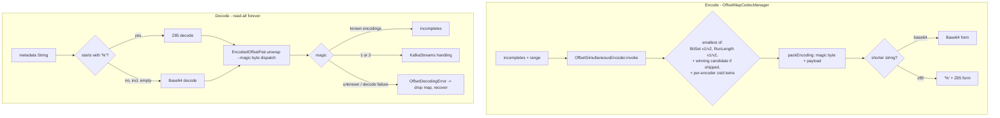

# Offset-Encoding Density - Z85 Outer Codec and a Measured Candidate Encoder - Plan

Issue: [astubbs#192](https://github.com/astubbs/parallel-consumer/issues/192) (mirror of confluentinc#903).

## Goal Capsule

Make committed-offset metadata denser, measurement-first. Candidates from the issue and from its own reasoning: a roaring-style chunked bitset, an unsigned-short run-length variant, and a sparse delta-list encoder as competing candidate wire formats inside `OffsetSimultaneousEncoder`'s competitive set; and Base85 (Z85) as a denser outer string codec beside Base64. Density is a deterministic function of the input, so U1 measures every candidate (via real byte layouts run through the real compression and string pipeline) before U4 builds the one that wins; KTD5's candidate-neutral decision rule governs shipping. All previously written metadata stays decodable forever.

Authority: this plan's R-IDs govern product behavior; KTDs govern mechanism. Stop conditions: stop and surface if any change would make previously committed metadata undecodable (R5), if the decision rule's inputs cannot be produced, or if a change requires loosening `ForeignOffsetMetadataOnAssignmentTest` or the back-pressure tests without a diagnosis (never weaken assertions - classify instead).

---

## Product Contract

### Summary

Add a density benchmark for the offset-metadata encoding pipeline, add a Z85 outer string codec chosen per payload (whichever of Base64/Z85 yields the shorter string - Z85 wins from roughly 24 payload bytes up, Base64 keeps the small-payload cases), and add one new candidate binary encoder only if the benchmark shows a material, near-cap win for it. Fix the all-or-nothing compression-registration gate that a new small candidate would otherwise trip. Record the measured reasoning - including why the RoaringBitmap library is not adopted and what the cheaper alternatives deliver - in the offsets package javadoc and docs, so the next person asking issue 192's question finds the answer.

### Problem Frame

Offset metadata is a String capped at `OffsetMapCodecManager.DefaultMaxMetadataSize` (4096), with back-pressure at 0.75 of that (`PartitionStateManager.USED_PAYLOAD_THRESHOLD_MULTIPLIER_DEFAULT`). When the encoded incomplete-offsets map exceeds the cap, PC strips the payload and blocks further records - so density near the cap is direct headroom before back-pressure. Issue 192 asks why PC uses custom run-length/bitset encoders instead of RoaringBitmap, and Base64 instead of a denser text encoding. Nobody ever measured either alternative; the honest answer requires numbers.

Density is not the only headroom lever, and not the biggest: PC's 4096 is a hardcoded mirror of the broker's *configurable* `offset.metadata.max.bytes` default, and exposing a matching `ParallelConsumerOptions` setting would buy an operator who raised the broker limit up to 16x headroom with no wire-format cost. That lever is a separate API-surface change with its own discovery problem (PC cannot read the broker's effective value), so it is deferred follow-up work below, not displaced by this plan - density stacks with any cap, and this plan's other deliverable (the recorded answer to issue 192) exists regardless.

### Requirements

Measurement:

- R1. A deterministic density benchmark measures encoded sizes for every current encoder and for three candidate encoders - chunked bitset (roaring-style), unsigned-short run-length, and sparse delta-list - across a corpus of defined incomplete-offset distributions and range sizes. Candidate sizes come from real byte layouts (KTD4) run through the identical zstd and string-encoding pipeline as the incumbents, measured under both forced and production-conditional compression. The report also states, per scenario, the back-pressure engagement point (incompletes count and offset spread at which each encoding crosses the 0.75 threshold) and the Base64-vs-Z85 string lengths. Results are committed as a report document.
- R2. At most one candidate encoder ships: the best-scoring one, and only if it meets KTD5's decision rule; either outcome (ship or measured case-against) is recorded in the report and the package javadoc. The report's candidate columns persist either way - they are the permanent answer to issue 192.

Density:

- R3. The outer string codec becomes per-payload: the writer emits whichever of Base64 or sentinel-prefixed Z85 yields the shorter string (KTD2/KTD3/KTD6). The reader accepts both forever.
- R4. If R2's rule is met: the winning candidate encoder joins `OffsetSimultaneousEncoder`'s competitive set with its own `OffsetEncoding` magic bytes (plain + zstd-compressed twin), winning only when it produces the smallest payload.
- R11. If a candidate ships, compressed-twin registration becomes per-encoder (KTD8): adding a small candidate must never suppress other encoders' zstd twins, and for every benchmark scenario the chosen payload with the new encoder registered is no larger than without it.

Compatibility:

- R5. Every previously written format remains decodable: bare-Base64 strings (no sentinel) decode exactly as today, and all existing magic bytes keep their decoders. New formats are write-new/read-all.
- R6. Kafka Streams metadata detection (magic bytes 1 and 2) and foreign-metadata recovery (unknown magic or undecodable string routes to `OffsetDecodingError` handling, never a crash) are preserved, including for sentinel-prefixed strings that fail Z85 decode and for empty, blank, or null metadata.
- R7. No new runtime dependency; `parallel-consumer-core` keeps exactly kafka-clients, zstd-jni, snappy-java, micrometer.
- R8. Any new string alphabet is 7-bit ASCII so `String.length()` equals UTF-8 byte length - the cap check in `PartitionState` compares chars while the broker caps bytes; the equality is asserted in tests.

Documentation:

- R9. The offsets package javadoc (`package-info.java`) records the measured reasoning: why encoders are custom rather than RoaringBitmap, the outer-codec decision with its crossover math, and the candidate verdicts with the benchmark numbers. The generated README's offset-encoding section (edit `src/docs/README_TEMPLATE.adoc`, regenerate) is updated to match the new pipeline.
- R10. CHANGELOG gains one entry covering the density change and the operator-visible mixed-version caveat: during a rolling upgrade, a not-yet-upgraded instance reading a newer instance's commit drops the offset map and resumes from the committed offset, which can redeliver in-flight work to non-idempotent processors. Upgrade-in-place from older versions still works.

### Scope Boundaries

- Non-goal: adopting the RoaringBitmap library or its portable format (KTD1 records why).
- Non-goal: changing the commit path or back-pressure policy.
- Non-goal: encode-time CPU optimization - PR astubbs#106 (`perf/sparse-offset-encoding`) owns that; this plan measures density only.

Deferred to follow-up work:

- Making the metadata budget configurable to match the broker's `offset.metadata.max.bytes` (currently the hardcoded 4096 default with no user-facing option) - the larger headroom lever per Problem Frame; needs its own API-surface plan. The U1 report's engagement-point numbers size its value.
- Refactoring the per-offset `invoke()` loop into encoder subtypes (pre-blessed in `docs/refactoring.md`); U4 works within the current callback contract by reading `getIncompleteOffsets()` directly.
- The pre-existing all-or-nothing compression-gate inefficiency for today's encoder set (a small RunLength can already suppress a larger BitSet's smaller zstd twin); R11 fixes it only when a new candidate ships, otherwise it is recorded, not fixed, here.

---

## Planning Contract

### Key Technical Decisions

- KTD1. Dependency-free implementations, not the RoaringBitmap library. The jar is ~450KB with the library's full bitmap algebra; PC needs only encode-once/decode-once of a bounded relative-offset range. At PC's payload sizes the only Roaring capability the current set lacks is the sparse array container (2 bytes per set bit); run containers duplicate `RunLengthEncoder` and bitmap containers duplicate `BitSetEncoder`. The four-dependency policy makes the jar a real cost for a marginal capability - and the marginal capability itself is modeled directly as the sparse delta-list and chunked candidates.
- KTD2. Z85 alphabet (ZeroMQ RFC 32) with Base64-style partial-block handling: a final group of n raw bytes (1-3) encodes to n+1 chars, so no padding convention and no out-of-band length. Decode rejects invalid characters, impossible lengths (`len % 5 == 1`), and non-canonical partial groups (final-group value >= 2^(8n) for n tail bytes) - all routed to `OffsetDecodingError` by callers, never silent truncation. Z85 over Ascii85/RFC 1924 because its alphabet excludes quote, backslash, backtick, comma, and semicolon - safe inside JSON dumps and log lines, and safer than the alternatives; note it does contain shell metacharacters (`$ & * ? ! < > ( ) [ ] { } #`) absent from Base64, so metadata strings must be quoted in shell contexts. Hand-rolled (~80 lines); reference implementations are small and the wire format must be frozen in-repo anyway.
- KTD3. Outer-codec discrimination by sentinel: the magic byte lives inside the string-encoded payload (`OffsetSimultaneousEncoder.packEncoding` prepends it before string encoding), so it cannot signal the string codec. A string starting with `%` (not in the Base64 alphabet `[A-Za-z0-9+/=]`, never the first char of current payloads) marks Z85; dispatch is `startsWith("%")`, so empty and blank strings fall through to the existing Base64 path and reach its empty-payload short-circuit unchanged. A sentinel-prefixed string that fails Z85 decode routes to `OffsetDecodingError` recovery per R6.
- KTD4. Layout-first benchmark, no JMH. Encoded size is deterministic given the incompletes distribution, so U1 gives each candidate a minimal byte-layout writer (a serializer over its container/entry decisions - not a registered encoder, no enum entries, no decode path) and runs the resulting bytes through the identical zstd + outer-string pipeline as the measured incumbents. This keeps candidate and incumbent numbers commensurable post-compression; closed-form arithmetic alone cannot be compared against zstd output. Encode-time CPU stays out of scope.
- KTD5. Candidate-neutral ship rule: the best-scoring candidate ships only if it beats the best current encoding (post-compression, post-string-encoding, under the production compression rule) by >= 10% on at least one scenario class whose incumbent payload is at or above the 0.75 back-pressure threshold - so the win is real headroom at the point where density matters, not a percentage on a payload of a few dozen bytes. The scenario distributions are assumed, not observed (no workload telemetry exists); this is recorded in Assumptions. Ties, wins only far below the threshold, or wins only on adversarial patterns do not ship: the bar is for carrying a new wire format forever.
- KTD6. Outer-codec choice is per-payload, competitive-set style: the writer emits the shorter of the Base64 form and the sentinel+Z85 form. With the sentinel, Z85 is longer below 12 payload bytes, ties from 12-21, and wins (converging on ~6%) from 24 bytes up - so small payloads keep Base64 (older readers keep working for them) and Z85 fires exactly where density pays. Write-gating beyond that (two-release read-first rollout) was considered and rejected: the fork is pre-1.0 and fast-moving, the v2-encoding precedent already broke old-reader compatibility selectively, and the exposure that remains is bounded to larger payloads and to rolling-upgrade windows, documented per R10. Note the v2 precedent is only partially analogous (v2 fired selectively; Z85 fires for all payloads >= 22 bytes), which is why the crossover gating and R10's operator-visible wording exist.
- KTD7. Reserved magic bytes, one pair per candidate, Version v1: chunked bitset `'r'`/`'z'`, sparse delta-list `'d'`/`'D'`, unsigned run-length `'u'`/`'U'`. Only the winning candidate's pair is registered in `OffsetEncoding`; the others stay reserved in the package javadoc. Free bytes verified against the taken set (`L î l a n J o s e p 1 2`); a new test asserts `magicMap` uniqueness directly (today a duplicate only fails as `ExceptionInInitializerError`).
- KTD8. Per-encoder compressed registration (fires with R11): `registerEncodings` currently suppresses every encoder's zstd twin when any one encoder is `quiteSmall` (< `LARGE_ENCODED_SIZE_THRESHOLD_BYTES` = 200). A new candidate that is small in exactly its target scenarios would flip that gate and stop the incumbents' compressed twins from registering, making winning payloads larger - the inverse of this plan's goal. When a candidate ships, the gate becomes per-encoder: register a compressed twin for any encoder whose plain size is above the threshold.

### Assumptions

Headless run - these were resolved without a scoping confirmation:

- The issue's framing that dependency-free implementations are acceptable settles KTD1; no library-adoption arm is planned.
- The benchmark's scenario distributions (uniform-sparse, clustered, trailing-run) are assumed to represent real workloads; no production telemetry of `ratioMetadataSpaceUsedDistributionSummary` is available to this project to validate them.
- The 10% threshold and the near-cap proximity condition in KTD5 are the plan's own calibration of "material"; the issue gives no number.
- Per-payload outer-codec selection (KTD6) was chosen over a two-release read-first rollout; the reasoning and the residual rolling-upgrade exposure are recorded in KTD6 and R10.

### High-Level Technical Design

Two independent layers change. String layer: length-competitive outer codec behind a sentinel. Binary layer: at most one new candidate in the competitive set, plus the per-encoder compression fix.

Candidate wire formats (directional guidance, frozen at implementation; every candidate carries `[rangeLength:int]` after the magic byte so decode can reconstruct `highestSeenOffset = baseOffset + rangeLength - 1` - the incompletes alone cannot, because the top of the range is always complete):

- Chunked bitset: `[rangeLength:int][chunkCount:short]` then per non-empty chunk `[chunkIndex:short][containerType:byte][containerPayload]`; the relative-offset space splits into 2^16-bit chunks and each chunk picks the smallest of array (`[cardinality:short][sorted shorts]`), bitmap (`[byteLength:short][bytes]`), or run (`[runCount:short][start:short,length:short...]`) containers. Incomplete offsets are the set bits - they are the sparse side, which is what makes the array container pay off (note `BitSetEncoder` marks *completed*; this format deliberately inverts).
- Sparse delta-list: `[rangeLength:int][count:varint]` then unsigned-varint deltas between consecutive sorted incomplete offsets. The simplest capture of Roaring's array-container advantage; strictly denser than 2B/entry for clustered sets.
- Unsigned run-length: RunLength v2's bare run array with unsigned-short run lengths (doubling v1's range per run) - the existing TODO in `OffsetSimultaneousEncoder`, modeled so the cheapest evolution competes on equal terms.

### Sources & Research

- Pipeline and registration mechanics: `parallel-consumer-core/src/main/java/bz/stub/parallelconsumer/offsets/` - `OffsetMapCodecManager` (`makeOffsetMetadataPayload`, `serialiseIncompleteOffsetMapToBase64`, `deserialiseIncompleteOffsetMapFromBase64`, `decodeCompressedOffsets` - note its explicit `decodedBytes.length == 0` no-map short-circuit), `OffsetSimultaneousEncoder` (`initEncoders`, `registerEncodings` and its `noEncodingsAreSmallEnough` all-or-nothing gate, `packSmallest`, `LARGE_ENCODED_SIZE_THRESHOLD_BYTES`), `OffsetEncoding` (`magicMap`, `decode`), `EncodedOffsetPair` (`unwrap`, `getDecodedIncompletes`, size-only `SIZE_COMPARATOR` - note `TreeSet` silently drops size-ties), `OffsetSimpleSerialisation` (single Base64 site; strict decoder throws `IllegalArgumentException` on `%`, which existing releases convert to `OffsetDecodingError` and recover - the verified basis for KTD6's mixed-version claim).
- Cap enforcement: `PartitionState.updateBlockFromEncodingResult` compares `String.length()` to `DefaultMaxMetadataSize` and the 0.75 pressure threshold; encoders never learn the cap, so density wins need no cap-code change. Decode-side range recovery: `OffsetBitSet.deserialiseBitSetWrapToIncompletes` derives `highestSeenOffset` from its explicit length field; `OffsetRunLength` derives it from run sums - hence the `[rangeLength:int]` requirement on every candidate format.
- Test infrastructure to reuse: `WorkManagerOffsetMapCodecManagerTest.differentInputsAndCompressions` (x/o bitmap corpus + random data up to 30k), `OffsetEncodingTests` (`@EnumSource(OffsetEncoding.class)` auto-enrolls new entries and asserts highest-seen/succeeded round-trips; `CODECS_THAT_DEGRADE` list), `BitSetEncodingTest.basic` (unit-test template), `OffsetCodecTestUtils`, `ForeignOffsetMetadataOnAssignmentTest`, resource locks `METADATA_DATA_SIZE_RESOURCE_LOCK` / `COMPRESSION_FORCED_RESOURCE_LOCK`.
- Report/CI conventions: `docs/data/` is schema-governed hand-written YAML only (`bin/check-docs-data.sh` globs `*.yaml`) - the benchmark report lives in `docs/` instead; freshness gating follows the `bin/todo-index.sh --check` pattern wired in `.github/workflows/pr-checklist.yml`; surefire's working directory is the module basedir, so report generation resolves the repo root via a `bin/` script, not a relative path from the test.
- External: RoaringFormatSpec container costs (array <= 4096 entries at 2B/entry, 8192B bitmap containers, 4B/run; ~8-16B header floor); Z85 spec rfc.zeromq.org/spec/32 (4-byte blocks, application-defined padding - hence KTD2's partial-block scheme); Base64 `4*ceil(n/3)` vs sentinel+Z85 `1 + 5*floor(n/4) + (n%4 ? n%4+1 : 0)` - crossover per KTD6.
- Collisions and hazards: PR astubbs#106 owns this package (conflict expected in `OffsetSimultaneousEncoder`, possibly semantic - that PR reworks the per-offset walk; resolve at merge, do not reshape); `RunLengthEncoderTest`'s INT-overflow case is the unit-suite wall-clock floor - new tests must use single-delta-jump patterns, never walk billions of offsets; the offsets package is the PIT mutation-testing lane (`PIT_DECIDABLE_PACKAGES`) and the benchmark test is excluded from it deliberately (U1); `OffsetEncodingBackPressureTest` is quarantined with an encoding-size-threshold hypothesis - denser payloads move its block point.

---

## Risks & Dependencies

- Mixed-version consumer groups: an older PC instance reading a newer instance's commit hits an unreadable string (Z85, payloads >= 22 bytes) or unknown magic byte; it drops the map and resumes from the committed offset, which can redeliver in-flight work. Bounded to rolling-upgrade windows and larger payloads per KTD6; documented per R10.
- Back-pressure tests (`OffsetEncodingBackPressureTest`, `...UnitTest`) force `DefaultMaxMetadataSize` to 40/30; at those payload sizes the outer codec is in the tie/crossover band, so string lengths may shift either way. Verification Contract requires before/after runs with recorded high-water marks; adjust test constants only with the arithmetic shown, never by loosening assertions.
- `EncodedOffsetPair.SIZE_COMPARATOR` drops size-ties from `sortedEncodings`: a new encoder tying an existing size silently vanishes from tests iterating `sortedEncodings`. U4 must not rely on set membership for assertions; compare via `encodingMap`.
- PR astubbs#106 merge conflict in `OffsetSimultaneousEncoder` is likely and may be semantic (it reworks the per-offset walk U4's registration touches). Resolve at merge time; do not pre-shape this plan around it.
- Public test-facing API rename: `deserialiseIncompleteOffsetMapFromBase64` becomes misnamed once Z85 exists; U3 renames it to `deserialiseIncompleteOffsetMapFromString` and updates callers (`CommitHistory`, tests). Internal API; no deprecation cycle.
- Kafka-clients may permit null `OffsetAndMetadata.metadata()` depending on version; U3's dispatch treats null like empty (Base64 path, no-map result) and pins it with a test.

---

## Implementation Units

### U1. Density benchmark harness and baseline report

- Goal: deterministic size and headroom measurement across the scenario corpus for incumbents and all three candidates; the numbers that answer issue 192 and drive KTD5.
- Requirements: R1, R2.
- Dependencies: none.
- Files: new `parallel-consumer-core/src/test/java/bz/stub/parallelconsumer/offsets/OffsetEncodingDensityBenchmarkTest.java`; new report `docs/offset-encoding-density-benchmark.md`; new `bin/offset-encoding-density-report.sh`; modify `.github/workflows/pr-checklist.yml`, `bin/ci-mutation-test.sh`.
- Approach:
  1. Scenario corpus as a parameterized source: contiguous-complete with one trailing incomplete run; uniform-random incompletes at 0.1%, 1%, 5%, 20% density; clustered incompletes (bursts of 10-100); alternating x/o; all-incomplete. Range sizes 1k, 10k, 100k, 1M (1M scenarios use sparse construction and seeded `Random`; reuse `OffsetCodecTestUtils`).
  2. For each scenario: run every current encoder via `OffsetSimultaneousEncoder`, and produce each candidate's bytes via its minimal layout writer (KTD4). Run all of them through the identical zstd and outer-string paths. Record plain, compressed, Base64, and sentinel+Z85 sizes under both forced compression and the production `quiteSmall` rule (under the resource locks).
  3. Report table: encoding x scenario with winner column, plus per-scenario engagement points (incompletes count / offset spread at which each encoding crosses the 0.75 threshold of 4096) and the outer-codec delta.
  4. Generation and freshness: the test writes the table to `target/` and prints it; `bin/offset-encoding-density-report.sh` regenerates `docs/offset-encoding-density-benchmark.md` from the repo root and `--check` diffs it (mirroring `bin/todo-index.sh --check`), wired into `.github/workflows/pr-checklist.yml`.
  5. Exclude `OffsetEncodingDensityBenchmarkTest` from the PIT lane via `-DexcludedTestClasses` in `bin/ci-mutation-test.sh`, deliberately: mutation kills for new arithmetic come from U2/U4 exact-value unit tests.
  6. Apply KTD5's rule in the report: a named verdict line per candidate ("ship" for at most the best one, "case-against" otherwise) with the qualifying scenario numbers.
- Test scenarios:
  - Happy path: each scenario produces a size for every current encoder; winner matches `packSmallest` choice.
  - Layout-writer sanity: chunked layout on all-incomplete equals bitmap-container cost + headers; single isolated incomplete equals one array container with cardinality 1 plus the rangeLength header; delta-list of k incompletes with deltas < 128 is `4 + varint(count) + k` bytes plus magic.
  - Edge: empty incompletes (document the encoder short-circuit, don't force); range 0.
  - Report drift: `--check` fails on a stale report; regeneration is byte-identical when nothing changed.
- Verification: report committed, verdict lines recorded, pr-checklist gate green, suite green under existing resource-lock scheme.

### U2. Z85 codec utility

- Goal: standalone Z85 encode/decode with partial-block handling and canonical-range rejection per KTD2.
- Requirements: R3, R8.
- Dependencies: none.
- Files: new `parallel-consumer-core/src/main/java/bz/stub/parallelconsumer/offsets/Z85Codec.java`; new `parallel-consumer-core/src/test/java/bz/stub/parallelconsumer/offsets/Z85CodecTest.java`.
- Approach: `@UtilityClass` mirroring `OffsetSimpleSerialisation` conventions; encode `byte[] -> String`, decode `String -> byte[]`; final partial group of n bytes (1-3) encodes to n+1 chars; decode rejects invalid chars, `len % 5 == 1`, and non-canonical partial groups (value >= 2^(8n)) with a checked exception routed to `OffsetDecodingError` by callers.
- Execution note: test-first is natural here - the codec is a pure function with a frozen external spec.
- Test scenarios:
  - Round-trip: empty, 1-7 bytes (all partial-block sizes), 4-byte multiples, random arrays up to 8KB (seeded).
  - Spec pin: the Z85 reference vector (`0x86 0x4F 0xD2 0x6F 0xB5 0x59 0xF7 0x5B` encodes to `HelloWorld`).
  - Output alphabet: every emitted char is in the Z85 alphabet; ASCII-only, so `String.length() == getBytes(UTF_8).length` (R8).
  - Error paths: non-alphabet char throws; length `% 5 == 1` throws; non-canonical final group (e.g. 2 chars decoding to a value >= 256) throws; no silent truncation.
  - Density: encoded length matches `5*floor(n/4) + (n%4 ? n%4+1 : 0)` exactly - pins the crossover math in KTD6.
  - Mutation-awareness: assertions on exact bytes/chars, not just round-trip, so PIT mutants in the arithmetic die.
- Verification: unit tests green; no production wiring yet.

### U3. Length-competitive outer codec integration

- Goal: write the shorter of Base64 and sentinel+Z85, read both, forever (R3, R5, R6).
- Requirements: R3, R5, R6, R8.
- Dependencies: U2.
- Files: `OffsetMapCodecManager.java`, `OffsetSimpleSerialisation.java` (modify); tests `WorkManagerOffsetMapCodecManagerTest.java`, `ForeignOffsetMetadataOnAssignmentTest.java`, `parallel-consumer-core/src/test/java/bz/stub/parallelconsumer/model/CommitHistory.java` (update call sites).
- Approach:
  1. Characterization first: pin current behavior with a test asserting a known incompletes set encodes to a bare-Base64 string decodable by the current path (this test survives the change, proving R5).
  2. Writer emits `'%' + Z85Codec.encode(bytes)` when that string is strictly shorter than the Base64 form, else the Base64 form (KTD6). Decode dispatches on `startsWith("%")` (KTD3); null and empty metadata take the Base64 branch and reach the existing `decodedBytes.length == 0` no-map short-circuit; Z85 decode failures convert to `OffsetDecodingError` exactly as Base64 `IllegalArgumentException` does today.
  3. Rename `deserialiseIncompleteOffsetMapFromBase64` to `deserialiseIncompleteOffsetMapFromString` (all three overloads' call sites, `CommitHistory` included); method javadoc documents the sentinel scheme and the crossover rule.
  4. Metrics untouched: size distributions already measure the final String.
- Test scenarios:
  - Round-trip through the full manager path for the existing `differentInputsAndCompressions` corpus; payloads >= 24 bytes produce `%`-prefixed strings, small payloads stay Base64, both decode to identical incompletes.
  - Backward compat: a Base64 string captured pre-change (fixture constant, not regenerated) decodes to the same incompletes (R5's golden vector - the repo's first wire-format pin).
  - Crossover: exact string lengths at payload sizes 3, 12, 21, 22, 24, 64 match the KTD6 formulas; the writer always picks the min; a >= 64-byte payload shows the ~6% saving (R8's char==byte asserted alongside).
  - Empty/blank/null metadata: decode to the no-map result, never an exception (R6).
  - Kafka Streams: existing four KS tests unchanged and green; new case documents a `%`-prefixed non-Z85 string dropping to `OffsetDecodingError` recovery (extends `ForeignOffsetMetadataOnAssignmentTest`).
  - Foreign metadata: existing unknown-magic test green; new case: `%` followed by garbage.
  - Back-pressure interplay: run `OffsetEncodingBackPressureUnitTest` before/after; if constants need adjusting, show the arithmetic in the test comment per Risks.
- Verification: full core unit suite green; back-pressure before/after recorded.

### U4. Winning candidate encoder (conditional on U1 verdict per KTD5)

Do not start this unit before U1's verdict line exists; if the verdict is case-against for all candidates, this unit and its files are skipped entirely.

- Goal: the winning candidate (chunked bitset, sparse delta-list, or unsigned run-length) as a dependency-free encoder in the competitive set (R4), with the per-encoder compression fix (R11).
- Requirements: R4, R11, R5, R7; gated by R2.
- Dependencies: U1 (verdict), U3 (string layer settled so sizes in tests are final).
- Files (named for the chunked case; adjust to the winner): new `ChunkedBitSetEncoder.java`, new `OffsetChunkedBitSet.java` (decode side, mirroring the `OffsetBitSet`/`OffsetRunLength` split); modify `OffsetEncoding.java`, `EncodedOffsetPair.java`, `OffsetSimultaneousEncoder.java` (`initEncoders`, `registerEncodings` per KTD8), `PCMetricsDef.java` (codec tag doc); new `ChunkedBitSetEncodingTest.java`; modify `OffsetEncodingTests.java` (`CODECS_THAT_DEGRADE` assessment).
- Approach:
  1. Enum entries for the winner's reserved magic-byte pair per KTD7; wire format per HTD sketch including `[rangeLength:int]`, frozen with golden-vector tests; decode returns `highestSeenOffset = baseOffset + rangeLength - 1`.
  2. Encoder receives the base offset and range length at construction from `initEncoders` (neither has an accessor today - add what's needed) and reads `getIncompleteOffsets()` at `serialise()` time (no-op per-offset callbacks), staying inside the current `OffsetEncoder` contract; throws a new `EncodingNotSupportedException` subclass when the range exceeds what the format addresses.
  3. Per-encoder compressed registration per KTD8, with a no-regression test: for every U1 scenario, chosen payload size with the new encoder registered <= without it (R11).
  4. Decode arm in `EncodedOffsetPair.getDecodedIncompletes` (and `getDecodedString`, with correct decompression - do not copy the existing v2 bugs there).
  5. New test asserting `OffsetEncoding` magic-byte uniqueness directly (KTD7) - table of all magic bytes, uniqueness asserted, reserved bytes documented.
- Test scenarios:
  - Golden vectors: fixed incompletes sets -> exact expected bytes (for chunked: array-only, bitmap-only, run-only, mixed-container cases; for delta-list: multi-byte varint boundaries at deltas 127/128).
  - Round-trip via the `BitSetEncodingTest.basic` template and via the full manager path, asserting incompletes AND highest-seen offset (the `[rangeLength:int]` recovery).
  - Auto-enrollment: `OffsetEncodingTests.ensureEncodingGracefullyWorks...` passes for both new enum entries, or the entries join `CODECS_THAT_DEGRADE` with a documented reason.
  - Structure selection matches the U1 layout writer byte-for-byte on the corpus (validates KTD4's layouts retroactively).
  - Edge: incompletes at chunk/varint boundaries (offsets 65535/65536; deltas 127/128), single offset, empty set, range crossing many empty chunks (no containers emitted).
  - Overflow: range beyond the format's addressability throws the new exception and the encoder drops out of the competitive set without failing the commit.
  - No-regression (R11): per-encoder compression keeps every scenario's winner <= the pre-change winner.
  - Wall-clock: no test constructs multi-billion-offset walks; large ranges use delta jumps.
  - Mutation: arithmetic and boundary conditions asserted exactly (PIT lane).
- Verification: full suite green; the encoder wins exactly the scenarios U1 predicted (assert in U5).

### U5. Final measurement and decision record

- Goal: close the loop - re-run the harness with everything shipped, validate layouts against the real encoder, record the verdicts (R1, R2).
- Requirements: R1, R2.
- Dependencies: U3; U4 if it ran.
- Files: `OffsetEncodingDensityBenchmarkTest.java`, `docs/offset-encoding-density-benchmark.md`.
- Approach: if U4 shipped, replace the winner's layout-writer column with real encoder output and assert byte-for-byte equality (a mismatch means the layout writer or encoder is wrong - investigate, don't widen tolerance); all candidate columns and verdict lines persist either way as the permanent record answering issue 192, including each case-against.
- Test scenarios: report regeneration is deterministic; layout-vs-real equality assertion (U4 path only).
- Verification: committed report matches shipped reality; `--check` gate green.

### U6. Documentation and reasoning record

- Goal: R9, R10 - the issue's explicit ask to record the reasoning where the next asker finds it.
- Requirements: R9, R10.
- Dependencies: U1-U5 (numbers final).
- Files: new `parallel-consumer-core/src/main/java/bz/stub/parallelconsumer/offsets/package-info.java`; `src/docs/README_TEMPLATE.adoc` (offset-encoding section: pipeline description, "base 64" wording, density claims; regenerate `README.adoc` via `mvn process-sources`); `CHANGELOG.adoc`; `docs/todo-index.md` if TODOs changed; `docs/refactoring.md` row for astubbs#192 updated to point at the record.
- Approach: package-info carries the competitive-set design, the wire-format compatibility contract (write-new/read-all, magic-byte registry including reserved pairs, sentinel scheme with the `%`-in-alphabet non-nesting note), the RoaringBitmap decision with U1's numbers, the outer-codec decision with KTD6's crossover math, and the candidate verdicts. Keep the README section user-facing (what, not why); the why lives in the javadoc. CHANGELOG wording per R10 names the operator-visible redelivery effect.
- Test expectation: none - documentation unit; README regeneration is verified by the repo's generated-docs check.
- Verification: README regenerated not hand-edited; changelog entry present; javadoc builds clean.

---

## Verification Contract

- Full core unit suite (`mvn -pl parallel-consumer-core test` with the repo's standard profile) green at every unit boundary; new tests join the `@ResourceLock` scheme when touching `forcedCodec`, `compressionForced`, or `DefaultMaxMetadataSize`.
- Back-pressure sentinels: `OffsetEncodingBackPressureUnitTest` before/after U3 and U4 with high-water marks recorded in the PR; the quarantined `OffsetEncodingBackPressureTest` run manually before/after as a falsification datapoint for its open hypothesis (bonus, not a gate).
- Mutation lane: the offsets package is `PIT_DECIDABLE_PACKAGES`; the benchmark test is excluded (U1) and new production classes must not drop the package's mutation score (baseline 83%) - exact-arithmetic assertions per U2/U4 test scenarios.
- Wire-format pins: golden-vector tests for the Base64 legacy path (U3) and the shipped candidate (U4) are the repo's compatibility regression net - they must never be regenerated to make a failure pass.
- Report freshness: `bin/offset-encoding-density-report.sh --check` green in pr-checklist; density claims in docs match the committed report.

---

## Definition of Done

- R1-R11 satisfied or their conditional branch resolved and recorded (R2/R4/R11 may resolve to "case-against" - that is done, not failure).
- All units' verification steps pass; full suite green; no weakened assertions anywhere.
- Benchmark report committed and in sync with shipped code; verdict line per candidate present; per-scenario engagement points show what each shipped change bought in back-pressure headroom.
- README regenerated from template; CHANGELOG entry present with the R10 operator wording; package-info records the reasoning with numbers.
- No abandoned experimental code in the diff (candidate layout writers live in the benchmark test and stay; an unshipped registered encoder does not exist on any branch of the verdict).
