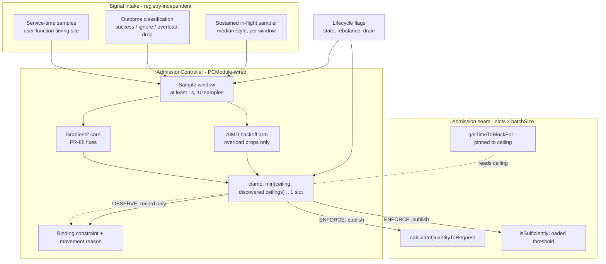
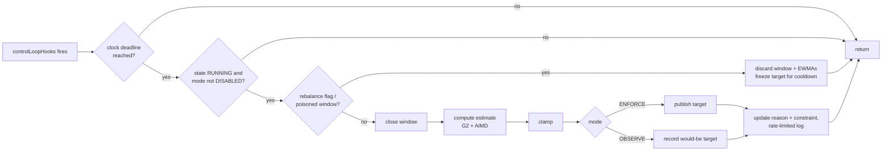

# Self-Scaling Concurrency - Plan

## Goal Capsule

- **Objective:** An opt-in adaptive controller that discovers each Parallel Consumer instance's sustainable concurrency at runtime, replacing the operator's static guess with measured adaptation of the admission target. This plan owns the per-instance controller only (dimension 1 of astubbs#227); instance-count recommendation, predictive scaling, and the distributed-throttling strategy work are not active scope.
- **Product authority:** `STRATEGY.md` Self-tuning track; astubbs#227 (mirror of confluentinc#21); ideation record `docs/ideation/2026-08-17-distributed-throttling-ideation.html` idea 8; `docs/data/roadmap.yaml` entry `self-tuning-concurrency`.
- **Planning baseline:** the merged `perf/engine-concurrency` tree (direct-pull engine, virtual threads, conservation load gate, residence-time instrumentation), not bare master. Seam descriptions below reflect that tree.
- **Stop conditions:** the rip-out triad in Success Criteria (runaway growth, too-fast ramp, no ramp), each covered by tests in U2/U9; and evidence that a settled decision cannot work stops work rather than being absorbed silently.
- **Tail ownership:** implementation lands on this branch's lineage except U10 (bench arm), which lands on its own branch cut from `perf/bench-arrival-and-key-skew` (KTD12).

---

## Product Contract

### Summary

Add an adaptive concurrency mode to the core engine: when enabled, an admission controller governs the admission target (concurrency slots in flight) from measured service time, outcome signals, and sustained achieved in-flight, stepping up while performance holds and contracting on degradation, always beneath an effective maximum. The thread pool stays fixed at the ceiling; admission is the control variable. An observe-only mode computes and reports every decision without acting.

**Product Contract preservation:** restructured and amended with user approval at the planning synthesis (2026-08-22). Changes: R6 narrowed (astubbs#155's mis-firing warning is fixed on this tree at `bce044b3f`; the surviving obligation is single ownership of the admission arithmetic); R9 extended from "reason for last movement" to include the currently-binding constraint; success criteria re-scoped to admission-bound workloads and restated in arrival-harness-measurable terms; R11-R14 added from planning-discovered constraints; KD2's algorithm description corrected (Gradient2 uses a constant additive queue headroom and a clamped gradient - the `beta/sqrt(limit)` term belongs to the older GradientLimit); KD7's precondition discharged. A second amendment round (2026-08-22, design review, all 22 findings user-approved for application): KD4/R4 unseeded start corrected to the static-configuration-derived target (the start-at-ceiling form would have exceeded today's concurrency exactly when the ceiling substituted); R10 narrowed to what open-loop observation can prove; R11 gained the spread term and the starved-below-ceiling probe; KTD3/5/6/10/11 amended per their inline notes. All other requirements carry their original meaning.

### Problem Frame

`maxConcurrency` is a compile-time guess about a runtime quantity. Too low silently strands throughput nobody files an issue about; too high floods downstream services - the confluentinc#766 production shape. The right value depends on the data currently in the instance's assigned partitions, differs between instances in the same group, and shifts with time of day and workload - so no static number stays correct, and the operator cannot know the plateau's cause (host, Kafka fetch bandwidth, downstream capacity) even in principle. PC's own `maxConcurrency` javadoc has pointed at this gap since 2020, and two abandoned prototype branches show the intent without a landing.

One boundary the tail experiment measured (2026-08-22): under a skewed key distribution, `KEY` and `PARTITION` ordering sustain one record in flight of a configured 24 with a flat handler - the binding constraint there is shard serialization, not admission, and no admission controller can raise throughput on such a workload. This plan's value claim is scoped to admission-bound workloads; on ordering-starved ones the controller's job is to make the starvation visible (R11), not to fight it.

### Key Decisions

- KD1. **Control admission, not the pool.** The controller adjusts the in-flight admission target; the worker pool sits fixed at the effective maximum. One control variable that already feeds both dispatch quantity and poller backpressure. (session-settled: user-approved - chosen over runtime pool resizing: admission is the universal knob; under virtual threads there is no pool to resize at all, and the tree now documents `maxConcurrency` as a target the control loop aims at, not a cap the pool enforces.) Governs R2, R7.
- KD2. **Native implementation; port the control-law math with attribution.** Gradient2 (long/short latency EWMA gradient, constant additive queue headroom, gradient clamped to [0.5, 1.0]) with the upstream PR-88 anti-drift fixes and windowed sampling, ported as attributed code - not a dependency. License verified Apache-2.0 at repo, API, and per-file level (2026-08-22); no NOTICE file exists, so obligations are retained Netflix headers, a modification notice, and source-class attribution per `docs/copyright.md`. (session-settled: user-approved - chosen over depending on the library: keeps the zero-dependency core; upstream interfaces fit neither min-composed ceilings nor sustained-inflight sampling.) Governs R3, R5.
- KD3. **Core engine only in v1** - and within core, the pre-loaded-queue path only. The direct-pull engine consumes no admission target (each worker pulls its own batch; only worker count bounds it), so adaptive mode downgrades with a warning there (R14). Async engines follow after the async timing fix. (session-settled: user-directed.) Governs R1, R14.
- KD4. **Opt-in mode plus optional seed.** Adaptive mode is off by default (experimental). An optional initial-target seed sets the starting point; unseeded, the controller starts at the target today's static configuration derives - the user's `maxConcurrency`-derived target, never the substituted adaptive ceiling - so t=0 admission is never above today's static behavior, and the controller ramps into the ceiling's headroom from there. (session-settled: user-approved - amended 2026-08-22 from "start at the effective maximum", which would have exceeded today's concurrency exactly when the ceiling was substituted; originally chosen over starting from minimum: a cold-start crawl wastes the deploy window.) Governs R1, R4.
- KD5. **Rate-limit signals are deferral instructions, never failures.** When the structured rate-limit exception (separate deliverable) lands, the controller consumes it without touching failure history or failure metrics. (session-settled: user-approved.) Governs R5.
- KD6. **Ceilings compose by minimum.** Effective limit = min(effective maximum, discovered per-service ceilings when available, adaptive capacity estimate). An effective maximum always exists (R2). (session-settled: user-approved.) Governs R2, R8.
- KD7. **The load-factor subsystem keeps its own issue; this plan pins it.** astubbs#155's mis-firing warning is fixed on this tree (`bce044b3f`: rate-limited, DEBUG when static, silent under virtual threads) - the precondition this decision originally named is discharged. What survives is R6: exactly one owner of the admission arithmetic while adaptive mode is on. Governs R6.

### Requirements

**Controller behavior**

- R1. Adaptive concurrency is an opt-in, construction-time, three-state mode (`DISABLED` default / `OBSERVE` / `ENFORCE`) on the existing options surface, available on the core engine's pre-loaded-queue path; when `DISABLED`, behavior is byte-for-byte today's static semantics. Promoting `OBSERVE` to `ENFORCE` is a restart, not a runtime call (options are immutable; this removes all cross-mode state questions).
- R2. The controller governs the admission target, never exceeding the effective maximum and never below a floor of one slot; an effective maximum always exists - `maxConcurrency` when the user set it, else the documented adaptive default ceiling (KTD4).
- R3. Adaptation is bidirectional: step up while measured performance holds, contract on degradation or overload-shaped failure signals; the step-down path is a first-class requirement, not an afterthought.
- R4. The starting point is the user's optional initial-target seed, validated against the ceiling and floor; unseeded, the start is the target today's static configuration derives - never the substituted ceiling (KD4).
- R5. v1 signals are per-record service time (execution time, not queue-inclusive sojourn time), outcome classification (success / ignore / overload-drop; retry attempts contribute to the failure signal only, never to the latency window), and sustained achieved in-flight; the intake is designed so the structured rate-limit exception (separate deliverable) plugs in as a further signal without controller rework.

**Safety and coexistence**

- R6. While adaptive mode is on, exactly one component owns each piece of admission arithmetic: `DynamicLoadFactor` is pinned to a static factor (covering both its normal and its `messageBufferSize`-derived construction), and the controller is the only mover of the target. astubbs#155's failure class - two heuristics adjusting overlapping arithmetic - must be impossible by construction.
- R7. The admission target propagates through the existing dispatch-quantity and poller-pause arithmetic; a shrinking target throttles intake and never stalls in-flight work. The control loop's block time must not shrink the controller's own sample cadence (KTD7).
- R8. Stability guardrails mirror the rip-out criteria: bounded ramp rate, bounded per-window contraction, no unbounded growth, and demonstrable ramp-up on an underutilized-but-saturating workload - each verifiable in deterministic tests.

**Observability**

- R9. The controller's state is visible as metrics following existing conventions: the current target, the reason for its last movement, and the currently-binding constraint as an enum-valued gauge (at minimum: adapting, at-cap, at-floor, app-limited, starved, cooldown). Naming avoids the taken `RateLimiter` class name and the "throttle" vocabulary `WorkManager#shouldThrottle` already owns.
- R10. Observe-only mode computes and reports what the controller would do without acting - it validates signal intake, decision computation, and serves as the benchmark ablation arm. It is open-loop by construction (samples come from one fixed operating point), so closed-loop properties - convergence, oscillation bounds - are validated only by U2's simulation and U10's `ENFORCE` bench arm, never by observation alone.
- R11. The controller reads *achieved* in-flight as a sustained sampled measure with its spread, never a peak or window-maximum - a peak reads full-width on a workload that is starved to one in-flight (tail experiment, 2026-08-22). Peak-at-target with sustained-in-flight far below it and flat service time is the starvation signature: reported as `starved`, treated as neither capacity nor headroom. A `starved` reading while the target sits below the ceiling triggers a bounded one-window probe toward the ceiling rather than a freeze - a contraction narrows the buffer and can manufacture its own starvation evidence, and that ratchet must not lock (a bimodal spread is reported as such, not collapsed to `starved`).
- R12. Signal intake and observe-only reporting do not depend on a user-supplied `MeterRegistry` (the default registry is a null sink): the controller samples at the timing sites directly, and observe-only decisions also surface through a rate-limited log line.

**Lifecycle**

- R13. The controller follows an explicit lifecycle contract: it ticks only while `RUNNING`; a pause discards the in-progress window on resume; draining to close releases enforcement to the effective maximum (a contracted target must never extend `close(DRAIN)` past `drainTimeout`); a rebalance discards the sample window and both EWMAs and freezes the target for a cooldown, carrying the target itself over as the best available prior.

**Engine boundaries**

- R14. Unsupported configurations - async engines, the direct-pull engine, the proxy runtime - refuse adaptive mode by warning and running static, via an engine-capability method mirroring `supportsDirectPull()`; never a silent ignore. The proxy's construction-time `sizeCap` reads the effective maximum, not the live target.

### Success Criteria

Measured on the arrival-controlled bench harness (below saturation; at saturation two arms with the same buffer have equal residence by construction):

- On an admission-bound workload with the operator's cap set wrong in either direction, adaptive mode achieves lower end-to-end p99 at the same arrival rate, or a higher sustainable arrival rate, than the static guess - via reclaimed headroom (guess too low) or an unflooded downstream (guess too high). Reported with `inflight_p50` so discovered-target-vs-sustained is visible.
- On an ordering-starved workload (skewed keys, partition ordering), the controller reports `starved` rather than adapting against a constraint it cannot move.
- Instances in one group legitimately converge to different targets reflecting their assigned partitions' data.
- Failure looks like: runaway growth, too-fast ramp, or no ramp on an admission-bound workload (the rip-out triad, covered by R8). Steady state is not expected; tracking changing conditions is the point.

### Key Flows

- F1. Adaptation cycle
  - **Trigger:** controller deadline (independent clock, KTD7) reached during a control-loop pass while `RUNNING` and mode is not `DISABLED`.
  - **Steps:** close the sample window (service-time aggregate, outcome counts, sustained in-flight); compute the new capacity estimate (ported control law + AIMD arm); clamp to min(effective maximum, discovered ceilings) and the one-slot floor; in `ENFORCE`, publish the target so dispatch and poller arithmetic consume it next pass; in `OBSERVE`, record what would have been published; update movement reason and binding constraint (R9), rate-limited log when nothing can move (R12).
  - **Outcome:** the target tracks the workload; no worker thread blocks; `DISABLED` restores static behavior (R1).
  - **Covers:** R2, R3, R5, R7, R9, R10, R11.
- F2. Lifecycle edges
  - **Trigger:** state transition or rebalance callback.
  - **Steps:** pause - stop ticking, mark window poisoned; resume - discard window, resume ticks; leaving `RUNNING` - the seam's state-derived read returns the effective maximum (KTD9), ticking stops; rebalance flag (set on the broker-poll thread, consumed on the control thread) - discard window and EWMAs, freeze target for the cooldown.
  - **Covers:** R13.

### Acceptance Examples

- AE1. **Covers R1, R4.** Given `ENFORCE` with seed 10, when the instance starts, then admission begins at 10 and moves from there; with the mode absent, behavior is identical to today.
- AE2. **Covers R3, R8.** Given a downstream that degrades above 30 concurrent calls and a ceiling of 64, when the controller steps past 30, then measured service time rises and the target contracts below 30 - and oscillation stays within the bounded band.
- AE3. **Covers R2, KD6.** Given a configured `maxConcurrency` of 24, when the capacity estimate exceeds it, then admission holds at 24 and the excess is never dispatched.
- AE4. **Covers R10, R12.** Given `OBSERVE` and no user `MeterRegistry`, when signals would move the target, then the would-be movement is visible (log and internal state) and actual admission stays static.
- AE5. **Covers R6.** Given `ENFORCE`, when the load-factor heuristic would previously have stepped, then only the controller moves the admission arithmetic, and the pinned factor's diagnostics stay at DEBUG.
- AE6. **Covers R11.** Given a Zipf-keyed workload under `KEY` ordering with target 24, when sustained in-flight sits at 1 with flat service time, then the binding constraint reads `starved` and the target does not grow.
- AE7. **Covers R13.** Given `ENFORCE` with the target contracted to the floor and thousands of buffered records, when `close(DRAIN)` is called, then the target releases to the effective maximum and close completes within `drainTimeout`.

### Scope Boundaries

Deferred for later (recorded future directions, not v1):

- Async engines (Vert.x/Reactor/Mutiny) - follow the async timing fix (early investigation, separate work).
- The direct-pull engine - consumes no admission target; needs its own enforcement point (a permit inside its worker take) if it graduates from measurement-only.
- Instance-count recommendation (dimension 2) - staged design lives in `docs/inflight/core-auto-scaling.md`.
- Predictive scaling, both flavours (learned history; schedule-configured known events).
- Any distributed coordination substrate (no Redis/quota tokens in v1).
- The structured rate-limit exception API itself - separate deliverable; R5 reserves its socket.
- The shard-coverage prefetch rework - the fix named in `docs/inflight/bug-partition-ordering-starves-on-a-narrow-buffer.md` and generalized by the skew results; this plan watches it (R11 reports the starvation it causes) but does not own it.
- Deleting `DynamicLoadFactor` - a live, measured simplification item in `docs/inflight/next-open-items-from-the-perf-session.md`; this plan pins the factor (R6) and leaves the deletion decision there.
- Runtime mode switching (`OBSERVE` to `ENFORCE` without restart) - excluded by R1.

### Dependencies / Assumptions

- Netflix concurrency-limits is Apache-2.0 - **verified 2026-08-22** (LICENSE file, GitHub API `spdx_id`, per-file headers); project active, last release v0.5.4 (2025-12).
- Core-engine service-time accuracy: the user-function timer wraps the synchronous call directly (`runUserFunctionInternal`); it times a batch, so per-record attribution is a sampling decision inside U6.
- The arrival-controlled bench harness (`BENCH_ARRIVAL_RATE`, `e2e_*` columns, `inflight_p50`, `BENCH_KEY_DISTRIBUTION`) is built and tested on `perf/bench-arrival-and-key-skew`; U10 sequences behind that branch landing. Its controlled-arrival matrix results are a watch item for U10's interpretation guide, not a design input.
- `DynamicLoadFactor` on this tree: step-up only, `isStatic()` available, warning fixed; it reads wall-clock time directly rather than `module.clock()` (fold clock injection into U7's pinning work if tests need it).
- astubbs#311 (`calculateQuantityToRequest` over-requests under batching and corrupts `lastWorkRequestWasFulfilled`) is real, live, and fixed by U1 before the controller builds on that method.

---

## Planning Contract

### Key Technical Decisions

- KTD1. **A single `AdmissionController` component owns the live target; the options accessor stays static.** New component wired through `PCModule` (lazy accessor pattern, no-`get` prefix, constructed from `options()`, `clock()`, `pcMetrics()`). `ParallelConsumerOptions#getTargetAmountOfRecordsInFlight()` keeps meaning the *static ceiling-derived* figure; the live target is exposed via `WorkManager`/processor accessors that dispatch (`getPoolLoadTarget`), the poller gate (`isSufficientlyLoaded` threshold), and block-time arithmetic consult. `ProxyProcessor` and other construction-time readers keep reading the static accessor (R14). Rejected alternative: a permit checked at work-take (inside `getWorkIfAvailable`/the worker take) would give exact in-flight control without batch-multiple arithmetic and could cover direct pull - rejected for v1 because it does not reach the poller gate (backpressure would need a second mechanism anyway), adds a hot-path synchronization point to every take, and the quantity seam is where the existing arithmetic already lives; revisit if direct pull graduates. Cites R2, R7; instantiates KD1.
- KTD2. **The target is governed in concurrency slots; records = slots x `batchSize` at the seam.** Floor of one slot (one full batch). A record-counted target is meaningless below `batchSize` and chases numbers ordering modes cannot deliver. (session-settled: user-approved - chosen over record units: batching breaks record-counting (astubbs#311's amplification), and the service-time signal moves with batch fill.) Cites R2, R7.
- KTD3. **Control law: ported Gradient2 core + windowed sampling + an AIMD backoff arm.** Gradient2 with the PR-88 fixes (unsmoothed short RTT; long-EWMA decay by 0.95 when the ratio exceeds 2). Window aggregation before any update: at least 1s and at least 10 samples, passing the window's latency aggregate, **sustained** in-flight (KTD11), and outcome counts. Gradient2 ignores drops entirely, so overload response is an explicit multiplicative backoff arm (AIMD-style ratio near 0.9) driven by overload-shaped outcomes only; business-logic failures classify as `ignore` and never cut the limit - a retry storm on a hot key collapses throughput with zero downstream overload (tail experiment), and cutting admission there punishes the innocent variable. Four amendments from the design review (2026-08-22, user-approved): **(a) latency samples are normalized** - a batch's duration is divided by the records actually in it before entering the window, so batch fill (which the controller's own actions change) cannot masquerade as downstream latency; one window sample per user-function invocation, never per record. **(b) The window closes on its time bound with whatever samples it has** - a window below the sample minimum reports `app-limited` and never moves the target; the sample floor must not stall recovery on slow workloads. **(c) A failure-fraction growth inhibitor runs above the gradient**: when the window's non-success fraction exceeds a named threshold, growth freezes regardless of what latency says (reported as the binding constraint) - a fast-rejecting overloaded downstream *lowers* measured latency, and without this the controller reads the overload as headroom and accelerates it; the AIMD arm alone cannot catch it in v1 because plain exceptions classify as `ignore`. **(d) The contaminated-baseline case is gated, not assumed away**: U2 runs a simulation that starts already saturated; if the ported law cannot descend from a degraded t=0 baseline, this plan owns a bounded periodic probe-down to re-establish the baseline - the cap-too-high half of the success criteria depends on it. Sustained-degradation acceptance beyond that remains a known residual: expose the window/tolerance constants and alert via the at-floor binding-constraint state rather than porting Envoy-style forced recalibration. Cites R3, R5; instantiates KD2, KD5.
- KTD4. **`maxConcurrency` stays the one knob: pool size and effective maximum.** When the user left it at the library default while enabling adaptive mode, the documented adaptive default ceiling applies instead (a named constant; value calibrated during implementation) and sizes the pool. The substitution is resolved **behind the `supportsAdaptiveConcurrency()` check, before `setupWorkerPool` and before the direct-pull pool start** - never on `ParallelConsumerOptions` itself - so a refused engine (KTD6) keeps the library default and pays no thread cost; this matters because the mode can arrive JVM-wide via its system property (KTD5). The ceiling constant is a memory decision as much as a thread decision: the pool holds ceiling threads permanently once loaded (core == max, no timeout), and buffered records scale as ceiling x batchSize x the pinned load factor - calibrate against both. The substitution and its pool sizing apply in `ENFORCE` only: `OBSERVE` keeps the user's configured (or library-default) `maxConcurrency` for both pool and admission - a mode advertised as non-acting must not resize anything - and the controller computes its would-be target against the ceiling `ENFORCE` would use, recorded as such. The default-value sentinel edge (a user who wants exactly the old default as their cap sets it explicitly) is documented on the option. (session-settled: user-approved - chosen over a second ceiling option: one knob with one meaning; the sentinel convention mirrors `messageBufferSize`'s set test.) Cites R2, R4, R14.
- KTD5. **Option shape: one three-state enum plus one seed int, system-property-defaulted but validated.** The mode option defaults from a system property (mirroring `pc.virtualThreads` - required for the bench harness and CI matrix to select it without editing source) **and** is validated in `validate()` plus capability-gated per engine - fixing exactly the two recorded criticisms of `directPullEngine` (no validation; silently ignored). **The property may select `DISABLED` or `OBSERVE` only; `ENFORCE` requires an explicit options-builder value** - an ambient JVM-wide flag must not be able to hand an experimental controller the admission target of a production instance; a property value of `ENFORCE` resolves to `OBSERVE` with a WARN. Seed validation: rejected above the ceiling or below one slot. Cites R1, R4, R14.
- KTD6. **Engine gating via `supportsAdaptiveConcurrency()`.** Capability method beside `supportsDirectPull()`/`supportsVirtualThreads()` - but unlike those, it must also read the *options*: direct pull is an option on the core engine, not a subclass, so the method returns false for `ExternalEngine` subclasses AND whenever `directPullEngine` is set. It is evaluated once in the base constructor, before `workerThreadPool.get()` forces pool construction, so a refused configuration never pays the substituted-ceiling pool cost (KTD4). Refusal is WARN + static (`validate()` cannot see the engine subclass, so a hard throw is unreachable there). Cites R14.
- KTD7. **Tick on the control loop with an independent clock deadline.** Invocation rides `controlLoopHooks`; the window boundary is a `module.clock()` deadline, never the loop's block time - `getTimeToBlockFor()` is itself target-derived, so a contracted target would otherwise slow the controller's own recovery. The block-time pin is applied as a **bound** - `min(pinned block time, getTimeToNextCommitCheck())` - never a target swap: the retry branch of `getTimeToBlockFor` measures against the full commit interval rather than the remaining one, and a bare pin would overshoot the commit check by up to one interval (worst in transactional mode's 100ms cadence). The tick's real cadence floor is the commit interval - the hook fires after the mailbox block in the same pass - so window-length constants must be chosen against that floor, not assumed decoupled. No new thread: a second ticker would be a fifth ownerless sender on the interrupt-based wake channel (the `waking-a-thread-by-interrupting-it` solution doc). Cites R7, R13.
- KTD8. **Registry-independent signal intake.** The controller owns its sample accumulator, fed at the user-function timing site and the completion path; Micrometer publication is derived from controller state, never the reverse. Observe-only reporting adds a rate-limited log line (the `maybeReportLoadFactorCeiling` + `RateLimiter` shape). Cites R12, R10.
- KTD9. **Lifecycle contract as an explicit state table** (High-Level Technical Design). Rebalance reset uses an `AtomicBoolean` flag set in the rebalance callbacks and consumed on the control thread - the `isRebalanceInProgress` shape - discarding window + EWMAs and freezing the target for a cooldown; the dimension-2 note already settled this rule for assignment changes, inherited here. The drain release is a **state-derived read at the seam** (`RUNNING` reads the live target; any other state reads the effective maximum), never an action on the `RUNNING`-to-`DRAINING` edge: `transitionToDraining()` runs on the caller's closing thread while the tick is gated to `RUNNING`, so an edge action would be both cross-thread and unreachable. Cites R13.
- KTD10. **`DynamicLoadFactor` is pinned while adaptive mode is on, and the factor never multiplies the dispatch quantity.** Pinned static (initial == max) through the existing `PCModule.initDynamicLoadFactor()` decision point, covering the `messageBufferSize` branch so the buffer derivation uses the ceiling rather than the seed. The factor's meaning - "keep the workers N deep in *buffered* work" - held only while pool size equaled the target; with the pool at the ceiling and a live target below it, target x factor records would *run*, not buffer. So in adaptive mode the dispatch path (`calculateQuantityToRequest` and its target chain) consumes the live target un-multiplied, and the factor applies only to the poller-gate buffer arithmetic (`isSufficientlyLoaded`'s threshold, the `messageBufferSize` derivation). U5 asserts concurrently-running records equal the published target, never target x factor. Deletion of the factor remains the perf session's item, not this plan's. Cites R6, R7.
- KTD11. **Sustained in-flight, not window-max - sampled on a fixed sub-period, with spread.** The utilization input (and the Gradient2 app-limited guard's inflight term) is a median-style sample across the window - a deliberate deviation from upstream `WindowedLimit`, which passes max-inflight; measured evidence (`inflight_p50`, tail experiment) shows a maximum reads healthy exactly when the engine is starved. Sampling contract: the sampler reads the in-flight accounting once per control-loop pass against its own clock sub-deadline (a named constant well under the window length, targeting ~20 samples per window; never on the completion path, which samples just after a decrement and biases low), and the window records the sample **spread** alongside the median - a bimodal window (full-width bursts alternating with drained gaps) is reported as bimodal, not collapsed into `starved`. A window with fewer samples than the minimum reports `app-limited` and never moves the target. Cites R11.
- KTD12. **Bench-harness additions live on their own branch cut from `perf/bench-arrival-and-key-skew`.** The scaling branch never touches `bench/` - those files' history lives on the arrival branch, which is not merged here; editing stale copies would fork it. The adaptive arm is a mode-name suffix (`core-ac` mapping to the mode system property), the pattern `run_one` already implements for `core-vt`/`core-dp`. (session-settled: user-directed - chosen over editing `bench/` on this branch: independently mergeable, conflict-free by construction.) Cites R10; governs U10.
- KTD13. **astubbs#311 is fixed first, inside this plan.** The controller clamps in `calculateQuantityToRequest()`, which today over-requests roughly 2x under batching, has zero test coverage, and corrupts `lastWorkRequestWasFulfilled`. Building the clamp on a broken, untested method would gate the controller's step-up silently. (session-settled: user-approved via synthesis.) Governs U1.

### High-Level Technical Design

Component and signal topology:



Adaptation tick (per control-loop pass):



Lifecycle contract (the drain, pause, and rebalance gaps collapse into this table):

| State / event | Tick? | Enforce? | Window |
|---|---|---|---|
| `RUNNING` | yes | yes (ENFORCE) | accumulates |
| `PAUSED` | no | target held | poisoned; discarded on resume |
| rebalance (any assignment change) | after cooldown | target frozen at current value | discarded, EWMAs discarded |
| `DRAINING` / `CLOSING` | no | released to effective maximum | discarded |
| `DISABLED` mode | never | never | none |

Binding-constraint states (R9, `PC_STATUS`-style enum gauge with hand-assigned values): `ADAPTING`, `AT_CAP`, `AT_FLOOR`, `APP_LIMITED` (window under-filled or under-sampled: thin backlog), `STARVED` (sustained in-flight far below target, flat service time - ordering/buffer constraint), `PROBING` (bounded probe after a starved-below-ceiling window), `FAILURE_LIMITED` (growth frozen by the failure-fraction inhibitor), `COOLDOWN` (post-rebalance), `OBSERVING`.

Directional pseudo-sketch of the window update (guidance, not specification; window closes on its time bound):

```text
onWindowClose(latencyAggregate, inflightMedian, inflightSpread, outcomes):
  # latency samples are per-invocation batch durations normalized by actual batch fill
  if samples < minimum:                      hold; report APP_LIMITED
  elif outcomes.overloadDrops > 0:           estimate = limit * backoffRatio        # AIMD arm
  elif nonSuccessFraction > threshold:       estimate = min(estimate, limit)        # growth inhibitor: FAILURE_LIMITED
  elif starved(inflightMedian, inflightSpread) and limit < ceiling:
                                             estimate = boundedProbeUp(limit)       # one-window probe; ratchet guard
  elif inflightMedian < limit / 2:           estimate = limit                       # app-limited: no growth
  else:                                      estimate = gradient2(latencyAggregate) # gradient * limit + headroom, smoothed
  target = clamp(estimate, 1 slot, ceiling)                                         # KD6 extends the clamp when a
                                                                                    # discovered-ceiling source lands
```

### System-Wide Impact

The complete reader set of `getTargetAmountOfRecordsInFlight()` on this tree (verified by exhaustive call-site search 2026-08-22), with each site's static-vs-live classification:

| Reader | Classification |
|---|---|
| `AbstractParallelEoSStreamProcessor#getPoolLoadTarget` | live, and the dispatch chain consumes it **un-multiplied by the load factor** (KTD10); `isPoolQueueLow`'s step-up threshold and log lines follow |
| `WorkManager#isSufficientlyLoaded` | live (poller gate threshold) |
| `WorkManager#isWorkInFlightMeetingTarget` | bounded pin (KTD7) |
| `ExternalEngine#getTargetOutForProcessing` | static (engine refuses the mode, R14) |
| `ProxyProcessor` `sizeCap` | static - and it sizes **two** things: the dispatch wave and the produce-completion thread pool |
| `PCModule#initDynamicLoadFactor` (`messageBufferSize` branch) | static, ceiling-derived (KTD10) |
| `AbstractParallelEoSStreamProcessor#maybeWakeupPoller` debug log | log-only; will print the static ceiling beside a live gate decision - annotate or accept |

`getPoolLoadTarget()` making the target live also makes the load-factor step-up threshold live - safe only because KTD10 pins the factor; the perf session's "delete the load factor" item would remove that coupling entirely, which is a point in its favor.

Cross-module `getMaxConcurrency()` readers the ceiling substitution must NOT reach (each refuses the mode, but the mode's system property is JVM-wide): `VertxParallelEoSStreamProcessor`'s `WebClientOptions` HTTP pool sizes, the proxy's wire-visible `Configured.executor_count` (`OptionsMapper#executorCountFor`), and the gRPC client's `dispatchQueueDepth`. This is why KTD4 resolves the substitution behind the engine-capability check rather than on the options object.

Failure propagation: a released target burst during a transactional drain lands while `ProducerManager`'s commit lock may be held - each dispatched record's produce blocks on the fair read lock under `produceLockAcquisitionTimeout` (60s default) against a 30s `drainTimeout`; AE7's transactional scenario covers it.

### Assumptions carried from research

- `getWorkIfAvailable` already returns empty for a non-positive request, so a shrinking target throttles intake without new guard code (half of R7 comes free).
- No adaptive-concurrency prior art exists in-tree to resurrect; the port starts from zero (`docs/refactoring.md`'s `sweep-2023-long-tail` block maps the bitrotted branches as design references only).
- No ArchUnit rule constrains new `internal/` packages (the three `TestConventionRules` govern test classes only); the binding structural constraint is the Truth generator's allowlist (KTD1/U4 note).

---

## Implementation Units

| U-ID | Title | Key files | Depends on |
|---|---|---|---|
| U1 | Fix astubbs#311 and cover `calculateQuantityToRequest` | `AbstractParallelEoSStreamProcessor.java` | - |
| U2 | Port the control-law math with its own test suite | new `internal/admission/` classes | - |
| U3 | Options surface: mode enum, seed, validation, capability gating | `ParallelConsumerOptions.java`, engine classes | - |
| U4 | `AdmissionController` component and PCModule wiring | new component, `PCModule.java` | U2, U3 |
| U5 | Admission seam integration | `AbstractParallelEoSStreamProcessor.java`, `WorkManager.java` | U1, U4 |
| U6 | Signal plumbing | processor timing site, `WorkManager` completion path | U4 |
| U7 | Lifecycle integration and load-factor pinning | processor, `PCModule`, `DynamicLoadFactor` | U5, U6 |
| U8 | Observability: metrics, constraint gauge, rate-limited log | `PCMetricsDef`, `PCMetrics` owners | U7 |
| U9 | Execution-mode CI lane and mode tests | pom, `maven.yml`, `bin/check-execution-mode.sh`, tests | U7 |
| U10 | Bench arm on its own branch (`core-ac`) | `bench/run-bisect.sh` (separate branch, KTD12) | U8, U9 + arrival branch landing |
| U11 | Docs, features record, roadmap stage | `README_TEMPLATE.adoc`, `docs/features/`, `docs/data/roadmap.yaml`, `CONCEPTS.md` | U8 |

### Phased delivery

Two milestones, each releasable (units keep their IDs; this is sequencing, not renumbering):

- **Milestone 1 - OBSERVE, shippable on its own:** U2, U3, U4, U6, the U7 subset that observation needs (tick gating, rebalance/pause window discard), U8, and U11's observe-first docs slice. Zero behavior change when enabled: the operator sees what the controller *would* do and why it is not moving. This is the trust-building diagnostic, released before any enforcement exists.
- **Milestone 2 - ENFORCE:** U1, U5, U7's drain-release path, U9, U10 (own branch), U11's stage bump (gated on U10's results).

### U1. Fix astubbs#311 and cover `calculateQuantityToRequest`

- **Goal:** the method the controller clamps requests the right quantity under batching and reports fulfillment honestly - and `batchSize` itself is validated, closing both halves of astubbs#311.
- **Requirements:** R7 (KTD13).
- **Dependencies:** none.
- **Files:** `parallel-consumer-core/src/main/java/bz/stub/parallelconsumer/internal/AbstractParallelEoSStreamProcessor.java`; `parallel-consumer-core/src/main/java/bz/stub/parallelconsumer/ParallelConsumerOptions.java` (`batchSize` bounds validation); new `parallel-consumer-core/src/test/java/bz/stub/parallelconsumer/internal/CalculateQuantityToRequestTest.java`.
- **Approach:** correct the modulo arithmetic (`batchSize - modulo`, not `target - modulo`) per the issue's analysis; make `lastWorkRequestWasFulfilled` reflect the corrected request; add `batchSize` bounds validation in `validate()` (reject null, zero, negative - an unvalidated zero zeroes the ceiling and throws inside the `initDynamicLoadFactor` branch KTD10 modifies). Zero coverage exists today - characterize first.
- **Execution note:** characterization coverage before the fix; red-proof the regression test against the pre-fix code.
- **Test scenarios:**
  - batch size 1 (today's only exercised shape): requested quantity unchanged by the fix.
  - batch size 5, target 24, 7 in flight: requested quantity tops up to a whole-batch multiple, not roughly double the target.
  - modulo-zero boundary (in-flight exactly on a batch boundary): no over-request.
  - `lastWorkRequestWasFulfilled` true/false under fulfilled and starved returns with batching on.
  - `batchSize` zero, negative, and null each rejected at `validate()` with a field-named message; batch size 1 and positive values accepted.
- **Verification:** new tests green; existing dispatch tests unaffected; the fix stays separable (own commit) in case it lands as its own PR first.

### U2. Port the control-law math with its own test suite

- **Goal:** pure, dependency-free, Java-8 control-law classes with deterministic coverage upstream never had.
- **Requirements:** R3, R5, R8, R11 (KTD3, KTD11).
- **Dependencies:** none (pure classes; parallel with U1/U3).
- **Files:** new `parallel-consumer-core/src/main/java/bz/stub/parallelconsumer/internal/admission/` - gradient core, exponential-average measurement, sample window, backoff arm; new tests under `parallel-consumer-core/src/test/java/bz/stub/parallelconsumer/internal/admission/`.
- **Approach:** port Gradient2's math with the PR-88 fixes and the window-aggregation semantics as amended by KTD3 (per-invocation fill-normalized latency samples; time-bound window close with an `app-limited` under-sample path; the failure-fraction growth inhibitor; the starved-below-ceiling bounded probe-up per R11); replace the window's max-inflight with the sustained measure + spread (KTD11); add the AIMD arm as a separate class consuming outcome counts. The window class built here is the single accumulation owner - U4's controller holds an instance of it and adds no accumulation logic of its own. Netflix copyright headers + modification notice per `docs/copyright.md`; source-class attribution in javadoc. All time injected - no wall-clock reads (the `DynamicLoadFactor` untestability lesson).
- **Patterns to follow:** upstream `VegasLimitTest`'s exact-sequence style; `ExpAvgMeasurementTest`'s warmup-separately discipline; `UserFunctionTaskAccountingTest`'s conservation-invariant shape.
- **Test scenarios:**
  - Covers AE2. step response up: steady low latency then a 4x step - limit contracts within N windows, per-window cut bounded by gradient floor x smoothing.
  - recovery: latency returns to baseline - re-growth via the additive headroom term; the 0.95 long-EWMA decay unsticks a stale-high baseline.
  - app-limited: sustained in-flight below half the limit - limit bit-identical across windows.
  - clamps: never below one slot, never above ceiling; zero-latency guard; no NaN/overflow at extreme latencies.
  - oscillation band: constant latency - max-minus-min of the limit over the last K windows stays within the bounded band (R8).
  - drop burst: overload drops fire the AIMD arm once per window; `ignore` outcomes leave the limit untouched.
  - EWMA warmup: arithmetic-mean phase then exponential phase, tested separately.
  - growth inhibitor: a window sequence of falling latency plus a rising non-success fraction must not grow the limit (`FAILURE_LIMITED` reported) - the fast-failing-overload shape.
  - batch normalization: batch fill varies while per-record service time is constant - the limit does not move.
  - slow workload: 1-2 samples per second at the one-slot floor - windows close on the time bound and the limit still recovers within a bounded number of windows.
  - starved probe: a starved window with the limit below the ceiling produces one bounded probe-up, not a persistent freeze; a bimodal in-flight spread does not classify as starved.
  - contaminated baseline (gates the cap-too-high success criterion): the simulation starts already saturated - degraded latency in the very first window - and the law must descend; if it cannot, the bounded periodic probe-down (KTD3d) is implemented and this scenario asserts it.
  - seeded simulation: M/M/1-flavored latency model where latency rises past a modeled capacity, seeded RNG, simulated clock - throughput settles near modeled capacity without collapse; fit the modeled curve to a measured latency-versus-concurrency sweep from the arrival harness when its data is available, recording the source in the test.
- **Verification:** suite deterministic (no sleeps, no wall clock); mutation-worthy assertions on every clamp and guard.

### U3. Options surface: mode enum, seed, validation, capability gating

- **Goal:** the user-facing switch, validated and refusal-loud everywhere it cannot work.
- **Requirements:** R1, R4, R14 (KTD4, KTD5, KTD6).
- **Dependencies:** none.
- **Files:** `parallel-consumer-core/src/main/java/bz/stub/parallelconsumer/ParallelConsumerOptions.java`; `parallel-consumer-core/src/main/java/bz/stub/parallelconsumer/internal/ExternalEngine.java`; `parallel-consumer-core/src/main/java/bz/stub/parallelconsumer/internal/AbstractParallelEoSStreamProcessor.java` (capability + downgrade site); new `parallel-consumer-core/src/test/java/bz/stub/parallelconsumer/AdaptiveConcurrencyOptionTest.java`.
- **Approach:** three-state enum option (`@Builder.Default` from a system property for harness/CI selection, KTD5) plus optional seed int; an `adaptiveConcurrencyValidation()` step in `validate()` (seed bounds, mode-value sanity) using the `StringUtils.msg` + `Fields.` conventions; `supportsAdaptiveConcurrency()` capability method, WARN + static downgrade for `ExternalEngine`/direct-pull/proxy (R14); javadoc states what it is for, what it changes, what it does not do, and the KTD4 ceiling-sentinel rule.
- **Test scenarios:**
  - Covers AE1 (static half): mode absent - options equal today's; existing suites prove byte-for-byte behavior.
  - seed above ceiling rejected; seed below one slot rejected; valid seed accepted.
  - system property set to `ENFORCE`: resolves to `OBSERVE` with a WARN (KTD5); `DISABLED`/`OBSERVE` property values honored; builder-set `ENFORCE` honored.
  - mode + `directPullEngine`: WARN logged, controller inert, run proceeds static, and the worker pool stays at the library-default size (the ceiling substitution never fired, KTD6).
  - mode on an `ExternalEngine` subclass: WARN + static.
  - system-property default: two identically-built options objects agree when the property is fixed (the recorded direct-pull criticism, now tested).
- **Verification:** `ParallelConsumerOptionsTest` conventions; option javadoc renders cleanly in the README regen.

### U4. `AdmissionController` component and PCModule wiring

- **Goal:** the component that owns the live target, its ceilings, and its mode.
- **Requirements:** R2, R5, R10 (KTD1).
- **Dependencies:** U2, U3.
- **Files:** new `parallel-consumer-core/src/main/java/bz/stub/parallelconsumer/internal/admission/AdmissionController.java`; `parallel-consumer-core/src/main/java/bz/stub/parallelconsumer/internal/PCModule.java`; new `parallel-consumer-core/src/test/java/bz/stub/parallelconsumer/internal/admission/AdmissionControllerTest.java`.
- **Approach:** PCModule lazy-accessor pattern (`admissionController()` / `initAdmissionController()`, no-`get` prefix - the Truth-generator constraint, which also forbids adding any `get`-prefixed accessor to `WorkManager` or `ProducerManager` returning an `internal.admission` type: both classes are in `truth-generator-maven-plugin`'s `<classes>` allowlist in `parallel-consumer-core/pom.xml` and their generated subjects compile from the root package; `internal/admission/` itself stays off that allowlist deliberately); constructed from `options()`, `clock()`; owns: current target (slots), effective-maximum resolution (KTD4 sentinel logic, ENFORCE-only substitution), mode, the single instance of U2's sample-window class (no accumulation logic of its own), movement reason + binding-constraint state. The clamp is `min(effective maximum, capacity estimate)` - KD6's composition extends that clamp expression when a discovered-ceiling source lands; no registration socket is built ahead of a consumer. `OBSERVE` computes and records without publishing.
- **Test scenarios:**
  - ceiling resolution: user-set `maxConcurrency` wins; library-default plus `ENFORCE` selects the adaptive default ceiling constant; library-default plus `OBSERVE` keeps the library default for pool and admission while the would-be target is computed against the `ENFORCE` ceiling and recorded as such (KTD4).
  - clamp: the capacity estimate never escapes `min(effective maximum, estimate)`; unseeded start equals the static-configuration-derived target, never the substituted ceiling (R4).
  - OBSERVE: window close computes a different target; published target unchanged; would-be value recorded.
  - target floor: estimate below one slot clamps to one slot, binding constraint `AT_FLOOR`.
- **Verification:** `PCModuleTestEnv` + `MutableClock` drive all time; no wall-clock reads anywhere in the component.

### U5. Admission seam integration

- **Goal:** the live target actually governs dispatch and poller pause, without stalls.
- **Requirements:** R7 (KTD1, KTD2, KTD7's block-time pin).
- **Dependencies:** U1, U4.
- **Files:** `parallel-consumer-core/src/main/java/bz/stub/parallelconsumer/internal/AbstractParallelEoSStreamProcessor.java` (`getPoolLoadTarget`, `getQueueTargetLoaded`, `calculateQuantityToRequest`); `parallel-consumer-core/src/main/java/bz/stub/parallelconsumer/state/WorkManager.java` (`isSufficientlyLoaded`, `isWorkInFlightMeetingTarget`); tests beside each.
- **Approach:** dispatch quantity reads the live target (slots x `batchSize`) **un-multiplied by the load factor**; the poller-gate threshold reads the live target with the pinned factor applied to its buffer arithmetic only (KTD10); `getTimeToBlockFor` pins to the ceiling as a bound (KTD7); `ProxyProcessor` untouched (reads the static ceiling, R14). A shrinking target throttles intake only - in-flight work runs to completion (the existing `getWorkIfAvailable` empty-return covers the negative-delta case; test it anyway).
- **Test scenarios:**
  - Covers AE3. target estimate above the ceiling never dispatches past the ceiling.
  - concurrently-running records equal the published target, never target x load factor (KTD10's split, on both platform and virtual-thread pools).
  - contraction on a Zipf/KEY workload: a starved window after a contraction produces the bounded probe-up, and the starved state does not persist (R11's ratchet guard, seam-level).
  - target shrinks below current in-flight: no new dispatch, in-flight completes, no stall (await the convergent steady state derived from named constants - the vacuous-await lesson).
  - poller gate: pause when workable records exceed the live-target-derived threshold; resume when it falls; the wake-up path (`wakeupIfPaused`) fires on target growth.
  - commit cadence under ENFORCE with a contracted target and retry-scheduled work: the bounded block-time pin (KTD7) never overshoots the commit check - a case DISABLED-parity cannot reach, tested explicitly.
  - DISABLED mode: every seam read equals today's static arithmetic (the byte-for-byte guard for R1).
- **Verification:** existing backpressure tests still green with corrected constants; a `WorkerPoolAccountingAgreementTest`-style independent-oracle check on the seam arithmetic.

### U6. Signal plumbing

- **Goal:** the controller's three inputs flow from the real engine, independent of Micrometer.
- **Requirements:** R5, R11, R12 (KTD8, KTD11).
- **Dependencies:** U4.
- **Files:** `parallel-consumer-core/src/main/java/bz/stub/parallelconsumer/internal/AbstractParallelEoSStreamProcessor.java` (user-function timing site); `parallel-consumer-core/src/main/java/bz/stub/parallelconsumer/state/WorkManager.java` (completion/outcome path); the `internal/admission/` sampler; tests beside each.
- **Approach:** service-time samples taken where the user-function timer already wraps the call - **one sample per invocation, the batch duration normalized by the records actually in the batch** (KTD3a; never one duplicated sample per record); outcome classification at the completion path - success / `ignore` (business failure, first attempts and retries) / overload-drop (the R5 socket; v1 classifies timeouts and the future rate-limit exception; plain exceptions default to `ignore`), with the window's non-success fraction feeding the growth inhibitor (KTD3c); retry attempts never enter the latency window. Sustained in-flight sampled per KTD11's contract - once per control-loop pass on a clock sub-deadline, median + spread, never on the completion path - from the existing in-flight accounting: conservation figures, no new counters, no clamps.
- **Test scenarios:**
  - no `MeterRegistry` configured: samples still accumulate; the window closes with correct aggregates (AE4's intake half).
  - retry storm: parked-for-retry records generate failure signal, zero latency samples; window under-fill reads `APP_LIMITED`, never growth.
  - batch of 5: one invocation yields one fill-normalized sample; varying fill at constant per-record time leaves the sample value unchanged.
  - sustained in-flight: peak at target with median at 1 yields the starvation-signature input (AE6's intake half); a zero-completion window still carries in-flight samples (the sampler rides the control loop, not completions).
- **Verification:** a query-must-never-mutate audit on every sampling read (the architecture-pattern solution doc); mutation-test each new accounting site if any is added.

### U7. Lifecycle integration and load-factor pinning

- **Goal:** the R13 lifecycle table holds, and R6's single ownership is structural.
- **Requirements:** R6, R13 (KTD7, KTD9, KTD10).
- **Dependencies:** U5, U6.
- **Files:** `parallel-consumer-core/src/main/java/bz/stub/parallelconsumer/internal/AbstractParallelEoSStreamProcessor.java` (controlLoopHooks tick, state gating, drain edge, rebalance callbacks); `parallel-consumer-core/src/main/java/bz/stub/parallelconsumer/internal/PCModule.java` (`initDynamicLoadFactor` pinning branch); `parallel-consumer-core/src/main/java/bz/stub/parallelconsumer/internal/DynamicLoadFactor.java` (only if clock injection is needed for tests); tests.
- **Approach:** tick via `controlLoopHooks` + clock deadline (KTD7); rebalance flag set in `onPartitionsRevoked`/`onPartitionsAssigned` (broker-poll thread), consumed at tick (control thread) - **gated on an actual delta to this instance's assignment** (compare the partition set across the callbacks; a cooperative rebalance that moved nothing for this instance must not discard valid EWMAs, or group churn starves the controller of history) - then discard window/EWMAs, freeze target for cooldown; drain release is the state-derived seam read per KTD9 (`RUNNING` reads the live target, every other state reads the effective maximum - no edge action); `PAUSED` poisons the window. Pinning: adaptive mode constructs `DynamicLoadFactor` static (initial == max) through `initDynamicLoadFactor`, with the `messageBufferSize` branch dividing by the *ceiling*-derived figure, not the seed.
- **Test scenarios:**
  - Covers AE7. contracted target + buffered records + `close(DRAIN)`: close completes within `drainTimeout` (the release is the state-derived seam read, KTD9 - verify it holds when `close()` is called before the control loop's first pass).
  - Covers AE7. the same in transactional commit mode: the released dispatch burst produces no `produceLockAcquisitionTimeout` failures while the commit lock cycles.
  - rebalance mid-adaptation: window discarded, target unchanged, `COOLDOWN` constraint until the cooldown lapses, then adaptation resumes.
  - no-delta rebalance (another member joined; this instance's partition set unchanged): EWMAs and window survive intact.
  - pause then resume: the first post-resume window contains no pre-pause samples.
  - Covers AE5. adaptive on: load factor `isStatic()` true, ceiling diagnostics at DEBUG, controller is the only target mover.
  - revoked in-flight records return without verdicts: no latency samples, no spurious contraction.
- **Execution note:** these are control-thread/poll-thread seam tests - assert converged states, never tick paths (the commit-frontier lesson); drive time via `MutableClock`.
- **Verification:** grep `Thread.interrupted()` in the processor confirms no new sender on the wake channel; chaos suite untouched (non-gating), with `InstanceStallProbeIT` conventions available if an integration-level stall probe is warranted.

### U8. Observability: metrics, constraint gauge, rate-limited log

- **Goal:** an operator can answer "what is it doing, and why is it not moving" without a debugger.
- **Requirements:** R9, R10, R12 (KTD8).
- **Dependencies:** U7.
- **Files:** `parallel-consumer-core/src/main/java/bz/stub/parallelconsumer/metrics/PCMetricsDef.java`; the controller (gauge owners); `src/docs/README_TEMPLATE.adoc` (regenerated); tests.
- **Approach:** under the `PROCESSOR` subsystem, `pc.admission.*` naming (avoids the `RateLimiter`/throttle collisions): target gauge, would-be-target gauge (OBSERVE), binding-constraint enum gauge (`PC_STATUS` pattern - hand-assigned values, mapping rendered into the description), movement counter with reason. Gauges strong-referenced and held in fields (the NaN trap), registered via `PCMetrics` so `deregisterMeters()`/`close()` reclaims them (the pr-57 leak class). Rate-limited log for the no-movement states (internal `RateLimiter`, the once-per-5s shape).
- **Test scenarios:**
  - Covers AE4 (reporting half): OBSERVE with a registry - the would-be gauge moves, the target gauge stays static.
  - Covers AE6 (reporting half): the starvation signature - constraint gauge reads `STARVED`.
  - meters deregistered on close; registry reusable across instances (the quarantined `MultiInstanceMetricsTest` family is in this blast radius - classify any flake there before touching timeouts).
  - percentile assertions avoided on rotating histograms (the residence-merge trap); assert counts and gauge values instead.
- **Verification:** `PCMetricsDef.main()` regen diff reviewed into `README_TEMPLATE.adoc`.

### U9. Execution-mode CI lane and mode tests

- **Goal:** the opt-in path is exercised on every PR, and a skipped lane is loud.
- **Requirements:** R1, R8, R10 (KTD5).
- **Dependencies:** U7.
- **Files:** root `pom.xml` (a `pc.adaptiveConcurrency` property default beside `pc.virtualThreads`/`pc.directPull` in `<properties>`, plus a matching entry in the existing surefire `systemPropertyVariables` block - the module pom has no such block); `.github/workflows/maven.yml` (matrix row beside the commented direct-pull row); `bin/check-execution-mode.sh` (`mode_marker()`/`mode_selector()` rows); new `parallel-consumer-core/src/test/java/bz/stub/parallelconsumer/internal/AdaptiveConcurrencyModeTest.java` and `AdaptiveConcurrencyParityTest.java`.
- **Approach:** the flag reaches surefire's fork only via pom forwarding (the `-D`-does-not-propagate trap); the mode test class uses inverted assumptions keyed on intent (the `VirtualThreadExecutionModeTest` pattern - mode requested but unavailable is a failure, not a skip); the parity test turns the mode on in its own options so the default suite exercises it (the `DirectPullEngineParityTest` pattern), asserting user-visible contract only (exactly-once, ordering, pause, draining close). The matrix axis re-runs the existing suite under the mode - agreement with the default is the assertion; no parallel per-path suite.
- **Test scenarios:**
  - observe-only "could have said yes": a shadow controller demonstrably computes a different target on a workload built to move it (the negative-results instrument; red-proof it).
  - truth probe: the controller's internal view vs independently computed ground truth on deliberately arranged state.
  - rip-out triad at engine level (R8, the Goal Capsule's stop conditions): on an admission-bound workload, the target grows from a low seed within a bounded number of windows, never exceeds the ceiling, and per-window contraction stays inside the named bound - asserted against the real engine, not only U2's pure math.
  - parity: the full contract suite green under `ENFORCE` with a generous ceiling.
- **Verification:** `bin/check-execution-mode.sh` counts executed tests above zero in the mode class; nothing new carries `@Tag("performance")` (the required PR lane's scope constraint).

### U10. Bench arm on its own branch (`core-ac`)

- **Goal:** the adaptive-vs-static A/B measured on the arrival harness, isolated from this branch.
- **Requirements:** R10, Success Criteria (KTD12).
- **Dependencies:** U8 (the interpretation guide reads the binding-constraint gauge), U9; sequenced behind `perf/bench-arrival-and-key-skew` landing. **Branch:** new, cut from that branch (or master once it merges); this plan's branch never touches `bench/`.
- **Files (on that branch):** `bench/run-bisect.sh` (`run_one` mode mapping `core-ac` to the mode system property; `core-acvt` composition if warranted); `bench/README.md`.
- **Approach:** an A/B driver in the `run-direct-pull.sh` shape - both arms in one invocation, alternating order, `uptime` per point - over an arrival sweep (50/70/90% of measured capacity), N+2 arms: static baseline / OBSERVE (the ablation arm) / ENFORCE, on a quiet machine with every harness axis fixed. Outcome columns: `e2e_p99`, `inflight_p50`, msg/s. The interpretation guide distinguishes frozen-because-app-limited / starved / ramped via `inflight_p50` plus the binding-constraint gauge. Watch item: fold in the controlled-arrival matrix results when that branch publishes them.
- **Test scenarios:** Test expectation: none - measurement scripts; the harness's own receipts (ARRIVAL_VOID, the topic-depth guard, PIPESTATUS propagation) are the correctness layer.
- **Verification:** a run distinguishing the three states on constructed workloads (cap-too-low, cap-too-high, skew-starved); a multi-instance scenario - two instances in one group over a partition set with unequal data shapes, asserting the two discovered targets differ and each tracks its own partitions (the per-instance divergence success criterion has no other verifying scenario); results land as `bench/results/*.csv` rows, never backfilled.

### U11. Docs, features record, roadmap stage

- **Goal:** the feature is discoverable, its stage ladder is honest, and the vocabulary is canonical.
- **Requirements:** R9 (docs half); repo conventions.
- **Dependencies:** U8.
- **Files:** `src/docs/README_TEMPLATE.adoc` (feature section + regenerated metrics - never `README.adoc` directly); new `docs/features/adaptive-concurrency.yaml` (`maturity`, `opt_in`); `docs/data/roadmap.yaml` (`self-tuning-concurrency` stage bump per the stage-gate ladder); `CONCEPTS.md` (binding-constraint entry if absent; the admission-target entry is already canonical); `docs/inflight/core-auto-scaling.md` (dimension-1 status line - note its `inflight-state: deferred - after v6` tag contradicts the roadmap's promoted entry; reconcile in whichever direction the user rules).
- **Approach:** the user-visible change carries a `Release-Note:` commit trailer (the inflight AGENTS.md rule); no `CHANGELOG.adoc` edits. The user-facing feature name is **adaptive concurrency (per-instance admission control)** - "self-scaling" stays on the roadmap track that spans both dimensions. The roadmap stage bump and any documentation *recommending* `ENFORCE` are gated on U10's published closed-loop results; until then the docs describe the mode as observe-first and experimental, `ENFORCE` explicitly marked unvalidated, and the features-record maturity field set accordingly. U1's landing also deletes the two in-flight notes for both halves of astubbs#311, which close with it - read them as they stood with `git show dc2204cb0:docs/inflight/bug-batch-quantity-over-request.md` and `git show dc2204cb0:docs/inflight/bug-unvalidated-batchsize.md`.
- **Test scenarios:** Test expectation: none - docs and data records; the citation and roadmap gates are the checks.
- **Verification:** `bin/check-file-refs.sh`, `bin/check-issue-refs.sh`, and the roadmap stage-gate test green.

---

## Verification Contract

| Gate | Command | Proves |
|---|---|---|
| Unit suite (no Docker) | `bin/ci-unit-test.sh` | U1-U8 unit coverage; the DISABLED-mode byte-for-byte guard |
| Targeted control-law suite | `./mvnw -pl parallel-consumer-core test -Dtest='*Admission*,CalculateQuantityToRequestTest'` | U1, U2, U4 determinism |
| Integration (Docker) | `bin/ci-integration-test.sh` | lifecycle edges against a real broker (U7) |
| Adaptive execution-mode lane | the new matrix row + `bin/check-execution-mode.sh` | the opt-in path runs and agrees with the default suite (U9) |
| Reference gates | `bin/check-issue-refs.sh`, `bin/check-file-refs.sh`, `bin/check-copyright-headers.sh` | citations, issue refs, ported-file headers |
| Bench A/B (separate branch) | `bench/run-bisect.sh` arrival sweep with `core-ac` arms | Success Criteria (U10) |

Constraints: nothing new carries `@Tag("performance")` (required PR lane, 60-minute cap, no retry); a flake fails the build - classify contention vs product bug before touching any timeout, quarantine only with evidence; the `MultiInstanceMetricsTest`/`PCMetricsTest` known flakes sit in U8's blast radius - check `docs/inflight/test-untracked-ci-flakes.md` before attributing anything there to this work.

---

## Definition of Done

- Units U1-U9 and U11 complete on this workstream's lineage; U10 complete on its own branch (each merged or PR-open per the user's landing calls). Milestone 1 (OBSERVE) is independently releasable; documentation does not recommend `ENFORCE` until U10 has produced a closed-loop result.
- The full default suite plus the adaptive execution-mode lane green, with no weakened assertions and no new quarantines without evidence.
- The observe-only instrument proven able to say yes (U9's shadow-controller test, red-proofed).
- DISABLED-mode behavior demonstrably identical to today (parity plus byte-for-byte seam tests).
- Ported files carry Netflix headers plus a modification notice; `bin/check-copyright-headers.sh` green.
- Docs regenerated (README template, metrics), the features record added, the roadmap stage bumped with its gate green, and a `Release-Note:` trailer on the user-visible commit.
- Abandoned experimental code from any dead-end approach removed from the diff.
- Follow-ups that surfaced but do not block (the shard-coverage prefetch rework, a direct-pull enforcement point, async-engine timing) each have a `docs/inflight/` note or an existing owner cited.

---

## Open Questions

Deferred to implementation (none block launch):

- Calibration constants: the adaptive default ceiling value (now also a memory decision - calibrate against ceiling x batchSize x pinned factor buffering, per System-Wide Impact), window length and sample minimum beyond the ported defaults, the in-flight sampler sub-period, the failure-fraction growth-inhibitor threshold, the probe-up/probe-down bounds, the cooldown duration (fixed vs variance-derived - dimension 2 settled variance-derived for its own cooldowns; start fixed, revisit), the AIMD backoff ratio.
- Whether U1 lands first as its own PR from master (the repo convention for independent fixes) or rides this branch - the user's call at landing time.
- Per-record vs per-batch sample attribution refinement, if the batch approximation proves too coarse in U6's tests.
- Final option and metric names (`pc.admission.*` proposed; confirm no collision at U8's regen).
- Whether `core-acvt` (adaptive plus virtual threads) joins U10's first sweep or a later one.

---

## Sources / Research

- `docs/ideation/2026-08-17-distributed-throttling-ideation.html` - idea 8, the verified code map, the rejection table.
- `docs/inflight/core-auto-scaling.md` - two-dimension staging; the rebalance-invalidation rule U7 inherits.
- `docs/inflight/next-starvation-is-the-signal-not-queue-depth.md` - the settled signal correction (selectable work as the state term, starvation as the error term).
- `docs/inflight/next-the-tail-experiment.md`, plus `perf-the-tail-experiment-ran-2026-08-22.md` and `next-skewed-keys-should-starve-key-ordering.md` on `perf/bench-arrival-and-key-skew` - the arrival harness, the skew results, `inflight_p50`, the ordered-arms failure-rate sensitivity.
- `docs/inflight/bug-partition-ordering-starves-on-a-narrow-buffer.md` and `docs/inflight/bug-in-flight-ceiling-above-2000-concurrency.md` - the two measured ceilings the controller must report, not fight.
- `docs/solutions/logic-errors/counter-clamp-hid-a-conditional-decrement-bug-2026-08-21.md` (conservation, no clamps); `docs/solutions/workflow-issues/waking-a-thread-by-interrupting-it-2026-08-17.md` (no new tick thread); `docs/solutions/test-flakiness/vacuous-await-condition-brokerpoller-backpressure-2026-07-31.md` and `docs/solutions/test-flakiness/assert-the-commit-frontier-not-the-tick-path.md` (test discipline); `docs/solutions/best-practices/ablate-your-own-change-not-only-the-baseline.md` (N+2 arms); `docs/solutions/workflow-issues/negative-results-need-an-instrument-that-could-have-said-yes.md` (the observe-only proof obligation).
- Netflix concurrency-limits (github.com/Netflix/concurrency-limits): `Gradient2Limit`, `VegasLimit`, `WindowedLimit`, `AIMDLimit`, `Limiter` sources; [PR #88](https://github.com/Netflix/concurrency-limits/pull/88) (anti-drift fixes); releases (v0.5.4, 2025-12). License verified Apache-2.0; no NOTICE file; no upstream Gradient2 tests exist - the port's suite exceeds upstream's coverage of this algorithm.
- External prior art consulted: Envoy's adaptive-concurrency filter (forced minRTT recalibration and its trade-off), resilience4j AdaptiveBulkhead (slow-call-rate as an alternative degradation signal), ThomWright/squeeze (GC-burst windowing; simulator-first validation).
- Prior prototypes (design references, bitrotted): `features/dynamic-concurrency-control` @6f85eac41, `feature/auto-tuning-pressure` @f4aa09788; upstream draft PR confluentinc#22.
