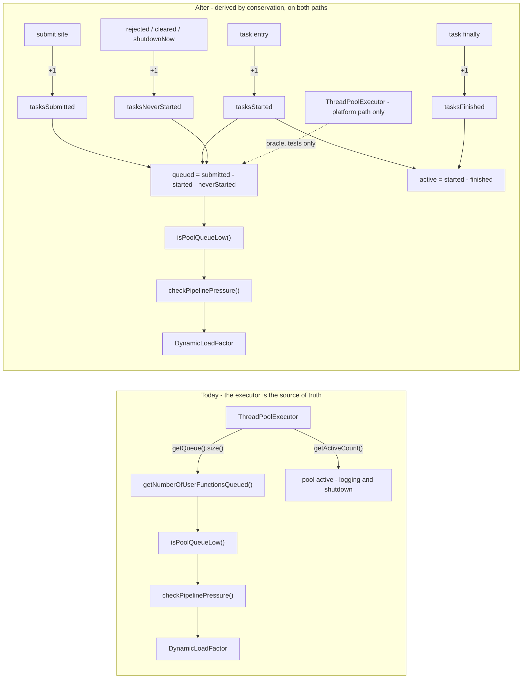
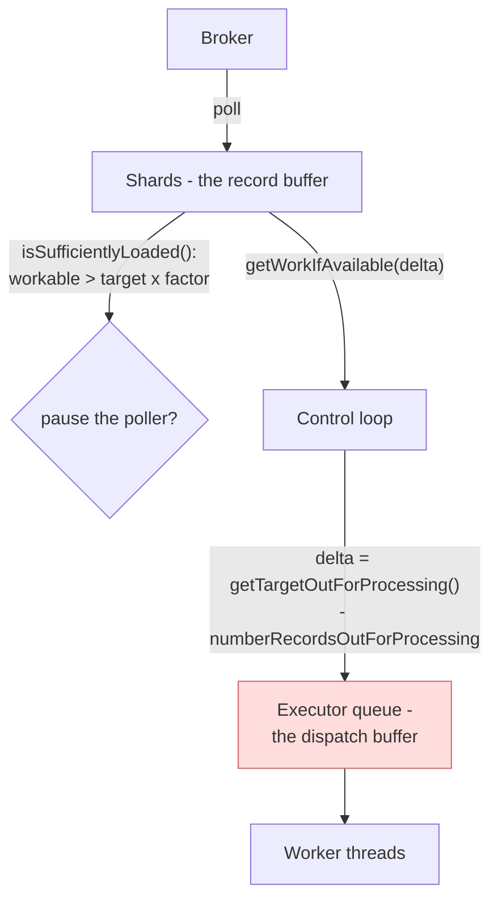
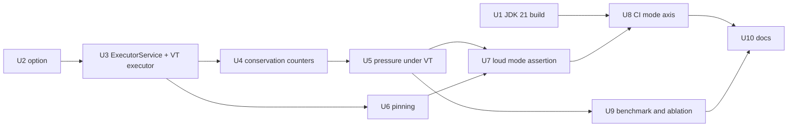

# Virtual threads for the user function - Plan

## Goal Capsule

**Objective.** Give Parallel Consumer an opt-in `useVirtualThreads` mode that runs the user function on virtual threads, and prove it runs by exercising the existing core suite against it in CI on a JDK 21 runner.

**Why it is worth doing.** `docs/inflight/perf-platform-threads-are-the-ceiling.md` establishes that reachable concurrency is `min(maxConcurrency, r x handler_latency)`, where `r` is a machine-wide platform-thread activation rate of roughly 20,000-27,000/sec. Thread-per-record therefore caps one instance near 25,000 records/sec whatever the handler does. In a Kafka-free, PC-free control at 5,000 concurrency and a 100ms handler, platform threads reached 2,673 in flight at 4,648 msg/s and virtual threads reached 5,000 at 44,994.

**Authority hierarchy.** The Java 8 bytecode target (`release.target` in `pom.xml`, `docs/features/java-compatibility.yaml`) outranks everything here: JDK 21 APIs are reached reflectively or not at all, and this work must not pre-empt astubbs#53's separate Java-baseline decision. Behavioural equivalence with the default engine outranks virtual-thread throughput - a mode that is faster and disagrees on ordering, commits, retries, rebalance or shutdown is not shippable. The default stays platform threads.

**Stop conditions.** Stop and report rather than continuing if: the JDK 21 build blockers in KTD1 turn out to need a change to `release.target`; the mode axis surfaces core-suite failures that are genuine correctness violations rather than assertions on the current engine's design; or the benchmark refutes the prediction in R16.

**Tail ownership.** Commit on `feats/virtual-threads` in this worktree. Do not push and do not open a PR.

---

## Product Contract

### Summary

Add a `useVirtualThreads` option to `ParallelConsumerOptions`, defaulting from a `pc.virtualThreads` system property so a benchmark harness compiled against older releases can still select it. Widen the worker pool's type from `ThreadPoolExecutor` to `ExecutorService`, and construct the virtual-thread executor reflectively so the module still compiles to Java 8 bytecode. Replace the pressure system's reads of `ThreadPoolExecutor.getQueue().size()` and `getActiveCount()` with counters Parallel Consumer derives by conservation, so the pressure system stops depending on an executor internal that a virtual-thread-per-task executor does not have. Migrate the `synchronized` monitors that are held across blocking calls to `ReentrantLock`, except the one that collides with an open deadlock fix. Add an execution-mode matrix axis to the unit lane in CI, with virtual threads as its first non-default entry and a slot left open for direct pull. Make a skipped mode loud instead of green.

### Problem Frame

Parallel Consumer runs the user function on a fixed `ThreadPoolExecutor` sized to `maxConcurrency`. When the handler blocks - which is the case Parallel Consumer exists for - each in-flight record holds an OS thread. The measurement in `docs/inflight/perf-platform-threads-are-the-ceiling.md` shows that this puts a ceiling on in-flight population that no amount of tuning inside Parallel Consumer moves, because the constraint is not in the queueing. Ten internal hypotheses were tested against it and nine were refuted.

Three obstacles have kept the fix out of the tree. The port target, PR astubbs#51, is written against the `io.confluent.*` package names this repository has since renamed. Its tests use JUnit `Assumptions` and therefore skip silently on the JDK 17 that CI runs, which its own author flagged. And the pressure system reads two `ThreadPoolExecutor` methods that a virtual-thread executor does not expose, which is the part that is actual work rather than mechanical.

There is a fourth obstacle nobody has recorded, and it is the one that gates the CI lane: **the build does not currently run on a JDK newer than 17 at all**, and no job has ever tried. See KTD1.

### Requirements

#### The option and its selection

- R1. A `useVirtualThreads` option on `ParallelConsumerOptions` selects a virtual-thread-per-task executor for the user function. It defaults to false.
- R2. `useVirtualThreads` defaults from the `pc.virtualThreads` system property, matching the `pc.directPull` idiom in `ParallelConsumerOptions`. A harness that compiles one source against every released version can then select the mode per run.
- R3. Enabling `useVirtualThreads` on a JVM without virtual threads fails at construction with a message naming the option and the runtime, and carrying the underlying reflective failure as its cause.
- R4. The core module still compiles to Java 8 bytecode. JDK 21 APIs are reached reflectively.
- R5. `ExternalEngine` and its subclasses (Vert.x, Reactor, Mutiny, proxy) do not use virtual threads for the worker pool. Their pool is one dispatch thread by design and the concurrency lives in the external runtime; enabling the option there must warn and fall back rather than silently replacing that thread with an unbounded executor.

#### The pressure system

- R6. The pressure system reads no `ThreadPoolExecutor`-only method. Its two quantities - how many submitted user-function tasks have not yet started, and how many have started and not finished - are derived from monotonic counters Parallel Consumer increments at the submit and task-boundary sites.
- R7. Every path that can move each counter is enumerated in code and covered by a test, and the conservation invariant relating them is asserted. A derived counter is drift-free only if every path in and out is counted.
- R8. On the platform path the derived queue depth agrees exactly with `ThreadPoolExecutor.getQueue().size()`, and the derived active count with `getActiveCount()`, at quiescence and at a controlled non-zero point. This is the counters' only independent oracle.
- R9. The `pool active: {} queued: {}` diagnostic pair keeps its meaning in both modes. `docs/inflight/bug-in-flight-ceiling-above-2000-concurrency.md` names reading that pair as its own next step; a replacement that renders it meaningless closes off that investigation.
- R10. Under virtual threads, `getTargetOutForProcessing()` is not multiplied by the dynamic load factor. There is no executor queue to hold the excess, so a multiplied target would put more records in flight than `maxConcurrency` rather than more records in a queue.
- R11. The broker-poller gate `WorkManager.isSufficientlyLoaded()` keeps the load factor unchanged under both modes, and `checkPipelinePressure()` is not made a no-op under virtual threads. The factor sizes the shard buffer, which virtual threads do not remove.

#### Virtual-thread safety

- R12. Monitors held across a blocking call are `ReentrantLock`s, not `synchronized`, except `commitCommand`, which is deferred (KTD6).

#### Proving the mode ran

- R13. CI runs the existing core unit suite through an execution-mode axis. Virtual threads is its first non-default entry; the axis accepts a further entry as configuration, not as a second job.
- R14. When a mode is selected and the runtime cannot provide it, the run fails. It does not skip, and it does not report green. The job summary states which mode ran, how many tests it ran, and how many it skipped.
- R15. The new job is not added to the master ruleset in this change. A required context that no run produces blocks every PR whose base predates it, so it can only be made required once the job is on master.

#### Measurement

- R16. The virtual-thread arm is measured against the platform arm on the same JVM, same broker, same record count, three repeats minimum, sweeping delay (0ms, 2ms, 100ms) and concurrency (1000, 5000), with machine load recorded before and after each batch. The stated prediction: at 100ms and `maxConcurrency` 5,000, platform threads plateau near 2,750 in flight and virtual threads reach 5,000.
- R17. The counter rework is ablated separately from the thread-type change. A platform-thread arm before and after the counters says whether they cost anything; without it, one number covers four changes.

#### Documentation

- R18. Every place the repository says virtual threads are deferred is corrected, and the capability gains a feature record.

### Scope Boundaries

**In scope.** The option, the executor abstraction, the pinning fixes, the pressure-system replacement, the JDK 21 build fixes needed to make a lane possible, the execution-mode CI axis, tests, the benchmark arm and its measurement, and the documentation updates R18 names.

**Deferred to Follow-Up Work.**

- The direct-pull entry on the execution-mode axis. The axis must be able to take it; adding it is separate work.
- Triage of any core-suite assertions the virtual-thread axis turns red. They are reported as a list (KTD10), not silenced and not fixed here.
- Making the new job a required status check (R15).
- Micrometer coverage for the virtual-thread executor. U3 stops the existing binding from silently measuring nothing; giving virtual threads their own metrics is new work.
- Accepting a user-supplied `ExecutorService` or `ThreadFactory` instance rather than a JNDI name (astubbs#127, astubbs#179). Widening `setupWorkerPool` to `ExecutorService` is the natural moment for it, and taking it here would double the change.

**Outside this change.** Removing `DynamicLoadFactor`, the direct-pull engine, and the async user-function API (`docs/inflight/next-core-async-user-function.md`, `docs/inflight/parked-2022-central-queue-rework.md`). Each would dissolve part of this problem and each is separately tracked. Changing `release.target` or the Java baseline, which is astubbs#53's decision. This change must not grow into an engine rewrite.

### Sources

- `docs/inflight/perf-platform-threads-are-the-ceiling.md` - the measurement, the formula, and the three prerequisites this plan discharges.
- `docs/inflight/test-opt-in-engine-paths-are-unexercised.md` - why the CI work is a mode axis rather than a virtual-threads job, and the instruction to build one lane mechanism rather than two.
- `docs/solutions/logic-errors/counter-clamp-hid-a-conditional-decrement-bug-2026-08-21.md` - the conservation-counter design this plan copies, and the mutation-testing bar it sets.
- `docs/solutions/runtime-errors/revoke-path-commit-deadlock-between-poll-and-control-threads.md` - why `commitCommand` is not touched here.
- `docs/solutions/workflow-issues/a-check-that-reports-success-without-having-run.md` - the silent-green class, its guard shape, and the exit-1-versus-exit-2 convention.
- `docs/inflight/next-core-async-user-function.md` - that `ExternalEngine`'s no-op `checkPipelinePressure()` is the cause of its 35% regression, which is why R11 forbids the same move here.
- `docs/inflight/perf-vertx-already-beats-the-thread-ceiling.md` - Parallel Consumer already has a path past the ceiling today, on Java 8. The honest framing for any claim this work makes.
- `docs/inflight/bug-available-work-counter-is-still-an-approximation.md` - the counter-drift shape this plan must not repeat, and why `numberRecordsOutForProcessing` is the wrong quantity for the pressure decision.
- `parallel-consumer-core/src/main/java/bz/stub/parallelconsumer/internal/DirectPullWorkerPool.java` and `CountedTransferQueue.java` - the two in-repo precedents for replacing an executor reading with Parallel Consumer's own accounting.
- PR astubbs#51 (`gh pr diff 51 -R astubbs/parallel-consumer`) - the port target, its three author concerns, and the Copilot and Claude reviews on it.
- astubbs#128 (a JDK axis existed and was removed for cost), astubbs#181 (the Java 24 claim is untested), astubbs#190 and confluentinc#896 (the feature request, and two alternative designs), astubbs#147 and confluentinc#300 (the 2022 Loom POC, which must be compared rather than assumed superseded).

---

## Planning Contract

### Key Technical Decisions

- KTD1. **Fix the JDK 21 build before anything else, and treat it as a discovered blocker rather than an assumption.** Measured on this branch: `./mvnw -pl parallel-consumer-core -am -DskipTests compile` under JDK 23 fails twice over. First, `lombok-maven-plugin:1.18.20.0:delombok` throws `NoSuchFieldError: Class com.sun.tools.javac.tree.JCTree$JCImport does not have member field 'com.sun.tools.javac.tree.JCTree qualid'` - the plugin embeds lombok 1.18.20 while the project's own lombok is 1.18.46. Second, with delombok skipped, `maven-compiler-plugin:3.15.0` reports the javac warnings `source value 8 is obsolete` and `target value 8 is obsolete` as *compilation errors*; raw `javac -source 8 -target 8` on the same JDK emits them as warnings and exits 0, and `-Dmaven.compiler.failOnWarning=false` (already the default, confirmed in the plugin's own debug dump) does not change it, so the promotion happens above javac. Candidate fixes: pin the delombok plugin's lombok dependency to `${lombok.version}`; add `-Xlint:-options` to `compilerArgs`. **Both must be confirmed on a real JDK 21** - the observation above is from JDK 23, no JDK 21 is installed on this machine, and `/opt/homebrew/opt/openjdk@21` is a symlink to 23. The enforcer does not block this: `requireJavaVersion` is `[17,)`, which allows 21 and above.

- KTD2. **The option defaults from a system property, like `pc.directPull`.** `bench/Bench.java.template` is compiled against every released version in the sweep, so it cannot reference an option that does not exist in 0.3.0.2. A system property that old versions ignore is the only selector that works for both the benchmark and the CI axis. Governs R2.

- KTD3. **Reach the JDK 21 API reflectively, and keep PR astubbs#51's exact shape.** `Thread.ofVirtual()` to a `Thread$Builder`, `name(String, long)` for a `pc-vt-` prefix, `factory()`, then `Executors.newThreadPerTaskExecutor(ThreadFactory)`. `bench/threads/ThreadCeiling.java` uses the shorter `Executors.newVirtualThreadPerTaskExecutor()`; the longer form is worth its extra lines because it names the threads, and named threads are what makes a stack dump readable at 5,000 of them. The reflection needs a comment saying why - the review on astubbs#51 flagged that the next reader will otherwise simplify it into a direct call that breaks the Java 8 build. Governs R4.

- KTD4. **Derive the two pressure quantities by conservation from monotonic counters, on both paths, rather than forking on `instanceof`.** PR astubbs#51 branches on `executor instanceof ThreadPoolExecutor` at five sites and returns a hardcoded 0 for the virtual-thread queue depth. Four monotonic `LongAdder`s replace both readings on both paths:

  | Counter | Incremented |
  |---|---|
  | `tasksSubmitted` | once per `submit(...)`, immediately before the call |
  | `tasksStarted` | once at task entry, first statement inside the submitted lambda |
  | `tasksNeverStarted` | once per task that provably will never run |
  | `tasksFinished` | once in the task's outermost `finally` |

  `getNumberOfUserFunctionsQueued()` = `tasksSubmitted - tasksStarted - tasksNeverStarted`. Pool active = `tasksStarted - tasksFinished`. **Read the subtrahends first**, exactly as `RecordPopulation` reads `retired` before `admitted`, so each difference is non-negative by construction rather than by ordering luck. Nothing is ever decremented, so there is no path that can take an increment back and none that can be conditionally skipped - the defect shape `docs/solutions/logic-errors/counter-clamp-hid-a-conditional-decrement-bug-2026-08-21.md` records. Conservation invariant, assertable at quiescence: `tasksSubmitted == tasksStarted + tasksNeverStarted` and `tasksStarted == tasksFinished`.

  The queued counter counts *tasks*, and a task is a batch rather than a record - which is exactly what `getQueue().size()` counted, so the semantics of what it feeds are unchanged. Counting on both paths removes every `instanceof` branch, and it buys the one thing a fork cannot: on the platform path there is an independent oracle to test against, per R8.

- KTD5. **The counters must be cheap to read, because the control loop reads them every pass.** `docs/inflight/parked-worker-pool-queue-lock-is-not-the-cost.md` records that swapping the pool's queue for a `LinkedTransferQueue` cost 69% of throughput partly because `size()` became an O(n) walk that `getNumberOfUserFunctionsQueued()` paid once per control loop over ~1,000 entries. `LongAdder.sum()` is O(cells) and the read happens once per loop, not per record. Measure it anyway - R17.

- KTD6. **Do not touch `commitCommand`.** PR astubbs#51 converts all four `synchronized (commitCommand)` blocks to a `ReentrantLock` as part of its pinning sweep. That is the same monitor astubbs#29 is changing for a *correctness* reason - an AB-BA deadlock between the poll thread's `onPartitionsRevoked` and the control thread's `commitAndWait()`, diagnosed in `docs/solutions/runtime-errors/revoke-path-commit-deadlock-between-poll-and-control-threads.md`, whose candidate fix is a different lock policy (`tryLock`) and whose status is "diagnosis verified, fix unproven". Landing a plain `lock()` migration here either silently precludes that fix or silently looks like it, and the pinning benefit is confined to JDK 21-23 because JEP 491 removes `synchronized` pinning from JDK 24. Leave it, and say so in a comment naming astubbs#29. **This is a deliberate divergence from the port target.** Governs R12.

- KTD7. **Migrate only the monitors that are actually held across a blocking call, minus KTD6's.** Two qualify: `ProducerManager.syncBeginTransaction()`, the only monitor on the user-function thread's hot path, and `SupplierUtils.memoize`, whose monitor is held across `setupWorkerPool`'s JNDI `InitialContext.doLookup`. `DynamicLoadFactor.doStep()` is cheap and non-blocking - migrate it for uniformity. Skip `PCMetrics` entirely: astubbs#57 owns that file (`docs/inflight/pr-blockers-and-collisions.md`), and the Claude review on astubbs#51 established that the finding motivating its change does not hold up, so the hunk buys nothing and costs a collision.

- KTD8. **Under virtual threads the target for records out for processing loses the load factor; the broker-poller gate keeps it, and the pressure check keeps running.** These are two different buffers wearing one number. `getQueueTargetLoaded()` sizes how many records are handed to the executor, and under the default engine the executor queue absorbs everything past `poolSize`. A virtual-thread executor has no queue, so a factor of up to `DEFAULT_MAX_LOADING_FACTOR` (100) would put 100x `maxConcurrency` records *in flight* rather than in a queue. `WorkManager.isSufficientlyLoaded()` sizes the records buffered in the shards, which virtual threads do not change. **The tempting third move - no-op `checkPipelinePressure()` under virtual threads, as `ExternalEngine` does - has a measured price:** `docs/inflight/next-core-async-user-function.md` identifies that no-op as the cause of `ExternalEngine`'s 35% throughput regression. Governs R10, R11.

- KTD9. **`ExternalEngine` opts out via a `supportsVirtualThreads()` hook, mirroring `supportsDirectPull()`.** `ExternalEngine.setupWorkerPool(int)` returns `super.setupWorkerPool(1)`; under PR astubbs#51 as written the virtual-thread branch runs first and ignores `poolSize` entirely, so Vert.x, Reactor and Mutiny would silently lose the single dispatch thread their design depends on. The repository already has the shape for this exact opt-out one method above. Governs R5.

- KTD10. **A selected mode that cannot run is a failure, not a skip, and the guard lives outside the tool.** `Assumptions.assumeTrue(...)` is the defect PR astubbs#51's author flagged; `docs/solutions/workflow-issues/a-check-that-reports-success-without-having-run.md` records seven instances of the class in this repository and prescribes an external guard reading structural evidence from the artifact rather than a log string, with exit 1 meaning the lane is broken and exit 2 meaning the tree has a finding. Invert the assumption: when `pc.virtualThreads=true` is set, a runtime that cannot provide virtual threads fails the test. Prove the guard by making it fail once. Governs R14.

- KTD11. **Report core-suite failures under the new mode as a triage list; do not silence them.** The direct-pull measurement ran the same suite with `-Dpc.directPull=true` and got three failures, two of which asserted the current engine's pre-loaded-queue design rather than behaviour a user depends on. Those two are the most valuable output a mode axis produces, because they identify tests that assert implementation, and that is invisible while only one mode exists. Classify any red in `OffsetEncodingBackPressureTest` against `docs/inflight/test-untracked-ci-flakes.md` before attributing it to this change - it is an already-recorded flake in exactly this area.

### High-Level Technical Design

#### What the pressure system reads today, and what it reads after

The executor keeps everything on the `ExecutorService` interface - `submit`, `shutdown`, `shutdownNow`, `awaitTermination`. Only `getQueue()`, `getActiveCount()` and the `toString()` pool-stats log lines lose their source, and those three are what the counters replace.

#### Every path that can move a counter

This enumeration is the deliverable of U4, not the counters themselves. All four are monotonic; nothing is ever decremented.

| Counter | Path | Site | Note |
|---|---|---|---|
| `tasksSubmitted` | a task is handed to the executor | `submitWorkToPoolInner`, immediately **before** `submit(...)` | Must be before. A virtual thread can begin executing before `submit()` returns, so incrementing after would let `tasksStarted` overtake `tasksSubmitted` and make the derived queue depth negative. |
| `tasksStarted` | the task begins running | first statement inside the submitted lambda, before `addInstanceMDC()` | The only site. |
| `tasksNeverStarted` | `submit(...)` threw | catch around the submit call; increment, then rethrow | The platform pool uses `AbortPolicy`, and a virtual-thread executor rejects after shutdown. astubbs#296 hardened this exact path against an already-closed pool - read its diff before changing it. |
| `tasksNeverStarted` | tasks discarded from the queue at close | `innerDoClose`, where `getQueue().clear()` is today | Drain to a list and add its size. Cleared tasks never run, so nothing else will ever account for them. No-op under virtual threads, where there is no queue. |
| `tasksNeverStarted` | tasks returned by `shutdownNow()` | `innerDoClose` | Add the returned list's size. Usually empty on the platform path because the clear ran first, and empty under virtual threads because every task has already started - but an unaccounted path is a drift path whether or not it fires today. |
| `tasksFinished` | the task ends, any way it ends | `finally` in the same lambda, outermost, wrapping `addInstanceMDC()` and `runUserFunction` | Covers normal return, a user-function exception, and the `InterruptedException` that `shutdownNow()` delivers. `finally` also runs for `Error`; only JVM exit skips it, and that is terminal. |

Two properties this shape buys, and the reason to prefer it to introspection. Each counter has exactly one kind of event, so there is no conditional-increment site to get wrong - the defect that produced the clamp in `ProcessingShard.availableWorkContainerCnt`. And the relationship between them is an invariant a test can assert directly, rather than a property that has to be argued.

Neither derived quantity depends on `WorkManager.numberRecordsOutForProcessing`, which is the `confluentinc#857` counter-drift signature named in `isSufficientlyLoaded()`'s comment and the one counter `docs/inflight/bug-available-work-counter-is-still-an-approximation.md` records as still undissolved.

#### The two buffers the load factor sizes, and which one virtual threads remove

Under virtual threads the node marked in red does not exist: every submitted task gets a thread immediately. The record buffer above it does exist and still needs sizing, which is why R11 leaves `isSufficientlyLoaded()` alone and R10 removes the factor only from the target that feeds the dispatch buffer.

#### Unit dependency order

U1 has no dependency on the Java work and can be done first or in parallel; everything in CI waits on it.

### Alternative Approaches Considered

- **A separate `parallel-consumer-virtual-threads` module compiled at JDK 21.** This is what confluentinc#896's reporter actually asked for and prototyped, and `parallel-consumer-mutiny`'s `release.target=17` override (astubbs#214) is the in-repo precedent. It sidesteps reflection entirely. Rejected for this change because the option belongs on the core engine rather than in a parallel copy of it, and because the reporter's own note is that he could not get the Maven build to work. Worth revisiting if the reflection proves unmaintainable.
- **The JNDI workaround, no code change.** confluentinc#896's second commenter binds a virtual-thread `ExecutorService` and `ThreadFactory` into JNDI at the names `managedExecutorService` and `managedThreadFactory` already look up, and it works on 0.5.3.3 today. Rejected as the shipped answer for the reason astubbs#190 records: the factory is still wrapped in `ThreadPoolExecutor(poolSize, poolSize, ...)`, so it produces N pooled virtual threads rather than the unbounded model virtual threads exist for. Worth documenting as a stopgap for users on older versions.
- **Attack it at the build layer, as the 2022 Loom POC did.** confluentinc#300 (`improvements/loom`, closed unmerged in an administrative sweep rather than on review) went at Jabel rather than at the API, linking `bsideup/jabel#144`. astubbs#147 says explicitly not to close it as superseded without comparing. Rejected because it entangles this change with the Java-baseline decision astubbs#53 owns.
- **Do nothing here and build the async user-function API instead.** `docs/inflight/next-core-async-user-function.md` reaches the same ceiling with no JDK bump, no virtual threads and no CI lane, and `bench/threads/AsyncCeiling.java` measured it matching virtual threads at 5,000 concurrency on JDK 17. It is the stronger long-run answer for work that need not block. It is not a substitute for this: virtual threads are for work that *must* block, which is most user code as written today.

### Assumptions

- The JDK 21 build blockers in KTD1 are fixable inside the build configuration and do not require changing `release.target`. If they are not, that is a stop condition, not a scope expansion.
- GitHub's `actions/setup-java@v5` can provide Temurin 21 on `ubuntu-latest`. No JDK 21 is installed on the development machine and `sdk install java 21.0.9-tem` produced no output in this sandbox, so U1's local verification may have to use JDK 22 or 23 (`~/.sdkman/candidates/java/22-graal`, `23-graal`) as a proxy and rely on CI for the exact runtime.
- `maxConcurrency` under virtual threads remains a target rather than a hard cap. Nothing gates at submission time, so a burst of already-submitted work can briefly exceed it. PR astubbs#51 documented this in the option's javadoc and that documentation carries over.

### Risks

- **The counter swap changes platform-path behaviour.** `getNumberOfUserFunctionsQueued()` is load-bearing for the default engine every user runs. Mitigation: R8's equivalence test against the executor's own readings, the conservation invariant in R7, and mutation-testing each increment site one at a time as `counter-clamp-hid-a-conditional-decrement-bug-2026-08-21.md` prescribes - a test suite that cannot see a missing increment has not verified the counter.
- **`PipelinePressureLoggingTest` is the one test that drives `checkPipelinePressure()` directly**, via the package-private `setLastWorkRequestWasFulfilled` setter. It constructs a real processor with an idle pool, which today makes the queue depth 0 and `isPoolQueueLow()` true. The counters must read 0 on an idle, never-started processor for those assertions to hold.
- **`checkPipelinePressure` has an open collision.** astubbs#201 fixes the unlimited load-factor WARN (astubbs#155). This branch already carries a rate-limited `maybeReportLoadFactorCeiling()`, so the fix may already be in the base - confirm before editing that method, rather than assuming either way.
- **The mode axis costs runner time.** `docs/inflight/ci-disabled-jobs-and-runner-load.md` records the self-hosted `highcpu` lane dying of lost communication under concurrent agent load as recently as 2026-08-17. Put the new entry on `ubuntu-latest`, not `highcpu`, and scope it to the unit suite only.
- **Job names are an API.** The three existing `maven.yml` suite names are required status checks matched by name in the master ruleset; renaming one does not fail, it silently stops being satisfied. Add a name, never change one.

---

## Implementation Units

| U-ID | Title | Key files | Depends on |
|---|---|---|---|
| U1 | Make the build run on JDK 21 | `pom.xml` | - |
| U2 | The `useVirtualThreads` option and its capability check | `ParallelConsumerOptions.java` | - |
| U3 | Widen the worker pool to `ExecutorService`; build the VT executor | `AbstractParallelEoSStreamProcessor.java`, `ExternalEngine.java`, `VertxParallelEoSStreamProcessor.java` | U2 |
| U4 | Conservation counters for the pool's two quantities | `AbstractParallelEoSStreamProcessor.java` | U3 |
| U5 | The pressure system under virtual threads | `AbstractParallelEoSStreamProcessor.java` | U4 |
| U6 | Remove the monitors that pin, except the one that collides | `ProducerManager.java`, `SupplierUtils.java`, `DynamicLoadFactor.java` | U3 |
| U7 | A selected mode that cannot run fails loudly | new test, `bin/check-execution-mode.sh`, `bin/test-check-execution-mode.sh` | U5, U6 |
| U8 | The execution-mode CI axis | `.github/workflows/maven.yml` | U1, U7 |
| U9 | The `core-vt` benchmark arm, the measurement, and the ablation | `bench/run-bisect.sh`, `docs/inflight/` | U5 |
| U10 | Documentation and feature data | `docs/features/`, `docs/data/`, `src/docs/README_TEMPLATE.adoc`, `docs/inflight/` | U8, U9 |

### U1. Make the build run on JDK 21

**Goal.** `./mvnw -pl parallel-consumer-core -am test` completes on a JDK 21 runtime, so a JDK 21 CI lane is possible at all.

**Requirements.** Prerequisite for R13, R14. Governed by KTD1.

**Dependencies.** None.

**Files.** `pom.xml`.

**Approach.**

1. Pin `lombok-maven-plugin`'s embedded lombok to `${lombok.version}` by adding a `<dependencies>` block to the plugin declaration, so `delombok` runs against 1.18.46 rather than 1.18.20.
2. Establish why `maven-compiler-plugin` 3.15.0 surfaces the two obsolete-option warnings as errors when raw `javac` on the same JDK exits 0. Jabel (`jabel-javac-plugin` 1.0.0, an annotation processor that patches javac internals) is the leading suspect; the plugin's own diagnostic handling is the alternative. Confirm which before choosing between adding `-Xlint:-options` to `<compilerArgs>` and something narrower.
3. Verify on a real JDK 21 rather than 22 or 23, and say which was used in the commit message.
4. Whatever is added must be a no-op on JDK 17 - the default lane must not change behaviour.

**Execution note.** Reproduce both failures first and record the exact commands and messages, then fix one at a time. A fix that works is not evidence of the cause when two blockers stack.

**Patterns to follow.** `docs/solutions/build-errors/maven-multi-module-plugin-and-resolution-traps.md` for the reactor traps a plugin-version change can spring. Commit `7b389d127` is the only time the Java properties have ever been touched - read it first.

**Test scenarios.**

- The full core unit suite passes under JDK 17 with the change applied, with the same test count as before.
- The full core unit suite passes under JDK 21, or under 22 and 23 with the discrepancy named.
- `mvn javadoc:jar` still produces javadoc from the delombok output under both JDKs - the delombok change must not break what delombok exists for.

**Verification.** Both JDKs compile and test green.

### U2. The `useVirtualThreads` option and its capability check

**Goal.** A user can ask for virtual threads, and asking for them on a JVM that cannot provide them fails immediately with a message that says so.

**Requirements.** R1, R2, R3. Governed by KTD2.

**Dependencies.** None.

**Files.** `parallel-consumer-core/src/main/java/bz/stub/parallelconsumer/ParallelConsumerOptions.java`, plus the nearest existing options test.

**Approach.**

1. Add `@Builder.Default private final boolean useVirtualThreads = Boolean.getBoolean("pc.virtualThreads");`, sited next to `directPullEngine` and documented the same way.
2. Extend `validate()` with a capability probe that reflectively resolves both `Thread.ofVirtual()` and `Executors.newThreadPerTaskExecutor(ThreadFactory)`, matching what `setupWorkerPool` will actually call. Throw `UnsupportedOperationException` **with the caught exception as its cause** - PR astubbs#51 dropped the cause here and both reviews flagged it.
3. Document in the option's javadoc that it overrides `managedExecutorService` and `managedThreadFactory`, and that `maxConcurrency` is a target rather than a hard cap under this mode.

**Patterns to follow.** `ParallelConsumerOptions.directPullEngine` for the property-defaulted option; `transactionsValidation()` for the validation shape.

**Test scenarios.**

- Default construction leaves `useVirtualThreads` false with no system property set.
- Setting `pc.virtualThreads=true` makes the default true; the test restores the property afterwards.
- The builder's explicit `useVirtualThreads(false)` wins over the system property.
- On a JDK 21+ runtime, `validate()` accepts `useVirtualThreads(true)`.
- The capability probe checks both reflective targets, not just `Thread.ofVirtual` - a runtime with one and not the other must not pass.
- The thrown `UnsupportedOperationException` carries a non-null cause.

**Verification.** The options test passes on both JDK 17 and JDK 21; on 17 the JDK-21-only scenarios assert the failure rather than skipping.

### U3. Widen the worker pool to `ExecutorService`; build the VT executor

**Goal.** `setupWorkerPool` returns an `ExecutorService`, and returns a named virtual-thread-per-task executor when the option is on and the engine supports it.

**Requirements.** R1, R4, R5. Governed by KTD3, KTD9.

**Dependencies.** U2.

**Files.** `parallel-consumer-core/src/main/java/bz/stub/parallelconsumer/internal/AbstractParallelEoSStreamProcessor.java`, `.../internal/ExternalEngine.java`, `parallel-consumer-vertx/src/main/java/bz/stub/parallelconsumer/vertx/VertxParallelEoSStreamProcessor.java`.

**Approach.**

1. Change the field to `Supplier<ExecutorService>` and `setupWorkerPool`'s return type to `ExecutorService`. Three sites in the core file, plus the two `super.setupWorkerPool(1)` overrides. No test in the repository references the field or the getter, so there is no test churn here. `DirectPullWorkerPool.start(Executor, int)` already takes the weakest type and needs no change.
2. Add the virtual-thread branch to `setupWorkerPool`, reached reflectively per KTD3, with a comment saying why reflection is used.
3. Add `protected boolean supportsVirtualThreads()` returning true, overridden false in `ExternalEngine`, mirroring `supportsDirectPull()`. When the option is on and the engine does not support it, log a warning naming the engine and fall through to the platform pool.
4. Guard the `ExecutorServiceMetrics` binding in `initMetrics()`. Micrometer special-cases `ThreadPoolExecutor`; handed a virtual-thread executor it binds nothing and says nothing. Skip the binding with a debug line rather than leaving it silently measuring nothing.
5. Do **not** enforce that the non-virtual path returns a `ThreadPoolExecutor`. PR astubbs#51 added that check; it breaks any subclass supplying a custom executor, both reviews and the author flagged it, and U4 removes the reason it existed. `docs/solutions/architecture-patterns/a-type-gate-is-a-claim-about-a-hierarchy-you-did-not-write.md` is the repository's own argument for when a type gate earns its place - this one does not.

**Test scenarios.**

- With `useVirtualThreads(true)` on a JDK 21+ runtime, a task submitted to the worker pool runs on a thread for which `Thread.isVirtual()` is true.
- The virtual thread's name carries the `pc-vt-` prefix.
- With the option off, the pool is still a `ThreadPoolExecutor` with `maxConcurrency` core threads.
- A `VertxParallelEoSStreamProcessor` constructed with `useVirtualThreads(true)` gets a single-threaded platform pool and logs the fallback warning.
- A subclass returning a custom non-`ThreadPoolExecutor` `ExecutorService` with the option off still constructs and runs - the compatibility case astubbs#51 broke.
- Closing a processor whose virtual-thread worker is asleep completes within the shutdown timeout.
- `initMetrics()` does not throw when handed a virtual-thread executor.

**Verification.** The core suite is green in both modes; the Vert.x, Reactor and Mutiny module suites are green and unchanged.

### U4. Conservation counters for the pool's two quantities

**Goal.** The pressure system, the shutdown diagnostics and the stats logging read quantities Parallel Consumer derives, and read nothing that only a `ThreadPoolExecutor` has.

**Requirements.** R6, R7, R8, R9. Governed by KTD4, KTD5.

**Dependencies.** U3.

**Files.** `parallel-consumer-core/src/main/java/bz/stub/parallelconsumer/internal/AbstractParallelEoSStreamProcessor.java`, new test under `parallel-consumer-core/src/test/java/bz/stub/parallelconsumer/internal/`.

**Approach.**

1. Add the four `LongAdder`s and wire every path in the enumeration table under High-Level Technical Design. That table is this unit's specification; implement it path by path and put the enumeration in a javadoc comment on the counters so it survives.
2. `getNumberOfUserFunctionsQueued()` returns the derived queue depth, reading the subtrahends first. Add a package-private accessor for the derived active count.
3. Replace the six `getActiveCount()` reads: `innerDoClose` (four), the `pool active: {} queued: {}` stats line in `retrieveAndDistributeNewWork`, and the blocking-poll debug line in `processWorkCompleteMailBox`. R9 makes that stats pair a requirement, not a log line to drop.
4. Replace the two `Pool stats: {}` log arguments in `submitWorkToPool`, which today rely on `ThreadPoolExecutor.toString()`, with the two derived quantities.
5. Replace `getQueue().clear()` in `innerDoClose` with a drain that returns a count, and add it to `tasksNeverStarted`. Guard on `instanceof ThreadPoolExecutor` here and only here - it is the one operation with no `ExecutorService` equivalent, and it is a shutdown path, not a hot path.
6. Count the list `shutdownNow()` returns.

**Execution note.** Write the R8 equivalence test first, against the current implementation, so it is known to pass for the right reason before the swap. Then run `bin/ci-mutation-test.sh` scoped to this class and confirm the new tests kill a removed increment at each site - a suite that cannot see a missing increment has not verified the counter.

**Patterns to follow.** `RecordPopulation` and `ShardManager.getNumberOfRecordsInShards()` for the monotonic-pair-read-subtrahend-first shape. `CountedTransferQueue`'s two rules: delegate rather than subclass, and count on outcome rather than on intent.

**Test scenarios.**

- Covers R8. On the platform path, with N tasks submitted and `poolSize` of them blocked on a latch, the derived queue depth equals `getQueue().size()` and the derived active count equals `getActiveCount()`.
- Covers R7. At quiescence after a run, `tasksSubmitted == tasksStarted + tasksNeverStarted` and `tasksStarted == tasksFinished`.
- Both derived quantities read 0 on a constructed but never-started processor - what `PipelinePressureLoggingTest` depends on.
- A task that throws from the user function still increments `tasksFinished`.
- A task interrupted by `shutdownNow()` still increments `tasksFinished`.
- A `submit()` that throws `RejectedExecutionException` increments `tasksNeverStarted`, and the exception still propagates.
- After `innerDoClose` clears a loaded queue, the derived queue depth is 0 rather than the number of discarded tasks.
- Submitting from the control thread while tasks complete on worker threads leaves both derived quantities at 0 once every task has returned - enough tasks and enough randomised handler delay to exercise real ordering.
- Neither derived quantity is ever observed negative across that concurrent run.
- Under virtual threads, the derived queue depth is transiently non-zero and settles at 0, rather than being hardcoded to 0.

**Verification.** The full core unit suite green with no test-count change beyond the new tests, on both paths; the mutation run kills a deliberately removed increment at each of the six sites.

### U5. The pressure system under virtual threads

**Goal.** The load factor sizes the shard buffer under both modes, and does not inflate the in-flight target under virtual threads.

**Requirements.** R10, R11. Governed by KTD8.

**Dependencies.** U4.

**Files.** `parallel-consumer-core/src/main/java/bz/stub/parallelconsumer/internal/AbstractParallelEoSStreamProcessor.java`, `parallel-consumer-core/src/test/java/bz/stub/parallelconsumer/AbstractParallelEoSStreamProcessorConfigurationTest.java`, `.../internal/PipelinePressureLoggingTest.java`.

**Approach.**

1. `getQueueTargetLoaded()` returns `getPoolLoadTarget()` unmultiplied when the worker pool is a virtual-thread executor, and the factored value otherwise. Comment it with KTD8's two-buffers argument, because the change reads as arbitrary without it.
2. Leave `WorkManager.isSufficientlyLoaded()` and `getLoadingFactor()` untouched, and do not no-op `checkPipelinePressure()`. State in a comment that this is deliberate, and cite `ExternalEngine`'s no-op and its 35% price so the next reader does not "finish the job".
3. Decide what `isPoolQueueLow()` means when the dispatch buffer is structurally empty, and record the answer in a comment. The derived queue depth is genuinely near zero under virtual threads, so the predicate is near-always true and the factor climbs to its ceiling; that is the right outcome for the shard buffer but it makes `maybeReportLoadFactorCeiling()` fire steadily. Suppress the ceiling report for this mode rather than changing the predicate, unless measurement says otherwise.
4. Do not use `WorkManager.getNumberRecordsOutForProcessing()` for the pressure decision. It is a different unit - records, where the queue depth is tasks - and it is the counter `docs/inflight/bug-available-work-counter-is-still-an-approximation.md` records as still undissolved. This is a deliberate divergence from PR astubbs#51, and it answers that PR author's own second stated concern.

**Test scenarios.**

- With `useVirtualThreads(true)` and a load factor above 1, `getTargetOutForProcessing()` equals `maxConcurrency * batchSize` and not that times the factor.
- With the option off, `getTargetOutForProcessing()` is unchanged - `queueTargetLoad()` still expects `batchSize * concurrency * factor`.
- `isSufficientlyLoaded()` returns the same answer for the same shard population in both modes.
- Driving `checkPipelinePressure()` repeatedly under virtual threads does not emit the load-factor-ceiling warning on every pass.
- `checkPipelinePressure()` is still called under virtual threads - assert the call, not just its absence of noise, because a silent no-op is the regression KTD8 names.
- An end-to-end run under virtual threads with `maxConcurrency` 50 and a blocking handler reaches close to 50 records in flight and does not exceed it by more than one batch per pass.

**Verification.** `PipelinePressureLoggingTest` and `AbstractParallelEoSStreamProcessorConfigurationTest` pass in both modes.

### U6. Remove the monitors that pin, except the one that collides

**Goal.** No monitor is held across a blocking call on a path a virtual thread reaches, without disturbing an open correctness fix.

**Requirements.** R12. Governed by KTD6, KTD7.

**Dependencies.** U3.

**Files.** `parallel-consumer-core/src/main/java/bz/stub/parallelconsumer/internal/ProducerManager.java`, `.../internal/utils/SupplierUtils.java`, `.../internal/DynamicLoadFactor.java`.

**Approach.**

1. `ProducerManager.syncBeginTransaction()` becomes a `ReentrantLock` held over the same critical section.
2. `SupplierUtils.memoize` locks instead of synchronizing, preserving the double-checked read.
3. `DynamicLoadFactor.doStep()` likewise.
4. **Do not touch the four `synchronized (commitCommand)` blocks**, and leave a comment at the first of them naming astubbs#29 and `docs/solutions/runtime-errors/revoke-path-commit-deadlock-between-poll-and-control-threads.md` so the omission is visibly deliberate rather than an oversight. Note for whoever does take it: `clearCommitCommand()` is called from inside `commitOffsetsThatAreReady()`'s block, so reentrancy is load-bearing there.
5. Do not touch `PCMetrics` - astubbs#57 owns it and the finding that motivated astubbs#51's change there does not hold up.

**Test scenarios.**

- Test expectation: none for the mechanical migrations - the existing suite covers the critical sections and there is no new behaviour. The one below is the exception.
- `SupplierUtils.memoize` still calls its delegate exactly once under concurrent first access from several threads.

**Verification.** Full core suite green; no change in the commit-related integration tests.

### U7. A selected mode that cannot run fails loudly

**Goal.** A run that selects virtual threads either exercises them or goes red. It never reports green having skipped.

**Requirements.** R14. Governed by KTD10.

**Dependencies.** U5, U6.

**Files.** new test under `parallel-consumer-core/src/test/java/bz/stub/parallelconsumer/internal/`, `bin/check-execution-mode.sh`, `bin/test-check-execution-mode.sh`.

**Approach.**

1. Add a test that asserts the selected mode is actually in force: when `pc.virtualThreads=true` is set, a constructed processor's worker pool must produce virtual threads. It fails, rather than skipping, when the runtime cannot. With no property set it is inert.
2. Add `bin/check-execution-mode.sh` following the repository's guard-script idiom: read the surefire XML reports for structural evidence, write a markdown summary to stdout for `$GITHUB_STEP_SUMMARY`, and keep the two reds distinct - exit 1 when the mode could not be proven to have run (the lane is broken), exit 2 when tests ran and failed (the tree needs triage). When both are true, exit 1 wins.
3. Add `bin/test-check-execution-mode.sh`, its self-test. This repository requires guards to pin the gaps they were written to catch; `bin/test-check-docs-data.sh` exists because that guard shipped green on a real failure twice.
4. Replace PR astubbs#51's `Assumptions.assumeTrue(isVirtualThreadsSupported(), ...)` calls with this shape. Keep an assumption only for the developer case: no mode property set, JDK below 21.

**Execution note.** Prove the guard by making it fail. Break `useVirtualThreads` deliberately once, on a JDK 21 run, and record that the lane went red - a negative result is worthless from an instrument that has never been shown to say yes.

**Patterns to follow.** `bin/check-ossindex-audit.sh` and `bin/test-check-ossindex-audit.sh` for the guard-plus-self-test pair, the stdout-markdown convention, and the exit-code split. `bin/ci-mutation-test.sh`'s `summary()` helper for the `$GITHUB_STEP_SUMMARY` write.

**Test scenarios.**

- With `pc.virtualThreads=true` on a JDK 21+ runtime, the mode assertion passes and the summary reports the mode as exercised.
- With `pc.virtualThreads=true` on JDK 17, the test fails with a message naming the mode and the runtime. It must not skip.
- With no mode property, the assertion is inert and the default suite is unchanged.
- `bin/check-execution-mode.sh` exits 1 for a report directory with no tests for the selected mode.
- It exits 2 for reports containing failures.
- It exits 1 rather than 2 when the reports are both unproven and failing.
- It exits 0 and names the run and skip counts for a clean report.
- `bin/test-check-execution-mode.sh` covers each of those exits.

**Verification.** `bash bin/test-check-execution-mode.sh` passes, and the deliberate red in the execution note is reproduced once and recorded.

### U8. The execution-mode CI axis

**Goal.** CI runs the existing core unit suite under a second execution mode, and adding a third is a line of configuration.

**Requirements.** R13, R14, R15. Governed by KTD10.

**Dependencies.** U1, U7.

**Files.** `.github/workflows/maven.yml`.

**Approach.**

1. Extend the existing `test` job's `matrix.include` with an execution-mode entry rather than adding a new job. Each entry already carries `suite`, `name`, `cmd` and `timeout`; add a `java-version` key so an entry is self-describing, defaulted to `'17'` for the existing three.
2. The virtual-threads entry runs `bin/ci-unit-test.sh -Dpc.virtualThreads=true` on `java-version: '21'`, on `ubuntu-latest`, unit suite only.
3. Add the summary step running `bin/check-execution-mode.sh` into `$GITHUB_STEP_SUMMARY`.
4. Leave the axis able to take `-Dpc.directPull=true` on JDK 17 as a further entry, and say so in the workflow comment. Do not add it.
5. **Do not rename any existing job**, and do not add the new one to the master ruleset (R15). Land it advisory, let it run on master, and make it required as a separate deliberate act - a required context no run produces blocks every PR whose base predates it.
6. Cite astubbs#128 in the workflow comment: a JDK axis existed here once (JDK 8 and 13) and was removed deliberately for cost. Re-adding one re-opens that decision and should say so.

**Patterns to follow.** The `test` job's matrix; the `mutation` job for `continue-on-error: true # advisory - never gates merge`; the caching rules in the file's header comment - never `cache: maven` from `setup-java`.

**Test scenarios.**

- Test expectation: none in the Java suite - this unit is workflow configuration, and its proof is the run.
- The virtual-threads matrix entry appears as its own check with a distinct name.
- Its job summary names the mode, the run count and the skip count.
- The three existing entries are unchanged in name, JDK and command.

**Verification.** Run the axis locally first: `JAVA_HOME=<jdk21> bin/ci-unit-test.sh -Dpc.virtualThreads=true`. Record the failure list per KTD11 rather than fixing or silencing it.

### U9. The `core-vt` benchmark arm, the measurement, and the ablation

**Goal.** A measured comparison of the two thread types inside Parallel Consumer, plus a separate answer to what the counter rework cost.

**Requirements.** R16, R17.

**Dependencies.** U5.

**Files.** `bench/run-bisect.sh`, a new write-up under `docs/inflight/`.

**Approach.**

1. Add a `core-vt` mode to `run_one` in `bench/run-bisect.sh`, mirroring the three-line `core-dp` branch: set `-Dpc.virtualThreads=true` and fall through to the ordinary `core` path. The mode-suffix shape exists because `bench/Bench.java.template` compiles against every released version and cannot reference a new option.
2. Run both arms **on the same JVM**. A JDK 21+ JVM must be on `PATH`; running the platform arm on 17 and the virtual arm on 21 would confound JDK version with thread type, which is the one variable the comparison is about.
3. Sweep as R16 specifies, with `BENCH_SKIP_PRODUCE=1 BENCH_TOPIC=bench-500000-p10 BENCH_PARTITIONS=10`, `MODES="core core-vt"`, `DELAYS="0 2 100"`, `CONCURRENCIES="1000 5000"`, three repeats. Never compare across different record counts. Record `uptime` before and after each batch - the machine is shared and has seen load from 8 to 860 in one day. Never mix profiled and unprofiled runs in one table.
4. Ablate. Run the platform arm at the same points against the pre-U4 commit, so the table can say what the counters cost independently of what virtual threads bought.
5. State the prediction before running it, and report a refutation as prominently as a confirmation. If virtual threads do not reach 5,000 in flight at 100ms and concurrency 5,000, that is the most interesting result available and it is reported, not tuned away.
6. Write it up as an inflight entry per `docs/inflight/AGENTS.md`: one item per file, the three HTML-comment tags, repo-qualified issue references, and the conditions and load figures in the table.

**Patterns to follow.** `docs/inflight/perf-direct-pull-measured.md` for the shape of an engine-comparison write-up on this harness.

**Test scenarios.**

- Test expectation: none in the Java suite - a measurement harness change, whose proof is `core-vt` producing a result row rather than `RUN_FAILED`.
- A `core-vt` row appears in the results CSV with the mode column set, so a swept file can be read back.
- `core` and `core-vt` alternate within one invocation - the harness's only defence against machine drift between arms.

**Verification.** Three repeats at each point, both arms, the same JVM, `uptime` either side, and the ablation arm present.

### U10. Documentation and feature data

**Goal.** The repository stops saying virtual threads are deferred, and the capability has a record.

**Requirements.** R18.

**Dependencies.** U8, U9.

**Files.** `docs/features/virtual-threads.yaml` (new), `docs/data/module-maturity.yaml`, `docs/data/roadmap.yaml`, `docs/data/testing-evidence.yaml`, `src/docs/README_TEMPLATE.adoc`, `docs/features/java-compatibility.yaml`, `docs/inflight/perf-platform-threads-are-the-ceiling.md`, `docs/inflight/test-opt-in-engine-paths-are-unexercised.md`, `docs/inflight/parked-worker-pool-queue-lock-is-not-the-cost.md`, `docs/inflight/pr-blockers-and-collisions.md`, `docs/inflight/perf-hypothesis-register.md`, `STRATEGY.md`.

**Approach.**

1. Add `docs/features/virtual-threads.yaml` per `docs/features/README.md`. A new option is a user-visible capability and the `docs data: audit` job checks the corpus. Status is `planned` with a `target_release` until this ships, not `published`.
2. Remove "Virtual threads" from the deferred-capabilities list in `docs/data/module-maturity.yaml`, update `docs/data/roadmap.yaml`'s `virtual-threads` entry against its own `done_when`, and correct the deferred-features sentence in `docs/data/testing-evidence.yaml`.
3. Update `src/docs/README_TEMPLATE.adoc`, which currently calls virtual threads intentionally deferred. **Never hand-edit `README.adoc`** - it is generated.
4. Note in `docs/features/java-compatibility.yaml` that this option requires a JDK 21 runtime while the artifact's bytecode target is unchanged. The artifact is still Java 8; only this option needs more.
5. Close out the inflight entries this work resolves rather than rewriting them into a FIXED narrative: the "Before it can land" list in `perf-platform-threads-are-the-ceiling.md`, item 1 of `parked-worker-pool-queue-lock-is-not-the-cost.md`, the virtual-threads row in `test-opt-in-engine-paths-are-unexercised.md`, the astubbs#51 line in `pr-blockers-and-collisions.md`, and the open virtual-threads item in `perf-hypothesis-register.md`. `git rm` a file whose whole subject is resolved.
6. Update `STRATEGY.md` - `docs/inflight/pr-strategy-doc-merge-triggers.md` names this branch as a trigger, on the grounds that virtual threads change what the core alone can reach.
7. Do not add a `CHANGELOG.adoc` entry. In a PR the changelog is never added to; release notes are generated from the commit log, so the commit body is the raw material. Put the user-visible sentence in a `Release-Note:` trailer, and add the `Upstream-Issue: confluentinc/parallel-consumer#896` and `Upstream-PR: confluentinc/parallel-consumer#908` DEP-3 trailers, updating `src/docs/development/upstream-map.yaml` in the same commit.

**Test scenarios.**

- Test expectation: none - documentation data, gated by `bin/check-docs-data.sh`.
- `bash bin/check-docs-data.sh` passes with the new feature file.
- `bash bin/test-check-docs-data.sh` still passes.
- `bash bin/check-issue-refs.sh` passes on the added lines.
- The README regenerates without a diff outside the intended section.

**Verification.** The `docs data: audit` job is green and the regenerated README carries the corrected claim.

---

## Verification Contract

- **The gate for every unit:** `mvn -pl parallel-consumer-core -am test -DskipITs -Dcopyright.skip=true -o` stays green. The baseline is 373 tests. **Never `-Dlicense.skip`** - that property no longer exists; the live header check is `-Dcopyright.skip=true`.
- **The virtual-thread arm of the same gate:** the same command with `-Dpc.virtualThreads=true` on a JDK 21+ runtime. Failures here are reported as a triage list per KTD11, not silenced.
- **Proof the mode ran:** `bin/check-execution-mode.sh` reports a non-zero test count for the mode and names the skip count, and has been shown to go red once on purpose. A green run that skipped the virtual-thread tests fails this contract.
- **Counter verification:** the conservation invariant asserted at quiescence, the R8 equivalence against the executor's own readings, and a mutation run that kills a removed increment at each site.
- **Guard self-tests:** `bash bin/test-check-execution-mode.sh`, `bash bin/test-check-docs-data.sh`, `bash bin/check-issue-refs.sh`.
- **Cross-module:** the Vert.x, Reactor and Mutiny module suites, because U3 changes a method signature they override.
- **Measurement:** R16's sweep plus R17's ablation, three repeats, same JVM for both arms, `uptime` either side of each batch.
- **Copyright headers:** unchanged. Do not touch them.

## Definition of Done

**Global.**

- All ten units complete, or explicitly deferred with the reason recorded.
- The default path is unchanged: `useVirtualThreads` off is the same behaviour, and the 373-test baseline passes with no assertion weakened.
- The counter enumeration under High-Level Technical Design is present in the code as a comment, every path in it has a test, and the conservation invariant is asserted.
- The virtual-thread path is proven to have executed, with the evidence named - a test count and a mode line, not a green tick - and the guard has been shown capable of saying no.
- The benchmark result and the ablation are recorded with their conditions and machine load, whether they confirm or refute R16.
- Any core-suite assertion the mode axis turned red is listed with a recommendation: behaviour worth keeping in both modes, or an implementation detail that should not have been asserted. Not silenced.
- The divergences from PR astubbs#51 (KTD6 `commitCommand`, KTD7 `PCMetrics`, KTD4 the counters, U3 step 5 the type gate, U5 step 4 `numberRecordsOutForProcessing`) are each stated in a commit body with their reason, because the port's author asked for review on three of them and has not had it.
- Abandoned experimental code from approaches that did not work is removed, not left in the diff.
- Commits on `feats/virtual-threads` in this worktree, with `Release-Note:` and the DEP-3 upstream trailers. Not pushed. No PR.

**Per unit.** Each unit's Verification line passes, and its test scenarios exist as tests rather than as intentions.
