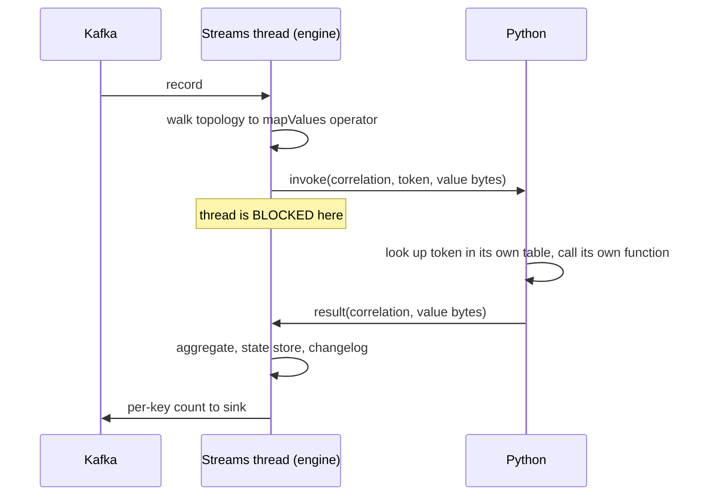

# Kafka Streams for Non-JVM Languages - Plan

Tracking issue: astubbs#242 (the language-proxy fan-out). Branch `research/kafka-streams-foreign-wrappers`.

## Goal Capsule

**Objective.** Prove that a non-JVM program can define and run a stateful Kafka Streams topology through the existing language-proxy model, and surface what the protocol must gain to support it.

**Product authority.** This is a feasibility proof, not a shippable capability. Shipping order is settled elsewhere and unchanged: the admin wrapper first, then producer, then plain consumer, with Streams downstream of all of it. Nothing here moves that queue.

**Open blockers.** None. The question that blocked planning - how general the handle protocol must be - is settled in Key Decisions.

---

## Product Contract

### Summary

A Python program describes a stateful Kafka Streams topology by replaying builder calls over an experimental protocol, registers one per-record function, and gets correct per-key counts back out of the sink topic. The engine runs real Kafka Streams in the sidecar and owns all state.

### Problem Frame

Non-JVM ecosystems do have stateful stream processors - Faust, Bytewax and Quix Streams in Python, goka in Go. **None of them is Kafka Streams**, and none matches its state, changelog and exactly-once guarantees, which is why nobody hand-rolls a substitute for those: the machinery is too much to reimplement. The gap is not an absence of streaming libraries; it is the absence of Kafka Streams itself.

The demand is first-hand but narrower than it first appears. While consulting for Confluent, the owner was asked repeatedly whether Kafka Streams would be available in other languages, and had to answer no every time. That establishes **interest in the category** from paying customers. It does not establish that those askers would accept a sidecar, a replayed Java builder API surfaced in Python, or a blocking per-record hop - nobody was asked. Whether this shape is acceptable is the risk this PoC does not retire.

**The gap runs both ways, and the return direction needs less.** Kafka Streams users are on the JVM, and the JVM has no PyTorch, scikit-learn, transformers or pandas. Those teams wrap a model in an HTTP service and call it from inside a topology today, which already blocks a stream thread on a network round trip - so they are paying this design's central cost in production already, which is revealed preference rather than a recalled question. That audience writes its topology in Java and therefore needs only the invocation pair (R2, R4-R7): no topology description and no handle protocol.

**Two things cross the boundary, not one.** The user's per-record function crosses, and that problem is already solved - the language proxy carries it in four languages. The **topology description** crosses too, and the adopted direction note calls that the bulk of the work, because a topology has no portable machine-readable form. This PoC does not solve that; it *bounds* it, by fixing the method set at five. Everything engine-side - joins, aggregations, windowing, state stores, repartitioning, exactly-once - genuinely never crosses.

### Key Decisions

- **Replay the builder calls; do not insulate the Kafka Streams API.** (session-settled: user-directed - chosen over a semantic topology description: exposing the API as simply as possible is the goal, and coupling the wire to that API is accepted rather than mitigated.) Governs R1.
- **Real handles, five methods.** (session-settled: user-directed - chosen over both a hardcoded chain and a general remote-builder protocol: handles prove the mechanism generalises, while a fixed method set keeps the argument type system out of the PoC.) Governs R1.
- **A reference token crosses the boundary, never a callable.** The engine names which function it wants; the host calls its own function. Nothing re-enters the foreign runtime on a foreign thread. Governs R2.
- **The foreign function sits beside engine-side state, not inside the aggregator.** (session-settled: user-directed - chosen over a foreign aggregator: keeps the boundary out of a state store's read-modify-write.) Governs R3, R4.
- **The PoC does not touch the frozen v1 wire.** Its messages live in an experimental package with its own handshake, because v1 is additive-only and a shape chosen to keep an argument type system out of a proof would otherwise become permanent contract every client library inherits. Governs R6, R7, R8.
- **Sidecar, not embedded.** The sidecar *is* the language-proxy model, which is the claim under test. This does not by itself avoid RocksDB under GraalVM - the sidecar already ships as a native image - so this PoC runs the JVM sidecar and defers the native-image case. Governs R3.
- **Feature parity is the goal, not speed.** (session-settled: user-directed - it does not need to beat JVM Kafka Streams; it needs to exist.) Governs R9, R11.
- **The kill criterion, written before building.** The direction is deleted rather than debugged if extending the five-method set to a sixth method taking a typed argument cannot be done without redesigning the wire, or if the definition-path oracle (AE5) cannot be made to pass while the count oracle can. Either result means the PoC proved the boundary, not the topology description - which is the claim.

### Actors

- A1. The Python application - describes the topology, registers and runs its own functions, owns serialization.
- A2. The sidecar engine - builds and runs the Kafka Streams application, owns the state store, its changelog and its commits.
- A3. Kafka - the source topic, the changelog topic and the sink topic.
- A4. A JVM Kafka Streams application - writes its own topology in Java and registers a foreign function against one operator. Served by R2 and R4-R7 alone; it needs neither R1 nor the handle protocol.

### Requirements

**Describing the topology**

- R1. Python describes the topology by issuing builder calls over the protocol, receiving an opaque handle for each call and naming prior handles as arguments to later ones. The PoC's method set is exactly five: source, `mapValues`, `groupByKey`, `count`, sink.
- R2. Python registers each per-record function under a reference token; no callable, address or source text crosses the boundary.

**Executing it**

- R3. The engine builds and runs a real Kafka Streams application from the described calls, owning the state store, its changelog and its commits.
- R4. When an operator reaches a Python-supplied function, the engine emits an invocation naming that token and blocks the operator until the matching result returns.
- R5. Record keys and values cross as bytes; the engine never deserializes them.

**Extending the protocol**

- R6. A correlated request/response message pair carries invocations and their results, distinct from `Report`.
- R7. The PoC's messages live in their own experimental proto package, served alongside the frozen v1 service, and the frozen file is not edited. This is required rather than preferred: the v1 `Configure` handshake demands a topic list or pattern and builds a Parallel Consumer engine from it, so a Streams session - whose topology names its own sources - cannot open on it without fabricating a subscription or relaxing that validation. The experimental service defines its own handshake instead. Promotion into frozen v1 is a separate later decision taken against a real Streams design, and the capability-token and specification-coverage obligations attach at that point rather than now.
- R8. The plan's protocol footprint is the whole message set the flows imply, not one pair: a request per builder method, a handle response, function registration, a description-complete signal, and the invocation pair of R6. Because a general remote-builder protocol was rejected, each of R1's five methods carries its own typed request.

**Proving it ran**

- R9. The oracle is the per-key counts in the sink topic matching a known seeding exactly, on a run during which no rebalance occurred. Exactly-once is deferred, so the engine runs at-least-once and a rebalance would replay records and inflate counts - which is why the run asserts a rebalance-free window rather than assuming one.
- R10. A single command seeds the source topic, starts the sidecar engine and the Python application, and reports the per-key counts read back from the sink.
- R11. The run records the observed per-invocation round-trip latency and the records-per-second ceiling derived from it (threads divided by round trip). This is a structural disclosure, not a benchmark and not a comparison against JVM Kafka Streams.
- R12. The run produces a written record of every protocol gap it encountered - invocation timeout and failure semantics, liveness under Streams rebalancing, interactive queries, punctuators, and more than one foreign operator - so the objective's discovery half has a deliverable.

### Key Flows

- F1. Describing the topology
  - **Trigger:** The Python application starts and opens a session.
  - **Actors:** A1, A2
  - **Steps:** Python issues builder calls in order, holding each returned handle; it registers its function against a token; it signals the description complete; the engine builds the topology and starts Kafka Streams.
  - **Outcome:** A running Streams application whose one `mapValues` operator is bound to a token.
  - **Covered by:** R1, R2, R3, R8

- F2. Processing one record
  - **Trigger:** A record arrives on the source topic.
  - **Actors:** A1, A2, A3
  - **Steps:** A Streams thread walks the record into the `mapValues` operator; the engine emits an invocation carrying the token, the value bytes and a correlation id, then blocks that thread; Python pulls the invocation, looks the token up in its own table, calls its own function, and pushes back a result carrying the same correlation id; the engine unblocks the thread and returns the value into the topology; the aggregation and its state store proceed entirely engine-side.
  - **Outcome:** The per-key count advances in the state store and is emitted to the sink.
  - **Covered by:** R2, R4, R5, R6

### Acceptance Examples

- AE1. Counts match the seeding
  - **Covers R3, R9.**
  - **Given** a source topic seeded with a known number of records over a known number of distinct keys, a single engine instance, and a per-record function fast relative to the consumer's poll interval,
  - **When** the run completes,
  - **Then** the sink topic holds exactly the expected count for every key, and no key is missing or extra, and the run asserts that no rebalance occurred - without which an inflated count is indistinguishable from a broken aggregation.

- AE2. No callable crosses
  - **Covers R2.**
  - **Given** a topology naming a registered function,
  - **When** the engine invokes it,
  - **Then** the invocation carries an integer token and the value bytes, and carries no address, no code and no serialized closure.

- AE3. A slow function stalls its thread
  - **Covers R4.**
  - **Given** a Python function slower than the consumer's poll interval,
  - **When** it is invoked,
  - **Then** the Streams thread stays blocked and the group rebalances. This run is separate from AE1 and reports no counts, because at-least-once replay makes them meaningless here. The PoC records the stall as the expected consequence of a synchronous operator rather than mitigating it.

- AE4. The topology is built from replayed calls
  - **Covers R1.**
  - **Given** the five builder calls issued in order from Python,
  - **When** the engine builds the topology,
  - **Then** each call returned an opaque handle that a later call named as an argument, and the engine held no hardcoded knowledge of the chain's shape.

- AE5. The definition path is what is proved
  - **Covers R1, R3.**
  - **Given** the running topology,
  - **When** its structure is read back from the engine,
  - **Then** it matches what Python issued, and no Java topology source exists in the repository for that run. Without this the count oracle passes unchanged on the topic-chained baseline in Scope Boundaries, and a green result would not show the protocol work was needed.

### Scope Boundaries

**Considered and rejected**

- **The topic-chained baseline: Streams to a topic, Parallel Consumer with a foreign function, back to a topic, back to Streams.** Both halves already exist here, it needs no protocol change, it blocks no stream thread, it carries no rebalance hazard, and it keeps key-level parallelism. It is rejected for one reason only, and it is the reason the machinery exists: in that shape the topology stays Java-defined, so it does not test whether a non-JVM program can *define* a topology. AE5 is the oracle that distinguishes them.

**Deferred for later**

- Joins, windows, suppression, interactive queries, punctuators and exactly-once - the same surface astubbs#255 already refuses on the JVM side.
- Embedded execution as a native image, and separately Kafka Streams inside the native-image sidecar - the sidecar already ships as a native image, so RocksDB under GraalVM is deferred rather than avoided.
- More than one foreign operator in a topology, and the question it would answer about boundary crossings multiplying with operator count.
- Conformance scenarios for the new capability. Adding one to the harness without a runner driving it fails `ScenarioCoverageTest`, so this is a real cost to schedule rather than an oversight.
- Promotion of the experimental messages into frozen v1, and with it the capability token and the specification-coverage obligation. That check fails the build the moment an undocumented message lands in the frozen file, so it is deferred only because R7 keeps the messages out of it.

**Outside this work**

- Parallel Consumer beneath Kafka Streams (astubbs#255). It is the source of key-level parallelism and it is assumed not to land; nothing here may depend on it.
- The PoC's Streams engine and its `kafka-streams` dependency do not go into the sidecar artifact the admin wrapper ships from. They live in their own module.

### Dependencies and Assumptions

- **Assumed: astubbs#255 never lands, and the assumption cuts both ways.** In-flight invocations are bounded by the number of Streams threads, itself bounded by partitions - not by key count. So this PoC demonstrates the capability, not key-level parallelism, and must say so wherever its result is reported. The reverse also holds: if that work does land, key-level parallelism means far more concurrent invocations than there are threads, and R4's blocking operator is redesigned rather than extended - which matters because R6's wire shape derives from it.
- **`kafka-streams` brings a Jackson version with known vulnerabilities.** The one module using it today pins `jackson-bom` module-locally and is never published, so nothing inherits it. A sidecar is the opposite - it is the binary handed to Go and Python teams - and the obvious remedy is blocked, because hoisting the pin into root dependency management forces an incompatible Jackson onto WireMock and breaks the Vert.x tests. The pin must therefore be module-local, and this is scheduled work rather than a footnote.
- **This PoC runs the JVM sidecar.** Streams inside the native-image sidecar is deferred, not avoided by the sidecar choice.
- **Assumed: capability negotiation still exists if and when these messages are promoted into v1.** There is a standing owner's call to retire it in favour of client/sidecar version lockstep; if that lands first, the promotion is gated by the sidecar version floor instead, and the additive-only constraint is unchanged. Nothing in this PoC depends on the outcome, because R7 keeps it out of the frozen wire.

### Success Criteria

- Someone who does not know the internals can run one command and see per-key counts that match the seeding.
- The reported result states the concurrency ceiling plainly, notes that JVM Kafka Streams is bounded the same way so the ceiling is parity rather than a deficit, and identifies the per-invocation hop - not the thread count - as what this design costs.
- The reported result names the surface it proved: five builder methods and one foreign operator, with joins, windows, interactive queries, punctuators and exactly-once untested. Parity as a goal must not be read as parity achieved, and the demand cited in Problem Frame is about the untested surface.

### Outstanding Questions

All remaining questions are answered during planning or codebase exploration; none block it.

- **Should the PoC be sequenced in two provable halves** - the invocation pair demonstrated first with a Java-authored topology, then R1's handle protocol layered on a working pair? The first half alone serves A4 and is the smaller risk; the second is what tests the objective. This is a scope decision the requirements deliberately leave open.
- How the correlated pair is framed on the wire, and how correlation ids are allocated under concurrent in-flight invocations.
- Whether the experimental Streams service shares a sidecar process with a Parallel Consumer session or takes its own, and whether sharing one stream adds head-of-line latency to a round trip that is already holding a thread.
- Timeout and failure semantics when an invocation never returns, and what the blocked operator does then.
- Who decodes the engine-produced count on the Python side, given the host owns serialization and the engine owns the encoding of values it produces itself.

### Sources and Research

- [`docs/inflight/next-kafka-streams-foreign-wrappers.md`](../inflight/next-kafka-streams-foreign-wrappers.md) - the direction, adopted 2026-08-22.
- [`docs/plans/2026-08-22-001-feat-shared-c-transport-plan.md`](2026-08-22-001-feat-shared-c-transport-plan.md) - the shared C transport, its kill criterion, and the four bindings.
- [`docs/inflight/perf-embedding-the-engine-over-ffi.md`](../inflight/perf-embedding-the-engine-over-ffi.md) - Go, Python, Node and C, and the hazards each surfaced.
- [`STRATEGY.md`](../../STRATEGY.md), *Other runtimes* - the wrap-the-whole-client fork, the shipping order, and the inverse market A4 belongs to.
- [`parallel-consumer-proxy-clients/parallel-consumer-proxy-client-python`](../../parallel-consumer-proxy-clients/parallel-consumer-proxy-client-python) - the client this work extends, and its existing demo harness, which R10's entry point builds on rather than duplicates.
- [`parallel-consumer-proxy-protocol/src/main/proto/parallelconsumer/proxy/v1/proxy.proto`](../../parallel-consumer-proxy-protocol/src/main/proto/parallelconsumer/proxy/v1/proxy.proto) - the frozen-schema header, and `Report` whose only success payload is records to produce.
- [`parallel-consumer-proxy/docs/protocol-specification.md`](../../parallel-consumer-proxy/docs/protocol-specification.md) - capabilities as the sole versioning mechanism.
- [`parallel-consumer-examples/parallel-consumer-example-streams`](../../parallel-consumer-examples/parallel-consumer-example-streams) - the only existing Streams usage, where Streams feeds Parallel Consumer, and the Java half of the rejected topic-chained baseline.
- `docs/inflight/branch-ks-streams-handover.md`, on branch `feats/ks-on-pc-spike` - astubbs#255's nine branches, open defects and traps, including the parked question of two Kafka Streams jars on one classpath. Not present on this branch.
