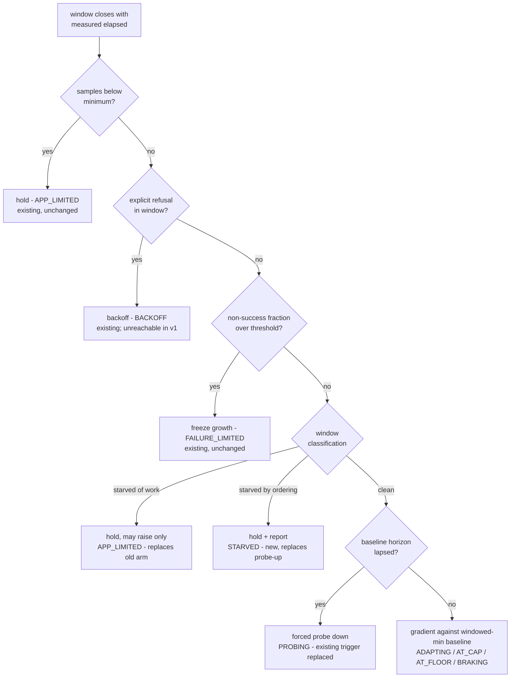

# Kill the Admission Ratchet - Plan

## Goal Capsule

- **Objective:** Stop the admission target climbing forever on workloads that degrade gracefully. Two mechanisms do that: exclude samples taken while the engine was starved of work, and make the latency baseline falsifiable instead of self-referential. Report ordering starvation while we are in that machinery.
- **Authority:** `docs/inflight/pr-333-adaptive-concurrency-outstanding.md` items 1, 2 and 3; astubbs#227.
- **Explicitly NOT here:** the optimisation objective. A prior draft of this plan bundled an elasticity objective and a dithering estimator with the ratchet fix; a five-reviewer pass found the objective arm had nowhere to sit among the existing arms, its proof passed when the controller never acted, and its estimator carried roughly seven independent defects. That work is now `docs/plans/2026-08-24-002-feat-admission-optimisation-objective-plan.md`, deliberately requirements-only. **This plan carries no new operator-facing parameter.**
- **Stop conditions:** the falsifier fires; or the liveness assertion shows the controller was inert, which makes a passing falsifier meaningless.

---

## Product Contract

### Summary

The controller's latency reference absorbs the degradation the controller itself causes, so it climbs without limit. Give it a reference that can be proven wrong, and stop it learning from windows where it was starved rather than saturated.

### Problem Frame

There is no fixed point below the ceiling. The long-run latency baseline keeps folding in the degraded latency the controller is causing; the ratio falls, the gradient relaxes, the additive headroom wins another slot, and the target climbs. Reproduced across three runs of the closed-loop test and a 400-window simulation that reached 27 and was still going.

Two causes, both structural. **The baseline is an unbounded average, so it cannot be falsified** - a good sample is diluted rather than retained, and the upstream anti-drift decay only rescues a baseline that is stale *high*. **And the controller cannot tell starvation from saturation**: a low in-flight median means both *no work arrived* and *work arrived that the shards could not yield*, which the existing reason's own javadoc admits, so it learns capacity from windows where capacity was never tested.

The owner reports hitting this repeatedly on earlier attempts years before this one. It is the hard part of the domain, not a defect introduced here.

### Key Decisions

- KD1. **A window where the engine was starved may raise a capacity conclusion but never lower one, and the target freezes rather than decaying.** BBR's app-limited rule. An idle worker slot costs nothing, so shrinking during a lull only forces rediscovery when the burst arrives. Governs R3, R4.
- KD2. **The latency baseline is a windowed extreme, not an average, and is re-established by a forced probe.** An average absorbs self-inflicted degradation; an extreme ages out and a probe falsifies. This is the only mechanism in the surveyed field - BBR, Envoy, CoDel - that genuinely falsifies a self-referential baseline. Governs R5.
- KD3. **Classification replaces two shipped arms rather than sitting beside them.** The in-flight-median hold and the starvation probe-up both fire on exactly the windows classification now judges, and one of them *grows* the target on the shards-cannot-yield case this plan says must freeze. They are superseded, not preserved. Governs R2, R3.
- KD4. **Ordering starvation is reported as its own state.** The classification is the machinery the unmet promise needs, so the two land together. Governs R6.
- KD5. **No new operator-facing parameter.** Every constant here is internal calibration. The feature already risks reintroducing the guess it exists to delete; this plan does not add to that.

### Requirements

**Measurement**

- R1. Each closed window carries the throughput actually achieved in it, derived from successful completions and the window's measured elapsed time - never a nominal duration.
- R2. Each closed window is classified as clean, starved-of-work, or starved-by-ordering, from signals the engine already produces.

**Anti-ratchet**

- R3. A window that was not clean may raise a capacity conclusion but never lower one.
- R4. Under sustained starvation the target holds rather than decaying, and does not walk upward across repeated burst-then-idle cycles.
- R5. The latency baseline is estimated by a windowed extreme and re-established by a forced reduced-concurrency probe when it has not refreshed within its horizon. Latency may stop growth; it may never justify growth.

**Reporting**

- R6. Ordering starvation is a distinct reported binding constraint, and the operator-facing held-line names it.
- R7. The movement log reports the numbers that decided the move, including the baseline's provenance - which window it came from and whether a probe set it.

### Success Criteria

- On the closed-loop elbow workload the settled band **stops moving**, at two run lengths, measured after the ramp-in is excluded.
- The controller is demonstrably still acting: growth and contraction both observed, and the classification observed reporting clean - a controller that never moves satisfies a drift statistic trivially.
- On a skewed-key workload the binding constraint reads starved and the held-line says so.
- Across repeated burst-then-idle cycles with no growth in demand, the target does not walk upward.

### Acceptance Examples

- AE1. **Covers R1.** Given a window that ran twice the nominal length with the same completions, the reported throughput is half that of a nominal-length window.
- AE2. **Covers R2, R6.** Given buffered work the shards cannot yield, the window classifies as starved-by-ordering and the constraint reads starved; given an empty buffer it classifies as starved-of-work and does not.
- AE3. **Covers R3.** Given a non-clean window whose throughput is below the current conclusion, the conclusion is unchanged; above it, it rises.
- AE4. **Covers R4.** Given many burst-then-idle cycles at constant demand, the target ends where it began rather than higher.
- AE5. **Covers R5.** Given a baseline inflated by sustained self-inflicted degradation, the forced probe re-establishes it and the target descends.

### Scope Boundaries

Deferred: the optimisation objective and everything it needs (its own plan); catch-up mode; rate-limit feedback; the bench arm and any published performance claim; `maxConcurrency` under virtual threads; the probe-cadence backoff, which R5's horizon trigger may dissolve - re-assess after U3 rather than assuming.

---

## Planning Contract

### Key Technical Decisions

- KTD1. **Elapsed time is passed into the window's close, not stored as a field.** The tick re-stamps the window's open instant to *now* rather than advancing it by the nominal second, so real windows are at least a second and variable. Three sites reset that instant - the ordinary close, the assignment-delta reset and the pause discard - and a field would have to be remembered at each. Cites R1.
- KTD2. **The throughput numerator is successful completions.** A fast-rejecting downstream raises total outcomes and lowers service time at once. Note the populations differ: outcomes are per record, service-time samples are per invocation, and retries contribute outcomes but no latency sample - verified in the engine. Never divide one by the other. Cites R1.
- KTD3. **Classification is sampled at the window boundary, not every control-loop pass.** The in-flight sampler it would otherwise copy is a pure counter read; the selectable-work bound streams every processing shard with two filters, which on a key-ordered workload is tens of thousands of shards on the thread that also dispatches and commits. Once per window is sufficient for a per-window classification. Cites R2.
- KTD4. **The new classification arm takes the position of the two arms it supersedes.** The shipped in-flight-median hold and the starvation probe-up are deleted, not layered under. Leaving them would mean the probe-up grows the target on precisely the ordering-starved windows R4 freezes. The explicit-refusal and failure-fraction arms are genuinely orthogonal and survive unchanged - though note the refusal arm is currently unreachable in production, because nothing classifies into the overload outcome in v1, so the failure-fraction arm is the only live protection against a fast-rejecting downstream. Cites R2, R3.
- KTD5. **The forced probe replaces the existing probe-down's trigger; it does not add a second descent path.** The shipped arm already has a cadence, a step ratio, an improvement test, a baseline snap-down and recovery bookkeeping. Re-trigger it from the baseline's horizon rather than building a parallel mechanism that can fire in the same window and fight it. Cites R5.
- KTD6. **No separate capacity estimator.** An earlier draft carried a windowed-maximum throughput estimate that nothing read. R3's rule applies to the conclusion the controller actually holds - its target - so there is no second piece of state to keep, age, or reset.

### High-Level Technical Design

The complete decision path, with every shipped arm shown. First match wins. This is the whole law, not an excerpt - an earlier draft omitted three arms and an implementer reading it would have deleted mechanisms silently.

Arms deleted by this plan: the in-flight-median hold and the starvation probe-up, both superseded by the classification arm. Arms retained unchanged: minimum-samples, explicit-refusal, failure-fraction.

The baseline, before and after:

| | Before | After |
|---|---|---|
| Estimator | unbounded exponential average | windowed minimum over a fixed horizon |
| Absorbs self-inflicted degradation | yes - the ratchet | no - a good sample is retained until it ages out |
| Falsifiable | only by the at-cap probe | by the horizon-triggered forced probe, at any target |
| Role | drives growth and contraction | brake only: may stop growth, never justify it |

### Assumptions

- The dispatch-fulfilment and selectable-work signals are sharp enough to classify a window. If not, the fallback is a busy-fraction measure - completions over time actually spent working - which makes starvation a measured quantity rather than an inference.

---

## Implementation Units

Unit IDs are fresh: this plan supersedes an unimplemented draft whose scope no longer matches, and no executor has referenced the old IDs.

### U1. Measured window duration and achieved throughput

- **Goal:** every closed window knows its real elapsed time and the throughput achieved in it.
- **Requirements:** R1 (KTD1, KTD2).
- **Dependencies:** none.
- **Files:** `parallel-consumer-core/src/main/java/bz/stub/parallelconsumer/internal/admission/AdmissionSampleWindow.java`, `.../ClosedAdmissionWindow.java`, `.../AdmissionController.java`; tests under `parallel-consumer-core/src/test/java/bz/stub/parallelconsumer/internal/admission/`.
- **Approach:** pass measured elapsed nanos into close; derive throughput from successful completions. Keep the window clock-free - it states that contract explicitly. **Three test classes construct the window value type directly** in addition to the shared fixture; route them through the fixture as part of this unit rather than assuming they are free.
- **Test scenarios:**
  - Covers AE1. same completions over twice the elapsed time reports half the throughput.
  - a window of successes and failures reports throughput from successes only.
  - all three reset paths leave the elapsed accounting consistent.
  - a window with zero successful completions reports zero throughput without dividing by zero.
- **Verification:** no path derives a rate from the nominal duration.

### U2. Window classification, replacing the two arms it supersedes

- **Goal:** distinguish no-work from shards-cannot-yield, act on the difference, and report the second.
- **Requirements:** R2, R3, R4, R6 (KD1, KD3, KD4, KTD3, KTD4).
- **Dependencies:** U1.
- **Files:** `.../internal/AbstractParallelEoSStreamProcessor.java` (the boundary tap), `.../admission/AdmissionSampleWindow.java`, `.../ClosedAdmissionWindow.java`, `.../AdmissionControlLaw.java` (arm replacement), `.../AdmissionDecisionReason.java`, `.../AdmissionController.java`; tests.
- **Approach:**
  1. Sample the dispatch-fulfilment and selectable-work signals **once per window boundary** (KTD3), gated on the adaptive-active flag like the existing samplers.
  2. Classify at close: queued work near zero is no-work; queued work present with nothing selectable is ordering starvation.
  3. Replace the in-flight-median hold and the starvation probe-up with the classification arm at their position (KTD4). Record the deletion and its reason in the commit.
  4. Add the starved reason with the next unused hand-assigned value - never an ordinal - **and add it to the set the rate-limited held-line reports**, which is the silent failure: omit it and the gauge moves while the operator-facing line never speaks the state.
  5. Apply KD1: a non-clean window may raise a conclusion, never lower it; sustained starvation holds the target.
- **Test scenarios:**
  - Covers AE2. buffered-but-unyieldable classifies starved-by-ordering and reports it; an empty buffer classifies starved-of-work and does not.
  - Covers AE3. a non-clean window below the current conclusion leaves it unchanged; above it raises it.
  - Covers AE4. many burst-then-idle cycles at constant demand end at the starting target, not higher. This is the mono thread-pool failure shape - a hill-climber that grew on bursts and never decayed on idle - and KD1's freeze rule is what could reproduce it here.
  - **positive control:** on a workload known to be demand-bound the classification reports clean and the controller acts. A gate that only ever holds is indistinguishable from a fix.
  - the deleted arms' existing tests are updated or removed deliberately, never left asserting deleted behaviour.
- **Verification:** both starvation kinds observable in gauge and log; the burst-idle scenario is flat.

### U3. Falsifiable baseline and horizon-triggered probe

- **Goal:** a latency reference that can be proven wrong, and only ever brakes.
- **Requirements:** R5 (KD2, KTD5).
- **Dependencies:** U1.
- **Files:** `.../admission/ServiceTimeExpAvg.java` (or its replacement), `.../AdmissionControlLaw.java`, `.../AdmissionController.java`; tests.
- **Approach:** replace the unbounded average with a windowed minimum over a fixed horizon. Re-trigger the **existing** probe-down arm from the horizon lapse instead of its at-cap-and-flat condition, reusing its ratio, improvement test and recovery bookkeeping (KTD5) - not a second probe path. Make the gradient a brake: it may stop growth, never cause it.
- **Execution note:** the contaminated-baseline gate test is the pre-existing red for the descent behaviour. Note it drives a constant completion count at every limit, so it can prove descent but cannot say anything about throughput - do not read a throughput conclusion from it.
- **Test scenarios:**
  - Covers AE5. an inflated baseline is re-established by the forced probe and the target descends.
  - a stale-high baseline ages out of the horizon without any probe.
  - the brake stops growth on degradation and never itself causes growth.
  - the probe fires on horizon lapse and not otherwise, and only one descent path exists.
  - the probe's windows are excluded from the baseline they are measuring.
- **Verification:** the contaminated-baseline gate passes; exactly one probe-down mechanism exists in the law.

### U4. Reporting

- **Goal:** the log and gauges explain the new decisions.
- **Requirements:** R6, R7.
- **Dependencies:** U2, U3.
- **Files:** `.../admission/AdmissionController.java`, `.../metrics/PCMetricsDef.java`, `src/docs/README_TEMPLATE.adoc` (regenerated); tests.
- **Approach:** the movement line currently reports a baseline, a ratio and a tolerance that describe the old estimator - replace them with the windowed-minimum baseline, its provenance (which window, or which probe, set it) and the window's classification. Add a throughput gauge. The constraint mapping is auto-generated into the metric description but hand-written in the README prose; update both and regenerate rather than hand-editing.
- **Test scenarios:**
  - a movement line names the baseline's provenance and the window classification.
  - the held-line reports the starved state.
  - the throughput gauge registers and deregisters with the existing ones.
  - the no-registry path still logs.
- **Verification:** a real run's log explains a movement without the removed fields.

### U5. The falsifier, and the build-up ablation

- **Goal:** prove the ratchet stopped, in a way that can fail, and attribute the fix.
- **Requirements:** Success Criteria.
- **Dependencies:** U2, U3, U4.
- **Files:** `parallel-consumer-core/src/test-integration/java/bz/stub/parallelconsumer/integrationTests/AdaptiveConcurrencyClosedLoopIT.java`; new scenarios.
- **Approach:**
  1. **The prediction, stated before running:** after excluding everything up to the first contraction, the settled band's lower edge over the last third of the remaining run is no higher than over its first third, at two run lengths differing by at least 2x. The exclusion rule is part of the prediction - without it the first third contains the ramp from the seed and the statistic fails on a correct implementation.
  2. **A liveness assertion runs beside it and can fail independently.** The run must record growth and contraction both occurring and the classification reporting clean; a controller held inert by any guard satisfies a drift statistic trivially, and the Success Criteria's *does not buy stability by refusing to act* has to be a test rather than an aspiration.
  3. **Run with the ceiling far above the knee.** A ratchet that exhausts a nearby ceiling early sits pinned in both thirds and reads as zero drift - and doubling the run length makes that *more* likely, so the plan's own robustness measure works against it. Assert the band also sits within a stated multiple of the known knee.
  4. **Build-up ablation, not single-knockout.** Baseline law alone; plus classification; plus falsifiable baseline. Single knockouts hide the case where either mechanism alone suffices - all arms pass and every subtraction is zero. Record each arm's outcome, including outcomes that go against the design.
  5. The closed-loop test currently refuses to assert a band because the band ratcheted. If it becomes stable, that refusal and the notes recording it are false and are rewritten here.
- **Test scenarios:**
  - the drift statistic at two run lengths, with the exclusion rule and the prediction recorded in the test.
  - the liveness assertion, failing when the controller is inert.
  - the burst-then-idle scenario from U2, at integration level.
  - each build-up arm, outcome recorded.
- **Verification:** the falsifier demonstrated capable of failing - run it against the pre-change law and watch it fail.

### U6. Docs and records

- **Goal:** the record matches the code.
- **Requirements:** repo conventions.
- **Dependencies:** U5.
- **Files:** `src/docs/README_TEMPLATE.adoc` (regenerated), `docs/features/adaptive-concurrency.yaml`, `docs/inflight/pr-333-adaptive-concurrency-outstanding.md`, `CONCEPTS.md`.
- **Approach:** close the items this lands - the ratchet and the starved gap - and relocate anything they taught that the code does not record. Document the starved state's meaning for an operator: admission cannot help a workload the ordering is starving, which is the clearest operator win in this change. Add the vocabulary this introduces to the glossary. The roadmap stage does not move: only a measured result does that.
- **Test scenarios:** Test expectation: none - docs and records; the citation and data gates are the checks.
- **Verification:** reference gates green; no note describes work that has landed.

---

## Verification Contract

| Gate | Command | Proves |
|---|---|---|
| Adaptive unit suite | `./mvnw --batch-mode -pl parallel-consumer-core -am test -Dtest='bz.stub.parallelconsumer.internal.admission.*Test'` | U1-U3 |
| Full core unit suite | `bin/ci-unit-test.sh -pl parallel-consumer-core -am` | no regression, including the deleted arms' tests |
| Closed-loop falsifier | `./mvnw --batch-mode -pl parallel-consumer-core -am verify -DskipUTs=true -Dit.test=AdaptiveConcurrencyClosedLoopIT -Dfailsafe.failIfNoSpecifiedTests=false` | drift stopped, and the controller was live while it stopped |
| Contaminated-baseline gate | the existing gate test | descent from an inflated baseline |
| Reference gates | `bin/check-copyright-headers.sh`, `bin/check-file-refs.sh`, `bin/check-docs-data.sh` | provenance and citations |

**The falsifier, stated before the run:** excluding everything before the first contraction, the settled band's lower edge over the last third is no higher than over the first third, at two run lengths differing by at least 2x, with the ceiling set far above the knee - **and** the liveness assertion showing growth, contraction and clean classification all occurred. Either half failing fails the plan.

---

## Definition of Done

- Every unit complete with its tests; each build-up ablation arm run with its outcome recorded, including outcomes against the design.
- The falsifier shown capable of failing against the pre-change law before being trusted on the post-change one.
- The classification shown reporting clean as well as holding.
- The two superseded arms deleted deliberately, with their tests updated rather than left asserting removed behaviour.
- Docs regenerated, records closed, glossary updated.
- No published performance claim; the roadmap stage does not move.
- Dead-end code removed from the diff.

---

## Open Questions

Deferred to implementation:

- The windowed-minimum horizon, the probe interval and depth, and the classification thresholds. Calibration, chosen against measured data.
- Whether the probe-cadence backoff item survives the horizon trigger or is dissolved by it.
- Whether the dispatch-fulfilment signal is sharp enough, or the busy-fraction fallback is needed.

---

## Sources / Research

- BBR: separate windowed estimators, the app-limited taint travelling with the sample, raise-but-never-lower, and consecutive clean rounds before a plateau verdict.
- Envoy's periodic minimum-latency recalibration at pinned low concurrency; CoDel's minimum-over-interval.
- Uber Cinnamon: the same baseline-drift bug in production, fixed with a veto and hard bounds rather than an objective change - the evidence that this plan's two mechanisms are the fix.
- `mono/mono#17833`: a shipped hill-climber that ratcheted on burst-then-idle, the shape KD1's freeze rule must not reproduce.
- In-repo: `docs/inflight/pr-333-adaptive-concurrency-outstanding.md`, `docs/inflight/perf-hypothesis-register.md`.
