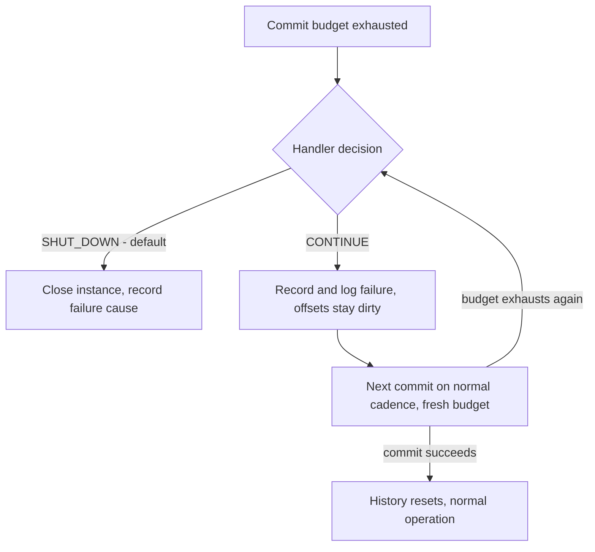
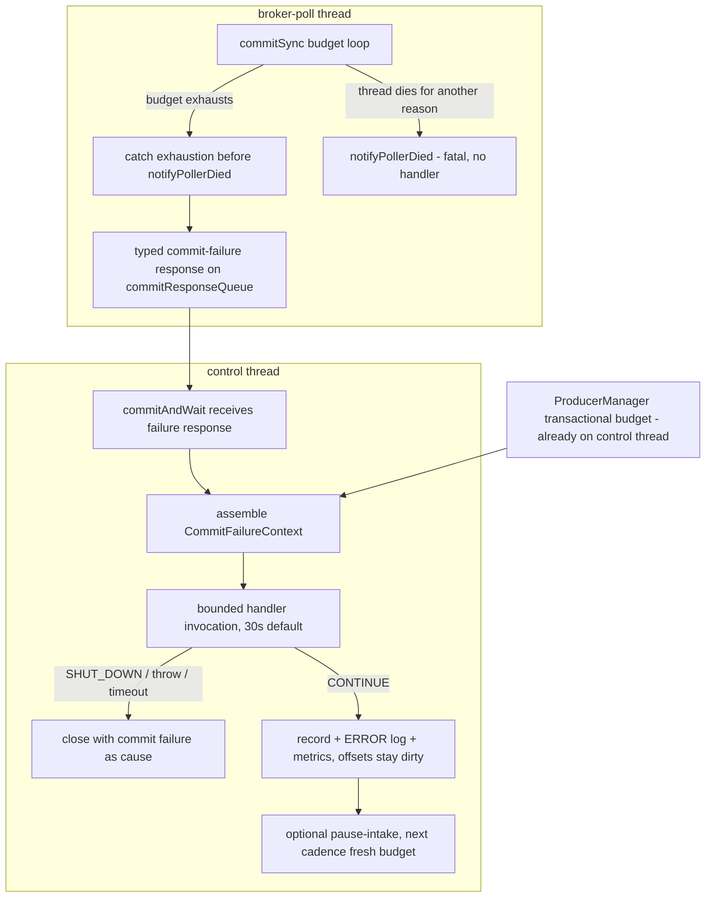

# Commit-Failure Seam - Plan

## Goal Capsule

- **Objective:** Give the application the decision when a commit exhausts its retry budget - a configurable commit-failure handler returning `SHUT_DOWN` (the default, today's behaviour) or `CONTINUE` - instead of PC unconditionally closing. Fork issue astubbs#317; the request is embedded in upstream confluentinc#833.
- **Product authority:** astubbs#317 and the dialogue behind this plan; `STRATEGY.md` Reliability and Observability tracks. Product behaviour is owned by the R-IDs below; implementation mechanism by the KTDs.
- **Execution profile:** all work in `parallel-consumer-core`; seven units, dependency-ordered; U1 and U2 are the vertical slice that delivers the feature, U3-U7 complete it.
- **Stop conditions:** stop and surface rather than guess if implementation finds the offset-map payload back-pressure does not bound keep-processing (KTD6's assumption), or if the transactional budget cannot reuse the exhaustion event type (KTD8).
- **Open blockers:** none.

---

## Product Contract

### Summary

A commit-failure handler becomes the single seam for the "commit ultimately failed" decision: when a retriable commit failure exhausts its budget, PC invokes the configured handler with the failure and its running history, and the handler returns `SHUT_DOWN` or `CONTINUE`. `SHUT_DOWN` and `CONTINUE` ship as canned handlers, so static configuration and "run my code and I'll tell you" are the same option.

### Problem Frame

When a commit ultimately fails today, PC's only response is to terminate: the exception escapes the control loop, is recorded as the failure cause, and the whole instance closes. The `ParallelConsumerOptions` javadoc states the policy outright: "If this fails, the system will shut down (fail fast)". The application gets no say and finds out afterwards through `getFailureCause()`.

Users have patched around this in the field. On confluentinc#833 a reporter try/caught PC's own `controlLoop` so the exception never reaches `supervisorLoop` - a hard-coded, unbounded `CONTINUE` obtained by modifying library internals. The counter-argument on the same thread (rkolesnev: continuing while unable to commit manufactures duplicates) is a fair case for *defaulting* to shutdown, not for making it the only option.

The astubbs#177 fixes (landed on master) sharpened the event this seam intercepts: budget exhaustion now surfaces as `OffsetCommitBudgetExceededException`, whose message already points users at astubbs#317 as the known limit with a home.

### Key Decisions

- **The handler is the seam; canned policies are its values.** One option accepts a commit-failure handler; `SHUT_DOWN` and `CONTINUE` ship as canned implementations, and a custom handler covers runtime decisions. Mirrors Kafka Streams' `ProductionExceptionHandler` / `DeserializationExceptionHandler` pattern (`CONTINUE | FAIL`, default log-and-fail). (session-settled: user-approved — chosen over enum-now-callback-later staging and over an observable-state-only inversion with no callback: one concept, precedented, widens by enriching context rather than adding options.) Governs R1, R2, R3.
- **`SHUT_DOWN` stays the default.** (session-settled: user-directed — chosen over continue-by-default: rkolesnev's duplicates argument on confluentinc#833 was weighed and accepted for the default.) Governs R2.
- **Two-layer taxonomy: retry within budget, escalate on exhaustion.** Retriable failures are PC's to retry inside the budget and are never fatal mid-budget; only exhaustion escalates to the handler; non-retriable failures stay fatal. (session-settled: user-directed — chosen over a timeouts-only hook scope and over everything-reaches-the-hook: retriable failures shouldn't die mid-budget, and auth-class failures aren't answerable by continuing.) Governs R5, R6, R7. R8 extends this with the rebalance-deferral lane the code already has.
- **`CONTINUE`'s processing mode is configurable, defaulting optimistic.** Keep-processing versus pause-intake while commits fail is the application's choice; the default is the optimistic keep-processing. (session-settled: user-directed — chosen over a fixed pause-intake semantic: configurable with a sensible default, and the EOS carve-out answers the correctness objection.) Governs R10.
- **EOS mode forces pause.** (session-settled: user-approved — chosen over uniform semantics everywhere: producing into transactions that cannot commit multiplies aborted-transaction rework, and the commit lock's bounded acquisition is deliberately fatal today.) Governs R11.
- **The canned `CONTINUE` is bounded by default.** Unbounded continue exists but only as an explicit opt-in. (session-settled: user-approved — chosen over unbounded-by-default and over a hidden hard cap: a runaway continue-and-fail loop is a bad outcome, but a silent PC override would reintroduce the disease this seam cures.) Governs R12.
- **Handler failure is fail-safe.** A handler that throws or hangs decides nothing; PC shuts down. (session-settled: user-approved.) Governs R14.
- **The async consumer commit mode is out of scope for this delivery.** `PERIODIC_CONSUMER_ASYNCHRONOUS` (the shipped default mode) has no commit budget, no exhaustion event, and marks offsets clean before the broker answers, so reaching the seam there requires an async budget and dirty-tracking refactor of its own. (session-settled: user-directed — chosen over absorbing that refactor into this work: the motivating confluentinc#833 case is the sync lane; async gets a named follow-up issue, and the limitation is documented prominently.) Governs R1, R18.

### Requirements

**Decision seam**

- R1. `ParallelConsumerOptions` accepts a commit-failure handler, invoked when a retriable commit failure has exhausted its budget - the event `OffsetCommitBudgetExceededException` now marks - before PC decides to close. Both budgeted commit paths participate: the transactional path gains the same budgeted-retry-then-exhaustion semantics (today only the sync consumer-commit path has a budget). The async consumer commit mode is excluded this delivery (R18, Scope Boundaries).
- R2. The handler returns `SHUT_DOWN` or `CONTINUE`; the shipped default is the canned `SHUT_DOWN` handler, and a default-configured instance behaves exactly as today (instance closes, `getFailureCause()` carries the failure).
- R3. The handler receives the failure and its running history: the exception, the offsets in play, attempts made, elapsed time, consecutive exhausted budgets, and time since the last successful commit - enough to decide differently at two minutes than at two hours.
- R4. Budget exhaustion is surfaced as a commit-failure outcome that leaves the broker-poll thread alive. Today the exhaustion exception escapes on the broker-poll thread and arrives at the control thread as a poller death, so the seam re-routes it - the precondition for R9's fresh-budget recommit and for R7's poller-death class staying a distinct, handler-free fatal path.

**Failure taxonomy**

- R5. Within a budget, retriable-class commit failures are PC's to retry; they are never fatal mid-budget.
- R6. Non-retriable commit failures (authorization, fenced transactional producer) remain immediately fatal, without consulting the handler.
- R7. A commit failing because the broker-poll thread died remains fatal: the seam addresses a live instance whose commits fail, and no decision can revive the only producer of commit responses.
- R8. Rebalance-class commit failures (`RebalanceInProgressException`, `CommitFailedException` - deferred indefinitely today) join the seam's accounting: deferral periods count toward time since the last successful commit in the handler's history, and repeated deferrals escalate to the handler instead of looping silently at WARN.

**CONTINUE semantics**

- R9. `CONTINUE` records the failure without throwing: offsets stay dirty and re-commit on the normal cadence, each new commit cycle gets a fresh budget, and each subsequent exhaustion re-invokes the handler with updated history.
- R10. The processing mode while commits are failing is configurable - pause-intake or keep-processing - defaulting to keep-processing.
- R11. In transactional mode, `CONTINUE` always pauses intake; the keep-processing mode is ignored there.
- R12. The canned `CONTINUE` handler is bounded by default: past a configurable limit it converts to `SHUT_DOWN`. The bound triggers on consecutive exhausted budgets, on time since the last successful commit, or on exhaustions within a rolling window - so a flapping broker's intermittent single successes cannot indefinitely reset graduation. Unbounded continue is an explicit opt-in.
- R13. Rebalances during a failing-commit period are modelled: the handler is not consulted for revocation-time commits (deferral semantics apply there), and the running history is scoped to the current assignment, resetting when partitions are reassigned.
- R14. A handler that throws, or exceeds its time bound, is treated as having returned `SHUT_DOWN`.
- R15. The handler must not be able to stall the broker-poll thread: a slow handler may delay commit decisions, never group liveness.

**Observability**

- R16. Every exhausted budget is loud regardless of decision: an ERROR-level log line, plus metrics for exhaustion count, consecutive exhaustions, time since the last successful commit, and the seam's current state - a continuing-but-failing instance must never be quiet.
- R17. The failing-commit state is a required surface for the embedded web dashboard when it lands (astubbs#268); the exposure is registered in `docs/inflight/web-gui-surfaces.md`.

**User documentation**

- R18. User-facing documentation states the seam's commit-mode coverage, including the async exclusion, in the README template's feature material and in a `docs/features/commit-failure-seam.yaml` entry citing the async follow-up issue.
<!-- file-refs: N/A - the feature YAML is a file this plan proposes to create (U7) -->

### Key Flows

- F1. The decision loop
  - **Trigger:** a retriable commit failure exhausts its budget.
  - **Steps:** PC assembles the failure context (R3) and invokes the handler (R1). `SHUT_DOWN`: today's close path, the commit failure recorded as the cause. `CONTINUE`: the failure is recorded and logged (R16), offsets stay dirty, the control loop proceeds, and the next scheduled commit runs with a fresh budget (R9). If that budget also exhausts, the handler is re-invoked with updated history.
  - **Outcome:** the application decides, every decision point is observable, and the default path is indistinguishable from today.
  - **Covers R1, R2, R3, R9, R16.**

- F2. Bounded continue graduating to shutdown
  - **Trigger:** the canned bounded `CONTINUE` handler is configured and its limit is crossed.
  - **Steps:** each exhaustion updates the running history; once consecutive exhaustions, exhaustions within the rolling window, or time since the last successful commit crosses the configured bound, the handler returns `SHUT_DOWN` and the close path runs with the latest commit failure as cause.
  - **Outcome:** an outage the application hoped would heal gets a grace window, then the fail-fast default reasserts itself - and a flapping broker cannot postpone that indefinitely.
  - **Covers R12.**

### Acceptance Examples

- AE1. **Covers R2.** Given default configuration, when a commit budget exhausts, then the instance closes and `getFailureCause()` returns the commit failure - today's behaviour, unchanged.
- AE2. **Covers R9.** Given a `CONTINUE` decision during a broker outage that later heals, when the next scheduled commit succeeds, then the dirty offsets are committed, no records are lost, and the exposure is bounded to reprocessing of work completed while commits were failing - subject to the offset-map payload back-pressure bound (KTD6).
- AE3. **Covers R11.** Given transactional mode and a `CONTINUE` decision, then no new records enter processing until a commit succeeds, even when the keep-processing mode is configured.
- AE4. **Covers R12.** Given the bounded canned `CONTINUE` with a limit of N consecutive exhaustions, when the N+1th budget exhausts, then the instance shuts down with the latest commit failure recorded as the cause.
- AE5. **Covers R14.** Given a custom handler that throws, when it is invoked, then the instance shuts down and the failure cause names both the commit failure and the handler's own exception.
- AE6. **Covers R6.** Given an authorization failure on commit, then the instance closes immediately and the handler is never invoked.
- AE7. **Covers R7.** Given the broker-poll thread has died, when a waiting commit is released with the poller's death as cause, then the instance closes and the handler is never invoked.
- AE8. **Covers R10.** Given the pause-intake mode is configured and a `CONTINUE` decision is active, then in-flight work completes but no new work is drawn until a commit succeeds, at which point intake resumes.
- AE9. **Covers R13.** Given a `CONTINUE` period that ends in group eviction and a rebalance rather than a healed commit, then the revoked partitions' dirty offsets are resolved by reprocessing on the new assignee, the handler is not consulted for the revocation-time commit, and the running history resets for the new assignment.

### Scope Boundaries

- **The async consumer commit mode (`PERIODIC_CONSUMER_ASYNCHRONOUS`, the shipped default) keeps today's log-only failure behaviour.** Reaching the seam there needs an async commit budget and deferred clean-marking - a dirty-tracking refactor tracked by a named follow-up issue (filed at delivery, per U7). R18 makes the exclusion visible to users.
- **Retry-budget mechanics** - how long a budget is and how attempts are paced - belong to the astubbs#177 line of work (see also astubbs#204 and `docs/inflight/bug-offset-commit-timeout-does-two-jobs.md`); this seam begins where the budget ends.
- **The health-check API** (astubbs#226) - this plan requires the metrics in R16; wiring them into a health surface is that PR's job.
- **The web dashboard itself** (astubbs#268) - R17 registers the exposure, nothing more.
- **App-initiated termination** (astubbs#172, upstream confluentinc#718) and **monitor/skip/DLQ on stalled progress** (astubbs#231, upstream confluentinc#34) - adjacent "who decides" seams, deliberately not folded in.
- **Non-retriable failure behaviour is untouched** - no new option changes what authorization or fencing failures do.
- **`PCRetriableException` is untouched** - it is the user-function retry channel; this seam is the commit channel.
- **Per-partition commit granularity is not attempted.** One commit RPC covers every dirty partition, so a single non-retriable classification closes the whole instance even when only one topic is affected - accepted as a documented limitation matching today's behaviour.

### Dependencies / Assumptions

- Builds on the astubbs#177 fixes already on master: the per-call commit budget and `OffsetCommitBudgetExceededException` as the exhaustion event. Today that exception escapes on the broker-poll thread and reaches the control thread through the poller-death notification (`notifyPollerDied`) - exhaustion and a genuine poller death are distinguishable only by cause chain, which is why R4 requires the seam to re-route exhaustion as a commit-failure outcome that leaves the poller alive.
- The budget exists only on the sync consumer-commit path today: the transactional committer retries `commitTransaction` on a fixed attempt count, does not retry `sendOffsetsToTransaction` at all, and its commit-lock acquisition timeout is deliberately fatal. The transactional retry loop already runs on the control thread (`committer = producerManager`, no poll-thread indirection), so KTD8's budget work needs no thread re-route there. R1's both-paths clause is new work, not a description of the present.
- `offsetCommitTimeout`'s default (10s) is itself contested - it is below one 60s Kafka attempt, so exhaustion today typically means one attempt, and the handler's `attempts` field will usually read 1 until `docs/inflight/bug-offset-commit-timeout-does-two-jobs.md` is settled. The seam composes with any resolution of that bug and must not pre-empt it.
- Assumes Kafka's retriable/non-retriable exception taxonomy is a usable classifier for R5/R6; the concrete classifier for the transactional path is the fatal-vs-retriable analysis already written in `ProducerManager`'s commit retry loop (KTD8).
- Verified from the confluentinc#833 thread: the reporter's failure was the sync-lane commit-response timeout (`Timeout waiting for commit response` from a `ConsumerOffsetCommitter.CommitRequest`), and the workaround absorbed exactly that class - the seam's sync-path scope covers the motivating scenario. Success remains: that scenario expressible in configuration without patching internals, and default-configured users see zero behaviour change.

---

## Planning Contract

**Product Contract preservation:** changed with user approval this session - R1 amended and a Key Decision added for the async carve-out; R18 added (documentation requirement); the former Outstanding Questions section is resolved into the KTDs below (close/drain, history epoch, state growth, option placement, metric names, transactional split); R17's register path updated after an inflight rename. All other R/F/AE text and IDs unchanged.

### Key Technical Decisions

- KTD1. **Public API: a handler interface with canned policy factories, in the top-level package.** New types in `bz.stub.parallelconsumer`: `CommitFailureHandler` (functional interface; its decision enum nested, Kafka-Streams style), `CommitFailureContext` (the R3 history object), and `CommitFailurePolicies` (static factories: `shutDown()`, `continueBounded(...)`, `continueUnbounded()`). `ParallelConsumerOptions` gains `commitFailureHandler` (`@Builder.Default` = `shutDown()`). All new public types carry `@InterfaceStability.Evolving` and stay within the Java 8 API surface (Jabel `--release 8`). (Instantiates the handler-is-the-seam Key Decision; cites R1, R2, R3.)
- KTD2. **Exhaustion re-routes on the existing commit-response channel as a typed outcome.** The poll-thread commit layer catches `OffsetCommitBudgetExceededException` before `notifyPollerDied` fires, keeps the poll loop alive, and answers the waiting committer with a new commit-failure response variant - reusing the "answer the waiter even when the commit was deferred" pattern in `ConsumerOffsetCommitter#maybeDoCommit`. No new interrupt or bare flag crosses threads (the interrupt bit is already overloaded - see `docs/solutions/workflow-issues/waking-a-thread-by-interrupting-it-2026-08-17.md`). Answering the waiter promptly also removes the race where `commitAndWait`'s own `offsetCommitTimeout` expires before the budget loop reports. Covers R4.
- KTD3. **The handler runs from the control thread through a time-bounded invocation.** The control thread submits the handler to a dedicated single-thread executor and waits at most the handler time bound (default 30s); on timeout or a thrown exception it proceeds as `SHUT_DOWN`, so a hung handler ends in a real shutdown, never a wedged instance, and the broker-poll thread never executes user code. Covers R14, R15.
- KTD4. **Processing mode is an options enum, coerced under EOS.** `commitFailureContinueMode` (`KEEP_PROCESSING` default, `PAUSE_INTAKE`) lives on `ParallelConsumerOptions`; `validate()` coerces it to `PAUSE_INTAKE` when the commit mode is transactional, following the existing `transactionsValidation()` mutate-defaults pattern. (Instantiates the processing-mode and EOS Key Decisions; cites R10, R11.)
- KTD5. **Seam pause composes with user pause through a separate flag.** Pause-intake sets a seam-owned flag consulted alongside the user-visible `PAUSED` state in the work-distribution gate; seam resume never clears a user's `pauseIfRunning()` pause, and user resume never clears the seam's. The existing state field is a two-value machine that cannot carry two pause reasons - reusing it directly would let either party silently clobber the other.
- KTD6. **Bounded-continue defaults, history epoch, and the state-growth bound.** The canned bounded `CONTINUE` defaults to graduation after 5 minutes without a successful commit; consecutive-count and rolling-window triggers are available configuration on `continueBounded(...)`. When no commit has ever succeeded, "time since last successful commit" counts from assignment start, so bounds work from the first exhaustion. Keep-processing's uncommitted-state growth is bounded by the existing offset-map payload back-pressure; U3 verifies that assumption with a long-outage scenario, and implementation stops and surfaces if it does not hold. (Instantiates the bounded-by-default Key Decision; cites R12.)
- KTD7. **One exhaustion event; three handler-free fatal exits.** Both budget lanes that already exhaust into `OffsetCommitBudgetExceededException` (`offsetCommitTimeout` and `saslAuthenticationRetryTimeout`) reach the handler as the same event. Handler-free and fatal, as today: non-retriable classifications (R6), poller death (R7), and the close-path abandonment exit (`commitSync`'s close-time single-attempt short-circuit throws `InternalRuntimeException`, not the exhaustion event) - which is also the resolved answer to "CONTINUE versus a close already in progress": once close begins, the handler is never consulted. Classification is per commit RPC, not per partition (Scope Boundaries).
- KTD8. **The transactional path gains the budget in place of its fixed attempt count.** `ProducerManager#commitOffsets` replaces the 200-attempt retry count with the `offsetCommitTimeout` budget and surfaces exhaustion as the same event type feeding the same handler, on the control thread it already runs on. Its existing fatal-vs-retriable block comment is the classifier spec; `sendOffsetsToTransaction` failures and the commit-lock acquisition timeout stay fatal. Cites R1, R11.
- KTD9. **Rebalance-lane accounting lives beside the poller-death record.** A deferral counter and first-deferral timestamp sit next to `pollerDeath` in `ConsumerOffsetCommitter`; deferral time feeds the R3 history, and deferrals persisting past the bound clock synthesize an escalation to the handler on the control thread. Revocation-time commits are recognised via the existing `isRebalanceInProgress` flag and never consult the handler; history is scoped to the assignment. Anything reachable from a rebalance callback takes locks only via `tryLock()` - the AB-BA deadlock in this exact area (astubbs#29) has an *unproven* fix, so the seam must not add blocking acquisitions there or depend on that fix landing. Covers R8, R13.
- KTD10. **Metrics are new `PCMetricsDef` entries under a new `COMMITTER` subsystem.** `pc.commit.failure.exhaustions` (counter), `pc.commit.failure.consecutive.exhaustions` (gauge), `pc.commit.time.since.last.success` (gauge), `pc.commit.failure.seam.state` (state-mapped gauge following the `PC_POLLER_STATUS` pattern). The README metrics table regenerates from the template (`bin/check-docs-data.sh` guards sync). Naming avoids "commit lock" - two mechanisms already answer to that name. Covers R16.

### High-Level Technical Design

The seam's mechanism is a thread handshake; the diagram shows where the decision runs and which exits bypass it.

Prose remains authoritative: KTD2 owns the channel, KTD3 the invocation bound, KTD7 the handler-free exits.

---

## Implementation Units

### U1. Public API: handler, context, policies, options

- **Goal:** the user-facing surface exists and validates, with canned policies fully behaving.
- **Requirements:** R1, R2, R3, R10, R11, R12 (KTD1, KTD4, KTD6).
- **Dependencies:** none.
- **Files:** new `parallel-consumer-core/src/main/java/bz/stub/parallelconsumer/CommitFailureHandler.java`, `CommitFailureContext.java`, `CommitFailurePolicies.java`; modify `parallel-consumer-core/src/main/java/bz/stub/parallelconsumer/ParallelConsumerOptions.java`; new tests `parallel-consumer-core/src/test/java/bz/stub/parallelconsumer/CommitFailurePoliciesTest.java`, `ParallelConsumerOptionsCommitFailureTest.java`.
<!-- file-refs: N/A - the new source and test files are files this unit creates -->
- **Approach:**
  1. Handler interface with nested decision enum; context carries the R3 fields plus commit mode and assignment epoch.
  2. Canned policies as pure, independently testable logic (graduation clocks live in the policy, fed by the context).
  3. Options fields with `@Builder.Default`; EOS coercion in `validate()` beside `transactionsValidation()`.
- **Patterns to follow:** `retryDelayProvider` (functional option precedent), `InvalidOffsetMetadataHandlingPolicy` (policy enum precedent), fork-only copyright header (`docs/copyright.md`), `@InterfaceStability.Evolving`.
- **Execution note:** test-first - the policies are pure logic with no threading.
- **Test scenarios:**
  - Defaults: handler is `shutDown()`, mode is `KEEP_PROCESSING`.
  - Covers AE3 (validation half): transactional commit mode coerces `KEEP_PROCESSING` to `PAUSE_INTAKE`.
  - Covers AE4. Bounded policy graduates on N consecutive exhaustions; on 5 minutes since last success; on rolling-window trigger with a flapping pattern (one success per twenty exhaustions still graduates).
  - History epoch: no successful commit ever - time counts from assignment start, bounds fire.
  - Unbounded policy never graduates; context exposes every R3 field.
- **Verification:** `bin/ci-unit-test.sh` green; new assertions mutation-checked.

### U2. Sync-path re-route and the decision loop

- **Goal:** exhaustion on the sync consumer path reaches the handler and both decisions work end to end; default behaviour byte-compatible.
- **Requirements:** R1, R2, R4, R5, R6, R7, R9, R14, R15 (KTD2, KTD3, KTD7).
- **Dependencies:** U1.
- **Files:** modify `parallel-consumer-core/src/main/java/bz/stub/parallelconsumer/internal/BrokerPollSystem.java`, `internal/ConsumerOffsetCommitter.java`, `internal/ConsumerManager.java`, `internal/AbstractParallelEoSStreamProcessor.java`, `OffsetCommitBudgetExceededException.java`; new test `parallel-consumer-core/src/test/java/bz/stub/parallelconsumer/MockConsumerCommitFailureSeamTest.java`.
<!-- file-refs: N/A - the new seam test is a file this unit creates -->
- **Approach:**
  1. Characterize today's exhaustion-to-close path in the mock harness before changing it.
  2. Catch the exhaustion in the poll-thread commit layer before `notifyPollerDied`; answer the waiter with the new failure-response variant (KTD2).
  3. Control thread assembles the context (enrich `OffsetCommitBudgetExceededException` with the attempts/elapsed the budget loop already tracks; new consecutive/time-since accounting beside `lastCommitTime`).
  4. Bounded handler invocation (KTD3); `SHUT_DOWN` routes through the existing `closeOnException` path with the commit failure as cause; `CONTINUE` records, logs, leaves offsets dirty.
  5. Rewrite the exception's message and javadoc - the shipped text says "there is no way yet to hand this decision to your application", which becomes false (grep anchor: `no way yet to hand`).
  6. Re-verify `commitOffsetsReportingPollerDeath`'s backstop javadoc claims once exhaustion no longer kills the poller.
- **Patterns to follow:** `MockConsumerTestBase` / `CommitRejectionTestBase` (the astubbs#206 harness); `CommitResponseTimeoutSymptomTest` for failure-cause and poller-death assertions; the deferred-commit response pattern (anchor: `send it even when the commit was DEFERRED`).
- **Execution note:** characterization coverage first; mutation-check the new assertions and widen `PIT_TARGET_CLASSES` beyond `offsets.*` for a scored run.
- **Test scenarios:**
  - Covers AE1: default config - instance closes, `getFailureCause()` is the commit failure, message no longer claims the decision cannot be handed over.
  - Handler invoked with correct attempts/elapsed/consecutive history on each exhaustion.
  - Covers AE2 (mock half): CONTINUE, then broker heals - dirty offsets commit on next cadence with a fresh budget.
  - Covers AE5: handler throws - shutdown; cause chain names both exceptions.
  - Handler exceeds its time bound - shutdown, instance not wedged.
  - Covers AE7: genuine poller death - fatal, handler never invoked.
  - Covers AE6: authorization failure - fatal, handler never invoked.
  - SASL-budget exhaustion reaches the handler as the same event.
  - The waiting committer is answered promptly - no `Timeout waiting for commit response` race with the budget loop.
  - Close-time abandonment (`close began`) stays handler-free.
- **Verification:** `bin/ci-unit-test.sh`; existing commit-path tests untouched and green.

### U3. Processing modes and pause composition

- **Goal:** keep-processing and pause-intake both work, compose with user pause, and state growth is bounded.
- **Requirements:** R10 (KTD4, KTD5, KTD6).
- **Dependencies:** U1, U2.
- **Files:** modify `internal/AbstractParallelEoSStreamProcessor.java` (seam pause flag in the work-distribution gate), `internal/BrokerPollSystem.java` if intake gating needs it; extend `MockConsumerCommitFailureSeamTest.java`; new integration scenario in `parallel-consumer-core/src/test-integration/java/` beside the broker commit tests.
- **Approach:** seam pause as its own flag consulted with the user state (KTD5); resume on the first successful commit; during DRAINING the close path wins and the seam does not pause.
- **Execution note:** verify the offset-map payload back-pressure actually bounds keep-processing before relying on it (KTD6); if it does not, stop and surface - that is a plan-level assumption, not a detail.
- **Test scenarios:**
  - Covers AE8: pause-intake - in-flight completes, no new work drawn, intake resumes on successful commit.
  - Keep-processing keeps drawing work while commits fail.
  - User `pauseIfRunning()` during seam pause: seam resume does not resume the user's pause; the converse also holds.
  - Seam pause requested during DRAINING is a no-op (close wins).
  - Integration: long failing-commit window under keep-processing - payload back-pressure engages and the healing commit stays within the broker's metadata limit.
- **Verification:** `bin/ci-unit-test.sh`; `bin/ci-integration-test.sh` for the broker scenario (read the ambient probe autopsy on any failure).

### U4. Transactional budget and EOS forced pause

- **Goal:** the transactional path exhausts into the same handler, and CONTINUE under EOS always pauses intake.
- **Requirements:** R1, R11 (KTD4, KTD5, KTD8).
- **Dependencies:** U1, U2, U3.
- **Files:** modify `internal/ProducerManager.java`; extend options validation if needed; new unit test beside `internal/ConsumerManagerCommitRetryBudgetTest.java`; extend `parallel-consumer-core/src/test-integration/java/.../TransactionTimeoutsTest.java` area.
- **Approach:**
  1. Characterize the current 200-attempt loop's behaviour first (legacy, weakly tested).
  2. Replace the attempt count with the `offsetCommitTimeout` budget; classifier per the loop's existing fatal-vs-retriable comment (anchor: `Only catch and retry the retriable ones`).
  3. Exhaustion surfaces as the same event type, handled on the control thread it already runs on.
- **Execution note:** characterization coverage before behaviour change; note the producer can enter a fatal/abortable transaction state after repeated failures - characterize how many CONTINUE cycles EOS survives and record the observed bound in the test.
- **Test scenarios:**
  - Transactional budget exhausts - handler invoked; `SHUT_DOWN` and `CONTINUE` both honoured.
  - Covers AE3: CONTINUE under EOS - no new records enter processing until a commit succeeds, keep-processing config notwithstanding.
  - Commit-lock acquisition timeout stays fatal and handler-free.
  - Fenced producer stays fatal and handler-free.
  - Repeated exhaust-continue cycles: producer transaction state survives (or the observed limit is asserted and documented).
- **Verification:** `bin/ci-unit-test.sh`; `bin/ci-integration-test.sh` (transactional lane).

### U5. Rebalance lane: deferral accounting, escalation, history scoping

- **Goal:** rebalance-class deferrals join the seam's accounting and rebalances scope the history.
- **Requirements:** R8, R13 (KTD9).
- **Dependencies:** U2.
- **Files:** modify `internal/ConsumerOffsetCommitter.java`, `internal/AbstractParallelEoSStreamProcessor.java` (revocation path); extend the mock seam test; chaos-suite scenario optional (`parallel-consumer-core/src/test-integration/java/.../chaostests/`).
- **Approach:** deferral counter and first-deferral timestamp beside `pollerDeath`; escalation synthesized on the control thread when deferrals persist past the bound clock; revocation-time commits recognised via `isRebalanceInProgress`; history reset on reassignment.
- **Execution note:** everything reachable from a rebalance callback takes locks via `tryLock()` only - the astubbs#29 deadlock fix is unproven, so add no blocking acquisition on that path and do not depend on that fix.
- **Test scenarios:**
  - Repeated `CommitFailedException` deferrals escalate to the handler once past the bound clock - never an indefinite silent WARN loop.
  - Deferral time counts into time-since-last-successful-commit.
  - Revocation-time commit failure never consults the handler.
  - Covers AE9: eviction-then-rebalance during CONTINUE - dirty offsets resolved by the new assignee's reprocessing, history reset for the new assignment.
- **Verification:** `bin/ci-unit-test.sh`; chaos or integration coverage if the eviction scenario needs a real broker.

### U6. Observability: metrics and loud logging

- **Goal:** a continuing-but-failing instance is impossible to miss.
- **Requirements:** R16, R17 (KTD10).
- **Dependencies:** U2.
- **Files:** modify `parallel-consumer-core/src/main/java/bz/stub/parallelconsumer/metrics/PCMetricsDef.java`; wire meters in `internal/ConsumerOffsetCommitter.java` / the processor; regenerate the README metrics table from `src/docs/README_TEMPLATE.adoc`; extend metrics tests beside the existing `PCMetricsDef` coverage.
- **Approach:** new `COMMITTER` subsystem enum value; the four KTD10 meters; state gauge follows the `PC_POLLER_STATUS` model (`initMetrics` pattern in `BrokerPollSystem`); one ERROR log line per exhaustion regardless of decision.
- **Test scenarios:**
  - Each meter registered with the declared name and subsystem.
  - Exhaustion increments the counter and updates the gauges under both decisions.
  - ERROR log emitted per exhaustion under CONTINUE (the loud-when-continuing guarantee).
- **Verification:** `bin/ci-unit-test.sh`; `bin/check-docs-data.sh` green after regeneration.

### U7. User documentation and the async follow-up

- **Goal:** users can discover the seam, its coverage, and the async exclusion without reading code.
- **Requirements:** R18 (and the R1 exclusion made visible).
- **Dependencies:** U1-U6 (final wording).
- **Files:** modify `src/docs/README_TEMPLATE.adoc` (features list entry; commit-mode coverage statement; regenerate `README.adoc`); new `docs/features/commit-failure-seam.yaml` (`schema_version: 1`, `kind: feature`, `availability: target_release`, limits section naming the async exclusion); rewrite the `PERIODIC_TRANSACTIONAL_PRODUCER` "fail fast" javadoc in `ParallelConsumerOptions.java` (it is README-included via `tag::transactionalJavadoc[]`); delete `docs/inflight/core-commit-failure-seam.md` in the landing PR; shrink `docs/inflight/branch-833-commit-failure-seam.md` per the inflight rules.
<!-- file-refs: N/A - the feature YAML is a file this unit creates -->
- **Approach:** the feature entry and README text state commit-mode coverage as a first-class limit; the async follow-up issue is filed at delivery and cited from both (opening the issue is an outward action - check in with the repo owner first, per house practice).
- **Test scenarios:** Test expectation: none - documentation; the gates below verify.
- **Verification:** `bin/check-docs-data.sh`, `bin/check-file-refs.sh`, `bin/check-issue-refs.sh`, `bin/check-copyright-headers.sh` all green.

---

## Verification Contract

| Gate | Command | Proves |
|---|---|---|
| Unit suite | `bin/ci-unit-test.sh` | All unit scenarios in U1-U6; no Docker needed |
| Integration suite | `bin/ci-integration-test.sh` | AE2/AE3-class broker scenarios (U3, U4); read the `AMBIENT PROBE AUTOPSY` block before diagnosing any red |
| Quick build | `bin/build.sh` | Compile plus unit smoke during development |
| Mutation lane | `bin/ci-mutation-test.sh` with `PIT_TARGET_CLASSES` widened to the seam classes | New guard logic (bounds, taxonomy, re-route) actually scored - confirm mutants ran; "nothing to mutate, skipping" is not a pass |
| Copyright | `bin/check-copyright-headers.sh` | New files carry the fork-only header |
| References | `bin/check-issue-refs.sh`, `bin/check-file-refs.sh` | Qualified issue refs; no dangling file citations |
| Docs sync | `bin/check-docs-data.sh` | README regenerated from the template after metrics/feature edits |
| Inflight schema | `bin/check-inflight-tags.sh` | Ledger notes stay valid as they shrink |

Flake policy binds: a red is real (no reruns); a genuinely flaky new test is `@Quarantined` with evidence, never retried green (`docs/testing.md` owns the discipline). Never weaken an existing assertion to get green - a commit-path test failing under this change is signal, not noise.

---

## Definition of Done

- All seven units landed in dependency order, each as an atomic commit citing astubbs#317.
- Default-configured behaviour is byte-compatible: no existing test modified except where an asserted message changed (the exception rewrite), and that change is called out in its commit.
- Every Acceptance Example (AE1-AE9) is enforced by a named test (`Covers AE<N>.` scenarios above).
- `OffsetCommitBudgetExceededException`'s message and javadoc, and the transactional "fail fast" javadoc, no longer describe the pre-seam world; README regenerated.
- The async follow-up issue exists and is cited from Scope Boundaries, the feature YAML, and the README statement.
- `docs/inflight/core-commit-failure-seam.md` deleted in the landing PR; `docs/inflight/branch-833-commit-failure-seam.md` shrunk to whatever remains open; `docs/inflight/web-gui-surfaces.md` retains the seam entry.
- All Verification Contract gates green locally, including a scored mutation run over the seam classes.
- No abandoned experiment code in the final diff.

---

## Sources / Research

- astubbs#317 - the feature request this plan scopes; confluentinc#833 - the field workaround (try/catch around `controlLoop`), rkolesnev's counter-argument, and the verified failure class (sync commit-response timeout); rationale note `docs/inflight/core-commit-failure-seam.md`.
- `parallel-consumer-core/src/main/java/bz/stub/parallelconsumer/internal/ConsumerManager.java` - the budget loop (`while (tryCount == 0 || !closeInProgressSignal...`), both exhaustion lanes, the close-abandonment exit, and the tracked state (`tryCount`, `startedTime`) the context object reuses.
- `parallel-consumer-core/src/main/java/bz/stub/parallelconsumer/internal/ConsumerOffsetCommitter.java` - the request/response channel, `commitDeferringOnRebalance` (the defer precedent R8 folds into the seam), `notifyPollerDied` and `pollerDeath` (the accounting model for KTD9).
- `parallel-consumer-core/src/main/java/bz/stub/parallelconsumer/internal/BrokerPollSystem.java` - `maybeDoCommit` (sole producer of commit responses), the catch that kills the poller today, `initMetrics` (the KTD10 model).
- `parallel-consumer-core/src/main/java/bz/stub/parallelconsumer/internal/ProducerManager.java` - the 200-attempt loop and its fatal-vs-retriable classifier comment (KTD8's spec); the deliberately fatal commit-lock timeout.
- `parallel-consumer-core/src/main/java/bz/stub/parallelconsumer/ParallelConsumerOptions.java` - option conventions, `validate()`/`transactionsValidation()`, the "fail fast" javadoc U7 rewrites.
- Institutional learnings: `docs/solutions/runtime-errors/revoke-path-commit-deadlock-between-poll-and-control-threads.md` (tryLock-only in callbacks; astubbs#29 unproven), `docs/solutions/workflow-issues/waking-a-thread-by-interrupting-it-2026-08-17.md` (typed messages over interrupt overload), `docs/solutions/test-flakiness/unforceable-trigger-commit-lock-timeout-2026-08-07.md` (naming ambiguity; deterministic-trigger test discipline), `docs/solutions/test-flakiness/vacuous-await-condition-brokerpoller-backpressure-2026-07-31.md` (write-order discipline for seam-test awaits).
- Kafka Streams precedent for handler-as-seam: `ProductionExceptionHandler` / `DeserializationExceptionHandler`, returning `CONTINUE | FAIL` with a log-and-fail default.
