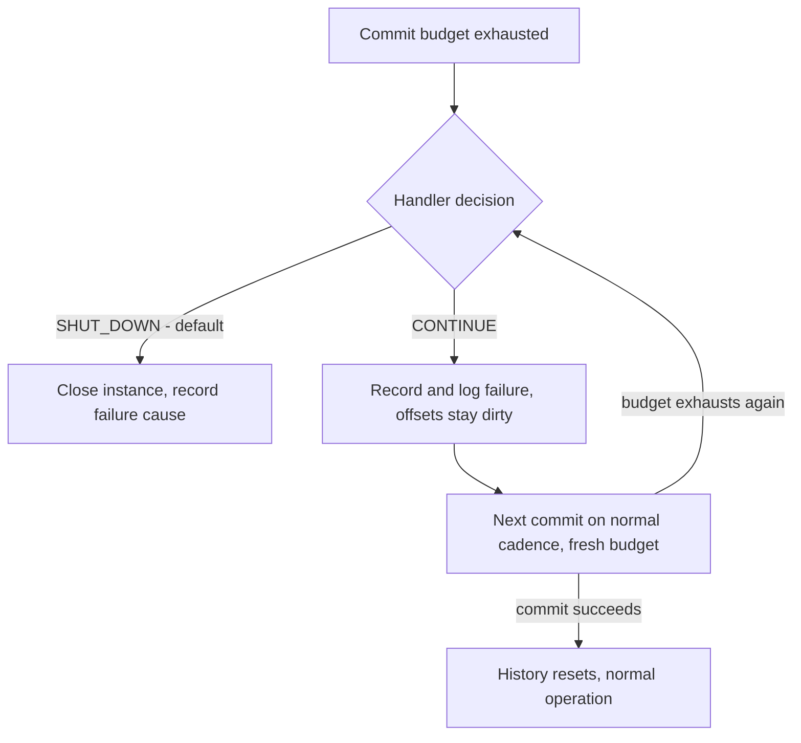

# Commit-Failure Seam - Plan

## Goal Capsule

- **Objective:** Give the application the decision when a commit exhausts its retry budget - a configurable commit-failure handler returning `SHUT_DOWN` (the default, today's behaviour) or `CONTINUE` - instead of PC unconditionally closing. Fork issue astubbs#317; the request is embedded in upstream confluentinc#833.
- **Product authority:** astubbs#317 and the dialogue behind this plan; `STRATEGY.md` Reliability and Observability tracks.
- **Open blockers:** none. All outstanding questions are deferred to planning.

---

## Product Contract

### Summary

A commit-failure handler becomes the single seam for the "commit ultimately failed" decision: when a retriable commit failure exhausts its budget, PC invokes the configured handler with the failure and its running history, and the handler returns `SHUT_DOWN` or `CONTINUE`. `SHUT_DOWN` and `CONTINUE` ship as canned handlers, so static configuration and "run my code and I'll tell you" are the same option.

### Problem Frame

When a commit ultimately fails today, PC's only response is to terminate: the exception escapes the control loop, is recorded as the failure cause, and the whole instance closes. The `ParallelConsumerOptions` javadoc states the policy outright: "If this fails, the system will shut down (fail fast)". The application gets no say and finds out afterwards through `getFailureCause()`.

Users have patched around this in the field. On confluentinc#833 a reporter try/caught PC's own `controlLoop` so the exception never reaches `supervisorLoop` - a hard-coded, unbounded `CONTINUE` obtained by modifying library internals. The counter-argument on the same thread (rkolesnev: continuing while unable to commit manufactures duplicates) is a fair case for *defaulting* to shutdown, not for making it the only option.

The astubbs#177 fixes (landed on master) sharpened the event this seam intercepts: budget exhaustion now surfaces as `OffsetCommitBudgetExceededException`, whose message already points users at astubbs#317 as the known limit with a home.

### Key Decisions

- **The handler is the seam; canned policies are its values.** One option accepts a commit-failure handler; `SHUT_DOWN` and `CONTINUE` ship as canned implementations, and a custom handler covers runtime decisions. Mirrors Kafka Streams' `ProductionExceptionHandler` / `DeserializationExceptionHandler` pattern (`CONTINUE | FAIL`, default log-and-fail). (session-settled: user-approved — chosen over enum-now-callback-later staging and over an observable-state-only inversion with no callback: one concept, precedented, widens by enriching context rather than adding options.) Governs R1, R2, R3.
- **`SHUT_DOWN` stays the default.** (session-settled: user-directed — chosen over continue-by-default: rkolesnev's duplicates argument on confluentinc#833 was weighed and accepted for the default.) Governs R2.
- **Two-layer taxonomy: retry within budget, escalate on exhaustion.** Retriable failures are PC's to retry inside the budget and are never fatal mid-budget; only exhaustion escalates to the handler; non-retriable failures stay fatal. (session-settled: user-directed — chosen over a timeouts-only hook scope and over everything-reaches-the-hook: retriable failures shouldn't die mid-budget, and auth-class failures aren't answerable by continuing.) Governs R4, R5, R6.
- **`CONTINUE`'s processing mode is configurable, defaulting optimistic.** Keep-processing versus pause-intake while commits fail is the application's choice; the default is the optimistic keep-processing. (session-settled: user-directed — chosen over a fixed pause-intake semantic: configurable with a sensible default, and the EOS carve-out answers the correctness objection.) Governs R8.
- **EOS mode forces pause.** (session-settled: user-approved — chosen over uniform semantics everywhere: producing into transactions that cannot commit multiplies aborted-transaction rework, and the commit lock's bounded acquisition is deliberately fatal today.) Governs R9.
- **The canned `CONTINUE` is bounded by default.** Unbounded continue exists but only as an explicit opt-in. (session-settled: user-approved — chosen over unbounded-by-default and over a hidden hard cap: a runaway continue-and-fail loop is a bad outcome, but a silent PC override would reintroduce the disease this seam cures.) Governs R10.
- **Handler failure is fail-safe.** A handler that throws or hangs decides nothing; PC shuts down. (session-settled: user-approved.) Governs R11.

### Requirements

**Decision seam**

- R1. `ParallelConsumerOptions` accepts a commit-failure handler, invoked when a retriable commit failure has exhausted its budget - the event `OffsetCommitBudgetExceededException` now marks - before PC decides to close.
- R2. The handler returns `SHUT_DOWN` or `CONTINUE`; the shipped default is the canned `SHUT_DOWN` handler, and a default-configured instance behaves exactly as today (instance closes, `getFailureCause()` carries the failure).
- R3. The handler receives the failure and its running history: the exception, the offsets in play, attempts made, elapsed time, consecutive exhausted budgets, and time since the last successful commit - enough to decide differently at two minutes than at two hours.

**Failure taxonomy**

- R4. Within a budget, retriable-class commit failures are PC's to retry; they are never fatal mid-budget.
- R5. Non-retriable commit failures (authorization, fenced transactional producer) remain immediately fatal, without consulting the handler.
- R6. A commit failing because the broker-poll thread died remains fatal: the seam addresses a live instance whose commits fail, and no decision can revive the only producer of commit responses.

**CONTINUE semantics**

- R7. `CONTINUE` records the failure without throwing: offsets stay dirty and re-commit on the normal cadence, each new commit cycle gets a fresh budget, and each subsequent exhaustion re-invokes the handler with updated history.
- R8. The processing mode while commits are failing is configurable - pause-intake or keep-processing - defaulting to keep-processing.
- R9. In transactional mode, `CONTINUE` always pauses intake; the keep-processing mode is ignored there.
- R10. The canned `CONTINUE` handler is bounded by default: past a configurable limit (consecutive exhausted budgets, or time since the last successful commit) it converts to `SHUT_DOWN`. Unbounded continue is an explicit opt-in.
- R11. A handler that throws, or exceeds its time bound, is treated as having returned `SHUT_DOWN`.
- R12. The handler must not be able to stall the broker-poll thread: a slow handler may delay commit decisions, never group liveness.

**Observability**

- R13. Every exhausted budget is loud regardless of decision: an ERROR-level log line, plus metrics for exhaustion count, consecutive exhaustions, time since the last successful commit, and the seam's current state - a continuing-but-failing instance must never be quiet.
- R14. The failing-commit state is a required surface for the embedded web dashboard when it lands (astubbs#268); the exposure is registered in `docs/inflight/pr-268-web-gui-surfaces.md`.

### Key Flows

- F1. The decision loop
  - **Trigger:** a retriable commit failure exhausts its budget.
  - **Steps:** PC assembles the failure context (R3) and invokes the handler (R1). `SHUT_DOWN`: today's close path, the commit failure recorded as the cause. `CONTINUE`: the failure is recorded and logged (R13), offsets stay dirty, the control loop proceeds, and the next scheduled commit runs with a fresh budget (R7). If that budget also exhausts, the handler is re-invoked with updated history.
  - **Outcome:** the application decides, every decision point is observable, and the default path is indistinguishable from today.
  - **Covers R1, R2, R3, R7, R13.**

- F2. Bounded continue graduating to shutdown
  - **Trigger:** the canned bounded `CONTINUE` handler is configured and its limit is crossed.
  - **Steps:** each exhaustion increments the running history; once consecutive exhaustions or time-since-last-successful-commit crosses the configured bound, the handler returns `SHUT_DOWN` and the close path runs with the latest commit failure as cause.
  - **Outcome:** an outage the application hoped would heal gets a grace window, then the fail-fast default reasserts itself.
  - **Covers R10.**

### Acceptance Examples

- AE1. **Covers R2.** Given default configuration, when a commit budget exhausts, then the instance closes and `getFailureCause()` returns the commit failure - today's behaviour, unchanged.
- AE2. **Covers R7, R8.** Given a `CONTINUE` decision during a broker outage that later heals, when the next scheduled commit succeeds, then the dirty offsets are committed, no records are lost, and the exposure is bounded to reprocessing of work completed while commits were failing.
- AE3. **Covers R9.** Given transactional mode and a `CONTINUE` decision, then no new records enter processing until a commit succeeds, even when the keep-processing mode is configured.
- AE4. **Covers R10.** Given the bounded canned `CONTINUE` with a limit of N consecutive exhaustions, when the N+1th budget exhausts, then the instance shuts down with the latest commit failure recorded as the cause.
- AE5. **Covers R11.** Given a custom handler that throws, when it is invoked, then the instance shuts down and the failure cause names both the commit failure and the handler's own exception.
- AE6. **Covers R5.** Given an authorization failure on commit, then the instance closes immediately and the handler is never invoked.
- AE7. **Covers R6.** Given the broker-poll thread has died, when a waiting commit is released with the poller's death as cause, then the instance closes and the handler is never invoked.

### Scope Boundaries

- **Retry-budget mechanics** - how long a budget is and how attempts are paced - belong to the astubbs#177 line of work (see also astubbs#204); this seam begins where the budget ends.
- **The health-check API** (astubbs#226) - this plan requires the metrics in R13; wiring them into a health surface is that PR's job.
- **The web dashboard itself** (astubbs#268) - R14 registers the exposure, nothing more.
- **App-initiated termination** (astubbs#172, upstream confluentinc#718) and **monitor/skip/DLQ on stalled progress** (astubbs#231, upstream confluentinc#34) - adjacent "who decides" seams, deliberately not folded in.
- **Non-retriable failure behaviour is untouched** - no new option changes what authorization or fencing failures do.
- **`PCRetriableException` is untouched** - it is the user-function retry channel; this seam is the commit channel.

### Dependencies / Assumptions

- Builds on the astubbs#177 fixes already on master: the per-call commit budget, `OffsetCommitBudgetExceededException` as the exhaustion event, and poller-death notification (`notifyPollerDied`) which makes R6's fatal class distinguishable from a retriable exhaustion.
- Assumes Kafka's retriable/non-retriable exception taxonomy is a usable classifier for R4/R5; planning verifies the edge cases (which concrete exception types PC's commit paths can actually surface).
- Success looks like: the confluentinc#833 reporter's scenario is expressible in configuration without patching library internals, and default-configured users see zero behaviour change.

### Outstanding Questions

**Deferred to Planning**

- The exact context-object shape for R3, and whether it is a stable public type from day one.
- Where the handler executes within R12's constraint (control thread is the natural candidate; the broker-poll thread is ruled out).
- The default bound for the canned bounded `CONTINUE` (R10), and whether bounded/unbounded are one parameterised handler or two.
- Whether the R8 processing-mode configuration lives on the options object or on the canned handler.
- Metric names and types for R13, aligned with existing `PCMetrics` conventions.
- Interaction between a `CONTINUE` decision and a close/drain already in progress.

**Resolve Before Planning** - none.

### Sources / Research

- astubbs#317 - the feature request this plan scopes; confluentinc#833 - the field workaround (try/catch around `controlLoop`) and rkolesnev's counter-argument.
- `parallel-consumer-core/src/main/java/bz/stub/parallelconsumer/internal/AbstractParallelEoSStreamProcessor.java` - the control-thread catch ("Error from poll control thread") that records `failureReason` and closes; no user hook on that path.
- `parallel-consumer-core/src/main/java/bz/stub/parallelconsumer/ParallelConsumerOptions.java` - the "fail fast" javadoc stating today's hardcoded policy; `offsetCommitTimeout` (10s default) bounding the budget; no existing option covers commit-failure handling (`invalidOffsetMetadataPolicy` is metadata-shape only).
- `parallel-consumer-core/src/main/java/bz/stub/parallelconsumer/internal/ConsumerOffsetCommitter.java` - `commitDeferringOnRebalance` already defers rebalance-class failures rather than dying; the deferral javadoc's throw/swallow/defer analysis is the local precedent for R7's "record, stay dirty" semantics.
- `parallel-consumer-core/src/main/java/bz/stub/parallelconsumer/internal/BrokerPollSystem.java` - `maybeDoCommit` is the sole producer of commit responses; `notifyPollerDied` publishes poller death to waiting committers.
- Kafka Streams precedent for handler-as-seam: `ProductionExceptionHandler` and `DeserializationExceptionHandler`, returning `CONTINUE | FAIL` with a log-and-fail default.
