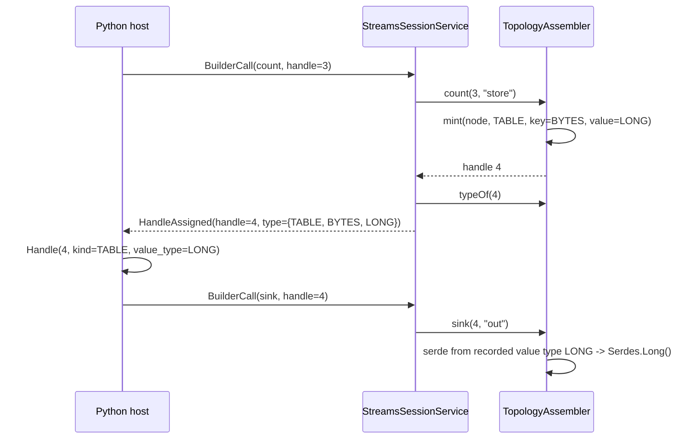

# Typed Handles for the Streams v1alpha1 Protocol - Plan

## Goal Capsule

- **Objective:** the Streams protocol tells the host what each minted handle IS (stream, grouped stream, table) and what key and value types it carries, so the engine's `sink()` stops special-casing `KTable`-of-`Long` and the Python host can decode sink output without tribal knowledge. The work belongs to the language-proxy workstream tracked as astubbs#242, which commit subjects reference.
- **Authority:** this plan; where it is silent, the conventions in `AGENTS.md` and the existing streams module. The v1alpha1 proto is explicitly unfrozen (its own header comment) and may be changed, keeping changes additive in spirit.
- **Stop conditions:** do not touch the frozen v1 wire (`parallel-consumer-proxy-protocol`). Do not modify `parallel-consumer-proxy-clients/parallel-consumer-proxy-client-python/demo/streams_demo.py` - another live workstream owns it. Do not push or open a PR.
- **Execution profile:** commit each implementation unit as it lands, with a real body; subject style `feat(streams) astubbs#242: <subject>`.

---

## Product Contract

### Summary

The engine mints an opaque integer handle per builder call. The engine knows each handle's runtime type; the host does not. This forces `TopologyAssembler.sink()` to special-case "handle is a `KTable`" and hard-code `Serdes.Long()`, and forces the Python demo to know that a count decodes as eight big-endian bytes. Every future aggregation, reduce and join mints a typed value the same way, so without a type on the wire each one becomes another hard-coded branch. This plan puts the type on the wire at mint time, drives the engine's sink serde selection from the recorded type, and surfaces the type in the Python client.

### Problem Frame

`docs/inflight/next-kafka-streams-foreign-wrappers.md` names this as "the next real design question" and the prerequisite for aggregations - the blocker on the operator surface growing at all. The current wire (`HandleAssigned { call_id, handle }`) carries no type; `sink()` infers the value serde from `instanceof KTable`, which only works while `count()` is the sole table-minting operator.

### Requirements

**Wire**

- R1. `HandleAssigned` carries the minted handle's type: its kind (stream / grouped stream / table) and its key and value data types.
- R2. The type vocabulary covers what the engine can mint today (bytes, long) and can grow additively - a new type is a new enum member, not a wire redesign.
- R3. A `HandleAssigned` answering a call that mints no handle (`sink`) omits both `type` and `handle`, so the wire has one presence signal for "a handle was minted", not two that could diverge.

**Engine**

- R4. `TopologyAssembler` records kind, key type and value type at every mint, in the same store as the handle's node - no parallel map.
- R5. `sink()` selects the value serde from the handle's recorded value type; the `instanceof KTable`-implies-`Long` special case is deleted.
- R6. Sinking a handle whose recorded value type has no serde is refused with an error naming the handle and the type - never silently written as bytes.
- R7. A builder call applied to the wrong kind of handle is refused with an error naming the recorded kind in protocol vocabulary ("grouped stream"), not a Kafka Streams implementation class name. This fixes an existing misreport: sinking a grouped-stream handle today claims the handle "does not exist".

**Python client**

- R8. Builder calls return a handle that exposes the engine-reported kind, key type and value type, while remaining usable everywhere the current plain `int` handle is used.
- R9. The client can decode a sink-topic key or value from the handle's reported key or value type (bytes pass through; long decodes as 8-byte big-endian signed), and refuses clearly on a type it does not know. Decode lives on the type, so `key_type` and `value_type` share one mechanism.
- R10. A wire type value the client does not recognise (engine newer than client) degrades to an explicit UNKNOWN, not a crash and not a silent bytes-guess.

**Docs**

- R11. The deferred-capability table in `docs/inflight/next-kafka-streams-foreign-wrappers.md` stops naming typed handles as open.

### Scope Boundaries

- **Deferred to follow-up work:**
  - Migrating `demo/streams_demo.py` to the typed decode API (file owned by a parallel workstream; today's `struct.unpack(">q", ...)` keeps working because the wire bytes are unchanged).
  - New typed operators (aggregate, reduce, join) - this plan builds the vocabulary they need, not the operators.
  - Parameterised types (windowed keys, list values). Recorded as a growth path in KTD2, not built.
- **Non-goals:**
  - `Describe` does not report handle types (KTD4 - handles are builder-side objects, not topology nodes).
  - No change to the frozen v1 wire, the invocation path (`Invocation` stays bytes-in/bytes-out), or the Go/other-language bindings.

---

## Planning Contract

### Key Technical Decisions

- KTD1. **Type travels as a `HandleType` message of three enums on `HandleAssigned`.** `HandleKind { UNSPECIFIED, STREAM, GROUPED_STREAM, TABLE }` and `DataType { UNSPECIFIED, BYTES, LONG }` for key and value. A message wrapper (rather than three loose fields) keeps `HandleAssigned` tidy and makes R3 natural: the sink answer simply omits the field. Rejected: a recursive `TypeSpec` message supporting parameterised types now - speculative for a two-member vocabulary, and the alpha wire may still be reshaped when windowed types actually arrive (the additive escape hatch is a new optional field beside the enum).
- KTD2. **Enum growth is the extension mechanism.** A new mintable type is a five-place change: a new `DataType` member in the proto, regenerated Python stubs, one Java serde-selection branch, and the mirrored Python enum member plus decode branch - R6 keeps a missing Java branch loud, R9 keeps a missing Python branch loud. Parameterised types are the known limit of an enum; when a windowed operator arrives, an optional structured field is added beside `DataType` - additive, recorded here so the next designer does not re-derive it.
- KTD3. **The handle store is re-keyed, not paralleled.** `TopologyAssembler`'s `Map<Long, Object>` becomes a map to a record of (node, kind, key type, value type). Kind resolution for `resolve()` reads the record, giving protocol-vocabulary errors (R7). No second map keyed by handle may appear.
- KTD4. **`Describe` does not report handle types.** Handles are builder-side intermediates; `Topology.describe()` nodes are not handles, and there is no sound handle-to-node mapping. The type is delivered at mint time on `HandleAssigned`, which is when the host needs it (it holds the handle it is about to sink). Reversible later without wire breakage if a real need appears.
- KTD5. **Python surfaces the type as an `int` subclass `Handle`.** Builder methods return a `Handle(int)` carrying `kind`, `key_type`, `value_type` (Python enums mirroring the proto ones, with `UNKNOWN` members for unrecognised wire values, R10). An int subclass passes unchanged through every existing call site, protobuf field assignment, and test assertion - no churn in the builder-call plumbing. Decode lives on the type enum (`DataType.decode(data)`), so a host writes `counted.value_type.decode(raw)`.
- KTD6. **Serde selection is exhaustive with a refusing default.** The Java switch over `DataType` has explicit branches for BYTES and LONG and refuses anything else by name (R6). Silent fallthrough to bytes is the exact failure mode this feature exists to remove.

### High-Level Technical Design

Directional guidance, not implementation specification: the exact seam for the session to learn a mint's type (a query like `typeOf(handle)` versus a richer return value from each assembler method) is the implementer's call; the constraint is KTD3 - one store, no parallel type map.

### Assumptions

- This run was scoped headlessly (subagent pipeline, no interactive confirmation). Inferred bets: the Python demo is out of scope (owned by a parallel workstream); the wire may change freely because v1alpha1 declares itself unfrozen; `map_values` output remains bytes because the foreign function contract is bytes-in/bytes-out.
- Java protobuf classes are generated at build time by Maven; Python stubs are committed and regenerated with `tools/generate_proto.py` (both facts verified in the module).

---

## Implementation Units

### U1. Wire vocabulary: HandleType on HandleAssigned

- **Goal:** the proto carries the type; both languages' generated code knows it.
- **Requirements:** R1, R2, R3.
- **Dependencies:** none.
- **Files:** `parallel-consumer-proxy-streams/src/main/proto/parallelconsumer/streams/v1alpha1/streams.proto`; regenerated `parallel-consumer-proxy-clients/parallel-consumer-proxy-client-python/src/parallel_consumer/_generated/streams_pb2.py`, `parallel-consumer-proxy-clients/parallel-consumer-proxy-client-python/src/parallel_consumer/_generated/streams_pb2.pyi`, `parallel-consumer-proxy-clients/parallel-consumer-proxy-client-python/src/parallel_consumer/_generated/streams_pb2_grpc.py`.
- **Approach:** add `HandleKind` and `DataType` enums and a `HandleType` message per KTD1; add `optional HandleType type = 3` to `HandleAssigned`. Comment `HandleAssigned` with the delivery contract (`type` and `handle` present exactly when a handle was minted, per R3) and the KTD2 growth path. Regenerate Python stubs with `.venv/bin/python tools/generate_proto.py` and commit them in the same unit so `make proto-check` is green at every commit.
- **Patterns to follow:** the existing `NodeKind` enum's naming (`NODE_KIND_*` prefix style) and the proto's comment voice.
- **Test scenarios:**
  - `StreamsProtocolRoundTripTest` (or its established pattern): a `HandleAssigned` with a `HandleType` round-trips through serialize/parse with kind and both data types intact.
  - A `HandleAssigned` without `type` reports `hasType() == false` after a round trip.
- **Verification:** the Java module suite gate (Verification Contract, JAVA_HOME-pinned command) compiles the regenerated Java; `make proto-check` in the Python module passes.

### U2. Engine records types and sinks by them

- **Goal:** every mint records its type, `HandleAssigned` carries it, and `sink()` selects its serde from it; the `KTable`-implies-`Long` special case is gone.
- **Requirements:** R1, R3, R4, R5, R6, R7.
- **Dependencies:** U1.
- **Files:** `parallel-consumer-proxy-streams/src/main/java/bz/stub/parallelconsumer/streams/TopologyAssembler.java`, `.../StreamsSessionService.java`; tests `.../src/test/java/bz/stub/parallelconsumer/streams/TopologyAssemblerTest.java`, `.../StreamsSessionServiceTest.java`.
- **Approach:**
  1. Re-key the handle map per KTD3; each builder method records its kind and data types (source, mapValues: stream bytes/bytes; groupByKey: grouped stream bytes/bytes; count: table bytes/long).
  2. Expose the mint's type to the session; `onBuilderCall` attaches it to `HandleAssigned` for minting calls, and for `sink` omits both `type` and `handle` (R3), no longer setting handle 0. gRPC serialises a session's inbound callbacks (recorded in the session's class javadoc), so mint-and-attach is call-scoped with no interleaving hazard.
  3. Rewrite `sink()`: resolve the handle, refuse a grouped stream by name (R7), pick emission (`KTable.toStream().to` vs `KStream.to`) from the recorded kind, and pick the value serde from the recorded value type per KTD6.
  4. Route `resolve()` mismatch errors through the recorded kind's protocol name.
- **Test scenarios:**
  - Each of the four minting methods yields the expected kind/key/value type (assert via whatever seam the session uses).
  - Covers the count pipeline: the existing `TopologyTestDriver` count test still passes with the special case deleted - the sink writes `Long` because the recorded type says so.
  - A source-to-sink bytes pipeline through `TopologyTestDriver`: output values are the input bytes unchanged (proves the selection does not hard-code `Long`).
  - Sinking a grouped-stream handle is refused and the error names "grouped stream", not "does not exist".
  - Sinking a handle whose recorded value type has no serde branch (inject an UNSPECIFIED-typed entry through a test seam) is refused with an error naming the handle and the type - never written as bytes (R6).
  - Wrong-kind matrix: each builder method applied to each wrong kind of handle (`mapValues`/`groupByKey` on a grouped stream and a table, `count` on a stream and a table, `sink` on a grouped stream) refuses, naming the recorded kind in protocol vocabulary, not `KStreamImpl`/`KGroupedStreamImpl`.
  - Session-level: a `count` builder call's `HandleAssigned` carries `type` (table, bytes, long); a `sink` call's answer carries neither `type` nor `handle`.
- **Execution note:** red-proof the serde selection both ways - force the selector to always-bytes (count test must fail) and always-long (bytes pipeline test must fail). Beware `TopologyTestDriver.close()` deleting state before assertions.
- **Verification:** module suite green; grep confirms no `Serdes.Long()` remains in `sink()`'s path except via the type-driven selector.

### U3. Python client surfaces the type

- **Goal:** a host learns what a handle is and decodes sink values without hard-coding widths.
- **Requirements:** R8, R9, R10.
- **Dependencies:** U1 (U2 for end-to-end truth, but the FakeEngine isolates this unit).
- **Files:** `parallel-consumer-proxy-clients/parallel-consumer-proxy-client-python/src/parallel_consumer/streams/_session.py`, `.../streams/__init__.py`; tests `.../tests/test_streams_session.py`.
- **Approach:**
  1. Add `HandleKind` and `DataType` Python enums with `UNKNOWN` members; map wire values defensively (R10).
  2. Add `Handle(int)` per KTD5; `_on_handle`/`_call` build it from `HandleAssigned.type` when present, else UNKNOWN-typed.
  3. `DataType.decode(data)`: BYTES returns the bytes; LONG unpacks `>q`; anything else raises `StreamsError` naming the type (R9).
  4. Export the new names from `parallel_consumer.streams`.
- **Patterns to follow:** the module's docstring voice; no `assert` in `src/` (S101); extend `FakeEngine` to attach a `HandleType` per builder-call kind rather than writing a new harness.
- **Test scenarios:**
  - The builder's `count` return exposes kind TABLE and value type LONG; `source` exposes STREAM bytes/bytes.
  - The returned handle still equals its integer and still lands in the next call's proto field (existing five-call test keeps passing unmodified is the strongest form).
  - `DataType.LONG.decode` on 8 big-endian bytes gives the integer; `BYTES.decode` is identity.
  - Decoding an UNKNOWN type raises `StreamsError` naming the problem.
  - A `HandleAssigned` carrying an unrecognised enum value yields `UNKNOWN`, no exception.
  - A `HandleAssigned` with no type (sink) does not crash the pending-call path.
  - Cross-language mapping: the hand-mirrored Python enums equal the generated protobuf constants (each `HandleKind`/`DataType` member asserted against its `streams_pb2` value), so client and engine cannot silently disagree on wire values - the proto stays the single source of truth.
- **Execution note:** red-proof at least the type-mapping test by making `FakeEngine` attach a wrong kind and confirming the assertion fails; the harness answers synchronously, which has hidden dead assertions here twice before.
- **Verification:** `make lint` and `make test` green in the Python module.

### U4. Docs and finishing gates

- **Goal:** the record says typed handles are done, and the repo's gates pass.
- **Requirements:** R11.
- **Dependencies:** U2, U3.
- **Files:** `docs/inflight/next-kafka-streams-foreign-wrappers.md`; possibly `CONCEPTS.md` (only if a definition is genuinely missing).
- **Approach:** rewrite the "Typed handles" row of the deferred-capability table as landed (what shipped, one line); add a dated correction note to the "Serdes are a non-issue except at the sink" section saying the special case is gone, matching the doc's existing "Corrected YYYY-MM-DD" convention. `docs/language-bindings.md` is unchanged - the control-plane decision (explicit typed messages) is unaffected; verify and leave alone.
- **Test scenarios:** Test expectation: none - documentation-only unit.
- **Verification:** after staging everything, `COPYRIGHT_CHECK_REQUIRE_FORK_POINT=1 bin/check-copyright-headers.sh` passes (staged-first, per AGENTS.md); `bin/check-issue-refs.sh` passes.

---

## Verification Contract

| Gate | Command | Applies to |
|---|---|---|
| Java module suite | `JAVA_HOME=~/.sdkman/candidates/java/17.0.18-tem ./mvnw --batch-mode -q -pl :parallel-consumer-proxy-streams -am test` (never `-Dtest=`; read counts from surefire reports) | U1, U2 |
| Python lint | `make lint` in the Python client module | U3 |
| Python tests | `make test` in the Python client module | U3 |
| Stub freshness | `make proto-check` in the Python client module | U1 |
| Copyright headers | `COPYRIGHT_CHECK_REQUIRE_FORK_POINT=1 bin/check-copyright-headers.sh` after staging | U4 |
| Issue references | `bin/check-issue-refs.sh` | U4 |
| Proto lint / breaking | not applicable: the v1alpha1 proto is deliberately outside both proto gates - `check-proto-lint.sh` covers only the frozen protocol module and `check-proto-breaking.sh` guards only the frozen v1 wire (the proto's own header records the exclusion) - so no lint or breaking check runs on it locally or in CI; review the proto diff by eye | U1 |

## Definition of Done

- All four units committed, one commit each, subjects `feat(streams) astubbs#242: ...` (docs unit may use `docs(streams)`), bodies carrying the reasoning.
- Every new assertion red-proofed, with the sabotage used recorded in the report.
- No `instanceof KTable` special case in `sink()`; no parallel type map; no weakened assertion anywhere.
- `demo/streams_demo.py` untouched.
- No push, no PR, no GitHub posts.
- No dead-end experimental code left in the tree.
