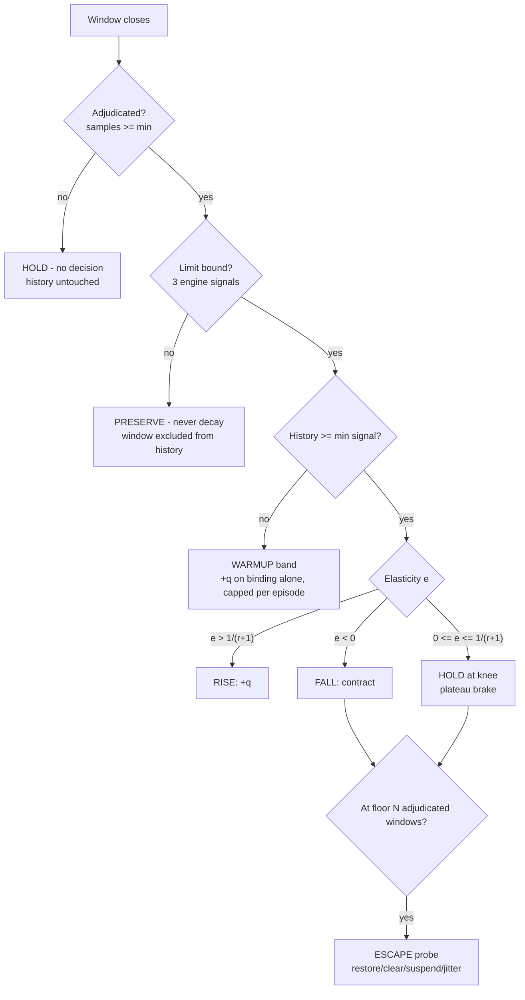
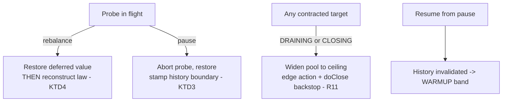

# What the Admission Controller Should Actually Do - Clean-Sheet Design

## Goal Capsule

- **Objective:** State what the controller must do - what makes the target rise, what makes it fall,
  what makes it hold, what forces it to re-measure from the floor - and how each of those decisions
  can be proven wrong - and derive the mechanism from that, rather than patching the arm list
  inherited from the Gradient2 port.
- **Why this exists:** Three planning attempts failed review, and all of their fatal findings share a
  root. Each proposed removing a mechanism whose reason for existing was a property of *this engine*,
  and each was designing around code that was already committed. Nothing here is shipped; the
  committed law is a first draft and is treated as one.
- **Supersedes:** `2026-08-24-001-feat-admission-ratchet-plan.md` (its premise is contradicted -
  see Finding 1) and absorbs `2026-08-24-002-feat-admission-optimisation-objective-plan.md` (its
  cost estimate was wrong - see Finding 2).

---

## Two findings that invalidate the prior split

### Finding 1: the ratchet is not separable from the objective. The split was wrong.

The two plans were split on the argument that *an objective is what makes the controller useful; it
is not what stops it climbing*. Prior art contradicts this directly.

- **Uber Cinnamon hit this exact bug in production** - a periodically-reset latency target that
  drifted ever upward under sustained load - and fixed it by computing the **covariance between
  in-flight and throughput** and vetoing on negative covariance. They did not patch the baseline;
  they added an absolute objective. ([Cinnamon Auto-Tuner: Adaptive Concurrency in the
  Wild](https://www.uber.com/en-IN/blog/cinnamon-auto-tuner-adaptive-concurrency-in-the-wild/))
- **Netflix/concurrency-limits#137**: when every request returns at the same client timeout, RTT
  volatility is zero, so `Gradient2Limit` grows to `maxLimit`. Open.
- **envoyproxy/envoy#38338**: under sustained degradation both `sampleRTT` and `minRTT` are elevated, so the
  headroom term drives concurrency *up* while the system is struggling. Closed as not-planned.

The common mechanism: **a ratio cannot detect a steadily-bad absolute level.** Every relative
objective has this hole, and neither open issue has a fix inside that frame. The ratchet is not a
defect in the baseline's maintenance. It is the defining behaviour of a purely relative objective,
and it is not patchable without an absolute one.

That is why Plan A collected four P0s: it kept the relative objective and tried to fix the ratchet by
deleting arms, which removed the accelerator and the anti-strand probe without replacing what they
did.

### Finding 2: throughput is already measured. The objective's cost estimate was wrong.

`ClosedAdmissionWindow` already counts outcomes per window, fed per record from `handleFutureResult`
on the control thread - and the objective's throughput is **useful completions per actual elapsed
time: `successCount`, never `totalOutcomeCount()`**. The distinction is load-bearing for phase 4 of
the comparison test: rate-limit rejections *are* completions (they land in the ignore or
overload-drop counters), so a total-outcome rate stays high exactly when useful throughput collapses
- the one thing a throughput objective exists to see. `IGNORE` and `OVERLOAD_DROP` outcomes are
excluded from the numerator precisely so fast rejections read as a collapse rather than as sustained
completion rate. The objective plan asserted the controller "never measures throughput at all" and
priced it as a new signal. It is one division away, and it needs the window's *actual* elapsed time
rather than its nominal 1s, because windows drift (`windowOpenedAt = now` at tick time, so an idle
consumer produces one 4-second window and restarts).

The objective was deferred largely on cost. That reason is gone.

---

## The plant: what the controller is actually steering

Before any control law, what does moving the target *do*? The design surface answers this, and the
answer is not what the committed law assumes.

**The worker pool is fixed at construction and never resized.** `AbstractParallelEoSStreamProcessor`
builds it from `newOptions.getMaxConcurrency()`, `core == max`, with an **unbounded** queue, and
nothing calls `setCorePoolSize`/`setMaximumPoolSize` anywhere. So the admission target does not
control concurrency. It controls *feeding*. Above the pool size, extra admitted records land in the
executor queue and wait.

**This produces a live open-loop defect in the committed code.** `AdmissionController` resolves
`enforceCeiling = leftAtLibraryDefault ? ADAPTIVE_DEFAULT_CEILING : staticTarget` - so a user who
leaves `maxConcurrency` at its default of 16 and turns on `ENFORCE` gets a ceiling of **64 against a
pool of 16**. Above 16:

1. raising the target adds queue depth, not concurrency;
2. the service-time tap brackets only `usersFunction.apply(context)`, so queue wait is **excluded**
   from the measurement;
3. measured latency therefore does not degrade as the target climbs;
4. the gradient never sees degradation and the additive headroom wins another slot every window.

That is a ratchet generator with no feedback at all, sitting in the committed ceiling default. It is
also the defect the very first review round flagged as *"the effective maximum collides with pool
sizing"*; the plan carried a fix and the implementation took the ceiling substitution without the
pool resize.

**The closed-loop IT did not catch it** because it set `maxConcurrency` to 32, keeping the target
under the pool size, where the loop genuinely is closed. The ratchet it *did* observe (17/18 -> 20,
knee at 12) is the real baseline-contamination one, on a closed loop. Both exist; they are different
bugs with the same symptom.

**Under virtual threads none of this applies.** The pool is unbounded, every accepted task gets a
thread, and the admission target is the *only* bound that exists. The loop is closed by construction.

### The feedback map, which is what previous designs kept tripping over

Lowering the target does **not** drain the buffer. Records are still admitted from the broker; they
are just not dispatched. So:

- in-flight falls, lagged by one user-function duration plus a mailbox hop;
- buffered work in the shards goes **up** relative to in-flight;
- `isSufficientlyLoaded()` therefore becomes *more* likely true, so the **poller** pauses sooner -
  intake falls second-order, through a different actuator, on a different thread;
- the in-flight distribution narrows, and the law tests median and spread **as fractions of the
  limit** - so a contraction manufactures its own starvation evidence. This is the documented reason
  the probe-up arm exists, and it is why deleting that arm stranded the controller low in Plan A.

Any design that changes the target must state what it expects each of these to do.

---

## What the controller optimises

**Throughput, subject to absolute brakes. The latency baseline is deleted.**

The argument is not that latency is uninformative. It is that a *learned latency baseline* is the
one signal the controller's own actions contaminate, and every known failure of this controller class
runs through that contamination. Throughput has no baseline to poison: it is an absolute rate,
measured per window, and the controller cannot flatter itself by redefining what normal means.

Three further reasons specific to this library:

1. **A user function is an arbitrary black box.** Netflix/concurrency-limits#171 states the problem precisely: when a
   downstream dependency slows, threads block, latency rises - and the *correct* response is **more**
   concurrency, not less. When the local pool saturates, the correct response is less. Latency alone
   is the same observation in both cases. Throughput distinguishes them: if throughput still rises as
   concurrency rises, add concurrency; if it has stopped rising, stop. For a library whose whole
   proposition is "your function can be anything", this is a requirement, not a refinement.
2. **It answers the owner's question arithmetically.** *Service time rose from 20ms to 30ms - bad, or
   good because throughput went up?* A throughput objective answers without a configured number.
3. **It removes the second-order conditioning problem.** Kleinrock's power is maximised where its
   derivative is zero, which is a flat region by construction. Throughput elasticity crosses its
   threshold with non-zero slope. Same measurements, better conditioning. (This was already settled
   as KD1 in the objective plan and survives unchanged.)

**Latency remains, as a ceiling and never a target** - the ruling from the inflight note stands
whole, including that an unreachable ceiling is *reported as a binding constraint* rather than
pursued.

### Delete versus augment: decided, and the deciding frame is what kind of server this is

The review's strongest challenge: the cited Uber precedent *kept* its latency law and added the
covariance veto - augmentation, not replacement - and no request-serving system cited here steers on
throughput alone. Ruled (owner, 2026-08-24): **delete.** The frame that settles it: **PC's engine is
a work server.** The right precedent class is not the request servers - Cinnamon keeps latency
because a latency SLO *is* Uber's product objective, and Netflix and Envoy protect an RPC server's
callers - it is the **.NET CLR ThreadPool**, which has sized worker concurrency for arbitrary
user-supplied work on throughput alone, no latency model at all, on every .NET server for some
fifteen years. Sizing workers for a black-box function is this engine's exact problem shape, and
there the throughput-only precedent is production fact, not conjecture.

The retreat is bounded and stated: the plateau that made deletion look dangerous is the HOLD band's
job, phase 5 of the comparison test is that band's falsifier, and `admission-gradient2-port` tags
the gradient law complete and green. If phase 5 fails, augmenting the latency term back is a
measured, evidence-driven step - which is the only way this decision should ever reopen.

### The dither is not needed, and that deletes ten of the seventeen blockers

The objective plan specified estimation by injected perturbation and demodulation, copying the .NET
CLR ThreadPool. Ten of its seventeen blockers were properties of that estimator: sub-slot
perturbations truncating to nothing, clamping turning the square wave into a half wave, the
controller's own steps re-entering the dither band, the window length being target-derived and so
modulating the measurement interval at the dither frequency.

**Uber's covariance test needs no dither.** It correlates in-flight against throughput over the
controller's *natural* movement history. A controller that already rises and falls under an
accelerator and a brake is generating its own excitation; the estimator reads the resulting
trajectory rather than injecting one. Blockers 3, 4, 5, 6, 9 and 10 evaporate, and the objective
plan's R5 - bounding the perturbation's cost to a healthy workload - stops being a requirement
because there is no perturbation.

What survives from that list and must still be answered: the elasticity denominator (blocker 2 -
commanded target or achieved in-flight, and they diverge exactly when it matters), the window-series
gaps (blocker 7), rebalance reseeding (blocker 8), fleet behaviour (blocker 14), and the whole
product surface (15-17).

---

## Rise, fall, hold, escape

**One estimator decides all three bands, and it is the settled objective made operational.** The
elasticity of throughput against concurrency - estimated from the covariance of in-flight and useful
throughput over the controller's movement history - is a single statistic read three ways:

- **RISE** requires the limit to be binding **and** elasticity above the threshold (`1/(r+1)`, r=3):
  more concurrency is still buying proportionally more throughput.
- **HOLD** when elasticity sits between the threshold and zero: growth has stopped paying but is not
  yet destructive. **This is the band that catches the graceful-saturation plateau** - a downstream
  that saturates gently produces flat throughput (covariance near zero, *not* negative) while its
  queue and latency climb; a law whose only relative brake is *negative* covariance never fires
  there, the additive term wins every window, and the ratchet is reborn invisibly. The threshold
  band is what stands in its way, and it is why the covariance test and the elasticity gate are one
  estimator and not two - negative covariance is simply elasticity below zero.
- **FALL** on elasticity below zero: more concurrency bought less work.

### RISE

**Two terms, and the additive one is load-bearing.**

With the gradient clamped to `[0.5, 1.0]`, `limit * gradient` can never exceed `limit`, so the
additive term is not a tuning refinement - it is the only thing standing between this law and a
provable one-way ratchet *downward*. With `q = 0` and `g <= 1` the limit is monotone non-increasing
for **all** inputs: every transient spike is permanent and no input sequence recovers it. Plan A
proposed a brake-only design and this is why it was fatal.

The accelerator must be **named and derived, not felt**. In the Gradient2 family, solving
`L = L*g + q` gives the fixed point

```
g* = 1 - q(L)/L
```

so `q` does not merely set the growth *rate* - it sets the **steady-state cost you are choosing to
buy**. Pick the tolerated cost; that fixes `q`. `q(L) = sqrt(L)` self-scales (Envoy's choice, and
`GradientLimit`'s rationale verbatim: a fixed queue "becomes too small for large limits but still
prevents the limit from growing too much"); a constant does not.

**A caveat the review is right about: that derivation belongs to the law being deleted.** It
presumes a continuous multiplicative gradient `g`; the proposed law's contraction is a band
transition, an event rather than a multiplier, so the steady state under accelerate-until-the-band
dynamics is a limit cycle whose amplitude depends on `q`, the threshold and the history length - a
different quantity with different tuning consequences. The *principle* stands (the accelerator's
size is a chosen steady-state cost, stated rather than felt), and `q = sqrt(L)` remains the default
candidate; the equilibrium arithmetic must be **re-derived for the actual dynamics** before the
constant is defended by it - carried as Open Question 4.

**Guard the arithmetic.** Netflix/concurrency-limits#35 is the cautionary case: with `smoothing < 1` and +/-1
increments, `trunc(0.8n + 0.2(n+1)) = n` - the controller *never moved at all*, and it shipped. Our
`smoothing = 0.2` already turns a nominal `+4` into an effective `+0.8` per window.

**Growth is gated on the limit being binding, not on the buffer being full.** RFC 7661 states the
rule to copy: a sender that *is* limit-bound may grow even while app-limited; only a sender that is
**not** limit-bound must not. This is the distinction Plan A collapsed.

And here PC is better placed than any of the prior art. Netflix, Envoy and TCP are all forced to use
`inflight >= limit/2` as a proxy for "the limit is binding". **We can measure the real thing**, and
three signals already exist and are unused by admission:

| Signal | Accessor | What it settles |
|---|---|---|
| Dispatch under-served | `lastWorkRequestWasFulfilled()` | we asked for more than the shards gave |
| Selectable work, ordering-aware | `WorkManager#getUpperBoundOnSelectableWork()` | whether the shards *could* have yielded more |
| Poller throttled | `BrokerPollSystem#isPausedForThrottling()` | whether **we** caused the emptiness |

Together these separate the three cases the current window aggregates cannot: the topic is empty; the
shards are ordering-blocked; we throttled our own intake. The third is self-inflicted and must never
be read as evidence of anything.

**And the separation is reported, not only consumed.** Each of the three cases reaches the operator
through the constraint gauge - including an ordering-starved value, which is the requirement
`pr-333-adaptive-concurrency-outstanding.md` item 3 opened (*the single most valuable diagnosis
available*) and which a law that only uses these signals internally would leave exactly as unmet as
it is today.

### FALL

**A relative brake and an absolute one. Both, because a ratio cannot see a steadily-bad level.**

- **Relative:** the elasticity estimator's negative band (see the section opening - one statistic,
  three bands) - more concurrency bought less work. This is the term Uber added to fix precisely our
  bug, and it cannot be fooled by a drifting baseline because it has no baseline. **Its evidence
  base carries an invariant: a window enters the estimator's history only if the limit was binding
  for that window.** A Kafka consumer's in-flight and throughput collapse together when the topic
  drains and jump together on a burst - arrival-driven windows inject spurious positive covariance
  that later licenses growth the plant never earned. The three binding signals already gate growth;
  the same exclusion must gate the estimator's *input*, or the brake's evidence stays contaminated
  by exactly the app-limited windows the growth gate rejects.
- **Absolute:** the failure fraction (exists), and **offset-encoding back-pressure** -
  `PartitionState#isBlocked()` / `isAllowedMoreRecords()`, a real admission constraint the controller
  currently cannot see at all: a partition refusing more records because the commit metadata would
  not fit (R8). The operator-facing latency ceiling is deferred out of this plan entirely - KTD7
  owns that call; the objective plan's KD4 settled its signal as residence time for whenever it
  ships.

Note that the AIMD `BACKOFF` arm is currently **unreachable in production**:
`AdmissionOutcomeClassifier.classifyFailure` returns `IGNORE` for every cause, so `OVERLOAD_DROP` is
never produced. One of the two brakes in the committed law is dead code.

### HOLD

Two behaviours share this name, and the band diagram keeps them as separate nodes: **PRESERVE**
when the limit is not binding (this section, R5 - falsified by the app-limited lull) and the **HOLD
band** at the knee (R1's middle band, the plateau brake - falsified by comparison phase 5).

**When the limit is not binding: preserve, never decay.**

RFC 7661 replaced RFC 2861 for exactly this reason. RFC 2861 decayed `cwnd` when application-limited;
it was found *"too conservative for many common rate-limited applications"* and applications
responded by **padding their streams with junk data** to keep the window inflated. That is the
definitive symptom of a controller whose own gating manufactured its evidence, and it is the failure
mode Plan A would have reintroduced.

If a decay is wanted at all it must be bounded (RFC 7661 caps the non-validated period at five
minutes) and must floor at the initial value, never at 1.

**Also hold when there is no evidence.** Envoy's `resetSampleWindow` returns without deciding when
the histogram is empty; Knative returns an *invalid* scale result on `ErrNoData`. Absence of data
yields no decision - not a conservative one.

### ESCAPE

**N consecutive windows pinned at the floor forces a re-measurement, on a path no gated signal can
suppress.**

This is the anti-strand hatch, and it is the one mechanism that must not depend on any signal the
controller's own gating can suppress. Envoy uses N=5 and fires the minRTT timer immediately;
Uber arrived at the same design independently (repeated lower-bound hits reset `targetLatency`).

Envoy's four safeguards for the probe window all transfer and all matter:

1. **remember and restore** the pre-probe limit (`deferred_limit_value_`) - do not re-derive it;
2. **clear the sample history on entry** so pre-probe samples cannot contaminate the measurement;
3. **suspend normal limit updates** for the duration;
4. **jitter** the start (15%) so a fleet does not probe in lockstep.

What the probe measures, and what its conclusion does: the probe's product is a **fresh limit-bound
history at a known-low operating point** - its windows are limit-bound by construction, so they are
valid estimator input. On conclusion, updates resume from the restored target, the probe's entries
are retained, and the bands govern; the first post-probe decisions extrapolate across the
operating-point jump, which is accepted because discarding would land in warmup - and a concluded
probe opens a fresh warmup allowance (KTD2), which is what makes the escape's liveness survive the
warmup cap.

And the floor itself must never sit below one accelerator step, or the accelerator cannot act at the
floor and the floor becomes absorbing. `GradientLimit` clamps to `[queueSize, maxLimit]`; CoDel
refuses to drop when it would leave the queue below one MTU. `LIMIT_FLOOR_SLOTS = 1` against
`q = sqrt(L)` satisfies this, but it must be stated as an invariant rather than left to coincidence.

---

## The actuator must be fixed before any law is worth tuning

**`maxConcurrency` is a maximum concurrency, not a thread count** (owner's ruling, 2026-08-24). If the
engine is auto-scaling, how a concurrency ceiling gets honoured - platform pool, virtual threads, no
pool at all - is the engine's business, not a number the user should be nominating.

That reframe dissolves the open-loop defect instead of patching it. **The controller sizes the pool to
its own target, and the mechanism's full contract is:** construct the pool with `maximumPoolSize` at
the resolved ceiling, and have the controller track its target with `corePoolSize` as the single live
knob. Both halves are load-bearing. `setCorePoolSize` above `maximumPoolSize` throws
`IllegalArgumentException` (JDK 9+), and today the pool is built `core == max == maxConcurrency` - so
steering `corePoolSize` alone against the current construction throws at the first step above 16 in
exactly the default configuration this section flags. And under the unbounded work queue,
`maximumPoolSize` is inert for thread creation (workers beyond core are only added when the queue
rejects an offer, which an unbounded queue never does), so setting it to the ceiling at construction
reserves nothing - it does not reintroduce the rejected size-once-from-ceiling cost. The shrink half
holds as stated: lowering `corePoolSize` interrupts idle workers, and with a zero keep-alive the
surplus threads exit as the queue empties - exactly the drain-down behaviour a contraction wants.
Then:

- the target **is** concurrency rather than a feeding rate, so the loop is closed at every value
  instead of only below the pool size;
- no queue depth accumulates, so the excluded-queue-wait measurement problem disappears with it
  rather than needing to be corrected for;
- platform threads and virtual threads come to mean the same thing, where today the target is the
  only bound under one and a feeding rate under the other;
- `maxConcurrency` becomes a pure safety ceiling, which is the honest reading of its name and
  resolves the "asks for a number that may not exist" problem under virtual threads (inflight item 5).

Note the units: the target is in **slots** - one slot is one concurrent user-function invocation, i.e.
one in-flight batch - so the pool size is the slot count, not the record count the seam derives from
it.

An alternative considered and rejected: size the pool once from the resolved ceiling. It closes the
loop but reserves the ceiling's worth of threads permanently, which is tolerable at 64 and absurd at
the ceilings a virtual-thread deployment would want.

Independently: the service-time tap excludes queue wait, so it does not measure what a caller
experiences. `WorkContainer#getResidenceTime()` and the existing `RECORD_RESIDENCE_TIME` timer
already capture end-to-end time including queueing and retries. If a latency signal is kept as a
ceiling, that is the one to use.

## The overload signal: owned elsewhere

How a user reports downstream pressure is a **public API** decision, and it now has its own artifact:
[`2026-08-24-004-feat-downstream-pressure-signal-plan.md`](2026-08-24-004-feat-downstream-pressure-signal-plan.md)
**owns that topic** - the context-method decision (an owner's ruling: *exceptions are for aborting,
not for messaging*, overriding the ideation's exception design), the constraints inherited from the
throttling ideation, the never-store-a-discovered-limit rule and its falsifiability argument, and the
per-service scope boundary. What binds *this* design from that one:

- the signal is what makes the dead `OVERLOAD_DROP` socket real, and the comparison test's rate-limit
  phase cannot be written until it exists;
- a pressure signal is retried like a failure but **never counted as one**;
- hard signals feed the fixed layer, soft signals feed the adaptive layer, layers compose by `min()`;
- the adaptive estimate is necessarily **aggregate** - the engine cannot see inside the user function,
  so per-service ceilings only ever come from declared or reported limits, never from discovery.

---

## How each decision can be proven wrong

The falsifier problem has a name and it is not a design problem. Every assertion written so far was a
**safety** property - "the limit stays in [a,b]" - and safety properties are satisfied vacuously by
inaction (Alpern & Schneider, *Defining Liveness*, IPL 21:181-185, 1985; every property is the
intersection of a safety and a liveness property, so a suite of only safety assertions is provably
incomplete). Three fixes, all mechanical:

**1. The unfalsifiable test was a defect in the workload, not the assertion.** With one constant
arrival rate and one constant service time, an entire interval of limits produces identical
observable output - the correct limit is **not identifiable**, so no assertion over that experiment
can be falsifiable. This is closed-loop identification bias, and the standard remedy is a persistently
exciting input. **Rule: every scenario must move the true optimum at least twice, in dimensions the
controller estimates independently.** Then a frozen trace is provably wrong at >= 1 point.

**2. An absolute oracle, computed from the scenario's own parameters.** Little's Law gives it
directly: with a simulator where the downstream service rate `mu_max` and the uncongested per-record
service time `W0` are *set*, the correct limit is `L* = mu_max * W0`. It is known before the test
runs and it moves automatically when the scenario changes - which is what makes assertion (1)
possible. Two one-sided absolute assertions then bracket it without naming a hand-fitted band:
throughput >= 0.9 * mu_max (a too-low limit fails) and p95 residence <= 1.25 * W0 (a too-high limit
fails, because queueing shows up as W > W0).

**3. A negative control, asserted in code.** Implement `FrozenLimit`, `AlwaysMaxLimit`,
`AlwaysMinLimit`; parameterise every scenario over the controller; assert each mutant **fails**.

This is not a hypothetical gap. Envoy's `gradient_controller_test.cc` - the strongest existing test
suite for this problem - asserts its brake strictly (`EXPECT_LT` every window) but two of its three
accelerator assertions are non-strict `EXPECT_GE`/`EXPECT_LE`, **which a frozen controller passes**.
And Netflix ships **no test at all** for `Gradient2Limit`, the algorithm we ported; its only
end-to-end harness is annotated `@Ignore("These are simulations and not tests")` and contains zero
assertions.

### The highest-value single test needs no plant change at all

**The initial-condition sweep.** Fix the plant so `L*` is constant for the whole run. Parameterise
over `initialTarget` in {1, 2, 5, 20, 50, ceiling} and additionally seed internal accumulators to
pathological values. Assert convergence from **every** starting point within a deadline.

It works because converging *from elsewhere* is liveness, while sitting on the answer is not. A
frozen controller passes exactly one arm and fails the rest. This is the sampled form of a
region-of-attraction test, and it is also the shape RFC 5166 has specified since 2008: measure
convergence by **starting from a deliberately wrong state and bounding the time to reach the right
region** (its delta-fair convergence time starts two flows at 100/101 and 1/101 of capacity).

### Three companion scenarios, one per decision the sweep does not falsify

- **The arrival-burst dual.** Hold `L*` **constant** while the arrival rate bursts, drains and gaps;
  assert the controller stays near `L*` rather than chasing the load. Every phase above holds
  arrival constant, so the confound that most threatens the estimator on a Kafka topic - in-flight
  and throughput moving together under load swings, the normal case, not an edge - is otherwise
  structurally invisible to the suite. It is one more simulator scenario, not new infrastructure.
- **The app-limited lull - HOLD's falsifier.** Drop arrival well below capacity mid-run, then
  restore it; assert the target was preserved through the lull and throughput recovers within a
  deadline after it. This is the direct RFC 7661 regression test - the decay-on-idle failure Plan A
  would have reintroduced currently has no assertion guarding against its return.
- **The floor pin - ESCAPE's falsifier.** Pin the controller at the floor with the gated signals
  reading empty, and assert the re-measurement fires within N windows anyway. The hatch's whole
  point is being on a path no gated signal can suppress; that property is exactly the kind that
  ships broken when nothing tests it.

### The oracle's units, stated before they bite

`L* = mu_max * W0` is dimensionally **in-flight records**; the target is in **slots**, one slot per
in-flight batch. The oracle the sweep converges to is therefore `L*_slots = mu_max * W0 / batchSize`
- and at `batchSize = 1` the mismatch is invisible, which is precisely how it would ship wrong. At
least one sweep arm runs with `batchSize > 1` so the units seam the actuator section introduces is
itself under test.

### And the comparison that cannot be gamed

Run the adaptive controller against `FixedLimit(c)` for a spread of `c`, across several scenarios,
interleaved, same seeds. Require the adaptive arm to beat **every** fixed baseline in aggregate.
`FrozenLimit(c)` *is* `FixedLimit(c)` - it is definitionally in the baseline set and **cannot beat
itself**. The suite fails it by construction.

**This and the integration test below are one artifact, not two.** The `FixedLimit` spread *is* how
the integration test's arm 2 gets selected - the phase-1 sweep - and the mutant controllers live in
the cheap simulator-level scenario suite, not against a broker. Read as two separate interleaved
harnesses this section would specify the same guarantee twice at benchmark prices; it does not.

This also subsumes the owner's benchmark framing, and strengthens it: the third arm - static,
hand-tuned to the best value a careful operator would find - is what makes the claim survive the
obvious rebuttal (*so tune your config*). The workload must change partway through the run, or only
the weak half of the claim is tested.

---

## What this deletes

- The long-run latency EWMA (`ServiceTimeExpAvg` as the gradient's reference) and with it the
  anti-drift decay, the probe-down arm, `baselineRecoveryMode`, and `preProbeShortTimeNanos`. All of
  them exist to manage a contaminated baseline that no longer exists.
- The dither estimator and its ten blockers, never built.

**Not deleted, despite being dead code today:** `Outcome.OVERLOAD_DROP` and its AIMD arm. The 004
signal is this design's second prerequisite precisely because it makes that socket real, and the
comparison test's rate-limit phase depends on it - deleting the arm while carrying the prerequisite
that feeds it would be a contradiction an implementer resolves at random. It stays, and the
classifier gains real causes to return.

## What must be preserved, and why

Stated as obligations rather than as code, because this is where the previous plans failed:

- **Something must accelerate.** A brake-only controller is provably monotone non-increasing.
- **Something must distinguish self-inflicted emptiness from real capacity.** A contraction narrows
  the in-flight distribution and manufactures its own starvation evidence; that is a property of this
  engine, not of the committed code.
- **Something must escape the floor on an ungated path.**
- **The floor must never sit below one accelerator step.**

---

## Sequencing, and what the benchmark actually gates

**Order: fix the actuator, rewrite the law, measure, then claim - and the road ends at on-by-default.**

The adoption path is decided (owner, 2026-08-24): **the feature graduates to on-by-default when it
has proven itself** - proof meaning the benchmark result plus real use, the same ladder that reserves
the roadmap's `implemented` for work proven in use. Opt-in is a stage, not the destination; every
step below exists to earn that graduation, which is why the falsifiers and the comparison test carry
the weight they do.

1. **The actuator fix comes first** - the controller sizes the pool to its own target, with
   `maxConcurrency` as the safety ceiling over both (the actuator section owns the mechanism).
   Tuning a control law whose actuator is disconnected above its own default measures nothing. This
   is an edit to the branch the admission package lives on; the package is not on master or on the
   PR base, so nothing needs unwinding and nothing sequences around a merge. **Blast radius: the
   pool-follows-target mechanism and the safety-ceiling reading apply only under active ENFORCE.**
   `DISABLED` and `OBSERVE` keep today's behaviour exactly - a fixed pool of `maxConcurrency`
   threads - so no existing static configuration changes meaning, and this is not a breaking change.
2. **The law rewrite lands in one move**, not as a migration. A half-migration leaves a throughput
   term and a latency ratio in the same law disagreeing, with arm order deciding which wins - which
   is how the present six-arm pile-up happened. `admission-gradient2-port` tags the Gradient2 port
   complete and green, as the point to return to if steering on throughput proves worse.
3. **The overload signal (the 004 plan) lands before the benchmark's rate-limit phase** - it is the
   second prerequisite, and it has to have a slot here or it silently becomes nobody's step. The
   fallback is stated rather than improvised: if the signal is not ready, the benchmark runs its
   other phases and **no rate-limit claim is published** - phase 4's assertion waits for the real
   signal rather than being approximated around a classifier that scores every rejection `IGNORE`.
4. **Then the benchmark - post-plan work with a named owner.** The outstanding-items note's item 4
   (`docs/inflight/pr-333-adaptive-concurrency-outstanding.md`) owns running it, setting the phase-1
   tolerance (Open Question 1), and promoting U9's recorded phase 1 to asserted. The published claim
   is **per-instance in scope**; any fleet-scoped claim gates on the fleet question (Open Question 2)
   being settled first. A fleet that oscillates in production earns the *tried it, turned it off*
   reputation that costs a trust-rebuilding fork most, so the claim's scope is stated rather than
   left for a reader to assume.

**The benchmark no longer gates the objective, and the earlier gate was wrong once the objective
became the ratchet fix.** The prior plan held that nothing should be built while it is unknown
whether the controller helps at all. That reasoning was sound when the objective was an enhancement,
and it fails now: the ratchet is a *correctness* defect - the target climbs without bound on any
workload that degrades gracefully - and a correctness fix is not held hostage to a value
measurement. If the benchmark returned "adaptive does not help", the response would be to not ship
the feature, never to ship it with the climb still in it.

**What the benchmark does still gate is any published claim**, and the claim must be stated
precisely because its weak form is not worth publishing. At a *given arrival rate*, adaptive delivers
lower end-to-end latency than a static `maxConcurrency`, or sustains a higher arrival rate before
falling behind - measurable only below saturation, which is why arrival control is required rather
than running both arms flat-out. Beating a badly chosen static number is trivial and invites *so tune
your config*. The claim worth having is that adaptive **matches a carefully hand-tuned static config
without the hand-tuning, then beats it once conditions move away from what that tuning assumed** -
which needs the third hand-tuned arm and a workload that changes partway through the run.

**The controlled-arrival pattern this needs is on this PR's base**, `perf/engine-concurrency` -
the commit is `perf(bench): controlled arrival, skewed keys, and the two work-model no-ops that
would have voided the run`. Two caveats the first draft missed: the base has not been merged into
this branch since it arrived, and the harness is **bench-lane infrastructure** - shell-rendered
templates outside any module's test classpath, running arms as separate processes with no mid-run
phase support. The comparison IT therefore ports the constant-rate feeder *pattern* into a
test-integration utility (U9 owns that as a named subtask); what the merge supplies is the proven
pattern and the load-generation lane, not an importable class.

The first reading of this was wrong - the branch's missing remote was read as unpushed work when
every commit was already contained in the pushed base. The method lesson lives in
[`docs/solutions/workflow-issues/a-branch-without-a-remote-is-not-unpushed-work-2026-08-24.md`](../solutions/workflow-issues/a-branch-without-a-remote-is-not-unpushed-work-2026-08-24.md),
which owns it.

## The comparison integration test

**The claim under test: a compiled setting cannot change and the load can.** So a test that holds
conditions still cannot express the claim at all - it can only ask whether adaptive beats a static
number on the workload that number was chosen for, which is the weak form nobody should publish.

### Three arms, and the middle one is the real opponent

1. **Static, deliberately low** - makes the claim true and easy. Kept only as a floor.
2. **Static, hand-tuned** - swept over a range against **phase 1 only**, best value chosen. This is
   what a careful operator does: they tune against the load they can see at deploy time. **This arm
   is the actual opponent**, and it is also the negative control - a controller that never moves
   degenerates into exactly this arm and therefore cannot beat it.
3. **Adaptive.**

### The workload has to move under all three

Five phases, one run, arrival rate held at a fixed offered rate so the comparison is made
below saturation. The downstream is simulated inside the user function - which is the honest place
for it, since the user function *is* the abstraction over whatever the real downstream is.

| Phase | What changes | What each arm should do |
|---|---|---|
| 1. Steady | Downstream healthy, fixed capacity and service time | Hand-tuned arm is optimal **by construction**. Adaptive must **match within tolerance**, not beat it. |
| 2. Downstream degrades | Concurrency capacity falls; service time rises under load | Static over-drives it and queues. Adaptive backs off. |
| 3. Downstream recovers, then exceeds phase 1 | Capacity rises above where it started | Static leaves headroom unused. Adaptive grows into it. |
| 4. Rate limiting | Downstream stops slowing and starts **rejecting** above a token-bucket rate | Static keeps hammering the limiter. Adaptive settles under the rate. |
| 5. Graceful saturation | Throughput **plateaus flat** at the downstream's capacity while latency climbs - no fall, no rejection | Static queues blindly. Adaptive must **stop growing and hold near the knee** - the HOLD band's own falsifier, and the phase neither 2 (falls) nor 4 (rejects) exercises. |

**Phase 1 is the phase that protects honesty.** Its measure is *match within tolerance*, never
*beat* - a controller that pays a small exploration cost on a steady workload is behaving correctly,
and asserting that it wins would force a design that games steady state. Until the tolerance is set
at benchmark time, phase 1 is recorded, not asserted (R15). Phases 2 to 5 carry the strict
inequalities.

### Phase 4 is not a harder version of phase 2, and it is the interesting one

A degrading downstream slows down; a rate-limited one **rejects while staying fast**. Successful
calls keep returning at their normal latency while a growing fraction fail immediately - so latency
looks *fine* or even improves, while useful throughput collapses. **A latency-steered controller
cannot see this at all, and may even grow into it.** A throughput-steered one sees it directly. That
is the single sharpest argument in this design for the objective change, and phase 4 is where it
becomes an assertion rather than a claim.

### It has a prerequisite: the overload socket is currently dead code

`AdmissionOutcomeClassifier.classifyFailure` returns `Outcome.IGNORE` for **every** cause, so
`OVERLOAD_DROP` is unreachable and the AIMD backoff arm never fires in production. A rate-limit
rejection is precisely the failure shape that socket was reserved for - one that *structurally names*
overload rather than being a business failure. **Phase 4 cannot be written until the classifier
actually classifies**, and a test asserting behaviour on rate limiting while every rejection is
scored `IGNORE` would pass for the wrong reason.

This is the second prerequisite the design carries, alongside the pool/ceiling fix.

### What is measured, and the oracle

Measure **end-to-end residence time at the given arrival rate**, plus useful completion rate. Never
the target value itself - `perf/split-shard-inflight` is the standing warning here: it moved dispatch
10x and end-to-end 0%. A controller that moves impressively is not a controller that helps.

The oracle is absolute and per phase, not a fitted band: the simulated downstream's capacity and
uncongested service time are *set* by the test, so Little's Law gives the correct admission target
for each phase directly, and it moves when the phase moves. That is what makes the assertions
falsifiable rather than merely descriptive - a frozen controller is provably wrong in at least three
of the five phases.

## Product Contract

**Preservation note:** restructured, no scope change - the requirements below are distilled from the
design essay above, which remains the rationale of record; nothing was weakened or reclassified.

### Summary

Replace the ported Gradient2 law with a throughput-steered law: one elasticity estimator read as
three bands, an ungated floor escape, and a pool that follows the target. Prove it with falsifiers a
frozen controller cannot pass, then compare it end-to-end against a hand-tuned static configuration
under load that moves.

### Requirements

**The law**

- R1. One elasticity estimator drives the law, read as three bands: RISE requires the limit binding
  AND elasticity above `1/(r+1)` (r=3); HOLD between the threshold and zero; FALL below zero.
- R2. Only limit-bound windows enter the estimator's history, where binding is established by the
  three engine signals (dispatch under-served, selectable work present, poller not self-throttled).
- R3. While no elasticity verdict is in force - cold start, post-rebalance, post-escape-clear - a
  warmup band licenses additive growth on limit-binding alone, **capped per episode** (KTD2).
  Elasticity-undefined never maps to HOLD, and horizon eviction alone never revokes a verdict.
- R4. Throughput is `successCount` per measured window elapsed time; IGNORE and OVERLOAD_DROP
  outcomes are excluded from the numerator.
- R5. When the limit is not binding: preserve, never decay. Absence of data yields no decision.
- R6. N consecutive **adjudicated** floor windows force a re-measurement probe on a path no gated
  signal can suppress, with restore, clear-history, suspend-updates and jittered start. A pause
  aborts the probe and restores immediately. A rebalance restores the deferred value **before** law
  reconstruction.
- R7. The floor never sits below one accelerator step.
- R8. Absolute brakes: the failure fraction, and offset-encoding back-pressure
  (`PartitionState#isBlocked`). No learned latency reference exists anywhere in the law.

**The actuator**

- R9. Under active ENFORCE with a steerable pool, the controller sizes the pool: `maximumPoolSize`
  set to the resolved ceiling at construction, `corePoolSize` tracking the target. DISABLED and
  OBSERVE keep today's behaviour exactly.
- R10. Steerability is a type test: the actuator applies iff the pool is a `ThreadPoolExecutor`;
  otherwise (virtual threads, overridden pools, external engines) dispatch gating remains the bound.
- R11. Entering DRAINING or CLOSING widens the pool to the ceiling, as an edge action plus a
  `doClose` backstop - the seam release is a read and cannot do it.
- R12. Dispatch is gated in tasks (free pool slots), with the record-denominated seam as a cap, so
  under-filled batches cannot queue tasks and reopen the excluded-queue-wait loop.

**Reporting**

- R13. The three separated starvation cases reach the constraint gauge, including an
  ordering-starved value; the movement log carries the estimator's inputs for each decision.

**Proof**

- R14. The simulator falsifier suite: initial-condition sweep against the slots oracle
  (`L*_slots = mu_max * W0 / batchSize`, at least one arm with batchSize > 1), the arrival-burst
  dual, the app-limited lull, the floor pin, the graceful-saturation plateau, **pause-cycling**
  (periodic pause/resume against a saturated plant - the target does not walk across cycles),
  **sparse adjudication** (qualifying windows below minimum signal per horizon - warmup growth stays
  within its allowance), and **rebalance-shrink** (the restored trajectory respects the new
  assignment's `L*`) - with FrozenLimit, AlwaysMaxLimit and AlwaysMinLimit each asserted to fail,
  and growth assertions strict.
- R15. The comparison IT: three arms, five phases, below saturation on the arrival-controlled
  harness. Phases 2-5 carry strict assertions; phase 1 is recorded, not asserted, until the
  tolerance is set at benchmark time. The rate-limit phase is blocked on the 004 signal.

---

## Planning Contract

### Key Technical Decisions

- KTD1. **The estimator is a normalised regression slope, denominated in slots.**
  Elasticity = slope of log(success throughput, records/s) on log(active-task window median, slots -
  `UserFunctionTaskAccounting#getActive`) over limit-bound windows within a wall-clock horizon
  (default 60s, minimum 8 adjudicated windows to act). Slots, not records: under task-denominated
  dispatch (R12), batch-fill variation moves record counts the actuator never commanded, and the
  batchSize conversion lives only in the oracle and the seam, never inside the estimator. Achieved
  slots, not the commanded target: the target lies exactly when the shards cannot fill it. **The
  binding verdict is slot saturation**: a window is limit-bound iff active tasks reached the target
  at the boundary; the three engine signals classify the *unbound* causes (no work /
  ordering-blocked / self-throttled) - so a thin-batch workload that fills every slot reads as
  bound, never app-limited. A computed elasticity verdict **remains in force until replaced by a
  new qualifying verdict or killed by an invalidation boundary** - horizon eviction alone never
  demotes an acting law back to warmup, so a controller holding correctly still at the knee is not
  self-evicted into growth.
- KTD2. **Warmup band, with a per-episode allowance** (from flow analysis, bounded per review):
  while no elasticity verdict is in force, limit-binding alone licenses additive growth of `q` per
  window - this is what keeps the law from being absorbed at cold start, after rebalance
  reconstruction, and after an escape-probe clear. **The allowance is capped**: cumulative warmup
  growth since the last *acted* elasticity verdict is bounded (working constant: 8 steps of `q`),
  and the episode spans invalidation boundaries - N pause/resume cycles share one allowance, so
  pause-cycling (PC's public throttling idiom) cannot refill blind growth. At the cap, warmup
  degrades to preserve; the named steady state for a plant whose windows cannot adjudicate 8 per
  horizon is preserve-plus-escape-cadence, never unbounded growth. A **concluded escape probe opens
  a fresh allowance** - the cap guards evidence-free episodes, and a probe is evidence-gathering -
  which is what keeps the floor-pin falsifier passable.
- KTD3. **History integrity is event-stamped.** Cooldown-discarded, pause-poisoned and
  sample-starved windows never enter the history. A pause stamps an invalidation boundary - entries
  predating it are dead, because a wall-clock-bounded covariance history that survives a pause
  describes a plant an unknown span in the past. The escape counter and probe duration are
  denominated in adjudicated windows, never wall-clock.
- KTD4. **Rebalance restores before it reconstructs - clamped to the new assignment.**
  `resetForAssignmentDelta` consults probe state first: seed = the deferred restore value when a
  probe is in flight, then reconstruct; the probe is aborted (a rebalance invalidates its
  measurement anyway). Without this, the reset launders the probe's reduced value into the
  30s-frozen post-rebalance prior, and group churn ratchets the target down. The restore is
  one-directional protection only: when the assignment **shrank**, the restored value is scaled by
  the partition ratio (floor 1) before seeding, so a stale-high pre-rebalance target is not held
  open-loop through the cooldown against a plant whose per-instance share just fell. Probe state is
  **controller-owned**, not law-owned - reconstruction destroys the law's fields, so the deferred
  value must live where the reset can read it.
- KTD5. **The actuator contract** (session-settled: user-directed - `maxConcurrency` is a maximum
  concurrency, not a thread count; chosen over sizing the pool once from the ceiling): construct
  with `maximumPoolSize` = resolved ceiling (inert under the unbounded queue), steer `corePoolSize`
  as the single knob, ENFORCE-only, `instanceof ThreadPoolExecutor` capability test (the
  `ExecutorServiceMetrics` precedent), and pool construction reads the ceiling only behind
  `adaptiveConcurrencyActive` - never from the controller before capability resolution, which is
  how the two-ceilings state under ambient downgrade is excluded.
- KTD6. **`q = sqrt(L)` is the working accelerator constant**, carried with the stated caveat that
  its equilibrium defence belongs to the deleted law; the re-derivation for band dynamics is a
  deferred implementation note, not a blocker.
- KTD7. **The operator-facing latency ceiling is deferred out of this plan.** It is optional and
  default-off in the design, the plateau band is the brake, and the product-surface questions
  (blockers 15-17) are unresolved - shipping the knob before its decision rule exists would create
  the folklore tunable the design warns about. Consequence: this plan adds **no new operator-facing
  parameter**. Residence time remains the decided signal if and when the ceiling ships.
- KTD8. **Test deletion is deliberate.** The law rewrite deletes `AdmissionControlLawTest` cases
  pinning the EWMA baseline and probe-down arms, and retires `ContaminatedBaselineGateTest`'s
  gradient-descent premise. Each deletion is named in the commit with its replacement falsifier, per
  the test-hardening audit discipline - a test that stops running silently is the failure mode the
  registry exists to prevent.

### High-Level Technical Design

The law, as a band machine over one statistic:



Lifecycle edges the loop must survive (each has an owning falsifier scenario in R14 or a named U6
unit test):



### Assumptions

- The phase-1 match tolerance is set at benchmark time (user-directed, 2026-08-24); until then the
  comparison IT records phase 1 and asserts phases 2-5 only.
- `q = sqrt(L)`, the horizon/minimum-signal defaults (60s, 8 windows, N=5 floor windows), the
  warmup allowance (8 steps of `q` per episode) and the minimum in-flight spread for a qualifying
  verdict are working constants; the falsifier suite, not opinion, moves them.

---

## Implementation Units

| U-ID | Title | Key files | Depends on |
|---|---|---|---|
| U1 | Merge the base branch | (merge) | - |
| U2 | Actuator: pool follows target | AbstractParallelEoSStreamProcessor, PCModule, AdmissionController | - |
| U3 | Window: throughput + binding classification | AdmissionSampleWindow, ClosedAdmissionWindow | - |
| U4 | The elasticity estimator | admission/ (new class) | U3 |
| U5 | The law rewrite | AdmissionControlLaw | U4, U8 |
| U6 | The escape hatch and lifecycle edges | AdmissionController, AbstractParallelEoSStreamProcessor | U5 |
| U7 | Reporting: gauge + movement log | AdmissionController, PCMetricsDef | U5 |
| U8 | The simulator falsifier suite | admission test harness (new) | U4 |
| U9 | The comparison IT, phases 1-3 and 5 | test-integration (new IT) | U1, U2, U6, U8 |
| U10 | Phase 4: rate limiting | comparison IT | U9, **the 004 signal** |
| U11 | Records: inflight, roadmap, tag note | docs/ | U9 |

### U1. Merge the base branch

- **Goal:** bring `origin/perf/engine-concurrency` (the controlled-arrival bench lane and everything newer on the base) into this branch.
- **Requirements:** R15 (the harness is its prerequisite).
- **Files:** merge commit; conflicts resolved by hand per repo rules.
- **Approach:** merge, never rebase (PR open). Read the inherited commit bodies - the base carries bench-harness decisions this plan's U9 builds on.
- **Test scenarios:** Test expectation: none - merge hygiene; the build and existing suites are the check.
- **Verification:** `bin/build.sh` green; the controlled-arrival harness classes are present on the branch.

### U2. Actuator: pool follows target

- **Goal:** close the loop above the pool size - the target becomes concurrency, not feeding (R9-R12, KTD5).
- **Requirements:** R9, R10, R11, R12.
- **Files:** `parallel-consumer-core/src/main/java/bz/stub/parallelconsumer/internal/AbstractParallelEoSStreamProcessor.java`, `parallel-consumer-core/src/main/java/bz/stub/parallelconsumer/internal/PCModule.java`, `parallel-consumer-core/src/main/java/bz/stub/parallelconsumer/internal/admission/AdmissionController.java`; tests `parallel-consumer-core/src/test/java/bz/stub/parallelconsumer/internal/AdmissionSeamTest.java`, `parallel-consumer-core/src/test/java/bz/stub/parallelconsumer/internal/AdmissionLifecycleTest.java`, new `parallel-consumer-core/src/test/java/bz/stub/parallelconsumer/internal/AdmissionPoolActuatorTest.java`. <!-- file-refs: N/A - this unit creates the test file -->
- **Approach:**
  1. Construct the pool with `maximumPoolSize` = resolved ceiling under active ENFORCE + `instanceof ThreadPoolExecutor`; core starts at the seeded target.
  2. On each published target change, set `corePoolSize` (control thread; safe at runtime).
  3. Edge action on `transitionToDraining` raising core to ceiling - it runs on the caller's or broker-poll thread (`setCorePoolSize` is internally locked, cross-thread safe), and a concurrent control-thread tick can transiently re-narrow the pool, which is exactly why the `doClose` backstop is mandatory rather than belt-and-braces.
  4. Dispatch gate becomes task-denominated (free slots) with the record seam as cap (R12).
  5. Ceiling is read behind `adaptiveConcurrencyActive` only (KTD5's two-ceilings exclusion).
- **Patterns to follow:** the `ExecutorServiceMetrics` `instanceof` gate in `initMetrics`; the existing `requireRejectionIsVisible` precondition style.
- **Test scenarios:**
  - target raised above old pool size -> active workers grow to the new target (the old open-loop case now closes)
  - target lowered mid-load -> surplus workers exit as they idle; no new tasks queue beyond free slots
  - `setCorePoolSize` never called above `maximumPoolSize` (the JDK 9+ throw is unreachable)
  - DISABLED and OBSERVE construct exactly today's pool (core == max == maxConcurrency)
  - virtual-thread pool and a subclass-overridden pool -> actuator inert, dispatch gating unchanged
  - drain entered with target at floor -> pool widens to ceiling before in-flight work is awaited
  - under-filled batches at batchSize 4 -> tasks in flight never exceed free slots (R12)
  - full batches with the record seam below freeSlots*batchSize -> admitted records never exceed the seam even with pool slots idle (R12's cap side)
- **Verification:** `AdmissionPoolActuatorTest` green; existing seam/lifecycle suites updated and green.

### U3. Window: throughput and binding classification

- **Goal:** each closed window carries success-throughput over measured elapsed time and a limit-bound verdict from the three engine signals (R2, R4).
- **Requirements:** R2, R4.
- **Files:** `parallel-consumer-core/src/main/java/bz/stub/parallelconsumer/internal/admission/AdmissionSampleWindow.java`, `parallel-consumer-core/src/main/java/bz/stub/parallelconsumer/internal/admission/ClosedAdmissionWindow.java`, `AbstractParallelEoSStreamProcessor.java` (sample the three signals once per window boundary); tests `AdmissionSampleWindowTest.java`, `AdmissionSignalPlumbingTest.java`.
- **Approach:** pass measured elapsed nanos into `close()`; derive throughput from `successCount` only; sample `lastWorkRequestWasFulfilled`, `getUpperBoundOnSelectableWork`, `isPausedForThrottling` at the boundary, not per pass; classify the window bound/app-limited/self-throttled.
- **Test scenarios:**
  - a window that ran twice nominal length with equal successes reports half the throughput
  - ignores and overload drops do not move the numerator (phase-4's collapse is visible)
  - buffered-but-unyieldable classifies ordering-starved; empty buffer classifies no-work; paused-poller classifies self-throttled
  - self-throttled and app-limited windows are marked not-limit-bound
- **Verification:** plumbing suite green; classification observable on `ClosedAdmissionWindow`.

### U4. The elasticity estimator

- **Goal:** the one statistic, with its integrity rules (KTD1-KTD3).
- **Requirements:** R1, R2, R3 (signal side).
- **Files:** new `parallel-consumer-core/src/main/java/bz/stub/parallelconsumer/internal/admission/AdmissionElasticityEstimator.java` + new test `parallel-consumer-core/src/test/java/bz/stub/parallelconsumer/internal/admission/AdmissionElasticityEstimatorTest.java`. <!-- file-refs: N/A - this unit creates both files -->
- **Approach:** pure class, no clock of its own - entries are (window-close instant, in-flight median, success throughput); only limit-bound adjudicated windows enter; wall-clock horizon eviction; minimum-signal verdict (count AND in-flight spread); invalidation boundary API for pause/escape-clear/rebalance.
- **Test scenarios:**
  - rising throughput with rising in-flight -> elasticity above threshold; flat throughput -> between threshold and zero; falling -> negative
  - app-limited windows offered -> refused from history
  - zero-variance history -> minimum-signal verdict INSUFFICIENT, never a band value
  - entries beyond the horizon age out; an invalidation boundary kills predating entries
  - log-slope arithmetic at small counts does not explode (in-flight median of 1)
- **Verification:** estimator test green; deterministic under fixed inputs.

### U5. The law rewrite

- **Goal:** the band machine replaces the six arms, in one move (R1, R3, R5, R7, R8, KTD2, KTD6, KTD8).
- **Requirements:** R1, R3, R5, R7, R8.
- **Files:** `parallel-consumer-core/src/main/java/bz/stub/parallelconsumer/internal/admission/AdmissionControlLaw.java` (rewrite), `AdmissionDecisionReason.java` (new values: the starvation triple `ORDERING_STARVED` / `NO_WORK` / `SELF_THROTTLED`, plus `WARMUP`, `INSUFFICIENT_SIGNAL`, `PLATEAU`, and a fresh hand-assigned value for the escape probe - never reusing `PROBING`'s value, whose probe-down semantics dashboards may already key on; hand-assigned gauge values, never ordinals), deletions per KTD8 (`ServiceTimeExpAvg` and its `ServiceTimeExpAvgTest`, probe-down state, `ContaminatedBaselineGateTest`'s gradient premise); tests `AdmissionControlLawTest.java` rewritten deliberately, and the old-law reason/trajectory assertions in `AdmissionLifecycleTest`, `AdmissionMetricsTest`, `AdmissionControllerTest` and `AdaptiveConcurrencyModeTest` migrated in the same commit - the full-suite-before-commit rule means U5 cannot land green without them. A dated `docs/test-hardening/` audit entry maps each deleted test case to its successor falsifier. <!-- file-refs: N/A - the audit entry is created by this unit -->
- **Approach:** precedence: adjudication gate -> absolute brakes (failure fraction; offset back-pressure read at the boundary) -> binding gate (preserve on unbound) -> warmup band -> elasticity bands; `+q = sqrt(L)` on RISE and WARMUP; floor invariant `floor >= one accelerator step` asserted in construction.
- **Execution note:** port the falsifier assertions first (strict, liveness-shaped) so the rewrite is driven by tests a frozen law fails.
- **Test scenarios:**
  - plateau window series (flat throughput, climbing in-flight) -> HOLD at the knee; replaying the committed law's 400-window simulation series (17->27, recorded in the outstanding-items note item 2; the broker IT observed the same walk as 17/18->20 over 100s) -> the new law's target does not walk
  - negative elasticity -> contraction; below threshold and above zero -> hold; above threshold + binding -> rise
  - unbound windows -> target bit-identical (preserve), and the burst-then-idle cycle ends where it began
  - overload drops (once the classifier feeds them) brake regardless of elasticity
  - warmup: empty history + binding -> +q per window; empty history + not binding -> preserve
  - every deleted arm's behaviour has a named successor test or a named reason in the commit (KTD8)
- **Verification:** law suite green; grep confirms no latency-baseline state survives.

### U6. The escape hatch and lifecycle edges

- **Goal:** the ungated floor escape, and the three lifecycle edges the flow analysis found (R6, KTD3, KTD4).
- **Requirements:** R6.
- **Files:** `AdmissionController.java`, `AbstractParallelEoSStreamProcessor.java` (pause/drain edges); tests `AdmissionLifecycleTest.java`, `AdmissionControllerTest.java`.
- **Approach:** floor counter in adjudicated windows; probe = pin to low absolute value, clear estimator history, suspend law updates, jittered entry; restore from the deferred value; pause aborts-and-restores; `resetForAssignmentDelta` restores before reconstructing (KTD4).
- **Test scenarios:**
  - N adjudicated floor windows with gated signals reading empty -> probe fires anyway
  - cooldown/pause/starved windows do not advance the floor counter or the probe duration
  - rebalance mid-probe -> post-reset target equals the deferred restore value, not the probe value
  - pause mid-probe -> probe aborted, target restored on resume, history boundary stamped
  - pause with NO probe in flight -> boundary stamped, pre-pause entries dead; resume with binding work -> warmup band (+q within its allowance), never an absorbing hold
  - rebalance while the assignment shrank -> restored seed scaled by the partition ratio (KTD4)
  - probe concluding measures from a cleared history only
- **Verification:** lifecycle suite green including the three new edge tests.

### U7. Reporting

- **Goal:** the controller says which constraint binds, including ordering starvation (R13).
- **Requirements:** R13.
- **Files:** `AdmissionController.java`, `parallel-consumer-core/src/main/java/bz/stub/parallelconsumer/metrics/PCMetricsDef.java`; tests `AdmissionMetricsTest.java`.
- **Approach:** constraint gauge gains the starvation triple + `WARMUP`/`PLATEAU`; movement log prints elasticity, band, history size and binding verdict - the numbers that decided the move, per the existing movement-line convention.
- **Test scenarios:**
  - ordering-starved workload -> gauge reads the starved value and the held-line names it
  - each new reason publishes its hand-assigned value; no ordinal leaks
  - reporting works with no MeterRegistry configured
- **Verification:** metrics suite green.

### U8. The simulator falsifier suite

- **Goal:** the deterministic proof layer a frozen controller cannot pass (R14).
- **Requirements:** R14.
- **Files:** new harness under `parallel-consumer-core/src/test/java/bz/stub/parallelconsumer/internal/admission/` (plant, scenarios, mutants), replacing `AdmissionControlSimulationTest.java`'s placeholder model.
- **Approach:** deterministic plant with set `mu_max`, `W0`, batchSize; scenarios: initial-condition sweep {1, 2, 5, 20, 50, ceiling} (one arm batchSize > 1, slots oracle), arrival-burst dual (L* fixed, load swings, assert no chasing), app-limited lull (RFC 7661 regression), floor pin (escape liveness), plateau (HOLD band); mutants FrozenLimit / AlwaysMaxLimit / AlwaysMinLimit parameterised over every scenario and asserted to FAIL; strict metamorphic check (doubled capacity -> strictly higher settled target).
- **Execution note:** the harness lands BEFORE the U5 rewrite (the index encodes it: U8 depends on U4; U5 depends on U8) so the old law can be run as the control. The control criterion is defect-shaped: the old law must fail the **graceful-saturation plateau** (the target walks while throughput is flat - the ratchet made visible); its sweep result is recorded but not required, because the additive headroom can legitimately pass a fixed-`L*` sweep and a passing sweep must not read as a broken harness. The floor-pin scenario ships with the harness but its green is owned by U6's verification, since it exercises the escape U6 builds.
- **Test scenarios:** the scenarios ARE the tests; the meta-scenario is each mutant failing every applicable scenario.
- **Verification:** suite green for the new law, red for all three mutants, and the old-law control run recorded in the commit body.

### U9. The comparison IT, phases 1-3 and 5

- **Goal:** the end-to-end claim under load that moves (R15 minus the blocked phase).
- **Requirements:** R15.
- **Files:** new `parallel-consumer-core/src/test-integration/java/bz/stub/parallelconsumer/integrationTests/AdaptiveConcurrencyComparisonIT.java` on the arrival harness; updates to `AdaptiveConcurrencyClosedLoopIT.java` expectations for the new law. <!-- file-refs: N/A - the IT is created by this unit -->
- **Approach:**
  1. Port the bench lane's constant-rate feeder pattern into a test-integration utility: rate-holding producer, per-phase downstream capacity switching inside the user function (the bench templates are shell-rendered and not on the IT classpath - this is real work, named here so it is not discovered mid-unit).
  2. Three arms (low static floor, hand-tuned static from a phase-1 sweep, adaptive); phases steady / degrade / recover-beyond / plateau.
  3. Measure end-to-end residence at fixed arrival plus useful completion rate, never the target; per-phase Little's-Law oracle in slots.
- **Test scenarios:**
  - phase 2: adaptive residence strictly below hand-tuned once capacity falls
  - phase 3: adaptive throughput strictly above hand-tuned once capacity exceeds phase 1
  - phase 5: adaptive holds near the knee while static queues
  - phase 1: recorded, not asserted (tolerance open per Assumptions)
  - arm 2's sweep is the FixedLimit spread (one artifact rule)
- **Verification:** IT green on the self-hosted lane; results table committed with the run.

### U10. Phase 4: rate limiting

- **Goal:** the sharpest assertion - fast rejections read as throughput collapse.
- **Requirements:** R15 (rate-limit phase).
- **Dependencies:** U9, and **the 004 pressure signal with a real classifier** - blocked until that plan ships; a test asserting rate-limit behaviour while every rejection scores IGNORE passes for the wrong reason.
- **Files:** `AdaptiveConcurrencyComparisonIT.java` (the fourth phase).
- **Test scenarios:** token-bucket rejection above a rate -> adaptive settles under the rate while static hammers; latency stays flat while useful throughput collapses and the law still contracts.
- **Verification:** phase 4 green only after the 004 signal exists; until then the IT names the phase as skipped-blocked, never silently absent.

### U11. Records

- **Goal:** the ledgers say what this landed, and the one operator-facing consequence is written where an operator reads.
- **Requirements:** traceability; the KTD7 consequence surfaced.
- **Files:** `docs/inflight/pr-333-adaptive-concurrency-outstanding.md` (verify every earlier unit closed its items in-commit; item 0 resolves to this law; fix stragglers), `docs/inflight/core-auto-scaling.md`, `docs/data/roadmap.yaml` stage, the `admission-gradient2-port` tag note referenced from the law-rewrite commit, and one operator-visible statement in the feature documentation (`src/docs/README_TEMPLATE.adoc` regenerated, or the `docs/features/` record): under the default configuration the brake is the throughput plateau band, not any latency bound, and what symptom that trades away.
- **Test scenarios:** Test expectation: none - records; the citation and inflight gates are the check.
- **Verification:** gates green; no stale "unanswered" claims survive in the inflight notes.

---

## Verification Contract

| Gate | Command | Applies to |
|---|---|---|
| Unit suites | `bin/ci-unit-test.sh` | U2-U8 on every commit |
| Integration | `bin/ci-integration-test.sh` (Docker) | U9, U10 |
| Full default suite before each commit | `bin/build.sh` | all units, per repo rule |
| Citations / issue refs / inflight tags | `bin/check-file-refs.sh`, `bin/check-issue-refs.sh`, `bin/check-inflight-tags.sh` | U11 and every doc edit |
| The ablation control | mutant matrix run against the old law (U8 execution note) | proves the harness can fail |
| Mutation lane sanity | `bin/ci-mutation-test.sh` scored mutants, not "nothing to mutate" | after the law rewrite |

## Definition of Done

- Every unit complete with its tests; U10 explicitly skipped-blocked if 004 has not shipped, named in the PR body.
- The falsifier suite demonstrated **capable of failing**: all three mutants red on every applicable scenario, and the old-law control run recorded.
- No new operator-facing parameter (KTD7); no learned latency reference greps in the law package.
- Every deleted test named with its successor or reason (KTD8); the test-hardening discipline holds.
- The inflight notes updated in the same commits that close their items; abandoned experimental code from dead-end approaches removed before merge-prep.

---

## Open Questions

All deferred - none blocks implementation:

1. *(deferred - benchmark time, user-directed)* The phase-1 tolerance and the tolerated steady-state
   cost that fixes `q`'s final defence: `q = sqrt(L)` and the strict
   phases carry the plan until the benchmark produces numbers.
2. *(deferred - after v1)* Fleet behaviour (blocker 14): the claim is scoped per-instance; the
   covariance-under-shared-plant question stays open.
3. *(deferred - with the ceiling, KTD7)* The product surface (blockers 15-17): the aggressiveness
   parameter's documentation and any operator-facing latency ceiling ship together, later.
4. *(deferred - implementation note)* The band-dynamics equilibrium re-derivation for `q`; the
   falsifier suite bounds the risk meanwhile.

## Sources

Primary sources read directly: `Gradient2Limit`, `GradientLimit`, `VegasLimit`, `AIMDLimit`,
`WindowedLimit` (Netflix concurrency-limits); Envoy `gradient_controller.cc`, its test suite and
config proto; RFC 5681, RFC 7661 (obsoleting RFC 2861), RFC 8289, RFC 5166; the BBR drafts;
Netflix/concurrency-limits issues 34, 35, 37, 137, 147, 152, 171, 173, 189 and PR 125;
envoyproxy/envoy#38338; the Uber Cinnamon posts; the CLR hill-climbing algorithm; Alpern & Schneider
(1985); draft-irtf-iccrg-tcpeval-01.

Not independently verified, and deliberately not relied on above: Pantheon's internal methodology
(binning, per-run ellipses, replication error), the Chen & Kuo metamorphic-PID relations, MSER-5, and
the deterministic-simulation-testing references. They are leads for the test plan, not citations.

For the overload signal specifically: RFC 6585 (429 Too Many Requests) and RFC 9110 section 10.2.3
(`Retry-After`, previously RFC 7231 section 7.1.3) - the source of the deferral-not-a-rate reading
above.

In-repo prior art, which predates this design and should be read before re-opening any of it:

- [`docs/ideation/2026-08-17-distributed-throttling-ideation.html`](../ideation/2026-08-17-distributed-throttling-ideation.html) -
  the eight ranked, code-verified directions, the rejection table and the prior-art autopsies. **The
  strategy menu (idea 5) and the convergence record (idea 8) are where the downstream-signal option
  originates**; this design's signal section is that idea reached from the controller's side.
- [`docs/inflight/core-distributed-throttling.md`](../inflight/core-distributed-throttling.md) -
  **owns** the strategy-menu shape, the standalone-versus-controller decision, and the `min()`
  composition. astubbs#228 (mirror of confluentinc#24), with confluentinc#766 as demand evidence.
- [`docs/inflight/core-auto-scaling.md`](../inflight/core-auto-scaling.md) - the umbrella note for
  astubbs#227, and the decisions of 2026-08-24 recorded there.
- [`docs/inflight/pr-333-adaptive-concurrency-outstanding.md`](../inflight/pr-333-adaptive-concurrency-outstanding.md)
  (items -1 to 5) and
  [`docs/inflight/core-adaptive-concurrency-future-modes.md`](../inflight/core-adaptive-concurrency-future-modes.md).
- [`docs/inflight/branch-engine-concurrency-family.md`](../inflight/branch-engine-concurrency-family.md) -
  what each measurement and optimisation branch was cut to answer, including the refutations.
- The abandoned prototypes catalogued in `docs/refactoring.md`'s idea bank - `features/rate-limiting`
  (bucket4j POC), `features/dynamic-concurrency-control` (Netflix concurrency-limits), and
  `feature/auto-tuning-pressure` - plus upstream draft PR confluentinc#22.
- [`2026-08-24-005-research-admission-design-surface.md`](2026-08-24-005-research-admission-design-surface.md) -
  the design-surface inventory this document's plant section rests on, and
  [`2026-08-24-006-research-controller-prior-art.md`](2026-08-24-006-research-controller-prior-art.md) -
  the full external survey the citations above distil, with its provenance caveats.

## Deferred / Open Questions

### From the 2026-08-24 implementation-ready review (round 2)

- The additive step's relative excitation shrinks as `1/sqrt(L)`, so the estimator's signal-to-noise
  degrades at high targets - exactly where plateau detection matters most. Sharpens the
  minimum-signal constants; owned by them.
- Rebalance-heavy fleets (rolling deploys, flapping members) necessarily spend most wall-clock time
  in the warmup band - the de facto production controller may be the band with the least analysis
  behind it. The pause-cycling and sparse-adjudication falsifiers are the guard.
- R7's floor invariant is a construction-time assert with no falsifier; if `q` ever becomes
  configurable or the floor derived, nothing tests the invariant.
- `getUpperBoundOnSelectableWork` at the window boundary is O(keys) under KEY ordering with high
  cardinality - bounded, comparable to the direct-pull path's per-pass cost, worth a note in U3.
- The IT's arm-interleaving mechanism ("interleaved, same seeds") is specified for the simulator;
  the broker IT's mechanism is U9's to define.

### From 2026-08-24 review (round 1)

Residuals and reviewer questions that survived the round without becoming findings or rulings -
kept so planning inherits them rather than rediscovering them.

- The beat-every-baseline **aggregate scalar and phase weighting are unspecified**; a controller
  losing phase 1 (the common production state) could win the aggregate on rare-phase gains, and the
  phase-1 tolerance itself is Open Question 1's number.
- The mutant set has **no slow-drift mutant** (increment-every-window); over finite phases a slow
  ratchet may pass within tolerance, and it is exactly the failure shape this design kills.
- **Does Cinnamon rely on natural movement only, or does it deliberately probe?** If it probes, the
  no-dither claim loses its production precedent and the deleted blockers need re-examination. Also:
  does its veto fire on strictly-negative covariance or below a positive threshold?
- **Is the latency ceiling expected OFF by default?** If so the default deployment has no
  latency-denominated brake at all, which sharpens the plateau band's load-bearing role.
- Under virtual threads the pool actuator has no analogue - target enforcement stays dispatch
  gating there, so contraction drain-down dynamics differ between thread models even after the
  actuator fix.
- The 15% escape jitter is fleet scope arriving ahead of the fleet decision (Open Question 2) -
  cheap to carry, noted as deliberate.
- Constants this artifact fixes that planning must not inherit as derived: the escape's N, the
  covariance history length (item 1 owns both), `LIMIT_FLOOR_SLOTS = 1` against `q = sqrt(L)`.
- A bespoke law is a permanent maintenance surface for a small team; the blocker-17 folklore-tunable
  concern applies to the replacement's own constants.
- The comparison test's simulated downstream invites a "synthetic benchmark" rebuttal; no
  real-workload replication path is named yet.
- Blocker numbering (2, 7, 8, 14, 15-17) resolves only through the absorbed 002 plan; if 002 is
  ever archived, the numbers become unresolvable from here.
