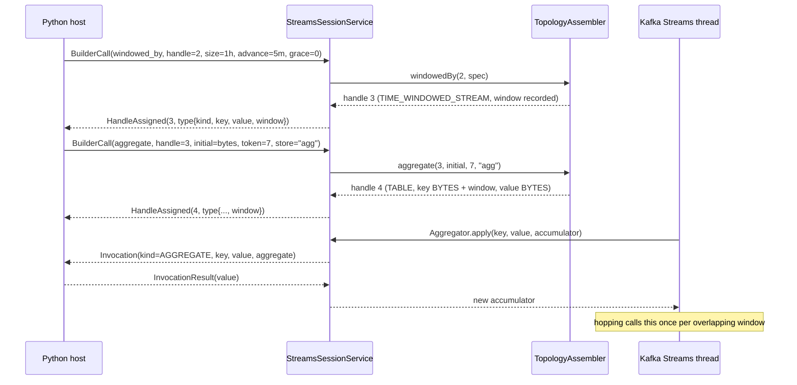
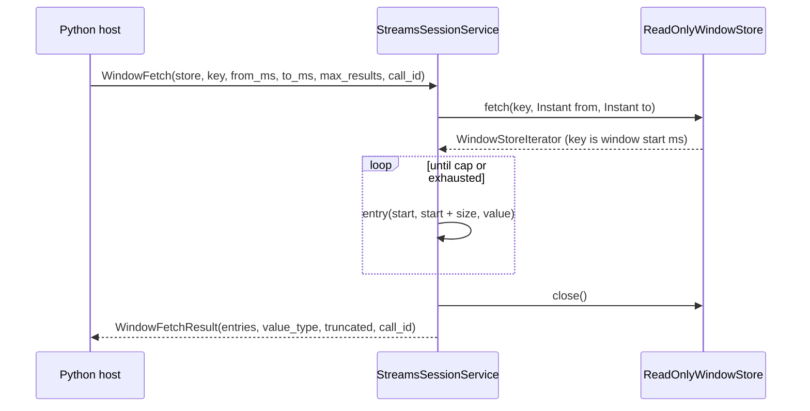
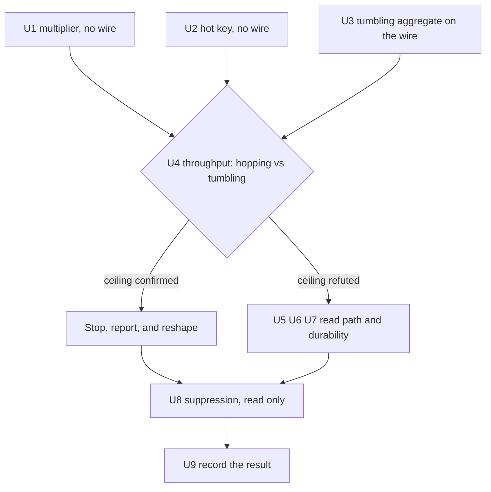

# Windowed Aggregation as a Falsification Spike for the Streams Wrapper - Plan

## Goal Capsule

- **Objective:** find out whether wrap-rather-than-reimplement breaks on windowing. Dimension 4 of `docs/inflight/streams-coupling-dimensions.md` predicts windowing is the dimension most likely to force a wire redesign. This plan is the experiment that settles it, not a feature delivery. The work belongs to the language-proxy workstream tracked as astubbs#242, which commit subjects reference.
- **The question, stated so it can come out no:** a hopping window calls the aggregator once per overlapping window, every aggregator call is a boundary crossing, and every crossing serialises through one lock. If that arithmetic holds under measurement, a foreign-language Kafka Streams cannot run a hopping windowed aggregation at a useful rate, and the surface below U4 is not worth designing.
- **Authority:** this plan; where it is silent, `AGENTS.md`, `docs/investigating.md` for method, and the existing streams module's conventions. The v1alpha1 proto declares itself unfrozen in its own header and may be reshaped; the frozen v1 wire may not be touched.
- **Stop conditions:** stop and report at the end of U1 if the aggregator-call multiplier does not appear, and at the end of U4 if the throughput ratio confirms the ceiling. Both outcomes reshape the rest of the plan rather than ending it, and both are results. Do not push, do not open a PR, do not post to GitHub.
- **Execution profile:** commit each unit as it lands, subject style `feat(streams) astubbs#242: <subject>`, measurement and documentation units `docs(streams) astubbs#242: <subject>`. Bodies carry the prediction, what ran, and what came out.
- **Tail ownership:** the implementer owns the write-up. A unit that measures is not done when the code compiles; it is done when its result, refuted predictions included, is written into the notes named in U9.

---

## Product Contract

### Summary

Build the smallest windowed aggregation that can cross the boundary, then measure whether it can run. Two experiments that need no new surface run first: the aggregator-call multiplier under tumbling versus hopping windows, and single-hot-key throughput through the existing `reduce` operator. Then a minimum tumbling windowed aggregate goes on the wire, hopping windows follow, and the throughput arms decide the question. Windowed keys are decomposed on the JVM into inner key plus window start and end. Range reads over a windowed store answer with one bounded, capped response. Session windows and suppression are out; suppression is examined by reading the Kafka sources instead of building it.

### Problem Frame

The wrapper has proved five coupling dimensions and never touched windowing. `docs/inflight/streams-coupling-dimensions.md` ranks windowing as the one most likely to force a wire redesign rather than an addition, and names three reasons: a windowed key is composite against a flat `DataType`, `fetch(key, from, to)` is a range query where `Get` is point-only, and stream time is an engine notion the host cannot see.

The measurements say the risk is elsewhere and larger. The crossing costs about 150us wall and 232us CPU (`docs/inflight/perf-crossing-is-cpu-and-serialised.md`), splits into about 120us fixed plus 6.5us per KB (`docs/inflight/perf-crossing-fixed-versus-per-byte.md`), and every crossing serialises through one `transmitLock` in `parallel-consumer-proxy-streams/src/main/java/bz/stub/parallelconsumer/streams/StreamsSessionService.java`. Threads plateau at 1.5x. One lock at 120us fixed is about 8,300 crossings per second for the whole JVM whatever the core or partition count, and the measured plateau is about 9,500 records per second at eight threads.

A hopping window multiplies aggregator calls by `ceil(size / advance)`: twelve for a one-hour window advancing every five minutes. Twelve crossings per record against a JVM-wide ceiling of roughly 8,300 is about 690 records per second. The usual cure is unavailable: caching and `suppress` deduplicate downstream emits after the aggregator has already run, so neither reduces aggregator calls.

There is no prior art to borrow from. Beam crosses in bundles and gives the SDK all three lifted-combine stages because accumulators are opaque to the runner; PyFlink added embedded-CPython thread mode in FLIP-206 because the process-mode crossing cost was unacceptable; PySpark keeps state JVM-side and ships Arrow batches per group. No system does a synchronous per-record crossing, and no non-JVM Kafka Streams with foreign user functions exists at all. The Python ecosystem reimplemented (Faust, Quix Streams) or rewrote in Rust with in-process Python (Bytewax). That absence is evidence about the shape of the problem, not a gap in the search.

### Requirements

**Falsification method**

- R1. Every experiment records its prediction in the tree before it runs, and the write-up reports refuted predictions as prominently as confirmed ones.
- R2. Every throughput experiment carries a control arm that changes exactly one term and holds everything else identical.
- R3. Every result reports the rate, the run count, the spread and the conditions. A bare verdict is not a result.
- R4. Every experiment proves its instrument could have produced the positive answer before a negative answer is believed.

**Windowing on the wire**

- R5. A window specification travels as size, advance and grace in milliseconds, all three always present. Tumbling is advance equal to size.
- R6. A windowed handle reports its window through an optional structured field beside the flat `DataType` enums, and the handle store records it alongside the node. No second map keyed by handle.
- R7. A windowed key that crosses the wire is decomposed into inner key, window start milliseconds and window end milliseconds as separate fields.
- R8. An aggregate invocation names its kind explicitly and carries the plain key, the record value and the current accumulator.
- R9. The initializer never crosses the wire. The host supplies its value once, at build time.

**Engine behaviour**

- R10. The operator is `aggregate`, not `reduce`, so the first value for a key reaches the host function.
- R11. Windows are constructed with `ofSizeWithNoGrace` or `ofSizeAndGrace`. The deprecated `TimeWindows.of` and `TimeWindows.grace` path is never used.
- R12. Sinking a windowed table is refused, naming the handle and what it is.
- R13. Every store iterator is closed on every path, including the error path.
- R14. A reverse-order read is refused by name rather than calling a `backward` method.

**Read path**

- R15. A range read answers with one bounded, materialised response carrying an explicit cap and a truncation flag.
- R16. Every query failure answers with an error on the response, never a session fault.

**Host client**

- R17. The Python client exposes the two builder calls and a windowed fetch that returns entries of window start, window end and a value decoded from the reported type.
- R18. Python protobuf stubs are regenerated and committed in the same commit as the proto change.

**Record**

- R19. Dimension 4 of the coupling register carries this spike's result, including anything it refuted.
- R20. The `TopologyTestDriver`-as-oracle proposal is qualified with the caching bias this spike measures.

### Scope Boundaries

**Outside this spike, with the reason**

- **Session windows.** Merge cascades are unbounded and data dependent, so the aggregator-call multiplier stops being a number that can be predicted from the window specification. The whole point of U1 and U4 is to bound the multiplier; a window type whose multiplier cannot be bounded cannot be measured against a ceiling.
- **Suppression, as built surface.** Examined by reading the Kafka 3.9.2 sources in U8 and written up. Two facts drive the exclusion: `suppress(untilWindowCloses(...))` statically requires a `StrictBufferConfig` and `unbounded()` grows until the JVM dies, and the suppress processor schedules no punctuator, so emission is driven only by records arriving and raising stream time. A quiet partition never emits its final window, which a host cannot distinguish from a stuck engine.
- **The record timestamp, and stream time generally.** Not absorbed into this spike. `TopologyTestDriver` accepts explicit event times through `createInputTopic(name, keySerializer, valueSerializer, Instant, Duration)` and `pipeInput(key, value, Instant)`, and decomposed window bounds give the host time information on the read path. The consequence is a real limit and is stated rather than hidden: **the host cannot make time-dependent decisions inside a function.** Record metadata is dimension 3 of the register and has its own note, `docs/inflight/next-serialization-and-record-metadata.md`.
- **Sinking a windowed table.** Refused by R12 rather than encoded. See KTD10.
- **The crossing optimisation work.** Stays parked under `docs/inflight/perf-streams-crossing-optimisation.md`. U2 tests whether it could help a windowed aggregation at all, which is a question about the parked work, not a resumption of it.
- **Bindings other than Python.** Extending this to the other languages is owned by `docs/inflight/test-cross-binding-streams-conformance.md`.
- **Exactly-once, punctuators, one record in and many out, engine state signals.** Other dimensions of the register, each with its own rank.

**Prerequisites, already landed on this branch**

- Query and describe correlation, and the move of registered functions off the Python reader thread. Both landed on this branch, in that order, and the write-up is `docs/solutions/architecture-patterns/one-answer-slot-for-many-callers-is-a-correlation-bug.md`. U5 depends on the first and U2 on the second; neither is re-derived here.

---

## Planning Contract

### Key Technical Decisions

- KTD1. **The falsifier leads.** (session-settled: user-directed - chosen over building the windowing surface first: if the ceiling is real, most of the surface is not worth designing.) U1 and U2 need no new code at all, and U4 is the decisive arm. The read path, restore behaviour and accumulator growth are all downstream of a yes.
- KTD2. **Windowed keys are decomposed on the JVM.** (session-settled: user-directed - chosen over shipping Kafka's byte layout opaque for the host to decode: the layout is internal and undeclared.) `TimeWindowedSerializer` produces `[inner key bytes][8-byte big-endian window start]`, the window end is not on the wire and is reconstructed as `start + windowSize`, and the layout comes from `WindowKeySchema` in an internal package that no KIP declares as a contract. The changelog layout is different again, `[key][8-byte timestamp][4-byte sequence number]`, so a host taught one layout would be wrong about the other. The engine splits the key and sends inner key, start and end as fields. Governs R7.
- KTD3. **A range read materialises into one bounded response with an explicit cap.** (session-settled: user-directed - chosen over a streamed iterator held open across the wire: the store-lock question is unsettled.) The engine drains the iterator to the cap, closes it, and answers once, setting a truncation flag when the range held more. The streaming design and the question it depends on are recorded as an open experiment, not built. Governs R15.
- KTD4. **The missing record timestamp is not absorbed into this spike.** (session-settled: user-directed - chosen over adding record metadata to the invocation: it is a separate dimension with its own note.) Recorded as a scope boundary with its consequence stated: the host cannot make time-dependent decisions inside a function.
- KTD5. **Tumbling and hopping are both in scope; hopping is required, not optional.** (session-settled: user-directed - chosen over tumbling alone: hopping is what makes the multiplier real, and the multiplier is the falsifier.) Session windows are out for the reason in Scope Boundaries.
- KTD6. **The spike builds on the landed query correlation and reader-thread fix, and leaves the crossing optimisation parked.** (session-settled: user-directed - chosen over folding bundling into this work: it optimises a proof that has not yet proved the concept.) Both fixes are on this branch, so U5's correlated range read and U2's off-reader-thread dispatch are given, not conditions.
- KTD7. **The windowed type is an optional structured field beside the flat `DataType` enums, and the handle store is re-keyed rather than paralleled.** This is the growth path the typed-handles plan already recorded: `docs/plans/2026-08-24-001-feat-streams-typed-handles-plan.md` KTD2 says that when a windowed operator arrives, an optional structured field is added beside `DataType`, and its KTD3 forbids a second map keyed by handle. A recursive `TypeSpec` was considered and rejected there. That decision binds here. `TopologyAssembler.Minted` already holds node plus `HandleType`, so the window rides on `HandleType`. Governs R6.
- KTD8. **The operator is `aggregate` and the initializer is captured once as bytes.** `reduce` is implemented in Kafka as an aggregate whose initializer returns null and whose aggregator bypasses the reducer while the accumulator is null, which is exactly why this project's `reduce` never calls the host for a key's first value (`parallel-consumer-proxy-streams/src/test/java/bz/stub/parallelconsumer/streams/TopologyAssemblerTest.java`, `theFirstValueForAKeyNeverReachesTheReducer`). `Initializer` is zero-arg and pure, so it never needs to cross: the host sends one `byte[]` on the builder call and the engine hands out a defensive copy per call. A shared array would alias, because the initializer runs once per new window per key. Governs R9, R10.
- KTD9. **Two builder calls, not one fused call.** `windowed_by` takes a grouped-stream handle and a window specification and mints a time-windowed stream; `aggregate` takes that handle, the initializer bytes, a function token and a store name, and mints a windowed table. This is the replay-the-builder model the PoC established, it adds exactly one `HandleKind` member, and it keeps the window specification in one place where the store, the read path and the sink refusal can all read it back.
- KTD10. **Sinking a windowed table is refused, not encoded.** Writing one requires putting a windowed key on a topic, which means either shipping `WindowKeySchema`'s internal layout to the host (refused by KTD2) or inventing an encoding that is not Kafka's, which would make the sink topic unreadable by every other Kafka Streams consumer. The windowed table is read through the range read instead. Recorded in Open Questions with the two candidate designs. Governs R12.
- KTD11. **`TopologyTestDriver` is the unit oracle, with its bias stated.** TTD disables caching, so it emits every intermediate update and a conformance expectation recorded against it systematically under-counts messages versus a broker-backed run. Aggregator *call* counts are unaffected by caching, which is why U1 asserts calls rather than emits, and why the caching arm of the multiplier question can only be answered on a broker in U4. This qualifies the TTD-as-oracle proposal in `docs/inflight/test-cross-binding-streams-conformance.md`. Governs R20.
- KTD12. **The deprecated window constructors are banned outright.** `Windows.until` no longer exists, and `TimeWindows.of` with `.grace` is deprecated in favour of `ofSizeWithNoGrace` and `ofSizeAndGrace`. The deprecated path silently gives `max(24h - size, 0)` grace while the new path gives zero, so the two differ in behaviour and not only in style. Governs R11.
- KTD13. **Any test that reads a windowed topic uses the two-argument `TimeWindowedDeserializer`.** In 3.9.2 it throws if the window size is set both in the constructor and in `window.size.ms`, and throws if it is set in neither. The single-argument constructor and `WindowedSerdes.timeWindowedSerdeFrom(Class)` are deprecated.
- KTD14. **One measurement harness, four experiments.** The broker-backed arms live in one new Python script with an experiment selector, reusing `parallel-consumer-proxy-clients/parallel-consumer-proxy-client-python/demo/demo_kafka.py` and `demo/demo_options.py` rather than copying their setup. Four sibling scripts would drift, and the crossing measurements already established the method constraints these arms must share.

### High-Level Technical Design

The build path and the invocation path. Two builder calls mint the windowed table; the aggregate invocation reuses the fields `Invocation` already carries, so the hot path needs no new wire field at all.

The read path. The engine decomposes each windowed key, drains the iterator to the cap, closes it, and answers once.

### Sequencing

U1 and U2 need no new code and can run in either order or together. U3 is an instrument, not an experiment, and exists only to make U4 possible. Everything below U4 is gated on U4's answer.

### Assumptions

- Kafka Streams 3.9.2 is the version every API fact here was verified against, from the sources jar. A version bump invalidates the facts, not the method.
- A concurrent workstream has been editing `streams.proto`, the Java engine and the Python client on this branch. U3 onwards starts from that work rather than forking the wire; check the branch's head before writing to any of the three.
- Java protobuf classes are generated at build time by Maven; Python stubs are committed and regenerated by `parallel-consumer-proxy-clients/parallel-consumer-proxy-client-python/tools/generate_proto.py`, and drift fails `make proto-check`.
- The broker-backed arms run on a quiet machine. The three prior crossing measurements each depended on that and said so.

---

## Implementation Units

### U1. The aggregator-call multiplier, with no wire involved

- **Goal:** establish how many times Kafka Streams calls an aggregator per record under a tumbling window, under a hopping window, and with `suppress` attached. This is the cheapest decisive experiment in the plan and it touches nothing.
- **Requirements:** R1, R2, R3, R4, R11, R20.
- **Dependencies:** none.
- **Files:** `parallel-consumer-proxy-streams/src/test/java/bz/stub/parallelconsumer/streams/WindowedAggregatorCallCountTest.java` (new). <!-- file-refs: N/A - a file this unit creates -->
- **Approach:** build the topologies directly against `StreamsBuilder`, not through `TopologyAssembler`, so this unit runs before any wire work exists. The aggregator is a counting `Aggregator<byte[], byte[], byte[]>` over an `AtomicInteger`. Feed a fixed record count with explicit event times through `createInputTopic(name, keySerializer, valueSerializer, Instant, Duration)`. Construct windows with `TimeWindows.ofSizeAndGrace` only (KTD12). Read state with `getWindowStore(String)` while the driver is open, because `TopologyTestDriver.close()` deletes the state directory and has produced a green test asserting nothing in this module before.
- **Predictions, recorded before the run:**
  1. Tumbling one hour: aggregator calls equal the record count exactly.
  2. Hopping one hour advancing five minutes: aggregator calls equal twelve times the record count, which is `ceil(size / advance)`.
  3. Adding `suppress(untilWindowCloses(Suppressed.BufferConfig.maxRecords(n).shutDownWhenFull()))` leaves the aggregator call count unchanged and reduces only downstream emits.
  4. `advanceWallClockTime(Duration)` does not close a window, because it does not advance stream time; only a later record's timestamp does.
- **What would falsify:** prediction 2 coming out near one call per record. If Kafka lifts hopping aggregation rather than calling per overlapping window, the ceiling arithmetic in the Problem Frame collapses, U4 stops being decisive, and the rest of this plan is much cheaper than it looks.
- **Test scenarios:**
  1. Input: 100 records over one key with event times one minute apart. Action: tumbling one-hour window, grace zero. Expected: exactly 100 aggregator calls.
  2. Input: the same 100 records. Action: hopping one-hour window advancing five minutes, grace zero. Expected: exactly 1,200 aggregator calls.
  3. Input: the same 100 records. Action: hopping one hour advancing one hour, which is the control arm changing only the advance. Expected: exactly 100 aggregator calls, matching scenario 1.
  4. Input: the same 100 records. Action: scenario 2's topology with `suppress(untilWindowCloses(...))` on the output. Expected: 1,200 aggregator calls, and strictly fewer downstream records than scenario 2 produced.
  5. Input: one record, then `advanceWallClockTime(Duration.ofDays(1))`. Action: read the output topic. Expected: nothing emitted for a closed window, proving wall clock does not advance stream time.
  6. Input: a record older than `windowCloseTime`, which is `observedStreamTime - gracePeriodMs`. Action: pipe it after stream time has advanced past the grace. Expected: the aggregator is not called for it and the late-record sensor accounts for it.
- **Instrument check (R4):** invert scenario 3's expectation by setting the advance to five minutes and confirm it fails at 1,200 rather than passing at 100. A call counter that cannot move is not a counter. Record the sabotage used.
- **Recorded limitation:** TTD disables caching, so no arm of this unit can say anything about caching's effect on emits. That question moves to U4's broker arm, and this unit's write-up states it rather than leaving a reader to infer the arms were equivalent.
- **Verification:** the three call counts are established by observation, with the Kafka version named, and written into the note U9 owns.

---

### U2. Single-hot-key throughput, also with no wire changes

- **Goal:** find out whether an aggregation over one hot key can be rescued by anything the parked bundling work offers. An aggregation is a serial dependency, because accumulator `n+1` needs accumulator `n`, so it cannot be batched across a hot key the way Beam batches independent elements.
- **Requirements:** R1, R2, R3, R4.
- **Dependencies:** none. Uses the existing `reduce` operator, which is already a per-key serial dependency across the boundary.
- **Files:** `parallel-consumer-proxy-clients/parallel-consumer-proxy-client-python/demo/streams_windowing_lab.py` (new, experiment `hot-key`), reusing `parallel-consumer-proxy-clients/parallel-consumer-proxy-client-python/demo/demo_kafka.py` and `parallel-consumer-proxy-clients/parallel-consumer-proxy-client-python/demo/demo_options.py`. <!-- file-refs: N/A - streams_windowing_lab.py is a file this unit creates -->
- **Approach:** two arms at identical record count, payload size, partition count and stream-thread count. Arm A sends every record under one key. Arm B spreads records over enough distinct keys to occupy every partition. Both run `groupByKey().reduce(<host function>)`. Interleave the arms rather than running them in order, sweep record count and take the slope so fixed warm-up cancels, and read throughput from the broker's log-append clock. These constraints are not new: `docs/inflight/perf-crossing-is-cpu-and-serialised.md` and `docs/inflight/perf-crossing-fixed-versus-per-byte.md` each established them, and each cost an experiment to learn.
- **Predictions, recorded before the run:**
  1. Arm A lands near the single-thread ceiling of 6,500 to 7,000 invocations per second, because one key means one partition means one stream thread.
  2. Arm B lands near 9,500 records per second, the measured eight-thread plateau, not eight times arm A.
  3. The achievable bundle size for arm A is one, by construction: the next record for a key cannot be sent until the previous accumulator returns.
- **What would falsify:** arm B scaling close to linearly with threads. That would mean the `transmitLock` is not the whole ceiling and per-key concurrency buys real throughput, which reopens both bundling and the one-session-per-stream-thread option listed as unmeasured in `docs/plans/2026-08-24-002-feat-streams-invocation-bundling-plan.md`.
- **Test scenarios:**
  1. Input: 20,000 records, 1 KB payloads, one key, eight partitions. Action: run arm A. Expected: throughput within the single-thread band, reported with run count and spread.
  2. Input: 20,000 records, 1 KB payloads, 8,000 keys, eight partitions. Action: run arm B. Expected: throughput near the eight-thread plateau, and strictly less than four times arm A.
  3. Input: both arms at three record counts. Action: sweep and take the slope. Expected: per-record cost stable across the sweep, which is what proves warm-up cancelled.
  4. Input: arm A with the host function artificially slowed by 1 ms. Action: rerun. Expected: throughput falls by roughly the added delay per record, proving the harness measures what it claims to.
- **Instrument check (R4):** scenario 4 is the instrument check. A harness whose number does not move when the host function slows down is measuring something else.
- **Verification:** both rates written into the note U9 owns, with run counts, spread, machine, thread count and partition count, and an explicit statement of whether prediction 2 held.

---

### U3. The minimum windowed aggregate on the wire, tumbling only

- **Goal:** make a foreign windowed aggregation possible at all, in the smallest form U4 can measure. This unit is the instrument, and it carries one falsifier of its own.
- **Requirements:** R5, R6, R7, R8, R9, R10, R11, R12, R17, R18.
- **Dependencies:** U1 for the call-count expectation the tests assert against.
- **Files:** `parallel-consumer-proxy-streams/src/main/proto/parallelconsumer/streams/v1alpha1/streams.proto`; `parallel-consumer-proxy-streams/src/main/java/bz/stub/parallelconsumer/streams/TopologyAssembler.java`; `parallel-consumer-proxy-streams/src/main/java/bz/stub/parallelconsumer/streams/StreamsSessionService.java`; `parallel-consumer-proxy-streams/src/main/java/bz/stub/parallelconsumer/streams/ForeignAggregator.java` (new); `parallel-consumer-proxy-streams/src/main/java/bz/stub/parallelconsumer/streams/ForeignCall.java`; tests `parallel-consumer-proxy-streams/src/test/java/bz/stub/parallelconsumer/streams/TopologyAssemblerTest.java`, `parallel-consumer-proxy-streams/src/test/java/bz/stub/parallelconsumer/streams/StreamsSessionServiceTest.java`, `parallel-consumer-proxy-streams/src/test/java/bz/stub/parallelconsumer/streams/StreamsProtocolRoundTripTest.java`, `parallel-consumer-proxy-streams/src/test/java/bz/stub/parallelconsumer/streams/ForeignBridgeTest.java`; Python `parallel-consumer-proxy-clients/parallel-consumer-proxy-client-python/src/parallel_consumer/streams/_session.py`, `parallel-consumer-proxy-clients/parallel-consumer-proxy-client-python/src/parallel_consumer/streams/__init__.py`, regenerated `parallel-consumer-proxy-clients/parallel-consumer-proxy-client-python/src/parallel_consumer/_generated/streams_pb2.py` and `parallel-consumer-proxy-clients/parallel-consumer-proxy-client-python/src/parallel_consumer/_generated/streams_pb2.pyi`; tests `parallel-consumer-proxy-clients/parallel-consumer-proxy-client-python/tests/test_streams_session.py`, `parallel-consumer-proxy-clients/parallel-consumer-proxy-client-python/tests/test_streams_windowing.py` (new). <!-- file-refs: N/A - ForeignAggregator.java and test_streams_windowing.py are files this unit creates -->
- **Approach:**
  1. Proto: two new `BuilderCall` oneof members, `WindowedBy { handle, TimeWindowSpec window }` and `Aggregate { handle, bytes initial, function_token, store_name }`, with `TimeWindowSpec { size_ms, advance_ms, grace_ms }`, all three always set (R5). Add `HANDLE_KIND_TIME_WINDOWED_STREAM` to `HandleKind`, and an optional `TimeWindowSpec window` field on `HandleType` per KTD7. Add `INVOCATION_KIND_AGGREGATE` to `InvocationKind`; the aggregate invocation reuses `key`, `value` and `aggregate`, so no new invocation field is needed. Comment each addition in the file's existing voice, including why the window rides on `HandleType` rather than on a parallel map.
  2. Engine: `TopologyAssembler.windowedBy` resolves a grouped-stream handle, applies `TimeWindows.ofSizeAndGrace` (KTD12), and mints a time-windowed stream recording the specification on its `HandleType`. `TopologyAssembler.aggregate` resolves that handle and calls `aggregate(initializer, aggregator, Materialized)` where the initializer returns a defensive copy of the captured bytes (KTD8) and the store serdes come from the recorded type, exactly as `count` and `reduce` already do.
  3. `ForeignAggregator` is the fourth `Foreign*` bridge, one per Kafka functional interface, minted through the existing `ForeignCall` factory. It implements `Aggregator<byte[], byte[], byte[]>` and sends `INVOCATION_KIND_AGGREGATE`.
  4. Session: add the two arms to the `onBuilderCall` switch. The switch is an expression on purpose, so a new arm cannot forget its mint; keep it that way.
  5. `sink` gains a refusal for a handle whose recorded type carries a window (R12), naming the handle and what it is, in protocol vocabulary rather than a Kafka implementation class name.
  6. Python: `TopologyBuilder.windowed_by` and `TopologyBuilder.aggregate`, a `FunctionKind.AGGREGATE` member, an `AggregatorFunction` type of three bytes arguments returning bytes, and an arm in `_leading_argument` for the new kind. Export the new names.
  7. Regenerate the stubs with `tools/generate_proto.py` and commit them in the same commit (R18).
- **What would falsify:** needing anything other than additive changes. The typed-handles plan's KTD2 claims a windowed type is an additive structured field beside the enum, and the PoC's kill criterion says a new operator is a new `oneof` member. If the windowed key forces a reshape of `HandleAssigned`, of `Invocation`, or of the handle store into a second map, then windowing does force a wire redesign, dimension 4's prediction was right, and that is the result.
- **Test scenarios:**
  1. Input: a `HandleAssigned` carrying a `HandleType` with a `TimeWindowSpec`. Action: serialize and parse. Expected: kind, both data types and all three window fields survive intact.
  2. Input: a grouped-stream handle. Action: `windowedBy` with size one hour, advance one hour, grace zero. Expected: a handle of kind time-windowed stream whose recorded type carries the specification.
  3. Input: a time-windowed stream handle. Action: `aggregate` with initializer bytes, a token and a store name. Expected: a table handle whose recorded type carries the window and whose value type is bytes.
  4. Input: `windowedBy` applied to a stream handle and to a table handle. Action: each call. Expected: refused, naming the recorded kind in protocol vocabulary, not `KStreamImpl` or `KGroupedStreamImpl`.
  5. Input: a windowed table handle. Action: `sink`. Expected: refused, naming the handle and that it carries a windowed key (R12).
  6. Input: three records under one key through `TopologyTestDriver`, with a host aggregator that appends. Action: read the window store while the driver is open. Expected: the first value for the key reached the host function, which is the behaviour `reduce` cannot give (R10).
  7. Input: two distinct keys, each opening a new window. Action: mutate the accumulator array in place inside the host aggregator. Expected: the second key's initial accumulator is unaffected, proving the defensive copy (KTD8).
  8. Input: a builder call whose `TimeWindowSpec` omits `advance_ms`. Action: send it. Expected: refused by name, because R5 requires all three fields.
  9. Input: a session-level `aggregate` builder call. Action: read the `HandleAssigned`. Expected: it carries the type including the window; a `sink` answer still carries neither type nor handle.
  10. Python, input: a `FakeEngine` answering the two new calls. Action: drive the builder. Expected: the returned handle exposes the window, and the existing five-call test still passes unmodified.
  11. Python, input: an `Invocation` of kind aggregate. Action: dispatch it. Expected: the registered three-argument function receives key, value and accumulator in that order, and its result returns as the value.
  12. Python, input: an `Invocation` of kind aggregate naming an unregistered token. Action: dispatch it. Expected: an error answer, matching the existing single-record behaviour, not a drop.
- **Instrument check (R4):** make `FakeEngine` attach a window specification with the advance and size transposed and confirm the type assertion fails. The Python harness answers synchronously and has hidden dead assertions in this module twice before. Red-proof the defensive-copy test by removing the copy and confirming scenario 7 fails.
- **Verification:** the Java module suite and the Python lint, test and proto-check gates are green; `grep` confirms no second map keyed by handle was introduced.

---

### U4. Hopping windows and the throughput falsifier

- **Goal:** settle the plan's question. Measure a foreign windowed aggregation under a tumbling window and under a hopping window of the same size, under identical load, and see whether throughput falls by the multiplier.
- **Requirements:** R1, R2, R3, R4, R5.
- **Dependencies:** U1 (the expected multiplier), U2 (whether key spread rescues anything), U3 (the instrument).
- **Files:** `parallel-consumer-proxy-clients/parallel-consumer-proxy-client-python/demo/streams_windowing_lab.py` (experiment `multiplier`); `parallel-consumer-proxy-streams/src/main/java/bz/stub/parallelconsumer/streams/ForeignAggregator.java` (invocation counter for the instrument check). <!-- file-refs: N/A - both files are created by U2 and U3 -->
- **Approach:** hopping needs no new wire surface, because `advance_ms` already exists from U3. That is itself a finding worth stating: hopping is free on the wire and expensive on the crossing. Three arms at identical record count, payload size, key count, partition count and thread count.
  - Arm A: tumbling one hour, that is advance equal to size.
  - Arm B: hopping one hour advancing five minutes, a multiplier of twelve.
  - Arm C, the control: hopping one hour advancing one hour. Same builder call, same operator, same store, same code path as B, with exactly one term changed.
  Interleave the arms, sweep record count and take the slope, read throughput from the broker's log-append clock, run on a quiet machine.
- **Predictions, recorded before the run:**
  1. Arm A lands near the measured plateau of about 9,500 records per second at eight threads.
  2. Arm B lands between 600 and 900 records per second, that is arm A divided by roughly twelve.
  3. Arm C matches arm A within measurement spread, proving the drop belongs to the advance and not to the hopping code path.
  4. Arm B's engine-side invocation counter reads twelve times its record count.
- **What would falsify:** arm B landing within a factor of two of arm A. That would mean the multiplier does not reach the crossing, the `transmitLock` ceiling is not the binding constraint for windowed aggregation, and windowing is a surface problem rather than a throughput one.
- **Exit criterion, as a number:** the ratio of arm B throughput to arm A throughput. A ratio between 1/16 and 1/9 confirms the ceiling. A ratio above 1/2 refutes it. Anything between is reported as inconclusive with the spread, and neither branch of the plan is taken on it.
- **Test scenarios:**
  1. Input: 20,000 records, 1 KB payloads, eight partitions, eight stream threads. Action: run arm A. Expected: throughput reported with run count and spread.
  2. Input: the same load. Action: run arm B. Expected: throughput near arm A divided by twelve, and the engine-side counter reading twelve calls per record.
  3. Input: the same load. Action: run arm C. Expected: throughput matching arm A, and the counter reading one call per record.
  4. Input: arm B with caching enabled and disabled on the broker run. Action: compare aggregator call counts. Expected: identical call counts and different downstream emit counts, which is the broker-side half of U1's caching question and confirms caching does not reduce crossings.
  5. Input: arm B with `suppress(untilWindowCloses(...))` attached. Action: compare aggregator call counts to scenario 2. Expected: identical, and fewer emits.
  6. Input: all three arms at three record counts each. Action: sweep and take the slope. Expected: per-record cost stable across the sweep.
- **Instrument check (R4):** the engine-side invocation counter must be read in every arm. An arm reporting a throughput drop without a matching rise in the call count is measuring something other than the multiplier, and an arm reporting no drop while the counter shows twelve calls per record is the interesting case, not a null result. Confirm the counter moves by running arm C, where it must read one.
- **Verification:** the ratio, the arms' rates, the run counts, the spread and the conditions are written into the note U9 owns, with the exit criterion applied explicitly and prediction 2 marked confirmed or refuted.

---

### U5. Windowed range reads, bounded and capped

- **Goal:** let a host read a windowed store, with decomposed window bounds and one bounded answer.
- **Requirements:** R7, R13, R14, R15, R16, R17.
- **Dependencies:** U3. Gated on U4 not refuting the approach.
- **Files:** `parallel-consumer-proxy-streams/src/main/proto/parallelconsumer/streams/v1alpha1/streams.proto`; `parallel-consumer-proxy-streams/src/main/java/bz/stub/parallelconsumer/streams/StreamsSessionService.java`; `parallel-consumer-proxy-streams/src/main/java/bz/stub/parallelconsumer/streams/TopologyAssembler.java`; tests `parallel-consumer-proxy-streams/src/test/java/bz/stub/parallelconsumer/streams/InteractiveQueryTest.java`, `parallel-consumer-proxy-streams/src/test/java/bz/stub/parallelconsumer/streams/WindowedStoreQueryTest.java` (new); Python `parallel-consumer-proxy-clients/parallel-consumer-proxy-client-python/src/parallel_consumer/streams/_session.py`, `parallel-consumer-proxy-clients/parallel-consumer-proxy-client-python/src/parallel_consumer/streams/__init__.py`, `parallel-consumer-proxy-clients/parallel-consumer-proxy-client-python/tests/test_streams_windowing.py`. <!-- file-refs: N/A - WindowedStoreQueryTest.java and test_streams_windowing.py are created by this unit and U3 -->
- **Approach:**
  1. Proto: `WindowFetch { store_name, key, from_ms, to_ms, max_results, call_id }` and `WindowFetchResult { repeated WindowedEntry entries, DataType value_type, bool truncated, string error, call_id }`, with `WindowedEntry { window_start_ms, window_end_ms, value }`. The entry carries no key because the query is keyed; a range over keys would need one and is out of scope. `call_id` follows the correlation contract the branch has just landed for `Get` and `Describe`.
  2. Engine: query with `QueryableStoreTypes.windowStore()`. In 3.9.2 `ReadOnlyWindowStore` is `Instant`-based only, so `fetch(key, Instant, Instant)` returns a `WindowStoreIterator<V>`, which extends `KeyValueIterator<Long, V>` where the key is the window start in milliseconds. The end is `start + size`, and the size comes from the specification the store's handle recorded in U3, which is why that specification had to be stored rather than passed through.
  3. Drain to `max_results`, capped by the engine's own ceiling, set `truncated` when the iterator still had entries, and close the iterator in a `try`-with-resources so it closes on the error path too (R13). Not closing leaks the RocksDB iterator and its snapshot, pinning SST files and blocking compaction.
  4. All `backward` methods on `ReadOnlyWindowStore` are defaults that throw `UnsupportedOperationException` in 3.9.2. Do not call them; a request for reverse order is refused by name (R14).
  5. Answer rather than fault on every failure: unknown store, topology not running, a non-windowed store queried as windowed, `from_ms` after `to_ms`, a negative or zero cap (R16). This is the pattern the interactive-query work already set.
  6. Python: a `window_fetch` method returning a sequence of entries, each decoding its value through the reported `DataType`, and a truncation flag the caller can see.
- **What would falsify:** two things. First, if the drain cannot be performed without holding a store lock that blocks a stream thread, the bounded-response design fails and streaming becomes mandatory rather than optional. Second, if the response's service time scales with the store's size rather than with the cap, the cap is decorative and the read path cannot be bounded at all.
- **Test scenarios:**
  1. Input: a key with five windows in the store. Action: fetch the full time range with a cap of ten. Expected: five entries, each with start, end equal to start plus size, and the value; `truncated` false.
  2. Input: the same store. Action: fetch with a cap of two. Expected: two entries, `truncated` true, and the two earliest windows in the range.
  3. Input: a range covering no window. Action: fetch. Expected: zero entries, `truncated` false, no error.
  4. Input: an unknown store name. Action: fetch. Expected: an error on the response naming the store, and the session still usable for the next call.
  5. Input: `from_ms` greater than `to_ms`. Action: fetch. Expected: an error naming the problem, not an empty success.
  6. Input: a point-lookup store built by `count`. Action: fetch it as a windowed store. Expected: an error naming the store's kind.
  7. Input: a fetch that throws partway through the drain, injected through a test seam. Action: observe the iterator. Expected: closed exactly once, proving the error path closes it (R13).
  8. Input: a fetch requesting reverse order. Action: send it. Expected: refused by name, with no `backward` call attempted.
  9. Input: an in-flight aggregate invocation and a concurrent fetch of a large capped range. Action: measure the invocation's completion latency. Expected: the added delay tracks the cap, not the store size. `onGet` runs on the gRPC transport thread and gRPC serialises a single stream's inbound callbacks, so a long read delays every in-flight invocation; this scenario is what bounds it.
  10. Python, input: a `WindowFetchResult` with entries of a long value type. Action: read them. Expected: each value decoded through the reported type, with start and end exposed as integers.
- **Instrument check (R4):** for scenario 7, remove the `try`-with-resources and confirm the closure assertion fails. For scenario 9, run the same measurement with no concurrent fetch and confirm the latency is lower, so a null result is not a harness that never observed the coupling.
- **Verification:** the Java module suite, the Python gates and `make proto-check` are green; scenario 9's delay is reported as a number with the cap it was measured at.

---

### U6. Restore idempotency: is the aggregator called again?

- **Goal:** find out whether a host aggregator can be called more than once for the same record after an unclean stop, and therefore whether the host's function has to be told that.
- **Requirements:** R1, R2, R3, R4.
- **Dependencies:** U3. Gated on U4.
- **Files:** `parallel-consumer-proxy-clients/parallel-consumer-proxy-client-python/demo/streams_windowing_lab.py` (experiment `restore`). <!-- file-refs: N/A - created by U2 -->
- **Approach:** the original framing of this hypothesis was that a slow host breaches `max.poll.interval.ms` and triggers a rebalance. **That framing was already refuted by the PoC**, which found that a 300 ms transform against a 5 s interval kept the group `STABLE` for all 78 samples because Kafka Streams interleaves its polling; the real symptom was throughput collapse, not eviction (`docs/inflight/next-kafka-streams-foreign-wrappers.md`, "A slow foreign function does not break the group"). So this unit tests the path that was never covered: an unclean stop with an aggregate in flight, which is dimension 5 of the register. Run a windowed aggregation to a known input, kill the engine without a clean close, restart it against the same application id, and compare the final per-key-per-window aggregate against the input. Control arm: the identical run with a clean close.
- **Predictions, recorded before the run:**
  1. With at-least-once, the state store is flushed independently of the offset commit, so after an unclean stop the store can be ahead of the committed offsets and replayed records are aggregated twice.
  2. At least one key shows an aggregate strictly greater than its input warrants, in at least one run out of ten.
  3. The clean-close control arm shows no discrepancy in any run.
  4. The host aggregator's invocation count exceeds the record count after an unclean stop.
- **What would falsify:** ten unclean stops producing no discrepancy. That would mean at-least-once redelivery does not reach the foreign aggregator, and the host's contract is simpler than feared. Report it as a rate out of ten with the load, not as "no failures".
- **Test scenarios:**
  1. Input: 5,000 records over 100 keys, tumbling one-hour windows. Action: run to completion with a clean close, then read the store. Expected: every key's aggregate matches its input exactly.
  2. Input: the same load. Action: kill the engine at roughly half way, restart, let it finish, then read the store. Expected: at least one key over-counts, and the run reports which and by how much.
  3. Input: the same load and kill point. Action: repeat ten times. Expected: a reported discrepancy rate out of ten, with the load and the kill point stated.
  4. Input: the unclean run. Action: count host invocations. Expected: strictly more than the record count, matching prediction 4.
- **Instrument check (R4):** confirm the harness can detect an over-count at all by injecting one deliberately, feeding a key one extra record and checking the comparison flags it. A checker that cannot fail proves nothing about the runs where it did not.
- **Verification:** the rate, the load, the kill point and the run count are written into the note U9 owns, and the consequence for the host's aggregator contract is stated in one sentence.

---

### U7. Accumulator growth and the per-KB term

- **Goal:** measure what a growing accumulator costs, because a windowed aggregate's accumulator grows over the window's life and crosses the boundary twice per call.
- **Requirements:** R1, R2, R3, R4.
- **Dependencies:** U3, U4. Gated on U4.
- **Files:** `parallel-consumer-proxy-clients/parallel-consumer-proxy-client-python/demo/streams_windowing_lab.py` (experiment `accumulator`). <!-- file-refs: N/A - created by U2 -->
- **Approach:** sweep the accumulator size at a fixed record count and a fixed window specification, and take the slope. The model to test against is 120us fixed plus 6.5us per KB, with the crossover where per-byte overtakes fixed at about 18 KB.
- **Predictions, recorded before the run:**
  1. Per-crossing cost tracks the model within the spread the original measurement reported.
  2. At 64 KB the accumulator dominates: roughly 120 plus 416us, so about four times the fixed term.
  3. Combined with a hopping multiplier of twelve, per-record cost is twelve times the per-crossing cost, which at 16 KB is roughly 12 times 224us, that is about 2.7 ms per record.
- **What would falsify:** measured cost materially below the model, for example if protobuf and gRPC amortise the payload better inside a single stream than the earlier sweep suggested. That would make large accumulators viable and change which aggregations are usable.
- **Test scenarios:**
  1. Input: accumulator sizes of 1, 4, 16 and 64 KB at a fixed record count, tumbling windows. Action: sweep and take the slope. Expected: a per-KB term near 6.5us and a fixed term near 120us.
  2. Input: 16 KB accumulators. Action: run tumbling and hopping-by-twelve arms. Expected: the hopping arm's per-record cost is twelve times the tumbling arm's, so the multiplier and the per-KB term compose rather than one masking the other.
  3. Input: an accumulator that genuinely grows over the window, such as an appended set. Action: measure per-record cost early and late in the window. Expected: cost rises through the window, which the fixed-size arms cannot show.
- **Instrument check (R4):** run one arm at 1 KB and one at 64 KB and confirm the reported cost differs. A sweep whose arms report the same number is measuring the fixed term only.
- **Verification:** the slope, the intercept, the run counts and the spread are written into the note U9 owns, and stated against the model rather than as free-standing numbers.

---

### U8. Suppression, examined by reading the Kafka sources

- **Goal:** produce a written finding about `suppress` without building it, so the decision to exclude it is evidence rather than caution.
- **Requirements:** R1, R3.
- **Dependencies:** none in code. Runs whichever branch U4 takes.
- **Files:** `docs/inflight/perf-streams-windowing-multiplier.md` (the section on suppression). <!-- file-refs: N/A - created by U9 -->
- **Approach:** read the Kafka Streams 3.9.2 sources for the suppress processor and the buffer configurations, and record what each fact means for a foreign host. Four claims to confirm or refute against the source, each stated as a prediction first.
- **Predictions, recorded before the reading:**
  1. `suppress(untilWindowCloses(...))` statically requires a `StrictBufferConfig`, so a lenient configuration will not compile.
  2. `Suppressed.BufferConfig.unbounded()` grows until the JVM runs out of memory rather than shedding.
  3. The suppress processor schedules no punctuator, so emission is driven only by records arriving and raising stream time.
  4. Consequence of 3: a quiet partition never emits its final window, and the host has no way to tell that from a stuck engine, because the protocol carries no engine state.
- **What would falsify:** finding a punctuator in the suppress processor in 3.9.2. The quiet-partition hazard would disappear and suppression would become safe to expose, which would move it from excluded to a candidate for the next unit of work.
- **Test scenarios:** none. This unit's output is a written finding, and it must name the source files it was read from and the version.
- **Verification:** the finding is written, each prediction is marked confirmed or refuted, and the exclusion in Scope Boundaries either stands or is corrected in the same pass.

---

### U9. Record the result, including whatever it refuted

- **Goal:** the register, the deferred-capability table and the conformance note all say what this spike found. A measurement nobody wrote down is a measurement that will be run again.
- **Requirements:** R19, R20.
- **Dependencies:** U1 through U8, or whichever of them ran before a stop condition fired.
- **Files:** `docs/inflight/perf-streams-windowing-multiplier.md` (new); `docs/inflight/streams-coupling-dimensions.md`; `docs/inflight/next-kafka-streams-foreign-wrappers.md`; `docs/inflight/test-cross-binding-streams-conformance.md`. <!-- file-refs: N/A - perf-streams-windowing-multiplier.md is a file this unit creates -->
- **Approach:**
  1. New note: the measurements, arm by arm, with rates, run counts, spread and conditions, plus the suppression finding from U8. This follows the existing `perf-` note precedent in `docs/inflight/`. If U4 refutes the ceiling outright, the knowledge is settled rather than in flight and the write-up belongs in `docs/solutions/` instead; make that call explicitly rather than by default.
  2. Register: dimension 4 gets its result in place, in the shape dimension 1 already uses. Keep the original prediction visible beside the outcome, because the register's value is partly the record of what was predicted and how it came out.
  3. Deferred-capability table: rows for windowed aggregation and for windowed range reads, saying what shipped and what did not.
  4. Conformance note: qualify the `TopologyTestDriver`-as-oracle proposal with the caching under-count from KTD11, so a future author does not record a broker expectation against a TTD run.
- **Test scenarios:** none. Documentation unit.
- **Verification:** `bin/check-file-refs.sh`, `bin/check-issue-refs.sh` and `COPYRIGHT_CHECK_REQUIRE_FORK_POINT=1 bin/check-copyright-headers.sh` pass after staging.

---

## Alternatives Considered

**Ship Kafka's windowed key bytes opaque and let the host decode them.** Rejected by KTD2. The layout lives in `WindowKeySchema`, an internal package, and no KIP declares it a contract. The window end is not in it. The changelog layout differs from the serializer's, so a host taught one would be wrong about the other, and would be wrong silently because both are plausible byte strings.

**Hold a streamed iterator open across the wire.** Rejected for now by KTD3, and the reason is a question rather than a preference: nobody has established whether a Kafka Streams store lock can be held across a blocked stream thread. The register lists that as the one thing its re-entrancy run could not settle by reading. Until it is settled, an open iterator is an unbounded hold on engine resources driven by a host that may simply stop reading, and there is no flow control on this stream in either direction.

**A recursive `TypeSpec` on the wire.** Already considered and rejected in `docs/plans/2026-08-24-001-feat-streams-typed-handles-plan.md` KTD1, which chose the flat enum plus an additive structured field. That decision binds; KTD7 follows it rather than reopening it.

**Session windows.** Excluded by KTD5. Their merge cascades are unbounded and data dependent, so the aggregator-call count cannot be predicted from the window specification, which is precisely the quantity U1 and U4 are built to measure.

**Bundle the crossings to beat the ceiling.** The parked plan, `docs/plans/2026-08-24-002-feat-streams-invocation-bundling-plan.md`, and it stays parked. U2 asks the narrower question that matters here: an aggregation is a serial dependency per key, so the achievable bundle size for a hot key is one whatever the configuration says. Bundling can amortise independent elements; it cannot amortise a chain.

**Beam's lifted combine.** Beam gives the SDK all three stages, precombine, merge-accumulators and extract-outputs, because accumulators are opaque to the runner, and ships window, timestamp and pane alongside each element in a windowed-value coder. That design is what would fix U7's accumulator growth, since accumulators would stop crossing per record. It costs three foreign functions per aggregation instead of one, and it is a different shape of coupling from the one this wrapper has proved. Recorded as the known escape route, not built.

**PyFlink's thread mode.** FLIP-206 added embedded CPython precisely because the process-mode crossing cost was unacceptable, which is the same conclusion this plan is testing for. It maps to the embedded and FFI work in `docs/inflight/perf-embedding-the-engine-over-ffi.md`, not to this spike.

**Reimplement windowing on the host side.** What Faust and Quix Streams did, and what Bytewax did in Rust with in-process Python. Outside this project's identity: the whole bet is wrap rather than reimplement, and reimplementing the state and window machinery is the thing those ecosystems could not sustain.

---

## Risks and Dependencies

- **The spike may end in a no, and that is the intended shape.** A confirmed ceiling is a result, not a failure, and U9 records it as one. The risk is the opposite: reading an inconclusive ratio as a pass because the work is already built.
- **Broker-backed arms are noisy.** The method constraints are load-bearing and were each learned by an experiment that would otherwise have been void: interleave the arms, sweep and take a slope, hold the record count fixed so warm-up cancels, read the broker's log-append clock, and run on a quiet machine.
- **A concurrent workstream owns the proto, the engine and the Python client on this branch.** U3 onwards must rebase onto it. Forking the wire would produce two answers to what an `Invocation` carries.
- **`TopologyTestDriver` under-counts emits.** KTD11. Any expectation recorded against TTD and later compared with a broker run will disagree, and the disagreement will look like a bug in the wrapper.
- **A leaked store iterator looks green.** It pins SST files and blocks compaction without failing a test, which is why R13 has its own scenario and its own negative control.
- **The mutation lane can pass without scoring anything.** `bin/ci-mutation-test.sh` exits zero printing "nothing to mutate, skipping" when its package regex is stale. Confirm it scored mutants rather than trusting the tick.
- **The build needs JDK 17.** On JDK 21 the build dies in `parallel-consumer-core` with a delombok failure, in a module this work never touches. Set `JAVA_HOME` per command.

---

## Verification Contract

| Gate | Command | Applies to | Done signal |
|---|---|---|---|
| Java module suite | `JAVA_HOME=~/.sdkman/candidates/java/17.0.18-tem ./mvnw --batch-mode -q -pl :parallel-consumer-proxy-streams -am test` | U1, U3, U5 | green; read counts from the surefire reports, never scope with `-Dtest=` |
| Python lint | `make lint` in `parallel-consumer-proxy-clients/parallel-consumer-proxy-client-python` | U3, U5 | green |
| Python tests | `make test` in the same module | U3, U5 | green |
| Stub freshness | `make proto-check` in the same module | U3, U5 | stubs match the schema and are committed |
| Multiplier | U1's three call counts | U1 | three numbers, the Kafka version named, prediction 2 marked confirmed or refuted |
| Hot key | U2's two arms | U2 | two rates with run counts and spread, and whether key spread scaled |
| Throughput ratio | U4 arm B divided by arm A | U4 | between 1/16 and 1/9 confirms the ceiling; above 1/2 refutes it; anything between is reported as inconclusive |
| Restore | U6's ten unclean stops | U6 | a discrepancy rate out of ten, with the load and the kill point |
| Accumulator | U7's sweep | U7 | a slope and an intercept stated against the 120us plus 6.5us/KB model |
| Suppression | U8's four predictions against the 3.9.2 sources | U8 | each prediction marked confirmed or refuted, with the source files and version named |
| Copyright headers | `COPYRIGHT_CHECK_REQUIRE_FORK_POINT=1 bin/check-copyright-headers.sh`, after staging | all | zero violations; new files carry `Copyright (C) 2026 Antony Stubbs and contributors` only |
| Issue references | `bin/check-issue-refs.sh` | all | green |
| File references | `bin/check-file-refs.sh` | U9 | no dangling citation introduced by this work |
| Proto gates | not applicable | U3, U5 | the v1alpha1 proto sits outside both proto gates by design, as its own header records; review the diff by eye |

---

## Definition of Done

**Global**

- U1, U2 and U4 have each produced a number, a run count, a spread and the conditions, and each has its prediction marked confirmed or refuted in writing.
- The plan's question is answered in one sentence in `docs/inflight/streams-coupling-dimensions.md`: whether windowing falsifies wrap-rather-than-reimplement, and on what evidence.
- Every experiment's instrument was shown capable of the positive answer before any negative answer was believed, and the sabotage used is recorded.
- No assertion was weakened, no timeout loosened and no retry added to make anything green.
- No dead-end experimental code is left in the tree. A long run accumulates arms that did not pan out; declaring done means they are removed, not left in the diff.
- No changelog entry was added. No push, no PR, no GitHub posts.

**Per unit**

- U1: three aggregator-call counts established by observation with the Kafka version named, and the TTD caching limitation stated.
- U2: two throughput rates, and an explicit statement of whether key spread rescued the hot key.
- U3: a tumbling windowed aggregation runs end to end through the wire; the first value for a key reaches the host; the initializer never crosses; no parallel type map exists; sinking a windowed table is refused by name.
- U4: the ratio, the exit criterion applied, and the engine-side call counter read in every arm.
- U5: a capped range read answers once with decomposed bounds, closes its iterator on every path, and its effect on in-flight invocation latency is a number.
- U6: a discrepancy rate out of ten, and one sentence on what the host's aggregator contract must say.
- U7: a slope and an intercept against the model.
- U8: four predictions each marked confirmed or refuted against the 3.9.2 sources, with the files named.
- U9: the register, the deferred-capability table and the conformance note all updated, and the write-up placed in `docs/inflight/` or `docs/solutions/` by an explicit call rather than by habit.

---

## Open Questions

All deferred. None blocks implementation.

- **Can a Kafka Streams store lock be held across a blocked stream thread?** (deferred) It gates the streamed-iterator design that KTD3 declined, and the register names it as the one thing its re-entrancy run could not settle by reading. It needs a JVM experiment of its own, not a paragraph.
- **How should a windowed table be sunk?** (deferred) Two candidates, and KTD10 refuses both for now: write Kafka's own `TimeWindowedSerializer` output and tell the host the window size on the handle so it can reconstruct the end, which means shipping an internal layout; or define an explicit encoding of inner key, start and end, which no other Kafka Streams consumer would be able to read.
- **Does the `onGet` head-of-line coupling bound the practical range-read size?** (deferred) U5 scenario 9 measures it. The design consequence, if it is severe, is a smaller engine-side ceiling on the cap rather than a different shape of read.
- **Should grace-period drops be visible to the host?** (deferred) Late records are dropped to a sensor and the host sees silence. That is the same class of blind spot the PoC found for a slow function, and it belongs with the engine-state signal work rather than here.
- **Does a windowed aggregation change the answer for the other bindings?** (deferred) Owned by `docs/inflight/test-cross-binding-streams-conformance.md`, which proposes reflecting the scenario rather than the API.

---

## Sources

- `docs/inflight/streams-coupling-dimensions.md` - dimension 4's prediction, and the register's format for recording a result beside the prediction it overturned.
- `docs/inflight/next-kafka-streams-foreign-wrappers.md` - the PoC's findings, the deferred-capability table, and the refuted `max.poll.interval.ms` prediction U6 rebuilds on.
- `docs/plans/2026-08-24-001-feat-streams-typed-handles-plan.md` - the binding decision on parameterised types and the no-parallel-map rule, both inherited by KTD7.
- `docs/plans/2026-08-24-002-feat-streams-invocation-bundling-plan.md` - parked; its per-unit falsification method is the shape this plan copies, and its alternatives section records what a measurement closed and what it reopened.
- `docs/inflight/perf-crossing-is-cpu-and-serialised.md` - 232us CPU per crossing, the 1.5x thread plateau, and the single `transmitLock`.
- `docs/inflight/perf-crossing-fixed-versus-per-byte.md` - the 120us plus 6.5us/KB split and the 18 KB crossover that U7 tests against.
- `docs/inflight/perf-streams-crossing-attribution.md` - the 150us crossing and the 6,500 to 7,000 per second single-thread ceiling. The earlier 400 to 450us figure it corrects is fixed warm-up amortised over too few records and must not be cited.
- `docs/inflight/perf-streams-crossing-optimisation.md` - what stays parked, and why optimising an unproven concept was the wrong order.
- `docs/inflight/test-cross-binding-streams-conformance.md` - the TTD-as-oracle proposal that KTD11 qualifies.
- `docs/solutions/architecture-patterns/one-answer-slot-for-many-callers-is-a-correlation-bug.md` - the correlation and reader-thread work this plan builds on, and the two test markers it distinguishes for a defect versus an accepted limitation.
- `docs/investigating.md` - the control-arm method, the instrumentation traps, and the rule that a fix which works is not evidence of the cause.
- `docs/inflight/next-architecture-landscape-comparison.md` - where Beam, PyFlink and PySpark sit relative to this design.
