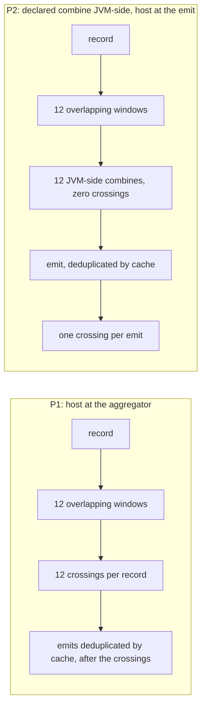
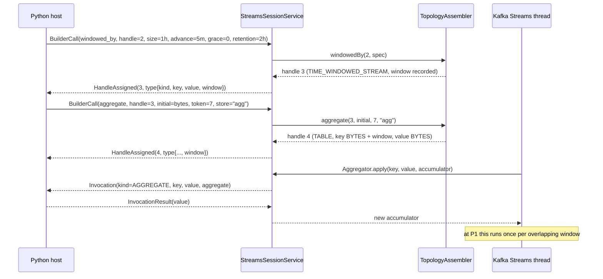
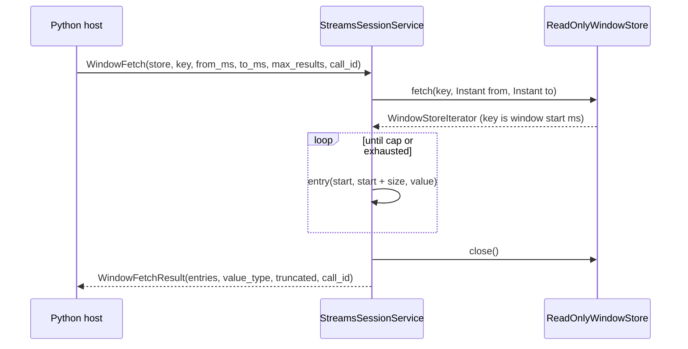
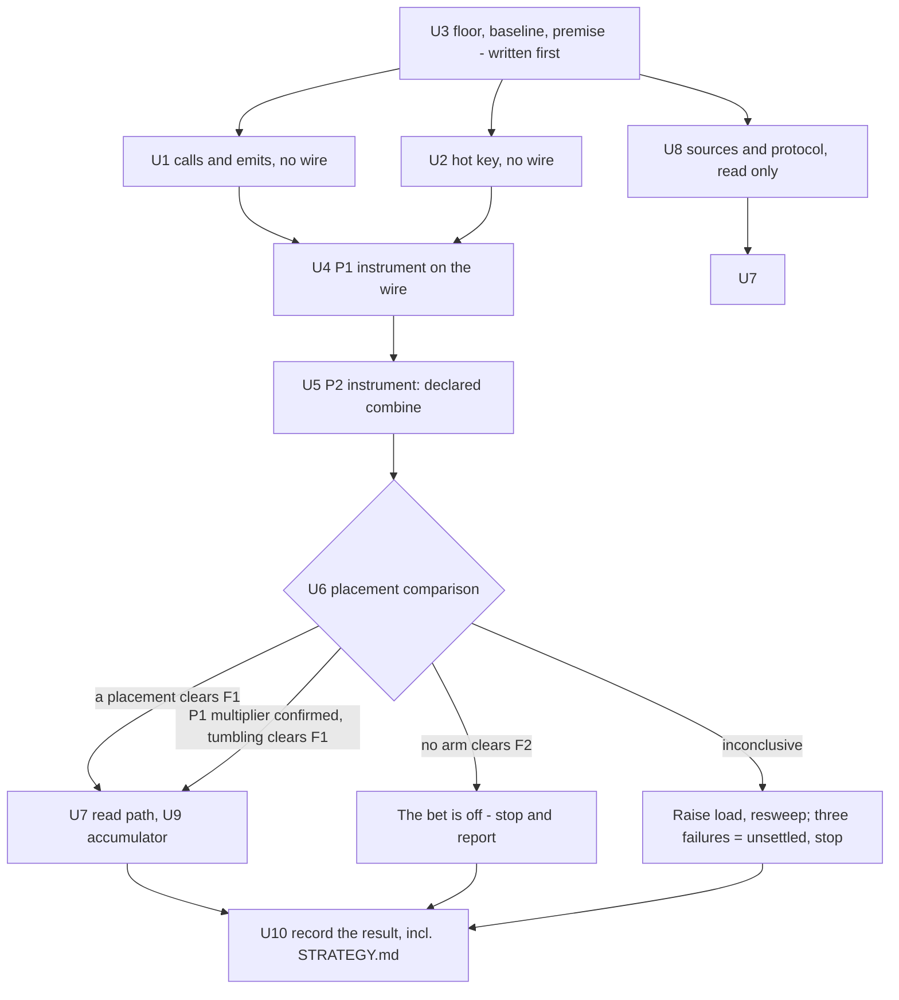

# Where the Aggregation Boundary Must Sit - a Falsification Spike for Windowed Kafka Streams - Plan

## Goal Capsule

- **Objective:** find out whether wrap-rather-than-reimplement breaks on windowing. Dimension 4 of `docs/inflight/streams-coupling-dimensions.md` predicts windowing is the dimension most likely to force a wire redesign. This plan is the experiment that settles it, not a feature delivery. The work belongs to the language-proxy workstream tracked as astubbs#242, which commit subjects reference.
- **The question, stated so it can come out no:** **where must the host function sit for a windowed aggregation to run at a useful rate, and does any workable placement exist?** Placing it at the aggregator - the obvious mapping of Kafka's DSL - calls it once per overlapping window, and every call is a boundary crossing through one serialised transport. Placing it after a JVM-side combine calls it once per emit instead, which the window multiplier does not touch. If **no** placement clears the floor recorded in U3, a foreign-language Kafka Streams cannot run a windowed aggregation at all, and that is the answer.
- **Why the question changed shape, and this is the organising idea of the whole plan:** the multiplier exists *because of a placement*, not because of windowing. The earlier framing treated the aggregator as the only possible home for the host function, so a confirmed multiplier read as a verdict on windowing when it is only a verdict on that one placement. Beam's three-stage lifted combine is the heavy end of moving the boundary; the cheap end - combine JVM-side, call the host once at the emit - was never in view at all. Placement is now the variable (KTD15).
- **Authority:** this plan; where it is silent, `AGENTS.md`, `docs/investigating.md` for method, `docs/inflight/streams-verify-against-the-kafka-sources.md` for any claim about how Kafka Streams behaves, and the existing streams module's conventions. The v1alpha1 proto declares itself unfrozen in its own header and may be reshaped; the frozen v1 wire may not be touched.
- **Stop conditions.** Three, and only the third is direction-closing:
  - Stop and report at the end of U1 if the aggregator-call multiplier does not appear. The premise of the whole spike is then wrong and the remaining work is surface, not throughput.
  - Stop **hopping-at-the-aggregator conclusions only** at the end of U6 if the throughput ratio confirms the multiplier reaches the crossing. Tumbling is predicted at full plateau, and the read path and the accumulator work serve tumbling equally, so they continue. This is a result about one placement.
  - **The bet is off** if no arm in U6 - not the aggregator placement, not the combine placement, not tumbling - clears the hard floor F2 recorded in U3. Then a windowed aggregation is not viable across this boundary at any placement measured here, `STRATEGY.md`'s Kafka Streams section is falsified rather than qualified, and the plan stops at U6.
  - Do not push, do not open a PR, do not post to GitHub.
- **Execution profile:** commit each unit as it lands, subject style `feat(streams) astubbs#242: <subject>`, measurement and documentation units `docs(streams) astubbs#242: <subject>`. Bodies carry the prediction, what ran, and what came out.
- **Tail ownership:** the implementer owns the write-up. A unit that measures is not done when the code compiles; it is done when its result, refuted predictions included, is written into the note U3 creates and U10 completes.

---

## Product Contract

### Summary

Decide where the host's function has to sit for a windowed aggregation to be worth offering, and whether any placement works. Three experiments that need no new surface run first: the floor and the baseline are written down before anything is measured, the aggregator-call multiplier and the window-emit count are counted in the test driver, and single-hot-key throughput is measured normalised to host invocations. Then two instruments go on the wire - a windowed aggregate with the host at the aggregator, and the same aggregate with a declared JVM-side combine and the host at the emit - and one measurement set compares them against a crossing-free control. Windowed keys are decomposed on the JVM. Range reads answer with one bounded, capped response. Session windows and suppression are out as built surface; suppression, reverse-order reads and the missing invocation identity are settled by reading Kafka's sources and this project's own protocol.

### Problem Frame

The wrapper has proved five coupling dimensions and never touched windowing. `docs/inflight/streams-coupling-dimensions.md` ranks windowing as the one most likely to force a wire redesign rather than an addition, and names three reasons: a windowed key is composite against a flat `DataType`, `fetch(key, from, to)` is a range query where `Get` is point-only, and stream time is an engine notion the host cannot see.

The measurements say the risk is elsewhere and larger. The crossing costs about 150us wall and 232us CPU (`docs/inflight/perf-crossing-is-cpu-and-serialised.md`), splits into about 120us fixed plus 6.5us per KB (`docs/inflight/perf-crossing-fixed-versus-per-byte.md`), and every outbound message serialises through one `transmitLock` in `parallel-consumer-proxy-streams/src/main/java/bz/stub/parallelconsumer/streams/StreamsSessionService.java`. Threads plateau at about 1.5x, measured at 9,501 records per second at eight threads.

**No absolute JVM-wide ceiling is derived from that, and an earlier draft of this plan was wrong to derive one.** The lock guards each outbound *message*, not the whole crossing, so only an unmeasured fraction of the 120us fixed cost is actually serialised - which is exactly why the measured 9,501 per second exceeds the 8,333 that "one lock at 120us" would imply. The two figures were used interchangeably in the earlier draft and disagree by enough to move a verdict. The derivation is withdrawn (KTD18); what this plan tests is a **ratio between arms measured in the same session**, and the serialised fraction is named as unmeasured in Open Questions.

A hopping window multiplies aggregator calls by `ceil(size / advance)`: twelve for a one-hour window advancing every five minutes. **That multiplier is a property of where the host function sits, not of windowing.** With the function at the aggregator, twelve overlapping windows mean twelve crossings per record. With a combine performed JVM-side and the host called on the aggregate's emit instead, the crossing count stops tracking the multiplier and starts tracking the emit rate, which caching and the commit interval govern. The usual cure is genuinely unavailable at the aggregator placement: caching and `suppress` deduplicate downstream emits *after* the aggregator has run, so neither reduces aggregator calls. That is an argument for moving the function to where the deduplication happens - which is the plan's organising idea, and the thing the earlier framing could not see because it treated the aggregator as the only home.

There is no prior art to borrow from. Beam crosses in bundles and gives the SDK all three lifted-combine stages because accumulators are opaque to the runner; PyFlink added embedded-CPython thread mode in FLIP-206 because the process-mode crossing cost was unacceptable; PySpark keeps state JVM-side and ships Arrow batches per group. No system does a synchronous per-record crossing, and no non-JVM Kafka Streams with foreign user functions exists at all. The Python ecosystem reimplemented (Faust, Quix Streams) or rewrote in Rust with in-process Python (Bytewax). That absence is evidence about the shape of the problem, not a gap in the search. It is also the field this plan's hard floor is drawn against: the wrapper does not have to beat JVM Kafka Streams, but it does have to beat the host reimplementing the aggregation itself, because that is what the alternatives did.

### Requirements

**Falsification method**

- R1. Every experiment records its prediction in the tree before it runs, and the write-up reports refuted predictions as prominently as confirmed ones.
- R2. Every throughput experiment carries a control arm that changes exactly one term and holds everything else identical.
- R3. Every result reports the rate, the run count, the spread and the conditions. A bare verdict is not a result.
- R4. Every experiment proves its instrument could have produced the positive answer before a negative answer is believed.
- R5. Every throughput comparison carries a **crossing-free** arm at identical load, and attribution to the boundary reads on that pair. An arm that changes the code path but not the crossing count cannot attribute anything to the boundary.
- R6. Arms are normalised to **host invocations**, not to records, and sweeps are specified in crossings with the warm-up region discarded.
- R7. The floor, the authoritative baseline and the transport they are scoped to are recorded before any broker arm runs, and every verdict names all three.

**Placement**

- R8. The plan measures at least two placements of the host function and reports, for each, a crossings-per-record figure alongside its throughput. A throughput number without its placement is not a result.
- R9. A declared JVM-side combine never crosses the boundary. If a combine kind cannot be executed engine-side without calling the host, it is not a combine kind.

**Windowing on the wire**

- R10. A window specification travels as size, advance, grace and **retention** in milliseconds, all four always present. Tumbling is advance equal to size.
- R11. A windowed handle reports its window through an optional structured field beside the flat `DataType` enums, and the handle store records it alongside the node. No second map keyed by handle.
- R12. Where a windowed key crosses the wire it is decomposed into inner key, window start milliseconds and window end milliseconds as separate fields. **No path in this spike delivers all three**: the aggregate invocation carries the plain key, the sink is refused (R17), and the range read is keyed so its entries carry only the bounds. The rule binds any future path that needs a whole windowed key; this spike exercises the halves, and the write-up says so rather than claiming a decomposition it never performed.
- R13. An aggregate invocation names its kind explicitly and carries the plain key, the record value and the current accumulator.
- R14. The initializer never crosses the wire. The host supplies its value once, at build time.

**Engine behaviour**

- R15. The operator is `aggregate`, not `reduce`, so the first value for a key reaches the host function.
- R16. Windows are constructed with `ofSizeWithNoGrace` or `ofSizeAndGrace`. The deprecated `TimeWindows.of` and `TimeWindows.grace` path is never used.
- R17. Sinking a windowed table is refused, naming the handle and what it is.
- R18. Every store iterator is closed on every path, including the error path.
- R19. A reverse-order read is refused **as a scope choice** - one response shape, one direction - and never on the claim that Kafka cannot serve it. It can: the throwing `backward` methods are bare-interface defaults, and every implementation on the interactive-query path overrides them (U8 records which).
- R20. A retention below `size + grace` is refused by name at the builder call, with the reason, rather than left to surface as Kafka's own exception from inside the engine.

**Read path**

- R21. A range read answers with one bounded, materialised response carrying an explicit cap and a truncation flag.
- R22. Every query failure answers with an error on the response, never a session fault.

**Host client**

- R23. The Python client exposes the builder calls each placement needs and a windowed fetch that returns entries of window start, window end and a value decoded from the reported type.
- R24. Python protobuf stubs are regenerated and committed in the same commit as the proto change.
- R25. Function dispatch becomes arity-aware rather than gaining a second two-argument call site. `_leading_argument` in `parallel-consumer-proxy-clients/parallel-consumer-proxy-client-python/src/parallel_consumer/streams/_session.py` returns one `bytes` and its only call site builds exactly two arguments; a three-argument aggregator needs the call site itself to change.

**Record**

- R26. Dimension 4 of the coupling register carries this spike's result, including anything it refuted, expressed per placement.
- R27. The `TopologyTestDriver`-as-oracle proposal is qualified with the **over-count** bias this spike establishes, and with the mechanism that actually causes it.
- R28. `STRATEGY.md`'s Kafka Streams section is reconciled with the result - qualified, deleted or confirmed - in parity-versus-speed terms, and this branch's entry in `docs/inflight/pr-strategy-doc-merge-triggers.md` is settled in the same pass.

### Scope Boundaries

**Outside this spike, with the reason**

- **Session windows.** Merge cascades are unbounded and data dependent, so the aggregator-call multiplier stops being a number that can be predicted from the window specification. The whole point of U1 and U6 is to bound the multiplier per placement; a window type whose multiplier cannot be bounded cannot be measured against a floor.
- **Suppression, as built surface.** Examined by reading the Kafka 3.9.2 sources in U8 and written up. Two facts drive the exclusion: `suppress(untilWindowCloses(...))` statically requires a `StrictBufferConfig` and `unbounded()` grows until the JVM dies, and the suppress processor schedules no punctuator, so emission is driven only by records arriving and raising stream time. A quiet partition never emits its final window, which a host cannot distinguish from a stuck engine. It is used *inside* U1's test driver as an instrument, which is not the same as exposing it on the wire.
- **The record timestamp, and stream time generally.** Not absorbed into this spike. `TopologyTestDriver` accepts explicit event times through `createInputTopic(name, keySerializer, valueSerializer, Instant, Duration)` and `pipeInput(key, value, Instant)`, and decomposed window bounds give the host time information on the read path. The consequence is a real limit and is stated rather than hidden: **the host cannot make time-dependent decisions inside a function.** Record metadata is dimension 3 of the register and has its own note, `docs/inflight/next-serialization-and-record-metadata.md`.
- **Sinking a windowed table.** Refused by R17 rather than encoded. See KTD10.
- **The crossing optimisation work.** Stays parked under `docs/inflight/perf-streams-crossing-optimisation.md`. U2 tests whether it could help a windowed aggregation at all, which is a question about the parked work, not a resumption of it.
- **One gRPC session per stream thread.** `docs/inflight/perf-crossing-is-cpu-and-serialised.md` says it should be measured before the bundling plan proceeds, and it is not measured here. Its absence is why every verdict in this plan is scoped to the current single-session transport (U3).
- **Bindings other than Python.** Extending this to the other languages is owned by `docs/inflight/test-cross-binding-streams-conformance.md`.
- **Exactly-once, punctuators, one record in and many out, engine state signals.** Other dimensions of the register, each with its own rank.
- **Rebalance with an invocation in flight - dimension 5.** An earlier draft carried an unclean-stop experiment here and claimed dimension 5 for it. It was neither: killing the engine between records is not revocation during an open invocation, and its predictions restated Kafka's documented at-least-once behaviour rather than anything about the boundary. Cut, with the one finding it was reaching for salvaged into U8, which delivers it by reading the protocol. Dimension 5 stays where it is, unclaimed by this plan.

**Prerequisites, already landed on this branch**

- Query and describe correlation, and the move of registered functions off the Python reader thread. Both landed on this branch, in that order, and the write-up is `docs/solutions/architecture-patterns/one-answer-slot-for-many-callers-is-a-correlation-bug.md`. U7 depends on the first and U2 on the second; neither is re-derived here.

---

## Planning Contract

### Key Technical Decisions

**KTD15 is the decision that reorganised this plan and is listed first; the decisions after it keep the numbers they were written with, so citations to them stay valid.**

- KTD15. **Placement is the variable under test, not a fixed property of the design.** The multiplier is `ceil(size / advance)` crossings per record only when the host function sits at the aggregator. Two placements are built and measured: **P1**, host at the aggregator, which is the obvious mapping of Kafka's DSL and the one every earlier draft assumed; and **P2**, a declared JVM-side combine with the host called on the aggregate's emit, which the multiplier does not touch. Beam's three-stage lifted combine is the far end of the same axis and stays in Alternatives. A confirmed multiplier is then a result about **P1**, not about windowing, and the plan can return a genuine negative - no placement clears the floor - which it previously could not.
- KTD16. **P2's combine is *declared*, not supplied.** The host names a combine kind from a small engine-executed set; it does not send a function to be run per record, because that would be P1 wearing a different name. One kind is enough to measure: a length-prefixed append of record values. This is a deliberate, bounded piece of reimplementation and it is the price P2 charges - the host's function stops being a Kafka `Aggregator` of shape `(key, value, accumulator)` and becomes a fold over what the engine collected. That is a **parity** gap, and `STRATEGY.md`'s parity-versus-speed sentence is what decides whether it is acceptable. Governs R9.
- KTD17. **Retention is part of the window specification and is always sent.** Kafka defaults a window store's retention to `size + gracePeriodMs`, so a one-hour tumbling window with zero grace retains roughly the currently-open window and nothing else - under which U7's coexisting-windows and truncation scenarios are unreachable and would fail for a reason with nothing to do with the wrapper. `retention_ms` rides on the specification, is applied through `Materialized.withRetention`, and a value below `size + grace` is refused at the builder call with the reason. Governs R10, R20.
- KTD18. **The verdict rests on a ratio measured within a session, never on a cited absolute ceiling.** The `transmitLock` guards each outbound message rather than the whole crossing, so the serialised fraction of the 120us fixed cost is unknown, and "one lock at 120us fixed" understates the real ceiling - the measured plateau exceeds it. Every comparison in U6 therefore reads against its own control arm run in the same session, and the published constants are used only to pre-register predictions. Governs R7.
- KTD1. **The falsifier leads.** (session-settled: user-directed - chosen over building the windowing surface first: if the ceiling is real, most of the surface is not worth designing.) U1, U2 and U3 need no new code at all, and U6 is the decisive arm. The read path, accumulator growth and everything below U6 are downstream of a yes at *some* placement.
- KTD2. **Windowed keys are decomposed on the JVM.** (session-settled: user-directed - chosen over shipping Kafka's byte layout opaque for the host to decode: the layout is internal and undeclared.) `TimeWindowedSerializer` produces `[inner key bytes][8-byte big-endian window start]`, the window end is not on the wire and is reconstructed as `start + windowSize`, and the layout comes from `WindowKeySchema` in an internal package that no KIP declares as a contract. The changelog layout is different again, `[key][8-byte timestamp][4-byte sequence number]`, so a host taught one layout would be wrong about the other. The engine splits the key and sends inner key, start and end as fields. Governs R12.
- KTD3. **A range read materialises into one bounded response with an explicit cap.** (session-settled: user-directed - chosen over a streamed iterator held open across the wire: the store-lock question is unsettled.) The engine drains the iterator to the cap, closes it, and answers once, setting a truncation flag when the range held more. The streaming design and the question it depends on are recorded as an open experiment, not built. Governs R21.
- KTD4. **The missing record timestamp is not absorbed into this spike.** (session-settled: user-directed - chosen over adding record metadata to the invocation: it is a separate dimension with its own note.) Recorded as a scope boundary with its consequence stated: the host cannot make time-dependent decisions inside a function.
- KTD5. **Tumbling and hopping are both in scope; hopping is required, not optional.** (session-settled: user-directed - chosen over tumbling alone: hopping is what makes the multiplier real, and the multiplier is the falsifier.) Session windows are out for the reason in Scope Boundaries.
- KTD6. **The spike builds on the landed query correlation and reader-thread fix, and leaves the crossing optimisation parked.** (session-settled: user-directed - chosen over folding bundling into this work: it optimises a proof that has not yet proved the concept.) Both fixes are on this branch, so U7's correlated range read and U2's off-reader-thread dispatch are given, not conditions.
- KTD7. **The windowed type is an optional structured field beside the flat `DataType` enums, and the handle store is re-keyed rather than paralleled.** This is the growth path the typed-handles plan already recorded: `docs/plans/2026-08-24-001-feat-streams-typed-handles-plan.md` KTD2 says that when a windowed operator arrives, an optional structured field is added beside `DataType`, and its KTD3 forbids a second map keyed by handle. A recursive `TypeSpec` was considered and rejected there. That decision binds here. `TopologyAssembler.Minted` already holds node plus `HandleType`, so the window rides on `HandleType`. Governs R11.
- KTD8. **The operator is `aggregate` and the initializer is captured once as bytes.** `reduce` is implemented in Kafka as an aggregate whose initializer returns null and whose aggregator bypasses the reducer while the accumulator is null, which is exactly why this project's `reduce` never calls the host for a key's first value (`parallel-consumer-proxy-streams/src/test/java/bz/stub/parallelconsumer/streams/TopologyAssemblerTest.java`, `theFirstValueForAKeyNeverReachesTheReducer`). That skip is also the confound U2 has to normalise away. `Initializer` is zero-arg and pure, so it never needs to cross: the host sends one `byte[]` on the builder call and the engine hands out a defensive copy per call. A shared array would alias, because the initializer runs once per new window per key. Governs R14, R15.
- KTD9. **Two builder calls, not one fused call.** `windowed_by` takes a grouped-stream handle and a window specification and mints a time-windowed stream; `aggregate` takes that handle, the initializer bytes, either a function token (P1) or a combine kind (P2), and a store name, and mints a windowed table. This is the replay-the-builder model the PoC established, it adds exactly one `HandleKind` member, and it keeps the window specification in one place where the store, the read path and the sink refusal can all read it back.
- KTD10. **Sinking a windowed table is refused, not encoded.** Writing one requires putting a windowed key on a topic, which means either shipping `WindowKeySchema`'s internal layout to the host (refused by KTD2) or inventing an encoding that is not Kafka's, which would make the sink topic unreadable by every other Kafka Streams consumer. The windowed table is read through the range read instead. Recorded in Open Questions with the two candidate designs. Governs R17.
- KTD11. **`TopologyTestDriver` is the unit oracle, and its bias runs the opposite way from the obvious guess.** TTD does **not** disable caching: it builds a `ThreadCache` sized from `statestore.cache.max.bytes` and then commits after every processed record in `completeAllProcessableWork`, which flushes that cache each time. The effect is that TTD emits every intermediate update, so an expectation recorded against TTD **over-counts** messages relative to a broker-backed run where caching deduplicates. An earlier draft of this plan said TTD disables caching and under-counts; both halves were wrong, and the correction matters because P2's crossing count *is* the emit count. Aggregator *call* counts are unaffected by caching either way, which is why U1 can assert calls in TTD and why the emit half must be confirmed on a broker in U6. Governs R27.
- KTD12. **The deprecated window constructors are banned outright.** `Windows.until` no longer exists, and `TimeWindows.of` with `.grace` is deprecated in favour of `ofSizeWithNoGrace` and `ofSizeAndGrace`. The deprecated path silently gives `max(24h - size, 0)` grace while the new path gives zero, so the two differ in behaviour and not only in style. Governs R16.
- KTD13. **Any test that reads a windowed topic uses the two-argument `TimeWindowedDeserializer`.** In 3.9.2 it throws if the window size is set both in the constructor and in `window.size.ms`, and throws if it is set in neither. The single-argument constructor and `WindowedSerdes.timeWindowedSerdeFrom(Class)` are deprecated.
- KTD14. **One measurement harness, one experiment selector.** The broker-backed arms live in one new Python script with an experiment selector, reusing `parallel-consumer-proxy-clients/parallel-consumer-proxy-client-python/demo/demo_kafka.py` and `parallel-consumer-proxy-clients/parallel-consumer-proxy-client-python/demo/demo_options.py` rather than copying their setup. Sibling scripts would drift, and the crossing measurements already established the method constraints these arms must share. **Neither reused module sets `commit.interval.ms`** - only `streams_demo.py` does, at 200 - so the harness must set it explicitly and print it, because P2's crossing count depends on it directly.

### High-Level Technical Design

**The two placements, side by side.** This is the plan's whole subject, so it is drawn before anything else.

P1's crossing count is set by the window multiplier. P2's is set by the emit rate, which caching and `commit.interval.ms` govern - so P2 wins where a key receives more than about one record per commit interval, and **loses** where it receives fewer, because a long-lived window keeps emitting while the key is idle. That crossover is the thing U6 measures, and it is why P2 is a genuine experiment rather than a foregone improvement.

**The build path and the invocation path**, at P1. Two builder calls mint the windowed table; the aggregate invocation reuses the fields `Invocation` already carries, so the hot path needs no new wire field.

**At P2 the same builder call carries a combine kind instead of a token**, nothing crosses per record, and the host applies its own function downstream through the `map_values` call it already has.

**The read path.** The engine decomposes each windowed key, drains the iterator to the cap, closes it, and answers once.

### Sequencing

U3 runs first and writes the floor down, because a floor chosen after the number comes out is not a floor. U1, U2 and U8 need no new code and can run in any order beside each other. U4 and U5 are instruments, not experiments, and exist only to make U6 possible.

### Assumptions

- Kafka Streams 3.9.2 is the version every API fact here was verified against, **from the sources jar rather than from the javadoc or from reasoning** - the practice `docs/inflight/streams-verify-against-the-kafka-sources.md` owns, and the reason several claims in earlier drafts of this plan were wrong in ways no amount of reasoning would have caught: the epoch clamp in `TimeWindows.windowsFor`, the default window-store retention, `TopologyTestDriver`'s `ThreadCache`, and the `backward` overrides. A version bump invalidates the facts, not the method.
- A concurrent workstream has been editing `streams.proto`, the Java engine and the Python client on this branch. **U4's additivity claim is judged against baseline `b4d5243cbe2856c0975e521e8735c8be22b7ae88`**, named so that a change the other workstream makes cannot be read as this spike forcing a redesign, or the reverse.
- Java protobuf classes are generated at build time by Maven; Python stubs are committed and regenerated by `parallel-consumer-proxy-clients/parallel-consumer-proxy-client-python/tools/generate_proto.py`, and drift fails `make proto-check`.
- The broker-backed arms run on a quiet machine. The three prior crossing measurements each depended on that and said so.
- **The published crossing baselines were measured where the crossing is an independent per-record transform** (`mapValues`), not a per-key serial aggregate. An aggregate arm falling short of 6,500-7,000 single-thread or 9,501 at eight threads is therefore expected and is not by itself evidence of anything. The write-up must say this, or a shortfall will read as a refutation of a prediction nobody made.

---

## Implementation Units

### U1. Aggregator calls and window emits - the crossing count at each placement, with no wire involved

- **Goal:** establish, per placement, how many times a windowed aggregation would cross the boundary per record. At P1 that is the aggregator call count; at P2 it is the emit count. Cheapest decisive experiment in the plan, and it touches nothing.
- **Requirements:** R1, R2, R3, R4, R8, R16, R27.
- **Dependencies:** U3, for the predictions to be recorded against a floor that already exists.
- **Files:** `parallel-consumer-proxy-streams/src/test/java/bz/stub/parallelconsumer/streams/WindowedAggregatorCallCountTest.java` (new). <!-- file-refs: N/A - a file this unit creates -->
- **Approach:** build the topologies directly against `StreamsBuilder`, not through `TopologyAssembler`, so this unit runs before any wire work exists. The aggregator is a counting `Aggregator<byte[], byte[], byte[]>` over an `AtomicInteger`, and a second counter reads the downstream node. Feed a fixed record count with explicit event times through `createInputTopic(name, keySerializer, valueSerializer, Instant, Duration)`. Construct windows with `TimeWindows.ofSizeAndGrace` only (KTD12). Read state with `getWindowStore(String)` while the driver is open, because `TopologyTestDriver.close()` deletes the state directory and has produced a green test asserting nothing in this module before.
- **The start timestamp is load-bearing and must be stated, not defaulted.** `TimeWindows.windowsFor` clamps the earliest window start at zero, so a record less than `size - advance` past the epoch falls into fewer than `ceil(size / advance)` windows. At `Instant.EPOCH` - the natural deterministic choice, and the one an implementer reaches for - a hundred records a minute apart give 870 calls rather than 1,200, and the plan's headline falsifier would read as *refuted* for a reason having nothing to do with the wrapper. Every arm starts at least `size - advance` past the epoch, and the test names why in a comment.
- **Predictions, recorded before the run:**
  1. Tumbling one hour: aggregator calls equal the record count exactly.
  2. Hopping one hour advancing five minutes, all records at least fifty-five minutes past the epoch: aggregator calls equal twelve times the record count, which is `ceil(size / advance)`.
  3. Adding `suppress(untilWindowCloses(Suppressed.BufferConfig.maxRecords(n).shutDownWhenFull()))` leaves the aggregator call count unchanged and reduces only downstream emits.
  4. Under that suppression, downstream emits equal the number of distinct (key, window) pairs that closed - **independent of the record count**. This is P2's crossing count, and it is the number that decides whether the placement axis has a second usable point at all.
  5. `advanceWallClockTime(Duration)` does not close a window, because it does not advance stream time; only a later record's timestamp does.
- **What would falsify, and it can now come out either way:**
  - Prediction 2 near one call per record: Kafka lifts hopping aggregation rather than calling per overlapping window, the multiplier premise collapses, U6 stops being decisive, and the plan reduces to surface work. **Stop condition.**
  - Prediction 4 tracking the record count rather than the window count: the emit placement offers no collapse, P2 is not a second point on the axis, and the plan is back to a single placement whose cost U6 can only confirm. **This is the most consequential negative this unit can return, and it is the one the earlier framing had no way to ask for.**
- **Test scenarios:**
  1. Input: 100 records over one key, event times one minute apart, base at least fifty-five minutes past the epoch. Action: tumbling one-hour window, grace zero. Expected: exactly 100 aggregator calls.
  2. Input: the same 100 records. Action: hopping one-hour window advancing five minutes, grace zero. Expected: exactly 1,200 aggregator calls.
  3. Input: the same 100 records. Action: hopping one hour advancing thirty minutes - the linearity arm, changing only the advance. Expected: exactly 200 aggregator calls, that is twice scenario 1, not twelve times.
  4. Input: the same 100 records. Action: scenario 2's topology with `suppress(untilWindowCloses(...))` on the output. Expected: 1,200 aggregator calls, and emits equal to the count of closed (key, window) pairs, reported as a number beside the record count.
  5. Input: one record, then `advanceWallClockTime(Duration.ofDays(1))`, **on scenario 4's suppressed topology**. Action: read the output topic. Expected: nothing emitted. On the unsuppressed topology this scenario cannot fail - the single record's aggregate emits immediately and nothing follows in either world - so it would pass whether or not wall clock advanced stream time, which is a green test asserting nothing.
  6. Input: a record older than `windowCloseTime`, which is `observedStreamTime - gracePeriodMs`. Action: pipe it after stream time has advanced past the grace. Expected: the aggregator is not called for it and the late-record sensor accounts for it.
- **Instrument check (R4):** invert scenario 3's expectation by setting the advance to five minutes and confirm it fails at 1,200 rather than passing at 200. A call counter that cannot move is not a counter. Record the sabotage used.
- **Recorded limitation:** TTD builds a `ThreadCache` from `statestore.cache.max.bytes` and commits after every processed record in `completeAllProcessableWork`, flushing it each time - so its emit counts are the **upper bound**, over-counting a broker run where caching deduplicates. Scenario 4's suppressed emit count is the exception and is the one P2 relies on, because suppression, not caching, is what makes it deterministic. The broker-side emit count is U6's job.
- **Verification:** the call counts and the emit counts are established by observation, with the Kafka version and the epoch offset named, and written into the note U3 created.

---

### U2. Hot-key throughput, normalised to host invocations

- **Goal:** find out whether an aggregation over one hot key can be rescued by anything the parked bundling work offers. An aggregation is a serial dependency, because accumulator `n+1` needs accumulator `n`, so it cannot be batched across a hot key the way Beam batches independent elements.
- **Requirements:** R1, R2, R3, R4, R6.
- **Dependencies:** U3. Uses the existing `reduce` operator, which is already a per-key serial dependency across the boundary.
- **Files:** `parallel-consumer-proxy-clients/parallel-consumer-proxy-client-python/demo/streams_windowing_lab.py` (new, experiment `hot-key`), reusing `parallel-consumer-proxy-clients/parallel-consumer-proxy-client-python/demo/demo_kafka.py` and `parallel-consumer-proxy-clients/parallel-consumer-proxy-client-python/demo/demo_options.py`. <!-- file-refs: N/A - streams_windowing_lab.py is a file this unit creates -->
- **Approach, and the correction that makes it valid:** an earlier draft matched the two arms on **record count**, which silently changed two terms at once. `reduce` skips each key's first value (KTD8), so twenty thousand records under one key make about twenty thousand crossings while the same twenty thousand records over eight thousand keys make about twelve thousand - inflating the spread arm by about 1.67x, which is the same order as the 1.5x thread plateau the arm exists to measure. **Both arms are therefore matched on host invocations `I`**, and the record count is derived: arm A sends `I + 1` records under one key; arm B sends `I + K` records over `K = 8,000` keys spread across eight partitions. Every rate in this unit is reported as invocations per second, and the record counts are reported beside them so the derivation is checkable.
- **Warm-up, likewise specified in crossings.** `docs/inflight/perf-streams-crossing-attribution.md` found per-invocation cost still falling across its whole sweep and not converged at tens of thousands of invocations. Sweep `I` over 32,000, 64,000 and 128,000, fit the slope across the sweep, and discard any point below 32,000 invocations as warm-up. A sweep specified in records rather than crossings would have put the two arms in different parts of the ramp.
- Interleave the arms rather than running them in order, and read throughput from the broker's log-append clock. These constraints are not new: `docs/inflight/perf-crossing-is-cpu-and-serialised.md` and `docs/inflight/perf-crossing-fixed-versus-per-byte.md` each established them, and each cost an experiment to learn.
- **Predictions, recorded before the run:**
  1. Arm A lands near the single-thread band of 6,500 to 7,000 invocations per second, because one key means one partition means one stream thread.
  2. Arm B lands near 9,500 invocations per second, the measured eight-thread plateau, not eight times arm A.
  3. The achievable bundle size for arm A is one, by construction: the next record for a key cannot be sent until the previous accumulator returns.
- **A shortfall against 1 or 2 is not a refutation on its own.** Those baselines were measured on an independent per-record transform, not a per-key serial aggregate, so the serial dependency alone can cost throughput the baseline never paid. What would be interesting is arm A *exceeding* them, or arm B scaling close to linearly with threads - the latter would mean the `transmitLock` is not the whole ceiling and per-key concurrency buys real throughput, which reopens both bundling and the one-session-per-stream-thread option listed as unmeasured in `docs/plans/2026-08-24-002-feat-streams-invocation-bundling-plan.md`.
- **Test scenarios:**
  1. Input: `I = 64,000` invocations, 1 KB payloads, one key, eight partitions. Action: run arm A. Expected: invocations per second within the single-thread band, reported with run count, spread and the derived record count.
  2. Input: `I = 64,000` invocations, 1 KB payloads, 8,000 keys, eight partitions. Action: run arm B. Expected: invocations per second near the eight-thread plateau, and strictly less than four times arm A.
  3. Input: both arms at all three sweep points. Action: fit the slope, discarding below 32,000. Expected: per-invocation cost stable over the fitted region, which is what proves warm-up was excluded rather than cancelled by luck.
  4. Input: arm A with the host function artificially slowed by 1 ms. Action: rerun. Expected: throughput falls by roughly the added delay per invocation, proving the harness measures what it claims to.
- **Instrument check (R4):** scenario 4 is the instrument check. A harness whose number does not move when the host function slows down is measuring something else.
- **Verification:** both rates written into the note U3 created, in invocations per second, with run counts, spread, machine, thread count, partition count, key count and the derived record counts, and an explicit statement of whether prediction 2 held.

---

### U3. The floor, the baseline and the inherited premise - all written down before anything is measured

- **Goal:** make the verdict decidable. The plan's objective turns on a "useful rate" that was defined nowhere - not here, not in the coupling register, not in `STRATEGY.md` - and on a baseline that appeared as two figures fifteen per cent apart. Both get fixed in the tree before any broker arm runs, so no number can be fitted to the result that came out.
- **Requirements:** R1, R3, R7, R8.
- **Dependencies:** none. First unit.
- **Files:** `docs/inflight/perf-streams-windowing-multiplier.md` (new). <!-- file-refs: N/A - a file this unit creates -->
- **Approach:** write five things, and commit them before U6 runs.
  1. **The floors, as absolute rates with the workload behind them.** Both are pre-registered choices, argued rather than measured, and the argument is recorded so a reader can disagree with the choice rather than with the arithmetic.
     - **F1, the parity floor: 1,000 records per second sustained**, at 1 KB values, eight partitions, eight stream threads, keys spread across the partitions. Below F1 the wrapper cannot keep up with a moderately busy topic, and "it exists" stops being a usable claim because nothing usable runs on it.
     - **F2, the hard floor: 100 records per second** on the same workload. Below F2 a single-threaded host program doing the aggregation in memory beats the wrapper - and beating the host reimplementing is the one comparison the wrapper *must* win, because reimplementing is precisely what Faust, Quix Streams and Bytewax did. F2 is the bet-off line.
  2. **The authoritative baseline: the control arm measured in the same session as its treatment arm, never a cited constant** (KTD18). The published figures - 6,500 to 7,000 invocations per second single-thread, 9,501 records per second at eight threads - are recorded here for pre-registering predictions only, with the note that they were measured on an independent per-record transform rather than a serial aggregate.
  3. **The withdrawn derivation.** State plainly that "one lock at 120us fixed is about 8,300 crossings per second for the whole JVM" is withdrawn: the lock guards each outbound message, not the whole crossing, the serialised fraction is unmeasured, and the measured plateau exceeds the derived ceiling - which is the tell that the derivation was wrong rather than the measurement.
  4. **The transport scope.** Every verdict this plan records reads "over the current single-session transport". One gRPC stream per stream thread is named by `docs/inflight/perf-crossing-is-cpu-and-serialised.md` as the thing to measure before the bundling plan proceeds, and it is not measured here; a result recorded without that scope would be read later as a property of the approach rather than of one transport.
  5. **The inherited premise, marked as inherited and untested.** "Windowing is not optional in practice" comes verbatim from dimension 4 of the coupling register, where it is asserted without evidence. It is the premise that turns a confirmed ceiling into a direction-closing result, and nothing in this plan tests it. Every conclusion that closes a direction is bounded by it in writing.
- **What would falsify:** nothing - this unit measures nothing. Its failure mode is being written *after* a number is in hand, which is why its commit must precede U6's and why the Verification Contract checks the order.
- **Test scenarios:** none. Pre-registration unit.
- **Verification:** the note exists and carries all five items; `git log --oneline` shows its commit ahead of U6's; no figure in it was chosen after a broker arm ran.

---

### U4. The P1 instrument: a tumbling windowed aggregate on the wire, host at the aggregator

- **Goal:** make a foreign windowed aggregation possible at all, in the smallest form U6 can measure, with the host function at the aggregator. This unit is an instrument, and it carries one falsifier of its own.
- **Requirements:** R10, R11, R12, R13, R14, R15, R16, R17, R20, R23, R24, R25.
- **Dependencies:** U1 for the call-count expectation the tests assert against.
- **Files:** `parallel-consumer-proxy-streams/src/main/proto/parallelconsumer/streams/v1alpha1/streams.proto`; `parallel-consumer-proxy-streams/src/main/java/bz/stub/parallelconsumer/streams/TopologyAssembler.java`; `parallel-consumer-proxy-streams/src/main/java/bz/stub/parallelconsumer/streams/StreamsSessionService.java`; `parallel-consumer-proxy-streams/src/main/java/bz/stub/parallelconsumer/streams/ForeignAggregator.java` (new); `parallel-consumer-proxy-streams/src/main/java/bz/stub/parallelconsumer/streams/ForeignCall.java`; tests `parallel-consumer-proxy-streams/src/test/java/bz/stub/parallelconsumer/streams/TopologyAssemblerTest.java`, `parallel-consumer-proxy-streams/src/test/java/bz/stub/parallelconsumer/streams/StreamsSessionServiceTest.java`, `parallel-consumer-proxy-streams/src/test/java/bz/stub/parallelconsumer/streams/StreamsProtocolRoundTripTest.java`, `parallel-consumer-proxy-streams/src/test/java/bz/stub/parallelconsumer/streams/ForeignBridgeTest.java`; Python `parallel-consumer-proxy-clients/parallel-consumer-proxy-client-python/src/parallel_consumer/streams/_session.py`, `parallel-consumer-proxy-clients/parallel-consumer-proxy-client-python/src/parallel_consumer/streams/__init__.py`, regenerated `parallel-consumer-proxy-clients/parallel-consumer-proxy-client-python/src/parallel_consumer/_generated/streams_pb2.py` and `parallel-consumer-proxy-clients/parallel-consumer-proxy-client-python/src/parallel_consumer/_generated/streams_pb2.pyi`; tests `parallel-consumer-proxy-clients/parallel-consumer-proxy-client-python/tests/test_streams_session.py`, `parallel-consumer-proxy-clients/parallel-consumer-proxy-client-python/tests/test_streams_windowing.py` (new). <!-- file-refs: N/A - ForeignAggregator.java and test_streams_windowing.py are files this unit creates -->
- **Approach:**
  1. Proto: two new `BuilderCall` oneof members, `WindowedBy { handle, TimeWindowSpec window }` and `Aggregate { handle, bytes initial, function_token, store_name }`, with `TimeWindowSpec { size_ms, advance_ms, grace_ms, retention_ms }`, all four always set (R10, KTD17). Add `HANDLE_KIND_TIME_WINDOWED_STREAM` to `HandleKind`, and an optional `TimeWindowSpec window` field on `HandleType` per KTD7. Add `INVOCATION_KIND_AGGREGATE` to `InvocationKind`; the aggregate invocation reuses `key`, `value` and `aggregate`, so no new invocation field is needed. Comment each addition in the file's existing voice, including why the window rides on `HandleType` rather than on a parallel map.
  2. Engine: `TopologyAssembler.windowedBy` resolves a grouped-stream handle, applies `TimeWindows.ofSizeAndGrace` (KTD12), and mints a time-windowed stream recording the specification on its `HandleType`. `TopologyAssembler.aggregate` resolves that handle and calls `aggregate(initializer, aggregator, Materialized)` where the initializer returns a defensive copy of the captured bytes (KTD8), the store serdes come from the recorded type exactly as `count` and `reduce` already do, and `Materialized.withRetention` carries `retention_ms`.
  3. **The seams this needs, named, because they are not local edits.** `TopologyAssembler` holds one factory interface per Kafka functional interface - `MapperFactory`, `ReducerFactory`, `JoinerFactory` - each a constructor parameter. A fourth, `AggregatorFactory`, means a fourth constructor parameter, which ripples through `StreamsSessionService` and through every test that constructs an assembler. `ForeignCall` gains an `aggregate(...)` factory beside `map`, `reduce` and `join`. And `Minted`'s validating switch maps each `HandleKind` to a required node class, defaulting to `"engine bug: a mint must record a known kind"` - so without a `HANDLE_KIND_TIME_WINDOWED_STREAM -> TimeWindowedKStream.class` arm it throws on the very first mint.
  4. `ForeignAggregator` is the fourth `Foreign*` bridge, one per Kafka functional interface, minted through the existing `ForeignCall` factory. It implements `Aggregator<byte[], byte[], byte[]>` and sends `INVOCATION_KIND_AGGREGATE`.
  5. Session: add the two arms to the `onBuilderCall` switch. The switch is an expression on purpose, so a new arm cannot forget its mint; keep it that way. `sink` gains a refusal for a handle whose recorded type carries a window (R17), naming the handle and what it is, in protocol vocabulary rather than a Kafka implementation class name. A `retention_ms` below `size_ms + grace_ms` is refused at the builder call with the reason (R20), rather than left to surface as Kafka's own exception from inside the engine.
  6. **Python dispatch becomes arity-aware** (R25). `_leading_argument` returns a single `bytes` and its one call site builds exactly two arguments; a three-argument aggregator cannot be expressed by adding a branch to it. Replace it with `_arguments(kind, invocation) -> tuple[bytes, ...]` and splat at the call site, so arity lives in the same table as ordering - which is the whole reason that table exists, since every shape is bytes and any pairing type-checks. Then add `TopologyBuilder.windowed_by` and `TopologyBuilder.aggregate`, a `FunctionKind.AGGREGATE` member, and an `AggregatorFunction` type of three bytes arguments returning bytes. Export the new names.
  7. Regenerate the stubs with `tools/generate_proto.py` and commit them in the same commit (R24).
- **What would falsify:** needing anything other than additive changes, **judged against baseline `b4d5243c`** so the concurrent workstream's edits cannot be mistaken for this spike's. The typed-handles plan's KTD2 claims a windowed type is an additive structured field beside the enum, and the PoC's kill criterion says a new operator is a new `oneof` member. If the windowed key forces a reshape of `HandleAssigned`, of `Invocation`, or of the handle store into a second map, then windowing does force a wire redesign, dimension 4's prediction was right, and that is the result. The factory and constructor ripple in step 3 is **not** such a reshape - it is additive by the same test, and is called out here so it is not later mistaken for one.
- **Test scenarios:**
  1. Input: a `HandleAssigned` carrying a `HandleType` with a `TimeWindowSpec`. Action: serialize and parse. Expected: kind, both data types and all four window fields survive intact.
  2. Input: a grouped-stream handle. Action: `windowedBy` with size one hour, advance one hour, grace zero, retention two hours. Expected: a handle of kind time-windowed stream whose recorded type carries the specification.
  3. Input: a time-windowed stream handle. Action: `aggregate` with initializer bytes, a token and a store name. Expected: a table handle whose recorded type carries the window and whose value type is bytes.
  4. Input: `windowedBy` applied to a stream handle and to a table handle. Action: each call. Expected: refused, naming the recorded kind in protocol vocabulary, not `KStreamImpl` or `KGroupedStreamImpl`.
  5. Input: a windowed table handle. Action: `sink`. Expected: refused, naming the handle and that it carries a windowed key (R17).
  6. Input: three records under one key through `TopologyTestDriver`, with a host aggregator that appends. Action: read the window store while the driver is open. Expected: the first value for the key reached the host function, which is the behaviour `reduce` cannot give (R15).
  7. Input: two distinct keys, each opening a new window. Action: mutate the accumulator array in place inside the host aggregator. Expected: the second key's initial accumulator is unaffected, proving the defensive copy (KTD8).
  8. Input: a builder call whose `TimeWindowSpec` omits `advance_ms`, and one that omits `retention_ms`. Action: send each. Expected: refused by name, because R10 requires all four fields.
  9. Input: a `TimeWindowSpec` whose `retention_ms` is below `size_ms + grace_ms`. Action: send it. Expected: refused at the builder call naming the minimum, not an engine-side Kafka exception (R20).
  10. Input: a session-level `aggregate` builder call. Action: read the `HandleAssigned`. Expected: it carries the type including the window; a `sink` answer still carries neither type nor handle.
  11. Python, input: a `FakeEngine` answering the two new calls. Action: drive the builder. Expected: the returned handle exposes the window, and the existing builder-call test still passes unmodified.
  12. Python, input: an `Invocation` of kind aggregate. Action: dispatch it. Expected: the registered three-argument function receives key, value and accumulator in that order, and its result returns as the value.
  13. Python, input: an `Invocation` of kind map, reduce and join after the arity change. Action: dispatch each. Expected: unchanged behaviour, proving `_arguments` did not silently re-order the shapes it inherited.
  14. Python, input: an `Invocation` of kind aggregate naming an unregistered token. Action: dispatch it. Expected: an error answer, matching the existing single-record behaviour, not a drop.
- **Instrument check (R4):** make `FakeEngine` attach a window specification with the advance and size transposed and confirm the type assertion fails. The Python harness answers synchronously and has hidden dead assertions in this module before. Red-proof the defensive-copy test by removing the copy and confirming scenario 7 fails.
- **Verification:** the Java module suite and the Python lint, test and proto-check gates are green; `grep` confirms no second map keyed by handle was introduced.

---

### U5. The P2 instrument: a declared JVM-side combine with the host at the emit

- **Goal:** build the second placement, at its cheapest end, so U6 has something to compare P1 against. This is the unit the earlier framing had no place for, and it is what gives the plan a workable-placement question instead of a ceiling question.
- **Requirements:** R8, R9, R10, R11, R23, R24.
- **Dependencies:** U4 - it extends the same builder call rather than adding a parallel one.
- **Files:** `parallel-consumer-proxy-streams/src/main/proto/parallelconsumer/streams/v1alpha1/streams.proto`; `parallel-consumer-proxy-streams/src/main/java/bz/stub/parallelconsumer/streams/TopologyAssembler.java`; `parallel-consumer-proxy-streams/src/main/java/bz/stub/parallelconsumer/streams/StreamsSessionService.java`; tests `parallel-consumer-proxy-streams/src/test/java/bz/stub/parallelconsumer/streams/TopologyAssemblerTest.java`, `parallel-consumer-proxy-streams/src/test/java/bz/stub/parallelconsumer/streams/WindowedAggregatorCallCountTest.java`; Python `parallel-consumer-proxy-clients/parallel-consumer-proxy-client-python/src/parallel_consumer/streams/_session.py`, `parallel-consumer-proxy-clients/parallel-consumer-proxy-client-python/tests/test_streams_windowing.py`. <!-- file-refs: N/A - WindowedAggregatorCallCountTest.java and test_streams_windowing.py are created by U1 and U4 -->
- **Approach:**
  1. Proto: an optional `combine` field on `Aggregate`, naming an engine-executed combine kind. One kind is enough to measure: `COMBINE_KIND_APPEND_BYTES`, a length-prefixed concatenation of the record values in arrival order. When `combine` is set, `function_token` must be **absent**, and the reverse - the two are alternatives, and a call setting both is refused by name.
  2. Engine: `TopologyAssembler.aggregate` selects a JVM `Aggregator` implementing the named kind. **Nothing crosses the boundary per record** (R9). The minted handle is otherwise identical to P1's, so the read path, the sink refusal and the store all behave the same.
  3. Host side, using surface that already exists: the host calls `aggregate(combine=APPEND_BYTES)` and then applies its own function through the existing `map_values` call on the stream from the windowed table. So P2 needs one optional field and one enum, and no new operator.
  4. Assert the crossing count directly in the test driver, reusing U1's counters: with `combine` set, the aggregator-call counter must read **zero** crossings whatever the multiplier, and the downstream counter must read the emit count. A P2 arm whose crossing counter is non-zero is P1 wearing a different name, which is the failure this assertion exists to catch.
- **What would falsify, and P2 can genuinely lose here:** P2's crossings per record equal emits per record, and emits are governed by caching and `commit.interval.ms`, not by the window multiplier. A key receiving many records per commit interval sees a large collapse; a key receiving **fewer than about one record per commit interval** sees the opposite, because each of its twelve overlapping windows keeps emitting for as long as it stays open regardless of how quiet the key is. So P2 beats P1 only above a crossover in records per key per commit interval, and below it P2 is *worse*. If U6 puts the plan's own workload below that crossover, P2 is not a usable placement and the axis collapses back to one point.
- **A second cost, stated rather than discovered later:** the collected accumulator holds raw values, so it grows with window occupancy where P1's holds only what the host folded. That inflates the store, the changelog and the emit payload, and the per-KB crossing term applies to the whole collection at emit. U9 measures it; it is the price P2 pays for the multiplier collapse.
- **And a parity cost, which is the one `STRATEGY.md` cares about:** the host's function stops being a Kafka `Aggregator` and becomes a fold over what the engine collected. A user cannot express an aggregation whose combine step is their own code. This is a feature-parity gap, not a speed one, and U10 must record it as such (KTD16).
- **Test scenarios:**
  1. Input: a time-windowed stream handle. Action: `aggregate` with `combine=APPEND_BYTES` and no token. Expected: a table handle of the same shape P1 mints.
  2. Input: an `Aggregate` call carrying both a `combine` and a `function_token`. Action: send it. Expected: refused by name, saying the two are alternatives.
  3. Input: an `Aggregate` call carrying neither. Action: send it. Expected: refused by name.
  4. Input: 100 records, hopping one hour advancing five minutes, `combine=APPEND_BYTES`. Action: count crossings in the driver. Expected: **zero** aggregator crossings against 1,200 aggregator invocations, which is the whole point of the placement.
  5. Input: the same topology with `suppress(untilWindowCloses(...))` and a host `map_values` downstream. Action: count host invocations. Expected: one per closed (key, window) pair, matching U1 prediction 4.
  6. Input: a window whose values are appended. Action: read the store. Expected: the concatenation is length-prefixed and splits back into the original values in arrival order, so the host's fold is not guessing at boundaries.
  7. Python, input: the builder with a combine kind. Action: drive it against `FakeEngine`. Expected: the call carries the combine and no token, and the returned handle exposes the window.
- **Instrument check (R4):** set `combine` and *also* leave a token wired internally, and confirm scenario 4's zero-crossing assertion fails. A zero that cannot become non-zero is not a measurement.
- **Verification:** the Java module suite and the Python gates are green; scenario 4's crossing count is zero and is reported beside U1's 1,200 in the note, because that pair is the placement claim in its smallest form.

---

### U6. The placement comparison - the decisive arms

- **Goal:** settle the plan's question. Measure both placements under identical load, against a crossing-free control, and decide against F1 and F2 whether any placement is viable.
- **Requirements:** R1, R2, R3, R4, R5, R6, R7, R8.
- **Dependencies:** U1 (the expected crossing counts), U2 (whether key spread rescues anything), U3 (the floor and the baseline), U4 and U5 (the two instruments).
- **Files:** `parallel-consumer-proxy-clients/parallel-consumer-proxy-client-python/demo/streams_windowing_lab.py` (experiment `placement`); `parallel-consumer-proxy-streams/src/main/java/bz/stub/parallelconsumer/streams/ForeignAggregator.java` (invocation counter for the instrument check). <!-- file-refs: N/A - both files are created by U2 and U4 -->
- **Approach:** hopping needs no new wire surface, because `advance_ms` already exists from U4. That is itself a finding worth stating: hopping is free on the wire and expensive on the crossing - **at P1**. Five arms at identical record count, payload size, key count, partition count, thread count and commit interval, all of which the harness prints.
  - **Arm A - P1, tumbling one hour** (multiplier one).
  - **Arm B - P1, hopping one hour advancing five minutes** (multiplier twelve).
  - **Arm C - P1, hopping one hour advancing thirty minutes** (multiplier two). This is the *linearity* arm. An earlier draft used advance equal to size here and called it the control, which was arm A relabelled: `advanceBy(1h)` on a one-hour window yields the same `TimeWindows`, R10 defines tumbling as advance equal to size, and the two arms would have emitted a byte-identical specification and run an identical topology. Its prediction was true by construction and proved nothing.
  - **Arm D - the crossing-free control: arm B's topology with `combine=APPEND_BYTES` and no host function at all**, at identical load. Zero crossings, same operator, same store, same multiplier. This is the `--no-transform` arm of `docs/inflight/perf-streams-crossing-attribution.md` transplanted, and it is the only arm that isolates the boundary: native in-JVM hopping also drops against native tumbling, so a B-over-A ratio near one twelfth does not by itself attribute the drop to the crossing. **Attribution reads on B against D.**
  - **Arm E - P2, hopping one hour advancing five minutes, host at the emit.** The placement arm.
  Interleave the arms, sweep in crossings and take the slope, discard the warm-up region as U2 does, read throughput from the broker's log-append clock, run on a quiet machine.
- **The load, named rather than left implied:** 1 KB payloads, **8,000 keys over eight partitions**, eight stream threads, `commit.interval.ms` set explicitly and printed. The key count is stated because arm A's plateau prediction only holds with keys spread across the partitions; with one key it would land in U2's single-thread band and the whole comparison would shift.
- **Predictions, recorded before the run:**
  1. Arm A lands near the eight-thread plateau, allowing for the serial-aggregate caveat in Assumptions.
  2. Arm B lands near arm A divided by twelve.
  3. Arm C lands near arm A divided by two - the multiplier is linear in `ceil(size / advance)`, not a threshold effect.
  4. Arm D lands at or above arm A and does not fall with the multiplier at all, because it makes no crossings.
  5. Arm B's engine-side invocation counter reads twelve times its record count; arm D's reads zero.
  6. Arm E's crossing count tracks the emit rate rather than the multiplier, and its throughput beats arm B if and only if the workload sits above the crossover named in U5.
- **Exit criteria - the verdict is absolute, the ratios are the attribution:**
  - **Viable:** the best arm clears **F1**. Windowed aggregation is offerable at that placement, named, over the current single-session transport.
  - **Marginal:** the best arm sits between F2 and F1. Offerable only with the placement and the rate stated up front; hopping-dependent conclusions stop, tumbling and the read path continue.
  - **The bet is off:** no arm clears **F2**. A windowed aggregation is not viable across this boundary at any placement measured here. `STRATEGY.md`'s claim is falsified rather than qualified, and the plan stops at U6.
  - **Attribution, on B against D:** a ratio between 1/16 and 1/9 confirms the multiplier reaches the crossing at P1. A ratio above 1/2 refutes it - the multiplier does not reach the crossing and windowing at P1 is a surface problem, not a throughput one.
  - **Inconclusive, and it now has a named action** rather than falling between the flowchart's edges: raise the load and resweep. If three sweeps fail to separate the arms beyond their spread, record the placement question as **unsettled**, take neither branch, and stop the plan at U6 rather than proceeding on a denominator nobody trusts.
- **Test scenarios:**
  1. Input: the named load. Action: run arms A through E, interleaved. Expected: five throughputs with run counts and spread, each reported beside its measured crossings per record.
  2. Input: the same load. Action: compare B against D. Expected: D flat against the multiplier, B down by roughly twelve; the difference is the boundary's, and nothing else changed.
  3. Input: the same load. Action: compare C against A and B. Expected: C near half of A, placing the three P1 arms on a line in the multiplier.
  4. Input: arm B with caching enabled and disabled. Action: compare aggregator call counts and emit counts. Expected: identical call counts and different emit counts - the broker-side half of U1's caching question, confirming that caching cannot reduce crossings at P1 and can at P2.
  5. Input: arm E at three record rates spanning the crossover named in U5. Action: measure crossings per record. Expected: crossings per record fall as the rate rises, and cross P1's twelve somewhere in the sweep. Where that crossover sits is the unit's second deliverable.
  6. Input: all arms at three sweep points. Action: fit the slope, discarding the warm-up region. Expected: per-record cost stable over the fitted region.
- **Instrument check (R4):** the engine-side invocation counter must be read in every arm. An arm reporting a throughput drop without a matching rise in the crossing count is measuring something other than the multiplier; an arm reporting no drop while the counter shows twelve crossings per record is the interesting case, not a null result. Confirm the counter moves by reading it in arm D, where it must be zero, and arm C, where it must be two.
- **Verification:** every arm's rate, crossings per record, run count, spread and conditions are written into the note U3 created; the verdict is stated against F1 and F2, scoped to the transport, attributed on the B-against-D pair, and each prediction marked confirmed or refuted.

---

### U7. Windowed range reads, bounded and capped

- **Goal:** let a host read a windowed store, with decomposed window bounds and one bounded answer.
- **Requirements:** R12, R18, R19, R21, R22, R23.
- **Dependencies:** U4 for the instrument, U8 for the settled reverse-order fact. Runs unless U6 took the bet-off branch - a confirmed P1 multiplier does **not** gate it, because the read path serves tumbling exactly as well as hopping.
- **Files:** `parallel-consumer-proxy-streams/src/main/proto/parallelconsumer/streams/v1alpha1/streams.proto`; `parallel-consumer-proxy-streams/src/main/java/bz/stub/parallelconsumer/streams/StreamsSessionService.java`; `parallel-consumer-proxy-streams/src/main/java/bz/stub/parallelconsumer/streams/TopologyAssembler.java`; tests `parallel-consumer-proxy-streams/src/test/java/bz/stub/parallelconsumer/streams/InteractiveQueryTest.java`, `parallel-consumer-proxy-streams/src/test/java/bz/stub/parallelconsumer/streams/WindowedStoreQueryTest.java` (new); Python `parallel-consumer-proxy-clients/parallel-consumer-proxy-client-python/src/parallel_consumer/streams/_session.py`, `parallel-consumer-proxy-clients/parallel-consumer-proxy-client-python/src/parallel_consumer/streams/__init__.py`, `parallel-consumer-proxy-clients/parallel-consumer-proxy-client-python/tests/test_streams_windowing.py`. <!-- file-refs: N/A - WindowedStoreQueryTest.java and test_streams_windowing.py are created by this unit and U4 -->
- **Approach:**
  1. Proto: `WindowFetch { store_name, key, from_ms, to_ms, max_results, call_id }` and `WindowFetchResult { repeated WindowedEntry entries, DataType value_type, bool truncated, string error, call_id }`, with `WindowedEntry { window_start_ms, window_end_ms, value }`. The entry carries no key because the query is keyed; a range over keys would need one and is out of scope, which is also why R12's full decomposition is not exercised on this path. `call_id` follows the correlation contract the branch has just landed for `Get` and `Describe`.
  2. Engine: query with `QueryableStoreTypes.windowStore()`. In 3.9.2 `ReadOnlyWindowStore` is `Instant`-based only, so `fetch(key, Instant, Instant)` returns a `WindowStoreIterator<V>`, which extends `KeyValueIterator<Long, V>` where the key is the window start in milliseconds. The end is `start + size`, and the size comes from the specification the store's handle recorded in U4, which is why that specification had to be stored rather than passed through.
  3. **Retention is what makes this unit testable at all.** A store retains for `size + gracePeriodMs` unless told otherwise, so a one-hour tumbling window with zero grace holds roughly the currently-open window - under which no scenario below that needs several coexisting windows can be constructed. Every store in this unit's tests is built with an explicit `retention_ms` well above `size + grace` (KTD17), and the test says why.
  4. Drain to `max_results`, capped by the engine's own ceiling, set `truncated` when the iterator still had entries, and close the iterator in a `try`-with-resources so it closes on the error path too (R18). Not closing leaks the RocksDB iterator and its snapshot, pinning SST files and blocking compaction.
  5. Reverse order is refused **as a scope choice** (R19): one response shape, one direction, and a second direction would double the surface for no question this spike asks. The refusal text and the write-up say that, and explicitly do **not** say Kafka cannot serve it - U8 records the implementations that do.
  6. Answer rather than fault on every failure: unknown store, topology not running, a non-windowed store queried as windowed, `from_ms` after `to_ms`, a negative or zero cap (R22). This is the pattern the interactive-query work already set.
  7. Python: a `window_fetch` method returning a sequence of entries, each decoding its value through the reported `DataType`, and a truncation flag the caller can see.
- **What would falsify:** two things. First, if the drain cannot be performed without holding a store lock that blocks a stream thread, the bounded-response design fails and streaming becomes mandatory rather than optional. Second, if the response's service time scales with the store's size rather than with the cap, the cap is decorative and the read path cannot be bounded at all.
- **Test scenarios:**
  1. Input: a key with five windows in a store whose retention spans all five. Action: fetch the full time range with a cap of ten. Expected: five entries, each with start, end equal to start plus size, and the value; `truncated` false.
  2. Input: the same store. Action: fetch with a cap of two. Expected: two entries, `truncated` true, and the two earliest windows in the range.
  3. Input: a range covering no window. Action: fetch. Expected: zero entries, `truncated` false, no error.
  4. Input: an unknown store name. Action: fetch. Expected: an error on the response naming the store, and the session still usable for the next call.
  5. Input: `from_ms` greater than `to_ms`. Action: fetch. Expected: an error naming the problem, not an empty success.
  6. Input: a point-lookup store built by `count`. Action: fetch it as a windowed store. Expected: an error naming the store's kind.
  7. Input: a fetch that throws partway through the drain, injected through a test seam. Action: observe the iterator. Expected: closed exactly once, proving the error path closes it (R18).
  8. Input: a fetch requesting reverse order. Action: send it. Expected: refused, and the refusal names scope rather than capability.
  9. Input: an in-flight aggregate invocation and a concurrent fetch of a large capped range. Action: measure the invocation's completion latency. Expected: the added delay tracks the cap, not the store size. `onGet` runs on the gRPC transport thread and gRPC serialises a single stream's inbound callbacks, so a long read delays every in-flight invocation; this scenario is what bounds it.
  10. Python, input: a `WindowFetchResult` with entries of a long value type. Action: read them. Expected: each value decoded through the reported type, with start and end exposed as integers.
- **Instrument check (R4):** for scenario 7, remove the `try`-with-resources and confirm the closure assertion fails. For scenario 9, run the same measurement with no concurrent fetch and confirm the latency is lower, so a null result is not a harness that never observed the coupling.
- **Verification:** the Java module suite, the Python gates and `make proto-check` are green; scenario 9's delay is reported as a number with the cap it was measured at.

---

### U8. Reading the sources and the protocol: suppression, reverse reads, and the missing invocation identity

- **Goal:** produce written findings for three questions that a source read settles better than an experiment would, so three exclusions in this plan are evidence rather than caution.
- **Requirements:** R1, R3, R19.
- **Dependencies:** U3, which created the note this writes into. No code dependencies; runs whichever branch U6 takes, and **before U7**, which depends on its reverse-order finding.
- **Files:** `docs/inflight/perf-streams-windowing-multiplier.md` (the sections on suppression, reverse reads and invocation identity). <!-- file-refs: N/A - created by U3 -->
- **Approach:** read the Kafka Streams 3.9.2 sources, and this project's own `streams.proto`, and record what each fact means for a foreign host. Each claim is stated as a prediction first. This is the practice `docs/inflight/streams-verify-against-the-kafka-sources.md` owns, applied as a unit rather than as a habit - the reverse-order finding below is one of the cases that note exists to prevent.
- **Suppression - a confirmation exercise, and worth labelling as one.** All four claims below were checked against the 3.9.2 sources during this plan's review and held. The unit's value is the written finding, the version pin and the consequence, not suspense about the outcome; recording it as open would overstate what it settles.
  1. `suppress(untilWindowCloses(...))` statically requires a `StrictBufferConfig`, so a lenient configuration will not compile.
  2. `Suppressed.BufferConfig.unbounded()` grows until the JVM runs out of memory rather than shedding.
  3. The suppress processor schedules no punctuator, so emission is driven only by records arriving and raising stream time.
  4. Consequence of 3: a quiet partition never emits its final window, and the host has no way to tell that from a stuck engine, because the protocol carries no engine state. **This is also the risk P2 inherits**, since P2's crossing count depends on emits, and it is why P2 is not simply better than P1.
- **Reverse reads - settled, and it corrects a refusal this plan made on an unverified premise.** An earlier draft refused reverse order on the claim that the `backward` methods throw. They throw only as **defaults on the bare `ReadOnlyWindowStore` interface**; every implementation on the interactive-query path overrides them - `CompositeReadOnlyWindowStore`, `ReadOnlyWindowStoreFacade` (what `StreamThreadStateStoreProvider` wraps a `TimestampedWindowStore` in for `QueryableStoreTypes.windowStore()`), `MeteredWindowStore`, `RocksDBWindowStore` and `InMemoryWindowStore`. Record the list, and record that R19 is therefore a scope choice about response shape and not a capability limit. It was the only refusal in the document resting on no evidence, which is exactly why it was the one that was wrong.
- **Invocation identity - the finding that replaces a cut experiment.** An earlier draft proposed killing the engine mid-run to see whether a host aggregator is called twice for the same record. That experiment was misfiled against dimension 5, its predictions restated Kafka's documented at-least-once behaviour, its run was under a second at this plan's own rates, and the harness it named never sets `commit.interval.ms` - so a null result could not have been told from a kill before the first commit. It is cut. The finding it was reaching for is settled by reading the protocol instead, and is boundary-specific in a way the experiment never was:
  1. `Invocation` carries kind, key, value, aggregate and right, and **no identity**.
  2. Therefore a host cannot distinguish a replayed record after an unclean stop from one of twelve legitimate overlapping-window calls carrying the same key and the same value. At P1 those two are byte-identical on the wire.
  3. Therefore **a host aggregator cannot be made idempotent by the host**, whatever contract this plan writes. The earlier draft promised to state "what the host's contract must say"; there is no contract the host can honour without identity. The cures are engine-side (exactly-once) or wire-side (an identity field on `Invocation`), and both belong to other dimensions of the register.
  4. At P2 the question changes shape rather than disappearing: the host is called once per emit, so a replay presents as a re-emit of a window the host has already folded, which is at least *distinguishable* by the window bounds the emit carries. Record that as a second, unlooked-for argument for the placement.
- **What would falsify:** finding a punctuator in the suppress processor in 3.9.2 - the quiet-partition hazard would disappear and suppression would become safe to expose. Or finding any identity-bearing field on `Invocation` that a host could use, which would make the idempotency contract writable after all.
- **Test scenarios:** none. This unit's output is a written finding, and it must name the source files it was read from and the version.
- **Verification:** each prediction marked confirmed or refuted, the source files and version named, and the three exclusions in Scope Boundaries either standing or corrected in the same pass.

---

### U9. Accumulator growth, and what P2 trades for the multiplier

- **Goal:** measure what a growing accumulator costs, because a windowed aggregate's accumulator grows over the window's life and crosses the boundary on every call that reaches the host - and because P2 buys its multiplier collapse precisely by making that accumulator bigger.
- **Requirements:** R1, R3, R4, R8.
- **Dependencies:** U4, U5, U6. Runs unless U6 took the bet-off branch.
- **Files:** `parallel-consumer-proxy-clients/parallel-consumer-proxy-client-python/demo/streams_windowing_lab.py` (experiment `accumulator`). <!-- file-refs: N/A - created by U2 -->
- **Approach:** the fixed-size sweep that fits a per-KB term is **not** repeated here: `docs/inflight/perf-crossing-fixed-versus-per-byte.md` already established 120us fixed plus about 6.5us per KB with a crossover near 18 KB, on a method this unit cannot improve on. That model is the reference the arms below are stated against. What is not established, and is this unit's whole content, is how the model composes with a multiplier and with a placement.
- **Predictions, recorded before the run:**
  1. At 16 KB accumulators, the hopping-by-twelve arm's per-record cost is twelve times the tumbling arm's - the multiplier and the per-KB term compose rather than one masking the other. Roughly twelve times 224us, about 2.7 ms per record.
  2. An accumulator that genuinely grows through the window shows per-record cost rising through the window, which no fixed-size arm can show.
  3. P2's collected accumulator grows faster than P1's folded one at the same input, by roughly the ratio of raw value size to folded size, and its emit payload carries the whole collection - so P2 trades a smaller crossing count for a larger crossing.
- **What would falsify:** measured cost materially below the model, for example if protobuf and gRPC amortise the payload better inside a single stream than the earlier sweep suggested. That would make large accumulators viable and change which aggregations are usable - and it would matter most to P2, whose accumulators are the large ones.
- **Test scenarios:**
  1. Input: 16 KB accumulators. Action: run tumbling and hopping-by-twelve arms at P1. Expected: the hopping arm's per-record cost is twelve times the tumbling arm's.
  2. Input: an accumulator that genuinely grows over the window, such as an appended set. Action: measure per-record cost early and late in the window. Expected: cost rises through the window.
  3. Input: the same workload at P1 and at P2. Action: measure store size, emit payload size and per-record cost. Expected: P2's accumulator and emit payload are larger by roughly the fold ratio, and its total crossing bytes may exceed P1's even while its crossing count is far lower. Whether the count or the bytes dominate is the deliverable.
- **Instrument check (R4):** run one arm at 1 KB and one at 64 KB and confirm the reported cost differs. A sweep whose arms report the same number is measuring the fixed term only.
- **Verification:** the composed cost, the growth curve and the P1-against-P2 byte comparison are written into the note, stated against the published model rather than as free-standing numbers.

---

### U10. Record the result, in `STRATEGY.md`'s terms

- **Goal:** the strategy document, the register, the deferred-capability table and the conformance note all say what this spike found. A measurement nobody wrote down is a measurement that will be run again - and a strategy claim nobody reconciled is a claim that goes on being made.
- **Requirements:** R26, R27, R28.
- **Dependencies:** U1 through U9, or whichever of them ran before a stop condition fired.
- **Files:** `docs/inflight/perf-streams-windowing-multiplier.md`; `docs/inflight/streams-coupling-dimensions.md`; `docs/inflight/next-kafka-streams-foreign-wrappers.md`; `docs/inflight/test-cross-binding-streams-conformance.md`; `STRATEGY.md`; `docs/inflight/pr-strategy-doc-merge-triggers.md`. <!-- file-refs: N/A - perf-streams-windowing-multiplier.md is created by U3 -->
- **Approach:**
  1. **The note**, created in U3 and added to throughout, is completed: every arm, every placement, rates with run counts, spread and conditions, crossings per record beside each rate, the verdict against F1 and F2, the transport scope, and the inherited-premise bound. If U6 settles the question outright, the knowledge is settled rather than in flight and the write-up belongs in `docs/solutions/` instead; make that call explicitly rather than by default.
  2. **`STRATEGY.md`, and this is the routing the earlier plan was missing entirely.** The Kafka Streams section claims the aggregations, the windowing and the state stores "never need to cross a boundary", and that **only** the user's per-record function crosses. A per-overlapping-window aggregator contradicts that sentence directly. Reconcile it in the terms the same section now supplies: **parity is the goal, not speed** - a wrapper does not have to beat JVM Kafka Streams, it has to exist - so a measured cost is a *price* unless it falls below F2, at which point it is a failure. Write the verdict that way, naming the placement, not as a bare throughput number. Three shapes it can take, and the result picks one:
     - a placement clears F1 - qualify the sentence to name where the boundary sits, and the claim survives;
     - marginal - qualify the sentence *and* state the rate and the placement it holds at;
     - no arm clears F2 - the claim is falsified for windowed aggregation and must say so, which is the outcome the section's own parity sentence exists to let it survive gracefully.
     Whichever lands, also record P2's parity cost from KTD16: under the combine placement the user's own function is no longer the combine step, and that is a feature gap the section should not discover later.
  3. **The merge-triggers file:** this branch is registered in `docs/inflight/pr-strategy-doc-merge-triggers.md` as one that can falsify a published claim. Settle its entry in the same pass - the file's own rule is that the check happens at merge prep, not afterwards.
  4. **Register:** dimension 4 gets its result in place, in the shape dimension 1 already uses, **expressed per placement**. Keep the original prediction visible beside the outcome, because the register's value is partly the record of what was predicted and how it came out - including that the dimension was framed as a property of windowing and turned out to be a property of a placement.
  5. **Deferred-capability table:** rows for windowed aggregation at each placement, and for windowed range reads, saying what shipped and what did not.
  6. **Conformance note:** qualify the `TopologyTestDriver`-as-oracle proposal with the **over-count** direction and the mechanism from KTD11, so a future author does not record a broker expectation against a TTD run - and does not inherit the earlier draft's inverted claim.
- **Test scenarios:** none. Documentation unit.
- **Verification:** `bin/check-file-refs.sh`, `bin/check-issue-refs.sh` and `COPYRIGHT_CHECK_REQUIRE_FORK_POINT=1 bin/check-copyright-headers.sh` pass after staging.

---

## Alternatives Considered

**Ship Kafka's windowed key bytes opaque and let the host decode them.** Rejected by KTD2. The layout lives in `WindowKeySchema`, an internal package, and no KIP declares it a contract. The window end is not in it. The changelog layout differs from the serializer's, so a host taught one would be wrong about the other, and would be wrong silently because both are plausible byte strings.

**Hold a streamed iterator open across the wire.** Rejected for now by KTD3, and the reason is a question rather than a preference: nobody has established whether a Kafka Streams store lock can be held across a blocked stream thread. The register lists that as the one thing its re-entrancy run could not settle by reading. Until it is settled, an open iterator is an unbounded hold on engine resources driven by a host that may simply stop reading, and there is no flow control on this stream in either direction.

**A recursive `TypeSpec` on the wire.** Already considered and rejected in `docs/plans/2026-08-24-001-feat-streams-typed-handles-plan.md` KTD1, which chose the flat enum plus an additive structured field. That decision binds; KTD7 follows it rather than reopening it.

**Session windows.** Excluded by KTD5. Their merge cascades are unbounded and data dependent, so the aggregator-call count cannot be predicted from the window specification, which is precisely the quantity U1 and U6 are built to measure.

**Bundle the crossings to beat the ceiling.** The parked plan, `docs/plans/2026-08-24-002-feat-streams-invocation-bundling-plan.md`, and it stays parked. U2 asks the narrower question that matters here: an aggregation is a serial dependency per key, so the achievable bundle size for a hot key is one whatever the configuration says. Bundling can amortise independent elements; it cannot amortise a chain. Note the contrast with P2, which does not amortise the chain either - it removes the host from the chain altogether.

**Beam's lifted combine - the heavy end of this plan's own axis.** Beam gives the SDK all three stages, precombine, merge-accumulators and extract-outputs, because accumulators are opaque to the runner, and ships window, timestamp and pane alongside each element in a windowed-value coder. It is **the same move P2 makes**, taken much further: the host supplies the combine logic rather than naming one the engine already has, so it keeps full parity where P2 gives some up (KTD16), at the cost of three foreign functions per aggregation instead of one and a different shape of coupling from the one this wrapper has proved. Recorded as the escape route P2's result points at if P2 works but its parity cost is judged too high.

**PyFlink's thread mode.** FLIP-206 added embedded CPython precisely because the process-mode crossing cost was unacceptable, which is the same conclusion this plan is testing for. It maps to the embedded and FFI work in `docs/inflight/perf-embedding-the-engine-over-ffi.md`, not to this spike. It is the answer that makes placement stop mattering, by making the crossing cheap enough that twelve of them are affordable.

**Reimplement windowing on the host side.** What Faust and Quix Streams did, and what Bytewax did in Rust with in-process Python. Outside this project's identity: the whole bet is wrap rather than reimplement, and reimplementing the state and window machinery is the thing those ecosystems could not sustain. It is also the comparison F2 is drawn against - the wrapper must beat the host doing it itself, or it has no argument at all.

---

## Risks and Dependencies

- **The spike may end in a no, and that is now a branch the plan can actually take.** The earlier draft had no such branch: every stated falsifier pointed the optimistic way and the goal capsule pre-absorbed the bad outcome. The bet-off condition in the Goal Capsule and U6's F2 test are what make a no reachable. The residual risk runs the other way - reading a marginal result as a pass because the instruments are already built.
- **A confirmed multiplier at P1 must not be reported as a verdict on windowing.** It is a verdict on one placement, and the register entry, the note and `STRATEGY.md` all have to say which. This is the single most likely misreading of this plan's output.
- **Broker-backed arms are noisy.** The method constraints are load-bearing and were each learned by an experiment that would otherwise have been void: interleave the arms, sweep in crossings and take a slope, discard the warm-up region, read the broker's log-append clock, and run on a quiet machine.
- **The published baselines were measured on a different topology shape.** An independent per-record transform, not a per-key serial aggregate. Comparing an aggregate arm directly against them, in either direction, is the trap - which is why U3 makes the in-session control arm authoritative.
- **A concurrent workstream owns the proto, the engine and the Python client on this branch.** U4 onwards must rebase onto it, and its additivity claim is judged against a pinned baseline so the two workstreams' changes are not confused.
- **`TopologyTestDriver` over-counts emits.** KTD11, and note the direction: it emits more than a broker run, not fewer. An expectation recorded against TTD and later compared with a broker run will disagree, and the disagreement will look like a bug in the wrapper.
- **A leaked store iterator looks green.** It pins SST files and blocks compaction without failing a test, which is why R18 has its own scenario and its own negative control.
- **Default retention silently voids read-path tests.** A window store retains `size + gracePeriodMs` unless told otherwise, so scenarios needing several coexisting windows fail for a reason with nothing to do with the wrapper. KTD17 exists for this.
- **The mutation lane can pass without scoring anything.** `bin/ci-mutation-test.sh` exits zero printing "nothing to mutate, skipping" when its package regex is stale. Confirm it scored mutants rather than trusting the tick.
- **The build needs JDK 17.** On JDK 21 the build dies in `parallel-consumer-core` with a delombok failure, in a module this work never touches. Set `JAVA_HOME` per command.

---

## Verification Contract

| Gate | Command | Applies to | Done signal |
|---|---|---|---|
| Java module suite | `JAVA_HOME=~/.sdkman/candidates/java/17.0.18-tem ./mvnw --batch-mode -q -pl :parallel-consumer-proxy-streams -am test` | U1, U4, U5, U7 | green; read counts from the surefire reports, never scope with `-Dtest=` |
| Python lint | `make lint` in `parallel-consumer-proxy-clients/parallel-consumer-proxy-client-python` | U4, U5, U7 | green |
| Python tests | `make test` in the same module | U4, U5, U7 | green |
| Stub freshness | `make proto-check` in the same module | U4, U5, U7 | stubs match the schema and are committed |
| Floor pre-registration | `git log --oneline -- docs/inflight/perf-streams-windowing-multiplier.md` | U3 | its commit precedes every broker arm's; F1, F2, the baseline, the transport scope and the inherited premise are all in it |
| Crossing counts per placement | U1's call and emit counts, U5 scenario 4 | U1, U5 | P1's multiplier and P2's zero-crossing count reported side by side, with the epoch offset and the Kafka version named |
| Hot key | U2's two arms | U2 | two rates **in invocations per second** with run counts, spread, key count and derived record counts, and whether key spread scaled |
| Boundary attribution | U6 arm B divided by arm D | U6 | between 1/16 and 1/9 confirms the multiplier reaches the crossing; above 1/2 refutes it; a ratio read against arm A or C instead does not attribute |
| Placement verdict | U6's best arm against F1 and F2 | U6 | viable / marginal / bet-off, named with the placement, scoped to the single-session transport, bounded by the inherited premise |
| Inconclusive handling | U6's resweep record | U6 | either the arms separated, or three sweeps are recorded and the question is marked unsettled - not a branch taken by default |
| Read path | U7 scenario 9 | U7 | the added invocation latency as a number, with the cap it was measured at |
| Source and protocol findings | U8's suppression, reverse-read and identity predictions against the 3.9.2 sources and `streams.proto` | U8 | each marked confirmed or refuted, with the source files and version named, and R19 restated as a scope choice |
| Accumulator | U9's composed cost and the P1-against-P2 byte comparison | U9 | stated against the published 120us plus 6.5us/KB model, not re-derived |
| Strategy reconciliation | `STRATEGY.md` diff plus the merge-triggers entry | U10 | the "never need to cross a boundary" sentence is qualified, confirmed or falsified in parity-versus-speed terms, and the trigger entry is settled |
| Copyright headers | `COPYRIGHT_CHECK_REQUIRE_FORK_POINT=1 bin/check-copyright-headers.sh`, after staging | all | zero violations; new files carry `Copyright (C) 2026 Antony Stubbs and contributors` only |
| Issue references | `bin/check-issue-refs.sh` | all | green |
| File references | `bin/check-file-refs.sh` | U3, U8, U10 | no dangling citation introduced by this work |
| Proto gates | not applicable | U4, U5, U7 | the v1alpha1 proto sits outside both proto gates by design, as its own header records; review the diff by eye |
<!-- file-refs: N/A - perf-streams-windowing-multiplier.md, cited in the floor row above, is created by U3 -->

---

## Definition of Done

**Global**

- U1, U2 and U6 have each produced a number, a run count, a spread and the conditions, and each has its prediction marked confirmed or refuted in writing.
- **Every throughput figure is reported beside its placement and its crossings-per-record count.** A rate without a placement is not a result this plan accepts.
- The plan's question is answered in one sentence in `docs/inflight/streams-coupling-dimensions.md` - *where the boundary must sit, and whether any placement works* - and in `STRATEGY.md` in parity-versus-speed terms.
- Every experiment's instrument was shown capable of the positive answer before any negative answer was believed, and the sabotage used is recorded.
- No assertion was weakened, no timeout loosened and no retry added to make anything green.
- **The two instruments stay in the tree on every branch, including the bet-off one.** U4 and U5 are what the recorded result rests on and the only reproduction path for it, so the no-dead-end-code rule does not reach them - it reaches arms, scratch scripts and abandoned variants that produced no recorded result, and those are removed. Say which is which in the final commit rather than leaving the two rules to contradict each other.
- No changelog entry was added. No push, no PR, no GitHub posts.

**Per unit** - and each of U7 and U9 is done *either* by producing its outcome *or* by recording which stop condition prevented it running, the same conditional U10's dependency line carries.

- U1: aggregator-call counts and window-emit counts at both placements, established by observation with the Kafka version and the epoch offset named, and TTD's over-count direction stated.
- U2: two throughput rates in invocations per second, and an explicit statement of whether key spread rescued the hot key.
- U3: F1, F2, the authoritative baseline, the withdrawn absolute derivation, the transport scope and the inherited premise, all committed before any broker arm ran.
- U4: a tumbling windowed aggregation runs end to end through the wire; the first value for a key reaches the host; the initializer never crosses; retention is required and validated; no parallel type map exists; sinking a windowed table is refused by name; dispatch is arity-aware.
- U5: a declared combine runs with a measured zero crossings per record, and its parity cost and its emit-rate dependence are both written down.
- U6: five arms, the attribution read on the crossing-free pair, the verdict stated against F1 and F2 with the placement named, and the engine-side crossing counter read in every arm.
- U7: a capped range read answers once with decomposed bounds, closes its iterator on every path, and its effect on in-flight invocation latency is a number.
- U8: suppression, reverse reads and invocation identity each recorded against the sources, with R19 restated as a scope choice and the idempotency contract recorded as unwritable rather than written.
- U9: the composed cost against the published model, and what P2 trades for its lower crossing count.
- U10: `STRATEGY.md`, the merge-triggers entry, the register, the deferred-capability table and the conformance note all updated, and the write-up placed in `docs/inflight/` or `docs/solutions/` by an explicit call rather than by habit.

---

## Open Questions

All deferred. None blocks implementation.

- **What fraction of the crossing is actually serialised at `transmitLock`?** (deferred) The lock guards each outbound message, not the whole crossing, which is why the absolute ceiling derivation was withdrawn (KTD18). Until it is measured, no absolute whole-JVM crossing rate can be derived from the fixed cost, and every verdict has to rest on a within-session ratio.
- **Where does P2's crossover sit for a real workload?** (deferred beyond U6's sweep) P2 wins above roughly one record per key per commit interval and loses below it, so the answer is a property of the user's traffic, not of the design. If the placement result matters, this becomes a documented operating condition rather than a benchmark.
- **Can a Kafka Streams store lock be held across a blocked stream thread?** (deferred) It gates the streamed-iterator design that KTD3 declined, and the register names it as the one thing its re-entrancy run could not settle by reading. It needs a JVM experiment of its own, not a paragraph.
- **How should a windowed table be sunk?** (deferred) Two candidates, and KTD10 refuses both for now: write Kafka's own `TimeWindowedSerializer` output and tell the host the window size on the handle so it can reconstruct the end, which means shipping an internal layout; or define an explicit encoding of inner key, start and end, which no other Kafka Streams consumer would be able to read.
- **Does the `onGet` head-of-line coupling bound the practical range-read size?** (deferred) U7 scenario 9 measures it. The design consequence, if it is severe, is a smaller engine-side ceiling on the cap rather than a different shape of read.
- **Should grace-period drops be visible to the host?** (deferred) Late records are dropped to a sensor and the host sees silence. That is the same class of blind spot the PoC found for a slow function, and it belongs with the engine-state signal work rather than here.
- **Is "windowing is not optional in practice" true?** (deferred) Inherited from dimension 4 of the register, asserted there without evidence, and untested here - yet it is the premise that turns a confirmed ceiling into a direction-closing result. It wants a look at what real Kafka Streams topologies actually use, not another measurement.
- **Does a windowed aggregation change the answer for the other bindings?** (deferred) Owned by `docs/inflight/test-cross-binding-streams-conformance.md`, which proposes reflecting the scenario rather than the API.

---

## Sources

- `docs/inflight/streams-coupling-dimensions.md` - dimension 4's prediction, the register's format for recording a result beside the prediction it overturned, and the unevidenced "not optional in practice" premise this plan inherits and bounds.
- `docs/inflight/next-kafka-streams-foreign-wrappers.md` - the PoC's findings and the deferred-capability table.
- `STRATEGY.md` - the Kafka Streams section this spike can falsify, and the parity-versus-speed sentence that decides whether a measured cost is a failure or a price.
- `docs/inflight/pr-strategy-doc-merge-triggers.md` - why this branch owes that section a re-read at merge prep.
- `docs/plans/2026-08-24-001-feat-streams-typed-handles-plan.md` - the binding decision on parameterised types and the no-parallel-map rule, both inherited by KTD7.
- `docs/plans/2026-08-24-002-feat-streams-invocation-bundling-plan.md` - parked; its per-unit falsification method is the shape this plan copies, and its alternatives section records what a measurement closed and what it reopened.
- `docs/inflight/perf-crossing-is-cpu-and-serialised.md` - 232us CPU per crossing, the 1.5x thread plateau, the single `transmitLock`, and the one-session-per-stream-thread option that scopes every verdict here.
- `docs/inflight/perf-crossing-fixed-versus-per-byte.md` - the 120us plus 6.5us/KB split and the 18 KB crossover U9 states its results against rather than re-deriving.
- `docs/inflight/perf-streams-crossing-attribution.md` - the 150us crossing, the 6,500 to 7,000 per second single-thread ceiling, the `--no-transform` crossing-free control arm U6 transplants, and the warm-up ramp that dictates sweeping in crossings. The earlier 400 to 450us figure it corrects is fixed warm-up amortised over too few records and must not be cited.
- `docs/inflight/perf-streams-crossing-optimisation.md` - what stays parked, and why optimising an unproven concept was the wrong order.
- `docs/inflight/test-cross-binding-streams-conformance.md` - the TTD-as-oracle proposal that KTD11 qualifies, in the corrected direction.
- `docs/solutions/architecture-patterns/one-answer-slot-for-many-callers-is-a-correlation-bug.md` - the correlation and reader-thread work this plan builds on, and the two test markers it distinguishes for a defect versus an accepted limitation.
- `docs/inflight/streams-verify-against-the-kafka-sources.md` - the rule that binds every claim this plan makes about Kafka Streams behaviour, and the reason U8 is a source read rather than an experiment.
- `docs/investigating.md` - the control-arm method, the instrumentation traps, and the rule that a fix which works is not evidence of the cause.
- `docs/inflight/next-architecture-landscape-comparison.md` - where Beam, PyFlink and PySpark sit relative to this design.
