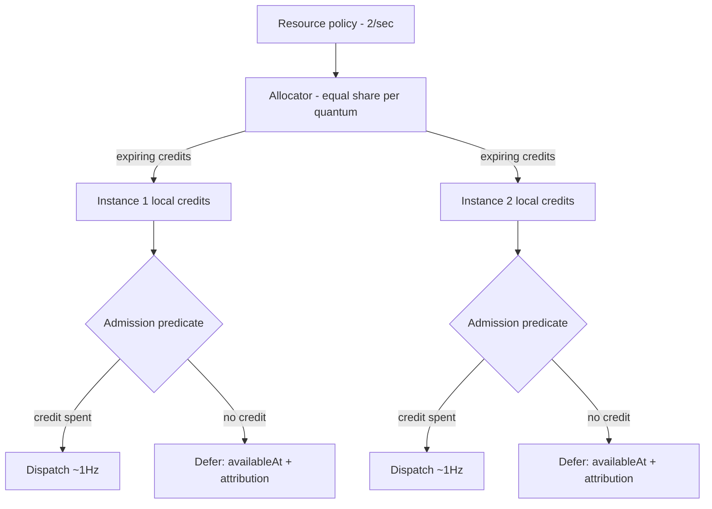
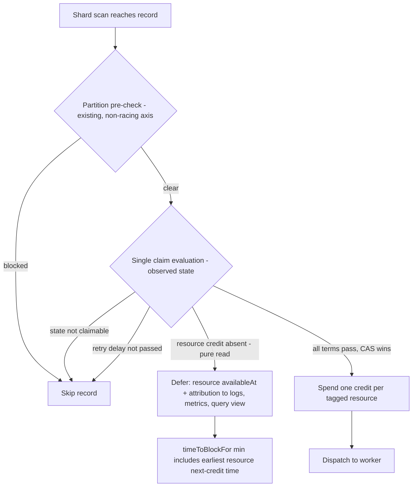
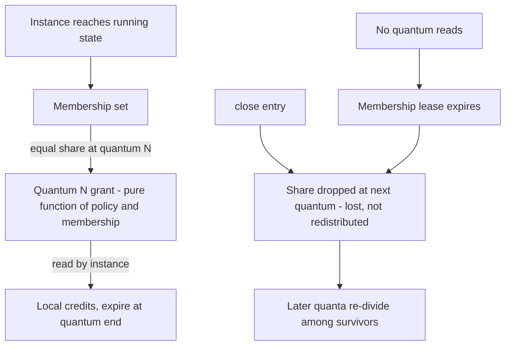

# Navigator Micro-MVP - Plan

## Goal Capsule

- **Objective:** Functions that share a named rate-limited resource collectively stay within its declared rate and burst - bounded overshoot, best effort - across PC instances, and every resource-withheld execution is explained - demonstrated as the observable moment from `docs/inflight/core-shared-execution-resources.md`: one 2-tokens/sec resource, two instances, each firing at ~1Hz, the wait attributed to the resource.
- **Means:** An admission predicate with `availableAt` deferral spending locally-held credits (KD1), granted by an in-process allocator that speaks the real lease interfaces while the distributed coordination plane stays stubbed (KD2).
- **Product authority:** This plan, then `docs/inflight/core-shared-execution-resources.md` for the design it instantiates. The larger Hasten Logistics MVP and the Kafka coordination rung are not active scope.
- **Stop conditions:** Stop and surface rather than work around if the eligibility term cannot join the single-claim evaluation without a second pre-filter step, or if the wall-clock lane cannot be stabilised under the no-retry CI policy (do not loosen assertions to force green - see R15 and `docs/testing.md`).
- **Open blockers:** None.

---

## Product Contract

### Summary

Add the navigator subsystem's first rung inside `parallel-consumer-core`: named-resource registration with a hardcoded policy, requirement tags on function registration, equal-share credit allocation through a stubbed-but-contract-faithful allocator, admission-time spend with `availableAt` deferral, and attribution of every resource wait in the admission subsystem's logs and metrics - proven by a virtual-clock test lane plus one thin wall-clock integration test.

### Key Decisions

- KD1. **Enforcement is an admission predicate with `availableAt` deferral, not a Little's-law in-flight controller.** A record whose resource has no local credit is not selectable until its next credit time; attribution falls out of the predicate. Composes with the existing admission target by conjunction - both must admit, each at its own seam: the slots target bounds what enters selection, the resource predicate gates the claim. (session-settled: user-approved - chosen over Little's-law enforcement: direct spend maps one-to-one to the credit model and does not duplicate the adaptive controller.) Governs R7, R9.
- KD2. **The coordination centralisation is stubbed; the lease interfaces are real.** An in-JVM allocator implements the distributed semantics (equal-share, expiry, death-loses-capacity) behind the seam vocabulary, so the Kafka rung later swaps transport, not seams. (session-settled: user-directed - chosen over building the real Kafka-elected coordinator now: the shape is the unknown; Kafka and KS capability is known and does not need exercising yet.) Governs R5, R6.
- KD3. **Allocation-only loop - no demand signals in v1.** Grants flow down, spend is local; demand reporting arrives with the Kafka rung. (session-settled: user-directed - chosen over including DemandSignal plumbing that equal-share would ignore: smallest surface first.) Governs R5.
- KD4. **"Navigator" names a subsystem, not a Maven module.** The code is a package inside `parallel-consumer-core`, wired through `PCModule` like the admission package. (session-settled: user-approved - chosen over a new Maven module: the predicate must live in the dispatch path, and a module boundary would freeze seams too early.)
- KD5. **Resource registration and requirement tagging are separate acts, and configuration errors fail fast.** A resource is registered with its policy (hardcoded max 2/s in v1); a function's registration context carries the list of resource names it requires. Create-on-missing is recorded as an option, not built. (session-settled: user-directed - chosen over create-on-missing default: a typo must not silently mint an unconstrained resource.) Governs R1, R2, R4, R19.
- KD6. **Two test lanes.** Credit, lease, and convergence mechanics run on the virtual clock (the branch's simulated-time precedent); one thin wall-clock integration test carries the honest observable moment with percentage-tolerance assertions. (session-settled: user-approved - chosen over a single wall-clock or single virtual-clock lane: wall-clock rate assertions are flake-prone as correctness gates, but a purely simulated 1Hz is weaker as proof.) Governs R14, R15.
- KD7. **No observer component.** Attribution lives in the admission subsystem's existing logs and metrics; measurement lives in test hooks around the user function. The web GUI observes in a later rung. Governs R9, R13, R18. (Stated by the owner in dialogue; no alternative was weighed, so it carries no settlement annotation.)
- KD8. **The standalone-throttle-vs-controller-signal decision stays open.** This spike must not foreclose it; conjunction with the existing admission target (KD1) is compatible with either resolution.
- KD9. **The design seed binds without restatement.** Delegated credits over per-record coordination, equal-share v1, credits-expire and death-loses-capacity, bounded overshoot over hard ceiling: `docs/inflight/core-shared-execution-resources.md` owns these; this plan records only its deltas. Governs R5, R6, R8.
- KD10. **The v1 limit is a soft credit system - cooperative and best-effort - not a hard semaphore.** A credit is advisory capacity: spend-last ordering keeps waste small, and a spent credit that fails to dispatch is waste, never a violation and never re-minted. Hard semaphore-style slots-that-return semantics arrive with the deferred hard-global-concurrency rung. (session-settled: user-directed - chosen over hard/transactional reservation semantics: soft limits are cooperative best effort; the semaphore system comes later.) Governs R7, R8, R12.
- KD11. **Resource tags attach per PC instance in v1.** Registration rides the instance's construction-time API; a multi-function-per-instance surface arrives with the per-function arbitration work. (session-settled: user-approved - chosen over a per-function-within-one-instance registration API: matches today's one-function-per-instance model, smallest surface.) Governs R2.

### Requirements

**Declaration and registration**

- R1. A named resource can be registered with a rate policy; v1 hardcodes the demo policy (max 2 tokens/sec, with an explicit burst value). The declared rate plus burst define the resource's overshoot bound (R8, R12).
- R2. A user function's registration context carries the list of named resources the function requires; nothing is declared inside the function body. In v1 the registration attaches per PC instance - tags ride the instance's construction-time registration alongside today's one-function-per-instance API.
- R3. A function that tags no resources is untouched by the navigator - admission behaves exactly as it does today.
- R4. Tagging a resource that is not registered fails fast at registration time with an error naming the unknown resource.
- R19. The other configuration conflicts fail fast the same way: registering an already-registered resource name with a different policy is an error naming the collision, and tagging resources when no allocator has been supplied is an error at construction - never a silent no-op and never a runtime failure deep in the engine.

**Allocation and spend**

- R5. A single allocator shares the resource's rate equally among active instances and delivers capacity as finite, expiring credits per quantum, addressed through the seam vocabulary of `docs/ideation/2026-08-29-hasten-compound-engineering-handoff.md` section 24 (ResourceContract, CapacityLease, ResourceAllocator, AdmissionController, Decision/Explanation).
- R6. The v1 allocator is in-process but honours the distributed semantics: unspent credits expire, an instance leaving loses its capacity until re-division, and nothing in the contract lets a replacement allocator re-mint an interval. Delivery is asynchronous: grants arrive on the quantum cadence, never synchronously with an admission check, and the seams tolerate a quantum in which no grant arrives.
- R7. Credits are spent at admission: a record whose function requires a resource is dispatched only when a local credit is available, and otherwise is deferred with an `availableAt` of the next credit time - never dispatched to wait. The spend is the last admission act: the free predicates (the existing admission target, ordering) are evaluated first and the credit is consumed only when dispatch follows (KD10). A function tagging several resources spends one credit from each at dispatch; when several are blocking, `availableAt` is the latest of their next credit times.
- R8. The promise is bounded overshoot - the bound being R1's rate plus burst, stated precisely once: over any window starting at a quantum boundary, credits debited (spends plus overdraft) never exceed rate x window + burst, with the initial allowance at most one quantum's grant and integral rounding per KTD4. Both test lanes assert this one invariant. Code, docs, and test names must not claim a hard ceiling.

**Attribution**

- R9. Every resource-deferred record's wait is attributed in the admission subsystem's logs and metrics as a machine-readable predicate naming the resource and the next credit time. When more than one predicate withholds a record, the attribution names every binding predicate, not a chosen one.

**Observable moment and measurement**

- R10. Two PC instances in one JVM, sharing the registered 2/sec resource, are each observed firing at ~1Hz sustained.
- R11. Closing one instance converges the survivor toward 2Hz via re-division of shares.
- R12. Aggregate observed rate stays within the overshoot bound R1 declares (rate plus burst) across the membership transition - asserted as observed best-effort behaviour, per KD10, never as a ceiling.
- R13. Firing is measured by hooks around the user function; a test that demonstrates the rate-limit attribution is part of done, not garnish.

**Test lanes**

- R14. Credit, expiry, and convergence mechanics are proven on the virtual clock, reusing the branch's simulated-time test approach - including that repeated reads of an issued quantum return the same grant, never a fresh one (v1's no-re-mint guarantee), and that a member that goes silent without closing loses its capacity through lease expiry.
- R15. One thin wall-clock integration test extends the existing multi-instance pattern and asserts rates with percentage tolerances over a window. It uses a deterministic fast user function with the adaptive admission target non-enforcing, so the hook-measured rate isolates the navigator's admission.

**Allocator membership and observability**

- R16. Every instance sharing a resource addresses the same allocator. Membership is anchored to processor state: an instance counts from its running transition and its share is dropped at close-entry, with membership changes taking effect at the next quantum.
- R17. A live member with no matching demand keeps its equal share and its unspent credits expire - accepted v1 underutilization, with demand-weighted allocation as its deferred remedy.
- R18. The context object available to the user function exposes a query over the virtual queues: how many entries are ineligible per ordering shard, for which resource, their `availableAt`, and the available rate per resource (instance-local and global). This is the observed-state surface the test harness asserts against, and the web GUI later reads. Reading it is side-effect-free.

### Key Flows

- F1. **Registration.**
  - **Trigger:** The application registers the resource, then registers a function tagging it.
  - **Steps:** Resource registered with policy; function registration validates every tagged name against registered resources; unknown name, policy collision, or missing allocator fails fast (R4, R19); untagged functions skip the navigator entirely (R3).
- F2. **Dispatch.**
  - **Trigger:** The engine considers a record of a resource-tagged function.
  - **Steps:** The slots target has already bounded what entered selection (KD1's conjunction acts upstream, at quantity-to-request); at the claim, ordering and execution state evaluate first, then the resource check; when all admit, the credit spend is the final act and the record dispatches. With no credit, the record defers with `availableAt` plus an attribution predicate naming every binding constraint (R7, R9).
- F3. **Membership change.**
  - **Trigger:** An instance closes.
  - **Steps:** The allocator drops the leaver's share at the next quantum - lost, not redistributed mid-window - then divides subsequent quanta among survivors (R11); aggregate stays within the overshoot bound throughout (R12).

### Acceptance Examples

- AE1. **Covers R10, R9.** Given both instances running against a backlog, when the window is measured, then each instance fires at ~1Hz within tolerance and every deferred record carries the resource's attribution.
- AE2. **Covers R11, R12.** Given steady state, when one instance is closed, then the survivor converges toward 2Hz and the aggregate stays within R1's declared overshoot bound during the transition.
- AE3. **Covers R4, R19.** Given no resource registered under the name `api-y`, when a function registers tagging `api-y`, then registration fails immediately naming `api-y`. Likewise a second registration of an existing name with a different policy, or tags with no allocator supplied, fail at construction.
- AE4. **Covers R3.** Given a third PC instance whose function carries no resource tags, running beside the two demo instances, then the untagged instance's throughput is unaffected by the navigator and no navigator attribution is ever recorded for its records.
- AE5. **Covers R7, R9.** Given a record deferred for lack of a credit, when its `availableAt` has not yet arrived, then the user function is not invoked for it; when `availableAt` arrives, it is dispatched; and throughout the deferral both the admission log and the metrics carry the resource's name and the next credit time.
- AE6. **Covers R18, R3.** Given an untagged instance, or a tagged instance with nothing currently deferred, when the context query is read, then it returns empty counts and unconstrained rates - no nulls, no side effects, nothing registered or allocated by the act of reading.

### Scope Boundaries

Deferred for later rungs: the Kafka coordination plane (election, minting, epochs, fencing), demand signals and demand-weighted allocation, create-on-missing resource registration, mid-window reclamation, multi-resource optimisation, adaptive global envelopes, hard global concurrency, web GUI observation, a two-process demo, and the twenty-instance conservation test (the scale-up of this same shape).

<!-- ce-section: work-relationships -->
### How This Work Fits Together

This plan owns the navigator micro-MVP only; the breakdown below is the current understanding, not a committed roadmap. What this rung validates is the seam set, in-process - a distributed rate-sharing claim waits for the cross-process/Kafka rung to exercise it.

- **Enables** the Kafka coordination rung, which replaces the stub allocator's transport behind the same lease seams.
- **Enables** the twenty-instance conservation test (`docs/inflight/core-shared-execution-resources.md`), which scales this shape under churn.
- **Shares** the admission seam with the adaptive concurrency controller (astubbs#333); the two compose by conjunction and this spike forecloses neither gating decision in `docs/inflight/core-distributed-throttling.md`.
- **Still to decide:** the larger two-node Hasten Logistics MVP (Prescience, Why Wait as a product surface, sparse completion under failure) - a later brainstorm; nothing here commits its scope.

### Dependencies / Assumptions

- Base is branch `feats/hasten-micro-mvp` (astubbs#333's tip plus the astubbs#367 strategy corpus); the master catch-up is deliberately deferred and this work must not merge across the master/perf divide.
- The existing per-record delay-until-retry eligibility mechanism generalises to `availableAt` deferral - verified at the selection path: `WorkContainer.isDelayPassed()` is the existing time-eligibility term, and the claim is a single compare-and-set (`isClaimableFrom` then `onQueueingForExecution`). The new time-eligibility term takes its name from the vocabulary already in the strategy notes (scheduled intent, temporal horizons) rather than minting new terms.
- Instance membership for re-division is derived from stub-allocator bookkeeping alone in v1, anchored per R16.

### Outstanding Questions

Deferred to implementation: the exact percentage tolerance and window length for the wall-clock lane are calibrated against the target hardware during implementation (the design constraints - anchored measurement, progress gating - are fixed by KTD8 and U6).

### Sources / Research

- Design authority: `docs/inflight/core-shared-execution-resources.md`; open gating decisions in `docs/inflight/core-distributed-throttling.md`; invariants in `docs/inflight/core-admission-scheduling-model.md`; seam vocabulary in `docs/ideation/2026-08-29-hasten-compound-engineering-handoff.md` section 24.
- Verified against code: the existing `AdmissionController` (`parallel-consumer-core/src/main/java/bz/stub/parallelconsumer/internal/admission/AdmissionController.java`) is a target-slots concurrency controller - it owns the engine-wide admission target consulted through `PCModule.admissionTargetSlots()` in `calculateQuantityToRequest`, not a per-record gate - so the resource predicate is new selection-path logic and the conjunction of KD1 is with that slots target. Its `AdmissionDecision`/`AdmissionDecisionReason` pair is the attribution-vocabulary pattern to mirror. `WorkContainer.isDelayPassed()`/`isClaimableFrom()`/`onQueueingForExecution()` form the single-CAS claim; `ShardManager.getLowestRetryTime()` feeding `timeToBlockFor()` is the wakeup precedent; `PCModuleTestEnv` injects a `MutableClock`; `MultiInstanceMetricsTest` and siblings spawn multiple instances sharing one meter registry; `AdmissionControllerTest` is the virtual-clock unit pattern; `AdmissionHorizonLaneTest` and its kit are the heavier simulated-horizon precedent.
- Verified absences: no resource-declaration surface exists on `ParallelConsumerOptions` or the public API; the existing `RateLimiter` class is a logging-cadence gate, not enforcement; no shared percentage-tolerance test helper exists - a few module tests use AssertJ's `Percentage` directly (`parallel-consumer-vertx` `VertxConcurrencyIT` is the idiom to copy); `PollContext`/`PollContextInternal` hold no engine-query surface today, so R18 is new plumbing at their two construction sites.
- Institutional learnings applied: a query must never mutate (`docs/solutions/architecture-patterns/a-query-must-never-mutate-derive-thread-safety-from-callers.md`); counter clamps hide conservation bugs (`docs/solutions/logic-errors/counter-clamp-hid-a-conditional-decrement-bug-2026-08-21.md`); the add/selection path must be self-defending (`docs/solutions/logic-errors/stale-container-blocks-fresh-work-same-offset-after-rebalance-2026-08-07.md`); timing assertions must anchor both sides to one causal event (`docs/solutions/test-flakiness/at-most-assertion-raced-the-block-it-checked-2026-08-13.md`); a timing bound used as a correctness gate manufactures its own evidence (`docs/solutions/best-practices/a-timing-bound-used-as-a-correctness-gate-manufactures-its-own-evidence.md`).
- Grounding dossier (machine-local): /tmp/compound-engineering-501/ce-brainstorm/hasten-navigator-micro-mvp/grounding.md
<!-- file-refs: N/A - machine-local scratch path outside the repo -->

---

## Planning Contract

Product Contract preservation: extended, no scope change - R16 gained the lifecycle anchors and R18 the per-ordering-shard/per-resource clarification confirmed at plan scoping; R19 and AE6 added under the same fail-fast and observability posture the contract already committed to; AE3 extended to cover R19; Outstanding Questions resolved in place (wakeup mechanism, hook placement, and demo policy values are now owned by KTD5, U6, and KTD7); the Sources line describing the existing admission seam corrected from "per-record gate" to target-slots controller.

### Key Technical Decisions

- KTD1. **The resource check is a pure read inside the single-claim evaluation; the spend happens only after the claim wins.** Eligibility for all tagged resources is evaluated read-only alongside the existing time-eligibility term in the claim's observed-state check; credits are consumed immediately after the claim CAS succeeds, for all tagged resources, as the final act before hand-off (instantiates KD1 and KD10; governed by R7). No second pre-filter-then-claim step - the claim path's own javadoc documents that defect class, and the one existing pre-check (`couldBeTakenAsWork`) is a different, non-racing axis. A record that loses the claim race spent nothing. KD1's conjunction is architectural, not per-record: the slots target keeps bounding what enters selection upstream (quantity-to-request), no per-record slots check joins the claim, and "the slots target is also constraining" is attributed through the existing rate-limited constraint report. **The post-claim debit always succeeds**: when the observed credit is gone - a quantum boundary between read and spend, a concurrent claimer, a multi-resource miss - the spend draws the quantum's ledger into overdraft and is counted as spent; no rollback, no un-claim, no refund - the burst term of R1's bound budgets exactly this overshoot (KD10). Strict one-credit-one-dispatch holds on the default single-threaded selection engine; under the measurement-only direct-pull engine's concurrent claimers, overshoot-within-bound is the guarantee.
- KTD2. **Credit accounting is conservation-derived.** Minted, spent, expired, and overdraft are monotonic counters; outstanding credit is derived, never maintained, and never clamped - a clamp papers over a conditional-decrement mismatch (the counter-clamp learning). The identity is minted + overdraft = spent + expired + outstanding, where overdraft counts debits taken when no credit remained (KTD1's always-succeeds rule) - visible in metrics, bounded by burst. Mutation-test each consumption path so the ledger provably closes.
- KTD3. **The shared allocator is application-supplied through the options.** A new options field carries the allocator; the application constructs one and passes the same instance into every instance's builder - the `meterRegistry` precedent from the multi-instance tests. Resolves R16's delivery mechanism. (session-settled: user-approved - chosen over a JVM-global registry: explicit sharing keeps scope visible and testable, and matches the one existing cross-instance precedent.)
- KTD4. **Quantum-indexed lazy minting from one canonical clock.** The grant for quantum N is a pure function of the policy and the membership at N - re-minting an issued quantum is impossible by construction, and no minting thread exists. The allocator takes its clock at its own construction (production: the engine's UTC source) and never reads any instance's module clock; the virtual-clock lane shares one `MutableClock` across the allocator and every participating test module env, so quantum indexing and `availableAt` comparisons advance together. The mutating quantum read has a named home: once per control-loop pass each instance pulls its current grant into local credits and renews its membership lease - mirroring the existing admission tick - so the claim-path eligibility read stays pure (KTD1) and an idle-but-live instance remains a member because the control loop ticks regardless of demand (R17); the lease TTL catches only an instance whose control loop has stopped. Equal share divides integrally: each member gets the floor, and remainder credits rotate deterministically by quantum index over a stable member ordering - no member starves indefinitely and total minted per quantum never exceeds the policy grant. Membership follows R16's anchors. (session-settled: user-approved - lifecycle anchors chosen over counting from construction / dropping after drain: a constructed-but-unstarted instance must not starve running ones, and the drain tail stays inside R12's bounded-overshoot framing.)
- KTD5. **`availableAt` is resource-keyed, not per-record.** The engine's poll-block bound (`timeToBlockFor`, which already takes the minimum over per-shard retry due-times) additionally considers the earliest next-credit time over resources that deferred work this pass. No per-record queue is touched on a credit grant - a grant changes one resource's time, not N records' state.
- KTD6. **Attribution mirrors the admission package's decision/reason pattern.** A navigator-scoped decision/reason pair with hand-assigned, never-reused metric values (the `AdmissionDecisionReason` discipline); one log line at the moment of deferral plus the existing rate-limited binding-constraint report style for steady state; metrics carry the continuous signal; a separate `.probe`-suffixed log channel if per-quantum chatter emerges. (session-settled: user-approved - cadence chosen over logging every re-evaluation: two reasonable implementations diverge wildly in log volume otherwise.)
- KTD7. **Demo policy values: one-second quantum, burst of one quantum's worth.** Rate 2/sec, quantum 1s, burst 2 - so the overshoot bound (R1, stated in R8) is concrete and the equal share at two instances is one credit per instance per quantum, matching the 1Hz observable. Burst manifests only as the overdraft allowance - no quantum ever mints more than rate x quantum. (session-settled: user-approved - chosen over a finer quantum: smoother rate is not worth the extra churn for the skateboard.)
- KTD8. **The wall-clock lane gates on progress and reports timing.** Assertions count firings over a window anchored to the first firing (both trigger and detector tied to one causal event), asserted with AssertJ `Percentage` tolerances; elapsed-time bounds are observations, never gates - a timing bound used as a correctness gate manufactures its own evidence, and this repo's CI has no retries.
- KTD9. **The context query is a narrow read-only view threaded at the two `PollContextInternal` construction sites.** Counts per ordering shard, rates per resource (instance-local and global); side-effect-free by contract, including no lazy initialisation on read; returns empty/zero when the navigator is inert (AE6). Per-shard ineligible counts are maintained on the controller thread at defer/undefer transitions - deduplicated by the record's deferral state, never incremented per evaluation pass - and read as a weakly-consistent snapshot; the user-function thread never scans the controller-owned shard map. (session-settled: user-approved - the per-ordering-shard/per-resource reading confirmed at plan scoping.)
- KTD10. **Rebalance, pause, and close are credit no-ops.** A deferred record never spent a credit (KTD1), so revocation refunds nothing and touches no ledger state - do not mirror the adaptive controller's revocation bookkeeping into the credit path (cites KD10's never-re-minted rule).
- KTD11. **Concurrency confidence comes from the branch's own static and scheduler-controlled tooling, not review alone.** Every navigator shared field carries `@GuardedBy` naming its lock (Error Prone's `GuardedBy` check already runs at ERROR, so every unlocked access is a compile failure; mind the ReadWriteLock caveat the engine rules file documents); the allocator's concurrent operations - grant reads of one quantum, spends, membership events, the query view - get a Lincheck scenario in the opt-in `lincheck` lane (`bin/lincheck-test.sh`); SpotBugs covers the new main and test code. (session-settled: user-directed - the owner directed using the concurrency static-analysis tooling and `@GuardedBy` to raise confidence on the new shared state.)

### High-Level Technical Design

The dispatch path, showing where the resource term joins the existing claim and where the spend lands:

The allocator's quantum and membership lifecycle:

Diagrams are directional guidance; the prose in KTD1-KTD10 and the governed requirements are authoritative.

---

## Implementation Units

### U1. Contract types, options surface, and fail-fast registration

- **Goal:** The declaration side exists: resource registration with a policy, per-instance requirement tags, the application-supplied allocator option, and every configuration error failing fast at construction.
- **Requirements:** R1, R2, R3, R4, R19 (KD5, KD11, KTD3).
- **Dependencies:** None.
- **Files:** `parallel-consumer-core/src/main/java/bz/stub/parallelconsumer/internal/navigator/` (new package: the resource contract/policy type, the lease and allocator seam interfaces per R5's vocabulary); `parallel-consumer-core/src/main/java/bz/stub/parallelconsumer/ParallelConsumerOptions.java` (resource tags field, allocator field, a `navigatorValidation()` method); `parallel-consumer-core/src/main/java/bz/stub/parallelconsumer/internal/PCModule.java` (memoised accessor); `parallel-consumer-core/src/test/java/bz/stub/parallelconsumer/internal/navigator/` (new test package).
- **Approach:**
  1. Define the seam types in the new package using section 24's names (R5); keep them minimal - the contract carries name, rate, burst, quantum.
  2. Add the options fields following the adaptive-concurrency option group's shape: builder fields, javadoc, one dedicated validation method called from `validate()`.
  3. The shared allocator owns the resource registry: registering a resource records its name and policy there, before any instance is built; instance construction looks its tags up in that registry.
  4. Validation enforces R4 and R19 against the registry: unknown tag, policy collision on an already-registered name, tags-without-allocator - each a distinct, named error.
  5. `PCModule` gains a memoised navigator accessor; reason explicitly about which threads reach it before choosing synchronized (the `admissionController()` accessor documents why it is).
- **Patterns to follow:** `ParallelConsumerOptions.adaptiveConcurrencyValidation()` and the `AdaptiveConcurrencyMode` option group; `PCModule.admissionController()` memoisation; fork copyright header (`Copyright (C) 2026 Antony Stubbs and contributors`) on all new files per `docs/copyright.md`.
- **Test scenarios:**
  - Covers AE3. Tagging an unregistered name fails at build with the name in the message.
  - Covers AE3. Registering `api-x` twice with different policies fails naming the collision; registering twice with the identical policy is accepted.
  - Covers AE3. Tags present but no allocator supplied fails at construction.
  - No tags, no allocator: options validate exactly as today (untouched path).
  - Test class names satisfy the module's ArchUnit test conventions (`Test*`/`*Test` naming).
- **Verification:** New unit tests green; existing options tests unaffected; `bin/check-all.sh` clean on the new files.

### U2. The stub allocator: equal-share quantum minting with conservation accounting

- **Goal:** The in-process allocator honours the distributed semantics behind the real seams: quantum-indexed lazy minting, equal share, expiry, membership lifecycle, no re-mint, conservation counters.
- **Requirements:** R5, R6, R16, R17 (KD2, KD9, KTD2, KTD4).
- **Dependencies:** U1.
- **Files:** the allocator implementation in the new navigator package; its virtual-clock unit tests in the test package.
- **Approach:**
  1. Implement KTD4's lazy minting: the grant for quantum N is computed on read from the allocator's own construction-time clock, policy, and membership-at-N; store only membership events and monotonic counters, never a mutable pool.
  2. Membership per R16: join on running transition, drop at close-entry, changes effective next quantum; a silent member's lease (renewed by its per-pass quantum reads, KTD4) expires only when its control loop has stopped.
  3. State the concurrency contract explicitly: membership events are appended under one monitor; membership-at-N resolves only from events effective before quantum N's start, so concurrent lazy reads of the same quantum reproduce identical grants; counters are `LongAdder`s; grant computation is lock-free over an immutable membership snapshot. Every shared field carries `@GuardedBy` (KTD11).
  4. Conservation per KTD2: minted/spent/expired as monotonic adders; outstanding derived; no clamps.
  5. Expose the per-resource next-credit time (feeds KTD5's wakeup and R9's attribution) and the R18 rate views.
- **Execution note:** Implement the mechanics test-first on the virtual clock - every semantic here is a time function, and the tests are cheaper to write before the code.
- **Patterns to follow:** `AdmissionControllerTest`'s `MutableClock` drive pattern (construct real object, `clock.add(...)`, assert); `LongAdder` conservation per the counter-clamp learning; `@GuardedBy` on every shared field per KTD11 and the engine rules file, so Error Prone enforces the lock discipline at compile time.
- **Test scenarios:**
  - Covers AE1 mechanics. Two members, 2/sec, 1s quantum: each reads one credit per quantum; unspent credits are gone next quantum (expiry).
  - Covers AE2 mechanics / R11. Close one member at mid-quantum: its share is lost for the current quantum, survivors get full division from the next; convergence to 2 credits/quantum for the survivor.
  - Covers R14. Repeated and concurrent reads of an issued quantum return the identical grant, never a fresh one - determinism plus the spent/expired ledgers are v1's no-re-mint mechanism; the successor-allocator (epoch-fenced) proof belongs to the Kafka rung.
  - Covers R14. A member that stops reading quanta loses membership after its lease TTL; capacity is lost until re-division, never redistributed mid-window.
  - Covers R12. Across any membership transition, minted-per-window never exceeds rate + burst (the R1 bound) - asserted from the conservation counters.
  - Covers R17. A member with no spends retains its share; its credits expire; the busy member's rate is unchanged.
  - Covers R16/KTD4. A constructed-but-not-yet-running instance is excluded from the equal-share division; running members' per-quantum credit is unaffected until it reaches running.
  - Covers KTD4. Three members sharing 2 credits/quantum: floor division plus deterministic remainder rotation - no member starves indefinitely, and minted-per-quantum never exceeds the policy grant.
  - Edge: membership drops to zero - later quanta mint nothing (or mint-and-expire harmlessly); a new joiner starts clean with no stale state.
  - Conservation: for arbitrary event interleavings (joins, leaves, spends, overdraft debits, expiry), minted + overdraft = spent + expired + outstanding at every observation point.
  - Covers KTD11. A Lincheck scenario in the `lincheck` lane drives concurrent grant reads of the same quantum, spends, and membership events against the allocator, asserting linearizable outcomes and the conservation identity - the scheduler-controlled complement to the single-threaded virtual-clock lane.
- **Verification:** All allocator tests deterministic on the virtual clock, no wall-clock sleeps; the Lincheck scenario green in its lane (`bin/lincheck-test.sh`); mutation-test the spend/expiry paths to show the ledger closes (`bin/ci-mutation-test.sh` scoped run or targeted PIT if available).

### U3. Selection-path integration: pure eligibility, spend-after-claim, resource-keyed wakeup

- **Goal:** A record whose resource lacks a credit is not selectable, is not invoked, and wakes when the credit arrives; a dispatched record spends exactly at claim success; rebalance and close touch no credit state.
- **Requirements:** R7, R3 (KD1, KD10, KTD1, KTD5, KTD10).
- **Dependencies:** U1, U2.
- **Files:** `parallel-consumer-core/src/main/java/bz/stub/parallelconsumer/state/WorkContainer.java` (the resource-eligibility term joining the claim evaluation); `parallel-consumer-core/src/main/java/bz/stub/parallelconsumer/internal/AbstractParallelEoSStreamProcessor.java` (`timeToBlockFor` extension); wiring through `PCModule`; virtual-clock tests driven through `PCModuleTestEnv`.
- **Approach:**
  1. The eligibility term is a pure read (never mutates allocator or record state) evaluated with the existing observed-state check in the claim - per KTD1, no separate pre-filter.
  2. On claim CAS success for a tagged record, spend one credit per tagged resource as the final act before hand-off; a lost race spends nothing.
  3. Extend `timeToBlockFor`'s minimum with the earliest next-credit time over resources that deferred work this pass (KTD5) - mirror the `getLowestRetryTime()` shape, resource-keyed.
  4. Untagged functions take a zero-cost path: no navigator lookups on their records (R3).
  5. Wire the allocator lifecycle from the processor: membership join on the running transition and leave at close-entry in `AbstractParallelEoSStreamProcessor`, plus the per-pass quantum read/lease renewal at the control-loop tick (KTD4) - the same seam as the existing admission tick.
  6. Revocation/pause/close paths: assert by review and test that no credit mutation exists on them (KTD10).
- **Patterns to follow:** `WorkContainer.isDelayPassed()`/`isClaimableFrom()` (the time-eligibility precedent and the single-CAS discipline its javadoc documents); `ShardManager.getLowestRetryTime()`; the engine field rules in `parallel-consumer-core/src/main/java/bz/stub/parallelconsumer/AGENTS.md` (`@GuardedBy`, shared-state ledgers) for any new field.
- **Test scenarios:**
  - Covers AE5. On the virtual clock: a deferred record's function is not invoked before `availableAt`; advancing the clock past it dispatches the record.
  - Spend-at-claim: with one credit and two eligible records, exactly one dispatches and exactly one credit is spent; the loser spent nothing and defers with `availableAt` (single-threaded selection engine; under the direct-pull engine's concurrent claimers the assertion is instead that total debits stay within R1's bound via the overdraft counter).
  - Quantum-boundary debit: a credit observed as available expires before the post-claim spend - the debit still succeeds, lands as overdraft, and the conservation identity holds.
  - Multi-resource: a function tagging two resources with one blocked defers with `availableAt` = the later next-credit time; on dispatch both credits are spent atomically-after-claim.
  - Multi-resource, both blocked with different next-credit times: `availableAt` equals the later of the two - the max-of-several path is driven, not trivially satisfied.
  - Covers R16/AE2 mechanics. An explicit close drops the leaver's share at the next quantum without waiting for the lease TTL; the TTL path engages only when no close was signalled.
  - Wakeup: with all work deferred, the computed block time is bounded by the earliest resource next-credit time, not the default poll interval.
  - Covers AE4 mechanics / R3. Untagged records dispatch with no navigator interaction (verify via the query view recording nothing).
  - Covers KTD10. Revoking the deferred record's partition changes no conservation counter.
  - Concurrency: the eligibility read is exercised under the existing claim-race tests (extend `WorkClaimStateMachineTest`-style coverage) - no check-then-act window between eligibility and spend.
- **Verification:** Virtual-clock tests green and deterministic; full `bin/ci-unit-test.sh` green (cross-module selection-path tests unaffected); no new field lands without its `@GuardedBy`/ledger entry per the engine `AGENTS.md`.

### U4. Attribution: decision vocabulary, metrics, and logs

- **Goal:** Every resource deferral is explained where the admission subsystem already speaks - machine-readable, all binding predicates named, at the confirmed cadence.
- **Requirements:** R9 (KD7, KTD6).
- **Dependencies:** U3.
- **Files:** navigator decision/reason types in the navigator package; `parallel-consumer-core/src/main/java/bz/stub/parallelconsumer/metrics/PCMetricsDef.java` (new meter entries); log emission at the deferral site in the selection path.
- **Approach:**
  1. Decision/reason pair mirroring `AdmissionDecision`/`AdmissionDecisionReason`: hand-assigned metric values, retired values never reused.
  2. One log line at the moment of deferral naming resource(s) and next credit time; steady-state re-report through a rate-limited binding-constraint line (the `constraintReportLimiter` pattern); metrics continuous.
  3. The schema is explicit: the log line and the metrics carry every binding resource's name and next-credit time as repeated fields - never a chosen one - plus a slots-constrained marker when the admission target is also binding (R9's all-binding-predicates clause), with hand-assigned reason values for single-resource, multi-resource, and resource-plus-slots deferrals.
  4. New meters follow the `PCMetricsDef` enum shape under a navigator subsystem grouping; registration no-ops when the navigator is inert.
- **Patterns to follow:** `AdmissionDecisionReason.getReasonToValueListing()` discipline; `constraintReportLimiter` in `AdmissionController`; grep-able log prefix convention; `.probe` logger-name split if per-quantum chatter emerges.
- **Test scenarios:**
  - Covers AE5. A deferral emits exactly one defer-moment log line naming resource and next credit time; metrics show the deferred gauge and reason value.
  - Multi-predicate: resource blocked while the slots target is also binding - the attribution names both predicates.
  - Multi-resource attribution: two blocking resources - both names and both next-credit times present in the log line and the metrics.
  - Cadence: a deferral lasting many evaluation passes emits no per-pass log spam; the rate-limited constraint line fires at its interval.
  - Inert: no navigator meters register when no resources are tagged.
- **Verification:** Unit tests green; metric names and values reviewed against the never-reuse rule; log output inspected in the U6 IT run.

### U5. The context-object query surface

- **Goal:** The user function's context can answer "what is ineligible, why, and what rate is available" - side-effect-free, empty when inert.
- **Requirements:** R18 (KD7, KTD9).
- **Dependencies:** U2, U3.
- **Files:** a narrow read-only view interface in the navigator package; `parallel-consumer-core/src/main/java/bz/stub/parallelconsumer/PollContext.java` and `internal/PollContextInternal.java` (carry the view); the two `PollContextInternal` construction sites in `AbstractParallelEoSStreamProcessor.java`.
- **Approach:**
  1. Define the view: ineligible-entry counts per ordering shard, per-resource `availableAt` and available rate (instance-local and global).
  2. Thread it as a constructor parameter at the two construction sites - the processor already holds the module; expose the narrow view, not `PCModule`.
  3. Reads are pure: no lazy initialisation, no registration, no allocation of navigator state as a side effect of reading (AE6).
- **Patterns to follow:** the pure-query learning (a query must never mutate); keep `PollContext`'s public surface minimal - one accessor returning the view.
- **Test scenarios:**
  - Covers AE6. Untagged instance: query returns empty counts and unconstrained rates; repeated reads register nothing (assert conservation counters untouched).
  - Covers AE6. Tagged instance with nothing currently deferred: query returns empty counts and unconstrained rates, matching the untagged case - no stale or leftover state.
  - Covers AE5/AE1. With records deferred on the virtual clock, the query reports the count per shard, the resource, and its `availableAt` consistent with the allocator's next-credit time.
  - Thread-safety: the view is readable from the user-function thread while the control loop mutates state - reads see a consistent snapshot or a documented weakly-consistent view, never an exception.
- **Verification:** Unit tests green; the U6 IT uses this query for its observed-state assertions, proving the surface end-to-end.

### U6. The wall-clock observable moment: multi-instance integration test

- **Goal:** The honest demo: two tagged instances at ~1Hz each, a third untagged instance unaffected, kill-one convergence, attribution visible - stable under the no-retry CI policy.
- **Requirements:** R10, R11, R12, R13, R15 (KD6, KTD7, KTD8).
- **Dependencies:** U3, U4, U5.
- **Files:** `parallel-consumer-core/src/test-integration/java/bz/stub/parallelconsumer/integrationTests/NavigatorRateShareTest.java` (new, name per ArchUnit conventions and the `MultiInstance*` family); `docs/inflight/core-shared-execution-resources.md` (the Definition of Done's landing note - recorded here so a unit owns it).
- **Approach:**
  1. Extend the `MultiInstanceMetricsTest` construction pattern: one shared allocator instance passed into each tagged instance's options (KTD3); a third untagged instance beside them; consumer-group wiring per the existing utilities.
  2. Deterministic fast user function (record firing timestamps in the test's own hook - R13); the adaptive admission target stays at its default non-enforcing mode so only the navigator gates (R15).
  3. Measurement per KTD8: anchor the window at the first firing; assert firing counts over the window with AssertJ `withPercentage` (the vertx `VertxConcurrencyIT` idiom); await asserted state with Awaitility on the asserted metric, never a counter inside the poll function.
  4. Close one tagged instance; assert the survivor's count-rate converges and the aggregate window count stays within the R1 bound (R12).
- **Execution note:** Calibrate the window and tolerance on the target hardware before trusting them; if the lane cannot be made stable, stop and surface per the Goal Capsule stop condition - do not loosen assertions to force green.
- **Patterns to follow:** `MultiInstanceMetricsTest` (instance construction, REUSE_GROUP, Awaitility discipline and its documented flake history); `BrokerIntegrationTest` base; the anchored-measurement and progress-gating learnings.
- **Test scenarios:**
  - Covers AE1. Both tagged instances fire at ~1Hz within tolerance over the anchored window; every deferred record carried attribution (assert via U5 query and metrics).
  - Covers AE2. After close, the survivor converges toward 2Hz; the aggregate stays within the bound across the transition.
  - Covers AE4. The untagged instance's throughput matches its unthrottled baseline and records zero navigator attributions.
  - Covers AE5 (smoke). At least one deferral observed with its log line and metric present (the strict not-invoked-before assertion lives in U3's virtual-clock lane).
- **Verification:** `bin/ci-integration-test.sh` green including the new test; the design note's micro-MVP landing update written; any flake sighting recorded per `docs/quarantined-tests.md` discipline before merge, never retried away.

---

## Verification Contract

| Check | Command | Proves |
|---|---|---|
| Compile + unit tests | `bin/build.sh` (JDK 17 via per-command `JAVA_HOME`) | U1-U5 unit lanes, ArchUnit conventions |
| Full unit suite | `bin/ci-unit-test.sh` | No cross-module regression from selection-path changes |
| Integration suite | `bin/ci-integration-test.sh` (Docker required) | U6, the observable moment (AE1-AE4) |
| Repo gates | `bin/check-all.sh` before every push | Copyright headers, citations, issue refs, all `bin/` gates |
| Concurrency lane | `bin/lincheck-test.sh` (opt-in `lincheck` group) | KTD11's scheduler-controlled allocator scenarios; Error Prone's `GuardedBy` check enforces lock discipline at every compile |
| Mutation scope | `bin/ci-mutation-test.sh` (navigator package when scoped runs are supported) | KTD2's ledger closes; exit codes per `docs/ci.md` |

No `-Dsurefire.rerunFailingTestsCount` anywhere - a flake fails the build by design; the lever is the quarantine registry with evidence.

---

## Definition of Done

- All six units complete with their test scenarios green; AE1-AE6 each demonstrably covered by a named test.
- `bin/check-all.sh`, `bin/ci-unit-test.sh`, and `bin/ci-integration-test.sh` green on the branch.
- New engine fields carry their `@GuardedBy`/ledger entries per the engine `AGENTS.md`; no new field lands undocumented, and every navigator shared field's `@GuardedBy` compiles clean under Error Prone's check (KTD11); the Lincheck lane runs green.
- The attribution vocabulary's metric values are hand-assigned and recorded under the never-reuse rule.
- No scaffolding remains: no scratch tests, debug logging, commented-out experiments, or abandoned-approach code in the diff.
- `docs/inflight/core-shared-execution-resources.md` is updated in the same change to record that the micro-MVP rung landed and what the next rung inherits; any flake sighted during CI is recorded in the quarantine ledger before merge.
