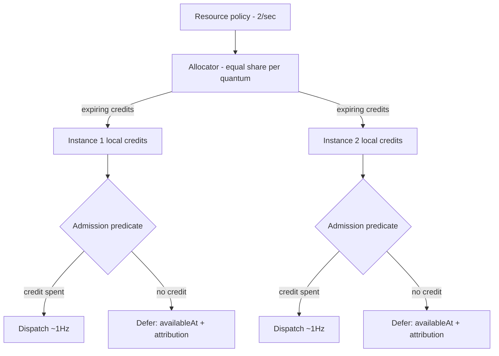

# Navigator Micro-MVP - Plan

## Goal Capsule

- **Objective:** Functions that share a named rate-limited resource collectively stay within its declared rate and burst - bounded overshoot, best effort - across PC instances, and every resource-withheld execution is explained - demonstrated as the observable moment from `docs/inflight/core-shared-execution-resources.md`: one 2-tokens/sec resource, two instances, each firing at ~1Hz, the wait attributed to the resource.
- **Means:** An admission predicate with `availableAt` deferral spending locally-held credits, granted by an in-process allocator that speaks the real lease interfaces while the distributed coordination plane stays stubbed.
- **Product authority:** This plan, then `docs/inflight/core-shared-execution-resources.md` for the design it instantiates. The larger Hasten Logistics MVP and the Kafka coordination rung are not active scope.
- **Open blockers:** None.

---

## Product Contract

### Summary

Add the navigator subsystem's first rung inside `parallel-consumer-core`: named-resource registration with a hardcoded policy, requirement tags on function registration, equal-share credit allocation through a stubbed-but-contract-faithful allocator, admission-time spend with `availableAt` deferral, and attribution of every resource wait in the admission subsystem's logs and metrics - proven by a virtual-clock test lane plus one thin wall-clock integration test.

### Key Decisions

- KD1. **Enforcement is an admission predicate with `availableAt` deferral, not a Little's-law in-flight controller.** A record whose resource has no local credit is not selectable until its next credit time; attribution falls out of the predicate. Composes with the existing admission target by conjunction - both must admit. (session-settled: user-approved - chosen over Little's-law enforcement: direct spend maps one-to-one to the credit model and does not duplicate the adaptive controller.) Governs R7, R9.
- KD2. **The coordination centralisation is stubbed; the lease interfaces are real.** An in-JVM allocator implements the distributed semantics (equal-share, expiry, death-loses-capacity) behind the seam vocabulary, so the Kafka rung later swaps transport, not seams. (session-settled: user-directed - chosen over building the real Kafka-elected coordinator now: the shape is the unknown; Kafka and KS capability is known and does not need exercising yet.) Governs R5, R6.
- KD3. **Allocation-only loop - no demand signals in v1.** Grants flow down, spend is local; demand reporting arrives with the Kafka rung. (session-settled: user-directed - chosen over including DemandSignal plumbing that equal-share would ignore: smallest surface first.) Governs R5.
- KD4. **"Navigator" names a subsystem, not a Maven module.** The code is a package inside `parallel-consumer-core`, wired through `PCModule` like the admission package. (session-settled: user-approved - chosen over a new Maven module: the predicate must live in the dispatch path, and a module boundary would freeze seams too early.)
- KD5. **Resource registration and requirement tagging are separate acts, and a tag of an unknown resource fails fast.** A resource is registered with its policy (hardcoded max 2/s in v1); a function's registration context carries the list of resource names it requires. Create-on-missing is recorded as an option, not built. (session-settled: user-directed - chosen over create-on-missing default: a typo must not silently mint an unconstrained resource.) Governs R1, R2, R4.
- KD6. **Two test lanes.** Credit, lease, and convergence mechanics run on the virtual clock (the branch's simulated-time precedent); one thin wall-clock integration test carries the honest observable moment with percentage-tolerance assertions. (session-settled: user-approved - chosen over a single wall-clock or single virtual-clock lane: wall-clock rate assertions are flake-prone as correctness gates, but a purely simulated 1Hz is weaker as proof.) Governs R14, R15.
- KD7. **No observer component.** Attribution lives in the admission subsystem's existing logs and metrics; measurement lives in test hooks around the user function. The web GUI observes in a later rung. Governs R9, R13, R18. (Stated by the owner in dialogue; no alternative was weighed, so it carries no settlement annotation.)
- KD8. **The standalone-throttle-vs-controller-signal decision stays open.** This spike must not foreclose it; conjunction with the existing admission target (KD1) is compatible with either resolution.
- KD9. **The design seed binds without restatement.** Delegated credits over per-record coordination, equal-share v1, credits-expire and death-loses-capacity, bounded overshoot over hard ceiling: `docs/inflight/core-shared-execution-resources.md` owns these; this plan records only its deltas. Governs R5, R6, R8.
- KD10. **The v1 limit is a soft credit system - cooperative and best-effort - not a hard semaphore.** A credit is advisory capacity: spend-last ordering keeps waste small, and a spent credit that fails to dispatch is waste, never a violation and never re-minted. Hard semaphore-style slots-that-return semantics arrive with the deferred hard-global-concurrency rung. (session-settled: user-directed - chosen over hard/transactional reservation semantics: soft limits are cooperative best effort; the semaphore system comes later.) Governs R7, R8, R12.
- KD11. **Resource tags attach per PC instance in v1.** Registration rides the instance's construction-time API; a multi-function-per-instance surface arrives with the per-function arbitration work. (session-settled: user-approved - chosen over a per-function-within-one-instance registration API: matches today's one-function-per-instance model, smallest surface.) Governs R2.

### Requirements

**Declaration and registration**

- R1. A named resource can be registered with a rate policy; v1 hardcodes the demo policy (max 2 tokens/sec, with an explicit burst value). The declared rate plus burst define the resource's overshoot bound (R8, R12).
- R2. A user function's registration context carries the list of named resources the function requires; nothing is declared inside the function body. In v1 the registration attaches per PC instance - tags ride the instance's construction-time registration alongside today's one-function-per-instance API.
- R3. A function that tags no resources is untouched by the navigator - admission behaves exactly as it does today.
- R4. Tagging a resource that is not registered fails fast at registration time with an error naming the unknown resource.

**Allocation and spend**

- R5. A single allocator shares the resource's rate equally among active instances and delivers capacity as finite, expiring credits per quantum, addressed through the seam vocabulary of `docs/ideation/2026-08-29-hasten-compound-engineering-handoff.md` section 24 (ResourceContract, CapacityLease, ResourceAllocator, AdmissionController, Decision/Explanation).
- R6. The v1 allocator is in-process but honours the distributed semantics: unspent credits expire, an instance leaving loses its capacity until re-division, and nothing in the contract lets a replacement allocator re-mint an interval. Delivery is asynchronous: grants arrive on the quantum cadence, never synchronously with an admission check, and the seams tolerate a quantum in which no grant arrives.
- R7. Credits are spent at admission: a record whose function requires a resource is dispatched only when a local credit is available, and otherwise is deferred with an `availableAt` of the next credit time - never dispatched to wait. The spend is the last admission act: the free predicates (the existing admission target, ordering) are evaluated first and the credit is consumed only when dispatch follows (KD10). A function tagging several resources spends one credit from each at dispatch; when several are blocking, `availableAt` is the latest of their next credit times.
- R8. The promise is bounded overshoot - the bound being R1's rate plus burst - and code, docs, and test names must not claim a hard ceiling.

**Attribution**

- R9. Every resource-deferred record's wait is attributed in the admission subsystem's logs and metrics as a machine-readable predicate naming the resource and the next credit time. When more than one predicate withholds a record, the attribution names every binding predicate, not a chosen one.

**Observable moment and measurement**

- R10. Two PC instances in one JVM, sharing the registered 2/sec resource, are each observed firing at ~1Hz sustained.
- R11. Closing one instance converges the survivor toward 2Hz via re-division of shares.
- R12. Aggregate observed rate stays within the overshoot bound R1 declares (rate plus burst) across the membership transition - asserted as observed best-effort behaviour, per KD10, never as a ceiling.
- R13. Firing is measured by hooks around the user function; a test that demonstrates the rate-limit attribution is part of done, not garnish.

**Test lanes**

- R14. Credit, expiry, and convergence mechanics are proven on the virtual clock, reusing the branch's simulated-time test approach - including that a successor allocator cannot re-mint an already-issued quantum, and that a member that goes silent without closing loses its capacity through lease expiry.
- R15. One thin wall-clock integration test extends the existing multi-instance pattern and asserts rates with percentage tolerances over a window. It uses a deterministic fast user function with the adaptive admission target non-enforcing, so the hook-measured rate isolates the navigator's admission.

**Allocator membership and observability**

- R16. Every instance sharing a resource addresses the same allocator, registering on start and deregistering on close; membership changes take effect at the next quantum. Whether the shared allocator is application-supplied or JVM-scoped is planning's choice.
- R17. A live member with no matching demand keeps its equal share and its unspent credits expire - accepted v1 underutilization, with demand-weighted allocation as its deferred remedy.
- R18. The context object available to the user function exposes a query over the virtual queues: how many entries are ineligible, for which resource, their `availableAt`, and the available rate globally and per shard. This is the observed-state surface the test harness asserts against, and the web GUI later reads.

### Key Flows

- F1. **Registration.**
  - **Trigger:** The application registers the resource, then registers a function tagging it.
  - **Steps:** Resource registered with policy; function registration validates every tagged name against registered resources; unknown name fails fast (R4); untagged functions skip the navigator entirely (R3).
- F2. **Dispatch.**
  - **Trigger:** The engine considers a record of a resource-tagged function.
  - **Steps:** Admission evaluates the free predicates first - the existing admission target in conjunction (KD1), then the resource check; when all admit, the credit spend is the final act and the record dispatches. With no credit, the record defers with `availableAt` plus an attribution predicate naming every binding constraint (R7, R9).
- F3. **Membership change.**
  - **Trigger:** An instance closes.
  - **Steps:** The allocator drops the leaver's share at the next quantum - lost, not redistributed mid-window - then divides subsequent quanta among survivors (R11); aggregate stays within the overshoot bound throughout (R12).

### Acceptance Examples

- AE1. **Covers R10, R9.** Given both instances running against a backlog, when the window is measured, then each instance fires at ~1Hz within tolerance and every deferred record carries the resource's attribution.
- AE2. **Covers R11, R12.** Given steady state, when one instance is closed, then the survivor converges toward 2Hz and the aggregate stays within R1's declared overshoot bound during the transition.
- AE3. **Covers R4.** Given no resource registered under the name `api-y`, when a function registers tagging `api-y`, then registration fails immediately naming `api-y`.
- AE4. **Covers R3.** Given a third PC instance whose function carries no resource tags, running beside the two demo instances, then the untagged instance's throughput is unaffected by the navigator and no navigator attribution is ever recorded for its records.
- AE5. **Covers R7, R9.** Given a record deferred for lack of a credit, when its `availableAt` has not yet arrived, then the user function is not invoked for it; when `availableAt` arrives, it is dispatched; and throughout the deferral both the admission log and the metrics carry the resource's name and the next credit time.

### Scope Boundaries

Deferred for later rungs: the Kafka coordination plane (election, minting, epochs, fencing), demand signals and demand-weighted allocation, create-on-missing resource registration, mid-window reclamation, multi-resource optimisation, adaptive global envelopes, hard global concurrency, web GUI observation, a two-process demo, and the twenty-instance conservation test (the scale-up of this same shape).

<!-- ce-section: work-relationships -->
### How This Work Fits Together

This plan owns the navigator micro-MVP only; the breakdown below is the current understanding, not a committed roadmap. What this rung validates is the seam set, in-process - a distributed rate-sharing claim waits for the cross-process/Kafka rung to exercise it.

- **Enables** the Kafka coordination rung, which replaces the stub allocator's transport behind the same lease seams.
- **Enables** the twenty-instance conservation test (`docs/inflight/core-shared-execution-resources.md`), which scales this shape under churn.
- **Shares** the admission seam with the adaptive concurrency controller (astubbs#333); the two compose by conjunction and this spike forecloses neither gating decision in `docs/inflight/core-distributed-throttling.md`.
- **Still to decide:** the larger two-node Hasten Logistics MVP (Prescience, Why Wait as a product surface, sparse completion under failure) - a later brainstorm; nothing here commits its scope.

### Dependencies / Assumptions

- Base is branch `feats/hasten-micro-mvp` (astubbs#333's tip plus the astubbs#367 strategy corpus); the master catch-up is deliberately deferred and this work must not merge across the master/perf divide.
- Assumes the existing per-record delay-until-retry eligibility mechanism generalises to `availableAt` deferral; planning verifies at the selection path. The new time-eligibility term takes its name from the vocabulary already in the strategy notes (scheduled intent, temporal horizons) rather than minting new terms.
- Assumes instance membership for re-division can be derived from stub-allocator bookkeeping alone in v1.

### Outstanding Questions

Deferred to Planning: the quantum length and burst value for the demo policy; how a deferred record's wakeup is scheduled when its `availableAt` arrives; where the firing hooks attach so both test lanes share them; the measurement window, percentage tolerance, and maximum convergence latency that make the rate assertions falsifiable without flaking under the no-retry CI policy.

### Sources / Research

- Design authority: `docs/inflight/core-shared-execution-resources.md`; open gating decisions in `docs/inflight/core-distributed-throttling.md`; invariants in `docs/inflight/core-admission-scheduling-model.md`; seam vocabulary in `docs/ideation/2026-08-29-hasten-compound-engineering-handoff.md` section 24.
- Verified against code: `AdmissionController` is the single in-flight seam with OBSERVE/ENFORCE modes (`parallel-consumer-core/src/main/java/bz/stub/parallelconsumer/internal/admission/AdmissionController.java`); `PCModule` provides the memoised-accessor DI pattern; `WorkContainer.isDelayPassed()`/`isAvailableToTakeAsWork()` is the existing time-based eligibility predicate in the selection path; `MultiInstanceMetricsTest`, `MultiInstanceHighVolumeTest`, `MultiInstanceRebalanceTest` spawn multiple instances in one JVM; `AdmissionHorizonLaneTest` and its kit are the virtual-clock precedent.
- Verified absences: no resource-declaration surface exists on `ParallelConsumerOptions` or the public API; the existing `RateLimiter` class is a logging-cadence gate, not enforcement; no shared percentage-tolerance test helper exists - a few tests use AssertJ's `Percentage` directly, so the wall-clock lane uses AssertJ and any richer helper goes into the shared test utilities.
- Grounding dossier (machine-local): /tmp/compound-engineering-501/ce-brainstorm/hasten-navigator-micro-mvp/grounding.md
<!-- file-refs: N/A - machine-local scratch path outside the repo -->
