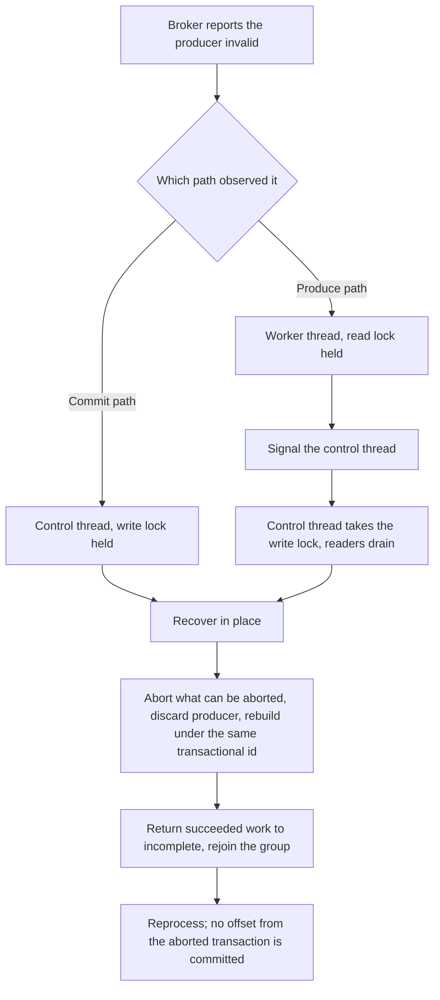

# Recoverable Producer Fencing - Plan

## Goal Capsule

**Objective.** Give Parallel Consumer a transactional producer it owns, so that when the broker tells it the producer is no longer usable, PC closes that producer, builds a replacement, and carries on — instead of spinning forever on the produce path or shutting the instance down on the commit path. Tracked as astubbs#225.

**Product authority.** `STRATEGY.md` > `AGENTS.md` > this plan > implementer judgement. The recovery shape is modelled on Kafka Streams' `TaskMigratedException` handling, but Streams is a reference and not a constraint: where PC can do better, it does.

**Open blockers.** None. Everything remaining in Outstanding Questions is a build decision deferred to planning.

**Execution profile.** Public API change to `ParallelConsumerOptions` with a deprecation, plus core changes in `ProducerManager`, `ProducerWrapper` and `ParallelEoSStreamProcessor`. Reverses one shipped behaviour (confluentinc#839).

---

## Product Contract

### Summary

PC accepts producer configuration and builds its own transactional producer through an overridable factory, rather than being handed a finished `Producer` instance. Owning the producer is what makes recovery possible: when the broker reports the producer invalid, PC discards it, builds a fresh one, and continues from redelivered records. Handing PC a producer instance stays supported and deprecated, without recovery.

### Problem Frame

A transactional producer can stop being usable for reasons that have nothing to do with the application being wrong. Under KIP-447, losing a rebalance race invalidates the producer's group generation. A broker can expire a producer id after a quiet period. A stale epoch can arrive from a commit that overran its generation. None of these mean the data is unsafe, and none of them mean the instance should stop.

PC has two answers today and both are wrong, in opposite directions.

On the **commit path**, `ProducerManager.commitOffsets` catches `ProducerFencedException` and rethrows it as `PCInternalRuntimeException`. Nothing between there and the supervisor loop catches it, so it becomes `failureReason`, triggers `doClose`, and the instance is gone. Offsets stay dirty and the records are redelivered, so the data is correct; only the liveness is wrong.

On the **produce path**, `ParallelEoSStreamProcessor` catches `InvalidPidMappingException` around the produce-and-ack block and calls `closeOnException`. That shutdown was itself a fix. Before it, PC retried the same record forever. A user hit exactly that in production and reported it as astubbs#411 (`confluentinc#830`), running `PERIODIC_TRANSACTIONAL_PRODUCER` with a per-instance UUID `transactional.id`, after two days of producer inactivity. Their own requested remedy was "close the producer that is causing this error and create a new producer instance". What shipped instead was `confluentinc#839`, which converted the spin into a shutdown, chosen on the maintainer's stated uncertainty about whether a transaction could be restarted without losing in-flight work.

**That catch fires only on a synchronous throw from the produce call, not on the ack wait.** `FutureRecordMetadata.valueOrError` raises `new ExecutionException(exception)`, so the future's `get` can only surface an `ExecutionException`, which falls past the typed catch into the generic handler that wraps it as `PCInternalRuntimeException("Error while waiting for produce results", e)` — verbatim the stack trace in the report. The regression test mocks the synchronous throw, so it passes without covering the reported path. R9 therefore has to unwrap before matching, and the reported spin may still be reachable on master; that is a defect in its own right, not something this work can assume already handled.

**The maintainer's doubt was better founded than it looks, and the obvious answer to it is wrong.** Offsets do stay dirty on a failed commit, but dirty is not the same as incomplete: `PartitionState.onSuccess` removes the offset from the incomplete set and raises the succeeded watermark at success time, while `onOffsetCommitSuccess` only records the committed offset and clears the dirty flag. Redelivery today is a consequence of the instance *dying* and rebuilding its offset state from the broker. An instance that survives keeps that in-memory completion, so the next commit would carry offsets whose output the abort discarded. Recovery therefore owes an explicit un-completion step — the same pairing Kafka Streams makes between resetting its producer and closing its tasks dirty.

The library exists to keep processing under conditions that would stall a plain consumer. Dying when the broker hands back a routine, recoverable condition is the opposite of that.

The reason PC cannot recover today is structural rather than incidental. `ParallelConsumerOptions` holds a finished `Producer` instance and `ProducerWrapper` assigns it once from `options.getProducer()` into a final field. PC cannot read a `KafkaProducer`'s configuration back out, so it cannot construct a replacement. `initTransactions()` is called once from the `ProducerManager` constructor and never again, and `abortTransaction()` is reachable only from the close path. That same opacity is why `ProducerWrapper.discoverIfProducerIsConfiguredForTransactions` reaches into `KafkaProducer`'s private `transactionManager` field, under a comment that names the alternative and doubts it — "Nasty reflection but better than relying on user supplying a copy of their config, maybe".

### Key Decisions

- **PC builds its own producer from configuration, through an overridable factory.** (session-settled: user-directed — chosen over adding recovery around a user-supplied `Producer` instance: PC cannot read a finished producer's configuration, so it cannot build a replacement, and recovery is impossible without one.) Governs R1, R2, R3, R7.
- **PC derives the `transactional.id` wherever PC builds the producer.** (session-settled: user-directed — chosen over letting the user set it on the PC-owned path: a `transactional.id` shared by two live instances makes re-initialisation fence the other holder, which re-initialises and fences back.) Governs R4, R5, R6, R19.
- **The producer-instance option stays, deprecated, without recovery, and its removal is queued for the next major.** (session-settled: user-directed — chosen over removing it outright now: keeping it lowers the barrier for existing users, while queueing the removal stops producer handling being written twice indefinitely.) Governs R15, R16, R18, R20.
- **One recoverable condition, not a per-exception taxonomy.** (session-settled: user-approved — chosen over classifying each transaction failure separately: Kafka Streams collapses the same four exceptions into a single migration signal, and the response PC needs is identical for all of them.) Governs R8, R9, R10.
- **The produce-path case is absorbed rather than left to a separate change.** (session-settled: user-directed — chosen over scoping this to the commit path: it is the only trigger with a real user report, and recovery is better than both behaviours it replaces.) Governs R11, R17.
- **Recovery attempts are unbounded.** (session-settled: user-approved — chosen over a bounded attempt count: Kafka Streams has no migration counter at all, and PC owning the `transactional.id` removes the failure mode a bound would guard against.) Governs R12, R14.
- **Recovery is not observable to the application beyond logs and metrics.** (session-settled: user-approved — chosen over a public exception, a listener callback, or reuse of the commit-failure handler surface: recovery is PC's own business, like a retry, and nothing here forecloses adding a hook later.) Governs R21, R22, R23.
- **This work supersedes astubbs/parallel-consumer#352's R6 rather than amending it.** (session-settled: user-directed — chosen over rewording R6 before that PR merges: R6 was true of the behaviour when written, and a later change making an earlier true statement untrue is the ordinary order, not an error to correct pre-emptively.) Governs R17.
- **Kafka Streams is the reference, not the specification.** Its shape is copied where it fits and diverged from where PC can do better; every divergence is named at the requirement it affects.

### Requirements

**Producer ownership and configuration**

- R1. `ParallelConsumerOptions` accepts producer configuration for every produce flow, from which PC constructs the producer. Recovery applies only where PC is transactional; the configuration path itself is not restricted to those flows.
- R2. Producer construction goes through a factory that callers may override, so a caller can wrap, instrument, or substitute the producer without supplying a finished one.
- R3. The factory has a default that requires no caller action; supplying producer configuration alone is sufficient to use the produce flows.
- R4. Where PC builds the producer, PC sets the `transactional.id`. The value is unique per running instance, is stable for that instance's life, and is reused by every replacement producer so that re-initialisation fences the producer it replaces.
- R5. A caller-set `transactional.id` on the PC-built path does not take effect, and PC says so at WARN naming the value it derived instead.
- R6. The derived `transactional.id` uses a documented prefix derived from `group.id`, with only the uniqueness suffix varying, so a single prefixed TransactionalId ACL authorises it.
- R7. Producer configuration is never rendered into logs, exception messages, or any `toString()`, and any diagnostic that does render it redacts every key Kafka types as a password.

**Detection and recovery**

- R8. PC treats the producer as invalid on `ProducerFencedException`, `InvalidProducerEpochException`, `CommitFailedException` and `InvalidPidMappingException`, and responds to all four identically.
- R9. Detection unwraps `ExecutionException` and any `KafkaException` wrapper before matching the conditions in R8, so a condition surfacing from a send future is recognised.
- R10. On detecting an invalid producer, PC attempts to abort the open transaction, discards the producer, builds a replacement through the factory, rejoins the consumer group, and resumes processing.
- R11. Recovery is reachable from both the commit path and the produce path.
- R12. Recovery repeats as often as the condition recurs, with no attempt limit and no terminal state reached by counting.
- R13. Recovery returns to incomplete every record marked succeeded since the last successful commit, so work whose output the abort discarded is reprocessed rather than having its offset committed.
- R14. A replacement producer that fails to build or initialise is retried on the next commit cycle with backoff rather than inline; a failure retrying cannot fix, such as an authorization denial, is terminal and names the `transactional.id` that was refused.

**Compatibility and migration**

- R15. Supplying a `Producer` instance continues to work for every flow it works for today, and is marked deprecated.
- R16. Supplying both producer configuration and a `Producer` instance fails options validation rather than resolving silently to one of them.
- R17. On the PC-built path, `InvalidPidMappingException` on the produce path recovers rather than closing the instance, replacing the behaviour `confluentinc#839` intended.
- R18. On the producer-instance path, every condition in R8 keeps its current terminal behaviour, and PC logs at WARN, once, naming the recovery unavailable and what enables it.
- R19. Adopting the PC-built path requires re-granting any TransactionalId ACL against the prefix in R6, and the upgrade notes say so.
- R20. The `Producer`-instance option's deprecation javadoc names the release its removal is queued for, matching the entry in `docs/refactoring.md`.

**Observability**

- R21. Each recovery emits a log record identifying the triggering condition and the outcome.
- R22. Recoveries are counted in the metrics surface, distinguishably from ordinary commit failures.
- R23. Consecutive recoveries with no successful commit between them are counted separately and raise the log level, so an instance that is alive but not progressing is distinguishable from one that recovered once.

### Actors

- A1. The application — supplies producer configuration, and optionally a factory; does not manage producer lifecycle.
- A2. The user function — runs on a worker thread and returns records for PC to produce; sees no new failure type as a result of this work.
- A3. Parallel Consumer — owns producer construction, transaction lifecycle, detection, and recovery on the PC-built path.

### Key Flows

The two arrival paths differ in which thread observes the condition and which lock it holds, and that difference is what recovery has to bridge.

- F1. Commit-path recovery
  - **Trigger:** A condition in R8 is raised while PC is committing offsets inside a transaction.
  - **Actors:** A1, A3
  - **Steps:** The control thread already holds the commit write lock, so no worker can be producing. PC aborts what can be aborted, discards the producer, builds a replacement under the same `transactional.id`, returns work succeeded since the last successful commit to incomplete, rejoins the group, and releases the lock.
  - **Outcome:** The instance keeps running and the work is redelivered.
  - **Covers R8, R10, R11, R13.**

- F2. Produce-path recovery
  - **Trigger:** A condition in R8 surfaces from a send future on a worker thread, wrapped in `ExecutionException`.
  - **Actors:** A1, A2, A3
  - **Steps:** The worker unwraps the condition from its `ExecutionException`. It holds the produce read lock, so it cannot replace the producer itself: it reports the condition and releases its lock. The control thread acquires the write lock, which drains the remaining readers, then recovers as in F1.
  - **Outcome:** The instance keeps running; the affected records are redelivered.
  - **Covers R8, R9, R10, R11, R13, R17.**

- F3. Recovery unavailable
  - **Trigger:** A condition in R8 arises while PC is using a caller-supplied `Producer` instance.
  - **Actors:** A1, A3
  - **Steps:** PC cannot build a replacement, so it behaves as it does today and logs once at WARN naming what would enable recovery.
  - **Outcome:** Terminal, as today, but the reason and the remedy are stated.
  - **Covers R15, R18.**

### Acceptance Examples

- AE1. **Covers R8, R10, R11, R13.** Given PC is running with PC-built producer configuration and a transaction is open, when the broker raises any of the four conditions during offset commit, then the instance is still running afterwards, no offset from that transaction is committed, and every record in it is processed again.
- AE2. **Covers R9, R11, R17.** Given the same configuration, when `InvalidPidMappingException` surfaces from the ack wait on a worker thread, then the instance is still running afterwards and does not close — the behaviour confluentinc#839 introduced no longer applies on this path.
- AE3. **Covers R12.** Given the condition recurs on several consecutive cycles, when each recovery completes, then PC recovers again each time and reaches no terminal state through repetition alone.
- AE4. **Covers R4, R5, R6.** Given a caller sets a `transactional.id` in producer configuration on the PC-built path, when PC constructs the producer, then the value PC derived is used, a WARN names the override, and two instances of the same application never share an id.
- AE5. **Covers R15, R18.** Given a caller supplies a `Producer` instance, when any condition in R8 occurs, then behaviour matches today's and a single WARN names the unavailable recovery and what enables it.
- AE6. **Covers R16.** Given a caller supplies both producer configuration and a `Producer` instance, when options are validated, then construction fails with a message naming both.
- AE7. **Covers R7.** Given producer configuration carrying SASL and TLS secrets, when PC starts and logs its options, then no credential material appears in the output.
- AE8. **Covers R13.** Given a record completed successfully earlier in a transaction that is then aborted by recovery, when the next commit runs, then that record's offset is not committed and the record is processed again.
- AE9. **Covers R14.** Given the replacement producer cannot reach the transaction coordinator, when recovery runs, then PC retries on a later cycle with backoff rather than looping inline; and given the `transactional.id` is not authorised, then PC fails terminally naming that id.
- AE10. **Covers R23.** Given recovery fires repeatedly with no successful commit between attempts, when the pattern continues, then the consecutive count is observable and the log level rises above the single-recovery case.

### Scope Boundaries

**Deferred for later**

- The wider transaction-failure taxonomy from astubbs#241 (`confluentinc#144`) — the arbitrary retry limit in `ProducerManager.commitOffsets` and the undifferentiated use of `PCInternalRuntimeException` for expected operational states. This plan introduces one recoverable condition; classifying the rest is separate.
- The consumer remains a caller-supplied instance. The same argument for configuration-plus-factory applies to it, and is not this problem.
- The unbounded wait at `onPartitionsRevoked` for an in-flight transaction to finish, owned by `docs/inflight/bug-857-transactional-revoke-wait.md`. astubbs#29 bounded the `PERIODIC_CONSUMER_SYNC` revoke path by declining the commit lock; the transactional wait is untouched. It reduces how often the commit path reaches a fencing condition without removing it.
- The commit-failure seam in astubbs/parallel-consumer#352, which gives the application a decision when a commit exhausts its retry budget. Dependencies / Assumptions owns the relationship and the sequencing.
- Actually removing the `Producer`-instance option. R20 only requires the deprecation to name its release; the removal is queued in `docs/refactoring.md` under the next-major section and lands there, not here.
- The remaining reflection in `ProducerWrapper` for transaction state (`isCompleting`, `isReady`). Owning the configuration removes the need to *discover* whether the producer is transactional; it does not remove these.

**Outside this work**

- The Kafka Streams execution seam (astubbs#255). `PcTaskDispatcher` builds PC with a stub consumer and no producer, taking only the work manager, so PC has no producer on that path and nothing here reaches it.
- Any change to the guarantee that a partial result set is never published. Recovery preserves it rather than relaxing it.

### Dependencies / Assumptions

- Assumes aborting a transaction on an already-invalid producer may itself raise, and that this is expected rather than fatal — Kafka Streams' `StreamsProducer.abortTransaction` swallows exactly these exceptions on the grounds that the broker or transaction coordinator has already aborted the transaction.
- Assumes PC's existing produce/commit lock pair provides the exclusion recovery needs on the commit path: producing takes the read lock of `producerTransactionLock` and committing takes the write lock, with `preAcquireOffsetsToCommit` acquiring and flushing before `commitOffsets` runs. No new quiescing mechanism is assumed.
- Assumes `group.id` is available to derive the R6 prefix from, matching how Kafka Streams derives one from `application.id`. This plan adds no separate prefix option; R6 makes the derived prefix documented and stable so a single prefixed ACL covers it.
- Does **not** assume redelivery is already correct. Dirty offsets alone do not achieve R13: `PartitionState.onSuccess` clears an offset from the incomplete set at success time, long before any commit, so an instance that survives the abort keeps that completion. Un-completion is a mechanism this work owes, not a property it inherits.
- Sequenced after astubbs/parallel-consumer#352, which merges first and unchanged. That PR's R6 — a fenced transactional producer stays immediately fatal without consulting its handler — is a true statement of the behaviour it was written against, held by `producerFencedOnSendOffsetsStaysFatalAndNeverReachesTheCommitLoop` and `recoveryAbortFailureStaysFatalAndHandlerFree` in `ProducerManagerCommitBudgetTest`. This work makes it untrue and therefore rewrites both, along with that PR's own R6 line and the corresponding statements in its commit-failure-seam feature file and README section. Every "R6" elsewhere in this plan is this plan's own R6, the derived-prefix requirement. Per `AGENTS.md`, the reasoning being overridden is recorded where it is overridden, so the change does not read as an oversight. Both PRs edit `ProducerManager` and `ProducerWrapper`, so textual conflicts are expected independently of this.
- The two remain complementary in what they own: astubbs/parallel-consumer#352 decides who chooses when a commit exhausts its budget; this decides what PC does when the producer itself is unusable. Only the fencing branch inside `ProducerManager.commitOffsets` is shared.

### Outstanding Questions

**Deferred to planning**

- Whether the recoverable condition is represented as an internal exception type, a state on `ProducerManager`, or a signal on the existing commit-response channel. R8 fixes what is detected; how it travels is a build decision.
- How a worker signals the control thread on the produce path without adding a second wait with its own deadline.
- Whether `State` gains a member for the window in which the producer is being replaced, or whether the write lock alone is sufficient to make that window invisible.
- The exact `transactional.id` derivation, given that the integration harness in `parallel-consumer-core/src/test-integration/java/bz/stub/parallelconsumer/integrationTests/utils/KafkaClientUtils.java` already invents random ids to stop tests fencing each other, and that workaround becomes product behaviour.

### Sources / Research

- astubbs#225 is the tracking issue. `docs/data/roadmap.yaml` carries it as `survive-producer-fencing`, horizon `next-0x`, `blocks_1_0: false`.
- astubbs#411 (`confluentinc#830`) is the only field report: `PERIODIC_TRANSACTIONAL_PRODUCER`, UNORDERED, per-instance UUID `transactional.id`, triggered by two days of producer inactivity. `confluentinc#839` is the shutdown that answered it, merged upstream and carried in this fork's history, still visible as the `InvalidPidMappingException` catch in `ParallelEoSStreamProcessor`.
- `docs/inflight/core-recoverable-producer-fencing.md` is this work's in-flight note; it names the corrections this plan makes to the issue's own proposal and carries the facts that live nowhere else.
- astubbs#241 (`confluentinc#144`) records that `ProducerManager.commitOffsets` treats every commit failure identically, and says astubbs#225 and it should be designed together. `docs/inflight/core-241-tx-commit-failure-taxonomy.md` corrects that premise: a coarse taxonomy has existed since confluentinc#355, and the retry loop already catches only `TimeoutException` and `InterruptException`.
- Kafka Streams 3.9.2 is the reference implementation: `StreamsProducer.commitTransaction` collapses `ProducerFencedException`, `InvalidProducerEpochException`, `CommitFailedException` and `InvalidPidMappingException` into `TaskMigratedException`; `StreamThread.handleTaskMigrated` closes tasks and resubscribes; `TaskManager.handleLostAll` calls `reInitializeThreadProducer` under EOS-v2, reaching `StreamsProducer.resetProducer`, which closes the producer and asks `KafkaClientSupplier` for another. `DefaultKafkaClientSupplier.getProducer` is the one-line default that makes the supplier free to callers. `StreamsConfig` lists `TRANSACTIONAL_ID_CONFIG` in `NON_CONFIGURABLE_PRODUCER_EOS_CONFIGS` and warns-and-drops a caller-set value.
- KAFKA-14567 ("Kafka Streams crashes after ProducerFencedException") is the reason Streams' shape is copied without assuming it is airtight.
- `TransactionManager`'s `TxnOffsetCommit` handler in kafka-clients 3.9.2 is where the four conditions diverge in the client: `UNKNOWN_MEMBER_ID` and `ILLEGAL_GENERATION` become an abortable `CommitFailedException`, while `INVALID_PRODUCER_EPOCH` and `PRODUCER_FENCED` become a fatal `ProducerFencedException`. PC catches only the latter today.
- No test exercises producer fencing, transaction abort, or recovery. One test does pin the behaviour R17 replaces: `ParallelEoSStreamProcessorTest.closePCWhenInvalidPidMappingException` asserts the produce-path shutdown, and must be rewritten under R17 — though it mocks a synchronous throw from the produce call rather than the wrapped failure the field report shows, so it does not cover the reported path. The only other occurrence of the concept in the test tree is the comment in `KafkaClientUtils` explaining why test producers are given random transactional ids.
- The defect class does not recur outside the core module: `produceMessages` is referenced only in `parallel-consumer-core`, and the vertx, reactor and mutiny processors inherit the core produce path through `ExternalEngine` rather than duplicating it.
