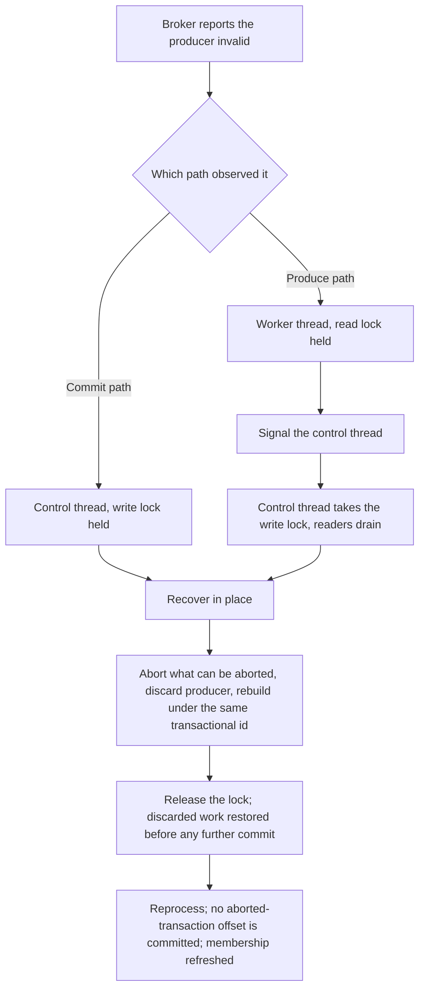
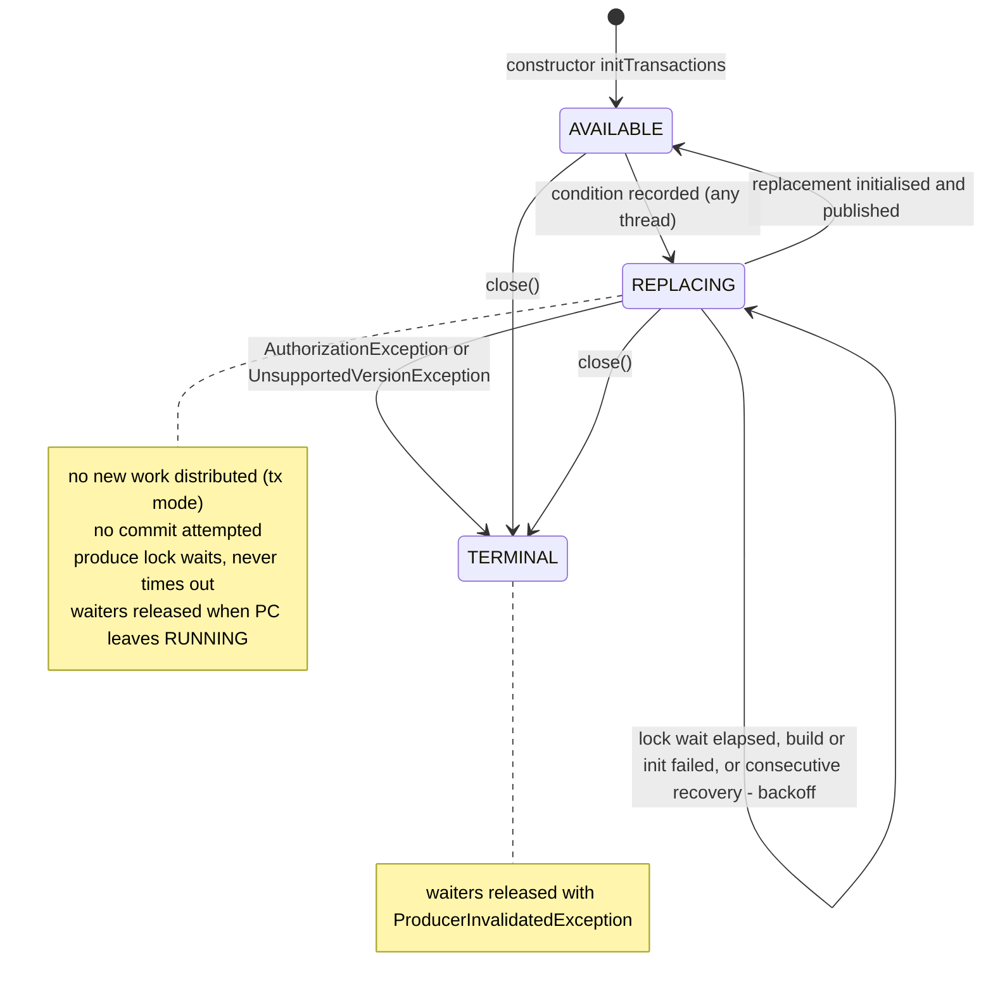

# Recoverable Producer Fencing - Plan

## Goal Capsule

**Objective.** Give Parallel Consumer a transactional producer it owns, so that when the broker tells it the producer is no longer usable, PC closes that producer, builds a replacement, and carries on — instead of spinning forever on the produce path or shutting the instance down on the commit path. Tracked as astubbs#225.

**Product authority.** `STRATEGY.md` > `AGENTS.md` > this plan > implementer judgement. The recovery shape is modelled on Kafka Streams' `TaskMigratedException` handling, but Streams is a reference and not a constraint: where PC can do better, it does.

**Open blockers.** None. The two mechanisms the requirements left open are now validated against the code: R13 by KTD5 (a completed-but-uncommitted ledger replayed through the poll-batch registration route) and R14 by KTD6 (no explicit rejoin; the poll thread already refreshes membership and group metadata, and recovery orders itself before any revoke-path commit by holding the commit lock). Both KTDs cite the identifiers they rest on.

**Stop conditions.** Stop and report rather than improvise if any of these is found false while implementing: `ShardManager.addWorkContainer` cannot be reached from `PartitionState` for a record the partition still owns (KTD5); the revoke-path commit can run while the control thread holds the producer write lock (KTD6); a rebalance callback would become reachable to a blocking call, which `ArchitectureTest.rebalanceCallbacksMustNotBlock` forbids (KTD4); or the `@GuardedBy` build check rejects the ledger's monitor (KTD5).

**Execution profile.** Public API change to `ParallelConsumerOptions` with a deprecation, plus core changes in `ProducerManager`, `ProducerWrapper`, `PartitionState`, `ParallelEoSStreamProcessor` and `AbstractParallelEoSStreamProcessor`. Reverses one shipped behaviour (confluentinc#839). Critical-path code: transactional commit and produce. Local verification is the implementer's; the push and PR tail belong to the caller.

**Product Contract preservation.** Product Contract unchanged. The `Outstanding Questions` subsection is resolved in place: each deferred question now names the KTD that answers it.

---

## Product Contract

### Summary

PC accepts producer configuration and builds its own transactional producer through an overridable factory, rather than being handed a finished `Producer` instance. Owning the producer is what makes recovery possible: when the broker reports the producer invalid, PC discards it, builds a fresh one, and continues from redelivered records. Handing PC a producer instance stays supported and deprecated, without recovery.

### Problem Frame

A transactional producer can stop being usable for reasons that have nothing to do with the application being wrong. Under KIP-447, losing a rebalance race invalidates the producer's group generation. A broker can expire a producer id after a quiet period. A stale epoch can arrive from a commit that overran its generation. None of these mean the data is unsafe, and none of them mean the instance should stop.

PC has two answers today and both are wrong, in opposite directions.

On the **commit path**, `ProducerManager.commitOffsets` catches `ProducerFencedException` and rethrows it as `PCInternalRuntimeException`. Nothing between there and the supervisor loop catches it, so it becomes `failureReason`, triggers `doClose`, and the instance is gone. Offsets stay dirty and the records are redelivered, so the data is correct; only the liveness is wrong.

On the **produce path**, `ParallelEoSStreamProcessor` catches `InvalidPidMappingException` around the produce-and-ack block and calls `closeOnException`. That shutdown was itself a fix. Before it, PC retried the same record forever. A user hit exactly that in production and reported it as astubbs#411 (`confluentinc#830`), running `PERIODIC_TRANSACTIONAL_PRODUCER` with a per-instance UUID `transactional.id`, after two days of producer inactivity. Their own requested remedy was "close the producer that is causing this error and create a new producer instance". **Their configuration supplies a `Producer` instance** — today the only option — so it stays on the path that keeps its terminal behaviour, and the fix reaches them only once they move to the PC-built path. What shipped instead was `confluentinc#839`, which converted the spin into a shutdown, chosen on the maintainer's stated uncertainty about whether a transaction could be restarted without losing in-flight work.

**That catch fires only on a synchronous throw from the produce call, not on the ack wait.** `FutureRecordMetadata.valueOrError` raises `new ExecutionException(exception)`, so the future's `get` can only surface an `ExecutionException`, which falls past the typed catch into the generic handler that wraps it as `PCInternalRuntimeException("Error while waiting for produce results", e)` — verbatim the stack trace in the report. The regression test mocks the synchronous throw, so it passes without covering the reported path. R9 therefore has to unwrap before matching, and the reported spin may still be reachable on master; that is a defect in its own right, not something this work can assume already handled.

**The maintainer's doubt was better founded than it looks, and the obvious answer to it is wrong.** Offsets do stay dirty on a failed commit, but dirty is not the same as incomplete: `PartitionState.onSuccess` removes the offset from the incomplete set and raises the succeeded watermark at success time, while `onOffsetCommitSuccess` only records the committed offset and clears the dirty flag. Redelivery today is a consequence of the instance *dying* and rebuilding its offset state from the broker. An instance that survives keeps that in-memory completion, so the next commit would carry offsets whose output the abort discarded. Recovery therefore owes a mechanism for making that work processable again — the same pairing Kafka Streams makes between resetting its producer and closing its tasks dirty. Restoring the offset alone does not do it: `PartitionState.onSuccess` drops the `ConsumerRecord` with the offset and `ProcessingShard.onSuccess` retires the `WorkContainer`, so an offset restored without its work can never complete.

The library exists to keep processing under conditions that would stall a plain consumer. Dying when the broker hands back a routine, recoverable condition is the opposite of that.

The reason PC cannot recover today is structural rather than incidental. `ParallelConsumerOptions` holds a finished `Producer` instance and `ProducerWrapper` assigns it once from `options.getProducer()` into a final field. PC cannot read a `KafkaProducer`'s configuration back out, so it cannot construct a replacement. `initTransactions()` is called once from the `ProducerManager` constructor and never again, and `abortTransaction()` is reachable only from the close path. That same opacity is why `ProducerWrapper.discoverIfProducerIsConfiguredForTransactions` reaches into `KafkaProducer`'s private `transactionManager` field, under a comment that names the alternative and doubts it — "Nasty reflection but better than relying on user supplying a copy of their config, maybe".

### Key Decisions

- **PC builds its own producer from configuration, through an overridable factory.** (session-settled: user-directed — chosen over adding recovery around a user-supplied `Producer` instance: PC cannot read a finished producer's configuration, so it cannot build a replacement, and recovery is impossible without one.) Governs R1, R2, R3, R7.
- **PC derives the `transactional.id` wherever PC builds the producer.** (session-settled: user-directed — chosen over letting the user set it on the PC-owned path: a `transactional.id` shared by two live instances makes re-initialisation fence the other holder, which re-initialises and fences back.) Governs R4, R5, R6, R20.
- **The producer-instance option stays, deprecated, without recovery, and its removal is queued for the next major.** (session-settled: user-directed — chosen over removing it outright now: keeping it lowers the barrier for existing users, while queueing the removal stops producer handling being written twice indefinitely.) Governs R16, R17, R19, R21.
- **One recoverable condition, not a per-exception taxonomy.** (session-settled: user-approved — chosen over classifying each transaction failure separately: Kafka Streams collapses the same four exceptions into a single migration signal, and the response PC needs is identical for all of them.) Governs R8, R9, R10, R13, R14.
- **The produce-path case is absorbed rather than left to a separate change.** (session-settled: user-directed — chosen over scoping this to the commit path: it is the only trigger with a real user report, and recovery is better than both behaviours it replaces.) Governs R11, R18.
- **Recovery attempts are unbounded.** (session-settled: user-approved — chosen over a bounded attempt count: Kafka Streams has no migration counter at all, and PC owning the `transactional.id` removes the failure mode a bound would guard against.) Governs R12, R15.
- **Recovery is not observable to the application beyond logs and metrics.** (session-settled: user-approved — chosen over a public exception, a listener callback, or reuse of the commit-failure handler surface: recovery is PC's own business, like a retry, and nothing here forecloses adding a hook later.) Governs R22, R23, R24.
  - Correction, 2026-09-02 (review of astubbs/parallel-consumer#410, finding 9): as first implemented this was not delivered at the record level. A worker's `ProducerInvalidatedException` took the same arm as a user-function failure, so `RecordContext.getNumberOfFailedAttempts()` rose by one per recovery, the retry delay applied, and a dead-letter-after-N policy could dead-letter a live record once per rebuild-and-refence cycle. It now IS silent at the record level: a batch that could not be produced because the producer was being replaced is deferred (`WorkContainer.deferForRecovery()`), re-queued with no attempt counted, no retry delay, no last-failure reason, and no count on the failed-records meter. The Assumptions bullet "a worker's failed produce counts as an ordinary failure of that record" is overridden by this correction. Pinned by `ProducerRecoveryTest.aRecordDeferredForRecoveryCarriesNoFailedAttemptAndCountsOnNoFailureMeter`.
- **This work supersedes astubbs/parallel-consumer#352's R6 rather than amending it.** (session-settled: user-directed — chosen over rewording R6 before that PR merges: R6 was true of the behaviour when written, and a later change making an earlier true statement untrue is the ordinary order, not an error to correct pre-emptively.) Governs R10, R11.
- **Kafka Streams is the reference, not the specification.** Its shape is copied where it fits and diverged from where PC can do better; every divergence is named at the requirement it affects.

### Requirements

**Producer ownership and configuration**

- R1. `ParallelConsumerOptions` accepts producer configuration for every produce flow, from which PC constructs the producer. Recovery applies only where PC is transactional; the configuration path itself is not restricted to those flows.
- R2. Producer construction goes through a factory that callers may override, so a caller can wrap, instrument, or substitute the producer without supplying a finished one. PC passes the resolved configuration including the `transactional.id` it derived under R4, and each invocation returns a newly constructed producer rather than a cached or previously returned one.
- R3. The factory has a default that requires no caller action; supplying producer configuration alone is sufficient to use the produce flows.
- R4. Where PC builds the producer, PC sets the `transactional.id`. The value is unique per running instance, is stable for that instance's life, and is reused by every replacement producer so that re-initialisation fences the producer it replaces.
- R5. A caller-set `transactional.id` on the PC-built path does not take effect, and PC says so at WARN naming the value it derived instead.
- R6. The derived `transactional.id` uses a documented prefix derived from `group.id`, with only the uniqueness suffix varying, so a single prefixed TransactionalId ACL authorises it. No group's prefix is a string prefix of another's, since Kafka matches prefixed ACLs literally and an aliasing prefix would authorise fencing another application's producers.
- R7. Producer configuration values are never rendered raw into logs, exception messages, or any `toString()`. A diagnostic that renders configuration shows only keys on an explicit non-secret allow-list and redacts every other value unconditionally, with no mode that reveals them. Kafka's password typing is not sufficient on its own: it does not cover serializer, interceptor or Schema Registry secrets such as `basic.auth.user.info`.

**Detection and recovery**

- R8. PC treats the producer as invalid on `ProducerFencedException`, `InvalidProducerEpochException`, `InvalidPidMappingException`, `OutOfOrderSequenceException` (whose subclass `UnknownProducerIdException` it therefore also covers) and `CommitFailedException`, and responds to all of them identically. Only `CommitFailedException` is commit-path only; every other condition is reachable on both paths, because kafka-clients stores an abortable error and rethrows it wrapped in `KafkaException` from the next transactional call. Detection matches the full set on both paths.
- R9. Detection unwraps `ExecutionException` and any `KafkaException` wrapper before matching the conditions in R8, so a condition surfacing from a send future is recognised.
- R10. On detecting an invalid producer, PC attempts to abort the open transaction, closes the discarded producer under a bounded timeout tolerating a close that fails, builds a replacement through the factory, and resumes processing.
- R11. Recovery is reachable from both the commit path and the produce path.
- R12. Recovery repeats as often as the condition recurs, with no attempt limit and no terminal state reached by counting.
- R13. No offset from an aborted transaction is committed, and every record whose output that abort discarded is processed again. Returning the offset to incomplete does not by itself achieve this: `PartitionState.onSuccess` drops the `ConsumerRecord` along with the offset and `ProcessingShard.onSuccess` retires the `WorkContainer`, so an offset restored without its work can never complete and the partition stalls. What state PC retains to make the record processable again is a build decision.
- R14. Recovery ends with PC a full member of the consumer group, and the first commit after it carries group metadata the broker accepts for the group's live generation — metadata from a generation the group has moved past is refreshed rather than committed with. Where the generation never changed, as when a broker expires an idle producer id, the existing metadata is already live and nothing needs refreshing. Whether an explicit rejoin is required at all, and which thread performs it, is a build decision — PC's consumer is confined to the broker-poll thread and `onPartitionsRevoked` waits on the same write lock recovery holds, so the mechanism cannot be assumed.
- R15. A replacement producer that fails to build or initialise is retried on the next commit cycle with backoff rather than inline; a failure retrying cannot fix, such as an authorization denial, is terminal and names the `transactional.id` that was refused. While no usable producer exists, producing is suspended rather than left to fail records against a discarded producer. Suspension does not surface to the user function as produce-lock-acquisition or send timeouts — the produce path's existing bounded waits pause or are exempted while the window is open — and a transition to the terminal state releases suspended work so shutdown does not wait on records that can never be produced.

**Compatibility and migration**

- R16. Supplying a `Producer` instance continues to work for every flow it works for today, and is marked deprecated.
- R17. Supplying both producer configuration and a `Producer` instance fails options validation rather than resolving silently to one of them.
- R18. On the PC-built path, `InvalidPidMappingException` on the produce path recovers rather than closing the instance, replacing the behaviour `confluentinc#839` intended.
- R19. On the producer-instance path, every condition in R8 keeps its current behaviour — which for a condition arriving wrapped from a send future is the spin the Problem Frame identifies, not a terminal close. PC logs a single WARN at options validation — not when a condition first arises — naming the configuration-plus-factory replacement, the absence of recovery, and the release the removal is queued for.
- R20. The upgrade notes carry the whole move from a `Producer` instance to configuration plus factory, including re-granting any TransactionalId ACL against the prefix in R6 and the loss of any caller-set `transactional.id` that operational tooling keys on.
- R21. The `Producer`-instance option's deprecation javadoc names the major *after* the release that ships the deprecation as the one its removal is queued for, matching the entry in `docs/refactoring.md`. Naming the current release would remove the option in the same version that deprecates it, contradicting R16.

**Observability**

- R22. Each recovery emits a log record identifying the triggering condition and the outcome.
- R23. Recoveries are counted in the metrics surface, distinguishably from ordinary commit failures.
- R24. Consecutive recoveries with no successful commit between them are counted separately and raise the log level, so an instance that is alive but not progressing is distinguishable from one that recovered once.

### Actors

- A1. The application — supplies producer configuration, and optionally a factory; does not manage producer lifecycle.
- A2. The user function — runs on a worker thread and returns records for PC to produce; sees no new failure type as a result of this work.
- A3. Parallel Consumer — owns producer construction, transaction lifecycle, detection, and recovery on the PC-built path.

### Key Flows

The two arrival paths differ in which thread observes the condition and which lock it holds, and that difference is what recovery has to bridge.



- F1. Commit-path recovery
  - **Trigger:** A condition in R8 is raised while PC is committing offsets inside a transaction.
  - **Actors:** A1, A3
  - **Steps:** The control thread already holds the commit write lock, so no worker can be producing. PC aborts what can be aborted, discards the producer, builds a replacement under the same `transactional.id`, releases the lock, and ensures the work whose output the abort discarded is reprocessed before any subsequent commit. Whether that restoration happens inside the locked region or after release is part of R13's build decision, and R14's membership outcome is reached after release, not inside this step.
  - **Outcome:** The instance keeps running and the work is redelivered.
  - **Covers R8, R10, R11, R13, R14.**

- F2. Produce-path recovery
  - **Trigger:** A condition in R8 surfaces from a send future on a worker thread, wrapped in `ExecutionException`.
  - **Actors:** A1, A2, A3
  - **Steps:** The worker unwraps the condition from its `ExecutionException`. It holds the produce read lock, so it cannot replace the producer itself: it reports the condition and releases its lock. The control thread acquires the write lock, which drains the remaining readers, then recovers as in F1.
  - **Outcome:** The instance keeps running; the affected records are redelivered.
  - **Covers R8, R9, R10, R11, R13, R14, R18.**

- F3. Recovery unavailable
  - **Trigger:** A condition in R8 arises while PC is using a caller-supplied `Producer` instance.
  - **Actors:** A1, A3
  - **Steps:** PC cannot build a replacement, so it behaves as it does today. The single WARN naming the remedy was already emitted at options validation under R19; the failure itself adds no new WARN.
  - **Outcome:** As today, and as today it is not uniformly terminal — a wrapped send-future condition still spins. The reason and the remedy are stated at startup.
  - **Covers R16, R19.**


### Acceptance Examples

- AE1. **Covers R8, R10, R11, R13, R14.** Given PC is running with PC-built producer configuration and a transaction is open, when the broker raises any of the recoverable conditions during offset commit, then the instance is still running afterwards, no offset from that transaction is committed, every record in it is processed again, and the first commit after recovery carries group metadata the broker accepts for the live generation.
- AE2. **Covers R9, R11, R18.** Given the same configuration, when `InvalidPidMappingException` surfaces from a send future on a worker thread, then PC builds a replacement producer, the affected record is processed again, and its offset is committed within a bounded number of cycles. Asserting only that the instance stays alive would pass on master today, where the outcome is the original spin.
- AE3. **Covers R12.** Given the condition recurs on several consecutive cycles, when each recovery completes, then PC recovers again each time and reaches no terminal state through repetition alone.
- AE4. **Covers R4, R5, R6.** Given a caller sets a `transactional.id` in producer configuration on the PC-built path, when PC constructs the producer, then the value PC derived is used, a WARN names the override, every derived id begins with the documented `group.id`-derived prefix with only the uniqueness suffix differing, and two instances of the same application never share an id.
- AE5. **Covers R16, R19.** Given a caller supplies a `Producer` instance, when options are validated, then a single WARN names the unavailable recovery, what enables it, and the release the removal is queued for; and when a condition in R8 later occurs, behaviour matches today's with no further WARN.
- AE6. **Covers R17.** Given a caller supplies both producer configuration and a `Producer` instance, when options are validated, then construction fails with a message naming both.
- AE7. **Covers R7.** Given producer configuration carrying SASL and TLS secrets, when PC starts and logs its options, then no credential material appears in the output.
- AE8. **Covers R13.** Given a record completed successfully earlier in a transaction that is then aborted by recovery, when the next commit runs, then that record's offset is not committed and the record is processed again.
- AE9. **Covers R15.** Given the replacement producer cannot reach the transaction coordinator, when recovery runs, then PC retries on a later cycle with backoff rather than looping inline; and given the `transactional.id` is not authorised, then PC fails terminally naming that id.
- AE10. **Covers R24.** Given recovery fires repeatedly with no successful commit between attempts, when the pattern continues, then the consecutive count is observable and the log level rises above the single-recovery case.

### Scope Boundaries

**Deferred for later**

- The wider transaction-failure taxonomy from astubbs#241 (`confluentinc#144`) — the arbitrary retry limit in `ProducerManager.commitOffsets` and the undifferentiated use of `PCInternalRuntimeException` for expected operational states. This plan introduces one recoverable condition; classifying the rest is separate.
- The consumer remains a caller-supplied instance. The same argument for configuration-plus-factory applies to it, and is not this problem.
- The unbounded wait at `onPartitionsRevoked` for an in-flight transaction to finish, owned by `docs/inflight/bug-857-transactional-revoke-wait.md`. astubbs#29 bounded the `PERIODIC_CONSUMER_SYNC` revoke path by declining the commit lock; the transactional wait is untouched. It reduces how often the commit path reaches a fencing condition without removing it.
- The commit-failure seam in astubbs/parallel-consumer#352, which gives the application a decision when a commit exhausts its retry budget. Dependencies / Assumptions owns the relationship and the sequencing.
- Closing the wrapped-send-future spin on the *producer-instance* path, owned by `docs/inflight/bug-411-wrapped-send-failure-spins-forever.md`. R9's unwrapping applies where PC builds the producer; the deprecated path keeps the behaviour the Problem Frame identifies as a live master defect, and closing it there is its own item rather than something this work silently absorbs.
- Actually removing the `Producer`-instance option. R21 only requires the deprecation to name its release; the removal is queued in `docs/refactoring.md` under the next-major section and lands there, not here.
- The remaining reflection in `ProducerWrapper` for transaction state (`isCompleting`, `isReady`). Owning the configuration removes the need to *discover* whether the producer is transactional; it does not remove these.

**Outside this work**

- The Kafka Streams execution seam (astubbs#255). `PcTaskDispatcher` builds PC with a stub consumer and no producer, taking only the work manager, so PC has no producer on that path and nothing here reaches it.
- Any change to the guarantee that a partial result set is never published. Recovery preserves it rather than relaxing it.

### Dependencies / Assumptions

- Assumes aborting a transaction on an already-invalid producer may itself raise, and that this is expected rather than fatal — Kafka Streams' `StreamsProducer.abortTransaction` swallows exactly these exceptions on the grounds that the broker or transaction coordinator has already aborted the transaction.
- The consumer is confined to the broker-poll thread by `ThreadConfinedConsumer`, and `onPartitionsRevoked` opens by spinning on `isTransactionCommittingInProgress()`, which is the write lock recovery holds. Any group-membership action taken from the control thread, or inside the write-locked region, deadlocks or throws. This is why R14 is met without an explicit rejoin (KTD6), and why nothing group-membership-related may run inside the write-locked region (KTD4).
- Zombie fencing comes from every transaction carrying `sendOffsetsToTransaction(offsets, ConsumerGroupMetadata)` with a live generation, not from the `transactional.id` — R4 makes the id unique per instance, so it fences only the producer it replaces. No derivation chosen at planning time may be relied on for cross-instance fencing.
- R4's uniqueness is scoped to a single run, so a restart does not fence its predecessor: a crashed instance's open transaction waits out `transaction.timeout.ms`, blocking `read_committed` consumers, and each run leaves a distinct id in the coordinator's state. Kafka Streams avoids this with an identity persisted across restarts; PC has no equivalent today. Recorded as an accepted cost, not a defect.
- Assumes PC's existing produce/commit lock pair provides the exclusion recovery needs on the commit path: producing takes the read lock of `producerTransactionLock` and committing takes the write lock, with `preAcquireOffsetsToCommit` acquiring and flushing before `commitOffsets` runs. No new quiescing mechanism is assumed.
- Assumes `group.id` is available to derive the R6 prefix from, matching how Kafka Streams derives one from `application.id`. This plan adds no separate prefix option; R6 makes the derived prefix documented and stable so a single prefixed ACL covers it.
- Does **not** assume redelivery is already correct. Dirty offsets alone do not achieve R13: `PartitionState.onSuccess` clears an offset from the incomplete set at success time, long before any commit, so an instance that survives the abort keeps that completion. Un-completion is a mechanism this work owes, not a property it inherits.
- Sequenced after astubbs/parallel-consumer#352, which merges first and unchanged. That PR's R6 — a fenced transactional producer stays immediately fatal without consulting its handler — is a true statement of the behaviour it was written against, held by `producerFencedOnSendOffsetsStaysFatalAndNeverReachesTheCommitLoop` and `recoveryAbortFailureStaysFatalAndHandlerFree` in `ProducerManagerCommitBudgetTest`. This work makes it untrue and therefore rewrites both, along with that PR's own R6 line and the corresponding statements in its commit-failure-seam feature file and README section. Every "R6" elsewhere in this plan is this plan's own R6, the derived-prefix requirement. Per `AGENTS.md`, the reasoning being overridden is recorded where it is overridden, so the change does not read as an oversight. Both PRs edit `ProducerManager` and `ProducerWrapper`, so textual conflicts are expected independently of this.
- The two remain complementary in what they own: astubbs/parallel-consumer#352 decides who chooses when a commit exhausts its budget; this decides what PC does when the producer itself is unusable. Only the fencing branch inside `ProducerManager.commitOffsets` is shared.


### Outstanding Questions

Every question deferred to planning is now answered by a Key Technical Decision in the Planning Contract; none blocks implementation.

- How the recoverable condition is represented and travels: KTD3 (a classifier plus one internal signal exception; a pending-condition field on `ProducerManager` carries it across threads).
- How a worker signals the control thread without a second deadline: KTD4 (the worker records the condition, fails its record, and the record's return to the mailbox is what wakes the control thread).
- What state PC retains so discarded work runs again, and its memory bound: KTD5.
- How R14's membership outcome is reached, which thread acts, and the KIP-848 `enforceRebalance` no-op: KTD6 (no rejoin is issued, so no protocol-specific call is involved).
- Whether `State` gains a member for the replacement window: KTD7 (no; availability is a `ProducerManager` state and the write lock hides the window).
- The exact `transactional.id` derivation: KTD2.

The one question still open is recorded under Open Questions in the Planning Contract.

### Sources / Research

- astubbs#225 is the tracking issue. `docs/data/roadmap.yaml` carries it as `survive-producer-fencing`, horizon `next-0x`, `blocks_1_0: false`.
- astubbs#411 (`confluentinc#830`) is the only field report: `PERIODIC_TRANSACTIONAL_PRODUCER`, UNORDERED, per-instance UUID `transactional.id`, triggered by two days of producer inactivity. `confluentinc#839` is the shutdown that answered it, merged upstream and carried in this fork's history, still visible as the `InvalidPidMappingException` catch in `ParallelEoSStreamProcessor`.
- `docs/inflight/core-recoverable-producer-fencing.md` is this work's in-flight note; it names the corrections this plan makes to the issue's own proposal and carries the facts that live nowhere else.
- astubbs#241 (`confluentinc#144`) records that `ProducerManager.commitOffsets` treats every commit failure identically, and says astubbs#225 and it should be designed together. `docs/inflight/core-241-tx-commit-failure-taxonomy.md` corrects that premise: a coarse taxonomy has existed since confluentinc#355, and the retry loop already catches only `TimeoutException` and `InterruptException`.
- Kafka Streams 3.9.2 is the reference implementation: `StreamsProducer.commitTransaction` collapses `ProducerFencedException`, `InvalidProducerEpochException`, `CommitFailedException` and `InvalidPidMappingException` into `TaskMigratedException`; `StreamThread.handleTaskMigrated` closes tasks and resubscribes; `TaskManager.handleLostAll` calls `reInitializeThreadProducer` under EOS-v2, reaching `StreamsProducer.resetProducer`, which closes the producer and asks `KafkaClientSupplier` for another. `DefaultKafkaClientSupplier.getProducer` is the one-line default that makes the supplier free to callers. `StreamsConfig` lists `TRANSACTIONAL_ID_CONFIG` in `NON_CONFIGURABLE_PRODUCER_EOS_CONFIGS` and warns-and-drops a caller-set value.
- KAFKA-14567 ("Kafka Streams crashes after ProducerFencedException") is the reason Streams' shape is copied without assuming it is airtight.
- `TransactionManager`'s `TxnOffsetCommit` handler in kafka-clients 3.9.2 is where four of the broker error codes behind R8's conditions diverge in the client: `UNKNOWN_MEMBER_ID` and `ILLEGAL_GENERATION` become an abortable `CommitFailedException`, while `INVALID_PRODUCER_EPOCH` and `PRODUCER_FENCED` become a fatal `ProducerFencedException`. PC catches only the latter today.
- No test exercises producer fencing, transaction abort, or recovery. One test does pin the behaviour R18 replaces: `ParallelEoSStreamProcessorTest.closePCWhenInvalidPidMappingException` asserts the produce-path shutdown, and must be rewritten under R18 — though it mocks a synchronous throw from the produce call rather than the wrapped failure the field report shows, so it does not cover the reported path. The only other occurrence of the concept in the test tree is the comment in `KafkaClientUtils` explaining why test producers are given random transactional ids.
- The defect class does not recur outside the core module: `produceMessages` is referenced only in `parallel-consumer-core`, and the vertx, reactor and mutiny processors inherit the core produce path through `ExternalEngine` rather than duplicating it.

---


---

## Planning Contract

### Key Technical Decisions

- KTD1. **Producer configuration is a `Map<String, Object>` option, and construction goes through a small public `ProducerFactory<K, V>` interface with a `KafkaProducer` default.** `ParallelConsumerOptions` gains `producerConfig` and `producerFactory`; the factory receives the resolved map, `transactional.id` included, and must return a new producer on every call (R1, R2, R3). A named interface rather than a bare `Function` so the builder reads as intent and the javadoc has a home. `ArchitectureTest.noRawProducerFieldsOutsideWrapper` stays satisfied: the option holds a factory and a map, never a `Producer`; only `ProducerWrapper` holds one. Instantiates the session-settled Key Decision that PC builds its own producer (governs R1, R2, R3, R7).
- KTD2. **The derived `transactional.id` is `pc-<L>-<group.id>-<uuid>`, where `<L>` is the decimal length of `group.id`, the UUID is generated once per PC instance, and the documented ACL prefix is `pc-<L>-<group.id>-`.** The length field makes the prefix set prefix-free: two group ids of the same length yield equal-length prefixes, so one is a prefix of the other only if they are equal; two of different lengths differ inside the length field, because the field is decimal digits closed by a `-` that is not a digit. This is what R6 asks for and what the plain `prefix-groupId-` scheme cannot give (`app` versus `app-x`). The group id is read from `ConsumerManager.groupMetadata().groupId()`, which `ConsumerManager.init()` primes before any PC thread exists and which `checkGroupIdConfigured` has already validated by the time the producer is built. A caller-set `transactional.id` in `producerConfig` is replaced, and one WARN names both values (R5). In a non-transactional commit mode no id is derived and a caller-set one is removed with the same WARN, because `ProducerManager.initProducer` rejects a transactional producer there. Instantiates the session-settled Key Decision that PC derives the id (governs R4, R5, R6, R20).
- KTD3. **Detection is a stateless classifier, `RecoverableProducerCondition.find(Throwable)`, and the signal is one internal exception, `ProducerInvalidatedException`.** The classifier walks the cause chain with a depth guard, unwrapping `ExecutionException` and every `KafkaException` wrapper, and returns the first throwable matching R8's set: `ProducerFencedException`, `InvalidProducerEpochException`, `InvalidPidMappingException`, `OutOfOrderSequenceException` (so `UnknownProducerIdException`), `CommitFailedException`. `FencedInstanceIdException` is deliberately outside the set: it means another live member holds this `group.instance.id`, which a new producer cannot repair. It is called at every transactional client call in `ProducerManager` (`beginTransaction`, `sendOffsetsToTransaction`, `commitTransaction`) and at the produce-and-ack block in `ParallelEoSStreamProcessor.processAndProduceResults` (R8, R9, R11). A match on the PC-built path records the condition on `ProducerManager` and throws `ProducerInvalidatedException`; a match on the producer-instance path changes nothing (R19). `ProducerInvalidatedException` extends `PCInternalRuntimeException` so the existing `retrieveOffsetsAndCommit` finally-release still runs, and the control loop catches it before `commitOffsetsReportingPollerDeath` would treat it as fatal. Instantiates the session-settled single-condition Key Decision (governs R8, R9, R10, R13, R14).
- KTD4. **Recovery runs on the control thread only, at the top of `controlLoop`, under the producer write lock.** Any thread may detect - a worker from a send future, the control thread from `commitOffsets`, the poll thread from `tryCommitOffsetsOnRevoke` - but only records the condition. A worker then throws, so its record fails and returns to the mailbox; that mailbox arrival is what wakes the blocked control thread, so no second wait or deadline is added. The revoke path's existing catch logs and continues, and nothing added on that path blocks, which keeps `ArchitectureTest.rebalanceCallbacksMustNotBlock` green and keeps producer construction (network calls under `max.block.ms`) out of a rebalance callback. Recovery steps, in order: wait for the producer write lock with `writeLock.tryLock(commitLockAcquisitionTimeout)` directly, never through `acquireCommitLock`, whose not-safe-for-multi-threaded-access guard throws `ConcurrentModificationException` at the instant the revoke-path commit holds the lock - the rebalance that fences a producer under KIP-447 is the same event that runs that commit, so the two are correlated, not independent; abort the open transaction, swallowing the throw (Dependencies / Assumptions records why); close the discarded producer under a bounded timeout, tolerating failure; drain the mailbox with `processWorkCompleteMailBox(Duration.ZERO)`; replay the ledger (KTD5); release the lock; then, outside the lock and under `REPLACING` (KTD7), build the replacement through the factory and call `initTransactions()`, and publish the new wrapper. The write-locked region is what bounds the `onPartitionsRevoked` spin on today's master (after astubbs/parallel-consumer#408 the revoke path declines instead of spinning, and the bound matters less but still holds), so it must never contain the factory call or `initTransactions()` - each blocks up to `max.block.ms` (60 s default) and would burn `max.poll.interval.ms` inside a rebalance callback; `REPLACING` already suspends produce and commit, so building outside the lock is safe. A lock wait that elapses, and any other failure to enter the lock, leaves the condition recorded and the manager `REPLACING`, records a backoff (KTD7), and returns - nothing on this path may escape `controlLoop`, whose supervisor treats an escaping exception as fatal (R10, R11, R12). Governs R10, R11, R14. Noted during the code review, 2026-09-02: the abort taken under the write lock is a real EndTxn round trip for an abortable condition (`CommitFailedException`, `InvalidProducerEpochException`) and is bounded only by the producer's `max.block.ms`, so the revoke path's spin can dwell that long plus the discarded producer's close bound; accepted for now because the poll thread's rebalance callback is exactly where the fencing arrived from, and astubbs#408 replaces the spin with a decline.
- KTD5. **R13's mechanism: a per-partition ledger of completed-but-uncommitted records in `PartitionState`, replayed through the route a fresh poll batch already takes.** `PartitionState.onSuccess` appends `(offset, ConsumerRecord)` when the commit mode is transactional; `getCommitDataIfDirty` snapshots the offsets the ledger holds at collection time, and `onOffsetCommitSuccess` removes exactly that snapshot, leaving anything appended after collection in place - the same shape as the `stateChangedSinceCommitStart` guard `setClean()` already uses, so the ledger and the dirty flag agree under the same interleaving; the replay calls `ShardManager.addWorkContainer(epoch, record)` then `addNewIncompleteRecord(record)` for each entry, the same pair and order `maybeRegisterNewPollBatchAsWork` uses, then marks the partition dirty. Why this is valid against the code: `addWorkContainer` builds a new `WorkContainer` at the partition's current assignment epoch and `compute()`s it into its shard, and `ProcessingShard.addWorkContainer` tolerates a resident; `addNewIncompleteRecord` puts `Optional.of(record)` back into `incompleteOffsets`, so `isRecordPreviouslyCompleted` reports false and `getOffsetHighestSequentialSucceeded` drops below the restored offsets, so no offset from the aborted transaction can be committed and a redelivered duplicate is dropped by the shard's resident check. `offsetHighestSucceeded` is left as it is - it is an upper bound for the encoder, and incompletes below it are the normal encoded case. Why the drain-then-replay order in KTD4 is exact: while the write lock is held no worker is between `beginProducing` and `cleanUpContext` (`cleanUpContext` runs in `runUserFunction`'s `finally`, after the mailbox add on both paths), so every record produced into the aborted transaction has been mailboxed, and the drain lands each in the ledger (success) or the retry queue (failure) before the replay; the `poll` flow takes no produce lock, but a record on that flow produced nothing, so a completion of it landing during recovery has nothing for the abort to discard; a `WorkContainer` completing after the replay therefore never targets a restored offset, so `onSuccess`'s remove-assertion holds. Thread safety: `onSuccess` and the replay run on the control thread, but `onOffsetCommitSuccess` also runs on the poll thread through `tryCommitOffsetsOnRevoke`, so the ledger is a plain map behind a private monitor annotated `@GuardedBy`, never a `ReadWriteLock` (the engine's `AGENTS.md` records that `@GuardedBy` is inert on those). Memory bound: one commit interval of completions (`DEFAULT_COMMIT_INTERVAL_FOR_TRANSACTIONS` is 100 ms, but `commitInterval` is user-settable and the ledger holds whole `ConsumerRecord`s that `onSuccess` used to drop, so a long interval now costs heap it did not before), and during an outage KTD7 stops distributing work so it stops growing. Records completed without producing anything (the `poll` flow in transactional mode) are replayed too; that is the same over-reprocessing an instance death causes today and Kafka Streams' close-dirty causes, and it is recorded as an accepted cost rather than tracked per record. Rejected: seek-based re-fetch, because `seek` is a consumer call confined to the poll thread and would need the partition state rebuilt as on assignment. Governs R13.
- KTD6. **R14's mechanism: no explicit rejoin; membership and metadata are refreshed by the poll thread as they are today, and recovery orders itself before any revoke-path commit by holding the write lock.** `ConsumerManager.poll` calls `updateCache()` after every `consumer.poll()`, and `AbstractOffsetCommitter.retrieveOffsetsAndCommit` reads `consumerMgr.groupMetadata()` at each commit, so the first commit after recovery carries the generation the poll thread last observed. A lost generation is repaired by kafka-clients itself: `ConsumerCoordinator.poll(Timer, boolean)` calls `ensureActiveGroup()` when `rejoinNeededOrPending()`, and `AbstractCoordinator`'s heartbeat handler requests a rejoin on `ILLEGAL_GENERATION` and `UNKNOWN_MEMBER_ID`. A commit that still carries a stale generation is answered by `TransactionManager.TxnOffsetCommitHandler` with an abortable `CommitFailedException`, which is in R8's set, so recovery runs again (R12) until a poll has refreshed the cache; the same handler maps `INVALID_PRODUCER_EPOCH` and `PRODUCER_FENCED` to a fatal `ProducerFencedException`, which is why both must be in the set. Ordering: `onPartitionsRevoked` spins on `isTransactionCommittingInProgress()`, which is the producer write lock recovery holds, so the ledger replay always completes before `tryCommitOffsetsOnRevoke` can commit. `enforceRebalance` is never called, so the KIP-848 no-op is irrelevant. Eviction is the same case, not a boundary: `onPartitionsLost` only truncates the lost partitions' state through `wm.onPartitionsLost` and forwards to the user's listener - it does not close the instance - so an evicted member keeps running, the poll thread rejoins on its next poll, and a commit made before the cache refreshes is answered with `CommitFailedException` and recovered like any other. The cost the settled single-condition decision accepts here: `CommitFailedException` records an *abortable* error that `abortTransaction()` alone would clear, so replacing the producer is heavier than the client requires; it is one extra `initTransactions()` round trip per stale-generation recovery, paced by KTD7's backoff. Governs R14.
- KTD7. **Availability is a state on `ProducerManager`, not on `State`; while no usable producer exists, work distribution pauses and the produce lock waits instead of timing out.** `ProducerManager` holds `AVAILABLE`, `REPLACING` and `TERMINAL` behind a monitor. `recordInvalidation(Throwable)` moves the state to `REPLACING` at detection, on whichever thread detects, so the window in which the producer is known-invalid but work is still handed to it does not exist; `beginReplacement()` only takes the lock, aborts and closes. Backoff (1 s doubling to a 30 s cap) paces two things: a replacement that fails to build or initialise, and every recovery after the first in a run with no successful commit between them - the R24 counter - so a rebuild-then-refence loop is spaced rather than run at the commit cadence, while attempts stay unbounded. `AuthorizationException` and `UnsupportedVersionException` are terminal and the failure names the `transactional.id` (R15). While `REPLACING`: `retrieveAndDistributeNewWork` hands out no new work in transactional mode, so the ledger and the retry queue stop growing; `maybeAcquireCommitLock` attempts no commit; `getTimeToBlockFor` is capped at the time until the next recovery attempt, so the control thread wakes for it with all workers parked; `acquireProduceLock` waits on the monitor for `AVAILABLE` before taking the read lock and re-checks after taking it, releasing and waiting again if the state changed, so the `ProducingLock` it returns is always a held read lock and `cleanUpContext` stays the single release point; the wait is a timed loop that also ends when the processor has left `RUNNING` or `PAUSED`, so a close during a retriable outage releases the parked workers at once instead of after `shutdownTimeout`; and the transition to `TERMINAL` (a terminal build failure, or `close`) wakes every waiter, each of which throws `ProducerInvalidatedException` (R15). Lock ordering, which the engine's history makes mandatory to state: the availability monitor is never held while acquiring or waiting on `producerTransactionLock` - detection records under the monitor and returns; recovery takes the write lock first and touches the monitor only for state changes - and that ordering is recorded as a dated cleared-suspicion entry on the state field's javadoc. The state is `ProducerManager`'s because the window is invisible to everything outside the produce and commit paths, and the two `pause`/`resume` public methods belong to the user (governs R15).
- KTD8. **The producer-instance path keeps `ProducerWrapper` around the caller's instance and gets no replacement supplier.** `PCModule.producerWrap()` builds the initial wrapper from whichever path the options carry; a second hook, `PCModule.replacementProducerWrap()`, builds a fresh wrapper from the factory and is `Optional.empty()` on the instance path. `ProducerManager.canRecover()` is the presence of that supplier, and it is the single gate every detection site consults (R16, R19). Corrected during the simplify pass, 2026-09-02: the gate is that presence *and* the transactional commit mode, because recovery runs only from the transactional commit loop; with presence alone, a PC-built producer in a consumer-commit mode that met an R8 condition was recorded as replacing, never replaced, and parked every worker on the produce lock for the life of the instance. `ProducerWrapper` becomes one wrapper per producer generation - its `producer` field stays `final` and `@Delegate`d; `ProducerManager.producerWrapper` becomes the volatile reference that is swapped. Reflection discovery of the transactional flag still runs on the PC-built path, as a check rather than a discovery: a producer whose discovered flag disagrees with the configuration PC handed the factory fails at construction, naming the factory contract, instead of at the first transactional call. That contract - the factory builds from the map it is given with `transactional.id` unaltered, because dropping or changing it disables the fencing R4 relies on and voids the R6 ACL prefix - is stated in `ProducerFactory`'s javadoc and is the second half of R2. Instantiates the session-settled Key Decision that the instance option stays, deprecated (governs R16, R17, R19, R21).
- KTD9. **Configuration is rendered only through an allow-list.** A `ProducerConfigRedaction` helper renders the allow-listed keys (`bootstrap.servers`, `client.id`, `transactional.id`, `acks`, `enable.idempotence`, `compression.type`, `linger.ms`, `batch.size`, `max.block.ms`, `delivery.timeout.ms`, `request.timeout.ms`, `transaction.timeout.ms`, `key.serializer`, `value.serializer`, `security.protocol`, `sasl.mechanism`) and prints every other key as `<redacted>`. `ParallelConsumerOptions` excludes the raw map from `@ToString` and includes the redacted rendering under the same name, so the constructor's `Options: {}` INFO line is covered without a second log call (R7). Producer construction and initialisation failures are reported the same way: the exception type, the derived `transactional.id` and the redacted configuration, never the raw cause message, because a `ConfigException` embeds the offending value and PC is now the one constructing the producer. Kafka's `Password` typing is not used as the discriminator because it does not cover serializer, interceptor or Schema Registry secrets.
- KTD11. **The revoke-path commit is a third detection site and stays best-effort: a condition it raises is recorded and declined on the poll thread, never rethrown as fatal and never waited out.** Today `onPartitionsRevoked` spins on the write lock and then `tryCommitOffsetsOnRevoke` commits inline when `commitLock` is free; after astubbs/parallel-consumer#408 it declines both locks non-blockingly. Under both shapes the same thing happens here: `commitOffsets` on the poll thread runs the KTD3 classifier, `recordInvalidation` moves the manager to `REPLACING`, `ProducerInvalidatedException` unwinds through `retrieveOffsetsAndCommit`'s finally-release, and `tryCommitOffsetsOnRevoke`'s catch logs it; `wm.onPartitionsRevoked` then truncates the revoked partitions, whose records Kafka redelivers to the next owner, and the control thread recovers the partitions this member keeps. Nothing on the poll thread waits, so the widened `rebalanceCallbacksMustNotBlock` rule that PR ships needs no exemption. Two options this plan makes viable and does not take, so that PR has a decision to point at: a bounded wait in the revoke path (Kafka Streams' shape) would buy fewer redeliveries at the price of an ArchUnit exemption with a stated bound, and deadlining the lock holder - aborting the control thread's own commit so the revoke path can proceed - becomes safe once KTD5 can replay the abort, but neither is needed for liveness once the write-locked region is bounded to abort, close, drain and replay (KTD4). `RebalanceEoSDeadlockTest`'s expectation that the revoke path commits inline is that PR's to settle. Governs R11, R14.
- KTD10. **This lands against master; the reconciliation with astubbs/parallel-consumer#352 happens at merge time, by whichever PR lands second.** The Product Contract sequences this after that PR, but it is still open and this branch does not contain its `ProducerManagerCommitBudgetTest`. Both edit `ProducerManager`, so a textual conflict is expected either way, and the rewrite of that PR's two fencing tests and its R6 line is a merge-time task recorded in `docs/inflight/core-recoverable-producer-fencing.md`, not something this branch can do to tests it does not have. The reasoning being overridden - that PR's R6, "a fenced transactional producer stays immediately fatal" - is recorded there and in the commit that changes `commitOffsets`, so the change does not read as an oversight. astubbs/parallel-consumer#408 (the revoke path declines both locks with `tryLock` instead of spinning) also lands after this PR; KTD11 takes the decision that PR left to this plan, and its merge-time reconciliation is listed in the same note: its rethrow of `ProducerFencedException | InvalidProducerEpochException` from the revoke commit becomes record-and-decline, and its three `ProducerManager` lock helpers coexist with the waiting entry KTD4 adds.

### High-Level Technical Design

The two arrival paths, the single recovery site, and the order of the steps inside it.

```mermaid
sequenceDiagram
  participant W as worker thread
  participant C as pc-control
  participant P as pc-broker-poll
  participant PM as ProducerManager
  participant PS as PartitionState

  Note over W,P: detection - any thread, never blocks
  W->>PM: send future failed: find() matches, recordInvalidation() -> REPLACING
  W-->>C: record fails, returns via mailbox (wakes control)
  C->>PM: commitOffsets: find() matches, recordInvalidation(), throw ProducerInvalidatedException
  P->>PM: tryCommitOffsetsOnRevoke: same, caught and logged

  Note over C: recovery - control thread only, next controlLoop pass
  C->>PM: wait for the write lock (revoke callback spins on it); a wait that elapses defers to the next pass
  C->>PM: abort (swallow), close discarded producer (bounded)
  C->>C: processWorkCompleteMailBox(ZERO) - every result of the aborted tx is now in the ledger or the retry queue
  C->>PS: replay ledger: addWorkContainer + addNewIncompleteRecord, setDirty
  C->>PM: release the write lock (revoke callback proceeds)
  C->>PM: outside the lock, under REPLACING: build replacement via factory, initTransactions, publish
  alt build or init fails
    PM-->>C: stay REPLACING, backoff, retry next pass; terminal on authorization
  end
  Note over P: poll thread refreshes membership and metaCache on its own poll cadence
```

Availability, and what each state gates:



### Inherited from astubbs#262

Merged from master mid-implementation, after U2. Its final commit records four defects it found and deliberately did not fix, all on this plan's ground; each is answered here rather than rediscovered.

- **The `InvalidPidMappingException` close marks the batch succeeded.** `ParallelEoSStreamProcessor` catches, closes and does not rethrow, so every `WorkContainer` in the batch is marked succeeded and the close-time commit publishes offsets for records whose output was never produced. That is R13's failure mode stated from the other side. U3 removes the close on the PC-built path (R18) and, on the instance path, rethrows after the close so the batch is marked failed and its offsets stay uncommitted - the one instance-path behaviour this work does change, because it is a data-loss defect and not a liveness policy (R19's "keeps its current behaviour" is read as the liveness outcome, not the lost offsets).
- **A throwing `abortTransaction()` skips `closeProducer`.** `ProducerManager.close` aborts then closes, and an abort that throws - which a fenced producer's always does - leaks the producer. KTD4's recovery sequence aborts-and-swallows and then closes regardless; U3 gives `close()` the same shape.
- **A configured `commitInterval` can be replaced by the transactional default**, because `transactionsValidation` tests "did the user set it?" by reference identity. Not fixed here (it is an options defect with its own register claim, `COMMIT_INTERVAL_AUTO_REDUCED`), but it is why KTD5's memory bound is stated against the configured interval rather than assumed to be 100 ms.
- **"PC has no recovery path from a poisoned transaction short of `close()`"** - settled from the code in `docs/inflight/bug-wedged-after-poisoned-transaction.md`, with the design decision left open. This plan is that decision for every condition in R8: abort, replace, replay. A transaction poisoned by a cause outside R8 (a `RecordTooLargeException`, say) stays where astubbs#262 left it; the recovery machinery built here is the obvious home for it, and `docs/inflight/bug-poisoned-transaction-not-aborted-while-running.md` now points back here for that follow-up.

Two things it added that this work must keep green: the guarantee register (`TransactionalClaim`, checked by `TransactionalClaimCoverageTest` - a recorded sentence that leaves its source file fails the build, so the options javadoc inside the `transactionalJavadoc` tag region is edited with that in mind, and U7 registers the recovery guarantee as a claim of its own), and the two produce-lock guards in `PollContextInternal.setProducingLock` and `cleanUpContext`, which KTD7's wait-before-acquire shape respects because a context still holds exactly one lock, released once.

### Assumptions

Decisions made without a user in the loop; each is reversible and named so a reviewer can object to it directly.

- The factory is a named `ProducerFactory<K, V>` interface rather than `Function<Map<String, Object>, Producer<K, V>>` (KTD1).
- The id format is `pc-<L>-<group.id>-<uuid>` (KTD2); the plan only requires a prefix-free encoding.
- Backoff constants (1 s doubling to 30 s) and the discarded-producer close timeout (10 s) are package constants with javadoc, not new options (KTD7, KTD4). Adding options for them is a follow-up if anyone asks.
- Work distribution pauses in transactional mode while the producer is unavailable, which also covers the `poll` flow (KTD7).
- Records completed without output are replayed with everything else (KTD5).
- A worker's failed produce counts as an ordinary failure of that record, so its retry delay applies before it runs again.
- The core example application moves to the configuration path so the README's included snippet shows the recommended path (U8).

### Open Questions

- Deferred to implementation, not blocking: whether recovery should decline to enter the write lock while `isRebalanceInProgress` is set, as `maybeAcquireCommitLock` does for the same lock. Declining defers recovery under rebalance churn; entering makes the revoke callback wait for the write-locked region, which KTD4 has bounded to abort, close, drain and replay. Start by entering, and let U7 measure the held duration against the rebalance timeout.

### Sequencing

U1 → U2 → U3 → U5 → U6 → U7; U4 has no dependencies and may be built at any point before U5; U8 last. U7 needs Docker.

---

## Implementation Units

### U1. Producer configuration and factory options

- **Goal:** `ParallelConsumerOptions` accepts producer configuration and a factory, validates the combinations, deprecates the instance option, and never renders configuration values.
- **Requirements:** R1, R2, R3, R7, R16, R17, R19, R21; KTD1, KTD9.
- **Dependencies:** none.
- **Files:** `parallel-consumer-core/src/main/java/bz/stub/parallelconsumer/ParallelConsumerOptions.java`, new `parallel-consumer-core/src/main/java/bz/stub/parallelconsumer/ProducerFactory.java`, new `parallel-consumer-core/src/main/java/bz/stub/parallelconsumer/internal/ProducerConfigRedaction.java`, `docs/refactoring.md` (the entry exists; only re-check the release it names), tests in new `parallel-consumer-core/src/test/java/bz/stub/parallelconsumer/ParallelConsumerOptionsProducerConfigTest.java` and new `parallel-consumer-core/src/test/java/bz/stub/parallelconsumer/internal/ProducerConfigRedactionTest.java`.
- **Approach:**
  1. Add `producerConfig` (`Map<String, Object>`) and `producerFactory` (`ProducerFactory<K, V>`, `@Builder.Default` to a `KafkaProducer` constructor) fields; `isProducerSupplied()` becomes "instance or configuration present".
  2. `validate()`: both `producer` and `producerConfig` set fails with a message naming `Fields.producer` and `Fields.producerConfig` (R17); transactional mode with neither fails as today; `producer` set alone logs the single R19 WARN naming `producerConfig` plus `producerFactory`, the absence of recovery, and the removal release.
  3. Deprecate `producer` with javadoc naming the major after the one that ships this (R21) and pointing at the replacement; do not remove it.
  4. `@ToString.Exclude` the raw map; `@ToString.Include(name = "producerConfig")` a method returning `ProducerConfigRedaction.render(map)`.
- **Patterns to follow:** the existing `transactionsValidation()` message style with `Fields.*` constants; `isUsingTransactionalProducer()` for how a deprecation is annotated here.
- **Test scenarios:**
  - Covers AE6. Both `producer` and `producerConfig` set: `validate()` throws `IllegalArgumentException` whose message contains both field names.
  - Covers AE5 (validation half). `producer` set, transactional mode: exactly one WARN captured (Logback `ListAppender`, as `AmbientProbeExtensionTest` does) naming `producerConfig`, `producerFactory`, "recovery" and the removal release; a second `validate()` on a fresh options object logs again, but no condition later adds one (asserted in U3).
  - `producerConfig` set alone, transactional mode: validation passes; `isProducerSupplied()` is true.
  - Neither set, transactional mode: fails as today with the existing message.
  - Covers AE7. `producerConfig` carrying `sasl.jaas.config`, `ssl.keystore.password`, `basic.auth.user.info` and `bootstrap.servers`: `toString()` contains `bootstrap.servers`' value, contains `<redacted>` for each secret key, and contains none of the secret values.
  - `ProducerConfigRedaction.render` on an empty map and on a map with only unknown keys renders keys with `<redacted>` and no values.
  - Default factory: invoking it with a minimal config returns a `KafkaProducer` (constructed, then closed).
- **Verification:** the two new test classes pass; `ArchitectureTest.noRawProducerFieldsOutsideWrapper` still passes; `bin/check-issue-refs.sh` and `bin/check-copyright-headers.sh` are clean for the new files.

### U2. PC-built producer with a derived transactional id

- **Goal:** on the configuration path PC builds the producer through the factory with a derived, prefix-free `transactional.id`, and can build another one identically.
- **Requirements:** R2, R4, R5, R6; KTD2, KTD8.
- **Dependencies:** U1.
- **Files:** `parallel-consumer-core/src/main/java/bz/stub/parallelconsumer/internal/PCModule.java`, `parallel-consumer-core/src/main/java/bz/stub/parallelconsumer/internal/ProducerWrapper.java`, new `parallel-consumer-core/src/main/java/bz/stub/parallelconsumer/internal/TransactionalIdDerivation.java`, `parallel-consumer-core/src/test/java/bz/stub/parallelconsumer/internal/PCModuleTestEnv.java` (constructor change follow-through), tests in new `parallel-consumer-core/src/test/java/bz/stub/parallelconsumer/internal/TransactionalIdDerivationTest.java` and new `parallel-consumer-core/src/test/java/bz/stub/parallelconsumer/internal/PcBuiltProducerTest.java`.
- **Approach:**
  1. `TransactionalIdDerivation`: `prefixFor(groupId)` returns `pc-<L>-<groupId>-`; `derive(groupId, instanceUuid)` appends the UUID; `resolve(producerConfig, commitMode, groupId, uuid)` returns a copy of the config with the id set (transactional mode) or removed (otherwise), emitting the R5 WARN when the caller had set one.
  2. `PCModule`: one `UUID` per module instance; `producerWrap()` builds from the instance when present, otherwise resolves the config and calls the factory; new `replacementProducerWrap()` returns `Optional<Supplier<ProducerWrapper<K, V>>>`, present only on the configuration path, each call resolving the same config and calling the factory again.
  3. `ProducerWrapper`: a static factory for a PC-built producer that runs the same reflection discovery as the instance path and compares the discovered flag with the flag PC configured, failing on disagreement (KTD8); the existing constructors stay for the instance path and tests.
  4. Log one INFO when a producer is built, rendering the config through `ProducerConfigRedaction`.
- **Patterns to follow:** `PCModule.consumerManager()` for lazy construction with init; `KafkaClientUtils.createNewProducer` for what a transactional config carries.
- **Test scenarios:**
  - Covers AE4. `prefixFor("app")` is `pc-3-app-`; `derive` starts with it; for the pairs (`app`, `app-x`), (`a`, `abcdefghij`), (`app`, `apq`) neither prefix is a string prefix of the other.
  - Covers AE4. Two `PCModule` instances built from the same options derive different ids; one module's `producerWrap()` and two `replacementProducerWrap()` calls derive the same id.
  - Covers AE4. A caller-set `transactional.id` is absent from the map the factory receives, the derived one is present, and one WARN names both values.
  - Non-transactional commit mode: the map the factory receives has no `transactional.id`, and a caller-set one produces the WARN.
  - The factory is invoked once per `producerWrap()` and once per replacement; a factory returning the same instance twice is rejected with a message naming R2's contract.
  - Instance path: `replacementProducerWrap()` is empty; `producerWrap()` wraps the caller's instance and reflection discovery still runs for a `KafkaProducer`.
  - PC-built path, contract check: a factory that drops `transactional.id` and returns a non-transactional `KafkaProducer` fails at construction with a message naming the factory contract; a factory that honours the map passes.
- **Verification:** the new tests pass; `ProducerManagerTest` and `PCModuleTestEnv`-based tests still pass unchanged.

### U3. Detection on both paths, unchanged behaviour on the instance path

- **Goal:** every transactional client call recognises R8's conditions through R9's unwrapping and, on the PC-built path, records them and raises the internal signal; the instance path behaves as today.
- **Requirements:** R8, R9, R11, R18 (detection half), R19; KTD3, KTD8.
- **Dependencies:** U2.
- **Files:** new `parallel-consumer-core/src/main/java/bz/stub/parallelconsumer/internal/RecoverableProducerCondition.java`, new `parallel-consumer-core/src/main/java/bz/stub/parallelconsumer/internal/ProducerInvalidatedException.java`, `parallel-consumer-core/src/main/java/bz/stub/parallelconsumer/internal/ProducerManager.java`, `parallel-consumer-core/src/main/java/bz/stub/parallelconsumer/ParallelEoSStreamProcessor.java`, tests in new `parallel-consumer-core/src/test/java/bz/stub/parallelconsumer/internal/RecoverableProducerConditionTest.java` and `parallel-consumer-core/src/test/java/bz/stub/parallelconsumer/ParallelEoSStreamProcessorTest.java`.
- **Approach:**
  1. `RecoverableProducerCondition.find(Throwable)`: cause-chain walk, depth-guarded, unwrapping `ExecutionException` and any `KafkaException`; returns the matching throwable.
  2. `ProducerManager.commitOffsets`: replace the `ProducerFencedException` catch around `sendOffsetsToTransaction` with a `RuntimeException` catch that consults the classifier; wrap `commitTransaction()` and `beginTransaction()` the same way. Match and `canRecover()`: record the condition, throw `ProducerInvalidatedException`. Match and not `canRecover()`: today's outcome (`PCInternalRuntimeException` from the send-offsets site, raw propagation from the others).
  3. `ParallelEoSStreamProcessor.processAndProduceResults`: in the produce-and-ack `catch`, consult the classifier first. Match and `canRecover()`: record, throw `ProducerInvalidatedException` so the record fails and returns through the mailbox. Otherwise keep the existing arms verbatim - the synchronous `InvalidPidMappingException` close and the generic `PCInternalRuntimeException` wrap - so the instance path is byte-for-byte today's behaviour, spin included.
  4. Rewrite `closePCWhenInvalidPidMappingException` into two tests: the instance-path variant keeps its current assertions; the PC-built variant asserts R18 once U5 lands (until then it asserts the condition is recorded and the record fails rather than the instance closing). Add a comment that both mock the synchronous throw and that the wrapped shape is covered by `RecoverableProducerConditionTest` and U5's AE2 test.
- **Patterns to follow:** `ThrowableUtils.describeWithRootCause` for a cause walk that cannot throw; the `sendCallback` javadoc in `ProducerManager` for the tone of a recorded cleared suspicion.
- **Test scenarios:**
  - Classifier: each of the five R8 types bare, wrapped in `ExecutionException`, wrapped in `KafkaException("...previous error...")`, and double-wrapped, is found; `UnknownProducerIdException` is found through its supertype; `TimeoutException`, `IllegalStateException` and a plain `RuntimeException` are not; a self-caused cycle terminates.
  - Commit path, PC-built: `sendOffsetsToTransaction` throwing `ProducerFencedException` records the condition and raises `ProducerInvalidatedException`; the write lock is released afterwards (`isTransactionCommittingInProgress()` false).
  - Commit path, instance: the same throw still surfaces as `PCInternalRuntimeException` and the instance closes; no WARN beyond the validation-time one (AE5, condition half).
  - Produce path, PC-built, wrapped: a `MockProducer` with `errorNext(new InvalidPidMappingException(..))` makes the send future fail; the record is marked failed, the condition is recorded, the instance is not closed.
  - Produce path, PC-built, synchronous: `produceMessages` throwing `InvalidPidMappingException` from the send call itself (the shape `confluentinc#839` fixed, which `MockProducer.errorNext` cannot produce - it only fails the returned future): the condition is recorded, the record fails, the instance is not closed.
  - Produce path, instance, synchronous: the existing `closePCWhenInvalidPidMappingException` behaviour, kept as its own test.
  - Produce path, instance, wrapped: documents today's outcome - the record fails and is retried, the instance stays open - as a pinned test named for `docs/inflight/bug-411-wrapped-send-failure-spins-forever.md`, so the deferred defect is visible rather than silent.
- **Verification:** `ParallelEoSStreamProcessorTest`, `ProducerManagerTest` and the new classifier test pass; `ArchitectureTest.rebalanceCallbacksMustNotBlock` passes (the revoke path now reaches the classifier, which does not block).

### U4. The completed-but-uncommitted ledger and its replay

- **Goal:** `PartitionState` retains what an aborted transaction would discard and can put it back into processing.
- **Requirements:** R13; KTD5.
- **Dependencies:** none (independent of U3).
- **Files:** `parallel-consumer-core/src/main/java/bz/stub/parallelconsumer/state/PartitionState.java`, `parallel-consumer-core/src/main/java/bz/stub/parallelconsumer/state/PartitionStateManager.java`, `parallel-consumer-core/src/main/java/bz/stub/parallelconsumer/state/WorkManager.java`, tests in new `parallel-consumer-core/src/test/java/bz/stub/parallelconsumer/state/PartitionStateAbortedTransactionReplayTest.java`.
- **Approach:**
  1. `PartitionState`: a monitor-guarded `Map<Long, ConsumerRecord<K, V>>` ledger, appended in a new `onSuccess(WorkContainer)` overload (the `onSuccess(long)` signature stays for its existing test callers and delegates with no record), snapshotted in `getCommitDataIfDirty` and trimmed by that snapshot in `onOffsetCommitSuccess` (KTD5), maintained only when `options.isUsingTransactionCommitMode()`.
  2. `restoreCompletedButUncommittedWork()`: under the monitor take and clear the ledger; outside it, for each entry call `getShardManager().addWorkContainer(getPartitionsAssignmentEpoch(), record)` then `addNewIncompleteRecord(record)`; then `setDirty()`; return the count.
  3. `PartitionStateManager.onSuccess` passes the container through; `WorkManager.restoreWorkDiscardedByAbortedTransaction()` sums the count across assigned partitions and logs it at INFO.
  4. Annotate the ledger `@GuardedBy` on its monitor, and record in the method javadoc the cleared suspicion that a late-completing container could target a restored offset (discriminator: the drain-then-replay order in KTD4; what would reopen it: replaying outside the write lock).
- **Patterns to follow:** `maybeRegisterNewPollBatchAsWork` for the registration pair; `clearCommitCommand()`'s javadoc for the cleared-suspicion entry format; `WorkClaimStateMachineTest` for driving `PartitionState` directly.
- **Test scenarios:**
  - Covers AE8. Offsets 0..4 registered and completed, none committed: after replay the incompletes are exactly 0..4, each shard holds a fresh container at those offsets with the current epoch, `getOffsetToCommit()` is 0, and the partition is dirty.
  - Completed then committed, then more completed: replay restores only the post-commit completions.
  - A completion appended between `getCommitDataIfDirty` and `onOffsetCommitSuccess` survives the commit and is restored by a later replay; the completions the commit carried are not.
  - Replay on an empty ledger is a no-op returning 0 and leaves dirtiness unchanged.
  - Non-transactional commit mode: `onSuccess` retains nothing and replay returns 0.
  - Under KEY ordering, a shard removed as empty after the success is recreated by the replay.
  - Mutation check: with the `addNewIncompleteRecord` call removed, the AE8 test fails on `getOffsetToCommit()`; with the `addWorkContainer` call removed it fails on the shard contents.
- **Verification:** the new test passes; `PartitionStateCommittedOffsetIT`-adjacent unit tests (`PartitionStateCommitShiftCompounding894Test`, `WorkManagerOffsetMapCodecManagerTest`) pass unchanged; the build's `GuardedBy` check accepts the annotation.

### U5. Recovery on the control thread, replacement with backoff, and produce suspension

- **Goal:** a recorded condition leads, on the next control-loop pass, to abort, discard, replay, replacement and resumption, with the outage window invisible to the user function.
- **Requirements:** R10, R11, R12, R14, R15, R18; KTD4, KTD6, KTD7, KTD8.
- **Dependencies:** U3, U4.
- **Files:** `parallel-consumer-core/src/main/java/bz/stub/parallelconsumer/internal/ProducerManager.java`, `parallel-consumer-core/src/main/java/bz/stub/parallelconsumer/internal/AbstractParallelEoSStreamProcessor.java`, `parallel-consumer-core/src/test/java/bz/stub/parallelconsumer/ParallelEoSStreamProcessorTest.java`, tests in new `parallel-consumer-core/src/test/java/bz/stub/parallelconsumer/internal/ProducerRecoveryTest.java` and `parallel-consumer-core/src/test/java/bz/stub/parallelconsumer/internal/ProducerManagerTest.java`.
- **Approach:**
  1. `ProducerManager`: the availability state and monitor (KTD7); `recordInvalidation(Throwable)` moves to `REPLACING`; `isRecoveryDue()`; `beginReplacement()` (wait for the write lock directly per KTD4, abort swallowing any throw, close under the bounded timeout tolerating failure, drop the wrapper) returning whether the lock was entered; `completeReplacement()` (outside the lock: build through the supplier, `initTransactions`, publish, state `AVAILABLE`, notify waiters; on failure classify terminal versus retriable, set the backoff, report through `ProducerConfigRedaction` per KTD9); `acquireProduceLock` per KTD7; `flush()` and `close()` tolerate an absent producer; `close()` moves to `TERMINAL` and wakes waiters. `producerTransactionLock` is constructed once, in the constructor - split its creation out of `initProducer()` so the replacement path reuses only the flag check and `initTransactions()`; reusing `initProducer()` would replace the lock while the control thread holds it, and `postCommit`'s `isWriteLockedByCurrentThread` check would then throw. Visibility follow-through: `acquireCommitLock` stays private and gains the waiting sibling KTD4 names; `producerWrapper` loses `final` and becomes volatile, keeping its getter for `ProducerManagerSubject`. Give `ProducerManager` a `BooleanSupplier` for "the processor has left RUNNING or PAUSED", supplied by the processor, for the timed wait.
  2. `AbstractParallelEoSStreamProcessor.controlLoop`: a first step `maybeRecoverProducer()` that runs when a condition is recorded or a retry is due: `beginReplacement()`; if the lock was entered, `processWorkCompleteMailBox(Duration.ZERO)` then `wm.restoreWorkDiscardedByAbortedTransaction()` (first attempt for this condition only) then release; then `completeReplacement()`. Nothing thrown here may escape: every failure records a backoff and returns. Catch `ProducerInvalidatedException` inside `commitOffsetsReportingPollerDeath` before its `PCInternalRuntimeException` arm, so recovery is neither a control-thread failure nor a poller-supervision trigger. Gate `maybeAcquireCommitLock` and `retrieveAndDistributeNewWork` on availability in transactional mode, and cap `getTimeToBlockFor` at the time to the next attempt while `REPLACING`. A terminal outcome calls `closeOnException` with a cause naming the `transactional.id`. Emit the R22 log line here (condition, outcome, attempt number); U6 adds the consecutive count, the level change and the metrics.
  3. Write the `@GuardedBy` annotation on the availability state with the fix, per the engine's `AGENTS.md`, and the dated lock-ordering entry KTD7 requires on the same field; the write lock itself stays unannotated.
- **Execution note:** build the AE1 test first against a factory that returns a `MockProducer` which is fenced after its first commit; it fails on master's behaviour (the instance closes) and is the proof the recovery arm executed. Confirm the R22 line this unit emits appears in the captured output, so a green run cannot be one where the arm never ran.
- **Patterns to follow:** `commitOffsetsReportingPollerDeath` for catching a specific failure at the commit site; `notifySomethingToDo` for how availability reads lock state; `ProducerManagerTest.buildModule` for a module with a controllable producer.
- **Test scenarios:**
  - Covers AE1. Factory returns `MockProducer`s; the first is `fenceProducer()`-ed after records 0..4 complete: the instance stays running, the second producer's committed offsets include 0..4, the user function saw offsets 0..4 twice, and `sendOffsetsToTransaction` on the second producer was called with the consumer's current `groupMetadata()` (a spied producer, generation raised on the mock consumer after the fence).
  - Covers AE2 / R18. First producer built with `autoComplete=false` and `errorNext(new InvalidPidMappingException(..))` on the first send: the record fails, a replacement is built, the record's offset is committed on the replacement within a bounded number of commit cycles, and the instance is not closed.
  - Covers AE3 / R12. Three consecutive producers fenced at their first commit, the fourth healthy: three recoveries, one committed set, instance running.
  - Covers AE9. Second producer's `initTransactionException` is a `TimeoutException` for two invocations then null: attempts are spaced by the backoff (invocation timestamps at least the backoff apart), no attempt happens inline in the same pass, and processing resumes. Then: `initTransactionException = new TransactionalIdAuthorizationException(..)`: the instance closes, `getFailureCause()` names the derived `transactional.id`.
  - R15. While `REPLACING` (replacement blocked on a latch inside the factory), a worker reaching `beginProducing` does not throw `TimeoutException` after `produceLockAcquisitionTimeout` (set short); it proceeds once the latch opens. A `close()` during the same window releases the worker with `ProducerInvalidatedException` and the close completes.
  - R15. While `REPLACING`, no new work is distributed (`getNumberRecordsOutForProcessing()` does not rise) and no commit is attempted on the absent producer.
  - R15. The state is `REPLACING` from the moment a worker records the condition, before the control thread has run: a second worker reaching `beginProducing` in that window waits rather than producing against the discarded producer.
  - R15. `closeDrainFirst()` during a retriable outage (replacement blocked in the factory) completes within the drain timeout: the parked workers are released when the state leaves `RUNNING`, not after `shutdownTimeout`.
  - R15 / KTD7 wake cadence. With every worker parked and no work distributed, a retriable build failure with a short backoff is retried within one backoff period plus one loop pass - pinned rather than assumed, because `getTimeToBlockFor` otherwise falls back to the commit cadence KTD7 gates off.
  - R12. The write lock held by another thread across the recovery entry's whole wait (`commitLockAcquisitionTimeout` set short): the pass records a backoff and returns, the instance stays running, and the next pass recovers once the lock is free.
  - Covers R7. A factory whose thrown cause message embeds a secret value (`ssl.keystore.password=...`): the captured log and `getFailureCause()` contain the derived `transactional.id`, the exception type and `<redacted>`, and never the secret.
  - Abort on the fenced producer throws `ProducerFencedException` (`MockProducer.verifyNotFenced`): swallowed, recovery continues.
  - `close(Duration)` on the discarded producer throwing (`closeException` set): tolerated, recovery continues.
  - Instance path: a fenced `MockProducer` supplied as `producer` still closes the instance with the fencing cause (R19).
- **Verification:** `ProducerRecoveryTest`, `ProducerManagerTest`, `ParallelEoSStreamProcessorTest` pass; the transactional unit selection (`*Transaction*,*ProducerManager*,ParallelEoSStreamProcessorTest`) passes; `ArchitectureTest` passes.

### U6. Observability: recovery logs, counters, and the consecutive-recovery signal

- **Goal:** each recovery is visible in logs and metrics, and an instance that recovers without ever committing is distinguishable from one that recovered once.
- **Requirements:** R22, R23, R24.
- **Dependencies:** U5.
- **Files:** `parallel-consumer-core/src/main/java/bz/stub/parallelconsumer/metrics/PCMetricsDef.java`, `parallel-consumer-core/src/main/java/bz/stub/parallelconsumer/internal/ProducerManager.java`, tests in `parallel-consumer-core/src/test/java/bz/stub/parallelconsumer/internal/ProducerRecoveryTest.java` and the existing metrics test that pins `PCMetricsDef` rendering.
- **Approach:**
  1. `PCMetricsDef`: `PRODUCER_RECOVERIES` counter tagged `condition` (the matched exception's simple name), `PRODUCER_CONSECUTIVE_RECOVERIES` gauge, under a new `PRODUCER_MANAGER("producer")` subsystem.
  2. `ProducerManager`: increment on each recovery; a consecutive counter reset when `commitOffsets` returns normally; the recovery log line carries the condition, the outcome, the attempt number and the consecutive count, at WARN for the first consecutive recovery and ERROR from the second.
- **Patterns to follow:** `WorkManager.initMetrics` for counter registration through `PCMetrics.getCounterFromMetricDef`; the `PC_STATUS` gauge for a gauge bound to a live object.
- **Test scenarios:**
  - Covers AE10. Three recoveries with no successful commit between them: the gauge reads 3, the first log is WARN and the second and third are ERROR, and a successful commit resets the gauge to 0 with the next recovery back at WARN.
  - Covers R23. The counter tagged `condition=ProducerFencedException` reads 1 after one fencing recovery, and ordinary commit failures (a `TimeoutException` retry) do not move it.
  - Covers R22. The recovery log line names the condition and the outcome (`replaced`, `deferred`, `terminal`).
- **Verification:** the metrics documentation gate in `bin/` (whichever renders `PCMetricsDef`) is clean; `ProducerRecoveryTest` passes.

### U7. Recovery on a real broker

- **Goal:** prove the whole path against a real transaction coordinator, including a real `ProducerFencedException`, with a control arm that shows the fence actually landed.
- **Requirements:** R4, R8, R10, R12, R13, R14 (AE1, AE3 on the wire).
- **Dependencies:** U6.
- **Files:** new `parallel-consumer-core/src/test-integration/java/bz/stub/parallelconsumer/integrationTests/ProducerFencingRecoveryIT.java`, `parallel-consumer-core/src/test-integration/java/bz/stub/parallelconsumer/integrationTests/utils/KafkaClientUtils.java` (a helper that returns the transactional producer *config* the harness builds, so the IT can hand PC configuration rather than an instance).
- **Approach:**
  1. Build PC with `producerConfig` from the harness and a factory that captures the resolved `transactional.id`.
  2. After some records commit, create a rogue `KafkaProducer` with the captured id and call `initTransactions()`: the broker fences PC's producer.
  3. Assert PC keeps running, every source record's output appears exactly once under `read_committed`, the committed offsets reach the end, and the rogue producer is in turn fenced by PC's replacement (its next transactional call throws `ProducerFencedException`) - that last assertion is the control that proves the replacement re-initialised under the same id.
  4. Repeat the fence twice more for AE3, with a fresh rogue producer each time (the previous one is fenced by PC's replacement); the rogue only calls `initTransactions()`, so it holds no open transaction that could delay PC's own `initTransactions()`. Record the write-lock hold time from the recovery log line and confirm it stays well inside the group's rebalance timeout.
- **Execution note:** run with `-Dpc.log.level=info` once and confirm the recovery log line from U6 appears; a green run without it is a run in which the fence never landed.
- **Patterns to follow:** `TransactionalPartialResultSetIT` for the `read_committed` verifier and its `proveVerifierIsActuallyReading` control; `BrokerIntegrationTest` for the broker.
- **Test scenarios:**
  - Covers AE1. One fence: instance alive, no duplicate output under `read_committed`, offsets committed past the fence.
  - Covers AE3. Three fences: same assertions, three recovery log lines.
  - Control: the rogue producer's next transactional call fails with `ProducerFencedException`.
- **Verification:** `bin/ci-integration-test.sh` scoped to core, or the IT run alone, is green with Docker.

### U8. Upgrade notes, example, and records

- **Goal:** the move from a `Producer` instance to configuration plus factory is documented where users look, the example demonstrates the recommended path, and the repo's records reflect what landed.
- **Requirements:** R20, R21; KTD10.
- **Dependencies:** U1, U2 (content); lands last.
- **Files:** `src/docs/README_TEMPLATE.adoc` and the generated `README.adoc`, `parallel-consumer-examples/parallel-consumer-example-core/src/main/java/bz/stub/parallelconsumer/examples/core/CoreApp.java`, `docs/inflight/core-recoverable-producer-fencing.md`, `docs/data/roadmap.yaml` (`survive-producer-fencing` stage), `CONCEPTS.md` (a `Producer recovery` entry under Transactional commit, and `Completed but uncommitted` beside `Dirty`).
- **Approach:**
  1. README: a subsection under the transactional section covering `producerConfig` and `producerFactory`, the derived id and its ACL prefix (KTD2), what recovery does and does not do, the metrics, and the instance option's deprecation; the upgrade section gains the migration including re-granting a prefixed TransactionalId ACL and the loss of a caller-set id.
  2. `CoreApp`'s transactional example uses `producerConfig`; the non-transactional example may stay on the instance path to show it still works, with its deprecation visible.
  3. The in-flight note shrinks to what stays open: the merge-time reconciliation with astubbs/parallel-consumer#352 (KTD10) and the pointer to the instance-path spin note. The roadmap entry advances its stage and rewrites `stage_detail` to say both mechanisms are validated and where.
- **Test expectation:** none - documentation and records; `bin/check-docs-data.sh` and the citation gates are the verification.
- **Verification:** `bin/check-all.sh` clean; the README regenerates from the template without diff beyond the intended section.

---

## Verification Contract

| Gate | Command | Applies to |
|---|---|---|
| Quick build, compile and unit tests | `bin/build.sh` | every unit |
| Transactional unit selection | `./mvnw -pl parallel-consumer-core -q test -Dtest='*Transaction*,*ProducerManager*,ParallelEoSStreamProcessorTest,ProducerRecovery*,RecoverableProducerCondition*,TransactionalIdDerivation*,PartitionStateAbortedTransactionReplay*,ParallelConsumerOptionsProducerConfig*,ProducerConfigRedaction*,PcBuiltProducer*,PCMetrics*' -DfailIfNoTests=true` | U1-U6 |
| Architecture rules | `./mvnw -pl parallel-consumer-core -q test -Dtest='ArchitectureTest,*ArchTest'` | U1, U3, U5 |
| Integration, with Docker | `./mvnw -pl parallel-consumer-core -Pci verify -DskipUTs=true -Dit.test=ProducerFencingRecoveryIT` (or `bin/ci-integration-test.sh` scoped to core) | U7 |
| Repo gates | `bin/check-all.sh` | before every push |
| Mutation check on new assertions | delete the guard each new assertion pins, watch the test fail, restore (`docs/testing.md`) | U3, U4, U5, U6 |

Every build is scoped with `-pl parallel-consumer-core`; a root `-am` build cleans sibling modules' output that other sessions may be using.

---

## Definition of Done

- All R1-R24 are implemented or explicitly deferred in Scope Boundaries; the deferred ones are R19's instance-path spin (owned by `docs/inflight/bug-411-wrapped-send-failure-spins-forever.md`) and the astubbs/parallel-consumer#352 reconciliation (KTD10).
- Every acceptance example maps to a passing test: AE1, AE2, AE3, AE9 in `ProducerRecoveryTest`; AE1 and AE3 again in `ProducerFencingRecoveryIT`; AE4 in `TransactionalIdDerivationTest` and `PcBuiltProducerTest`; AE5 across `ParallelConsumerOptionsProducerConfigTest` and `ParallelEoSStreamProcessorTest`; AE6 and AE7 in `ParallelConsumerOptionsProducerConfigTest` and `ProducerConfigRedactionTest`; AE8 in `PartitionStateAbortedTransactionReplayTest`; AE10 in `ProducerRecoveryTest`.
- `closePCWhenInvalidPidMappingException` is rewritten, not weakened: the PC-built variant asserts recovery, the instance variant asserts the close, and both say they mock the synchronous throw.
- No test's timeout, assertion or retry was loosened to go green; where a test is flaky the cause is diagnosed and stated.
- Every field added to the engine carries `@GuardedBy` or a recorded reason it needs none.
- The Verification Contract gates are green locally, integration included, and the results are recorded in the commit messages.
- Abandoned attempts are removed from the diff; the in-flight note and roadmap entry describe the state after this branch, not before it.
- Per unit: its test scenarios exist and pass, its files carry the header `docs/copyright.md` prescribes, and its commit subject is `type(scope) astubbs#225: subject`.
