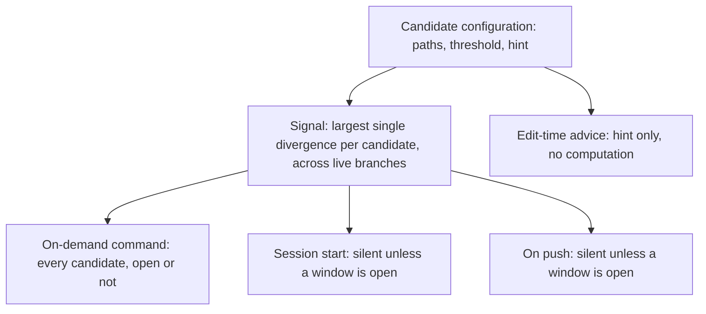
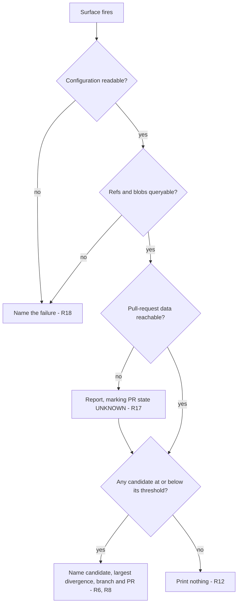

# Refactor Window Signal - Plan

## Goal Capsule

- **Objective:** Tell the operator when a file the repo has already decided to decompose is safe to refactor, and name what stands in the way when it is not.
- **Product authority:** This plan owns the signal and the three places it is delivered. It does not own the decomposition work itself, which stays with `docs/refactoring.md` and the entries there.
- **Open blockers:** None.
- **Product Contract preservation:** Changed — one requirement added (R18), and two factual corrections. R18 extends the established intent of R15 and R17 to a computation that runs and fails, prompted by the repo's own rule that a silent injection hook is byte-identical to a broken one (`.claude/hooks/inject-branch-context.sh`, `DEGRADED READS ARE LOUD, NEVER SHORT`); review then narrowed it, because a hook that cannot start cannot announce itself. The corrections: the Problem Frame's open-PR count for the largest candidate was 74 and is 73, and the count for `PartitionState` moved between drafts, so both it and the acceptance example that cited it now state the shape rather than a number a command reproduces. No requirement's meaning, no ID, and no flow changed.

---

## Product Contract

### Summary

A refactor-window signal for a short, committed list of files the repo has already decided to decompose. It stays quiet while a file is busy, and when it speaks it names both the verdict and the largest single change standing on that file — with its branch and pull request — so the operator can either start the refactor or go land that change first. Any agent editing one of those files is separately nudged to consider extracting the piece it is touching.

### Problem Frame

`docs/refactoring.md` already carries entries that say, in its own words, they are "to be picked up **when things are quiet**". Nothing in the repository can evaluate that condition, so the entries sit until somebody happens to wonder — and the wondering costs a cross-branch investigation nobody undertakes speculatively.

The cost is not hypothetical and it compounds. The entry for `parallel-consumer-core/src/main/java/bz/stub/parallelconsumer/internal/AbstractParallelEoSStreamProcessor.java` records the class at 1533 lines; it is now 2405. The file grew 57% while its own backlog entry aged, because every author who touched it faced the same undecidable question and made the same locally correct choice to add rather than extract.

The window is real and it does open. Measured across 437 live refs on 2026-09-02, that file had 73 refs with an open pull request diverging from the mainline, the largest at +1047 lines — a genuinely bad moment to start. But that number is a property of a handful of large branches, and it drops when they land. Nobody is watching for the drop.

The measurement also disqualifies the obvious signal. `parallel-consumer-core/src/main/java/bz/stub/parallelconsumer/state/PartitionState.java` had dozens of open-PR refs diverging from it and the largest divergence was eight lines. Counting branches would have called that file blocked when nothing was in the way. The exact counts move day to day — two of them moved between this plan's first and second drafts — which is itself the argument for a signal that is recomputed rather than recorded.

### Key Decisions

- **Report the window; do not map quiet regions within a file.** The file is the unit. (session-settled: user-directed — chosen over per-region analysis that would find the safe parts of a busy file: the window opens often enough that waiting for it is a real strategy, so the simpler signal is enough.) Governs R5.
- **The signal is the largest single divergence, not the count of diverging branches.** (session-settled: user-approved — chosen over a branch count: a file that dozens of branches diverge from, whose largest touch is eight lines, is not blocked.) Governs R5.
- **The largest divergence is also the payload.** The number that decides whether to fire is the same one the operator acts on. (session-settled: user-directed — chosen over a bare verdict: knowing the blocker lets the operator land it instead of waiting.) Governs R6.
- **Candidates and their thresholds live in a committed configuration file.** (session-settled: user-directed — chosen over a list embedded in the tool: retuning a threshold should be an ordinary reviewable commit.) Governs R1, R3.
- **Stateless: no memory of what the last run said.** (session-settled: user-approved — chosen over storing the previous result and reporting the delta: a stored answer is a second thing that can go stale, and repeating is the loud behaviour the operator asked for.) Governs R7, R8.
- **The unprompted surfaces stay silent while a candidate is busy.** (session-settled: user-approved — chosen over handing the operator the blocking change unprompted at every session: the pull command answers that question on demand, and an ambient report that always speaks stops being read.) Governs R12.
- **The edit-time nudge advises and never blocks.** (session-settled: user-directed — chosen over asking for a justification or refusing large edits: a false positive must not be able to cost a turn.) Governs R13.
- **Both an unprompted session-start surface and an unprompted push surface.** (session-settled: user-directed — chosen over one channel: an agent that never pushes still needs telling, and a person who never starts a fresh session still needs telling.) Governs R10, R11.
- **A computation that ran and failed says so; one that ran and found nothing stays silent; one that could not start stays silent too.** The last is the concession an advisory hook has to make — a dead hook cannot announce itself, and jamming the tool call would be worse than the miss. Governs R12, R18.

### Actors

- A1. **The operator.** Reads the report and decides between starting the refactor and landing the change that blocks it.
- A2. **A coding agent.** Receives the report unprompted at session start, and the extraction hint when it edits a candidate file.

### Requirements

**Candidate registry**

- R1. The candidate list is a committed configuration file; adding, removing, or retuning a candidate is an ordinary commit.
- R2. Each entry names every repository path its candidate is known by, because one candidate can exist under more than one path across live branches.
- R3. Each entry carries its own threshold, tuned per candidate rather than shared.
- R4. Each entry carries a one-line extraction hint naming what an agent touching that file should consider pulling out.

**The signal**

- R5. A candidate's signal is the largest single divergence any live branch holds against the mainline for that candidate.
- R6. Wherever the signal is reported, the report names the branch holding the largest divergence and its pull request when one exists.
- R7. Every answer is computed from the current refs; no previous run's result is stored or consulted.
- R8. A candidate whose signal is at or below its threshold is reported as open, and reported again on every subsequent firing until the entry leaves the configuration.

**Delivery**

- R9. The signal is available as a command, reporting every candidate whether open or not.
- R10. The signal is delivered unprompted at the start of an agent session.
- R11. The signal is delivered unprompted when work is pushed.
- R12. The unprompted surfaces produce no output when the signal was computed and no candidate is open.
- R13. An agent editing a candidate file receives that entry's extraction hint as advice; the edit is never blocked, delayed for approval, or refused.
- R14. The edit-time advice is fast enough to sit in front of every edit, which means it does not compute the signal.

**Saying what it does not know**

- R15. Any live branch carrying none of a candidate's configured paths is counted and reported, so a path the configuration was never told about is visible rather than silently absent.
- R16. Archived refs are excluded from the signal; only live branches count toward it.
- R17. When pull-request data cannot be reached, the report says so, rather than reporting the branches as having no pull request.
- R18. When the computation runs and fails — unreadable configuration, a failed git query — every surface says so by name rather than producing the silence that means "nothing is open". A failure that prevents the computation running at all is the one exception: an unprompted surface that cannot start stays silent, because a broken advisory must not jam the action it decorates.

### Structure

One configuration file feeds one computation, which four surfaces consume. The edit-time surface is the one that reads the configuration without running the computation.

### Key Flows

- F1. A window opens
  - **Trigger:** The branch holding a candidate's largest divergence merges, dropping the signal to or below that candidate's threshold.
  - **Actors:** A1, A2
  - **Steps:** The next session start or push computes the signal; the candidate is now open; the report names the candidate, its current largest divergence, and the branch and pull request holding it.
  - **Outcome:** The operator either starts the refactor or removes the entry. Until one of those happens the report fires again every time.
  - **Covers R5, R6, R8, R10, R11**

- F2. An agent edits a candidate
  - **Trigger:** An agent modifies a file matching one of the configured paths.
  - **Actors:** A2
  - **Steps:** The entry's extraction hint is surfaced as advice before the edit proceeds; the edit proceeds regardless.
  - **Outcome:** The agent considers extracting the piece it is touching, and records its decision the way it would record any other.
  - **Covers R4, R13, R14**

- F3. The operator asks while a candidate is busy
  - **Trigger:** The operator runs the command.
  - **Actors:** A1
  - **Steps:** Every candidate is reported with its signal, its threshold, and the branch and pull request holding its largest divergence.
  - **Outcome:** The operator sees which change to land in order to open the window.
  - **Covers R6, R9**

### Acceptance Examples

- AE1. **Covers R12.** Given every candidate's largest divergence exceeds its threshold, when a session starts, then nothing is printed.
- AE2. **Covers R5.** Given a candidate that many branches diverge from, whose largest single divergence is 8 lines, and a threshold of 50, when the signal is computed, then the candidate is reported open — the number of diverging branches does not enter the verdict.
- AE3. **Covers R6.** Given a candidate is open and its largest remaining divergence sits on a branch with an open pull request, when the report fires, then it names that branch and that pull request alongside the verdict.
- AE4. **Covers R8.** Given a candidate was reported open in the previous session and nothing has changed, when a new session starts, then it is reported open again.
- AE5. **Covers R15.** Given 160 live branches carry a candidate under a path the configuration does not list, when the signal is computed, then the report states that 160 branches matched none of the configured paths.
- AE6. **Covers R17.** Given pull-request data cannot be fetched, when the report fires, then it states that pull-request state is unknown, and does not describe the branches as having no pull request.
- AE7. **Covers R13.** Given an agent makes a 400-line edit to a candidate file, when the edit is submitted, then the advice is shown and the edit still proceeds.
- AE8. **Covers R18.** Given the configuration file is unreadable, when the unprompted surface fires, then it names the failure, and does not exit silently as it would when nothing is open.
- AE9. **Covers R18.** Given the hook's own helper library is missing so the computation never starts, when the unprompted surface fires, then it produces no output and does not obstruct the action it decorates — the one silence R18 permits.
- AE10. **Covers R18.** Given one candidate's git query fails and three succeed, when the report fires, then the three are reported normally and the failed one is named as failed — a single failure does not suppress the rest.

### Scope Boundaries

- Finding which *regions* of a candidate file are quiet. The file is the unit.
- Discovering candidates automatically from size, churn, or complexity metrics. The list is chosen and committed.
- Reporting on a pull request when a merge opens a window. Considered and set aside; the two unprompted surfaces cover the same moment without CI plumbing.
- Trend history, or any report of how a candidate's signal has moved over time.
- Doing, sequencing, or tracking the decomposition work itself.
- Edits made through the shell — a `sed` invocation, a heredoc — are not reached by the edit-time advice. Nothing fires a file-editing tool matcher for them, so F2 covers the dedicated edit tools only. This is a limit of where the hook can attach, not an oversight.

#### Deferred to Follow-Up Work

- Clustering the divergence measurement by content hash. It would cut the dominant cost roughly fourfold (KTD3), and the measured runtime does not currently justify the correctness risk.
- A third hook registration so a Task-spawned subagent also receives the unprompted report. That event does not reach subagents (KTD4); the push surface and the edit-time advice still do.

### Dependencies / Assumptions

- The signal is a cross-branch question, and the primitives for asking it already exist in `bin/lib/git.mjs` and `bin/lib/notes.mjs`, reached through `bin/inflight.mjs`. Its self-test is `bin/test-inflight.mjs`.
- Assumed: the operator wants the same signal an agent gets. Nothing distinguishes the two audiences today beyond where the report is delivered.
- Assumed: the seeded thresholds in KTD8 are a starting guess to be retuned when they misfire, not a derived number.
- The package rename described in `AGENTS.md` is in flight, so a candidate is legitimately reachable under two paths at once. R2 and R15 exist because of it, and they stay useful afterwards for ordinary renames.
- `docs/refactoring.md` remains the editorial owner of *why* each candidate should be decomposed. The configuration owns only what the signal needs, and neither restates the other.

---

## Planning Contract

### Key Technical Decisions

- KTD1. **One new command in the existing front door, not a new script.** `bin/inflight.mjs`'s own header states that adding a tool means adding a row to its `COMMANDS` registry, and that a tool reachable only by knowing its filename is the state that file exists to end. The tool it joins deliberately avoids the `check-` prefix, because `bin/AGENTS.md` grants that prefix to the review agent by pattern and this reaches the network through `gh`. That grant matches script filenames rather than subcommand names, so it does not constrain what the command is called — but nothing here should be named as if it were a gate. Governs R9.
- KTD2. **The configuration is JSON, living in `bin/`.** JSON because the repo carries no npm dependencies — every import under `bin/` is `node:` or relative — so YAML would mean shelling to Python for a four-line file. Not `docs/data/`, which its own README scopes to renderer-independent data for release documentation. `bin/deps-version-rules.xml` is the precedent for a data file living in `bin/`, though not for "beside its consumer": that file is read from `pom.xml` at the repo root. `config/` is the other real candidate and holds this same class of file — `config/infer-known-findings.txt` is read by `bin/infer-test.sh` — so the choice is between two permitted homes rather than a forced one; `bin/` wins on the tool and its data being read together. (session-settled: user-approved — the decision stands, but the operator approved it on a precedent claim that was half wrong, and `config/` was never put to them.) Governs R1.
- KTD3. **No clustering by content hash in the first cut.** Measured 2026-09-02: all four candidates answer in 1.55s warm, of which 1.26s is process forks — 225 merge-base diffs that clustering would collapse to 47. Clustering is correct only if the merge-base is equal across the refs sharing a tip blob, which is an extra invariant to establish; 1.55s does not buy that risk. Deferred, not rejected. Governs R5.
- KTD4. **One hook script, registered on both unprompted moments, branching on the event name.** `.claude/hooks/check-branch-behind-its-own-remote.sh` is the precedent: it is registered on both and reads `hook_event_name` out of the payload to decide which arm runs. Two scripts would be two copies of the same reporting logic. Note the measured limit recorded in `.claude/hooks/inject-branch-context.sh`: the session-start event does not fire for a subagent spawned via the Task/Agent tool, so subagents are reached by the push surface and the edit-time advice only. Governs R10, R11.
- KTD5. **Stateless means no stored verdict; the existing pull-request cache is orthogonal and stays.** `bin/lib/cache.mjs` holds the bulk pull-request listing for 24 hours, and it *does* cache an empty answer — the never-cache-an-absence property belongs to the per-branch kind, not the bulk one. That is a cache of an input, not of an answer, so it does not conflict with computing the verdict fresh every time. The consequence an implementer inherits: divergence numbers and the open-or-not verdict are always fresh from the refs, but the pull-request *label* can be up to a day stale, so a just-merged blocker can still be named as open. Governs R7.
- KTD6. **Failure is loud; an empty result is silent.** This is `bin/inflight.mjs`'s existing exit-code contract — 0 means it ran whatever it found, 2 means it could not run — carried into the hooks, where the stakes are higher because a hook's correct silence is byte-identical to a broken hook. Governs R12, R18.
- KTD7. **The edit-time hook reads the configuration and never the signal.** Per-edit cost multiplies across dozens of edits in a session and each computation forks roughly 250 processes, so the hint is static text from the entry. (session-settled: user-approved — chosen over live numbers in the nudge.) Governs R14.
- KTD8. **Seed each threshold at roughly a tenth of the file's current length**, giving 240 / 80 / 60 / 50 for the four candidates. The reasoning is that a divergence under about a tenth of a file is a merge somebody can resolve by hand; the number is a starting guess with a rationale, not a derived value, and it is expected to be retuned in an ordinary commit. Governs R3.
- KTD9. **The hooks stay shell.** `bin/lib/source-patterns.mjs`'s `new-shell-script` rule matches `^bin/.*\.(sh|bash)$`, so `.claude/hooks/` is outside its scope entirely and the rule requires nothing of these files. Shell also matches every hook already here. The latency argument that `bin/AGENTS.md` makes for git hooks is *not* being borrowed: Node starts in 19ms on this machine, which the edit-time hook can afford once it has decided the edit is worth reacting to — see U5. Governs R13, R14.

### High-Level Technical Design

The subtle part is the report's decision path, where R8, R12, R17 and R18 meet: three outcomes that must be distinguishable, and one of them is silence.

The on-demand command differs from the unprompted surfaces on one branch only: it takes the `no` arm out of `OPEN` and reports every candidate with its numbers rather than printing nothing.

Two things the diagram flattens. The `GIT` diamond is drawn once but is evaluated **per candidate** — one candidate's failed query names that candidate and leaves the rest reported (AE10). And the whole diagram presupposes the computation started: a hook so broken it never reaches `START` produces the same silence as `QUIET`, which is the single exception R18 carries and AE9 pins.

### Assumptions

- The four candidates are the ones measured on 2026-09-02. Nothing in the design depends on the count; the configuration is a list.
- `gh` remains the pull-request data source and remains authenticated on the operator's machine. R17 covers the case where it is not.

---

## Implementation Units

The first three units are a vertical slice: after U3 the command answers the question end to end, and the delivery surfaces can land separately.

### U1. Candidate configuration and its loader

- **Goal:** Establish the committed contract that everything else reads.
- **Requirements:** R1, R2, R3, R4
- **Dependencies:** none
- **Files:** `bin/refactor-candidates.json` (new), `bin/lib/refactor-window.mjs` (new — loader half only), `bin/test-inflight.mjs`
<!-- file-refs: N/A - the new-file paths above are created by this plan and do not exist yet -->
- **Approach:**
  1. Define one entry per candidate carrying an id, the list of paths the candidate is known by, its threshold, and its one-line extraction hint.
  2. Seed the four candidates and thresholds from KTD8, with each path list carrying both the current `bz/stub/` path and the pre-rename `io/confluent/` path per R2.
  3. Write a loader that returns `{ok, reason}` on a malformed or unreadable file rather than throwing — the shape KTD6 needs and the one every module under `bin/lib/` already uses. It takes the configuration path as an argument defaulting to the shipped file, so the self-test can point it at a fixture; the suite's fixture builder makes in-flight notes only, and nothing else here would let U2 test a synthetic candidate set.
  4. The loader is the only thing that *parses* the file. Both hooks and the command go through it rather than reading the JSON themselves — including the edit-time hook, which first does a cheap shell test of the edited path against the candidate path substrings and only pays for the loader once that matches (U5).
- **Patterns to follow:** the `{ok, reason}` return contract used throughout `bin/lib/git.mjs` and `bin/lib/notes.mjs`; `bin/deps-version-rules.xml` for a data file living beside its consumer.
- **Test scenarios:**
  - A well-formed file loads and yields one entry per candidate with all four fields present.
  - A file with a missing `threshold` on one entry returns `ok: false` naming that entry, rather than defaulting the threshold.
  - A file that is not valid JSON returns `ok: false` with a reason, and does not throw.
  - An entry whose `paths` is a bare string rather than a list is rejected — the single-path shape is the R2 regression waiting to happen.
  - The seeded file itself loads clean, so the shipped configuration is covered by the same check as a synthetic one.
- **Verification:** the loader answers for the real shipped file, and every malformed shape returns a reason rather than an exception.

### U2. The signal computation

- **Goal:** Compute each candidate's largest single divergence across live branches, with the branch and pull request that holds it.
- **Requirements:** R5, R6, R7, R15, R16, R17
- **Dependencies:** U1
- **Files:** `bin/lib/refactor-window.mjs` (new — signal half), `bin/test-inflight.mjs`
- **Approach:**
  1. Take live refs from `refTips`, filtering on the `archival` flag it already returns — that flag is R16 and needs no new classification.
  2. For each candidate, resolve the baseline blob for each configured path, then batch every live ref through `blobsForPath` per path.
  3. Skip refs whose blob equals the baseline's; for the rest, measure with `addedSinceMergeBase` and keep the maximum, with the ref that produced it.
  4. Attribute each ref to a pull request through `prsByBranch`, preserving its `{ok, reason}` so an unreachable `gh` reports as unknown rather than absent (R17).
  5. Count live refs matching none of a candidate's configured paths and return that count as a first-class field (R15), not a log line.
  6. Isolate failure per candidate: one candidate's failed git query marks that candidate failed and leaves the others reported normally (AE10). A single all-or-nothing failure flag would let one bad path silence three good answers.
  7. Return findings; decide nothing about exit codes or output. `bin/inflight.mjs`'s header states it is the only file in that tool family permitted to exit the process.
- **Execution note:** Write the max-versus-count assertion first — it is the one behavior the whole feature turns on, and `PartitionState`, which dozens of branches diverge from by at most eight lines, is a ready-made fixture for it.
- **Patterns to follow:** `drift` in `bin/lib/notes.mjs` is the same question asked about a different kind of path, including how it names each branch by fact rather than inference.
- **Test scenarios:**
  - Covers AE2. A candidate whose many diverging refs are all tiny reports the largest one, and the count of refs is nowhere in the verdict.
  - The returned largest divergence carries the ref that produced it, and that ref genuinely holds that blob.
  - Covers AE5. A candidate configured with only one of two real paths reports a non-zero unmatched-branch count.
  - The same candidate configured with both paths reports an unmatched count of zero, proving the counter tracks configuration rather than a constant.
  - Covers AE6. With pull-request lookup forced to fail, the result marks pull-request state unknown and still returns the divergence numbers.
  - An archival ref holding a large divergence does not raise the signal.
  - Covers AE10. One candidate whose git query fails does not suppress the other three; the failed one is named.
  - Two consecutive calls with no repository change return equal results, and nothing outside the documented pull-request cache is written (R7). The suite forbids network access, so this and every other scenario here inject the pull-request map rather than calling `gh` — `drift`'s `{prs}` option is the existing shape for that.
- **Verification:** run against the real repository and confirm the four candidates report the divergences measured on 2026-09-02, within whatever has landed since.

### U3. Register the `refactor-window` command

- **Goal:** Make the signal reachable from the front door, in both the full and the silent-unless-open form.
- **Requirements:** R8, R9, R12, R18
- **Dependencies:** U2
- **Files:** `bin/inflight.mjs`, `bin/lib/views.mjs`, `bin/test-inflight.mjs`
- **Approach:**
  1. Add a row to the `COMMANDS` registry with the `summary`, `when` and `usage` fields the other rows carry — the `when` sentence is what tells an agent to reach for it.
  2. Default output reports every candidate with its signal, threshold, verdict, and the branch and pull request holding the largest divergence.
  3. Add `--if-open`, the flag the hooks use: it prints nothing when the signal computed and no candidate is open, and reports normally otherwise.
  4. Formatting goes in `bin/lib/views.mjs` alongside the other formatters; the library returns findings and the view renders them.
  5. Map a loader or git failure to `ok: false`, which the single exit point turns into exit 2 — distinct from a clean run that found nothing.
- **Patterns to follow:** the `stranded` command is the closest shape — one registry row, a library call, a formatter, and no exit decision of its own.
- **Test scenarios:**
  - Covers AE1. `--if-open` prints nothing when no candidate is open, and the command still reports success.
  - Covers AE4. Two runs in a row against an open candidate both report it; nothing suppresses the second.
  - A candidate exactly at its threshold is reported open — the boundary is inclusive per R8.
  - Covers AE8. An unreadable configuration produces a non-success result naming the failure, under the silent flag as well as without it.
  - Covers AE3. The rendered output names the branch and the pull request number for the largest divergence.
  - The new command appears in the help listing, via the existing registry walk rather than a second list.
- **Verification:** `node bin/inflight.mjs refactor-window` reports all four candidates; the silent form prints nothing today, because no candidate is currently open.

### U4. The unprompted delivery hook

- **Goal:** Deliver the signal at session start and on push, without being asked.
- **Requirements:** R10, R11, R12, R18
- **Dependencies:** U3
- **Files:** `.claude/hooks/remind-refactor-window.sh` (new), `.claude/settings.json`, `docs/agent-harness.md`, `bin/test-check-agent-hooks.sh`
<!-- file-refs: N/A - the new-file paths above are created by this plan and do not exist yet -->
- **Approach:**
  1. One script, two registrations: `SessionStart`, and `PreToolUse` matching `Bash`.
  2. On the pre-tool arm, exit early unless the payload actually runs a push, using `hook_git_runs` from `.claude/hooks/lib/hook-common.sh` rather than a substring test — its header records the `git -C /path push` bug that a naive test misses.
  3. On either arm, invoke the command from U3 with the silent flag and emit whatever it prints.
  4. Fail open on anything the hook itself cannot do, per the standing rule for advisory reminders; but a *computed* failure reported by the command is passed through, because that is R18 and it is the command's answer rather than the hook's breakage.
  5. No throttle. R8 is the requirement that it repeats, and the measured cost is 1.55s.
  6. The two arms deliver differently and the precedents differ: the session-start arm's stdout reaches the agent directly, while the pre-tool arm has to use the `additionalContext` envelope that `.claude/hooks/remind-inflight-on-push.sh` demonstrates.
  7. **Registration bookkeeping, which is gated.** `bin/test-check-agent-hooks.sh` asserts that `docs/agent-harness.md`'s prose hook counts match `.claude/settings.json`, and that every registered hook is named in a self-test. Move the counts, and add this hook's checks to that suite. Skipping either turns `repo-hygiene` red for a reason nothing else in this unit predicts.
- **Patterns to follow:** `.claude/hooks/check-branch-behind-its-own-remote.sh` for the dual registration and the `hook_event_name` branch; `.claude/hooks/remind-inflight-on-push.sh` for the push-detection preamble.
- **Test scenarios:**
  - A synthetic session-start payload produces the command's output.
  - A payload running `git -C /some/path push` is recognized as a push; a payload running only `git add` is not.
  - Covers AE1. With no candidate open, both arms produce no output at all.
  - Covers AE8. With the configuration made unreadable, both arms produce the named failure rather than silence.
  - Covers AE9. A missing or unreadable `hook-common.sh` leaves the hook silent and successful, never jamming the tool call — the exception R18 names.
  - The registration check passes: the prose counts match the settings file, and this hook is named in a self-test.
- **Verification:** both registrations fire against a real session and a real push; the no-candidate-open case produces genuinely empty output rather than whitespace; and `bin/check-all.sh --with-tests` passes, which is the only thing that exercises the registration bookkeeping.

### U5. The edit-time advice hook

- **Goal:** Put the extraction hint in front of an agent at the moment it edits a candidate.
- **Requirements:** R4, R13, R14
- **Dependencies:** U1
- **Files:** `.claude/hooks/nudge-refactor-candidate.sh` (new), `.claude/settings.json`, `docs/agent-harness.md`, `bin/test-check-agent-hooks.sh`
<!-- file-refs: N/A - the new-file paths above are created by this plan and do not exist yet -->
- **Approach:**
  1. Register on `PreToolUse` matching the file-editing tools — `Edit|Write|NotebookEdit` is the candidate matcher, matchers being regexes. This is the first hook here to match anything other than `Bash` or `*`, so **verify it fires before building on it**: `docs/agent-harness.md`'s standing rule is that harness claims are tested rather than read off the documentation, and the recorded `Task` versus `Agent` divergence is the precedent for the documented name and the payload's name disagreeing.
  2. Read the edited path from the payload — `tool_input.file_path`, except `NotebookEdit`, which carries `notebook_path`. Test it against the candidate path substrings in shell and exit silently on no match, so the common case costs no interpreter.
  3. On a match, call the U1 loader for that entry's hint and emit it as advice. Never block, never ask, never delay. Node's 19ms startup is affordable once the path has already matched; it would not be on every edit.
  4. Read the configuration only. No git, no `gh`, no signal — KTD7.
  5. Registration bookkeeping, as U4 step 7: the prose hook counts and the self-test naming are both gated.
- **Execution note:** the matcher's real tool name is the thing to establish first; the branch-context hook records that the Task tool's real name is `Agent` and not `Task`, so the documented name and the payload's name have already diverged once here.
- **Patterns to follow:** the payload-parsing preamble in `.claude/hooks/remind-inflight-on-push.sh`; the advisory-reminder failure budget in `CONCEPTS.md`.
- **Test scenarios:**
  - Covers AE7. A payload editing a candidate emits the hint, and the hook's exit status permits the edit.
  - A payload editing a non-candidate file emits nothing.
  - A payload editing a candidate under its pre-rename path emits the hint, proving the match uses the whole path list (R2).
  - A notebook-edit payload is read through its own path field rather than the one the other editing tools use.
  - The hook does not invoke git or `gh` — assert on the absence, since R14 is a cost requirement and nothing else would catch a regression that adds a call.
  - An unreadable configuration leaves the hook silent and successful; a broken nudge must not block edits.
  - The registration check passes: the prose counts match the settings file, and this hook is named in a self-test.
- **Verification:** an edit to a candidate shows the advice and completes; an edit to a neighbouring file in the same package shows nothing; `bin/check-all.sh --with-tests` passes.

### U6. Self-test coverage

- **Goal:** Make every assertion above negative-controlled, as the suite requires.
- **Requirements:** none directly; this unit protects R5 through R18
- **Dependencies:** U3, U4, U5
- **Files:** `bin/test-inflight.mjs`, `bin/test-check-agent-hooks.sh`
- **Approach:**
  1. Each check runs twice — once against the real tree, once against a copy mutated to break exactly the thing it asserts. A check that stays green against its own mutant is reported as a failure of the suite. The suite enforces this structurally: a check with no mutant fails as one that could not be built, so the list in step 2 is the important mutants rather than the complete set.
  2. The mutants that matter: a threshold raised so a closed candidate reads open; a path removed from an entry so the unmatched-branch count should rise; the max replaced by a count so the branch-count trap would pass.
  3. After editing, verify the checks are actually in the file. The suite's own header records five checks that were written, reported as passing, and were not in the file.
- **Patterns to follow:** the existing negative-control structure in `bin/test-inflight.mjs`, and its rule that assertions are on returned data rather than on formatted output.
- **Test scenarios:** this unit *is* the test scenarios; its own verification is that each new check fails against its mutant.
- **Verification:** `node bin/test-inflight.mjs` passes, the printed check count rose by the number added, and `grep -c "^        id: '"` confirms they are in the file.

### U7. Documentation

- **Goal:** Make the signal findable from the two documents that own the surrounding territory, without either restating the other.
- **Requirements:** none directly
- **Dependencies:** U3
- **Files:** `docs/inflight-tool.md`, `docs/refactoring.md`
- **Approach:**
  1. Add a worked-example section to `docs/inflight-tool.md` in that document's established shape: the command, what the answer looks like on a real question, and why the working-tree version of the answer is wrong.
  2. Add a pointer from `docs/refactoring.md` naming the configuration as the machine-readable candidate list, and stating that the document remains the editorial owner of why each candidate should be decomposed.
  3. **Name the owner of the what-to-extract fact, because both files can hold it.** `docs/refactoring.md`'s entry for it already says what to pull out, and R4's hint says the same kind of thing; nothing in the computation reads the hint, so it is advice, not signal input. The configuration owns the one line an agent sees mid-edit; the document owns the full case and yields the one-liner. State that on both sides, or the two drift and neither is wrong.
  3. No change to `AGENTS.md`. Its table already routes `docs/inflight-tool.md`, and the rule that governs this work is situational rather than binding on every session.
- **Patterns to follow:** the existing worked examples in `docs/inflight-tool.md`; the ownership-pointer wording used across `AGENTS.md`'s topic table.
- **Test expectation: none — documentation.** Covered by `bin/check-file-refs.sh` for citation validity.
- **Verification:** `bin/check-all.sh` stays green, and the new section names a command that runs.

---

## Verification Contract

| Gate | Command | Applies to | Done signal |
|---|---|---|---|
| Repository gates | `bin/check-all.sh` | U1–U7 | No gate failed; skips are not counted as passes |
| Tool self-test | `node bin/test-inflight.mjs` | U1–U3, U6 | All checks pass, and each new check fails against its own mutant |
| Hook self-tests and registration bookkeeping | `bin/check-all.sh --with-tests` | U4–U6 | Prose hook counts match the settings file; every registered hook is named in a self-test |
| Command behaviour | `node bin/inflight.mjs refactor-window` | U3 | Reports all four candidates with divergence, threshold and verdict |
| Silent form | the silent flag, exit status inspected | U3, U4 | Empty output and a success status while nothing is open |
| Hook registration | a real session start and a real push | U4 | Both arms fire; neither emits on the nothing-open path |
| Edit matcher | an edit to a candidate and to a neighbour | U5 | Advice on the first, silence on the second, both edits complete |

---

## Definition of Done

- All eighteen requirements are implemented or explicitly deferred in Scope Boundaries.
- The command is a row in the front door's registry and appears in its help listing.
- The configuration is committed with all four candidates, both paths each, a threshold, and a hint.
- Both hooks are registered in `.claude/settings.json` and observed to fire.
- The nothing-open path is confirmed to print nothing, and the ran-and-failed path is confirmed to print a named failure — the two are not the same output. The could-not-start path is silent by design and is the only silence that shares an output with "nothing is open".
- `docs/agent-harness.md`'s hook counts match the settings file, and both new hooks are named in a self-test.
- Every new self-test check is negative-controlled and verified present in the file.
- `bin/check-all.sh --with-tests` passes and `node bin/test-inflight.mjs` passes.
- `docs/inflight-tool.md` carries a worked example and `docs/refactoring.md` carries the pointer.

---

## Sources / Research

- `docs/refactoring.md` — the editorial owner of the candidates, including the entry recording `AbstractParallelEoSStreamProcessor` at 1533 lines and the note that landing its decomposition unblocks whole-file static analysis. Its preamble is where "when things are quiet" comes from.
- `bin/inflight.mjs` — the front door this signal belongs behind; its header owns the registry rule and the single-exit-point rule, and its `note drift` command is the same shape of question asked about a different kind of path.
- `bin/lib/git.mjs` — `refTips` already classifies each ref as archival or live, which is R16; `blobsForPath` answers for every ref in one subprocess.
- `bin/lib/notes.mjs` — `addedSinceMergeBase` is the per-branch divergence measurement, and `prsByBranch` already distinguishes "no pull request" from "could not ask", which is R17.
- `bin/lib/cache.mjs` — states each cache kind's freshness in one place. The bulk pull-request listing is held 24 hours and does cache an empty answer; only the per-branch kind refuses to store an absence. KTD5 rests on the distinction.
- `bin/test-check-agent-hooks.sh` — the registration check that makes adding a hook a documentation change as well as a code one: it asserts the prose hook counts in `docs/agent-harness.md` against `.claude/settings.json`, and that every registered hook is named in a self-test. U4 and U5 rest on it.
- `config/` — holds the same class of tool configuration this plan adds, `config/infer-known-findings.txt` being read by `bin/infer-test.sh`. Named because KTD2 chose `bin/` over it rather than because no alternative existed.
- `bin/AGENTS.md` — the Node-default rule for new scripts, the reviewer grant that the `check-` prefix carries, and the glob that sweeps `bin/test-*.mjs` into `bin/check-all.sh --with-tests`.
- `bin/lib/source-patterns.mjs` — the `new-shell-script` rule and its `^bin/` scope, which is why KTD9 is available.
- `bin/test-inflight.mjs` — the negative-control requirement, and its record of five checks that reported passing while absent from the file.
- `.claude/hooks/check-branch-behind-its-own-remote.sh` — the dual-registration precedent U4 follows.
- `.claude/hooks/inject-branch-context.sh` — the measured facts that the session-start event does not reach a Task-spawned subagent, that the tool's real name is `Agent`, and that a degraded read must be loud rather than short.
- `.claude/hooks/lib/hook-common.sh` — the push-detection and fail-open helpers, and the two bugs that motivated one shared implementation.
- `docs/agent-harness.md` — which layers fire on their own versus which are merely available, and the standing rule that harness claims are tested rather than read off the documentation.
- `docs/data/README.md` — scopes that directory to release documentation, which is why the configuration does not live there.
- Measured 2026-09-02 across 437 live refs, divergence from `origin/master` restricted to refs with an open pull request:

  | Candidate | Lines | Open-PR refs diverging | Largest divergence | Seeded threshold |
  |---|---|---|---|---|
  | `parallel-consumer-core/src/main/java/bz/stub/parallelconsumer/internal/AbstractParallelEoSStreamProcessor.java` | 2405 | 73 | +1047 | 240 |
  | `parallel-consumer-core/src/main/java/bz/stub/parallelconsumer/state/WorkContainer.java` | 818 | 68 | +510 | 80 |
  | `parallel-consumer-core/src/main/java/bz/stub/parallelconsumer/ParallelConsumerOptions.java` | 604 | 41 | +393 | 60 |
  | `parallel-consumer-core/src/main/java/bz/stub/parallelconsumer/state/WorkManager.java` | 491 | 43 | +190 | 50 |

- Also measured 2026-09-02: of 437 live refs, 249 carry the largest candidate under its `bz/stub/` path and 160 under the pre-rename `io/confluent/` path, of which 2 have an open pull request. That is the exposure R15 makes visible.
- Cost, measured 2026-09-02: 1.55s warm for all four candidates, of which 1.26s is system time spent forking; 225 merge-base diffs, which clustering by content hash would collapse to 47. KTD3 rests on this.
