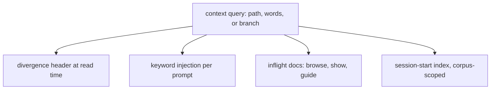
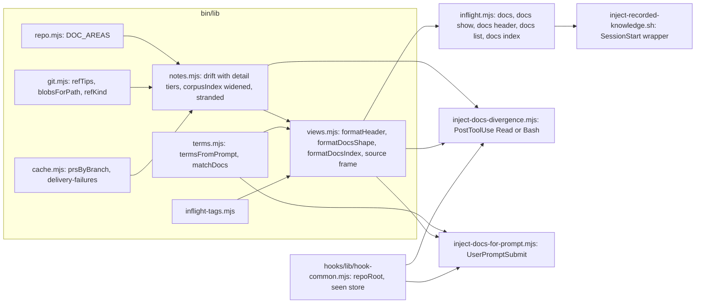

# Inflight Docs Context Query - Plan

## Goal Capsule

- **Objective:** An agent working in this repository is told, without asking, when a document it is reading or a mechanism it is working on has knowledge elsewhere in the corpus that it cannot see from its own branch - above all when the document it holds has a divergent version on another branch.
- **Means:** One context query in the inflight tool that takes a context (a path being read, a set of words, a branch) and answers which documents across every ref matter and which have diverged elsewhere, delivered three ways: a divergence header at read time, keyword injection per prompt, and an `inflight docs` command family (KTD1, KTD2).
- **Product authority:** The Product Contract below owns what is built; its R-IDs win on behaviour. The Planning Contract owns how; its KTDs win on mechanism within the cited R constraints. The GitHub tunnel, the edge graph, an MCP adapter and any human-facing UI are not active scope (Scope Boundaries).
- **Execution profile:** Implementation units land in U-ID order on branch `feats/inflight-docs-context-query` against draft PR astubbs/parallel-consumer#419; the header (U1, U2, U3) ships before any later unit starts.
- **Stop conditions:** Stop and surface rather than guess when a hook event does not deliver context on the installed Claude Code version (U2's first step), when a measured cold cost exceeds its budget by more than half (R19), or when the tag-vocabulary parity test cannot be made to pass (U5).
- **Tail ownership:** The executor owns tests, docs and the PR body updates named in each unit; the PR's working note `pr-419-inflight-docs-context-query.md` (a `docs/inflight/` note retired at merge prep, when nothing in it was both live and unowned: its cost figures live in each hook header, the tree-batching shape in `bin/lib/notes.mjs`, the tag vocabulary rule in `docs/inflight/AGENTS.md`, the unpulled lever in `docs/refactoring.md`; squash-merged, so the note exists only in astubbs/parallel-consumer#419's branch history) records what stays open.

---

## Product Contract

**Product Contract preservation:** restructured, no scope change: R11 → R11 (branch facts) + R22 (files touched, deferred). Changed by document review against the code: R2 (divergence is baseline-relative and names the copy's state), R5 and R7 (archival-only versions and PR facts), R9 and R10 (matching order, repeat suppression), R17 (sections outside the corpus), R19 (cold budgets, no warm state); added R23 to R27. Each change corrects a claim the code refuted or closes a gap the reviewers named; none narrows what the user asked for.

### Summary

Build one query over the cross-branch corpus that answers "what does this context need to know, and has any of it diverged somewhere else", and deliver its answer to agents three ways: a header on any `docs/` file at the moment it is read, titles injected on each prompt keyed on the prompt's own words, and `inflight docs`, which browses the corpus and, called bare, says what exists and what the tool can do. The header ships first and alone.

### Problem Frame

The repository keeps its working knowledge in the tree - `docs/inflight/`, `docs/solutions/`, `docs/plans/` - and distributes it with git, so most of it exists only on branches that have not merged. `bin/inflight.mjs` already answers questions across every ref; the session-start hook already lists the titles the current branch carries, once, at session start; a write-time hook already surfaces a solution when the text being written names one of its components. All of them either wait to be asked or fire at one moment and never again.

The incident that motivates this plan is the case none of them covers. An agent found the right document on master, acted on it, and the correction sat on a branch: the master copy was stale and nothing said so. `note drift` can compute exactly that, but only when someone runs it against the right path. Reading a file is the moment the fact is needed, and no mechanism fires at that moment.

The same shape recurs one level up. A prompt that names a mechanism whose only write-up is off master gets no help from a working-tree search, and the session-start list cannot follow a change of subject mid-session. The corpus is a distribution across branches; the delivery is still branch-scoped and mostly pull-only.

### Key Decisions

- **Agents are the only audience; there is no human-facing UI.** (session-settled: user-directed - chosen over a browsable front end with TOC and nested menu: the use is agents browsing the repo, and a CLI plus hooks is the surface they can drive.) Governs R13, R14.
- **The header ships first, on its own.** (session-settled: user-directed - chosen over keyword injection or `inflight docs` first: it is the one piece that would have caught the stale-copy incident.) Governs R4.
- **The header appears on both channels: direct reads and tool output.** (session-settled: user-approved - chosen over tool-output only: it covers the agent that never runs the tool.) Governs R5, R6.
- **One query, three deliveries.** (session-settled: user-approved - chosen over three independent hooks each reading the corpus its own way: the corpus gets one reader, and the session-start index migrates onto it instead of keeping a bash copy of the scan.) Governs R1, R2, R3, R17.
- **Words in the prompt are the primary injection trigger; files touched and the branch's own facts follow.** (session-settled: user-directed - chosen as primary over files-touched: it fires when intent is stated, and its output shape already exists as the prior-art result.) Governs R9, R10, R11, R22.
- **The session-start title list stays whole and becomes corpus-scoped.** (session-settled: user-directed - chosen over shrinking it once per-prompt injection exists: the full list is for recognition, injection is for the moment, and they do not substitute for each other.) Governs R17, R18.
- **`inflight docs` browses, shows and guides; it is not a second search.** (session-settled: user-approved - chosen over a `docs search` subcommand: `prior-art` already searches across every ref, and two searches would drift.) Governs R13, R15.
- **No MCP adapter in this work.** (session-settled: user-directed - the user asked about it out of curiosity and said not to do it alongside this work; the sketch is recorded under Scope Boundaries so it is not re-derived.)
- **Divergence is the only claim the header makes; it never calls a version "newer".** A divergent version carries content the baseline has never held; that is evidence of knowledge, not of recency, and the header shows the evidence (added size, added headings) rather than asserting an order. Governs R2, R7.
- **The existing write-time solutions hook stays as it is and is named as a delivery.** It reads the working tree by component name; folding it onto the query is deferred with the files-touched trigger, which is re-keyed on the text the agent writes because that hook measured citation-edge matching at zero yield on its own incident. Governs R22.

The fan-out the fourth decision commits to:



### Actors

- A1. **The working agent** - a Claude Code session, or any agent reading `AGENTS.md`, reading and editing files in a worktree. It receives the header and the injections without asking, and runs `inflight docs` when it chooses to. An agent on a host without hooks gets the same header as a command (R27).
- A2. **The harness** - the hooks registered in `.claude/settings.json`, which decide when a delivery fires and pass the context to the query. Claude Code only.
- A3. **The inflight tool** - `bin/inflight.mjs` and its libraries, which own the reading of the corpus and return findings for the harness and the CLI to render.

### Requirements

**The context query**

- R1. The tool answers one question for three kinds of context - a document path, a set of words, or a branch - and the answer names the documents across every ref that matter to that context.
- R2. Divergence is always measured against the baseline: a version is divergent when it carries content the baseline has never held, in the sense `note drift` already defines. For the copy at hand the answer says which of three states it is in: the baseline's version, this branch's own divergent version, or branch-only (R8).
- R3. Every delivery below renders the query's findings for the three corpus areas (`docs/inflight/`, `docs/solutions/`, `docs/plans/`); none reads those areas on its own. Sections of the session-start index outside those areas keep their working-tree rendering (R17).

**The divergence header**

- R4. The header is the first delivery to ship, and it ships without waiting for R9 to R16.
- R5. When a file under a corpus area is shown by the tool, its content is preceded by a header stating how many distinct divergent versions exist on live refs and how many refs carry them, and which ref set was searched.
- R6. When the working agent reads such a file directly, through the Read tool or a Bash command whose tokens name the path, the harness delivers the header's summary line alongside the read; coverage of Bash reads is best-effort by path token, and the header promises nothing for a read through a variable or a pipeline.
- R7. The header previews the largest divergent versions: for each, the branches and open PRs carrying it, its added size against that branch's merge-base, and what it adds - its added headings, or its first added line when it added no heading - with a command for the rest. PR facts come from the tool's PR cache; the read-time delivery never calls GitHub.
- R8. A file that exists on the ref being read but on no baseline ref gets a header saying so, so a branch-only document is not mistaken for a landed one.
- R23. A version carried only by archival refs (tags, backup refs) is reported as preserved, named by its ref kind, and is neither counted among the divergent versions nor previewed as a branch.
- R24. The comparison subject is the committed content at the current HEAD for the path; when the working tree differs from it, the header says the file has uncommitted edits and reports divergence for the committed version.

**Keyword injection**

- R9. On each prompt the working agent submits, the harness extracts identifiers and mechanism words from it and injects the titles and paths of matching documents across every ref, each marked when it is off the baseline or has a divergent version elsewhere. A document injected once in a session is not injected again unless its divergence state changed.
- R10. Injection matches, in order, the frontmatter retrieval fields a document carries (title, tags, related components, module), then its headings, then body text under a per-term cap, and the whole block is capped with a pointer to the command that lists the rest.
- R11. The same query, keyed on the branch's own facts at session start, injects the documents that name its PR, issue numbers or branch. This trigger follows R9 and reuses its output shape.
- R12. When nothing matches, injection prints nothing.
- R22. Deferred for later, per Scope Boundaries: the same query, keyed on the text the agent writes or edits, injects the documents that name what it writes about, reusing R9's output shape.

**`inflight docs`**

- R13. `inflight docs`, called bare, prints the shape of the corpus - each area, its groups, how many documents each holds and how many of them exist only off the baseline - followed by the commands that drill in and, for each, the sentence that says when to use it, and a one-line notice when any delivery has a recorded failure (R26).
- R14. Every level of that shape is reachable by a command with no interactive step, and each level lists the next level's commands, so an agent can walk from the bare call to one document by copying what it was shown.
- R15. `inflight docs show <path>` prints one document with its header per R5, from the baseline when the baseline carries it, else from the first carrying live ref in sorted order, always naming the ref shown, with a flag to choose another.
- R16. Grouping follows the session-start index: solutions by category directory, inflight notes by the cost-of-not-knowing order the index already uses, plans by date.

**The session-start index**

- R17. The session-start index renders the three corpus areas from the query and lists the whole corpus for them, not only the current branch's copy; the sections it lists today from outside those areas (ideation, test-hardening audits, the repo-level registers) keep their working-tree rendering.
- R18. Documents that exist only off the baseline are grouped by the set of refs carrying them, as `stranded` reports them, so a workstream's notes appear as one heading rather than one line each; beyond a configured line cap the remaining groups collapse to a count and the command that lists them.

**Cost and failure behaviour**

- R19. Every delivery has a cold-start budget stated in its own header comment and measured before it ships: the read-time header, the per-prompt injection when it fires, the silent path of the per-prompt injection, session start, and the bare `inflight docs` call. There is no warm state: each hook is a fresh process and the tool keeps no corpus cache.
- R20. Every delivery fails open: an error in the query or the harness prints nothing to the agent's context and never blocks the read, the prompt, or the session, in the terms `docs/agent-harness.md` sets for every hook.
- R21. Every empty answer says what it covered - which refs, and that an empty result is not proof - in the terms `docs/inflight-tool.md` sets for every command.
- R26. A delivery that fails records its last failure (delivery, reason, time) in the tool's cache directory, and bare `inflight docs` and the session-start index print a one-line notice naming it while the record exists.
- R27. The header is available as a command, `inflight docs header <path>`, so an agent on a host without hooks can ask for it, and `AGENTS.md`'s investigate table tells such an agent to run it before acting on a document.

### Key Flows

- F1. Reading a stale copy
  - **Trigger:** The working agent reads `docs/inflight/<note>.md` from a worktree on master.
  - **Actors:** A1, A2, A3
  - **Steps:** The harness sees the read; it asks the query about that path; the query reports the divergent versions and their previews; the harness delivers the summary line with the read, naming the command that prints the full header.
  - **Outcome:** The agent knows, before acting, that a branch carries a version of the note it has not seen, and which branch.
  - **Covered by:** R1, R2, R5, R6, R7, R19, R20

- F2. Prompt names a mechanism
  - **Trigger:** The user's prompt names a class, flag, log line or issue number.
  - **Actors:** A1, A2, A3
  - **Steps:** The harness extracts the terms; the query matches them against retrieval fields, headings and capped body text across every ref; matching titles are injected, marked off-baseline or divergent-elsewhere; nothing is printed when nothing matches or when everything matching was already injected this session.
  - **Outcome:** The agent starts with the titles it would otherwise have needed to know to search for.
  - **Covered by:** R9, R10, R12, R21

- F3. Bare `inflight docs`
  - **Trigger:** The working agent runs `inflight docs` with no arguments.
  - **Actors:** A1, A3
  - **Steps:** The tool prints the corpus shape with counts and the drill-in commands; the agent copies one; each level lists the next until `show` prints a document with its header.
  - **Outcome:** An agent that knew nothing about the corpus reaches one document without reading a doc about the tool.
  - **Covered by:** R13, R14, R15, R16

### Acceptance Examples

- AE1. **Covers R5, R7.** Given a note that master carries and several branches have extended, when the tool shows master's copy, then the content is preceded by a header naming the count of divergent versions and refs, previewing the largest by branch, PR, added size and added headings, and ending with the `note drift` command for the rest.
- AE2. **Covers R6.** Given the same note, when the agent runs `cat docs/inflight/<note>.md` in Bash, then the header's summary line arrives with the command's result; when the agent runs `cat "$f"` with the path in a variable, then nothing is promised and nothing is claimed to be missing.
- AE3. **Covers R8.** Given a note that exists only on the current branch, when it is shown or read, then the header says it is on no baseline ref rather than reporting zero divergence.
- AE4. **Covers R9, R10, R12.** Given a prompt naming a test class whose only write-up is on an unmerged branch and names that class in its related-components field, when the prompt is submitted, then that write-up's title and path are injected and marked off-baseline; given a prompt with no identifiers, then nothing is injected; given the same prompt a second time, then nothing is injected again.
- AE5. **Covers R13, R14.** Given a fresh session, when the agent runs `inflight docs` and then the first command it printed, then the second output lists documents or a further level, and no step prompts for input.
- AE6. **Covers R17, R18.** Given a workstream whose notes exist on a set of branches and not on master, when a session starts, then the index shows that workstream under one heading naming the branch set, not one line per note.
- AE7. **Covers R20, R26.** Given the query's git call fails, when a docs file is read, then the read succeeds, nothing is injected, and the next bare `inflight docs` call prints a one-line notice naming the failed delivery and its reason.
- AE8. **Covers R2, R24.** Given a note the agent has edited in its worktree on a feature branch, when the agent reads it, then the header says the copy has uncommitted edits, reports the committed version as this branch's own divergent version with its added size, and does not report the branch's own edits as a divergent version elsewhere.
- AE9. **Covers R23.** Given a note whose only other version lives on a tag, when the baseline copy is shown, then the header reports one preserved version on a tag and zero divergent versions.

### Success Criteria

- Reading a document with a divergent branch version through the Read tool, through `inflight docs show`, or through a Bash command naming its path yields the header without any action by the agent (F1); reads the harness cannot see are the best-effort clause of R6.
- A session that never runs the tool still learns of an off-baseline document when its prompt names the mechanism in a way the document's retrieval fields or headings carry (F2).
- A fresh agent reaches a document from the bare `inflight docs` call by copying commands, without reading `docs/inflight-tool.md` first (F3).
- The bash scan of the corpus inside the session-start hook is gone, replaced by a call to the query, and the new index lists every title the old one listed for the same branch (R3, R17).
- Every delivery's measured cold cost is at or under its stated budget (R19).

### Scope Boundaries

**Deferred for later**

- **An MCP adapter over the same query.** Worth doing once the `inflight docs` commands stop moving, because a tool list arrives in the agent's context with names, descriptions and argument schemas without any hook, and it is the only route to hosts that read `AGENTS.md` but get no hooks. Sketch, so it is not re-derived: a host-spawned process speaking JSON-RPC over stdin and stdout; four methods (`initialize`, `tools/list`, `tools/call`, `ping`); each `COMMANDS` row maps to one tool with its `when` sentence as the description; a committed `.mcp.json` at the repo root registers it; stdout is the protocol channel so all logging goes to stderr. Against the "no daemon, no socket, no npm dependencies" constraint in `docs/inflight/ci-node-query-client.md`, the honest cost is a long-lived process per session and either an npm dependency or a hand-rolled protocol surface.
- **The write-text trigger** (R22), and folding the existing write-time solutions hook (`.claude/hooks/inject-solutions-for-named-components.mjs`) onto the query so it reads across refs. Citation-edge matching from `.github/scripts/file-ref-gate.js` is a later addition to it, not its basis.
- **Migrating the inflight-tag gate to Node**, so the index and the gate share one parser again; until then U5's parity test holds them together.

**Outside this work**

- Any human-facing UI, web page, site generation or GitHub Pages.
- The GitHub tunnel and the edge graph, owned by `docs/inflight/ci-node-query-client.md` and `docs/inflight/ci-issue-index-has-no-edges.md`.
- Adopting an external tracker for the cross-branch reader; `docs/inflight/process-adopt-external-harness.md` records that as decided.
- Changing the note or solution frontmatter.

### Dependencies / Assumptions

- The ref enumeration already looks everywhere: `refTips` in `bin/lib/git.mjs` lists every ref space and `refKind` marks tags and unknown spaces archival, and `stranded` in `bin/lib/notes.mjs` already splits live from archival carriers. The header follows that split (R23); `docs/inflight/ci-inflight-next-commands.md`'s section on the corpus not being every ref is stale against this and is corrected in U1.
- The corpus index (`corpusIndex` in `bin/lib/notes.mjs`) covers `docs/inflight/` only, through `treeEntries(ref, NOTES_DIR)`; `bin/lib/prior-art.mjs` reads all of `docs/` with its own `git grep` fan-out and a `SECTIONS` list baked into one function. The query widens the index to the three areas and derives prior-art's sections from the same constant (KTD7).
- The tool keeps no corpus cache, by decision recorded in the `bin/lib/notes.mjs` header. The header's path question never builds the index: `drift` asks git about one path with `cat-file --batch-check` plus one merge-base per divergent cluster. The corpus-wide deliveries (bare `inflight docs`, the session index) pay the index each time (KTD5).
- Hook context delivery is verified in this repository for `PreToolUse` (allow with `additionalContext`), `UserPromptSubmit` (`inject-merge-checklist.sh`) and `PostToolUse` on Bash (`after-push-check-ci.sh`); `SessionStart` injects plain stdout. `PostToolUse` on the Read tool is not yet verified and is U2's first step.
- The tool's libraries return findings and only `bin/inflight.mjs` exits, so a hook can import them without inheriting an exit; `.claude/hooks/inject-solutions-for-named-components.mjs` is the existing Node hook that imports a library and fails open.
- PR facts come from `prsByBranch` in `bin/lib/notes.mjs`, which calls `gh` and caches for a day; the read-time delivery uses the cache only (R7).
- The repository has no `package.json` and the tooling has no npm dependencies; the query and its deliveries keep it that way.

### Outstanding Questions

**Deferred to Planning:** none remain; each was settled in the Planning Contract below, including search scope (KTD17) and title sourcing (KTD16).

### Sources / Research

- `docs/inflight-tool.md` - what the existing commands answer and the three invariants a new command keeps.
- `docs/inflight/ci-inflight-absorbs-the-query-half.md` - the migration of query logic out of the hooks, including the session index becoming corpus-scoped.
- `docs/inflight/ci-inflight-next-commands.md` - the queued commands and the git traps.
- `docs/inflight/ci-node-query-client.md` - the no-daemon, no-dependency constraint and what "drift" means.
- `docs/agent-harness.md` - the layer table, fail-open rule, and the verified hook behaviours.
- `docs/plans/2026-09-02-001-investigate-adopt-or-build-re-run.md` - why the reader is built rather than adopted.
- `docs/solutions/workflow-issues/a-hook-processes-own-directory-describes-the-session-not-the-command-2026-08-31.md` - the derivation order for the tree a hook should act on (KTD12).
- `docs/solutions/workflow-issues/a-harness-that-cannot-tell-never-ran-from-ran-and-agreed-2026-09-02.md` - why every self-test control asserts non-empty output as well as exit 0.
- `docs/solutions/workflow-issues/negative-results-need-an-instrument-that-could-have-said-yes.md` - why every silent path has a paired positive control.
- `docs/solutions/workflow-issues/a-title-grep-is-not-a-search-2026-08-31.md` - why heading-only matching cannot justify an empty result (KTD6).

---

## Planning Contract

### Key Technical Decisions

- KTD1. **The Node hooks import `bin/lib/` directly; none spawns the CLI.** One Node start per hook firing and no second process (the bash session-start wrapper in KTD8 is the one caller of the CLI, because it is bash); the libraries never exit, and `.claude/hooks/inject-solutions-for-named-components.mjs` already imports a library this way. Governs R3, R19, R20.
- KTD2. **The path query has two tiers on one function.** `drift` gains a `detail` option: `summary` resolves which refs carry which blob and the baseline's history, plus the added size of the copy at hand only (one merge-base and one numstat for HEAD's ref, no other cluster; no branch facts, no PR lookup, no preview), and is what the read-time hook calls; `full` adds added size, branch facts from the PR cache, and the added-headings preview, and is what `docs show` and `docs header` render. One function, two costs, so the header and the hook cannot drift apart. Governs R5, R6, R7, R19.
- KTD3. **Read-time delivery is a `PostToolUse` hook, one registration matching `Read|Bash`, self-filtering.** Context arrives with the tool result, before the agent's next action, which is the same moment a pre-read hook would reach, without putting the query's latency in front of the read and without the fail-closed shape `docs/agent-harness.md` warns against. Chosen over `PreToolUse` allow-with-context. The Read-tool half is verified live on the installed version before anything else in U2 is written. Governs R6, R20.
- KTD4. **Once per session per state.** The hook remembers, per session, the path plus the sorted set of divergent blobs it reported; a repeat read is silent unless that set changed. The prompt hook remembers injected paths the same way. The seen-store and the tree-derivation helpers move out of the solutions hook into `.claude/hooks/lib/hook-common.mjs` so there is one copy. Governs R9, R24.
- KTD5. **No corpus cache; budgets are cold.** The header uses the narrow per-path query and needs no index. The prompt hook runs one `git grep` across live refs and no cache can absorb a read that is the grep. Bare `inflight docs` and the session index build the index once per call; the three-area index alone measures about five seconds on this repository, so the session-start budget has little headroom and every title read is batched (KTD16). Budgets (configured bounds, re-measured on the slowest developer host and published in each hook's header before it ships): read-time header 500 ms; per-prompt injection 2500 ms when it fires and 100 ms on the silent path, which imports only the term extractor and the hook library and loads the git-touching modules dynamically once a term survives; session start and bare `inflight docs` 8 s. Revisit caching only if a measurement breaches a budget. Governs R19.
- KTD6. **Term extraction and matching order.** Terms are identifier-shaped tokens only: CamelCase with two humps or more, tokens with an underscore, hyphen or dot, backticked spans, fully qualified issue references and bare `#NNN`, each at least four characters and not on a stop list; a prompt yielding no terms is silent before any git call. Matching is one `git grep -n` over the corpus areas on live refs, never a corpus-index build; R10's order is derived from each hit line's shape and position: a frontmatter field or list item inside the leading frontmatter block, a line starting with `#`, else body, with the per-term cap applied to the body tier. The injected block is capped at twelve titles with a `prior-art --headings` pointer for the rest. Headings alone never justify an empty result, per the title-grep solution. Governs R9, R10, R12.
- KTD7. **One `DOC_AREAS` constant in `bin/lib/repo.mjs`.** It lists the three corpus areas and their display names; `corpusIndex` gains an `areas` option defaulting to it (`note find` passes the notes area only, so its output does not change; the `stranded` command states in its usage which scope it reports), `prior-art`'s `SECTIONS` are derived from it, and the docs shape and the session index group by it. This is the lift `docs/inflight/ci-inflight-next-commands.md` names before the list spreads. Governs R1, R3, R13, R17.
- KTD8. **The session index is a Node rendering plus a thin bash wrapper.** `inflight docs index` renders the three corpus areas corpus-scoped; `.claude/hooks/inject-recorded-knowledge.sh` keeps the framing text, the sections outside the corpus (ideation, test-hardening, registers), and calls the command for the rest. The impact order, type and state vocabulary move to `bin/lib/inflight-tags.mjs` with a parity self-test that sources `bin/lib/inflight-tags.sh` under bash, prints its variables, and fails on any difference (its impact sets are built by shell expansion, so a regex over the file would not see them), so the bash gate and the Node index cannot disagree until the gate migrates. An equivalence test materialises the pre-migration hook at a pinned commit SHA with `git worktree add --detach` so it runs from its own path beside its bash library, points it at the current checkout through `CLAUDE_PROJECT_DIR`, asserts as a positive control that its output carries the open-work and dated-plans headings, and then asserts every title it lists appears in the new index. Governs R16, R17, R18.
- KTD9. **Every injected block opens with a fixed source label and ends with the command that prints more.** One render helper in `bin/lib/views.mjs` produces the frame for all four sources (`docs context: divergence header for <path>`, `docs context: prompt terms <a, b>`, and so on), so an agent can tell a fresh signal from a repeat and always knows the next command. Governs R7, R9, R13.
- KTD10. **Every header states its scope and treats archival refs as preserved.** The ref set searched comes from `refTips` and the header prints its size and the archival split, reusing `refKind`; `freshnessWarnings` output is included when it fires. Governs R5, R21, R23.
- KTD11. **`docs show` selection.** Baseline first; else the first carrying live ref in sorted ref order; `--ref <ref>` overrides; `--header-only` prints the header alone (the same output as `docs header`). The ref shown is always named in the first line. Governs R15.
- KTD12. **Bash path detection.** A Bash command is inspected only when one of its whitespace-split tokens, resolved against the tree the command names (leading `cd <path> &&`, else the payload's `cwd`, else the session root as last resort per the 2026-08-31 solution), is an existing file under a corpus area. Variables, globs and pipelines are not resolved. Governs R6.
- KTD13. **Failure record.** A delivery that catches an error writes `<cache dir>/delivery-failures.json` (delivery, reason, ISO time) through `bin/lib/cache.mjs` with its own policy row; bare `inflight docs` and `docs index` print a one-line notice from it; a successful run of the same delivery clears its entry, and the policy row's age limit is set to seven days so a stale record does not outlive the session that could act on it. Governs R20, R26.
- KTD14. **Non-Claude hosts.** `AGENTS.md`'s "Before you investigate" table gains a row for `inflight docs header <path>` and `inflight docs`, so an `AGENTS.md`-only agent has the pull form of every delivery. Governs R27.
- KTD15. **The comparison subject is the committed blob at HEAD.** The hook resolves `HEAD:<path>` in the tree derived per KTD12; if the working-tree file's content differs, the header says so and reports on the committed blob. Governs R24.
- KTD16. **Titles are read in one batch.** Off-baseline documents' titles come from their blobs through one `git cat-file --batch` subprocess (a primitive beside `blobsForPath`), never one `cat-file -p` per blob; on-baseline documents' titles come from the baseline blob the same way, so an index built on a checkout behind the baseline is not wrong. Governs R13, R17, R19.
- KTD17. **Search scope is live refs; preservation is reported from all refs.** The prompt grep and the read-time divergent set run over live refs only (R9 marks off-baseline and divergent-elsewhere documents, which archival copies are not); the header's preserved line (R23) comes from the archival carriers `refKind` names. Governs R5, R9, R23.

### High-Level Technical Design



The read-time path, in sequence:

```mermaid
sequenceDiagram
  participant Agent
  participant Harness as Claude Code
  participant Hook as inject-docs-divergence.mjs
  participant Lib as notes.mjs drift(summary)
  Agent->>Harness: Read a note under the inflight area
  Harness->>Hook: PostToolUse payload (tool_input.file_path, cwd, session_id)
  Hook->>Hook: corpus path? tree via hook-common; seen-store check
  Hook->>Lib: drift(path, {detail: summary})
  Lib-->>Hook: divergent blob set, live/archival split, copy state
  Hook->>Hook: unchanged since last report? then silent
  Hook-->>Harness: hookSpecificOutput.additionalContext (summary line + command)
  Harness-->>Agent: tool result plus context
```

### Assumptions

- The four review decisions the pipeline settled without a user present are recorded as decisions, not as open questions: divergence baseline-relative with three copy states (R2, R24), the existing write-time hook kept as-is with R22 re-keyed on written text, the failure record (R26), and the host-parity row (R27). Each is reversible by editing one requirement.
- `PostToolUse` delivers `additionalContext` for the Read tool the way it does for Bash. If U2's live check refutes this, KTD3 falls back to `PreToolUse` allow-with-context for Read only, and the plan records the measured difference.
- The sessions that matter run inside a worktree; a session whose root is the main checkout still gets a correct header because KTD12 derives the tree from the command or the payload, never from the session root first.

### Sequencing

U1 → U2 → U3 ship as the header, in that order and before anything else (R4). U4 (prompt injection) depends only on U1 and may proceed in parallel once U3 has shipped; U5 (`docs` bare and list) depends on U1 and U3. U6 (session index migration) depends on U5. U7 (branch-facts block) depends on U4 and U6.

### System-Wide Impact

- **Every Claude Code session in this repository.** Two new hooks fire on every Read, every Bash call and every prompt; their cost is the constraint, not an afterthought, and each publishes its measured cold cost in its header (R19).
- **The session-start index changes shape** for every session: corpus-scoped, grouped, with a line cap (R17, R18). Its equivalence test is what proves nothing was lost.
- **Other hosts** gain a pull form of each delivery through the tool and one `AGENTS.md` row (R27); the push half stays Claude Code only.
- **The gate and the index** share a vocabulary through a parity test rather than a shared file until the gate migrates (KTD8).

### Risks & Dependencies

- **A hook that is slow trains the agent to distrust the harness.** Mitigation: budgets measured before each hook ships, the silent path costs nothing, and the seen-store stops repeats.
- **A dead delivery looks like silence.** Mitigation: the failure record (R26) plus paired positive controls in every self-test.
- **The tag vocabulary drifts between bash and Node.** Mitigation: the parity test in KTD8 fails the suite on any difference.
- **The corpus-scoped index is too long to read.** Mitigation: ref-set grouping and the line cap (R18), measured on this repository's actual off-baseline clusters before U6 ships.

### Documentation / Operational Notes

- `docs/agent-harness.md` "What is wired up today" gains an entry per new hook, with what was verified and on which version.
- `docs/inflight-tool.md` gains worked examples for `docs`, `docs show`, `docs header` and `docs index`.
- `AGENTS.md` "Before you investigate" gains the row KTD14 names, and its session-index bullet stops calling the index branch-scoped once U6 lands.
- `docs/inflight/ci-inflight-absorbs-the-query-half.md` and `docs/inflight/ci-inflight-next-commands.md` are updated in the units that resolve their rows; `pr-419-inflight-docs-context-query.md` (a `docs/inflight/` note retired at merge prep, when nothing in it was both live and unowned: its cost figures live in each hook header, the tree-batching shape in `bin/lib/notes.mjs`, the tag vocabulary rule in `docs/inflight/AGENTS.md`, the unpulled lever in `docs/refactoring.md`; squash-merged, so the note exists only in astubbs/parallel-consumer#419's branch history) records what stays open.

---

## Implementation Units

### U1. The document context query in the library

- **Goal:** One function answers the path question at two costs, over a corpus that spans all three areas and every ref, with archival refs split from live ones and a preview of what a divergent version adds.
- **Requirements:** R1, R2, R3, R5, R7, R8, R23, R24; KTD2, KTD5, KTD7, KTD9, KTD10, KTD15.
- **Dependencies:** none.
- **Files:** `bin/lib/repo.mjs` (add `DOC_AREAS`), `bin/lib/notes.mjs` (`corpusIndex` over `DOC_AREAS`; `drift` gains `detail`, archival split, copy state, preview), `bin/lib/git.mjs` (added-lines-of-a-blob-diff primitive beside `blobDiffStat`; a batched blob-title primitive beside `blobsForPath`), `bin/lib/prior-art.mjs` (derive `SECTIONS` from `DOC_AREAS`), `bin/lib/views.mjs` (`formatHeader`, the source-frame helper), `bin/test-inflight.mjs`, `docs/inflight/ci-inflight-next-commands.md` (correct the stale corpus-scope section).
- **Approach:**
  1. Add `DOC_AREAS`; give `corpusIndex` an `areas` option defaulting to it and pass the notes area alone from `note find`; derive `prior-art`'s `SECTIONS` from it, keeping the existing section numbering and headings so `prior-art` output does not change; state in `stranded`'s usage which scope it reports.
  2. Extend `drift` with `detail: 'summary' | 'full'` (default `full`, so `note drift` is unchanged). Summary stops after the divergent-blob clustering, the baseline-history filter and the copy-at-hand added size (KTD2), over live refs (KTD17). Full adds what it does today plus the preview: the added headings of the version's diff against its merge-base blob, else its first added line.
  3. Split carriers by `refKind`: archival-only versions go to a `preserved` list and are excluded from `divergent` counts.
  4. Report the copy state for a given ref or blob: baseline, this-branch-divergent (with added size), or branch-only.
  5. Add the batched title primitive (KTD16) and make `blobTitle` callers use it where more than one title is needed.
  6. Add `formatHeader` for both tiers and the source-frame helper every delivery will use.
- **Patterns to follow:** `stranded`'s live/archival split; `blobDiffStat` for the diff primitive; `formatDrift` for the header's rendering; every library function returns `{ok, ...}` and never exits.
- **Test scenarios:** (in `bin/test-inflight.mjs`, each with a mutant that must go red)
  - Summary tier on a note with divergent versions returns the same divergent blob set as the full tier and performs exactly one `merge-base` call, for the copy at hand (count subprocesses through `--perf` or a stubbed `exec`).
  - Full tier's preview lists the added headings of a divergent version; a version that added no heading yields its first added line.
  - A version carried only by a tag appears under `preserved` and is not counted in `divergent`. Covers AE9.
  - Copy state is `baseline` for the baseline blob, `own-divergent` with an added size for a branch's own edit, `branch-only` for a path absent from the baseline. Covers AE3, AE8.
  - `corpusIndex` with the default areas lists a solution and a plan; `note find` on the fixture still returns notes only; `prior-art` output for a fixed term is byte-identical before and after `SECTIONS` derives from `DOC_AREAS`.
  - Titles for a set of blobs come back from one `cat-file --batch` subprocess, and match what `blobTitle` returns for each.
  - The source-frame helper puts the label first and the "more" command last for each delivery kind.
  - Negative control per the repo rule: every check asserts non-empty output as well as `ok`.
- **Verification:** `node bin/test-inflight.mjs` passes with every mutant red; `note drift`, `note find` and `stranded` output on the fixture is unchanged; `--perf` on the summary tier shows one `merge-base` and one `diff` call.

### U2. The read-time divergence header hook

- **Goal:** Reading a corpus file through the Read tool or a Bash command naming its path delivers the header's summary line, once per session per divergence state, failing open, within budget.
- **Requirements:** R4, R6, R8, R19, R20, R23, R24, R26; KTD1, KTD3, KTD4, KTD12, KTD13, KTD15.
- **Dependencies:** U1.
- **Files:** `.claude/hooks/inject-docs-divergence.mjs` (new), `.claude/hooks/lib/hook-common.mjs` (new: `repoRoot`, `treeContaining`, seen-store helpers extracted from the solutions hook), `.claude/hooks/inject-solutions-for-named-components.mjs` (import the extracted helpers), `bin/lib/cache.mjs` (`delivery-failures` policy row and writer), `.claude/settings.json` (one `PostToolUse` entry, matcher `Read|Bash`), `bin/test-check-docs-hooks.mjs` (new, naming the hook path literally so the registered-hook audit credits it), `bin/test-check-agent-hooks.sh` (its registration-count check accepts hyphenated number words above twenty), `docs/agent-harness.md` (the new entry, and the counted sentence of hook scripts and registrations updated).
- **Approach:**
  1. Verify first, on the installed Claude Code version, that a `PostToolUse` hook on the Read tool delivers `additionalContext` the way `after-push-check-ci.sh` does for Bash: plant a marker, read a file with `claude -p`, and confirm the model reports the marker. Record the version and result in `docs/agent-harness.md`. If it does not deliver, switch the Read half to `PreToolUse` allow-with-context (KTD3's fallback) and record why.
  2. Payload handling: read stdin whole; for Read take `tool_input.file_path`; for Bash apply KTD12 to `tool_input.command`; ignore anything not under a corpus area before any git call.
  3. Resolve `file_path` relative to the derived tree and `process.chdir` to that tree before any `bin/lib` call; resolve the committed blob at HEAD for the path (KTD15); call `drift(path, {detail: 'summary'})`; build the seen key from the sorted divergent blob set.
  4. Emit the JSON envelope with the summary line framed per KTD9, naming `inflight docs header <path>` for the full header.
  5. Wrap the whole body in a catch that records the failure (KTD13) and exits 0 with no output.
- **Execution note:** Measure the cold cost on this repository before registering the hook and publish it in the header comment; the budget is the first thing the header states.
- **Patterns to follow:** `inject-solutions-for-named-components.mjs` for payload reading, `repoRoot`, the seen-store, the envelope and the never-block posture; `after-push-check-ci.sh` for the `PostToolUse` envelope; the 2026-08-31 wrong-directory solution for tree derivation.
- **Test scenarios:** (in `bin/test-check-docs-hooks.mjs`, driving the hook as the harness does, JSON on stdin)
  - A Read of a corpus note with a divergent branch version emits an envelope whose context names the path, the divergent count and the header command. Covers AE1's summary form.
  - A Bash `cat docs/inflight/<note>.md` emits the same; `cat "$f"` emits nothing; `cd <worktree> && cat docs/inflight/<note>.md` resolves against the worktree, and so does a Read whose session root is the main checkout while the file is in a worktree. Covers AE2.
  - A Read of a file outside the corpus areas emits nothing and makes no git call.
  - A second Read of the same path in the same session emits nothing; after the divergent set changes (fixture branch adds a version) it emits again.
  - A branch-only note reports branch-only; a note carried only elsewhere on a tag reports preserved and zero divergent. Covers AE3, AE9.
  - A dirty working-tree copy reports uncommitted edits and the committed version's state. Covers AE8.
  - A forced git failure yields exit 0, empty stdout, and a failure record naming the delivery. Covers AE7.
  - Malformed stdin exits 0 silently.
- **Verification:** the suite passes with every negative control silent; `bin/test-check-agent-hooks.sh` still proves every registered hook has a test; the live marker check is recorded in `docs/agent-harness.md`; measured cost is within the 500 ms budget.

### U3. `inflight docs show` and `inflight docs header`

- **Goal:** The tool's own channel for the header: show a document with its full header from the right ref, or the header alone.
- **Requirements:** R5, R7, R15, R21, R27; KTD9, KTD10, KTD11.
- **Dependencies:** U1.
- **Files:** `bin/inflight.mjs` (`docs` command with `sub`: `show`, `header`), `bin/lib/views.mjs`, `bin/test-inflight.mjs`, `docs/inflight-tool.md`.
- **Approach:**
  1. Add the `docs` registry row with `summary`, `when`, `usage` and a `sub` array; `docs` itself gets its bare `run` in U5, so until then bare `docs` prints its usage.
  2. `show <path> [--ref <ref>] [--header-only]`: select the ref per KTD11, print the full header, then the document from that ref via `git show <ref>:<path>`.
  3. `header <path>`: the full header alone, the same text `--header-only` prints.
  4. Both say which ref set was searched and include `freshnessWarnings`.
- **Patterns to follow:** the `note` command's `sub` shape and its `usage` text; `formatDrift` for the header body.
- **Test scenarios:**
  - `docs show` on a note carried by the baseline prints the baseline copy, names the ref, and precedes it with a header whose divergent count matches `note drift`. Covers AE1.
  - `docs show` on a note absent from the baseline prints the first sorted live carrier and names it; `--ref` selects another.
  - `docs header` output equals `docs show --header-only` output for the same path.
  - A path on no ref returns `ok: true` with a sentence naming the refs searched, exit 0; an unreadable repository returns `ok: false`, exit 2.
  - `help docs show` and `help docs header` print usage, exit 0.
- **Verification:** `node bin/test-inflight.mjs` green with mutants red; `docs/inflight-tool.md` carries a worked example for each command.

### U4. Prompt-keyword injection

- **Goal:** Each prompt that names a mechanism injects the matching titles across every ref, capped, deduplicated per session, silent when nothing matches.
- **Requirements:** R9, R10, R12, R19, R20, R21, R26; KTD1, KTD4, KTD6, KTD9, KTD13.
- **Dependencies:** U1, U2 (for `hook-common.mjs`).
- **Files:** `bin/lib/terms.mjs` (new: `termsFromPrompt`, `matchDocs` over `priorArt` results and frontmatter fields), `.claude/hooks/inject-docs-for-prompt.mjs` (new), `.claude/settings.json` (`UserPromptSubmit` entry), `bin/test-inflight.mjs` (library cases), `bin/test-check-docs-hooks.mjs` (hook cases), `bin/test-check-agent-hooks.sh` (registration count), `docs/agent-harness.md` (entry and counted sentence).
- **Approach:**
  1. `termsFromPrompt` is pure and tested on its own: the token shapes in KTD6, minimum length, a stop list, and the fully qualified issue forms.
  2. `matchDocs` runs one `git grep -n -i -E` over the corpus areas on live refs (KTD6, KTD17) and classifies each hit line into frontmatter, heading or body by its shape and position; it never builds the corpus index; results carry the off-baseline and divergent-elsewhere marks from U1.
  3. The hook reads `prompt` from stdin, returns immediately with no output when no terms survive (importing only `terms.mjs` and `hook-common.mjs` on that path, loading the git-touching modules dynamically afterwards), applies the session seen-store by path, frames the block per KTD9 with the `prior-art --headings` pointer, and fails open with a failure record.
- **Execution note:** Measure both the firing path and the silent path cold; publish both in the header.
- **Patterns to follow:** `inject-merge-checklist.sh` for the `UserPromptSubmit` envelope; `priorArt`'s `headings` option; the solutions hook's `render(fresh, CAP)` cap-and-tail shape.
- **Test scenarios:**
  - `termsFromPrompt` keeps `ProducerManager`, `commit_lock`, `bin/inflight.mjs`, `astubbs#419`, a backticked span; drops `the`, `fix`, `Kafka` alone, and any token under four characters.
  - A prompt naming a class present only in a branch-only solution's related-components field injects that title marked off-baseline. Covers AE4.
  - A prompt with no identifiers produces no output and no git call. Covers AE4.
  - The same prompt twice in one session injects once. Covers AE4.
  - A term matching more titles than the cap injects the cap and a pointer line naming the count left.
  - A forced query failure yields exit 0, no output, and a failure record.
  - The firing path performs exactly one `git grep` and no `ls-tree`.
- **Verification:** both suites green; measured costs within the 2500 ms firing and 100 ms silent budgets.

### U5. `inflight docs` bare and `docs list`

- **Goal:** The bare call prints the corpus shape, the guide and any failure notice; each level is a command; grouping logic and the tag vocabulary live in Node with a parity test against the bash library.
- **Requirements:** R13, R14, R16, R26, R27; KTD7, KTD8, KTD9, KTD13, KTD14.
- **Dependencies:** U1, U3.
- **Files:** `bin/lib/inflight-tags.mjs` (new: type, impact order, state vocabulary), `bin/lib/docs-shape.mjs` (new: grouping over the widened index and `stranded`), `bin/lib/views.mjs` (`formatDocsShape`, `formatDocsList`), `bin/inflight.mjs` (`docs` bare `run`, `docs list <area> [<group>]`), `bin/test-inflight.mjs` (including the parity check that parses `bin/lib/inflight-tags.sh`), `AGENTS.md` (investigate-table row), `docs/inflight-tool.md`.
- **Approach:**
  1. Port the vocabulary and the ordering rules from `bin/lib/inflight-tags.sh` and the session hook: impact order, type set, the deferred-or-parked disposition regex, the title fallback chain.
  2. `docs-shape` groups the widened index by area, then by category directory (solutions), impact order (notes) or date (plans), with per-group counts and off-baseline counts from `stranded`'s ref-set clusters; every title it needs comes from the batched primitive (KTD16).
  3. Bare `docs` prints the shape, then every `docs` subcommand with its `when` sentence, then the failure notice when the record exists.
  4. `docs list` prints one level with the commands for the next; the leaf prints titles with paths and the off-baseline marker and the `docs show` command.
- **Patterns to follow:** `help()`'s rendering of `when` lines; `formatStranded` for ref-set clusters; the solutions block of the session hook for category grouping.
- **Test scenarios:**
  - Parity: the Node vocabulary equals the sets and order parsed from `bin/lib/inflight-tags.sh`; a mutant that reorders one impact goes red.
  - Bare `docs` on a fixture corpus prints each area with counts and the subcommand list; with a failure record present it prints the notice line.
  - `docs list inflight` prints impact groups in order with the `docs list inflight <group>` commands; the leaf prints titles and `docs show` commands. Covers AE5.
  - A note marked deferred appears in the deferred group, not among open notes; a note whose prose merely mentions the state marker stays open.
  - An empty area prints its heading with a zero count and the refs searched, exit 0.
  - `docs index` on the fixture performs one `cat-file --batch` for titles, not one per blob.
- **Verification:** `node bin/test-inflight.mjs` green; walking from bare `docs` to one `docs show` by copying printed commands takes no other input; measured cold cost within the 8 s budget.

### U6. `inflight docs index` and the session-start migration

- **Goal:** The session-start index is rendered corpus-scoped from the query for the three areas, keeps its other sections, stays readable, and lists everything the old scan listed.
- **Requirements:** R3, R17, R18, R19, R26; KTD5, KTD8, KTD9, KTD13.
- **Dependencies:** U5.
- **Files:** `bin/inflight.mjs` (`docs index [--max-lines <n>]`), `bin/lib/views.mjs` (`formatDocsIndex`), `.claude/hooks/inject-recorded-knowledge.sh` (framing plus non-corpus sections plus one call; the bash scan of the three areas and the ref enumeration removed), `bin/test-inflight.mjs`, `bin/test-check-agent-hooks.sh` (the hook's existing cases updated, plus the equivalence check), `AGENTS.md` (the session-index bullet), `docs/inflight/ci-inflight-absorbs-the-query-half.md` (the session-index row).
- **Approach:**
  1. `docs index` renders the markdown the hook used to emit for the three areas, with the same headings and ordering, off-baseline documents grouped by ref set under each area, and a line cap after which groups collapse to a count and a `docs list` command.
  2. The hook keeps its opening text, replaces the "branch-scoped" caveat with the corpus-scoped statement and the refs searched, calls `node bin/inflight.mjs docs index`, then renders ideation, test-hardening and the registers as it does today; on a failed call it prints the failure notice and nothing else for those areas.
  3. Equivalence, per KTD8: materialise the pre-migration hook at a pinned SHA with `git worktree add --detach`, run it against the current checkout through `CLAUDE_PROJECT_DIR`, assert the positive control (its open-work and dated-plans headings are present), then assert the old title set is a subset of the new for the three areas.
- **Execution note:** Measure session start cold before and after; publish both in the hook header.
- **Patterns to follow:** the current hook's section order and its `emit` helper; `formatStranded` for ref-set headings.
- **Test scenarios:**
  - `docs index` on the fixture corpus lists an off-baseline workstream as one heading naming its branch set. Covers AE6.
  - With `--max-lines` below the fixture's size, the tail collapses to a count and a command; the count equals the groups omitted.
  - The hook's output contains the ideation and register sections unchanged from before the migration.
  - Equivalence: the pinned old hook's output carries its area headings (positive control), and every title it lists appears in the new output.
  - The hook with `node` absent prints the framing and the non-corpus sections and exits 0.
- **Verification:** both suites green; session start measured within the 8 s budget; `AGENTS.md` no longer calls the index branch-scoped.

### U7. Branch-facts injection at session start

- **Goal:** At session start the agent sees the documents that name its branch, PR or issue numbers, across every ref.
- **Requirements:** R11, R12, R21; KTD6, KTD9.
- **Dependencies:** U4, U6.
- **Files:** `.claude/hooks/inject-recorded-knowledge.sh` (one more block after the index), `bin/inflight.mjs` (`docs for-branch [<ref>]`), `bin/lib/terms.mjs` (`termsFromBranch`: branch name segments, PR number and title words from the PR cache, issue numbers), `bin/test-inflight.mjs`, `bin/test-check-agent-hooks.sh`.
- **Approach:** derive terms from the branch and its cached PR facts, run `matchDocs` from U4, frame the block per KTD9 with a `prior-art` pointer, and print nothing on a master checkout or when nothing matches.
- **Patterns to follow:** U4's hook body; `branchFacts` for the PR lookup through the cache only.
- **Test scenarios:**
  - A branch named `fix/857-...` with a cached PR title yields terms including the issue number and the title's identifiers.
  - On the fixture, that branch's block lists the note that names the PR; on `master` the block is absent.
  - A cache miss for the PR yields terms from the branch name only and no `gh` call.
- **Verification:** suites green; the block appears once at session start and is absent on master.

---

## Verification Contract

| Gate | Command | Proves |
|---|---|---|
| Tool self-test | `node bin/test-inflight.mjs` | every query, view and CLI check green with its mutant red (U1, U3, U5, U6, U7) |
| Hook self-test | `node bin/test-check-docs-hooks.mjs` | each new hook fires on its positive fixtures and stays silent on its near-misses, fails open, records failures (U2, U4) |
| Registered-hook audit | `bin/test-check-agent-hooks.sh` | every hook in `.claude/settings.json` has a test naming it; the session hook's cases and the equivalence check pass (U2, U4, U6, U7) |
| Repo gates | `bin/check-all.sh` | shell hazards and lint on the edited bash hook, source patterns on new `.mjs`, copyright headers, file references, issue references, inflight tags |
| Syntax | `node --check` over every `.mjs` touched | what the PR Checklist workflow runs |
| Live delivery | manual `claude -p` marker check, recorded in `docs/agent-harness.md` | the Read-tool and prompt contexts reach the model on the installed version (U2, U4) |
| Budgets | `--perf` runs and the hook headers | each delivery's measured cold cost at or under its R19 budget |
| CI | `repo: hygiene` (runs `bin/check-all.sh --with-tests`), `PR Checklist` | the same suites on Linux and macOS |

## Definition of Done

**Global**

- All gates in the Verification Contract green locally and in CI on the PR head.
- Every hook's header states its budget and its measured cold cost; every negative-result path has a paired positive control.
- `docs/agent-harness.md`, `docs/inflight-tool.md` and `AGENTS.md` updated as the Documentation notes state; `CONCEPTS.md` already carries "Divergent version".
- The two inflight notes whose rows this work resolves are updated, and `pr-419-inflight-docs-context-query.md` (a `docs/inflight/` note retired at merge prep, when nothing in it was both live and unowned: its cost figures live in each hook header, the tree-batching shape in `bin/lib/notes.mjs`, the tag vocabulary rule in `docs/inflight/AGENTS.md`, the unpulled lever in `docs/refactoring.md`; squash-merged, so the note exists only in astubbs/parallel-consumer#419's branch history) lists only what remains open.
- No scaffolding: no scratch fixtures outside the self-tests, no debug output, no leftover bash scan in the session hook.
- The PR body and checklist reflect the final content honestly; `bin/check-pr-analysis-surfaces.sh 419` read.

**Per unit**

- U1: summary and full tiers, archival split, copy state, preview and `DOC_AREAS` landed with tests; `note drift` output unchanged.
- U2: hook registered, live check recorded, cost published, all fixtures green.
- U3: `show` and `header` documented with worked examples.
- U4: extraction rules tested in isolation; firing and silent costs published.
- U5: parity test green; bare `docs` walks to a document by copied commands.
- U6: equivalence check green; session-start cost published; `AGENTS.md` bullet updated.
- U7: block present on a branch with a PR, absent on master.
