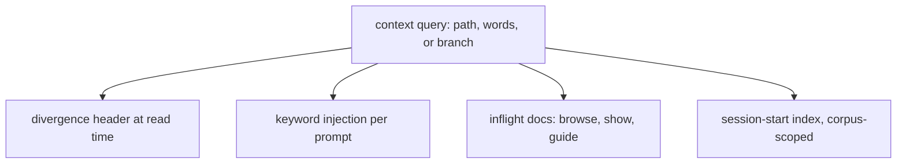

# Inflight Docs Context Query - Plan

## Goal Capsule

- **Objective:** An agent working in this repository is told, without asking, when a document it is reading or a mechanism it is working on has knowledge elsewhere in the corpus that it cannot see from its own branch - above all when a newer version of the document it holds exists on another branch.
- **Means:** One context query in `bin/inflight.mjs` that takes a context (a path being read, a set of words, a branch) and answers which documents across every ref matter and which are newer elsewhere; three agent-facing deliveries render that answer: a divergence header at read time, keyword injection per prompt, and an `inflight docs` command family.
- **Product authority:** This plan owns the query and its three deliveries plus the migration of the session-start index onto the query. The GitHub tunnel, the edge graph, an MCP adapter and any human-facing UI are not active scope (see Scope Boundaries).
- **Open blockers:** None. The corpus-index cost question is deferred to planning with a budget attached (R19, Outstanding Questions).

---

## Product Contract

### Summary

Build one query over the cross-branch corpus that answers "what does this context need to know, and is any of it newer somewhere else", and deliver its answer to agents three ways: a header on any `docs/` file at the moment it is read, titles injected on each prompt keyed on the prompt's own words, and `inflight docs`, which browses the corpus and, called bare, says what exists and what the tool can do. The header ships first and alone.

### Problem Frame

The repository keeps its working knowledge in the tree - `docs/inflight/`, `docs/solutions/`, `docs/plans/` - and distributes it with git, so most of it exists only on branches that have not merged. `bin/inflight.mjs` already answers questions across every ref, and the session-start hook already lists the titles the current branch carries. Both are pull: the agent has to know to ask.

The incident that motivates this plan is the case neither covers. An agent found the right document on master, acted on it, and the correction sat on a branch: the master copy was stale and nothing said so. `note drift` can compute exactly that, but only when someone runs it against the right path. Reading a file is the moment the fact is needed, and no mechanism fires at that moment.

The same shape recurs one level up. A prompt that names a mechanism whose only write-up is off master gets no help from a working-tree search, and the session-start list cannot follow a change of subject mid-session. The corpus is a distribution across branches; the delivery is still branch-scoped and pull-only.

### Key Decisions

- **Agents are the only audience; there is no human-facing UI.** (session-settled: user-directed - chosen over a browsable front end with TOC and nested menu: the use is agents browsing the repo, and a CLI plus hooks is the surface they can drive.) Governs R13, R14.
- **The header ships first, on its own.** (session-settled: user-directed - chosen over keyword injection or `inflight docs` first: it is the one piece that would have caught the stale-copy incident.) Governs R4.
- **The header appears on both channels: direct reads and tool output.** (session-settled: user-approved - chosen over tool-output only: it covers the agent that never runs the tool.) Governs R5, R6.
- **One query, three deliveries.** (session-settled: user-approved - chosen over three independent hooks each reading the corpus its own way: the corpus gets one reader, and the session-start index migrates onto it instead of keeping a bash copy of the scan.) Governs R1, R2, R3, R17.
- **Words in the prompt are the primary injection trigger; files touched and the branch's own facts follow.** (session-settled: user-directed - chosen as primary over files-touched: it fires when intent is stated, and its output shape already exists as the prior-art result.) Governs R9, R10, R11.
- **The session-start title list stays whole and becomes corpus-scoped.** (session-settled: user-directed - chosen over shrinking it once per-prompt injection exists: the full list is for recognition, injection is for the moment, and they do not substitute for each other.) Governs R17, R18.
- **`inflight docs` browses, shows and guides; it is not a second search.** (session-settled: user-approved - chosen over a `docs search` subcommand: `prior-art` already searches across every ref, and two searches would drift.) Governs R13, R15.
- **No MCP adapter in this work.** (session-settled: user-directed - the user asked about it out of curiosity and said not to do it alongside this work; the sketch is recorded under Scope Boundaries so it is not re-derived.)

The fan-out the fourth decision commits to:

### Actors

- A1. **The working agent** - a Claude Code session, or any agent reading `AGENTS.md`, reading and editing files in a worktree. It receives the header and the injections without asking, and runs `inflight docs` when it chooses to.
- A2. **The harness** - the hooks registered in `.claude/settings.json`, which decide when a delivery fires and pass the context to the query. Claude Code only; other hosts get the CLI.
- A3. **The inflight tool** - `bin/inflight.mjs` and its libraries, which own the reading of the corpus and return findings for the harness and the CLI to render.

### Requirements

**The context query**

- R1. The tool answers one question for three kinds of context - a document path, a set of words, or a branch - and the answer names the documents across every ref that matter to that context.
- R2. For each document in an answer, the tool says whether it is on the baseline, and whether a version exists elsewhere carrying content the copy at hand has never held, in the sense `note drift` already defines.
- R3. Every delivery below, and the session-start index, renders the query's findings; none reads the corpus on its own.

**The divergence header**

- R4. The header is the first delivery to ship, and it ships without waiting for R9 to R16.
- R5. When a file under `docs/inflight/`, `docs/solutions/` or `docs/plans/` is shown by the tool, its content is preceded by a header stating how many distinct versions carry content this copy has never held and how many refs carry them.
- R6. When the working agent reads such a file directly, through the Read tool or a Bash command whose tokens name the path, the harness delivers the header's summary line alongside the read; coverage of Bash reads is best-effort by path token, and the header promises nothing for a read through a variable or a pipeline.
- R7. The header previews the largest divergent versions: for each, the branches and open PRs carrying it, its added size against that branch's merge-base, and what it adds - its added headings, or its first added line when it added no heading - with a command for the rest.
- R8. A file that exists on the ref being read but on no baseline ref gets a header saying so, so a branch-only document is not mistaken for a landed one.

**Keyword injection**

- R9. On each prompt the working agent submits, the harness extracts identifiers and mechanism words from it and injects the titles and paths of matching documents across every ref, each marked when it is off the baseline or has a newer version elsewhere.
- R10. Injection matches on what documents are about, headings first, so a common word does not flood the context with body-text hits.
- R11. The same query, keyed on a file the agent reads or edits, injects the documents that cite that file; and keyed on the branch's own facts at session start, injects the documents that name its PR, issue numbers or branch. These two triggers follow R9 and reuse its output shape.
- R12. When nothing matches, injection prints nothing.

**`inflight docs`**

- R13. `inflight docs`, called bare, prints the shape of the corpus - each area, its groups, how many documents each holds and how many of them exist only off the baseline - followed by the commands that drill in and, for each, the sentence that says when to use it.
- R14. Every level of that shape is reachable by a command with no interactive step, and each level lists the next level's commands, so an agent can walk from the bare call to one document by copying what it was shown.
- R15. `inflight docs show <path>` prints one document, from the ref that carries it when it is not in the working tree, with its header per R5.
- R16. Grouping follows the session-start index: solutions by category directory, inflight notes by the cost-of-not-knowing order the index already uses, plans by date.

**The session-start index**

- R17. The session-start index is rendered from the query and lists the whole corpus, not only the current branch's copy of it.
- R18. Documents that exist only off the baseline are grouped by the set of refs carrying them, as `stranded` reports them, so a workstream's notes appear as one heading rather than one line each.

**Cost and failure behaviour**

- R19. A delivery that fires on a read or a prompt has a latency budget stated in its own header comment, and the plan for it either meets the budget with the corpus index as it is or lands the caching that makes it meet the budget.
- R20. Every delivery fails open: an error in the query or the harness prints nothing to the agent's context and never blocks the read, the prompt, or the session, in the terms `docs/agent-harness.md` sets for every hook.
- R21. Every empty answer says what it covered - which refs, and that an empty result is not proof - in the terms `docs/inflight-tool.md` sets for every command.

### Key Flows

- F1. Reading a stale copy
  - **Trigger:** The working agent reads `docs/inflight/<note>.md` from a worktree on master.
  - **Actors:** A1, A2, A3
  - **Steps:** The harness sees the read; it asks the query about that path; the query reports the divergent versions and their previews; the harness delivers the summary line with the read, naming the command that prints the full header.
  - **Outcome:** The agent knows, before acting, that a branch carries a version of the note it has not seen, and which branch.
  - **Covered by:** R1, R2, R5, R6, R7, R19, R20

- F2. Prompt names a mechanism
  - **Trigger:** The user's prompt names a class, flag, log line or issue number.
  - **Actors:** A1, A2, A3
  - **Steps:** The harness extracts the terms; the query matches them against headings across every ref; matching titles are injected, marked off-baseline or newer-elsewhere; nothing is printed when nothing matches.
  - **Outcome:** The agent starts with the titles it would otherwise have needed to know to search for.
  - **Covered by:** R9, R10, R12, R21

- F3. Bare `inflight docs`
  - **Trigger:** The working agent runs `inflight docs` with no arguments.
  - **Actors:** A1, A3
  - **Steps:** The tool prints the corpus shape with counts and the drill-in commands; the agent copies one; each level lists the next until `show` prints a document with its header.
  - **Outcome:** An agent that knew nothing about the corpus reaches one document without reading a doc about the tool.
  - **Covered by:** R13, R14, R15, R16

### Acceptance Examples

- AE1. **Covers R5, R7.** Given a note that master carries and several branches have extended, when the tool shows master's copy, then the content is preceded by a header naming the count of divergent versions and refs, previewing the largest by branch, PR, added size and added headings, and ending with the `note drift` command for the rest.
- AE2. **Covers R6.** Given the same note, when the agent runs `cat docs/inflight/<note>.md` in Bash, then the header's summary line arrives with the command's result; when the agent runs `cat "$f"` with the path in a variable, then nothing is promised and nothing is claimed to be missing.
- AE3. **Covers R8.** Given a note that exists only on the current branch, when it is shown or read, then the header says it is on no baseline ref rather than reporting zero divergence.
- AE4. **Covers R9, R12.** Given a prompt naming a test class whose only write-up is on an unmerged branch, when the prompt is submitted, then that write-up's title and path are injected and marked off-baseline; given a prompt with no identifiers, then nothing is injected.
- AE5. **Covers R13, R14.** Given a fresh session, when the agent runs `inflight docs` and then the first command it printed, then the second output lists documents or a further level, and no step prompts for input.
- AE6. **Covers R17, R18.** Given a workstream whose notes exist on a set of branches and not on master, when a session starts, then the index shows that workstream under one heading naming the branch set, not one line per note.
- AE7. **Covers R20.** Given the query's git call fails, when a docs file is read, then the read succeeds, nothing is injected, and the failure is visible in the hook's own log rather than in the agent's context.

### Success Criteria

- The stale-copy incident cannot recur silently: reading a document with a divergent branch version yields the header without any action by the agent (F1).
- A session that never runs the tool still learns of an off-baseline document when its prompt names the mechanism (F2).
- A fresh agent reaches a document from the bare `inflight docs` call by copying commands, without reading `docs/inflight-tool.md` first (F3).
- The bash scan of the corpus inside the session-start hook is gone, replaced by a call to the query (R3, R17).
- No delivery adds a wait the agent notices on an ordinary read or prompt once the corpus index is warm (R19).

### Scope Boundaries

**Deferred for later**

- **An MCP adapter over the same query.** Worth doing once the `inflight docs` commands stop moving, because a tool list arrives in the agent's context with names, descriptions and argument schemas without any hook, and it is the only route to hosts that read `AGENTS.md` but get no hooks. Sketch, so it is not re-derived: a host-spawned process speaking JSON-RPC over stdin and stdout; four methods (`initialize`, `tools/list`, `tools/call`, `ping`); each `COMMANDS` row maps to one tool with its `when` sentence as the description; a committed `.mcp.json` at the repo root registers it; stdout is the protocol channel so all logging goes to stderr. Against the "no daemon, no socket, no npm dependencies" constraint in `docs/inflight/ci-node-query-client.md`, the honest cost is a long-lived process per session and either an npm dependency or a hand-rolled protocol surface.
- **The files-touched trigger** (R11) waits on lifting the citation resolver out of `.github/scripts/file-ref-gate.js`, which computes the document-to-file edge set on every PR and discards it.
- **Widening the corpus to `refs/tags` and `refs/backup`**, which `docs/inflight/ci-inflight-next-commands.md` owns; the header inherits whatever the corpus covers.

**Outside this work**

- Any human-facing UI, web page, site generation or GitHub Pages.
- The GitHub tunnel and the edge graph, owned by `docs/inflight/ci-node-query-client.md` and `docs/inflight/ci-issue-index-has-no-edges.md`.
- Adopting an external tracker for the cross-branch reader; `docs/inflight/process-adopt-external-harness.md` records that as decided.
- Changing the note or solution frontmatter.

### Dependencies / Assumptions

- The corpus index has no cache: `bin/lib/notes.mjs` states in its header that the disk cache for git data was removed and `corpusIndex` pays its rebuild on every run. A per-read delivery therefore needs either that cost inside its budget or a cache decision (R19).
- A `PreToolUse` hook can allow a call and inject context in the same response; `docs/agent-harness.md` records this as verified against Claude Code 2.1.223. A `PostToolUse` hook exists today (`after-push-check-ci.sh` on Bash), so both delivery moments for R6 are available to planning.
- The tool's libraries return findings and only `bin/inflight.mjs` exits, so a hook can call a library without inheriting an exit; `docs/inflight-tool.md` owns that rule.
- The repository has no `package.json` and the tooling has no npm dependencies; the query and its deliveries keep it that way.
- The corpus today is `refs/heads` and `refs/remotes/origin`; "every ref" in this plan means that set until the widening lands.
- The session-start hook `.claude/hooks/inject-recorded-knowledge.sh` currently runs its own `git for-each-ref` to count branch-only documents; R17 retires that scan rather than widening it, as `docs/inflight/ci-inflight-absorbs-the-query-half.md` argues.

### Outstanding Questions

**Deferred to Planning**

- Which hook moment delivers R6 for the Read tool: allow-with-context before the read, or context after it. Both are available; the choice is latency and fail-open behaviour, not product.
- How R19's budget is met: a cache keyed on the set of ref tip SHAs, a warm-up at session start, or the rebuild cost accepted as is. The budget itself is set in planning from a measurement.
- How R9 extracts terms from a prompt: which token shapes count as identifiers, and how issue numbers are qualified.
- How R6 recognises a docs path in a Bash command, and which command shapes it declines to inspect.

### Sources / Research

- `docs/inflight-tool.md` - what the existing commands answer and the three invariants a new command keeps.
- `docs/inflight/ci-inflight-absorbs-the-query-half.md` - the migration of query logic out of the hooks, including the session index becoming corpus-scoped.
- `docs/inflight/ci-inflight-next-commands.md` - the queued commands, the corpus scope measurement, and the git traps.
- `docs/inflight/ci-node-query-client.md` - the no-daemon, no-dependency constraint and what "drift" means.
- `docs/agent-harness.md` - the layer table, fail-open rule, and the verified hook behaviours.
- `docs/plans/2026-09-02-001-investigate-adopt-or-build-re-run.md` - why the reader is built rather than adopted.
