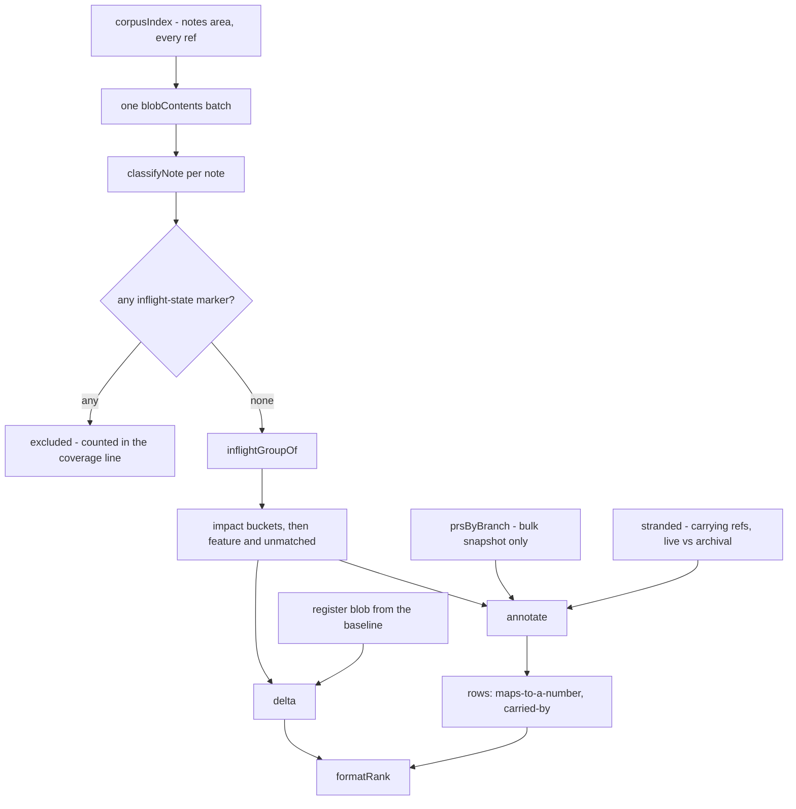

# Inflight Rank - Cross-Ref Backlog View - Plan

## Goal Capsule

- **Objective:** Whoever sits down to re-rank this repository's open work can see the whole cross-branch picture, and the specific places it disagrees with the standing ranking, from one command instead of a hand-rolled sweep.
- **Means:** a new read-only `inflight rank` subcommand on the existing front door (KTD1).
- **Authority:** this plan governs the work. `AGENTS.md`, `bin/AGENTS.md`, `docs/inflight/AGENTS.md` and `docs/inflight-tool.md` govern convention and win where they disagree with it.
- **Execution profile:** one branch, one pull request, opened as a draft.
- **Stop conditions:** stop and report rather than guess if the register cannot be parsed without heuristics beyond the two literal forms R14 names, or if a design step would require asserting fix ownership the signals cannot prove (KTD5).

---

## Product Contract

### Summary

Add `bin/inflight.mjs rank`. It reads open in-flight notes from every ref, groups them by the same rule the session index uses, annotates each row with the relations it can prove, and reports where the computed picture and `docs/inflight/process-candidate-ranking.md` disagree. It reads; it never writes the register.

### Problem Frame

Re-deriving the shared backlog ordering is expensive. The working tree holds a minority of the note corpus - most notes live only on branches that have not merged - so an ordering derived from `ls docs/inflight/` is derived from a fraction of what is open.

**The gather step is already solved, and this plan starts by saying so.** `bin/inflight.mjs docs list inflight <impact>` reads every ref, keeps open notes, groups them by impact, scopes to one bucket, and marks an off-baseline note with the branch it was read from. Run against `data-loss` today it already prints the row this plan's headline spot check is about. Anything that rebuilt that would be a second copy of a working answer.

What it does not carry is what the hand sweep spent its time on:

- the carrying branch's pull request, and whether that branch is live or archival - so a reader can tell work that will land from work that will not;
- the fork issue a note's filename maps to, when it maps to one honestly;
- the delta against the standing register - what is ranked and no longer open, what is open and unranked;
- an accounting of the open notes that no impact bucket claimed, which today is the largest group in the corpus and is invisible to an impact-scoped view.

The expensive step is the one none of that automates by itself: telling a branch that *fixes* a note's subject from a branch that merely *carries the note*. `docs/inflight/core-revoke-commit-skips-the-work-mailbox-drain.md` exists only on `origin/fix/803-bound-transactional-revoke-wait`, and the note itself says the bug predates that branch's pull request. Carriage read as ownership is the expensive wrong answer, so this command reports carriage and refuses to call it ownership.
<!-- file-refs: N/A - the cited note exists only on a branch, and being absent from the baseline is the exact property this example demonstrates -->

### Key Decisions

- **Ship the read side alone; the note format does not change.** (session-settled: user-directed - chosen over shipping an agent-expressible ordering field in the same pass: the read side is useful on its own and the write side is a separate later decision.) Governs R1, R21.
- **No fractional or LexoRank values anywhere.** (session-settled: user-directed - chosen over fractional indexing, the original proposal: ranks are dense and mandatory while claims are sparse and optional, and a stale float stays a valid float forever after every note it was positioned against is gone.) Governs R21.
- **`inflight-impact` is the outer sort; there is no global total order.** (session-settled: user-approved - chosen over one flat ranking across every impact: the impact order in `bin/lib/inflight-tags.mjs` is already this repository's priority scale, and a flat order would imply precision the data does not carry.) Governs R2, R4.
- **The command reads the register and reports a delta; it never writes it.** (session-settled: user-directed - chosen over having the tool regenerate or maintain the register: the register's value is the human reasoning attached to the order, and no computed scheme carries a line like "ranked by how little input each needs, not by the size of what it unblocks".) Governs R13, R15.

### Requirements

**Gathering and grouping**

- R1. `rank` reads notes from every ref through `corpusIndex`, scoped to the notes area as `note find` and `stranded` scope it, and never re-parses the tag markers itself.
- R2. A note is placed by `inflightGroupOf`, so `rank` and the session index can never disagree about where a note belongs.
- R3. A note is open when it carries no `inflight-state:` marker at all. Any marker makes it not open, whatever words the state contains - that is `classifyNote`'s rule, and the requirement states it in the code's terms rather than by listing state words.
- R4. Impact buckets are emitted in `INFLIGHT_IMPACT_ORDER`. The `feature` and `unmatched` groups are emitted after them, labelled as open work no impact bucket claimed, so a missing or misspelt tag reads as a finding rather than an absence.
- R5. `--impact <value>` scopes the output to one bucket. An unrecognised value is not an error: the valid names come back, each as the command that would have worked, and the command exits 0.
- R6. The bare call prints the register delta and the group names, each with the `rank --impact <value>` command that scopes to it. It prints no bucket rows.

**Annotation**

- R7. A row reports a number only from the `<area>-<NNN>-<slug>` filename position, and never asserts which repository owns it. A `pr-` note's number is a fork pull request and prints the `gh pr view` command; a name predating the convention is marked as carrying a number this command cannot attribute. Every printed command is repo-qualified.
- R8. A row states which refs carry the note. For a note present on the baseline it states that carriage names no owner, because every branch cut from the baseline carries it.
- R9. A branch-only note's row names its carrying branch, that branch's pull request when the snapshot knows one, and whether the branch is live or archival.
- R10. A note held only by archival refs is read from its first sorted archival ref and labelled preserved rather than landing.
- R11. A row never asserts that a branch, pull request or issue fixes the note. A carrying branch is labelled as carrying, with the sentence that carrying is not fixing.
- R12. Pull-request state comes from the bulk snapshot alone. A branch absent from it is reported as absent *from the snapshot*, with the snapshot's age and the `bin/inflight.mjs branch <ref>` command that answers exactly; a snapshot that did not answer makes every row's pull-request state UNKNOWN, and no row then states that nothing owns the note.

**Register delta**

- R13. The register is read from the baseline's blob, not the working tree, and is never written.
- R14. Two literal forms are extracted: note filenames matching the directory's `<area>-<slug>.md` shape, and `astubbs#<number>` references. A note counts as ranked when the register names its filename **or** the fork issue number its `<area>-<NNN>-<slug>` filename carries - the register's ranked section leads every line with a number, not a filename.
- R15. Ranked but no longer open is reported with its reason: absent from every ref, closed, deferred, or open but outside the impact buckets - naming the group `inflightGroupOf` assigned.
- R16. An `astubbs#<number>` the register ranks that resolves to no note on any ref is reported as a register entry the corpus cannot resolve.
- R17. Open but unranked is reported as rows only when `--impact` scopes the call. On the bare call it is a per-group count with the command that lists it, because unranked is most of the corpus and a finding that fires on nearly everything carries no information.

**Command contract**

- R18. Exit 0 when the command ran, whatever it found. Exit 2 when it could not run, including when the register could not be read - after everything that did run has been printed.
- R19. The output states which refs it covered, and how many open notes were excluded from the impact buckets and why, so the corpus that was searched stays visible.
- R20. `rank` is a row in the `COMMANDS` registry carrying `summary`, `when` and `usage`. Its usage names `bin/inflight.mjs rank` and no other `bin/*.mjs` path.
- R21. `docs/inflight-tool.md` carries a worked example, and `docs/features/cross-ref-repository-queries.yaml` gains a `use_this_when` line and a `boundaries` entry for the ownership refusal. No frontmatter field is added, no tag vocabulary changes, and no gate is added.

### Scope Boundaries

**Out of scope, binding:**

- A new frontmatter field. `inflight-before` is a later, separate decision.
- Any change to `bin/lib/inflight-tags.mjs`, `bin/lib/inflight-tags.sh` or `bin/check-inflight-tags.sh`.
- Any write to `docs/inflight/process-candidate-ranking.md`.
- Fractional or LexoRank values.
- A global total order across impact buckets.

**Deferred to follow-up work:**

- **A `candidate` relation from a branch-name number match.** Considered and dropped during review: only a small minority of notes carry a positional number, the matches that fire are dominated by one issue family, and two of them are cross-namespace by construction - a note filename carries a fork number while a branch name carries an upstream one. A relation whose own caveat says it may be meaningless is the confidently-wrong hint KTD5 exists to refuse.
- **Asserting fix ownership from a stronger signal**, such as a pull request body naming the note path. KTD5 refuses to guess it; a later change could earn it.
- A `--deferred` scope, to read the deferred section the same way.
- Reconciling `docs/inflight/ci-inflight-next-commands.md` against what the front door now ships.

### Sources

- `docs/inflight/ci-inflight-next-commands.md`, the front door's roadmap note. Its 2026-09-02 addendum states the design axis this command follows: *"flow with git, do not suppress it"* - `note drift` reports disagreement rather than reconciling it, `stranded` reports a ref-set rather than a winner, and the gap it names is that nothing reports the corpus as the distribution it already is. `rank` reports the delta; it does not reconcile to one verdict.
- `docs/inflight-tool.md`, "If it does not answer your question, change it" - the three invariants a new command keeps.
- `docs/solutions/workflow-issues/a-harness-that-cannot-tell-never-ran-from-ran-and-agreed-2026-09-02.md` - a negative control keyed on "output differed" is satisfied equally by a caught mutation and by the code never running. Shapes the test design in KTD9.
- `docs/solutions/workflow-issues/compound-tooling-breaks-in-worktrees-and-forks-2026-08-07.md` - a bare `gh` resolves against `confluentinc` here and returns a plausible wrong answer. `rank` reaches GitHub only through the existing repo-qualified helpers.
- `docs/solutions/workflow-issues/prior-art-lives-on-branches-2026-09-01.md` - any enumeration must state the corpus it searched. Shapes R19.
- `bin/lib/refactor-window.mjs` with `formatRefactorWindow` in `bin/lib/views.mjs` - the most recent command added to this front door, and the layout KTD2 follows.

---

## Planning Contract

### Key Technical Decisions

- KTD1. **`rank` is a top-level row in `COMMANDS`, not a `docs` subcommand.** It asks a question about the whole open backlog, not about one document, which is the split the registry already draws between `stranded` and `docs list`. It earns its own row rather than four columns on `docs list inflight <impact>` because its subject is the register delta, which is not a property of any one document.
- KTD2. **Query in a new `bin/lib/rank.mjs`; view as `formatRank` in `bin/lib/views.mjs`.** This is the split `bin/lib/views.mjs`'s own header states and the layout the two most recent commands used. `bin/lib/prior-art.mjs` keeps both together and is the older, minority shape; following it here would put this command on a different convention from its neighbours for no gain.
- KTD3. **Nothing is re-derived that the tool already computes.** `corpusIndex` for the walk, `classifyNote` for the markers, `inflightGroupOf` for the group, `stranded` for the carrying-ref clusters and the archival flag, `prsByBranch` for pull requests. Blobs are read in one `blobContents` batch, as `docsShape` does, never one call per note. The group rule in particular must stay identical to the session index's, or the two surfaces would rank the same note differently.
- KTD4. **The bulk pull-request snapshot only - no per-branch fall-through, and no new cache.** `branchView` falls through to `prForBranch` because it answers about one branch. `rank` answers about many: the notes area's off-baseline paths spread across a few hundred distinct carrying refs, well over half of which are absent from the bulk map, and `bin/lib/cache.mjs` deliberately does not cache an absence for that kind - so the fall-through would fire a fresh, untimed `gh` subprocess per PR-less branch on every run. The honest and bounded answer is the snapshot plus its age, plus the command that does the exact lookup for one branch. Reproduce the counts with `bin/inflight.mjs --perf rank`.
- KTD5. **The command never asserts fix ownership. It reports two provable relations and refuses to invent a third.** `maps to a number` comes from the filename position, without claiming which repository owns the number. `carried by` comes from the corpus index. `fixes` is never printed. This is what makes the `core-revoke-commit-skips-the-work-mailbox-drain` row correct rather than confidently wrong.
- KTD6. **Carriage is informative only off the baseline, and the row says which case it is in.** A note on the baseline is carried by essentially every ref, so its carrying-ref list names no owner and the row states that instead of listing refs. Off-baseline is the common case here, not the exception, so this is the split that decides most rows rather than a corner.
- KTD7. **No issue metadata is read, from GitHub or from `docs/inflight/issue-index.md`.** That file warns twice that every row goes stale silently and tells the reader to confirm before acting on one. The row prints the number and the repo-qualified command, and - because `docs/inflight/AGENTS.md` records that pre-convention names carry upstream numbers and that `pr-` carries a pull request - it never asserts which repository the number belongs to. A wrong reference that resolves is worse than a broken one.
- KTD8. **A register that cannot be read is a failed run, reported after everything that succeeded.** Emit the grouping and the warning, then return `{ok: false}` so the front door exits 2. This is the shape `refactor-window` already uses for a candidate it could not measure, and it keeps "the delta did not run" distinguishable from "the delta was empty". `freshnessWarnings` is computed by the front door's row, as it is for every existing command, not by the view.
- KTD9. **`rank` reads a preserved cluster from its first sorted archival ref, and this is where it departs from `docsShape`.** `stranded` marks a cluster `preserved` when it has no live refs, and `docsShape` then drops those paths from the corpus entirely - so the first-sorted-live-ref rule is undefined for exactly the case R10 needs. Naming the departure is what keeps a later reader from "fixing" `rank` to match.
- KTD10. **Tests get a dedicated `rankFixture()`, not an extension of the shared `buildFixture()`.** Several existing checks assert exact counts against the shared fixture, so adding a note to it would break them for an unrelated reason. `manyVersionsFixture()` and `buildRenameFixture()` are the precedent. Every check carries a `mutate`, and each assertion names a specific string or shape the running code uniquely produces - never mere inequality to a baseline, which a mutant that stops the code running satisfies just as well.

### High-Level Technical Design

### Assumptions

Inferred rather than directed, and each cheap to reverse.

- The register is read from the baseline's blob. The tool's own thesis says the working tree is not the corpus, and the register itself has divergent versions on other refs.
- The delta is always on rather than behind a flag, because it is the deliverable.
- The flag surface is `--impact <value>` alone.

### Sequencing

U1 lands with the first commit. U2 lands before U3 and U4 so their checks can be written against a fixture that exists. U5 depends on U3 and U4. U6 is last, because a worked example should be copied from output that ran.

---

## Implementation Units

### U1. The working note

- **Goal:** the pull request has a `docs/inflight/` note from its first commit, collecting findings where they happen rather than reconstructing them at the end.
- **Requirements:** the directory contract in `docs/inflight/AGENTS.md`; the pull-request template's note checkbox.
- **Dependencies:** none.
- **Files:** `docs/inflight/branch-inflight-rank-cross-ref-backlog-view.md`
- **Approach:**
  1. Name it for its subject, not its pull request, so the name survives the merge.
  2. Tag it `inflight-type: task` and `inflight-impact: process` - the work is about how work is ranked and recorded.
  3. Write any sentence naming this branch or its pull request in post-merge terms and mark the line, or do not name them. `bin/check-branch-self-reference.sh` fails a note that describes its own open branch or pull request in the present tense.
  4. Record what the design refuses and why - the fix-ownership refusal, and the dropped `candidate` relation with the measurement that settled it - so a later reader does not take either for an oversight.
- **Patterns to follow:** the existing `branch-`-prefixed notes on the baseline.
- **Test expectation:** none - a documentation file with no behaviour. `bin/check-inflight-tags.sh` validates its tags.
- **Verification:** `bin/check-inflight-tags.sh` and `bin/check-branch-self-reference.sh` pass, and `bin/check-file-refs.sh` stops reporting the plan's forward reference to this file.

### U2. `rankFixture()` - the repository the rank checks run on

- **Goal:** a purpose-built git fixture carrying every situation the rank checks assert about, so each has a known right answer rather than an ambient one.
- **Requirements:** supports R1-R17.
- **Dependencies:** none.
- **Files:** `bin/test-inflight.mjs`
- **Approach:**
  1. Follow `manyVersionsFixture()`: a lazily-built, memoised, dedicated repository, not an edit to the shared `buildFixture()`.
  2. On `master`: an open note with an impact; notes whose states are `closed`, `blocked`, and `parked - deferred`; a note whose state text *begins with the word* `open`; a note with a misspelt impact and one with no impact at all; a note named `<area>-<NNN>-<slug>.md`; a `pr-<NNN>-` note; a register file naming a mix of filenames, an `astubbs#<number>` that resolves to a note, and one that resolves to nothing.
  3. On a branch: a note the baseline has never held, so the branch-only annotation has a subject.
  4. On a tag and no branch: a note held only there, so the preserved case has a subject.
  5. A note whose prose mentions `inflight-state:` without closing the marker, so the still-open case is pinned.
- **Patterns to follow:** `manyVersionsFixture()` and `buildRenameFixture()` in the same file; `bin/lib/fixture-repos.mjs` for the `git`/`commit`/`write` helper shape.
- **Test expectation:** none - the fixture is test infrastructure. Its correctness is asserted by the checks in U3 and U4.
- **Verification:** a check in U3 reads the fixture and gets the expected group contents.

### U3. The gather, filter, group and annotate query

- **Goal:** `rank` produces annotated rows for one group, across every ref, without asserting anything it cannot prove.
- **Requirements:** R1, R2, R3, R4, R7, R8, R9, R10, R11, R12, R19.
- **Dependencies:** U2.
- **Files:** `bin/lib/rank.mjs` (new), `bin/test-inflight.mjs`
- **Approach:**
  1. Take a corpus index and the pull-request snapshot as arguments rather than fetching them, so the checks drive the real logic with no network - the third invariant in `docs/inflight-tool.md`.
  2. Collect every wanted blob, read them in one `blobContents` batch, classify each with `classifyNote`, place each with `inflightGroupOf`.
  3. Keep the impact groups plus `feature` and `unmatched`; count everything else by group for the coverage line.
  4. Derive carrying refs and the live/archival split from `stranded`. Read an off-baseline note from its first sorted live ref, and a preserved cluster from its first sorted archival ref (KTD9).
  5. Annotate: the filename number by position only, never attributed to a repository; `carried by` only when the note is off the baseline, otherwise the on-baseline sentence.
  6. Take pull requests from the bulk snapshot alone. A branch absent from it is absent from the snapshot, not without a pull request; a snapshot that did not answer makes the state UNKNOWN.
- **Execution note:** write each check against the U2 fixture before the branch of logic it covers - the fixture already exists, so the failing assertion is cheap, and it is the only thing that proves the negative control exercises real code.
- **Patterns to follow:** `stranded()` in `bin/lib/notes.mjs` for the query shape; `docsShape()` in `bin/lib/docs-shape.mjs` for the batch-then-classify pass.
- **Test scenarios:**
  - A note with no state marker appears in its impact group.
  - A note whose state is `closed - <reason>` appears in no group.
  - A note whose state is `blocked - <reason>` appears in no group.
  - A note whose state reads `parked - deferred` appears in no group, proving the word is matched anywhere in the state rather than at its front.
  - A note whose state text *begins with the word* `open` appears in no group, proving R3 follows `classifyNote` rather than a list of state words.
  - A note whose prose contains `inflight-state:` with no closing marker is still treated as open.
  - A note with a misspelt impact, and one with no impact at all, appear under `unmatched` or `feature` rather than vanishing.
  - The coverage figures account for every open note the impact groups did not claim.
  - A note present on the baseline produces the on-baseline sentence and no carrying-ref list.
  - A branch-only note names its carrying branch.
  - A note held only by a tag is read from that tag and labelled preserved.
  - A `<area>-<NNN>-<slug>` note produces the number and a repo-qualified command; a `pr-<NNN>-` note produces the pull-request command instead; a note with no positional number produces neither.
  - No row's text contains the word `fixes` for any input in the fixture.
  - With a snapshot that did not answer, the result carries UNKNOWN and no row asserts an absence.
  - A branch absent from an answering snapshot is reported as absent from the snapshot, and the row names the exact-lookup command.
  - A corpus index that failed returns `{ok: false}` with a reason, not an empty group list.
- **Verification:** every new check passes against the real tree and its mutant goes red.

### U4. The register parse and the delta

- **Goal:** the command reports where the computed grouping and the standing register disagree.
- **Requirements:** R13, R14, R15, R16, R17.
- **Dependencies:** U2, U3.
- **Files:** `bin/lib/rank.mjs`, `bin/test-inflight.mjs`
- **Approach:**
  1. Read the register from the baseline's blob; take the blob content as an argument so the checks need no git.
  2. Extract the two literal forms only. No heuristics beyond them - a register entry named in prose alone is out of the parse's reach, and the output says so rather than guessing.
  3. Resolve a ranked entry by filename or by the fork issue number a `<area>-<NNN>-<slug>` filename carries.
  4. Report ranked-but-not-open with its reason, including the outside-the-impact-buckets case naming the group.
  5. Report an `astubbs#<number>` that resolves to no note as unresolvable.
  6. Report open-but-unranked as rows under `--impact`, and as per-group counts on the bare call.
- **Patterns to follow:** `drift()` in `bin/lib/notes.mjs` for a query that takes its git inputs as arguments.
- **Test scenarios:**
  - A register naming a note that exists and is open yields no delta row for it.
  - A register naming a filename that exists on no ref yields a row whose reason is absence.
  - A register naming a note whose state is deferred yields a row whose reason is deferral, distinct from absence and from closure.
  - A register naming a note that is open but lands in `unmatched` yields a row whose reason names that group, not absence.
  - A register naming only `astubbs#<number>` for a note whose filename carries that number counts that note as ranked.
  - An `astubbs#<number>` matching no note on any ref is reported as unresolvable.
  - An open note the register never names yields an unranked row under `--impact`, and only a count on the bare call.
  - A register blob that is empty yields every open note as unranked, and is not confused with a register that could not be read.
- **Verification:** every new check passes and its mutant goes red.

### U5. The view, the registry row and the usage

- **Goal:** `rank` is reachable, self-describing, and its output states its own scope.
- **Requirements:** R5, R6, R18, R19, R20.
- **Dependencies:** U3, U4.
- **Files:** `bin/lib/views.mjs`, `bin/inflight.mjs`, `bin/test-inflight.mjs`
- **Approach:**
  1. Add `formatRank` to `bin/lib/views.mjs`: two-space indent, `plural` for counts, and a closing scope line naming the refs searched, the excluded-note accounting, and what an empty result does not prove.
  2. Add the `COMMANDS` row with `summary`, `when` and `usage`. `help` builds itself from the registry, so the existing `help-lists-every-registered-command` check covers R20's first half with no new check; the existing `usage-names-the-front-door-not-the-library` check covers the second, and is satisfied by following the neighbouring rows.
  3. In `run`: compute `freshnessWarnings` as the other rows do, emit warnings, emit the grouping, emit the delta, then decide the return. A register that could not be read returns `{ok: false}` after the emits.
  4. An unrecognised `--impact` value prints the valid group names as commands and returns `{ok: true}`. An unknown flag is refused with its reason and `{ok: false}`.
- **Patterns to follow:** the `refactor-window` row in `bin/inflight.mjs` for emit-then-fail and for where `freshnessWarnings` is computed; `formatFlakes` in `bin/lib/views.mjs` for an empty result that says what it does not prove; `docs list`'s unknown-group behaviour for R5.
- **Test scenarios:**
  - `rank` on the fixture exits 0 and its output contains a group name and a note path from that group.
  - `rank --impact <unknown>` exits 0 and its output names the valid groups.
  - `rank --nonsense` exits 2 and the output carries the reason.
  - A run whose register could not be read still prints the grouping and exits 2.
  - The closing line names the refs searched and the count of open notes excluded from the impact buckets.
- **Verification:** `node bin/inflight.mjs rank --impact stall` and `node bin/inflight.mjs rank --impact data-loss` on this repository reproduce their respective spot checks.

### U6. The documentation

- **Goal:** the two places that describe this tooling to a reader describe `rank` too.
- **Requirements:** R21.
- **Dependencies:** U5.
- **Files:** `docs/inflight-tool.md`, `docs/features/cross-ref-repository-queries.yaml`
- **Approach:**
  1. Add a section to `docs/inflight-tool.md` after "Finding work that will be lost if nobody acts" - `rank` is the sibling question to `stranded`.
  2. Use the carriage-is-not-fixing case as the worked example, because it is what the annotation step buys.
  3. Add a `use_this_when` line to the feature file, and a `boundaries` entry for the ownership refusal - that file already records what this tooling declines to do, and the refusal belongs beside them.
  4. State the shape of what it returns and name the command that produces the number. Do not write a count into the prose.
  5. Copy the example from output that actually ran.
- **Patterns to follow:** the existing "Before editing a note several branches share" section; the existing `boundaries` entries in the feature file.
- **Test expectation:** none - documentation. `bin/check-file-refs.sh` validates any path cited, and `bin/check-docs-data.sh` validates the feature file's structure.
- **Verification:** both gates pass and the example matches real output.

---

## Verification Contract

| Gate | Command | Applies to |
|---|---|---|
| Whole gate sweep before push | `bin/check-all.sh` | every unit |
| Self-tests, both arms | `node bin/test-inflight.mjs` | U2-U5 |
| Node compile | `node --check bin/lib/rank.mjs` | U3-U5 |
| Tag vocabulary | `bin/check-inflight-tags.sh` | U1 |
| Branch self-reference | `bin/check-branch-self-reference.sh` | U1 |
| Cited paths resolve | `bin/check-file-refs.sh` | U1, U6 |
| Feature-file structure | `bin/check-docs-data.sh` | U6 |
| Issue references name a repo | `bin/check-issue-refs.sh` | every unit - it reads added lines in `.mjs` too, so a bare `#NNN` in a new comment fails it |

**The two known-good spot checks.** Each must hold when its bucket is scoped:

- `node bin/inflight.mjs rank --impact stall` - `bug-allowed-more-records-crosses-threads-unfenced` is on the baseline and open. Its row carries the on-baseline sentence, no number, and no claim that anything owns it.
- `node bin/inflight.mjs rank --impact data-loss` - `core-revoke-commit-skips-the-work-mailbox-drain` exists only on `origin/fix/803-bound-transactional-revoke-wait`. Its row names that branch as carrying the note, labels the relation as carriage, and does not read as owned by that branch's pull request.

**Negative controls are the load-bearing half.** Each check gets a `mutate` that breaks exactly what it asserts, and the suite fails if a mutant stays green. Each assertion names a specific string or shape only the running code produces: a check satisfied by "the output differed" is satisfied equally by a mutation that stops the code running at all, which has happened in this suite before.

**Verify the checks landed.** `grep -c "^        id: '" bin/test-inflight.mjs` before and after. An edit that reports success is not evidence it applied - five checks were once reported passing and were not in the file.

---

## Definition of Done

- Every unit's verification holds, and `bin/check-all.sh` passes.
- `node bin/test-inflight.mjs` passes both arms, and every new check's mutant goes red.
- Both spot checks reproduce against this repository, each under its own bucket.
- `rank` makes no `gh` call beyond the one bulk snapshot `prsByBranch` already caches.
- No file under `bin/lib/inflight-tags.*`, `bin/check-inflight-tags.sh` or `docs/inflight/process-candidate-ranking.md` is modified.
- `CHANGELOG.adoc` is untouched.
- The working note from U1 is in the first commit, not the last.
- No abandoned or experimental code remains in the diff.
- The pull request is open as a draft, built from `.github/PULL_REQUEST_TEMPLATE.md`, with every checklist box resolved `[x]` or `N/A - <reason>`, and any residual list written as plain bullets.
