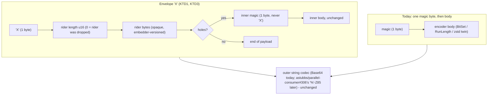
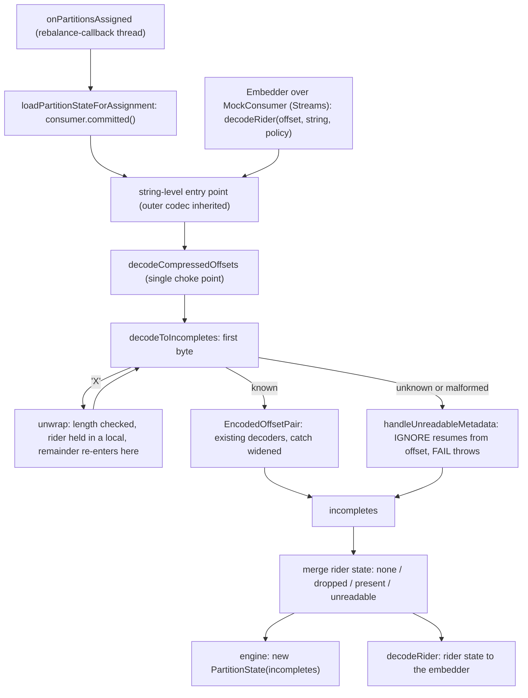

# Opaque Rider in the Offset Metadata Payload - Plan

Serves astubbs#255 (Kafka Streams on PC) by way of the core codec; the Streams consumer of this slot ships separately.

---

## Goal Capsule

- **Objective.** Give Parallel Consumer's committed-offset metadata payload one generalised extension slot: an embedder hands PC an opaque byte blob per partition at commit time, PC carries it inside its own versioned payload without interpreting it, and an embedder can read it back from the committed metadata string.
- **First customer, not in this plan.** `parallel-consumer-streams` persists its per-partition stream time in the slot so a restart against a PC-committed group restores it. That is a second PR on the Kafka Streams stack (a rung on `feats/ks-streams-reconciled`, astubbs/parallel-consumer#454); this plan exposes the seams it needs and ships nothing Streams-specific.
- **Authority.** Product behaviour: the R-IDs below. Mechanism: the KTDs, which bind within their cited R-IDs. KTD-S7 of the Kafka Streams spike plan is inherited and not reopened.
- **Stop conditions.** Stop and surface if any change would make a previously committed payload undecodable by the PC version that wrote it; if configuring a rider can ever cost a partition the hole map it would otherwise have committed; if a rider can block a partition with no work left to complete; if the Streams read-back seam turns out to need `PartitionState` construction from outside the engine; or if a test in the wire-format set must be weakened to go green.
- **Execution profile.** Core module only, no Docker for the wire-format work; one broker-backed test for the upgrade/downgrade flow. The offsets package is the PIT mutation lane, so mutation-score the changed classes before declaring done.
- **Tail ownership.** The implementer opens the PR from the template, asks for `@claude review this`, and posts one comment on astubbs/parallel-consumer#306 naming the magic byte this work takes and the three `EncodedOffsetPair` switches both PRs touch.

---

## Product Contract

### Summary

PC's offset-metadata payload gains an envelope encoding that wraps today's hole encoding with a length-prefixed opaque rider. An embedder supplies the rider per partition through `ParallelConsumerOptions` and reads it back through a pure decode entry point. Users who supply no rider write byte-identical payloads to today. The rider is charged against the broker cap but never against back-pressure; when a payload exceeds the cap the rider goes before the hole map, the drop is marked in the payload where the mark fits, and every drop is counted.

### Problem Frame

A consumer-group commit carries one metadata string per partition. PC owns that string on the PC path: it encodes the commit frontier's holes there, which is the entire reason crash safety survives out-of-order completion. Kafka Streams on PC therefore cannot write its own `TopicPartitionMetadata` into the same slot, and the decision record settled that it never will (KTD-S7 in `docs/plans/2026-08-08-001-feat-ks-on-pc-spike-plan.md`, on the spike branch; pattern write-up migrated by this plan under U7).
<!-- file-refs: N/A - the spike plan lives on the Kafka Streams branches, read with `git show`; it has not merged -->

The cost is measured: after a restart against a group PC committed, the Streams task's stream time starts at `UNKNOWN`, anchors on the first late record, and `STREAM_TIME` punctuators re-fire over event time the previous run already covered. `StreamTimePunctuatorRefireOnRestartTest` on `feats/ks-streams-reconciled` pins that defect and names the fix direction: populate PC's own opaque rider.

Nothing in the payload today can carry it. The framing is one magic byte then an encoder-specific body: no version field, no length, no trailer. Two of the existing decoders treat surplus bytes differently (`OffsetBitSet` ignores them, `OffsetRunLength` rejects the payload), so a suffix on an existing encoding would make old-reader behaviour emergent rather than chosen. And in the common steady state PC writes no metadata at all: `tryToEncodeOffsets` returns empty when there are no incomplete offsets, so a caught-up partition's commit is a bare offset. The slot has to be a new, versioned framing that can stand alone.

### Requirements

**Wire format**

- R1. The payload may carry one opaque rider per partition, framed by a new envelope magic byte and a length prefix, with today's hole encoding inside the envelope unchanged.
- R2. A payload written with no rider is byte-identical to a payload written by PC today.
- R3. A rider is carried whether or not the partition has incomplete offsets, so a caught-up partition's commit carries one.
- R4. Every payload PC has ever written stays decodable by the PC that wrote it and by this one; the envelope adds a decode obligation and never removes one.
- R5. PC never interprets the rider; it needs the rider's length and nothing else. The rider is partition-scoped and instance-agnostic: whichever group member next takes the partition reads it.
- R6. While the envelope survives, a reader can tell a rider that was dropped for size from a rider that was never configured, and both from metadata the policy discarded; when the ladder sheds the envelope itself (R9), the payload reads as never configured and the dropped-rider counter is the only signal.

**Budget and crash safety**

- R7. The assembled string, rider included, is measured against the metadata cap; only the hole encoding is measured against the back-pressure threshold.
- R8. A rider larger than PC's rider cap is dropped at write time, with one rate-limited warning naming the option.
- R9. Configuring a rider never costs a partition metadata it would otherwise have committed: when a payload with a rider exceeds the cap, PC sheds the rider, then the drop marker, before it strips the hole map.
- R10. Rider bytes must not change which hole encoding PC selects or whether it compresses it.
- R11. The rider is captured in the same snapshot as the offset and payload it commits with, and the supplier is told which offset that is and how many bytes it may return.
- R12. A rider does not make a partition dirty; it rides only on commits the partition would have made anyway, including the shutdown commit.

**Embedder API**

- R13. An embedder supplies the rider per partition through `ParallelConsumerOptions`, beside the existing `retryDelayProvider` hook, and supplying none is the default. A zero-length rider is not a representable value; the embedder versions its own blob.
- R14. An embedder reads the rider back from a committed metadata string through a public entry point that takes the committed offset and the unreadable-metadata policy, and goes through the codec's single decode choke point. There is no overload without a policy.
- R15. The supplier's thread, its purity contract, and the fact that it may be called more than once per commit cycle are stated in its javadoc; a supplier that throws never kills the engine thread it runs on - the failure is logged, counted, and treated as no rider for that call.

**Compatibility**

- R16. A PC carrying astubbs#207's policy reads an envelope payload through the existing unreadable-metadata path: `IGNORE` discards the map and resumes from the committed offset; `FAIL` stops. No new policy value.
- R17. The option's documentation states that a rider must not be configured until every member of the group runs a PC with the unreadable-metadata policy, because every released PC fails assignment on an unknown magic byte and the payload is durable; it names the recovery procedure; and PC logs the same at configuration time.
- R18. Stock Kafka Streams reading an envelope payload degrades exactly as it does for today's payloads: `TopicPartitionMetadata.decode` returns `UNKNOWN`.
- R19. The envelope's magic byte is outside the bytes reserved by astubbs/parallel-consumer#306 and the release-gated `ByteArray` pair.

**Observability**

- R20. Rider size is recorded as a distribution; a dropped rider, a stripped payload, and a failing supplier are each counted; the density ratio keeps reporting the hole encoding only, the headroom ratio reports the assembled string, and neither records on a caught-up commit.

**Record**

- R21. The decision record for the pattern lives on `master` with the code that implements it, with its stale claims corrected, and the user-facing feature data names the rider's interaction with the unreadable-metadata policy and the recovery procedure.

### Success Criteria

- The wire-format test set passes unchanged, plus new tests for the envelope, the budget ladder, the old-reader path, and the no-rider identity.
- A payload with a rider and no inner encoding round-trips to zero incompletes, the same highest-seen offset as an empty payload, and the rider.
- A rider of any size cannot leave a partition with `allowedMoreRecords=false` and no work to complete, and cannot strip a hole map that fits without it.
- An older PC (simulated through `magicByteOfAnEncodingThatDoesNotExistYet` and a broker-backed downgrade arm) resumes from the committed offset under `IGNORE` and stops under `FAIL`.
- The rider overhead table is exact across its whole domain, not sampled.
- PIT mutation score on the changed offsets classes does not fall, and the `PartitionState` mutation survivors do not grow.

### Scope Boundaries

- Only the core module changes. The Streams module's supplier and seed logic, and inverting `StreamTimePunctuatorRefireOnRestartTest`'s pinned assertion, are the follow-up PR's.
- The hole encodings themselves, the outer string codec and the encoder competition are untouched; astubbs/parallel-consumer#306 owns those.
- No rider-only payload when holes exist: a commit never drops its hole map to keep a rider (R9).
- The dispatch default of the Streams seam does not move.

#### Deferred to Follow-Up Work

- **Streams consumer of the slot.** A rung on `feats/ks-streams-reconciled`: `PcTaskDispatcher` supplies the partition time from its low-water mark, reads the rider back through R14 at `initializeMetadata` with `IGNORE`, seeds `seedStreamTime` and the PC-path `RecordQueue`, reconciles the per-partition riders of a multi-partition task (max is the natural rule, and it is that rung's contract to state), and the refire test's PC arm inverts to `isGreaterThanOrEqualTo(highest)`. Two hazards that rung inherits from this API's shape: the supplier must read a published `volatile` or `AtomicLong` rather than call back into the dispatcher, because `PcTaskDispatcher` builds its `ParallelConsumerOptions` in its own constructor and binds last so a `StreamThread` never sees a half-built dispatcher; and the rider read must sit outside stock Kafka's `committedTimestamp != UNKNOWN` guard, which on the PC path is never true. The embedder must also keep its rider state alive until PC's close completes, because the shutdown commit is the one a restart reads.
- **The idle-but-punctuating commit gap blocks the customer's end-to-end result and is not this plan's.** `core-streams-two-commit-signals-the-pc-path-cannot-see.md` on the reconciled branch records that `pcAwareCommitNeeded()` answers only "does PC hold uncommitted work", and rejects the one-line `|| commitRequested` fix. A rider rides only on commits that happen (R12), so a Streams task that punctuates without completing records writes no rider until its next completion. A working rider is not a working feature until that note is resolved; astubbs#255 does not close on these two PRs, and the Streams rung must say so.
- **An assignment-time rider callback on `ParallelConsumerOptions`.** Dropped from this plan: its only route (`decodePartitionState`) never fires for a partition with no commit history, its first customer cannot receive it, and it carries every thread and ordering question the pure decode function does not. If a later embedder owns its consumer, fire it from `loadPartitionStateForAssignment` for every assigned partition, or from the existing `usersConsumerRebalanceListener` seam. Retaining the decoded rider on `PartitionState` so that hook becomes a getter was considered and declined: it is dead state until a reader exists, and a new engine field read from a second thread would owe the `@GuardedBy` rule.
- **A stamped, deterministic stream-time clock on the PC path.** Stamp each record at poll time with the per-partition running max up to its offset; derive the task-level value from the commit frontier rather than the in-flight set; replay the stamped steps into `maybePunctuate` so punctuation values and counts match stock. First thing to verify: whether the current in-flight low-water mark can pass a record that failed and is awaiting retry, which is not "executing". The persisted value is the same under either clock, so this plan is unaffected.
- **Dispatch mode per sub-topology.** Classic mode (unit of admission is the task, stock `nextRecord()` inside it, stock stream time, no refusals) beside key mode, chosen per sub-topology; the refusal envelope becomes a downgrade; the number of tasks in flight becomes the adaptive concurrency target instead of `num.stream.threads`. The engine thesis's "partition count demoted to a data-distribution parameter" claim then holds for key-mode sub-topologies only. An epoch mode (key-parallel inside a stream-time interval, single-threaded at the boundary) sits between them. Owns its own `docs/inflight/` note on the Streams stack.
- **Freeing the `ByteArray`/`ByteArrayCompressed` magic bytes** stays release-gated per `docs/inflight/core-bytearray-encodings-have-no-codec.md`.

### Acceptance Examples

- AE1. **Covers R2.** Given options with no rider supplier, when a partition with holes commits, then the metadata string equals today's output for the same state, byte for byte; and a caught-up partition commits a bare offset, as today.
- AE2. **Covers R1, R3.** Given a supplier returning 8 bytes and a partition with no incomplete offsets, when it commits, then the payload is the envelope byte, a 2-byte length of 8, the 8 rider bytes, and nothing else; decoding yields zero incompletes, a highest-seen offset one below the committed offset, and the same 8 bytes; `allowedMoreRecords` is true.
- AE3. **Covers R7.** Given a hole encoding under the back-pressure threshold and a rider that lifts the assembled string over it but under the cap, when the partition commits, then the payload carries the rider and `allowedMoreRecords` stays true.
- AE4. **Covers R6, R9, R20.** Given a hole map that fits the cap with room for the drop marker and a rider that lifts the assembled string over it, when the partition commits, then the committed payload is an envelope with a zero-length rider around the hole map, the dropped-rider counter increments, and the read-back reports the rider as dropped.
- AE5. **Covers R9.** Given a hole map whose string sits within the drop marker's cost of the cap and any rider, when the partition commits, then the committed payload is today's bare hole map with no envelope, the drop is counted, and the hole map is retained.
- AE6. **Covers R16.** Given a payload written with the envelope and a reader that resolves the envelope's magic byte as unknown (`magicByteOfAnEncodingThatDoesNotExistYet` in unit tests; in the broker test, a plain `KafkaConsumer` rewriting the committed magic byte to that value), when the partition is assigned under `IGNORE`, then the reader logs the unrecognised-magic-byte warning and starts from the committed offset; under `FAIL` assignment fails with the typed exception `ForeignOffsetMetadataOnAssignmentTest` pins.
- AE7. **Covers R14.** Given a metadata string whose envelope is intact and whose inner hole encoding is truncated, when the read-back is called with `IGNORE`, then it returns the rider; with `FAIL`, it throws.
- AE8. **Covers R10.** Given a rider of any length, when `OffsetSimultaneousEncoder` selects among encodings, then the winner and its compression decision are identical to the no-rider run for the same incompletes.
- AE9. **Covers R15, R20.** Given a supplier that throws on every call, when a partition commits, then the commit carries today's payload, the supplier-failed counter increments, one warning names the option, and the next commit on the poll thread completes.

### Sources

- KTD-S7 and the "Future coexistence" paragraph: `git show origin/feats/ks-on-pc-spike:docs/plans/2026-08-08-001-feat-ks-on-pc-spike-plan.md`, anchor `KTD-S7`.
- The pattern write-up, on the spike branches and not on master: `git show origin/feats/ks-streams-stream-time-lowwater:docs/solutions/architecture-patterns/one-owner-per-metadata-field-with-an-opaque-rider.md`.
- The defect this ultimately closes: `StreamTimePunctuatorRefireOnRestartTest` on `origin/feats/ks-streams-reconciled`, anchor `THE DEFECT, PINNED AS IT CURRENTLY BEHAVES`.
- Forever-format method: `docs/solutions/best-practices/benchmark-first-wire-format-decisions.md`.
- Unreadable-metadata policy, its forward-compatibility intent and its release constraint ("the fix has to ship before the encoding that would trigger it"): `docs/inflight/pr-207-offset-encoding-policy.md`; the open metric gap `docs/inflight/bug-no-metric-for-discarded-offset-metadata.md`; the user-facing data `docs/features/invalid-offset-metadata-policy.yaml` (`since: 0.5.2.6`). The released behaviour: `git show 0.5.3.3:parallel-consumer-core/src/main/java/io/confluent/parallelconsumer/offsets/OffsetEncoding.java`, anchor `Unexpected magic`.
- The off-by-one a rider-only payload must avoid: `EncodedOffsetPair.handleUnreadableMetadata` javadoc, anchor `would mark the committed offset itself as succeeded`.
- The read-twice tear and its fix shape: `docs/solutions/logic-errors/commit-offset-read-twice-shifts-every-encoded-incomplete-offset.md`, `docs/inflight/bug-torn-read-family.md`.
- Why user code on the poll thread must never throw through: `docs/solutions/runtime-errors/a-throwing-meter-registry-kills-the-poll-thread-and-strands-close.md`; the house shape for a broken user callback: `WorkContainer.getRetryDelayConfig` and `warnBrokenRetryDelayProvider`.
- Why a size-shifting element must stay out of a global predicate: `docs/solutions/logic-errors/all-or-nothing-conditional-registration-suppresses-competitors.md`.
- Why size claims need a full-domain table: `docs/solutions/logic-errors/boundary-claim-tested-only-on-friendly-samples.md`.
- The collision: astubbs/parallel-consumer#306, its `package-info.java` magic-byte registry, its rename of `deserialiseIncompleteOffsetMapFromBase64` to `...FromString` with `decodeBase64OrZ85` beneath the magic byte, its `DeltaList` arms in both `EncodedOffsetPair` switches, and `OffsetEncodingDensityBenchmarkTest` on `origin/perf/192-offset-encoding-density`. Its merge-base predates astubbs#207, so it owes a rebase regardless.
- The mutation lane's scope: `bin/ci-mutation-test.sh`, anchor `DECIDABLE=`; the `PartitionState` command: `docs/inflight/test-partitionstate-mutation-survivors.md`.
- Prior-art sweep: `node bin/inflight.mjs prior-art 'opaque rider' TopicPartitionMetadata seedStreamTime commitRequested OffsetMapCodecManager` over 589 refs returned the spike plan, the low-water plan, the pattern write-up, `a-high-water-mark-cannot-express-out-of-order-completion.md` and the density plan; no `docs/inflight/` note about the rider exists on any ref, and no competing proposal. Open PRs touching `parallelconsumer/offsets/`: astubbs/parallel-consumer#306 (the real collision), astubbs/parallel-consumer#106 (reworks the per-offset walk in `OffsetSimultaneousEncoder`), astubbs/parallel-consumer#451 and astubbs/parallel-consumer#452 (incidental).
<!-- file-refs: N/A - several sources live only on branches (the spike plan, the pattern write-up) or in a released tag (the 0.5.3.3 `io.confluent` path), all read with `git show` -->

---

## Planning Contract

### Key Technical Decisions

- KTD1. **One envelope magic byte wrapping today's encoding, not a parallel byte per encoding.** (session-settled: user-directed - PC's own codec grows one generalised slot inside its binary payload, chosen over interleaving or merging Streams' `TopicPartitionMetadata` into the field: two decoders would each read the other's bytes as corruption, forever; inherited from KTD-S7 and reaffirmed this session.) Body is `[u16 rider length][rider bytes][inner magic byte][inner body]`, and the inner pair is absent when there are no incomplete offsets (R3). A rider-only envelope decodes to the highest-seen offset one below the committed offset, the same answer as the no-metadata branch of `decodeCompressedOffsets` and as `handleUnreadableMetadata`; the three branches must agree, because one above marks the committed record as done. An inner magic byte equal to the envelope byte is corrupt: the envelope never nests. There is no version byte in the envelope: the magic-byte space is the cheap axis (astubbs/parallel-consumer#306's registry shows it), and the embedder versions its own blob (R13). Rejected: a trailer on existing encodings, because `OffsetBitSet` ignores surplus bytes and `OffsetRunLength` rejects them, so old-reader behaviour would differ by encoding. Governs R1, R3, R4, R5.
- KTD2. **Length is an unsigned 16-bit field read with `Short.toUnsignedInt`; rider bytes are raw; the length is validated against the bytes remaining before anything is allocated.** The field can express more than any legal payload, so it is never trusted. PC does not compress the rider: compressing would be interpreting, and the embedder can compress its own bytes. Governs R1, R5.
- KTD3. **No rider means no envelope; a dropped rider means an empty envelope; normalisation happens once.** The guard that calls the supplier turns `null` and a zero-length array into "no rider" before anything below sees a rider, so the only writer of a zero-length envelope is the ladder's drop (KTD4) and the marker cannot be forged. On read, the result is a named value with an explicit state - none, dropped, present, unreadable - rather than `Optional<byte[]>`, because a zero-length array handed to an embedder's decoder reads as a real value (for Streams, stream time zero, which is worse than unknown), and because metadata the policy discarded must not look like "never configured". Governs R2, R6.
- KTD4. **Budget: the rider is charged against the cap and never against the threshold, and it is capped on its own; the ladder never costs the hole map.** (Conflict call-out: the scoping synthesis confirmed charging the rider against the back-pressure threshold as well; the flow analysis then showed that makes a rider a floor back-pressure cannot relieve and deadlocks a caught-up partition, so this entry reverses that half on the evidence below and the reversal was reported in session.) Back-pressure exists so a payload can shrink as work completes, and rider bytes do not shrink; charged against the 0.75 threshold a rider is a floor, and on a caught-up partition a permanent block. So `updateBlockFromEncodingResult` measures the hole encoding alone against `getPressureThresholdValue()` and the assembled string against `DefaultMaxMetadataSize`. Two quantities, named separately and combined once. The **rider cap** is derived, not literal, and independent of the inner encoding: `max(0, floor(DefaultMaxMetadataSize * (1 - getUSED_PAYLOAD_THRESHOLD_MULTIPLIER())))` encoded characters, converted to raw bytes by inverting the Base64 closed form `4*ceil(n/3)` - Base64 is the more expansive of the two outer codecs, so a rider that fits under it fits under astubbs/parallel-consumer#306's Z85 as well. The **remaining budget** is the cap minus the encoded length of the inner encoding plus the envelope header. `RiderContext.maxRiderBytes` is the minimum of the two. The rider cap buys the property the embedder depends on: a rider at its cap can only fail the assembled check once the hole map has already crossed the threshold, give or take the envelope header's own three bytes and Base64 rounding, which U6's table pins. Both measurements are in **encoded characters**: with no rider the assembled string is the inner encoding's own string and its length is measured exactly as today, so R2's behavioural half is untouched; with a rider the inner encoding's character length is derived from its byte length by the same closed form rather than by a second encode. The ladder, all from one snapshot and one encoder competition, repacking the same inner bytes: rider with holes; holes with an empty envelope; holes with no envelope; bare offset. The third rung exists because the marker costs three bytes and a hole map within that of the cap must still commit (R9); a payload from that rung reads back as never configured (R6). A caught-up partition whose rider exceeds the cap writes no metadata at all, rather than an empty envelope carrying nothing. Governs R7, R8, R9.
- KTD5. **The rider is invisible to encoder competition, and the envelope lives outside the encoder.** `SIZE_COMPARATOR` and `quiteSmall()` compare hole bodies only. The envelope is a pure wrap/unwrap pair in its own small type in `offsets/`, applied by `OffsetMapCodecManager` to the bytes `packSmallest()` or the `forcedCodec` path returns, and to an empty body on the caught-up path; `OffsetSimultaneousEncoder` is not touched, so the invisibility is structural rather than by inspection. Governs R10.
- KTD6. **The empty-incompletes early return yields to the rider and keeps its unblock.** `tryToEncodeOffsets` returns empty before any encoder runs when there are no incomplete offsets, and that return is the only place a blocked partition that has caught up unblocks; with a rider present it writes the rider-only envelope and still sets `allowedMoreRecords` true. Whether a partition is committed at all is unchanged: `collectDirtyCommitData` still skips a clean partition, so a rider never causes a commit. Governs R3, R12.
- KTD7. **One supplier hook on `ParallelConsumerOptions`, taking a context, plus one pure decode function with the offset and the policy.** `riderSupplier: Function<RiderContext, byte[]>` where `RiderContext` is a small `@Value` carrying the `TopicPartition`, the offset being committed, and the maximum rider length in bytes - the house shape is `Function<RecordContext<K, V>, Duration> retryDelayProvider`, the offset is the value the confluentinc#893 family says must travel with what it describes, and bytes are the unit the supplier controls (a character budget would leak the outer codec into a public API). `OffsetMapCodecManager.decodeRider(long committedOffset, String metadata, InvalidOffsetMetadataHandlingPolicy)` leads with the offset like every entry point in its family, declares `OffsetDecodingError` like them, delegates to the string-level entry point the engine uses so the outer-codec layer is inherited and `decodeCompressedOffsets` stays the single choke point, and follows the two-arg helper's convention that a helper never discards on a caller's behalf: the policy is a parameter, and no overload without one is ever added. Under `IGNORE` an intact envelope's rider is returned even when the inner hole encoding is corrupt, because the two are structurally independent; under `FAIL` it throws. PC copies the array on the way in and on the way out. Every existing `deserialiseIncompleteOffsetMapFromBase64` and `decodeCompressedOffsets` overload keeps its signature and its `HighestOffsetAndIncompletes` return type - the class's own javadoc records a `NoSuchMethodError` from the last time one was replaced - and the rider travels on a new package-private sibling family returning the rider-state value, which the public overloads delegate to and project down. Rejected: an assignment-time consumer hook (deferred, with reasons); a listener interface or registry (no precedent in the options); a push API (the embedder publishes the latest rider per partition and PC snapshots it at commit), which would carry no user code on the commit thread but cannot carry R11's offset coupling or the per-commit byte cap - the guard machinery in KTD8 is the accepted price of the pull shape. Governs R11, R13, R14.
- KTD8. **The supplier is guarded like the meter registry and documented like the retry-delay provider.** It runs on the broker-poll thread under the consumer commit modes and on the control thread, under the produce write lock, under `PERIODIC_TRANSACTIONAL_PRODUCER`; it also runs on the shutdown commit; it may be called more than once per commit cycle and its result may be discarded, so it must be pure, cheap and non-blocking. A throw or a null is caught, logged once through a rate limiter with the partition, counted, and treated as no rider for that call - `WorkContainer.getRetryDelayConfig` is the shape, and the motivating failure is reproduced, not hypothesised: the meter-registry incident has a test, so this guard does not fall under `a-guard-outlives-the-claim-that-motivated-it.md`. The supplier-failed counter is the only signal that the feature silently stopped working, which is why it is an acceptance example. Rejected: failing the commit on a supplier throw, because a persistent supplier fault would then block every commit for that partition, which is worse than a missing rider. Governs R15.
- KTD9. **The rider joins the existing single snapshot, after the holes are encoded.** `tryToEncodeOffsets` already returns payload and offset as one tuple to close confluentinc#894. Inside that section the holes are encoded once, `maxRiderBytes` is computed per KTD4 from the rider cap and the remaining budget, the supplier is called once with that value and that offset, and the ladder repacks the same inner bytes; nothing re-reads partition state. A second encode pass would snapshot a later hole map, run the competition twice and double-count the encoding metrics. Governs R11.
- KTD10. **Envelope parse failures are policy-routed, never thrown bare, and the unwrap happens above the pair.** The unwrap runs in `decodeToIncompletes` before an `EncodedOffsetPair` is built, holding the rider in a local; the remainder is copied out of the read-only buffer and re-enters the same method, so the inner magic byte gets `maybeDecode` and the policy funnel by construction - resolving it with `decode` would throw `OffsetDecodingError`, which `loadPartitionStateForAssignment` swallows even under `FAIL`, astubbs#207's defect one layer down. The rider is then merged into whatever comes back, including the policy's fallback value, which is what makes AE7 possible: `handleUnreadableMetadata` builds its result from five parameters and none is a rider. `getDecodedIncompletes`'s catch widens to the buffer-slicing exceptions (`IllegalArgumentException`, `IndexOutOfBoundsException`) as a backstop behind the length validation, and a nested envelope is `CorruptOffsetMetadataException`, so no structural failure can escape as a bare runtime exception or a stack overflow. Governs R16.
- KTD11. **Old readers use the existing policy; no new policy value; the hazard is a durable crash-loop, and the mitigation is more than a javadoc.** `OffsetEncoding.maybeDecode` returning empty for an unknown byte was built for exactly this case, and every 0.6.0.0 build reads an envelope through it. Every released PC (0.5.2.6 to 0.5.3.3) throws a bare `RuntimeException` from `OffsetEncoding.decode` inside the rebalance callback, no policy governs it, and the payload is durable in `__consumer_offsets` - so a group with one released member, or a rollback, crash-loops on every restart until the offsets are rewritten; unsetting the option does not heal it, because a clean partition never commits. Mitigations in this plan: the option is opt-in and byte-identical off; its javadoc and the `docs/features/` entry name the minimum reader version and the recovery procedure (`kafka-consumer-groups --reset-offsets` and what it costs); and PC logs once at `INFO` when a supplier is configured, naming both. Rejected: a rider-specific policy value (a third path through a seam astubbs#207 just unified); an explicit acknowledgement option (whoever sets it read the javadoc; it is permanent surface for a time-bounded hazard); and an in-product remediation - a one-shot mode that commits envelope-free metadata for every assigned partition, dirty or not - because the external `kafka-consumer-groups --reset-offsets --to-current` route preserves the committed offset, works while the members are cycling, and needs no permanent PC surface for a time-bounded hazard. Whether the write side ships in 0.6.0.0 or the minor after is an open question (Open Questions), because `docs/inflight/pr-207-offset-encoding-policy.md`'s rule is that the fix ships before the encoding that triggers it, and both are unreleased today. Governs R16, R17, R18.
- KTD12. **Magic byte `'X'`, placed after `KafkaStreamsV2`, and the rider lands before astubbs/parallel-consumer#306.** (session-settled: user-approved - the core slot ships as its own PR off `master` and the Streams consumer as a rung on `feats/ks-streams-reconciled`, chosen over one cross-module PR or folding the fix into astubbs/parallel-consumer#396: the wire format is reviewable alone, and astubbs/parallel-consumer#396's scope is already closed.) `'X'` is a printable letter (so stock Streams' `decode` takes its default branch), unused on master, and outside astubbs/parallel-consumer#306's `d D r z u U`. The rider is the smaller change with no new encoder, so it lands first and astubbs/parallel-consumer#306 absorbs the conflict; the implementer comments on astubbs/parallel-consumer#306 naming the byte so its registry gains the row. The honest collision surface: the tail of the `OffsetEncoding` constant list (astubbs/parallel-consumer#306 inserts after `RunLengthV2Compressed`, so `'X'` goes after the Kafka Streams pair), all three switches over the encoding in `EncodedOffsetPair` - `getDecodedString`, `getDecodedIncompletes` and `decodeBody` (astubbs/parallel-consumer#306 adds `DeltaList` arms, the rider adds an envelope arm; `decodeBody`'s default throws a bare `PCInternalRuntimeException` for a constant with no arm, which is the escape KTD10 forbids), and the rename of the string entry point. The outer string codec itself is untouched, but under astubbs/parallel-consumer#306 a rider can push an assembled payload across the 22-byte Z85 floor and change the outer codec selection; R10 is unaffected (it is scoped to the hole encoding) and U6's closed-form table is Base64-only and says so. astubbs/parallel-consumer#306's merge-base predates astubbs#207, so it owes a rebase regardless of this work. Considered and not taken: waiting for astubbs/parallel-consumer#306 so the rider is written once against the final shape - astubbs/parallel-consumer#306 is a draft whose ship rule may return a case-against, and this repo lands the smaller change sooner. Governs R19.
- KTD13. **The pattern write-up migrates to master in this PR.** It is `docs/solutions/` material, already settled, and invisible to every master-side search today. Two claims are corrected on the way: the policy default is `IGNORE` since astubbs#207, and every `file:line` and `io.confluent` citation is repaired per `docs/citations.md`. Governs R21.
- KTD14. **Metrics ride on `PCMetricsDef`, and the two ratios answer different questions.** A rider-size distribution summary and three counters (rider dropped, payload stripped, supplier failed), tagged by topic-partition like `PROCESSED_RECORDS`. `PAYLOAD_RATIO_USED` is density and records the hole encoding's length; `METADATA_SPACE_USED` is headroom against the cap and records the assembled string, rider included, so its description stays true and it is the metric that answers how close a commit is to the cap. The caught-up path skips both explicitly: `offsetRange` is negative there (and can be zero, which yields `Infinity`) and Micrometer records `-0.0` and `0.0` as samples, so leaving it to the library's sign check drags both summaries toward zero on every steady-state commit. The `NoEncodingPossibleException` arm increments the stripped-payload counter only: under KTD9's ordering the exception escapes the inner-bytes step before the supplier has run, so there is no rider to discard or count there; the ladder's own strip rung counts both. The stripped-payload counter partially closes `docs/inflight/bug-no-metric-for-discarded-offset-metadata.md`, and the dropped-rider counter is the same class of silently-discarded-metadata event that note asks for; the note is updated, not deleted, because the discarded-on-read half stays open. Governs R20.

### High-Level Technical Design

Payload layout, today and with the envelope:



Commit path with the budget ladder (KTD4, KTD6, KTD8, KTD9):

```mermaid
sequenceDiagram
  participant C as committer (poll thread, or control thread under transactions)
  participant PS as PartitionState.tryToEncodeOffsets
  participant OM as OffsetMapCodecManager
  participant S as riderSupplier (guarded)
  C->>PS: getCommitDataIfDirty()
  PS->>PS: snapshot offset, highestSucceeded, incompletes
  PS->>OM: encodeInner: run the encoder once (or empty body, caught up)
  OM-->>PS: inner bytes
  PS->>PS: maxRiderBytes = min(rider cap from the two statics, remaining budget after inner)
  PS->>S: apply(RiderContext{tp, offset, maxRiderBytes}) once
  S-->>PS: rider bytes; null / empty / throw -> no rider (throw counted)
  PS->>PS: rider over max? drop, warn once, count
  PS->>OM: assemble(inner, rider) -> string
  alt string > cap
    PS->>OM: assemble(inner, dropped marker) -> string; count rider dropped
    alt still > cap
      PS->>OM: assemble(inner, none) -> string
      alt still > cap
        PS->>PS: strip payload, allowedMoreRecords=false, count stripped
      end
    end
  end
  PS->>PS: threshold judged on inner length; cap judged on the string
  PS-->>C: OffsetAndMetadata(offset, string or none)
```

Read-back paths (KTD7, KTD10, KTD11):



### System-Wide Impact

The committed metadata string is persistent state whose readers PC does not own. Each reader below sees the envelope differently.

- **This PC and any 0.6.0.0 build.** `OffsetEncoding.maybeDecode` routes an unknown byte to `handleUnreadableMetadata`; `IGNORE` replays from the committed offset, `FAIL` throws `UnknownOffsetMetadataMagicException`, which is deliberately not an `OffsetDecodingError` so it escapes the rebalance callback. Designed behaviour, no new code.
- **Every released PC (0.5.2.6 to 0.5.3.3).** `OffsetEncoding.decode` throws a bare `RuntimeException` upstream of any policy, and the payload is durable, so the failure is a crash-loop on every restart and rebalance for every such member until the group's offsets are rewritten. KTD11 owns the mitigation; Open Questions owns the release decision.
- **Stock Kafka Streams sharing the group.** `TopicPartitionMetadata.decode` reads `'X'` as an unknown version, warns, and returns `UNKNOWN` inside its own catch-all; the same for a `'%'`-prefixed Z85 string that fails Base64. R18 holds against kafka-streams 3.9.2 and is unchanged by the envelope.
- **Operator tooling that reads the metadata field.** The alphabet stays the outer codec's ASCII, so PC's character cap keeps matching the broker's byte limit. What changes is the population: a caught-up partition carries an envelope where it carried nothing, so anything that reads "metadata present" as "PC has holes in flight" is wrong on the steady-state path. The `docs/features/` entry says so.
- **The engine's assignment path.** Unchanged except for the decode obligation; the rider is decoded and discarded there. The rider-only case must answer the same highest-seen offset as an empty payload (KTD1).
- **`PartitionState`'s block/unblock lifecycle.** `allowedMoreRecords` has three writers: the caught-up early return, `updateBlockFromEncodingResult`, and the `NoEncodingPossibleException` catch arm; KTD6 keeps the first, KTD4 gives the second two lengths, and KTD14 covers the third, which counts a stripped payload and never sees a rider.
- **Metrics consumers.** Two new distributions of meaning for the two existing ratios (KTD14), four new series, and no zero samples on the steady-state path.
- **The Streams embedder.** Two interfaces: the supplier on write, the read-back on read. Failure is silent by design (KTD8), so the supplier-failed counter is the feature's health signal; and the shutdown commit is the one a restart reads, so the embedder's rider state must outlive its own teardown.

### Sequencing

U1 (the envelope type) is the base and is reviewable on its own. U8 (wiring it into the codec) needs U1. U3 (options, context, guard, the single call site) needs U8 and proves only what it can alone: the option, the contract, the `INFO` line, the guard's fallbacks, the thread arms and one call per commit; the byte cap and the marker invariant are U2's to assert, the counter U5's. U2 (the ladder) needs U8 and U3. U4 (read-back) needs U8. U5 (metrics) needs U2, U3 and U4. U6 (measurement table) needs U8 and U2. U7 (record) can start any time and is finished last, after the magic byte and metric names are final.

### Implementation Constraints

- Java 8 API surface under Jabel: no `Optional.isEmpty`, `List.of`, `String.isBlank`; the package's own marker comment is `Optional#isEmpty is Java 11 - this module compiles against the Java 8 API`. `Optional` is not used as a parameter type, which SpotBugs flags.
- New files get the fork-original header only (`docs/copyright.md`); modified upstream-derived files keep the Confluent line and gain the `Modifications` line only when the same commit changes them substantively.
- A new field shared across the poll and control threads carries `@GuardedBy` in the same change (`parallel-consumer-core/src/main/java/bz/stub/parallelconsumer/AGENTS.md`); nothing `ReadWriteLock`-guarded is annotated.
- `OffsetMapCodecManager.DefaultMaxMetadataSize`, `PartitionStateManager.USED_PAYLOAD_THRESHOLD_MULTIPLIER` and `forcedCodec` are mutable statics; `OffsetEncodingBackPressureTest` sets the cap to 40 then 30 and the multiplier to 30, and `OffsetEncodingBackPressureUnitTest` sets the cap to 40 and the multiplier to 2, all under `METADATA_DATA_SIZE_RESOURCE_LOCK`, and `forcedCodec` under `COMPRESSION_FORCED_RESOURCE_LOCK`. Every new test that touches them takes the lock in the right mode, and any test that needs the ladder reachable sets the multiplier below 1 (the 0.75 default) as well as a cap large enough that the derived rider cap exceeds the envelope's own cost: at the harnesses' multipliers of 30 and 2 the derived cap `max(0, floor(cap * (1 - multiplier)))` is zero for every cap, so the write-time guard fires first.
- `HighestOffsetAndIncompletes` is a public Lombok `@Value`; the rider does not join it (an `Optional<byte[]>` field would make `equals` identity-based, and a new field changes the generated constructor's arity). A sibling value carries the pair plus the rider state.
- A new value type that wants a Truth subject needs a `truth-generator-maven-plugin` `<classes>` entry in the core pom; a nested enum in such a type must be public. The rider-state value does not get a subject: its tests assert on plain getters.
- `OffsetMapCodecManager` is a flagged refactor hotspot (`docs/refactoring.md`, `### offsets/OffsetMapCodecManager.java`); additions carry a `// TODO(refactor)` and a line there rather than a fourth static.
- The `@EnumSource` test in `OffsetEncodingTests` needs the envelope constant added to its `assumeThat(...).isNotIn(...)` exclusion; its three `OffsetEncoding.values()` loops already skip a constant absent from the encoding map and need no change. `EncodedOffsetPair` switches over the encoding in three places - `getDecodedString`, `getDecodedIncompletes` and `decodeBody` - and all three gain an arm.
- The word "budget" already means commit-retry time here (`OffsetCommitBudgetExceededException`); `RiderContext`'s field is named on the size axis.

### Risks & Dependencies

- **Rolling upgrade and rollback are a durable poison pill** (KTD11). Mitigation: opt-in, byte-identical off, `INFO` at configuration, the recovery procedure in `docs/features/`; the release split is an open question. Residual: an operator who rolls back three weeks later relies on the procedure, not the javadoc.
- **A second encode pass would reopen the confluentinc#894 tear class.** Mitigation: KTD9 - one encode, one supplier call, the ladder repacks bytes. U2 carries a perturb-between-the-reads arm.
- **The rider cap is derived from two mutable statics the tests move independently.** Mitigation: KTD4 derives it at call time from both; U2 gives the ladder its own fixture with the multiplier below 1 and a cap large enough to reach it (at the harnesses' multipliers of 30 and 2 the derived rider cap is zero whatever the cap, and at a cap of 30 it is below the envelope's own cost even at 0.75, so the write-time guard fires first and proves nothing about the ladder).
- **astubbs/parallel-consumer#306 collides on the enum tail, all three `EncodedOffsetPair` switches and the entry-point rename, and its Z85 floor is a step function of the assembled payload.** Mitigation: KTD12 names the hunks, places `'X'` after the Kafka Streams pair, keeps U6's table Base64-only by name, and the PR comment on astubbs/parallel-consumer#306 lists the shared hunks.
- **The PIT lane scores `offsets.*` only** (`bin/ci-mutation-test.sh`, `DECIDABLE`), and the ladder lives in `state/PartitionState`. Mitigation: the Definition of Done scores `offsets/` through the lane and `PartitionState` through the command in `docs/inflight/test-partitionstate-mutation-survivors.md`, and does not claim what the lane cannot produce.
- **`OffsetEncodingBackPressureTest` is live, `@Isolated`, and its block point moves with density.** Mitigation: U2's diagnosis rule - compare U6's engagement points with and without a rider before touching the test, and record which cause was established. Note its `@AfterAll` restores only the multiplier; a mid-test failure leaks a small cap into the JVM.
- **The existing ratio summaries would gain a zero sample on every steady-state commit** once the caught-up path writes a payload. Mitigation: KTD14's explicit skip; a zero divisor must never reach either summary (with a positive numerator it records `Infinity`, which poisons the total; Micrometer drops `NaN` but records `-0.0` and `0.0`).
- **Convenience pressure on the read-back API.** The Streams rung will call `decodeRider` with `IGNORE` at `initializeMetadata` and will want a shorter overload. Mitigation: R14 forbids an overload without a policy; U4's approach says so in the javadoc.
- **Dependency on nothing merged.** This branch is level with `origin/master` and has no parent PR.

### Open Questions

- **Deferred to release, not to implementation: does the write side of the rider ship in 0.6.0.0?** `docs/inflight/pr-207-offset-encoding-policy.md` rules that the graceful-degradation fix ships before the encoding that triggers it; both are unreleased today, so 0.6.0.0 would be the first release with either. Splitting them - 0.6.0.0 ships the `'X'` decoder and `decodeRider`, the `riderSupplier` option ships in the next minor - makes a rollback from that minor land on a release that already reads the envelope, and costs the Streams rung one release (that module is unpublished and does not gate 0.6.0.0). Shipping both in 0.6.0.0 gives the first customer its fix sooner and leaves the mitigation to KTD11's opt-in, the `INFO` line and the recovery procedure. Recommendation: split, because the hazard is a durable crash-loop on members PC cannot reach with a warning, and the cost is a release the customer was not going to ship in anyway. The decision owner is the release. It binds U7: `docs/data/schema.yaml` gives a feature entry two availability shapes, `published` (needs `since` and evidence) and `planned` (needs `target_release`), so the rider's entry ships as `planned` with the release the split chooses, and flips to `published` at release time. It also binds the write side's release to the Streams rung demonstrating an end-to-end restore under R12's no-commit-no-rider semantics, so the option's contract is not published before its only customer has exercised it. Nothing in U1-U8's code changes with it.

---

## Implementation Units

### U1. The envelope value type

- **Goal:** A pure wrap/unwrap pair that defines the forever format, reviewable without the engine.
- **Requirements:** R1, R4, R5, R6; KTD1, KTD2, KTD3, KTD5.
- **Dependencies:** none.
- **Files:**
  - new `parallel-consumer-core/src/main/java/bz/stub/parallelconsumer/offsets/OffsetRiderEnvelope.java` (static wrap and unwrap; the rider-state value and its state enum, both public with public getters because the Streams module names them; no engine, no options, no enum constant)
  - new `parallel-consumer-core/src/test/java/bz/stub/parallelconsumer/offsets/OffsetRiderEnvelopeTest.java`
  <!-- file-refs: N/A - the `new` paths above are created by this unit and exist once it lands -->
- **Approach:**
  1. Wrap takes inner bytes (possibly none) and a rider (present, or the dropped marker) and returns `[X][u16 len][rider][inner...]`; there is no wrap for "no rider", which is the caller writing inner bytes unchanged.
  2. Unwrap takes a read-only buffer positioned at `'X'`, validates the length against the bytes remaining, copies the rider out (never a view), rejects an inner first byte of `'X'`, and returns the rider state plus the remainder.
  3. Boundaries are exact-byte assertions, not round-trips.
- **Execution note:** Test-first is natural: the format is a pure function and this unit freezes it. Slice from `ByteBuffer.wrap(input).asReadOnlyBuffer()` the way `decodeToIncompletes` does, and copy out.
- **Patterns to follow:** `BitSetEncoder`'s `putShort` length style; `OffsetSimpleSerialisation`'s `@UtilityClass` shape for a pure codec.
- **Test scenarios:**
  - Covers AE2 (bytes half). Rider of 8 bytes, no inner: exact bytes `'X', 0x00, 0x08, rider`.
  - Rider lengths 0 (dropped marker), 1, 255, 256 and the largest the cap permits, with and without inner bytes: exact bytes and exact unwrap.
  - Length greater than the bytes remaining, and a length whose signed reading is negative: `CorruptOffsetMetadataException`, no allocation.
  - Inner first byte `'X'`: `CorruptOffsetMetadataException`.
  - Unwrap returns a copy: mutating the returned array does not change a second unwrap of the same buffer.
  - Mutation-awareness: assertions on exact bytes, not round-trip alone.
- **Verification:** the new test green; PIT on `offsets/` reports no survivors in the new type.

### U8. Wiring the envelope into the codec

- **Goal:** PC writes and reads envelope payloads through its existing entry points, malformed envelopes honour the policy, and everything PC wrote before still decodes.
- **Requirements:** R1, R2, R3, R4, R16, R19; KTD1, KTD5, KTD10, KTD12.
- **Dependencies:** U1.
- **Files:**
  - modify `parallel-consumer-core/src/main/java/bz/stub/parallelconsumer/offsets/OffsetEncoding.java` (constant with magic `'X'`, placed after `KafkaStreamsV2`; registry javadoc row)
  - modify `parallel-consumer-core/src/main/java/bz/stub/parallelconsumer/offsets/EncodedOffsetPair.java` (unwrap in `decodeToIncompletes` before the pair is built, remainder re-entering; arms in `getDecodedString`, `getDecodedIncompletes` and `decodeBody`; the widened catch in `getDecodedIncompletes`)
  - modify `parallel-consumer-core/src/main/java/bz/stub/parallelconsumer/offsets/OffsetMapCodecManager.java` (a sibling value carrying `HighestOffsetAndIncompletes` plus the rider state; a package-private decode family returning it, which the existing public overloads delegate to and project down; two package-crossing encode entry points - one that runs the encoder once and returns the inner bytes or the caught-up empty body, one that assembles inner bytes plus a rider state into the string - with `makeOffsetMetadataPayload` a thin caller of both; the rider-only case answers the highest-seen offset one below the committed offset)
  - modify `parallel-consumer-core/src/test/java/bz/stub/parallelconsumer/offsets/OffsetEncodingTests.java` (exclusions in the three loops and the `@EnumSource`)
  - modify `parallel-consumer-core/src/test/java/bz/stub/parallelconsumer/offsets/ForeignOffsetMetadataOnAssignmentTest.java` (malformed-envelope arms beside `unknownMagicByteDoesNotEscapeOnPartitionsAssignedUnderDefaultPolicy`)
  - new `parallel-consumer-core/src/test/java/bz/stub/parallelconsumer/offsets/OffsetRiderCodecTest.java`
  <!-- file-refs: N/A - the `new` paths above are created by this unit and exist once it lands -->
- **Approach:**
  1. The constant, after `KafkaStreamsV2` at `Version.v1` (only the run-length decoders read the field; it shows in `description()` and log lines, nothing else), and the registry row; the `magicMap` uniqueness expectation covers it.
  2. Decode: `decodeToIncompletes` resolves the first byte with `maybeDecode` as today; on `'X'` it unwraps (U1), holds the rider, and re-enters itself on the remainder, or returns the empty-payload answer when nothing remains; the result is merged with the rider state after the pair path returns, including the policy's fallback.
  3. Encode: the inner-bytes entry point runs `encodeOffsetsCompressed` once, on the competitive or the `forcedCodec` path, or returns the empty body for the caught-up case; the assemble entry point applies the wrap (U1) to inner bytes plus a rider state and returns the string; `makeOffsetMetadataPayload` calls the two in sequence, so the encoder and its meters fire exactly once per commit whatever the ladder does.
  4. The `getDecodedString` arm renders the inner encoding's string, or a rider-length placeholder for a rider-only payload.
- **Patterns to follow:** `EncodedOffsetPair.getDecodedIncompletes` exception funnelling; `OffsetMapCodecManager.decodeCompressedOffsets`'s empty-payload branch (`nextExpectedOffset - 1`); `EncoderOutputSurvivesDecodeValidationTest` for boundary cases.
- **Test scenarios:**
  - Covers AE1 (codec half). Same incompletes, no rider: string equals the pre-change output captured from the existing `OffsetEncodingTests` fixtures, for every `forcedCodec`.
  - Covers AE2 (decode half). Rider-only payload decodes to zero incompletes and a highest-seen offset one below the committed offset, matching the empty-payload branch.
  - Rider with each `forcedCodec` inner encoding: round-trips rider and incompletes exactly, on the forced path and the competitive one.
  - Dropped marker around holes: decodes to the holes and the dropped state.
  - Length overrun, negative-signed length, truncated inner body, nested `'X'`: each routed to `handleUnreadableMetadata`; under `IGNORE` `onPartitionsAssigned` does not throw, under `FAIL` it throws the typed exception.
  - Envelope around an inner magic byte this build does not know: reaches the policy like an unknown outer byte, and does not surface as `OffsetDecodingError`.
  - `getDecodedString` on an envelope payload renders without throwing.
  - An `EncodedOffsetPair` built directly with the envelope constant is routed through `handleUnreadableMetadata`, never to `decodeBody`'s `PCInternalRuntimeException` default.
  - The public decode overloads keep their signatures and return types; the rider-state family is package-private.
- **Verification:** the existing wire-format test set passes untouched; the new tests green; PIT on `offsets/` reports no new survivors.

### U2. The budget ladder in `PartitionState`

- **Goal:** Rider bytes are charged against the cap and not against back-pressure, an oversized rider is dropped at write time, a too-large payload sheds the rider and then the marker before the hole map, and a caught-up partition carries its rider.
- **Requirements:** R3, R7, R8, R9, R12; KTD4, KTD6, KTD9.
- **Dependencies:** U8, U3.
- **Files:**
  - modify `parallel-consumer-core/src/main/java/bz/stub/parallelconsumer/state/PartitionState.java` (`tryToEncodeOffsets`, `updateBlockFromEncodingResult`)
  - modify `parallel-consumer-core/src/main/java/bz/stub/parallelconsumer/offsets/OffsetMapCodecManager.java` (the ladder's calls into U8's inner-bytes and assemble entry points)
  - new `parallel-consumer-core/src/test/java/bz/stub/parallelconsumer/state/PartitionStateRiderBudgetTest.java`
  - modify `parallel-consumer-core/src/test/java/bz/stub/parallelconsumer/offsets/OffsetEncodingBackPressureTest.java` (a rider-bearing scenario, with a fixture whose cap makes the ladder reachable)
  <!-- file-refs: N/A - the `new` paths above are created by this unit and exist once it lands -->
- **Approach:**
  1. Inside the existing snapshot in `tryToEncodeOffsets`: obtain the inner bytes once through U8's entry point; compute the rider cap from the two statics and the remaining budget from the inner length, and take the minimum (KTD4); call the supplier once (U3) with that value and the offset; normalise; assemble.
  2. The caught-up early return becomes: no rider, return empty as today; rider present and within its cap, write the rider-only envelope; rider over its cap, write nothing; in every case `allowedMoreRecords` true.
  3. The ladder repacks the same inner bytes: with the rider; with the dropped marker; with no envelope; then today's strip. Each drop is counted. The rung is chosen by predicted character length from the Base64 closed form, so the outer codec runs once per commit on the winning rung rather than once per rung.
  4. `updateBlockFromEncodingResult` takes two lengths, both in encoded characters: the inner encoding's - the assembled string's own length when there is no rider, the Base64 closed form of the inner byte length when there is - measured against the threshold, and the assembled string's, measured against the cap.
- **Execution note:** Add a perturb-between-the-reads arm, not only round-trip: the confluentinc#894 tests are the model. If `OffsetEncodingBackPressureTest` reddens, compare U6's engagement points with and without a rider before touching it, and record which cause was established.
- **Patterns to follow:** `PartitionStateCommitEncodeShift894Test`, `OffsetEncodingBackPressureUnitTest` (lowering `DefaultMaxMetadataSize` under the resource lock).
- **Test scenarios:**
  - Covers AE3. Holes under the threshold, rider lifts the string over it: rider committed, `allowedMoreRecords` true.
  - Covers AE4. Holes fit the cap with room for the marker, holes-plus-rider do not: committed payload is the dropped marker around the holes, drop counted, `allowedMoreRecords` follows the inner length.
  - Covers AE5. Holes within the marker's cost of the cap, any rider: committed payload is today's bare hole map, drop counted, hole map retained.
  - Holes alone exceed the cap: payload stripped, bare offset committed, both counters move, `allowedMoreRecords` false; identical to today's behaviour plus the count.
  - Rider over its derived cap: dropped before wrapping, one warning naming the option, counted; a second oversized call does not log again within the limiter window.
  - The rider cap tracks both statics and not the inner length: with the multiplier at 0.75, the cap at 4096 and no holes, `maxRiderBytes` is one quarter of the cap in characters converted to bytes; with the multiplier moved above 1 it is zero; with holes present it is the smaller of that cap and the remaining budget.
  - No rider configured: the threshold engagement point is byte-for-byte today's for every scenario in the back-pressure harness.
  - No supplier return value produces an envelope with a zero-length rider; only the ladder's drop does.
  - No incompletes and a rider: metadata is the rider-only envelope; `allowedMoreRecords` true; neither ratio summary records.
  - No incompletes and an oversized rider: metadata absent; drop counted.
  - No incompletes and no rider: metadata absent, as today.
  - A partition that is not dirty is not committed, rider or no rider.
  - Supplier invoked exactly once per `tryToEncodeOffsets` call with the offset that the returned tuple commits, and the encoder competition runs once, even when completions land between the reads.
  - Back-pressure harness with the multiplier at its 0.75 default and a cap large enough for the ladder: the rider is dropped before the encoding is, and the partition unblocks as work completes.
- **Verification:** `OffsetEncodingBackPressureUnitTest` and `OffsetEncodingBackPressureTest` green; the new test green; the `PartitionState` mutation survivors do not grow.

### U3. The supplier hook, guarded, inside the snapshot

- **Goal:** An embedder can supply a rider per partition through `ParallelConsumerOptions`, the engine calls it on the documented thread inside the commit snapshot with the offset and the byte cap, and a broken supplier cannot hurt the engine.
- **Requirements:** R11, R13, R15, R17; KTD7, KTD8, KTD9, KTD11.
- **Dependencies:** U8.
- **Files:**
  - modify `parallel-consumer-core/src/main/java/bz/stub/parallelconsumer/ParallelConsumerOptions.java` (field; javadoc naming threads, the shutdown commit, purity, repeat calls, the null-or-empty contract, the embedder's own version byte, and the minimum reader version with the recovery procedure)
  - new `parallel-consumer-core/src/main/java/bz/stub/parallelconsumer/RiderContext.java` (`@Value`: partition, offset to commit, maximum rider bytes)
  - modify `parallel-consumer-core/src/main/java/bz/stub/parallelconsumer/state/PartitionState.java` (the single call site: reach the supplier via `module.options()`, guard it, normalise its result)
  - modify `parallel-consumer-core/src/main/java/bz/stub/parallelconsumer/internal/PCModule.java` (a rate limiter for the broken-supplier warning, beside `brokenRetryDelayProviderWarnLimiter`)
  - modify `parallel-consumer-core/src/main/java/bz/stub/parallelconsumer/internal/AbstractParallelEoSStreamProcessor.java` (the one-time `INFO` line when a supplier is configured, beside where it already logs the options and calls `validate()`)
  - new `parallel-consumer-core/src/test/java/bz/stub/parallelconsumer/state/RiderSupplierGuardTest.java`
  - modify `parallel-consumer-core/src/test/java/bz/stub/parallelconsumer/ParallelConsumerOptionsTest.java` (or the nearest options test)
  <!-- file-refs: N/A - the `new` paths above are created by this unit and exist once it lands -->
- **Approach:**
  1. Field beside `retryDelayProvider`, no `@Builder.Default`, so unset is null and the encoder path treats null as no rider.
  2. Javadoc states the KTD8 contract, that a zero-length rider is not representable, that the embedder puts its own version byte first, that the rider is partition-scoped and read by whichever member takes the partition, and R17's minimum version and recovery procedure.
  3. The single call site is inside `tryToEncodeOffsets`'s snapshot after the holes are encoded (KTD9); the call is wrapped per KTD8 and its result normalised per KTD3.
  4. At startup, when a supplier is configured, log once at `INFO` naming the minimum reader version and the recovery procedure.
- **Patterns to follow:** `retryDelayProvider` field and its javadoc; `WorkContainer.getRetryDelayConfig` and `warnBrokenRetryDelayProvider`; `this.errorPolicy = module.options().getInvalidOffsetMetadataPolicy()` for reaching options from the engine.
- **Test scenarios:**
  - Options built without the hook validate and behave as today; nothing is logged at `INFO` about riders.
  - Options built with the hook log the `INFO` line once.
  - Covers AE9 (guard half). Supplier throwing: the commit proceeds with today's payload, one warning with the partition, and a later commit on the poll thread completes; the counter half is U5's.
  - Supplier returning null and returning an empty array: both produce today's payload.
  - The context's offset equals the offset in the tuple the call returns.
  - Transactional mode: the supplier is invoked on the control thread with the commit lock held; consumer modes: on the poll thread. Assert the thread name in each arm.
  - The supplier is invoked on the shutdown commit.
- **Verification:** options tests green; the thread-name arms pass under both commit modes.

### U4. Read-back: the pure decode entry point

- **Goal:** An embedder can read the rider state from a committed metadata string, with the offset and the policy explicit, and an old reader degrades the way astubbs#207 designed.
- **Requirements:** R6, R14, R16, R18; KTD7, KTD10, KTD11.
- **Dependencies:** U8.
- **Files:**
  - modify `parallel-consumer-core/src/main/java/bz/stub/parallelconsumer/offsets/OffsetMapCodecManager.java` (`public static decodeRider(long committedOffset, String metadata, InvalidOffsetMetadataHandlingPolicy)` returning the public rider-state value, like the `deserialiseIncompleteOffsetMapFromBase64` family it delegates to; only the internal pair-plus-rider decode family is package-private)
  - new `parallel-consumer-core/src/test/java/bz/stub/parallelconsumer/offsets/OffsetRiderReadBackTest.java`
  - new `parallel-consumer-core/src/test-integration/java/bz/stub/parallelconsumer/integrationTests/OffsetRiderUpgradeDowngradeTest.java`
  <!-- file-refs: N/A - the `new` paths above are created by this unit and exist once it lands -->
- **Approach:**
  1. `decodeRider` delegates to the string-level entry point (KTD7) with the given policy and returns the rider state from the decoded value: none, dropped, present with a copy of the bytes, or unreadable when the policy discarded the payload. Its javadoc says why there is no overload without a policy.
  2. Under `IGNORE`, an intact envelope with a corrupt inner body returns present; under `FAIL`, the policy's exception propagates.
  3. No engine wiring: the engine's assignment path keeps building `PartitionState` from the incompletes and discards the rider.
- **Execution note:** The broker-backed test is the foreign-reader degradation proof. Crash so the group's last commit carries holes and a rider in the same payload; an orderly close now leaves a rider-only envelope, which proves the envelope but not the hole map.
- **Patterns to follow:** `ForeignOffsetMetadataOnAssignmentTest` frames; `magicByteOfAnEncodingThatDoesNotExistYet()`; the two-arg `deserialiseIncompleteOffsetMapFromBase64` javadoc on why the helper picks `FAIL`.
- **Test scenarios:**
  - `decodeRider` on: today's payload (none), an envelope with holes (present), a rider-only envelope (present), the dropped marker (dropped), a blank string (none), garbage under `IGNORE` (unreadable) and under `FAIL` (throws).
  - Covers AE7. Intact envelope, truncated inner body: present under `IGNORE`, throw under `FAIL`.
  - A payload from the ladder's third rung (holes, no envelope) reads back as none.
  - Covers AE6. A reader that resolves the envelope's byte as unknown, through `magicByteOfAnEncodingThatDoesNotExistYet()` on a payload rewritten with that byte: `IGNORE` warns and resumes from the committed offset; `FAIL` throws the typed exception.
  - Mutating the returned array does not change what a second call returns.
  - Broker-backed: new writer commits holes and a rider under load and crashes; a plain `KafkaConsumer` re-commits the crashed member's metadata string with its leading byte replaced by `magicByteOfAnEncodingThatDoesNotExistYet()`, which is how an old reader is simulated on one classpath; PC then starts against that group, replays from the committed offset, and loses no record under `IGNORE`, and fails assignment under `FAIL`. No released artifact and no second classloader; the released-reader hazard itself rests on reading 0.5.3.3's code, and the PR body says so.
- **Verification:** unit tests green; the failsafe test green against the shared Docker broker; `AMBIENT PROBE AUTOPSY` block clean.

### U5. Metrics

- **Goal:** Operators can see rider sizes, count every dropped rider, stripped payload and failing supplier, and the two existing ratios each keep answering their own question.
- **Requirements:** R20; KTD14.
- **Dependencies:** U2, U3, U4.
- **Files:**
  - modify `parallel-consumer-core/src/main/java/bz/stub/parallelconsumer/metrics/PCMetricsDef.java`
  - modify `parallel-consumer-core/src/main/java/bz/stub/parallelconsumer/state/PartitionState.java` (register the four meters in `initMetrics` beside `ratioMetadataSpaceUsedDistributionSummary` and remove them in `deregisterMetrics()`; record at the ladder, the guard and the `NoEncodingPossibleException` arm; `PAYLOAD_RATIO_USED` on the inner length, `METADATA_SPACE_USED` on the string; explicit skip on the caught-up path)
  - new `parallel-consumer-core/src/test/java/bz/stub/parallelconsumer/metrics/PCMetricsRiderTest.java` (beside `PCMetrics859Test`, whose leak regression is the model)
  - modify `docs/inflight/bug-no-metric-for-discarded-offset-metadata.md` (record which half closed)
  <!-- file-refs: N/A - the `new` paths above are created by this unit and exist once it lands -->
- **Approach:** four `PCMetricsDef` entries with topic-partition tags: rider size distribution, rider dropped, payload stripped, supplier failed; increments at the ladder's drop rungs and strip, the guard, and the `NoEncodingPossibleException` arm (stripped only); a distribution record on every rider written; the two ratios per KTD14; neither records when there is no inner encoding.
- **Patterns to follow:** `OFFSETS_ENCODING_USAGE` registration in `OffsetMapCodecManager`; `PROCESSED_RECORDS` tagging.
- **Test scenarios:**
  - Rider written: distribution summary records its byte length.
  - Ladder drops the rider: dropped counter increments once for that partition, on either drop rung.
  - Ladder strips the payload: stripped counter increments once; the dropped counter also increments when a rider was present.
  - Covers AE9 (counter half). Supplier throws: supplier-failed counter increments once.
  - Registered-meter count returns to steady state across assign/revoke cycles with a rider configured (the confluentinc#859 leak class).
  - With a rider present, `PAYLOAD_RATIO_USED` records the same value as the no-rider run for the same holes, and `METADATA_SPACE_USED` records the assembled string's share of the cap.
  - Caught-up commit with a rider: neither ratio records a sample.
  - Metric names and descriptions appear in the metrics documentation generated from `PCMetricsDef`, if the repo generates one (check `bin/` and `docs/` for a metrics table before adding by hand).
- **Verification:** metrics test green; the inflight note says which half this closed and which stays open.

### U6. The overhead table and the engagement-point shift

- **Goal:** The rider's cost against the cap is stated from measured strings over the whole domain, per the forever-format rule, and the threshold is shown to be unaffected.
- **Requirements:** R7, R10; KTD4, KTD5.
- **Dependencies:** U8, U2.
- **Files:**
  - new `parallel-consumer-core/src/test/java/bz/stub/parallelconsumer/offsets/OffsetRiderOverheadTest.java`
  - modify `docs/solutions/architecture-patterns/one-owner-per-metadata-field-with-an-opaque-rider.md` (after U7 migrates it: the measured cost paragraph replaces the caveat)
  <!-- file-refs: N/A - the `new` paths above are created by this unit and exist once it lands -->
- **Approach:**
  1. For rider lengths across the full range 0 to the derived cap, assert the encoded string length against the Base64 closed form (`4*ceil(n/3)` of `1 + 2 + rider + inner`), exhaustively, not sampled. The table is Base64-only and says so; under astubbs/parallel-consumer#306 the outer codec becomes a step function of the assembled payload and the table gains a column there.
  2. For each incumbent encoding and a scenario set borrowed from `OffsetEncodingDensityBenchmarkTest`'s corpus shape (uniform, clustered, all-incomplete; range sizes up to the cap), report the incompletes count at which the cap engages with an 8-byte rider and with no rider, and confirm the threshold engagement point does not move. The delta is the finding; record the shape of it in the pattern write-up, not a table of numbers.
  3. Do not add a JMH benchmark and do not copy astubbs/parallel-consumer#306's benchmark class; when astubbs/parallel-consumer#306 lands, its harness gains a rider column instead.
- **Test scenarios:**
  - Exhaustive length arithmetic for every rider length in range, with and without inner bytes.
  - Cap engagement-point shift is non-negative and bounded by the closed-form rider overhead for every scenario; threshold engagement point identical with and without a rider.
  - Covers AE8. Codec selection is identical with and without a rider for every scenario.
- **Verification:** the test is deterministic and fast (single-delta-jump patterns, never walking billions of offsets, per `RunLengthEncoderTest`'s floor); excluded from the PIT lane the way astubbs/parallel-consumer#306 excludes its benchmark.

### U7. The record

- **Goal:** The decision, the format, the compatibility rule, the recovery procedure and the vocabulary live on master beside the code.
- **Requirements:** R17, R19, R21; KTD11, KTD12, KTD13.
- **Dependencies:** none to start; finished after U8 and U5 fix names.
- **Files:**
  - new `docs/solutions/architecture-patterns/one-owner-per-metadata-field-with-an-opaque-rider.md` (migrated from `origin/feats/ks-streams-stream-time-lowwater`, citations repaired, policy default corrected)
  - modify `docs/features/invalid-offset-metadata-policy.yaml` (the rider's interaction with `IGNORE`/`FAIL`, and the minimum reader version)
  - new `docs/features/` entry for the rider option, in the shape of the policy's entry: `availability.status: planned` with `target_release` per the open release question (`docs/data/schema.yaml`, `feature.availability`), the minimum reader version, the recovery procedure and its cost, and that metadata on a caught-up partition no longer means holes
  - modify `CONCEPTS.md` (the **Rider** entry, already added; refine if the shipped semantics differ)
  - modify `docs/inflight/pr-207-offset-encoding-policy.md` (this is the first encoding the policy was shipped ahead of; record the minimum-version rule and the open release question against it)
  - modify `docs/refactoring.md` (`OffsetMapCodecManager` section: the rider adds to a class already queued for splitting)
  - `src/docs/development/upstream-map.yaml` is not touched: this maps to no upstream PR, checked.
  <!-- file-refs: N/A - the `new` paths above are created by this unit and exist once it lands -->
- **Approach:** migrate, then correct in place; cite the spike plan by anchor (`KTD-S7`) and the reconciled branch's refire test by its assertion message; add the measured-cost paragraph from U6. The magic-byte registry row is U8's edit; when astubbs/parallel-consumer#306 lands, its `package-info.java` becomes the registry's owner and the row moves there.
- **Test scenarios:** `Test expectation: none -- documentation unit; bin/check-file-refs.sh and bin/check-issue-refs.sh are the gates.`
- **Verification:** `bin/check-all.sh` green; `node bin/inflight.mjs prior-art 'opaque rider'` now reports the write-up on `origin/master` once merged.

---

## Verification Contract

| Gate | Command | Applies to |
|---|---|---|
| Fresh clone bootstrap (once) | `./mvnw clean install -DskipTests` | all |
| Wire-format and state unit tests | `./mvnw -pl parallel-consumer-core -am test -Dtest='Offset*Test,Offset*Tests,*OffsetMapCodecManagerTest,EncoderOutputSurvivesDecodeValidationTest,CorruptOffsetMetadataTest,ForeignOffsetMetadataOnAssignmentTest,PartitionState*Test,RiderSupplierGuardTest,ParallelConsumerOptionsTest,PCMetricsRiderTest' -DfailIfNoTests=true` | U1-U8 |
| Whole core unit suite | `bin/ci-unit-test.sh` | before push |
| Broker-backed upgrade/downgrade test | `bin/ci-integration-test.sh` (Docker) or `./mvnw -pl parallel-consumer-core -am verify -Dit.test=OffsetRiderUpgradeDowngradeTest` | U4 |
| Mutation score, offsets package | `bin/ci-mutation-test.sh` (exit 2 means the package regex is stale, not a pass; the lane scores `offsets.*` only) | U1, U2, U4, U8 |
| Mutation survivors, `PartitionState` | the command recorded in `docs/inflight/test-partitionstate-mutation-survivors.md` | U2, U3 |
| Repo gates | `bin/check-all.sh` | before push |
| PR analysis surfaces | `bin/check-pr-analysis-surfaces.sh <PR>` | after opening |

A run that prints nothing is the logging default; add `-Dpc.log.level=debug` (`docs/testing.md`).

---

## Definition of Done

- All R-IDs satisfied and traceable to a unit; AE1-AE9 enforced by named tests.
- The pre-change wire-format tests pass without modification; no assertion weakened, no timeout loosened, no retry added.
- The upgrade/downgrade broker test passes under the crash shape, with holes and a rider in the same payload; the PR body says the released-reader hazard is established by reading 0.5.3.3, not by a test.
- Mutation score on `offsets/` does not fall through the lane, and the `PartitionState` survivors recorded in `docs/inflight/test-partitionstate-mutation-survivors.md` do not grow.
- Metrics documented; `docs/inflight/bug-no-metric-for-discarded-offset-metadata.md` and `docs/inflight/pr-207-offset-encoding-policy.md` updated.
- The pattern write-up is on this branch with corrected citations and the measured-cost paragraph; `docs/features/` carries the option, the policy interaction and the recovery procedure.
- A comment on astubbs/parallel-consumer#306 names magic byte `'X'` and the three `EncodedOffsetPair` switches both PRs touch.
- The open release question is recorded where the release will find it (`docs/inflight/pr-207-offset-encoding-policy.md`).
- No scaffolding: no debug logging, no scratch tests, no `forcedCodec` left set.
- PR opened from the template with every box resolved, no `depends on` line (this rung has no parent), and `@claude review this` requested.
- Per unit: its test scenarios exist and pass, and its verification line holds.

## Deferred / Open Questions

### From 2026-09-06 review

- **The customer's end-to-end blocker is cited only by a branch-local note** — Deferred to Follow-Up Work (P1, product-lens, confidence 75)

  Both planned PRs can merge green while the punctuator re-fire stays live for any Streams task that punctuates without completing records, and nothing durable says astubbs#255 is still open. The blocker lives in an inflight note on the Kafka Streams branches, whose one-line fix was measured and rejected, and this repo's rule is to cite a tracking issue rather than a branch because a branch says nothing about whether the work landed. Opening that fork issue and citing it here is the outstanding action.
