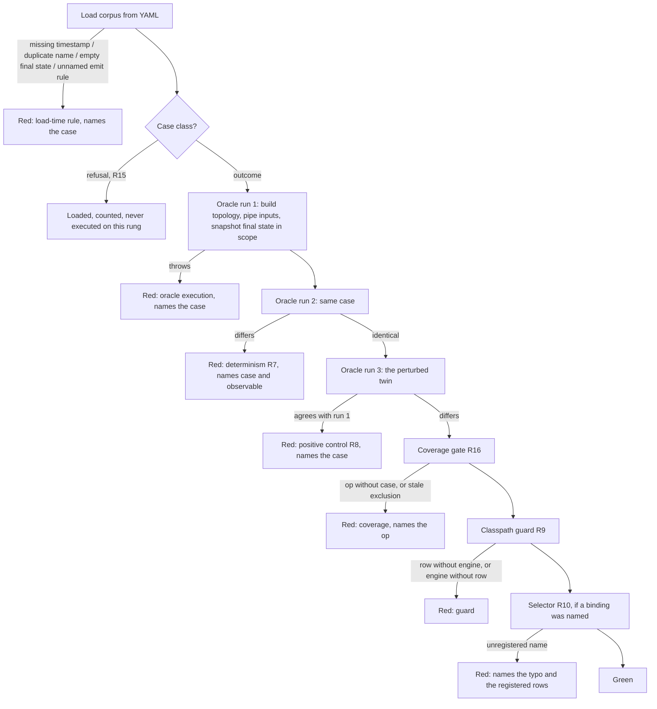

# Streams Conformance Net - Plan

## Goal Capsule

- **Objective:** the engine-independent half of a conformance net for the Kafka Streams foreign bindings (astubbs#242): a case format, a corpus over the wrapper's builder surface, a live oracle that computes each case's expected outcome by running it through plain Apache Kafka Streams, and the proofs that make the result a CI gate a maintainer can act on.
- **Product authority:** this plan owns the oracle rung only. The driver for our engine, the per-language drivers, the differential fuzz generator and a real-broker Kafka row are later rungs, described under How This Work Fits Together and not active scope here.
- **What this rung does not deliver:** confidence about any binding. That arrives at the driver rung, which is therefore the gate on reopening exactly-once across the boundary and the sidecar-versus-embedded choice - not this rung's green.
- **Authority hierarchy:** the Product Contract's R-IDs win on behaviour; the Planning Contract's KTDs win on mechanism within their cited Rs; a unit overrides neither. Repo rules in `AGENTS.md`, `docs/testing.md` and `docs/building.md` bind above all of these.
- **Execution profile:** one new top-level test-only Maven module on master, no product code, no Docker, unit lane only. Every proof is shown able to fail before it is trusted (KTD9).
- **Stop conditions:** a proof that cannot be made to fail by sabotage; a load-time or oracle behaviour that contradicts an R and cannot be met without changing it; any need to `install` the reactor while sibling worktrees share the local repository.
- **Tail ownership:** the executor lands one PR off master; the repo's merge checklist owns the merge. The driver-rung obligations (R14) leave in that PR's body and an inflight note, not in this plan.
- **Open blockers:** none. One open question is carried, not blocking (see Deferred / Open Questions).

**Product Contract preservation:** changed, no scope change - R1 gains the unique-case-name load rule, R11 gains an oracle-execution-failure red category and per-observable naming, R16 gains the stale-exclusion assertion (all three from flow analysis); Dependencies / Assumptions corrected on where the Kafka version is settled and extended with the new YAML dependency; the pinned-emit open question is resolved by KTD5 and removed from Deferred / Open Questions. A second review round then changed R2 (each function-taking operation names its function from a fixed vocabulary, KTD13), R3 (a windowed sink compares as its full record list; `final-state+updates` is refused on this rung as not yet implemented), AE5 (the same refusal) and R16 (the gate's claim is bounded to the surface this module knows) - none a change of product scope.

---

## Product Contract

### Summary

Define correctness for every Kafka Streams binding once, as data, and let Apache Kafka's own engine say what each case should produce - live, at test time, never hand-written.
This rung ships the case format, the first corpus, the oracle runner and the proofs that the net can say no; the first binding to be measured against it arrives with the driver rung.

### Problem Frame

The owner's question is verbatim: *how can we be confident proceeding if we aren't sure what we've done works?*
Every claim the fast-path program has made so far is a measurement, and a measurement is not a guarantee.
Two open architectural questions - exactly-once across the boundary, and sidecar versus embedded engine - cannot be settled safely without first being able to prove that a binding preserves Kafka Streams' behaviour.
What the net establishes is behavioural equivalence on deterministic, failure-free execution; it is a precondition for those decisions, not a sufficient basis for either - exactly-once in particular turns on crashes, retries and duplicate suppression, none of which a no-broker comparison exercises.

Today that proof is a hand-written Python test per feature, which does not scale to a second binding, let alone ten.
The 2026-08-25 design note (`docs/inflight/test-cross-binding-streams-conformance.md`, on the astubbs#334 branch) already settled how: reflect the scenario, not the API.
The proxy clients already run that shape (astubbs#387 and astubbs#390), so the Streams net extends a mechanism the repository runs rather than inventing one.
What was still open was the agreement contract, the size and content of the first cut, how the lowest rung earns a PR with no binding to check, and how the oracle exists at all.
<!-- file-refs: N/A - named as a file on the astubbs#334 branch (research/kafka-streams-foreign-wrappers), which this rung is cut below on master; it is cited as prior art, not as a file this plan touches -->

### Key Decisions

- **The conformance net is the next piece of work, ahead of exactly-once-across-the-boundary and the embedded-versus-sidecar choice.** It is the only one of the three that makes the other two safe to attempt. (session-settled: user-directed - chosen over exactly-once and embedded-vs-sidecar: you cannot choose an engine placement or build exactly-once across a seam you cannot prove preserves behaviour.)
- **This rung is cut off master as the lowest rung of the PR ladder, split from the driver rung.** The oracle needs only `kafka-streams` as a library; our engine lives at astubbs#334, the top of the stack. (session-settled: user-directed - chosen over one rung carrying oracle and driver together: the corpus and oracle become reviewable before any binding exists, which is astubbs#387's define-correct-once principle.) Governs R5, R9.
- **The mechanism is the 2026-08-25 note's: reflect the scenario, not the API; Kafka Streams is the source of truth; one driver per language; differential fuzzing beside it, not instead.** (session-settled: user-approved - chosen over reflecting Kafka's own test suite through the binding, which tests internals, casts to implementation classes, needs call-for-call fidelity across 59 unsupported overloads, and requires a full object-graph proxy on the return path.) Governs R1, R2.
- **The maintainer's CI gate is the primary outcome; the user-facing trust claim follows once a binding row exists.** Done for this rung is a gate that goes red on divergence, not a documentation feature. Governs R6, R11, R13.
- **Final state is the floor; update streams are compared only when a case pins a close-driven emit rule.** TopologyTestDriver commits after every processed record and so over-counts cached emissions relative to a broker; only a close-driven rule makes an update stream deterministic. Governs R3, R12.
- **The oracle is live: expected outcomes are computed from plain Kafka Streams on every run and never committed.** Chosen over version-tagged committed recordings. Nothing goes stale and there is one artifact class fewer; the accepted price is that a `kafka-streams` dependency bump that changes Kafka's own behaviour is invisible, because both sides of the comparison move together. Governs R5, R7.
- **Cut one is the case format, the corpus, the live oracle runner and the proofs - no fuzz generator, no driver.** What it delivers is a reviewable corpus and a harness proven able to say no; the confidence the Problem Frame asks for arrives with the first binding row, not with this rung. Governs R12.
- **The foreign-call-log slot is reserved in the case format and left unset by this rung; the first driver fills it.** Plain Kafka Streams has no boundary and so cannot produce a call log; hand-writing one would be exactly the expectation the trust claim avoids. The slot's line format is astubbs#390's runner transcript, which already exists for this purpose. Governs R4.
- **The rung earns its PR with a control arm, a positive control and two guards, and no Docker.** Same case twice must agree; a case's author-chosen perturbed twin must not; a binding row must be registered exactly when the wrapper's own engine is on the classpath; and every builder operation must have a case. Mirrors astubbs#387's broker-free shape, including its coverage gate. Governs R7, R8, R9, R10, R16.
- **Driver rungs are runners under astubbs#390's existing contract and registry, not a second registry.** The `RunnerContract`, `LanguageRunners`, the `pc.conformance.language` selector, `ConformanceRunnerPrebuild` and the sidecar shim are reused; a language's Streams driver costs one runner. Constrains How This Work Fits Together; nothing in this rung's requirements.

### Requirements

**The case**

- R1. A case is data, not code: a topology description, input records, a perturbation of those inputs (R8), and the expectations, with nothing in it specific to any language. Every input record carries an explicit timestamp relative to a case-level base instant that sits past the window-clamp margin rather than at the epoch, and the loader rejects a case that omits one, so no case inherits wall-clock time. Case names are unique within the corpus, and the loader rejects a duplicate, so a red can name a case unambiguously.
- R2. The topology description can express every operation on the wrapper's builder surface: source, mapValues, groupByKey, count, reduce, join, windowedBy, aggregate, toStream and sink - and, for each function-taking operation, names the function it applies from the closed vocabulary KTD13 fixes, so the oracle and every driver apply the identical one.
- R3. A case declares its agreement level: final state, which is the default and comprises every state store's contents plus, per sink topic, the final record per key - or the full ordered record list when the sink is fed by a windowed handle, because `toStream` drops the window and last-per-key would keep one record of many - the close-deterministic observables; or final state plus update stream, valid only when the case names a close-driven emit rule. On this rung the loader refuses `final-state+updates` as not yet implemented, naming the case; the update-stream observable, its capture and its differ path are the driver rung's (KTD5). A case whose final state would be empty fails at load, so a stateless case cannot pass by observing nothing.
- R4. A case reserves a foreign-call-log slot whose line format is the runner transcript of astubbs#390; on this rung the slot is unset and not compared.

**The oracle**

- R5. The expected outcome of a case is produced at run time by executing it through plain Apache Kafka Streams via `TopologyTestDriver`; it is never hand-written and never committed.
- R6. Every case in the corpus runs through the oracle in the no-Docker unit lane, so the gate needs no broker and no container.
- R7. The oracle is shown deterministic on every run: the same case executed twice yields an identical outcome, and a difference fails the run naming the case (the control arm - nondeterminism is the forbidden anomaly).
- R8. The differ is shown able to say no on every run: each case's author-chosen perturbed twin - a perturbation the case's operations cannot absorb, such as a key change or an extra record for `count` and a change to the last value for a last-wins `reduce` - yields a different outcome, and agreement fails the run naming the case (the positive control). Perturbing a copy of the computed outcome instead would prove only that the comparison works, not that the pipeline from execution to comparison is sensitive to its input.

**The gate**

- R9. A guard asserts that a binding row is registered exactly when the wrapper's own streams engine - never Apache Kafka Streams, which this rung carries as the oracle's dependency - is reachable on the test classpath, in both directions. A class reaches that classpath only through a dependency the conformance module declares, so the guard can first fire when a later rung declares the wrapper module as its test dependency; from then it goes red if that dependency lands without a row or a row is written without it, and retires itself when both are present.
- R10. Selecting a binding by name that is not registered fails the run naming the typo and what is registered; it never runs the oracle alone and reports green.
- R11. A red names the case, which proof failed - determinism (R7), the positive control (R8), a guard (R9, R16), a load-time rule (R1, R3), or an oracle execution that threw - and, for a comparison, which observable diverged (which store, or which sink), so a maintainer can act on it without re-running; naming the row that diverged is the driver rung's extension of this rule, since this rung has one row.

**The corpus**

- R12. The first corpus has at least one case per builder operation as its floor, and at least one multi-operation chain per handle-kind transition in the grammar - stream to grouped stream to table, table to stream, stream to time-windowed stream - because divergence in a wire-crossing binding lives at the joins between operations, not inside them; plus one non-linear topology (a join), one windowed aggregate compared at final state, and one windowed aggregate with a pinned emit rule, the last oracle-only until the wrapper exposes an emit control.

**The records**

- R13. The rung produces its `docs/data/testing-evidence.yaml` row, stating what is and is not evidenced and the exact bounds of the claim - final state, under `TopologyTestDriver`, at one pinned Kafka version, with no broker row - in the words a later docs entry must inherit. It adds no `docs/data/module-maturity.yaml` row and no `docs/features/` entry: a test-only module with no published artifact has no maturity, API expectation or support posture to state, and nothing here is a user-facing feature yet.
- R14. The obligations this rung leaves for the driver rung are recorded in this rung's PR body and in a `docs/inflight/` note it adds, for whoever next touches the astubbs#334 branch to fold into the design note `docs/inflight/test-cross-binding-streams-conformance.md` there; that note exists only on that branch and is not a file this rung can edit.
<!-- file-refs: N/A - named as a file on the astubbs#334 branch (research/kafka-streams-foreign-wrappers), which this rung is cut below on master; it is cited as prior art, not as a file this plan touches -->

**Coverage and refusals**

- R15. A second case class expects a named refusal rather than an outcome: the case declares the fault the wire must raise for an invalid specification - an aggregate naming both a function and a combine, a retention below the minimum - and no oracle row is computed for it, because plain Kafka Streams never refuses what this wire invented; it is marked driver-only until a binding exists.
- R16. A coverage check holds the corpus against the builder surface this module knows and fails when an operation has no case, with an explicit deliberately-uncovered list carrying a reason per entry - the third guard, mirroring astubbs#387's scenario-coverage test, so no operation known to this module ships uncovered while the gate stays green; keeping that surface in step with the wrapper's unfrozen proto is a driver-rung obligation (R14, U7), not a claim this gate can make. It also fails when a deliberately-uncovered entry names an operation that has gained a case, so the exclusion list cannot go stale, and it credits an operation only when the oracle's translated topology contains a matching node, not merely when a case names it (KTD8).

### Actors

- A1. The maintainer proceeding on the fast-path program, who needs a red they can act on.
- A2. Plain Apache Kafka Streams, running under `TopologyTestDriver` - the oracle row, and the only row on this rung.
- A3. A binding driver, arriving with a later rung as a runner under astubbs#390's contract.
- A4. The CI unit lane, which runs the gate without Docker.

### Key Flows

- F1. The gate runs
  - **Trigger:** the unit lane runs the conformance module.
  - **Actors:** A2, A4
  - **Steps:** every case in the corpus is executed through the oracle; each case is executed a second time and compared to the first (R7); each case is executed against its perturbed twin and the outcomes are required to differ (R8); the coverage check holds the corpus against the builder surface (R16); the guard checks the classpath (R9); a binding selector, if given, is resolved (R10).
  - **Outcome:** green, or a red naming the case and the proof (R11).
  - **Covered by:** R5, R6, R7, R8, R9, R10, R11, R16
- F2. A maintainer adds a case
  - **Trigger:** a new operation or a new shape needs covering.
  - **Actors:** A1, A2
  - **Steps:** the maintainer writes the topology, the inputs, and the agreement level; if update streams are to be compared, names the emit rule (R3); runs the module locally; the oracle computes the outcome and both proofs run against the new case.
  - **Outcome:** a case whose expectations were never typed by hand, and which has already been shown to be deterministic and discriminating.
  - **Covered by:** R1, R2, R3, R7, R8
- F3. The first binding arrives
  - **Trigger:** the driver rung declares the wrapper module as a test dependency of the conformance module, which is what brings the wrapper's engine onto its classpath.
  - **Actors:** A1, A3
  - **Steps:** the guard goes red (R9) until a driver row is registered; the driver rung registers a runner under astubbs#390's contract; the runner's transcript fills the call-log slot (R4); the same corpus runs against both rows.
  - **Outcome:** the first real divergence signal, and the net's trust claim becomes checkable.
  - **Covered by:** R4, R9

### Acceptance Examples

- AE1. Determinism is proven, not assumed
  - **Covers R7.**
  - **Given** any case in the corpus, **when** it is executed through the oracle twice in one run, **then** the two outcomes are identical, and a case for which they differ fails the run naming that case.
- AE2. The differ can say no
  - **Covers R8.**
  - **Given** any case in the corpus, **when** its author-chosen perturbed twin is executed, **then** the outcome differs from the original's, and a case for which they agree fails the run naming that case.
- AE3. The guard reads both ways
  - **Covers R9.**
  - **Given** the wrapper's engine is not on the test classpath, **when** the guard runs, **then** it passes only if no binding row is registered; **given** a declared dependency has put it there, it passes only if a binding row is registered.
- AE4. A typo cannot read as a pass
  - **Covers R10.**
  - **Given** a selector naming a binding that is not registered, **when** the module runs, **then** it fails naming the unknown binding and the registered ones, and no case is executed.
- AE5. Update streams need a pinned rule
  - **Covers R3.**
  - **Given** a case declaring update-stream comparison without naming a close-driven emit rule, **when** the corpus is loaded, **then** loading fails naming the case; **given** the same case with a rule named, it is refused on this rung as not yet implemented, naming the case, rather than loaded and silently compared at final state only.
- AE6. The default compares final state only
  - **Covers R3, R5.**
  - **Given** a case with no agreement level declared, **when** it runs, **then** only final state - store contents and each sink's final record per key - is compared, and the update stream is neither recorded nor compared.
- AE7. A red is actionable
  - **Covers R11.**
  - **Given** a case that fails one of this rung's proofs, **when** the run reports, **then** the report names the case and which proof failed; naming a diverging row is verified at the driver rung, where a second row exists.
- AE8. A stateless case cannot pass by observing nothing
  - **Covers R3.**
  - **Given** a case whose topology holds no state store and produces no sink record, **when** the corpus is loaded, **then** loading fails naming the case; **given** the same topology with a sink, its final record per key is the final state compared.

### Scope Boundaries

- The differential fuzz generator over the builder grammar - a later rung; nothing of ours consumes it until a driver exists.
- The driver for our engine, and the Python and other per-language drivers - the driver rungs, off astubbs#334.
- A real-broker Kafka row beside the `TopologyTestDriver` row - belongs to the driver rung, where a broker exists anyway.
- Committed, version-tagged recordings - rejected in favour of the live oracle.
- Reflecting Apache Kafka's own test suite through the binding - rejected in the 2026-08-25 note.
- A `docs/features/` entry and the user-facing trust claim - enabled by the first driver row, not by this rung.
- Exactly-once across the boundary, and the sidecar-versus-embedded choice - the questions this net exists to make safe, not part of it.
- Measuring refusal conformance - the fault a binding must raise for an invalid specification is specified here (R15) and first measured at the driver rung.

#### Deferred to Follow-Up Work

- A runtime budget for the gate. Each case costs about four `TopologyTestDriver` lifecycles (R6, R7, R8); with a corpus of tens of cases that is over a hundred per run, and nothing here sets the threshold at which the lane is too slow to keep. Measure after the first corpus lands and set the bound then.
- Reconciling this module's `TestConventionsArchTest` and selector with the proxy conformance module's when both are on master - the proxy module is on astubbs#387, so the reconciliation belongs to whichever lands second.

<!-- ce-section: work-relationships -->
### How This Work Fits Together

This plan owns the oracle rung.
The breakdown below is the current understanding of the surrounding work, not a committed roadmap; a later plan may revise, split, merge or discard any of it and cite this one.

- The driver rung: our engine measured against the corpus.
  - Depends on this plan for the case format, corpus and oracle.
  - Depends on astubbs#334 for the streams engine and on astubbs#390 for the runner contract and registry; it bases on astubbs#334, which carries both.
  - Fills the call-log slot (R4) and turns the guard (R9) green.
  - Reads final state through the binding's interactive-query surface, which becomes load-bearing for conformance there.
  - Declares the wrapper module as a test dependency of the conformance module in the same change that lands the engine there; the guard (R9) cannot fire before that declaration exists.
- The per-language driver rungs: one runner per binding under astubbs#390's contract.
  - Depend on the driver rung.
  - Can proceed independently of each other.
- The differential fuzz generator.
  - Depends on this plan's case format.
  - Can proceed independently of the driver rung; it exercises the oracle alone until a binding exists.
- The real-broker Kafka row.
  - Belongs to the driver rung; proves the final-state-floor contract empirically.
- Emit control on the wrapper.
  - Still to decide, and owned by astubbs#334's follow-ons; until it exists, pinned-emit cases (R12) are oracle-only (KTD5).
- The user-facing trust claim (`docs/features/`, the parked testing-as-a-feature requirement).
  - Enabled by the first driver row.

### Dependencies / Assumptions

- `kafka-streams` and `kafka-streams-test-utils` at master's root-pom `kafka.version` property (3.9.2), which `parallel-consumer-examples/parallel-consumer-example-streams/pom.xml` already uses for both; nothing is sourced from astubbs#334.
- A YAML parser is a new dependency on this reactor (KTD2): no YAML or JSON library exists in any module today. It is test-scoped to this module and versioned by a module-local property, the shape `parallel-consumer-examples/pom.xml` uses for Jackson and explains.
- No Kafka version matrix runs on master today: the compatibility job is PR-only and disabled. The oracle therefore runs at the single pinned `kafka-streams` version, and a bump that changes Kafka's behaviour changes both sides of the comparison at once. This is the accepted consequence of the live oracle, not a gap to close here.
- The wrapper exposes no suppression or emit-strategy control; its assembler's own comment says the wire does not expose it. Pinned-emit cases are oracle-only until that changes.
- The wrapper's builder surface is ten proto operations and is `v1alpha1`, unfrozen. The case format assumes that grammar is stable enough that a future runner translates a case into builder calls one-to-one, with the emit attribute (KTD5) as the one named exception; if the grammar moves, the format moves with it in the driver rung.
- The proxy conformance module runs with no Docker and no broker; this rung holds itself to the same.
- Nothing on master drives `TopologyTestDriver` today; the oracle is written from Kafka's test-utils API, not adapted from a sibling.

### Outstanding Questions

**Resolved During Planning**

- Module placement: a new top-level test-only module on master (KTD1); a scenario family inside the proxy conformance module would base the rung on astubbs#387, which the cut-off-master decision forbids.
- Case file format and corpus location: YAML under the module's test resources, read through Jackson's YAML format (KTD2).
- How final state is read, and when: inside the open driver scope, per observable (KTD3); the perturbed twin is author-supplied case data (KTD4).
- The emit-rule vocabulary and how the oracle applies it: one case attribute, applied by the oracle only (KTD5).
- Guard placement and discriminator: this module, probing the wrapper's assembler class by name (KTD6).
- Selector property name: distinct from the proxy suite's (KTD7).

**Deferred to Implementation**

- The exact YAML field names and the Java class shapes behind them; the plan fixes what a case carries (R1-R4, KTD2), not the spelling.
- How a state store's contents are rendered into the comparable form for each store type the corpus produces (key-value, windowed, session if it arises), settled when the first windowed case is written.
- Whether the guard's discriminator class name is best held as one constant in the row registry or in the guard test; the name itself is fixed (KTD6).

### Sources / Research

- `docs/inflight/test-cross-binding-streams-conformance.md` on the astubbs#334 branch - the settled mechanism, the `TopologyTestDriver` over-count qualification, and the product-feature framing.
- `docs/inflight/parked-testing-as-a-feature-for-the-clients.md` on the same branch - the owner's requirement that conformance is a documented feature, which the Streams net inherits.
- astubbs#387 - the proxy conformance suite: scenario as data, the engine as a row, every scenario proven able to fail, nothing deferred stubbed, and the three guard tests this rung mirrors - `TheEngineArrivingMustBringTheGrpcBindingTest`, `SelectorMatchingNothingFailsTest`, `ScenarioCoverageTest` - plus the sabotage-arm discipline its PR body records.
- astubbs#390 - the runner contract, the transcript line format, the language runner registry and prebuild, which the driver rungs reuse.
- `parallel-consumer-proxy-streams/src/test/java/bz/stub/parallelconsumer/streams/WindowedAggregatorCallCountTest.java` on the astubbs#334 branch - the measured statement that `TopologyTestDriver` commits per record, the base-timestamp clamp trap, and the post-`close()` read that once produced a green test asserting nothing.
- `CONCEPTS.md` - the house definitions of control arm, positive control and red-proof, which R7, R8 and KTD9 use by name.
- `docs/solutions/test-issues/dormant-regression-test-uncollected-by-surefire-2026-08-07.md` - a test class named with a trailing issue number is never collected; this module's classes end in `Test`, never `Test242`.
- `parallel-consumer-core/src/test/java/bz/stub/parallelconsumer/EveryModuleWiresUpArchUnitTest.java` - walks the whole reactor's filesystem and fails the unit build for any test source tree without a wired `TestConventionsArchTest`; the new module must ship one.
<!-- file-refs: N/A - the first and fourth entries name files on the astubbs#334 branch (research/kafka-streams-foreign-wrappers), which this rung is cut below on master; they are cited as prior art, not as files this plan touches -->

---

## Planning Contract

### Key Technical Decisions

- KTD1. **One new top-level, test-only Maven module, `parallel-consumer-streams-conformance/`, wired into the root reactor.** It has test sources and no main sources - the first such module on master - so its pom is cut from `parallel-consumer-vertx/pom.xml`'s parent and dependency shape with everything main-source-related removed, and a whole-reactor package proves the inherited plugins tolerate the absence. It stays at the parent's default `release.target` of 8; the mutiny module's override to 17 exists for a runtime floor this module does not have. Because a top-level module inherits the parent's publication, and this one has nothing to publish, its pom carries the deploy, install and signing skips plus the publishing-skip block that `parallel-consumer-examples/pom.xml` already carries - a package smoke cannot catch a release-profile upload of an empty jar. (session-settled: user-directed - inherits the Product Contract's cut-off-master decision; chosen over a second scenario family inside the proxy conformance module, which lives only on astubbs#387 and would re-base the rung.) Governs R5, R6, R9.
- KTD2. **Cases are YAML files under the module's test resources, read through Jackson with its YAML data format as a test-scoped dependency.** R1 requires a case to be language-neutral data a foreign driver can read, which rules out Java fixture classes as the proxy suite uses. No YAML or JSON library exists anywhere in this reactor, so this is a new dependency; it is confined to this module and versioned by a module-local property, the pattern `parallel-consumer-examples/pom.xml` already uses and explains for Jackson. JSON through the same library was the alternative and is a one-line switch, but a windowed case with a dozen timestamped records is materially harder to read as JSON. The dependency enters through a Jackson BOM import in the module's own dependency management, as the streams example module does: Kafka Streams pins an older Jackson core, and the root enforcer's upper-bound rule rejects a bare YAML-module version against it. A topology is an ordered list whose every entry carries an author-chosen id, and each operation names its input handle - or, for join, both - by id, mirroring the wire's server-minted handles one-to-one; the join's two inputs are why a flat chain cannot express the corpus. Governs R1, R2, R3, R4, R15.
- KTD3. **The oracle snapshots final state inside the open `TopologyTestDriver` scope, per observable, before `close()` runs.** Store contents are read through the driver's typed store accessors and rendered to a sorted, comparable form per store; each sink is read from its test output topic as the ordered record list and folded in the oracle to the observable R3 defines - last record per key for a non-windowed sink, the full list for a windowed one. Every key and value is wrapped in a value-equal form (`Bytes`, or hex) before any map or sort is built, because byte arrays compare by identity and the driver's own key-value map is a hash map over them - two records for one key would stay two entries and the determinism proof would red for a Java reason. The snapshot is the case's outcome value; nothing is read after the driver closes, because `close()` deletes the state directory and a post-close read has already produced a green test asserting nothing in the wrapper's own suite. Comparison and reporting are per observable, so a red names the store or sink that diverged (R11). Governs R3, R5, R11.
- KTD4. **The perturbed twin is author-supplied case data, and the positive control executes it through the same oracle path.** Inherits R8's decision; the twin is a second input list chosen so the case's operations cannot absorb it. The oracle path for the twin is byte-for-byte the path the original takes, so the control proves the whole pipeline from execution to comparison is sensitive to input, not only the comparison function. Governs R8.
- KTD5. **Pinned-emit is one case attribute, `emit: on-window-close`, applied by the oracle only.** The oracle applies it by suppressing the windowed aggregate until the window closes when it builds the topology; the attribute is outside the wrapper's builder grammar and is the one named exception to the one-to-one builder translation the case format otherwise assumes. This resolves the review's open question in favour of building it now: reserving it as an unset slot would narrow R3 and R12, which are the owner's product decisions, and the cost of building it is one attribute and one corpus case. Under close-driven suppression the driver emits a window only when a later record advances stream time past its close plus grace, and never on `close()`, so every pinned-emit case carries a trailing record past that point and its sink is asserted non-empty; a case without one observes nothing about emit while passing every proof on its store alone. The one attribute prices only the oracle-side suppression: the update-stream observable R3 names, its capture and its differ path are a driver-rung cost, which is why the loader refuses `final-state+updates` on this rung rather than accepting it and comparing at final state. A binding cannot exercise it until the wrapper exposes an emit control, so the case is marked oracle-only and the coverage gate (R16) does not credit it toward binding coverage. Governs R3, R12.
- KTD6. **The classpath guard probes the wrapper's assembler class by its fully-qualified name as a string, never by import, and reads both ways.** The name is `bz.stub.parallelconsumer.streams.TopologyAssembler`, the wrapper's builder entry point on astubbs#334, already under the fork's post-rename package. The probe loads without initialising and treats a linkage error the same as absence, and the assertion is that a registered row exists exactly when the probe succeeds - the shape of astubbs#387's engine-arriving guard, which is self-retiring by construction. The name is held as one constant beside the row registry so the driver rung has exactly one place to keep in step. Governs R9.
- KTD7. **The binding selector is the system property `pc.streams.conformance.binding`, resolved through a pure function that a test can call without setting the property.** It is deliberately not `pc.conformance.language`, which the proxy suite owns and which CI matrix rows are written against; two registries answering one property would let a row select nothing in one suite while passing in the other. The failure message names the unknown value, lists what is registered, and says why selecting nothing is not the alternative - the proxy suite's message contract. On this rung the registry holds no binding rows; the oracle is the control arm, never selectable away. Governs R10.
- KTD8. **The coverage gate mirrors astubbs#387's three assertions and adds two.** Every builder operation this module knows has a case or a reasoned entry in the deliberately-uncovered list; every case names an operation the surface knows; every outcome case is non-vacuous (at least one input record and a non-empty final state; refusal cases are counted separately and never executed); a deliberately-uncovered entry whose operation has gained a case fails, so the exclusion list cannot go stale; and an operation is credited only when the oracle's translated topology - its description - contains a node for it, so coverage measures what the oracle built rather than what the YAML said, and an oracle that silently dropped an operation cannot pass. The surface list is this module's copy of an unfrozen proto on another branch, so the gate's claim is bounded to what the module knows and reconciliation is a driver-rung obligation. Governs R16.
- KTD9. **Every proof is red-proofed by sabotage before it is trusted, with the untouched tree as the control arm on either side.** Each arm moves exactly one term on the oracle or harness side - never the test - and the run records which cells reddened and which stayed green, restored byte-identically afterwards; that record goes in the PR body, the way astubbs#387's did. A proof no arm can redden is not a proof and blocks the rung. The determinism proof's arm is named here because the driver is deterministic by construction: remove the sort from KTD3's per-store rendering, and at least one corpus case must redden; a stubbed nondeterministic oracle is a differ unit test, never the arm, for the same reason R8 refuses a perturbed copy of the outcome. This is the repository's red-proof rule applied to a module whose entire content is tests. Governs R7, R8, R9, R10, R16.
- KTD10. **A red is one failure per (case, proof, observable), and an oracle execution that throws is its own category.** A thrown exception from the driver, the topology build, or the snapshot is reported as an oracle-execution failure naming the case, distinct from a load-time refusal (R15's cases are never executed) and from a comparison red, so a maintainer never has to infer which proof "failed". Governs R11.
- KTD11. **Plain Google Truth, inherited from the parent pom; no `ManagedTruth`, but core's `tests` classifier jar is declared at test scope.** The module asserts on its own case, outcome and report types, not on the engine's domain types, so the generated subjects buy nothing. The tests jar is declared anyway, for one reason: the shared ArchUnit rule set KTD12's wrapper must import ships only in core's test tree, as it does for the vertx, reactor and mutiny modules, and there is no wiring that satisfies the reactor's module-wiring check without it. Governs R6.
- KTD12. **The module ships its own two-line `TestConventionsArchTest`, or the whole-reactor unit build fails.** `EveryModuleWiresUpArchUnitTest` in core walks the filesystem for any `src/test/java` tree and requires the wiring; it is not a module list to be added to. Governs R6.
- KTD13. **Every function-taking operation names its function from a closed vocabulary the case format fixes, one set per invocation kind.** mapValues takes `identity` or `upper`; reduce takes `last-wins` or `concat`; join takes `concat-sides`, which concatenates the stream-side value, a separator and the table-side value in that order so a transposed binding produces a different outcome; aggregate takes `count-bytes` or `concat`. The oracle implements each on byte arrays, and every driver must implement the identical function or the comparison is meaningless - which is why the vocabulary is a plan decision rather than a field spelling. The wire's own combine kinds (`LAST_BYTES`, `APPEND_BYTES`) are the precedent for naming a fold rather than sending one. Governs R1, R2, R8, R12.

### High-Level Technical Design

The gate is one pass over the corpus with four proofs and two guards around it.
Prose is authoritative where it and the diagram differ.



A case, as the loader sees it - directional, not a schema:

```yaml
name: hopping-count-by-key
base-instant: 2025-01-01T02:00:00Z      # past the epoch clamp; record offsets are relative to it
topology:                               # ordered; every entry has an id, every op names its input(s) by id
  - {id: in, source: {topic: in}}
  - {id: g, group-by-key: {of: in}}
  - {id: w, windowed-by: {of: g, size-ms: 3600000, advance-ms: 300000, grace-ms: 0, retention-ms: 3600000}}
  - {id: c, count: {of: w, store: counts}}
  - {id: s, to-stream: {of: c}}
  - {sink: {of: s, topic: out}}          # fed by a windowed handle: compared as the full record list (R3)
inputs:
  - {key: a, value: "1", at-ms: 0}
  - {key: a, value: "2", at-ms: 60000}
  - {key: z, value: "-", at-ms: 7200000}  # past window end plus grace, so a pinned-emit variant would emit
perturbation:                           # author-chosen; count ignores values, so a key change
  - {key: b, value: "1", at-ms: 0}
  - {key: a, value: "2", at-ms: 60000}
agreement: final-state                  # default; `final-state+updates` is refused on this rung (R3)
emit: null                              # `on-window-close` pins a close-driven rule (oracle-only)
call-log: null                          # reserved; the driver rung fills it (R4)
```

A join names both inputs, `join: {stream: s1, table: t1, fn: concat-sides}`; a function-taking operation carries its `fn` from KTD13's vocabulary.
A refusal-class case carries `expects-fault: <fault name>` in place of `inputs`, `perturbation` and `agreement`, and is loaded but never executed here (R15).

### Assumptions

- Kafka Streams 3.9's `kafka-streams-test-utils` runs under the parent's Java 8 release target through Jabel; the wrapper's own tests do so on astubbs#334 at the same version.
- The inherited packaging plugins tolerate a module with no `src/main`; U1 proves it with a whole-reactor package before anything else is built on the module.
- `EveryModuleWiresUpArchUnitTest` discovers the new module's test tree without registration; U1's smoke run of the core unit suite confirms it.
- The builder-surface list is a class of its own with one consumer today (the coverage gate); it is pre-extracted so the driver rung's runner reads the same list rather than a second copy.

### Risks & Dependencies

- The first module with no main sources may trip an inherited packaging plugin that assumes `src/main`. Mitigation: U1's whole-reactor package runs before anything is built on the module; a failure there is a stop condition, not a workaround.
- `TopologyTestDriver` is greenfield here: store-type rendering (windowed, session) and accessor behaviour may surprise. Mitigation: U3's expected values are derived by hand from Kafka Streams' documented semantics, and the rendering of each store type is a deferred-to-implementation item settled when its first case is written.
- A new parsing dependency widens the reactor's advisory surface. Mitigation: test scope, confined to this module, and the existing dependency-audit gate covers it like every other dependency.
- Jackson binding to Java records crashes Error Prone under Jabel's desugaring, the finding astubbs#387 recorded. Mitigation: U2 binds to plain final classes.
- The guard's class constant goes stale silently if the wrapper's package moves before the driver rung lands: both halves read absent and the guard stays green. Mitigation: one constant beside the registry, named in the driver-rung obligations note (U7) so the driver rung checks it first.
- Runtime: four driver lifecycles per case in the merge lane, with no budget yet. Mitigation: the follow-up item under Scope Boundaries sets the bound once the first corpus has a measured cost.

### Sequencing

U1 first, and its whole-reactor smoke run before U2 starts, because a packaging failure on a no-main module changes the module's shape.
U2 and U3 in order, since the oracle consumes the loader's case type.
U4 after U3; U5 after U2 (the coverage gate needs the loaded corpus, the guard and selector need the row registry).
U6 after U4 and U5, because a corpus case is only accepted once every proof runs against it.
U7 last.

---

## Implementation Units

### U1. Cut the module and prove the reactor accepts a test-only member

- **Goal:** a new top-level Maven module with test sources only, wired into the reactor, building and running through the unit lane with zero tests of substance yet.
- **Requirements:** R6, KTD1, KTD2, KTD11, KTD12.
- **Dependencies:** none.
- **Files:** `pom.xml` (root, `<modules>` entry); `parallel-consumer-streams-conformance/pom.xml`; `parallel-consumer-streams-conformance/README.md`; `parallel-consumer-streams-conformance/src/test/java/bz/stub/parallelconsumer/streams/conformance/TestConventionsArchTest.java`.
- **Approach:**
  1. Cut the pom from `parallel-consumer-vertx/pom.xml`'s parent and dependency shape, dropping everything main-source-related; declare `kafka-streams` and `kafka-streams-test-utils` at `${kafka.version}` (test scope), core's `tests` classifier at test scope as the vertx pom does (KTD11), and Jackson's YAML data format through a Jackson BOM import in the module's own dependency management at a module-local version property, with the comment `parallel-consumer-example-streams/pom.xml` uses to explain why the BOM is what satisfies the upper-bound enforcer (KTD2).
  1b. Add the deploy, install and signing skip properties and the publishing-skip block from `parallel-consumer-examples/pom.xml`, citing its comment on per-module evaluation (KTD1).
  2. Add the `TestConventionsArchTest` wiring, copied from `parallel-consumer-examples/parallel-consumer-example-streams` with the package changed (KTD12).
  3. The README states what the module is - a test-only conformance net, nothing downstream may depend on it - the way the proxy conformance module's does.
  4. Every new file carries the fork header per `docs/copyright.md`: `Copyright (C) 2026 Antony Stubbs and contributors`.
- **Execution note:** this is packaging; prove it with a whole-reactor `package` and the core unit suite before writing a single test of substance. Never `install` while sibling worktrees share the local repository.
- **Patterns to follow:** `parallel-consumer-vertx/pom.xml` (parent shape); `parallel-consumer-examples/parallel-consumer-example-streams/pom.xml` (the Kafka Streams test-utils dependency lines); `parallel-consumer-examples/pom.xml` (module-local Jackson property and its comment).
- **Test scenarios:**
  - Test expectation: none of substance - this unit is scaffolding. Its proof is the verification below.
- **Verification:** the root reactor lists the module; a whole-reactor `package` with tests skipped succeeds and the enforcer's upper-bound rule passes at `validate`; the core unit suite's `EveryModuleWiresUpArchUnitTest` passes with the new tree present and fails when its `TestConventionsArchTest` is temporarily removed (the wiring is real, not vacuous); the module's effective pom shows deploy, install, signing and publishing skipped; `bin/check-copyright-headers.sh` is clean.
<!-- file-refs: N/A - the paths above are files this plan proposes to create; they do not exist until the unit lands -->

### U2. The case format and loader, with every load-time rule

- **Goal:** YAML cases become a typed in-memory case, and every malformed case is refused at load naming itself.
- **Requirements:** R1, R2, R3, R4, R15, KTD2, KTD10.
- **Dependencies:** U1.
- **Files:** `parallel-consumer-streams-conformance/src/test/java/bz/stub/parallelconsumer/streams/conformance/ConformanceCase.java`; `.../CaseLoader.java`; `.../CaseLoaderTest.java`; `parallel-consumer-streams-conformance/src/test/resources/cases/` (the corpus directory; U6 fills it); `.../src/test/resources/invalid-cases/` (fixtures the loader must refuse).
- **Approach:**
  1. One case type carrying name, base instant, topology as an ordered list of id-bearing operations over the ten builder ops where each operation names its input handle(s) by id and each function-taking operation names its function from KTD13's vocabulary (R2, KTD2), a window spec carrying all four fields the wire requires including retention, timestamped inputs, the perturbation, the agreement level, the optional emit attribute (KTD5), the reserved call-log slot (R4), and for the refusal class the expected fault (R15).
  2. The loader reads every file under the corpus directory and applies the load-time rules in one pass: a missing timestamp, a duplicate name, an unknown handle id or an operation naming no input, an unknown function name, a window spec missing any of its four fields, an agreement level of `final-state+updates` (refused on this rung as not yet implemented, with or without an emit rule), a pinned-emit case with no record past window end plus grace, and a topology that can produce no final state - no stateful operation and no sink - each refuse the case by name (R1, R3, KTD5, KTD13).
  3. Refusal-class cases load into the same corpus and are flagged so the oracle never executes them and the coverage gate counts them separately.
  4. Field spellings are the implementer's; the plan fixes what a case carries, not how it is spelt.
- **Execution note:** write the refused fixtures first and the assertion that each is refused by name; a loader that accepts everything is the silent failure this rung exists to prevent.
- **Patterns to follow:** the proxy suite's scenario-as-data split (what is seeded, what is prescribed, what must be true) on astubbs#387; Jackson YAML binding to plain final classes, not records - Error Prone cannot read Jabel-desugared records, the finding astubbs#387 recorded.
- **Test scenarios:**
  - Happy path: a well-formed case loads with every field populated and the emit attribute absent.
  - Happy path: a refusal-class case loads flagged as never-executed with its expected fault name.
  - Covers AE5. A case declaring `final-state+updates` is refused naming the case whether or not it names an emit rule, with a message saying the level is not yet implemented on this rung.
  - Edge: a join whose two inputs name the same handle, or an operation naming an id no entry declares, is refused naming the case and the id.
  - Edge: a windowed-by missing `retention-ms` is refused naming the case and the field.
  - Edge: a mapValues naming a function outside KTD13's vocabulary is refused naming the case and the name.
  - Edge: a pinned-emit case with no record past window end plus grace is refused naming the case.
  - Covers AE8. A source-mapValues-only topology with no sink is refused naming the case; the same topology plus a sink loads.
  - Edge: a case whose inputs omit a timestamp is refused naming the case and the record.
  - Edge: two files with the same case name are refused naming the name and both files.
  - Edge: an empty corpus directory yields an empty corpus, and the gate (U4) treats an empty corpus as a failure, not a green.
  - Error: an unparseable YAML file is refused naming the file, and does not abort loading the rest.
- **Verification:** every fixture under `invalid-cases/` is refused with a message naming it; every fixture under `cases/` loads; the loader has no code path that returns a partially loaded corpus without a failure.
<!-- file-refs: N/A - the paths above are files this plan proposes to create; they do not exist until the unit lands -->

### U3. The live oracle: build, pipe, snapshot in scope

- **Goal:** a loaded case becomes a final-state outcome computed by plain Kafka Streams under `TopologyTestDriver`, snapshotted before the driver closes.
- **Requirements:** R5, R6, KTD3, KTD5, KTD10.
- **Dependencies:** U2.
- **Files:** `.../Oracle.java`; `.../FinalState.java`; `.../OracleTest.java`.
- **Approach:**
  1. Translate the case's operation list into a `StreamsBuilder` topology, one builder call per operation, resolving each operation's input handle(s) by id and each named function from KTD13's vocabulary, with byte-array serdes throughout so the oracle asserts nothing about serialisation; the emit attribute wraps the windowed aggregate in a close-driven suppression (KTD5). The built topology's description is kept on the outcome so the coverage gate can check what was built (KTD8).
  2. Open the driver with an in-memory state directory and a fixed application id, create one test input topic per source and one test output topic per sink, and pipe each input with its absolute timestamp derived from the base instant.
  3. Inside the try-with-resources scope: read every state store through the driver's typed accessors, and each sink's output as an ordered list, wrapping every key and value in a value-equal form before any map or sort is built, then fold each sink to the observable R3 defines - last per key, or the full list for a windowed-fed sink (KTD3); stores plus sinks are the outcome.
  4. Close the driver only after the snapshot exists; the outcome type is immutable and carries per-observable maps so comparison can name the store or sink that diverged (R11).
  5. Any exception from build, pipe or snapshot becomes an oracle-execution failure naming the case (KTD10).
- **Execution note:** the first test to write is the one that reads state after `close()` and must observe it gone - that is the trap KTD3 exists for, and it is a red-proof of the snapshot's placement.
- **Patterns to follow:** the wrapper's `WindowedAggregatorCallCountTest` on astubbs#334 for the base-timestamp discipline (two hours past the epoch) and the in-memory store configuration; Kafka's `TopologyTestDriver` javadoc for the accessor and output-topic API.
- **Test scenarios:**
  - Happy path: a source-groupByKey-count-toStream-sink case yields a count store and a sink map whose entries match the counts by key.
  - Happy path: a join case yields the joined value per matching key and nothing for unmatched keys.
  - Happy path: a windowed count with two records in one window and one in the next yields two window entries in the store and the sink's final record per key.
  - Covers AE6. A case with no agreement level yields an outcome with stores and sinks populated and no update stream captured.
  - Edge: a case with `emit: on-window-close` and a trailing record past window end plus grace yields a non-empty sink holding only closed windows' results, with the open window absent; the same case without the trailing record is what U2 refuses at load.
  - Edge: a sink fed by a hopping window with two inputs of one key yields the full record list - many records under one inner key - not one survivor.
  - Edge: two sink records for one byte-array key fold to one entry, proving the value-equal wrapping.
  - Happy path: a join with `concat-sides` yields the stream value before the table value, and swapping the two inputs changes the outcome.
  - Edge: a case whose inputs all land in one window yields one window entry, not one per record.
  - Error: a topology the builder rejects (a windowedBy on an ungrouped stream) surfaces as an oracle-execution failure naming the case, not as an empty outcome.
  - Integration: reading a store after the driver has closed observes it gone - the negative control for KTD3's snapshot placement.
- **Verification:** each scenario's outcome is asserted against values derived by hand from Kafka Streams' documented semantics, never against a recording; the post-close scenario fails if the snapshot is moved after `close()`.

### U4. The proofs and the red report

- **Goal:** the gate runs every case through the control arm and the positive control and reports one red per (case, proof, observable).
- **Requirements:** R7, R8, R11, KTD4, KTD9, KTD10.
- **Dependencies:** U3.
- **Files:** `.../Differ.java`; `.../RedReport.java`; `.../CorpusGateTest.java` (parameterised over the loaded corpus); `.../DifferTest.java`.
- **Approach:**
  1. For each executable case: run the oracle twice and require identical outcomes per observable (R7); run the perturbed twin through the same oracle path and require a difference in at least one observable (R8).
  2. The differ compares per store and per sink and reports the first observable that diverged with both values, so a red names the case, the proof and the observable (R11).
  3. An empty corpus is a red, not a green.
  4. The parameterised test names each cell `<case>/<proof>` so a red is legible in the surefire report without opening the log.
- **Execution note:** red-proof by sabotage (KTD9): remove the sort from KTD3's per-store rendering and require determinism to redden on at least one corpus case - this is R7's arm, and if no corpus case reddens, KTD9's stop condition applies rather than counting a stub as the arm; replace the twin with the original inputs and require the positive control to redden; move one store's snapshot after `close()` and require the positive control to redden (both twins empty and agreeing). The stubbed-nondeterministic-oracle scenario below is a differ unit test, not an arm. Record each arm's reddened and green cells, restore byte-identically.
- **Patterns to follow:** the proxy suite's sabotage-arm record in astubbs#387's PR body - arms 4 and 5 are the pair that proves a control is a control; `CONCEPTS.md` for the control-arm and positive-control definitions the messages should use by name.
- **Test scenarios:**
  - Covers AE1. Every corpus case executed twice agrees per observable.
  - Covers AE2. Every corpus case's twin differs from the original in at least one observable.
  - Covers AE7. The differ, fed two outcomes that differ in one store, produces a red naming the case, `determinism`, and the store - a differ unit test, distinct from R7's sabotage arm.
  - Happy path: the differ reports no difference for two structurally equal outcomes built independently.
  - Edge: two outcomes differing only in one sink's one key report that sink and that key.
  - Edge: an outcome with a store the other lacks reports the store by name.
  - Error: an empty corpus fails the gate naming the corpus directory.
- **Verification:** the sabotage arms in the execution note each redden the cells named and only those, and the restored tree is green; the surefire report shows one cell per (case, proof).

### U5. The guards and the selector

- **Goal:** the classpath guard, the coverage gate and the binding selector, each proven able to fail.
- **Requirements:** R9, R10, R16, KTD6, KTD7, KTD8, KTD9.
- **Dependencies:** U2.
- **Files:** `.../BindingRows.java` (the registry and the pure selector); `.../TheEngineArrivingMustBringTheStreamsRowTest.java`; `.../SelectorMatchingNothingFailsTest.java`; `.../CorpusCoverageTest.java`; `.../BuilderSurface.java` (the ten operations the coverage gate holds the corpus against).
- **Approach:**
  1. The registry holds binding rows by name; on this rung it is empty, and the oracle is not a row. The wrapper's assembler class name is one constant beside it (KTD6).
  2. The guard asserts `registered == probe(className)` with the probe loading by name without initialising and treating linkage errors as absence; the message names both halves and what to do when they disagree.
  3. The selector is a pure function over the registry that the test calls directly; the property `pc.streams.conformance.binding` is read once at the gate's entry (KTD7). An unknown name fails naming the value, the registered names, and why selecting nothing is not the alternative.
  4. The coverage gate holds the loaded corpus against the builder surface with the five assertions of KTD8, crediting an operation only when the oracle's kept topology description contains a node for it; the deliberately-uncovered list starts empty, and the pinned-emit case is tagged oracle-only so it is counted but not credited toward binding coverage. The surface list is this module's copy and is named in U7's obligations note for reconciliation against the wrapper's proto.
- **Execution note:** red-proof by sabotage (KTD9): register a phantom row and require the guard to redden; point the class constant at a class that is on the classpath and require the guard to redden the other way; remove a covered operation's case and require the coverage gate to redden; add a deliberately-uncovered entry for an operation that has a case and require it to redden.
- **Patterns to follow:** astubbs#387's `TheEngineArrivingMustBringTheGrpcBindingTest` (string-named class, load-without-initialise, linkage errors as absence, bidirectional equality), `SelectorMatchingNothingFailsTest` (pure-function selection, message contract) and `ScenarioCoverageTest` (three assertions and the reasoned exclusion list).
- **Test scenarios:**
  - Covers AE3. With no wrapper on the classpath and no row registered, the guard passes; with a row registered and no wrapper, it fails naming the row; with the constant pointed at a present class and no row, it fails the other way.
  - Covers AE4. Selecting an unregistered name fails naming the value and the registered names; selecting nothing selects every row plus the oracle.
  - Happy path: with the full corpus loaded, every builder operation has a case or a reasoned exclusion, and the gate passes.
  - Edge: an operation with only a refusal-class case is counted as uncovered for outcome coverage.
  - Edge: the oracle-only pinned-emit case does not credit `windowed-by` toward binding coverage on its own.
  - Error: a deliberately-uncovered entry for an operation that has a case fails naming the entry.
  - Error: a case naming an operation the surface does not know fails naming the operation.
  - Error: an oracle stubbed to drop one named operation from the topology it builds fails the coverage gate naming the case and the operation, while every other proof stays green - the arm for the translation assertion.
- **Verification:** each sabotage arm reddens exactly the guard it targets; the restored tree is green; no test sets the selector property (the pure function is what is tested).

### U6. The first corpus

- **Goal:** the corpus R12 specifies, each case accepted only once every proof has run against it.
- **Requirements:** R2, R8, R12, R15, KTD4, KTD5, KTD8.
- **Dependencies:** U4, U5.
- **Files:** `parallel-consumer-streams-conformance/src/test/resources/cases/*.yaml` (one file per case); `.../CorpusCoverageTest.java` (the exclusion list, expected to stay empty); `parallel-consumer-streams-conformance/src/test/resources/cases/README.md`.
- **Approach:**
  1. One case per builder operation as the floor; one chain per handle-kind transition (stream to grouped stream to table; table to stream; stream to time-windowed stream); a join; a windowed aggregate at final state; a windowed aggregate with `emit: on-window-close`, tagged oracle-only (KTD5); and at least two refusal-class cases naming faults the wire defines on astubbs#334 (an aggregate with both a function and a combine; a retention below the minimum).
  2. Each case's perturbation is chosen against its operations: a key change or an extra record where values are ignored, a change to the last value where the operation is last-wins, per R8.
  3. Every case's base instant sits two hours past the epoch, the wrapper's own discipline.
  4. Join and reduce cases use values distinguishable per side, so a transposed-arguments binding cannot produce a plausible answer - the defect class that motivated the program.
- **Execution note:** add cases one at a time and watch the gate (U4, U5) accept each; a case the positive control rejects is a case whose perturbation the author got wrong, and the fix is the perturbation, never the control. Red-proof the pinned-emit case (KTD9): run it with the emit attribute removed and require its sink to differ.
- **Patterns to follow:** the operation set and window vocabulary of the wrapper's proto on astubbs#334 (`streams.proto`: `BuilderCall`, `TimeWindowSpec`, `CombineKind`), so a driver's translation is one-to-one.
- **Test scenarios:**
  - Happy path: the coverage gate passes with an empty deliberately-uncovered list.
  - Happy path: every case passes determinism and the positive control on the untouched tree.
  - Edge: the join case's stream-side and table-side values differ per key, and swapping them changes the outcome.
  - Edge: the last-wins reduce case's perturbation changes the last value, not an earlier one, and the outcome differs.
  - Edge: the pinned-emit case's outcome holds only closed windows.
  - Error: the refusal-class cases are loaded, flagged, and never executed.
- **Verification:** the gate is green over the full corpus; the coverage gate's exclusion list is empty; the corpus README lists each case's operation and why its perturbation cannot be absorbed.
<!-- file-refs: N/A - the paths above are files this plan proposes to create; they do not exist until the unit lands -->

### U7. The records and the driver-rung obligations

- **Goal:** the testing-evidence row and the inflight note that carry what this rung evidences and what it leaves for the driver rung.
- **Requirements:** R13, R14.
- **Dependencies:** U6.
- **Files:** `docs/data/testing-evidence.yaml`; `docs/inflight/test-streams-conformance-driver-rung-obligations.md`; `parallel-consumer-streams-conformance/README.md`.
- **Approach:**
  1. Add a `module_evidence` row in the shape the alpha modules already use there (id, artifact, coverage, inspect, limitation), stating the claim's bounds in R13's words: final state, under `TopologyTestDriver`, at one pinned Kafka version, no broker row, no binding measured.
  2. The inflight note (type `task`, impact `coordination`) records the driver-rung obligations: declare the wrapper module as a test dependency in the same change that lands the engine; register a row under astubbs#390's contract; fill the call-log slot; the guard's class constant and the builder-surface list to keep in step with the wrapper's proto; the update-stream observable and its differ path (KTD5); the pinned-emit case to exercise once the wrapper exposes an emit control; the refusal-class cases to execute; and that the design note on the astubbs#334 branch is to be reconciled by whoever next touches it (R14).
  3. The README's "what is deferred" section links to the inflight note rather than restating it - one authored copy, echoed by reference from the PR body - and states that nothing downstream may depend on the module.
- **Execution note:** docs only; `bin/check-docs-data.sh`, `bin/check-inflight-tags.sh` and `bin/check-file-refs.sh` are the proof.
- **Patterns to follow:** the `streams-alpha` and `connect-alpha` rows in `docs/data/testing-evidence.yaml`; `docs/inflight/AGENTS.md` for the note's tags and the never-write-what-a-command-answers rule.
- **Test scenarios:**
  - Test expectation: none - documentation and data rows; the gates verify shape and citations.
- **Verification:** `bin/check-docs-data.sh` accepts the row; `bin/check-inflight-tags.sh` accepts the note; `bin/check-file-refs.sh` and `bin/check-issue-refs.sh` are clean for every file this unit touches.
<!-- file-refs: N/A - the paths above are files this plan proposes to create; they do not exist until the unit lands -->

---

## Verification Contract

| Gate | Command | Proves |
|---|---|---|
| Module tests | `./mvnw -pl parallel-consumer-streams-conformance -am test` | Every unit's scenarios green; `-am` is required by `docs/building.md` |
| Whole-reactor unit lane | `bin/ci-unit-test.sh` | The module joins the lane through the root `<modules>` entry alone; `EveryModuleWiresUpArchUnitTest` accepts its wiring |
| Packaging smoke (U1) | `./mvnw clean package -DskipTests` at the root | A module with no main sources builds under the inherited plugins; never `install` while sibling worktrees share the local repository |
| Red-proof (KTD9) | the sabotage arms named in U3, U4 and U5, each run and restored byte-identically | Every proof can fail, and fails only where it should; the arm record goes in the PR body |
| Repo gates | `bin/check-all.sh` on its real exit code | Copyright headers, issue references, file references, docs-data shape, inflight tags, shell hazards |
| Surefire collection | class names end in `Test`, never `Test<digits>` | The dormant-test trap in `docs/solutions/test-issues/dormant-regression-test-uncollected-by-surefire-2026-08-07.md` |

No integration lane and no Docker: R6.

---

## Definition of Done

- U1-U7 complete; every feature-bearing unit's test scenarios exist and pass on the untouched tree.
- Every proof (R7, R8, R9, R10, R16) has a recorded sabotage arm that reddened it and a control run either side, restored byte-identically (KTD9); the record is in the PR body.
- The coverage gate is green with an empty exclusion list over the R12 corpus.
- `bin/ci-unit-test.sh` and `bin/check-all.sh` are green on their real exit codes; the packaging smoke passes.
- The testing-evidence row and the driver-rung obligations note exist and pass their gates (R13, R14).
- No scaffolding remains: no stubbed oracle, no leftover sabotage, no commented-out arm.
- The PR body is written from the template, carries no `depends on` line (this rung bases on master), and states what is deferred and why in the words of R14.
- The Deferred / Open Questions entry below is either decided in that PR or left open on purpose, never silently dropped.

---

## Deferred / Open Questions

### From 2026-09-06 review

- **Whether the streams engine may reach master without a conformance row** - How This Work Fits Together / R9 (the guard) (P1, feasibility, product-lens, confidence 75)

  The flagship engine work either sits behind two test rungs or someone quietly weakens the guard to unblock it, because the plan asserted a coupling - astubbs#334 cannot merge until a driver row exists - through a classpath guard that cannot enforce it: a class reaches a module's test classpath only by a dependency that module declares. Feasibility's fix drops the claim and places the obligation on the driver rung; product-lens would promote the coupling to an accepted decision with a mechanism that works. The applied edits took the first half; whether the coupling is wanted at all is still open, and it is the owner's call rather than the planner's.
