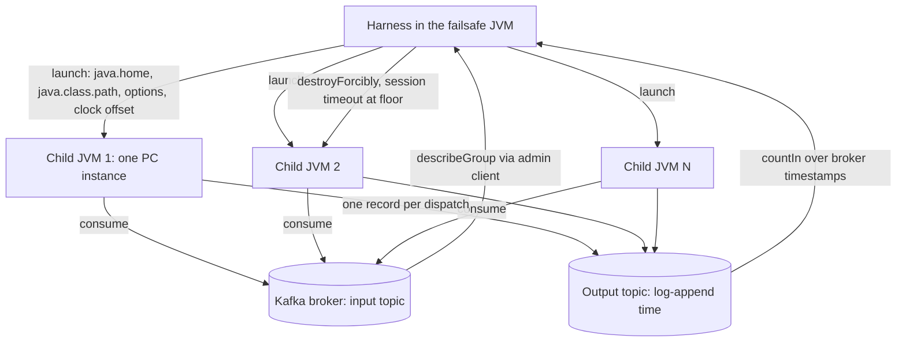

# Navigator Partition-Share - Plan

## Goal Capsule

- **Objective:** Every instance of one application collectively stays within a tagged resource's declared rate and burst across process boundaries - the overshoot bounded and priced, never asserted - with nothing new to run and nothing new to configure. This is astubbs#228's ask, delivered for one application: the navigator micro-MVP's promise, kept across JVMs.
- **Means:** A second allocator behind the existing seam takes each instance's share of a tagged resource from the fraction of the subscription's partitions it holds, mints that share locally per quantum exactly as the in-process allocator mints from membership, and lets the consumer group's own rebalance re-divide the rate when instances come and go (KTD1, KTD2). No control plane.
- **Product authority:** This plan, then `docs/inflight/core-shared-execution-resources.md` for the design it instantiates and `docs/plans/2026-08-31-2029-feat-navigator-micro-mvp-plan.md` for the seams and settled decisions it inherits. The controller rung (across-app sharing, demand-weighted allocation, pacing) is not active scope; its design is recorded in How This Work Fits Together and in the owning notes, not built.
- **Stop conditions:** Stop and surface rather than work around if computing the instance's partition fraction needs a broker round trip on the quantum or record path (one metadata read per rebalance, on the poll thread, is the budget - KTD3; anything per quantum breaks the "nothing distributed on the record path" line), or if the multi-process lane cannot be made to hold its bound under the no-retry CI policy - do not loosen the bound to go green (see R12 and `docs/testing.md`).
- **Execution profile:** Feature work on the engine's poll/control boundary plus new test infrastructure; test-first on the virtual clock for the allocator and the snapshot handoff, harness self-tests before the lanes that depend on them, then the wall-clock lanes.
- **Tail ownership:** The implementer owns the Definition of Done including the record-keeping unit (U8); merge prep offers the squash message and the defect-class sweep per `docs/merge-checklist.md`.
- **Open blockers:** None.

---

## Product Contract

### Summary

Global rate limiting across every instance of one application, with no control plane: share by partition fraction, mint locally, re-divide on rebalance. Proven across real JVM boundaries by a kill-one storyline and a churn ladder that publishes the overshoot bound as a measured curve, including the clock-skew term the in-process rung never had.

### Problem Frame

The in-process rung (astubbs/parallel-consumer#392) proved the seams and the credit model inside one JVM: one application-supplied allocator, shared by reference. astubbs#228's ask - two independent upstream reports behind it - is N processes respecting one limit, and today each of those processes either divides the rate by hand and gets it wrong the first time an instance dies, or drags in a shared cache to coordinate. The design record's own "even cheaper first rung" was to divide the budget by membership Kafka already provides. The consumer group already tells every member exactly what it holds; nothing yet turns that into a share of a resource.

### Key Decisions

- KD1. **Across one application first; across applications deferred.** One application means one consumer group, and the group's assignment is the membership fact. (session-settled: user-directed - chosen over building the cross-application version now: it is the same shape plus a global controllers' group and per-app announce partitions, and it waits on the controller rung.) Governs R1, R15.
- KD2. **Partition-share finishes the MVP; no controller, no control topic.** The group coordinator already divides the work, so it divides the rate for free; demand-weighting waits for the rung that needs a controller anyway. (session-settled: user-approved - chosen over building the controller with even-spread as its first policy, and over staging both in one plan: skateboard first, and the second half would be planned before the first had taught anything.) Governs R2, R3, R4.
- KD3. **Share is the partition fraction of the subscription, not the instance count.** A crude demand proxy - an instance holding three partitions has roughly three partitions' worth of work - and the only number the assignment hands every member without a round trip. (session-settled: user-approved - chosen over dividing by live member count, which needs a group-describe round trip for a number the assignment already implies.) Governs R2, R5, AE3.
- KD4. **The proof is two JVMs plus a churn ladder that prices the bound.** Kill-one convergence across real process boundaries, then N processes joining and leaving under both rebalance protocols while the aggregate overshoot is measured and published. (session-settled: user-directed - chosen over the kill-one storyline alone: the bound gets a number, and the register's "instance count the acceptance tests use" item is answered by a ladder instead of a constant.) Governs R11, R12, R13.
- KD5. **Clock skew is priced, not assumed away.** Partition-share mints from each JVM's own clock, so a partition moving at a quantum boundary between skewed clocks can be minted twice for one quantum index; the ladder injects skew and the stated bound carries the term. (session-settled: user-approved - chosen over documenting a synchronised-clocks precondition, and over designing skew out, which is a planning-stage investigation with this as its fallback.) Governs R8, R12.
- KD6. **An explicit strategy menu, defaulting to the most sophisticated strategy available.** The idea-5 menu is visible from day one - partition-share, the in-process stub, a custom allocator - and its default on this rung is partition-share, so tags alone work out of the box while choosing the stub or a custom allocator is a deliberate act. (session-settled: user-directed - chosen over tags-only zero-config with no menu, and over construct-and-pass as today: nothing is chosen silently, and nothing has to be configured by default.) Governs R6, R7.
- KD7. **Staggered division ships with the controller rung, not here.** The contract stays `name`, `ratePerSecond`, `quantum`, `burst`, and this rung states what those three promise rather than adding a pacing field. Partition-share would give a phase per shard for free (slot = the partition's fleet-stable ordinal, KTD1) and that derivation is recorded for the next rung. (session-settled: user-directed - chosen over shipping pacing as a per-resource option now, or on by default for unknown window shapes: smallest surface, and the contract schema question is answered by stating the existing promise.) Governs R8.
- KD8. **No Kafka Streams, and no assignor-carried grants - on this rung or the next.** A compacted topic read by a plain consumer is a KTable minus the runtime; KS would add a dependency, a second group, and a competing threading model to buy standby state the controller must not need. Carrying grants in a custom partition assignor's user-data looked like the controller for free (the leader computes, the generation fences) but KIP-848 moves assignment server-side and drops client-side assignors. (session-settled: user-approved - the owner asked whether KS was overkill and agreed it is.) A framing decision for the deferred design; no governed R.
- KD9. **Two gating decisions are recorded as taken, because the code took them.** The enforcement fork was settled by the micro-MVP's KD1 (admission predicate with `availableAt` deferral), and standalone-first was settled by the owner's 2026-09-01 ruling that the finished navigator is the rate-limiting feature; `docs/inflight/core-distributed-throttling.md` says so in this rung rather than after. Governs R15.
- KD10. **An allocator instance passed without a matching strategy fails validation.** The migration from the in-process rung is an explicit one-line change, never a silent switch to partition-share. (session-settled: user-directed - chosen over inferring the custom strategy from the instance's presence: that inference is itself a silent choice, which KD6 forbids.) Governs R6, AE6.

### Actors

- A1. **Application developer** - registers the resource contract, tags the instance, and picks (or accepts the default) allocation strategy.
- A2. **Operator** - runs N instances of the application, watches the resource's aggregate rate and each instance's share, adds and removes instances.
- A3. **Group coordinator** - the broker-side authority whose assignment decides which partitions, and therefore what share, each instance holds. A system actor; nothing in this rung talks to it beyond what the consumer already does.

### Requirements

**Share and minting**

- R1. A resource tagged by instances of one consumer group is shared among exactly those instances; instances in other groups tagging the same name are independent on this rung.
- R2. An instance's share of a resource for a quantum is the resource's rate over that quantum, scaled by the fraction of the subscription's partitions the instance holds - assigned partitions over total partitions, summed across every subscribed topic. The same fraction scales the instance's burst budget, rounded up so a holder of at least one partition keeps a budget of at least one credit: burst is a fleet-wide budget divided by share, never a per-process budget. Each instance computes its fraction over its own subscription; instances tagging the same resource are expected to subscribe to an identical topic set, and a mismatch across JVMs is not detected on this rung - the same undetected class as R7's policy mismatch, and the documentation says so.
- R3. Over any window starting at a quantum boundary under stable assignment, the fleet's minted credits never exceed the resource's rate over that window; across a rebalance, R8's bound governs instead. A share below one whole credit per quantum is minted by the partition-ordinal remainder rotation - each partition's fleet-stable ordinal across the subscription's sorted topics as its slot in the in-process allocator's rotation, taken over the subscription's total partitions - so instances holding fractional shares never coincide above the grant, and no holder of at least one partition starves indefinitely.
- R4. Share follows the assignment: a revoked partition's share stops being spent from the moment of revocation, and a newly assigned partition's share is first minted at the next quantum boundary after assignment - the same next-quantum rule the in-process allocator applies to a joining member. Under the eager protocol a revoke and its paired assign publish as two consecutive updates, and the empty interval between them mints nothing - undershoot, never overshoot.
- R5. An instance holding no partitions has no share; any tagged work it somehow holds is deferred with the existing resource attribution, not admitted. An instance whose partition total is not yet known (a declined first metadata read) is treated the same way until the total resolves.

**Configuration surface**

- R6. The options carry an allocation-strategy choice with three values - partition-share, the in-process allocator, a custom allocator instance - and an absent choice resolves to partition-share; selecting the in-process or custom strategy without the allocator instance it needs fails validation naming the omission, and an allocator instance supplied alongside partition-share - explicit or defaulted - fails validation naming both fields (KD10). The fleet-wide guarantee - rate, burst, and the R11 and R12 proof - is scoped to a uniform partition-share configuration across the group; the in-process and custom strategies are local opt-out modes on this rung and provide only what their allocators implement. The options also carry the resource contracts to register (name, rate, quantum, burst): under partition-share the engine registers them against the allocator it builds, applying R7's fail-fast rules at validation; under the in-process or custom strategy a contract supplied here and one already registered on the instance must be identical, or validation fails naming the collision.
- R7. Contract registration and its fail-fast rules (unknown tag, conflicting policy under one name, unusable policy) apply per instance exactly as in the in-process rung, and their test coverage is inherited from that rung's suite - this rung adds only the strategy-combination cases (AE6); two JVMs registering different policies under one name is not detected on this rung and the documentation says so.
- R8. The contract's promise is stated where the contract is documented: credits per quantum equal rate times quantum, burst is the fleet-wide overdraft budget divided by share per R2, R3's rule holds under stable assignment, and across a rebalance the aggregate may exceed rate by at most burst plus one quantum's credits plus a clock-skew term - the term the ladder publishes per R12. The bound names its supported process-count and clock-skew domain and the deterministic rule by which R12's measurements become the number a user reads; outside that domain no bound is claimed. The documentation also states the utilisation property: an idle partition's share expires unspent, so under uneven demand the fleet runs below rate by the idle fraction, and demand-weighted allocation (the controller rung) is the remedy. The documentation also states the scope: a resource is shared among the instances of one consumer group only; a second group tagging the same name receives the full rate again, so the effective aggregate multiplies by the number of groups; cross-application sharing is the controller rung's scope. The documentation also states the convergence clock: after an instance leaves, its share is unused until the group rebalances - the session timeout for a killed process, and under static membership that same timeout at its configured length.

**Attribution and observability**

- R9. Every existing resource-wait explanation (decision reasons, deferral log, `pc.navigator.*` meters, the read-only context view) holds unchanged, and an instance's current share of each tagged resource - fraction and credits per quantum - is observable alongside them, so "why am I at 1Hz" is answerable from one instance.
- R10. The conservation identity holds per instance as today; the aggregate identity across instances - total minted across the fleet never exceeds the fleet's summed shares - is asserted by the multi-process lane rather than by any instance.

**Proof**

- R11. The asserted twin runs two separate JVM processes against one broker: two tagged instances on a 2-credits-per-second resource each fire at about 1Hz, an untagged bystander drains unthrottled with no navigator interaction, one process is killed and the survivor converges toward 2Hz through the group's rebalance, and the aggregate stays inside the R8 bound throughout. CI-gated, under the no-retry policy. The acceptance envelope - rate tolerance, observation window anchored to observed group stability, minimum sample count, and a convergence deadline after the kill composed of the session timeout, the rebalance, and one quantum - is predeclared before implementation and shared by this requirement and the acceptance examples, so "about 1Hz" has one meaning fixed before any result is seen.
- R12. A churn ladder runs N processes (a ladder of N) joining and leaving repeatedly under both the cooperative and the eager assignment protocol, with a test-only clock offset injected per process, and publishes measured aggregate overshoot against N and against skew; the R8 bound holds at every rung, and the published curve - not a constant - is the record of the bound. Aggregate emission is timestamped by broker log-append time on an output topic - one clock for the whole fleet - never by the emitting process's offset clock, so the published overshoot measures the mechanism and not the injected offset; consecutive rungs are separated by a stability barrier so one rung's tail never lands in the next rung's window.
- R13. `bin/demo-navigator.sh` runs the R11 storyline across two JVMs as a per-second dashboard, under the rules in `docs/demos.md`: the demo is the eyes-optimised twin of R11 and never the evidence.
- R14. The machinery that launches, observes and kills PC processes for R11 and R12 lands in the shared test utilities as reusable infrastructure, not inside one test class.

**Record-keeping**

- R15. The controller rung's design is recorded in `docs/inflight/core-shared-execution-resources.md` as the next rung, with what this rung settled: announcements keyed by app id with each app assigning only its own partition, lease-TTL membership, the fenced-writer question as a `transactional.id` cost question, even-spread then demand-weighted policy, a global controllers' group for the cross-application case, slot = the partition's fleet-stable ordinal across the sorted subscription (KTD1) as the pacing derivation, and KS and assignor-carried grants as considered and rejected. The controller rung's allocation model is recorded in the owner's words: clients continuously report the capacity they want; the partition-owned controller sums the reports and assigns capacity unevenly by request; the total is the maximum reached over time, the discovered envelope. `docs/inflight/core-distributed-throttling.md` records the two KD9 decisions as taken.

### Key Flows

- F1. **Steady state**
  - **Trigger:** An instance's control loop ticks.
  - **Actors:** A3 (implicitly, through the assignment already held)
  - **Steps:** The allocator reads the instance's partition fraction from the snapshot the rebalance callbacks published; the quantum pull mints the share for the current quantum index once (R2, R3); claims spend locally and defer to the next credit time as today; the share is visible on the view and meters (R9).
  - **Outcome:** N instances collectively emit at about the resource's rate, each at its fraction.
- F2. **An instance leaves**
  - **Trigger:** A process is killed, or closes.
  - **Actors:** A2, A3
  - **Steps:** The coordinator rebalances - after the session timeout for a killed process, at once for a closing one; survivors receive the departed partitions in `onPartitionsAssigned`; their fractions rise and their shares are minted at the next quantum boundary (R4); the departed instance's unspent credits die with it.
  - **Outcome:** The aggregate converges to the rate within the session timeout (kill) or the rebalance (close) plus one quantum, overshoot inside the R8 bound.
- F3. **An instance joins**
  - **Trigger:** A new process subscribes.
  - **Actors:** A2, A3
  - **Steps:** The coordinator rebalances; the holders of the partitions it takes stop spending those partitions' share at revocation (R4); the joiner first mints at the next quantum boundary after its assignment.
  - **Outcome:** The aggregate never exceeds the rate by more than the R8 bound; the fleet runs below rate for at most one quantum plus the rebalance while the moved share is unminted; the joiner reaches its fraction within one quantum of assignment.
- F4. **Startup with the default strategy**
  - **Trigger:** A1 tags a resource and sets no strategy.
  - **Actors:** A1
  - **Steps:** Options validation resolves the strategy to partition-share (R6); the engine builds the allocator against its own consumer once the consumer exists and registers the options-supplied contracts against it under R7's rules.
  - **Outcome:** Global rate limiting with no allocator code in the application.

### Acceptance Examples

- AE1. **Two JVMs share the rate.** **Covers R1, R2, R11.** Given two processes in one group, one topic of two partitions, both tagging `api-x` at 2/s with quantum 1s and burst 2, and an untagged bystander in the same group consuming its own topic (the in-process demo's shape) so the tagged pair are the only members tagging the resource, when both tagged processes are consuming a backlog, then each fires at about 1Hz and the bystander is unthrottled with zero navigator interaction.
- AE2. **Kill one, the survivor inherits.** **Covers R4, R11.** Given AE1 in steady state, when one process is killed, then after the session timeout and the rebalance the survivor fires at about 2Hz and the aggregate over the rebalance window stays inside rate plus burst plus one quantum plus the skew term.
- AE3. **Uneven partitions, uneven shares.** **Covers R2, R3, R9.** Given four partitions assigned three-to-one, when both instances have backlog, then over any window that is a multiple of four quanta they fire at about 1.5Hz and 0.5Hz - the fractional shares accruing to six and two credits per four quanta through the rotation, never rounding to zero - and each instance's context view and share gauge report three quarters and one quarter.
- AE4. **Skew is inside the bound.** **Covers R8, R12.** Given the ladder with a positive and a negative clock offset injected on two processes, when a partition moves between them at a quantum boundary, then the measured aggregate overshoot exceeds the skew-free bound by no more than the stated skew term.
- AE5. **No partitions, no share.** **Covers R5.** Given more instances than partitions, when an instance holds nothing, then its share is zero, it mints nothing, and it emits no resource-wait attribution because it holds no work.
- AE6. **The strategy matrix.** **Covers R6.** Given tags and no strategy, when the options validate, then partition-share is selected; given the in-process strategy and no allocator instance, then validation fails naming the missing instance; given partition-share - explicit or defaulted - and an allocator instance, then validation fails naming both fields; given the in-process strategy, an allocator instance and an options-supplied contract identical to one already registered on it, then validation passes, and a differing one fails naming the collision.
- AE7. **Conservation across the fleet.** **Covers R10, R12.** Given any rung of the ladder, when the run ends, then the sum of every process's minted credits is at most the sum of their shares over the run, and each process's own identity balances as it does today.
- AE8. **Idle share expires unspent.** **Covers R8.** Given four partitions assigned two-to-two, when only one instance's partitions have backlog, then the fleet fires at about half the rate and the other instance's credits expire unspent - asserted, not merely tolerated.
- AE9. **Two groups, two full rates.** **Covers R1, R8.** Given two consumer groups whose instances each tag `api-x` at 2/s, when both have backlog, then each group's instances collectively fire at about 2/s - the documented per-group scope, not a defect.
- AE10. **A moving partition undershoots, never overshoots.** **Covers R4.** Given AE1 in steady state, when a third tagged process joins and takes a partition, then the fleet fires below the rate for at most one quantum plus the rebalance while the moved share waits for its next quantum boundary, and never above the R8 bound.

### Success Criteria

- The overshoot bound exists as a published curve from R12 - against N and against skew - and the number a user reads in the contract's documentation is traceable to that curve.
- The multi-process lane is green under the no-retry policy on the hosted runner across the ladder, with no loosened assertion and no quarantine entry.
- `bin/demo-navigator.sh` shows the R11 storyline across two JVMs in about the time the in-process demo takes today.
- astubbs#228 can record its one-application half as shipped; the cross-application half stays open and points at the controller rung.
- A representative one-application deployment removes manual rate division and shared-cache coordination, and stays within the bound through instance joins and leaves with no operator reconfiguration - the workaround the Problem Frame names is gone, not just measured around.

### Scope Boundaries

**Deferred for later rungs**

- The controller: metrics topic, announce topic, lease-TTL membership, the fenced writer, even-spread and then demand-weighted allocation, and cross-application sharing through a global controllers' group.
- Staggered division (a paced grant with a phase), the downstream 429 signal, hard global concurrency, non-Kafka participants and the credit-vending endpoint, a safe-capacity fallback when a vendor is unreachable (no vendor exists on this rung), and the twenty-instance conservation test - the ladder is its CI-scale form.
- Detecting a contract-policy or subscription mismatch across JVMs - a replicated-fact problem that belongs with the controller.

**Outside this product's identity**

- A shared cache or a second coordination service as the limiter's substrate. The Kafka client is the only dependency; a limiter that needs Redis is the thing astubbs#228's mirror warned against.

**Deferred to Follow-Up Work**

- Guarding `numberOfAssignedPartitions` in `AbstractParallelEoSStreamProcessor` under the engine's `@GuardedBy` rule: it is read on the poll thread only today, KTD2 keeps the allocator off it, and the plain field is a pre-existing defect of its own.
- Adopting master's `ArchitectureTest.rebalanceCallbacksMustNotBlock` rule on this branch: it arrives with the stack's master catch-up, and KTD3 is written to pass it when it does.

<!-- ce-section: work-relationships -->
### How This Work Fits Together

This plan owns the partition-share rung only; the breakdown below is the current understanding, not a committed roadmap.

- **Depends on** astubbs/parallel-consumer#392, the in-process rung, for every seam it reuses - the allocator interface, the quantum pull, spend-after-claim, attribution, the context view, the two test lanes.
- **Depends on** astubbs/parallel-consumer#367 for the design record it cites and extends (R15); the corpus is read from that branch, not imported here.
- **Enables** the controller rung, which replaces the assignment fraction with an announced allocation behind the same allocator interface and inherits the multi-process lane (R14) as its harness.
- **Shares** the admission seam with the adaptive concurrency controller (astubbs/parallel-consumer#333); the two still compose by conjunction, and the min-composition of a declared ceiling with a discovered one remains the strategy-menu shape of idea 5.
- **Can proceed independently of** the non-Kafka participants and standalone-deployment work; nothing here shapes the vending surface.
- **Still to decide**, at the controller rung: whether per-control-partition `transactional.id` cardinality is affordable (the fencing correction), and the controller's fallback mode when its owner is unreachable.

### Dependencies / Assumptions

- Base is `feats/hasten-micro-mvp` at astubbs/parallel-consumer#392's tip; the stack's master catch-up stays deferred, and this branch does not merge master on its own.
- The engine holds R2's numerator - the assigned-partition count, maintained in the rebalance callbacks (`numberOfAssignedPartitions` in `AbstractParallelEoSStreamProcessor`) - but not its denominator: nothing in the engine reads a topic's partition count today. The total per subscribed topic is read from the consumer's cached topic metadata (`partitionsFor`) on the poll thread inside the rebalance callbacks, once per rebalance and never on the quantum or record path, and refreshed at every assignment so a partition expansion re-divides the rate at the rebalance it triggers; for a pattern subscription it is the partition total of the topics matched at that refresh. Group metadata is exposed through `ConsumerManager`; manual `assign()` is not supported anywhere in the engine, so "the assignment" always means a consumer group's.
- The consumer is a plain field on the processor, reachable directly; there is no thread-ownership guard class on this branch (the `ThreadConfinedConsumer` named in the deadlock write-up belongs to an unmerged, unproven draft). The guard is the convention that the rebalance callbacks run on the poll thread inside `consumer.poll()`, plus `ConsumerManager`'s cache-around-a-thread-restriction pattern for facts read off the poll thread and consumed elsewhere.
- The rebalance callbacks run on the poll thread and the quantum pull runs on the control thread, so the share crosses the two-thread boundary that `docs/solutions/runtime-errors/revoke-path-commit-deadlock-between-poll-and-control-threads.md` is written against (its master sibling on the commit seam, "two threads, one consumer", is not on this branch yet); KTD2 and KTD3 are the answer, and the engine's `@GuardedBy` rule applies to whatever holds the snapshot.
- Under the cooperative protocol `onPartitionsAssigned` fires on every member after every rebalance, with a possibly empty added set, and `onPartitionsRevoked` only with a non-empty revoked set; under the eager protocol revoke-all precedes assign. A partition-count change on a subscribed topic triggers a rebalance through the consumer's metadata-snapshot comparison. KTD3 relies on the first fact; the third is verified by U3's expansion test rather than assumed.
- No test today launches a second JVM running Parallel Consumer, and nothing in the main code creates topics or uses an admin client; the proxy-conformance module's `ConformanceDriver.spawn()` is the repo's one child-process launcher and the pattern R14 mirrors.
- The partition-share allocator keeps no clock of its own: every navigator call takes its instant from the engine module's clock, which the existing admission tests already override through a module subclass - that is how R12 skews a process, by launching it through a module subclass whose clock carries the offset. The virtual-clock lane's shared clock is `org.threeten.extra.MutableClock`, a dependency rather than a repo class, and the in-process allocator's constructor clock remains that lane's hook only.
- The build runs on kafka-clients 3.9.2 and nothing references the KIP-848 group protocol yet; "both protocols" in R12 means the eager range assignor and the cooperative sticky assignor on the classic group protocol.
- Production clocks are assumed NTP-class; the R8 skew term states what happens when they are not, rather than requiring that they are.
- The partition proxy assumes tagged demand is spread roughly evenly across the subscription's partitions; a subscription mixing a busy tagged topic with quiet untagged ones under-uses the rate, and demand-weighting is the controller rung's answer.
- The shared self-hosted highcpu box has a recorded co-residency failure signature (jobs killed mid-scenario with no stack trace) and the hosted runner has no baseline for N child JVMs plus a broker; KTD14 chooses the hosted runner and lets the ladder's reach be measured.

### Outstanding Questions

**Resolve Before Planning**

- None.

**Deferred to Implementation**

- The values of R11's acceptance envelope and the timeout passed to the timed metadata read, calibrated on the target hardware as the predecessor plan rules; the rung count the hosted runner sustains (KTD11, KTD14).
- The exact name and wording of the share gauges under `PCMetricsDef` and the view accessor (KTD6 fixes their shape).

### Sources / Research

- `docs/inflight/core-shared-execution-resources.md` - the design this rung instantiates, including its own "even cheaper first rung: divide the budget by active instance count".
- `docs/inflight/core-distributed-throttling.md` - the gating decisions and idea 5's strategy menu.
- `docs/plans/2026-08-31-2029-feat-navigator-micro-mvp-plan.md` - the seams, KD1 through KD11 and KTD3, KTD4, KTD7, KTD8, KTD11, all inherited; its Verification Contract is the template this one extends.
- `docs/plans/2026-09-01-001-handoff-navigator-session-two-rate-limiting.md` - what the in-process rung hands over, including the proof obligations.
- `docs/ideation/2026-08-17-distributed-throttling-ideation.html` - idea 5 (min-composition of ceilings), the prior-art autopsy ("nobody in the Kafka consumer-framework space divides a downstream budget using the consumer group itself"), and the deferral of a custom assignor as adoption friction.
- `docs/demos.md` - the asserted-twin and simulated-work rules R13 runs under.
- `parallel-consumer-core/src/main/java/bz/stub/parallelconsumer/navigator/StubResourceAllocator.java` - `shareFor` (the remainder rotation KTD1 reuses), `MEMBERSHIP_LEASE_TTL_QUANTA`, the single `stateLock` monitor, `issuedMembershipFor` (the once-per-quantum snapshot discipline KTD2 mirrors).
- `parallel-consumer-core/src/main/java/bz/stub/parallelconsumer/internal/PCModule.java` - `SupplierUtils.memoize` accessors for `resourceAllocator`, `navigatorParticipant`, `navigatorView`; `clock()`; the `buildProducer` seam from astubbs#426 that KTD4 mirrors.
- `parallel-consumer-core/src/main/java/bz/stub/parallelconsumer/internal/AbstractParallelEoSStreamProcessor.java` - `onPartitionsAssigned`, `onPartitionsRevoked`, `onPartitionsLost`, `numberOfAssignedPartitions`, `subscribe(Pattern)`, the direct forwarding into `WorkManager` (the one poll-to-engine handoff today).
- `parallel-consumer-core/src/main/java/bz/stub/parallelconsumer/internal/admission/AdmissionController.java` - the existing precedent for a rebalance callback publishing state to the control thread (lock-guarded set plus a flag consumed at `tick()`), which KTD2 follows in spirit with an immutable snapshot.
- `parallel-consumer-core/src/test/java/bz/stub/parallelconsumer/internal/AdmissionLifecycleTest.java` - `ClockedModule`, the module-subclass clock override KTD9 uses in the child JVM.
- `parallel-consumer-core/src/test-integration/java/bz/stub/parallelconsumer/integrationTests/BrokerIntegrationTest.java` - `countIn`, `awaitGroupStableWithOnePartitionEach`, `describeGroup` (admin-client group observation, process-agnostic).
- `parallel-consumer-core/src/test-integration/java/bz/stub/parallelconsumer/integrationTests/NavigatorRateShareTest.java` and `NavigatorDemo.java` - the in-process asserted twin and its dashboard, the shape U5 and U7 lift across the process boundary.
- `parallel-consumer-proxy-clients/parallel-consumer-proxy-conformance/src/test/java/bz/stub/parallelconsumer/conformance/ConformanceDriver.java` - `spawn`, `StreamPump`, `REAP_SLACK`, `destroyForcibly`: the child-process harness KTD7 mirrors.
- `parallel-consumer-core/src/test/java/bz/stub/parallelconsumer/navigator/StubResourceAllocatorLincheckTest.java` and `bin/lincheck-test.sh` (`EXPECTED_LINCHECK_CLASSES`) - the frozen-clock Lincheck shape and the roster guard KTD12 bumps.
- `parallel-consumer-core/src/main/java/bz/stub/parallelconsumer/metrics/PCMetricsDef.java` - the navigator meter entries and the `pcinstance` tag KTD6 extends.
- `docs/solutions/best-practices/a-timing-bound-used-as-a-correctness-gate-manufactures-its-own-evidence.md` and `docs/solutions/best-practices/a-stress-probes-calibration-is-a-claim-about-one-machine.md` - why R12 publishes a curve and why the envelope is calibrated per machine (KTD13).
- `docs/solutions/workflow-issues/ci-retries-hid-flakes-from-the-ledger-2026-08-07.md` and `docs/inflight/ci-chaos-on-hosted-runners-experiment.md` - the no-retry policy and the runner choice behind KTD14.
- `docs/test-hardening/inactive-tests-audit-2026-08-08.md` - the dated-record convention the published curve follows (KTD11).
- astubbs/parallel-consumer#367, branch `docs/codex-strategy-conversation`, read from the ref: the fencing correction (Kafka does not fence a plain produce by consumer generation), the open-research register's "the resource contract has no schema" item, staggered division and its prior art (RLQS and Doorman divide quantity, never time), Doorman's lease and fallback modes as the free design review for the controller rung, and uForwarder as the closest comparator - which divides per topic-and-group, leaving the named resource shared across unrelated workloads as the surviving edge. Master's `ArchitectureTest.rebalanceCallbacksMustNotBlock` and the retry-queue write-lock note are read from `origin/master` for KTD3.
<!-- file-refs: N/A - the register, the sweep and the corrected notes live on astubbs/parallel-consumer#367's branch, and the ArchUnit rule and write-lock note on origin/master, not on this one; cite them there -->

---

## Planning Contract

Product Contract preservation: changed, R2 and R6, both by user decision after review - R2's identical-topic-set clause is now a documented undetected mismatch rather than a validation failure (no cross-JVM validation exists on this rung, so the clause as applied by the review was infeasible; R7 already owns that class), and R6 gained KD10's allocator-without-strategy failure. Extended, no scope change: R4 and R5 gained the eager-interval and unresolved-total clauses, R7 the inherited-coverage note, R8 the convergence clock, R11 and R12 the envelope components and the timestamp source, F2 to F4 the timing they already implied; AE3 extended to cover R9, AE6 to the full strategy matrix; AE9 and AE10 added under existing requirements; the Deferred / Open Questions entry from the 2026-09-05 review resolved in place as KD10.

### Key Technical Decisions

- KTD1. **A second allocator behind the existing seam, minting from the stub's own rotation with a fleet-stable partition ordinal as the slot.** `PartitionShareResourceAllocator` implements `ResourceAllocator` unchanged. For each tagged resource and quantum index it sums `shareFor(position = ordinal, memberCount = total partitions, grant, quantumIndex)` over the partitions it holds, where a partition's ordinal is the cumulative partition count of the subscribed topics sorted by name before its topic, plus its own index - never the bare partition index, which collides across topics (partition 0 of two topics would share slot 0 and the high slots would never be held). Every instance derives the same ordinal from the identical topic set R2 assumes, so fractional shares across instances sum exactly to the grant with no communication (R3); the burst budget is the same fraction of the contract's burst, rounded up to one while any partition is held (R2). `join`, `leave` and the lease TTL become no-ops on the instance's own membership - the group's assignment is the membership - and `readQuantum` still renews nothing but mints once per quantum index. Conservation counters, the ledger identity and overdraft semantics are lifted from the stub, not reimplemented. Governs R2, R3, R5.
- KTD2. **The fraction crosses threads as one immutable snapshot, published only from the rebalance callbacks and read once per quantum.** A value type holding the held partitions and the total per subscribed topic lives in an `AtomicReference` the allocator owns; `onPartitionsRevoked` publishes held-minus-revoked at once (spend stops, R4), `onPartitionsAssigned` publishes held-plus-added with a refreshed total, `onPartitionsLost` publishes as a revoke. The allocator never reads `numberOfAssignedPartitions`. `readQuantum` captures the snapshot current at the quantum's start and mints from that alone - a mid-quantum publish affects the next index, the stub's `issuedMembershipFor` discipline. The eager protocol's revoke-all-then-assign therefore mints nothing in its gap: undershoot by construction, never a torn numerator over a stale denominator. Every field the snapshot lives in carries `@GuardedBy` or is an atomic reference of an immutable value. Governs R2, R4.
- KTD3. **The denominator is read with the timed `partitionsFor` overload inside `onPartitionsAssigned`, for every topic in the consumer's current subscription, and a decline keeps the last total or publishes "unresolved".** The read runs on the poll thread with metadata the consumer already refreshed for the rebalance, so it is a cache hit in practice; the timeout is small and a timeout or exception publishes the previous total when one exists (rate-limited warning) and an unresolved total otherwise, which R5 treats as no share. It takes no lock the commit path or the control thread can hold, and it declines rather than waits - the shape master's `ArchitectureTest.rebalanceCallbacksMustNotBlock` rule enforces and the retry-queue write-lock note warns about. Because cooperative rebalances call `onPartitionsAssigned` on every member, a partition expansion refreshes every member's total at the rebalance it triggers; U3 tests the eager and cooperative expansion cases rather than assuming them. Governs R2, R5.
- KTD4. **The engine builds the partition-share allocator through a protected `PCModule` seam, lazily, after the consumer exists, and forwards the rebalance callbacks to it.** The astubbs#426 `buildProducer` precedent: a memoized accessor on the module constructs the allocator when the strategy resolves to partition-share, registers the options-supplied contracts against it, and hands it to `navigatorParticipant()` exactly as the application-supplied instance is handed today; `AbstractParallelEoSStreamProcessor`'s three callbacks forward assignment facts to the allocator the way they already forward to `WorkManager`. Under the in-process or custom strategy the supplied instance is used and the options-supplied contracts are reconciled against it at validation (R6). Governs R6, F4.
- KTD5. **The strategy is a nested enum option with its own validation method, and the combination matrix is enumerated.** `AllocationStrategy { PARTITION_SHARE (default), IN_PROCESS, CUSTOM }` beside `resourceContracts`, following `AdaptiveConcurrencyMode`'s shape - `@Builder.Default`, a dedicated `allocationStrategyValidation()` appended to `validate()`'s chain after `navigatorValidation()`. The matrix strategy x allocator-present x contracts-present x tags-present is one parameterized test; the two failing cells KD10 names fail naming both fields. The in-process rung's own multi-instance tests migrate by setting `IN_PROCESS` - one line each. (session-settled: user-directed - fail-on-mismatch chosen over inferring `CUSTOM` from a supplied instance: the inference is a silent choice.) Governs R6, AE6.
- KTD6. **Share is two gauges per resource plus a view accessor, following the existing navigator meters.** `PCMetricsDef` gains a share-fraction gauge and a credits-per-quantum gauge under the navigator subsystem, tagged by resource and carrying the `pcinstance` tag as every navigator meter does; `NavigatorView` gains the same two reads, side-effect-free. Both read the snapshot and the current quantum's grant - never the allocator's internals. Governs R9.
- KTD7. **The multi-process harness is a child-JVM launcher in the core module's shared integration utilities, mirroring the proxy-conformance driver.** `ChildPcProcess` (name indicative) launches `java` from the parent's `java.home` with the parent's `java.class.path`, a test-only main class, and the instance's options as arguments; it starts stdout and stderr pumps on daemon threads before any blocking wait (an unread pipe would stall the child's control loop and masquerade as a mechanism bug), waits with a budget then `destroyForcibly`, probes liveness so a child that dies before joining fails fast with its captured output rather than reading as slow convergence, and never skips when a runtime is missing. No prebuild step: the failsafe JVM's classpath already contains everything a child needs. Governs R14.
- KTD8. **Emissions are observed through an output topic timestamped by the broker; group state through the admin client; windows anchored to observed group stability.** Each child produces one record per dispatch to a test topic configured with log-append time, so every firing carries the broker's clock - one clock for the fleet - and the parent consumes that topic to count firings per window (`countIn` over broker timestamps). The parent waits for group stability through `describeGroup`, then anchors the window; between ladder rungs it drains to steady state and re-confirms stability before starting the next clock. Child stdout carries the demo dashboard and diagnostics only. Governs R11, R12.
- KTD9. **Skew is injected by a child module subclass overriding `clock()` with an offset from its arguments.** The `ClockedModule` pattern from the admission lifecycle test, applied in the child's main class; production code has no clock knob. The stub's constructor clock is untouched. Governs R12 (instantiates KD5).
- KTD10. **Kill is `destroyForcibly`, and the children run with the session timeout at the broker's floor.** A killed member is rebalanced away only after `session.timeout.ms`, so the children set it to the broker's minimum with a matching heartbeat interval, and the convergence deadline is that timeout plus the observed rebalance plus one quantum (R11). The demo uses the same settings so its storyline fits the in-process demo's length. Governs R11, R13.
- KTD11. **The ladder publishes a checked-in dated record and a CI artifact, and states the rule that turns measurements into the bound.** Rungs of N under the range assignor and the cooperative sticky assignor, each with the skew offsets, each separated by KTD8's barrier; the maximum observed aggregate overshoot per rung is recorded against rate times window plus burst plus one quantum plus the skew term, where the skew term is, for each partition moved while the two holders' offset clocks disagree about the current quantum index, that partition's full per-quantum share (both holders mint that index), rounded up to one credit, summed over the moves the window permits - the offset's fraction of a quantum is the probability a move lands in that gap, not the size of the excess, and the ladder places moves at boundaries so the excess is the whole share every time. The bound holds when every rung's observation is inside it; the supported domain is the rung range and offset range actually run. The record lands as a dated file under `docs/test-hardening/` (the repo's convention for a measurement taken once and never edited), the run's report XML is uploaded as a workflow artifact the way the chaos suite does, and R8's documentation cites the record. Governs R8, R12.
- KTD12. **Concurrency confidence follows the predecessor's KTD11.** Every new shared field carries `@GuardedBy` or is an atomic reference of an immutable value; the new allocator gets its own Lincheck harness in the `lincheck` lane, frozen clock, stress mode only, with a recorded control-arm run in its javadoc; `EXPECTED_LINCHECK_CLASSES` in `bin/lincheck-test.sh` is bumped by one; SpotBugs covers the new main and test code.
- KTD13. **The wall-clock lanes gate on counts over anchored windows and observe timing, never gate on it.** The predecessor's KTD8, plus two learnings: a timing bound used as a gate manufactures its own evidence, and a calibration is a claim about one machine - so the envelope values are calibrated on the CI runner, not a laptop, and an overshoot clustering just above the predicted bound is first checked as an underpriced bound before it is read as a defect. No retry anywhere; a flake is quarantined with evidence.
- KTD14. **The multi-process lane runs on the hosted runner's Integration Tests row, not the shared highcpu box.** The box's recorded co-residency failure (a job killed mid-scenario, no stack trace) would be indistinguishable from a harness bug; the hosted runner has no such signature. The ladder's rung count is whatever that runner sustains, measured at implementation and recorded with the curve.
- KTD15. **The contract's promise is documented in two places that cannot drift apart.** The `ResourceContract` javadoc states R8's promise in full; the README template gains a navigator section that cites the javadoc and the published record rather than restating the numbers.

### High-Level Technical Design

The fraction's path from the coordinator to a minted credit, across the two engine threads:

```mermaid
sequenceDiagram
  participant B as Broker coordinator
  participant P as Poll thread (consumer.poll)
  participant A as PartitionShareResourceAllocator
  participant C as Control thread (control loop)
  B->>P: rebalance: onPartitionsRevoked(revoked)
  P->>A: publish snapshot(held - revoked, last totals)
  B->>P: rebalance: onPartitionsAssigned(added, maybe empty)
  P->>P: timed partitionsFor per subscribed topic (decline keeps last total)
  P->>A: publish snapshot(held + added, refreshed totals)
  C->>A: readQuantum(now) once per pass
  A->>A: snapshot at quantum start; sum shareFor(partition ordinal, total, grant, N)
  A-->>C: lease for quantum N (credits, scaled burst)
  C->>C: claims spend locally; deferrals wake at next credit
```

The proof topology - one broker, N child JVMs, one observer, one clock:



The strategy option's validation matrix, the cells KD10 and R6 fix:

| Strategy | Allocator instance | Outcome |
|---|---|---|
| absent (defaults to partition-share) | absent | partition-share; contracts registered on the engine-built allocator |
| absent (defaults to partition-share) | supplied | fails, naming strategy and allocator |
| partition-share | supplied | fails, naming strategy and allocator |
| in-process or custom | absent | fails, naming the missing instance |
| in-process or custom | supplied | that instance; options-supplied contracts must equal registered ones or validation fails naming the collision |

---

## Implementation Units

### U1. The strategy option, the contracts field, and the validation matrix

- **Goal:** The options surface carries the allocation strategy and the contracts to register, every combination validates as R6 states, and the in-process rung's tests select their strategy explicitly.
- **Requirements:** R6, R7 (KD6, KD10, KTD5).
- **Dependencies:** None.
- **Files:** `parallel-consumer-core/src/main/java/bz/stub/parallelconsumer/ParallelConsumerOptions.java` (the enum, the contracts field, `allocationStrategyValidation()`); `parallel-consumer-core/src/test/java/bz/stub/parallelconsumer/ParallelConsumerOptionsTest.java` (the matrix); the in-process rung's multi-instance tests and `NavigatorRateShareTest` (one-line strategy selection).
- **Approach:**
  1. Add the nested enum and the contracts field following `AdaptiveConcurrencyMode`'s declaration shape and `navigatorValidation()`'s placement in `validate()`.
  2. Enumerate the matrix in one parameterized test; each failing cell asserts the message names the fields R6 requires.
  3. Reconcile options-supplied contracts against an application-supplied allocator at validation using the allocator's `lookup` and `ResourceContract` equality.
  4. Migrate the existing tests that pass a `StubResourceAllocator` to `IN_PROCESS`.
- **Patterns to follow:** `AdaptiveConcurrencyMode` and `adaptiveConcurrencyValidation()`; `navigatorValidation()`'s fail-fast messages; fork copyright header per `docs/copyright.md` on any new file.
- **Test scenarios:**
  - Covers AE6. Tags, no strategy, no allocator: partition-share resolves; contracts present are accepted.
  - Covers AE6. No strategy, allocator supplied: fails naming both fields.
  - Covers AE6. Partition-share explicit, allocator supplied: fails naming both fields.
  - Covers AE6. In-process without an instance: fails naming the missing instance; custom without an instance: the same.
  - Covers AE6. In-process with an instance and an identical options-supplied contract: passes; a differing contract: fails naming the collision.
  - Edge: no tags, no strategy, no allocator, no contracts: validates exactly as today (untouched path).
  - Edge: contracts supplied with an unusable policy (zero quantum): fails with R7's existing message under partition-share too.
  - Migrated in-process tests stay green with `IN_PROCESS` selected.
- **Verification:** New options tests green; every navigator test on the branch green after migration; `bin/check-all.sh` clean.

### U2. The partition-share allocator on the virtual clock

- **Goal:** `PartitionShareResourceAllocator` mints from an assignment snapshot exactly as R2 and R3 state, keeps the conservation identity, and is proven on the virtual clock and under Lincheck before any engine wiring exists.
- **Requirements:** R2, R3, R5, R10 (KD3, KTD1, KTD2, KTD12).
- **Dependencies:** None (U1 in parallel; the allocator takes contracts through `register` as the stub does).
- **Files:** `parallel-consumer-core/src/main/java/bz/stub/parallelconsumer/navigator/PartitionShareResourceAllocator.java` and an `AssignmentSnapshot` value type beside it; `parallel-consumer-core/src/test/java/bz/stub/parallelconsumer/navigator/PartitionShareResourceAllocatorTest.java`; `parallel-consumer-core/src/test/java/bz/stub/parallelconsumer/navigator/PartitionShareResourceAllocatorLincheckTest.java`; `bin/lincheck-test.sh` (`EXPECTED_LINCHECK_CLASSES` bumped).
<!-- file-refs: N/A - files this unit creates; they exist once the unit lands -->
- **Approach:**
  1. Extract the stub's static quantum arithmetic and `shareFor` into a package-private helper both allocators call, so the rotation is shared rather than copied.
  2. Hold the snapshot in an `AtomicReference`; expose a `publish(snapshot)` entry the engine wiring will call from the callbacks (U3); `readQuantum` captures the snapshot current at the quantum's start per KTD2.
  3. Mint per resource: sum `shareFor` over the held partitions' fleet-stable ordinals (KTD1) with total partitions as the member count - the snapshot carries each topic's total in sorted-name order so every instance derives the same ordinals; scale burst by the same fraction rounded up to one; an unresolved total mints nothing (R5).
  4. Ledger, overdraft and expiry lifted from the stub; `join`/`leave`/lease TTL are no-ops documented as such.
  5. Lincheck harness in the stub's shape: frozen clock, stress options, a control-arm run recorded in the javadoc.
- **Execution note:** Test-first on the virtual clock - every semantic here is a function of a snapshot and a quantum index.
- **Patterns to follow:** `StubResourceAllocator` (`shareFor`, `issuedMembershipFor`, `@GuardedBy("stateLock")`, the counter-clamp learning); `StubResourceAllocatorLincheckTest`; the engine rules file for every new field.
- **Test scenarios:**
  - Covers AE1 mechanics. Two partitions of two, one each, 2/s and 1s quantum: each instance mints one credit per quantum.
  - Covers AE3 mechanics. Four partitions, three-to-one, grant two: over every four consecutive quanta (the rotation period equals the partition total) the three-partition holder mints six credits and the one-partition holder two, with per-quantum shares 2,2,1,1 and 0,0,1,1; never a zero-forever share.
  - Covers R3. Across all instances holding a partition each of a total of five with a grant of two: the per-quantum sum over all slots equals exactly the grant for every quantum index.
  - Covers R3 / KTD1. Two topics of unequal partition counts (two and three) held across two instances: every ordinal from zero to four is held exactly once, the per-quantum fleet sum equals the grant for every quantum index, and no slot goes unminted - the bare partition index would fail this.
  - Covers KTD11. Two allocators with opposite clock offsets and a partition moved in the gap where their quantum indices disagree: the excess over the skew-free mint is exactly that partition's per-quantum share for one index, and no more.
  - Covers R2. Burst scaling: with burst 4 and a quarter share the budget is one; with a three-quarter share it is three; the fleet's summed budgets equal the contract's burst.
  - Covers R4/KTD2. A snapshot published mid-quantum does not change the current quantum's issued grant; the next quantum uses it.
  - Covers R5. An unresolved-total snapshot mints nothing and `nextCreditAt` is empty; publishing a resolved total resumes at the next boundary.
  - Covers R4. A revoke snapshot (held minus one) mid-quantum: the current lease is unchanged, the next quantum's is smaller; no counter moves on the revoke itself.
  - Conservation: for arbitrary sequences of publishes, reads, spends and overdraft debits, minted plus overdraft equals spent plus expired plus outstanding at every observation.
  - Covers KTD12. Lincheck: concurrent `readQuantum`, `spend`, `publish` and view reads are linearizable and the identity holds.
- **Verification:** Unit tests deterministic on the virtual clock; `bin/lincheck-test.sh` green with the bumped roster; mutation of the minting path shows the rotation sum test bites - run with the navigator overrides the Verification Contract's mutation row names, never the script's offsets defaults.

### U3. Engine wiring: the module seam, the callbacks, and the share on the view and meters

- **Goal:** Under the default strategy the engine builds the allocator, publishes assignment snapshots from the rebalance callbacks with a declined-rather-than-waited denominator, registers the options-supplied contracts, and exposes the share on the view and meters.
- **Requirements:** R2, R4, R5, R6, R9 (KTD2, KTD3, KTD4, KTD6).
- **Dependencies:** U1, U2.
- **Files:** `parallel-consumer-core/src/main/java/bz/stub/parallelconsumer/internal/PCModule.java` (the protected build seam and memoized accessor); `parallel-consumer-core/src/main/java/bz/stub/parallelconsumer/internal/AbstractParallelEoSStreamProcessor.java` (callback forwarding and the timed metadata read); `parallel-consumer-core/src/main/java/bz/stub/parallelconsumer/navigator/NavigatorView.java` and its internal implementation (share reads); `parallel-consumer-core/src/main/java/bz/stub/parallelconsumer/metrics/PCMetricsDef.java` (two gauges); tests under `parallel-consumer-core/src/test/java/bz/stub/parallelconsumer/internal/` driven through `PCModuleTestEnv` with simulated callbacks.
- **Approach:**
  1. Add the protected seam and memoized accessor per KTD4; resolve the strategy there, build or adopt the allocator, register contracts.
  2. In the three callbacks, after the existing `WorkManager` forwarding, compute the snapshot: revoke and lost publish held-minus; assign runs the timed `partitionsFor` per subscribed topic (KTD3), then publishes held-plus with refreshed totals.
  3. Keep the callbacks free of any lock the control or commit path can hold; the only new state is the allocator's atomic reference.
  4. Extend the view and add the two gauges per KTD6, reading the snapshot and the current grant.
- **Patterns to follow:** `PCModule.buildProducer` (astubbs#426); the existing callback forwarding into `WorkManager`; `AdmissionController`'s rebalance-to-tick publication; `PCMetricsDef` navigator entries and the `pcinstance` tag; `ParticipantBackedNavigatorView.of`.
- **Test scenarios:**
  - Covers F4. Options with tags and no strategy: the module builds a partition-share allocator lazily, after the consumer exists, and registers the options-supplied contracts; the application-supplied path still adopts the instance under `IN_PROCESS`.
  - Covers R4 (eager). Simulated revoke-all then assign: the snapshot after revoke holds nothing, the snapshot after assign holds the new set with a refreshed total; a quantum pull in the gap mints nothing.
  - Covers R4 (cooperative). Simulated assign with an empty added set after another member absorbed an expansion: the total is refreshed and the fraction shrinks accordingly.
  - Covers KTD3. The timed read times out on first assignment: an unresolved total is published and a warning logged once; on the next assignment it resolves and minting starts at the next boundary. A later timeout keeps the previous total.
  - Covers KTD3. A pattern subscription whose match set grows: the refreshed total covers the newly matched topic's partitions.
  - Covers R9. With a three-quarter share the view and both gauges report it; with the navigator inert they report empty and zero.
  - Integration (virtual clock, `PCModuleTestEnv`): a tagged record is deferred while the total is unresolved and dispatched after the resolving assignment's next quantum.
  - Callback discipline: the new code in the callbacks acquires no monitor, lock or condition the control thread can hold (assert by review against the retry-queue write-lock note, and by the master ArchUnit rule once it arrives).
- **Verification:** Unit and virtual-clock tests green; full `bin/ci-unit-test.sh` green; every new field's `@GuardedBy` compiles under Error Prone.

### U4. The multi-process harness

- **Goal:** Shared integration infrastructure launches, observes and kills child JVMs each running one PC instance, with emissions counted on the broker's clock, group state observed through the admin client, and every failure of the harness itself distinguishable from a failure of the mechanism.
- **Requirements:** R14 (KTD7, KTD8, KTD9, KTD10).
- **Dependencies:** U3.
- **Files:** `parallel-consumer-core/src/test-integration/java/bz/stub/parallelconsumer/integrationTests/utils/ChildPcProcess.java` (launcher), `.../utils/ChildPcMain.java` (the child entry point: options from arguments, the clocked module subclass, the output-topic firing sink), `.../utils/FiringLedger.java` (consumer of the output topic counting per window on broker timestamps); extensions to `BrokerIntegrationTest` (a group-stability wait that accepts uneven partition splits); a harness self-test class beside them.
<!-- file-refs: N/A - files this unit creates; they exist once the unit lands -->
- **Approach:**
  1. Launcher per KTD7: `ProcessBuilder` on the parent's `java.home` and `java.class.path`, stream pumps before any wait, budgeted wait then `destroyForcibly`, liveness probe, no silent skip.
  2. Child main: builds options from arguments (strategy, tags, contracts, group, topics, session timeout at the broker floor, clock offset), installs the `ClockedModule` subclass when an offset is given (KTD9), runs one instance whose user function produces one record per dispatch to the output topic; prints the dashboard lines to stdout for the demo.
  3. Output topic created with log-append time; the ledger consumes it and counts firings per window using broker timestamps (`countIn` lifted to broker time).
  4. Group observation through `describeGroup`; a stability wait tolerant of uneven splits; an inter-rung barrier (drain, re-confirm stability, restart the window).
- **Execution note:** Prove the harness with its own tests before any lane depends on it - a child that exits early must fail fast with its output, and a stalled stdout pump must be impossible by construction.
- **Patterns to follow:** `ConformanceDriver.spawn`, `StreamPump`, `REAP_SLACK`; `LanguageRunner.ensureAvailable` (fail, never skip); `BrokerIntegrationTest.awaitGroupStableWithOnePartitionEach` and `describeGroup`; `KafkaClientUtils` topic creation with per-topic config; `docs/testing.md`'s shared-utilities rule.
- **Test scenarios:**
  - Harness: a child whose main throws before subscribing is reported as an early exit with its stderr, within the launch budget, not as a group-stability timeout.
  - Harness: a child that prints more than the pipe buffer before its first poll neither stalls nor loses lines.
  - Harness: kill via `destroyForcibly` returns within the reap slack; the group observation reports the member gone after the session timeout.
  - Harness: two children with different clock offsets emit records whose broker timestamps are consistent with one clock (offsets invisible in the ledger).
  - Harness: the stability wait accepts a three-to-one split and rejects an unstable group.
  - Harness: the inter-rung barrier waits for the previous rung's tail before the next window opens.
- **Verification:** Harness self-tests green on the hosted runner; no lane in U5 or U6 references a process API directly.

### U5. The two-JVM proof

- **Goal:** The asserted twin: two child JVMs share the rate, a bystander is untouched, kill-one converges, uneven partitions give uneven shares, idle share expires, two groups each get the full rate, a moving partition undershoots - all inside the predeclared envelope under the no-retry policy.
- **Requirements:** R1, R2, R4, R5, R8, R10, R11 (KD4, KTD10, KTD13).
- **Dependencies:** U4.
- **Files:** `parallel-consumer-core/src/test-integration/java/bz/stub/parallelconsumer/integrationTests/NavigatorPartitionShareIT.java` (name per the module's conventions); the envelope constants in one place the demo and the ladder also read.
<!-- file-refs: N/A - files this unit creates; they exist once the unit lands -->
- **Approach:**
  1. Predeclare the envelope: percentage tolerance, window length (a multiple of the partition total in quanta, so rotation periods divide it evenly), minimum samples, convergence deadline (session timeout plus observed rebalance plus one quantum) - calibrated on the CI runner (KTD13) and written down before the assertions.
  2. AE1 storyline through U4's harness; anchor the window at observed group stability.
  3. Kill one child; assert convergence within the deadline and the aggregate inside the R8 bound over the transition window.
  4. The uneven, idle, two-group and join storylines as separate test methods sharing the fixture.
- **Execution note:** Calibrate on the target runner before trusting a tolerance; if the lane cannot be made stable, stop and surface per the Goal Capsule - never loosen the bound.
- **Patterns to follow:** `NavigatorRateShareTest` (storyline, `countIn`, Awaitility on the asserted state); the predecessor's KTD8; the timing-bound learning.
- **Test scenarios:**
  - Covers AE1. Two children at about 1Hz each within tolerance over the anchored window; the bystander drains its topic flat-out with zero navigator attribution.
  - Covers AE2. After the kill, the survivor reaches about 2Hz within the convergence deadline; the aggregate over the transition window is inside the bound.
  - Covers AE3. Three-to-one partitions: about 1.5Hz and 0.5Hz; each child's share gauge reports its fraction (read through the child's dashboard line or the ledger's per-instance tag).
  - Covers AE5. A third tagged child with no partitions: zero share, zero firings, zero attribution.
  - Covers AE8. Backlog on one side of a two-two split: the fleet fires at about half rate; the idle child's expired counter grows.
  - Covers AE9. Two groups tagging the resource: about 2/s each.
  - Covers AE10. A third child joins and takes a partition: the fleet dips below rate for at most one quantum plus the rebalance and never exceeds the bound.
  - Covers R10. At the end of every storyline the summed minted credits across children are at most the summed shares over the run.
- **Verification:** `bin/ci-integration-test.sh` green including the new class on the hosted runner; any flake sighting recorded per `docs/quarantined-tests.md` before merge, never retried away.

### U6. The churn ladder and the published curve

- **Goal:** N children join and leave under both assignors with injected skew, the aggregate overshoot is measured per rung on the broker's clock, and the curve is published as a dated record plus a CI artifact with the rule that turns it into R8's bound.
- **Requirements:** R8, R10, R12 (KD4, KD5, KTD8, KTD9, KTD11, KTD14).
- **Dependencies:** U4, U5.
- **Files:** `parallel-consumer-core/src/test-integration/java/bz/stub/parallelconsumer/integrationTests/NavigatorChurnLadderIT.java`; `docs/test-hardening/navigator-overshoot-ladder-2026-MM-DD.md` (the dated record, written from the run); `.github/workflows/maven.yml` or the integration workflow (artifact upload of the ladder's report, the chaos suite's shape).
<!-- file-refs: N/A - files this unit creates; they exist once the unit lands -->
- **Approach:**
  1. Rungs of N from two upward, capped by what the hosted runner sustains (measured, recorded); each rung under the range assignor and the cooperative sticky assignor; skew offsets applied per child.
  2. Per rung: reach stability, open the window, churn (join and kill in sequence), measure the maximum aggregate overshoot over any quantum-aligned window, close the rung with the barrier.
  3. Assert every rung inside rate times window plus burst plus one quantum plus the skew term (KTD11's formula); record the observations.
  4. The ladder writes the dated record into the build directory beside the report XML, and the workflow uploads both as the artifact.
  5. Download that artifact from the hosted-runner run and commit the record under `docs/test-hardening/` with the workflow run URL and the commit it ran against in the record's header - a CI job cannot commit into the PR, so the checked-in file is the run's output verbatim, carried by hand with its provenance.
- **Execution note:** The record is written by the run, not by hand - a number a command produced, cited by the documentation; the only hand step is the download-and-commit with provenance.
- **Patterns to follow:** `chaos-pain.yml`'s artifact upload; `docs/test-hardening/` dated files; the stress-probe calibration learnings.
- **Test scenarios:**
  - Covers AE4. Two children with opposite offsets and a partition moved at a boundary: overshoot exceeds the skew-free bound by no more than the skew term.
  - Covers AE7. Every rung: summed minted at most summed shares; each child's identity balances.
  - Covers R12. Each rung under both assignors stays inside the bound; the eager rung shows the undershoot gap, the cooperative rung does not.
  - Covers R12. A rung whose child is killed mid-quantum converges within the deadline and stays inside the bound.
  - Ladder isolation: a rung started before the previous rung's tail drained is rejected by the barrier (harness-level, from U4) - the ladder never measures a contaminated window.
- **Verification:** The ladder green on the hosted runner; the dated record present and cited from the contract documentation (U8); the artifact uploaded.

### U7. The two-JVM demo

- **Goal:** `bin/demo-navigator.sh` shows the R11 storyline across two JVMs as the per-second dashboard, in about the in-process demo's length, as the eyes-optimised twin of U5.
- **Requirements:** R13 (KD4, KTD10).
- **Dependencies:** U5.
- **Files:** `parallel-consumer-core/src/test-integration/java/bz/stub/parallelconsumer/integrationTests/NavigatorDemo.java` (lifted onto the harness), `bin/demo-navigator.sh`, `docs/demos.md` (the two-process entry).
- **Approach:**
  1. Run the AE1 and AE2 storyline through U4's harness; the parent renders the dashboard from the children's stdout lines and the ledger's counts.
  2. Keep the demo off by default and stdout-only per `docs/demos.md`; the session timeout at the floor keeps the kill segment short.
- **Patterns to follow:** the existing `NavigatorDemo` dashboard sections; `docs/demos.md`'s asserted-twin, off-by-default and stdout rules.
- **Test scenarios:**
  - Test expectation: none beyond the asserted twin (U5) - the demo is never the evidence; a smoke run in the demo gate confirms it starts, shows both children at about 1Hz, the kill, and the survivor at about 2Hz.
- **Verification:** The script runs end to end on JDK 17 with Docker in about the in-process demo's duration; `docs/demos.md` lists it.

### U8. Record-keeping and documentation

- **Goal:** The contract's promise is documented where R8 says, the owning notes record what this rung settled and what the controller rung inherits, and the testing doc names the new lane.
- **Requirements:** R8, R15 (KD9, KTD15).
- **Dependencies:** U6 (the record it cites).
- **Files:** `parallel-consumer-core/src/main/java/bz/stub/parallelconsumer/navigator/ResourceContract.java` (javadoc carrying R8's promise); `src/docs/README_TEMPLATE.adoc` (a navigator section citing the javadoc and the record - the README is generated, never hand-edited); `docs/inflight/core-shared-execution-resources.md` (the partition-share rung landed; the controller rung's design and allocation model per R15); `docs/inflight/core-distributed-throttling.md` (the two KD9 decisions recorded as taken); `docs/testing.md` (the multi-process lane); `CONCEPTS.md` (refine Partition-share if the implementation sharpened it).
- **Approach:**
  1. Write R8's promise into the contract javadoc in full: credits per quantum, burst as a divided budget, the stable-assignment rule, the rebalance bound with its named domain and rule, the utilisation property, the per-group scope, the convergence clock.
  2. README template section citing, never restating.
  3. Notes per R15; the testing doc's lane entry; regenerate the README per the repo's rule.
- **Patterns to follow:** the predecessor's landing note in `core-shared-execution-resources.md`; `docs/inflight/AGENTS.md`'s four-outcome rule when a note's work lands; `docs/testing.md`'s lane table.
- **Test scenarios:**
  - Test expectation: none - documentation; `bin/check-file-refs.sh` and `bin/check-issue-refs.sh` prove every citation resolves.
- **Verification:** `bin/check-all.sh` clean; the README regenerated from the template; the notes read post-merge (no "delete when merged" markers).

---

## Verification Contract

| Check | Command | Proves |
|---|---|---|
| Compile + unit tests | `bin/build.sh` (JDK 17 via per-command `JAVA_HOME`) | U1-U3 unit lanes, ArchUnit conventions |
| Full unit suite | `bin/ci-unit-test.sh` | No cross-module regression from the options and callback changes |
| Concurrency lane | `bin/lincheck-test.sh` (`lincheck` group, roster bumped) | KTD12's allocator scenarios; Error Prone's `GuardedBy` check at every compile |
| Integration suite | `bin/ci-integration-test.sh` (Docker required; hosted runner per KTD14) | U4 harness self-tests, U5 (AE1-AE3, AE5, AE8-AE10), U6 (AE4, AE7, the ladder) |
| Demo | `bin/demo-navigator.sh` | U7 runs end to end in about the in-process demo's length |
| Repo gates | `bin/check-all.sh` before every push | Copyright headers, file refs, issue refs, every `bin/` gate |
| Mutation scope | `PIT_TARGET_CLASSES='bz.stub.parallelconsumer.navigator.*' PIT_TARGET_TESTS='bz.stub.parallelconsumer.navigator.*' PIT_DECIDABLE_PACKAGES='^bz\.stub\.parallelconsumer\.navigator\.' bin/ci-mutation-test.sh` (the script's defaults target the offsets package, so all three overrides are required) | The rotation sum and the ledger close; exit codes per `docs/ci.md` |
| Analysis surfaces | `bin/check-pr-analysis-surfaces.sh` once a PR exists | No finding on a line this diff wrote |

No `-Dsurefire.rerunFailingTestsCount` anywhere - a flake fails the build by design; the lever is the quarantine registry with evidence.

---

## Definition of Done

- All eight units complete with their test scenarios green; AE1-AE10 each demonstrably covered by a named test.
- `bin/check-all.sh`, `bin/ci-unit-test.sh`, `bin/lincheck-test.sh` and `bin/ci-integration-test.sh` green on the branch, on the hosted runner, with no loosened assertion and no retry.
- The published curve exists as a dated record under `docs/test-hardening/` written by the ladder run, the workflow artifact is uploaded, and the contract documentation cites the record and states the supported domain and the bound rule.
- Every new shared field carries `@GuardedBy` or is an atomic reference of an immutable value and compiles clean under Error Prone's check; the new Lincheck harness runs in its lane with the roster guard updated.
- The rebalance callbacks acquire nothing new that can block; reviewed against the retry-queue write-lock note, and passing master's `rebalanceCallbacksMustNotBlock` rule when the catch-up brings it.
- The in-process strategy's existing tests select `IN_PROCESS` explicitly and stay green; no application-supplied allocator is ever silently unused.
- No scaffolding remains: no scratch tests, debug logging, commented-out experiments, or abandoned-approach code in the diff.
- The owning notes, `docs/testing.md`, the contract javadoc and the README template are updated in the same change; any flake sighted during CI is recorded in the quarantine ledger before merge.

---

## Deferred / Open Questions

### From 2026-09-05 review (round two, on the implementation-ready plan)

Six decisions the non-interactive review returned, each with its recommended remedy; the implementer settles them where the units name them and records the choice in the plan.

- **Rounded-up burst budgets exceed the contract's burst fleet-wide** - R2 / R8 / U2 (P1, feasibility, adversarial, Codex adversarial, confidence 100)

  The documented bound names a burst the mechanism breaks whenever more instances hold partitions than burst has credits. Recommended: state the slack - the bound's burst term is at most burst plus one credit per partition-holding instance, carried by R8, KTD11's formula and U2's scenario. Alternative: distribute burst like credits with floor plus a rotating remainder so the sum is exact.

- **A declined or empty metadata read must publish an unresolved total, not the previous one** - KTD3 / R5 / U3 (P1, feasibility, adversarial, Codex adversarial, confidence 100)

  Partition expansion is the one event that changes the total, and keeping the old total at exactly that rebalance lets a member compute a fraction of one and mint the whole grant. Recommended: any timeout, exception, empty or null result publishes the snapshot unresolved (R5's no-share state) until the next assignment resolves it; U3's "a later timeout keeps the previous total" scenario becomes its inverse, and the module test stubs the mock consumer per topic. Alternative: availability-first, keeping the stale total.

- **No pre-registered rule separates an underpriced bound from a defect** - KTD13 (P1, adversarial, confidence 75)

  Recommended: on the zero-offset rungs the bound is rate times window plus burst plus one quantum with no re-derivation, and any crossing there or any fleet-conservation failure is a defect; only the skew term may be re-derived, and only by a derivation recorded in the dated record before the re-run that tests it.

- **"Spend stops at revocation" contradicts the lease-unchanged model the units build** - R4 / KTD2 / U2 (P1, feasibility, confidence 75)

  Recommended: align R4 to what KTD2 and U2 implement - a revoked partition's share is last minted for the quantum in which the revocation occurs and excluded from the next quantum on; the new holder first mints it at the next boundary, so no index is minted twice - and drop the "spend stops" parenthetical from KTD2.

- **Fleet conservation is not observable from the harness** - U4 / U5 / AE7 (P1, Codex adversarial, confidence 100)

  The lane counts firings but never sees minted, expired, outstanding or overdraft credits. Recommended: each child emits an end-of-run machine-readable ledger on a channel the parent reads, and U5 aggregates it to assert the fleet identity.

- **The share fraction has no path through the allocator interface the view holds** - KTD6 / KTD1 (P2, feasibility, confidence 75)

  Recommended: define the partition-share allocator's local rate as rate times the snapshot's fraction (rotation-averaged) and derive both gauges and the view accessor from the existing local and global rate reads, leaving the interface unchanged.
