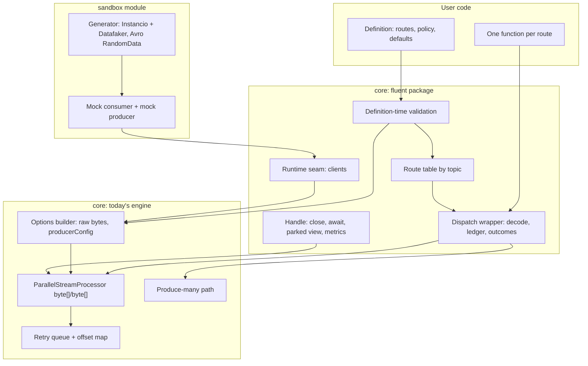
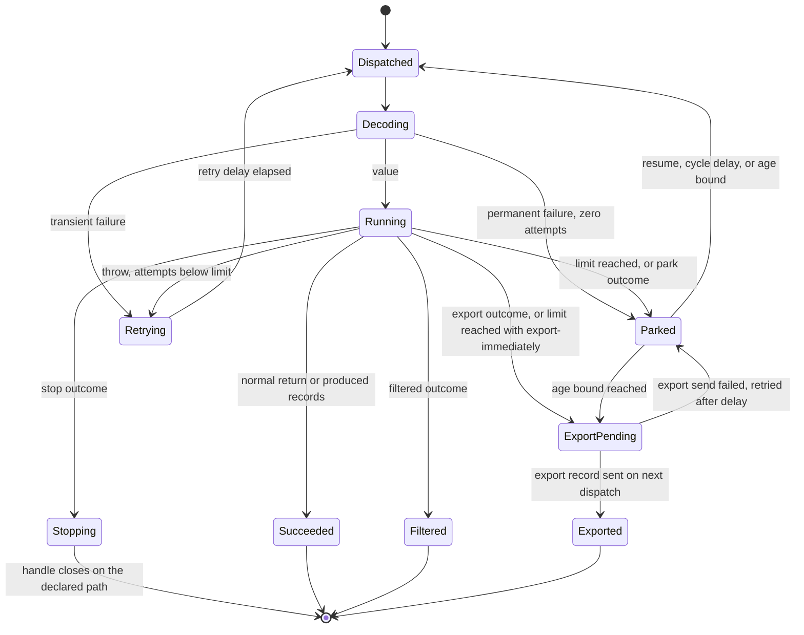
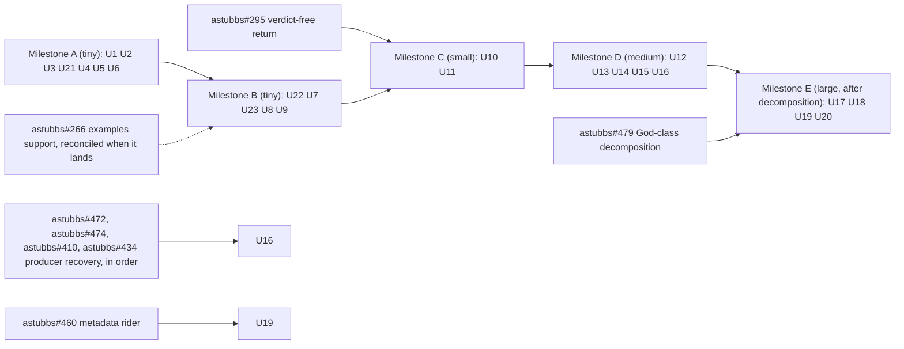

# Processor Definition UX Modernisation - Plan

## Goal Capsule

- **Objective:** A developer who once used Parallel Consumer and is deciding whether to come back can define a working consumer from the README alone, and the README's own example proves it on every build: typed handling per topic, a retry limit that parks the record, and filtering, in one screen of code (the budget is forty lines), without opening the javadoc. The dead-letter destination joins the example once export at capacity works (user-directed, 2026-09-10: "the quickstart shouldn't have a DLQ until real DLQ works").
- **Means:** A new, modern entry point that is a facade over today's engine, shipped beside the existing API as an equal, as a package in core with the sandbox as its own module (KTD1). Its behaviours are specified as record outcomes so the engine can take each one over natively after the God-class decomposition, without the surface moving. The README-minimal set is the entry point, routes and types (R1 to R6), outcomes and policy (R7 to R12), export (R13 to R15), park in place (R27), the handle (R17), the README and the API rule (R21, R26), the sandbox (R33) and the quickstart from R36; every other requirement is parity or beyond-parity work a later milestone carries. The first milestone is chosen in planning by implementation cost and risk, not by this list (R30): the owner wants a subset that can ship in the next release beside the bug-fix line, something to show at low risk, and the README-minimal set is the upper bound of that subset, not its definition.
- **Product authority:** This document, for the surface and its behaviours. The work sits under STRATEGY.md's Flexibility track; shipping it requires that document's audience and Tracks sections to record the returning developer and the surface work. The engine-native implementation of each outcome is separately planned work that must honour the behaviours fixed here. The Kafka Streams work (astubbs#255) and the language proxy (astubbs#242) are constraints on this surface, not scope. This surface precedes the self-scaling track (astubbs#333) because per-route admission is cheaper to define once here, where the route is the unit, than to retrofit after a per-instance controller has shipped; if the order reverses, R23's admission target becomes the controller's per-route sub-target and nothing else here changes.
- **Open blockers:** None. Every open item is deferred to planning or to implementation, each named in Outstanding Questions or the Planning Contract.
- **Execution profile:** Milestone A (U1 to U6 and U21) is the next-release candidate and touches no engine code; later milestones each wait on a named prerequisite (Planning Contract, Sequencing).
- **Stop conditions:** Stop and re-plan if a settled decision is invalidated by the code (park through the retry-delay hook cannot be made silent, or the engine's batch assembly cannot be restricted to one route), if the compatibility gate reports a break on the classic API, or if a milestone's prerequisite PR is closed unmerged.
- **Tail ownership:** The README regeneration, the CONCEPTS.md entries, the STRATEGY.md audience line and the inflight note's prerequisite table are part of the milestone that triggers them, not follow-up work.

---

## Product Contract

### Summary

Add a modern way to define a Parallel Consumer: connection properties in, one typed route per topic with one processing function each, retry limit and dead-letter destination declared once per instance, a handle out. The existing options builder and processor stay as the classic API, an equal, undeprecated surface. Each behaviour the fluent API offers is specified as a record outcome, so that when the engine can own it, the facade implementation is replaced without changing what the user wrote.

### Problem Frame

Today a consumer is built by constructing a Kafka consumer and producer by hand, wiring both into one options builder beside unrelated settings, passing that to a static factory, subscribing, and then registering exactly one function for every subscribed topic. That function receives one key and value type for every topic and must produce records of the same types. A record whose function throws is retried forever; there is no way to say "give up", "skip", or "send this somewhere". A payload the configured deserialiser cannot read ends the broker-poll thread. Users carry the same three workarounds: produce to their own dead-letter topic and swallow the exception, switch on the topic name inside one handler, and consume raw bytes so they can deserialise inside the function.

The demand is recorded across the issue tracker and is the oldest open surface work in the project: separate consume and produce types (astubbs#243), per-topic functions (astubbs#254), the retry epic (astubbs#239), a dead-letter queue (astubbs#149), skip or stop reactions (astubbs#231), terminate processing from inside the function (astubbs#172, confluentinc#718), one bad record failing a whole batch (astubbs#189), and the deserialisation-failure cluster, which is the largest group of user asks with no design at all: astubbs#148 (confluentinc#304, stop a bad record killing the poll thread), astubbs#153 (confluentinc#391, a handler and policy API) and astubbs#163 (confluentinc#550, is there any exception handler). `docs/inflight/core-163-poll-path-has-no-error-seam.md` confirms there is no seam for it on the processing path, and records that the poll path already has a typed per-exception seam with two arms, so a deserialisation policy is a third arm rather than new architecture. Two of these clusters have design notes but none reached requirements. A comparable library in the same space now offers all of them in one chain, so a returning user meets the gap on first contact.

### Key Decisions

- KD1. **The fluent API coexists with the old as an equal.** Both are documented; nothing is deprecated; the API-compatibility gate (astubbs#315) must pass unchanged for the old surface. (session-settled: user-directed - chosen over deprecating the old surface in favour of the new one: no forced migration for existing users.) Governs R20, R21.
- KD2. **Facade first, engine second.** The fluent API ships as composition over today's primitives before any God-class cut lands; each behaviour is specified as an outcome so the engine can take it over later without the surface moving. (session-settled: user-directed - chosen over landing the outcome model in the engine first: the surface is the most user-facing change, it drives fixes the engine needs anyway, and the returning user should not wait for the decomposition.) Governs R7, R8, R9, R22, R23.
- KD3. **One callback per route, everything else is data.** A route carries its types and one processing function; retry limit, backoff, dead-letter destination, ordering and concurrency are data on the instance. The processing function reports its outcome; retry-versus-terminal is never expressed as a list of exception classes; the three-way decode result of R12 is the one classification the surface carries. Type declarations borrow the Kafka Streams shape, consumed and produced with serdes, because every Kafka Java developer already reads it; the Streams chain grammar is not borrowed across routes, because a route has one function and no topology; a short prelude on a route, filter, map and peek before process, is Java-binding sugar composed into that one function. (session-settled: user-directed - chosen over Java-rich hooks such as predicate filters and exception-class retry lists: every callback is a function that must exist in each foreign client of the language proxy, and data crosses the wire for free.) Governs R3, R5, R6, R10, R16, R18.
- KD4. **The reference surface is a guide and a floor, not a ceiling.** Every capability the comparable library offers gets a disposition here, and anything beyond it is welcome when it falls out of this library's own mechanisms cheaply: the offset map, the transactional produce path, per-route limits. (session-settled: user-directed - first chosen as a ceiling on 2026-09-09, "we do not need to go beyond what it offers"; lifted on 2026-09-10, "it is only a guide; if it is easy to do, we should do better". The two additions admitted under the ceiling, terminate processing (astubbs#172) and the classic-API deserialisation policy, stay; what the lift adds is park, export at capacity, the queryable parked set, scheduled retry as a park delay, direct park and export from the function, and per-route retry overrides.) Governs the Feature disposition section, R24, R25, R27, R28, R29.
- KD5. **The proxy mirroring decision is left open, and the surface is designed for both.** No construct in the fluent API may be one a wire contract could not carry. (session-settled: user-directed - chosen over committing the proxy clients to the modern surface now.) Governs R18.
- KD6. **Capacity across topics is work-conserving fair share, not reservation.** Recorded from the owner on 2026-08-21 in `docs/inflight/next-multi-topic-multi-function.md`. (session-settled: user-directed - chosen over per-topic capacity reservation: an idle topic must not waste its share.) Superseded for the fluent API on 2026-09-10, user-directed: on virtual threads (astubbs#360) threads are cheap, so each route gets its own concurrency limit, a copy of the instance default, and routes never compete for one shared limit; reservation's cost, idle capacity, is nil there, which removes the reason for sharing. A platform-thread user sets a lower per-route limit so the sum fits the pool. (chosen over work-conserving sharing of one instance limit: sharing needs a topic-aware engine, per-route limits need only the facade.) Governs R6, R23.
<!-- file-refs: N/A - the multi-topic note lives on unmerged branches; print it with bin/inflight.mjs docs show -->

- KD7. **The primary success signal is the README's first example, compiled in CI and run in the sandbox.** (session-settled: user-directed - first chosen on 2026-09-09 as a returning-user trial over the README example; superseded on 2026-09-10, "the trial is not a thing that is actually going to happen", so the signal is the one that runs on every build. Issue closure and workaround deletion remain secondary.) Governs Success Criteria, AE13, R33.
- KD8. **Full parity in one document.** The four independently plannable outcomes (entry point and routes, terminal outcomes, per-topic types, lifecycle) are specified here together. (session-settled: user-directed - chosen over owning one area and naming the rest as follow-ons.)
- KD9. **Deserialisation happens per route, inside the facade.** The fluent API consumes raw bytes and applies each route's deserialisers itself. A payload that cannot be read is a per-record failure (R12) rather than an error on the poll thread. Governs R4, R12.
- KD10. **An exported record travels the existing produce-many path.** Under the transactional commit mode it is in the same transaction as the offset commit; a failed export leaves the record parked. Governs R13, R14, R15.
- KD12. **Park in place is the dead-letter of first resort; a dead-letter topic is export.** The offset map already commits past an incomplete record, so a record that has exhausted its attempts can stay where it is, holding no worker, with the source topic as its store and the map as the index; copying it to a topic is needed only when the map's capacity or the topic's retention forces it. (session-settled: user-directed, 2026-09-10 - chosen over the topic-first design of round two: "we don't need a dead-letter queue like normal systems because of our offset encoding", with export at a capacity fraction, eighty percent by default, as the relief valve.) The default fraction moved in review round three on 2026-09-10: the engine stops a partition at seventy-five percent of the cap, so a default of eighty could never fire; the default is seventy percent, five points below the threshold, which the owner judged margin enough (user-directed, 2026-09-10: "60 is just leaving it on the table"), and the setting is a whole percentage capped at the threshold minus five points, so a higher value is refused at definition time (R27). Governs R11, R13, R14, R15, R16, R27.
- KD14. **Lead with what only this architecture allows.** The fluent API's first screen and the README lead with park in place, which the offset map makes possible and a commit frontier cannot, then export at capacity and the queryable parked set; the entry-point and typed-route conveniences follow. (user-directed, 2026-09-10: "lean into features that only PC can do because of its architecture".) Governs R21, R27, R28, and the STRATEGY.md marketing line the Success Criteria require.
- KD13. **Milestones are cut by engine change: tiny, small, medium, large.** The facade-only surface ships first, cosmetic engine additions next, the seam changes after, the engine-native forms after the decomposition; a requirement's tier is where it lands, not how important it is. (session-settled: user-directed, 2026-09-10; tiny added the same day for changes that touch the engine only cosmetically.) Governs R30.
- KD11. **Nothing is global except the commit mode; every other setting is a per-route value with an instance default; a topic has exactly one route.** (user-directed, 2026-09-10: "really not much should be global except defaults".) The commit mode is global because it is a property of the clients, not of the work: one consumer means one offset commit per group, and the transactional mode wraps that commit in one producer's transaction; a per-route commit mode would be two producers and two transactions over one consumer, which is two instances. That is the line: anything that needs another consumer or another transaction is another instance. Ordering is per route from the medium tier because its seam is in the engine. Two functions on one topic is not offered. The commit-failure policy of the commit-failure seam (astubbs#352), shut down or keep going when a commit exhausts its budget, is the one other instance-wide setting, by the same line: it is a property of the one commit, so it sits beside the commit mode once that seam lands (user-directed, 2026-09-10, clarifying this decision rather than reversing it). Governs R2, R6.

<!-- ce-section: work-relationships -->
### How This Work Fits Together

This plan owns the modern surface and the behaviours it promises. The breakdown below is the current understanding, not a committed roadmap.

- **Depends on** nothing before planning for the tiny tier. The facade composes today's public primitives (KD2), with one engine item inside this plan: R25's third arm on the poll path's exception seam. Export under the transactional commit mode beyond today's terminate-on-failure (R14, medium tier) depends on the producer-recovery stack: astubbs#472, the vocabulary and plumbing; astubbs#474, which puts an aborted transaction's work back instead of the instance dying; astubbs#410, which replaces the invalidated producer; and astubbs#434, which aborts a transaction an unsendable record poisoned. astubbs#426, already merged, is what lets R1 build the producer from properties today; astubbs#420, above the stack, derives the transactional id so a transactional definition needs none in its properties, and the commit-failure seam (astubbs#352) gives the instance a decision other than terminating when a commit exhausts its budget, which the fluent API would carry as data beside the commit mode. Which phase of this work waits on which of those, and the natural points to merge them first, is `docs/inflight/core-ux-modernisation.md`'s to keep current, since it changes as they land.
- **Enables** the engine-native takeover of each outcome, which is separately planned work sequenced after the God-class decomposition in `docs/inflight/core-decompose-abstract-parallel-eos-stream-processor.md` (astubbs#479).
- **Shares** the record-outcome vocabulary with the dead-letter brainstorm (astubbs#313, prior-art report `docs/plans/2026-08-18-001-investigate-dlq-prior-art-report.md`). This document answers that report's six open questions at product level (R7 to R15); the 2022 draft astubbs#8 remains the implementation seed for the engine-native form.
- **Shares** the per-topic design cluster with `docs/inflight/next-multi-topic-multi-function.md` (astubbs#254, astubbs#243, astubbs#236, astubbs#150, astubbs#245, astubbs#244). R2 to R4 settle the attachment shape; cross-topic key identity and topic priority stay with that note.
- **Can proceed independently of** the Kafka Streams work (astubbs#255), which gives a Streams topology the engine's concurrency and is the fluent API for stateful processing. The two APIs must not contradict each other about what an outcome means.
- **Can proceed independently of** the language proxy (astubbs#242), subject to R18.
- **Enables** per-function self-scaling: the per-route admission target (R6) is what the adaptive controller (astubbs#333, astubbs#392, astubbs#456) will move for each route individually; that work merges after this and must find admission per route, not per instance.
- **Shares** its vocabulary with the strategy-conversation notes (astubbs#367): the adoption ladder's share-consumer-shaped facade maps accept, release and reject onto succeeded, retry, and park or export, so R7's outcomes stay mappable to it; per-function capacity arbitration names the many-functions process this plan's routes are, and its per-function admission sub-targets are R6's per-route admission; the function manifest is a route declared as data (R18); the admission model classifies a parked record as known work with an unsatisfied eligibility predicate; the SLO-objective builder is a future per-route setting the route block leaves room for.
- **Still to decide:** whether the proxy clients mirror this surface (KD5); whether the health surface arrives through astubbs#226; whether the user function runs on virtual threads (astubbs#360) - neither changes this contract.
<!-- file-refs: N/A - the decomposition note, the dead-letter report and the multi-topic note live on unmerged branches, named by PR above; print any of them with bin/inflight.mjs docs show -->


### Actors

- A1. **Returning developer** - knows the classic API, left, is evaluating whether to come back. Reads the README first.
- A2. **Existing user** - runs the classic API in production with one or more of the three workarounds. Must not be broken (KD1).
- A3. **Foreign-client author** - implements a proxy client in another language against the wire contract (astubbs#242). Sees only what R18 permits.
- A4. **The engine** - today's processor behind the facade; later the native owner of each outcome.

### Requirements

**Entry point and routes**

- R1. A consumer is defined from connection properties and started to obtain a handle; the user constructs no Kafka client objects. In the Java binding a pre-built consumer and producer may be supplied in place of properties, sugar that never reaches the wire (R18), so an existing user with hand-built clients reaches the outcomes without migrating; on the wire a definition is properties only. A pre-built producer is the classic API's instance path, on which producer recovery never runs (astubbs#410), so a definition that supplies one forgoes recovery and, under the transactional commit mode, export (R14); the documentation says so beside the option. A pre-built consumer not configured for raw bytes cannot be detected at define, so it stops the instance on its first record with a message naming its deserialisers (R24), never a retry.
- R2. A route binds one topic, or under R5 a set of topics, to one processing function; the API spells the binding `topic` and `topics`. A topic carries **exactly one** route: a second route naming a topic that is already routed is refused when the definition is built, naming the topic and the route that already holds it. That refusal, in `ParallelConsumerDefinition`'s `route(` method, is the **only** one, so there is no engine-side twin that could disagree with it. Two behaviours over one topic are composed by the user inside that route's one function (KTD15).
- R3. A route declares its own key and value types for consumed records and, when it produces, separate key and value types for produced records. The processing function returns zero or more produced records, each naming its destination topic; zero records on a normal return is success (R7), and the filtered value (R8) carries no output. A route that has not declared produced types cannot return a produced record, and in the Java binding that is a compile error: declaring produced types changes the route's type so that only its function may return a producing outcome. On the wire, where types cannot help, the engine refuses a produced record from a non-producing route at definition time.
- R4. A route declares its deserialisers through the general form, consumed with a key and a value deserialiser, or through a format helper that resolves to the deserialiser already on the classpath for JSON, Avro or Protobuf, with the key defaulting to string; a format-named route, json, avro, protobuf or bytes with the topic, is sugar that desugars to the route form. The JSON helper without a class yields the payload as a map of field names to values, so a topic nobody has a class for can be consumed and inspected by field name with nothing declared; it uses the same optional JSON dependency as the class-typed form. A route's deserialisers are applied per record inside the facade and, when the route declares produced types, its serialisers are applied to produced records before they reach the produce path; the consumer and the producer are both configured for raw bytes by the facade, never by the user. The facade creates a producer only when something needs one: a route that declares produced types (R3), a dead-letter destination (R13), or the transactional commit mode (R6); a definition with none of these opens no producer, and the type-level rules of R3 and R8 are what make producing without one a compile error rather than a runtime failure. Deserialiser settings supplied in the connection properties are refused at definition time with a message naming the setting and the route that supersedes it; the remaining properties are passed to each route deserialiser's configuration.
- R5. A set of topics that share one function and one type pair may be declared as a single route.
- R6. Only the commit mode and, once the commit-failure seam lands (astubbs#352), the commit-failure policy are instance-wide, because the engine has one consumer, one commit and one transaction; declaring either on a route is refused at definition time. Everything else is per route with an instance default: dead-letter destination, ordering mode, concurrency limit, which is the route's admission target (CONCEPTS.md), retry limit, retry delay, park policy and breaker are per route: each route takes a copy of the instance default unless it declares its own, and the surface names the two kinds apart, instance-wide settings plain and per-route defaults with a default prefix. Per-route ordering is an engine change on one seam, the shard key and the shard's head check, so it ships in the medium tier and the tiny tier accepts ordering only as the instance default. Cross-topic key identity, whether one key on two topics is one shard, stays with astubbs#150. The declared admission target is a starting point, not a constant: the self-scaling work (astubbs#333 and the navigator rungs astubbs#392, astubbs#456) makes admission adaptive per route at runtime, and merges after this. The export percentage of R27 is an instance default, seventy unless declared, which a park policy may override; it is a whole percentage of the cap, and a value above the engine's pause threshold minus five points, seventy today, is refused at definition time.

**Outcomes and policy**

- R7. Every record reaches exactly one terminal outcome: succeeded, filtered, parked, or exported; a retry is a step towards one of these, never an outcome of its own, and a parked record may later become exported (R27). Terminal exclusivity applies once a record leaves the retrying state; a record under the explicit unbounded limit may never leave it. A route that produces nothing reaches succeeded on a normal return.
- R8. The processing function reports filtered by returning an explicit filtered outcome value; a normal return is success on every route, producing or not. It may also return park directly, or export directly on a route that declared a dead-letter destination, each with a reason, for a record it already knows is hopeless, which skips the remaining attempts (R27); as with produced types (R3), declaring a destination changes the route's type so that only its function can return export, a compile error in the Java binding otherwise and a definition-time refusal on the wire. A filtered record completes and commits like a success and is counted separately.
- R9. The processing function reports retry by throwing; the existing retriable exception keeps its meaning; any other exception is also a retry. The distinction affects logging only.
- R10. Retry stops after the retry limit, counted as attempts after the first. The limit is optional: the default is ten attempts followed by park (R27), which also gives the inert failure-history option of ten a meaning at last, and an explicit unbounded value is opt-in, so the classic API's retry-forever behaviour is available on the fluent API only by asking for it. Park is what makes a default finite limit safe: an exhausted record costs offset-map capacity, not a worker, and the map's bound is visible (R28). The count is per assignment: a rebalance, restart or crash resets it, so the limit bounds attempts within one assignment, a record reassigned before exhaustion starts again, and a record may exceed the limit across assignments. The default finite limit assumes, in production, a destination or an age bound (R27): without either, a partition that fills with parked records stops. A re-attempt caused by producer recovery, a record put back because the transaction that carried its output was aborted (astubbs#474, astubbs#410), is not an attempt and leaves the count untouched, as the engine's own failure history is left untouched there.
- R11. On exhaustion the record is parked in place (R27); a finite retry limit needs no destination. Under key and unordered processing the partition commits past a parked record. Under key ordering the parked record is the head of its key's shard, so later records with that key wait behind it: park holds the key, not the partition, and the parked view reports how many records each parked record holds (R28). Under partition ordering a parked record still holds its partition, so the documentation says park serves key and unordered processing and a partition-ordered instance should declare export.
- R12. A payload a route cannot deserialise never ends the poll thread. A route's decode step yields one of three results: a value, a permanent failure, or a transient failure. A permanent failure is parked immediately without consuming attempts (R27); a transient one is a failed attempt under R9 and R10. A plain Kafka deserialiser that throws yields a transient failure by default, since it cannot tell a corrupt payload from a registry outage; a route that needs the distinction wraps its deserialiser to say so. Under the explicit unbounded limit every decode failure is a transient attempt, so AE1's definition behaves as the classic API does.

**Park and export**

- R27. A parked record stays incomplete in the offset map, holds no worker, and is not re-attempted until its park delay elapses, which is how scheduled retry (astubbs#234) is delivered: a park policy may declare a delay and a number of cycles together, after each delay the record is attempted once more and after the declared cycles it parks without delay, or no delay, meaning parked until resumed or exported; a permanent decode failure (R12) never takes the delay path, and the parked view reports a record's cycles beside its attempts (R28). Otherwise it waits until an operator resumes it through the handle (R28), or a restart re-delivers it (R10's per-assignment rule). Parked records count against the partition's offset-map payload, never against the intake load gate. When a partition's payload reaches the declared percentage of Kafka's commit-metadata cap, seventy by default, its parked records are exported oldest-first to the declared dead-letter destination until the payload is below that percentage; with no destination declared, the partition stops at the cap's pressure threshold as it does today: it fetches nothing more and takes no buffered record above its highest succeeded offset, and since a parked record never completes by itself, nothing shrinks the payload until an operator resumes or exports through the handle (R28). A declared age bound exports a parked record before the topic's retention could delete it; when no bound is declared and retention removes a parked record on the broker, the running instance is unaffected: the engine holds the parked record in memory, so it can still be resumed or exported, a small advantage of park in place over a broker-side queue; only a restart loses it, since the record cannot be re-polled, and the map entry is dropped at partition bootstrap. The documentation says so, and says a route whose parked records must survive a restart parks with a destination or an age bound (user-directed, 2026-09-10: document it, no client-side state changes on a broker-side retention). An instance may declare export-immediately, which is the classic dead-letter queue. A route may instead declare stop on exhaustion: when one of its records exhausts its retries the instance stops through the declared close path as if the function had reported the stop outcome (R24), with the exhausted record left incomplete for re-delivery after a restart; it is the third reaction beside park and export, so the retry epic's skip, dead-letter or die (astubbs#239) is answered as data, and the loop an automatic restart creates is the definition author's to break, as R24 says (user-directed, 2026-09-10). The setting is a whole percentage of the cap, spelled `dlqWhenOffsetPayloadReaches` on the API, and its ceiling is the engine's pressure threshold minus five points: the threshold is seventy-five percent today, at which the partition stops taking work, so a percentage at or above it is never reached, and five points below it is the margin the owner chose. The default is that ceiling, seventy, and a declared value above it is refused at definition time. Making the threshold a per-instance setting is a small-tier engine change planning may take instead of holding the ceiling down. Both numbers are provisional on today's encoding: exact continuous offset encoding (astubbs#237, confluentinc#53) makes the payload size precise, so the default and the ceiling are revisited when it lands, and `docs/inflight/core-237-continuous-offset-encoding.md` carries that reminder. The parked set is queryable and metered (R28), and the documentation states that consumer-group lag reads as stuck at the oldest parked record.
- R28. The parked set is queryable per route, retrieved from the handle by the route's name, with an instance-wide roll-up under a name of its own so the per-route accessor is never overloaded. A route's parked view spans every partition by default and answers, per partition on request: the parked count, the oldest parked record's age, the offset-map payload as a fraction of the cap, an estimated time to reach the export percentage from the current park rate and payload growth, and the count of unresolved records (parked, waiting and in flight), which is the honest lag figure beside the broker's offset distance; and it lists parked records with topic, partition, offset, key, attempt count, last failure, parked-since time, and the count of records held behind it under key ordering, which is the blast-radius figure the retry-economics note ranks by. Two commands act on a parked record or a partition's parked set: resume, which re-attempts now, and export, which sends to the dead-letter destination now. The same figures are published as metrics (R19): parked count, oldest parked age and estimated time to export per topic-partition as gauges, the payload fraction per partition as a gauge, and exported records as a counter. Queries and commands are data on the wire (R18), and the embedded dashboard (astubbs#268) consumes them for its blocked-frontier panel rather than reading engine state itself.
- R29. A route may declare a circuit breaker: a failure-rate threshold over a window of attempts, and an open duration. A failed attempt is a throw (R9), a transient decode failure (R12), or a park or export on exhaustion, so a dependency that is down opens the route on its first records rather than after each has exhausted its retries. When the rate crosses the threshold the route opens: its records are withheld without counting an attempt for the open duration, then a declared number are let through half-open, and the route closes when they all succeed or re-opens for another open duration when any of them fails. Other routes are unaffected: the breaker declared on the definition is the per-route default of R6, copied into each route, and no breaker state is shared between routes. Open, half-open and closed transitions are counted (R19) and the state is on the route's handle (R28). An open route's records are still fetched and wait in memory until the medium tier pauses its partitions on the poll thread (R31). The policy is data. Retries and the breaker answer different failures: a retry is one record's transient failure, the breaker is a dependency that is down.
- R13. An exported record carries the original key bytes, value bytes and headers unchanged, plus provenance headers naming the source topic, partition, offset, timestamp, attempt count, the time of the last failure and the last failure's class and message. The header names take the 2022 draft's prefix and names (astubbs#8: `pc-failure-count`, `pc-last-failure-at`, `pc-last-failure-cause`, `pc-partition`, `pc-offset`) and add the source topic and timestamp the draft lacked; the draft's reaction enum maps onto this document's outcomes, SHUTDOWN to stop (R24), SKIP to filtered (R8), DLQ to export. A destination shared by several routes carries records from all of them, so its consumer reads raw bytes and dispatches on the source-topic provenance header; a route may declare its own. A destination that is one of the instance's own routed topics is refused at definition time, since the instance would consume its own exports. Provenance headers are appended after the copied user headers, their names are reserved, and where a user header shares a name the last occurrence is the framework's and is authoritative.
- R14. Under the transactional commit mode an export send is part of the transaction that commits the exported record's offset. An export send that fails inside that transaction aborts it, so no offset in it commits and every record in it is re-attempted; in today's engine the instance then terminates, and the producer-recovery work (astubbs#225) is what would change that. Until it lands, a persistently failing export under this mode would terminate and restart the instance with attempt counts reset (R10) in a loop, so declaring an export destination under the transactional commit mode is refused at definition time with a message naming the dependency, and a transactional instance parks in place; lifting the refusal is R14's medium-tier entry (R30), gated on recovery itself (astubbs#410, which closes astubbs#225) and on the poisoned-transaction abort (astubbs#434), since an export record the client can never send, an oversized one, would otherwise leave the transaction abortable and nothing aborting it; Scope Boundaries records the limit, and `docs/inflight/core-ux-modernisation.md` carries the merge order against the producer stack. Once the refusal is lifted, export attempts under this mode are bounded by the route's retry limit, the user function is not re-run for them, and after that budget the record stays parked with no further export until resumed (R28).
- R15. Under the non-transactional commit modes, an export send that fails leaves the record parked with its attempt count kept; only the export is re-attempted after the retry delay, never the user function, and the instance does not stop. That holds within one assignment: after a rebalance, restart or crash the record is re-polled with no memory of its park, the user function runs again and the count restarts (R10). The attempt count the user sees is the facade's own count of user-function attempts per record, distinct from the engine's internal retry counter, which advances on every export re-attempt. A crash between a successful export and the offset commit replays the record, so the dead-letter topic is at-least-once.
- R16. Parking is observable once per record, after the last attempt, with the record, the last failure and the attempt count, as a Java-binding observer that is sugar over the outcome (KD3); it ships in the first cut. It fires once for a permanent decode failure too, with an attempt count of zero. Export is counted (R19), not observed. When decoding failed the observer receives a raw envelope of the original bytes and headers; typed values are present only when decoding succeeded.

**Lifecycle and observability**

- R17. The handle exposes a bounded graceful shutdown that drains in-flight work, is usable with try-with-resources, and a blocking wait for shutdown. The handle's close drains, bounded by the drain timeout, with the shutdown timeout bounding the close that follows; this differs from the classic API, whose plain close does not drain and is bounded by the shutdown timeout alone.
- R18. Every construct on the fluent API is either data a wire contract can carry or the one processing function per route; no second callback is required for correct operation, and any observer is optional sugar. From the wire's point of view a route's deserialisation is part of that one function: bytes cross the wire and a foreign client decodes them inside its function, so the per-route deserialisers of R4, and the three-way decode result of R12, are Java-binding sugar composed into the function, not a second construct the contract carries.
- R19. Outcome counts (succeeded, filtered, parked, exported) and the parked-set gauges of R28 are published through the existing metrics integration, tagged by topic and, for the gauges, by partition.

**Coexistence and sequencing**

- R20. The classic API's public surface is unchanged and the API-compatibility gate passes with no allowed-breakage entries added for this work; the classic API's existing unit and integration suites pass unchanged as the behavioural regression beside the gate.
- R30. The implementation plan is cut into milestones ordered by how much of the engine each needs to change, and every requirement is assigned to a tier; a requirement whose parts need different amounts of engine change is listed in each tier with the part named, so that no entry reads as the whole requirement: **tiny** is facade-only, composed from today's public primitives with no engine edit; **small** is a cosmetic engine change, a new accessor, a new overload, a getter over state the engine already holds, a validation message, with no behaviour change; **medium** is a contained engine change on an existing seam, no God-class cut; **large** is engine-native work that waits for the decomposition. Planning picks the first milestone by implementation cost and risk (user-directed, 2026-09-10: "the first cut size depends on implementation cost and complexity; I am looking for some set that can sneak into v6 to show people something interesting rather than a plain bug fix, at low risk"); the README-minimal set the Goal Capsule names is its upper bound, and a candidate to cost first is the entry point with typed routes, the outcomes with park in place, and the sandbox, with no export, breaker, batch mode or handle operations. The rest of the tiny tier is a later batch that gates nothing, and each milestone ships on its own. The expected tiering, for planning to confirm against the code rather than inherit:
  - Tiny: the entry point, routes and types (R1 to R6), the sink terminal (R35), the example set over the sandbox (R36), the classic-API change list as a constraint (R34), the sandbox and generator over the shipped mock consumer (R33), instance-wide batch mode over the existing batch option (R32, size only, and only on a definition with one route, since an engine batch mixes topics), outcomes and the filter value (R7 to R9), the retry limit and per-route policy (R10, R11), the three-way decode result (R12), export on the produce-many path (R13 to R15, with R14 refusing a destination under the transactional commit mode until producer recovery lands), the park observer (R16), the handle and console sink (R17), the wire constraint (R18), park in place as the retry queue with the re-attempt withheld, with the age bound and export-immediately as its triggers (R27), per-route admission as best-effort limits by hand-back with a delay (R23), the per-route breaker (R29), stop through the existing close paths (R24), the API rule and README (R21, R26), the compatibility gate's exclusion for the incubating fluent package and its proof that each classic-API addition is additive (R20).
  - Small: the classic API's produce overloads with separate output types (R34); the accessors the parked-set query needs over state the engine already holds, the payload fraction above all (R28), and export at the payload fraction, which reads that accessor (R27); per-route admission as deferral back to the retry queue with no attempt counted, the static guarantee (R23); the handle's health adoption when astubbs#226 lands.
  - Medium: per-route ordering at the shard-key seam (R6); the classic API's poll-path policy as a third arm on the existing seam (R25); seek and runtime route changes as control-thread commands (R31); the remaining batch defect, the extra in-flight request (astubbs#311), and the maximum-wait release (R32); the parked-set gauges and commands where they need engine behaviour rather than an accessor, resume and export (R19, R28); lifting the transactional-export refusal once producer recovery lands (R14, astubbs#225); the compatibility gate over the poll-path policy's new option (R20).
  - Large: the engine-native form of each outcome (R22); per-route batching, same-key batches and per-record outcomes inside a batch (R32); parked state carried in commit metadata so a restart does not re-attempt; adaptive adaptive per-route admission inside the engine, which the self-scaling work owns (R6, R23); the compatibility gate over the classic thrown terminal signal (R20, R34).
- R31. The handle exposes the consumer operations users have asked for, as commands that are data on the wire (R18): seek a partition to an offset, to its beginning, or to its end (astubbs#174, astubbs#246; the safe-exposure ask of astubbs#158 is answered by these being the only consumer operations the handle offers), and add or remove a route while the instance runs (astubbs#245), under the same definition-time checks as at start. A seek runs on the control thread between polls: the partition's in-flight work is abandoned and those records are delivered again from the new position, and its offset map is reset. A seek on a partition that holds parked records, or the removal of a route whose partitions hold them, is refused unless the command says what becomes of them, export first or discard, since a reset map would silently drop a set the operator was told they could resume or export (R28); the alternative, carrying the parked set across the seek with an operation epoch that fences late completions, is engine work for the medium tier that planning may choose instead. Removing a route drains its in-flight work first.
- R32. A route may declare batch mode: the function receives up to a declared number of records, released early when a declared maximum wait elapses (astubbs#165), and optionally only records sharing one key (astubbs#145). In the tiny tier batch mode is instance-wide and accepted only on a definition with one route, because the engine batches records across topics; from the medium tier a batch holds one route's records and batch mode is declared per route. Each record in a batch reaches its own outcome, so one record's failure parks or retries that record alone (astubbs#189); the batch's produced records and filtered values are per record. When the batch function throws, the outcomes it reported before the throw stand, and every record it had not reported counts one attempt and retries (R9, R10). Of the classic API's batch defects (astubbs#311), the unvalidated size landed on master on 2026-09-09 and the extra in-flight request remains, fixed in the engine before batch mode ships on the fluent API; astubbs#164 is the separate batching-behaviour report, checked against batch mode when it ships.
- R33. A sandbox module runs any definition with no broker and no test environment: the same facade over the mock consumer that already ships in the main artefact, with a generator that produces records into the definition's source topics at a declared rate, hydrating each route's consumed type with realistic random data through a random-object filler, and a console sink by default. The definition does not change between sandbox and broker; only the start call does, and the generator can be replaced by hand-written records. The generator accepts an optional bound, a duration or a record count, after which the sandbox shuts down; without one it runs until the handle is closed. The README example and the generator's default types use the parcel-logistics domain the core example already established, per the executable-progression note, so the sandbox is the first stage of that progression rather than a separate demo. This is also the broker-free test kit, since a test drives the same sandbox with its own records and asserts on outcomes and the parked set. The sandbox serves the classic API too: it hands a definition built on the options builder the same mock consumer and producer with the generator behind them, so the classic API itself gains nothing (R34), and every existing example in the repository, in the core module and the Vert.x, Reactor and Mutiny modules, starts in the sandbox by default and reaches a broker only when told to. (user-directed, 2026-09-10: "all the existing examples also need to be modified to, by default, use the sandbox system, so sandbox needs to work with the classic API too".)
- R34. The classic API changes only by addition: no existing method changes shape or meaning, and the compatibility gate (R20) proves it. What is added: a static factory on the top-level interface that begins a fluent definition (KTD2); overloads of the produce methods that take separate produced key and value types, so a classic user gets astubbs#243 without migrating; the deserialisation-failure policy on the poll path (R25); the remaining batch defect fixed (R32); and, once the engine owns park and export natively, a thrown terminal signal in the 2022 draft's shape (astubbs#8), so a classic user can park or export a record from the function they already have. Anything that would need an existing classic method to change belongs to the fluent API instead. The list is closed; a new addition to it is a decision recorded here, not a convenience.
- R35. A route's terminal may be a sink: a functional interface that receives the route's value, or its record, and returns on success or throws to retry, so it is the route's one function under KD3 and needs nothing on the wire. The console sink is one sink; a Kafka topic is another; a user's own is a lambda. A Connect sink-connector task wrapped as a sink lets a route write to an external system through a connector that already exists, so the user writes no client for it. That is a different audience from the Connect-on-PC work (astubbs#240, spike astubbs#269), which is for people configuring connectors and running this library transparently underneath; the two share the connector task as the unit and this interface as the seam, and nothing else (user-directed, 2026-09-10).
- R36. The fluent API ships with an example per concern, added to the existing core example module rather than a module each: the README quickstart; typed routes with produced types; JSON as a map; Avro and Protobuf through the format helpers, with and without a schema registry; a custom deserialiser with decode classification; park, export and the parked-set query; batch mode; the circuit breaker; stop; handle operations; a sink terminal; the sandbox generator; and a Spring example, the fluent API defined as a bean in a Spring Boot application with the handle's lifecycle tied to the context's, which the Spring integration note (astubbs#367's `core-spring-kafka-integration.md`) frames as PC disappearing behind the application. Each is a runnable main plus a test that drives it through the sandbox with no broker, following the industry-grounded examples plan (astubbs#266): no new broker-backed tests except the one broker run of the quickstart the Success Criteria require, one shared support module, the parcel-logistics domain, and each example a stage of the executable progression. The quickstart is compiled and run in CI as the primary success signal (KD7). The existing examples, classic API included, are converted to start in the sandbox by default with the broker start as the one-line switch (R33), so the whole example set runs and is tested without Docker.
- R26. The API rule: the classic API receives only fixes for failures that today end the poll thread (R25); every other behaviour in R7 to R16 and R24 lands on the fluent API, with the one addition R34 names, a thrown terminal signal for park and export once the engine owns them natively, and the README's classic-API section says so. An issue in the Success Criteria cluster counts as closed when its capability is available on the fluent API; for an existing user the named residual is that it requires the fluent API. The README states beside its first example that the classic API remains the right choice for a running application that needs nothing new, and that an existing user with hand-built clients can pass them to the fluent API (R1).
- R21. The README is rewritten for two APIs: its first example uses the fluent API; each API has its own section; the error-handling and skipping-records sections are rewritten around outcomes, park and export; a migration section maps each of the three documented workarounds (own dead-letter topic plus swallow, switch on topic name inside one handler, consume raw bytes to deserialise by hand) to its one-line fluent-API replacement. The fluent-API section follows KD14's order: park in place first, then export and the parked set, then the entry-point and typed-route conveniences.
- R22. The behaviours in R7 to R15 hold when the facade implements them over today's engine, and hold unchanged when the engine implements them natively; the same acceptance examples are the oracle for both. The parity promise binds the terminal outcomes, not the reset: R10's per-assignment counting is a facade-era floor the engine-native form may tighten to a durable per-record count.
- R24. The processing function may report a stop outcome (astubbs#172). The instance then fetches no new work and closes through the drain-first or the dont-drain-first path, selected once per instance as data, where drain-first dispatches the records already buffered before closing and dont-drain lets only in-flight work complete; the record that reported stop is left incomplete so it is delivered again after a restart, and in-flight work follows the chosen close path. Stop is a request about the instance, not a terminal outcome of the record under R7: the stopped counter counts it and the parked counter does not, while the parked view lists the stopping record with the reason that it asked the instance to stop, so an operator reading the view after a stop sees which record caused it (owner-accepted simplification, 2026-09-11: it is held in the retry queue the way a parked record is, and a second holding state bought nothing). The awaiting caller learns that the instance stopped by request rather than by close; the stopping record and the reason are recorded once; stops are counted beside the R19 outcome counters. An automatic restart re-delivers the stopping record and the function will stop again, so the definition's author owns breaking that loop.
- R25. On the classic API, a deserialisation failure thrown by the poll is handled by a policy declared once per instance as data: fail the instance, which is today's behaviour and the default, or skip and log the record, or dead-letter its raw bytes and headers under R13. The policy is a third arm of the poll path's existing typed per-exception seam, so it is contained work; the fluent API never reaches it because R4 keeps deserialisation off the poll path. Together R4, R12 and R25 close the deserialisation cluster (astubbs#148, astubbs#153, astubbs#163).
- R23. Routes do not compete for one shared limit: each route is bounded by its own admission target (R6), a route declared over a set of topics (R5) shares that one limit across them, and the engine's total admission is the sum of the route limits. The in-flight buffer and back-pressure remain the shared bounds. In the tiny tier the facade enforces each route's limit at the function boundary by handing a record past the limit back to the scheduler with a short delay, holding no thread and no lock; isolation is best-effort, since the scheduler is route-blind and a busy route's backlog still occupies the shared pool between hand-backs, and the documentation says so. The static guarantee lands in the small tier as deferral: a record for a route at its limit returns to the retry queue with a short delay and no attempt counted, and the delay is what stops a saturated route re-selecting the same records in a spin. Adaptive admission stays large with the self-scaling work.

### Illustrative surface

Illustrative, not binding: the names are placeholders and the compiled README example decides the syntax (Outstanding Questions). What the examples fix is the shape the requirements imply: a definition from properties, one statement per route ending in `process` or a sink, policy as data, a handle out. Type declarations borrow Kafka Streams' `Consumed.with` and `Produced.with` shape and its `Serdes` names, in this library's own package so no Streams dependency arrives; the chain grammar of the Streams DSL is deliberately not borrowed across routes (KD3). The verb is not `stream`, because a stream in Streams is the start of a topology and this is a topic bound to one function. Format helpers such as `json(Order.class)` resolve to the deserialiser already on the classpath, and the format-named routes `json`, `avro`, `protobuf` and `bytes` are sugar for `topic(...).consumed(...)`. The document calls the binding a route, a topic bound to one function with its own policy; the API spells it `topic`, because that is the word a Kafka developer reads, with `topics(...)` for a set. In the same way the document calls copying a record to a dead-letter destination export, and the API spells it `dlq`, as a verb: `dlqTo`, `dlqImmediately`, `dlqOlderThan`, `dlqWhenOffsetPayloadReaches`, `Outcome.dlq`, and the parked set's `dlq` command (user-directed, 2026-09-10). The same verb defines one before start, adds one after start, and on the handle retrieves one. The one instance-wide setting, commit mode, is plain; per-route defaults carry the prefix `default`, and a route's own setting overrides its copy.

The shortest definition: one topic, nothing else declared. Failures retry ten times with the default delay, then park (R1, R2, R10, R11, R17):

```java
var pc = ParallelConsumer.connect(props);
pc.json("orders", Order.class)
    .process(ctx -> { inventory.reserve(ctx.value()); return Outcome.succeeded(); });
pc.json("events")                                    // no class: the value is a map of field names to values
    .process(ctx -> { log.info("{}", ctx.value().get("type")); return Outcome.succeeded(); });
try (var handle = pc.start()) {
    handle.awaitShutdown();
}
```

Two routes, one statement each, so a formatter cannot hide the boundary. Instance settings on the definition; per-route defaults prefixed; a route's own setting overrides (R3, R5, R6, R23):

```java
var pc = ParallelConsumer.connect(props)
    .commitMode(PERIODIC_CONSUMER_ASYNCHRONOUS)      // instance-wide: the engine has one
    .commitFailure(SHUT_DOWN)                        // instance-wide too: one commit; shut down or keep going, from the commit-failure seam
    .defaultOrdering(KEY)                            // per-route default: every route copies it
    .defaultConcurrency(100)
    .defaultRetryLimit(10);

pc.json("orders", Order.class)
    .produced(Produced.with(Serdes.String(), avro(OrderEvent.class)))   // now, and only now, process may produce
    .retryLimit(5)                                   // this route only
    .process(ctx -> Outcome.produce(
        new ProducerRecord<>("order-events", ctx.key(), OrderEvent.from(ctx.value()))));

pc.bytes(Set.of("audit", "audit-replay"))
    .ordering(PARTITION)                             // this route only, from the medium tier
    .concurrency(4)                                  // this route only; the self-scaling controller may move it later
    .toConsole();                                    // a sink: print the record and succeed

MessageSink<Order> warehouse = order -> warehouseClient.post(order);   // return is succeeded, throw is retry
pc.json("dispatches", Order.class)
    .to(warehouse);                                  // any sink is a route's terminal; a Connect sink task fits here

pc.topic("legacy")                                   // the general form, for a non-string key or your own deserialiser
    .consumed(Consumed.with(Serdes.Long(), new LegacyDeserializer()))
    .process(ctx -> Outcome.succeeded());

try (var handle = pc.start()) {
    handle.awaitShutdown();
}
```

Retry and park policy, every call optional, as a per-route default on the definition or on one route (R10, R13, R27, R29). The export threshold is a whole percentage of the payload cap with an instance-level default of seventy, which is also its ceiling, five points below where the engine pauses:

```java
pc.defaultAfterRetries(park()
        .dlqTo("orders.dlq")                      // optional; without it park is bounded by the map alone
        .dlqWhenOffsetPayloadReaches(50)            // optional; overrides the instance default of 70
        .dlqOlderThan(Duration.ofDays(2)))        // optional; before retention wins
  .dlqWhenOffsetPayloadReaches(70)                  // the instance default and the ceiling: the engine pauses at 75, anything above 70 is refused
  .defaultCircuitBreaker(failureRate(0.5).over(100).openFor(Duration.ofSeconds(30)).halfOpenProbes(5));

pc.json("payments", Payment.class)
    .afterRetries(dlqImmediately("payments.dlq")) // this route: the classic queue
    .process(ctx -> ...);

pc.json("ledger", Entry.class)
    .afterRetries(stop())                        // this route: an exhausted record means the deployment is wrong
    .process(ctx -> ...);
```

Outcomes inside the one function (R8, R9, R24). `downstreamDatabase` is your own client, captured by the lambda; this library never sees it:

```java
ctx -> {
    if (ctx.value().customerId() == null) return Outcome.filtered();
    if (ctx.value().schemaVersion() > SUPPORTED) return Outcome.stop("unsupported schema; deploy needed");
    downstreamDatabase.write(ctx.value());       // your client; an exception here is a retry
    // Outcome.park("reason") skips the retries for a record you know is hopeless; so does Outcome.dlq("reason"), which only compiles on a route with a destination
    return Outcome.succeeded();
}
```

A prelude on a route, sugar composed into the one function before it crosses the wire (KD3):

```java
pc.json("orders", Order.class)
    .filter(ctx -> ctx.value().customerId() != null)     // false is the filtered outcome
    .map(ctx -> ctx.value().withProcessedAt(now()))
    .peek(order -> metrics.seen(order))
    .process(order -> { downstreamDatabase.write(order); return Outcome.succeeded(); });
```

Telling permanent from transient at decode time, when a stock deserialiser cannot (R12):

```java
pc.topic("orders")
    .consumed(Consumed.with(Serdes.String(),
        classifyDecodeFailures(avro(Order.class), e ->
            e instanceof RestClientException ? Decode.transientFailure(e) : Decode.permanentFailure(e))))
    .process(ctx -> ...);
```

Querying and acting on the parked set, per route, with an instance roll-up under its own name (R28). The default view spans every partition; one partition is the rare case:

```java
var parked = handle.topic("orders").parked();   // this topic's parked set, every partition
parked.records().stream()                        // offset, key, attempts, last failure, parked-since
      .filter(rec -> rec.attempts() > 5)
      .forEach(parked::resume);                  // or parked::dlq
parked.byPartition().forEach(p -> log.info("{} parked={} oldest={} payload={}% export in about {}",
        p.partition(), p.count(), p.oldestAge(), p.payloadFraction() * 100, p.estimatedTimeToExport()));
parked.partition(3).records();                   // one partition, the rare case
handle.parkedAllTopics().total();                // every route, named apart so parked() is never overloaded
```

Handle operations (R31) and a batch-mode route (R32). A route added after `start` is the same statement:

```java
handle.seek("orders", 3, Seek.beginning());          // one partition; in-flight work is delivered again
handle.seek("orders", 3, Seek.beginning().dlqParkedFirst());   // required when the partition holds parked records, or .discardParked()
pc.json("refunds", Refund.class)                      // after start: a runtime route add
    .process(ctx -> { refunds.apply(ctx.value()); return Outcome.succeeded(); });
pc.removeTopic("audit");                              // drains first

pc.json("orders", Order.class)
    .batch(Batch.upTo(100).maxWait(Duration.ofSeconds(1)).sameKey())
    .processBatch(batch -> batch.map(ctx -> ledger.post(ctx.value()) ? Outcome.succeeded() : Outcome.filtered()));
```

The sandbox: the same definition, no broker, generated records at a rate (R33):

```java
try (var handle = pc.sandbox(Generate.into("orders", Order.class).perSecond(50))) {
    handle.awaitShutdown();                      // fields hydrated with realistic random data; runs until closed
}
pc.sandbox(Generate.into("orders", Order.class).perSecond(50).forDuration(Duration.ofSeconds(10)));   // bounded: the CI run
```

The park observer, sugar over the outcome (R16), and the classic API's poll-path policy (R25):

```java
pc.json("orders", Order.class)
    .onParked((record, failure, attempts) -> log.warn("parked {} after {}", record.offset(), attempts, failure))
    .process(ctx -> ...);

ParallelConsumerOptions.builder()
    .consumer(consumer)
    .deserializationFailure(SKIP_AND_LOG)        // default FAIL_INSTANCE, today's behaviour
```

### Key Flows

- F1. Define and start
  - **Trigger:** A1 writes a definition from the README.
  - **Steps:** Declare properties; declare one route per topic with types and a function; declare instance policy; start; hold the handle in try-with-resources; await shutdown.
  - **Outcome:** A running consumer. Definition-time errors (R2, R6) surface before any poll.
  - **Covered by:** R1 to R6, R17.
- F2. A record fails, retries, parks, and is later exported
  - **Trigger:** The function throws for a record.
  - **Steps:** Attempt counted; retry delay applied; further attempts until the limit; on exhaustion the record is parked (R27): it stays incomplete, holds no worker, the observer fires once (R16), the parked count increments (R19), and the partition commits past it. Later, when the partition's payload reaches the fraction, or the age bound, or immediately when export-immediately is declared, the export record is built (R13) and sent on the produce-many path (R14); the record completes; the exported count increments.
  - **Outcome:** Offsets past the parked record commit throughout; after export the record is in the dead-letter topic with provenance and its own offset commits.
  - **Covered by:** R7, R9 to R11, R13, R14, R16, R19, R27.
- F3. A record is filtered
  - **Trigger:** The function returns the filtered outcome value.
  - **Outcome:** The record completes and commits as a success; the filtered count increments; nothing is produced.
  - **Covered by:** R8, R19.
- F4. A payload cannot be read
  - **Trigger:** A route's deserialiser throws on a record.
  - **Outcome:** That record alone takes the path of F2; the poll thread continues; other routes are unaffected.
  - **Covered by:** R4, R12.
- F6. The function asks the instance to stop
  - **Trigger:** The function reports the stop outcome for a record.
  - **Steps:** No further work is taken; the instance closes on the declared close path; the stopping record stays incomplete; the handle's awaiting caller returns.
  - **Outcome:** The instance is closed; after a restart the stopping record is delivered again.
  - **Covered by:** R24, R17.
- F5. The engine takes an outcome over natively
  - **Trigger:** A God-class cut lands and the engine can own park, export, filter or retry limit.
  - **Steps:** The facade's implementation of that outcome is removed; the engine's is wired behind the same definition; the acceptance examples below are re-run unchanged.
  - **Outcome:** No user definition changes.
  - **Covered by:** R22.

### Acceptance Examples

- AE1. **Covers R10, R11.** Given a definition declaring the explicit unbounded retry limit and no dead-letter destination, when a record's function always throws, then the record is retried indefinitely and no offset past it commits under partition ordering, exactly as the classic API behaves; and given a definition that declares no retry limit at all, then the record is attempted once, retried ten times, and parked after the eleventh failure (R10 counts the limit as attempts after the first).
- AE2. **Covers R10, R11, R27.** Given a retry limit of two under key ordering, when a record's function throws three times, then the fourth attempt does not occur, the record is parked: its offset stays incomplete in the commit metadata, offsets past it on the same partition commit, it holds no worker, and the parked count for its topic is one.
- AE18. **Covers R13, R27.** Given AE2's definition with a dead-letter destination and the default fraction, when parked records push a partition's payload past seventy percent of the metadata cap, then the oldest parked records on that partition are exported until the payload is below the fraction, each holding the original bytes and headers plus provenance headers reporting its attempts, and each exported record's source offset commits.
- AE21. **Covers R29.** Given a route with a breaker of half the last hundred attempts and a thirty-second open duration, when sixty of the last hundred attempts fail, then the route opens, its next records are withheld for thirty seconds with no attempt counted, other routes keep processing, the transition is counted, and after thirty seconds five probe records run; the route closes when they all succeed and re-opens for another thirty seconds when one of them fails.
- AE22. **Covers R31.** Given a running instance, when the handle seeks one partition to its beginning, then that partition's in-flight records are abandoned and delivered again from offset zero, its offset map is reset, other partitions are untouched; and when that partition holds parked records, then the plain seek is refused and the seek that says export-first exports them before the reset; and when a route is added at runtime for a new topic, then its records are processed under its own declared policy without a restart, and adding a route for an already-routed topic is refused as at definition time.
- AE23. **Covers R32.** Given a route in batch mode with a size of one hundred and a maximum wait of one second, when forty records arrive and no more follow, then the function receives the forty after one second (from the medium tier); and when one record in a batch throws, then that record alone is retried and later parked while the other records' outcomes stand (from the large tier).
- AE24. **Covers R33.** Given the README's first example started in the sandbox with a generator of fifty orders per second, when it is started with a ten-second bound on the generator and no broker reachable, then about five hundred generated orders with realistic field values have passed through the route, the console sink has printed them, and switching the start call to a broker changes nothing else in the definition; and the example's always-failing route, with the retry limit and delay it declares, has one record parked before the bound.
- AE25. **Covers R7.** Given a route that declares no produced types and a route with a dead-letter destination, when a record on the first returns normally, then its outcome is succeeded and it is counted once; and when a record on the second exhausts its retries and is later exported, then it is counted once as parked and once as exported and never as succeeded or filtered, and at no point does one record appear under two of succeeded, filtered and parked.
- AE26. **Covers R33.** Given an existing classic-API example from one of the integration modules, when it is started with no broker reachable, then it runs in the sandbox against generated records of its declared types and prints them, and its definition differs from the broker form only in the start call.
- AE20. **Covers R28.** Given AE2's definition and three parked records on one partition, when the handle is queried, then it reports three parked on that partition with the oldest one's age and the partition's payload fraction, lists the three with offset, key, attempts, last failure and parked-since; and when resume is issued for one of them, then that record is attempted again at once and, on success, its offset commits and the parked count reads two.
- AE19. **Covers R27.** Given AE2's definition with a dead-letter destination and export-immediately declared, when a record exhausts its retries, then it is exported on the next dispatch, one retry delay after exhaustion, with provenance reporting three attempts and its source offset commits, which is the classic dead-letter queue.
- AE3. **Covers R14, from the medium tier once the refusal is lifted.** Given the transactional commit mode and AE19's definition, when a consumer reads the dead-letter topic with read-committed isolation and the source consumer group's committed offset is observed separately, then the exported record becomes visible only together with that committed source offset; and when the export send fails after the record was produced but before the offset committed, then no source offset for it is committed and no exported record becomes visible.
- AE4. **Covers R15.** Given a non-transactional commit mode, AE19's definition, and a dead-letter destination that is unreachable, when a record exhausts its retries, then the record stays parked, its offset does not commit, its attempt count is unchanged, the user function is not run again, the instance keeps processing other records, and the export is re-attempted after the retry delay; and when the instance is restarted before the export succeeds, the record is re-polled, the user function runs again and its attempt count starts from zero; that restart clause is the facade-era floor of R22, which the engine-native form may tighten to a durable count.
- AE5. **Covers R8, R19.** Given a route whose function returns the filtered outcome for records with a missing field, when a thousand records are consumed of which a hundred lack the field, then the succeeded count is nine hundred, the filtered count is one hundred, all offsets commit, and nothing is produced for the hundred.
- AE6. **Covers R4, R12.** Given two routes on two topics, when one topic carries a payload the route's deserialiser rejects, then that record, reported permanent by the deserialiser, is parked without consuming attempts, with the deserialisation error as its failure and the original bytes preserved for export, while a failure the deserialiser reports transient follows AE2; the other topic's records are unaffected, and the poll thread is alive throughout.
- AE7. **Covers R2, R4, R6, R10.** Given a definition that registers a second route for a topic already routed, sets a retry limit on a route, supplies deserialiser settings in the connection properties, declares export-immediately or an age bound without a dead-letter destination, declares an export percentage above the engine's pause threshold minus five points, names one of its own routed topics as a dead-letter destination, or declares a dead-letter destination under the transactional commit mode before producer recovery has landed, when the definition is built, then it is refused with a message naming the offending topic or setting, before any connection is opened.
- AE8. **Covers R3.** Given a route consuming string keys and JSON-typed values that produces long keys and Avro-typed values, when the function returns produced records, then they are typed by the route's produced types and the compiler accepts the definition without casts.
- AE9. **Covers R17.** Given a running handle inside try-with-resources, when the block exits with work in flight, then in-flight work drains up to the configured drain timeout before the consumer closes, and offsets for drained work commit.
- AE10. **Covers R20.** Given the classic API's public surface before this work, when the API-compatibility gate and the classic API's existing unit and integration suites run after it, then the gate passes with no new allowed-breakage entry and the suites pass unchanged.
- AE11. **Covers R22.** Given AE1 to AE9 (AE4 without its restart clause), AE12, AE18, AE19 and AE25 passing against the facade, when the engine implements park and export natively behind the same definition, then they pass unchanged.
- AE12. **Covers R16.** Given a park observer registered, when a record exhausts its retries and is parked, then the observer is invoked exactly once per assignment with that record, the last failure and the attempt count, after the last attempt and before the record's offset commits; and when the record's decoding had failed permanently, the observer fires once with an attempt count of zero and its record is the raw envelope of the original bytes and headers.
- AE17. **Covers R6, R23.** Given two routes with concurrency limits of ten and one hundred, both with backlogs larger than their limits, when the instance runs, then at most ten records of the first and one hundred of the second are in flight at once, and draining the first route's backlog does not change the second's throughput; the throughput clause holds from the small tier (R23, R30).
- AE16. **Covers R13.** Given an input record carrying a header named like a provenance header, when it is exported, then the exported record holds the user's header first and the framework's last, and a consumer reading the last occurrence gets the framework's value.
- AE14. **Covers R24.** Given an instance declaring the dont-drain-first close path, when a record's function reports stop while other records are in flight, then no new record is started, the in-flight records complete and their offsets commit, the stopping record is not invoked again during the drain and its offset does not commit, the instance closes, and after a restart the stopping record is delivered again.
- AE15. **Covers R25.** Given the classic API with the skip-and-log policy declared, when the poll returns a record its configured deserialiser rejects, then that record is logged and its offset advances, the poll thread stays alive, and the next record is processed; and given the default policy, the instance fails as it does today.
- AE13. **Covers the one-screen objective.** Given the README's first example, a two-route definition with JSON and Avro values, a filtered outcome on one route and a retry limit that parks, when it is compiled in CI, then it compiles and its definition fits within the forty-line budget named in the Goal Capsule.

### Success Criteria

- The README's first example, a definition with two routes of different value types, a filter on one of them and a retry limit that parks, compiles in CI and runs in the sandbox with no broker on every build, within the one-screen budget in the Goal Capsule, and a generated record that always fails is parked by the end of the run, which the example guarantees by declaring a retry limit and delay whose product sits well inside the bound. Primary (KD7): it is the signal that runs, and it goes red when the surface drifts.
- STRATEGY.md records the returning-developer audience and the surface work under its Flexibility track when the fluent API ships, and its marketing section names park in place among its lead capabilities as the one the offset map alone makes possible (KD14), its exact position against today's lead being the owner's call (Outstanding Questions).
- The README quickstart also runs once against a broker in the existing integration suite, the single exception to R36's no-new-broker-tests rule, so the properties-to-clients path and the commit metadata the sandbox cannot exercise are covered on every build.
- Every example in the repository, classic and fluent, runs in the sandbox with no broker on every build.
- Each of the three documented workarounds has a one-line first-class replacement shown in a migration section of the README.
- Each issue in the cluster (astubbs#243, astubbs#254, astubbs#239, astubbs#149, astubbs#148, astubbs#153, astubbs#163, astubbs#231, astubbs#172, astubbs#189, astubbs#141, astubbs#158, astubbs#174, astubbs#246, astubbs#245, astubbs#165, astubbs#145) is either closed by the shipped surface or reduced to a named residual on the issue.

### Feature disposition against the reference surface

Every capability the comparable library offers is listed with its disposition here (KD4). The survey was taken on 2026-09-09; its inventory is held outside the repository by owner decision, so this table is the authoritative copy and a later reader re-checks it against the library, not against a citation. "In scope" means this plan specifies it; "Deferred" means it fits the fluent API and is wanted later; "Excluded" means it contradicts what this library is; "Not this plan" means the capability belongs to separately tracked work that is orthogonal to the fluent API.

| Capability | Disposition | Reason |
|---|---|---|
| Properties-in entry point, no client construction | In scope (R1) | The first thing a returning user sees |
| One typed route per topic | In scope (R2, R3) | astubbs#254; the attachment shape the multi-topic note left open |
| Homogeneous topic set sharing one route | In scope (R5) | Today's multi-topic subscribe, typed |
| Separate produced key and value types | In scope (R3) | astubbs#243, non-breaking because it lives on the fluent API |
| Per-route deserialisation, any format | In scope (R4) | Kafka's own deserialiser interface covers JSON, Avro, Protobuf and schema registries; no format modules of our own |
| Format helpers and format-named routes, including schemaless JSON as a map | In scope (R4), Java-binding sugar | `json(Order.class)`, `avro(...)`, `protobuf(...)`, `string()`, `bytes()` resolve to the deserialiser already on the classpath, with optional compile-only dependencies and a definition-time failure naming the missing library; `json("orders", Order.class, r -> ...)` desugars to the route form |
| Filter | In scope (R8) | As an outcome of the one function, not a second callback (KD3) |
| Retry limit and delay | In scope (R6, R10), optional with a finite default | The delay function already exists; the limit is new |
| An example per concern, each runnable and tested without a broker, a Spring example among them | In scope (R36), in the existing core example module | The set mirrors the reference surface's example list, in one module with a shared support module rather than a module each; each is a stage of the executable progression |
| Console sink | In scope (R35), one sink among others | A route whose function prints the record and succeeds; the first thing a README example needs |
| A sink interface as a route terminal, custom sinks | In scope (R35) | Return is succeeded, throw is retry; a Connect sink-connector task wrapped as a sink writes to an external system with no client written by the user |
| Park in place on exhaustion, no topic needed | In scope (R11, R27) | The offset map commits past an incomplete record, so the source topic is the store and the map the index |
| Dead-letter topic in one declaration | In scope (R13, R27), as export at a capacity fraction or an age bound, or immediately by choice | astubbs#149, the most-demanded missing feature, delivered as the relief valve for park |
| Original bytes and headers preserved, provenance headers added | In scope (R13) | Matches the 2022 draft's header set |
| Failed dead-letter send leaves the offset uncommitted | In scope (R15) | The record stays parked; the library's existing correctness stance |
| Scheduled retry: attempt again after a declared delay | In scope (R27), a park with a delay | astubbs#234; the retry queue is already time-ordered, so this is the same structure with a longer horizon |
| Direct park or export from the function, skipping retries | In scope (R8, R27) | For a record the function already knows is hopeless; the outcome carries a reason |
| Stop the instance when a record exhausts its retries | In scope (R27), a per-route reaction beside park and export | The retry epic's die-on-expiry, as data rather than code in the function |
| Per-route retry limit, delay and park policy | In scope (R6) | Data, not callbacks, so free on the wire; the facade already bounds each route |
| Parked set query, resume and export commands, and metrics | In scope (R28) | A store nobody can see is a leak; the control-plane note already designed the panel and asks for the engine API first |
| Exhaustion observer, once per record | In scope (R16) | As Java-binding sugar over the outcome |
| Ordering modes: unordered, key, partition | In scope (R6), per route from the medium tier | Already exist; the shard key already carries the topic, so per-route ordering is two engine reads at one seam; a "sequential" mode is partition ordering with concurrency one |
| Concurrency limit, the admission target | In scope (R6), per route with an instance default | Exists per instance today; the facade bounds each route |
| Work-conserving fair share of capacity across topics | Not needed (R23) | Per-route limits mean routes never compete; KD6's sharing is superseded for the fluent API |
| Commit mode: consumer commit or transactional producer | In scope (R6) | Exists; declared once per instance, and R14 and R15 differ by it |
| Back-pressure with pause and resume | In scope, unchanged | Exists in the engine; the fluent API exposes the existing settings |
| Handle: bounded graceful shutdown, try-with-resources, await | In scope (R17) | The existing close modes, given the idiom |
| Outcome counters by topic | In scope (R19) | Falls out of the outcome vocabulary |
| Produce results to another topic | In scope (R3) | The existing produce-many path, with separate output types |
| Poll timeout setting | Deferred | The long poll is hard-coded at two seconds today, so this is a new engine setting on either API, and it is orthogonal to the objective |
| Health snapshot on the handle | Deferred | astubbs#226 is the health surface; the fluent API adopts it when it lands |
| Per-key queue-depth diagnostics | Deferred | Belongs to the observability track and its GUI; the held-behind count on a parked record (R28) is the first slice |
| A declared service objective per route, in place of a concurrency number | Deferred | The SLO-objective note; the route block is where it would sit |
| Circuit breaker | In scope (R29), per route | A declarative pause of one route driven by its observed failure rate; the facade already bounds each route, so opening one is withholding its records |
| Trace-context propagation | Deferred | Owned by the record-tracing note; not asked for here |
| Transform composition on a route (filter, map, peek before process) | In scope, Java-binding sugar | Composed into the one function before it crosses the wire, so the engine and the proxy still see one callback; nothing across routes |
| Per-attempt failure observer | Deferred | A second callback with no data equivalent; R16 covers the once-per-record case |
| Batch sink with size and age flush and a coverage contract | Deferred | Batching on the produce side is separate work |
| Batch consumption: many records per call, max wait, same-key batches, per-record outcomes | In scope (R32), tiered | astubbs#165, astubbs#145, astubbs#189; the classic API's batch option is the seed and its two defects are fixed first |
| Seek a partition; add or remove a route at runtime | In scope (R31) | astubbs#174, astubbs#246, astubbs#245, and the only consumer operations the handle offers (astubbs#158) |
| Broker-free sandbox and test kit over the mock consumer, with a rate-driven generator of realistic random records | In scope (R33), for both APIs | The mock consumer ships in the main artefact; the sandbox is the injection point R1 removed, plus the generator; try either API with no broker and no test environment, and every existing example starts in it by default |
| Fixed-length wire-prefix stripping before deserialisation | Deferred | A route's deserialiser can do this; no fluent-API support needed |
| Terminate processing from inside the function | In scope (R24) | astubbs#172; the close paths already exist, the outcome names one |
| Deserialisation-failure policy on the classic API's poll path | In scope (R25) | astubbs#148, astubbs#153, astubbs#163; a third arm on an existing seam |
| Pluggable offset manager replacing the commit path | Excluded | The offset-map encoding is the product; replacing it is a different library |
| Best-effort multi-sink fan-out that commits despite a sink failure | Excluded | Contradicts exactly-once; the existing produce-many path is the durable form |
| Records for an unrouted topic dropped and committed | Excluded | A subscribed topic with no route is a definition error under R2; pattern subscriptions are an outstanding question |
| Virtual thread per record | Not this plan | astubbs#360 owns it; orthogonal to the surface |
| Build-time module descriptors and a bill of materials | Not this plan | Packaging; unaffected by the fluent API |

### Scope Boundaries

**Deferred for later**

- Everything marked Deferred in the disposition table.
- Null-key records processed unordered under key ordering (astubbs#244): named here so the route policy leaves room for it, out of scope for a later phase; it is a shard-assignment change in the engine, tier large, and the multi-topic note records the safe form, keying the unordered case by offset behind an option.
- A durable per-record attempt count, and export under the transactional commit mode at all, refused at definition time until producer recovery lands: both wait on engine work (R22's floor, and astubbs#225, R14).
- A per-route commit mode: instance-wide only (R6); the engine has one producer and one transaction.
- Cross-topic key identity (astubbs#150) and topic priority (astubbs#236): stay with the multi-topic note.
- Engine-native implementation of each outcome: after the God-class decomposition.
- The poll-timeout setting: a new engine setting on either API, orthogonal to the objective.
- The export percentage default and its ceiling (R27): revisited once exact continuous offset encoding (astubbs#237) lands, per its inflight note.

**Considerations for later, from the wider ecosystem** (surveyed 2026-09-10, held outside the repository by owner decision; each names the mechanism it would ride on, none is a requirement here)

- Scheduled messages, produce-later through a proxy topic: the scheduled-intent note.
- Expiring messages, a validity deadline after which a record is dropped or exported: the expired disposition the work-identity note already wants, one more eligibility predicate beside park.
- Delayed processing, a not-before lag per route: the same predicate as a park delay, applied on arrival.
- Periodic and recurring jobs, cron-driven consumer code without messages: the scheduled-intent note, cron as a producer of obligations.
- Commanding from the dashboard, pause, resume, export and trace: the control-plane note; R28's commands are the engine API it needs first.
- Direct assignment and ad-hoc iteration of a topic without a consumer group: the handle-operations family (R31), useful for tools and the sandbox.
- A per-record failure strategy hook deciding retry, export or skip: only as Java-binding sugar over the outcomes, never a second callback on the wire (KD3).
- Routes as configuration with hot reloading: every policy is data, so a route's retry limit, reaction and admission target could live in properties and change without a rebuild; a future step, not now (owner, 2026-09-10).
- A test extension over the sandbox: a JUnit extension that boots a definition against generated or hand-written records, and an assertion subject over the handle's outcomes and parked set; a future step (owner, 2026-09-10).
- Per-route rate limits: the self-scaling track's own feature, not this plan's. Distributed throttling (astubbs#228, `docs/inflight/core-distributed-throttling.md`) and its navigator rate-limiting rung (astubbs#456) define a strategy menu, an explicit ceiling, a partition share of a group-wide limit, a downstream signal the function hands back, and adaptive discovery, composed by taking the minimum, with a per-shard gate as the enforcement. The fluent API piggybacks on that design when it lands: a route's rate limit is data handed to the menu, and a route's function can report the limits it learns from a downstream, the rate-limit feedback the adaptive-concurrency future-modes note already wants.
- An idempotency layer in front of external calls, so a replayed record does not re-apply its side effect: the framework-level gate the internal-machinery note names (`docs/inflight/core-internal-machinery-as-features.md`, idempotency gates for Kafka-contained effects); key ordering makes a per-key window cheap to keep, and a rebalance is what it must survive.
- Seek to a timestamp, from the handle and from the web GUI: one more command on the medium tier's poll-thread queue, since the consumer offers offsets-for-times.
- Exception-class mapping as Java-binding sugar: a helper composed into the one function that maps exception classes to outcomes, the way the prelude composes filter and map, so nothing crosses the wire (KD3).
<!-- file-refs: N/A - the internal-machinery note lives on an unmerged branch; print it with bin/inflight.mjs docs show -->

**Tracked elsewhere**

- Everything marked Not this plan in the disposition table: virtual threads per record (astubbs#360), and build-time module descriptors with a bill of materials.

**Outside this work's identity**

- Everything marked Excluded in the disposition table.
- The Kafka Streams API (astubbs#255): stateful processing goes there; the fluent API is per-record.
- Deciding what the proxy clients mirror (KD5).
- Several processes sharing one partition by key subset: needs cross-process coordination Kafka does not give; PC's answer is key parallelism inside the instance, the self-scaling direction, and the share-shaped facade for queue-style demand.
- Many connections per process for one topic: one consumer per instance is the engine; more capacity is more instances.
- Framework-managed process forking: process management belongs to the application and its orchestrator, per the embedded-not-cluster positioning.
- A long-running-job mode that pauses while processing: not needed; the poller keeps the group alive during long work.
- A background-jobs adapter in the style of a web framework's job system: ecosystem-adapter territory, not this surface.

### Dependencies / Assumptions

- The first cut proved the facade can implement park, filter and the retry limit over today's public primitives, and proved the cost: four mechanisms duplicating engine state (KTD14 replaces them). The original finding: today's retry queue already holds a failed record incomplete while the map commits past it, so park is that state with the re-attempt withheld; the produce-many path for the export send, a per-record user-function attempt count the facade keeps itself (the engine's exposed counter also advances on dead-letter send re-attempts, so it is not the number the user is promised), and success-on-return for filter. Confirmed against the code on 2026-09-09.
- The API-compatibility gate (astubbs#315) is the mechanism that proves R20; if it has not merged when this ships, R20 is proved by its check run on the branch.
- Consuming raw bytes on the fluent API and deserialising per route costs no extra copy for the common case: the consumer copies each record out of its fetch buffer into a byte array before any deserialiser runs, and the route's deserialiser reads that same array. The one exception is a deserialiser written against the buffer-view API, which a typed consumer can serve without the array and the fluent API cannot; planning measures the difference rather than assuming it.
- The raw-bytes route costs on the order of twenty microseconds per record more than a typed classic consumer at zero processing time over the mock consumer (U3's printed measurement, dominated by engine scheduling; an order of magnitude, not a benchmark).
- The transactional commit mode's produce path is atomic with the offset commit, as `docs/plans/2026-08-07-001-test-transactional-eos-battle-test-plan.md` proved; R14 rests on it.
- The engine's pressure threshold, at which a partition stops taking work, is seventy-five percent of the metadata cap and is a JVM-wide static today (`PartitionStateManager.USED_PAYLOAD_THRESHOLD_MULTIPLIER_DEFAULT`); the export percentage of R27 is capped at five points below it, and raising it per instance is a small-tier engine change.

### Outstanding Questions

**Resolve Before Planning**

- None.

**Deferred to implementation** (each owned by a unit in the Planning Contract)

- The exact chain syntax and the handle's method names; a compiled README example is the arbiter (U6).
- The exact metric names and tags for R19 and the R28 gauges, beside the existing meters, under the new subsystem KTD8 names (U4, U10).
- The measured per-record cost of the raw-bytes consumer against a typed one at zero processing time (U3, printed not asserted).
- Whether a stop (R24) also leaves the consumer group promptly on the consumer-commit modes, where today's close sends no leave-group request (U4).

**Deferred to later milestones**

- Whether the health surface (astubbs#226) has landed, and how the handle adopts it (small tier).
- Parked state in the commit metadata through the opaque-rider work (astubbs#460), so that a restart does not re-attempt a parked record; until then R10's per-assignment rule applies (U19).
- A default route for pattern subscriptions; this version refuses them at definition time (KTD2).
- Whether park in place replaces STRATEGY.md's existing marketing lead or sits beneath it as the capability line (Success Criteria, KD14): the owner's call when the fluent API ships and that document is updated; raised in review round three.

### Issues this work relates to

Fork numbers; each mirror links its upstream original. A row says how the issue relates, not that it closes: the Success Criteria closure list is the authority for what counts as closed.

| Issue | How it relates |
|---|---|
| astubbs#243 | Separate consume and produce types: each route declares its own, produced types separately (R3); on the classic API by new produce overloads with separate output types (R34) |
| astubbs#254 | Per-topic processing functions: one route per topic (R2) |
| astubbs#149 | Dead-letter queue: delivered as park in place plus export at capacity (R11, R13, R27) |
| astubbs#141 | Max retries with a callback: the retry limit and the park observer (R10, R16) |
| astubbs#239 | The retry epic: its two open children are the two rows above, and its die-on-expiry is the stop reaction (R27) |
| astubbs#231 | Skip, dead-letter or shutdown reactions: the filtered, export and stop outcomes (R8, R24, R27) |
| astubbs#172 | Terminate processing from the function: the stop outcome (R24) |
| astubbs#148 | A bad record kills the poll thread: per-route deserialisation on the fluent API, a poll-path policy on the classic (R4, R12, R25) |
| astubbs#153 | Serialisation error handling API: the three-way decode result (R12) |
| astubbs#163 | Is there an exception handler: same cluster, same answer |
| astubbs#189 | One bad record fails the batch: per-record outcomes inside a batch (R32) |
| astubbs#234 | Scheduled retry: a park with a delay (R27) |
| astubbs#165 | Minimum batch size and maximum wait: batch mode (R32) |
| astubbs#145 | Same-key batches: batch mode (R32) |
| astubbs#311 | Batch defects: the unvalidated size landed on master (e8bd2cbba); the extra in-flight request is fixed in the engine before batch mode ships (R32, R34) |
| astubbs#164 | Batching not working as expected: the separate behaviour report, checked against batch mode when it ships (R32) |
| astubbs#158 | Safe exposure of consumer APIs: the handle's seek is the only such operation (R31) |
| astubbs#174, astubbs#246 | Seek to an offset, to the beginning: handle operations (R31) |
| astubbs#245 | Change subscription after start: add or remove a route at runtime (R31) |
| astubbs#244 | Null-key records unordered under key ordering: named, deferred, tier large |
| astubbs#150, astubbs#236 | Cross-topic key identity and topic priority: out of scope, with the multi-topic note |
| astubbs#119 | The retry-forever intake stall: a parked record holds no worker, which is what removes it |
| astubbs#225 | Producer recovery: export under transactional commit is refused until it lands (R14) |
| astubbs#472, astubbs#474, astubbs#410, astubbs#434 | The producer-recovery stack, in merge order: plumbing, the aborted-transaction ledger, recovery itself, the poisoned-transaction abort; R14's medium tier waits on all four |
| astubbs#426, astubbs#420 | PC builds its own producer from configuration (merged), then derives the transactional id and enforces a factory contract: R1 rests on the first and is simpler under the transactional mode after the second |
| astubbs#352 | The commit-failure seam: the application decides instead of terminating; a second instance-wide setting beside the commit mode once it lands, and its README section is written once if it merges before R21 |
| astubbs#333, astubbs#392, astubbs#456 | Self-scaling: per-route admission is the knob it will move per function (R6, R23) |
| astubbs#255 | Kafka Streams on PC: the stateful API; a constraint on outcomes, not scope |
| astubbs#242 | The language proxy: one callback per route and policy as data exist for it (R18) |
| astubbs#226 | Health surface: the handle adopts it when it lands |
| astubbs#240, astubbs#269 | Connect on PC, for people configuring connectors with this library underneath: a different audience from R35's sink terminal, which lets a route use a connector task as its client; they share the task and the sink seam |
| astubbs#266 | Industry-grounded examples: the shape and domain the fluent-API example set follows (R36) |
| astubbs#315 | API-compatibility gate: proves the classic API unchanged (R20) |
| astubbs#215, astubbs#216 | Dashboard and unbounded-buffer metrics: the parked-set query is the engine API their panel needs (R28) |
| astubbs#460 | The commit-metadata rider: the vehicle for parked state surviving a restart |
| astubbs#237 | Exact continuous offset encoding: the export percentage default and its ceiling are revisited when it lands (R27) |
| astubbs#8, astubbs#313 | The 2022 dead-letter draft and the dead-letter brainstorm binder: read against, and superseded at the requirements stage |

### Sources / Research

- `docs/plans/2026-08-18-001-investigate-dlq-prior-art-report.md` - the demand ledger, the 2022 lineage and its three draft defects, the six open questions this document answers.
- `docs/inflight/next-multi-topic-multi-function.md` - the design cluster, the fair-share position the fluent API supersedes with per-route limits, the co-partitioning limit on user-supplied keys.
- `docs/inflight/core-decompose-abstract-parallel-eos-stream-processor.md` - the cut order and the PRs to merge first; why engine-native outcomes wait.
- `docs/inflight/branch-ks-streams-workstream.md` - the Streams API and its status.
- `docs/inflight/core-work-identity-model.md` - the disposition vocabulary this document narrows to the ceiling.
- `docs/plans/2026-08-07-001-test-transactional-eos-battle-test-plan.md` (on master) - the proof that the transactional produce path is atomic with the offset commit, which R14 rests on.
- `docs/inflight/next-select-retries-from-the-retry-queue.md` - the retry queue is already time-ordered with a hash index and nothing selects from it; park is that state with the re-attempt withheld.
- `docs/inflight/web-control-plane.md` - the blocked-frontier panel with retry-now and dead-letter actions, and the rule that each button is an engine API first; R28 is that API.
- `docs/plans/2026-08-07-002-feat-embedded-web-dashboard-plan.md` - the per-partition payload-budget view and the control-thread snapshot the dashboard serves from.
<!-- file-refs: N/A - the three sources above live on unmerged branches; print them with bin/inflight.mjs docs show -->
- `docs/inflight/core-163-poll-path-has-no-error-seam.md` (on master) - the deserialisation cluster's answer: no processing-path seam, and the poll path's existing typed seam that R25 extends.
- astubbs#8, the 2022 dead-letter draft (confluentinc#366): its header names and its reaction enum carry into R13; its user-function-runner extraction is the God-class seam the engine-native form lands in; its three draft defects are recorded in the prior-art report.
- Issues: astubbs#243, astubbs#254, astubbs#239, astubbs#149, astubbs#231, astubbs#163, astubbs#153, astubbs#172, astubbs#189, astubbs#255, astubbs#242, astubbs#226, astubbs#315, astubbs#360.
- The README anchors `skipping-records` and the circuit-breaker section, for today's documented behaviour and the DIY composition.
<!-- file-refs: N/A - the four docs/inflight and docs/plans sources above live on unmerged branches; print them with bin/inflight.mjs docs show, which searches every ref -->

---

## Planning Contract

**Product Contract preservation:** changed after the document review, owner-confirmed: R1 (a pre-built consumer not on raw bytes stops the instance on its first record), R14 (a transactional export budget), R23 (tiny-tier admission by hand-back with a delay, not a permit), R29 (an open route's records are still fetched until the medium tier pauses its partitions); changed: the Goal Capsule objective, Success Criteria and AE13 (the quickstart parks instead of declaring a dead-letter destination until export at capacity works; owner-directed); R27 (the retention clause now says a running instance keeps a parked record in memory after the broker retains it out, and only a restart loses it; documented, no counter) and R30/R32 (tiny-tier batch mode is accepted only on a one-route definition, since an engine batch mixes topics); clarified, no scope change: AE12 (once per assignment), AE14 (the stopping record is not re-invoked, and the example declares the dont-drain path, since the engine's drain-first path dispatches the buffered records before closing; R24 says the same), AE19 (export lands on the next dispatch), AE23 (tier tags). All R, A, F and AE IDs are unchanged.

### Key Technical Decisions

- KTD1. **The fluent API is a package in core, `bz.stub.parallelconsumer.fluent`, and the sandbox is its own module.** One dependency gives a user both APIs, and there is no boundary to dissolve when the engine takes the outcomes over natively (KD2). The package is excluded from the API-compatibility gate while it incubates, since it will churn before it settles. The sandbox module stays on Java 8 bytecode like core, on the last Java 8 lines of its generator libraries; moving it to their maintained Java 17 lines waits for the Java baseline change (astubbs#53), whose inflight note carries the reminder (user-directed, 2026-09-10: use the older Java 8 lines and revisit with the baseline). (session-settled: user-directed, 2026-09-10 - chosen over a published `parallel-consumer-fluent` module: a second artefact and a later merge buy nothing a gate exclusion does not.) Governs U1, U5, U6.
- KTD2. **One engine function, a route table keyed by topic, raw bytes both ways.** The facade builds a `ParallelStreamProcessor<byte[], byte[]>` from an options builder it owns, subscribes to the union of route topics with its own rebalance listener chained before the user's, and dispatches each record by `topic()` to its route, which deserialises, runs the function, and serialises produced records. The engine refuses the produce flows without a producer, so a definition that needs one (produced types, a destination, or the transactional mode) starts on produce-many and every other definition starts on the plain poll flow, chosen at start from what define already knows. Under the transactional commit mode every record pays the produce lock before the function runs, producing route or not, which the documentation notes. The entry point is a static `connect(Properties)` on the existing top-level `ParallelConsumer` interface, since the fluent API is part of the same top-level type as the classic API (user-directed, 2026-09-10; spelled `connect` rather than `define` because it is what a Kafka developer types first and names what the argument is, and it connects lazily at start the way the consumer itself connects on first poll); it is one addition to R34's closed list. Pattern subscriptions are refused at definition time in this version; a default route is a later addition. Governs U2, U3.
- KTD3. **The facade never holds a client field.** A pre-built consumer or producer (R1) goes straight into the options builder; the consumer must be unsubscribed, which the engine enforces, and configured for raw bytes, which nothing can check up front because its type parameters are erased: the first cast failure on a raw key or value is a definition fault that stops the instance through the stop path (R24) with a message naming the consumer's deserialisers, never a retry. This keeps core's raw-client ArchUnit rule intact. Governs U2.
- KTD4. **Park rides the retry-delay hook, and the engine owns the count, the verdict and the parked set.** The engine's retriable exception carries what the facade means by a throw: `retryAfter(Duration)` for a retry with its own delay, `park(reason)` for a record that is held in the retry queue with no due time and a reason, and `notAnAttempt()` for a hand-back that must not advance the attempt count (a permanent decode failure parks with zero attempts, R12; the stop request). `WorkContainer` reads those before it asks the retry-delay provider, so a classic user's provider is still consulted when the exception says nothing. There is one attempt count, the engine's, rebuilt on reassignment, which is R10's per-assignment rule without a facade listener; the retry limit, the parked view and the export headers read it. The parked set is the retry queue's parked containers, read through one accessor on the shard manager, with the facade adding only the decoded key; a parked container is skipped by the slow-work scan and by the retry queue's lowest-due-time, and a stale worker finishing after a revocation is refused by the container's own staleness check, so nothing is reconciled. Every facade-originated throw extends the engine's retriable exception so it logs quietly. (Rewritten 2026-09-11 after the simplify pass that KTD13 and KTD14 called for; the first cut's facade ledger, intent thread-local, far-future delay and reconciled store are gone.) Governs U3, U21, U22, U4, U7.
- KTD5. **Export-immediately and the age bound are re-dispatches, not sends from the failure path.** On the dispatch after exhaustion the wrapper returns the export record instead of calling the function; the engine sends it on the produce-many path and commits. The payload-percentage trigger has no engine accessor today, so an explicit percentage is refused in the tiny tier with a message naming the tier, and the default is inert until U10 lands, so a destination declared with no other trigger is refused too. Governs U22, U7, U10.
- KTD6. **Stop is mark, pause, throw, then a close from the handle's own thread.** A worker cannot close the engine it runs in, because close awaits the worker pool, and the control loop cannot close itself from its loop-end hook. The wrapper parks the stopping record with the reason that it asked the instance to stop, so a drain does not re-invoke it and the parked view lists it, calls the engine's non-blocking pause, throws, and signals the handle, which closes on the declared path and records the reason so `awaitShutdown` can tell stop from close from failure. The pause is honoured by the engine in two places: the controller stops submitting, and on its next pass it takes the batches still queued in the worker pool back out of the queue and abandons their claims, so they return to awaiting selection with nothing having happened to them (the same on the dont-drain close). The window between a worker requesting the pause and the controller's next pass is accepted and documented: a stop means no new work after the controller acts, not after the request. The drain-first path dispatches the records already buffered before it closes; only the dont-drain path gives "in-flight completes, nothing new starts", which is what AE14 now says. (Rewritten 2026-09-11: the first cut's stopping flag and per-call fence are gone.) Governs U4, U21.
- KTD7. **Format helpers resolve reflectively; only Jackson is declared, as optional.** Registry deserialisers are not on Maven Central, so `avro(...)` and `protobuf(...)` look up the deserialiser class by name on the user's classpath and refuse at definition time naming the missing library. The JSON helpers use Jackson through an optional dependency in core. Connection properties the facade owns (bootstrap, group, client serialisers) are consumed; every other key is passed to each route deserialiser's configure call unchanged. Governs U2.
- KTD8. **Facade metrics go through the module.** The processor is constructed with a `PCModule` the facade builds, so outcome counters (tagged topic and outcome) and parked-set gauges (tagged topic and partition) register through `PCMetricsDef` under a new subsystem, following `PartitionState.initMetrics`. The parked list is a control-thread snapshot taken through the existing loop-end hook. Governs U4.
- KTD9. **The sandbox plugs in through a start-with-runtime hook that sees the definition.** The fluent API exposes a runtime seam whose one method receives a read-only view of the definition (topics, consumed types, ordering, commit mode) and returns the two clients; the sandbox module implements it with a subclass of the shipped mock consumer and Kafka's mock producer, and offers the same clients to the classic options builder. The generator must encode what it generates, so the format helpers yield serde-shaped holders and a route with a custom deserialiser supplies a serialiser or is refused by the sandbox naming the topic. Core never depends on the sandbox. The generator uses Instancio for structure and Datafaker for field-name-aware leaf values, Avro's own `RandomData` for Avro schemas, and defers Protobuf to a later filler. Governs U5, U8.
- KTD10. **Per-route admission hands a record back with a short delay, until the engine's return-with-delay exists.** In the tiny tier a record arriving for a route already at its limit is handed back the way the breaker hands back a withheld record: a retriable throw with a short delay, holding no thread and no produce lock, counted by the engine but not by the facade's ledger; isolation is best-effort and documented (R23), and the pool needs no sizing to the sum. The small tier replaces the throw with the verdict-free return of astubbs#295 extended with a delay, so a record at a full route returns to scheduling with no attempt counted anywhere and cannot be re-selected in a spin. Governs U7, U11.
- KTD11. **Engine changes land as the smallest accessor that serves the facade.** The small tier adds, per partition, the last encoded payload length and a getter, a retry-now command for resume, a parked-list accessor, a per-shard held-behind count for a parked key, the pause threshold as an instance option, and the slow-work scan skipping a record whose retry delay has not elapsed; each is a getter, a command or a guard over state the engine already holds, no behaviour change (R30). Governs U10.
- KTD12. **Classic-API additions are new interface methods, proven additive by the gate.** Produce overloads with separate output types are new methods on the processor interface with a loosely typed producer path; the poll-path policy is a third typed arm beside the two that exist; each addition runs the compatibility gate before merge. Governs U9, U13.
- KTD13. **Milestone A is the release candidate, and it takes two small engine additions rather than none.** Its units (U1 to U6 and U21) create the fluent package, the sandbox module and the README signal; the core edits outside the package are the optional Jackson dependency, the metrics subsystem entries in `metrics/PCMetricsDef.java`, and the two additions KTD14 names. (session-settled: user-directed, 2026-09-10 - chosen over a strict no-engine-change rule after the first cut: the facade had rebuilt four things the engine already owns, and keeping the engine untouched made the surface more complex than the small additions would.) Governs the phasing below.
- KTD14. **The engine says two things in one word so the facade stops working around it.** First, on the failure path: a retriable exception that carries its own retry delay, and one that says the throw is not an attempt, read where `WorkContainer` already asks the retry-delay provider; with them the facade's attempt ledger, its intent thread-local and its far-future park delay are replaced by a park verdict the engine records, and the parked list is read from the retry queue through an accessor rather than kept as a second store reconciled against the engine each pass. Second, on pause: a pause that stops tasks already queued in the worker pool from starting, so the stop fence goes. Both are additive for the classic API and land in the simplify pass that follows U6, with the facade copies deleted in the same change. Governs U3, U21, U4, U10.
- KTD15. **One function per topic, and fan-out is the user's own composition inside it.** A topic has exactly one processing function, and a second registration for the same topic is refused where the definition is built, naming the topic and the route that already claims it. A user who wants two behaviours over one topic calls both from their one function. That is the shape the stream-processing libraries users compare us with already have: one of them refuses a second source on a topic outright and fans out by reusing its single stream, whose children then run sequentially and depth-first on the task's own thread; the other runs one pipeline per topic as a chain of stages, fanning out only to sinks. Neither runs N handlers per record concurrently, so a user arriving from either finds the shape they already expect and there is nothing here to explain. **This reverses the widened form this decision carried earlier the same day** - any number of functions per topic, run concurrently on the worker pool and judged collectively, with isolated success as the later step - and that widened form is a **rejected shape, not a deferred one**: nothing is staged behind it and no later unit resumes it. What settles it beyond taste is a cost the first attempt at the widened form uncovered: N functions launched concurrently from inside a worker task cannot run on the worker pool, because a saturated pool would deadlock against itself, so they needed a dedicated second executor - a whole pool of its own for a feature that has no precedent in either comparable library. **The classic API gains nothing here, deliberately**: per R26 it receives only fixes for failures that today end the poll thread, and the typed routes are themselves the answer to astubbs#254 (confluentinc#372), the per-topic-processing-function ask - so there is no classic per-topic verb. **The unit this decision governs is therefore documentation**: the first cut already binds one function to one topic and already refuses the second, so neither the engine nor the facade changes. An engine-side per-topic function registry was designed and then declined under the same simplicity rule - it would remove one of the facade's four topic lookups, while the other three (the parked view's key decoding, its park cycles, and the engine's retry-delay provider) need the topic-to-route map regardless, so it would add a second topic-keyed map that has to be kept in agreement with the first. (session-settled: user-directed, 2026-09-10 - "good yes, lets keep it simple", against the standing "priority is simplicity not blast radius, always".) Restores KTD2's one-engine-function-with-a-route-table and R2's refusal, which the widened form had briefly amended.

### High-Level Technical Design

Where the fluent package sits over today's engine, and what the sandbox replaces:



The life of one record under the facade in the tiny tier. Retry and park are the same engine state, distinguished only by the delay the facade asks for:



How a failure becomes a park without an engine change. The intent must be recorded before the throw, because the engine asks for the delay on the way out:

```mermaid
sequenceDiagram
  participant W as Worker thread
  participant F as Facade wrapper
  participant U as User function
  participant E as Engine (WorkContainer)
  participant D as Retry-delay provider (facade)
  W->>F: dispatch(record)
  F->>F: attempts = ledger[tp, offset] + 1
  F->>U: run(ctx)
  U-->>F: throws
  alt attempts below limit
    F->>F: intent = retry
  else limit reached
    F->>F: intent = park (or export-pending)
    F->>F: observer fires once
  end
  F-->>E: throw retriable marker
  E->>D: delay for record
  D-->>E: retry delay, or far-future delay for park
  E->>E: enqueue in retry queue; partition commits past it
```

Milestones and the branches they wait on. Arrows point from prerequisite to dependant:



### Assumptions

- The last Java 8 lines of the generator libraries (Instancio 5.x, Datafaker 1.9.x) are frozen but sufficient for the sandbox; U5 verifies the exact versions and their bytecode level against the reactor's release target, and the Java baseline note (astubbs#53) carries the reminder to move to the maintained lines.
- Kafka's record-deserialisation exception carries the raw key and value buffers on the client versions the CI matrix builds against (KIP-1036, 3.8 and later); U13 verifies this against the matrix before relying on it.
- The API-compatibility gate (astubbs#315) lands before Milestone B's classic-API overloads merge; until then R20 is proved by that branch's check run.
- The sandbox defines its own minimal parcel-logistics types (user-directed, 2026-09-10: keep it simple); the industry-grounded examples (astubbs#266) reconcile with them when that PR lands, in U8 or after it.

### Sequencing

- **Milestone A, the next-release candidate:** U1, U2, U3, U21, U4, U5, U6 in dependency order, with U5 parallel to U3 onward once U2 has landed. Everything a returning developer needs to see park in place from the README, and nothing in the engine.
- **Milestone B, the rest of tiny:** U22, U7, U23 and U8, plus U9 on the classic API.
- **Milestone C, small:** U10, then U11 after astubbs#295 merges.
- **Milestone D, medium:** U12 to U15 in any order; U16 only after the producer-recovery stack has merged in its own order.
- **Milestone E, large:** after the decomposition (astubbs#479); U17 to U20 are sketched here so the earlier tiers leave the seams they need, and are re-planned against the decomposed engine.

### System-Wide Impact

- **Core's dependency set** gains Jackson as optional. Nothing else on core's classpath changes.
- **The compatibility gate** gains an exclusion for the fluent package while it incubates, and the sandbox module is added to its module list when it becomes published.
- **Every example module** changes its default start to the sandbox (R33, U8), so the examples' tests stop overriding the consumer through a subclass and use the runtime seam instead.
- **The README** is regenerated from its template; the quickstart is a tagged region in an example class, so the example and the README cannot drift.
- **Metrics** gain a subsystem with outcome counters and parked-set gauges; existing meters are untouched.
- **The engine** changes from Milestone C on, each change a getter, a command or a third arm on an existing seam, named in KTD11 and KTD12.

### Risks & Dependencies

- **Park through the delay hook relies on two engine details:** the provider is called synchronously inside the failure path, and an overflowing duration is silently replaced by the default delay. U3 pins both with control-arm tests so a future engine change fails loudly instead of turning parks into hot retries.
- **Batches mix topics in the engine.** Tiny-tier batch mode is restricted to a one-route definition (R32); lifting that is U15 and U18.
- **A parked record outlives broker retention only while the instance runs** (R27). Milestone A documents it; nothing is counted.
- **The unordered scan is linear in the parked set.** U4 measures throughput with thousands of parked records on one partition and records the figure beside R28's guidance.
- **Two open PRs gate two units:** astubbs#295 (deferral, U11) and the producer-recovery stack (U16); the examples PR (astubbs#266) is reconciled when it lands, not waited for. The inflight note `docs/inflight/core-ux-modernisation.md` tracks their state.

### Deferred Implementation Notes

- Exact method and type names on the fluent API; the compiled README example decides (Outstanding Questions).
- The per-record cost of the raw-bytes consumer against a typed one; U3's verification measures it.
- Whether a stop also leaves the consumer group promptly on the consumer-commit modes; observed during U4.
- Protobuf generation in the sandbox; the Descriptor-driven filler follows once the first Protobuf example exists.
- The Spring example's dependency footprint; decided in U8 when the example module's pom is touched.

---

## Implementation Units

| U-ID | Title | Key files | Depends on |
|---|---|---|---|
| U1 | Fluent package skeleton and gate exclusion | `parallel-consumer-core/pom.xml`, `parallel-consumer-core/src/main/java/bz/stub/parallelconsumer/fluent/` | none |
| U2 | Definition, routes, types and validation | `fluent/…Definition`, `fluent/…Route`, `fluent/…FormatHelpers` | U1 |
| U3 | Dispatch, decoding and the retry hook | `fluent/…Dispatch`, `fluent/…Outcome`, `fluent/…Intent` | U2 |
| U21 | Park and the observer | `fluent/…Park` | U3 |
| U22 | Export: immediately, the age bound, provenance and send failure | `fluent/…Export` | U21 |
| U4 | Handle, stop, parked view and metrics | `fluent/…Handle`, `fluent/…ParkedView`, `metrics/PCMetricsDef.java` | U21 |
| U5 | Sandbox module | `parallel-consumer-sandbox/` | U2 |
| U6 | README rewrite and the quickstart build signal | `src/docs/README_TEMPLATE.adoc`, `parallel-consumer-examples/parallel-consumer-example-core/` | U21, U4, U5 |
| U7 | Per-route policy: breaker, admission, batch size, sinks, prelude | `fluent/…Policy`, `fluent/…Breaker`, `fluent/…Admission` | U21 |
| U8 | Example set, existing examples in the sandbox, Spring example | `parallel-consumer-examples/*` | U5, U6, astubbs#266 |
| U9 | Classic-API produce overloads with separate output types | `ParallelStreamProcessor.java`, `ParallelEoSStreamProcessor.java`, `internal/ProducerManager.java` | none |
| U23 | Explain: the effective definition, printed before start | `fluent/…Explain` | U2, U7 |
| U10 | Engine accessors for the parked set, export at the percentage, resume and export commands | `state/PartitionState.java`, `state/PartitionStateManager.java`, `state/WorkContainer.java`, `fluent/…ParkedView` | U4 |
| U11 | Admission as deferral through the verdict-free return, with a delay | `fluent/…Admission`, `state/WorkContainer.java` | U7, astubbs#295 |
| U12 | Per-route ordering at the shard-key seam | `state/ShardManager.java`, `state/ShardKey.java` | U3 |
| U13 | Classic poll-path deserialisation-failure policy | `internal/ConsumerManager.java`, `internal/BrokerPollSystem.java`, `ParallelConsumerOptions.java` | none |
| U14 | Poll-thread command queue: seek and runtime routes | `internal/ConsumerManager.java`, `internal/BrokerPollSystem.java`, `fluent/…Handle` | U4 |
| U15 | Batch mode: maximum-wait release and the quantity defect | `internal/AbstractParallelEoSStreamProcessor.java`, `state/WorkManager.java` | U7 |
| U16 | Lift the transactional-export refusal | `fluent/…Definition`, `fluent/…Export` | U22, producer-recovery stack |
| U17 | Engine-native outcomes and the classic thrown terminal signal | engine, after decomposition | U10, astubbs#479 |
| U18 | Per-record outcomes inside a batch | engine, after decomposition | U15, U17 |
| U19 | Parked state in commit metadata and a durable count | `offsets/`, `state/PartitionState.java` | U17, astubbs#460 |
| U20 | Adaptive per-route admission | engine, with the self-scaling work | U11, U17 |

### U1. Fluent package skeleton and gate exclusion

- **Goal:** The `fluent` package exists in core with its conventions wired, so every later unit adds classes without touching the build again.
- **Requirements:** R20, R30 (tiny); KTD1, KTD13.
- **Dependencies:** none.
- **Files:** `parallel-consumer-core/pom.xml` (optional Jackson dependency; Truth subject list gains the fluent public types as they appear), `parallel-consumer-core/src/main/java/bz/stub/parallelconsumer/fluent/package-info.java`, the ArchUnit test conventions already wired for core, `bin/check-api-breaking.sh` or its configuration on the astubbs#315 branch (package exclusion).
<!-- file-refs: N/A - planned files and modules this plan creates; they do not exist yet -->
- **Approach:**
  1. Create the package with a package-level javadoc that names it incubating and points at the plan.
  2. Add Jackson as an optional dependency, using the version property the examples already define, with the pom comment explaining why it is optional (KTD7).
  3. Add the incubating exclusion to the compatibility gate's configuration, on the gate's branch if it has not merged.
  4. Every new file carries the fork-original copyright header (`docs/copyright.md`).
- **Patterns to follow:** `parallel-consumer-mutiny/pom.xml` for a commented property override; `bin/check-copyright-headers.sh` for header rules.
- **Test scenarios:** Test expectation: none -- scaffolding; the build, the copyright gate and the ArchUnit conventions test prove it.
- **Verification:** A whole-reactor build passes with the empty package; `bin/check-all.sh` is green.

### U2. Definition, routes, types and validation

- **Goal:** A user defines a consumer from properties, one route per topic with its own types, and every refusal in AE7 fires before a client is built.
- **Requirements:** R1 to R6, R18, R21 (names), R26; AE7, AE8; KD3, KD11; KTD2, KTD3, KTD7.
- **Dependencies:** U1.
- **Files:** `fluent/` definition, route, consumed and produced type holders, format helpers and the decode-classification wrapper; tests under `parallel-consumer-core/src/test/java/bz/stub/parallelconsumer/fluent/`.
- **Approach:**
  1. The definition is a mutable builder: instance settings plain, per-route defaults with the `default` prefix, each route copying the defaults it does not override (R6).
  2. Define is pure validation in a fixed order, routes then properties then policy; start builds the options and the clients. A definition never started opens nothing.
  3. Refusals at definition time, each naming the offending topic or setting: a second route on a topic or an overlap between a topic set and another route, naming the topic; a commit mode on a route; deserialiser settings in the properties; export-immediately or an age bound with no destination; an export percentage above the ceiling, or any explicit percentage in this tier (KTD5); a destination that is a routed topic; a destination under the transactional commit mode; a pattern subscription; a transactional producer under a non-transactional mode or the reverse; a produced record type on a route with no produced types is a compile error.
  4. Format helpers resolve by class name and fail naming the missing library; the JSON-as-map helper uses Jackson.
  5. Properties the facade owns are consumed; the rest pass to each deserialiser's configure call.
  6. Pre-built clients (Java only) are typed `byte[]`, handed to the options builder, never held (KTD3); a pre-built producer forgoes recovery and transactional export, documented on the option.
- **Patterns to follow:** `ParallelConsumerOptions` validation messages; Kafka Streams' `Consumed.with` and `Produced.with` shape for the type holders.
- **Test scenarios:**
  - Covers AE7. Each refusal in the list above fires at define with a message naming the topic or setting, and no consumer or producer is constructed (assert the runtime seam was never invoked).
  - Covers AE8. A route consuming string keys and JSON values that produces long keys and Avro values compiles and its produced records are typed by the route's produced types.
  - A route with no produced types cannot return a producing outcome: a compile-time negative test through the test compiler, or a definition-time refusal on the wire form.
  - Instance default copied per route: a route without its own retry limit reads the instance default; one with its own overrides only itself.
  - A format helper for a library absent from the test classpath fails at define naming the library.
  - Pass-through properties reach a test deserialiser's configure call; consumed properties do not.
  - A pre-built consumer that is already subscribed is refused at start by the engine's existing check.
  - A pre-built consumer configured with string deserialisers stops the instance on its first record with a message naming them; no retry, no park, and the await reports the fault.
  - A definition defined but never started leaves no client constructed.
  - A definition with no producing route, no destination and a consumer-commit mode builds no producer and starts on the plain poll flow; adding a destination switches it to produce-many.
- **Verification:** The unit suite for the fluent package passes with no broker; the ArchUnit raw-client rule still passes.

### U3. Dispatch, decoding and the retry hook

- **Goal:** One engine function dispatches by route; decoding, succeeded, filtered, produced and retry behave as specified; the facade's ledger counts user-function attempts and the retry-delay hook carries its intent.
- **Requirements:** R7, R8 (filtered), R9, R10, R12; F3, F4; AE1, AE5, AE6; KD9; KTD2, KTD4.
- **Dependencies:** U2.
- **Files:** `fluent/` dispatch wrapper, outcome type, attempt ledger, intent thread-local, marker exceptions extending `PCRetriableException`, the retry-delay provider, the rebalance listener; tests beside them over `AbstractParallelEoSStreamProcessorTestBase`.
- **Approach:**
  1. The processor is `byte[]`/`byte[]`, created through a `PCModule` the facade builds (KTD8); the flow is produce-many when the definition needs a producer and plain poll otherwise (KTD2); the route table maps topic to route.
  2. Per record: decode through the route's deserialisers into a value, a permanent failure or a transient failure (R12); advance the ledger's attempt count for the record when the function is about to run or the decode failure is transient; run the function; map the outcome.
  3. Succeeded and filtered return an empty list; produced records are serialised and returned; a throw is a retry until the ledger's count reaches the route's limit.
  4. Before any facade throw, write the record's intent into the thread-local keyed by topic-partition and offset; the delay provider reads and clears it: the retry delay, or what U21 asks for (KTD4). Park itself and the observer are U21; export is U22.
  5. The facade's rebalance listener runs before the user's, never blocks, never throws, and clears the ledger and the parked-view map for revoked partitions.
- **Execution note:** Implement the intent hook test-first with a control arm for each engine detail it relies on, so the tests fail when the detail is absent.
- **Patterns to follow:** `UserFunctions.carefullyRun` and `PCRetriableException.isPresentIn` for how the engine classifies throws; the retry-delay provider contract on `ParallelConsumerOptions`; `WorkContainer.getRetryDelayConfig` for what the engine does with a faulty provider.
- **Test scenarios:**
  - Covers AE1. Under the explicit unbounded limit an always-failing record is retried indefinitely with no offset past it committed under partition ordering.
  - Control arm: the intent written after the throw yields the default one-second delay; written before the throw the provider returns what was asked.
  - Control arm: a provider that throws, returns null or returns a negative delay is replaced by the default delay and the engine's warning is captured in the log; the facade's provider never does any of the three.
  - Batch intent isolation: when a batch fails, the provider returns each record's own intent, not the last writer's, including two partitions that share an offset number in the same failed batch.
  - Covers AE5 / F3. Of a thousand records a hundred return filtered: succeeded nine hundred, filtered one hundred, all offsets commit, nothing produced.
  - Covers AE6 / F4 (decode half). A transient decode failure follows the retry path; the other route and the poll thread are unaffected.
  - The ledger's count restarts at one after a partition is revoked and re-assigned mid-retry, and in this milestone the engine's own count agrees with the ledger at every step (the cross-check).
  - The facade's rebalance listener runs before the user's; a user listener that throws still sees the facade's clear applied, and the exception propagates as it does today; the facade listener acquires no lock.
  - A produced record on a producing route is serialised with the route's serialisers and reaches the mock producer with the declared destination.
  - Every facade-originated throw is absent from the engine's error log (assert no error-level user-function failure entry); an engine-originated produce failure is exempt from that assertion.
  - Measurement, printed not asserted: per-record cost of the raw-bytes route against a typed classic consumer at zero processing time.
- **Verification:** All fluent unit tests pass over the mock consumer; the error log is clean of facade throws; the printed cost figure is recorded in the plan's Dependencies section.

### U21. Park and the observer

- **Goal:** Park in place, the direct park outcome, park cycles, key holding, and the once-per-assignment observer, all over today's engine.
- **Requirements:** R8 (park outcome), R11, R16, R27 (park, cycles); F2 (to park); AE2, AE6 (park half), AE12; KD12; KTD4.
- **Dependencies:** U3.
- **Files:** `fluent/` park handling and the observer hook; tests beside them.
- **Approach:**
  1. On exhaustion, a park outcome, or a permanent decode failure: mark the record parked in the view map with last failure and parked-since, ask the provider for the far-future representable delay, fire the observer once with the raw envelope when decoding failed, count the outcome.
  2. Park delay with cycles: each cycle grants one attempt after its delay; after the declared cycles the record parks without delay.
  3. Under key ordering park holds the key; the view reports the held-behind count from U10 onward.
- **Patterns to follow:** the retry-delay provider contract; `PCRetriableException` for the marker.
- **Test scenarios:**
  - Covers AE2 / F2. With a limit of two under key ordering, the fourth attempt never occurs, the offset stays incomplete in the commit metadata, offsets past it commit, no worker holds it, the parked count is one.
  - Control arm: an overflowing park delay is replaced by the default delay and the record loops; the far-future delay parks it.
  - Covers AE6 (park half). A permanent decode failure parks with zero attempts and the raw bytes preserved.
  - Covers AE12. The observer fires exactly once per assignment for a parked record, after the last attempt and before its offset commits, with the raw envelope when decoding failed.
  - Stale worker after revoke: a record blocked in the function on a latch, its partition revoked, the latch released so the function throws with park intent, the partition re-assigned; the re-dispatch runs with attempts one, the parked view has no phantom entry for the partition between revoke and reassign, and the observer does not fire for the stale attempt.
  - A park outcome parks at once with the reason recorded and the remaining attempts skipped.
  - A park policy with a delay and two cycles re-attempts twice, one attempt per cycle, then parks without delay.
  - Park under key ordering holds the key: later records with the same key wait, other keys proceed.
  - Drain with parked records: close completes without waiting the drain timeout when only far-future parked records remain.
  - A parked record is still resumable after the broker's log start has passed it, while the instance runs (pins what R27 documents).
  - Pinned: in this milestone a parked record increments the engine's slow-work counter on each pass (U10 inverts this).
- **Verification:** Fluent tests pass; parked records are visible as incomplete offsets in the mock consumer's commit metadata.

### U22. Export: immediately, the age bound, provenance and send failure

- **Goal:** The export outcome, export-immediately and the age bound as re-dispatches, the export record with provenance headers, and export send failure, over today's engine.
- **Requirements:** R8 (export outcome), R13, R15, R27 (export triggers); F2 (to export); AE19, AE25; KD10, KD12; KTD4, KTD5.
- **Dependencies:** U21.
- **Files:** `fluent/` export handling and the provenance header builder; tests beside them.
- **Approach:**
  1. With export-immediately or an export outcome: mark export-pending; on the next dispatch return the export record with provenance headers (R13) instead of calling the function; an export send failure leaves the record parked with its count kept and re-dispatches after the retry delay (R15).
  2. The age bound is delivered as the provider's delay, min of the remaining age and the cycle delay, so the record re-dispatches for export when the bound is reached; the payload-percentage trigger is U10.
  3. A destination declared with neither export-immediately nor an age bound is refused at definition time naming U10's tier, since the default percentage is inert until then (KTD5).
- **Patterns to follow:** `ProducerRecord` headers for provenance; the produce-many path for the export send; `PCInternalRuntimeException` for what a failed send looks like from the wrapper.
- **Test scenarios:**
  - Covers AE19. With export-immediately, an exhausted record is exported on the next dispatch after one retry delay, the user function is not called on that dispatch, provenance reports three attempts, and the source offset commits.
  - Export send failure: the record stays parked with its count kept, only the export is retried after the delay, the instance keeps processing, and the engine's own error-level log line for the failed send is expected.
  - An export outcome on a route with a destination skips the remaining attempts.
  - An age bound exports the record when its age is reached, before a cycle delay would have re-attempted it.
  - Covers AE25. Terminal exclusivity: a normal return on a non-producing route counts once as succeeded; a parked-then-exported record counts once as parked and once as exported and never under succeeded or filtered.
  - A destination with no trigger is refused at definition time naming the tier; with export-immediately it is accepted.
- **Verification:** Fluent tests pass; exported records reach the mock producer with the original bytes, headers and provenance.

### U4. Handle, stop, parked view and metrics

- **Goal:** A running definition is controlled and observed through a handle: close, drain, await, stop from inside the function, the parked set per route with an instance roll-up, and the outcome and parked meters.
- **Requirements:** R17, R19, R24, R27 (stop reaction), R28 (query half); F6; AE9, AE14, AE20 (query half); KTD6, KTD8.
- **Dependencies:** U21.
- **Files:** `fluent/` handle, parked view and roll-up, the subsystem addition in `parallel-consumer-core/src/main/java/bz/stub/parallelconsumer/metrics/PCMetricsDef.java`; tests beside them.
- **Approach:**
  1. The handle owns the processor, closes through the engine's draining close with the drain timeout, and exposes a blocking await with three exits: close, stop by request, or control-thread failure, which rethrows the cause wrapped.
  2. Double close is idempotent; close on a never-started definition is a no-op; a second start is refused before a second processor is built.
  3. The parked view answers from the ledger plus a control-thread snapshot registered through the loop-end hook: per partition, the parked count, the oldest parked age, the parked record list with attempts, last failure and parked-since; the payload fraction, the time-to-export estimate and the held-behind count under key ordering read "not available" until U10, since only the shard knows how many records wait behind a parked key.
  4. Resume and export commands throw a not-yet-supported refusal in this tier (U10 wires them).
  5. Meters: outcome counters tagged topic and outcome; parked count and oldest age gauges tagged topic and partition; registered through the module and deregistered on close.
  6. Routes with no assignment after start are logged once. In this milestone parked records appear in the engine's slow-work warning and counter, which the documentation says until U10 removes them.
  7. Stop (KTD6): the wrapper marks the stopping record with a far-future delay, sets the stopping flag the wrapper checks before every function call, calls the engine's non-blocking pause, throws the retriable marker, and signals the handle, which closes on the declared path from its own thread and records the reason; every record dispatched after the mark is fenced the same way; an automatic restart re-delivers them all. The same path is entered from exhaustion when the route declares stop as its reaction (R27): the exhausted record is marked stopping instead of parked, the reason names the record and its attempts, and the parked count does not move.
  8. The parked view reconciles the facade's map against the engine's incomplete offsets for assigned partitions in each snapshot, dropping phantom entries left by workers that finished after a revocation (KTD4).
  9. Measure throughput of a healthy route with several thousand parked records on one partition under unordered processing and record the figure.
- **Patterns to follow:** `internal/DrainingCloseable`; `PartitionState.initMetrics` and `deregisterMetrics`; `addLoopEndCallBack` for the snapshot.
- **Test scenarios:**
  - Covers AE9. Try-with-resources exit with work in flight drains up to the drain timeout, then closes, and drained offsets commit.
  - Await returns when another thread closes the handle, when the function reports stop, and rethrows the cause when the control thread fails.
  - Double close and close-without-start are no-ops; a second start is refused.
  - Covers AE20 (query half). Three parked records on one partition: the view reports three, the oldest age, and lists offset, key, attempts, last failure and parked-since; resume in this tier returns the not-yet-supported refusal.
  - The instance roll-up totals every route; the per-route accessor spans every partition by default and one partition on request.
  - Outcome counters and parked gauges appear in the registry with the expected tags and disappear on close.
  - A route whose topic has no assignment is logged once.
  - Covers AE14 / F6. Stop with the dont-drain path: no new record is started, in-flight records complete and commit, the stopping record is not invoked again, its offset does not commit, the instance closes well inside the shutdown timeout (proving the close came from the handle's thread), and after a restart the record is delivered again.
  - Stop on exhaustion: a route declaring stop as its reaction with a limit of two; a record that fails three times stops the instance through the declared close path, the reason names the record and three attempts, its offset does not commit, the parked count stays zero, and after a restart it is delivered again.
  - Stop on exhaustion is per route: a second route with the park reaction parks its exhausted record while the first route's declaration is untouched, and the instance keeps running until the first route exhausts one.
  - Stop bounds dispatch: two thousand records buffered, concurrency sixteen, stop on the fifth; no user-function invocation occurs after the stop mark except for the records already inside the function at that instant, and the fenced records stay incomplete and are delivered again after a restart.
  - A parked-view snapshot supplier that throws once is contained: the instance keeps running, the fault is logged, and await does not report failure (the loop-end hook treats a throwing hook as fatal, so the facade's hook must never throw).
  - Reconciliation: an entry in the facade's map for an offset no longer incomplete in the engine is dropped from the view.
  - Measurement, printed: dispatch throughput with thousands parked on one partition.
- **Verification:** Fluent handle tests pass; meters are visible in a `SimpleMeterRegistry`; the throughput figure is recorded beside R28.

### U5. Sandbox module

- **Goal:** Any definition, fluent or classic, runs with no broker against generated records at a declared rate, bounded or until closed, and the same module is the broker-free test kit.
- **Requirements:** R33, R36 (test kit); AE24 (sandbox half), AE26; KD7; KTD1, KTD9.
- **Dependencies:** U2 (the runtime seam and the serde-shaped type holders it needs).
- **Files:** `parallel-consumer-sandbox/pom.xml` (the reactor's Java 8 release target; Instancio 5.x and Datafaker 1.9.x, the last Java 8 lines; Avro optional), `parallel-consumer-sandbox/src/main/java/bz/stub/parallelconsumer/sandbox/` (mock runtime, generator, bound, classic entry), `TestConventionsArchTest.java` for the module, tests under `src/test/java`.
<!-- file-refs: N/A - planned files and modules this plan creates; they do not exist yet -->
- **Approach:**
  1. The mock runtime subclasses the shipped `LongPollingMockConsumer`, seeds beginning offsets before assignment, and pairs it with Kafka's `MockProducer`, built transactional when the commit mode is (Vert.x, Reactor and Mutiny reject transactional at construction, so the sandbox reports that identically).
  2. The generator: Instancio builds the object graph per route value type; a Datafaker strategy supplies leaf values by field name and type (names, addresses, emails, amounts, timestamps, identifiers); Avro types use `RandomData` from the schema; a fixed seed makes a run reproducible; a declared rate paces records into the source topics on a generator thread through the mock's synchronised add.
  3. The bound is a duration or a record count; reaching it closes drain-first so the final parked snapshot is observable after close; without a bound the run ends when the handle closes.
  4. The classic entry hands the same consumer, producer and generator to the options builder; the fluent entry implements the runtime seam, reading the definition view for topics and consumed types and encoding generated objects with each route's serde-shaped holder; a route with a custom deserialiser and no serialiser is refused naming the topic.
  5. The parcel-logistics default types are the sandbox's own minimal set (orders, parcels, dispatches, customers); astubbs#266's support module reconciles with them when it lands.
  6. The module is added to the published set and the compatibility gate's module list.
- **Execution note:** This is a new module; prefer a smoke run of a two-route definition through the generator before unit coverage of the generator internals.
- **Patterns to follow:** `MockConsumerTestBase` for how tests drive the mock; the assign-after-seeding trap in `docs/solutions/test-flakiness/`.
- **Test scenarios:**
  - Covers AE24 (sandbox half). The README quickstart definition started with a ten-second bound at fifty per second passes about five hundred generated orders with realistic field values, the console sink prints them, and the always-failing route has one record parked before the bound.
  - Covers AE26. A classic-API example started with no broker runs in the sandbox against generated records of its declared types and its definition differs from the broker form only in the start call.
  - A seeded run generates the same records twice.
  - The generator hydrates a POJO with setters, an immutable class through its constructor, and an Avro specific record; a Protobuf type reports not supported in this version.
  - A record-count bound ends the run drain-first and the parked snapshot is readable after close.
  - A transactional classic definition starts in the sandbox with a transactional mock producer; a Vert.x definition under transactional fails at construction as it does against a broker.
  - The mock's beginning offsets are seeded before assignment, so the first poll returns records.
  - A route declared with a custom deserialiser and no serialiser is refused by the sandbox naming the topic; the same route with a serialiser generates and encodes.
- **Verification:** The sandbox module builds at the reactor's release target, its tests pass, and the quickstart runs through it with no Docker.

### U6. README rewrite and the quickstart build signal

- **Goal:** The README leads with the fluent API in KD14's order, and the quickstart compiles and runs in the sandbox on every build, once against a broker.
- **Requirements:** R21, R26, R36 (quickstart); AE13, AE24; Success Criteria (primary signal, broker run); KD7, KD14.
- **Dependencies:** U21, U4, U5.
- **Files:** `src/docs/README_TEMPLATE.adoc`, the regenerated `README.adoc`, a quickstart class with a tagged region in `parallel-consumer-examples/parallel-consumer-example-core/src/main/java/`, its sandbox test in that module's `src/test/java/`, its broker test in the core module's `src/test-integration/java/` `integrationTests` package, `CONCEPTS.md` if a term is missing.
- **Approach:**
  1. Write the fluent-API section first: park in place, then export and the parked set, then the entry point and typed routes; beside park in place it says what releases a parked record in this release (a restart or a rebalance) and that resume and export on the handle arrive with the small tier, a sentence U10 removes; the error-handling section says when each reaction fits: park for routine poison records, dlq when they must leave the topic, stop when an exhausted record means the deployment is wrong; the classic section says which behaviours are fluent-only and when the classic API is the right choice; the migration section maps the three workarounds; the error-handling and skipping-records sections are rewritten around outcomes.
  2. The quickstart is a tagged region in one example class, within the forty-line budget, with two routes of different value types, a filter, and a retry limit whose always-failing route declares a limit and delay that park inside the bound; no dead-letter destination until export at capacity works (U10 adds it to the example and the README).
  3. A surefire test in the example module compiles and runs the quickstart in the sandbox with a ten-second bound and asserts the parked record and the line budget.
  4. One integration test runs the same quickstart against a Testcontainers broker, the single exception to R36.
  5. Regenerate the README through the template plugin; never hand-edit the generated file; each processing block gets its own tag name (the generator drops repeated tags).
- **Patterns to follow:** the existing `CoreApp` tagged region and `CoreAppTest`; `BrokerIntegrationTest` for the broker run; astubbs#266's README-tag lesson.
- **Test scenarios:**
  - Covers AE13. The quickstart compiles in CI and its definition fits the forty-line budget (the test counts the tagged region).
  - Covers AE24. The sandbox run produces the parked record before the bound and the console output.
  - The broker run consumes real records, parks the failing one, and commits past it; the exported provenance headers are readable by a plain consumer.
  - The regenerated README contains every tagged region once and no stale classic-first example.
- **Verification:** `README.adoc` regenerates without drift; the example module's tests pass without Docker; the broker test passes in the integration lane.

### U7. Per-route policy: breaker, admission, batch size, sinks, prelude

- **Goal:** The remaining tiny-tier behaviours: per-route retry policy, the circuit breaker, best-effort admission, instance-wide batch size on a one-route definition, sink terminals with the console sink, and the prelude sugar.
- **Requirements:** R6, R10, R23, R29, R32 (tiny), R35; AE17 (counts clause), AE21; KTD4, KTD5, KTD10.
- **Dependencies:** U21.
- **Files:** `fluent/` policy holders, breaker, admission, sink adapter, prelude composition; tests beside them.
- **Approach:**
  1. Per-route retry limit and delay read from the route's copy of the defaults (R6).
  2. The breaker keeps a per-route window of attempts; a failed attempt is a throw, a transient decode failure, or a terminal park or export; crossing the rate opens the route; withheld records take the marker throw with the remaining open duration as their delay and consume no attempt, cycle or permit; half-open admits exactly the declared number of probes through atomic permits; all succeed closes, any failure re-opens. While a route is open its records are still fetched into the work manager and wait in the retry queue: they do not hold the intake gate, so other routes keep flowing, and they grow in memory for as long as the breaker stays open; the medium tier's poll-thread commands pause the open route's partitions instead (U14).
  3. Admission: a per-route in-flight count at the function boundary, decremented on every exit; a record arriving past the limit is thrown back with a short delay, holding no thread and no produce lock, counted by the engine but not by the ledger; isolation documented as best-effort with the starvation case (R23).
  4. Batch size passes to the options builder only for a one-route definition; more routes with batch mode is refused at definition time (R32); a decode failure inside a batch fails the batch as the engine does today, documented.
  5. Sink terminal: return is succeeded, throw is retry; the console sink prints and succeeds; the sink is the route's one function.
  6. Prelude: filter, map and peek compose into the function before it crosses the wire.
- **Patterns to follow:** U3's marker throws and delay provider; `java.util.concurrent.Semaphore` with interruptible acquire.
- **Test scenarios:**
  - Covers AE21. Sixty failed attempts in the last hundred open the route; the next records are withheld for the open duration with no attempt counted; other routes keep processing; the transition is counted; five probes run after the duration, all succeeding closes, one failing re-opens for another duration.
  - The window counts attempts, not records: one poison record with limit two contributes three failures.
  - The N+1th record during half-open is withheld.
  - An open route with a large backlog: a healthy route keeps its throughput, and the open route's retry queue grows until the breaker closes (measured, printed).
  - Covers AE17 (counts clause). Routes limited to ten and one hundred never exceed their limits in flight; the degenerate case is documented and pinned: a huge backlog on the ten-limit route starves the other in this tier, and the test asserts that current behaviour so the small tier's fix inverts an existing green test rather than adding a new one.
  - A record thrown back for a full route counts no attempt in the ledger, and under the transactional commit mode the offset commit proceeds while the route is saturated (the hand-back holds no produce lock).
  - Batch intent isolation: in a one-route batch of three where only the middle record's function returns park, the whole batch fails as the engine does today, and the provider returns the route's retry delay for the two others and the park delay only for the middle offset.
  - Batch mode on a two-route definition is refused at definition time; on one route the engine receives the batch size.
  - A sink that throws is retried; one that returns succeeds; the console sink prints the record.
  - The prelude's filter yields the filtered outcome; map and peek run in order before process.
- **Verification:** Fluent tests pass; the starvation test pins today's behaviour and is named as the small tier's target to invert.

### U8. Example set, existing examples in the sandbox, Spring example

- **Goal:** One example per concern in the core example module, every existing example starting in the sandbox by default, and a Spring Boot example.
- **Requirements:** R33 (existing examples), R36; AE26; KD7.
- **Dependencies:** U5, U6.
- **Files:** `parallel-consumer-examples/parallel-consumer-example-core/` (new example classes and tests), each `*App` in the vertx, reactor and metrics example modules and their tests, the example-core pom for the Spring Boot dependency.
- **Approach:**
  1. Add the examples R36 lists, each a runnable main plus a sandbox-driven test, each a stage of the executable progression and in the sandbox's parcel domain; when astubbs#266 lands, its support module and this set are reconciled to one domain.
  2. Convert every existing example's start to the sandbox runtime by default with the broker start as the one-line switch; retire the test-side consumer overrides in favour of the runtime seam.
  3. The Spring example defines the fluent API as a bean with the handle's lifecycle tied to the context; the Spring Boot dependency lives in the example module only.
- **Patterns to follow:** astubbs#266's support module, its barrier-not-wall-clock test discipline, and its per-tag README rule.
- **Test scenarios:**
  - Each new example's test runs it through the sandbox with a bound and asserts its concern (a parked record, an exported record, a breaker opening, a batch released, a stop, a sink write).
  - Every converted example runs in its module's test with no broker and no consumer override.
  - The Spring example's context starts, the handle closes with the context, and records flow in the sandbox.
- **Verification:** All example modules' tests pass without Docker; the README's example list matches the module.

### U23. Explain: the effective definition, printed before start

- **Goal:** A definition can describe itself before it starts: each route with the settings it inherited and the ones it overrode, so "why did it do that" is answered from the definition rather than the javadoc.
- **Requirements:** R6, R18, R21 (the README shows it); KD3; KTD2.
- **Dependencies:** U2, U7 (so every per-route setting exists to print).
- **Files:** `fluent/` an explain renderer over the definition view; tests beside it.
- **Approach:**
  1. `explain()` on the definition returns a plain-text report, one block per route: consumed and produced types, ordering, admission target, retry limit and delay, the reaction on exhaustion with its dlq settings, the breaker, batch mode, the sink or function; each value marked inherited from the instance default or set on the route.
  2. An instance block: the commit mode, the commit-failure policy when present, the flow chosen (poll or produce-many) and why, which connection properties the facade consumed and which pass through.
  3. The report is data (a map the wire can carry) rendered to text; the README's first section shows it once.
- **Patterns to follow:** the definition-time refusal messages for how a setting is named; `DefinitionView` and `RouteView` as the only sources.
- **Test scenarios:**
  - A two-route definition with one override prints both routes, marks the override as the route's own and the rest as inherited.
  - A producing route reports produce-many with the reason; a non-producing definition reports poll.
  - Consumed properties are listed as consumed; the rest as passed through, with values redacted for keys the classic redaction rules mark secret.
  - The report is stable across two calls on the same definition.
- **Verification:** Fluent tests pass; the README shows a real report from the quickstart.

### U9. Classic-API produce overloads with separate output types

- **Goal:** A classic user produces records of different key and value types than they consume, without migrating.
- **Requirements:** R34, R20; AE10; KTD12.
- **Dependencies:** none.
- **Files:** `parallel-consumer-core/src/main/java/bz/stub/parallelconsumer/ParallelStreamProcessor.java`, `ParallelEoSStreamProcessor.java`, `internal/ProducerManager.java` and `internal/ProducerWrapper.java`; tests over `ParallelEoSStreamProcessorTestBase`.
- **Approach:**
  1. Add produce-many and produce overloads whose function returns records of separate output types; the producer path is typed loosely, since the configured serialisers decide what the producer accepts.
  2. No existing method changes shape; the compatibility gate proves it.
- **Patterns to follow:** the existing `pollAndProduceMany` implementation and its `ConsumeProduceResult`.
- **Test scenarios:**
  - A function consuming string/JSON returns long/Avro records; they reach the mock producer serialised by the configured output serialisers.
  - The existing overloads behave unchanged (the existing suite).
  - Covers AE10. The compatibility gate reports no break.
- **Verification:** Core suite green; the gate's check run reports only additions.

### U10. Engine accessors for the parked set, export at the percentage, resume and export commands

- **Goal:** The engine exposes what the parked view needs, so export at the payload percentage, resume and export commands work, and the pause threshold becomes an instance option.
- **Requirements:** R27 (percentage trigger), R28 (commands, payload fraction, estimate), R19 (gauges); AE18, AE20 (command half); KTD11.
- **Dependencies:** U4.
- **Files:** `state/PartitionState.java` (store the last encoded payload length; getter), `state/PartitionStateManager.java` (pause threshold from options; parked-list accessor over incomplete offsets with retry-due), `state/WorkContainer.java` (retry-now command, controller-thread only), `state/ShardManager.java` (held-behind count for a key), `state/ProcessingShard.java` (slow-work scan guard), `ParallelConsumerOptions.java` (pause threshold option), `fluent/` parked view wiring; tests over `BrokerlessWorkManagerTestBase` and the fluent tests.
- **Approach:**
  1. Record the payload length each time the map is encoded and expose it with the cap, so the fraction is a getter; publish it as the per-partition gauge.
  2. Add a controller-thread command that moves a container's retry-due to now, dispatched through the loop-end hook; resume and export commands use it with the ledger's intent set (export-first for export); a command on a record already dispatched returns a refusal result.
  3. Export at the percentage: the facade's loop-end hook checks each partition's fraction against the route's percentage and marks the oldest parked records export-pending until the fraction is below it.
  4. The time-to-export estimate is derived from the park rate and payload growth observed by the facade.
  5. The pause threshold multiplier becomes an instance option with today's static as the default; the definition-time ceiling reads it.
  6. The held-behind count: the shard manager exposes the tracked count of the shard a parked key belongs to, and the view reports it.
  7. The slow-work scan skips a record whose retry delay has not elapsed, so slow work means due work not taken and parked records stop feeding the ten-second warning and counter.
- **Patterns to follow:** `PartitionState.tryToEncodeOffsets` for where the length is known; `@ControllerThreadOnly` annotations in `state/`; the retry-queue write-lock write-ups in `docs/solutions/`.
- **Test scenarios:**
  - The payload fraction getter matches the encoded length after a commit with a sparse map.
  - Covers AE18. With a destination and the default percentage, parked records pushing a partition past seventy percent are exported oldest-first until below, each with original bytes, headers and provenance, and each source offset commits.
  - Covers AE20 (command half). Resume re-attempts the record at once and on success its offset commits and the count drops by one; export sends it now.
  - A resume and an export issued for the same record: the second returns a refusal.
  - The pause threshold option changes where the partition stops taking work, and the definition-time ceiling follows it.
  - Under key ordering, three records queued behind a parked head read as three held behind it in the view.
  - A parked record no longer feeds the slow-work counter or the ten-second warning (inverts U21's pin).
  - A parked record is still resumable after the broker's log start has passed it, while the instance runs (pins the in-memory advantage R27 documents).
- **Verification:** Core state tests and fluent tests pass; the new gauges appear per partition.

### U11. Admission as deferral through the verdict-free return, with a delay

- **Goal:** A record for a route at its limit returns to scheduling without holding a thread or consuming an attempt, so per-route isolation is a guarantee.
- **Requirements:** R23; AE17 (throughput clause); KTD10.
- **Dependencies:** U7, astubbs#295 merged.
- **Files:** `fluent/` admission; `state/WorkContainer.java` and `state/ProcessingShard.java` (the abandon marker gains an optional delay); tests beside them.
- **Approach:** Extend the abandoned-return path astubbs#295 adds with an optional delay, a small engine change, and replace the tiny tier's throw with it: a record for a full route returns verdict-free, no attempt counted anywhere, and becomes selectable again only after the delay, so a saturated route cannot spin on re-selection.
- **Patterns to follow:** astubbs#295's `WorkContainer` abandon marker and its idempotence tests.
- **Test scenarios:**
  - Covers AE17 (throughput clause). Draining the ten-limit route's backlog does not change the hundred-limit route's throughput; U7's starvation test is inverted to assert isolation.
  - A deferred record consumes no attempt and no cycle in the ledger.
  - A repeat verdict-free return of the same record does not double-decrement the in-flight counter (the PR's own invariant, re-asserted here).
  - Saturated route: with a large backlog on a route at its limit, each deferred record is re-selected no more often than the delay allows, and a second route keeps its throughput.
- **Verification:** The starvation test passes; in-flight accounting tests from astubbs#295 stay green.

### U12. Per-route ordering at the shard-key seam

- **Goal:** Each route declares its ordering mode; the engine shards by the route's mode.
- **Requirements:** R6 (ordering per route), R11; KD11.
- **Dependencies:** U3.
- **Files:** `state/ShardManager.java`, `state/ShardKey.java`, `state/ProcessingShard.java`; the fluent definition passes a per-topic ordering map; tests over the work-manager bases.
- **Approach:** The shard key already carries the topic; compute the key by the topic's declared mode instead of the instance's, and let the shard's head check read the same mode. The instance default remains the mode for topics without a declaration. Cross-topic key identity stays with astubbs#150.
- **Patterns to follow:** `ShardKey` construction and `ProcessingShard.getWorkIfAvailable`'s order-restriction check.
- **Test scenarios:**
  - Two routes, one key-ordered and one unordered: same-key records on the first are serialised, on the second they run concurrently.
  - A partition-ordered route holds its partition on a parked record; a key-ordered route holds only the key.
  - The instance default applies to a route with no declaration.
- **Verification:** Work-manager and fluent tests pass; the shard-map ArchUnit rules stay green.

### U13. Classic poll-path deserialisation-failure policy

- **Goal:** On the classic API a payload the configured deserialiser rejects no longer ends the poll thread; the instance follows a declared policy.
- **Requirements:** R25; AE15; KTD12.
- **Dependencies:** none.
- **Files:** `internal/ConsumerManager.java` (third typed arm), `internal/BrokerPollSystem.java`, `ParallelConsumerOptions.java` (policy option, default fail), a raw-bytes dead-letter send through the producer manager; tests over `ParallelEoSStreamProcessorTestBase` and one broker test.
- **Approach:**
  1. Catch the record-deserialisation exception beside the two existing arms; fail-instance is today's behaviour and the default.
  2. Skip-and-log seeks the partition past the offending offset on the poll thread and logs once per record.
  3. Dead-letter sends the raw key and value buffers with provenance headers (R13) on the produce path, then seeks past; refused at options validation under the transactional commit mode for R14's reason.
  4. Verify the raw buffers are present on every client version in the CI matrix before relying on them.
- **Patterns to follow:** the SASL and wakeup arms in `ConsumerManager`; `core-163-poll-path-has-no-error-seam.md` for the seam's shape.
- **Test scenarios:**
  - Covers AE15. Skip-and-log: the record is logged, its offset advances, the poll thread stays alive, the next record processes; the default policy fails as today.
  - Dead-letter: the raw bytes and headers reach the destination with provenance, the offset advances.
  - Dead-letter under the transactional mode is refused at options validation.
  - The skipped offset commits once the next record succeeds.
- **Verification:** Core suite and the broker test pass on every Kafka version in the matrix.

### U14. Poll-thread command queue: seek and runtime routes

- **Goal:** The handle seeks a partition and adds or removes a route at runtime, with the parked set protected.
- **Requirements:** R31; AE22; KTD6.
- **Dependencies:** U4.
- **Files:** `internal/ConsumerManager.java` and `internal/BrokerPollSystem.java` (a command queue drained between polls: seek, subscription change), `fluent/` handle commands and ledger clearing; tests over the processor test base.
- **Approach:**
  1. Commands are data queued for the poll thread and applied between polls; the thread-confined consumer stays confined.
  2. Seek abandons the partition's in-flight work, resets its map and clears the ledger for it atomically; refused while the partition holds parked records unless the command says export-first (export then seek) or discard.
  3. Route add re-subscribes to the union under the same definition-time checks; remove drains the route's in-flight work first and is refused while its partitions hold parked records unless export-first or discard.
  4. While a route's breaker is open its partitions are paused on the poll thread and resumed when it closes, so an open route stops growing in memory (R29).
- **Patterns to follow:** the controller's `workMailBox` for a typed command channel; `ThreadConfinedConsumer.checkThread`.
- **Test scenarios:**
  - Covers AE22. A seek to the beginning abandons in-flight work, re-delivers from offset zero, resets the map, leaves other partitions untouched; with parked records the plain seek is refused and export-first exports them before the reset.
  - A runtime route add processes the new topic under its own policy without a restart; adding an already-routed topic is refused.
  - Route removal drains first and is refused while parked records exist unless export-first or discard.
  - A command issued from a non-poll thread never touches the consumer directly (the confinement assertion holds).
- **Verification:** Processor and fluent tests pass; the confinement checks stay green.

### U15. Batch mode: maximum-wait release and the quantity defect

- **Goal:** A batch is released early after a declared maximum wait, the remaining batch-quantity defect is fixed, and batch mode is declared per route on a one-route-per-batch basis.
- **Requirements:** R32 (maximum wait, remaining defect); AE23 (first clause).
- **Dependencies:** U7.
- **Files:** `internal/AbstractParallelEoSStreamProcessor.java` (batch assembly), `state/WorkManager.java` (quantity calculation), `fluent/` batch declaration; tests over `BatchTestBase`.
- **Approach:**
  1. Fix the extra in-flight request in the quantity calculation (`bug-batch-quantity-over-request.md`).
  2. Add a maximum wait: a partial batch is released when the wait elapses.
  3. Assemble batches per topic so one engine batch is one route, which lets the fluent API declare batch mode per route.
- **Patterns to follow:** `BatchTestMethods`; `core-189-batch-failure-granularity.md` for what per-record outcomes will need later.
- **Test scenarios:**
  - Covers AE23 (first clause). Forty records with a size of a hundred and a one-second wait reach the function after one second.
  - The quantity requested never exceeds the batch size modulo the in-flight count.
  - Two routes in batch mode receive batches that never mix topics.
- **Verification:** Batch tests pass; the batch-quantity inflight note is resolved in the same PR.

### U16. Lift the transactional-export refusal

- **Goal:** Export under the transactional commit mode is allowed once producer recovery and the poisoned-transaction abort have merged.
- **Requirements:** R14; AE3; KD10.
- **Dependencies:** U22; astubbs#472, astubbs#474, astubbs#410, astubbs#434 merged in that order.
- **Files:** `fluent/` definition validation and dispatch; a broker test in the core integration package.
- **Approach:** Remove the definition-time refusal; export sends join the transaction; a failing export aborts it, the ledger puts the records back, recovery replaces the producer; export attempts are bounded by the route's retry limit with the user function never re-run for them, and after the budget the record stays parked with no further export until resumed (R14).
- **Test scenarios:**
  - Covers AE3. A read-committed consumer sees the exported record only with the committed source offset; an export failure after produce and before commit leaves no offset committed and no record visible.
  - An oversized export record poisons the transaction, the abort lands, the producer is replaced, and healthy work continues.
  - An export that fails the route's retry limit of times leaves the record parked with no further export and the user function not re-run; resume tries the export again.
- **Verification:** The broker test passes on the recovery stack's merged master.

### U17. Engine-native outcomes and the classic thrown terminal signal

- **Goal:** The engine owns park, export, filter and the retry limit; the facade's ledger and delay tricks are removed; the classic API gains the thrown terminal signal.
- **Requirements:** R22, R34 (thrown signal); AE11.
- **Dependencies:** U10, astubbs#479 (decomposition).
- **Files:** the decomposed engine's function runner and state machine; `fluent/` dispatch simplification; `PCTerminalException`-shaped classic signal.
- **Approach:** Re-planned against the decomposed engine. The acceptance examples of AE11's set are the oracle and must pass unchanged; the 2022 terminal-exception branch is read for its shape before the classic signal is designed.
- **Test scenarios:** Covers AE11. The named acceptance examples pass unchanged with the facade's outcome implementation deleted.
- **Verification:** AE11's set green on the native implementation; the classic signal proven by the compatibility gate as additive.

### U18. Per-record outcomes inside a batch

- **Goal:** One record's failure in a batch parks or retries that record alone.
- **Requirements:** R32 (per-record outcomes); AE23 (second clause).
- **Dependencies:** U15, U17.
- **Approach:** Re-planned after decomposition; the abandoned per-record correlation in the function runner is the starting point.
- **Test scenarios:** Covers AE23 (second clause). One throwing record in a batch is retried and later parked while the others' outcomes stand.
- **Verification:** Batch tests green; `core-189-batch-failure-granularity.md` resolved.

### U19. Parked state in commit metadata and a durable count

- **Goal:** A restart does not re-attempt a parked record, and the attempt count survives reassignment.
- **Requirements:** R10 (durable count, R22's floor), R27.
- **Dependencies:** U17, astubbs#460.
- **Approach:** Ride the opaque metadata rider for parked offsets and counts.
- **Test scenarios:** A restart re-polls a parked record and does not re-attempt it; the attempt count survives a reassignment.
- **Verification:** Offset-encoding and state tests green; the continuous-encoding note's decisions revisited if exact encoding has landed.

### U20. Adaptive per-route admission

- **Goal:** The self-scaling controller moves each route's admission target at runtime.
- **Requirements:** R6, R23 (adaptive).
- **Dependencies:** U11, U17, the self-scaling work (astubbs#333, astubbs#392, astubbs#456).
- **Approach:** Owned by the self-scaling plan; this plan leaves the per-route target as the knob it moves.
- **Test scenarios:** Owned by that plan.
- **Verification:** Owned by that plan.

---

## Verification Contract

| Check | Command or signal | Applies to |
|---|---|---|
| Fresh-clone build | `./mvnw clean install -DskipTests` first, whole reactor (`docs/building.md`) | every unit |
| Unit suites, no Docker | `bin/ci-unit-test.sh` | every unit |
| Integration lane | `bin/ci-integration-test.sh` (Docker) | U6, U13, U16 |
| Repository gates | `bin/check-all.sh` before every push | every unit |
| Compatibility gate | the astubbs#315 branch's check run until it merges, then `bin/check-api-breaking.sh` | U9, U13, U17, and the fluent package's exclusion in U1 |
| README regeneration | the template plugin in the core build; `README.adoc` must show no drift | U6, U8 |
| Analysis surfaces | `bin/check-pr-analysis-surfaces.sh <PR>` before review | every PR |
| Primary signal | the quickstart's sandbox test in the example module and its one broker test | U6 onward |
| Kafka matrix | the `compat: kafka` CI job | U13 |
<!-- file-refs: N/A - planned files and modules this plan creates; they do not exist yet -->

Quality gates: no test weakened; a flake gets a sightings entry before merge; every facade-originated throw absent from the error log; every engine change under `state/` honours the `@GuardedBy` and controller-thread rules in that package's `AGENTS.md`.

---

## Definition of Done

**Global**

- Every requirement R1 to R36 is either delivered by a landed unit or explicitly deferred to a named later milestone in this plan.
- The README's first example is the fluent quickstart, compiled and run in the sandbox on every build, and run once against a broker.
- The classic API's compatibility gate reports only additions across every milestone.
- `CONCEPTS.md` carries every domain term the plan introduced (route, record outcome, parked, admission target).
- STRATEGY.md records the returning developer and the surface work when the fluent API ships.
- Dead-end and experimental code from abandoned approaches is removed before any milestone is declared done.
- The inflight note `docs/inflight/core-ux-modernisation.md` is current with which milestones landed and which prerequisites remain.

**Per milestone**

- Milestone A: U1 to U6 and U21 landed; the quickstart test and its broker test green; no engine file outside the fluent package changed except the optional dependency and the `PCMetricsDef` entries U4 adds.
- Milestone B: U22, U7, U23, U8 and U9 landed; every example runs in the sandbox by default; the starvation test pins today's behaviour and names the small tier as its target.
- Milestone C: U10 and U11 landed; AE17, AE18 and AE20 green in full.
- Milestone D: U12 to U16 landed; AE3, AE15, AE22 and AE23's first clause green.
- Milestone E: re-planned against the decomposed engine; AE11's set green on the native implementation.
